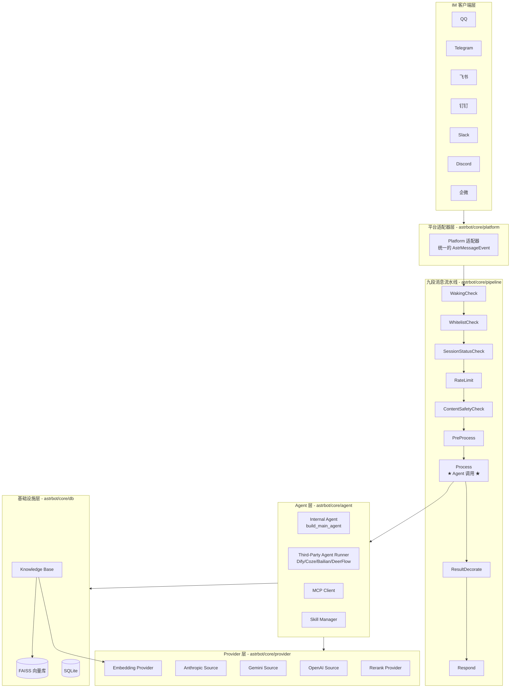
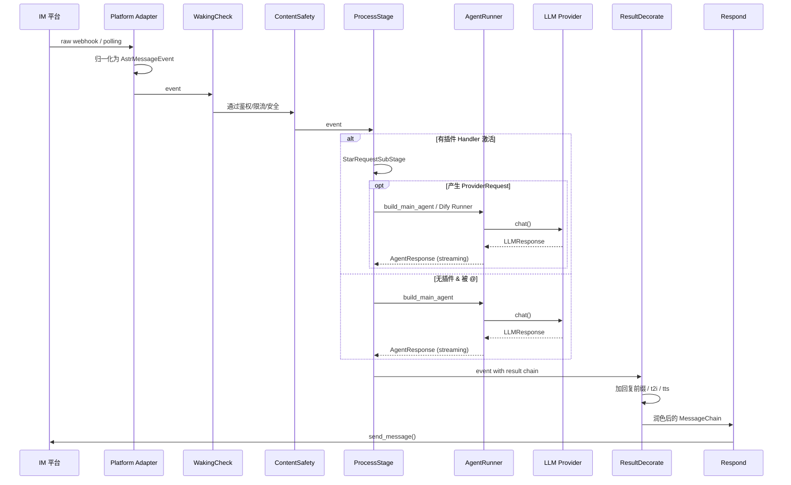
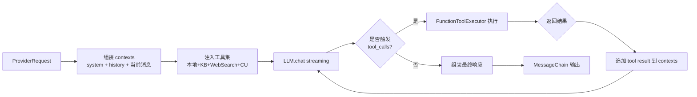
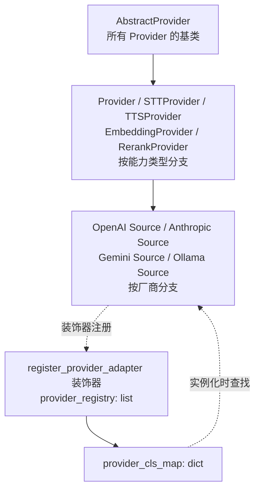
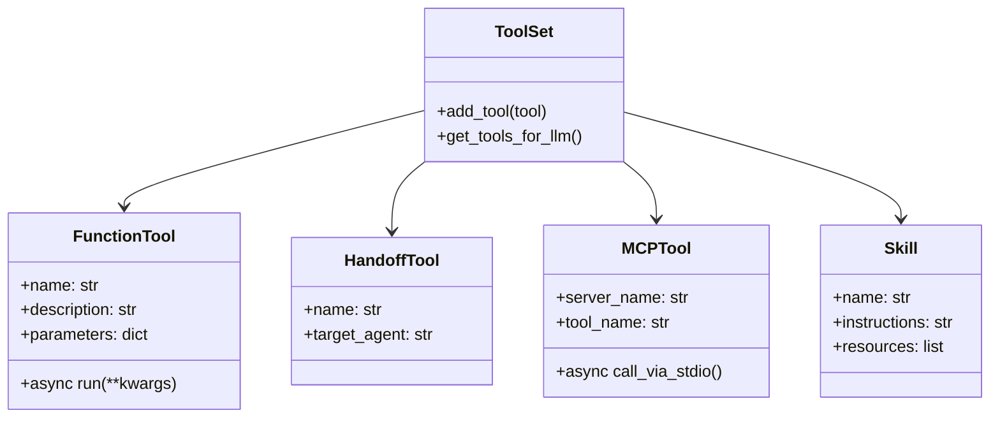
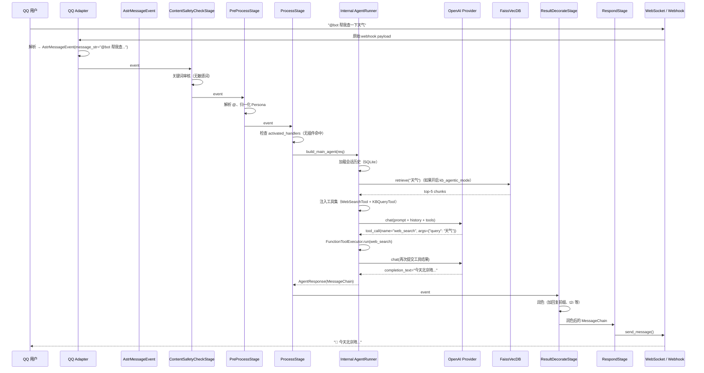

## 引子：把 LLM Agent 塞进聊天软件，远比想象中难

当你想把一个 LLM Agent 接入 QQ 群、飞书工作台或者 Telegram 时，很快就会撞到一堵墙：

- **协议碎片化**：QQ OneBot v11、飞书开放平台、Telegram Bot API、Slack Events API —— 每家一套鉴权、流控、消息类型，**没有统一的「MessageEvent」语义**。
- **Agent 运行模式的分裂**：你想让 LLM 直接对话？想把请求转发到 Dify / Coze 工作流？想让本地 ReAct 循环带工具？三种模式在工程上是三套代码。
- **多模态消息解析**：一张图片可能来自 URL、本地路径、Base64、forward 嵌套；一段录音可能附带 ogg/mp3/wav；引用消息里又嵌套图片。这些都需要在进入 LLM 之前**归一化**。
- **可观测性与插件生态**：Agent 跑飞了需要日志；想加一个「每日一句诗词」功能得让第三方开发者能接入；插件之间还得有优先级和事件钩子。

**AstrBot**（[AstrBotDevs/AstrBot](https://github.com/AstrBotDevs/AstrBot)）是一个 35k 星的国产开源 IM Agent 全栈平台，它用一套清晰的「九段流水线 + 三层 Provider + 双模式 Agent + 平台适配器」架构，把这些碎片化问题系统性地收口。本文基于 master 分支（commit 至 2026-06-22）对其源码做一次端到端深读。

## 项目定位与核心价值

**一句话定义**：AstrBot 是一个对接主流即时通讯平台的 LLM Agent 框架，把消息接收、权限/速率/安全检查、Agent 调用、结果润色、消息发送抽象成可插拔的 Pipeline。

| 维度 | 指标 |
|------|------|
| GitHub | [AstrBotDevs/AstrBot](https://github.com/AstrBotDevs/AstrBot) |
| ⭐ Stars | 35,205 |
| 🍴 Forks | 2,434 |
| 主语言 | Python（596 个 .py 文件） |
| 许可证 | AGPL-3.0 |
| 最近提交 | 2026-06-22 |
| 部署方式 | uv / Docker / Docker Compose / Replit / AUR / RainYun 一键云部署 |
| 平台覆盖 | QQ、OneBot v11、Telegram、企微、公众号、飞书、钉钉、Slack、Discord、LINE、Satori、KOOK、Misskey、Mattermost 等 15+ 官方适配器 |
| 模型服务 | OpenAI / Anthropic / Gemini / Ollama / DeepSeek / 智谱 等 |
| 第三方 Agent 平台 | Dify、Coze、阿里云百炼、DeerFlow |

> **能力矩阵**（来自 README）：LLM 多轮对话 + 多模态 + Agent + MCP + Skills + Knowledge Base + Persona + 自动上下文压缩 + Agent Sandbox + WebUI + Web ChatUI + i18n。

AstrBot 与 LangChain / AutoGen / CrewAI 这种「通用 Agent 框架」的差异在于：**它的「Client」不是 SDK 调用方，而是聊天软件用户**。所有架构设计都以「群聊/私聊消息事件」作为第一公民，而不是 `agent.run(query)` 函数调用。

## 整体架构：四层 + 九段流水线

下图是 AstrBot 顶层架构（**实际从源码 `astrbot/core/` 目录抽象而来，非示意图**）：



**四层职责**：

| 层 | 模块 | 职责 |
|----|------|------|
| 平台适配器层 | `astrbot/core/platform/` | 把 QQ/Telegram/飞书/钉钉 等异构消息归一化成 `AstrMessageEvent`，向上层屏蔽协议差异 |
| 流水线层 | `astrbot/core/pipeline/` | **九段有序 Stage**，对每个消息事件做统一的「唤醒→鉴权→限流→安全→预处理→处理→润色→发送」 |
| Agent 层 | `astrbot/core/agent/` | Internal ReAct Agent（自建）+ Third-Party Agent Runner（Dify/Coze/Bailian/DeerFlow 适配）+ MCP Client + Skill Manager |
| Provider 层 | `astrbot/core/provider/sources/` | **可插拔的 LLM/Embedding/Rerank Provider**，目前支持 OpenAI / Anthropic / Gemini / Ollama 等 |

最关键的设计是：**消息事件是流水线驱动的，不是 Agent 调用的产物**。LLM Agent 只是流水线第七段「ProcessStage」里的一种执行模式，与「插件 Handler」并行触发。

## 核心引擎一：九段流水线

**源码位置**：`astrbot/core/pipeline/stage_order.py:5`

```python
# 来自 astrbot/core/pipeline/stage_order.py:5
STAGES_ORDER = [
    "WakingCheckStage",        # 检查是否需要唤醒（@机器人、唤醒前缀）
    "WhitelistCheckStage",     # 检查是否在群聊/私聊白名单
    "SessionStatusCheckStage", # 检查会话是否整体启用
    "RateLimitStage",          # 检查会话是否超过频率限制
    "ContentSafetyCheckStage", # 检查内容安全（关键词 + AI 审核）
    "PreProcessStage",         # 预处理（消息归一化、Persona 注入等）
    "ProcessStage",            # 交由 Stars 处理（插件）或 LLM 调用
    "ResultDecorateStage",     # 处理结果（回复前缀、t2i、tts）
    "RespondStage",            # 发送消息
]
```

流水线注册通过 `@register_stage` 装饰器实现（`astrbot/core/pipeline/stage.py:8`）：

```python
# 来自 astrbot/core/pipeline/stage.py:8
def register_stage(cls):
    registered_stages.append(cls)
    return cls


class Stage(abc.ABC):
    @abc.abstractmethod
    async def initialize(self, ctx: PipelineContext) -> None: ...

    @abc.abstractmethod
    async def process(self, event: AstrMessageEvent) -> None | AsyncGenerator[None]:
        # 返回 None 表示不需要继续处理
        # 返回 AsyncGenerator 表示可以 yield 多次（流式响应）
        ...
```

### 阶段间数据流

每个 Stage 共享一个 `PipelineContext`（配置 + 插件管理器）和一个 `AstrMessageEvent`（消息事件）。Stage 之间通过 `event.set_extra()` / `event.get_extra()` 传递数据。

**ProcessStage 完整源码**（`astrbot/core/pipeline/process_stage/stage.py:13`）展示了流水线的核心控制流：

```python
# 来自 astrbot/core/pipeline/process_stage/stage.py:13
@register_stage
class ProcessStage(Stage):
    async def initialize(self, ctx):
        self.ctx = ctx
        self.agent_sub_stage = AgentRequestSubStage()
        await self.agent_sub_stage.initialize(ctx)
        self.star_request_sub_stage = StarRequestSubStage()
        await self.star_request_sub_stage.initialize(ctx)

    async def process(self, event):
        # 1. 插件 Handler 优先（如果激活）
        activated_handlers = event.get_extra("activated_handlers", [])
        if activated_handlers:
            async for resp in self.star_request_sub_stage.process(event):
                if isinstance(resp, ProviderRequest):
                    event.set_extra("provider_request", resp)
                    async for _ in self.agent_sub_stage.process(event):
                        yield
                else:
                    yield

        # 2. LLM 调用（如果开启）
        if not self.ctx.astrbot_config["provider_settings"].get("enable", True):
            return
        if (not event._has_send_oper
            and event.is_at_or_wake_command
            and not event.call_llm):
            if (event.get_result() and not event.is_stopped()) or not event.get_result():
                async for _ in self.agent_sub_stage.process(event):
                    yield
```

**关键设计**：

1. **插件优先于 LLM**：如果某个插件 Handler（`@filter` 装饰的函数）已经处理了消息并产生 `ProviderRequest`，Agent 会接管；否则只有「被 @ 或唤醒」才进入 LLM 分支。
2. **AsyncGenerator 流式响应**：通过 `async for ... yield` 让上层可以一边生成一边发送，无需等完整响应。
3. **`has_send_oper` 标记**：插件如果已经直接发送了消息（如 `event.send()`），流水线不再触发 LLM 重复响应。

### Stage 执行时序



**对比同类项目**：LangChain 的 `Chain.run()` 把所有逻辑塞在一个图里；AutoGen 的 `GroupChat` 把消息路由逻辑放在 `GroupChatManager` 中。AstrBot 的优势是**Stage 之间完全解耦**，可以单独替换 RateLimit 算法或新增审计 Stage，无需修改其他阶段。

## 核心引擎二：Internal Agent（自建 ReAct）

**源码位置**：`astrbot/core/astr_main_agent.py:1322`

`build_main_agent()` 是 Internal Agent 的入口工厂，它把消息事件 + Provider + 配置 装配成一个 `AgentRunner`：

```python
# 来自 astrbot/core/astr_main_agent.py:1322（精简）
async def build_main_agent(
    *,
    event: AstrMessageEvent,
    plugin_context: Context,
    config: MainAgentBuildConfig,
    provider: Provider | None = None,
    req: ProviderRequest | None = None,
    apply_reset: bool = True,
) -> MainAgentBuildResult | None:
    # 1. 选择 Provider（多模型路由 + 图像聊天回退）
    provider = provider or _select_provider(event, plugin_context)
    if provider is None:
        return None

    # 2. 构造 ProviderRequest（含 prompt / image_urls / audio_urls / contexts）
    if req is None:
        req = ProviderRequest(prompt=event.message_str, image_urls=[], audio_urls=[])
        # ... 处理多模态附件、引用消息、图片压缩
        for comp in event.message_obj.message:
            if isinstance(comp, Image):
                path = await comp.convert_to_file_path()
                image_path = await _compress_image_for_provider(path, ...)
                req.image_urls.append(image_path)
            elif isinstance(comp, Record):
                audio_path = await comp.convert_to_file_path()
                req.audio_urls.append(audio_path)
            elif isinstance(comp, File):
                # 提取文件 -> LLM 可读
                ...
        conversation = await _get_session_conv(event, plugin_context)
        req.conversation = conversation
        req.contexts = json.loads(conversation.history)

    # 3. 知识库增强（如果开启 kb_agentic_mode）
    await _apply_kb(event, req, plugin_context, config)

    # 4. Web Search 工具注入
    await _apply_web_search_tools(event, req, plugin_context)

    # 5. Computer Use 工具注入（sandbox 或 local）
    if config.computer_use_runtime == "sandbox":
        _apply_sandbox_tools(config, req, req.session_id)

    # 6. 构造 AgentRunner 并 reset
    agent_runner = AgentRunner()
    agent_runner.reset(provider=provider, ...)
    return MainAgentBuildResult(agent_runner=agent_runner, req=req, provider=provider)
```

**关键设计**：

1. **多模态统一在 `ProviderRequest`**：图片、音频、文件、引用消息、剪贴板文本全部归一化成 `image_urls` / `audio_urls` / `extra_user_content_parts`。
2. **会话历史从 SQLite 加载**（`_get_session_conv`），以 OpenAI messages 格式注入 `req.contexts`。
3. **KB / Web Search / Computer Use 三类工具按配置动态注入**，而不是 hardcode 在系统 prompt 里。
4. **`MainAgentBuildConfig`** 是不可变的 dataclass，承载所有运行期开关（`max_step` / `tool_call_timeout` / `tool_schema_mode` 等），便于测试和快照。

### Agent 循环拆解



### Tool Schema 双模式

Internal Agent 支持两种工具 schema 模式（`provider_settings.tool_schema_mode`）：

- **`skills_like`**：工具描述被规整成 Anthropic Skills 风格的「Markdown 文档 + 函数签名」，减少 token 消耗，适合工具数量多（50+）的场景。
- **`full`**：直接传 OpenAI/Anthropic 原生 function calling schema，适合工具数量少的场景。

切换示例（`astrbot/core/provider/sources/openai_source.py` 实际使用）：

```python
# 来自 astrbot/core/pipeline/process_stage/method/agent_sub_stages/internal.py:30
if self.tool_schema_mode not in ("skills_like", "full"):
    logger.warning("Unsupported tool_schema_mode: %s, fallback to skills_like", self.tool_schema_mode)
    self.tool_schema_mode = "full"
```

## 核心引擎三：Third-Party Agent Runner

**源码位置**：`astrbot/core/agent/runners/`

Internal Agent 解决「本地 ReAct 循环」，但很多团队已经在用 Dify/Coze/Bailian 这种 SaaS 工作流平台。AstrBot 的答案是 **`BaseAgentRunner` 抽象接口**（`astrbot/core/agent/runners/base.py:18`）：

```python
# 来自 astrbot/core/agent/runners/base.py:18
class BaseAgentRunner(T.Generic[TContext]):
    @abc.abstractmethod
    async def reset(self, run_context, agent_hooks, **kwargs) -> None: ...

    @abc.abstractmethod
    async def step(self) -> AsyncGenerator[AgentResponse, None]: ...

    @abc.abstractmethod
    async def step_until_done(self, max_step: int) -> AsyncGenerator[AgentResponse, None]: ...

    @abc.abstractmethod
    def done(self) -> bool: ...

    @abc.abstractmethod
    def get_final_llm_resp(self) -> LLMResponse | None: ...
```

每个第三方平台都实现这个接口：`DifyAgentRunner` / `CozeAgentRunner` / `DashScopeAgentRunner` / `DeerFlowAgentRunner`。

### Dify Runner 示例

```python
# 来自 astrbot/core/agent/runners/dify/dify_agent_runner.py:22
class DifyAgentRunner(BaseAgentRunner[TContext]):
    async def reset(self, request, run_context, agent_hooks, provider_config, **kwargs):
        self.req = request
        self.streaming = kwargs.get("streaming", False)
        self.api_key = provider_config.get("dify_api_key", "")
        self.api_base = provider_config.get("dify_api_base", "https://api.dify.ai/v1")
        self.api_type = provider_config.get("dify_api_type", "chat")
        self.api_client = DifyAPIClient(self.api_key, self.api_base)

    async def step(self):
        if self._state == AgentState.IDLE:
            await self.agent_hooks.on_agent_begin(self.run_context)
        self._transition_state(AgentState.RUNNING)
        try:
            async for response in self._execute_dify_request():
                yield response
        finally:
            await self.api_client.close()
```

**关键设计**：

1. **状态机显式建模**：`AgentState` 是 `IDLE → RUNNING → DONE / ERROR` 的有限状态机，每次 transition 都有日志。
2. **Streaming 与 Blocking 同一接口**：`step()` 返回 `AsyncGenerator`，Dify 用 SSE 流式、Coze 用 WebSocket 都能适配。
3. **Hooks 解耦可观测性**：`on_agent_begin` / `on_agent_step` / `on_agent_end` 让 LogBroker / Metrics 自动注入，无需修改 Runner 本身。
4. **多模态附件透传**：`_upload_image_for_dify()` 把本地图片转 Dify `local_file`，避免把 base64 塞进 prompt 浪费 token。

## Provider 三层抽象

**源码位置**：`astrbot/core/provider/`

LLM/Embedding/Rerank 是异构服务，但调用模式相似。AstrBot 用三层抽象 + 装饰器注册实现可插拔：



**核心实现**（`astrbot/core/provider/provider.py:24`）：

```python
# 来自 astrbot/core/provider/provider.py:24
class AbstractProvider(abc.ABC):
    def __init__(self, provider_config: dict):
        self.model_name = ""
        self.provider_config = provider_config

    def meta(self) -> ProviderMeta:
        meta_data = provider_cls_map.get(self.provider_config["type"])
        meta = ProviderMeta(
            id=self.provider_config.get("id", "default"),
            model=self.get_model(),
            type=self.provider_config["type"],
            provider_type=meta_data.provider_type,
        )
        return meta


class Provider(AbstractProvider):
    """Chat Provider"""
    @abc.abstractmethod
    def get_current_key(self) -> str: ...
    @abc.abstractmethod
    async def get_models(self) -> list[str]: ...
    @abc.abstractmethod
    async def text_chat(self, prompt, session_id, image_urls, **kwargs) -> AsyncGenerator[LLMResponse, None]: ...
```

**注册装饰器**（`astrbot/core/provider/register.py:11`）：

```python
# 来自 astrbot/core/provider/register.py:11
def register_provider_adapter(
    provider_type_name: str,
    desc: str,
    provider_type: ProviderType = ProviderType.CHAT_COMPLETION,
    default_config_tmpl: dict | None = None,
    provider_display_name: str | None = None,
):
    def decorator(cls):
        if provider_type_name in provider_cls_map:
            raise ValueError(f"Provider {provider_type_name} already registered")
        pm = ProviderMetaData(id="default", model=None, type=provider_type_name,
                              desc=desc, provider_type=provider_type,
                              cls_type=cls, default_config_tmpl=default_config_tmpl,
                              provider_display_name=provider_display_name)
        provider_registry.append(pm)
        provider_cls_map[provider_type_name] = pm
        return cls
    return decorator
```

**使用示例**：

```python
@register_provider_adapter(
    "openai",
    desc="OpenAI / 兼容 OpenAI 协议的模型服务",
    provider_type=ProviderType.CHAT_COMPLETION,
    default_config_tmpl={
        "type": "openai",
        "enable": False,
        "id": "openai",
        "base_url": "https://api.openai.com/v1",
        "key": ["your-api-key"],
        "model": "gpt-4o-mini",
    },
    provider_display_name="OpenAI",
)
class OpenAISource(Provider):
    async def text_chat(self, prompt, **kwargs) -> AsyncGenerator[LLMResponse, None]:
        client = OpenAI(api_key=self.get_current_key(), base_url=self.provider_config["base_url"])
        stream = client.chat.completions.create(
            model=self.provider_config["model"],
            messages=self._build_messages(kwargs["req"]),
            stream=True,
        )
        for chunk in stream:
            yield LLMResponse(role="assistant", completion_text=chunk.choices[0].delta.content or "")
```

**关键设计**：

1. **`ProviderType` 枚举**区分能力：`CHAT_COMPLETION` / `SPEECH_TO_TEXT` / `TEXT_TO_SPEECH` / `EMBEDDING` / `RERANK`，每种能力的最小接口不同（chat 需要 stream，embedding 需要 batch）。
2. **`provider_cls_map` 全局单例**：避免每次创建 Provider 都重新解析配置。
3. **`default_config_tmpl`**：WebUI 配置面板直接用这个模板渲染表单，新增 Provider 只需实现类 + 注册一行装饰器。
4. **`key: list[str]` 多 Key 轮询**：同一个 Provider 配置多个 API Key，自动 round-robin 防限流。

## 工具系统：本地工具 + MCP + Skills

### 三类工具并存

AstrBot 把「工具」拆成三个相互正交的概念：



- **`FunctionTool`**：本地 Python 函数，最常用的工具类型（如 `KnowledgeBaseQueryTool` / `WebSearchTool` / `ExecuteShellTool`）。
- **`HandoffTool`**：把当前对话移交给另一个 Agent（AstrBot 的 multi-agent 路由靠这个）。
- **`MCPTool`**：通过 stdio / SSE 连接外部 MCP Server，复用 Anthropic MCP 生态。
- **`Skill`**：Anthropic Skills 风格的「能力描述文档」，不是函数调用而是 prompt 注入。适合「你是一个 SQL 专家」这类长上下文知识。

### MCP 集成

**源码位置**：`astrbot/core/agent/mcp_client.py`

MCP Client 用 stdio 启动外部 MCP Server，把它的 `tools/list` 转换成 AstrBot 的 `MCPTool`，LLM 调用时把工具调用转回 MCP `tools/call`。这一层抽象让 AstrBot 既能用本地 Python 工具，也能无缝接入 Anthropic MCP 生态。

### Skills 与 Tools 的本质区别

很多新人会把 Skills 和 Tools 混为一谈。AstrBot 的区分很清晰：

| 维度 | Tool | Skill |
|------|------|-------|
| 触发方式 | LLM 主动 function call | prompt 注入，LLM 读到 skill 文档后自然遵循 |
| 执行体 | 可执行 Python 代码 | 自然语言指令 + 资源文件（脚本/SQL/文档） |
| Token 成本 | 每次都在 system prompt 注入 schema | 可按需加载（`SkillManager.build_skills_prompt` 拼接） |
| 典型场景 | 「查天气」「执行 shell」 | 「SQL 优化专家」「周报生成模板」 |

源码（`astrbot/core/skills/skill_manager.py:1`）展示了 Skills 是带元数据 + 资源的目录结构：

```python
# 来自 astrbot/core/skills/skill_manager.py 概念示意
class SkillInfo(BaseModel):
    name: str
    description: str
    instructions: str  # 注入到 system prompt
    resources: list[str]  # 路径列表：脚本/SQL/文档
```

## 记忆与知识库

AstrBot 的「Memory」分三层：

| 层 | 实现 | 用途 |
|----|------|------|
| 会话历史 | SQLite `Conversation` 表 | 短期上下文（OpenAI `messages` 格式），按 `session_id` 检索 |
| Knowledge Base | **FAISS 向量库** + Document Storage（SQLite） | 长期 RAG，按 `metadata_filters` 过滤 |
| Skills | 文件系统 + Markdown | 长期「能力描述」，prompt 注入 |

### FAISS 向量库实现

**核心代码**（`astrbot/core/db/vec_db/faiss_impl/vec_db.py:23`）：

```python
# 来自 astrbot/core/db/vec_db/faiss_impl/vec_db.py:23
class FaissVecDB(BaseVecDB):
    def __init__(self, doc_store_path, index_store_path, embedding_provider, rerank_provider=None):
        self.doc_store_path = doc_store_path
        self.index_store_path = index_store_path
        self.embedding_provider = embedding_provider
        self.document_storage = DocumentStorage(doc_store_path)
        self.embedding_storage = EmbeddingStorage(embedding_provider.get_dim(), index_store_path)
        self.rerank_provider = rerank_provider

    async def insert(self, content: str, metadata=None, id=None) -> int:
        str_id = id or str(uuid.uuid4())
        vector = await self.embedding_provider.get_embedding(content)
        vector = np.array(vector, dtype=np.float32)
        int_id = await self.document_storage.insert_document(str_id, content, metadata)
        await self.embedding_storage.insert(vector, int_id)
        return int_id

    async def retrieve(self, query: str, k=5, fetch_k=20, rerank=False, metadata_filters=None):
        embedding = await self.embedding_provider.get_embedding(query)
        scores, indices = await self.embedding_storage.search(
            vector=np.array([embedding]).astype("float32"),
            k=fetch_k if metadata_filters else k,
        )
        if len(indices[0]) == 0 or indices[0][0] == -1:
            return []
        # normalize scores: 内积距离转 [0,1] 相似度
        scores[0] = 1.0 - (scores[0] / 2.0)
        fetched_docs = await self.document_storage.get_documents(metadata_filters or {}, ids=indices[0])
        result_docs = []
        idx_pos = {doc["id"]: idx for idx, doc in enumerate(fetched_docs)}
        for i, indice_idx in enumerate(indices[0]):
            pos = idx_pos.get(indice_idx)
            if pos is None: continue
            score = scores[0][i]
            result_docs.append(Result(similarity=float(score), data=fetched_docs[pos]))
        top_k = result_docs[:k]
        if rerank and self.rerank_provider:
            documents = [doc.data["text"] for doc in top_k]
            reranked = await self.rerank_provider.rerank(query, documents)
            reranked = sorted(reranked, key=lambda x: x.relevance_score, reverse=True)
            top_k = [top_k[r.index] for r in reranked]
        return top_k
```

**关键设计**：

1. **存储分层**：FAISS 只存向量 ID → SQLite 存文本和元数据，两者通过 `int_id` 关联。删除/更新只需删两边。
2. **`fetch_k` + `metadata_filters`**：先取 `fetch_k` 个向量粗排，再按 metadata 过滤，最后取 top-k，避免 metadata 过滤导致相似度崩塌。
3. **Rerank 可选**：如果传了 `RerankProvider`，在向量召回后再用 Cross-Encoder 精排，对中文长文档显著提升。
4. **`BaseVecDB` 抽象**：`faiss_impl` 只是默认实现，未来可插 Qdrant / Milvus / pgvector。

## 端到端数据流

把上面所有模块串起来，看一条 QQ 群消息走完全链路的过程：



**关键观察**：

1. **阶段间没有循环依赖**：每个 Stage 只读 `event.get_extra()` 拿上游数据，写 `event.set_extra()` 给下游。
2. **AgentRunner 是被驱动的，不是主循环**：`AgentRunner` 只负责「拿到 ProviderRequest 就跑一次」，流水线负责调度。
3. **KB 召回和工具调用是同一抽象**：都通过 `ToolSet` 注入到 `req.func_tool`，LLM 透明选择。
4. **流式响应贯穿到底**：`AsyncGenerator[None]` + `AsyncGenerator[LLMResponse]` 让用户能逐字看到打字效果。

## 与同类项目对比

### vs. LangChain（通用框架）

| 维度 | LangChain | AstrBot |
|------|-----------|---------|
| 第一公民 | Python 函数 `chain.run()` | IM 消息事件 `AstrMessageEvent` |
| 流水线模型 | LCEL `Runnable` 链式组合 | 九段有序 Stage |
| 工具抽象 | `BaseTool` | `FunctionTool` + `MCPTool` + `Skill` |
| 知识库 | 集成 30+ 向量库 | 自带 FAISS，`BaseVecDB` 可扩展 |
| 平台对接 | 无（用户自己接） | 15+ IM 官方适配器 |
| 可观测性 | LangSmith（付费） | 内置 WebUI + LogBroker |

**核心差异**：LangChain 是「LLM 应用 SDK」，AstrBot 是「IM Agent 服务端」。如果你的产品形态是聊天软件内的 Bot，选 AstrBot；如果是自定义 Web/CLI 应用，选 LangChain。

### vs. Dify（可视化 Agent 平台）

| 维度 | Dify | AstrBot |
|------|------|---------|
| 形态 | SaaS + 自托管 Web 平台 | Python 进程 + WebUI |
| 工作流编排 | 拖拽 DAG | 代码 + YAML 配置 |
| 消息接入 | API endpoint | 15+ IM 平台 webhook |
| Agent 实现 | 内置 ReAct / Function Calling | Internal ReAct + 接入 Dify/Coze 作为 Runner |
| 知识库 | 内置完整 RAG | FAISS + SQLite，可对接外部 |
| 目标用户 | 产品经理 / 业务方 | 开发者 / SRE |

**核心差异**：Dify 让非程序员能搭 Agent，但接进 QQ 群还得自己写适配器；AstrBot 反过来，开发者直接拿到开箱即用的 Bot 框架，要复杂工作流时反向调用 Dify 作为 `BaseAgentRunner`。

### vs. NoneBot / Koishi（聊天机器人框架）

| 维度 | NoneBot 2 | AstrBot |
|------|-----------|---------|
| 平台支持 | OneBot v11 为主 | 15+ 平台官方适配 |
| LLM 集成 | 第三方插件 | 内置 Provider + Agent |
| 知识库 | 第三方插件 | 内置 FAISS |
| 架构 | 事件驱动 + 插件 | 九段流水线 + 插件 |
| WebUI | 第三方插件 | 内置 |

**核心差异**：NoneBot 是「通用聊天机器人框架」，LLM 只是插件之一；AstrBot 把 LLM Agent 作为第一公民，IM 适配是基础设施。

## 优缺点分析

| 维度 | 优势 | 代价 |
|------|------|------|
| **架构简洁性** | 九段 Stage 完全解耦，单独替换 RateLimit 或新增审计无需改其他模块 | Stage 数量较多（9 个），新人需 1-2 天才能理清触发顺序 |
| **扩展性** | Provider / Agent / Tool / Platform 四类扩展点都用装饰器或抽象基类，新增一个厂商实现 ≤ 100 行代码 | 跨抽象层组合（如「飞书 + Dify + FAISS + Web Search」）的文档集中在 `astr_main_agent.build_main_agent` 一个函数里，改动容易牵一发动全身 |
| **易用性** | uv 一键安装、Docker Compose 开箱即用、WebUI 配置 Provider 一行搞定 | 配置项极多（provider_settings / platform_settings / kb_settings / agent_sandbox 等十几个嵌套字典），报错信息对用户不友好 |
| **性能** | Pipeline 是纯 async 内存操作，无外部 RPC 开销；Streaming 端到端无缓冲 | FAISS 单机内存索引，超过 100 万文档需要替换 `BaseVecDB` 实现 |
| **复杂度** | Provider / Agent / Stage 三层抽象各自独立，单独测试容易 | Internal Agent 状态机 + Provider 流式 + Streaming Stage 的交互在出错时栈追踪难读 |
| **维护性** | 模块边界清晰（pipeline / agent / provider / platform / db 各管一摊） | AGPL-3.0 许可证对企业内嵌有限制；596 个 .py 文件跨多个职责，新人入手成本高 |

## 实践 / 部署

### 一键启动

```bash
# 方式一：uv（推荐）
uv tool install astrbot --python 3.12
astrbot init
astrbot run

# 方式二：Docker Compose
git clone https://github.com/AstrBotDevs/AstrBot.git
cd AstrBot
docker compose up -d
# 访问 http://localhost:6185 进入 WebUI
```

### 配置文件示例（`data/config/cmd_config.json`）

```json
{
  "provider_settings": {
    "enable": true,
    "streaming_response": true,
    "max_agent_step": 30,
    "tool_call_timeout": 60,
    "tool_schema_mode": "skills_like"
  },
  "provider": [
    {
      "id": "openai-main",
      "type": "openai",
      "enable": true,
      "base_url": "https://api.openai.com/v1",
      "key": ["sk-xxx"],
      "model": "gpt-4o-mini"
    }
  ],
  "platform": [
    {
      "id": "telegram-bot",
      "type": "telegram",
      "enable": true,
      "token": "YOUR_BOT_TOKEN"
    }
  ]
}
```

### 写一个插件（Hello World）

```python
# 保存到 data/plugins/hello_world/main.py
from astrbot.api import star
from astrbot.api.event import AstrMessageEvent
from astrbot.api import llm_tool


class HelloPlugin(star.Star):
    """AstrBot 插件示例：自动回复"""

    @star.filter("你好")
    async def on_hello(self, event: AstrMessageEvent):
        """匹配「你好」关键词时触发"""
        yield event.plain_result("你好呀！我是基于 AstrBot 的 Bot 🚀")

    @llm_tool(name="get_current_time")
    async def get_current_time(self):
        """获取当前时间，LLM 可调用"""
        from datetime import datetime
        return datetime.now().strftime("%Y-%m-%d %H:%M:%S")
```

```bash
# 把目录放到 data/plugins/ 后重启 AstrBot
astrbot run
# 在 Telegram 给 bot 发「你好」试试
```

### 用 Docker 跑生产环境

```yaml
# docker-compose.yml
version: "3.8"
services:
  astrbot:
    image: soulter/astrbot:latest
    container_name: astrbot
    restart: unless-stopped
    ports:
      - "6185:6185"   # WebUI
      - "6195:6195"   # WebChat
    volumes:
      - ./data:/AstrBot/data   # 持久化配置、插件、知识库
    environment:
      - TZ=Asia/Shanghai
```

```bash
docker compose up -d
# 等待 30s 后访问 http://localhost:6185 配置 Provider 和平台
```

## 趋势与总结

### 三个趋势判断

1. **聊天平台 Agent 框架正在「垂直化」**：通用 Agent 框架（LangChain/AutoGen）解决不了 IM 协议碎片化、消息归一化、群聊/私聊权限的问题；类似 AstrBot 这种「IM Agent 一体化」会继续涌现。趋势是**把 LLM 当作「消息处理函数」**，而不是「应用入口」。
2. **第三方 Agent 平台（Dify/Coze）会变成「被调用方」而非「入口」**：当用户已经在 AstrBot 这类 IM 框架里沉淀了会话历史、用户画像、KB 之后，复杂工作流会以 `BaseAgentRunner` 的形式被反向调用。Dify 已经支持作为外部 Agent Provider，Coze 跟进。
3. **Skills vs. Tools 的二元化会成为共识**：工具调用适合「短指令+确定行为」，Skills 适合「长上下文+开放生成」。AstrBot 是目前少数把两者显式分开的框架，预计 LangChain / LlamaIndex 后续也会跟进类似抽象。

### 工程经验提炼

- **消息事件是 Agent 框架的最佳抽象单位**，比 `agent.run(query)` 更适合多用户、多会话、多权限场景。
- **流水线比图更适合 IM 场景**：DAG 表达能力强但调试复杂，有序 Stage 牺牲表达换可读性，对 IM 这种「线性流」友好。
- **Provider 三层抽象 + 装饰器注册** 是可复用模式：抽象基类（能力）→ 子类（厂商）→ 装饰器（注册），新增厂商 ≤ 100 行。
- **向量库 + 关系存储分层**：FAISS 只存向量，文档存 SQLite，两者用 `int_id` 关联，删除/更新两边同步。
- **流式响应必须贯穿到底**：`AsyncGenerator[None]` 让 Stage 之间无缓冲，UX 才有「打字机」效果。

### 适用场景

✅ **推荐**：想在 QQ 群、飞书工作台、Telegram 部署生产级 Bot 的团队；想用 Dify/Coze 工作流但不想写 IM 适配器的开发者；需要可观测、可审计、可扩展的内部 AI 助手。

⚠️ **谨慎**：纯 API 服务（无 IM 对接）—— 直接用 LangChain；企业内嵌应用 —— 评估 AGPL-3.0 合规性；超大知识库（> 100 万文档）—— 替换 `BaseVecDB` 为 Qdrant/Milvus。

❌ **不推荐**：纯命令行工具、纯 Web 应用（用 LangChain / Vercel AI SDK 更轻）、单机离线玩具（直接调 OpenAI SDK 就够了）。

## 附录：关键资源

| 资源 | 链接 |
|------|------|
| GitHub | <https://github.com/AstrBotDevs/AstrBot> |
| 官方文档 | <https://astrbot.app/> |
| 博客 | <https://blog.astrbot.app/> |
| Roadmap | <https://astrbot.featurebase.app/roadmap> |
| 插件市场 | <https://astrbot.app/plugin> |
| Docker Hub | <https://hub.docker.com/r/soulter/astrbot> |
| License | AGPL-3.0 |
| 主语言 | Python 3.10+ |
| 社区 | QQ 群 / GitHub Discussions / Email community@astrbot.app |