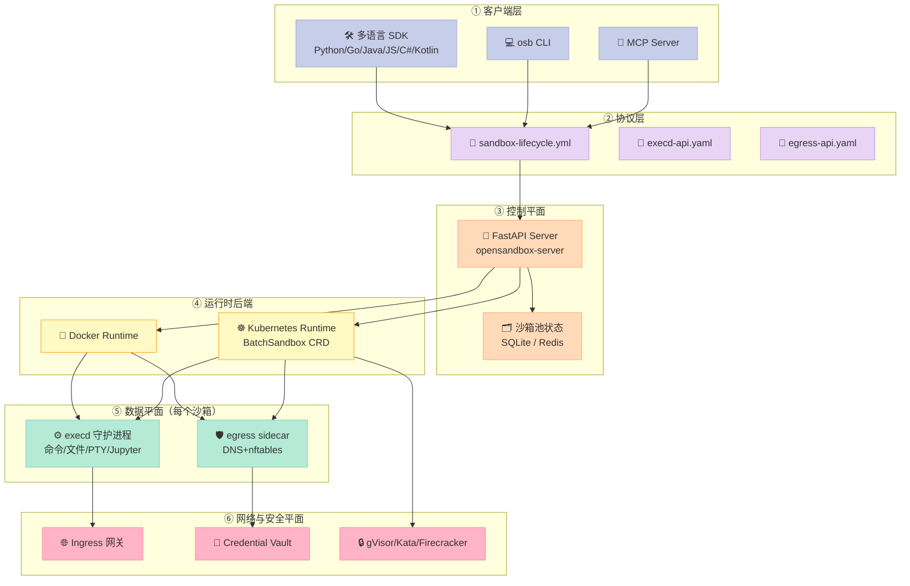
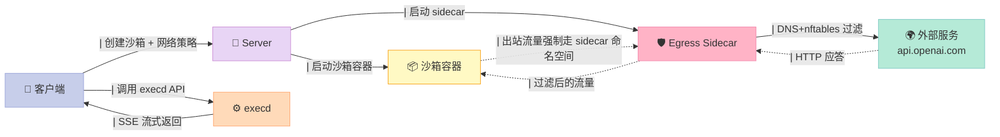
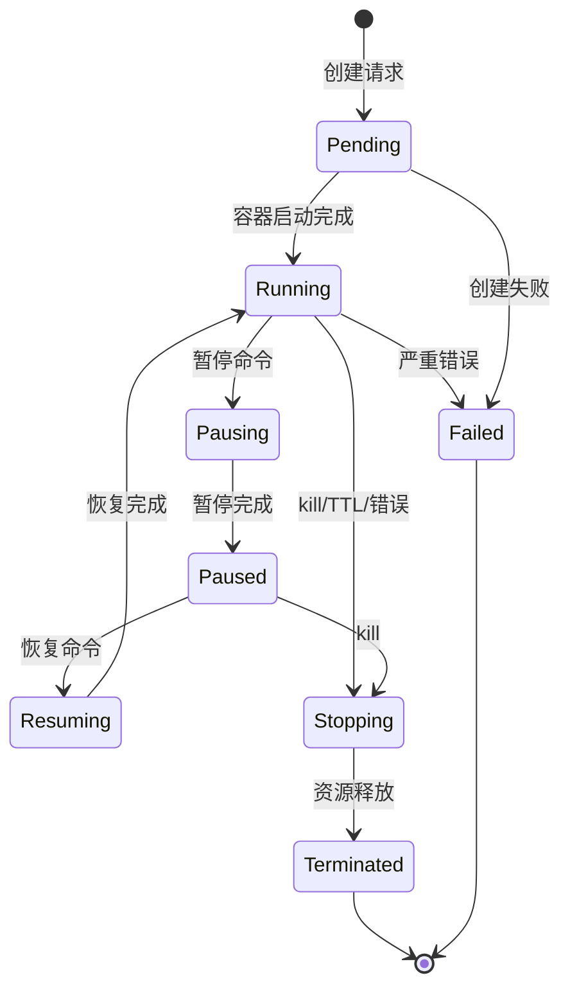
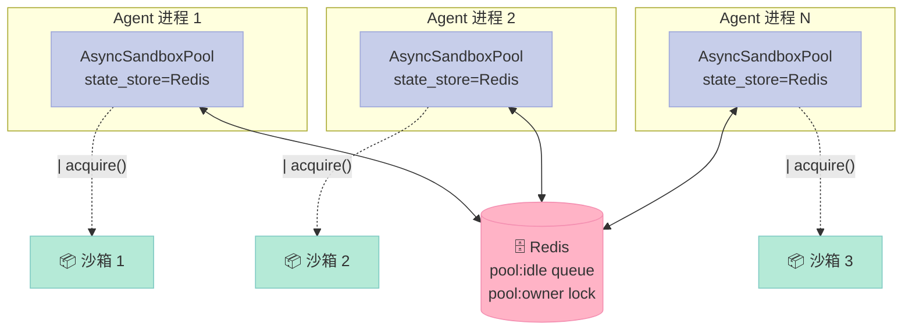
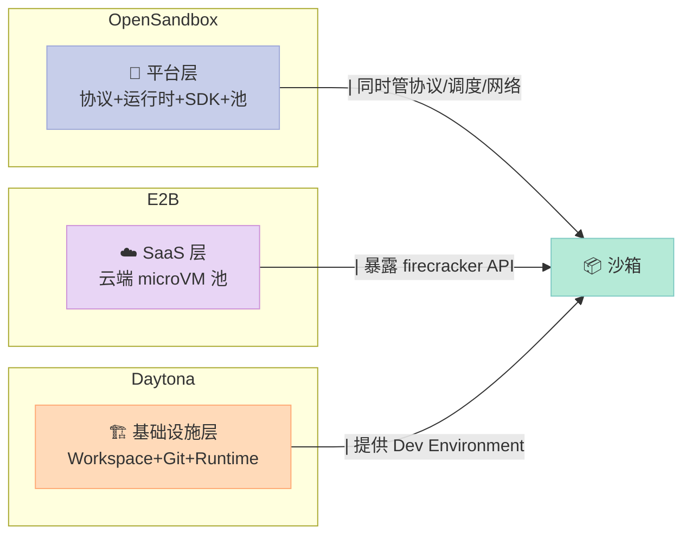

> 当 Agent 开始跑 `rm -rf /` 或者调用 `curl https://attacker.com` 时，你需要的不是更严格的 prompt，而是**一个隔离的执行环境**——OpenSandbox 是阿里给出的工程答案。

---

## 一、开篇：为什么 AI Agent 离不开沙箱

Coding Agent、GUI Agent、Computer-Use、Code Interpreter……这些 2026 年最火的应用形态，背后都有一个共同的隐忧：**AI 生成的代码必须真实运行**。

但"真实运行"意味着：

- **文件系统破坏**：Claude Code 误删 `~/.ssh/`，整个开发环境报废
- **网络外泄**：Prompt Injection 诱导 Agent 把 API Key 发到外部服务器
- **资源耗尽**：训练 RL Agent 时，恶意循环把 GPU 跑满
- **并发风暴**：1000 个并发 Agent 同时启动，沙箱启动延迟 30 秒，用户早就流失了

我调研了三个主流开源沙箱：

| 项目 | 定位 | 核心机制 |
|---|---|---|
| **OpenSandbox**（阿里，11.6k⭐） | 通用 AI 沙箱平台 | 容器 + Sidecar 网络隔离 + 客户端池 |
| **E2B**（12.7k⭐） | 云端 code interpreter | Firecracker microVM + 远程托管 |
| **Daytona**（72k⭐） | AI 代码执行基础设施 | 自定义 runtime + Git 工作区 |

[OpenSandbox](https://github.com/opensandbox-group/OpenSandbox) 的独特之处在于：它把**生命周期、协议层、网络层、客户端池**全部开源，并且同时支持 Docker 单机和 Kubernetes 大规模调度。**阿里内部 Coding Agent、Claude Code、Qwen-Code 全部跑在它上面**（见 `examples/` 目录）。

今天这篇文章，我会用源码 + OpenAPI 协议 + 状态机图，把 OpenSandbox 的整个架构讲透。

---

## 二、定位：OpenSandbox 到底是什么

官方原话：

> OpenSandbox is a **general-purpose sandbox platform** for AI applications, offering multi-language SDKs, unified sandbox APIs, and Docker/Kubernetes runtimes for scenarios like Coding Agents, GUI Agents, Agent Evaluation, AI Code Execution, and RL Training.

三个关键判断：

1. **它是平台（platform），不是单一工具**——同时给 Coding Agent、GUI Agent、RL Training 用
2. **多语言 SDK 是头等公民**——Python / JS / TS / Java / Kotlin / C# / Go 七种，协议层用 OpenAPI 定义
3. **运行时可插拔**——同一个 server 进程，可以切 Docker（本地）或 Kubernetes（生产）

最让我惊讶的是它解决的"最后一公里"问题：网络隔离通过一个独立的 **egress sidecar** 实现，进程间不共享网络命名空间；凭证注入通过 **Credential Vault**（透明 MITM）实现，代码里永远看不到真实 API Key。

---

## 三、整体架构：六层分层

OpenSandbox 的 `docs/architecture/index.md` 把整个仓库画成了**六层**：



### 3.1 协议层：`specs/*.yml` 是真理之源

OpenSandbox 把所有 HTTP API 用 OpenAPI 3.1 写到 `specs/` 目录：

```
specs/
├── sandbox-lifecycle.yml    # 沙箱生命周期（创建/暂停/恢复/销毁）
├── execd-api.yaml            # 沙箱内的 execd 守护进程 API
├── egress-api.yaml           # 出站流量策略 API
└── diagnostic-api.yml        # 诊断信息
```

SDK 不直接调 HTTP，而是从这些 OpenAPI 文件**生成 client**（Pydantic 数据模型 + httpx 客户端），再叠加一层手写的 ergonomic wrapper。

### 3.2 控制平面：FastAPI 服务

`server/` 目录下是一个标准的 FastAPI 应用，关键模块：

- `opensandbox_server/api/` — 路由层（lifecycle / proxy / pool / diagnostics）
- `opensandbox_server/services/` — 业务层，**`SandboxService` 接口**是核心
- `opensandbox_server/services/k8s/` — Kubernetes 实现（基于 `BatchSandbox` CRD）
- `opensandbox_server/repositories/` — 持久化（默认 SQLite，可换 Redis）

设计上有两个亮点：

1. **运行时切换是配置而非代码**：`[runtime].type` 配置项决定加载 `DockerSandboxService` 还是 `KubernetesSandboxService`，两个实现都满足同一个 `SandboxService` 接口，API 路由**完全不知道底下是 Docker 还是 K8s**
2. **Async provisioning**：创建是异步的，客户端轮询 `GET /v1/sandboxes/{id}` 或用 SDK 的 `check_ready()`，避免 HTTP 长连接

### 3.3 数据平面：execd 守护进程

每个沙箱启动时，server 会把 `execd` 二进制（Go 写的 Gin HTTP server）**注入到容器里**。execd 负责：

- Shell 命令执行（SSE 流式输出）
- 后台命令状态查询 & 增量日志
- 持久化 bash session
- 交互式 PTY over WebSocket
- 文件/目录操作
- Jupyter-backed code execution
- CPU/Memory 指标 + OpenTelemetry 导出

它的 API 路径是 `/code`、`/session`、`/command`、`/files`、`/directories`、`/pty`（WebSocket）、`/metrics`。代码执行用 Server-Sent Events 推送流式输出，PTY 用 WebSocket 双向通信。

### 3.4 网络平面：Ingress + Egress 双向管控

这是 OpenSandbox 最工程化的地方。**入口流量**走 Ingress 网关（K8s 模式下），**出口流量**走 egress sidecar：



Egress sidecar 的实现细节（来自 `components/egress/nft.go`）：

- `dns-only` 模式：只过滤 DNS 解析
- `dns+nft` 模式：DNS 过滤 + nftables 强制（解析出的 IP 加到 dynamic allow set）
- 支持 FQDN 通配符（`*.example.com`）
- 默认 deny，policy 通过 `PATCH /policy` 运行时修改
- 透明 HTTPS MITM 模式（实验性）：配合 Credential Vault 注入 API Key

---

## 四、生命周期：状态机与 Pydantic 模型

OpenSandbox 把"沙箱生命周期"抽象成显式的状态机，定义在 `specs/sandbox-lifecycle.yml`：



状态字段在 SDK 里通过 Pydantic 暴露（`models/sandboxes.py`）：

```python
class SandboxStatus(BaseModel):
    state: str  # RUNNING, PENDING, PAUSED, TERMINATED, FAILED
    reason: str | None = None   # 短状态码
    message: str | None = None  # 人类可读
    last_transition_at: datetime | None = None
```

`SandboxInfo` 是 SDK 暴露给用户的核心数据模型：

```python
class SandboxInfo(BaseModel):
    id: str
    status: SandboxStatus
    entrypoint: list[str]            # 启动命令
    expires_at: datetime | None      # 自动过期时间（None = 手动清理）
    created_at: datetime
    image: SandboxImageSpec | None   # 容器镜像
    snapshot_id: str | None          # 从快照恢复
    platform: PlatformSpec | None    # OS/Arch 约束
    metadata: dict[str, str] | None  # 自定义元数据
```

注意 `expires_at`：传 `None` 表示"永不自动过期"，必须显式 `kill()`；传 `timedelta(minutes=10)` 表示 10 分钟自动销毁。这种**显式生命周期管理**对生产环境的成本控制极其重要——Agent 程序 bug 导致沙箱泄漏的代价巨大。

---

## 五、Python SDK 源码解读：5 个关键设计

我把 Python SDK（`sdks/sandbox/python/src/opensandbox/`）翻了一遍，提取出 5 个最值得学习的工程设计。

### 5.1 Adapter 工厂模式

`adapters/factory.py` 暴露一个统一的 `AdapterFactory`，所有 service 都从它创建：

```python
class AdapterFactory:
    def __init__(self, connection_config: ConnectionConfig) -> None:
        self.connection_config = connection_config

    def create_sandbox_service(self) -> Sandboxes:
        return SandboxesAdapter(self.connection_config)

    def create_filesystem_service(self, endpoint: SandboxEndpoint) -> Filesystem:
        return FilesystemAdapter(self.connection_config, endpoint)

    def create_command_service(self, endpoint: SandboxEndpoint) -> Commands:
        return CommandsAdapter(self.connection_config, endpoint)
    # ... health / metrics / egress / diagnostics / isolated
```

注释里有一行非常重要：

> All HTTP clients created by adapters share the same `ConnectionConfig.transport` to ensure consistent pooling/proxy/retry behavior across services.

也就是说，**所有 HTTP 客户端共享同一个 httpx Transport**——这意味着连接池、HTTP proxy、重试策略在所有 service 之间是统一的，避免每个 service 各搞一套连接池浪费资源。

### 5.2 双客户端（async + sync）

`pool.py` 里同时导出 `AsyncSandboxPool`（asyncio）和 `SandboxPool`（同步包装）：

```python
SandboxPool = SandboxPoolSync  # 同步别名

__all__ = [
    "AsyncSandboxPool",
    "SandboxPool",         # 同步版
    "SandboxPoolAsync",    # async 别名
    "SandboxPoolSync",     # 显式同步名
]
```

为什么？**不同 Agent 框架用不同的并发模型**——LangGraph 是 async，传统的 RAG pipeline 是 sync。同一个 SDK 必须同时支持，否则开发者要维护两套代码。

### 5.3 创建沙箱的"失败回滚"

`Sandbox.create()` 有一处异常工程化设计（`sandbox.py`）：

```python
try:
    sandbox_service = factory.create_sandbox_service()
    response = await sandbox_service.create_sandbox(...)  # 1. 调 server
    sandbox_id = response.id

    execd_endpoint = await sandbox_service.get_sandbox_endpoint(...)  # 2. 解析 execd 端点
    egress_endpoint = await sandbox_service.get_sandbox_endpoint(...)  # 3. 解析 egress 端点

    sandbox = cls(  # 4. 组装 Sandbox 对象
        sandbox_id=response.id,
        sandbox_service=sandbox_service,
        filesystem_service=factory.create_filesystem_service(execd_endpoint),
        # ...
    )

    if not skip_health_check:
        await sandbox.check_ready(ready_timeout, health_check_polling_interval)  # 5. 等健康检查

    return sandbox
except BaseException as e:
    if sandbox_id and sandbox_service:
        try:
            # 关键：如果中途失败，把已创建的"僵尸沙箱"杀掉
            await sandbox_service.kill_sandbox(sandbox_id)
        except Exception:
            pass
    raise SandboxInternalException(...) from e
```

注意第 5 步：如果 health check 超时、网络断、镜像错误，**服务端已经创建了一个沙箱容器，但客户端不知道**。没有这段清理代码，生产环境会泄漏大量僵尸容器（阿里云的按量计费账单会教你做人）。

### 5.4 客户端沙箱池：AsyncSandboxPool

OpenSandbox 把"沙箱池"做成了**客户端 + 服务端两级协作**。客户端池在 `pool_async.py`：

```python
class SandboxPoolAsync:
    def __init__(
        self,
        *,
        pool_name: str,
        max_idle: int,                 # 最大空闲数
        state_store: AsyncPoolStateStore,  # 状态存储（InMemory / Redis）
        connection_config: ConnectionConfig,
        creation_spec: PoolCreationSpec,    # 创建模板
        owner_id: str | None = None,   # 分布式锁 owner
        warmup_concurrency: int | None = None,  # 预热并发
        primary_lock_ttl: timedelta = timedelta(seconds=60),  # 主锁 TTL
        reconcile_interval: timedelta = timedelta(seconds=30), # 协调周期
        idle_timeout: timedelta = timedelta(hours=24),
        # ...
    ) -> None:
```

`AsyncPoolStateStore` 协议默认实现是 `InMemoryAsyncPoolStateStore`，但**可以替换为 Redis**（`pool_redis.py`）。多个 Agent 进程共享同一个沙箱池的关键就在这里：



**预热机制**：启动时 `warmup_concurrency` 个并发任务并发创建沙箱，放到 idle queue。`acquire()` 时如果有 idle，直接复用（延迟 < 100ms）；没有 idle 才触发"按需创建"。

### 5.5 SSE 流式输出 + 增量游标

后台命令执行时，execd 返回的不是一次性结果，而是**流式日志**。SDK 用 `cursor` 实现增量拉取（`services/command.py` 协议）：

```python
async def get_background_command_logs(
    self, execution_id: str, cursor: int | None = None
) -> CommandLogs:
    """Get background command logs (non-streamed).

    Args:
        execution_id: Unique identifier of the execution to query
        cursor: Optional line cursor for incremental reads
    """
    ...
```

如果用 SSE 实时流，用 `ExecutionHandlers` 回调：

```python
async def run(
    self,
    command: str,
    *,
    opts: RunCommandOpts | None = None,
    handlers: ExecutionHandlers | None = None,  # stdout/stderr/result/init/complete/error
) -> Execution:
```

这种**流 + 游标**双协议设计很聪明——长任务用 SSE 实时推（避免轮询），短任务用游标分页拉（避免长连接），开发者按场景选。

---

## 六、可运行示例：从创建到销毁

下面这段代码可以直接跑（假设你已经 `pip install opensandbox` + 启动了 `opensandbox-server`）：

```python
import asyncio
from datetime import timedelta
from opensandbox import Sandbox
from opensandbox.models.execd import RunCommandOpts

async def main():
    # 1. 创建沙箱（10 分钟自动过期）
    sandbox = await Sandbox.create(
        "python:3.12",
        timeout=timedelta(minutes=10),
        resource={"cpu": "1", "memory": "500Mi"},
    )

    async with sandbox:
        # 2. 写文件
        await sandbox.files.write_file("/tmp/hello.py", "print('Hello OpenSandbox!')")

        # 3. 执行命令（带 handler 流式回调）
        async def on_stdout(msg):
            print(f"[STDOUT] {msg.text}")
        async def on_stderr(msg):
            print(f"[STDERR] {msg.text}")
        async def on_complete(exec_):
            print(f"[DONE] exit_code={exec_.error or 0}")

        result = await sandbox.commands.run(
            "python /tmp/hello.py",
            opts=RunCommandOpts(timeout=timedelta(seconds=30)),
            handlers={
                "stdout": on_stdout,
                "stderr": on_stderr,
                "complete": on_complete,
            },
        )

        # 4. 创建持久 bash session
        session_id = await sandbox.commands.create_session()
        result2 = await sandbox.commands.run_in_session(
            session_id, "cd /tmp && pwd"
        )
        print(f"Session cwd: {result2.logs.stdout[0].text}")

        # 5. 看资源指标
        metrics = await sandbox.get_metrics()
        print(f"Memory: {metrics.memory_used_in_mib} MiB")

        # 6. 清理
        await sandbox.kill()

if __name__ == "__main__":
    asyncio.run(main())
```

**多语言 CLI 等价命令**（`pip install opensandbox-cli`）：

```bash
# 创建 + 执行 + 看日志，全程 HTTP 协议透明
osb sandbox create --image python:3.12 --timeout 10m -o json
osb command run <sandbox-id> -o raw -- python -c "print(1+1)"
```

**MCP 集成**（Claude Code / Cursor）：

```json
{
  "mcpServers": {
    "opensandbox": {
      "command": "opensandbox-mcp",
      "args": ["--domain", "localhost:8080", "--protocol", "http"]
    }
  }
}
```

Claude Code 接上 MCP 后，多了 3 个工具：`create_sandbox` / `run_command` / `read_file`，整个 Claude Code 本身就跑在你自己的 OpenSandbox 沙箱里——meta。

---

## 七、与同类项目的对比

### 7.1 功能矩阵

| 维度 | OpenSandbox | E2B | Daytona | llm-sandbox |
|---|---|---|---|---|
| ⭐ GitHub Stars | 11.6k | 12.7k | 72k | 1.1k |
| 主要语言 | Go + Python | Python (microVM) | TypeScript (SDK) | Python (Docker) |
| 运行时 | Docker + K8s | Firecracker microVM | 自定义 runtime | Docker |
| 隔离级别 | 容器 + gVisor/Kata/Firecracker | microVM | 容器 | 容器 |
| 多语言 SDK | 7 种（Python/Go/Java/JS/C#/Kotlin/TS） | Python/JS | TS/Go/Python | Python |
| 客户端沙箱池 | ✅ Redis-backed | ❌ | ✅ | ❌ |
| 网络隔离 | ✅ egress sidecar（DNS+nft） | ⚠️ 仅 allowlist | ⚠️ 简单控制 | ❌ |
| Credential Vault | ✅ 透明 MITM | ❌ | ❌ | ❌ |
| 自托管 | ✅ | ⚠️ 需 enterprise | ✅ | ✅ |
| Kubernetes 原生 | ✅（BatchSandbox CRD） | ❌ | ❌ | ❌ |

### 7.2 设计哲学对比

OpenSandbox 与 E2B / Daytona 的核心差异在**抽象层级**：



**OpenSandbox** 把沙箱当**协议对象**管——你写 spec，server/runtime/SDK 全部按 spec 走。  
**E2B** 把沙箱当**云端虚拟机**管——Firecracker 跑在 E2B 的云上，你只能用 SDK。  
**Daytona** 把沙箱当**开发环境**管——和 Git/IDE 深度集成，适合 IDE/Cursor 场景。

### 7.3 关键差异点分析

| 差异点 | OpenSandbox | E2B | Daytona |
|---|---|---|---|
| **网络隔离机制** | 独立 egress sidecar，DNS+nftables 双层 | 仅 API allowlist | 简单 iptables |
| **凭证注入** | 透明 HTTPS MITM（沙箱内见不到真实 Key） | 通过环境变量（沙箱内可见） | 通过 secret 文件挂载 |
| **沙箱池抽象** | 客户端池（Redis 共享）+ 服务端 CRD 池 | 服务端池（云端托管） | 客户端池（SDK 内置） |
| **协议开放度** | 完整 OpenAPI（specs/），可自实现 runtime | 仅 Python/JS SDK | 仅 TS/Go/Python SDK |
| **状态机语义** | Pending → Running → Paused → Stopped（含 Pausing/Resuming 中间态） | Running/Stopped 二态 | Running/Stopped/Error 三态 |

OpenSandbox 的设计**最贴近 Kubernetes**——它本质上是 "Sandbox-as-a-CRD"。如果你已经在用 K8s 并且有自托管诉求，OpenSandbox 是唯一一个不让你被 vendor 绑定的选择。

---

## 八、优缺点：架构视角

### 8.1 优点 ✅

| 维度 | 说明 |
|---|---|
| **架构简洁性** | 六层分层清晰，specs/ 是真理之源，SDK + server + runtime 三方解耦 |
| **协议可演进** | OSEP 提案机制（`oseps/` 目录）+ 完整 OpenAPI，可向后兼容扩展 |
| **可观测性** | 全链路 OpenTelemetry（execd / egress / ingress），统一 status 字段带 reason/message |
| **多语言平等** | Python/Go/Java/Kotlin/JS/TS/C# 七种 SDK 同等优先级，specs 是单一真理 |
| **网络隔离工程化** | egress sidecar 模式，独立进程，不依赖 iptables hack；支持 DNS+nft 双层 |
| **沙箱池双层设计** | 客户端池（Redis）+ 服务端 CRD 池，可独立扩容 |

### 8.2 缺点 ❌

| 维度 | 说明 |
|---|---|
| **复杂度** | 6 层 + 7 个 SDK + 3 个 Go 组件（server / execd / egress），学习曲线陡峭 |
| **Kubernetes 依赖** | 高级特性（BatchSandbox / agent-sandbox / Ingress gateway）深度绑定 K8s，本地用不上 |
| **状态机过度设计** | Pausing/Resuming 中间态增加了并发控制难度，简单场景下反而是负担 |
| **文档分散** | specs/ + docs/ + 各组件 README + OSEP 提案 + examples/，新手找不到北 |
| **Python SDK 包大小** | 依赖 httpx + pydantic + asyncio，纯脚本场景有点重 |
| **Credential Vault 实验性** | 透明 HTTPS MITM 模式仍标 "experimental"，生产用需评估 |

### 8.3 何时用 / 不用

| 场景 | 推荐 |
|---|---|
| Coding Agent（Claude Code / Qwen-Code） | ✅ OpenSandbox（阿里内部就这套） |
| 多 Agent 共享沙箱池（100+ 并发） | ✅ OpenSandbox（Redis 池） |
| 严格网络隔离（不让 Agent 访问外网） | ✅ OpenSandbox（egress sidecar 唯一解） |
| 快速原型 code interpreter | ⚠️ E2B（云端一键） |
| IDE 集成（Cursor / 远程开发） | ⚠️ Daytona（Git 集成深） |
| 个人学习 / 单机实验 | ⚠️ llm-sandbox（最轻量） |

---

## 九、对你（开发者）的启发

**如果你在做 Coding Agent**：把 OpenSandbox 当 baseline 对比，看你的沙箱启动延迟、并发吞吐、泄漏控制是否达标。**启动延迟 < 1s 是底线**（沙箱池预热），< 100ms 是优秀。

**如果你在做 RAG / Code Interpreter**：考虑用 OpenSandbox 的 **code-interpreter 镜像**（`opensandbox/code-interpreter:v1.1.0`），里面已经装好 Python + Java + Node + Go + Jupyter kernels，比自己配环境省一周。

**如果你在做企业内 Agent 平台**：认真研究 egress sidecar + Credential Vault 这套机制。**凭证泄漏是 Agent 落地的最大风险**——MITM 透明注入 + 网络白名单是当前最务实的工程方案。

**如果你在做 K8s 上的 AI 平台**：OpenSandbox 的 `BatchSandbox` CRD 是一个值得抄的范式——**让沙箱成为一等公民资源**，而不是塞进 Pod 里的 hack。

---

## 十、趋势观察

读完 OpenSandbox 的 ROADMAP（最后更新 2026-04-28），可以看出三个方向：

| 方向 | 状态 | 影响 |
|---|---|---|
| **本地轻量沙箱** | Planned | 未来 PC 上跑 Claude Code 不需要 Docker Desktop |
| **Pause/Resume via rootfs snapshot** | Implementing | Stateful Agent 工作流（保存代码状态 5 分钟继续）成为可能 |
| **Agent in-sandbox audit trail** | Planned | 所有 Agent 操作（命令/文件/网络）都有可审计记录，合规友好 |

更大的趋势：**沙箱正从"安全工具"演变为"Agent 操作系统"**——未来的 Coding Agent 不再是"沙箱 + LLM"，而是"沙箱 + LLM + 状态管理 + 凭证管理 + 网络策略"的复合体。OpenSandbox 已经走在前面。

---

> **一句话总结**：OpenSandbox 是当前最工程化、最适合自托管的 AI 沙箱平台。它的价值不在于"多了一个隔离容器"，而在于**把沙箱当作带 API、有状态机、有网络策略、可池化的一等公民资源**——这是 Agent 走向生产环境的必经之路。

---

## 附录：参考链接

- 📦 GitHub: <https://github.com/opensandbox-group/OpenSandbox>
- 📜 协议规范: `specs/sandbox-lifecycle.yml`、`specs/execd-api.yaml`、`specs/egress-api.yaml`
- 🏗️ 架构文档: `docs/architecture/index.md`
- 🚀 快速开始: `docs/getting-started/installation.md`
- 🧠 OSEP 提案: `oseps/`（OpenSandbox Enhancement Proposals）
- 🔧 客户端池: `sdks/sandbox/python/src/opensandbox/pool_async.py`
- 🛡️ Egress sidecar: `components/egress/policy_server.go`
- ⚙️ Execd 守护进程: `components/execd/main.go`
