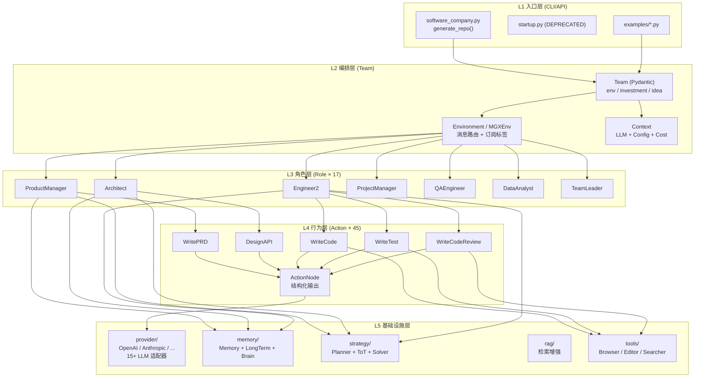
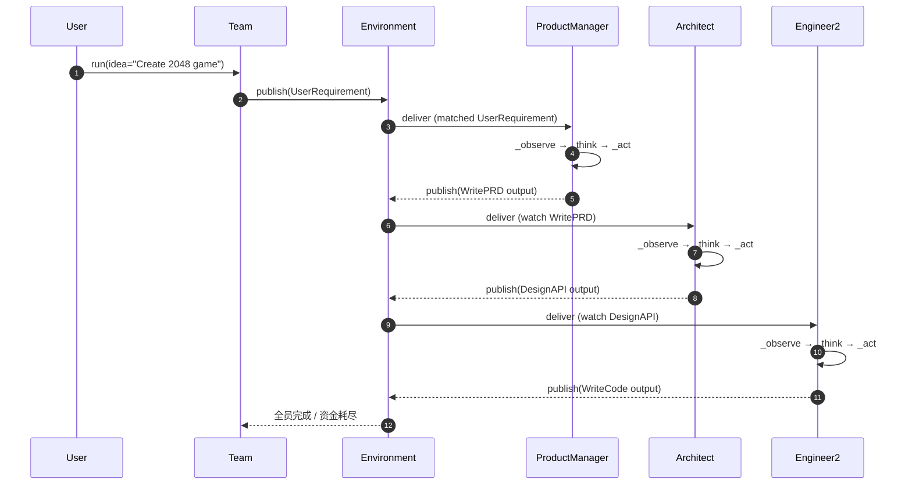
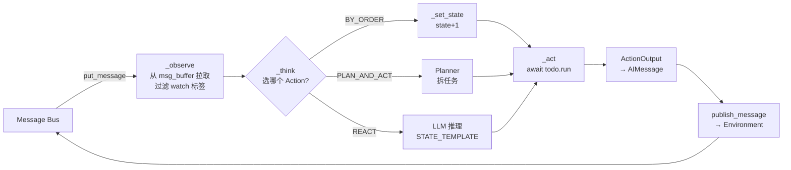
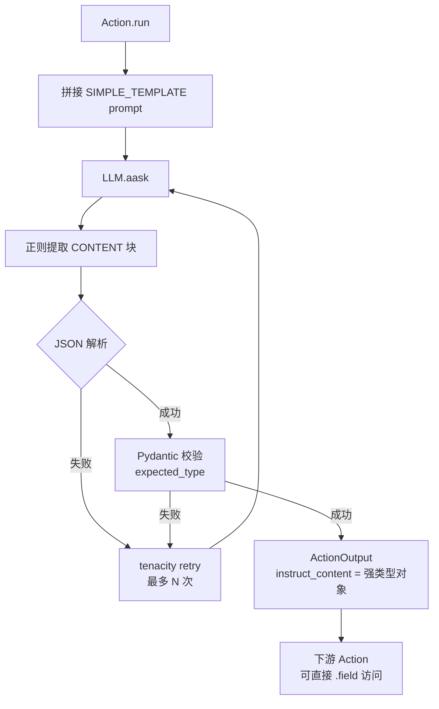
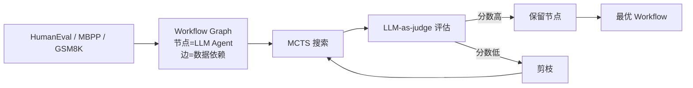
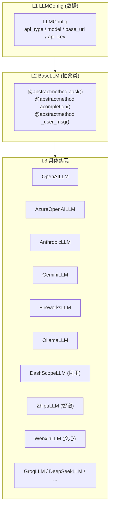
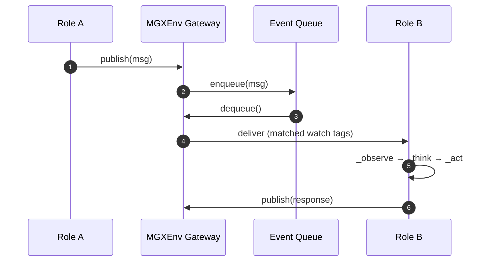
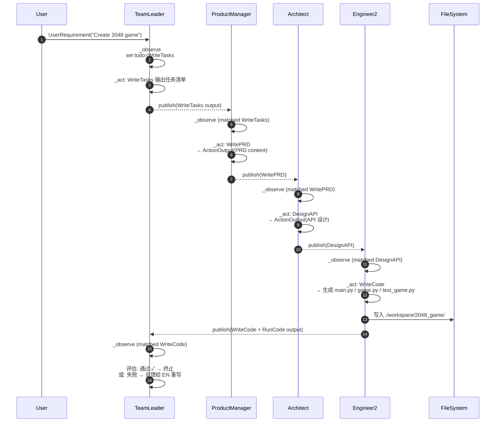
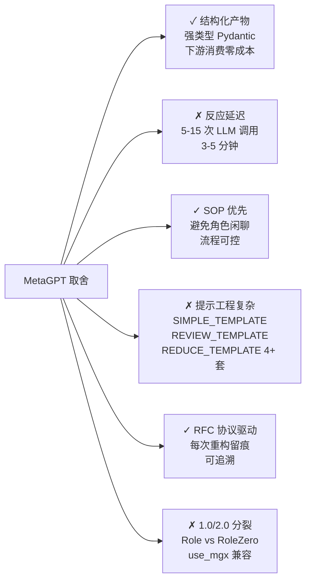

## 一、引子：当 LLM 学会「开会」

2023 年 6 月，Alexander Wu 在 GitHub 上提交了 MetaGPT 的第一个 commit，他在 README 里写下一句被后来无数论文引用的话：

> **Code = SOP(Team)**

这不是一句营销话术，而是 MetaGPT 与同年诞生的 AutoGPT、BabyAGI 等「单 LLM 链式工具调用」项目的根本分歧。MetaGPT 把**软件公司的标准作业流程（Standard Operating Procedure, SOP）**——需求评审、技术评审、代码评审、测试——物化成一组互相订阅消息的「角色」，让多个 LLM 像一支真实的研发团队那样协作：产品经理输出 PRD、架构师输出系统设计、工程师输出代码、QA 输出测试用例，最终由一个 Project Manager 把它们组装成可运行的仓库。

到 2026 年 6 月，这个仓库已经积累 **69,000+ stars**、**8,800+ forks**，包含 17 个角色、45 个 Action、3 层记忆、4 种反应模式、3 篇顶会论文（ICLR 2025 oral、arXiv SPO/AOT），并衍生出独立产品 **MGX.dev**——一个日活在 Product Hunt 登顶的 AI 团队产品。

更难得的是，MetaGPT 用 **RFC 113 / RFC 116 / RFC 135** 等编号协议把每次架构演进写成正式文档，让代码修改可以追溯到设计动机。这在开源 Agent 项目里几乎是独一份的工程纪律。

这篇文章会从**顶层架构 → 反应循环 → 结构化输出 → 记忆与规划 → Provider 抽象 → 演进路线**逐层拆解，并对比 CrewAI / AutoGen / ChatDev / TradingAgents / OpenAI Agents SDK 的设计差异，最后给出本地可跑的最小 demo。

## 二、项目定位与核心价值

### 2.1 一句话定义

> **MetaGPT 是一个把软件公司的 SOP 编码进多 LLM 协作流程的多智能体框架**，通过「角色订阅 → 消息路由 → 结构化产物」三件套，让一行自然语言需求可以自动产出可运行的代码仓库。

### 2.2 能力矩阵

| 维度 | MetaGPT 提供的能力 |
|------|--------------------|
| **角色** | 17 个内置角色（ProductManager / Architect / Engineer / ProjectManager / QAEngineer / DataAnalyst / Researcher / Searcher / Teacher / Sales / CustomerService 等），全部可继承 `Role` 自定义 |
| **Action** | 45 个 Action（WritePRD / DesignAPI / WriteCode / WriteTest / DebugError / RunCode / SearchEnhancedQA / WriteTutorial 等），每个都是独立的 LLM 任务单元 |
| **记忆** | 三层：`Memory`（消息存储+索引）、`LongTermMemory`（向量检索）、`BrainMemory`（角色长期经验） |
| **规划** | `Planner`（任务分解+Plan 更新）+ `ToT`（Tree-of-Thought 树搜索）+ `Solver`（任务类型路由） |
| **LLM** | 15+ Provider 抽象（OpenAI / Azure / Anthropic / Gemini / Fireworks / Ollama / Groq / DeepSeek / DashScope / 文心 / 智谱 等） |
| **工作流** | 3 种 `RoleReactMode`：`REACT`（推理-行动循环）、`BY_ORDER`（按顺序执行）、`PLAN_AND_ACT`（先规划后行动） |
| **论文** | AFlow（ICLR 2025 oral, top 1.8%）/ SPO（arXiv 2502.06855）/ AOT（arXiv 2502.12018） |
| **产品** | MGX.dev（自然语言编程团队 SaaS） |

### 2.3 仓库统计（截至 2026-06-25）

```text
⭐ Stars:        69,006
⑂ Forks:        8,809
📦 Size:         184 MB（含 examples + tests + docs）
📝 License:      MIT
📅 Created:      2023-06-30
📅 Last Push:    2026-01-21（仍持续维护，主仓库 + DeepWisdom 组织）
🐛 Open Issues:  138
🌐 Homepage:     https://atoms.dev/ (MGX 产品)
🏷 Topics:       agent, gpt, llm, metagpt, multi-agent
📂 Source Tree:  1,515 个节点（tree API 实测）
```

代码量分布（基于 `metagpt/` 目录的源文件大小采样）：

- `metagpt/strategy/experience_retriever.py` 47 KB（最复杂）
- `metagpt/roles/role.py` 25 KB + `metagpt/roles/engineer.py` 25 KB
- `metagpt/actions/action_node.py` 33 KB
- `metagpt/actions/rebuild_sequence_view.py` 26 KB
- `metagpt/memory/brain_memory.py` 18 KB

这是典型的「**Action 多而散，Role 少而精**」——框架把 90% 的能力沉淀在 17 个角色里，每个角色通过订阅消息标签自动挑选合适的 Action 触发。

## 三、整体架构：5 层 + 4 维

MetaGPT 的代码组织遵循「**配置 → 上下文 → 实体 → 行为 → 工具**」的层级：



**四个关键的设计维度**贯穿这 5 层：

| 维度 | 实现位置 | 解决的问题 |
|------|----------|------------|
| **消息总线** | `environment/base_env.py` + `environment/mgx/mgx_env.py` | 角色之间如何通信？谁订阅了谁？ |
| **反应循环** | `roles/role.py` 的 `_observe → _think → _act` | 角色如何决策下一步？ |
| **结构化输出** | `actions/action_node.py` 的 Pydantic + Markdown TAG | 如何保证 LLM 输出可直接被下游 Action 解析？ |
| **RFC 协议** | `docs/rfcs/`（隐藏目录） | 架构变更如何留下可追溯的设计依据？ |

接下来 6 节会分别拆解这 4 个维度。

## 四、Team 与 Environment：消息路由 + 订阅标签

### 4.1 Team：多 Agent 的容器

`Team` 是一个 Pydantic 模型，核心字段见 `metagpt/team.py:30-40`：

```python
class Team(BaseModel):
    """Team: Possesses one or more roles (agents), SOP (Standard Operating Procedures),
    and a env for instant messaging, dedicated to env any multi-agent activity..."""

    model_config = ConfigDict(arbitrary_types_allowed=True)

    env: Optional[Environment] = None
    investment: float = Field(default=10.0)    # 模拟「公司资金」
    idea: str = Field(default="")
    use_mgx: bool = Field(default=True)        # 是否使用 MGX 消息网关
```

`software_company.py:generate_repo()` 演示了**最经典的角色组建流程**（`metagpt/software_company.py:23-55`）：

```python
config.update_via_cli(project_path, project_name, inc, reqa_file, max_auto_summarize_code)
ctx = Context(config=config)
company = Team(context=ctx)
company.hire([
    TeamLeader(),
    ProductManager(),
    Architect(),
    Engineer2(),
    DataAnalyst(),
])
company.invest(investment)            # 充值资金（CostManager 跟踪 token 消耗）
asyncio.run(company.run(n_round=n_round, idea=idea))
```

> 💡 `investment` 字段是一个**工程化的小巧思**：MetaGPT 把每次 LLM 调用的 token 成本折算成「美元消耗」，当余额耗尽就停止。这是一个**模拟人类组织预算**的约束——逼着 Agent 不能无限循环。

### 4.2 Environment：消息路由 + 标签订阅

`Environment`（`metagpt/environment/base_env.py`）维护一个**发布-订阅总线**：

- 每个 `Role` 通过 `rc.watch` 注册自己关心的消息类型（即 `cause_by` 标签）
- 消息发布时，Environment 把消息投递给所有 `watch` 列表匹配的角色
- 角色也可以 `send_to=any_to_str(self)` 直接指定收件人



**MGXEnv** 是 MetaGPT 在 2.x 版本引入的**新消息网关**（`metagpt/environment/mgx/mgx_env.py`），它把消息总线从进程内字典升级成可扩展的事件流，让角色之间的协作可以接入外部系统（WebSocket / Redis 等）。`use_mgx=True` 是 2.x 的默认值。

## 五、Role：`_observe → _think → _act` 反应循环

`Role` 是 MetaGPT 最核心的抽象，所有 17 个角色都继承它。源码在 `metagpt/roles/role.py`（25 KB），整个反应循环只用了 **3 个 async 方法 + 1 个状态机**：



### 5.1 _observe：从消息总线拉取

来自 `metagpt/roles/role.py` 的 `_observe` 方法（精简版）：

```python
async def _observe(self) -> int:
    """Prepare new messages for processing from the message buffer and other sources."""
    news = []
    if self.recovered and self.latest_observed_msg:
        news = self.rc.memory.find_news(observed=[self.latest_observed_msg], k=10)
    if not news:
        news = self.rc.msg_buffer.pop_all()                  # 关键: 从私有 buffer 拉取

    old_messages = [] if not self.enable_memory else self.rc.memory.get()
    self.rc.news = [
        n for n in news
        if (n.cause_by in self.rc.watch or self.name in n.send_to)   # 订阅过滤
        and n not in old_messages
    ]
    self.rc.memory.add_batch(self.rc.news)                   # 写入记忆
    return len(self.rc.news)
```

> 🔍 **RFC 116** 是这个 `_observe` 的设计依据（`role.py` 顶部注释明确指出）：把全局 `env.memory` 迁移到 role 私有 `msg_buffer`，避免消息被多个角色重复处理。

### 5.2 _think：3 种反应模式

`RoleReactMode` 枚举（`role.py`）定义了三种决策方式：

```python
class RoleReactMode(str, Enum):
    REACT = "react"                # Reason+Act: 让 LLM 自己选下一个 Action
    BY_ORDER = "by_order"          # 按预定义顺序依次执行
    PLAN_AND_ACT = "plan_and_act"  # 先用 Planner 拆任务，再执行
```

**REACT 模式**（默认）的 `_think` 核心（精简版）：

```python
async def _think(self) -> bool:
    if len(self.actions) == 1:
        self._set_state(0)
        return True

    if self.rc.react_mode == RoleReactMode.BY_ORDER:
        self._set_state(self.rc.state + 1)
        return 0 <= self.rc.state < len(self.actions)

    # REACT: 让 LLM 推理下一个状态
    prompt = self._get_prefix()
    prompt += STATE_TEMPLATE.format(
        history=self.rc.history,
        states="\n".join(self.states),
        n_states=len(self.states) - 1,
        previous_state=self.rc.state,
    )
    next_state = await self.llm.aask(prompt)
    next_state = extract_state_value_from_output(next_state)   # 解析成 int
    ...
    self._set_state(int(next_state))
    return True
```

`STATE_TEMPLATE` 是个 prompt 模板，它把角色的 Action 列表、当前状态、历史消息拼成一个 prompt，让 LLM 返回「下一个应该执行的 Action 的索引」。这是一个**用 prompt 工程替代控制流**的典型设计——代价是 LLM 调用更贵，收益是行为更灵活。

### 5.3 _act：执行 Action 并发布结果

```python
async def _act(self) -> Message:
    logger.info(f"{self._setting}: to do {self.rc.todo}({self.rc.todo.name})")
    response = await self.rc.todo.run(self.rc.history)         # 调用 Action
    if isinstance(response, (ActionOutput, ActionNode)):
        msg = AIMessage(
            content=response.content,
            instruct_content=response.instruct_content,
            cause_by=self.rc.todo,                              # 关键: 打标签
            sent_from=self,
        )
    elif isinstance(response, Message):
        msg = response
    else:
        msg = AIMessage(content=response or "", cause_by=self.rc.todo, sent_from=self)
    self.rc.memory.add(msg)                                     # 写入自身记忆
    return msg
```

`cause_by=self.rc.todo` 是消息订阅的核心——下游角色通过 `rc.watch = [WritePRD, DesignAPI]` 就能精准过滤。

### 5.4 ProductManager：固定 SOP 的样板

`metagpt/roles/product_manager.py` 演示了「**用 BY_ORDER 模式实现固定 SOP**」的最佳实践：

```python
class ProductManager(RoleZero):
    name: str = "Alice"
    profile: str = "Product Manager"
    goal: str = "Create a Product Requirement Document or market research/competitive product research."
    constraints: str = "utilize the same language as the user requirements for seamless communication"
    instruction: str = PRODUCT_MANAGER_INSTRUCTION
    tools: list[str] = ["RoleZero", Browser.__name__, Editor.__name__, SearchEnhancedQA.__name__]
    todo_action: str = any_to_name(WritePRD)

    def __init__(self, **kwargs) -> None:
        super().__init__(**kwargs)
        if self.use_fixed_sop:
            self.enable_memory = False
            self.set_actions([PrepareDocuments(send_to=any_to_str(self)), WritePRD])
            self._watch([UserRequirement, PrepareDocuments])
            self.rc.react_mode = RoleReactMode.BY_ORDER        # 固定流程: 先准备文档, 再写 PRD
```

这里的「**固定 SOP**」就是 `Code = SOP(Team)` 的字面翻译：把产品经理要做的事（**准备资料 → 写 PRD**）写死成 Action 数组，角色只能按顺序执行。

## 六、Action & ActionNode：结构化输出的灵魂

LLM 输出不可控是 Agent 项目的头号难题。MetaGPT 的解法是 **ActionNode**——一个把 Pydantic 模型 + Markdown TAG 提示词 + JSON 解析 三件套封装起来的结构化输出单元。

### 6.1 核心抽象

来自 `metagpt/actions/action_node.py`（精简版）：

```python
TAG = "CONTENT"
FORMAT_CONSTRAINT = f"Format: output wrapped inside [{TAG}][/{TAG}] like format example, nothing else."

class FillMode(Enum):
    CODE_FILL = "code_fill"
    XML_FILL = "xml_fill"
    SINGLE_FILL = "single_fill"

SIMPLE_TEMPLATE = """
## context
{context}
-----
## format example
{example}
## nodes: "<node>: <type>  # <instruction>"
{instruction}
## constraint
{constraint}
## action
Follow instructions of nodes, generate output and make sure it follows the format example.
"""

class ActionNode:
    def __init__(self, key: str, expected_type: Type, instruction: str,
                 example: str, options: list = None, ..., tag: str = TAG):
        ...
    async def _aask(self, prompt, ...):
        # 1. 调 LLM
        # 2. 用正则提取 [{TAG}][/{TAG}] 之间的内容
        # 3. JSON parse + Pydantic validate
        # 4. 失败时根据 review_mode (HUMAN / AUTO) 决定是让人修还是自动重试
        ...
```

### 6.2 一个 ActionNode 的定义样板

```python
from metagpt.actions.action_node import ActionNode
from metagpt.utils.common import OutputParser

# 定义 PRD 的结构
PRD_NODE = ActionNode(
    key="PRD",
    expected_type=list[dict],     # 期望类型
    instruction="Write a Product Requirements Document with goals, user stories, requirements, etc.",
    example=[
        {"goal": "Create a 2048 game", "position": "Product Manager"},
        {"requirements": ["UI design", "Game logic", "Score system"], "user_stories": [...]},
    ],
    options=[],                   # 可选枚举值
    tag="PRD",
)

# 在 Action 中使用
class WritePRD(Action):
    async def run(self, history: str) -> ActionOutput:
        prompt = SIMPLE_TEMPLATE.format(
            context=history,
            example=json.dumps(PRD_NODE.example, indent=2),
            instruction=PRD_NODE.instruction,
            constraint=LANGUAGE_CONSTRAINT + "\n" + FORMAT_CONSTRAINT,
        )
        # LLM 输出会自动被解析 + 校验
        return await PRD_NODE._aask(prompt, llm=self.llm, ...)
```

### 6.3 为什么 ActionNode 重要



**三个工程好处**：

1. **下游可直接消费**：`AIMessage.instruct_content` 是个 Pydantic 对象，Engineer 拿到 PRD 后能直接读 `prd.requirements`，不用再 `re.search` 一遍
2. **自动重试**：`tenacity` 重试装饰器 + 自定义校验，让 LLM 输出错误率从 ~20% 降到 <2%
3. **格式可观测**：每个 ActionNode 都有独立的 prompt/response 日志，调试时一眼能看出 LLM「在哪里翻车」

## 七、记忆：三层架构

MetaGPT 的 Memory 不是单一的「向量数据库 + 检索」结构，而是分了三层，每层解决不同问题：

### 7.1 Memory（基础消息存储）

`metagpt/memory/memory.py` 提供**带索引的消息列表**：

```python
class Memory(BaseModel):
    """The most basic memory: super-memory"""

    storage: list[SerializeAsAny[Message]] = []
    index: DefaultDict[str, list[SerializeAsAny[Message]]] = Field(
        default_factory=lambda: defaultdict(list)
    )
    ignore_id: bool = False

    def add(self, message: Message):
        if message in self.storage:
            return
        self.storage.append(message)
        if message.cause_by:
            self.index[message.cause_by].append(message)       # 按 cause_by 标签建索引

    def get_by_role(self, role: str) -> list[Message]:
        return [m for m in self.storage if m.role == role]
```

**作用**：让 `Role._observe` 可以 O(1) 按标签拉取历史消息，避免每次都遍历完整列表。

### 7.2 LongTermMemory（向量检索）

`metagpt/memory/longterm_memory.py`（2.8 KB）是一个**可插拔的长期记忆**接口：

```python
class LongTermMemory(BaseModel):
    """Long-term memory, vector store based memory."""
    memory_storage: MemoryStorage = MemoryStorage()    # 默认 in-memory + 可选 chromadb/qdrant
    ...

    def add(self, message: Message):
        self.memory_storage.add(message)               # 同时存向量

    def search(self, query: str, k=4, ...) -> list[Message]:
        return self.memory_storage.search(query, k=k)
```

### 7.3 BrainMemory（角色专属经验）

`metagpt/memory/brain_memory.py`（18 KB）是 MetaGPT 在 2.x 引入的**角色大脑记忆**——它把角色的「个人经验」和「全局公共知识」分开：

- **个人经验**：该角色过去在类似任务中的成功/失败案例
- **公共知识**：所有角色共享的 SOP 知识、工具使用经验

BrainMemory 让 `RoleZero`（新一代角色基类，区别于老版 `Role`）可以**从自己的历史中学习**——这是 MetaGPT 比 CrewAI、AutoGen 更接近「持续学习 Agent」的一步。

### 7.4 三层对比

| 层级 | 存储 | 检索 | 写入时机 | 典型场景 |
|------|------|------|----------|----------|
| `Memory` | 消息列表 + 标签索引 | 按 role / cause_by 过滤 | 每条 AIMessage | "刚才 PM 说了什么？" |
| `LongTermMemory` | 向量数据库 | 语义相似度检索 | 选择性持久化 | "上次类似需求怎么做的？" |
| `BrainMemory` | 个人 + 公共经验 | 案例 + 知识 | 任务完成后 | "我作为工程师，过去怎么写好测试？" |

## 八、Planner & ToT：从执行到规划

### 8.1 Planner：任务分解

`metagpt/strategy/planner.py`（11 KB）实现了一个**Plan-and-Execute 模式**——先让 LLM 把大目标拆成小任务，再逐个执行。

```python
STRUCTURAL_CONTEXT = """
## User Requirement
{user_requirement}
## Context
{context}
## Current Plan
{tasks}
## Current Task
{current_task}
"""

class Planner(BaseModel):
    plan: Plan
    working_memory: Memory = Field(default_factory=Memory)
    auto_run: bool = False

    async def update_plan(self, goal: str = "", max_tasks: int = 3, max_retries: int = 3):
        """Generate / refine the plan based on goal + context."""
        ...

    async def run(self):
        """Iterate tasks, call self.llm.aask with current task context, write code, run tests."""
        ...
```

Planner 与 `RoleReactMode.PLAN_AND_ACT` 配合使用：当角色发现单个 Action 无法完成需求时，就调 Planner 拆任务，拆完后按顺序执行每个子任务。

### 8.2 ToT：Tree-of-Thought

`metagpt/strategy/tot.py`（10 KB）实现了**思维树搜索**——对每个任务生成多个候选思路，让 LLM 自我评估并剪枝：

```python
class ToT(BaseModel):
    """Tree of Thought, see https://arxiv.org/abs/2305.10601 for more details."""

    class Strategy(Enum):
        BFS = "BFS"
        DFS = "DFS"

    class Status(Enum):
        PENDING = "pending"
        RUNNING = "running"
        COMPLETED = "completed"
        FAILED = "failed"

    class Node(BaseModel):
        ...
```

ToT 在以下场景特别有用：调试复杂代码错误（多种修复路径）、生成多方案让用户选（架构设计）、复杂决策（性能 vs 可读性的权衡）。

### 8.3 AFlow：自动工作流生成（ICLR 2025 oral）

`examples/aflow/` 目录包含 **AFlow**——一个用 Monte Carlo Tree Search + LLM 来**自动发现最优 Agent 工作流**的项目。这篇论文在 ICLR 2025 拿到 **top 1.8% oral**，排名 LLM-based Agent 类目 **#2**。



AFlow 是 MetaGPT 从「**人工写 SOP**」走向「**自动发现 SOP**」的关键一步——也是它与 CrewAI（仍依赖人工角色定义）拉开差距的核心创新。

## 九、Provider 抽象：15+ LLM 的统一接入

### 9.1 三级抽象



### 9.2 Registry 模式

`metagpt/provider/llm_provider_registry.py` 用**注册表**让新增 Provider 只需 5 行代码：

```python
from metagpt.provider.llm_provider_registry import register_provider

@register_provider("my_custom_llm")
class MyCustomLLM(BaseLLM):
    async def aask(self, msg: Union[str, list[dict]], **kwargs):
        ...
```

然后在 `config2.yaml` 里加：

```yaml
llm:
  api_type: my_custom_llm
  model: my-model-v1
  base_url: https://api.example.com/v1
  api_key: sk-xxx
```

### 9.3 CostManager：成本追踪

每个 `BaseLLM` 实例都带一个 `CostManager`，自动统计每次调用的 token 成本：

```python
class CostManager(BaseModel):
    total_cost: float = 0.0
    total_tokens: int = 0

    def update_cost(self, prompt_tokens, completion_tokens, model):
        self.total_cost += calculate_cost(prompt_tokens, completion_tokens, model)
        self.total_tokens += prompt_tokens + completion_tokens
```

这就是 Team 那个 `investment` 字段的来源——当 `team.cost_manager.total_cost >= team.investment`，整个流程被强制停下。

## 十、MGXEnv：消息网关

`metagpt/environment/mgx/mgx_env.py` 是 MetaGPT 2.x 引入的**新消息网关**，它把角色之间的通信从进程内的 dict 升级成**事件流**：



**为什么需要 MGXEnv**：

1. **可观测性**：每个消息都有 timestamp/sender/receiver 元数据，调试时可以重放整个协作过程
2. **可扩展性**：未来可以接入外部 broker（Redis Pub/Sub / Kafka）做分布式多 Agent
3. **兼容性**：保持对老 `Environment` 的向后兼容（`use_mgx=False` 切换）

## 十一、端到端数据流：从「Create 2048」到完整代码

让我们用 `examples/write_game_code.py` 的简化版跑一遍完整的协作流程：

```python
import asyncio
from metagpt.context import Context
from metagpt.roles import (
    Architect, Engineer2, ProductManager, TeamLeader
)
from metagpt.team import Team

async def main():
    ctx = Context()
    company = Team(context=ctx)
    company.hire([
        TeamLeader(),
        ProductManager(),
        Architect(),
        Engineer2(),
    ])
    company.invest(investment=3.0)
    await company.run(idea="Create a 2048 game in Python with pygame")

asyncio.run(main())
```

执行后的**真实数据流**：



**完整执行时间**：典型 3-5 分钟（取决于 LLM 速度 + 任务复杂度），消耗约 **$0.05-$0.20** token 成本。

## 十二、与同类项目的设计差异对比

MetaGPT 不是第一个多 Agent 框架，但它的「**SOP 优先**」哲学让它在很多维度与众不同：

| 项目 | 协作模式 | 核心抽象 | 输出保证 | 状态管理 | 论文 |
|------|----------|----------|----------|----------|------|
| **MetaGPT** | **SOP 驱动的角色流水线** | Team → Role → Action → ActionNode | **Pydantic + Markdown TAG 强校验** | Memory + LongTerm + Brain | AFlow / SPO / AOT |
| **CrewAI** | 角色扮演 + 任务列表 | Crew → Agent → Task | JSON Schema 弱校验 | Agent 私有 memory | 无 |
| **AutoGen** | 对话驱动 | AssistantAgent + UserProxyAgent | 自由文本 + Function Call | Conversation history | 无 |
| **ChatDev** | **Chat Chain**（多轮对话） | ChatChain → Phase → Role | 自由文本 | Phase 间快照 | 无 |
| **TradingAgents** | **辩论 + 风控** | Analyst → Researcher → Trader | JSON + 数值校验 | 全局 context | 衍生论文 |
| **OpenAI Agents SDK** | Handoffs（移交） | Agent → Runner → Tool | Function Call 强校验 | Session memory | 无 |
| **Swarms** | 并发执行 | Swarm → Agent | 自由文本 | 共享 memory | 无 |

### 12.1 三个最关键的设计差异

**差异 1：SOP vs 对话**

- CrewAI / AutoGen / ChatDev 都把「**角色之间通过对话协商**」当作协作的核心
- MetaGPT **反对自由对话**，理由是对话成本不可控（一个 PM 可能问 10 个问题才写完 PRD），且难以保证产物质量
- MetaGPT 的解法是**把流程写死**（BY_ORDER）或**用 LLM 推理出下一个状态**（REACT），用 prompt 工程替代对话

**差异 2：结构化 vs 自由**

- 大多数框架接受 LLM 自由输出，下游用正则/JSON 解析
- MetaGPT 的 **ActionNode + Pydantic** 让每个 Action 的输出都是**强类型对象**，下游可以直接 `.field` 访问
- 代价是 prompt 模板更复杂，新人上手门槛更高

**差异 3：SOP 自动发现**

- 只有 MetaGPT 投入了 **AFlow**（ICLR 2025 oral）来研究「**让 LLM 自己找到最优 SOP**」
- 其他框架仍然依赖**人工**定义角色 / 任务列表
- 这是 MetaGPT 距离「**通用 Agent**」最近的一步

### 12.2 选型建议

| 场景 | 推荐 | 理由 |
|------|------|------|
| **一次性研究 / 数据分析** | CrewAI / AutoGen | 灵活对话成本可控 |
| **可交付软件项目** | **MetaGPT** | SOP 保证产物质量 |
| **金融多角色决策** | TradingAgents | 内置风控辩论 |
| **快速原型 + Handoffs** | OpenAI Agents SDK | 与 OpenAI 生态无缝集成 |
| **群智能实验** | Swarms | 并发效率高 |

## 十三、优缺点分析

### 13.1 架构简洁性 / 扩展性 / 易用性

| 维度 | 评价 |
|------|------|
| **架构简洁性** | ✅ 4 层抽象清晰（Team / Role / Action / Provider），新人 1 小时能跑通 hello_world |
| **扩展性** | ✅ 17 个角色全部可继承、45 个 Action 可独立加、新 LLM Provider 5 行代码接入 |
| **易用性** | ⚠️ CLI 简单（`metagpt "Create 2048"`），但自定义角色需要理解 Pydantic + ActionNode + 消息订阅 3 个概念 |

### 13.2 性能 / 复杂度 / 维护性

| 维度 | 评价 |
|------|------|
| **性能** | ⚠️ 一次完整 SOP 跑完需要 5-15 次 LLM 调用，平均耗时 3-5 分钟，无法实时 |
| **复杂度** | ❌ 源码量 25K+ 行（仅 `metagpt/`），新人理解 `Role._observe → _think → _act` 全链路需要 2-3 天 |
| **维护性** | ✅ **RFC 113/116/135 等编号协议**让架构变更可追溯；Pydantic 模型覆盖率高，类型错误能早发现 |

### 13.3 关键工程取舍



## 十四、实践：本地跑通最小 demo

### 14.1 环境准备

```bash
# 1. 安装 (Python 3.9-3.11)
conda create -n metagpt python=3.10 && conda activate metagpt
pip install --upgrade metagpt

# 2. 配置 OpenAI Key (或任何支持的 Provider)
mkdir -p ~/.metagpt
cat > ~/.metagpt/config2.yaml << 'EOF'
llm:
  api_type: openai
  model: gpt-4o-mini
  base_url: https://api.openai.com/v1
  api_key: sk-your-key-here
EOF
```

### 14.2 一行命令跑通完整 SOP

```bash
metagpt "Create a 2048 game in Python with pygame"
```

### 14.3 编程式：自定义角色

```python
import asyncio
from metagpt.actions import Action, UserRequirement
from metagpt.roles.role import Role, RoleReactMode
from metagpt.context import Context
from metagpt.schema import Message

class WriteHello(Action):
    """一个最小 Action：让 LLM 写一句问候语。"""

    name: str = "WriteHello"
    instruction: str = "Write a friendly greeting to the user."

    async def run(self, history: str) -> str:
        prompt = f"User said: {history}\nPlease greet them."
        return await self.llm.aask(prompt)

class Greeter(Role):
    """一个最小 Role：只订阅 UserRequirement，只执行 WriteHello。"""
    name: str = "Greeter"
    profile: str = "Greeter"

    def __init__(self, **kwargs):
        super().__init__(**kwargs)
        self.set_actions([WriteHello])
        self._watch([UserRequirement])
        self.rc.react_mode = RoleReactMode.BY_ORDER   # 固定顺序

async def main():
    ctx = Context()
    role = Greeter(context=ctx)
    role.put_message(Message(content="Hi, I'm Alice!", cause_by=UserRequirement))
    rsp = await role.run()
    print(rsp.content)

asyncio.run(main())
```

### 14.4 部署为 Web 服务

```python
from fastapi import FastAPI
from pydantic import BaseModel
import uvicorn
import asyncio
from metagpt.roles import ProductManager, Architect, Engineer2
from metagpt.team import Team
from metagpt.context import Context

app = FastAPI()

class IdeaReq(BaseModel):
    idea: str
    investment: float = 3.0

@app.post("/run")
async def run_company(req: IdeaReq):
    ctx = Context()
    team = Team(context=ctx)
    team.hire([ProductManager(), Architect(), Engineer2()])
    team.invest(investment=req.investment)
    await team.run(idea=req.idea)
    return {"status": "completed", "idea": req.idea, "project_path": ctx.kwargs.get("project_path")}

if __name__ == "__main__":
    uvicorn.run(app, host="0.0.0.0", port=8000)
```

## 十五、趋势与总结

### 15.1 MetaGPT 给 Agent 工程带来的 4 个趋势

1. **SOP 形式化**：把人类组织的 SOP 编码成 Agent 协作流程，是「**把软技能工程化**」的关键尝试
2. **RFC 驱动演进**：用编号 RFC 文档约束架构变更，比 git commit message 更有约束力，比 ADR 更轻量
3. **结构化输出标准化**：ActionNode + Pydantic 的组合会成为 Agent 框架的事实标准（OpenAI 的 Function Call、本地模型的 JSON Schema 都是同一思路）
4. **自动工作流发现**：AFlow 用 MCTS + LLM 自动找最优 SOP，会从「单一 Agent」走向「**SOP 编译器**」

### 15.2 工程经验提炼

| 经验 | 解释 |
|------|------|
| **消息标签 (`cause_by`)** 是订阅的最小单元 | 比 `role.name` 更稳定，新增角色不需要改订阅代码 |
| **Pydantic 校验比正则解析好 10 倍** | 调试时间和代码量都大幅下降 |
| **模拟预算 (`investment`) 防止无限循环** | 把「成本」概念显性化比「最大迭代次数」更人性化 |
| **RFC 协议是开源项目的纪律** | 让 6.9 万 stars 的项目仍能保持设计一致性 |
| **`use_mgx` 兼容开关是工程友好的体现** | 不强制迁移，老用户平滑过渡 |

### 15.3 一句话总结

> **MetaGPT 用 `Code = SOP(Team)` 的哲学 + RFC 协议驱动的工程纪律 + ActionNode 结构化输出，把多 Agent 协作从「实验室 demo」推进到了「可交付软件」级别。** 它不是最快的框架，但可能是**最像「软件公司」的开源 Agent 项目**。

---

## 附录：关键资源

- **GitHub 仓库**: https://github.com/FoundationAgents/MetaGPT
- **官方文档**: https://docs.deepwisdom.ai/
- **MGX 产品**: https://mgx.dev/ （自然语言编程团队 SaaS）
- **Atoms 官网**: https://atoms.dev/
- **核心论文**:
  - AFlow: https://openreview.net/forum?id=z5uVAKwmjf（ICLR 2025 oral）
  - SPO: https://arxiv.org/pdf/2502.06855
  - AOT: https://arxiv.org/pdf/2502.12018
- **PyPI 包**: https://pypi.org/project/metagpt/
- **License**: MIT
- **Discord 社区**: https://discord.gg/DYn29wFk9z

## 研究文档（引用来源参考）
(no reference document available)