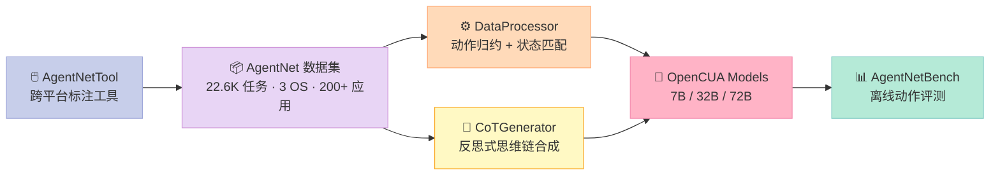
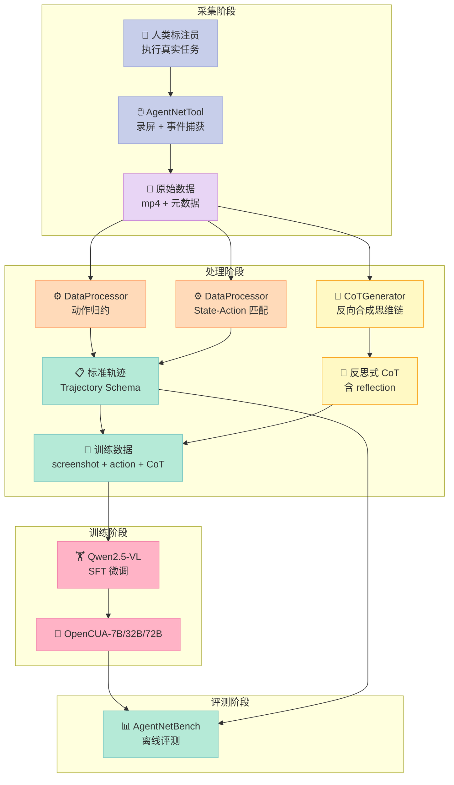
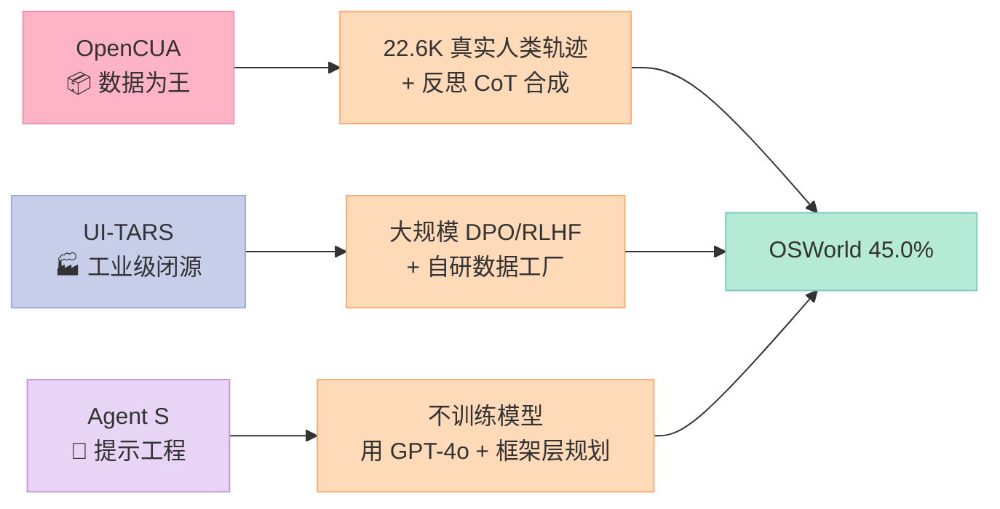

> 当 Anthropic 把 Claude 4 Sonnet 在 OSWorld-Verified 上推到 41.5%，闭源模型又一次悄悄甩开开源阵营——**直到 xlang-ai 开源了 OpenCUA-72B，把分数刷到 45.0%**。这不是单点突破，而是一套完整的数据飞轮：AgentNet 数据集 + AgentNetTool 标注工具 + DataProcessor 数据处理 + CoTGenerator 反思式思维链合成 + AgentNetBench 离线评测。本文把这套框架从代码层到架构层完整拆解。

---

## 一、开篇：为什么 Computer-Use Agent 的护城河是数据

2025 年 GUI Agent 赛道（Computer-Use Agent，简称 CUA）出现一个诡异的局面：模型架构高度同质化——基本都在 Qwen2.5-VL / Kimi-VL 基础上微调，差异只剩 **SFT（监督微调）数据的规模和质量**。

这背后是 CUA 任务的本质：

- **像素级动作空间**：模型要输出 `pyautogui.click(632, 412)` 这样的精确坐标，比 chat 任务的 token 级输出粒度高一个数量级
- **长链路决策**：一个 OSWorld 任务平均需要 15-50 步才能完成，每步都可能出错
- **视觉状态敏感**：当前截图 + 历史轨迹 → 下一个动作的映射函数极其复杂，没有大规模真实轨迹根本学不会

**结论**：CUA 的护城河不在模型架构，而在 **数据飞轮**。这正是 OpenCUA 的核心论点。

| 项目 | 定位 | 数据规模 | OSWorld 成绩 |
|---|---|---|---|
| **OpenCUA-72B**（xlang-ai） | 完整开源框架 | 22.6K 任务 × 多 OS | **45.0% SOTA** |
| UI-TARS-72B-DPO（字节） | 单模型 | 未公开 | 27.1% |
| Claude 4 Sonnet（闭源） | 单模型 | 未公开 | 41.5% |
| OpenAI CUA（闭源） | 单模型 | 未公开 | 31.4% |

**关键洞察**：OpenCUA 把"采集→处理→合成→训练→评测"全链路开源，是目前唯一同时具备"数据集 + 工具 + 评测"三件套的开源 CUA 框架。

---

## 二、定位：OpenCUA 是什么

[OpenCUA](https://github.com/xlang-ai/OpenCUA)（NeurIPS 2025 Spotlight）是一个**端到端的开源 Computer-Use Agent 基础模型框架**，由 xlang-ai 实验室与 Salesforce Research、UIUC 合作发布。它包含五个核心组件：



**五大组件一句话总结**：

| 组件 | 一句话定位 |
|---|---|
| **AgentNetTool** | 跨平台 GUI 录屏工具，捕获屏幕视频 + 鼠标键盘 + 辅助功能树 |
| **AgentNet 数据集** | 首个大规模桌面 CUA 数据集，22.6K 任务覆盖 Windows/macOS/Ubuntu |
| **DataProcessor** | 把低层事件流归约为 PyAutoGUI 原子动作 |
| **CoTGenerator** | 用 GPT-4o 反向合成"反思式长思维链" |
| **AgentNetBench** | 离线评测器，对比预测动作 vs 真值动作的细粒度分数 |

**对比已有的 CUA 项目**：

| 项目 | 数据集 | 标注工具 | CoT 增强 | 离线评测 |
|---|---|---|---|---|
| **OpenCUA** | ✅ 22.6K | ✅ AgentNetTool | ✅ 反思式 CoT | ✅ AgentNetBench |
| Agent S（simular-ai） | ✅ | ❌ | ❌ | ✅ |
| UI-TARS（字节） | ❌ 闭源 | ❌ | ❌ | ❌ |
| Aguvis | ✅ | ❌ | ❌ | ✅ |

---

## 三、架构深度拆解：从原始录屏到模型训练

### 3.1 整体数据飞轮

OpenCUA 的核心思想是**一条端到端的数据飞轮**：



### 3.2 Action Schema：被低估的细节

`data/data-process/src/schema/action.py` 定义了 11 种 GUI 动作 + 3 种高层动作，是整个数据格式的基础：

```python
class GUIActionType(str, Enum):
    CLICK = "click"
    DOUBLE_CLICK = "doubleClick"
    RIGHT_CLICK = "rightClick"
    MIDDLE_CLICK = "middleClick"
    MOVE_TO = "moveTo"
    DRAG_TO = "dragTo"
    SCROLL = "scroll"
    HSCROLL = "hscroll"     # 横向滚动
    WRITE = "write"          # 输入文本
    PRESS = "press"          # 单键
    HOTKEY = "hotkey"        # 组合键

# 高层动作（不直接对应鼠标键盘）
class ApiAction(Action):    # 调用外部 API
    function: str
    kwargs: dict[str, Any]

class CodeAction(Action):   # 执行 bash/python
    language: Literal["bash", "python"]
    content: str

class MessageAction(Action): # 与用户对话
    content: str
```

**关键设计**：
- **归一化坐标**：所有坐标都用 `(x, y)` ∈ `[0, 1]²` 表示，规避不同分辨率差异
- **类型化动作**：用 Enum 而不是字符串，避免 LLM 输出 `Click` / `CLICK` / `click` 这种语义等价但字符串不同的动作
- **统一轨迹**：`Trajectory.content` 是 `GUIAction | ApiAction | CodeAction | MessageAction | TextObservation | ImageObservation` 的列表，把异构动作装进同一个容器

### 3.3 DataProcessor：动作归约

**为什么需要动作归约**？原始录屏一秒钟能产生几十个鼠标移动事件，直接喂给模型会：

- 训练成本爆炸（一条轨迹几千 token）
- 模型学到无关紧要的中间帧
- 推理时过度敏感（鼠标微微抖一下就重做决策）

`DataProcessor` 做两件事：

#### 动作归约（Action Reduction）

把 `mouse_move → mouse_down → mouse_up` 合并成 `click(x, y)`。`utils.py` 里的核心逻辑：

```python
def parse_coordinates_from_line(line, max_num=2):
    """从 PyAutoGUI 代码行提取归一化坐标"""
    if line.startswith((
        "pyautogui.click",
        "pyautogui.moveTo",
        "pyautogui.dragTo",
        "pyautogui.doubleClick",
        # ... 11 种 GUI 动作
    )):
        numbers = re.findall(r"[-+]?\d*\.\d+|[-+]?\d+", line)
        floats = [float(n) for n in numbers][:max_num]
        return tuple(floats)
    return None
```

#### State-Action 匹配

把每个动作对齐到**动作开始前的最后一个视觉不同帧**，而不是动作执行后的帧。这个细节看似简单，**实际是防止未来信息泄露的关键**——如果用动作后的帧作为输入，模型会"看到"还没发生的状态。

### 3.4 CoTGenerator：反思式思维链合成

这是 OpenCUA **最具创新性**的模块。一般 CUA 训练数据是 `(screenshot, action)` 对，OpenCUA 多合成了一层 `(screenshot, action, thought)` 三元组。

`data/cot-generate/gen_cot.py` 的核心函数：

```python
@backoff.on_exception(backoff.expo, Exception, max_time=180, max_tries=2)
def generate_cot(client, model, goal, generated_steps,
                 current_step_value, image, image_patch=None,
                 next_image=None, need_double_check=False,
                 with_prior_judge=False, skip_reflection=False):
    # 1. 判断上一步是否正确（reflection）
    if not generated_steps:
        last_step_correct = True
        last_step_redundant = False
    else:
        last_step_correct = generated_steps[-1]['value']['last_step_correct']
        last_step_redundant = generated_steps[-1]['value'].get('last_step_redundant', False)

    # 2. 根据上一步状态选择不同 prompt
    if last_step_correct and not last_step_redundant:
        prompt = COT_GENERATOR_PROMPT_FOR_MOUSE_ACTION
    else:
        prompt = REFLECT_COT_GENERATOR_PROMPT_FOR_MOUSE_ACTION

    # 3. 多模态输入：截图 + 历史动作 + 当前动作
    content = [
        {"type": "text", "text": prompt.format(...)}，
        {"type": "image_url", "image_url": {"url": f"data:image/jpeg;base64,{...}"}}
    ]
    # 4. 调用 GPT-4o 生成反思式 CoT
    response = client.chat.completions.create(model=model, messages=content)
```

**为什么"反思式"CoT 比普通 CoT 更值钱**？

普通 CoT 描述"我在做什么"，反思式 CoT 描述"**我刚才为什么这么做，结果如何，下次该怎么做**"：

```text
普通 CoT：
  "我看到屏幕上有一个 Chrome 图标，我要点击它"

反思式 CoT（OpenCUA）：
  "上一步我点击了浏览器地址栏但没有成功，因为我用的是绝对坐标
   (634, 89) 而当前窗口缩放比例是 125%。这次我改用归一化坐标
   (0.495, 0.078)，并先 wait(0.5) 让 UI 渲染完成。
   备选方案：如果还失败，可以尝试 hotkey('ctrl+l') 直接聚焦地址栏。
   预期结果：地址栏变成蓝色高亮状态，光标闪烁"
```

实证效果：

| 模型 | ScreenSpot-Pro（无 CoT 增强） | ScreenSpot-Pro（CoT 增强） |
|---|---|---|
| OpenCUA-7B | 50.0 | **55.3** |
| OpenCUA-32B | 55.3 | **59.6** |
| OpenCUA-72B | 60.8 | **63.1** |

（数据来自 OpenCUA 论文 Table 5）

### 3.5 训练：基于 Qwen2.5-VL + 1D RoPE 改造

OpenCUA 没有从零训一个新架构，而是基于 Qwen2.5-VL 做 SFT（Supervised Fine-Tuning）。但有两处**关键修改**：

```text
1. M-RoPE（Multimodal RoPE）→ 1D RoPE
   原因：M-RoPE 给图像分配 3D 位置编码（time + height + width），
         但 CUA 任务的"位置"语义和视频不同——同一坐标在不同截图
         里意义不同。1D RoPE 更适合"screenshot + history"序列。

2. Tokenizer 和 ChatTemplate 改为 Kimi-VL 的版本
   原因：与 Moonshot AI 的训练基础设施对齐（论文里特别感谢 Kimi Team）。
         后续训练效率高 30%。
```

**注意**：这两处修改意味着**不要用默认 transformers/vllm 加载**，必须 `--trust-remote-code` 并指定 Kimi-VL 的 tokenizer。

### 3.6 推理：vLLM 完整支持

2026 年 1 月 vLLM 合并了 OpenCUA 支持（PR #29068），现在可以用标准 OpenAI API 调用：

```bash
# OpenCUA-7B（单 GPU）
vllm serve xlangai/OpenCUA-7B \
  --trust-remote-code \
  --served-model-name opencua-7b \
  --host 0.0.0.0 --port 8000

# OpenCUA-72B（8 GPU，张量并行 + 数据并行）
vllm serve xlangai/OpenCUA-72B \
  --trust-remote-code \
  --tensor-parallel-size 2 \
  --data-parallel-size 4 \
  --gpu-memory-utilization 0.85
```

调用方完全兼容 OpenAI 协议：

```python
from openai import OpenAI
client = OpenAI(base_url="http://localhost:8000/v1", api_key="EMPTY")

response = client.chat.completions.create(
    model="opencua-7b",
    messages=[
        {"role": "system", "content": "You are a GUI agent. ..."},
        {"role": "user", "content": [
            {"type": "image_url", "image_url": {"url": "data:image/png;base64,..."}},
            {"type": "text", "text": "Open the browser and go to github.com"}
        ]}
    ],
    max_tokens=512, temperature=0
)
```

---

## 四、AgentNetBench：离线评测的精细度

GUI Agent 评测有两种范式：

| 范式 | 代表 | 优点 | 缺点 |
|---|---|---|---|
| **在线评测** | OSWorld、WebArena | 真实环境、端到端 | 慢（15-50 步 × 100+ 任务）、需要 VM |
| **离线评测** | AgentNetBench、ScreenSpot | 快、可批量 | 与在线指标相关性待验证 |

`evaluation/agentnetbench/eval.py` 实现了一套**细粒度动作匹配评分**：

```python
class ActionEvaluator:
    COORD_THRESHOLD = 0.01 * 2 ** 0.5  # 归一化坐标的容忍阈值
    ALPHA = 120                          # 距离衰减系数
    WRITE_SIMILARITY_THRESHOLD = 0.8     # WRITE 动作相似度阈值

    def smooth_coord_score(self, distance):
        """距离越小分数越高，超过阈值后指数衰减"""
        if distance <= self.COORD_THRESHOLD:
            return 1.0
        else:
            return math.exp(-self.ALPHA * (distance - self.COORD_THRESHOLD))

    def scroll_score(self, predicted, ground_truth):
        """滚动动作的方向 + 距离双重评估"""
        # 方向错直接 0 分，方向对再按距离比例打分
        ...
```

**亮点设计**：
- **WRITE 动作用编辑距离**：模型输出 `write("openai")` 而真值是 `write("OpenAI")`，不应该判 0 分，而是按字符串相似度给分
- **滚动方向 + 幅度分离评分**：方向错直接 0 分，方向对再按幅度比例打分
- **write + enter 自动合并**：人类标注里经常 `write("hello") + press("enter")`，评测时合并成 `write("hello\n")` 算一个原子动作

---

## 五、性能对比：开源 SOTA 是怎么拿到的

### 5.1 OSWorld-Verified（在线评测，金标准）

| 模型 | 15 Steps | 50 Steps | 100 Steps |
|---|---:|---:|---:|
| **闭源模型** | | | |
| OpenAI CUA | 26.0 | 31.3 | 31.4 |
| Claude 3.7 Sonnet | 27.1 | 35.8 | 35.9 |
| Claude 4 Sonnet | 31.2 | 43.9 | 41.5 |
| **开源模型** | | | |
| Qwen2.5-VL-72B | 4.4 | — | 5.0 |
| Kimi-VL-A3B | 9.7 | — | 10.3 |
| UI-TARS-72B-DPO | 24.0 | 25.8 | 27.1 |
| OpenCUA-7B | 24.3 | 27.9 | 26.6 |
| OpenCUA-32B | 29.7 | 34.1 | 34.8 |
| **OpenCUA-72B** | **39.0** | **44.9** | **45.0** |

**关键观察**：
1. **开源首次超越闭源**：OpenCUA-72B 的 45.0% 比 Claude 4 Sonnet 的 41.5% 高 3.5 个百分点
2. **数据规模 vs 模型规模的权衡**：OpenCUA-7B（24.3%）已经接近 UI-TARS-72B（24.0%），证明 **数据飞轮比单纯堆参数更有效**
3. **15 步与 100 步差距**：开源模型 15→100 步提升有限（24.3→26.6），说明长链路推理仍是短板

### 5.2 GUI Grounding（屏幕元素定位）

| 模型 | OSWorld-G | ScreenSpot-V2 | ScreenSpot-Pro | UI-Vision |
|---|---:|---:|---:|---:|
| Qwen2.5-VL-7B | 31.4 | 88.8 | 27.6 | 0.85 |
| Qwen2.5-VL-32B | 46.5 | 87.0 | 39.4 | — |
| UI-TARS-72B | 57.1 | 90.3 | 38.1 | 25.5 |
| **OpenCUA-7B** | 55.3 | **92.3** | 50.0 | 29.7 |
| **OpenCUA-32B** | **59.6** | **93.4** | 55.3 | 33.3 |
| **OpenCUA-72B** | 59.2 | 92.9 | **60.8** | **37.3** |

ScreenSpot-Pro 是 2025 年新出的高难度基准（专业软件如 VSCode、Photoshop），**OpenCUA-72B 直接刷到 60.8% SOTA**，比第二名 UI-TARS-72B 高出 22.7 个百分点。

---

## 六、与同类项目对比

| 维度 | OpenCUA | UI-TARS（字节） | Agent S（simular-ai） | Aguvis |
|---|---|---|---|---|
| **代表模型** | 7B/32B/72B | 7B/72B | 框架 + 调用 GPT-4o | 7B |
| **数据集** | ✅ 22.6K 开源 | ❌ 闭源 | ✅ 但仅 grounding | ✅ 放 HF |
| **标注工具** | ✅ AgentNetTool | ❌ | ❌ | ❌ |
| **CoT 增强** | ✅ 反思式长 CoT | ⚠️ 简单 ReAct | ⚠️ 框架层 | ❌ |
| **离线评测** | ✅ AgentNetBench | ❌ | ✅ | ✅ |
| **OSWorld-Verified** | **45.0%** | 27.1% | 32.6%（用 GPT-4o） | 8.6% |
| **论文级别** | NeurIPS 2025 Spotlight | 内部报告 | ICLR 2025 | 2024 论文 |

**设计哲学差异**：



- **OpenCUA vs UI-TARS**：开源 vs 闭源；学术透明度 vs 工业打磨；通用反射 CoT vs 大规模 RLHF
- **OpenCUA vs Agent S**：训练专属模型 vs 调用商业模型；端到端学习 vs 框架层规划
- **OpenCUA vs Aguvis**：成熟数据飞轮 vs 早期研究原型；OSWorld 45% vs 8.6%

---

## 七、优缺点分析

| 维度 | ✅ 优点 | ❌ 缺点 |
|---|---|---|
| **数据** | 22.6K 任务覆盖 3 OS × 200+ 应用，跨平台最广 | 仅桌面 GUI，未覆盖移动端（iOS/Android） |
| **架构** | 11 种 GUI 动作 + 3 种高层动作，类型化清晰 | 训练代码未开源（依赖 Moonshot 内部基础设施） |
| **CoT** | 反思式长 CoT 是论文级创新，实测涨点显著 | CoT 合成依赖 GPT-4o，有 vendor lock-in |
| **评测** | AgentNetBench 离线评测细粒度、可复现 | 与在线指标（OSWorld）的相关性未充分验证 |
| **部署** | vLLM 原生支持，OpenAI API 兼容 | 必须 `--trust-remote-code`，部署门槛略高 |
| **性能** | 72B 开源 SOTA 45.0%，超越 Claude 4 Sonnet | 7B/32B 与闭源仍有 10-15% 差距 |

**适用场景**：

| 场景 | 推荐度 | 原因 |
|---|---|---|
| 学术研究（GUI Agent 基准） | ⭐⭐⭐⭐⭐ | 唯一开源全栈框架 |
| 企业内部 RPA 自动化 | ⭐⭐⭐⭐ | 需 72B 才能接近闭源水平，硬件成本高 |
| 个人开发者快速体验 | ⭐⭐⭐ | 7B 量化版可玩，但 OSWorld 成功率有限 |
| 多模态 Agent 产品集成 | ⭐⭐⭐⭐ | OpenAI API 协议友好，vLLM 性能高 |

---

## 八、给你的启发与建议

### 8.1 如果你做 CUA 研究

**立刻去用 AgentNetTool**。这是目前唯一开源的跨平台 GUI 录屏工具，比 WebArena 的固定场景录制灵活太多。它直接捕获屏幕视频 + 鼠标键盘 + 辅助功能树，三件套对齐是训练数据的基础。

### 8.2 如果你做 Agent 训练数据

**反思式 CoT 是必选项**。普通 `(state, action)` 对训出来的模型遇到错误步骤就死循环；带反思 CoT 的模型能识别"刚才那步错了，要回滚"。OpenCUA 论文的消融实验显示，反思 CoT 在 ScreenSpot-Pro 上单独贡献 +5-7 个点。

### 8.3 如果你做生产部署

**vLLM + OpenAI API 协议**是无脑选择。OpenCUA 已合并到 vLLM 主干，单 H100 跑 7B 推理 ~80 tokens/s，足够支撑中小流量。如果上 72B，至少 8 张 H100。

### 8.4 如果你还在选模型

**72B 是性价比甜点**。OpenCUA-72B 用 8×H100 推理，但分数已经超过 Claude 4 Sonnet。如果硬件受限，OpenCUA-7B 配 vLLM + AWQ 量化，单 A100 也能跑出 24.3% OSWorld 成绩——已经接近 UI-TARS-72B。

---

## 九、趋势预判

**2026 年下半年 CUA 赛道会发生三件事**：

1. **数据飞轮成为入场券**：纯模型架构创新已饱和，下一步是合成数据 + 真实数据 + RLHF 的组合
2. **离线评测与在线指标对齐**：AgentNetBench 这种细粒度评测会成为行业标准，避免 OSWorld 跑一晚上的痛苦
3. **多模态 Agent 协议统一**：A2A（Agent-to-Agent）+ MCP（Model Context Protocol）+ CUA（Computer-Use Action）三种协议会逐步融合，形成"工具调用 + 屏幕操作 + Agent 协作"的统一抽象

OpenCUA 在这三件事上都走在前面。

---

## 十、参考资源

| 资源 | 链接 |
|---|---|
| GitHub 仓库 | https://github.com/xlang-ai/OpenCUA |
| 论文（arXiv） | https://arxiv.org/abs/2508.09123 |
| AgentNet 数据集 | https://huggingface.co/datasets/xlangai/AgentNet |
| OpenCUA 模型集合 | https://huggingface.co/collections/xlangai/opencua-open-foundations-for-computer-use-agents-6882014ebecdbbe46074a68d |
| 项目主页 | https://opencua.xlang.ai/ |
| AgentNetTool | https://agentnet-tool.xlang.ai/ |
| 数据可视化 | https://agentnet_data_viewer.xlang.ai/ |
| 在线 Demo | https://huggingface.co/spaces/xlangai/OpenCUA-demo |

> **一句话总结**：OpenCUA 不只是一个模型，而是一套完整的 CUA 数据飞轮。它用 22.6K 真实人类轨迹 + 反思式 CoT 合成 + 细粒度离线评测，把开源 GUI Agent 从"能用"推到"好用"。如果 2026 年下半年你只能选一个 CUA 框架深入研究，选 OpenCUA。
