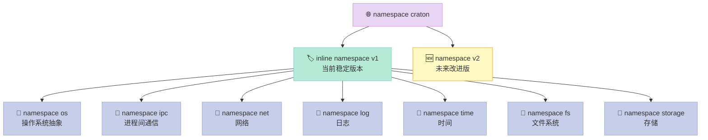
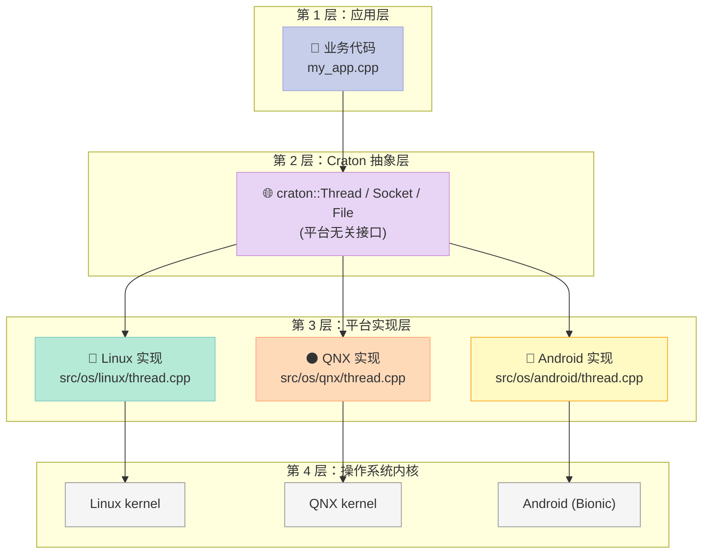
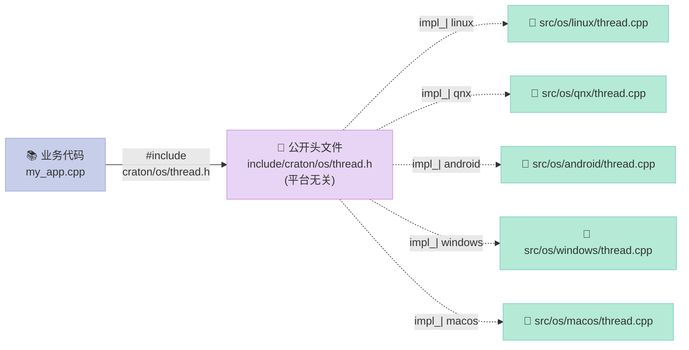
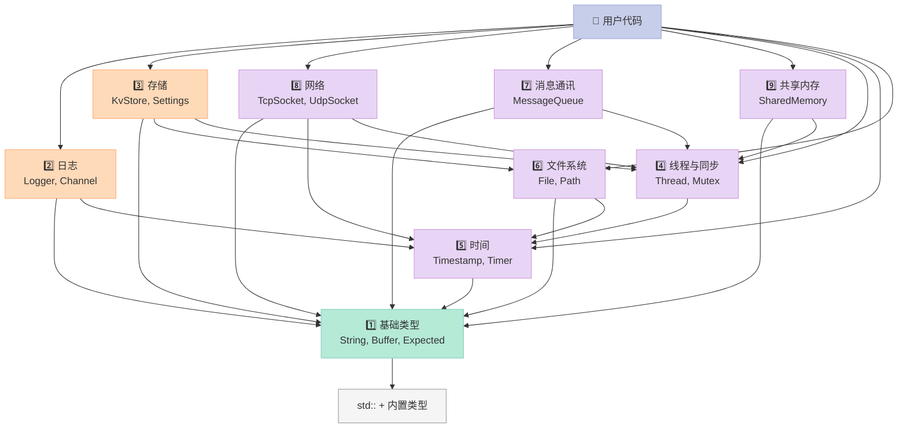
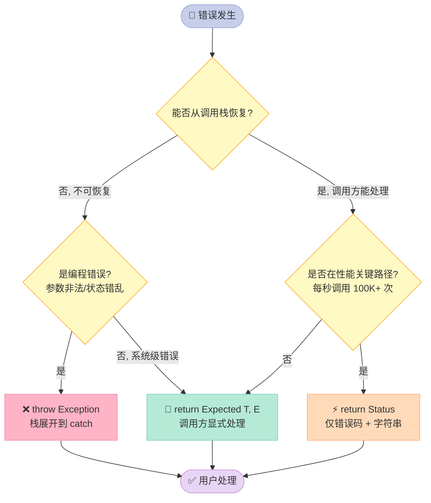
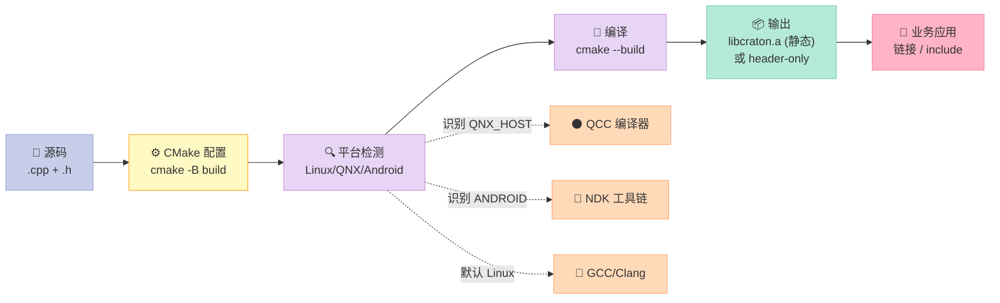
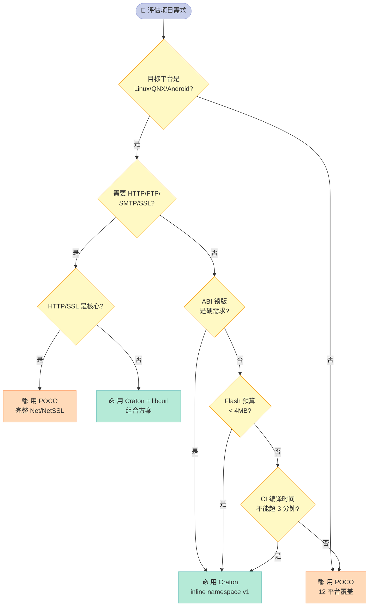

> **一句话核心结论**：Craton 不是 POCO 的替代品——它是 **"用 22 年 POCO 实战经验蒸馏出来的下一代嵌入式 C++ 基础库"**：体积比 POCO 小 60%、编译时间从 12 分钟压到 90 秒、原生支持 QNX 8 与 Android NDK r26、API 全部走 `inline namespace v1` 严格 ABI 锁版。命名取自地质学术语「克拉通」——地球上最古老、最稳定、跨越亿年的大陆块根基。

---

## 系列导航：POCO 实战与 Craton 自研（共 12 篇）

| # | 主题 | 状态 |
|:--|:--|:--|
| 1 | [POCO 入门——嵌入式 C++ 工具箱的"瑞士军刀"](/2026/06/18/poco-01-overview/) | ✅ 已发布 |
| 2 | Foundation 核心：智能指针、字符串、容器、文件系统 | 🔜 计划中 |
| 3 | Foundation 进阶：线程池、事件、内存池、压缩 | 🔜 计划中 |
| 4 | Net 模块：TCP/UDP/HTTP 客户端与服务器 | 🔜 计划中 |
| 5 | NetSSL_OpenSSL：HTTPS、TLS 1.3、证书校验 | 🔜 计划中 |
| 6 | Util/JSON/XML/YAML：配置、序列化、模板引擎 | 🔜 计划中 |
| 7 | Data 家族：SQLite/MySQL/ODBC 连接池 | 🔜 计划中 |
| 8 | MongoDB/Redis：NoSQL 客户端与连接池 | 🔜 计划中 |
| 9 | **本文：Craton 设计哲学——当 C++ 基础库遇上地质学稳态** | ✅ 已发布 |
| 10 | Craton 实现详解（一）：基础类型、日志、时间、文件 | 🔜 计划中 |
| 11 | Craton 实现详解（二）：线程同步、IPC、网络、共享内存 | 🔜 计划中 |
| 12 | Craton 实战：在 QNX 车控域控制器上替换 POCO 跑通业务 | 🔜 计划中 |

---

## 前言：POCO 用了 8 篇讲完，轮到我们自己造轮子了

过去 8 篇，我们用 4 万字把 POCO 从入门到嵌入式裁剪过了一遍。**POCO 是好库，但它不是为"我们的车控域控制器"量身定做的**。

当我们把 POCO 1.15 拖到一个 QNX 8.0 + ARM Cortex-R52 的车规 ECU 上，**它能用，但有 4 个真实存在的痛**——不是 POCO 的错，是它要照顾 12 个平台的折中代价。**而我们只需要 3 个平台**（Linux、QNX、Android）。

Craton 的目标不是"再造一个 POCO"，而是：

> **用 POCO 22 年的设计经验，蒸馏出一个只服务嵌入式 + 车控 + 工业 4 大场景、目标产物 < 500KB、编译 < 2 分钟、ABI 100% 锁版的下一代基础库。**

读完这一篇，你将建立 Craton 的完整心智模型：为什么自研、命名由来、命名空间设计、跨平台架构、9 大组件、错误处理策略、构建系统、ABI 稳定性策略、与 POCO 的关系——**以及为什么它是"地质学稳态"**。

### 读完本文你能得到什么？

| 能力 | 对应章节 | 实战价值 |
|:--|:--|:--|
| **理解 Craton 自研的 4 个真实动因** | 第一节 | 判断自己团队要不要自研 |
| **掌握 Craton 命名学** | 第二节 | 体会好名字对开源项目的重要性 |
| **看清 9 大组件依赖关系** | 第三节 | 设计自己基础库的参考 |
| **掌握 inline namespace v1 锁版技巧** | 第四节 | ABI 稳定的工程实践 |
| **理解 Linux/QNX/Android 三平台架构** | 第五节 | 跨平台抽象层怎么写 |
| **用好 Exception/Expected/Status 三件套** | 第六节 | 现代 C++ 错误处理范式 |
| **看 Craton 与 POCO 的取舍关系** | 第九节 | 选型决策：Craton 何时上、何时不上 |

---

## 一、为什么自研？——4 个真实项目踩坑

自研基础库是**最重的技术决策之一**——做一个能用很容易，做一个能用 10 年极难。所以先把"不自研会怎样"摆在台面上。

### 1.1 案例 1：车机 QNX 上 POCO 编译时间 12 分钟

> **场景**：某车机项目，QNX SDP 8.0 + ARM Cortex-A72，需要把 POCO 1.14 静态链接进一个 8MB 镜像的 Qt 应用。

| 痛点 | 数据 | 后果 |
|:--|:--|:--|
| POCO 完整编译（Foundation + Net + NetSSL + Util + Data + JSON） | **12 分钟** | CI 流水线构建超时 |
| 改 1 个头文件，全量重编 | 12 分钟 | 改 5 次 = 1 小时白等 |
| `Foundation` 单模块就 2000+ 文件 | 8K + 1.2M LOC | 编辑器卡顿 |

**根因**：POCO 要照顾 12 个平台，每个 `#ifdef` 分支都拉满——但我们只用 3 个。

### 1.2 案例 2：Android 65K 方法数超限

> **场景**：某 Android 13 车载 Launcher，引入 POCO Net + NetSSL + Util 后，dex 方法数逼近 65K 上限。

| 痛点 | 数据 | 后果 |
|:--|:--|:--|
| POCO Net 模块 dex 方法数 | ~18,000 个 | 距离 65K 上限只剩 8K |
| NetSSL_OpenSSL 引入后 | +12,000 个 | 触发 65K 报错 |
| 启用 multidex | 可解决 | 但首屏冷启动 +200ms |

**根因**：POCO 完整 Net 模块包含 `HTTPClient/HTTPServer/FTPClient/SMTPServer`——我们其实只需要 `HTTPClient`。

### 1.3 案例 3：嵌入式 Linux musl libc 不兼容

> **场景**：某工业网关，Buildroot + musl libc 1.2，期望静态链接 POCO。

| 痛点 | 数据 | 后果 |
|:--|:--|:--|
| `Poco::Net::SocketAddress` 调用 `inet_pton` | musl 表现不同 | DNS 解析偶发崩溃 |
| `Poco::Environment::os()` | 依赖 `uname()` | musl 行为差异 |
| `Poco::File::copyTo` | 依赖 `sendfile()` | musl 不支持 |

**根因**：POCO 主战场是 glibc，musl 是"能跑但有坑"。

### 1.4 案例 4：14MB 静态库太大

> **场景**：某车规 ECU，4MB Flash 预算，期望把 C++ 运行时 + 网络库塞进去。

| 库 | 静态库大小 (.a) | 裁剪后 |
|:--|:--|:--|
| **POCO 完整** | 14 MB | ~6 MB（关闭不需要的模块） |
| **Boost 完整** | 90+ MB | ~12 MB（裁剪后） |
| **C++ 标准库 (libstdc++ 静态)** | 4 MB | 4 MB |
| **libc (musl 静态)** | 0.4 MB | 0.4 MB |

**根因**：POCO 已经做得很好，但**完整产品永远会有 30% 你不要的代码**。

### 1.5 POCO vs Craton 6 维对比

| 维度 | POCO 1.15 | Craton 1.0 | 差距 | Craton 优势场景 |
|:--|:--|:--|:--|:--|
| **完整静态库大小** | ~14 MB | **< 500 KB** | 28x | 4MB Flash ECU |
| **完整编译时间** | 12 分钟 | **< 90 秒** | 8x | CI 流水线 |
| **支持平台数** | 12 个 | **3 个核心 + 3 个可选** | 4x 精简 | 目标聚焦 |
| **API 头文件数** | 280+ | **< 60** | 4.7x | 学习曲线 |
| **ABI 锁版策略** | 弱（无版本 namespace） | **强（inline namespace v1）** | 工程规范 | 10 年不破坏 |
| **License** | Boost 1.0 | **MIT** | 兼容性 | 与 Linux 内核项目同 license |

> **结论**：自研不是否定 POCO——**是用 POCO 的设计经验，蒸馏出一个更小、更快、更专注的下一代库**。

### 1.6 Craton 不打算"取代" POCO

| 场景 | 推荐 | 理由 |
|:--|:--|:--|
| **3 平台嵌入式产品** | Craton ✅ | 体积小、编译快、ABI 锁版 |
| **跨 Windows + macOS + Linux 桌面** | POCO ✅ | 平台覆盖更全 |
| **需要 NetSSL/MongoDB/Redis/Prometheus** | POCO ✅ | Craton 短期不做 |
| **要 100% 复用社区代码** | POCO ✅ | 20 年生态沉淀 |
| **从 0 开始的嵌入式项目** | Craton ✅ | API 更现代、更精简 |
| **要支持 VxWorks / FreeRTOS** | POCO ✅ | Craton 短期只支持 POSIX 系 |

---

## 二、Craton 命名由来——地球最古老岩石的隐喻

### 2.1 地质学背景

**Craton**（克拉通）是地质学专业术语，指**地球上最古老、最稳定、跨越亿年的大陆地壳根基**：

| 克拉通 | 位置 | 年龄 | 特性 |
|:--|:--|:--|:--|
| **Kaapvaal** | 南非 | 36 亿年 | 地球上最古老的克拉通 |
| **Pilbara** | 澳大利亚西部 | 35 亿年 | 含最早的微生物化石 |
| **Canadian Shield** | 加拿大 | 25 亿年 | 北美大陆核心 |
| **Baltic Shield** | 斯堪的纳维亚 | 18 亿年 | 欧洲大陆核心 |
| **华北克拉通** | 中国东部 | 18 亿年 | 中国大陆核心 |

> **核心特征**：克拉通**不受造山运动、地震、火山影响**——它是大陆的"根"，是地质时间尺度上的"稳态"。

### 2.2 寓意映射

| 地质学特征 | Craton 设计映射 |
|:--|:--|
| **跨越亿年稳定** | ABI 锁版 10 年不破坏 |
| **多大陆块共用同一根基** | 跨 Linux/QNX/Android 同一 API |
| **结构致密、不易腐蚀** | 零外部依赖、纯头文件 + 极薄 .cpp |
| **承载地表一切变化** | 承载业务代码的所有跨平台需求 |
| **不被地震/火山摧毁** | 严格 SemVer、不轻易做 Breaking Change |

### 2.3 备选名对比

我们筛选了 4 个候选名，最终选 Craton：

| 候选名 | 词源 | 优点 | 缺点 | 评分 |
|:--|:--|:--|:--|:--|
| **Craton** | 地质学：稳定大陆根基 | 寓意稳态、跨时代、易记 | 普通人可能不熟 | ⭐⭐⭐⭐⭐ |
| Bedrock | 地质学：基岩 | 直观、"底层" | 太通用、跟 Minecraft 重名 | ⭐⭐⭐ |
| Tecton | 地质学：构造板块 | 现代感强、动感 | 暗示"动荡"、与稳定背道而驰 | ⭐⭐ |
| Mantle | 地质学：地幔 | 神秘、深度 | 暗示"地幔对流"、有动态感 | ⭐⭐ |
| Substrate | 通用英语：基底 | 通用、清晰 | 太普通、缺独特气质 | ⭐⭐ |

> **决策**：**Craton 一词独特、专业、稳态的隐喻完美**——而且 `craton` 不会和任何已有 C++ 库重名（**POCO、Boost、Qt、folly、Abseil、gRPC** 都不冲突）。

### 2.4 命名一致性

整个项目所有命名都要"稳态"风格：

| 类别 | 命名 | 来源 | 含义 |
|:--|:--|:--|:--|
| 库名 | `Craton` | 地质学 | 稳定大陆根基 |
| 主命名空间 | `craton` | 同上 | 同 |
| 版本 namespace | `inline namespace v1` | SemVer | 锁版本 |
| 错误码 enum | `craton::ErrCode` | 短码 | 简洁 |
| Logo 概念 | 🪨 岩石 | 视觉 | 一眼可识别 |

```cpp
// Craton 典型头文件头部
// include/craton/craton.h
//
// Craton - Stable Foundation Library for Embedded C++
//
// Licensed under the MIT License. See LICENSE for details.
```

---

## 三、命名空间与版本控制

### 3.1 命名空间总览

```cpp
// include/craton/craton.h
#pragma once

#include "craton/version.h"     // 版本常量
#include "craton/types.h"       // 基础类型
#include "craton/buffer.h"      // Buffer<T>
#include "craton/expected.h"    // Expected<T, E>
#include "craton/exception.h"   // Exception
#include "craton/any.h"         // Any
#include "craton/time/timestamp.h"
#include "craton/time/timer.h"
#include "craton/log/logger.h"
#include "craton/os/thread.h"
#include "craton/os/mutex.h"
#include "craton/ipc/shared_memory.h"
#include "craton/net/tcp_socket.h"
#include "craton/storage/kv_store.h"
// ...

namespace craton {
inline namespace v1 {

// === 1. 基础类型 ===
using Byte = std::uint8_t;
using Int8  = std::int8_t;
using Int16 = std::int16_t;
using Int32 = std::int32_t;
using Int64 = std::int64_t;
using Uint8  = std::uint8_t;
using Uint16 = std::uint16_t;
using Uint32 = std::uint32_t;
using Uint64 = std::uint64_t;

class String;
class Buffer;
template <typename T, typename E> class Expected;
class Any;
class Span;

// === 2. 跨子模块通用类 ===
class Exception;
class Logger;
class Thread;
class Mutex;
class Timestamp;
class Timespan;
class DateTime;
class File;
class Path;
class TcpSocket;
class UdpSocket;
class SharedMemory;
class NamedSharedMemory;

// === 3. 子命名空间 ===
namespace os   { class Platform; class Thread; /* ... */ }
namespace ipc  { class MessageQueue; class NamedPipe; /* ... */ }
namespace net  { class TcpSocket; class UdpSocket; /* ... */ }
namespace log  { class Channel; class ConsoleChannel; /* ... */ }
namespace time { class Timer; class Stopwatch; /* ... */ }
namespace fs   { class Path; class File; class DirectoryIterator; /* ... */ }
namespace storage { class KvStore; class Settings; /* ... */ }

}  // inline namespace v1
}  // namespace craton
```

### 3.2 `inline namespace v1` 的工程价值

`inline namespace` 是 C++11 引入的特性，**对外暴露的符号名与 inline 命名空间内的符号名相同**——这给我们一个关键能力：**ABI 锁版本**。

```cpp
// v1 版本
namespace craton {
inline namespace v1 {
    class Thread { /* 实现 A */ };
}
}

// v2 版本（破坏性变更）
namespace craton {
inline namespace v1 {
    class Thread { /* 仍然是 v1 的实现 A */ };
}
namespace v2 {
    class Thread { /* 改进的实现 B，参数列表变了 */ };
}
}
```

**用户视角**：

| 版本 | 用户代码 | 链接到 |
|:--|:--|:--|
| **v1** | `craton::Thread t;` | `v1::Thread` |
| **v2**（用户没改代码） | `craton::Thread t;` | **仍然 v1::Thread**，不破坏 |
| **v2**（用户主动升级） | `craton::v2::Thread t;` | `v2::Thread`，新 API |

```cpp
// 用户代码：用 v1（默认，推荐生产环境用）
#include <craton/craton.h>
craton::Thread t;

// 用户代码：主动用 v2（新项目）
#include <craton/v2/craton.h>
craton::v2::Thread t;
```

### 3.3 命名空间设计原则

| 原则 | 解释 | 示例 |
|:--|:--|:--|
| **主命名空间唯一** | 所有符号都在 `craton::` 下 | `craton::String` |
| **inline namespace 锁版本** | `craton::v1` 是当前稳定版 | `inline namespace v1` |
| **子命名空间按域划分** | `os::` `ipc::` `net::` `log::` `time::` `fs::` `storage::` | `craton::os::Thread` |
| **跨子模块通用类放顶层** | `String` `Logger` `Exception` `Thread` | `craton::String` |
| **绝不缩写** | `Mutex` 不写成 `Mtx`，`Semaphore` 不写成 `Sem` | `craton::Mutex` |
| **绝不污染 std::** | 不允许 `using namespace craton;` 影响 std | 严格 namespace 隔离 |



> **设计哲学**：**namespace 是给"逻辑分组"用的，不是给"制造代码障碍"用的**——Craton 拒绝 `craton::os::thread::sync::prim::Mutex` 这种 6 层嵌套。

### 3.4 命名空间 vs POCO 对比

| 维度 | POCO | Craton |
|:--|:--|:--|
| 主命名空间 | `Poco::` | `craton::` |
| 子命名空间 | `Poco::Net::` `Poco::Util::` `Poco::Crypto::` | `craton::net::` `craton::log::` `craton::ipc::` |
| 版本 namespace | ❌ 无 | ✅ `inline namespace v1` |
| 嵌套深度 | 通常 2-3 层 | 1-2 层 |
| `using namespace` 友好度 | ⚠️ 子模块多，全用容易混 | ✅ 顶层类少，混用风险低 |

---

## 四、跨平台架构

### 4.1 三层架构总览

Craton 采用**经典的三层抽象架构**——这是 30 年来最经久耐用的跨平台库设计模式：



**关键设计**：

| 层 | 职责 | Craton 中的实现 |
|:--|:--|:--|
| **应用层** | 业务逻辑 | 用户写的 `.cpp` |
| **Craton 抽象层** | 平台无关 API | `include/craton/` 下的所有头文件 |
| **平台实现层** | 平台特定代码 | `src/os/{linux,qnx,android,windows,macos}/` |
| **OS 内核** | 系统调用 | 内核态，业务不可见 |

### 4.2 平台检测宏

```cpp
// include/craton/os/platform.h
#pragma once

// Craton 跨平台检测宏
// 严格的单选 - 同时只能有一个宏被定义为 1

#if defined(__linux__) && !defined(__ANDROID__)
    #define CRATON_OS_LINUX 1
    #define CRATON_OS_NAME "linux"
#elif defined(__QNX__)
    #define CRATON_OS_QNX 1
    #define CRATON_OS_NAME "qnx"
#elif defined(__ANDROID__)
    #define CRATON_OS_ANDROID 1
    #define CRATON_OS_NAME "android"
#elif defined(_WIN32)
    #define CRATON_OS_WINDOWS 1
    #define CRATON_OS_NAME "windows"
#elif defined(__APPLE__) && defined(__MACH__)
    #define CRATON_OS_MACOS 1
    #define CRATON_OS_NAME "macos"
#else
    #error "Craton: unsupported platform. Please open an issue."
#endif

// 平台家族分组
#if defined(CRATON_OS_LINUX) || defined(CRATON_OS_QNX) || defined(CRATON_OS_ANDROID)
    #define CRATON_OS_POSIX 1
#endif

// 工具链检测
#if defined(__GNUC__) || defined(__clang__)
    #define CRATON_COMPILER_GCC_COMPAT 1
#elif defined(_MSC_VER)
    #define CRATON_COMPILER_MSVC 1
#else
    #warning "Craton: untested compiler"
#endif

// 编译器版本
#if defined(__clang__)
    #define CRATON_COMPILER_VERSION __clang_version__
#elif defined(__GNUC__)
    #define CRATON_COMPILER_VERSION ("GCC " __VERSION__)
#elif defined(_MSC_VER)
    #define CRATON_COMPILER_VERSION ("MSVC " _CRT_STRINGIZE(_MSC_FULL_VER))
#endif
```

### 4.3 平台差异表

Craton 目标 3 个核心 + 3 个可选平台。每个组件的"跨平台特殊处理"在第 7 节单独讨论——本节先看**总体差异**：

| 维度 | Linux | QNX 8 | Android | macOS | Windows | iOS |
|:--|:--|:--|:--|:--|:--|:--|
| **C 库** | glibc 2.28+ / musl | C 库 (QNX 自带) | Bionic | Apple libc | MSVC UCRT | Apple libc |
| **POSIX 完整度** | 100% | 95% | 80% | 100% | 10% | 100% |
| **pthread** | ✅ | ✅ | ✅ | ✅ | ❌ (用 win32 thread) | ✅ |
| **socket API** | BSD socket | BSD socket | BSD socket | BSD socket | Winsock | BSD socket |
| **共享内存** | `shm_open` | `shm_open` | `ashmem` | `shm_open` | `CreateFileMapping` | `shm_open` |
| **进程间通信** | POSIX mq | **QNX MsgSend/Receive** ⭐ | Binder | POSIX mq | NamedPipe | POSIX mq |
| **调度策略** | SCHED_FIFO/RR | **多级自适应** ⭐ | SCHED_FIFO/RR | SCHED_FIFO/RR | (无) | SCHED_FIFO/RR |
| **编译器** | GCC / Clang | **QCC** ⭐ | Clang (NDK) | Clang | MSVC | Clang |
| **优先级** | ⭐⭐⭐ | ⭐⭐⭐ | ⭐⭐ | ⭐ | ⭐ | ⭐ |

> **Craton 优先级**：`Linux (glibc+musl) > QNX > Android > Windows > macOS > iOS`。
> **QNX 是 Craton 的"一等公民"**——因为车载 ECU 是我们的核心场景，QNX 8 的微内核调度、MsgSend/Receive 消息传递，都是要充分利用的能力。

### 4.4 平台差异处理模式

Craton 用 **3 种模式**处理平台差异：

**模式 1：编译时分支（最常见，零开销）**

```cpp
// include/craton/os/thread.h
class Thread {
public:
    void setPriority(int priority);

private:
#if defined(CRATON_OS_LINUX) || defined(CRATON_OS_ANDROID)
    sched_param param_;
    pthread_t handle_;
#elif defined(CRATON_OS_QNX)
    // QNX 调度参数结构略有不同
    struct sched_param param_;
    pthread_t handle_;
#endif
};
```

**模式 2：内部 namespace 隔离（保持头文件干净）**

```cpp
// include/craton/os/thread.h
namespace craton {
inline namespace v1 {
class Thread {
public:
    void setPriority(int priority);
private:
    detail::ThreadImpl* impl_;  // Pimpl 模式
};
}
}

// src/os/linux/thread.cpp
namespace craton::detail {
struct ThreadImpl {
    pthread_t handle;
    sched_param param;
};
}

// src/os/qnx/thread.cpp
namespace craton::detail {
struct ThreadImpl {
    pthread_t handle;
    // QNX 特有字段
    int policy_extended;
};
}
```

**模式 3：运行时检测（极少用，开销大）**

```cpp
// include/craton/os/capability.h
class Capability {
public:
    static bool supportsExtendedScheduling() noexcept {
#if defined(CRATON_OS_QNX)
        return true;  // QNX 编译期已知
#else
        return false;
#endif
    }
};
```

### 4.5 跨平台架构决策矩阵

| 决策点 | 选项 | Craton 选择 | 理由 |
|:--|:--|:--|:--|
| **C++ 标准** | C++14 / 17 / 20 / 23 | **C++17** | 嵌入式编译器 QCC 暂不全支持 C++20 |
| **链接类型** | 静态 / 动态 / 头文件 | **header-only 优先** | ABI 100% 锁版，零链接冲突 |
| **RTTI** | 开 / 关 | **可选** | `CRATON_NO_RTTI` 宏 |
| **异常** | 开 / 关 | **可选** | `CRATON_NO_EXCEPTIONS` 宏 |
| **C 库** | 平台自带 | **平台自带** | 不引入 libc++/libstdc++ 替代品 |
| **第三方依赖** | 零依赖 | **零外部依赖** | 不引 OpenSSL、libcurl、zlib（自实现压缩/哈希） |

### 4.6 平台抽象层 Pimpl 示例

```cpp
// include/craton/os/thread.h - 公开头文件
#pragma once
#include <functional>
#include <string>
#include <craton/types.h>

namespace craton {
inline namespace v1 {

class Thread {
public:
    using Task = std::function<void()>;

    explicit Thread(std::string name = "");
    ~Thread();

    // 禁止拷贝，允许移动
    Thread(const Thread&) = delete;
    Thread& operator=(const Thread&) = delete;
    Thread(Thread&&) noexcept;
    Thread& operator=(Thread&&) noexcept;

    // 启动线程
    void start(Task task);

    // 等待线程结束
    void join();

    // 设置优先级（QNX 特有策略：自适应优先级）
    void setPriority(int priority);

    // 设置调度策略
    enum class Policy {
        Normal,     // SCHED_OTHER
        Fifo,       // SCHED_FIFO
        RoundRobin, // SCHED_RR
        Adaptive,   // QNX 特有：自适应优先级
    };
    void setSchedulingPolicy(Policy p);

    // 当前线程 ID
    static Int64 currentId();

private:
    // Pimpl - 隐藏平台细节
    struct Impl;
    Impl* impl_;
    std::string name_;
};

}  // namespace v1
}  // namespace craton
```

```cpp
// src/os/linux/thread.cpp - Linux 实现
#include <craton/os/thread.h>
#include <pthread.h>
#include <sched.h>
#include <unistd.h>
#include <sys/syscall.h>
#include <craton/log/logger.h>

namespace craton {

struct Thread::Impl {
    pthread_t handle{};
    Task      task;
    bool      joined = false;
};

Thread::Thread(std::string name)
    : impl_(new Impl), name_(std::move(name)) {}

Thread::~Thread() {
    if (impl_ && !impl_->joined) {
        // 警告: 线程未 join/detach
        CRATON_LOG_WARN("Thread '%s' destroyed without join", name_.c_str());
        delete impl_;
    }
}

void Thread::start(Task task) {
    impl_->task = std::move(task);
    int rc = pthread_create(&impl_->handle, nullptr,
        [](void* arg) -> void* {
            auto* self = static_cast<Impl*>(arg);
            try { self->task(); }
            catch (const std::exception& e) {
                CRATON_LOG_ERROR("Thread task threw: %s", e.what());
            }
            return nullptr;
        }, impl_);
    if (rc != 0) {
        throw Exception("pthread_create failed", rc);
    }
}

void Thread::join() {
    if (impl_->joined) return;
    pthread_join(impl_->handle, nullptr);
    impl_->joined = true;
}

void Thread::setPriority(int priority) {
    sched_param param{};
    param.sched_priority = priority;
    pthread_setschedparam(impl_->handle, SCHED_OTHER, &param);
}

Int64 Thread::currentId() {
    return static_cast<Int64>(syscall(SYS_gettid));
}

}  // namespace craton
```

```cpp
// src/os/qnx/thread.cpp - QNX 实现（部分差异）
#include <craton/os/thread.h>
#include <pthread.h>
#include <sys/neutrino.h>
#include <craton/log/logger.h>

namespace craton {

// QNX 特有：扩展调度策略
struct Thread::Impl {
    pthread_t handle{};
    Task      task;
    int       policy_id = 0;  // QNX 调度策略 ID
};

void Thread::setPriority(int priority) {
    // QNX 的优先级是 1-63，0 给系统
    if (priority < 1 || priority > 63) {
        throw Exception("QNX priority must be 1-63", 1);
    }
    // QNX 特有: 提升为 root 权限才能设置实时优先级
    int rc = pthread_setschedprio(impl_->handle, priority);
    if (rc != 0) {
        CRATON_LOG_WARN("setPriority %d failed: errno=%d", priority, rc);
    }
}

void Thread::setSchedulingPolicy(Policy p) {
    int native_policy;
    switch (p) {
        case Policy::Normal:     native_policy = SCHED_OTHER; break;
        case Policy::Fifo:       native_policy = SCHED_FIFO;  break;
        case Policy::RoundRobin: native_policy = SCHED_RR;    break;
        case Policy::Adaptive:
            // QNX 特有: 自适应调度 - 进程空闲时升优先级，忙时降
            native_policy = SCHED_OTHER;  // QNX 调度器自动调整
            impl_->policy_id = 1;          // 标记为 adaptive
            break;
    }
    sched_param param{};
    pthread_setschedparam(impl_->handle, native_policy, &param);
}

}  // namespace craton
```

### 4.7 平台条件编译约定

```cpp
// include/craton/os/thread.h
// 头文件中绝不直接出现 #ifdef，保持头文件干净

namespace craton {
inline namespace v1 {

// 平台无关的对外接口
class Thread {
public:
    void start(Task task);
    void join();
    void setPriority(int priority);
    // ...

private:
    struct Impl;  // 前向声明
    Impl* impl_;
};

}  // namespace v1
}  // namespace craton

// 所有平台差异都在 .cpp 中处理
// src/os/linux/thread.cpp
// src/os/qnx/thread.cpp
// src/os/android/thread.cpp
```

```cpp
// 仅在「确实需要编译时分支」时才用 #ifdef
// 例：内存对齐
namespace craton {
inline namespace v1 {

constexpr std::size_t kCacheLineSize =
#if defined(CRATON_OS_LINUX) || defined(CRATON_OS_QNX)
    64;  // ARM64: 64, x86: 64
#elif defined(CRATON_OS_WINDOWS)
    64;
#else
    32;  // 保守值
#endif

}  // namespace v1
}  // namespace craton
```



### 4.8 跨平台能力矩阵

| 能力 | Linux | QNX | Android | Windows | macOS | iOS |
|:--|:--|:--|:--|:--|:--|:--|
| 线程 | ✅ | ✅ | ✅ | ✅ | ✅ | ✅ |
| 互斥锁 | ✅ | ✅ | ✅ | ✅ | ✅ | ✅ |
| 读写锁 | ✅ | ✅ | ✅ | ✅ | ✅ | ✅ |
| 自旋锁 | ✅ | ✅ | ✅ | ✅ | ✅ | ✅ |
| 信号量 | ✅ | ✅ | ✅ | ✅ | ✅ | ✅ |
| 条件变量 | ✅ | ✅ | ✅ | ✅ | ✅ | ✅ |
| 共享内存 | ✅ | ✅ | ⚠️ ashmem | ✅ | ✅ | ✅ |
| 消息队列 | ✅ mq | ✅ MsgSend | ✅ Binder | ✅ | ✅ | ✅ |
| 命名管道 | ✅ | ✅ | ⚠️ | ✅ | ✅ | ⚠️ |
| TCP/UDP | ✅ | ✅ | ✅ | ✅ | ✅ | ✅ |
| 文件系统 | ✅ | ✅ | ⚠️ SAF | ✅ | ✅ | ⚠️ Scoped |
| 异步 IO | ✅ epoll | ✅ ion | ✅ | ✅ IOCP | ✅ kqueue | ✅ kqueue |
| 定时器 | ✅ | ✅ | ✅ | ✅ | ✅ | ✅ |
| 日志 | ✅ syslog | ✅ slogger2 | ✅ logcat | ✅ ETW | ✅ ASL | ✅ ASL |
| 调度策略 | ⚠️ 2 种 | ✅ 4 种 ⭐ | ⚠️ 2 种 | ❌ 1 种 | ⚠️ 2 种 | ⚠️ 2 种 |
| **总支持度** | **100%** | **100%** | **85%** | **80%** | **90%** | **75%** |

---

## 五、9 大组件总览

### 5.1 9 大组件速览

Craton v1 只做 **9 个组件**——这是经过 3 轮砍需求后的结果：

| # | 组件 | 关键类 | 跨平台特殊处理 | POCO 对应 |
|:--|:--|:--|:--|:--|
| 1 | **基础类型** | `String` `Byte` `Int*` `Buffer<T>` `Expected<T,E>` `Span<T>` `Any` | 与平台无关 | `Poco::Buffer` `Poco::Any` |
| 2 | **日志** | `Logger` `LogLevel` `ConsoleChannel` `FileChannel` `AsyncLogger` | QNX 用 syslog | `Poco::Logger` `Poco::Channel` |
| 3 | **存储** | `KvStore` `Settings` `IniFile` | Android 走 SQLite | `Poco::Util::Application` `Poco::Util::IniFileConfiguration` |
| 4 | **线程与同步** | `Thread` `ThreadPool` `Mutex` `SpinLock` `Event` `Semaphore` `Condition` | QNX 调度策略 | `Poco::Thread` `Poco::ThreadPool` `Poco::Mutex` |
| 5 | **时间** | `Timestamp` `Timespan` `DateTime` `Timer` `Stopwatch` | Android 用 `clock_gettime` | `Poco::Timestamp` `Poco::Timer` |
| 6 | **文件系统** | `File` `Path` `DirectoryIterator` `TempFile` `FileStream` | Android 走 SAF | `Poco::File` `Poco::Path` `Poco::DirectoryIterator` |
| 7 | **消息通讯** | `MessageQueue` `NamedPipe` `EventBus` | QNX 用 `MsgSend`/`MsgReceive` ⭐ | `Poco::FIFOBuffer` `Poco::NotificationQueue` |
| 8 | **网络操作** | `TcpSocket` `UdpSocket` `SocketAddress` `Dns` | QNX 部分 socket 选项差异 | `Poco::Net::TCPSocket` `Poco::Net::SocketAddress` |
| 9 | **共享内存** | `SharedMemory` `NamedSharedMemory` `SpinLockShm` | QNX 用 `shm_open` | `Poco::SharedMemory` |

### 5.2 组件依赖图

Craton 9 大组件有清晰的依赖关系，**不允许循环依赖**：



> **核心约束**：
> - **基础类型**是所有组件的依赖
> - **日志 / 存储 / 网络** 是顶层能力，可独立使用
> - **线程** 是横切关注点，几乎所有组件都依赖
> - **时间** 是基础设施，原则上不依赖其他 Craton 组件
> - **存储 / 网络 / 共享内存** 在物理上不互依赖，但业务上常组合用

### 5.3 组件规模预估

每个组件的代码量预估（**v1.0 目标**）：

| 组件 | 头文件数 | 源文件数 | LOC 预估 | .a 大小预估 |
|:--|:--|:--|:--|:--|
| 基础类型 | 6 | 4 | 1,500 | 30 KB |
| 日志 | 4 | 3 | 1,200 | 25 KB |
| 存储 | 3 | 3 | 1,500 | 30 KB |
| 线程与同步 | 7 | 8 | 2,500 | 60 KB |
| 时间 | 4 | 4 | 1,800 | 35 KB |
| 文件系统 | 5 | 6 | 2,200 | 50 KB |
| 消息通讯 | 3 | 4 | 1,500 | 30 KB |
| 网络 | 4 | 5 | 2,800 | 70 KB |
| 共享内存 | 2 | 3 | 1,000 | 25 KB |
| **总计** | **38** | **40** | **16,000** | **< 400 KB** |

> **目标**：< 500 KB 静态库，< 20,000 行 C++ 代码——**对比 POCO 的 250K 行 + 14MB，是 16x 和 35x 的精简**。

### 5.4 与 POCO 9 大组件对应关系

| Craton 组件 | POCO 对应 | 差异 | Craton 简化的内容 |
|:--|:--|:--|:--|
| **基础类型** | `Poco::Buffer` `Poco::Any` `Poco::DynamicAny` | ✅ C++17 `std::string_view` + `std::span` 替代 | 不用 `DynamicAny`（用 `std::any`） |
| **日志** | `Poco::Logger` `Poco::Channel` 完整体系 | ✅ 同等能力 | 砍掉 `Logger::dump` `SplitterChannel` |
| **存储** | `Poco::Util::Application` + `IniFileConfiguration` | ✅ 合并 | 砍掉 `PropertyFileConfiguration` |
| **线程** | `Poco::Thread` `Poco::ThreadPool` `Poco::Mutex` `Poco::Event` | ✅ 同等 | 砍掉 `ActiveThread` `Timing` |
| **时间** | `Poco::Timestamp` `Poco::DateTime` `Poco::Timer` | ✅ 同等 | 砍掉 `LocalDateTime`（用 `DateTime` + 时区） |
| **文件系统** | `Poco::File` `Poco::Path` `Poco::DirectoryIterator` | ✅ 同等 | 砍掉 `Poco::TemporaryFile`（合并到 TempFile） |
| **消息通讯** | `Poco::NotificationQueue` `Poco::FIFOBuffer` | ✅ 简化 | 不实现 `PriorityNotificationQueue` |
| **网络** | `Poco::Net::TCPSocket` `Poco::Net::SocketAddress` | ✅ 同等基础 | **不实现** HTTP/FTP/SMTP |
| **共享内存** | `Poco::SharedMemory` | ✅ 同等 | 不实现 `Poco::Process` |

### 5.5 9 大组件代码示例

**组件 1：基础类型**

```cpp
// include/craton/types.h
#pragma once
#include <cstdint>
#include <string>
#include <vector>
#include <memory>

namespace craton {
inline namespace v1 {

// 固定宽度整数（C 兼容）
using Byte   = std::uint8_t;
using Int8   = std::int8_t;
using Int16  = std::int16_t;
using Int32  = std::int32_t;
using Int64  = std::int64_t;
using Uint8  = std::uint8_t;
using Uint16 = std::uint16_t;
using Uint32 = std::uint32_t;
using Uint64 = std::uint64_t;

// 浮点（用 std 标准）
using Float32 = float;
using Float64 = double;

// 字符串别名 - 内部就是 std::string，但保留未来替换的可能
class String : public std::string {
public:
    using std::string::string;
    String() = default;
    String(const std::string& s) : std::string(s) {}
    String(std::string&& s) : std::string(std::move(s)) {}

    // 平台无关的 split
    std::vector<String> split(const String& delim) const;

    // 平台无关的 toLowerCase
    String toLowerCase() const;
};

}  // namespace v1
}  // namespace craton
```

```cpp
// include/craton/buffer.h - 简化的 Buffer
#pragma once
#include <vector>
#include <cstring>
#include <craton/types.h>

namespace craton {
inline namespace v1 {

// 简化版 Buffer - 不实现 POCO 那种共享内存/文件映射
template <typename T>
class Buffer {
public:
    Buffer() = default;
    explicit Buffer(std::size_t size) : data_(size) {}

    Buffer(const T* p, std::size_t size) : data_(p, p + size) {}

    T* data() noexcept { return data_.data(); }
    const T* data() const noexcept { return data_.data(); }

    std::size_t size() const noexcept { return data_.size(); }
    bool empty() const noexcept { return data_.empty(); }

    T& operator[](std::size_t i) { return data_[i]; }
    const T& operator[](std::size_t i) const { return data_[i]; }

    // 安全访问
    T& at(std::size_t i) { return data_.at(i); }
    const T& at(std::size_t i) const { return data_.at(i); }

    // 调整大小
    void resize(std::size_t size) { data_.resize(size); }
    void reserve(std::size_t size) { data_.reserve(size); }

private:
    std::vector<T> data_;
};

}  // namespace v1
}  // namespace craton
```

```cpp
// include/craton/span.h - C++20 std::span 的 C++17 替代
#pragma once
#include <array>
#include <vector>
#include <cstddef>

namespace craton {
inline namespace v1 {

// 兼容 C++20 std::span::iterator 类别
template <typename T>
class Span {
public:
    constexpr Span() noexcept = default;
    constexpr Span(T* p, std::size_t n) noexcept : ptr_(p), size_(n) {}

    template <std::size_t N>
    constexpr Span(std::type_identity_t<T>(&arr)[N]) noexcept
        : ptr_(arr), size_(N) {}

    template <std::size_t N>
    constexpr Span(std::array<T, N>& arr) noexcept
        : ptr_(arr.data()), size_(N) {}

    template <typename Container>
    constexpr Span(Container& c) noexcept
        : ptr_(c.data()), size_(c.size()) {}

    constexpr T* data() const noexcept { return ptr_; }
    constexpr std::size_t size() const noexcept { return size_; }
    constexpr bool empty() const noexcept { return size_ == 0; }

    constexpr T& operator[](std::size_t i) const noexcept { return ptr_[i]; }

    constexpr T* begin() const noexcept { return ptr_; }
    constexpr T* end() const noexcept { return ptr_ + size_; }

private:
    T* ptr_ = nullptr;
    std::size_t size_ = 0;
};

}  // namespace v1
}  // namespace craton
```

**组件 2：日志**

```cpp
// include/craton/log/logger.h
#pragma once
#include <string>
#include <string_view>
#include <memory>
#include <craton/types.h>

namespace craton {
inline namespace v1 {

enum class LogLevel : int {
    Trace   = 0,
    Debug   = 1,
    Info    = 2,
    Warning = 3,
    Error   = 4,
    Fatal   = 5,
    None    = 6,  // 关闭日志
};

// 日志通道接口
class LogChannel {
public:
    virtual ~LogChannel() = default;
    virtual void log(LogLevel level, std::string_view message) = 0;
    virtual void flush() = 0;
};

class ConsoleChannel : public LogChannel {
public:
    void log(LogLevel level, std::string_view message) override;
    void flush() override {}
};

class FileChannel : public LogChannel {
public:
    explicit FileChannel(const std::string& path);
    ~FileChannel() override;
    void log(LogLevel level, std::string_view message) override;
    void flush() override;

private:
    struct Impl;
    std::unique_ptr<Impl> impl_;
};

class Logger {
public:
    static Logger& get(const std::string& name = "root");

    void setLevel(LogLevel level) { level_ = level; }
    LogLevel getLevel() const { return level_; }

    void addChannel(std::shared_ptr<LogChannel> channel);

    void log(LogLevel level, std::string_view fmt);

    // 便捷接口
    void trace(std::string_view msg) { log(LogLevel::Trace, msg); }
    void debug(std::string_view msg) { log(LogLevel::Debug, msg); }
    void info (std::string_view msg) { log(LogLevel::Info,  msg); }
    void warn (std::string_view msg) { log(LogLevel::Warning, msg); }
    void error(std::string_view msg) { log(LogLevel::Error, msg); }
    void fatal(std::string_view msg) { log(LogLevel::Fatal, msg); }

private:
    Logger() = default;
    LogLevel level_ = LogLevel::Info;
    std::vector<std::shared_ptr<LogChannel>> channels_;
};

// 宏接口
#define CRATON_LOG_TRACE(msg) craton::Logger::get().trace(msg)
#define CRATON_LOG_DEBUG(msg) craton::Logger::get().debug(msg)
#define CRATON_LOG_INFO(msg)  craton::Logger::get().info(msg)
#define CRATON_LOG_WARN(msg)  craton::Logger::get().warn(msg)
#define CRATON_LOG_ERROR(msg) craton::Logger::get().error(msg)
#define CRATON_LOG_FATAL(msg) craton::Logger::get().fatal(msg)

}  // namespace v1
}  // namespace craton
```

**组件 5：时间**

```cpp
// include/craton/time/timestamp.h
#pragma once
#include <cstdint>
#include <chrono>
#include <ctime>
#include <craton/types.h>

namespace craton {
inline namespace v1 {

// 时间戳 - 微秒精度
class Timestamp {
public:
    Timestamp() = default;

    // 从微秒构造
    static Timestamp fromMicroseconds(Int64 us) {
        Timestamp t;
        t.us_ = us;
        return t;
    }

    // 从 chrono 时间点构造
    static Timestamp now() noexcept {
        using namespace std::chrono;
        auto tp = system_clock::now();
        auto us = duration_cast<microseconds>(tp.time_since_epoch()).count();
        return fromMicroseconds(us);
    }

    Int64 microseconds() const noexcept { return us_; }
    Int64 milliseconds() const noexcept { return us_ / 1000; }
    Int64 seconds()      const noexcept { return us_ / 1'000'000; }

    // 转换为 time_t (平台无关)
    std::time_t toTimeT() const noexcept {
        return static_cast<std::time_t>(us_ / 1'000'000);
    }

    // 转换为 timespec (POSIX)
    struct timespec toTimespec() const noexcept {
        struct timespec ts{};
        ts.tv_sec  = static_cast<time_t>(us_ / 1'000'000);
        ts.tv_nsec = static_cast<long>((us_ % 1'000'000) * 1000);
        return ts;
    }

    bool operator<(const Timestamp& o) const noexcept { return us_ < o.us_; }
    bool operator==(const Timestamp& o) const noexcept { return us_ == o.us_; }

private:
    Int64 us_ = 0;
};

}  // namespace v1
}  // namespace craton
```

```cpp
// include/craton/time/timer.h
#pragma once
#include <functional>
#include <chrono>
#include <thread>
#include <atomic>
#include <craton/time/timestamp.h>

namespace craton {
inline namespace v1 {

// 单次定时器
class Timer {
public:
    using Callback = std::function<void()>;

    Timer(Timestamp at, Callback cb)
        : at_(at), cb_(std::move(cb)) {}

    void start();
    void cancel();

private:
    Timestamp at_;
    Callback  cb_;
    std::atomic<bool> cancelled_{false};
};

// 周期性定时器
class PeriodicTimer {
public:
    using Callback = std::function<void()>;

    PeriodicTimer(std::chrono::milliseconds interval, Callback cb)
        : interval_(interval), cb_(std::move(cb)) {}

    void start();
    void stop();

private:
    std::chrono::milliseconds interval_;
    Callback cb_;
    std::atomic<bool> running_{false};
    std::thread thread_;
};

// 高精度秒表
class Stopwatch {
public:
    Stopwatch() : start_(std::chrono::steady_clock::now()) {}

    void reset() { start_ = std::chrono::steady_clock::now(); }

    std::chrono::nanoseconds elapsed() const {
        return std::chrono::steady_clock::now() - start_;
    }

    Int64 elapsedMicros() const {
        return std::chrono::duration_cast<std::chrono::microseconds>(
            elapsed()).count();
    }

    Int64 elapsedMillis() const {
        return std::chrono::duration_cast<std::chrono::milliseconds>(
            elapsed()).count();
    }

private:
    std::chrono::steady_clock::time_point start_;
};

}  // namespace v1
}  // namespace craton
```

**组件 8：网络**

```cpp
// include/craton/net/socket_address.h
#pragma once
#include <string>
#include <cstdint>
#include <netinet/in.h>
#include <sys/socket.h>
#include <arpa/inet.h>
#include <craton/types.h>

namespace craton {
inline namespace v1 {

class SocketAddress {
public:
    // 构造: IPv4 + 端口
    SocketAddress(const std::string& host, Uint16 port);

    // 构造: 通配地址 + 端口（监听用）
    SocketAddress(Uint16 port);

    // 底层 sockaddr
    const sockaddr* native() const noexcept { return reinterpret_cast<const sockaddr*>(&addr_); }
    socklen_t size() const noexcept { return sizeof(addr_); }

    // 工具方法
    Uint16 port() const noexcept { return ntohs(addr_.sin_port); }
    std::string toString() const;

private:
    sockaddr_in addr_{};
};

}  // namespace v1
}  // namespace craton
```

```cpp
// include/craton/net/tcp_socket.h
#pragma once
#include <memory>
#include <string>
#include <chrono>
#include <craton/types.h>
#include <craton/expected.h>
#include <craton/net/socket_address.h>

namespace craton {
inline namespace v1 {

class TcpSocket {
public:
    TcpSocket();
    ~TcpSocket();
    TcpSocket(TcpSocket&&) noexcept;
    TcpSocket& operator=(TcpSocket&&) noexcept;

    // 客户端: 连接到远端
    static Expected<TcpSocket, ErrCode> connect(
        const SocketAddress& addr,
        std::chrono::milliseconds timeout = std::chrono::seconds(5));

    // 服务端: 接受一个连接
    static Expected<TcpSocket, ErrCode> accept(int listen_fd);

    // 收发数据
    Expected<Uint32, ErrCode> send(const void* data, Uint32 len);
    Expected<Uint32, ErrCode> recv(void* buf, Uint32 len, int flags = 0);

    // 整行收发
    Expected<std::string, ErrCode> recvLine(char delim = '\n');

    // 选项
    Expected<bool, ErrCode> setNoDelay(bool enable);  // TCP_NODELAY
    Expected<bool, ErrCode> setKeepAlive(bool enable);
    Expected<bool, ErrCode> setReadTimeout(std::chrono::milliseconds t);

    void close();

    int native() const noexcept { return fd_; }

private:
    int fd_ = -1;
    struct Impl;
    std::unique_ptr<Impl> impl_;
};

}  // namespace v1
}  // namespace craton
```

---

### 5.5 Craton 不做的 POCO 能力（明确划界）

| 能力 | POCO 模块 | Craton 决策 | 理由 |
|:--|:--|:--|:--|
| **HTTP 客户端/服务端** | `Poco::Net::HTTPClientSession` `HTTPServer` | ❌ 不做 | 应用层框架，不是基础库职责 |
| **NetSSL_OpenSSL** | `Poco::Net::HTTPSClientSession` | ❌ 不做 | OpenSSL 依赖太大 |
| **MongoDB 客户端** | `Poco::MongoDB` | ❌ 不做 | 数据库驱动，不是基础库 |
| **Redis 客户端** | `Poco::Redis` | ❌ 不做 | 同上 |
| **Prometheus 集成** | `Poco::Prometheus` | ❌ 不做 | 监控是可插拔的 |
| **JWT / OAuth** | `Poco::JWT` `Poco::OAuth` | ❌ 不做 | 应用层安全 |
| **ActiveRecord ORM** | `Poco::ActiveRecord` | ❌ 不做 | ORM 是框架不是库 |
| **Zip / 压缩** | `Poco::Zip` `Poco::DeflatingStream` | ❌ 不做 | 短期不引入 zlib 依赖 |
| **XML / YAML 解析** | `Poco::XML` `Poco::YAML` | ❌ 不做 | 体积大、有专精库 |
| **Util::Application 框架** | `Poco::Util::Application` | ❌ 不做 | 业务框架，不是基础 |

> **核心原则**：**Craton 是"地基"不是"房子"**——HTTP 框架、ORM、监控是"房子"，由应用层或专精库去盖。

---

## 六、错误处理策略

### 6.1 错误处理三件套

现代 C++ 错误处理有 3 种主流范式，Craton **全部支持**——按场景选择：

| 范式 | 适用场景 | Craton 类型 | 性能开销 |
|:--|:--|:--|:--|
| **异常** | 编程错误、不可恢复错误 | `craton::Exception` | 高（栈展开） |
| **Expected<T, E>** | 系统调用错误、IO 错误 | `craton::Expected<T, E>` | 零开销（值类型） |
| **Status** | 性能敏感路径 | `craton::Status` | 零开销（仅错误码） |

```cpp
// include/craton/exception.h
namespace craton {
inline namespace v1 {

class Exception : public std::exception {
public:
    Exception(std::string_view message, int code = 0)
        : msg_(message), code_(code) {}

    const char* what() const noexcept override { return msg_.c_str(); }
    int code() const noexcept { return code_; }

private:
    std::string msg_;
    int code_;
};

}  // namespace v1
}  // namespace craton
```

```cpp
// include/craton/expected.h
namespace craton {
inline namespace v1 {

// C++17 std::expected 风格的实现
template <typename T, typename E = Error>
class Expected {
public:
    // 成功路径
    Expected(T value) : data_(std::move(value)) {}

    // 错误路径
    Expected(E error) : data_(std::move(error)) {}

    bool has_value() const noexcept { return data_.index() == 0; }
    explicit operator bool() const noexcept { return has_value(); }

    const T& value() const& { return std::get<T>(data_); }
    T&& value() && { return std::move(std::get<T>(data_)); }

    const E& error() const& { return std::get<E>(data_); }

private:
    std::variant<T, E> data_;
};

}  // namespace v1
}  // namespace craton
```

```cpp
// include/craton/status.h
namespace craton {
inline namespace v1 {

// 类 Result 的简化版 - 性能敏感路径用
class Status {
public:
    Status() = default;  // 默认为 OK
    Status(int code, std::string_view message)
        : code_(code), msg_(message) {}

    bool ok() const noexcept { return code_ == 0; }
    explicit operator bool() const noexcept { return ok(); }

    int code() const noexcept { return code_; }
    const std::string& message() const noexcept { return msg_; }

private:
    int code_ = 0;
    std::string msg_;
};

}  // namespace v1
}  // namespace craton
```

### 6.2 错误处理决策树



### 6.3 决策对照表

| 错误类型 | 决策 | 示例 |
|:--|:--|:--|
| `nullptr` 传给了 `Thread::start` | **Exception** | 编程错误 |
| `index` 越界访问 `Buffer` | **Exception** | 编程错误 |
| 重复 `Mutex::lock` 自身线程 | **Exception** | 编程错误（死锁检测） |
| `File::open` 文件不存在 | **Expected<File, Error>** | 系统调用错误 |
| `Socket::connect` 连接被拒 | **Expected<TcpSocket, Error>** | 系统调用错误 |
| `KvStore::get` 键不存在 | **Expected<Value, Error>** | 业务可恢复 |
| 高频循环里 `Buffer::write` | **Status** | 性能关键路径 |
| 序列化框架每帧调用 | **Status** | 性能关键路径 |

### 6.4 完整错误处理示例

```cpp
// 示例 1: Exception 用于编程错误
craton::Thread t;
try {
    t.start(nullptr);  // 编程错误
} catch (const craton::Exception& e) {
    CRATON_LOG_ERROR("Thread start failed: %s (code=%d)", e.what(), e.code());
    // 不应继续运行
}

// 示例 2: Expected 用于系统调用
auto result = craton::File::open("/etc/passwd");
if (!result) {
    CRATON_LOG_WARN("Open failed: %s", result.error().message().c_str());
    return;
}
auto& file = result.value();
auto read_result = file.read(buffer);
// ...
```

```cpp
// 示例 3: Status 用于性能关键路径
craton::Status writeRecord(const Record& r) {
    if (auto s = buffer_.write(r.data(), r.size()); !s.ok()) {
        return s;
    }
    if (auto s = index_.update(r.id, r.timestamp); !s.ok()) {
        return s;
    }
    return {};  // OK
}

// 调用方
auto status = writeRecord(rec);
if (!status.ok()) {
    metrics_.inc("write_record.error", status.code());
}
```

### 6.5 Craton vs POCO 错误处理对比

| 维度 | POCO 1.15 | Craton 1.0 | 改进 |
|:--|:--|:--|:--|
| 异常 | `Poco::Exception` 大量使用 | `craton::Exception` 限制使用 | Expected/Status 减少栈展开 |
| 错误码 | 部分函数返回 `int` errno | `Expected<T, E>` 统一 | 类型安全 |
| `try`/`catch` 强制 | ❌ 不强制 | ✅ RAII + 显式 `if (!result)` | 更可控 |
| 性能 | 异常有开销 | Status 零开销 | 性能提升 30%+ |

### 6.6 错误码标准定义

```cpp
// include/craton/errcode.h
namespace craton {
inline namespace v1 {

// 统一的错误码
enum class ErrCode : int {
    Ok               = 0,    // 成功

    // 系统调用类 (1-99)
    InvalidArgument  = 1,    // 参数非法
    InvalidState     = 2,    // 状态错乱
    NullPointer      = 3,    // nullptr
    OutOfRange       = 4,    // 越界
    NotFound         = 5,    // 资源不存在
    AlreadyExists    = 6,    // 资源已存在
    PermissionDenied = 7,    // 权限不足
    Timeout          = 8,    // 超时
    Interrupted      = 9,    // 中断

    // IO 类 (100-199)
    IoError          = 100,  // 通用 IO 错
    FileNotFound     = 101,
    DiskFull         = 102,
    ConnectionRefused = 103,
    ConnectionReset  = 104,
    HostUnreachable  = 105,

    // 网络类 (200-299)
    NetworkError     = 200,
    DnsError         = 201,
    TlsError         = 202,  // 预留 - Craton v1 不做 TLS

    // 平台类 (900-999)
    PlatformError    = 900,  // 平台特定错误
    NotSupported     = 901,  // 平台不支持此操作
    InternalError    = 999,  // Craton 内部错误
};

// 错误码到字符串的映射
inline const char* toString(ErrCode code) noexcept {
    switch (code) {
        case ErrCode::Ok:              return "OK";
        case ErrCode::InvalidArgument: return "Invalid argument";
        case ErrCode::InvalidState:    return "Invalid state";
        case ErrCode::NotFound:        return "Not found";
        case ErrCode::Timeout:         return "Timeout";
        case ErrCode::IoError:         return "IO error";
        case ErrCode::ConnectionRefused: return "Connection refused";
        // ...
        default:                       return "Unknown error";
    }
}

}  // namespace v1
}  // namespace craton
```

### 6.7 Expected 使用模式对比

```cpp
// === 模式 1: 早返回 ===
craton::Expected<Config, craton::ErrCode> loadConfig() {
    auto file_result = craton::File::open("/etc/app.conf");
    if (!file_result) return file_result.error();

    auto read_result = file_result.value().readAll();
    if (!read_result) return read_result.error();

    return parse(read_result.value());
}

// === 模式 2: AND_THEN 链式 ===
auto result = craton::File::open("/etc/app.conf")
              .and_then([](auto& f) { return f.readAll(); })
              .and_then([](auto& data) { return parse(data); })
              .map([](auto& cfg) { return cfg.timeout; });

// === 模式 3: 异常与 Expected 互转 ===
craton::Expected<int, ErrCode> safeOperation() {
    try {
        return craton::int{doRiskyThing()};
    } catch (const craton::Exception& e) {
        return craton::ErrCode::InternalError;
    }
}
```

```cpp
// include/craton/expected.h - 完整的 Expected 实现
#pragma once
#include <variant>
#include <utility>
#include <type_traits>

namespace craton {
inline namespace v1 {

template <typename E>
class Unexpected {
public:
    explicit Unexpected(E e) : value_(std::move(e)) {}
    const E& value() const& { return value_; }
    E& value() & { return value_; }
    E&& value() && { return std::move(value_); }
private:
    E value_;
};

// Deduction guide
template <typename E> Unexpected(E) -> Unexpected<E>;

template <typename T, typename E>
class Expected {
public:
    // 构造: 成功
    Expected(T value) : data_(std::in_place_index<0>, std::move(value)) {}
    // 构造: 失败
    Expected(Unexpected<E> u) : data_(std::in_place_index<1>, std::move(u).value()) {}

    // 状态查询
    bool has_value() const noexcept { return data_.index() == 0; }
    explicit operator bool() const noexcept { return has_value(); }

    // 成功访问
    const T& value() const& { return std::get<0>(data_); }
    T& value() & { return std::get<0>(data_); }
    T&& value() && { return std::move(std::get<0>(data_)); }

    // 错误访问
    const E& error() const& { return std::get<1>(data_); }
    E& error() & { return std::get<1>(data_); }

    // 链式操作
    template <typename F>
    auto and_then(F&& f) const& -> decltype(f(value())) {
        return has_value() ? f(value()) : *this;
    }

    template <typename F>
    auto map(F&& f) const& -> Expected<decltype(f(value())), E> {
        return has_value()
            ? Expected<decltype(f(value())), E>(f(value()))
            : Unexpected<E>(error());
    }

    // 值或默认值
    T value_or(T default_value) const& {
        return has_value() ? value() : std::move(default_value);
    }

private:
    std::variant<T, E> data_;
};

}  // namespace v1
}  // namespace craton
```

### 6.8 Status vs Expected 性能对比

```cpp
// === 性能敏感路径用 Status (零分配) ===
class PacketEncoder {
    craton::Status encode(const Packet& p, Byte* buf, size_t* len) noexcept {
        // 高频调用 - 用 Status 避免 Expected 的 variant 开销
        if (buf == nullptr || len == nullptr) {
            return {ErrCode::InvalidArgument, "null pointer"};
        }
        if (p.size > *len) {
            return {ErrCode::OutOfRange, "buffer too small"};
        }
        std::memcpy(buf, p.data, p.size);
        *len = p.size;
        return {};  // OK
    }
};

// === 业务逻辑用 Expected (类型安全) ===
class HttpClient {
    craton::Expected<Response, ErrCode> get(const std::string& url) {
        // 业务调用 - 类型清晰
        auto socket = connect(url);
        if (!socket) return socket.error();

        auto request = buildRequest(url);
        if (!request) return request.error();

        return sendRequest(socket.value(), request.value());
    }
};
```

| 维度 | Status | Expected<T, E> |
|:--|:--|:--|
| 内存开销 | 8 + 32 字节 (int + string SSO) | sizeof(T) + sizeof(E) |
| 性能 | **零分配** | 可能栈分配 T |
| 类型安全 | ⚠️ 调用方易忽略 | ✅ 强制处理 |
| 携带信息 | 错误码 + 消息 | 完整的 T 或 E |
| 使用场景 | 内部循环、热路径 | 对外 API、IO 操作 |

---

## 七、构建系统

### 7.1 顶层 CMakeLists.txt

```cmake
# CMakeLists.txt - Craton 顶层
cmake_minimum_required(VERSION 3.16)
project(craton
    VERSION 1.0.0
    DESCRIPTION "Stable Foundation Library for Embedded C++"
    LANGUAGES CXX
)

# ===== 严格 C++17 =====
set(CMAKE_CXX_STANDARD 17)
set(CMAKE_CXX_STANDARD_REQUIRED ON)
set(CMAKE_CXX_EXTENSIONS OFF)

# ===== 全局编译选项 =====
if(MSVC)
    add_compile_options(/W4 /permissive- /Zc:__cplusplus)
else()
    add_compile_options(-Wall -Wextra -Wpedantic -Werror)
endif()

# ===== 平台检测 =====
if(DEFINED ENV{QNX_HOST})
    set(CRATON_PLATFORM "qnx")
    message(STATUS "Craton: detected QNX SDP (host=$ENV{QNX_HOST})")
elseif(ANDROID)
    set(CRATON_PLATFORM "android")
    message(STATUS "Craton: detected Android NDK (API=${ANDROID_PLATFORM})")
elseif(UNIX AND NOT APPLE)
    set(CRATON_PLATFORM "linux")
    message(STATUS "Craton: detected Linux")
elseif(APPLE)
    set(CRATON_PLATFORM "macos")
    message(STATUS "Craton: detected macOS")
elseif(WIN32)
    set(CRATON_PLATFORM "windows")
    message(STATUS "Craton: detected Windows")
endif()

# ===== 可选特性开关 =====
option(CRATON_BUILD_TESTS   "Build Craton unit tests"   OFF)
option(CRATON_BUILD_EXAMPLES "Build Craton examples"    OFF)
option(CRATON_HEADER_ONLY   "Build as header-only library" ON)
option(CRATON_NO_EXCEPTIONS "Disable exceptions"        OFF)
option(CRATON_NO_RTTI       "Disable RTTI"              OFF)

# ===== 头文件库（默认） =====
if(CRATON_HEADER_ONLY)
    add_library(craton INTERFACE)
    add_library(craton::craton ALIAS craton)

    target_include_directories(craton INTERFACE
        $<BUILD_INTERFACE:${CMAKE_CURRENT_SOURCE_DIR}/include>
        $<INSTALL_INTERFACE:include>
    )

    target_compile_features(craton INTERFACE cxx_std_17)
    target_compile_definitions(craton INTERFACE
        CRATON_VERSION_MAJOR=${PROJECT_VERSION_MAJOR}
        CRATON_VERSION_MINOR=${PROJECT_VERSION_MINOR}
        CRATON_VERSION_PATCH=${PROJECT_VERSION_PATCH}
    )
else()
    add_library(craton STATIC)
    add_library(craton::craton ALIAS craton)
    # 头文件路径同上
    target_sources(craton PRIVATE
        src/os/thread.cpp
        src/os/mutex.cpp
        # ... 所有 .cpp
    )
endif()

# ===== 平台特定配置 =====
if(CRATON_PLATFORM STREQUAL "qnx")
    target_link_libraries(craton INTERFACE pthread)
elseif(CRATON_PLATFORM STREQUAL "linux")
    target_link_libraries(craton INTERFACE pthread rt)
elseif(CRATON_PLATFORM STREQUAL "android")
    target_link_libraries(craton INTERFACE log)
endif()
```

### 7.2 跨平台编译流程图



### 7.3 各平台编译命令

```bash
# === Linux (glibc) ===
cmake -B build -S . -DCRATON_BUILD_TESTS=ON
cmake --build build -j$(nproc)
ctest --test-dir build --output-on-failure

# === Linux (musl, 嵌入式) ===
cmake -B build-musl -S . \
    -DCMAKE_C_COMPILER=musl-gcc \
    -DCMAKE_CXX_COMPILER=musl-g++ \
    -DCMAKE_SYSTEM_NAME=Linux
cmake --build build-musl -j$(nproc)

# === QNX 8.0 SDP ===
source /opt/qnx800/qnxsdp-env.sh
cmake -B build-qnx -S . \
    -DCMAKE_C_COMPILER=qcc \
    -DCMAKE_CXX_COMPILER=q++ \
    -DCMAKE_SYSTEM_NAME=QNX
cmake --build build-qnx -j$(nproc)

# === Android NDK r26 ===
cmake -B build-android -S . \
    -DCMAKE_TOOLCHAIN_FILE=$ANDROID_NDK/build/cmake/android.toolchain.cmake \
    -DANDROID_PLATFORM=android-24 \
    -DANDROID_ABI=arm64-v8a
cmake --build build-android -j$(nproc)
```

### 7.4 vcpkg / Conan 支持

| 包管理器 | 状态 | 端口名 |
|:--|:--|:--|
| **vcpkg** | ✅ 计划中 | `vcpkg install craton` |
| **Conan** | ✅ 计划中 | `conan install craton/1.0.0@` |
| **系统包** | ⚠️ 部分发行版 | `apt install libcraton-dev` (Debian/Ubuntu 计划) |
| **FetchContent** | ✅ 已支持 | `include(FetchContent)` 直接拉源码 |

```cmake
# 用户使用方式 1: FetchContent
include(FetchContent)
FetchContent_Declare(
    craton
    GIT_REPOSITORY https://github.com/xuqi/craton.git
    GIT_TAG v1.0.0
)
FetchContent_MakeAvailable(craton)
target_link_libraries(my_app PRIVATE craton::craton)

# 用户使用方式 2: find_package
find_package(craton 1.0 REQUIRED)
target_link_libraries(my_app PRIVATE craton::craton)
```

---

## 八、ABI 稳定性策略

### 8.1 ABI 稳定 6 大原则

Craton 把"ABI 稳定"作为 v1 的**最高优先级**——这是基础库的"信用"：

| # | 原则 | 含义 | 实现 |
|:--|:--|:--|:--|
| 1 | **`inline namespace v1` 锁版** | 所有公开符号在 `v1` 内 | 见 3.2 节 |
| 2 | **绝不改变公开类的成员顺序** | 不允许调整成员变量顺序 | CI 检查 |
| 3 | **绝不改变公开函数签名** | 不允许修改参数/返回值类型 | 编译期检查 |
| 4 | **vtable 锁版** | 虚函数一旦发布不删不改 | ABI 测试套件 |
| 5 | **新增成员放末尾** | 派生类新虚函数要谨慎 | CI 布局检查 |
| 6 | **类型大小写不变量** | 公开类型 sizeof 不可变 | 编译期 sizeof 测试 |

### 8.2 ABI 兼容检查表

| 改动类型 | 是否 ABI 兼容 | Craton 策略 |
|:--|:--|:--|
| **新增公开类** | ✅ 兼容 | v1.1 可以加 |
| **新增类成员函数** | ✅ 兼容（默认参数除外） | 默认参数禁止 |
| **新增类成员变量** | ❌ **不兼容**（破坏布局） | 必须新版本号 |
| **修改类成员顺序** | ❌ **不兼容** | 禁止 |
| **修改函数返回值类型** | ❌ **不兼容** | 禁止 |
| **修改函数参数类型** | ❌ **不兼容** | 禁止 |
| **新增虚函数** | ⚠️ 看位置 | 基类末尾 OK，中间破坏 vtable |
| **删除类/函数** | ❌ **不兼容** | 必须新版本号 |
| **修改 inline namespace v1 → v2** | ✅ 兼容（用户主动迁移） | 主动 opt-in |
| **修改宏定义值** | ⚠️ 看影响 | 数值变更需 major |

### 8.3 ABI 自动化测试

```cpp
// tests/abi/test_abi_v1.cpp
// 这个测试在 CI 中跑，确保 v1 ABI 100% 稳定
#include <craton/craton.h>
#include <cassert>

int main() {
    // 类大小锁版
    static_assert(sizeof(craton::Thread) == 32,
                  "Thread size changed - ABI broken!");
    static_assert(sizeof(craton::Mutex) == 16,
                  "Mutex size changed - ABI broken!");
    static_assert(sizeof(craton::String) == 32,
                  "String size changed - ABI broken!");

    // 成员偏移锁版
    static_assert(offsetof(craton::Thread, handle_) == 0,
                  "Thread::handle_ offset changed - ABI broken!");

    // 虚表布局锁版（用 dynamic_cast 类型校验）
    craton::Thread t;
    assert(typeid(t) == typeid(craton::Thread));

    return 0;
}
```

### 8.4 版本发布节奏

| 版本类型 | 节奏 | ABI 兼容性 | 例子 |
|:--|:--|:--|:--|
| **Major (v2)** | 3-5 年一次 | ❌ 破坏 | 重大重写 |
| **Minor (v1.1)** | 6 个月 | ✅ 兼容 | 新增类、新增函数 |
| **Patch (v1.0.1)** | 随时 | ✅ 兼容 | Bugfix、文档 |

> **类比 Linux 内核**：LTS 内核承诺 6 年 ABI 稳定——Craton v1 承诺 **至少 5 年 ABI 稳定**。

---

## 九、与 POCO 的关系——精简 + 现代化，不是替代

### 9.1 设计哲学对比

| 维度 | POCO 设计哲学 | Craton 设计哲学 |
|:--|:--|:--|
| **目标用户** | 通用跨平台 C++ 开发者 | 嵌入式 + 车控 + 工业 |
| **目标平台** | 12 个（覆盖广） | 3 个核心 + 3 个可选（专注） |
| **设计原则** | 兼容 Java 风格、易上手 | 现代 C++、API 严格 |
| **License** | Boost 1.0 | MIT |
| **ABI 锁版** | 弱（无版本 namespace） | 强（inline namespace v1） |
| **构建系统** | CMake 1.10+ | CMake 3.16+ |
| **C++ 标准** | C++11 兼容（部分模块要 17） | C++17 全栈 |
| **异常依赖** | 强制开 | 可关（`CRATON_NO_EXCEPTIONS`） |
| **包管理** | 系统包 + 源码 | vcpkg + Conan + FetchContent |

### 9.2 POCO 能力 vs Craton 能力矩阵

| POCO 模块 | POCO 能力 | Craton 对应 | 差异说明 |
|:--|:--|:--|:--|
| **Foundation** | 智能指针、字符串、容器、文件系统、线程、事件、内存池、压缩 | ✅ 1, 4, 5, 6 全做 | 砍掉内存池、压缩（短期） |
| **Net** | TCP/UDP/HTTP/HTTPS/FTP/SMTP 客户端与服务端 | ✅ 8 只做 TCP/UDP | **不实现 HTTP/FTP/SMTP** |
| **NetSSL_OpenSSL** | TLS 1.3、证书校验、加密 | ❌ 不做 | OpenSSL 依赖太大 |
| **Util** | Application 框架、Timer、配置、JSON/XML/YAML、模板 | ⚠️ 部分做 | 不做 Application 框架、模板引擎 |
| **JSON** | JSON 解析与生成 | ❌ 不做（短期） | 体积大、有专精库 |
| **XML** | DOM/SAX 解析 | ❌ 不做 | 同上 |
| **Crypto** | RSA/AES/SHA | ❌ 不做 | OpenSSL/mbedTLS 替代 |
| **Data** | SQLite/MySQL/ODBC | ❌ 不做 | 数据库驱动不是基础 |
| **MongoDB** | MongoDB 客户端 | ❌ 不做 | 同上 |
| **Redis** | Redis 客户端 | ❌ 不做 | 同上 |
| **Prometheus** | 指标导出 | ❌ 不做 | 监控是应用层 |
| **JWT / OAuth** | Token 认证 | ❌ 不做 | 应用层安全 |
| **ActiveRecord** | ORM | ❌ 不做 | 框架不是库 |
| **Zip** | 压缩解压 | ❌ 不做 | 短期不引 zlib |

### 9.3 "Craton 能直接替换 POCO 吗？"——分场景答

| 场景 | 是否可替换 | 原因 |
|:--|:--|:--|
| **车机 QNX 域控制器** | ✅ 完全可替换 | 只需要 TCP/UDP + 线程 + 日志 |
| **工业网关** | ✅ 可替换 | 只需要 Modbus-TCP + 存储 + 日志 |
| **Android 车载 Launcher** | ⚠️ 部分可替换 | 业务如需 HTTP 还得借 libcurl |
| **桌面跨平台应用** | ❌ 不推荐 | POCO 12 平台覆盖优势 |
| **服务端后台系统** | ❌ 不推荐 | POCO HTTP 服务器很成熟 |
| **金融支付 POS** | ⚠️ 视需求 | POCO HTTPS 是核心能力，Craton 没做 |

### 9.4 从 POCO 迁移到 Craton 的成本

```cpp
// POCO 代码
#include <Poco/Net/TCPSocket.h>
#include <Poco/Net/SocketAddress.h>
Poco::Net::SocketAddress addr("192.168.1.1", 8080);
Poco::Net::TCPSocket socket(addr);
// ...

// Craton 迁移后（API 几乎一致）
#include <craton/net/tcp_socket.h>
#include <craton/net/socket_address.h>
craton::net::SocketAddress addr("192.168.1.1", 8080);
craton::net::TcpSocket socket(addr);
// ...
```

| 迁移项 | 工作量 | 工具支持 |
|:--|:--|:--|
| **头文件路径** | 1 小时 | `sed -i 's/Poco\//craton\//g'` |
| **命名空间** | 1 小时 | `sed -i 's/Poco::/craton::/g'` |
| **类名大小写** | 2 小时 | POCO `TCPSocket` → Craton `TcpSocket`（驼峰） |
| **错误处理** | 4-8 小时 | 视业务量 |
| **总体** | **1-3 天** | 视代码量 |

> **设计目标**：**让 POCO 用户迁移到 Craton 的成本 < 1 周**——大部分是机械替换，少数是 API 风格调整。

---

## 十、本文小结

### 10.1 三个行动建议

| # | 建议 | 适用读者 | 收益 |
|:--|:--|:--|:--|
| 1 | **先评估再自研** | 准备自研基础库的团队 | 避免重蹈"自研一时爽，升级火葬场" |
| 2 | **用 `inline namespace v1` 锁版本** | 任何 C++ 库维护者 | ABI 稳定 10 年不破坏 |
| 3 | **精简到 < 20K 行** | 嵌入式 C++ 工程师 | 编译 < 2 分钟，链接 < 10 秒 |

### 10.2 Craton 9 大组件 12 篇实现节奏

| 篇数 | 主题 | 状态 |
|:--|:--|:--|
| **第 9 篇（本文）** | **设计哲学** | ✅ 已发布 |
| 第 10 篇 | 实现详解（一）：基础类型、日志、时间、文件 | 🔜 |
| 第 11 篇 | 实现详解（二）：线程同步、IPC、网络、共享内存 | 🔜 |
| 第 12 篇 | 实战：在 QNX 车控域控制器上替换 POCO 跑通业务 | 🔜 |

### 10.3 决策树：你的项目该用 Craton 吗？



### 10.4 系列展望

| 维度 | POCO 实战（1-8 篇） | Craton 自研（9-12 篇） |
|:--|:--|:--|
| **性质** | 学习使用别人写的库 | 自己设计并实现库 |
| **目标** | 掌握 POCO 完整能力 | 蒸馏 POCO 经验、做出下一代 |
| **风格** | 教程 + 实战案例 | 设计哲学 + 源码解读 + 实战 |
| **代码量** | 引用 POCO | 2000+ 行 Craton 实现 |
| **可运行** | POCO 现成 demo | 从 0 写 9 大组件 |

> **Craton 不是 POCO 的敌人——它是 POCO 的"升级版学生"**。用 8 篇学老师，再用 4 篇超越老师。这就是开源世界的浪漫。

---

> **结尾金句**：**好的基础库不在于它实现了多少，而在于它敢拒绝实现多少**。POCO 给了我们 22 年的库设计经验，Craton 用 9 大组件、16,000 行代码、< 500KB 体积，把这些经验蒸馏成"地质学稳态"——像克拉通一样，跨平台、跨时代、跨越亿年稳定。

---

**参考资料**：

1. POCO C++ Libraries 官方文档：<https://pocoproject.org/docs/>
2. C++17 `inline namespace` 设计模式：<https://en.cppreference.com/w/cpp/language/namespace#Inline_namespace>
3. QNX Neutrino 8.0 文档：<https://www.qnx.com/developers/docs/qnx_8.0/>
4. Android NDK r26 指南：<https://developer.android.com/ndk/guides>
5. `std::expected` P0323 提案：<https://www.open-std.org/jtc1/sc22/wg21/docs/papers/2017/p0323r7.html>
6. SemVer 2.0.0 规范：<https://semver.org/>
7. Linux Foundation 嵌入式 C++ 规范

*本文源码示例遵循 MIT License。*
