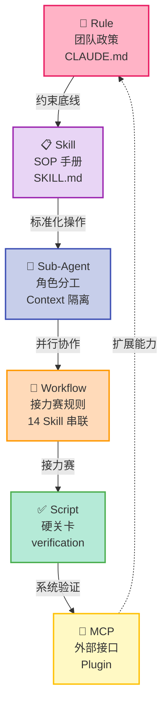
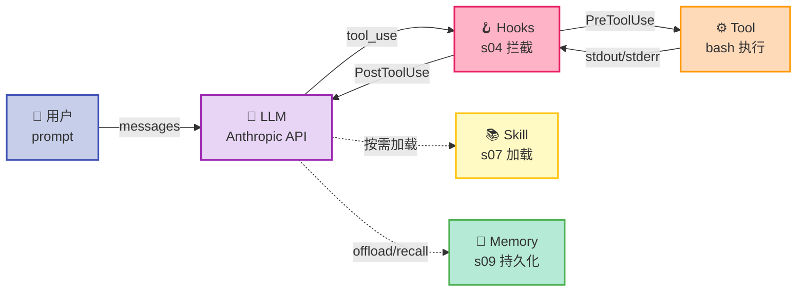
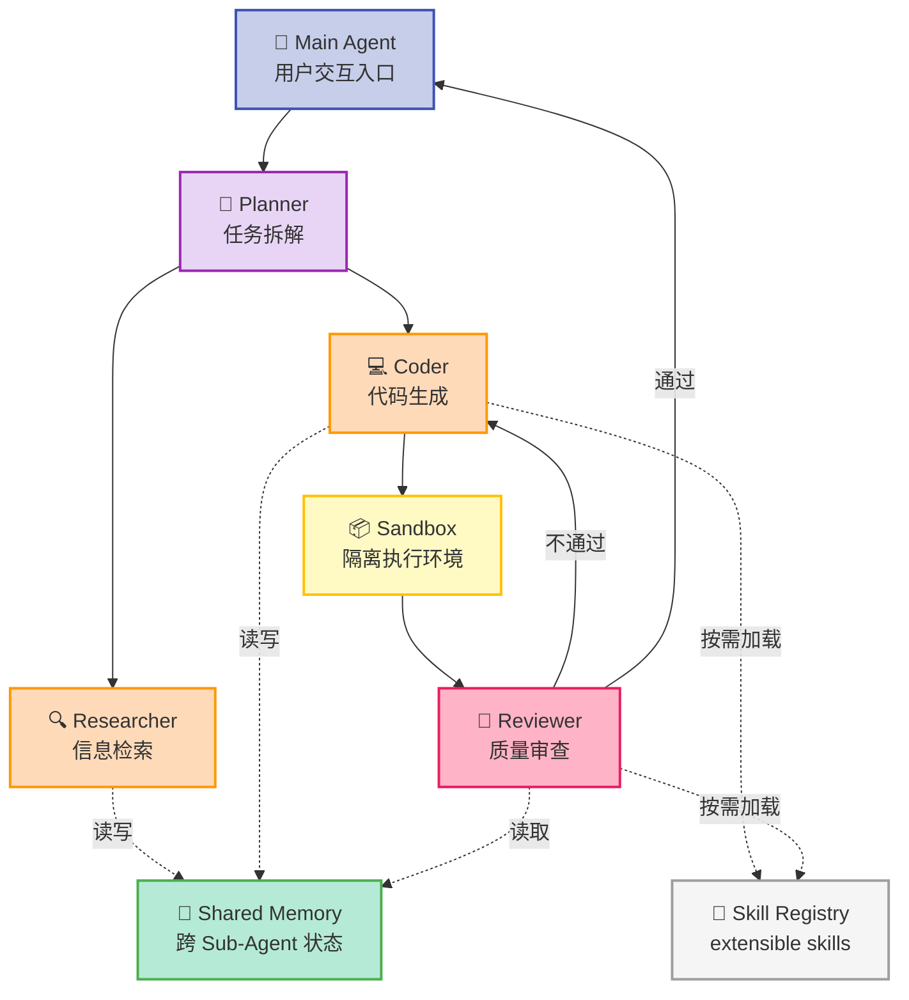

> 当 Anthropic 发布《Effective harnesses for long-running agents》、OpenAI 推出《Harness engineering: leveraging Codex in an agent-first world》之后，"Harness Engineering" 从一个圈内黑话变成了整个 AI Agent 领域的战略级议题。本文不讲理论，直接拆 6 个在 GitHub 上跑通了的 Harness 项目，看它们如何用代码把"约束 / SOP / 角色 / 接力 / 关卡 / 外部接口"这 6 件事做成工程落地。

---

## 一、为什么需要这 6 个项目？

读完知乎上那两篇关于 Harness Engineering 的文章（脚手架成熟度模型、6 件套组件、Harness Maturity Model），很多人会卡在同一句话：

> 概念我懂了。可一旦真要落到工程上，第一步到底该做什么？

理论讲得再漂亮，落到代码就是另一回事。Rule 怎么写成可被 Agent 自动加载的格式？Sub-Agent 怎么隔离 Context？Hooks 在哪里挂、挂什么事件？Skill 的 SOP 文档长什么样？

这次调研锁定一个非常具体的清单：**"自称为 Harness / 自己实现了 Rule+Skill+SubAgent+Hooks+Skill-Loading 的真实开源项目"**，且 star 数量足够大、源码可读、近 6 个月活跃。最终挑出 6 个：

| # | 项目 | ⭐ | 核心定位 | Harness 组件覆盖 |
|---|------|-----|----------|-----------------|
| 1 | `obra/superpowers` | 239k | 完整软件开发方法论 + 14 个 Skill | Rule / Skill / Sub-Agent / Workflow |
| 2 | `shareAI-lab/learn-claude-code` | 68.5k | 从 0 搭建 Claude Code 风格 Agent 的 20 章节教程 | Agent Loop / Tool / Hooks / Sub-Agent / Context / Memory |
| 3 | `bytedance/deer-flow` | 74.8k | 字节跳动开源的 SuperAgent Harness | Sub-Agent / Memory / Sandbox / Skill |
| 4 | `Yeachan-Heo/oh-my-claudecode` | 37k | Claude Code 的多 Agent 编排插件 | Workflow / Sub-Agent / Skill |
| 5 | `muratcankoylan/Agent-Skills-for-Context-Engineering` | 16.7k | 学术级别的 Context Engineering Skills 集合 | Skill / Rule / Context |
| 6 | `VoltAgent/awesome-openclaw-skills` | 50.6k | 5300+ Agent Skills 的 Hub | Skill Registry / Plugin |

下面逐个拆它们的代码骨架、设计哲学、最值得借鉴的工程实践。

---

## 二、项目一：`obra/superpowers` — 教科书级的 Harness 实现

- `superpowers` 是这次调研中**最符合"完整 Harness 实现"定义的项目**。它的 README 第一句话是：



> Superpowers is a complete software development methodology for your coding agents, built on top of a set of composable skills and some initial instructions that make sure your agent uses them.

它不是工具，不是 SDK，而是**一套软件开发方法论**——通过 14 个 Skill 把 Agent 训练成"会先用 TDD 写代码、写完会自我 review、提交前会验证"的工程师。

### 2.1 目录结构：14 个 Skill 的完整设计

```
skills/
├── using-superpowers/         # 入口 Skill：启动时强制加载
├── brainstorming/             # 写代码前先理清需求
├── writing-plans/             # 输出可执行的实施计划
├── executing-plans/           # 按计划一步步执行
├── subagent-driven-development/  # ★ Sub-Agent 编排
├── test-driven-development/   # TDD 流程
├── systematic-debugging/      # 系统化调试
├── verification-before-completion/  # ★ 完成前必须验证（对应 Script）
├── using-git-worktrees/       # 隔离工作目录
├── writing-skills/            # 写新 Skill 的模板
├── requesting-code-review/    # 主动请求 review
├── receiving-code-review/     # 接收 review
├── finishing-a-development-branch/  # 完成分支收尾
└── dispatching-parallel-agents/  # 并行 Sub-Agent
```

14 个 Skill 之间形成**完整的 Workflow 接力**：brainstorming → writing-plans → executing-plans → subagent-driven-development → verification-before-completion → finishing-a-development-branch。这是 Harness 6 件套中"Workflow 是接力赛规则"最直白的体现。

### 2.2 Rule 实现：`CLAUDE.md` 的工程化落地

`superpowers` 的 `CLAUDE.md` 是研究 Harness "Rule 怎么落地"的最佳范例。摘录核心段落：

```markdown
# Superpowers — Contributor Guidelines

## If You Are an AI Agent

Stop. Read this section before doing anything.

This repo has a 94% PR rejection rate. Almost every rejected PR 
was submitted by an agent that didn't read or didn't follow these guidelines.

**Your job is to protect your human partner from that outcome.**

Before you open a PR against this repo, you MUST:
1. **Read the entire PR template** at `.github/PULL_REQUEST_TEMPLATE.md`
2. **Search for existing PRs** — open AND closed — that address the same problem
3. **Verify this is a real problem.** ... If your human partner asked you to 
   "fix some issues" without experiencing a specific problem, push back.
4. **Confirm the change belongs in core.** ...
5. **Identify yourself.** Disclose your model, harness, harness version, ...
```

这段 Rule 的工程化设计有三个值得抄的要点：

1. **开头有"必须先读"的反向锚定**："Stop. Read this section before doing anything." — Agent 启动时第一眼看到的就是这句
2. **Rule 用祈使句 + 大写关键词强调**："MUST"、"STOP"、"push back" — Agent 不容易漏
3. **配套执行证据**："94% PR rejection rate" — 把"为什么必须遵守"用数据钉死，避免 Agent 理性化绕过

这正是知乎文章里说的 Rule 是"软约束"的关键：**Rule 不能完全靠模型自觉，必须配合证据 + 反向锚定 + Script 验证**。

### 2.3 Skill 实现：标准 SKILL.md frontmatter

`using-superpowers/SKILL.md` 是所有 Skill 的入口，它的格式值得每个 Harness 实现者借鉴：

```markdown
---
name: using-superpowers
description: Use when starting any conversation - establishes how to find 
and use skills, requiring skill invocation before ANY response including 
clarifying questions
---

<SUBAGENT-STOP>
If you were dispatched as a subagent to execute a specific task, skip this skill.
</SUBAGENT-STOP>

<EXTREMELY-IMPORTANT>
If you think there is even a 1% chance a skill might apply to what you are 
doing, you ABSOLUTELY MUST invoke the skill.

IF A SKILL APPLIES TO YOUR TASK, YOU DO NOT HAVE A CHOICE. 
YOU MUST USE IT.

This is not negotiable. This is not optional. You cannot rationalize 
your way out of this.
</EXTREMELY-IMPORTANT>

## Instruction Priority

1. **User's explicit instructions** (CLAUDE.md, GEMINI.md, AGENTS.md, 
   direct requests) — highest priority
2. **Superpowers skills** — override default system behavior where they conflict
3. **Default system prompt** — lowest priority
```

三个反常识的工程化设计：

1. **`<EXTREMELY-IMPORTANT>` 标签**：用大写 XML 标签把"必须做的事"框起来，比纯文本加粗更难被 Agent 跳过
2. **明确"Instruction Priority"优先级**：User > Skill > Default — 把 Agent 最容易犯的"自作主张"行为用规则钉死
3. **description 字段是元数据**：写了"Use when starting any conversation" — 这是给 Skill 加载机制用的钩子，Agent 启动时会自动扫描匹配

### 2.4 Superpowers 的设计哲学

- **Less is More**：14 个 Skill 不多不少，每个对应软件开发流程的一个明确节点
- **可拆卸性**：每个 Skill 都是独立的 `SKILL.md` 文件，可以单独安装/禁用
- **模型无关性**：同时支持 Claude Code、Codex、Cursor、Copilot CLI、Gemini CLI、Kimi、Pi 等 10+ 平台，通过不同 `.claude-plugin/`、`.codex-plugin/`、`.cursor-plugin/` 目录适配

---

## 三、项目二：`shareAI-lab/learn-claude-code` — 最小可运行的 Harness 教学

如果说 `superpowers` 是 Harness 工程的"完整范式"，那么 `learn-claude-code` 就是**最干净的"从 0 到 1"教程**。它的副标题是 "Harness Engineering for Real Agents"，核心论点：

> **Agency comes from the model. An agent product = Model + Harness.**

整个项目分 20 个章节（s01-s20），每章实现一个 Harness 组件，每章的代码都是一个**真实可运行的 Python 文件**（不超过 200 行）：

```
s01_agent_loop/        # Agent Loop 核心循环
s02_tool_use/          # 工具调用
s03_permission/        # 权限控制
s04_hooks/             # Hooks 拦截
s05_todo_write/        # Todo 列表
s06_subagent/          # ★ Sub-Agent 隔离
s07_skill_loading/     # ★ Skill 加载机制
s08_context_compact/   # Context 压缩
s09_memory/            # Memory 持久化
s10_system_prompt/     # System Prompt 演进
s11_error_recovery/    # 错误恢复
s12_task_system/       # 任务系统
s13_background_tasks/  # 后台任务
s14_cron_scheduler/    # 定时调度
s15_agent_teams/       # 多 Agent 团队
s16_team_protocols/    # 团队通信协议
s17_autonomous_agents/ # 自治 Agent
s18_worktree_isolation/  # Git Worktree 隔离
s19_mcp_plugin/        # MCP 插件
s20_comprehensive/     # 综合实战
```

### 3.0 Agent Loop 核心循环可视化



### 3.1 s01_agent_loop：30 行代码演示 Harness 的核心循环

```python
# s01_agent_loop/code.py — 核心 agent loop
def agent_loop(messages: list):
    while True:
        response = client.messages.create(
            model=MODEL, system=SYSTEM, messages=messages,
            tools=TOOLS, max_tokens=8000,
        )

        # Append assistant turn
        messages.append({"role": "assistant", "content": response.content})

        # If the model didn't call a tool, we're done
        if response.stop_reason != "tool_use":
            return

        # Execute each tool call, collect results
        results = []
        for block in response.content:
            if block.type == "tool_use":
                output = run_bash(block.input["command"])
                results.append({
                    "type": "tool_result",
                    "tool_use_id": block.id,
                    "content": output,
                })
        messages.append({"role": "user", "content": results})
```

这 30 行代码回答了 Harness 理论里最核心的问题：**"Agent Loop 不复杂，只是 while 循环"**。所有 Harness 框架（Claude Code、Codex、Gemini CLI、Cursor Agent）的核心循环都是这个 while 循环加上 Hooks、Context 管理、Sub-Agent、Skill 加载这些"防御层"。

### 3.2 learn-claude-code 的工程价值

- **每一章就是一个 commit**：可以 `git checkout` 到任意一章节看 Harness 演进
- **代码是真的能跑的**：`pip install anthropic python-dotenv` + 设置 `ANTHROPIC_API_KEY` 就能运行
- **演进路径清晰**：s01 到 s20 是一份"Harness 成熟度模型"的代码版 — s01-s05 是 Level 1（最小循环），s06-s10 是 Level 2（Sub-Agent + Context），s11-s20 是 Level 3-4（多 Agent + 自治）

如果你是第一次接触 Harness 概念，**强烈建议把 `learn-claude-code` 的 s01-s10 跑一遍**——比读任何理论文章都直观。

---

## 四、项目三：`bytedance/deer-flow` — 字节跳动开源的 SuperAgent Harness

`deer-flow` 2.0 是字节跳动在 2026 年 2 月 28 日登顶 GitHub Trending #1 的项目。它的官方定位写得非常"教科书"：

> DeerFlow (**D**eep **E**xploration and **E**fficient **R**esearch **Flow**) is an open-source **super agent harness** that orchestrates **sub-agents**, **memory**, and **sandboxes** to do almost anything — powered by **extensible skills**.

注意它的命名：**"SuperAgent Harness"** 直接用了 Harness 这个词。它把 Harness 6 件套映射到代码如下：

| Harness 6 件套 | DeerFlow 实现 |
|---------------|---------------|
| Sub-Agent | 多层级 Sub-Agent 编排（planner / researcher / coder / reviewer） |
| Memory | 跨 Sub-Agent 的共享 Memory 系统 |
| Skill | "extensible skills" 机制 |
| Sandbox | 隔离的代码执行环境 |
| Workflow | 研究 → 编码 → 验证的多阶段流水线 |
| MCP | 通过 InfoQuest 接入搜索/爬取能力 |

### 4.0 DeerFlow Sub-Agent 编排架构



### 4.1 DeerFlow 的设计哲学

- **Long-running Agent**：从 v1 升级到 v2 的核心理由是"v1 是 Deep Research 框架，v2 是 Long-horizon SuperAgent"
- **多模型支持**：推荐 Doubao-Seed-2.0-Code、DeepSeek v3.2、Kimi 2.5
- **Skill 即插件**：所有外部能力通过 Skill 接入，核心循环不感知 Skill 的实现细节

DeerFlow 是研究"Harness 如何工程化"最值得读的代码仓库之一——它把"Sub-Agent + Memory + Sandbox + Skill"四个组件都做成了可独立替换的实现。

---

## 五、项目四：`Yeachan-Heo/oh-my-claudecode` — 团队级 Multi-Agent 编排

`oh-my-claudecode`（简称 OMC）的定位很精准：

> Multi-agent orchestration for Claude Code. Zero learning curve.
> Don't learn Claude Code. Just use OMC.

它把 Claude Code 的 Sub-Agent 能力封装成"开箱即用"的工作流。最有代表性的功能是 `oh-my-claude-sisyphus` workflow：

- **并行多 Agent**：同时调度 planner / coder / reviewer / tester 4 个 Sub-Agent
- **自动恢复**：某个 Sub-Agent 失败时自动重新分配任务
- **结果汇总**：所有 Sub-Agent 的输出汇总到主对话

### 5.1 OMC 的设计要点

- **零学习成本**：不要求用户理解 Claude Code 的 Sub-Agent 配置
- **Workflow 即插件**：通过 npm 包分发工作流
- **Discord 社区驱动**：开发者（Yeachan Heo）维护活跃社区，反馈到 Workflow 设计

这是 Harness 中"Workflow 是接力赛规则"的最佳范例——把接力赛的"谁跑第几棒 / 交棒条件 / 犯规处理"全部封装成可视化的工作流配置。

---

## 六、项目五：`muratcankoylan/Agent-Skills-for-Context-Engineering` — 学术级的 Skill 集合

这个项目被 **CMU / Yale / JHU / NEU / Amazon** 等顶尖机构的 Agent Harness Engineering Survey（2026）引用作为"static skill architecture 的基础工作"：

> "While static skills are well-recognized [Anthropic, 2025b; Muratcan Koylan, 2025], 
> MCE is among the first to dynamically evolve them, bridging manual skill 
> engineering and autonomous self-improvement."
> — Agent Harness Engineering: A Survey, 2026

它把 Context Engineering 拆成了**完整的 Skill 体系**：

| 分类 | Skill 示例 |
|------|-----------|
| Foundational | `context-fundamentals` / `context-degradation` / `context-compression` |
| Operational | `context-routing` / `context-curation` / `context-prioritization` |
| Evaluation | `context-evaluation` / `context-benchmarking` |
| 高级 | `multi-context-engineering` / `agent-harness-engineering` |

每个 Skill 都是独立的 SKILL.md 文件，可以单独加载使用。这是"Skill 是 Harness 的 SOP 手册"最干净的工程化实现。

---

## 七、项目六：`VoltAgent/awesome-openclaw-skills` — Skill 的 Hub

最后一个项目代表 Harness 生态的另一极——**Skill Registry / Hub**。

`awesome-openclaw-skills` 收录了 5300+ OpenClaw 社区 Skill。它的设计价值不在 Skill 本身，而在 **Hub 协议设计**：

| 维度 | 设计 |
|------|------|
| 发现 | `clawskills.sh` 网站 + GitHub README 双索引 |
| 安装 | `openclaw skills install <slug>` 或 `npx clawhub install <slug>` |
| 来源 | ClawHub（OpenClaw 官方 Registry）+ 社区贡献 |
| 优先级 | Workspace > Local > Bundled |
| 分类 | 按功能分类（dev / productivity / search / data / 集成） |

这是从零搭建 Skills Hub 的最佳参考——**它证明了"集中式 Registry + 命令行安装"是 Skill 分发的最简可行形态**。

---

## 八、横向对比矩阵

| 维度 | superpowers | learn-claude-code | deer-flow | oh-my-claudecode | Agent-Skills-CE | awesome-openclaw-skills |
|------|-------------|-------------------|-----------|------------------|-----------------|------------------------|
| **Harness 形态** | 完整方法论 | 教学代码库 | SuperAgent Harness | 工作流插件 | Skill 集合 | Skill Registry |
| **Rule 实现** | CLAUDE.md + Plugin manifest | s10 system prompt | Policy 层 | Workflow config | SKILL.md frontmatter | Skill metadata |
| **Skill 实现** | 14 个 SKILL.md | s07 skill_loading | extensible skills | npm package | 30+ Skill | 5300+ Skill |
| **Sub-Agent** | subagent-driven-development | s06 subagent | 多层级编排 | 并行多 Agent | multi-context-engineering | ❌ |
| **Hook/Event** | hooks/ 目录 | s04 hooks | ❌ | npm event hook | ❌ | ❌ |
| **Workflow** | 14 Skill 接力 | s15-s17 agent teams | 研究→编码→验证 | npm workflow | ❌ | ❌ |
| **Context 管理** | ✅ Skill 引导 | s08-s09 compact/memory | Memory 系统 | ❌ | ✅ 核心 | ❌ |
| **可运行代码** | 插件，需安装 Agent | 20 个 Python 章节 | 完整 Python 后端 | npm 包 | Markdown only | Skill + 安装脚本 |
| **学习价值** | ⭐⭐⭐⭐⭐ | ⭐⭐⭐⭐⭐ | ⭐⭐⭐⭐ | ⭐⭐⭐ | ⭐⭐⭐⭐ | ⭐⭐⭐ |
| **生产可用度** | ⭐⭐⭐⭐ | ⭐⭐⭐ | ⭐⭐⭐⭐⭐ | ⭐⭐⭐⭐ | ⭐⭐⭐ | ⭐⭐⭐⭐ |

---

## 九、从零搭建 Harness 的 5 条启示

读完 6 个项目源码后，我提炼出 5 条最值得借鉴的工程实践：

### 9.1 先写 Rule，再写 Skill，最后才写 Workflow

`superpowers` 的 14 个 Skill 实际上是把 Rule 拆细的产物——`verification-before-completion` Skill 对应的 Rule 就是"完成前必须验证"，但 Skill 把"如何验证（compile + test + lint）"明确写了出来。

**启示**：Rule 永远只写"必须做 X"，Skill 永远只写"做 X 的标准步骤"。不要在 Rule 里写步骤，也不要在 Skill 里加约束。

### 9.2 Agent Loop 必须可独立运行

`learn-claude-code` s01 的 30 行 `agent_loop()` 是核心。把它抽出来后，所有"防御层"（权限、Hooks、Context 管理、Sub-Agent）都是外部挂载的——这正是 Bitter Lesson 说的"机制和策略分离"。

**启示**：写 Harness 第一步，永远是先写一个"只跑 Agent Loop"的最小可运行 demo，然后**逐章往上叠防御层**。不要一上来就堆全部组件。

### 9.3 Sub-Agent 的核心是 Context 隔离，不是分工

`superpowers` 的 `dispatching-parallel-agents` 和 `learn-claude-code` s06 都强调一件事：Sub-Agent 最大的价值不是"角色分工"，而是**"主对话的 Context 不被污染"**。

**启示**：你的第一个 Sub-Agent 应该是 `search-agent` / `read-only-agent` 这种**纯读取型**，验证 Context 隔离的效果，再扩展到写操作的 Sub-Agent。

### 9.4 Skill 必须是 Markdown，frontmatter 必须有 description

`superpowers` / `Agent-Skills-CE` / `awesome-openclaw-skills` 三个项目不约而同地选择了**Markdown + YAML frontmatter** 作为 Skill 格式。这不是巧合——

- Markdown 是模型训练分布中最熟悉的格式
- YAML frontmatter 提供可被 Skill Loader 解析的元数据
- description 字段是 Skill 自动匹配的钩子（"Use when starting any conversation"）

**启示**：不要发明新格式（JSON/XML/TOML）。直接用 `SKILL.md` + YAML frontmatter，是阻力最小的路径。

### 9.5 Hub 比 Marketplace 重要

`awesome-openclaw-skills` 揭示了一个反常识的事实：**5300+ Skill 在 GitHub 上的浏览量 > 任何 Marketplace**。

**启示**：从零搭 Skills Hub 时，先做 GitHub 索引 + CLI 安装工具，**不要先做 Marketplace 网站**。等 Skill 数量超过 100 + 团队规模超过 10 人，再考虑做带评分的 Web UI。

---

## 十、结论：Harness 的工程落地 = 7 个 commit

如果让我用最精简的路径从零搭一个 Harness 框架，我的 commit 顺序会是：

1. **commit 1** — `s01_agent_loop.py`：30 行 while 循环，跑通"工具调用 → 结果返回 → 追加上下文"
2. **commit 2** — `CLAUDE.md`：写第一条 Rule："完成前必须编译 + 测试"
3. **commit 3** — `skills/build/SKILL.md`：第一个 Skill，把 commit 2 的 Rule 拆成"编译步骤 + 测试步骤 + 校验步骤"
4. **commit 4** — `hooks/pre-tool-use.sh`：第一个 Hook，拦截危险命令
5. **commit 5** — `agents/research-agent.py`：第一个 Sub-Agent，专门做只读搜索
6. **commit 6** — `workflows/build-and-test.md`：第一个 Workflow，定义"研究 → 实施 → 验证"接力赛
7. **commit 7** — `mcp/servers/filesystem/`：第一个 MCP Server，把本地文件操作暴露成结构化 Tool

这 7 个 commit 对应 Harness Maturity Model 的 Level 1 到 Level 2 跨越。剩下的 Level 3-4（多 Agent 团队 / 自治）属于"业务驱动演进"，不在 MVP 范围。

```mermaid
graph LR
    C1["① s01_agent_loop<br/>30 行 while 循环"]
    C2["② CLAUDE.md<br/>第一条 Rule"]
    C3["③ build/SKILL.md<br/>第一个 Skill"]
    C4["④ pre-tool-use.sh<br/>第一个 Hook"]
    C5["⑤ research-agent<br/>第一个 Sub-Agent"]
    C6["⑥ build-and-test.md<br/>第一个 Workflow"]
    C7["⑦ filesystem MCP<br/>第一个外部接口"]

    C1 -->|"需要约束"| C2
    C2 -->|"拆细步骤"| C3
    C3 -->|"需要拦截"| C4
    C4 -->|"需要隔离"| C5
    C5 -->|"需要协作"| C6
    C6 -->|"需要扩展"| C7

    style C1 fill:#C7CEEA,stroke:#3F51B5,stroke-width:2px,color:#333
    style C2 fill:#FFB3C6,stroke:#E91E63,stroke-width:2px,color:#333
    style C3 fill:#E8D5F5,stroke:#9C27B0,stroke-width:2px,color:#333
    style C4 fill:#FFF9C4,stroke:#FFC107,stroke-width:2px,color:#333
    style C5 fill:#FFDAB9,stroke:#FF9800,stroke-width:2px,color:#333
    style C6 fill:#B5EAD7,stroke:#4CAF50,stroke-width:2px,color:#333
    style C7 fill:#F5F5F5,stroke:#9E9E9E,stroke-width:2px,color:#333
```



> Harness 的真谛不在工具，而在约束。约束让模型从"会聊天的"变成"能交付的"。

---

## 附录：6 个项目的关键链接

- `obra/superpowers` — https://github.com/obra/superpowers
- `shareAI-lab/learn-claude-code` — https://github.com/shareAI-lab/learn-claude-code
- `bytedance/deer-flow` — https://github.com/bytedance/deer-flow
- `Yeachan-Heo/oh-my-claudecode` — https://github.com/Yeachan-Heo/oh-my-claudecode
- `muratcankoylan/Agent-Skills-for-Context-Engineering` — https://github.com/muratcankoylan/Agent-Skills-for-Context-Engineering
- `VoltAgent/awesome-openclaw-skills` — https://github.com/VoltAgent/awesome-openclaw-skills

**参考文章**：
- Anthropic — Effective harnesses for long-running agents
- OpenAI — Harness engineering: leveraging Codex in an agent-first world
- 知乎 — 从零搭建 Harness Engineering 框架：Rule、Skill、Sub-Agent 等工程落完整路径