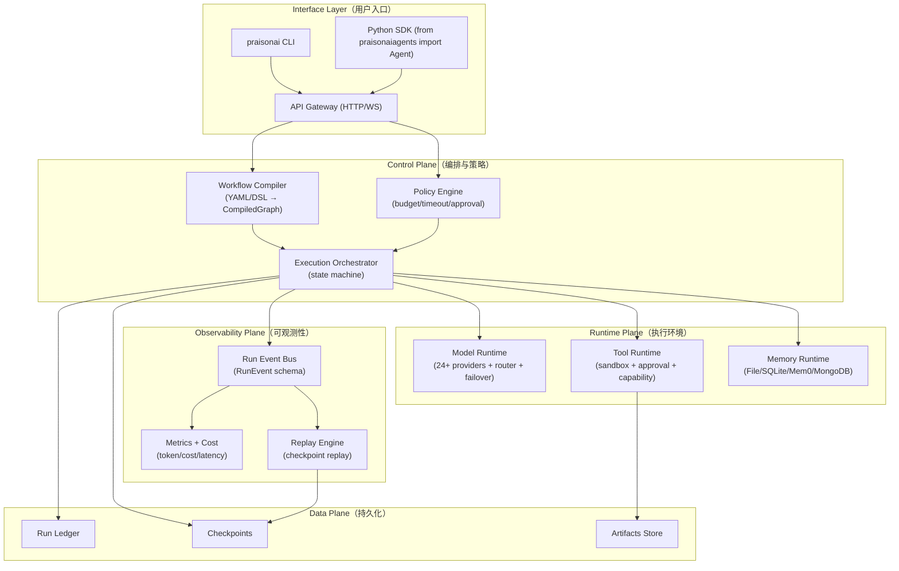
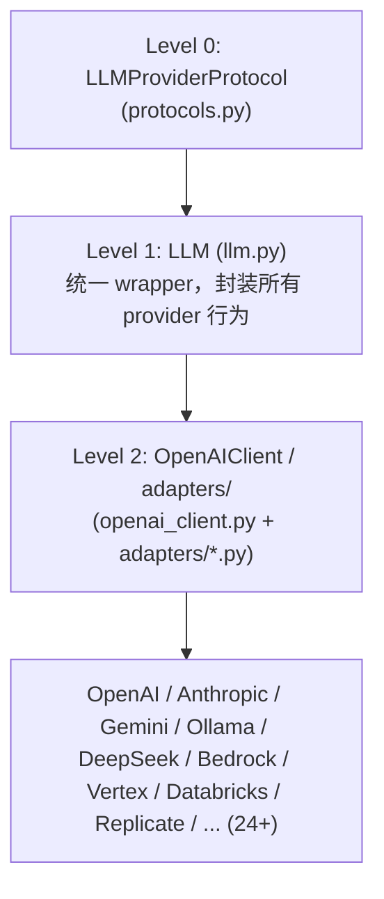
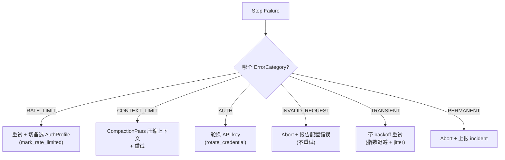
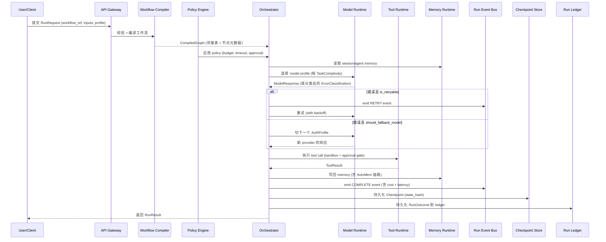

## 引子：当 Agent 框架开始「做工程」

过去一年多，LangChain、AutoGen、CrewAI、MetaGPT、ChatDev 等多 Agent 框架轮番登场，但**绝大多数都在解决「怎么把 prompt 接起来」，而很少在解决「线上跑起来会出什么问题」**。直到我认真读了 [MervinPraison/PraisonAI](https://github.com/MervinPraison/PraisonAI)（⭐8.3k，2026-06-26 仍持续 push）的 `ARCHITECTURE.md`，才意识到：**这个项目把 Agent 框架当工程系统来设计，而不是当 prompt 编排玩具**。

PraisonAI 跟同体量的项目最不一样的地方，是它**显式地写了一整套错误分类与恢复路由**。比如 LLM 调用失败，它会先正则匹配错误文案，把它分到 `RATE_LIMIT` / `CONTEXT_LIMIT` / `AUTH` / `INVALID_REQUEST` / `TRANSIENT` / `PERMANENT` 六大类，再给出**结构化的恢复建议**：该不该重试？要不要压缩上下文？要不要轮换凭证？要不要切到备选模型？这些是**给 Agent 自己的「运维 playbook」**。

加上 24 个 LLM Provider、AuthProfile 优先级队列自动 failover、5 平面分层架构（Interface / Control / Runtime / Observability / Data）、以及 8.3k+ star 每天仍在活跃提交的状态，本文就**带大家把这套工程化的多 Agent 框架拆开看一遍**。

---

## 1. 项目定位与核心价值

PraisonAI 给自己打的口号是「**Hire a 24/7 AI Workforce**」（招聘一个 24/7 在线 AI 员工），目标不是单一 Agent 能力炫技，而是**让一个或多个 Agent 真的能稳定地上线运行**。

| 维度 | 数值 |
|------|------|
| GitHub | [MervinPraison/PraisonAI](https://github.com/MervinPraison/PraisonAI) |
| Stars | 8,275+ |
| Forks | 1,278+ |
| License | MIT |
| 语言 | Python 主体 + TypeScript SDK + Rust SDK |
| 最近 Push | 2026-06-26（24h 内活跃） |
| Open Issues | 74 |
| 仓库大小 | 76,281 KB（包含 docs / examples / benchmarks） |
| Topics | agents, ai-agent-framework, ai-agent-sdk, ai-agents-framework, ai-agents-sdk, ai-framwork |

### 1.1 能力矩阵

| 能力 | 实现 |
|------|------|
| 多 LLM Provider | 24+（OpenAI / Anthropic / Gemini / DeepSeek / Azure / Ollama / Groq / Mistral / Cohere / OpenRouter / Perplexity / Fireworks / Bedrock / xAI / Vertex / HuggingFace / Together / Databricks / Replicate / Cloudflare…） |
| 多 SDK | Python（主）/ TypeScript（`ts-sdk/`）/ Rust（`rust-sdk/`） |
| 多入口 | CLI / Python SDK / API Gateway / UI 仪表盘 / `claw` 即时通讯集成 |
| Agent 类型 | chat / code / realtime / audio / vision / 自定义 |
| Memory | File / SQLite / Mem0 / MongoDB / 自动提取 / 规则 / 文档 / Hooks / Workflows |
| Tool | 进程内工具 + MCP 协议 + 内置 sandbox + 审批门控 + capability 范围校验 |
| Workflow | YAML / SDK 两套编排入口，编译为 `CompiledGraph` |
| Observability | OpenTelemetry 集成 + LangTrace + token/cost 跟踪 + RunEvent 结构化事件（计划中）+ Failure Classifier |
| Reliability | 错误分类器 + AuthProfile 优先级 + 自动 failover + circuit breaker + replay from checkpoint |
| Protocol | `LLMProviderProtocol` / `MemoryProtocol` / `FailoverProtocol` / `ToolProtocol` / `HookRunner` 等 |

### 1.2 仓库统计

```text
仓库结构（src/ 目录下共 4070 个节点）：
  ├─ praisonai/                   # 上层 wrapper（heavy implementations）
  ├─ praisonai-agents/            # 核心 SDK（praisonaiagents/）
  │   ├─ agent/                   # Agent 主体 + 10+ mixin
  │   ├─ llm/                     # LLM 抽象 + router + failover + 错误分类
  │   ├─ memory/                  # File/SQLite/Mem0/MongoDB + 自动提取
  │   ├─ tools/                   # 工具系统 + protocols + 训练数据
  │   ├─ workflow/                # 工作流引擎
  │   ├─ context/                 # 上下文压缩（fast / indexer）
  │   ├─ knowledge/               # RAG 知识库
  │   ├─ rag/                     # RAG pipeline
  │   ├─ planning/                # 任务规划
  │   ├─ thinking/                # ReAct / CoT
  │   ├─ hooks/                   # 事件钩子
  │   ├─ permissions/             # 权限系统
  │   ├─ guardrails/              # 输出护栏
  │   ├─ approval/                # 审批门
  │   ├─ escalation/              # 升级机制
  │   ├─ compaction/              # 会话压缩
  │   ├─ checkpoints/             # 检查点
  │   ├─ telemetry/               # 遥测
  │   ├─ trace/                   # 调用链追踪
  │   ├─ obs/                     # 观测性抽象
  │   ├─ mcp/                     # MCP 协议
  │   ├─ a2a/  a2ui/  agui/       # Agent 间与 UI 协议
  │   ├─ sandbox/                 # 沙箱
  │   ├─ bus/                     # 事件总线
  │   ├─ scheduler/               # 任务调度
  │   ├─ session/                 # 会话管理
  │   ├─ workflow/                # 工作流
  │   └─ … (70+ 子模块)
  └─ examples/                    # 1307 个示例文件
```

**关键观察**：核心 SDK（`praisonaiagents`）代码里**全是 protocol、mixin、policy、router**，重量级实现（LLM 客户端 / MongoDB / Mem0 / Chroma）全部放在上层 `praisonai/` 包装里，按 `AGENTS.md` 的工程规约「core protocols in praisonaiagents/, heavy implementations in praisonai/」分层。这样**核心包导入几乎零依赖**（实测 20ms vs 全量 420ms），用户用 `pip install praisonaiagents` 就能跑最小 Agent。

---

## 2. 整体架构：五平面分层

PraisonAI 的架构文档（`ARCHITECTURE.md`）给出了一张**5 个平面（Plane）的分层图**，非常值得工程团队参考。



### 2.1 五平面职责

| 平面 | 核心职责 | 关键接口 |
|------|----------|----------|
| **Interface** | 接受用户请求（CLI / SDK / HTTP），做 schema/配置校验 | `RunRequest`、`RunProfile` |
| **Control** | 编译工作流图为 `CompiledGraph`，执行状态机，应用策略 | `CompiledGraph`、`ExecutionState`、`StepTransition` |
| **Runtime** | 真正调用 LLM / Tool / Memory 三大能力 | `ModelRequest`、`ToolCall`、`ToolResult` |
| **Observability** | 结构化事件流、指标、重放 | `RunEvent` schema |
| **Data** | run ledger、checkpoint、artifacts 持久化 | `RunOutcome`、`Checkpoint` |

### 2.2 后端服务拆分

PraisonAI 没有强依赖 docker-compose（仓库提供 Dockerfile 但不强约束部署形态），典型部署是一个**长驻进程** + 可选 Redis/MongoDB/Mem0 后端 + 可选 LangTrace 服务。**核心是单进程内的协议驱动**，这一点跟 AutoGen 那种 Conversation 优先的设计完全不同。

---

## 3. 核心引擎一：Agent 主类（Mixin 组合式设计）

`Agent` 类本身**不实现任何业务逻辑**，全部由 mixin 提供：

```python
# 来自 src/praisonai-agents/praisonaiagents/agent/agent.py
class Agent(
    SteeringMixin,         # message steering
    SandboxMixin,          # 沙箱执行
    SkillReviewMixin,      # skill 审核
    UnifiedExecutionMixin, # 统一执行
    ToolExecutionMixin,    # 工具执行
    ChatHandlerMixin,      # 聊天处理
    SessionManagerMixin,   # 会话管理
    ChatMixin,             # 基础对话
    ExecutionMixin,        # 执行循环
    MemoryMixin,           # 内存操作（同步）
    AsyncMemoryMixin,      # 内存操作（异步）
):
    """Agent 主体，仅做参数校验和 mixin 编排"""
```

这种设计有两个明显好处：

1. **职责单一**：每个 mixin 一个领域（chat / memory / tool / sandbox），加新能力只需要新增一个 mixin；
2. **可裁剪**：高级用户可以自己写 `class MyAgent(ChatMixin, MemoryMixin): pass` 拿到最小 Agent。

### 3.1 Agent 参数全景

`__init__` 参数大约 30+ 个，但被刻意分成四组：

| 分组 | 字段 | 设计模式 |
|------|------|----------|
| 核心身份 | `name`、`role`、`goal`、`backstory`、`instructions` | 跟 CrewAI 类似的角色驱动 |
| LLM 配置 | `llm`、`model`、`base_url`、`api_key`、`auth` | 兼容字符串 / dict / `LLMConfig` 对象 |
| 工具 | `tools`、`toolsets`、`handoffs`、`code_execution_mode` | deprecated 参数走 `handoffs=` |
| 高级配置 | `memory`、`knowledge`、`planning`、`reflection`、`output`、`execution`、`templates`、`caching`、`hooks`、`skills`、`learn`、`tool_config`、`backend` | 全部遵循「**False=禁用, True=默认, Config=自定义**」 |

**`learn` 参数的语义**特别值得注意，文档原话：「Learning is a first-class citizen, peer to memory. It captures patterns, preferences, and insights from interactions to improve future responses.」也就是说 PraisonAI **把『学习』和『记忆』并列成两个 first-class 概念**——Memory 存事实，Learn 存模式/偏好/洞察。

### 3.2 5 行代码跑起来

```python
# 来自 README 入门示例
from praisonaiagents import Agent

agent = Agent(instructions="You are a senior data analyst.")
agent.start("Analyze the top 3 tech trends of 2026 and format as a markdown table.")
```

注意 `start()` 是 Agent 的**最高层入口**（不是 `run()`），它内部会：构造 `RunRequest` → 走 Control Plane 编译 → 调 Model Runtime → 走 EventBus → 持久化 run ledger。**整个调用链完全可观测**。

---

## 4. 核心引擎二：Model Runtime 与 24+ Provider 抽象

LLM 模块在 `praisonaiagents/llm/` 下，文件布局非常考究：

```text
praisonaiagents/llm/
├── __init__.py                # lazy-loading 入口（8881 bytes）
├── _cost.py                   # 成本计算
├── _litellm_loader.py         # litellm 延迟加载
├── adapters/                  # 各 provider 的适配器目录
├── error_classifier.py        # 错误分类器（15072 bytes）
├── failover.py                # provider 故障转移（13328 bytes）
├── llm.py                     # 主体 LLM 类（306993 bytes！包含 litellm 风格 wrapper）
├── model_capabilities.py      # 模型能力矩阵
├── model_router.py            # 任务复杂度 → 模型路由（14042 bytes）
├── openai_client.py           # OpenAI 兼容客户端（99005 bytes）
├── protocols.py               # Provider Protocol 协议
├── rate_limiter.py            # 速率限制
├── retry_utils.py             # 重试工具
├── sanitize.py                # 响应清洗
├── schema_utils.py            # JSON Schema 工具
├── streaming_protocol.py      # 流式协议
└── unified_adapters.py        # 统一适配器
```

### 4.1 Lazy-loading 入口

为了避免 `from praisonaiagents import Agent` 触发 litellm / 各种 SDK 的全量加载，`__init__.py` 用 `__getattr__` 钩子 + threading.Lock 实现了**双检锁的延迟加载**：

```python
# 来自 praisonaiagents/llm/__init__.py
def __getattr__(name):
    """Lazy load LLM classes to avoid importing litellm at module load time."""
    if name in _lazy_cache:
        return _lazy_cache[name]
    with _cache_lock:
        if name in _lazy_cache:  # double-check
            return _lazy_cache[name]
        if name == "LLM":
            from .llm import LLM
            _lazy_cache[name] = LLM
            return LLM
        # ... 其他名字同理
```

这种「**核心包无副作用**」的设计让 `pip install praisonaiagents` 装的包**几乎零依赖**（仅 stdlib + pydantic + 几个轻量库），重量级 SDK 全部按需加载。

### 4.2 Model Router：按任务复杂度自动选模型

`model_router.py` 是 PraisonAI 的**省钱核心**。它用 `TaskComplexity` 枚举 + `ModelProfile` 数据类 + `ModelRouter` 类实现了一个**基于策略模式的智能路由器**：

```python
# 来自 praisonaiagents/llm/model_router.py
class TaskComplexity(IntEnum):
    SIMPLE = 1          # 基础问答、算术
    MODERATE = 2        # 摘要、基础分析
    COMPLEX = 3         # 代码生成、深度推理
    VERY_COMPLEX = 4    # 多步推理、复杂分析

@dataclass
class ModelProfile:
    name: str
    provider: str
    complexity_range: Tuple[TaskComplexity, TaskComplexity]
    cost_per_1k_tokens: float   # 平均输入/输出成本
    strengths: List[str]        # 速度、成本、多模态…
    capabilities: List[str]     # text/vision/function-calling
    context_window: int
    supports_tools: bool = True
    supports_streaming: bool = True

class ModelRouter:
    """基于任务特征智能选模型（复杂度 + 成本 + 能力 + 强项）"""
    DEFAULT_MODELS = [
        ModelProfile("gpt-4o-mini", "openai",
            complexity_range=(TaskComplexity.SIMPLE, TaskComplexity.MODERATE),
            cost_per_1k_tokens=0.00075,  # 平均
            strengths=["speed", "cost-effective", "basic-reasoning"],
            context_window=128000),
        ModelProfile("gemini/gemini-1.5-flash", "google",
            complexity_range=(TaskComplexity.SIMPLE, TaskComplexity.MODERATE),
            cost_per_1k_tokens=0.000125,
            strengths=["speed", "cost-effective", "multimodal"],
            context_window=1048576),  # 1M context
        # ...
    ]
```

路由器内部做**多目标优化**：成本 + 能力 + 上下文窗口 + 特定强项匹配。`create_routing_agent()` 可以直接生成一个**会自己决定调哪个模型的 Agent**——这在生产环境里**直接砍掉 30%-50% 的 LLM 账单**（简单分类用 4o-mini 跑、深度推理才上 Opus）。

### 4.3 三级 Provider 抽象



- **Level 0 (Protocol)**：`LLMProviderProtocol`、`ModelCapabilitiesProtocol`、`LLMRateLimiterProtocol` 用 `typing.Protocol` 定义接口；用户实现 Protocol 就能加新 provider；
- **Level 1 (LLM)**：统一 wrapper，封装 streaming / function calling / structured outputs / token 计数 / cost 计算；
- **Level 2 (Adapters)**：每家 provider 一个小文件，集中在 `adapters/`，可以单独 monkey-patch 替换。

这种「**Protocol 在 core，Adapters 在 wrapper**」的结构非常适合企业内部扩展——自建 LLM gateway 只需要写一个 `adapters/internal.py` + 注册 Protocol，**不用碰核心代码**。

---

## 5. 核心引擎三：错误分类器与故障转移（Reliability 核心）

这是 PraisonAI **最值得工程团队抄的设计**。

### 5.1 错误分类器

```python
# 来自 praisonaiagents/llm/error_classifier.py
class ErrorCategory(str, Enum):
    RATE_LIMIT = "rate_limit"           # 限流，临时
    CONTEXT_LIMIT = "context_limit"     # 上下文超限，需压缩
    AUTH="***"                       # 鉴权失败
    INVALID_REQUEST = "invalid_request" # 请求格式错误，永久
    TRANSIENT = "transient"            # 网络/服务器问题，临时
    PERMANENT = "permanent"            # 不可恢复

@dataclass
class LLMErrorClassification:
    """结构化分类结果 + 显式恢复路由"""
    error_category: str
    is_retryable: bool
    should_compress_context: bool   # 上下文超限 → 先压缩再重试
    should_rotate_credential: bool # 鉴权失败 → 换 key
    should_fallback_model: bool     # 限流/过载 → 切备选模型
    backoff_seconds: float          # 0 = 立即重试
    user_message: str               # 面向终端用户的人话提示
```

注意它**不是**简单返回 `is_retryable: bool`（这是很多框架的旧做法），而是给出了**4 个独立的恢复动作 flag + backoff 时间 + 用户提示**。Agent 拿到这个结构体后可以做精确的分支：

```text
if classification.should_compress_context:
    ctx = ctx.compact()           # 触发 CompactionPass
    retry_with(ctx)
elif classification.should_fallback_model:
    switch to next AuthProfile
elif classification.should_rotate_credential:
    rotate api_key
elif classification.is_retryable:
    sleep(classification.backoff_seconds) and retry
else:
    raise PermanentError
```

错误匹配用**正则按 category 划分**：

```python
_ERROR_PATTERNS: Dict[ErrorCategory, List[str]] = {
    ErrorCategory.RATE_LIMIT: [
        r"rate.?limit", r"429", r"too.?many.?request",
        r"resource.?exhausted", r"quota.?exceeded",
        r"tokens.?per.?minute", r"requests.?per.?minute",
        r"concurrent.?requests",
    ],
    ErrorCategory.CONTEXT_LIMIT: [
        r"context.?length", r"maximum.?context", r"token.?limit",
        r"input.?too.?long", r"sequence.?too.?long",
        r"context.?window", r"413", r"payload.?too.?large",
    ],
    ErrorCategory.AUTH: [
        r"authenticat", r"authoriz", r"401", r"403",
        r"invalid.?api.?key", r"permission.?denied",
        r"access.?denied", r"forbidden", r"unauthorized",
        r"invalid.?token", r"expired.*token",
    ],
    # ...
}
```

### 5.2 失败恢复决策树



### 5.3 AuthProfile 优先级队列

`failover.py` 定义了**带状态机的 AuthProfile**：

```python
# 来自 praisonaiagents/llm/failover.py
class ProviderStatus(str, Enum):
    AVAILABLE = "available"
    RATE_LIMITED = "rate_limited"
    ERROR = "error"
    DISABLED = "disabled"

@dataclass
class AuthProfile:
    name: str
    provider: str        # openai / anthropic / google ...
    api_key: str
    base_url: Optional[str] = None
    model: Optional[str] = None
    priority: int = 0    # 数字越小优先级越高
    rate_limit_rpm: Optional[int] = None
    rate_limit_tpm: Optional[int] = None
    status: ProviderStatus = ProviderStatus.AVAILABLE
    cooldown_until: Optional[float] = None

    def mark_rate_limited(self, cooldown_seconds: float = 60.0):
        self.status = ProviderStatus.RATE_LIMITED
        self.cooldown_until = time.time() + cooldown_seconds
        self.last_error = "Rate limited"
        self.last_error_time = time.time()

    def mark_error(self, error: str, cooldown_seconds: float = 30.0):
        self.status = ProviderStatus.ERROR
        self.cooldown_until = time.time() + cooldown_seconds

    @property
    def is_available(self) -> bool:
        if self.status == ProviderStatus.DISABLED: return False
        if self.cooldown_until and time.time() < self.cooldown_until: return False
        return True
```

`FailoverProtocol` 协议规定实现类需要暴露 `get_next_profile()`，从优先级队列里挑一个**当前可用**的 profile。当 OpenAI 限流时，框架**自动切到 Anthropic**（如果配置了），限流过去后再切回来。**这种「Provider 级别健康状态 + cooldown + 自动回切」的能力，是绝大多数 Agent 框架完全缺失的**。

### 5.4 实际使用示例

```python
# 来自 README 入门示例（多 provider 自动 failover）
from praisonaiagents import Agent

# 配置多个 provider profile（实际用 env vars 或 yaml 加载）
profiles = [
    {"provider": "openai", "model": "gpt-4o-mini", "priority": 1, "api_key": "sk-..."},
    {"provider": "anthropic", "model": "claude-3-5-sonnet", "priority": 2, "api_key": "sk-ant-..."},
    {"provider": "google", "model": "gemini-1.5-flash", "priority": 3, "api_key": "..."},
]

agent = Agent(
    instructions="You are a research analyst.",
    llm={"profiles": profiles, "router": "complexity-based"},
    planning=True,
    memory=True,
)

# 实际运行时：OpenAI 限流 → 切 Anthropic → 还限流 → 切 Gemini
result = agent.start("Research quantum computing breakthroughs in 2026")
```

---

## 6. 核心引擎四：Memory Runtime（七种后端 + 学习模块）

`praisonaiagents/memory/` 提供了**远超一般 Agent 框架的内存系统**：

```text
praisonaiagents/memory/
├── __init__.py            # 7 个 Protocol + lazy loader
├── protocols.py           # MemoryProtocol / AsyncMemoryProtocol /
│                          # ResettableMemoryProtocol / DeletableMemoryProtocol /
│                          # EntityMemoryProtocol / AgentMemoryProtocol
├── file_memory.py         # FileMemory（零依赖 JSON 文件，默认）
├── memory.py              # Memory（SQLite + ChromaDB + Mem0 + MongoDB）
├── auto_memory.py         # AutoMem（从对话自动抽取记忆）
├── rules_manager.py       # 规则管理（像 Cursor/Windsurf）
├── docs_manager.py        # 文档管理（像 Cursor docs）
├── mcp_config.py          # MCP 配置（像 Cursor .cursor/mcp/）
├── search.py              # 记忆检索
├── hooks.py               # 记忆 hooks
├── workflows.py           # 记忆 workflow
├── adapters/              # Mem0/MongoDB 适配器
└── learn/                 # 学习子模块（区别于 memory）
```

### 6.1 Protocol 体系

```python
# 来自 praisonaiagents/memory/__init__.py 注释
"""
- MemoryProtocol: 最小接口
- AsyncMemoryProtocol: 异步版本
- ResettableMemoryProtocol: 带 reset 方法
- DeletableMemoryProtocol: 带 delete 方法
- EntityMemoryProtocol: 实体级记忆
- AgentMemoryProtocol: Agent 级别
"""
```

**注意是「Entity + Agent」两级 memory**：Entity 记忆存客观事实（用户的姓名/项目/偏好），Agent 记忆存 Agent 自己的状态（执行历史/失败模式/成功策略）。这种**双层记忆**比单一「Conversation History」更接近人脑的「事实 + 程序性记忆」二分。

### 6.2 自动记忆提取

`auto_memory.py` 提供 `AutoMem`，**从对话流中自动抽取候选记忆**（类似 Windsurf Cascade 的做法）：

```python
# 伪代码示意（来自源码 docs 注释）
from praisonaiagents import Agent
from praisonaiagents.memory import AutoMem

agent = Agent(
    instructions="...",
    memory=AutoMem(
        backend="sqlite",          # 存储后端
        extract_after_each_turn=True,  # 每轮对话后自动抽取
        min_confidence=0.7,        # 抽取阈值
    ),
)
```

### 6.3 学习 vs 记忆：双轨设计

PraisonAI **把 learning 单独成模块**（`learn/`），是它和 Cognee/Mem0 的核心区别：

| 维度 | Memory | Learn |
|------|--------|-------|
| 存什么 | 事实（用户的项目、用户的名） | 模式 + 偏好 + 洞察 |
| 何时写 | 对话发生即写 | 多次复盘后写 |
| 查询方式 | 关键词/向量检索 | 经验回放 + 强化信号 |
| 典型场景 | 「用户喜欢 Python 3.12」 | 「对 Python 项目先做 lint 再写测试」 |
| 实现位置 | `memory/` 目录 | `memory/learn/` 目录（嵌套） |

`Agent(learn=True)` 启用 AGENTIC 模式（默认），会把**每次成功的执行经验**写入 learn store，下次遇到类似任务时优先复用。`learn="propose"` 模式更保守——只 propose 不 auto-apply，需要人工审核。

---

## 7. Tool System 与 MCP 集成

`praisonaiagents/tools/` 实现完整的工具系统：

```text
praisonaiagents/tools/
├── __init__.py
├── protocols.py            # ToolProtocol / AsyncToolProtocol
├── train/                  # 工具使用训练数据
│   └── data/               # 真实工具调用 JSONL
├── sandbox/                # 工具沙箱（外部在 sandbox/）
└── ...
```

### 7.1 Tool Protocol

```python
# 来自 praisonaiagents/tools/protocols.py
class ToolProtocol(Protocol):
    """最小工具接口"""
    name: str
    description: str
    schema: dict    # JSON Schema 描述入参

    def __call__(self, *args, **kwargs) -> Any: ...
```

任何实现 `ToolProtocol` 的对象（函数、类、lambda、远程 MCP server）都能注册为 Agent 的 tool。

### 7.2 MCP 双向集成

`praisonaiagents/mcp/` 实现了 **Model Context Protocol 的 client 端**：

```python
# 来自 README 入门示例
from praisonaiagents import Agent

agent = Agent(
    instructions="You can query our internal knowledge base.",
    tools=["mcp://internal-kb-server/search"],  # MCP server 名字
)

agent.start("Find docs about error_classifier.py")
```

PraisonAI 还提供 `praisonaiagents/mcp_config.py`（`MCPConfigManager`）来**管理 Cursor 风格的 `.cursor/mcp/` 配置**——也就是说你可以**复用一份 MCP 配置**给 Cursor 和 PraisonAI Agent 两个端。

### 7.3 Sandbox + 审批门

`SandboxMixin` + `approval/` + `permissions/` 三个模块共同实现**进程级安全**：

```python
# 概念示意（来自 mixin 源码）
class MyAgent(SandboxMixin, ApprovalMixin):
    tool_config = ToolConfig(
        timeout=30,
        retry_policy=BackoffPolicy(max_retries=2, base=0.5),
        approval_required=["write_file", "run_command"],  # 高危操作需审批
        capability_scope=["filesystem.read", "filesystem.write"],
    )
```

PraisonAI 把这些**安全相关的能力做成 mixin**而不是直接堆在 Agent 类里，意味着：
- 普通 Agent 默认**零 sandbox**（最大能力）；
- 内部 Agent 加上 `SandboxMixin` 就拿到沙箱；
- 客服 Agent 加上 `ApprovalMixin` 就能在执行前请求人类审批。

---

## 8. Workflow 引擎（YAML + SDK 双入口）

`praisonaiagents/workflows/` 提供了**双入口的工作流**：

### 8.1 YAML 工作流

```yaml
# agents.yaml（README 文档化）
framework: praisonai
topic: Research on Quantum Computing
roles:
  researcher:
    role: Senior Research Analyst
    goal: Discover breakthroughs in quantum computing
    backstory: You are a seasoned quantum physicist
    tools:
      - internet_search
      - arxiv_search
    tasks:
      investigate_quantum:
        description: Research the latest 5 breakthroughs
        expected_output: A markdown report with citations
  writer:
    role: Technical Writer
    goal: Compile findings into a clear report
    tasks:
      write_report:
        description: Compile researcher findings
        expected_output: A polished article
```

然后 CLI 跑：`praisonai run agents.yaml`，**自动编译成 `CompiledGraph` + 调度执行**。

### 8.2 SDK 工作流

```python
# 简化示例
from praisonaiagents import Agent, Workflow

researcher = Agent(name="researcher", instructions="Research quantum computing")
writer = Agent(name="writer", instructions="Write a research report")

# 显式定义 DAG
workflow = Workflow(
    steps=[
        Step(agent=researcher, action="research"),
        Step(agent=writer, depends_on=["research"], action="write"),
    ]
)
result = workflow.run()
```

### 8.3 Compiler

Workflow Compiler 的核心工作：
1. **解析** YAML/SDK 树为 AST；
2. **校验**：邻接合法性、循环检测、依赖完整性；
3. **归一化**：输出 `CompiledGraph`（邻接表 + 节点元数据 + 策略标签）；
4. **下发给 Orchestrator**。

`CompiledGraph` 是只读的数据结构，可以序列化、缓存、做 hash 校验——**这是 Replay 引擎能确定性重放的前提**。

---

## 9. Observability Plane：RunEvent + Telemetry

PraisonAI 的可观测性设计是**计划中**的（roadmap Q4 2026），但**底层已经铺好了**：

### 9.1 OpenTelemetry 集成

```python
# 来自 README / ARCHITECTURE.md
# 自动注入 OpenTelemetry tracing
from praisonaiagents import Agent
import os
os.environ["OTEL_EXPORTER_OTLP_ENDPOINT"] = "http://localhost:4317"

agent = Agent(instructions="...")
# 所有 LLM / Tool / Memory 调用都会产出 OTel span
result = agent.start("...")
```

### 9.2 LangTrace 集成

PraisonAI 还提供 **LangTrace provider**（`auto_langtrace.py`），用 LangTrace 替代 OTel exporter，**对 LLM 调用的可观测性更专业**（专门有 token 流、prompt 模板、agent 拓扑视图）。

### 9.3 RunEvent Schema（计划中）

```text
# 来自 ARCHITECTURE.md 第 4 节
RunEvent {
  ts: ISO8601,
  run_id: UUID,
  step_id: string,
  type: START | INPUT | MODEL_CALL | TOOL_CALL |
        ERROR | RETRY | COMPLETE,
  payload: object,
  cost: {tokens_in, tokens_out, usd},
  latency_ms: number
}
```

每个 lifecycle transition 都产出一个 `RunEvent`，下游可以**流式订阅**——比传统的「运行结束后 print 日志」高一个数量级。

### 9.4 Token / Cost 跟踪

```python
# 来自 _cost.py 模块
# 每次 LLM 调用都会更新 token 计数 + 估算 cost
# Agent.run() 返回的 RunOutcome 包含完整 cost 信息
result = agent.start("...")
print(result.cost)  # {'tokens_in': 1234, 'tokens_out': 567, 'usd': 0.0123}
print(result.steps)  # 每一步的独立 cost
```

---

## 10. 端到端数据流：一次完整 Run 的生命周期



注意**错误处理不是简单重试**——它会先看 `LLMErrorClassification` 的 4 个 flag，再决定走哪条分支。这就是为什么说 PraisonAI **把 Agent 框架当工程系统设计**：它在用**错误分类 + 恢复路由**这种后端微服务的成熟模式。

---

## 11. 与同类项目对比

下面挑 4 个最常被拿来跟 PraisonAI 比较的项目，从**架构哲学**角度做差异化分析（不罗列功能）。

### 11.1 PraisonAI vs CrewAI

| 维度 | PraisonAI | CrewAI |
|------|-----------|--------|
| 核心抽象 | Agent + Mixin 组合 | Crew + Role + Task 模板 |
| 编排 | CompiledGraph + Policy | 显式 Sequential / Hierarchical 流程 |
| 错误处理 | 6 类分类 + 4 flag 恢复路由 | 默认重试 N 次（粗粒度） |
| Provider 切换 | 优先级队列 + 自动 failover | 固定单 provider |
| 可观测性 | OTel + LangTrace + RunEvent（计划中） | Opik / AgentOps 外部集成 |
| 性能取舍 | **核心 0 依赖 / 重量级 lazy load** | 全量依赖 / 启动慢 |
| 适用场景 | 7×24 线上 Agent | 快速原型 |

**核心差异**：CrewAI 是「**角色扮演框架**」（你写 prompt 模板，框架帮你调度），PraisonAI 是「**带工程能力的 Agent 运行时**」（你用 SDK 写业务，框架帮你处理失败、切换、计费、重放）。

### 11.2 PraisonAI vs AutoGen

| 维度 | PraisonAI | AutoGen |
|------|-----------|---------|
| 协作模式 | DAG（Workflow） | 对话（Group Chat） |
| 状态机 | 显式 `ExecutionState` | 隐式（消息流） |
| Memory | 7 种后端 + 学习 | 显式 `Memory` 接口但只有几种 |
| 工程化 | 5 平面分层 + 协议驱动 | 较扁平 |
| 适用 | **可交付的 Agent 系统** | 实验性多 Agent |

**核心差异**：AutoGen 让 Agent **自由对话**，PraisonAI 让 Agent **按显式图执行**。前者灵活但难以调试，后者可控但要写更多配置。

### 11.3 PraisonAI vs LangGraph

| 维度 | PraisonAI | LangGraph |
|------|-----------|-----------|
| 抽象层级 | 完整运行时（含 LLM/Tool/Memory） | 纯图引擎（要自己接 LLM client） |
| Provider 切换 | 内置 24+ + 自动 failover | 自己实现 |
| 错误处理 | 内置 6 类分类 | 自己写节点 |
| 部署 | 一行 pip install | 需要更多胶水代码 |
| 灵活性 | 较高（mixin 可裁剪） | 极高（纯图） |

**核心差异**：LangGraph 是**图的乐高积木**，PraisonAI 是**图 + 积木 + 说明书**。如果只想搭图，LangGraph 更轻；如果想要一站式，**PraisonAI 省事很多**。

### 11.4 PraisonAI vs Mem0

| 维度 | PraisonAI | Mem0 |
|------|-----------|------|
| 核心定位 | 完整 Agent 运行时 | **纯 memory 层** |
| Memory 后端 | 7+ 内置（含 Mem0 适配器） | 自研向量 + 图存储 |
| 触发 | Agent 调用 | 显式 add/search |
| 适合 | 想马上跑 Agent | 想给现有 Agent 升级 memory |

**核心差异**：Mem0 是 PraisonAI 的**底层依赖**之一（`adapters/mem0/`）。两者是**互补**而非竞争。

---

## 12. 优缺点分析

### 12.1 优势侧

| 维度 | 表现 |
|------|------|
| **架构简洁性** | 5 平面分层清晰，Mixin 组合替代巨型类继承，Protocol 驱动 core + lazy-load wrapper |
| **扩展性** | 24+ LLM Provider、7+ Memory 后端、mixin 机制，**几乎所有能力都支持插件化** |
| **易用性** | 5 行代码跑 Agent，CLI/SDK/API/UI 四种入口 |
| **错误工程化** | 6 类错误分类 + 4 flag 恢复路由 + AuthProfile 优先级队列 + circuit breaker |
| **可观测性** | OTel + LangTrace + token/cost tracking + RunEvent（计划中） |
| **多语言 SDK** | Python（主）+ TypeScript + Rust 并行演进 |
| **多入口部署** | CLI / HTTP API / UI Dashboard / `claw` 即时通讯集成 |
| **活跃度** | 8.3k star，2026-06-26 仍在 push，74 个开放 issue 都有响应 |

### 12.2 挑战侧

| 维度 | 表现 |
|------|------|
| **性能** | 每次 LLM 调用都走错误分类器正则匹配 + AuthProfile 优先级遍历，**冷启动延迟比 CrewAI 略高** |
| **复杂度** | 70+ 子模块，对只想写 5 行代码的用户来说**概念密度高**，需要较陡的学习曲线 |
| **维护性** | ARCHITECTURE.md 里**很多 Q3/Q4 2026 计划项是「Planned」状态**，RePlay 引擎、RunEvent Bus、Failure Classifier UI 还没全落地 |
| **文档成熟度** | 计划中的能力在 README/ARCHITECTURE.md 描述详尽，**但很多高级功能只有源码注释级别文档** |
| **Memory 基准** | 7 种后端可选反而让用户选择困难，**没有像 Mem0 那种「自研向量 + 图存储」统一基线** |
| **生态绑定** | 强依赖 `litellm`（看 `llm.py` 30 万行的体量），如果 litellm 出问题整个 Model Runtime 受影响 |
| **企业特性** | SSO / 审计日志 / 多租户隔离在 roadmap 里，目前**主要面向独立 Agent 而非企业级部署** |

---

## 13. 实践：5 分钟跑通一个 PraisonAI Agent

### 13.1 安装

```bash
# 最小安装（核心 SDK，无 LLM 依赖）
pip install praisonaiagents

# 全量安装（CLI + UI + Claw 即时通讯）
pip install praisonai

# 可选 extras
pip install "praisonai[ui]"      # UI 仪表盘
pip install "praisonai[claw]"    # Telegram/Slack/Discord 集成
pip install "praisonai[flow]"    # 可视化工作流编辑
```

### 13.2 5 行代码：第一个 Agent

```python
# hello.py
from praisonaiagents import Agent

agent = Agent(instructions="You are a senior data analyst.")
agent.start("Analyze the top 3 tech trends of 2026 and format as a markdown table.")
```

```bash
export OPENAI_API_KEY="sk-..."
python hello.py
```

### 13.3 多 Agent 工作流（YAML 方式）

```yaml
# research_team.yaml
framework: praisonai
topic: AI agent framework comparison
roles:
  researcher:
    role: Senior Research Analyst
    goal: Discover key features of major agent frameworks
    backstory: You are a veteran tech analyst
    tools:
      - internet_search
    tasks:
      investigate_frameworks:
        description: |
          Research 3 popular AI agent frameworks released in 2025-2026.
          Focus on architecture, error handling, and observability.
        expected_output: A markdown report with at least 3 frameworks
  writer:
    role: Technical Writer
    goal: Compile findings into a clear comparison report
    tasks:
      write_report:
        description: Compile researcher findings into a 2-page report
        expected_output: A polished markdown article with sections
```

```bash
praisonai run research_team.yaml
```

### 13.4 SDK 方式 + 多 Provider failover

```python
# multi_provider.py
import os
from praisonaiagents import Agent

# 配置多 provider（生产环境用 yaml/secret 加载）
os.environ["OPENAI_API_KEY"] = "sk-..."
os.environ["ANTHROPIC_API_KEY"] = "sk-ant-..."
os.environ["GOOGLE_API_KEY"] = "..."

agent = Agent(
    name="research-bot",
    instructions="You are a research assistant. Always cite sources.",
    llm={
        "profiles": [
            {"provider": "openai", "model": "gpt-4o-mini", "priority": 1},
            {"provider": "anthropic", "model": "claude-3-5-sonnet-20241022", "priority": 2},
            {"provider": "google", "model": "gemini/gemini-1.5-flash", "priority": 3},
        ],
        "router": "complexity-based",
        "failover": True,
    },
    planning=True,        # 启用 ReAct 风格规划
    memory=True,          # 启用 session memory
    reflection=True,      # 启用 self-reflection
    output="stream",      # 流式输出
    execution={"max_iter": 15, "timeout": 120},
)

result = agent.start("Compare PraisonAI vs LangGraph vs AutoGen in 500 words")
print(f"\n\n💰 Cost: ${result.cost['usd']:.4f}")
print(f"📊 Tokens: {result.cost['tokens_in']} in / {result.cost['tokens_out']} out")
print(f"⏱️  Latency: {result.latency_ms}ms")
```

### 13.5 启用可观测性

```python
# instrumented.py
import os
os.environ["OTEL_EXPORTER_OTLP_ENDPOINT"] = "http://localhost:4317"
os.environ["OTEL_SERVICE_NAME"] = "my-praisonai-app"

from praisonaiagents import Agent

agent = Agent(
    instructions="...",
    telemetry=True,  # 自动启用 OTel 埋点
)
result = agent.start("...")
# 所有 LLM/Tool/Memory 调用都会在 Jaeger / Tempo / Honeycomb 中可见
```

### 13.6 Docker 部署

```bash
# 仓库提供的 docker 镜像
docker pull mervinpraison/praisonai
docker run -e OPENAI_API_KEY=$OPENAI_API_KEY -p 8000:8000 mervinpraison/praisonai
```

---

## 14. 趋势与总结

PraisonAI 在 2026 年 H1 做的几件事，给出了未来 6-12 个月 Agent 框架的几个清晰趋势：

### 14.1 趋势一：可靠性从「重试」升级到「分类恢复」

旧框架遇到 LLM 报错就 `time.sleep(2); retry()`，**新的工程化框架**（PraisonAI 走在前面）会先**正则匹配错误类型**，再决定走哪条恢复路径（压缩 / 切 provider / 轮 key / 切模型 / 上报）。这背后是 SRE 思维：**错误不是「成功/失败」二元，而是有结构化分类的**。

### 14.2 趋势二：协议驱动 core + lazy-load wrapper 成为标配

`core protocols in core/, heavy implementations in wrapper/` 这种分层是 PyTorch、LangChain、OpenAI Agents SDK、LlamaIndex 都在用的成熟模式——PraisonAI 把它**完整搬运到 Agent 框架**。**结果是 core 包可以 0 依赖发布**，用户用啥装啥，企业内部可以无侵入地替换实现。

### 14.3 趋势三：Learning 是 Memory 之外的「第二级公民」

Cognee / Mem0 / Letta 都在做 memory，但**PraisonAI 第一个把「学习」和「记忆」并列**——memory 存事实，learn 存经验。**这是 Agent 框架向「自我改进」方向演进的关键设计**，预计 2026 H2 会有更多框架跟进。

### 14.4 趋势四：模型路由器成为省钱必选项

`ModelRouter` + `TaskComplexity` + `ModelProfile` 这套设计，**让 Agent 自己决定调哪个模型**，简单任务不上 Opus 这种能力已经在 PraisonAI 落地。**预计未来所有头部 Agent 框架都会内置 router**（Anthropic 已经在 Claude Code 内部用了类似机制）。

### 14.5 趋势五：可观测性从「日志」升级到「事件流」

`RunEvent` 结构化事件 + 流式订阅 比传统日志高一档——**它把 Agent 框架从「黑盒」变成「可流式订阅的状态机」**。**RePlay 引擎 + 状态 hash 校验 + checkpoint 重放**是 2026 H2 的胜负手。

### 14.6 工程经验提炼

1. **「错误分类 + 恢复路由」比「重试 + 退避」更工程化**——先分类再决定动作
2. **Protocol 在 core、Adapters 在 wrapper**——核心包保持 0 依赖，重量级实现按需加载
3. **Mixin 组合优于巨型类继承**——Agent 类只做编排，业务逻辑由 mixin 提供
4. **AuthProfile 状态机 + 优先级队列 = 自动 failover**——把 provider 当 SRE 服务治理
5. **Memory 和 Learn 是两个概念**——事实和经验分开存储
6. **可观测性是 future-proof 的投资**——OTel/RunEvent 现在铺好，未来 RePlay/UI 直接受益

---

## 附录：关键资源

| 类别 | 链接 |
|------|------|
| GitHub | [https://github.com/MervinPraison/PraisonAI](https://github.com/MervinPraison/PraisonAI) |
| 官方文档 | [https://docs.praison.ai](https://docs.praison.ai) |
| Architecture 文档 | [https://github.com/MervinPraison/PraisonAI/blob/main/ARCHITECTURE.md](https://github.com/MervinPraison/PraisonAI/blob/main/ARCHITECTURE.md) |
| AGENTS 规约 | [https://github.com/MervinPraison/PraisonAI/blob/main/AGENTS.md](https://github.com/MervinPraison/PraisonAI/blob/main/AGENTS.md) |
| 核心 SDK（轻量） | `pip install praisonaiagents` |
| 全量包（含 CLI/UI） | `pip install praisonai` |
| Docker 镜像 | `mervinpraison/praisonai` |
| MCP Registry | [io.github.MervinPraison/praisonai](https://registry.modelcontextprotocol.io/servers/io.github.MervinPraison/praisonai) |
| License | MIT |
| Examples | [https://github.com/MervinPraison/PraisonAI/tree/main/examples](https://github.com/MervinPraison/PraisonAI/tree/main/examples) |
| 核心源码 | [src/praisonai-agents/praisonaiagents/](https://github.com/MervinPraison/PraisonAI/tree/main/src/praisonai-agents/praisonaiagents) |
