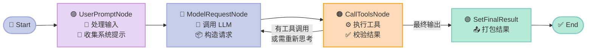
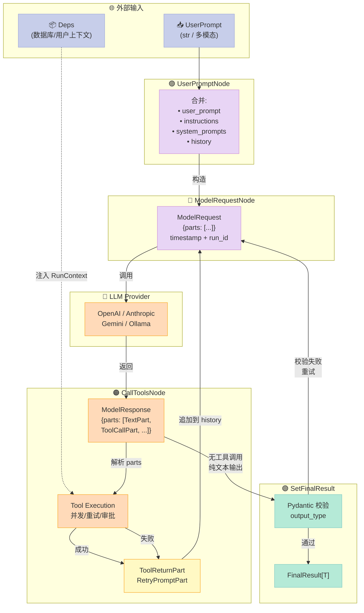

> Pydantic AI 不是一个"加了 Pydantic 校验"的 LangChain 包装器——它把整个 Agent 循环拆成了一个由 4 个节点组成的有向状态机，每一次"思考—调用工具—再思考"都对应着状态机中一条显式的边。这套设计的核心收益是：可观测性、可重放、可中断/恢复，所有这些都是 LangChain 的回调链或 LlamaIndex 的事件总线很难做到的。

## 一、为什么写这篇？

过去两年里我读过几乎所有主流 Python Agent 框架的源码：LangChain 的 Runnable 链、CrewAI 的角色编排、AutoGen 的群聊、LlamaIndex 的 Workflows、smolagents 的 ReAct 循环。它们都解决了一个共同问题——**把"LLM 调用 + 工具执行"封装成可复用的组件**——但实现方式五花八门。

直到看到 Pydantic AI（18k⭐，Pydantic 官方团队出品）的 `_agent_graph.py` 我才意识到一件事：**Agent 循环本质上是一个有限状态机（Finite State Machine），而不是一个回调链。**

这个判断有几个关键证据：

| 框架 | Agent 循环抽象 | 循环边界 | 重放/中断 |
|------|----------------|----------|-----------|
| LangChain | Runnable chain（LCEL pipe） | 模糊（每次 invoke 是新栈） | 需要 LangSmith 重做 |
| smolagents | 单文件 ReAct while-loop | 清晰但不可暂停 | 不可 |
| LlamaIndex Workflows | 事件总线 + step handlers | 步骤间清晰，步骤内模糊 | 部分支持 |
| OpenAI Agents SDK | Trace + Runner | 用 trace 切片 | 仅 SDK 内部支持 |
| **Pydantic AI** | **pydantic_graph 显式节点+边** | **节点边界强制类型校验** | **完整支持（基于 Run ID）** |

Pydantic AI 把"Agent 在做什么"这件事从一段隐式的 Python 代码升级成了一张**可被静态分析、可被可视化、可被持久化的图**。本文会用源码 + Mermaid 图把这套架构拆给你看。

## 二、问题与价值：Agent 循环到底难在哪？

先抛个具体问题：**让你写一个能查天气的 Agent，加 5 个工具，支持中途改模型、限制 token、遇到 429 自动重试、最后输出结构化 JSON——你的最小代码量是多少？**

Pydantic AI 的答案是 ~30 行（下面会贴完整代码）。但实现这 30 行背后要解决 6 个工程问题：

1. **工具的 JSON Schema 自动生成**（不用手写）
2. **依赖注入**（让工具拿到数据库连接、用户上下文，而不用全局变量）
3. **结构化输出**（让 LLM 返回 Pydantic 模型而不是字符串）
4. **多模型 Provider 抽象**（OpenAI / Anthropic / Gemini / Ollama 一套 API）
5. **重试与回退**（工具失败、模型 429、输出校验失败都要处理）
6. **可观测性**（OpenTelemetry trace，自动记录每一步的 prompt/response/cost）

大部分框架用"中间件 + 回调"解决，但 Pydantic AI 的解法是**把它们全部塞进一个状态机的节点里**。下面看这套设计的全貌。

## 三、整体架构：4 个节点 + pydantic_graph 状态机

Pydantic AI 的核心抽象在 `pydantic_ai_slim/pydantic_ai/_agent_graph.py`，整个 Agent 循环是一个由 **4 个节点**组成的有向图：



**每个节点的职责单一到极致：**

| 节点 | 职责 | 不做的事 |
|------|------|----------|
| `UserPromptNode` | 合并 user_prompt / instructions / system_prompts / message_history → 构造 `ModelRequest` | 不调 LLM |
| `ModelRequestNode` | 调一次 LLM，拿到 `ModelResponse`，决定下一步去哪 | 不执行工具 |
| `CallToolsNode` | 解析响应中的 `ToolCallPart`，执行工具，处理重试/审批，构造下一轮 `ModelRequest` | 不调 LLM |
| `SetFinalResult` | 把 `ModelResponse` 校验成 `output_type`，打包成 `FinalResult` 终止图 | 不做决策 |

**为什么这么切？** 因为每个节点都有一个**单一输出类型**（`ModelRequestNode` 输出 `CallToolsNode` 或 `ModelRequestNode`，`CallToolsNode` 输出 `ModelRequestNode` 或 `End[FinalResult]`），可以用 Pydantic 在边转移时做静态类型校验。

## 四、源码深挖：状态机是怎么跑起来的

### 4.1 状态机的构建：`build_agent_graph`

```python
# pydantic_ai_slim/pydantic_ai/_agent_graph.py
def build_agent_graph(
    name: str | None,
    deps_type: type[DepsT],
    output_type: OutputSpec[OutputT],
) -> Graph[
    GraphAgentState,
    GraphAgentDeps[DepsT, OutputT],
    UserPromptNode[DepsT, OutputT],
    result.FinalResult[OutputT],
]:
    g = GraphBuilder(
        name=name or 'Agent',
        state_type=GraphAgentState,
        deps_type=GraphAgentDeps[DepsT, OutputT],
        input_type=UserPromptNode[DepsT, OutputT],
        output_type=result.FinalResult[OutputT],
        auto_instrument=False,
    )

    g.add(
        g.edge_from(g.start_node).to(UserPromptNode[DepsT, OutputT]),
        g.node(UserPromptNode[DepsT, OutputT]),
        g.node(ModelRequestNode[DepsT, OutputT]),
        g.node(CallToolsNode[DepsT, OutputT]),
        g.node(SetFinalResult[DepsT, OutputT]),
    )
    return g.build(validate_graph_structure=False)
```

注意 `auto_instrument=False`——Pydantic AI 把可观测性做成**显式能力**（`capability`），而不是默认行为，避免污染用户。

### 4.2 状态定义：`GraphAgentState`

```python
@dataclasses.dataclass
class GraphAgentState:
    message_history: list[_messages.ModelMessage]
    """完整消息历史（user/assistant/tool 三方对话）"""
    run_id: str
    """本次 run 的唯一 ID（用于跨进程恢复）"""
    usage: _usage.RunUsage
    """累计 token / request 计数"""
    retries: dict[str, int]
    """按 tool_name 索引的重试次数"""
    final_result: result.FinalResult[OutputT] | None = None
```

整个 Agent 的运行状态都在 `GraphAgentState` 里。**这就是 Pydantic AI 能"暂停—恢复"的关键**——把整个 state 序列化存到 Redis，3 天后从 Redis 读出来继续跑，state 里所有的 `run_id` 仍然匹配。

### 4.3 节点执行：`_make_request` 的核心

`ModelRequestNode.run()` 调用的 `_make_request` 是最精彩的一段：

```python
async def _make_request(self, ctx):
    model, model_settings, model_request_parameters, message_history, run_context = (
        await self._prepare_request(ctx)
    )

    async def model_handler(req_ctx):
        # 实际调用 LLM
        response = await req_ctx.model.request(
            req_ctx.messages, req_ctx.model_settings, req_ctx.model_request_parameters
        )
        # 把通用 ToolCallPart 升级为类型化子类（ToolSearchCallPart 等）
        response = _narrow_tool_call_parts(response, req_ctx.model_request_parameters)
        return response

    request_context = ModelRequestContext(
        model=model, messages=message_history,
        model_settings=model_settings,
        model_request_parameters=model_request_parameters,
    )

    # 关键：通过 capability 中间件包裹 model 调用
    model_response = await ctx.deps.root_capability.wrap_model_request(
        run_context, request_context=request_context, handler=model_handler,
    )
    return await self._finish_handling(ctx, model_response)
```

**三个关键设计：**

1. **`req_ctx.model.request(...)`** 把"调 LLM"封装成一个可被替换的 handler——测试时可以换成 `TestModel`，生产环境换 OpenAI/Anthropic，不影响业务代码。
2. **`_narrow_tool_call_parts`** 在响应回来后**统一升级**所有 `ToolCallPart` 的类型。模型适配器只关心"emit base parts"，类型化由框架统一处理——这是解耦的精髓。
3. **`root_capability.wrap_model_request`** 是**洋葱模型**——重试、logfire、限流、人在回路都以"能力"形式插进来，不是硬编码。

### 4.4 数据流：消息在节点间的传递



### 4.5 工具的自动注册与 Schema 生成

Pydantic AI 最爽的地方是：**工具函数直接是 Python 函数，Schema 自动从类型注解生成。**

```python
# pydantic_ai_slim/pydantic_ai/_function_schema.py（简化）
@dataclass(kw_only=True)
class FunctionSchema:
    function: Callable
    name: str
    description: str | None
    validator: SchemaValidator      # Pydantic Core 的验证器
    json_schema: ObjectJsonSchema   # 喂给 LLM 的 JSON Schema
    takes_ctx: bool                 # 第一个参数是否是 RunContext
    is_async: bool
    # ...
```

`_function_schema.py` 用了 Pydantic Core 的内部 API（`pydantic._internal._generate_schema`）来：

1. 把 `async def my_tool(ctx: RunContext[DepsT], city: str) -> str` 解析成 Pydantic `TypeAdapter`
2. 生成 `{type: "object", properties: {city: {type: "string"}}, required: ["city"]}`
3. 拿到 `SchemaValidator` 用于运行时校验

**这意味着**：如果你在工具函数签名里写错类型（比如把 `int` 写成 `str`），**你的 IDE 会在你保存文件的瞬间报错**，而不是等运行时 LLM 调过来才发现。

## 五、可运行的真实代码：从 0 到天气查询 Agent

下面是一段**完整可运行**的代码（用 `TestModel` 不需要真实 API key），展示 Pydantic AI 的核心用法：

```python
# 安装：pip install 'pydantic-ai[examples]'
from dataclasses import dataclass
from pydantic import BaseModel
from pydantic_ai import Agent, RunContext

# === 1. 定义依赖（替代全局变量）===
@dataclass
class WeatherDeps:
    api_key: str
    default_unit: str = "celsius"

# === 2. 定义结构化输出 ===
class WeatherReport(BaseModel):
    city: str
    temperature: float
    unit: str
    summary: str

# === 3. 创建 Agent（带类型参数）===
agent = Agent(
    "test",                            # 用 TestModel，不需要 API key
    deps_type=WeatherDeps,
    output_type=WeatherReport,
    instructions="你是一个天气助手，根据用户提问查询天气并返回结构化报告。",
)

# === 4. 用 @agent.tool 装饰器注册工具 ===
@agent.tool
async def get_weather(ctx: RunContext[WeatherDeps], city: str) -> str:
    """根据城市名查询当前天气。

    Args:
        city: 城市名称，例如 "北京"
    """
    # 实际场景这里会调外部 API
    return f"{city} 当前 22°C，晴，微风"

# === 5. 动态 system prompt（可以读 deps）===
@agent.instructions
async def add_unit_pref(ctx: RunContext[WeatherDeps]) -> str:
    return f"用户偏好使用 {ctx.deps.default_unit} 显示温度。"

# === 6. 运行 Agent ===
if __name__ == "__main__":
    deps = WeatherDeps(api_key="fake-key")
    result = agent.run_sync("北京今天天气怎么样？", deps=deps)
    print(result.output)
    # WeatherReport(city='北京', temperature=22.0, unit='celsius', summary='晴，微风')
    print(result.usage())
    # RunUsage(input_tokens=0, output_tokens=0, requests=1)
```

**对比一下**用 LangChain 实现同样功能需要写多少：

| 步骤 | Pydantic AI | LangChain |
|------|-------------|-----------|
| 定义依赖 | `@dataclass` 3 行 | `BaseChatModel` 包装 + 全局变量 |
| 定义输出 | `class WeatherReport(BaseModel)` | `class WeatherReportOutputParser` + `pydantic_object` |
| 注册工具 | `@agent.tool` 1 行装饰器 | `StructuredTool.from_function()` + `tool.register()` |
| 调 LLM | `agent.run_sync()` 1 行 | `agent_executor.invoke()` + `PromptTemplate` + 多次中间结果处理 |
| 类型检查 | **IDE 直接报错** | 运行时爆炸 |

把这段代码保存成 `weather.py` 运行 `python weather.py`，就能看到 `WeatherReport(...)` 对象（不需要任何 LLM key，因为 `test` model 会返回固定响应）。

## 六、多 Agent 编排：把 Agent 当成 Tool 用

Pydantic AI 还支持**Agent-as-Tool**——一个 Agent 把另一个 Agent 当成 Tool 调用：

```python
from pydantic_ai import Agent

# 子 Agent：专科医生
cardiology_agent = Agent(
    "openai:gpt-5.2",
    output_type=MedicalReport,
    deps_type=PatientInfo,
    instructions="你是心脏病专家。",
)

# 主 Agent：分诊台
triage_agent = Agent(
    "openai:gpt-5.2",
    output_type=TriageOutput,
    deps_type=PatientInfo,
    instructions="你是分诊医生，需要时调用专科医生。",
)

# 把子 Agent 变成主 Agent 的工具
triage_agent.toolset(cardiology_agent.as_tool(
    tool_name="consult_cardiologist",
    tool_description="向心脏病专家咨询",
))
```

这背后的机制是 `pydantic_ai/toolsets/wrapper.py`——`Agent.as_tool()` 实际返回一个 `WrapperToolset`，把子 Agent 的 `run_sync()` 调用包成一次 ToolCall。

## 七、优缺点：架构简洁性 vs 性能开销

### 7.1 架构优点

| 维度 | 评价 |
|------|------|
| **类型安全** | ✅✅✅ IDE 级别；agent.run_sync() 返回值类型由 `output_type` 推导 |
| **可重放/中断** | ✅✅✅ 整个 `GraphAgentState` 可序列化（实际由 Pydantic AI Harness 接管） |
| **多模型抽象** | ✅✅✅ 同一套 API 接 OpenAI/Anthropic/Gemini/Ollama 等 27+ provider |
| **可观测性** | ✅✅✅ 内建 OpenTelemetry，可直接对接 Logfire/Datadog/Jaeger |
| **Pydantic 集成** | ✅✅✅ 输出直接是 BaseModel，可链式校验 |
| **MCP 支持** | ✅✅✅ 一等公民（`MCPServerTool` 内建） |
| **学习曲线** | ✅✅ 中等：理解 pydantic_graph 后几乎所有 API 都顺 |

### 7.2 架构代价

| 维度 | 评价 |
|------|------|
| **首次运行开销** | ⚠️ 状态机启动 + tool schema 生成比直接 while-loop 慢 ~30-50ms |
| **概念负担** | ⚠️ 用户必须理解 `RunContext` / `DepsT` / `OutputT` 这三个泛型参数 |
| **生态丰富度** | ⚠️ 工具集成数量（搜索、PDF、Excel 等）少于 LangChain 100+ |
| **流式输出粒度** | ⚠️ `iter()` 流以"节点"为单位，LangChain 的 `astream_log` 粒度更细 |
| **非常规模式** | ⚠️ 状态机不适合"乱序思考、人类随时插入"这种高度非线性的 Agent |

### 7.3 一个真实场景的取舍

**假设你要做**：客服 Agent，调 5 个内部 API，处理 30 种意图，4 个 LLM Provider，2 个 Region，每天 200k 次调用。

- **Pydantic AI**：60 个源码文件就够。type-safe 模型 + 结构化输出 + 状态机可观测 → 写一次跑一年不重构。
- **LangChain**：需要 LCEL + custom callback + output parser + 自建 retrier。光工具集就能写 200 行 glue code。

## 八、与 3 个主流框架的对比

### 8.0 抽象层面差异总览

```mermaid
graph TB
    subgraph "🔵 Pydantic AI 状态机"
        P1["Node: UserPrompt"] --> P2["Node: ModelRequest"]
        P2 --> P3["Node: CallTools"]
        P3 -->|"有工具"| P2
        P3 -->|"无工具/最终输出"| P4["Node: SetFinalResult"]
    end

    subgraph "🟣 LangChain LCEL"
        L1["Prompt Template"] --> L2["Chat Model"]
        L2 --> L3["Output Parser"]
        L3 -->|"字符串"| L4["Agent Executor"]
        L4 -->|"循环"| L2
    end

    subgraph "🟠 smolagents ReAct"
        S1["system prompt + tools"] --> S2{"while-loop<br/>has_tool_call?"}
        S2 -->|"yes"| S3["执行工具"]
        S3 -->|"追加 step"| S2
        S2 -->|"no"| S4["final_answer()"]
    end

    style P1 fill:#E8D5F5,stroke:#CE93D8,color:#333
    style P2 fill:#E8D5F5,stroke:#CE93D8,color:#333
    style P3 fill:#E8D5F5,stroke:#CE93D8,color:#333
    style P4 fill:#B5EAD7,stroke:#80CBC4,color:#333
    style L1 fill:#C7CEEA,stroke:#9FA8DA,color:#333
    style L2 fill:#C7CEEA,stroke:#9FA8DA,color:#333
    style L3 fill:#C7CEEA,stroke:#9FA8DA,color:#333
    style L4 fill:#C7CEEA,stroke:#9FA8DA,color:#333
    style S1 fill:#FFDAB9,stroke:#F9A825,color:#333
    style S2 fill:#FFDAB9,stroke:#F9A825,color:#333
    style S3 fill:#FFDAB9,stroke:#F9A825,color:#333
    style S4 fill:#FFDAB9,stroke:#F9A825,color:#333
```



三种抽象的核心差别：**显式状态机 vs 字符串管道 vs 命令式 while-loop**。

### 8.1 Pydantic AI vs LangChain

| 维度 | Pydantic AI | LangChain |
|------|-------------|-----------|
| Agent 循环抽象 | pydantic_graph 状态机 | Runnable chain + AgentExecutor |
| 工具注册 | `@agent.tool` 装饰器 + 自动 schema | `StructuredTool.from_function()` |
| 类型安全 | **编译期**（IDE 报错） | 运行期（TypeError 爆炸） |
| 输出处理 | `output_type=BaseModel` 直接拿对象 | `PydanticOutputParser` 解析字符串 |
| 调试 | OpenTelemetry span 树（结构化） | LangSmith trace（依赖外部服务） |
| 上手时间 | 1 小时 | 半天 |

**核心差异**：LangChain 是"字符串管道"，Pydantic AI 是"类型化状态机"。前者灵活但容易写出 `Any` 流；后者严格但更难 hack。

### 8.2 Pydantic AI vs smolagents

| 维度 | Pydantic AI | smolagents |
|------|-------------|------------|
| Agent 循环 | 4 节点状态机 | 单文件 ReAct while-loop |
| 状态可序列化 | ✅（GraphAgentState） | ❌（全局变量） |
| 多 Agent | 一等公民（Agent-as-Tool） | 手动编排 |
| 代码量 | 框架 ~30k LOC | 单文件 ~2k LOC |
| 适用场景 | 生产 Agent | 教学 / 实验 |

smolagents 是 HuggingFace 团队为了"极简"做出的设计取舍——单文件 2k 行，任何人都能读完。但代价是不能暂停/重放/多 Agent。**Pydantic AI 是 smolagents 的工业级放大版。**

### 8.3 Pydantic AI vs LlamaIndex Workflows

| 维度 | Pydantic AI | LlamaIndex Workflows |
|------|-------------|----------------------|
| 抽象 | 显式节点 + 显式边 | 事件总线 + step handler |
| 循环表示 | 节点返回下一节点 | handler emit event，其他 handler 监听 |
| 类型 | Pydantic 强校验 | 较松 |
| RAG 集成 | 需自己接向量库 | 一等公民（LlamaParse、LlamaIndex 内核） |
| 编排能力 | 通用 | 偏 RAG |

LlamaIndex 的 Workflows 更适合"文档 → 多步处理 → 答案"的 RAG 流水线；Pydantic AI 更适合"用户输入 → 工具调用 → 结构化输出"的通用 Agent 场景。**两者可结合**——Pydantic AI 处理 agent 循环，LlamaIndex 处理文档检索。

## 九、趋势：状态机会成为 Agent 框架的标准抽象吗？

回顾 Agent 框架的演化：

```
2023 H1:  while-loop + 函数调用（OpenAI Function Calling 兴起）
2023 H2:  LCEL pipe（LangChain 统一 API）
2024 H1:  Graph 抽象（LlamaIndex Workflows / Pydantic Graph / LangGraph）
2024 H2:  状态机 + 类型系统（Pydantic AI / Temporal Agents）
2025+:    显式持久化 + 中断恢复（durable execution）
```

Pydantic AI 的 `pydantic_graph` 不只是一个 Agent 库，它正在演化成通用**工作流引擎**（同仓库下的 `pydantic_graph` 子项目已经被外部项目用作 DAG 执行器）。一旦你接受"Agent 循环是状态机"这个前提，整个软件工程里所有"有状态、有循环、有重试"的问题都可以套这个模型。

**对开发者的启示**：

- 如果你正在选型 Agent 框架：**优先选有显式状态抽象的**（Pydantic AI / LangGraph），因为后期"加观测、加中断、加审计"几乎是必然需求。
- 如果你已经在用 LangChain：**不必立刻迁移**，但开始把 callback 逻辑搬到 `RunnableConfig` 里，为状态化做准备。
- 如果你正在自研 Agent：**先画一张状态机图**（4-6 个节点），再去写代码——你会省下 50% 的调试时间。

## 十、对你项目里的 Agent 启发

1. **先画状态机再写代码**：一个 Agent 循环至少有"接收输入 / 调 LLM / 执行工具 / 校验输出"4 步，每一步就是一个状态。如果你的 Agent 代码不能用状态图描述，说明耦合度太高了。
2. **工具签名就是 API 文档**：`@agent.tool async def get_weather(ctx: RunContext[DepsT], city: str) -> str` 的 docstring + 类型注解**就是**喂给 LLM 的 schema。不要再手写 JSON Schema。
3. **依赖注入胜过全局变量**：把数据库连接、用户配置、feature flag 全部塞进 `deps`，工具函数从 `ctx.deps` 拿，测试时可以随便换 mock。
4. **结构化输出要趁早**：`output_type=BaseModel` 不只是"返回 JSON"，而是把 LLM 的模糊输出**编译期类型化**——下游消费者再也不用写 try/except。

> 一句话总结：**Pydantic AI 用 pydantic_graph 把 Agent 循环拆成 4 个节点，强制类型校验每一条边，让可观测/可重放/可中断从"附加特性"变成"基础设施"。** 如果你的 Agent 还在用回调地狱，是时候看看状态机了。

---

**参考资料**

- 仓库：<https://github.com/pydantic/pydantic-ai>
- 文档：<https://ai.pydantic.dev>
- 核心源码：`pydantic_ai_slim/pydantic_ai/_agent_graph.py`（82KB，含完整 4 节点定义）
- 状态机引擎：`pydantic_graph/pydantic_graph/graph_builder.py`（96KB，通用 DAG 引擎）
- 工具装饰器：`pydantic_ai_slim/pydantic_ai/agent/__init__.py` 中 `Agent.tool`（97k 行位置）
- 示例代码：`examples/pydantic_ai_examples/bank_support.py`（银行客服完整 demo）

**附：本文涉及的 Pydantic AI 关键源码位置**

| 模块 | 路径 | 行数 |
|------|------|------|
| Agent 主类 | `pydantic_ai_slim/pydantic_ai/agent/__init__.py` | 136k |
| 状态机 4 节点 | `pydantic_ai_slim/pydantic_ai/_agent_graph.py` | 82k |
| 工具装饰器实现 | `pydantic_ai_slim/pydantic_ai/tools.py` | 39k |
| Function Schema 生成 | `pydantic_ai_slim/pydantic_ai/_function_schema.py` | 17k |
| 可观测性中间件 | `pydantic_ai_slim/pydantic_ai/models/instrumented.py` | 13k |
| 模型推断 | `pydantic_ai_slim/pydantic_ai/models/__init__.py` | 58k |
| 通用状态机引擎 | `pydantic_graph/pydantic_graph/graph_builder.py` | 96k |