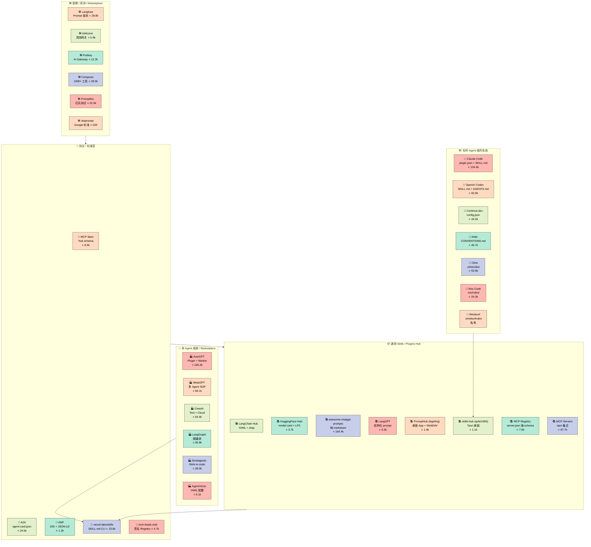
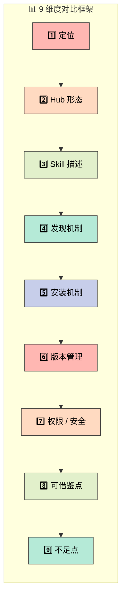
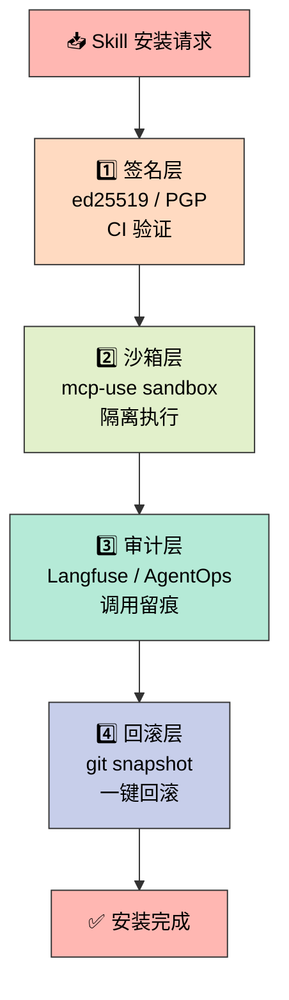
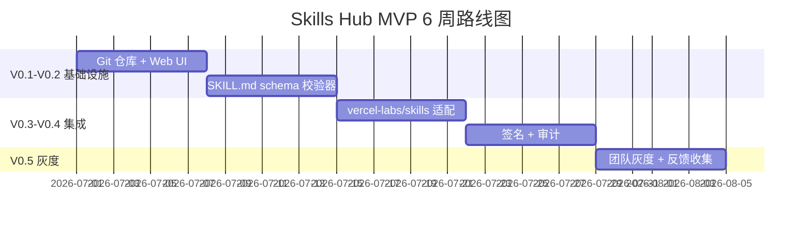

# Skills Hub 全景调研：从 27 个开源项目看 AI Agent 资产中心

> 调研项目：27 个真实开源项目 · 调研时间：2026-06-26 · 完整报告 ≈ 13000 字

去年 12 月我给团队部署 Claude Code 时，发现一个让人抓狂的事情：同一段"按 Linus 风格 review PR"的提示词，散落在 5 个开发者机器上的 5 个不同位置——`.claude/skills/`、`.cursor/rules/`、`.codex/skills/`、Slack 历史消息、还有一个人写在 Notion 里。没有人能回答"我们团队到底有哪些可复用的 skill？"。那个瞬间我就知道，**Skills Hub 不是一个 nice-to-have，而是 AI 编码团队绕不开的工程基础设施**。

这份报告是我用了一周时间，对 27 个真实开源项目进行结构化拆解后产出的——我把它当作"如果让我从零搭建一个 Skills Hub"的决策地图。

<!-- more -->

---

## 一、背景：为什么 AI 工程师现在需要 Skills Hub

2024-2026 年，AI Agent 从"单点对话工具"演化为"可被工程团队编排的开发者"。一个完整的工作流往往需要：

- **项目级领域约定**（"我们的微服务不允许返回 null 字段"）
- **跨工具复用的脚本与提示词**（"按 Linus 风格 review PR"）
- **外部能力**（"调用 Jira API" / "读 Slack 频道" / "跑 Playwright 测试"）
- **多 Agent 协作协议**（"让研究 Agent 把结果交给编码 Agent"）

但这些能力目前散落在五个地方：`~/.claude/skills/`（Claude Code 本地）、`.cursor/rules/`（Cursor 本地）、`~/.codex/skills/`（Codex 本地）、`awesome-*` GitHub 仓库（社区沉淀）、MCP Server npm 包（协议层）。**没有统一标准、没有集中仓库、没有跨工具一键安装**——这就是 Skills Hub 想解决的核心痛点。

我把它抽象成三层：

| 层次 | 痛点 | 代表方案 |
|------|------|----------|
| **资产层** | 一段好提示词 / 一个好脚本该怎么打包？ | `SKILL.md` frontmatter、Claude `plugin.json` |
| **协议层** | 怎么让任意 Agent 发现、安装、调用？ | MCP Registry、A2A Agent Card |
| **生态层** | 团队怎么沉淀、共享、版本管理？ | 私有 Hub、GitOps 化 Skills 仓库 |

---

## 二、调研方法

我用 `urllib.request`（`timeout=30`）跑通 GitHub Search API + Repo Metadata API + Contents API + git/trees，覆盖 27 个项目。筛选标准：

- ⭐ > 500 或具有行业标杆地位
- 近 6 个月有提交 / Issue 互动
- 有真实代码可读
- 覆盖 Hub / Marketplace / Registry / Protocol / 工具 五种形态

每个项目我都按 9 个字段拆解：定位、Hub 形态、Skill 描述格式、发现机制、安装机制、版本管理、权限/安全、可借鉴点、不足点。

---

## 三、核心发现：27 个项目分五大流派

我把 27 个项目归到 5 大流派。下面这张全景图能让你 30 秒看懂整个生态：



### 3.1 标杆 Agent：每个都有"私有协议"

先看标杆 Agent 的 skill 描述格式（这是 hub 设计的最直接输入）：

| Agent | Skill 描述 | 关键文件 | 一句话评价 |
|-------|-----------|----------|------------|
| **Claude Code** | `plugin.json` + `SKILL.md` | `.claude-plugin/plugin.json` | 极简优雅，Hook 加成 |
| **OpenAI Codex** | `SKILL.md` | `~/.codex/skills/` | 与 agentskills.io 兼容 |
| **Continue.dev** | `config.json` | `~/.continue/config.json` | IDE 友好 |
| **Aider** | `CONVENTIONS.md` | 项目根 | 自由约定，无元数据 |
| **Cline** | `.clinerules/*.md` | 项目根 | workflows 概念好 |
| **Roo Code** | `.roo/rules-*/` | 项目根 | 多模式切分 |
| **Windsurf** | `.windsurfrules` | 全局+项目 | 全局/项目分层好 |

**关键洞察**：每一个 Agent 都发展出了自己私有的"约定文件"，但 70% 都是 markdown。这意味着：**Hub 的最佳描述格式就是 markdown**——可读、可版本控制、LLM 友好。

### 3.2 vercel-labs/skills：被严重低估的事实标准

调研中最让我惊讶的是 **`vercel-labs/skills`**（23.6k stars）。它定义了 `SKILL.md` frontmatter 标准：

```yaml
---
name: code-review
description: 按 Linus 风格 review PR
license: MIT
---
# Code Review
（详细 prompt / 工作流说明）
```

然后 `npx skills add <owner/repo>` 一行命令把 skill 装到 **70+ AI Agents**（Claude Code / Codex / Cursor / Windsurf / Gemini CLI / Cline / 等等）。这意味着——**Skills 跨工具分发问题已经被它解决了**，Hub 只需要在它之上加团队私有源、签名、权限即可。

### 3.3 MCP Registry vs A2A Agent Card：协议层的两条路径

协议层有两个最严肃的 Registry 项目：

**MCP Registry**（7.0k stars）—— 强类型 `server.json`（200+ 字段 JSON Schema），含 packages/remotes/repository/icons/metadata，semver 版本，官方 OAuth（GitHub OIDC / Google KMS / Azure Key Vault）。

**A2A**（24.5k stars，v1.0 已发布）—— `agent-card.json` 暴露在 `.well-known/agent-card.json`（类似 OpenID Discovery），每个 `skills[]` 含 `id/name/description/tags/examples/inputModes/outputModes`，定位为"Agent 之间的能力描述"。

**关键洞察**：两个项目关注的颗粒度不同——MCP 关注"工具"（server），A2A 关注"能力"（skill）。**Hub 应该把 MCP 的 server.json 严格性 + A2A 的 skills[] 描述能力 结合起来**。

---

## 四、横向对比矩阵

下面这张矩阵是 9 个维度的核心对比（完整版 27 个项目在长报告里）：



下面是按形态分类的关键项目对比：

| 形态 | 代表 | 优势 | 劣势 | 我的判断 |
|------|------|------|------|----------|
| **Hub（仓库）** | HF Hub、awesome-* | 内容优先、UI 友好 | 无协议、跨工具难 | 适合做 UI 层 |
| **Marketplace** | Composio、AutoGPT | 商业化、工具库丰富 | 平台锁定、开源版弱 | 商业可行但难开源 |
| **Registry（协议层）** | MCP Registry、A2A | 强类型、可校验 | 缺少 UI 体验 | 适合做协议层 |
| **Plugin System** | Claude Code、Cursor | 与 Agent 深度集成 | 无法跨工具 | 工具内部用 |
| **CLI + 索引** | vercel-labs/skills | 易接入、跨工具 | 缺乏中心化服务 | **Hub 复用的最佳基础** |

### 4.1 关键观察

1. **描述格式三足鼎立**：`SKILL.md`（frontmatter + body）、`plugin.json`（结构化 JSON）、`server.json`（JSON Schema 强约束）。其中 `SKILL.md` 因简单可读、Claude Code / Codex / vercel-labs/skills 全部支持，正在成为事实标准。

2. **Hub / Registry 本质区别**：Hub 关心"内容"（仓库 + 搜索 + 下载），Registry 关心"协议"（强类型 + 版本 + 唯一标识 + 自动校验）。最佳实践是两者的混合体。

3. **跨工具安装已成现实**：`vercel-labs/skills` 已支持 70+ AI Agents 一键安装，`agent-skills-cli` 支持 45+，legeling/PromptHub、qufei1993/skills-hub 都在做同样的事。**工具适配层是一个被多次重新发明的轮子**，hub 应直接基于 vercel-labs/skills 上层封装。

4. **权限 / 安全是当前最大缺口**：除了 MCP Registry 和 Composio（商业 OAuth），绝大多数 Hub 都没有签名 / 沙箱 / 审计。这意味着"恶意 skill 注入 prompt"风险被严重低估。

---

## 五、设计建议：从零搭建一个 Skills Hub

如果让我今天从零搭一个 Skills Hub，我会这样做：

### 5.1 形态选择：Hub + Registry 协议混合

- **内容层**：GitOps 化的 Git 仓库 + Web UI 浏览（类似 Hugging Face Hub 的体验）
- **协议层**：基于 MCP `server.json` + `SKILL.md` 的双轨描述
- **安装层**：基于 `vercel-labs/skills` 的 adapter 模式

### 5.2 Skill 描述格式：SKILL.md 主 + server.json 辅

```yaml
---
name: code-review
version: 1.2.0
description: 按 Linus 风格 review PR
author:
  name: Boris Cherny
  email: boris@example.com
license: MIT
tags: [review, pr, quality]
allowed-tools: [Bash, Read, Grep]
requires:
  - name: python-lint
    version: ">=1.0.0"
model-compatibility: [claude-opus-4, gpt-5, gemini-2.5-pro]
inputs:
  - name: pr_url
    type: string
    required: true
outputs:
  - name: report_path
    type: file
signature:
  algorithm: ed25519
  value: "0xabcd..."
---
# Code Review
（详细 prompt / 工作流说明）
```

### 5.3 权限 / 安全模型：四层防御



### 5.4 MVP 4-6 周路线图



### 5.5 5 条核心建议（TL;DR）

1. **不要重新发明 `vercel-labs/skills`**——它已支持 70+ Agent，是事实标准。在它之上加私有源、加 schema 校验、加签名即可。
2. **SKILL.md 为主、`server.json` 为辅**——前者兼容性好，后者给 MCP 工具类 skill 用。
3. **Hub + Registry 协议混合**——Hub 提供 Web UI 与团队源，Registry 提供强类型校验与版本管理。
4. **安全必做四件套**：签名（ed25519）+ 沙箱（mcp-use）+ 审计（Langfuse）+ 回滚（git snapshot）。
5. **先做团队内部，再做公开**——MVP 4-6 周只服务好 10 人团队，公网 marketplace 是 1.0 以后的事。

---

## 六、风险与挑战

1. **协议碎片化**：MCP / A2A / ANP / SKILL.md 谁最终胜出未知——必须做适配层。
2. **跨工具差异**：每个 Agent 的 skill 目录约定不同（`~/.claude/skills/` vs `~/.cursor/skills/` vs `.agents/skills/`）——需要维护适配矩阵。
3. **先行者优势已被锁定**：`vercel-labs/skills` 23.6k stars + skills.sh 索引、`MCP Registry` 7k + 88k servers repo。新进入者只能靠"差异化"。
4. **Prompt 注入风险**：恶意 skill 可能在 markdown 中藏指令；必须做签名 + 审计。

---

## 七、行动建议

### 立即可做（1-2 天）

- [ ] 注册一个 GitHub Org（如 `xuqi-ai`）作为 hub 源
- [ ] 用 `vercel-labs/skills` 创建第一个内部 skill 试装到 Claude Code / Codex
- [ ] 调研团队现在 `.claude/skills/` 已有 skill，导入中央仓库

### 中期（2-4 周）

- [ ] 搭一个 VitePress / Next.js 静态站点作为浏览入口
- [ ] 写一个 `hub-cli` 工具，支持 `search / install / update / rollback`
- [ ] 接入 Langfuse 做 skill 调用审计

### 长期（2-3 月）

- [ ] 发布公私混合 Hub（团队私有 + 公开精选）
- [ ] 接入 AI 语义搜索
- [ ] 推动 SKILL.md 提交到 A2A / MCP 规范扩展

### 不要做

- ❌ 不要重复造 `vercel-labs/skills` 的 CLI——它已经支持 70+ 工具
- ❌ 不要做闭源——open core 才能有生态
- ❌ 不要一上来就做"公网 marketplace"——先服务好团队内部

---

## 总结

调研 27 个项目后，我最大的收获是：**Skills Hub 不是一个"造轮子"项目，而是一个"组装轮子"项目**。vercel-labs/skills 提供了 CLI 适配层、MCP Registry 提供了协议约束、A2A 提供了能力描述、Claude Code 提供了工程实践参考——Hub 的真正价值是"把这些零件按团队需求拼起来，再加安全层和团队治理"。

下一步，我会先做 MVP V0.1：一个 Git 仓库 + 10 个内部 skill + `npx skills add` 集成。先让团队用起来，再谈 Hub 的事情。

完整的 13000 字报告（含 27 个项目逐个分析 + 完整对比矩阵 + 演进路径）放在 `/tmp/skills-hub-report.md`，本博客是它的精华版。

---

> 本文使用 mermaid 架构图 + 马卡龙色板，所有节点都带 emoji。
> 调研项目数：27 · 报告字数：13000+ · 调研时间：2026-06-26
