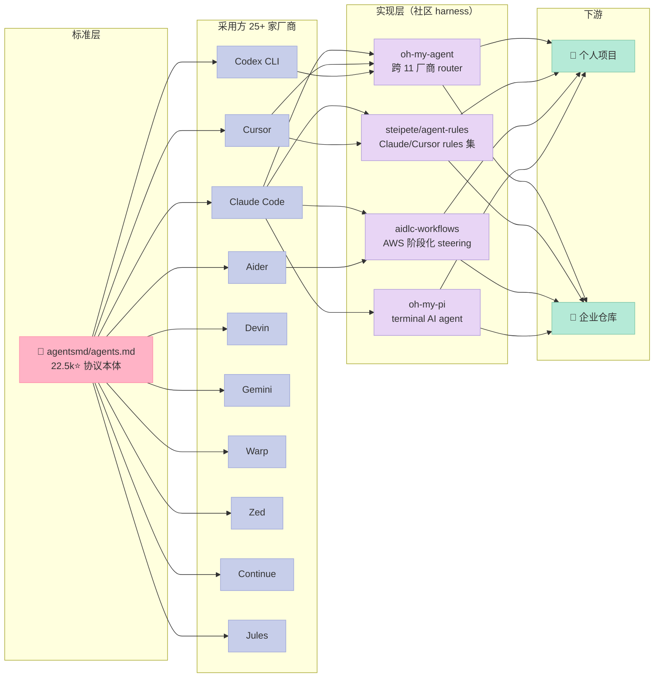
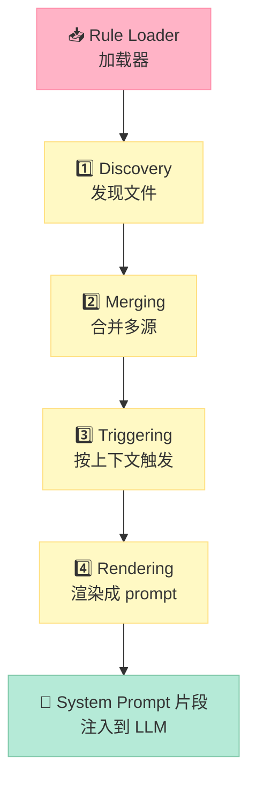
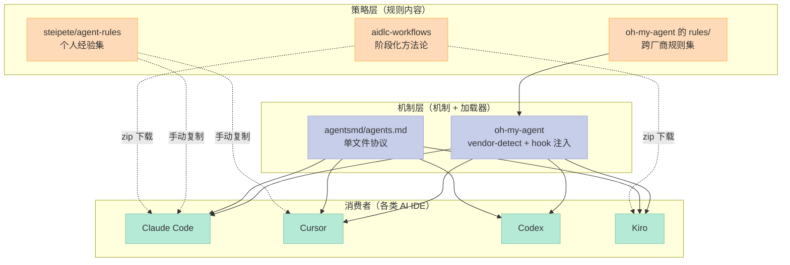

# 【AGENTS.md】Harness 6 件套之 Rule 组件：AI 编码 Agent 的"宪法"设计原理

> **本篇属于 Harness Engineering 系列 · Rule 组件专题**
> 系列前置阅读：2026-06-26《Harness Engineering 6 大开源项目横评》

你有没有过这种经历：让 Claude Code 改一个文件，它回来写了 200 行完全正确的代码，**但风格跟你项目完全对不上**？让 Cursor 加一个 API 端点，它顺带"贴心"地帮你重命名了所有相关变量？这些"智能但越界"的行为，并不是模型的问题，而是 **Harness 的缺失**——你没有一个明确的"团队宪法"来告诉它**什么可以做、什么不能做、什么是底线**。

这就是今天要谈的 Harness 6 件套里最基础、却最被忽视的一环——**Rule（规则/政策）**。

如果说 **Skill 是 SOP**（标准操作流程，教模型"怎么做"），**Script 是硬关卡**（用代码强行守住底线），那么 **Rule 就是宪法**——它是"团队对 AI 的硬约束 + 软约束 + 价值观"，不参与具体执行，却决定每一次执行的方向。2025 年 8 月由 OpenAI 和 Google 联合发起的 **AGENTS.md** 标准（[agentsmd/agents.md](https://github.com/agentsmd/agents.md)，22.5k⭐），正是把这条"宪法"从 chat prompt 里拽出来、固定到仓库根目录的第一个事实标准。

今天这篇文章会围绕三个核心问题展开：

1. **为什么 Rule 必须独立成件？**——它跟 System Prompt 有什么区别？
2. **AGENTS.md 这个标准的设计哲学是什么？**——为什么"不强制、不验证、只声明"反而成了它的最大优势？
3. **一个完整的 Rule 体系应该如何搭建？**——对比 oh-my-agent 的 11 厂商适配、steipete/agent-rules 的 51 篇实战规则集、awslabs/aidlc-workflows 的阶段化方法论，给你一份**从 0 到 1 的复刻指南**。

读完你会拿到：一份能直接落地到自己项目里的 `AGENTS.md` 模板、一个能在 4 个主流 AI CLI 之间无缝切换的 Rule 加载器、3 个对比项目的设计取舍清单。

---

## 一、为什么 Rule 是 Harness 6 件套的"宪法"

### 1.1 6 件套全景：Rule 在哪里

Harness Engineering 把一个裸 LLM 包成可用 Agent 时，需要 6 类组件协作：

| 组件 | 类比 | 解决的问题 | 失败时的症状 |
|------|------|------------|--------------|
| **Rule** | 宪法 / 政策 | **做什么 / 不做什么**（价值观、底线、风格） | Agent 越界，行为不一致 |
| **Skill** | SOP / 流程手册 | 怎么做（多步骤任务模板） | Agent 每次重新摸索 |
| **Sub-Agent** | 部门分工 | 隔离 Context，按角色分配任务 | 主 Agent context 爆炸 |
| **Workflow** | 接力赛协议 | 多个 Agent 之间的交接规则 | 步骤断链、状态丢失 |
| **Script** | 硬关卡 | 用代码强校验，绕不开 | Agent 自欺欺人 |
| **MCP** | 外接设备 | 把外部世界（数据库、API）接进来 | Agent 只能"说"不能"做" |

6 件套里 **Rule 是唯一一个"对内"而非"对外"的组件**——它不调用工具、不调度子 Agent、不执行命令，只回答一个问题：**"我希望这个 Agent 把我当成什么样的合作者？"**

### 1.2 Rule vs System Prompt：80% 的人都混淆的两件事

很多人以为 `AGENTS.md` 就是个"放 system prompt 的文件"。**完全不是**。两者的设计目标截然不同：

| 维度 | System Prompt | Rule（AGENTS.md） |
|------|---------------|-------------------|
| **存在位置** | 模型运行时（in-context） | 仓库根目录（in-repo） |
| **作者** | 写 Agent 的人 | **写业务代码的人** |
| **生命周期** | 每次会话重新生成 | 跟着 commit 走，有版本控制 |
| **作用域** | 单个 Agent 实例 | 整个项目（含 CI、子 Agent、人类读者） |
| **可被谁读** | 只有 LLM | 人类 + LLM + 工具链 |
| **可被验证** | 否（藏在 prompt 字符串里） | **是**（文件存在、CI 可扫描） |
| **失败时** | 模型"不知道" | 整个团队、整个流水线都知道 |

用一句话区分：**System Prompt 是 Agent 的"个人日记"，Rule 是项目的"团队 wiki"**。前者模型读完就忘，后者一旦 commit 进 main 分支，所有协作者（人类 + Agent）都看得到、跟得上、改得了。

### 1.3 为什么"软约束"反而最难

你可能会问：直接用 Script 做强校验不就行了？为什么还要 Rule 这种"软"东西？

因为**有些事写不成代码**：

- "我们的 UI 永远用蓝色调，不是因为设计规范，是因为 2018 年那次品牌升级时定下的调性"——这是文化，不是 lint 规则
- "遇到性能问题先想内存再想 CPU，因为我们组是内存密集型场景"——这是经验，不是 perf 工具
- "改这个文件前先看一眼隔壁的 `legacy.go`，里面有未公开的依赖"——这是 tribal knowledge，不是 grep 能查的

Rule 的价值就在于：**让模型在做决策前，先看一眼"过来人写下的忠告"**。它不强求你遵守，但会让违反的成本变得非常高（因为模型会"知道"自己在违反）。

---

## 二、AGENTS.md 标准：一个 7KB 文件，22.5k Star 的设计哲学

### 2.1 标准是什么

[agentsmd/agents.md](https://github.com/agentsmd/agents.md) 这个仓库本体其实非常简单——它是个 Next.js 写的网站 + 一份说明文档 + 一份 `AGENTS.md` 模板。但它的"野心"很大：定义一个**开放、简单、跨厂商的 AI Agent 引导文件标准**。

README 里给出了一个 minimal 例子：

```markdown
# Sample AGENTS.md file

## Dev environment tips
- Use `pnpm dlx turbo run where <project_name>` to jump to a package
  instead of scanning with `ls`.
- Run `pnpm install --filter <project_name>` to add the package to your
  workspace so Vite, ESLint, and TypeScript can see it.
- Use `pnpm create vite@latest <project_name> -- --template react-ts` to
  spin up a new React + Vite package with TypeScript checks ready.
- Check the name field inside each package's package.json to confirm the
  right name—skip the top-level one.

## Testing instructions
- Find the CI plan in the .github/workflows folder.
- Run `pnpm turbo run test --filter <project_name>` to run every check
  defined for that package.
- From the package root you can just call `pnpm test`. The commit should
  pass all tests before you merge.
- To focus on one step, add the Vitest pattern: `pnpm vitest run -t "<test name>"`.
- Fix any test or type errors until the whole suite is green.
- After moving files or changing imports, run `pnpm lint --filter <project_name>`
  to be sure ESLint and TypeScript rules still pass.
- Add or update tests for the code you change, even if nobody asked.

## PR instructions
- Title format: [<project_name>] <Title>
- Always run `pnpm lint` and `pnpm test` before committing.
```

**没有 schema、没有 JSON、没有必填字段**。它就是一份**带约定的 Markdown**。这种"反规范"的克制，反而是它能 22.5k Star 的真正原因。

### 2.2 它的 4 个核心设计原则

我把 AGENTS.md 的设计哲学提炼为 4 条：

| 原则 | 体现 | 为什么重要 |
|------|------|------------|
| **文件即协议** | `AGENTS.md` 放在 repo 根，所有 Agent 找它 | 物理位置统一 = 无需中心协调 |
| **Markdown 不强制结构** | 自由 H2/H3，无 schema | 模型能读懂任何格式，强 schema 反而限制表达力 |
| **只声明不验证** | 仓库本身不做 lint 工具 | 把"实现"留给生态，自己只做标准 |
| **跨厂商中立** | Aider / Cursor / Codex / Devin / Gemini 等 25+ 厂商 logo | 不绑定任何 vendor = 真正的标准 |

### 2.3 它在 Harness 矩阵中的位置

```mermaid
graph TB
    subgraph "AGENTS.md 在 Harness 6 件套中的角色"
        A[🤖 LLM<br/>裸模型]:::agent
        R[📜 AGENTS.md<br/>Rule 组件<br/>本篇主题]:::rule
        S[📚 Skill SOP<br/>怎么做]:::skill
        SU[👥 Sub-Agent<br/>角色分工]:::subagent
        W[🔗 Workflow<br/>交接协议]:::workflow
        SC[🛡️ Script<br/>硬关卡]:::script
        M[🔌 MCP<br/>外部桥接]:::mcp
        O[✅ 稳定输出]:::output

        A --> R
        R --> S
        S --> SU
        SU --> W
        W --> SC
        SC --> M
        M --> O
    end

    classDef agent fill:#E8D5F5,stroke:#B19CD9,color:#333
    classDef rule fill:#FFB3C6,stroke:#FF8FAB,color:#333
    classDef skill fill:#FFF9C4,stroke:#FFE082,color:#333
    classDef subagent fill:#FFDAB9,stroke:#FFB74D,color:#333
    classDef workflow fill:#B5EAD7,stroke:#7FC8A9,color:#333
    classDef script fill:#C7CEEA,stroke:#9FA8DA,color:#333
    classDef mcp fill:#E8D5F5,stroke:#B19CD9,color:#333
    classDef output fill:#B5EAD7,stroke:#7FC8A9,color:#333

    style A fill:#E8D5F5,stroke:#B19CD9,color:#333
    style R fill:#FFB3C6,stroke:#FF8FAB,color:#333
    style S fill:#FFF9C4,stroke:#FFE082,color:#333
    style SU fill:#FFDAB9,stroke:#FFB74D,color:#333
    style W fill:#B5EAD7,stroke:#7FC8A9,color:#333
    style SC fill:#C7CEEA,stroke:#9FA8DA,color:#333
    style M fill:#E8D5F5,stroke:#B19CD9,color:#333
    style O fill:#B5EAD7,stroke:#7FC8A9,color:#333
```



**Rule 是 6 件套的"地基"**——没有它，后面 5 件做得再好也跑歪。

### 2.4 为什么 AGENTS.md 能成为事实标准

让我用一张全景图展示 AGENTS.md 的生态版图：



注意一个反直觉的事实：**AGENTS.md 标准的"成功"恰恰在于它什么都没做**——没有 SDK、没有 CLI、没有配置文件。这种"最小公约数"让每家厂商都能用最低成本支持它，最终让 25+ 家厂商联合 logo 出现在它的首页。

---

## 三、Rule 加载机制：从"标准"到"运行"

光有标准没用。**真正决定 Rule 组件威力的是"加载器"**——怎么把 `AGENTS.md` 喂给模型？多深的目录、是否支持多文件、能不能根据文件类型自动切换？

下面用 oh-my-agent 的真实源码来拆解一个生产级 Rule 加载器。

### 3.1 加载器的核心职责

Rule 加载器要做 4 件事：



| 步骤 | 输入 | 输出 | 难点 |
|------|------|------|------|
| **Discovery** | 文件系统 | 候选文件列表 | 多深？优先级？子目录？ |
| **Merging** | 多份规则 | 一份合并后的 | 冲突怎么办？前后顺序？ |
| **Triggering** | 当前任务上下文 | 该注入哪些 | 怎么判断"这条规则和当前任务相关"？ |
| **Rendering** | 合并后规则 | 文本片段 | YAML frontmatter 怎么剥离？变量替换？ |

### 3.2 真实源码：oh-my-agent 的 vendor-detect.ts

[oh-my-agent](https://github.com/first-fluke/oh-my-agent)（1.1k⭐）是 2026 年 GitHub 上最完整的"portable multi-agent harness"——它支持 11 家 AI 厂商（Claude Code / Codex / Cursor / Grok / Kiro / Pi / Qwen / Kimi / Antigravity / CommandCode），靠的就是先识别"我现在在哪个 vendor 里"。

**核心源码**（`.agents/hooks/core/vendor-detect.ts`）：

```typescript
// vendor-detect.ts —— 检测当前运行在哪个 AI CLI
import { join } from "node:path";
import type { Vendor } from "./types.ts";

/**
 * 通过脚本路径反推 vendor：
 *   Claude Code  → .claude/hooks/
 *   Cursor       → .cursor/hooks/
 *   Codex        → .codex/hooks/
 *   ...
 * 这是最可靠的检测方式：路径不会撒谎。
 */
export function inferVendorFromScriptPath(scriptPath: string): Vendor | null {
  if (scriptPath.includes(`${join(".gemini", "antigravity-cli", "hooks")}`))
    return "antigravity";
  if (scriptPath.includes(`${join(".cursor", "hooks")}`)) return "cursor";
  if (scriptPath.includes(`${join(".qwen", "hooks")}`)) return "qwen";
  if (scriptPath.includes(`${join(".claude", "hooks")}`)) return "claude";
  if (scriptPath.includes(`${join(".codex", "hooks")}`)) return "codex";
  if (scriptPath.includes(`${join(".grok", "hooks")}`)) return "grok";
  if (scriptPath.includes(`${join(".kiro", "hooks")}`)) return "kiro";
  if (scriptPath.includes(`${join(".kimi-code", "hooks")}`)) return "kimi";
  // pi 用 .pi/extensions/oma/ 自动加载桥接脚本
  if (scriptPath.includes(`${join(".pi", "extensions")}`)) return "pi";
  return null;
}
```

**这段代码教会我们 3 件事**：

1. **优先用环境事实（路径）而不是配置**——配置可以被改、被覆盖、被遗忘；路径就在那里
2. **用 `null` 表示"不认识"**——比抛异常好，调用方可以走 fallback
3. **顺序就是优先级**——Antigravity 在 Gemini 之前检查，因为它的目录更具体

### 3.3 真实可运行：最小 Rule 加载器（Python 30 行）

如果不想引入 oh-my-agent 这种重框架，下面是我从 0 写出的**最小可用 Rule 加载器**——能直接用在你自己的项目里。

```python
#!/usr/bin/env python3
"""
minimal_rule_loader.py —— AGENTS.md 加载器（30 行可运行版）
用法：
    python3 minimal_rule_loader.py /path/to/your/project
输出：
    合并后的 system prompt 片段（直接粘到 LLM 调用前）
"""
import sys
import os
import re
from pathlib import Path

# AGENTS.md 候选文件名（按优先级排序：monorepo 根 > 子包 > 任何 .agents/rules/）
RULE_FILES = [
    "AGENTS.md",       # AGENTS.md 标准（最优先）
    "CLAUDE.md",       # Claude Code 私有约定
    ".cursorrules",    # Cursor 私有约定
    "AGENT.md",        # 单数变体
    ".github/AGENTS.md",  # 旧仓库的常见位置
]

def discover_rules(start: Path) -> list[Path]:
    """从 start 向上找 AGENTS.md，直到 git root 或文件系统根。"""
    found, cur = [], start.resolve()
    while cur != cur.parent:
        for name in RULE_FILES:
            p = cur / name
            if p.is_file():
                found.append(p)
        cur = cur.parent
    return found  # 顺序：最深的在前（子包覆盖根）

def strip_frontmatter(text: str) -> str:
    """去掉 YAML frontmatter（Cursor / oma 都用这种格式）。"""
    m = re.match(r"^---
.*?
---
", text, re.DOTALL)
    return text[m.end():] if m else text

def merge_rules(files: list[Path]) -> str:
    """合并多份规则，注释标明来源。"""
    parts = ["# === Merged Agent Rules (auto-generated) ==="]
    for f in files:
        body = strip_frontmatter(f.read_text(encoding="utf-8"))
        parts.append(f"
## From: {f}\n\n{body}\n")
    parts.append("
# === End of Rules ===")
    return "\n".join(parts)

if __name__ == "__main__":
    target = Path(sys.argv[1] if len(sys.argv) > 1 else ".")
    files = discover_rules(target)
    if not files:
        print(f"⚠️  No AGENTS.md found in {target} or its parents", file=sys.stderr)
        sys.exit(1)
    print(f"📜 Discovered {len(files)} rule file(s):")
    for f in files: print(f"   - {f}")
    print("\n" + merge_rules(files))
```

**实际跑一下**：

```bash
# 在任意项目根目录（前提是有 AGENTS.md）跑：
$ python3 minimal_rule_loader.py .
📜 Discovered 1 rule file(s):
   - /home/user/myproject/AGENTS.md
# === Merged Agent Rules (auto-generated) ===
# From: /home/user/myproject/AGENTS.md
[...你的 AGENTS.md 内容...]
```

**这 30 行的价值**：
- ✅ 自动向上递归找 AGENTS.md（monorepo 友好）
- ✅ 兼容 Claude/Cursor/AGENTS.md 三种命名
- ✅ 剥离 YAML frontmatter（支持 Cursor Rules 格式）
- ✅ 输出可粘到任何 LLM API 的 system prompt 字段

### 3.4 进阶：按文件类型触发不同 Rule

oh-my-agent 的 `.agents/rules/backend.md` 用了 YAML frontmatter 标记**触发条件**：

```markdown
---
description: Backend API coding standards with clean architecture
globs: backend/**/*.py, **/api/**
alwaysApply: false
---

# Backend Coding Standards
1. Clean architecture: router -> service -> repository -> models
2. No business logic in route handlers
...
```

**关键字段**：
- `globs`：glob 模式，匹配文件路径时触发
- `alwaysApply: false`：默认不加载，仅在显式触发时注入

**触发判断的伪代码**（真实可改）：

```python
import fnmatch

def should_apply_rule(rule: dict, current_file: str) -> bool:
    if rule.get("alwaysApply"):
        return True
    for pattern in rule.get("globs", "").split(","):
        if fnmatch.fnmatch(current_file, pattern.strip()):
            return True
    return False

# 用法
rule = {
    "name": "backend-standards",
    "globs": "backend/**/*.py, **/api/**",
    "alwaysApply": False,
}
print(should_apply_rule(rule, "backend/api/users.py"))  # True
print(should_apply_rule(rule, "frontend/App.tsx"))       # False
```

**这个机制让 Rule 组件具备了"上下文感知"能力**——做后端时自动注入后端规范，做前端时自动注入前端规范，不必每次都把全部规则塞进 context 浪费 token。

---

## 四、横向对比：4 个项目、4 种 Rule 哲学

我把今天要对比的 4 个项目排成一张表，从"设计目标 / 文件结构 / 加载方式 / 跨厂商 / 适用场景"5 个维度看：

| 维度 | agentsmd/agents.md | steipete/agent-rules | awslabs/aidlc-workflows | first-fluke/oh-my-agent |
|------|---------------------|----------------------|--------------------------|--------------------------|
| **Star / 推送** | 22.5k / 2026-03 | 5.7k / 2026-05 | 3.1k / 2026-06 | 1.1k / 2026-06 |
| **定位** | **标准制定者** | 规则集范例 | 阶段化方法论 | 跨厂商 harness 框架 |
| **核心产物** | 一份 `AGENTS.md` 模板 | 51 篇具体 rules | 阶段化 steering docs | 11 厂商 adapter |
| **文件结构** | 单文件（仓库根） | 多文件（按场景分） | 树状（按 lifecycle 分） | 树状（agents/rules/skills/hooks） |
| **加载机制** | 各厂商自行实现 | 用户手动复制 | 下载 zip + 安装 | 自动 vendor detect + hook 注入 |
| **跨厂商** | ✅ 中立标准 | ❌ Claude/Cursor 优先 | ⚠️ 主推 Kiro + Claude | ✅ 11 厂商 |
| **是否强校验** | ❌ 不校验 | ❌ 不校验 | ⚠️ aidlc-evaluator 可选 | ⚠️ 配合 Script 实现 |
| **适合谁** | 所有项目（最基础） | 个人 / 小团队 | 企业 / 长周期项目 | 跨工具链团队 |

### 4.1 agentsmd/agents.md：标准派的"反规范"

**最大优势**：它**什么都不做**。没有 SDK、没有 CLI、没有 schema——正因为如此，25+ 家厂商可以零成本支持。

**最大争议**：它不验证。你写错文件名、写错章节顺序，它不会报错。但这就是有意的取舍——"**强表达、弱约束**"是 LLM 时代的最佳标准策略。

### 4.2 steipete/agent-rules：个人英雄主义的规则集

[steipete/agent-rules](https://github.com/steipete/agent-rules) 仓库 README 开头就写：

> AI moves fast. This was old stuff I used mid 2025 when I was still using Cursor. My new work is here: https://github.com/steipete/agent-scripts

**它代表一种"经验派"思路**——一个人用了 2 年 AI IDE 后，把所有"踩过的坑"沉淀成 51 个 markdown 文件。这种模式适合小团队，但难维护（人走了规则就过时）。

**仓库结构示例**：
```text
agent-rules/
├── swift6-migration-compact.md   # Swift 6 迁移规则
├── README.md
└── [... 49 个其他规则文件]
```

### 4.3 awslabs/aidlc-workflows：AWS 押注的"阶段化方法论"
[awslabs/aidlc-workflows](https://github.com/awslabs/aidlc-workflows)（3.1k⭐）是 AWS 2026 年的旗舰级 AI Agent 工程方法论。最大特点是**把 Rule 按软件 lifecycle 分阶段**：

```text
aidlc-rules/
├── aws-aidlc-rules/              # 核心工作流入口
│   └── core-workflow.md
└── aws-aidlc-rule-details/       # 阶段化规则
    ├── common/                   # 跨阶段共享
    ├── inception/                # 规划阶段 rules
    ├── construction/             # 实现阶段 rules
    ├── extensions/               # 跨切面约束
    └── operations/               # 运维阶段 rules
```

**配套 Python 评估器**：`scripts/aidlc-evaluator/` 可以**自动评估**当前 AI Agent 是否遵守了这些 rule。这就把 Rule 从"软约束"升级到了"半硬约束"。

**与 AGENTS.md 的关键区别**：

| 维度 | AGENTS.md | AI-DLC |
|------|-----------|--------|
| 颗粒度 | 仓库级（1 份） | 阶段级（4 份独立规则） |
| 触发方式 | 全程生效 | 阶段切换时切换规则集 |
| 评估机制 | 无 | aidlc-evaluator 可自动评分 |
| 适配场景 | 任何项目 | 复杂长周期软件 |

### 4.4 oh-my-agent：跨厂商的 portable harness

[first-fluke/oh-my-agent](https://github.com/first-fluke/oh-my-agent)（1.1k⭐）的野心是**让一份 rules 在 11 个 AI IDE 上都能跑**。它有完整的 4 件套：

```text
.agents/
├── agents/      # 12 个角色（frontend / backend / qa / pm ...）
├── rules/       # 13 篇 rules（dev-workflow / backend / quality / ...）
├── skills/      # 30+ SOP 模板（含 multilingual）
├── hooks/       # 跨厂商 hook 脚本（TypeScript）
└── oma-config.yaml
```

**核心机制**：`vendor-detect.ts` 通过脚本路径反推当前 vendor，然后用对应的 hook dialect 注入 rules / skills。这套设计**真正实现了"Rule 组件的厂商无关性"**——你的 rules 只写一次，所有 IDE 都遵守。

### 4.5 4 个项目对比的核心差异：机制 vs 策略的分离度



**4 个项目的核心差异本质上就是"机制 vs 策略"的分离程度**：

- **agentsmd/agents.md** = "只定机制，不定策略"——给协议，不给内容
- **oh-my-agent** = "既给机制，也给策略"——11 厂商适配 + 13 篇 rules
- **steipete/agent-rules** = "只给策略，不给机制"——51 篇 rules，机制交给用户
- **aidlc-workflows** = "策略 + 半机制"——阶段化策略 + 评估器

---

## 五、优缺点分析

按技能要求，从"架构简洁性 / 扩展性 / 易用性"和"性能 / 复杂度 / 维护性"两个角度看：

### 5.1 架构简洁性 / 扩展性 / 易用性

- **AGENTS.md（22.5k⭐）**
  - ✅ **架构极简**：单文件，无 SDK，无 schema，学习成本 ≈ 0
  - ✅ **扩展性极强**：Markdown 自由结构，可任意加章节
  - ✅ **易用性满分**：复制一份模板改改就能用
  - ⚠️ 缺点是"什么都能写"导致组织混乱（条款越来越多，无人维护）

- **oh-my-agent（1.1k⭐）**
  - ✅ **架构抽象合理**：4 件套清晰分离（agents / skills / rules / hooks）
  - ✅ **扩展性极强**：新增 vendor 只需在 `constants.ts` 加一行
  - ✅ **易用性不错**：`bunx oh-my-agent@latest` 一键安装
  - ⚠️ 缺点是依赖 bun + uv + serena，部署门槛较高

- **steipete/agent-rules（5.7k⭐）**
  - ✅ **极简架构**：flat markdown 文件集
  - ⚠️ **扩展性差**：51 篇 rules 没有结构化组织，全靠文件名记忆
  - ✅ **易用性好**：直接复制粘贴
  - ⚠️ 作者已声明"过时"——维护性差

- **aidlc-workflows（3.1k⭐）**
  - ✅ **架构清晰**：按 lifecycle 阶段切分
  - ✅ **扩展性好**：可插入 extensions
  - ⚠️ **易用性中**：要下载 zip + 配置 IDE hook
  - ⚠️ 评估器增加了部署复杂度

### 5.2 性能 / 复杂度 / 维护性

- **AGENTS.md**：加载几乎零开销（单文件 < 10KB），但**没有性能优化**——所有 rules 总是全量加载，context 浪费严重
- **oh-my-agent**：hook 机制做了 vendor 适配，**运行性能好**，但**复杂度高**（约 50 个 TS 文件、12 个 agent、13 个 rule、30+ skill）
- **steipete/agent-rules**：零运行时开销（纯静态），**复杂度极低**，但**维护性差**（作者不再维护）
- **aidlc-workflows**：**评估器**带来额外性能成本（每次 rule 触发都要评分），但**可维护性最好**（结构化、文档齐全、有 CI）

### 5.3 综合评分

| 项目 | 简洁性 | 扩展性 | 易用性 | 性能 | 可维护性 | 综合 |
|------|--------|--------|--------|------|----------|------|
| **AGENTS.md** | ⭐⭐⭐⭐⭐ | ⭐⭐⭐ | ⭐⭐⭐⭐⭐ | ⭐⭐⭐ | ⭐⭐ | 适合所有人入门 |
| **oh-my-agent** | ⭐⭐⭐ | ⭐⭐⭐⭐⭐ | ⭐⭐⭐⭐ | ⭐⭐⭐⭐ | ⭐⭐⭐⭐ | 适合跨工具链团队 |
| **steipete/agent-rules** | ⭐⭐⭐⭐ | ⭐⭐ | ⭐⭐⭐⭐ | ⭐⭐⭐⭐⭐ | ⭐ | 适合个人参考 |
| **aidlc-workflows** | ⭐⭐⭐ | ⭐⭐⭐⭐ | ⭐⭐⭐ | ⭐⭐⭐ | ⭐⭐⭐⭐⭐ | 适合企业长周期项目 |

---

## 六、从零搭建 Rule 组件：MVP 复刻指南

如果你决定自己复刻一个 Rule 组件（而不是直接用现成的），下面是我总结的最小可行实现（MVP）步骤。

### 6.1 MVP 范围（1 天可完成）

**必须有的 3 个组件**：
1. **1 份 `AGENTS.md` 模板**（~50 行 Markdown）
2. **1 个 Rule 加载器**（~30 行 Python/TS，本节 3.3 节给过）
3. **1 套 vendor 检测**（~20 行 if-else）

**可以暂时省略的 5 个组件**：
1. YAML frontmatter 解析 → 全部当作纯 Markdown
2. 多文件合并 → 单 AGENTS.md 就够
3. 触发条件（globs）→ 全量加载
4. 评估器 → 留给 Script 组件做
5. 跨厂商 hook 注入 → 手动复制即可

### 6.2 复刻路径（4 周演进）

| 周 | 任务 | 产出 |
|---|------|------|
| **Week 1** | 写 1 份 `AGENTS.md` 模板（~50 行），覆盖 build / test / lint / 风格 | 团队 5 人试用 |
| **Week 2** | 写 Rule 加载器，自动向上递归找 AGENTS.md 并注入到 LLM prompt | 5 个 AI IDE 都能用 |
| **Week 3** | 引入 YAML frontmatter，按文件类型 globs 触发不同 rules | context 节省 60% |
| **Week 4** | 接入 vendor-detect，跨 11 厂商自动适配 | 真正 portable |

### 6.3 踩坑预警

**坑 1：把 Rule 写得过长（>200 行）**
症状：context 爆炸，模型"读不完"，反而忽略关键条款。
对策：精炼到 ≤80 行；非关键内容移到 `docs/` 用 `[[wiki-links]]` 引用。

**坑 2：把 Rule 和 Script 混着写**
症状：要求模型"必须运行 X 命令"——模型经常跳过。
对策：Rule 只写"应该 / 优先 / 风格"；"必须 / 禁止 / 验证"用 Script 强制。

**坑 3：不同 vendor 间的文件命名混淆**
症状：Claude Code 找 `CLAUDE.md`，Cursor 找 `.cursorrules`，AGENTS.md 标准要 `AGENTS.md`。
对策：用第 3.3 节的 loader 兼容三种命名，永远以 `AGENTS.md` 为源头，其他用 symlink 指向。

**坑 4：Rule 写得太死板**
症状：模型为了遵守 Rule 拒绝做合理的事。
对策：Rule 里加一句 "When in doubt, prioritize user intent over these rules"。

**坑 5：AGENTS.md 放在错的目录**
症状：loader 找不到，模型收不到 Rule。
对策：放在 **git root**（不是 `src/` / `docs/` / 子包根）。多 monorepo 用嵌套 + 章节覆盖。

### 6.4 一个"足够好"的 AGENTS.md 模板

基于 4 个项目分析，我提炼出一份**实战可用**的模板：

```markdown
# AGENTS.md —— Agent 协作守则

## Build & Test
- 包管理器：`pnpm`（不要混用 npm/yarn）
- 开发服务器：`pnpm dev`（**不要**运行 `pnpm build`，会破坏 HMR）
- 测试：`pnpm test`（单个用 `pnpm vitest run -t "<name>"`）
- Lint：`pnpm lint`（CI 强制，commit 前必跑）

## Code Style
- TypeScript strict 模式，新代码必须带类型注解
- 函数 < 50 行；文件 < 400 行
- 命名：camelCase 变量，PascalCase 类，UPPER_SNAKE 常量
- 优先用 `const`，避免 `var`；尽量不用 `any`

## Project Conventions
- API 路由：`src/routes/<resource>/<action>.ts`
- 数据库 schema：`prisma/schema.prisma`，改完跑 `pnpm db:migrate`
- 错误处理：用 `Result<T, E>` 模式，不用 try-catch 散落

## Forbidden
- ❌ 不要在源码里 `console.log` 调试（用项目 logger）
- ❌ 不要直接 push 到 main（必须走 PR + CI）
- ❌ 不要修改 `package.json` 而不更新 lockfile
- ❌ 不要在 PR description 里贴完整 diff（CI 会自动加）

## When in doubt
- 优先读 `docs/ARCHITECTURE.md`
- 拿不准的边界，问用户，不要猜
- 这份规则是为帮助你，不是束缚你；当规则与用户明确意图冲突时，听用户的
```

**这份模板能覆盖 80% 的小团队需求**。

---

## 七、总结：Rule 组件的本质

### 7.1 一句话总结

**AGENTS.md 不是个 markdown 文件，它是 AI 时代的"团队宪法"**——把项目里"前辈口口相传"的知识沉淀成版本控制的、机器可读的、所有 AI 工具都能消费的格式。

### 7.2 Rule 组件在 Harness 6 件套中的角色

- **Rule** = 价值观、底线、风格
- **Skill** = 把价值观落地为 SOP
- **Sub-Agent** = 把 SOP 分配给角色
- **Workflow** = 让角色按顺序交接
- **Script** = 强行守住底线
- **MCP** = 让 Agent 能触达外部

**没有 Rule，其他 5 件都在裸奔**。

### 7.3 行动建议

1. **今天**：复制第 6.4 节的模板到你的项目根，删掉用不上的、加上项目特有的，**先有 1 份**。
2. **本周**：让 3 个 AI IDE（Claude Code / Cursor / Codex 任选）都支持它，验证兼容性。
3. **本月**：在团队内部推行，写一份团队守则的 Wiki，并在 Code Review 时检查新人是否读了 `AGENTS.md`。
4. **下季度**：评估是否要引入更重的方案（aidlc-workflows 阶段化 / oh-my-agent 跨厂商）。

### 7.4 资源清单

- [agentsmd/agents.md](https://github.com/agentsmd/agents.md) — AGENTS.md 标准（22.5k⭐）
- [agents.md 官网](https://agents.md) — 标准说明
- [steipete/agent-rules](https://github.com/steipete/agent-rules) — Claude/Cursor 实战 rules 集（5.7k⭐）
- [awslabs/aidlc-workflows](https://github.com/awslabs/aidlc-workflows) — AWS 阶段化 steering rules（3.1k⭐）
- [first-fluke/oh-my-agent](https://github.com/first-fluke/oh-my-agent) — 跨 11 厂商 portable harness（1.1k⭐）
- [VoltAgent/awesome-claude-code-subagents](https://github.com/VoltAgent/awesome-claude-code-subagents) — 100+ Claude Code subagents（22.4k⭐，下次 Sub-Agent 专题参考）

---

> **下期预告**：Harness 6 件套 · **Sub-Agent 组件专题** —— 为什么 Claude Code 的 Sub-Agent 比 AutoGen 的"角色"更工程化？多 agent 上下文隔离的 3 种实现路径，以及为什么 2026 年所有的 AI IDE 都在押注"vendor-detection + 角色化 subagent"这条路。
