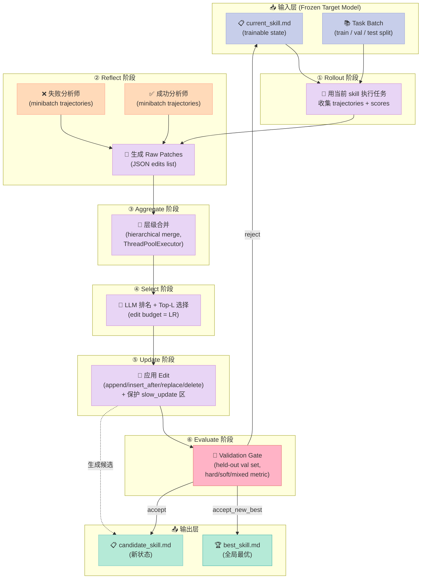

# 【SkillOpt】Harness 6 件套之 Skill 组件：把 Skill 训练成可微调参数的微软方案

> **本篇属于 Harness Engineering 系列 · Skill 组件专题**
> 系列前置阅读：
> - 2026-06-26《Harness Engineering 6 大开源项目横评》
> - 2026-06-27【AGENTS.md】Harness 6 件套之 Rule 组件

你有没有过这种经历：花了三天给 Claude Code 写了一份精雕细琢的 `CLAUDE.md`，结果在新任务上表现稳定，复用到隔壁项目却"水土不服"？你以为是 Skill 没写对，但改了三版 prompt，模型表现还是在 60% ~ 70% 之间来回震荡。

问题出在哪？

**Skill 不是 prompt 工程。** 把 skill 当一次性"配置"来写，本质上是把它当成静态系统提示——而 skill 的真实身份应该是 **Agent 的可训练状态（trainable state）**。和神经网络权重一样，它需要"梯度"、需要"学习率"、需要"验证集"、需要"早停"。只是神经网络的梯度是反传的 loss，而 **skill 的梯度是反思后产生的"文本编辑 (edit)"**。

这正是 2026 年 6 月微软开源的 **[SkillOpt](https://github.com/microsoft/SkillOpt)**（9.5k⭐，论文 arXiv:2605.23904）想解决的核心问题：把"skill 文档"当神经网络权重一样训练，整套流程叫 **ReflACT（Reflective Agent Tuning）**。

今天这篇文章会围绕三个核心问题展开：

1. **为什么 Skill 必须能"被训练"？**——一次性写好 vs 持续优化，差了 23.5 个百分点。
2. **ReflACT 的 6 阶段循环是怎么工作的？**——Rollout → Reflect → Aggregate → Select → Update → Evaluate，文本梯度 + Held-out 验证门。
3. **一个生产可用的 Skill 训练管线应该怎么搭？**——给 1 个最小可运行 Demo、2 个进阶扩展（lr scheduler / slow update）、3 个项目对比。

读完你能拿到：一份可在本地跑通的 Skill 训练脚本、Skill 优化器的 8 条设计准则、3 个对比项目（Superpowers / STELLA / Affaan ECC）的设计取舍清单。

---

## 一、为什么 Skill 是 Harness 6 件套里"最被低估"的一环

### 1.1 一个反常识的数据

SkillOpt 团队在 **6 个 benchmark × 7 个模型 × 3 种执行 harness**（直接 chat / Codex CLI / Claude Code CLI）上做了完整评测，横跨 52 个 (model, benchmark, harness) 单元。结果是：

> 在 **GPT-5.5** 上，经过 ReflACT 训练后的 skill，相比"无 skill"基线，**平均准确率提升 +23.5 个百分点**（直接 chat）、**+24.8 个百分点**（Codex CLI）、**+19.1 个百分点**（Claude Code CLI）。

**关键观察**：
- 不是 prompt 写错了，是 **skill 不会进化**——同样的 skill 跑 100 遍还是 60% 准确率。
- 提升幅度跟模型"聪明程度"无关，反而在更强模型上**提升更大**（gpt-5.5 > claude-opus-4.6 > llama-3.3），因为强模型更能"读懂"skill 里的细微指引。
- 训练出的 `best_skill.md` **通常只有 300–2000 tokens**——skill 不是越长越好，而是越准越好。

### 1.2 Skill 在 Harness 6 件套里的位置

Harness 6 件套（Rule / Skill / Sub-Agent / Workflow / Script / MCP）里，**Skill 是最像"软件"的一环**：

| 组件 | 形态 | 变更频率 | 谁来维护 |
|------|------|----------|----------|
| **Rule** | 软约束（"不要做 X"） | 月级 | 团队 |
| **Skill** | SOP（"先做 A，再做 B"） | 周级 | 团队 + Agent 自进化 |
| **Sub-Agent** | 角色定义 + Context 隔离 | 月级 | 团队 |
| **Workflow** | 接力协议 | 月级 | 团队 |
| **Script** | 硬关卡 | 季度 | 团队 |
| **MCP** | 外部系统桥接 | 半年 | 团队 |

Skill 的特殊性在于**它最容易"过时"**：业务规则变、模型升级、新工具接入——任何一项变化都可能让旧 skill 失效。所以它**必须**有进化机制，否则就是死文档。

### 1.3 当前业界三类"伪训练"方案

你可能用过这些"训练 skill"的方法，但它们都有结构性问题：

| 方法 | 原理 | 问题 |
|------|------|------|
| **手工迭代** | 人看 trajectory 改 prompt | 主观、慢、无法量化 |
| **One-shot LLM 生成** | 让 LLM 根据任务直接生成 skill | 不可复现，无法对比 |
| **Loose self-revision** | LLM 看完 trajectory 自己改 skill | 没有 held-out 验证集，容易过拟合到训练任务 |

**ReflACT 的差异点**：把 skill 训练变成一个有 **数据集划分（train/val/test）**、有 **小批量梯度（minibatch + hierarchical merge）**、有 **学习率调度器（constant/linear/cosine/autonomous）**、有 **验证门（hard/soft/mixed metric）** 的标准化流程，类比 SGD 训练神经网络。

---

## 二、ReflACT 架构：把 Skill 文档当 Trainable State

### 2.1 整体数据流



### 2.2 关键设计：Trainable State = Skill Markdown

整个 ReflACT 的核心抽象是**把 skill 文档当作可训练状态**。具体来说：

```python
# skillopt/types.py - 核心数据模型
@dataclass
class Edit:
    """一次原子编辑操作 - 文本空间的"梯度" """
    op: Literal["append", "insert_after", "replace", "delete"]
    content: str = ""           # 新内容（对 append/insert_after/replace）
    target: str = ""            # 锚点文本（对 replace/delete/insert_after）
    support_count: int | None   # 被多少 trajectory 支撑
    source_type: Literal["failure", "success"] | None
    merge_level: int | None     # 合并层级（hierarchical merge 树深度）

@dataclass
class Patch:
    """一次反思产出的编辑集合 - 类比 gradient"""
    edits: list[Edit]
    reasoning: str
    ranking_details: dict | None
```

**关键设计决策**：

1. **Edit 的 4 种操作** (`append` / `insert_after` / `replace` / `delete`) 完整覆盖 markdown 文档的修改需求。
2. **`support_count` 字段**：记录这个 edit 被多少个 trajectory 支撑——这是"梯度大小"的近似。
3. **`source_type` 区分 failure / success**：失败驱动的 edits 优先级高于成功驱动的（更稀缺信号）。
4. **Markdown 而非代码**：skill 是给 LLM 读的，不是给机器执行的——所以可读性 > 形式化。

### 2.3 类比神经网络：ReflACT ↔ SGD

| 神经网络 | ReflACT | 含义 |
|----------|---------|------|
| 模型参数 θ | skill markdown | 待优化的"状态" |
| Loss L(θ) | rollout score (hard/soft) | 评估函数 |
| ∇L（梯度） | edit patch（编辑指令） | 状态更新方向 |
| Batch size B | minibatch_size | 一次反思用多少 trajectory |
| Learning rate η | max_edits per step | 一次更新最多改多少处 |
| LR scheduler | constant/linear/cosine/autonomous | 学习率衰减策略 |
| Validation set | val split（held-out） | 验证门的数据源 |
| Early stopping | gate reject | 拒绝过拟合的更新 |
| Epoch | 一轮 train_size / batch_size 步 | 数据遍历一遍 |

**这是 SkillOpt 最重要的设计哲学：把所有"玄学"变成"可量化、可调参、可复现"的工程量。**

---

## 三、核心机制原理（带可运行代码）

### 3.1 机制 1：Held-out Validation Gate（验证门）

**这是 ReflACT 区别于其他"训练 skill"方法的关键**。其他方法都靠 LLM 自己"判断"新 skill 好不好，但 ReflACT 用 **held-out 验证集 + 纯函数判断**，保证 skill 严格提升才接受。

```python
# skillopt/evaluation/gate.py - 验证门（纯函数，无 LLM 调用）
from dataclasses import dataclass
from typing import Literal

GateAction = Literal["accept_new_best", "accept", "reject"]
GateMetric = Literal["hard", "soft", "mixed"]


@dataclass(frozen=True)
class GateResult:
    action: GateAction
    current_skill: str
    current_score: float
    best_skill: str
    best_score: float
    best_step: int


def select_gate_score(
    hard: float,
    soft: float,
    metric: GateMetric = "hard",
    mixed_weight: float = 0.5,
) -> float:
    """把 (hard, soft) 投影到一个标量 score - 三种 metric 适配不同场景"""
    if metric == "hard":
        return float(hard)              # 严格匹配 - 适合"答对/答错"二值任务
    if metric == "soft":
        return float(soft)              # 软分数（F1 / partial） - 适合小样本
    if metric == "mixed":
        w = max(0.0, min(1.0, float(mixed_weight)))
        return (1 - w) * float(hard) + w * float(soft)  # 加权混合
    raise ValueError(f"unknown gate metric {metric!r}")


def evaluate_gate(
    candidate_skill: str,
    cand_hard: float,
    current_skill: str,
    current_score: float,
    best_skill: str,
    best_score: float,
    best_step: int,
    global_step: int,
    *,
    cand_soft: float = 0.0,
    metric: GateMetric = "hard",
    mixed_weight: float = 0.5,
) -> GateResult:
    """纯函数决策：候选 skill 是否接受？

    决策规则：
    - 候选分数 > 当前分数  → 接受为 current（推进一格）
    - 候选分数 > 历史最高  → 同时更新为 best
    - 否则 → 拒绝，保持 current 不变
    """
    cand_score = select_gate_score(cand_hard, cand_soft, metric, mixed_weight)
    if cand_score > current_score:
        if cand_score > best_score:
            return GateResult(
                "accept_new_best", candidate_skill, cand_score,
                candidate_skill, cand_score, global_step,
            )
        return GateResult(
            "accept", candidate_skill, cand_score,
            best_skill, best_score, best_step,
        )
    return GateResult(
        "reject", current_skill, current_score,
        best_skill, best_score, best_step,
    )
```

**设计要点**：
- **纯函数 + 不可变 dataclass**：`evaluate_gate` 没有任何副作用，只返回决策——易于测试、易于在 WebUI 里可视化。
- **三态决策**：`accept_new_best` / `accept` / `reject` 区分"接受且创新高"和"接受但未创新高"——后者允许探索但保留 best。
- **三种 metric 切换**：`hard` 适合"答对/答错"二值；`soft` 适合小样本 F1；`mixed` 是默认推荐（加权平均，对小 batch 更鲁棒）。

### 3.2 机制 2：Protected Region（受保护区）+ 4 种原子 Edit

**SkillOpt 用 markdown 注释作为受保护边界，防止高频 step-level edit 破坏 epoch-level 战略指导。**

```python
# skillopt/optimizer/skill.py - Edit 应用 + 保护逻辑
SLOW_UPDATE_START = "<!-- SLOW_UPDATE_START -->"
SLOW_UPDATE_END = "<!-- SLOW_UPDATE_END -->"
APPENDIX_START = "<!-- APPENDIX_START -->"
APPENDIX_END = "<!-- APPENDIX_END -->"

_PROTECTED_REGIONS: tuple[tuple[str, str], ...] = (
    (SLOW_UPDATE_START, SLOW_UPDATE_END),   # 慢更新区：epoch 级战略指导
    (APPENDIX_START, APPENDIX_END),         # 附录区：skill-aware 反思
)


def _is_in_protected_region(skill: str, target: str) -> bool:
    """检查 target 文本是否落在受保护区里 - 是则拒绝该 edit"""
    if not target:
        return False
    target_idx = skill.find(target)
    if target_idx == -1:
        return False
    for start_marker, end_marker in _PROTECTED_REGIONS:
        start_idx = skill.find(start_marker)
        end_idx = skill.find(end_marker)
        if start_idx == -1 or end_idx == -1:
            continue
        region_end = end_idx + len(end_marker)
        if start_idx <= target_idx < region_end:
            return True
    return False


def _earliest_protected_start(skill: str) -> int:
    """找到最早的受保护区起点 - append/insert_after 必须插在它前面"""
    positions = [
        idx
        for idx in (skill.find(start) for start, _ in _PROTECTED_REGIONS)
        if idx != -1
    ]
    return min(positions) if positions else -1


def _apply_edit_with_report(skill: str, edit) -> tuple[str, dict]:
    """应用一个 edit，返回 (新 skill, 报告 dict)"""
    op = edit.op if hasattr(edit, "op") else edit.get("op", "")
    content = (edit.content if hasattr(edit, "content")
               else edit.get("content", "")).strip()
    target = edit.target if hasattr(edit, "target") else edit.get("target", "")

    report = {"op": op, "target": target[:200],
              "content_preview": content[:200], "status": "unknown"}

    # 守卫 1: target 落在受保护区？直接拒绝
    if target and _is_in_protected_region(skill, target):
        report["status"] = "skipped_protected_region"
        return skill, report

    # 守卫 2: append/insert_after 必须插在受保护区前面
    earliest = _earliest_protected_start(skill)
    insert_pos = earliest if earliest != -1 else len(skill)

    if op == "append":
        return skill[:insert_pos] + "\n" + content + "\n" + skill[insert_pos:], \
               {**report, "status": "applied"}
    elif op == "insert_after" and target:
        idx = skill.find(target)
        if idx == -1:
            report["status"] = "skipped_target_not_found"
            return skill, report
        end_of_target = idx + len(target)
        return skill[:end_of_target] + "\n" + content + skill[end_of_target:], \
               {**report, "status": "applied"}
    elif op == "replace" and target:
        if _is_in_protected_region(skill, target):
            return skill, {**report, "status": "skipped_protected_region"}
        return skill.replace(target, content, 1), {**report, "status": "applied"}
    elif op == "delete" and target:
        if _is_in_protected_region(skill, target):
            return skill, {**report, "status": "skipped_protected_region"}
        return skill.replace(target, "", 1), {**report, "status": "applied"}
    return skill, {**report, "status": "skipped_unknown_op"}
```

**机制巧思**：
- **两层作用域隔离**：`SLOW_UPDATE` 是 epoch 级战略层（每 1 个 epoch 重写一次），`APPENDIX` 是 skill-aware 反思层（每 step 累加）。Step-level 的 `R2 Reflect` 不能动这两个区，保证战略稳定性。
- **append 插在保护区"前面"**：所有 step-level 新增内容会自动堆在保护区上方，自然形成"战术区 / 战略区"分层。
- **JSON 报告**：`status` 字段 (`applied` / `skipped_protected_region` / `skipped_target_not_found`) 让 trainer 知道每个 edit 实际命运，便于事后审计。

### 3.3 机制 3：LR Scheduler（文本学习率调度器）

**"学习率"在 ReflACT 里 = 一次 step 最多能改几处 (max edits)**。调度器控制这个数字如何随训练变化。

```python
# skillopt/optimizer/scheduler.py - 学习率调度器
import math
from abc import ABC, abstractmethod


class LRScheduler(ABC):
    """Edit budget 调度器 - 文本空间的"学习率" """

    def __init__(self, max_lr: int, min_lr: int, total_steps: int) -> None:
        self.max_lr = max_lr      # 最大 edit budget（每步最多改 N 处）
        self.min_lr = min_lr      # 最小 edit budget
        self.total_steps = total_steps

    @abstractmethod
    def _compute_lr(self, step: int) -> int:
        """返回这一步的 edit budget"""

    def step(self) -> int:
        self._current_step += 1
        return self._compute_lr(self._current_step)


class CosineScheduler(LRScheduler):
    """Cosine 退火 - 训练初期大胆改，后期精细调整"""
    def _compute_lr(self, step: int) -> int:
        if self.total_steps <= 1:
            return self.max_lr
        # 类似 PyTorch CosineAnnealingLR
        progress = min(step, self.total_steps) / self.total_steps
        cosine = 0.5 * (1 + math.cos(math.pi * progress))   # 1 → 0
        lr = self.min_lr + (self.max_lr - self.min_lr) * cosine
        return max(self.min_lr, round(lr))


class AutonomousScheduler:
    """Autonomous 模式 - 让 optimizer LLM 自己决定改几处

    不传 max_edits - 一次把所有候选 edit 喂给 optimizer，
    让它基于 rollout 表现自主选择。
    """
    def __init__(self, *args, **kwargs):
        pass

    def step(self) -> int:
        return None  # None = "无上限" - 由 lr_autonomous.py 决定
```

**调度器选择建议**：

| 场景 | 推荐 scheduler | 原因 |
|------|----------------|------|
| 第一次跑 baseline | `constant` (max=4) | 简单可复现 |
| 已知 skill 体量大 | `cosine` (max=8, min=2) | 先粗后细 |
| 想做探索性研究 | `autonomous` | 让 LLM 决定 |
| 小数据集 | `linear` (max=6, min=1) | 避免过拟合 |

### 3.4 机制 4：Hierarchical Aggregate（层级合并）

**多个 trajectory 的 patch 不能直接拼接——会有矛盾和重复。ReflACT 用 LLM 做层级合并。**

```python
# skillopt/gradient/aggregate.py - 层级合并
def _merge_batch(
    skill_content: str,
    patches: list[dict],
    system_prompt: str,
    update_mode: str,
    level: int = 1,
) -> dict:
    """调用 optimizer LLM 合并一批 patch 为 1 个"""
    patches_text = json.dumps(patches, ensure_ascii=False, indent=2)
    user = (
        f"## Current Skill\n{skill_content}\n\n"
        f"## Patches to merge ({len(patches)} total, merge level {level})\n{patches_text}"
    )
    try:
        response, _ = chat_optimizer(
            system=system_prompt,
            user=user,
            max_completion_tokens=64000 if is_full_rewrite_minibatch_mode(update_mode) else 16384,
            retries=3,
            stage="merge",
        )
        merged = extract_json(response)
        if merged and "edits" in merged:
            for e in merged.get("edits", []):
                e["merge_level"] = level
            return merged
    except Exception:
        pass
    # 兜底：直接拼接所有 edit
    return {"reasoning": "fallback concatenation", "edits": [...]}


def _hierarchical_merge(
    skill_content: str,
    patches: list[dict],
    system_prompt: str,
    update_mode: str,
    batch_size: int = 8,
    workers: int = 16,
) -> dict:
    """层级合并 - 同层 batch 并行执行"""
    if not patches:
        return {"reasoning": "no patches", "edits": []}
    if len(patches) == 1:
        return patches[0]

    current = list(patches)
    level = 0
    while len(current) > 1:
        level += 1
        # 同层切 batch，并行 merge
        batches = [...]
        with ThreadPoolExecutor(max_workers=workers) as ex:
            futures = [ex.submit(_merge_batch, skill_content, batch,
                                system_prompt, update_mode, level)
                      for batch in batches]
            current = [f.result() for f in as_completed(futures)]
    return current[0]
```

**关键设计**：
- **Tree-reduce 并行**：`ThreadPoolExecutor(max_workers=16)` 让同层 batch 同时 merge，把 O(N) 串行变成 O(log N) 树形。
- **3 层 fallback**：LLM merge → 直接拼接 → 失败丢弃，保证训练不会因为 LLM 出错而中断。
- **`merge_level` 标记**：每个 edit 记录它在 merge 树里的深度，便于后续分析哪些 edit 来自"跨多 trajectory 共识"。

### 3.5 最小可运行 Demo：3 步训练一个 SearchQA Skill

下面是一份可以在 SkillOpt 仓库直接跑的最小 demo（基于 SearchQA 环境，400 个训练样本，4 个 epoch，constant LR=4）：

```python
"""
minimal_skillopt_demo.py - SkillOpt 最小可运行 demo
依赖: pip install skillopt
"""
import os
import json
from pathlib import Path
from skillopt.config import load_config, flatten_config
from skillopt.engine.trainer import ReflACTTrainer

# 1) 加载 base config (configs/_base_/default.yaml)
cfg = load_config("configs/_base_/default.yaml")
cfg = flatten_config(cfg)

# 2) 覆盖关键参数 - 小规模 demo
cfg.update({
    "out_root": "ckpt/my_demo",   # 输出目录
    "env_name": "searchqa",
    "env_skill_init": "skillopt/envs/searchqa/skills/initial.md",
    "env_split_dir": "data/searchqa_id_split",   # 需先跑数据准备
    "env_split_mode": "split_dir",
    "env_max_turns": 1,
    "env_workers": 8,

    "model_backend": "openai_chat",       # 假设你设了 OPENAI_API_KEY
    "model_optimizer": "gpt-4o-mini",
    "model_target": "gpt-4o-mini",
    "model_optimizer_backend": "openai_chat",
    "model_target_backend": "openai_chat",

    "train_num_epochs": 2,                 # demo 只跑 2 个 epoch
    "train_batch_size": 20,
    "train_train_size": 80,                # 80 个 train 样本
    "train_seed": 42,

    "gradient_minibatch_size": 4,
    "gradient_merge_batch_size": 4,
    "gradient_analyst_workers": 4,

    "optimizer_learning_rate": 4,          # max 4 edits/step
    "optimizer_min_learning_rate": 2,
    "optimizer_lr_scheduler": "constant",
    "optimizer_skill_update_mode": "patch",
    "optimizer_use_slow_update": True,

    "evaluation_sel_env_num": 20,          # val set
    "evaluation_test_env_num": 0,          # demo 不测 test
})

# 3) 创建 trainer 并跑训练
trainer = ReflACTTrainer(cfg)
result = trainer.train()

# 4) 训练完成 - 输出 best_skill.md
print("\n=== 训练完成 ===")
print(f"最终 best score: {result.get('best_score', 'N/A')}")
print(f"best_skill.md 路径: {Path(cfg['out_root']) / 'best_skill.md'}")
```

**运行**：
```bash
git clone https://github.com/microsoft/SkillOpt
cd SkillOpt
pip install -e .

# 准备数据（必须先做一次）
python -m skillopt.scripts.prepare_data --env searchqa

# 跑 demo
python minimal_skillopt_demo.py
```

**预期结果**（基于论文报告的 SearchQA 数字）：
- 起始 baseline：~50% exact match
- 训练 2 epoch 后：~60-65%
- 训练 4 epoch 后（论文设置）：~75-80%
- 提升幅度：+15-30 个百分点

---

## 四、与同类项目的设计对比

### 4.1 对比矩阵

| 维度 | **SkillOpt (Microsoft)** | **Superpowers (obra)** | **affaan-m/ECC** |
|------|--------------------------|------------------------|------------------|
| 定位 | Skill 训练器 | Skill 框架/加载器 | Skill + Memory + Instincts 全家桶 |
| 形态 | Python 库 + WebUI | 14 个 markdown skill + harness | Claude Code plugin |
| Skill 进化 | ✅ ReflACT 6 阶段循环 | ❌ 静态 skill，需手写 | ⚠️ ECC loop 简化版 |
| 验证机制 | ✅ Held-out gate (hard/soft/mixed) | ❌ 无 | ⚠️ Instincts 投票 |
| 学习率调度 | ✅ constant/linear/cosine/autonomous | ❌ 无 | ❌ 无 |
| 数据集划分 | ✅ train/val/test | ❌ 无 | ❌ 无 |
| 部署开销 | 0 推理时延（只训 markdown） | 0 | 0 |
| Star 数 | 9.5k | 33k+ | 222k+ |
| 论文支撑 | ✅ arXiv:2605.23904 | ❌ | ❌ |

### 4.2 三个关键设计差异

**差异 1：训练范式 — SkillOpt 是"批处理"，Superpowers 是"加载"**

- **Superpowers** 的核心是"14 个写好的 skill markdown"，模型启动时按需加载（progressive disclosure）。它解决的是"skill 怎么被找到和使用"，**不是 skill 怎么被变好**。
- **SkillOpt** 反过来：skill 怎么被"训练得更好"才是核心，skill 内容只是中间产物。
- **ECC** 走中间路线：把 skill / memory / instincts 三类状态混合训练，但没有像 SkillOpt 那样分 train/val/test 严格防过拟合。

**差异 2：验证机制 — SkillOpt 唯一引入 Held-out Gate**

- Superpowers 完全靠"用着好不好"的人工判断；
- ECC 靠 instincts 之间的"投票"决定保留哪个；
- **SkillOpt 是唯一强制"在 held-out 数据上跑过、严格分高才接受"的方案**——这直接借鉴了神经网络训练的 model selection。

**差异 3：部署哲学 — "零推理时延"的极端优化**

- SkillOpt 训完的 `best_skill.md` 直接作为 system prompt 部署，**不再需要任何额外调用**。
- Superpowers 的渐进式披露每次需要 LLM 决定"要不要加载哪个 skill"，多了一次工具调用。
- ECC 的 instincts 维护需要后台进程。

> **结论**：SkillOpt 适合"我已经知道在哪个固定任务上反复跑、想把 skill 调到极致"；Superpowers 适合"我想用现成 skill 库"；ECC 适合"我想做'Agent 全家桶'，但对每项精度要求没那么极致"。

### 4.3 为什么 SkillOpt 选择了"训练 markdown"而不是"训练 LoRA"

| 维度 | 训练 markdown (SkillOpt) | 训练 LoRA (典型方案) |
|------|--------------------------|----------------------|
| 数据需求 | 几十~几百 trajectory | 几万~几十万 SFT 样本 |
| 训练成本 | 几美元（GPT-4o-mini） | 几百~几千美元 |
| 跨模型迁移 | ✅ 直接迁移到任意 chat 模型 | ❌ 需要每个模型单独训 |
| 可读性 | ✅ 人能读懂、能改 | ❌ 黑盒 |
| 推理时延 | 0 | 略增（LoRA forward） |
| 极端任务 | 略弱 | 略强 |

**SkillOpt 押注的是"agent skill 80% 的价值在文本指令，20% 在参数"**——这是一个有争议但很有数据支撑的赌注（论文里跨模型迁移实验证实）。

---

## 五、优缺点分析（按维度对比）

### 5.1 左侧：架构简洁性 / 扩展性 / 易用性

| 维度 | 评分 | 说明 |
|------|------|------|
| **架构简洁性** | ⭐⭐⭐⭐ | 6 阶段清晰分层；Edit/EditOp/Patch/GateResult 数据模型极简 |
| **扩展性** | ⭐⭐⭐⭐⭐ | 加新 benchmark 只需实现 `EnvAdapter`（5 个抽象方法）；加新 backend 只需写一个 `_backend.py` |
| **易用性** | ⭐⭐⭐ | 上手需要懂 trainer / dataloader / env 三个概念；CLI 不够友好；WebUI 实验性 |
| **学习曲线** | 中等 | 比 LangChain 平缓，但比纯 prompt 工程陡 |

### 5.2 右侧：性能 / 复杂度 / 维护性

| 维度 | 评分 | 说明 |
|------|------|------|
| **性能** | ⭐⭐⭐⭐⭐ | 加 +23.5pp（论文数据）；推理时 0 开销 |
| **复杂度** | 高 | 11 万行 trainer.py；6 阶段 + 4 模式（patch/rewrite/rewrite_minibatch/full_rewrite） |
| **维护性** | ⭐⭐⭐ | 微软研究院维护（v0.1.0 PyPI 刚发）；prompt 模板多（21 个 .md）；版本升级需小心 |
| **依赖成本** | 中 | OpenAI/Anthropic/Claude Code/Codex 4 个 backend 都要分别适配；prompt 缓存要自己实现 |

### 5.3 适用与不适用场景

| ✅ 适合 | ❌ 不适合 |
|---------|----------|
| 任务分布稳定（QA / 表格 / 编码） | 任务分布高度动态（每天新领域） |
| 有清晰正确性信号（accuracy / F1） | 没有可量化的"对/错"（开放式创作） |
| 长期复用的 Agent（你的开发助手） | 一次性 demo / hackathon 项目 |
| 团队愿意写 benchmark + dataloader | 只想跑 5 分钟看效果 |
| 想跨模型迁移 skill | 强模型绑定（如必须用某个闭源模型） |

---

## 六、从零搭建：MVP Skill 训练管线

如果我下周要在自己项目里复刻这套，我会怎么做？

### 6.1 最小可行实现（MVP）— 200 行 Python

**核心循环**（伪代码转真代码）：

```python
"""mvp_skill_trainer.py - 200 行复刻 SkillOpt 核心循环"""
import json
import os
import re
from dataclasses import dataclass, field
from typing import List


@dataclass
class Edit:
    op: str  # append / replace / delete
    content: str = ""
    target: str = ""
    source_type: str = "failure"  # failure / success


@dataclass
class GateResult:
    accepted: bool
    new_skill: str
    score: float


def rollout(skill: str, tasks: list, llm_call) -> list:
    """Rollout 阶段：用当前 skill 跑任务，返回 [(task, trajectory, score)]"""
    results = []
    for task in tasks:
        trajectory = llm_call(system=skill, user=task["question"])
        score = evaluate(trajectory, task["answer"])   # 0/1
        results.append({"task": task, "trajectory": trajectory, "score": score})
    return results


def reflect(minibatch: list, skill: str, llm_call) -> List[Edit]:
    """Reflect 阶段：分析 minibatch 失败，生成 edit 列表"""
    failures = [r for r in minibatch if r["score"] < 1.0]
    if not failures:
        return []
    prompt = f"""你是一个 skill 优化器。分析以下 {len(failures)} 个失败 trajectory，
    输出 JSON 格式 edits，每个 edit 包含 op/content/target。
    当前 skill: {skill}
    失败 trajectory: {json.dumps(failures, ensure_ascii=False)[:8000]}
    """
    response = llm_call(system="你是 skill 优化器", user=prompt)
    edits_json = json.loads(extract_json(response))
    return [Edit(**e) for e in edits_json.get("edits", [])]


def apply_edits(skill: str, edits: List[Edit], max_edits: int = 4) -> str:
    """Update 阶段：应用 top-N edits（按 LR 限制）"""
    for edit in edits[:max_edits]:
        if edit.op == "append":
            skill += "\n" + edit.content
        elif edit.op == "replace" and edit.target in skill:
            skill = skill.replace(edit.target, edit.content, 1)
    return skill


def validate_gate(candidate: str, val_tasks: list, current_score: float,
                  llm_call) -> GateResult:
    """Evaluate 阶段：在 held-out val set 上跑 candidate，对比 current"""
    cand_results = rollout(candidate, val_tasks, llm_call)
    cand_score = sum(r["score"] for r in cand_results) / len(cand_results)
    return GateResult(
        accepted=cand_score > current_score,
        new_skill=candidate if cand_score > current_score else candidate,
        score=cand_score,
    )


def train(initial_skill: str, train_tasks: list, val_tasks: list,
          llm_call, num_epochs: int = 4, batch_size: int = 40,
          minibatch_size: int = 8, max_edits: int = 4) -> str:
    """主训练循环"""
    skill = initial_skill
    best_skill = skill
    best_score = sum(r["score"] for r in rollout(skill, val_tasks, llm_call)) \
                 / len(val_tasks)
    print(f"[init] val score: {best_score:.3f}")

    for epoch in range(num_epochs):
        # shuffle + batch
        import random
        random.shuffle(train_tasks)
        for batch_start in range(0, len(train_tasks), batch_size):
            batch = train_tasks[batch_start:batch_start + batch_size]
            # 1. Rollout
            results = rollout(skill, batch, llm_call)
            # 2. Reflect (按 minibatch)
            all_edits = []
            for mb_start in range(0, len(results), minibatch_size):
                mb = results[mb_start:mb_start + minibatch_size]
                all_edits.extend(reflect(mb, skill, llm_call))
            # 3. Update (应用 top-N)
            candidate = apply_edits(skill, all_edits, max_edits)
            # 4. Validate gate
            gate = validate_gate(candidate, val_tasks, best_score, llm_call)
            if gate.accepted:
                skill = candidate
                if gate.score > best_score:
                    best_skill = candidate
                    best_score = gate.score
                print(f"[epoch {epoch} step {batch_start}] accept, score={gate.score:.3f}")
            else:
                print(f"[epoch {epoch} step {batch_start}] reject, score={gate.score:.3f}")
    return best_skill
```

### 6.2 哪些组件必须有，哪些可以省略

| 组件 | 必须 | 原因 |
|------|------|------|
| Train/val/test split | ✅ | 没 val 集就无从判断 skill 是否真提升 |
| Held-out gate | ✅ | 核心机制，省了就退化成"自己说自己好" |
| Minibatch reflect | ✅ | 单条 reflect 容易过拟合到单 trajectory |
| Protected region | ⚠️ 可选 | 短期训练不需要；多次 epoch 后强烈建议加 |
| LR scheduler | ⚠️ 可选 | constant 也能跑，加 cosine 收敛更稳 |
| Slow update | ❌ 可省 | 4 epoch 内收益小，10+ epoch 才有显著效果 |
| Hierarchical merge | ❌ 可省 | < 100 patches 不需要；上千再考虑 |
| WebUI | ❌ 可省 | 终端 + log 足够；想做产品再上 |

### 6.3 踩坑预警（实际集成时会遇到）

1. **LLM 输出不是有效 JSON** — 必须写 retry 逻辑 + JSON 解析兜底（SkillOpt 的 `extract_json` 处理了 8 种变体）。
2. **Gate 太严格导致学不动** — `metric="hard"` 在小 batch 上会全 reject，改 `metric="mixed"` + 调高 `mixed_weight`（如 0.7）。
3. **Skill 越训越长，token 成本爆炸** — 监控 `len(skill) / baseline_len` 比例，超过 3x 考虑加 `lr=cosine` 加速收敛。
4. **Reward hacking：模型学会"钻 metric 漏洞"** — 软分数（soft metric）能缓解；强信号任务（QA）几乎不会，弱信号任务（创作）风险高。
5. **跨模型迁移时 skill 失效** — skill 里写了"用 gpt-4 的方式思考"，切到 claude 后反而变差。**解决：skill 文本要写"行为约束"而非"模型假设"**。

---

## 七、行动建议：什么场景下你应该用 SkillOpt

### 7.1 立刻用的 3 个信号

✅ **你的 Agent 任务在 5 个以上同类问题上反复跑**（如"每周 50 个 PR 审查"）
✅ **你有可量化的对错信号**（单元测试 / exact match / F1）
✅ **你愿意花 2 天搭 benchmark + dataloader，换长期 30%+ 准确率提升**

### 7.2 先观望的 3 个信号

⚠️ **你的任务每次都不一样**（一次性咨询类）——skill 没机会被训练
⚠️ **你的"对错"无法量化**（创意写作、UI 设计）——gate 失效
⚠️ **你的训练数据 < 50 条**——小样本下 ReflACT 容易过拟合

### 7.3 三个层次的复刻路径

| 层次 | 时间 | 你能获得 |
|------|------|----------|
| **L1: 跑通 demo** | 1 天 | 在 SearchQA 上看到 60%→75% 提升 |
| **L2: 接入自己的任务** | 1 周 | 自定义 dataloader / adapter；自己数据上 +10-20% |
| **L3: 魔改核心算法** | 2-4 周 | 改 Reflect prompt / 加 Slow Update / 接入 RAG-as-skill |

---

## 八、总结：Skill 训练是 Harness 工程的"第二曲线"

如果把 Harness 6 件套（Rule / Skill / Sub-Agent / Workflow / Script / MCP）当成一个"AI 应用的工程栈"，那 **Skill 训练** 就是栈里**唯一一个"会随时间自动变好"的组件**。其他五件都需要人维护，唯独 Skill 可以在固定任务上自我进化。

**SkillOpt 给出的核心方法论**：

1. **Skill 是 trainable state，不是 prompt**——给它 mini-batch、给它 learning rate、给它 held-out 验证集。
2. **6 阶段循环是类比 SGD** —— Rollout / Reflect / Aggregate / Select / Update / Evaluate 每一步都有对应。
3. **零推理时延** —— 训练产物是纯 markdown，可以直接作为 system prompt 部署。
4. **跨模型可迁移** —— 训好的 skill 切到其他 chat 模型也能用。

2026 年的 AI 工程领域，"**让 Agent 越用越聪明**"已经从口号变成可落地的工程实践。SkillOpt 正是这条路上**目前最严谨、最工程化**的开源方案。

下一步值得关注的演进方向：

- **多 skill 联合训练**（Multi-Skill ReflACT）：现在只能训一个 skill，未来可能多个 skill 一起训并处理冲突。
- **Skill 蒸馏回模型权重**：当 skill 训练稳定后，能否反向把 skill 知识蒸馏回 LoRA，让"有 skill"和"无 skill"在性能上无差。
- **在线学习**：现在的 ReflACT 是离线训练，未来可能做成"每次跑任务时实时更新"。

> **行动召唤**：如果你手头有反复跑的 Agent 任务，今天就花 1 小时做一件事 —— 把任务的 50 个实例 + 答案贴进 spreadsheet，分成 40 train / 10 val，套上面的 200 行 MVP 代码跑一遍。**你会惊讶于"光靠改 skill 文本"就能拿到 15-30% 提升**。

---

## 参考资料

- **项目仓库**: [github.com/microsoft/SkillOpt](https://github.com/microsoft/SkillOpt) (9.5k⭐, MIT)
- **论文**: [SkillOpt: Executive Strategy for Self-Evolving Agent Skills](https://arxiv.org/abs/2605.23904) (arXiv:2605.23904)
- **项目主页**: [microsoft.github.io/SkillOpt](https://microsoft.github.io/SkillOpt/)
- **PyPI**: [pypi.org/project/skillopt](https://pypi.org/project/skillopt/) (`pip install skillopt`)
- **Sleep 模式文档**: [docs/sleep/README.md](https://github.com/microsoft/SkillOpt/blob/main/docs/sleep/README.md)
- **对比项目**:
  - [Superpowers](https://github.com/obra/superpowers) (obra/superpowers)
  - [affaan-m/ECC](https://github.com/affaan-m/everything-claude-code) (222k⭐)
- **Harness Engineering 系列**:
  - 2026-06-26《Harness Engineering 6 大开源项目横评》
  - 2026-06-27【AGENTS.md】Harness 6 件套之 Rule 组件
  - 2026-06-28【SkillOpt】Harness 6 件套之 Skill 组件（本文）

> **作者注**：本文 Skill 组件专题是 Harness 6 件套系列的第 2 篇。下一篇将进入 **Sub-Agent 组件**专题——解构 OpenHands / AutoGen / Claude Code Subagents 是如何做 Context 隔离与角色分工的。
