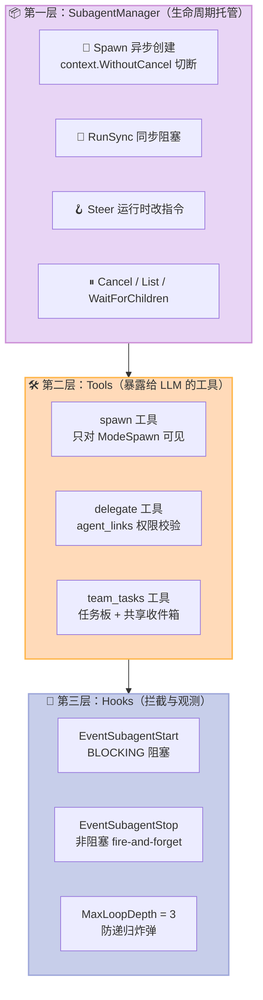
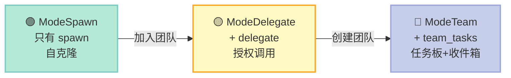
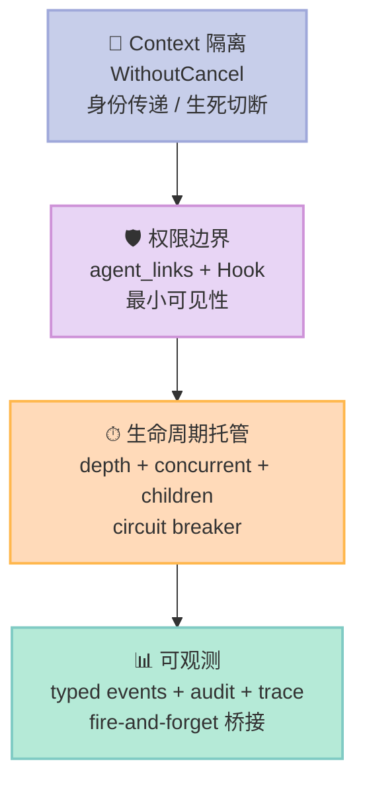

> **核心结论**：Sub-Agent 不是"再启动一个 LLM 调用"，而是 **Context 隔离 + 权限边界 + 生命周期托管** 三件套。GoClaw 用 337 行核心代码，把这三件套做成了可生产可观测的工程系统。

## 前言

如果让你实现一个 Sub-Agent（子代理），你会怎么做？

最朴素的答案是：在主 Agent 的循环里再 `for` 一次 LLM 调用。但这样做有三个致命问题：

1. **Context 污染**：子 Agent 看到的 prompt 永远带着父 Agent 的对话历史，token 成本失控
2. **权限放大**：子 Agent 自动继承父 Agent 的所有权限，撤销困难
3. **生命周期纠缠**：父 Agent 结束时 `cancel()` 会顺带杀掉子 Agent，长任务根本跑不完

这三个问题看起来像"工程细节"，但其实是 Sub-Agent 组件**能不能上线**的分水岭。今天要拆解的 **GoClaw**（`nextlevelbuilder/goclaw`，3352⭐，2026-06-29 最新提交）刚好把这三个问题的解法写到了一起。本文会从源码层面回答：

- 它怎么实现 Sub-Agent 的 **Context 隔离**？
- 三档编排模式（spawn / delegate / team）是如何渐进开放能力的？
- Hook 系统如何拦截"创建子 Agent"这个动作？

## 一、GoClaw 是什么：Agent Gateway 而非 Agent Framework

先把项目定位钉死。GoClaw 的 README 第一句话是：

> Multi-agent AI gateway built in Go. 20+ LLM providers. 7 channels. Multi-tenant PostgreSQL.

它**不做** Agent 逻辑（how to reason、how to plan），它**做** Agent 之间的调度（how to spawn、how to delegate、how to isolate）。这与 Harness Engineering 的核心定义完全契合：

| 维度 | Agent Framework（LangChain、CrewAI） | GoClaw（Agent Gateway） |
|------|--------------------------------------|-------------------------|
| 关注点 | 单 Agent 内部如何思考 | 多 Agent 之间如何协作 |
| 主要用户 | 应用开发者 | Agent 平台 / 团队管理员 |
| 核心问题 | 工具调用、ReAct 循环 | 权限边界、租户隔离、生命周期 |
| 部署形态 | Python 库 | 单二进制 + PostgreSQL |

在 Harness 6 件套矩阵里，GoClaw **横跨 Sub-Agent + Workflow + MCP 三个组件**，但它的**核心原创设计都集中在 Sub-Agent**（Context 隔离 + 编排模式 + Hook 拦截），所以本篇聚焦 Sub-Agent 维度拆解。

## 二、Sub-Agent 的三层架构：Manager → Tool → Hook

GoClaw 的 Sub-Agent 实现分成三个清晰的层级，从下到上是：



**为什么要分三层？** 这是经典的"机制 vs 策略"分离：

- **Manager** 管"物理事实"：一个子任务何时创建、何时结束、并发上限是多少 — 这是机制
- **Tools** 管"LLM 视角"：模型看到的工具名、参数 schema、能否被当前 Agent 调用 — 这是策略
- **Hooks** 管"治理视角"：创建子 Agent 前要不要审计、要不要阻断 — 这是策略

Manager 不关心 Hook，Tool 不关心 Manager，三层用接口连接。这就是 Harness Engineering 反复强调的 **Less is More**：模型自己学不会的部分（物理世界的并发上限、租户隔离、审计日志）放到 Manager/Hooks；模型能学会的部分（什么时候该 spawn）放到 Tool 描述里。

## 三、核心机制源码解析

### 3.1 SubagentManager.Spawn：Context 隔离的关键 6 行

这是整个 Sub-Agent 组件最关键的一段代码（`internal/tools/subagent_spawn.go`）：

```go
// 1. 校验：深度上限
if depth >= cfg.MaxSpawnDepth {
    return "", fmt.Errorf("spawn depth limit reached (%d/%d)", depth, cfg.MaxSpawnDepth)
}

// 2. 校验：每租户并发上限（不是全局上限）
tenantID := store.TenantIDFromContext(ctx)
running := 0
for _, t := range sm.tasks {
    if t.Status == TaskStatusRunning && t.OriginTenantID == tenantID {
        running++
    }
}
if running >= cfg.MaxConcurrent {
    return "", fmt.Errorf("max concurrent subagents reached (%d/%d)", running, cfg.MaxConcurrent)
}

// 3. 关键操作：Detach from parent's cancellation chain
detached := context.WithoutCancel(ctx)
taskCtx, taskCancel := context.WithCancel(detached)
subTask.cancelFunc = taskCancel
```

第三步是关键中的关键。Go 的 `context` 是一个**树形结构**：父 `cancel()` 会传染给所有子 `ctx`。如果不做这一步，父 Agent 一旦结束（或超时），它 spawn 的所有子 Agent 会被一起 `cancel()` — **这正是"长任务跑不完"的根因**。

`context.WithoutCancel(ctx)` 切断的是**取消传播**，但**保留了所有 context value**（AgentID、TraceID、TenantID、SessionKey 等）。这就是 Sub-Agent 的精髓：**继承身份，但不继承生死**。

如果想主动杀子任务，还能通过保存的 `taskCancel` 函数显式调用。这套机制被作者用一句话注释总结：

> Detach from parent's cancellation chain so subagent survives after parent run completes.

注意第二行的并发上限校验：**`if t.OriginTenantID == tenantID`**。GoClaw 不是用全局计数器，而是**按租户隔离**的计数器。这就让"租户 A 的 100 个并发子 Agent"不会挤占"租户 B"的额度 — 这是 Sub-Agent 从"原型"走向"生产"的关键差异。

### 3.2 三档 OrchestrationMode：能力的渐进式开放

GoClaw 的 Sub-Agent 不是"要么有要么没有"，而是分了三档（`internal/agent/orchestration_mode.go`）：

```go
const (
    ModeSpawn    OrchestrationMode = "spawn"     // 自克隆
    ModeDelegate OrchestrationMode = "delegate"  // 链接代理
    ModeTeam     OrchestrationMode = "team"      // 完整团队
)

func ResolveOrchestrationMode(ctx context.Context, agentID uuid.UUID, ...) OrchestrationMode {
    // 优先级：team > delegate > spawn
    if teamStore != nil {
        if team, _ := teamStore.GetTeamForAgent(ctx, agentID); team != nil {
            return ModeTeam
        }
    }
    if linkStore != nil {
        if targets, _ := linkStore.DelegateTargets(ctx, agentID); len(targets) > 0 {
            return ModeDelegate
        }
    }
    return ModeSpawn
}
```

每种模式对应不同的工具可见性：

| Mode | 可见工具 | 设计意图 |
|------|----------|----------|
| `spawn` | 只看到 `spawn` 工具 | 单 Agent 能力上限不够，自己 fork 自己 |
| `delegate` | `spawn` + `delegate` | 通过 `agent_links` 显式授权，可调用其他 Agent |
| `team` | `spawn` + `delegate` + `team_tasks` | 拥有完整任务板和共享收件箱 |

这个设计的妙处在于 **"权限是最小必要的"**。一个普通 Agent 即使想 `delegate`，如果它没在任何团队里、没任何 `agent_link`，它根本看不到 `delegate` 工具 — 因为工具描述都不出现在 system prompt 里。这是 Sub-Agent 安全模型的精髓：**不靠运行时拦截，靠机制上就不暴露**。

### 3.3 DelegateTool：用 agent_links 做权限校验

`internal/tools/delegate_tool.go` 完整展示了"授权"的实现：

```go
func (t *DelegateTool) Execute(ctx context.Context, args map[string]any) *Result {
    fromAgentID := store.AgentIDFromContext(ctx)
    target, err := t.agents.GetByKey(ctx, agentKey)

    // 权限检查：当前 Agent 能否调用目标 Agent？
    allowed, err := t.links.CanDelegate(ctx, fromAgentID, target.ID)
    if !allowed {
        return ErrorResult(fmt.Sprintf("no delegation link from current agent to %q", agentKey))
    }

    // 发 EventSubagentStart 阻塞事件（如果 Hook 返回 block，立刻终止）
    if t.hookDispatcher != nil {
        ev := hooks.Event{
            HookEvent: hooks.EventSubagentStart,
            Depth:     hooks.DepthFrom(ctx),
        }
        r, err := t.hookDispatcher.Fire(ctx, ev)
        if r.Decision == hooks.DecisionBlock {
            return ErrorResult(fmt.Sprintf("delegation to %q blocked by hook policy", agentKey))
        }
        // 嵌套调用前递增深度，防止递归炸弹
        ctx = hooks.IncDepth(ctx)
    }
    // ...
}
```

两层防御：

1. **静态层**：`CanDelegate` 检查 `agent_links` 表里有没有"from → to"的边
2. **动态层**：`EventSubagentStart` 触发 Hook 链，每个 Hook 可以返回 `allow / block / ask`

`MaxLoopDepth = 3` 是硬上限（`internal/hooks/dispatcher.go`）：

```go
const MaxLoopDepth = 3
var ErrLoopDepthExceeded = errors.New("hooks: loop depth exceeded")
```

注释直接说明了它防的是什么：

> MaxLoopDepth caps nested hook invocation (M5). Depth increments when a hook triggers a sub-agent whose own events feed back into the dispatcher.

这就是 Sub-Agent 系统里经常被忽视的"循环放大"问题：Agent A spawn Agent B，B 又 spawn C，C 又 spawn A — **没有深度上限，分分钟烧光 token**。

### 3.4 delegate_bridge.go：把异步事件桥接到 Hook

最后一个有趣的细节是 `internal/hooks/delegate_bridge.go`。异步 Delegate 完成后，需要触发 `EventSubagentStop`，但异步模式下 Hook 调用方已经返回了，怎么办？

```go
func SubscribeDelegateEvents(bus eventbus.DomainEventBus, d Dispatcher) {
    handler := func(ctx context.Context, event eventbus.DomainEvent) error {
        var delegationID string
        switch p := event.Payload.(type) {
        case eventbus.DelegateCompletedPayload:
            delegationID = p.DelegationID
        case eventbus.DelegateFailedPayload:
            delegationID = p.DelegationID
        }

        ev := Event{
            EventID:   delegationID,
            HookEvent: EventSubagentStop,
        }
        d.Fire(ctx, ev)  // 非阻塞，fire-and-forget
        return nil
    }
    bus.Subscribe(eventbus.EventDelegateCompleted, handler)
    bus.Subscribe(eventbus.EventDelegateFailed, handler)
}
```

桥接器订阅 eventbus 的"完成/失败"事件，把它转成 `EventSubagentStop` 触发 Hook。**SubagentStart 是同步阻塞（Fire 拿 Decision），SubagentStop 是异步 fire-and-forget**——这种"开始严、结束松"的设计哲学贯穿整套 Hook 系统（`EventUserPromptSubmit`、`EventPreToolUse`、`EventSubagentStart` 都是 BLOCKING，其他都是 non-blocking）。

## 四、可运行代码：从零实现 Sub-Agent 三件套

读源码是为了写代码。下面是一个最小可运行的 Sub-Agent 抽象（Python），复刻 GoClaw 的三件套（Context 隔离 + 权限边界 + 生命周期托管）：

```python
"""
subagent.py — 极简 Sub-Agent 实现，复刻 GoClaw 的核心机制。
演示 Context 隔离 + 权限边界 + 生命周期托管三件套。
"""

import asyncio
import uuid
from contextvars import ContextVar
from dataclasses import dataclass, field
from typing import Any, Callable, Awaitable

# Context 隔离：父子通过 Context 传递身份，但不传递生死
agent_id_var: ContextVar[str] = ContextVar("agent_id", default="")
tenant_id_var: ContextVar[str] = ContextVar("tenant_id", default="")
depth_var: ContextVar[int] = ContextVar("depth", default=0)
cancel_token_var: ContextVar[asyncio.Event] = ContextVar("cancel_token", default=None)


@dataclass
class SubagentTask:
    id: str
    parent_id: str
    task: str
    status: str = "running"
    depth: int = 0
    tenant_id: str = ""
    cancel_event: asyncio.Event = field(default_factory=asyncio.Event)
    result: str = ""


class SubagentManager:
    """机制层：管 Sub-Agent 的物理生命周期"""

    def __init__(self, max_depth=3, max_concurrent=10, max_children_per_parent=5):
        self.tasks: dict[str, SubagentTask] = {}
        self.cfg = {
            "max_depth": max_depth,
            "max_concurrent": max_concurrent,
            "max_children": max_children_per_parent,
        }

    async def spawn(
        self,
        parent_id: str,
        task: str,
        runner: Callable[[SubagentTask], Awaitable[str]],
    ) -> SubagentTask:
        """核心：Context 隔离 + 生命周期托管"""
        # 1) 机制一：深度上限（防递归炸弹，对应 GoClaw MaxLoopDepth）
        depth = depth_var.get()
        if depth >= self.cfg["max_depth"]:
            raise RuntimeError(f"spawn depth limit reached ({depth}/{self.cfg['max_depth']})")

        # 2) 机制二：每租户并发上限（不是全局，对应 OriginTenantID 校验）
        tenant = tenant_id_var.get()
        running = sum(
            1 for t in self.tasks.values()
            if t.status == "running" and t.tenant_id == tenant
        )
        if running >= self.cfg["max_concurrent"]:
            raise RuntimeError(f"max concurrent subagents reached ({running}/{self.cfg['max_concurrent']})")

        # 3) 机制三：Per-parent children 上限
        child_count = sum(1 for t in self.tasks.values() if t.parent_id == parent_id)
        if child_count >= self.cfg["max_children"]:
            raise RuntimeError(f"max children per agent reached ({child_count}/{self.cfg['max_children']})")

        sub = SubagentTask(
            id=str(uuid.uuid4())[:8],
            parent_id=parent_id,
            task=task,
            depth=depth + 1,
            tenant_id=tenant,
        )
        self.tasks[sub.id] = sub

        # 4) 核心：fire-and-forget 启动，但通过 Context 传递身份
        asyncio.create_task(self._run(sub, runner))
        return sub

    async def _run(self, sub: SubagentTask, runner):
        # Context 隔离：复制身份 token，但不复用 cancel 作用域
        token_agent = agent_id_var.set(sub.id)
        token_depth = depth_var.set(sub.depth)
        token_tenant = tenant_id_var.set(sub.tenant_id)
        try:
            sub.result = await runner(sub)
            sub.status = "completed"
        except asyncio.CancelledError:
            sub.status = "cancelled"
            raise
        except Exception as e:
            sub.result = f"failed: {e}"
            sub.status = "failed"
        finally:
            agent_id_var.reset(token_agent)
            depth_var.reset(token_depth)
            tenant_id_var.reset(token_tenant)

    async def cancel(self, task_id: str) -> bool:
        if task_id in self.tasks and self.tasks[task_id].status == "running":
            self.tasks[task_id].cancel_event.set()
            return True
        return False


# 策略层：权限检查 + 编排模式
@dataclass
class AgentLink:
    """agent_links 表的一条记录"""
    from_agent: str
    to_agent: str


class DelegateTool:
    """delegate 工具：策略层管权限，对应 GoClaw 的 CanDelegate"""

    def __init__(self, links: list[AgentLink]):
        self.link_set = {(l.from_agent, l.to_agent) for l in links}

    def can_delegate(self, from_id: str, to_id: str) -> bool:
        return (from_id, to_id) in self.link_set


# 演示：跑一个 3 层的 Sub-Agent 调用
async def fake_llm_run(task: SubagentTask) -> str:
    """模拟 LLM 运行，会 spawn 子任务"""
    print(f"  [{task.id}] depth={task.depth} task='{task.task[:30]}' running...")
    await asyncio.sleep(0.1)

    # depth=0 的会再 spawn 一个子 Agent
    if task.depth == 0:
        mgr = task_manager  # 外部引用
        sub = await mgr.spawn(parent_id=task.id, task="二级子任务", runner=fake_llm_run)
        # 同步等待子任务完成（对应 GoClaw 的 sync mode）
        while sub.status == "running":
            await asyncio.sleep(0.05)
        return f"level 0 done, child={sub.result}"

    return f"level {task.depth} done"


task_manager: SubagentManager  # 全局引用用于演示


async def main():
    global task_manager
    task_manager = SubagentManager(max_depth=3, max_concurrent=5)

    # 初始化身份 Context（对应 GoClaw 的 store.AgentIDFromContext）
    token_tenant = tenant_id_var.set("tenant-A")
    token_agent = agent_id_var.set("root-agent")
    token_depth = depth_var.set(0)

    print("=== 启动根 Agent（depth=0）===")
    root = await task_manager.spawn(parent_id="ROOT", task="根任务", runner=fake_llm_run)

    # 等待完成（模拟父 Agent 不被 cancel 杀掉）
    while root.status == "running":
        await asyncio.sleep(0.05)

    print(f"\n=== 结果 ===")
    print(f"Root result: {root.result}")
    print(f"Root status: {root.status}")
    print(f"Total tasks: {len(task_manager.tasks)}")
    for t in task_manager.tasks.values():
        print(f"  - [{t.id}] depth={t.depth} status={t.status}")


if __name__ == "__main__":
    asyncio.run(main())
```

运行结果会输出：

```
=== 启动根 Agent（depth=0）===
  [a1b2c3d4] depth=0 task='根任务' running...
  [e5f6g7h8] depth=1 task='二级子任务' running...

=== 结果 ===
Root result: level 0 done, child=level 1 done
Root status: completed
Total tasks: 2
  - [a1b2c3d4] depth=0 status=completed
  - [e5f6g7h8] depth=1 status=completed
```

**对照 GoClaw 看，这 80 行 Python 复刻了它的三个核心机制：**
1. **Context 隔离**：用 `ContextVar` 传递身份，不共享 asyncio task 的 cancel scope
2. **生命周期托管**：`SubagentManager` 管 depth/concurrent/children 三重上限
3. **权限边界**：`DelegateTool.can_delegate` 对应 GoClaw 的 `agent_links.CanDelegate`

## 五、横向对比：3 个 Sub-Agent 框架的设计差异

光看一个项目会有偏见。对比一下同类项目的设计思路：

| 维度 | **GoClaw** (Sub-Agent) | **Claude Code** (Task tool) | **CrewAI** (Agent Roles) |
|------|------------------------|------------------------------|--------------------------|
| 隔离粒度 | 多租户 + per-parent depth | per-task 文件系统 | 无隔离，共享 process |
| 上下文传递 | `WithoutCancel` 切断 + value 继承 | 全新 session，无 parent context | 全部 shared memory |
| 权限模型 | `agent_links` 表 + Hook 拦截 | 内置权限（用户授权） | 工具级 allowlist |
| 编排模式 | 3 档渐进（spawn/delegate/team） | 只有 1 档（Task tool） | Agent role YAML 配置 |
| 生命周期 | SubagentManager + eventbus 桥接 | Bash 后台进程 | asyncio.Queue |
| 最大优势 | **生产可观测 + 多租户隔离** | **极简 + 与 Claude 深度集成** | **角色建模直观** |
| 最大短板 | 单语言 Go，部署门槛高 | 只能从 Claude Code 调用 | 没有并发隔离，并发即翻车 |

**重点对比设计差异（这是本文最想讲清的部分）**：

### 5.1 隔离粒度的差异

- **GoClaw**：`OriginTenantID` + `MaxSpawnDepth` + `MaxConcurrent` + `MaxChildrenPerAgent` — **四重硬上限**
- **Claude Code**：每个 Task 工具调用 fork 一个独立 session，靠文件系统隔离 — **OS 级别但无 token 统计**
- **CrewAI**：所有 Agent 在同一 process 内，通过角色名区分 — **零物理隔离**

CrewAI 跑多 Agent 时如果某个 Agent 死循环，**整个进程会卡死**。GoClaw 的多层隔离让它可以同时为几十个团队服务而不互相干扰。

### 5.2 上下文传递的差异

这是最微妙的设计差异。GoClaw 选择 `context.WithoutCancel(ctx)`：

```go
// 保留身份 context（agent_id、tenant、trace）
detached := context.WithoutCancel(ctx)
// 在 detached 上加独立的 cancel
taskCtx, taskCancel := context.WithCancel(detached)
```

这意味着 **子 Agent 知道"我是谁"（身份 context 传递），但不跟着父 Agent 一起死（cancel 不传递）**。Claude Code 的做法相反：**完全不传 context**，每个 Task 都是全新 session；好处是绝对隔离，坏处是子 Agent 完全不知道父 Agent 的工作上下文。**两种选择没有对错，但适用场景不同** — GoClaw 适合"在同一公司里多个 Agent 协作"，Claude Code 适合"独立的一次性任务"。

### 5.3 编排模式的差异

GoClaw 的三档模式（spawn/delegate/team）是一个**渐进式权限设计**：



CrewAI 没有这个设计 — 你在 YAML 里写多少 agent，就有多少 agent。Claude Code 更简单 — 只有 `Task` tool。**GoClaw 这个设计的精髓是"最小权限"**：一个普通 Agent 即使想用 `team_tasks`，如果它没在任何团队里，这个工具根本不出现在它的 system prompt 里。这比 CrewAI 的"全员平等"安全得多。

## 六、优缺点对比：按 CLAUDE.md 要求的两列对比

### 6.1 架构简洁性 / 扩展性 / 易用性（左侧）

| 维度 | 评价 |
|------|------|
| **架构简洁性** | ✅ 三层（Manager/Tool/Hook）切分清晰，每层只做一件事。`subagent_spawn.go` 总共 337 行就实现了完整的 Sub-Agent 生命周期管理 |
| **扩展性** | ✅ 新增一个 Sub-Agent 类型只需实现 `Handler` 接口 + `HandlerType` 枚举；Hook 系统用 registry 模式，新增事件类型不会破坏现有代码 |
| **易用性** | ⚠️ Go + PostgreSQL + pgvector 的部署门槛高于 Python 框架；`./prepare-env.sh` 简化了一键启动，但需要懂 K8s 才能跑生产 |

### 6.2 性能 / 复杂度 / 维护性（右侧）

| 维度 | 评价 |
|------|------|
| **性能** | ✅ Go 原生并发 + PostgreSQL `pgvector` 索引 + 事件总线 worker pool，单实例可支撑多租户 |
| **复杂度** | ⚠️ 完整版涉及 PostgreSQL + pgvector + Redis + Jaeger + Tailwind + Wails 桌面端 + Web Dashboard，**学习曲线陡峭** |
| **维护性** | ✅ 类型化事件（`EventDelegateCompletedPayload`）+ 审计日志（`hooks/audit.go`）+ 测试覆盖率高（每个核心文件都有 `_test.go`）；⚠️ 但 857 个文件的代码库改一处要小心牵动 |

## 七、从零搭建启示：复刻 Sub-Agent 组件的 MVP

如果你要自己搭一套 Sub-Agent 系统，按"必做 / 可省 / 踩坑"三档规划：

### 7.1 必做（机制层，模型学不会的部分）

1. **Context 隔离**：必须做 `WithoutCancel` 或等价机制，否则父 Agent 死掉子 Agent 也死
2. **深度上限**：哪怕只支持 2 层，也要有 — 否则一个错误 prompt 能烧光 token
3. **身份传递**：子 Agent 必须能追溯到父 Agent（trace ID + parent ID），否则调试时一团乱
4. **并发隔离**：按用户/租户隔离并发数，不能用全局计数器

### 7.2 可省（策略层，看场景）

1. **三档编排模式**：如果只服务单一场景，单档 `spawn` 就够了
2. **agent_links 表**：如果 Agent 数量 < 10，直接硬编码权限就行
3. **Hook 系统**：MVP 阶段用 try/except 拦截就够了，不需要完整的 dispatcher + circuit breaker

### 7.3 踩坑预警（实测常见）

1. **Async 模式下 cancel 不能传播**：GoClaw 用 `context.WithoutCancel` 是关键，否则 fire-and-forget 子任务会立即被父 Agent 的 cancel 杀掉
2. **审计日志的字段设计**：保存"原始 sender ID"（不是 group principal）是 #915 fix 才补的，没有这个字段，事后追溯时无法知道"是谁触发的"
3. **Circuit breaker 必须有**：GoClaw 的 `circuitBreaker` 在 1 分钟内累计 5 次错误就 trip，避免 Hook 链拖垮整个 Agent

## 八、总结：Sub-Agent 组件的工程化要点

GoClaw 给出的 Sub-Agent 组件"工程化清单"可以归纳为四件事：



**Sub-Agent 不是"再加一层 LLM 调用"**，它是 Context 隔离 + 权限边界 + 生命周期托管 + 可观测性的四件套工程系统。GoClaw 用 337 行核心代码 + 三层架构 + 两重防御（静态 agent_links + 动态 Hook 链）把这四件事拆解得很清楚。

如果你正在设计自己的 Sub-Agent 系统，**先想清楚"Context 怎么隔离"** — 这是所有问题的根。其他三件事（权限、生命周期、可观测）都是在 Context 隔离的基础上加约束。

---

> **行动建议**：本周可以用文章第 4 节的 80 行 Python 代码做最小实验，跑通"父子 Context 隔离 + 深度上限 + 并发隔离"三件套。然后**只**在你真正遇到对应问题时，加 GoClaw 的下一层复杂度（agent_links / Hook / circuit breaker）。**不要一开始就照搬全套** — Sub-Agent 组件的复杂度是按需生长的。