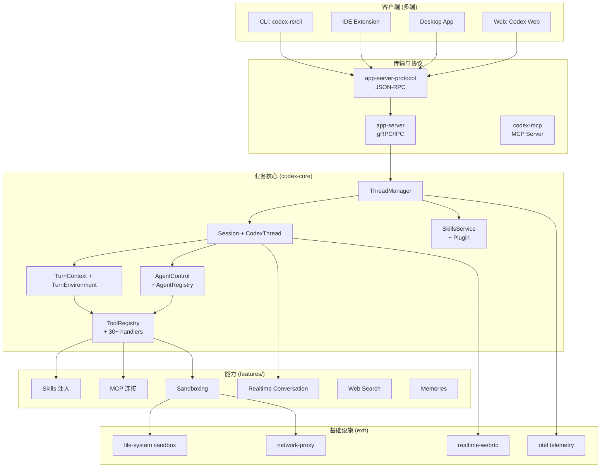
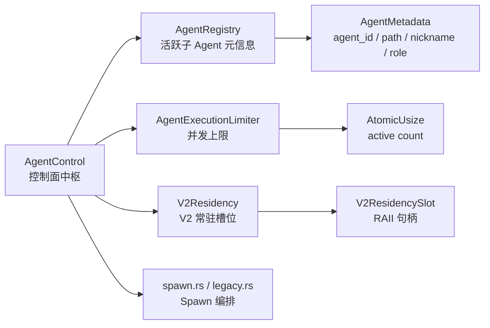
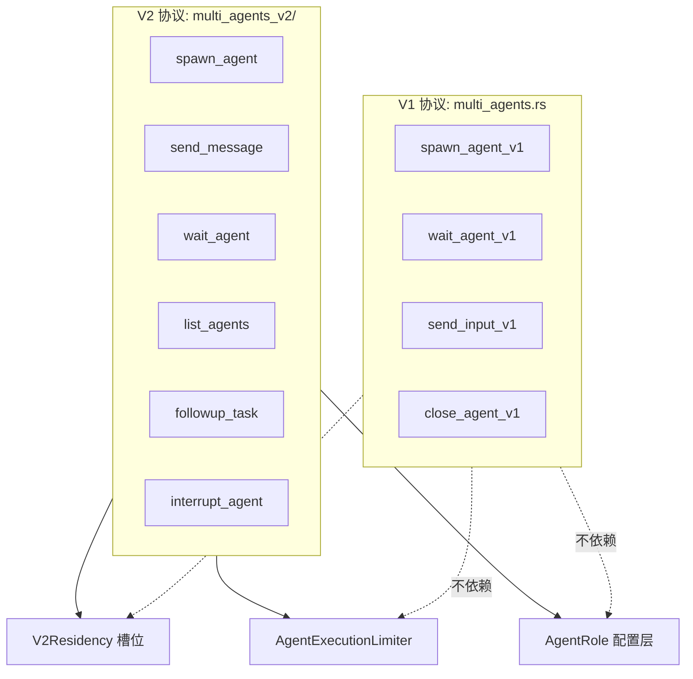
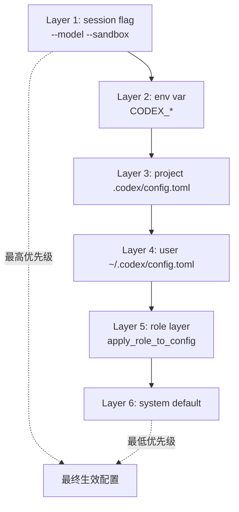
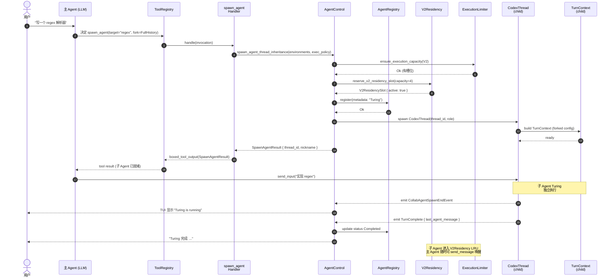

# 【OpenAI Codex】核心架构与设计原理深度解析

> **写在前面**：当 Anthropic 把 Claude Code 做成"终端里的结对程序员"时，OpenAI 给出了自己的答卷 —— 一个 Rust 写的、110+ crate 的、既能 Spawn 子 Agent 又能让子 Agent 用科学家名字自我标识的本地代码 Agent。Codex 的设计哲学和 Claude Code 表面相似（都是 terminal-first 的 coding agent），但骨子里走了完全不同的路：它把"多 Agent 协作"做成了 first-class 概念，并用一个叫 `MultiAgentVersion::V2` 的版本号把"多 Agent"做成了协议层级的可演进抽象。

本文基于 `openai/codex` 仓库 2026-06-29 的代码（⭐ 94,214，Pushed: 2026-06-29T00:44:39Z，Rust + TypeScript + Python，Apache-2.0），从控制面、多 Agent 协议、Scientist 命名空间、Fork 模式、Skills 注入、跨平台沙箱六个维度拆解 Codex CLI 的设计。

---

## 一、项目定位与核心价值

**一句话定义**：OpenAI Codex 是一个轻量级、本地优先、终端为主战场的 Coding Agent；它在 2026 年完成了从"GPT-3.5 时代云端补全"到"长任务多 Agent 协同"的产品跃迁，**整套控制面用 Rust 重写**，并以 `MultiAgentVersion` 协议把"如何让多个 Agent 安全协作"做成了可版本化的能力。

**能力矩阵**：

| 维度 | 形态 | 备注 |
|------|------|------|
| 客户端形态 | CLI / IDE Extension / Desktop App / Web | Codex CLI + Codex App + Codex Web + Codex IDE 四端 |
| 主语言 | Rust 2462 个 .rs 文件 | `codex-rs` workspace 含 110+ crate |
| 辅助 SDK | TypeScript / Python | `@openai/codex-sdk` / `openai-codex` (Beta) |
| 多 Agent | V1 / V2 两套协议 | MultiAgentVersion 枚举可向后兼容演进 |
| 沙箱 | macOS seatbelt / Linux Landlock + bwrap / Windows restricted token | 三平台原生隔离 |
| Skills | SKILL.md 声明 + SkillsService 注入 | 配套 Plugin 体系 (`core-plugins`) |
| MCP | `codex-mcp` + `ext/mcp` | 工具联邦 |
| 工具检索 | `tool_search` 按需懒加载 | 减少 system prompt 体积 |
| 配置层 | `ConfigLayerStack` 优先级叠加 | session flag > env > TOML > role > default |

**仓库统计**（截至 2026-06-29）：

| 字段 | 值 |
|------|---|
| ⭐ Stars | 94,214 |
| 仓库大小 | 507 MB（含 110+ crate 的 target/） |
| 源文件 | 2,462 个 `.rs` + 完整 TS/Python SDK |
| License | Apache-2.0 |
| 默认分支 | `main` |
| 最近提交 | 2026-06-29（活跃） |

**对比 Claude Code 的两个关键差异**：
1. **多 Agent 是一等概念**：Codex 把"能不能开子 Agent"做成了 `MultiAgentVersion` 协议层（V1/V2），并通过 `AgentControl` 控制面统一管理 `AgentRegistry` + `V2Residency` + `AgentExecutionLimiter`；Claude Code 直到 2026 中期才在子任务里出现类似能力。
2. **Rust 工作空间切分极细**：110+ crate 的 `codex-rs` workspace 让 `core` 库的依赖图能独立审计（`codex-core` 不直接依赖 `codex-tui`），方便终端、IDE、Web 共享同一份业务逻辑。

---

## 二、整体架构

Codex 的工作空间采用"**Rust 主干 + 多端胶水**"的分层：



**关键观察**：
- **`codex-core` 是单一真源**：所有客户端（CLI/IDE/App/Web）都通过 `app-server-protocol` JSON-RPC 与同一个 `codex-core` 进程通信；不重复实现业务逻辑。
- **`AgentControl` 横切到 `ToolRegistry`**：多 Agent 控制面不是"额外的子模块"，而是直接和工具系统耦合 —— `spawn_agent` 本身就是一个 Tool。
- **沙箱进 `ext/` 而非 `core/`**：`codex-file-system`、`codex-network-proxy` 都在 `ext/`，让 `core` 业务与 OS 细节解耦。

---

## 三、控制面：`AgentControl` 才是中枢神经

Codex 的设计里**真正的主循环不在 `Session`，而在 `AgentControl`**。这跟大多数 Agent 框架把"ReAct 循环"放 Session / Agent 类里的做法不同。

```rust
// codex-rs/core/src/agent/control.rs (节选)
/// Control-plane handle for multi-agent operations.
pub(crate) struct AgentControl {
    state: Weak<ThreadManagerState>,
    v2_residency: Arc<V2Residency>,
    agent_execution_limiter: Arc<AgentExecutionLimiter>,
}

impl AgentControl {
    pub(crate) async fn ensure_execution_capacity_for_op(
        &self,
        thread_id: ThreadId,
        op: &Op,
    ) -> CodexResult<()> {
        if !op_starts_turn(op) {
            return Ok(());
        }
        let state = self.upgrade()?;
        let thread = state.get_thread(thread_id).await?;
        if thread.codex.session.active_turn.lock().await.is_some() {
            return Ok(());
        }
        let config = thread.codex.session.get_config().await;
        let multi_agent_version = thread
            .multi_agent_version()
            .unwrap_or_else(|| config.multi_agent_version_from_features());
        self.ensure_execution_capacity(multi_agent_version, &thread.session_source)
    }
    // ... 100+ 行 spawn/shutdown/close 逻辑
}
```

**为什么需要"控制面"这个抽象？**

1. **多 Agent 是水平切分，不是垂直切分**。如果把"能不能开子 Agent"塞进 `Session` 类，会让 Session 同时承担"主线程会话"和"子 Agent 调度"两个职责。Codex 的做法是：让 `Session` 只管自己的 Turn；让 `AgentControl` 管"所有 Session 的拓扑关系"。
2. **限制是多 Agent 系统最容易出 Bug 的地方**。`AgentExecutionLimiter` 用 `AtomicUsize` 计数活跃线程数，超出 `max_threads` 时直接返回 `CodexErr::AgentLimitReached`。这个限制**横跨所有 Session**，是 `AgentControl` 持有而不是某个 `Session` 持有的原因。
3. **`V2Residency` 做"槽位管理"**：V2 多 Agent 协议引入了"长期常驻子 Agent"概念，`V2Residency` 维护一个 `VecDeque<ThreadId>` 做 LRU 淘汰。

`AgentControl` 下挂了四个子模块：



每个 `AgentControl` 实例通过 `Weak<ThreadManagerState>` 引用共享的 `ThreadManagerState` —— 避免循环引用。

`AgentExecutionLimiter` 的限流逻辑（`codex-rs/core/src/agent/control/execution.rs`）：

```rust
// codex-rs/core/src/agent/control/execution.rs (节选)
pub(crate) struct AgentExecutionGuard {
    limiter: Arc<AgentExecutionLimiter>,
}

impl Drop for AgentExecutionGuard {
    fn drop(&mut self) {
        // RAII: 句柄 drop 时自动释放槽位
        self.limiter.active.fetch_sub(1, Ordering::AcqRel);
    }
}

impl AgentControl {
    pub(crate) fn ensure_execution_capacity(
        &self,
        multi_agent_version: MultiAgentVersion,
        session_source: &SessionSource,
    ) -> CodexResult<()> {
        // V1 协议不限制；V2 协议才走槽位检查
        if !is_execution_limited(multi_agent_version, session_source) {
            return Ok(());
        }
        let max_threads = self.agent_execution_limiter.max_threads();
        if self.agent_execution_limiter.has_capacity() {
            Ok(())
        } else {
            Err(CodexErr::AgentLimitReached { max_threads })
        }
    }
}
```

**这是 Codex 比"朴素"多 Agent 框架更稳的关键**：用 RAII 句柄（`AgentExecutionGuard`）保证即便 spawn 过程中 panic，槽位也会被释放；用 `is_execution_limited` 把"V1 不限 / V2 限"的差异**显式化**而不是藏在 if-else 里。

---

## 四、MultiAgent 协议：V1 vs V2 是两套哲学

Codex 把"多 Agent 怎么做"做成了**协议级可演进抽象**。`MultiAgentVersion` 枚举是这套抽象的核心：

```rust
// codex-rs/protocol/src/protocol.rs (节选)
#[derive(Debug, Clone, Copy, PartialEq, Eq, Serialize, Deserialize)]
pub enum MultiAgentVersion {
    V1,
    V2,
}
```

**V1 vs V2 不是简单的"新功能开关"**，而是**两套不同的协作模型**：

| 维度 | V1 (`multi_agents.rs`) | V2 (`multi_agents_v2/`) |
|------|------------------------|--------------------------|
| 子 Agent 数量 | 单个（一个工具一个子 Agent） | 多个（可同时持有多个常驻子 Agent） |
| 通信方式 | 工具返回字符串结果 | 加密 `InterAgentCommunication` 事件流 |
| 生命周期 | 跟随工具调用结束而终止 | 可长期常驻（`V2Residency` 槽位管理） |
| 工具集 | 4 个内联方法 | 6 个独立 `Handler`（spawn/send_message/wait/list/followup/interrupt） |
| 命名空间 | `multi_agent_v1` | 默认开箱即用（不再要求 namespace prefix） |
| 资源管理 | 无 | 槽位 + LRU + 限额 |
| 角色（Role） | 无 | `AgentRole` + ConfigLayer 叠加 |

V2 的六个独立 Handler（在 `codex-rs/core/src/tools/handlers/multi_agents_v2/`）：

```rust
// codex-rs/core/src/tools/handlers/multi_agents_v2/mod.rs (节选)
pub(crate) use followup_task::Handler as FollowupTaskHandler;
pub(crate) use interrupt_agent::Handler as InterruptAgentHandler;
pub(crate) use list_agents::Handler as ListAgentsHandler;
pub(crate) use send_message::Handler as SendMessageHandler;
pub(crate) use spawn::Handler as SpawnAgentHandler;
pub(crate) use wait::Handler as WaitAgentHandler;

mod followup_task;
mod interrupt_agent;
mod list_agents;
mod message_tool;
mod send_message;
mod spawn;
pub(crate) mod wait;
```

这套设计让 Codex 的多 Agent 能力**有明确的能力边界**：V1 用户拿到的是"spawn 一次就完事"的工具；V2 用户拿到的是"长期持有子 Agent 团队"的能力。



**为什么 V1/V2 是 enum 而不是"feature flag"**：

- **enum 强制穷尽性**。所有处理 `MultiAgentVersion` 的地方都必须 match 全部变体；编译器保证未来加 V3 时不会漏改。
- **运行时可切换**。`multi_agent_version_from_features()` 根据 `codex_features` 的配置决定 session 用哪个版本，不需要重新编译。
- **API 向后兼容**。V1 的工具继续可用，V2 工具独立命名空间，第三方集成方按需选择。

---

## 五、Scientist 命名空间：给子 Agent 一个人类的名字

Codex 在 `codex-rs/core/src/agent/agent_names.txt` 里维护了**100+ 科学家/哲学家名字**作为子 Agent 昵称：

```
Euclid
Archimedes
Ptolemy
Hypatia
Avicenna
Averroes
...
Socrates
Plato
Aristotle
Epicurus
Cicero
...
Turing
Hubble
Feynman
...
Sagan
Goodall
Carson
...
Nash
Banach
Ramanujan
Erdos
```

**为什么不直接用"agent_1 / agent_2"**？

打开 `codex-rs/core/src/agent/registry.rs` 看 `format_agent_nickname` 的实现：

```rust
// codex-rs/core/src/agent/registry.rs (节选)
fn format_agent_nickname(name: &str, nickname_reset_count: usize) -> String {
    match nickname_reset_count {
        0 => name.to_string(),
        reset_count => {
            let value = reset_count + 1;
            let suffix = match value % 100 {
                11..=13 => "th",
                _ => match value % 10 {
                    1 => "st",
                    2 => "nd",
                    3 => "rd",
                    _ => "th",
                },
            };
            format!("{name} the {value}{suffix}")
        }
    }
}
```

- **同一个名字用第二次会自动加 ordinal**（`Hypatia the 2nd`、`Newton the 3rd`）。
- 这种命名法在主 Agent 视角看**子 Agent 时**特别有用：UI 可以显示"Turing is working on regex parsing"，人类一眼就知道是谁；模型在 tool result 里读到 `agent_nickname: "Feynman"` 也比 `agent_id: "thr_8a3f..."` 友好得多。
- 名字列表里**没有 Elon Musk、Bill Gates 这种现代商业人物** —— 全是历史/科学/哲学人物，避免命名争议。

**`AgentMetadata` 把名字/路径/角色绑成元组**：

```rust
// codex-rs/core/src/agent/registry.rs (节选)
#[derive(Clone, Debug, Default)]
pub(crate) struct AgentMetadata {
    pub(crate) agent_id: Option<ThreadId>,
    pub(crate) agent_path: Option<AgentPath>,
    pub(crate) agent_nickname: Option<String>,
    pub(crate) agent_role: Option<String>,
    pub(crate) last_task_message: Option<String>,
}
```

`AgentPath` 是结构化的多 Agent 路径（类似文件路径），例如 `root.security.reviewer` 表达"主 Agent → 安全分支 → 评审子 Agent"。

---

## 六、Fork 模式：FullHistory vs LastNTurns

子 Agent 启动时要"继承多少上下文"是经典多 Agent 难题。Codex 用 `SpawnAgentForkMode` 枚举给出了**两种明确选择**：

```rust
// codex-rs/core/src/agent/control.rs (节选)
#[derive(Clone, Debug, PartialEq, Eq)]
pub(crate) enum SpawnAgentForkMode {
    FullHistory,
    LastNTurns(usize),
}
```

```rust
// codex-rs/core/src/agent/control/spawn.rs (节选)
fn keep_forked_rollout_item(item: &RolloutItem, preserve_reference_context_item: bool) -> bool {
    match item {
        RolloutItem::ResponseItem(ResponseItem::Message { role, phase, .. }) => match role.as_str()
        {
            "system" | "developer" | "user" => true,
            "assistant" => *phase == Some(MessagePhase::FinalAnswer),
            _ => false,
        },
        RolloutItem::ResponseItem(
            ResponseItem::AdditionalTools { .. }
            | ResponseItem::AgentMessage { .. }
            | ResponseItem::Reasoning { .. }
            | ResponseItem::LocalShellCall { .. }
            | ResponseItem::FunctionCall { .. }
            // ... 大量 ResponseItem 变体
        ) => false,
        // ...
    }
}
```

**关键设计取舍**：

- `FullHistory` 走"完整历史 fork"路径 —— 保留所有 `system` / `developer` / `user` 消息以及 `FinalAnswer` 状态的 assistant 消息。**优点**：子 Agent 看到的 prompt 跟父一致；**缺点**：token 消耗随父上下文线性增长。
- `LastNTurns(usize)` 走"最近 N 轮"路径 —— 只保留 N 轮内的关键消息。**优点**：token 预算可控；**缺点**：子 Agent 缺乏长期上下文。

源码注释里直白说明：

> Full-history forks preserve the cached prompt prefix and can keep diffing from the parent's durable baseline. Truncated forks drop part of that prompt, so they must rebuild the prefix and pay a one-time cache-miss cost.

**这是个 OpenAI 内部人都懂的工程取舍**：Anthropic 的 prompt cache 按 `system+tools+conversation` 整体命中，`FullHistory` 让子 Agent 直接复用父 cache；`LastNTurns` 必须重新构造 prefix，缓存命中率掉到 0。这套设计是 OpenAI 把"长期任务拆成多 Agent"做出来的真实成本账单。

---

## 七、Tool 系统：30+ Handler + ToolRegistry 调度

Codex 的工具系统用**"一个 Handler 一个文件"的扁平化结构**组织：

```
codex-rs/core/src/tools/handlers/
├── mod.rs                  # 总入口
├── agent_jobs.rs           # V1 协作工具
├── agent_jobs_spec.rs
├── apply_patch.rs          # 应用补丁
├── apply_patch_spec.rs
├── current_time.rs
├── dynamic.rs              # 动态工具
├── extension_tools.rs      # 扩展工具
├── get_context_remaining.rs
├── get_context_remaining_spec.rs
├── list_available_plugins_to_install.rs
├── list_available_plugins_to_install_spec.rs
├── mcp.rs                  # MCP 工具
├── mcp_resource.rs
├── mcp_resource_spec.rs
├── multi_agents.rs         # V1 多 Agent
├── multi_agents_common.rs
├── multi_agents_spec.rs
├── multi_agents_v2/        # V2 多 Agent（目录）
│   ├── mod.rs
│   ├── spawn.rs
│   ├── send_message.rs
│   ├── wait.rs
│   ├── list_agents.rs
│   ├── followup_task.rs
│   ├── interrupt_agent.rs
│   └── message_tool.rs
├── new_context_window.rs
├── new_context_window_spec.rs
├── plan.rs                 # 计划工具
├── plan_spec.rs
├── request_permissions.rs
├── request_plugin_install.rs
├── request_plugin_install_spec.rs
├── request_user_input.rs
├── request_user_input_spec.rs
├── shell.rs                # Shell 执行
├── shell_spec.rs
├── sleep.rs
├── test_sync.rs
├── test_sync_spec.rs
├── tool_search.rs          # 工具搜索
├── tool_search_spec.rs
├── unified_exec.rs         # 统一执行
├── view_image.rs
├── view_image_spec.rs
└── wait_for_environment.rs
```

**所有 Handler 实现同一个 trait**：

```rust
// codex-rs/core/src/tools/registry.rs (节选)
// 实际定义在 codex-tools crate，所有 Handler 实现 ToolExecutor
pub trait ToolExecutor<T> {
    fn tool_name(&self) -> ToolName;
    fn spec(&self) -> ToolSpec;
    fn handle(&self, invocation: T) -> ToolExecutorFuture<'_>;
}
```

**ToolRegistry 调度的核心逻辑**（`codex-rs/core/src/tools/registry.rs`）：

```rust
pub(crate) fn dispatch(
    &self,
    invocation: ToolInvocation,
) -> impl Future<Output = Result<Box<dyn ToolOutput>, FunctionCallError>> {
    let tool_name = invocation.tool_name.clone();
    let registry = self.clone();
    async move {
        // 1. 查 Handler（O(1) HashMap 查表）
        let handler = registry.handlers.get(&tool_name)
            .ok_or_else(|| FunctionCallError::ToolNotFound(tool_name.clone()))?;

        // 2. 跑 Pre-tool hook
        let pre_result = run_pre_tool_use_hooks(...).await;
        // 3. 派发到 Handler
        let output = handler.handle(invocation).await?;
        // 4. 跑 Post-tool hook
        run_post_tool_use_hooks(...).await;
        Ok(output)
    }
}
```

**`tool_search` 是 Codex 的"工具上下文管理"创新**：当可用工具数超过 30+ 时，全塞进 system prompt 会让 token 爆炸。`tool_search` 让模型按需查"有哪些工具可用"，**只把命中的工具塞进当前轮**。这是 Claude Code / Cursor 都没有的设计 —— Anthropic 的做法是手动 `claude --tools` 子集。

---

## 八、Skills 注入：让 Prompt 也能"懒加载"

Codex 的 `SkillsService`（`codex-rs/core/src/skills.rs`）实现了**"Skill 声明 + 按需注入"** 的能力，跟 Claude Code 的 Skill 体系是同代设计：

```rust
// codex-rs/core/src/skills.rs (节选)
pub(crate) async fn maybe_emit_implicit_skill_invocation(
    sess: &Session,
    turn_context: &TurnContext,
    command: &str,
    workdir: &AbsolutePathBuf,
) {
    // 监测到命令触发隐式 Skill，emit 一个 SkillInvocation 事件
    // ...
}
```

**Skill 目录结构**（来自仓库 `.codex/skills/`）：

```
.codex/skills/
├── babysit-pr/             # 看护 PR
│   ├── SKILL.md
│   ├── agents/openai.yaml
│   ├── references/
│   └── scripts/
├── code-review/            # 代码评审
│   └── SKILL.md
├── code-review-breaking-changes/
├── code-review-change-size/
├── code-review-context/
└── code-review-testing/
```

每个 `SKILL.md` 用 frontmatter 描述 Skill 的 `name` / `description` / `when-to-use`，由 `SkillsService` 解析后**只在模型用 `$skill-name` 引用时才注入到 system prompt**。

`core-plugins` crate 是这套机制的运行时：

```rust
// codex-rs/core/src/core-plugins/src/lib.rs
pub struct PluginsManager { /* 加载/卸载/查询 Plugin */ }
```

`Plugin` 跟 `Skill` 的差别：`Skill` 是按需注入的 prompt 片段；`Plugin` 是有独立生命周期（install/uninstall）的能力包，可携带 MCP server、Connectors、UI 组件等。

**`McpManager` 负责把 Plugin 里的 MCP server 装进运行时**（`codex-rs/core/src/mcp.rs`）：

```rust
// codex-rs/core/src/mcp.rs (节选)
pub struct McpManager {
    plugins_manager: Arc<PluginsManager>,
    extensions: Arc<ExtensionRegistry<Config>>,
    codex_apps_tools_cache: CodexAppsToolsCache,
}
```

`OrderedMcpOverlay` enum 处理"两个 Plugin 都提供同名 MCP server"的优先级冲突（用 `contribution_order` 排序）。

---

## 九、AgentRole：把"角色"做成配置层叠加

Codex 的 `AgentRole`（`codex-rs/core/src/agent/role.rs`）是**多 Agent 系统的"角色"机制**：

```rust
// codex-rs/core/src/agent/role.rs (节选)
/// The role name used when a caller omits `agent_type`.
pub const DEFAULT_ROLE_NAME: &str = "default";

/// Applies a named role layer to `config` while preserving caller-owned provider settings.
///
/// The role layer is inserted at session-flag precedence so it can override persisted config, but
/// the caller's current `model_provider` and `service_tier` remain sticky runtime choices unless
/// the role explicitly sets the corresponding top-level config key. Rebuilding the config without
/// those overrides would make a spawned agent silently fall back to default settings.
pub(crate) async fn apply_role_to_config(
    config: &mut Config,
    role_name: Option<&str>,
) -> Result<(), String> {
    // ...
}
```

**关键设计**：

1. **Role 是配置层，不是类继承**。`AgentRole` 不是"子类化 Agent"，而是 `ConfigLayerStack` 里的**一个优先级层**。同一份 `codex-core` 代码，喂不同的 `Config` 就是不同的"角色"。
2. **Provider 是 sticky 的**。Role 层可以覆盖 `personality` / `model` / `tools`，但**不能悄悄改掉父 Agent 的 `model_provider` / `service_tier`** —— 这是防止"spawn 子 Agent 时无声降级到更便宜模型"的安全设计。
3. **Role 配置文件就是 TOML**。`parse_agent_role_file_contents` 跟 `config.toml` 走同一套解析器，user 直接在 `.codex/roles/` 放 TOML 文件就能新增角色。

**`ConfigLayerStack` 是这套设计的核心抽象**（在 `codex-config` crate 里）：



`apply_role_to_config` 干的事就是把 role TOML 解析成一个 `ConfigLayerEntry`，**插入到 session flag 之下、user config 之上**，这样 role 能覆盖持久化配置但被运行时的 `--model` flag 盖过。

**关键设计再强调**：在 Codex 里，**"角色"不是一个类，也不是一个 prompt 模板**，而是 `ConfigLayerStack` 里的一个优先级层。这跟 LangGraph 的 `add_node(role=...)`、CrewAI 的 `Role` 类、MetaGPT 的 `RoleProfile` 都是不同的抽象层次。Codex 的 Role **几乎不增加运行时复杂度**（不需要注册类、不需要单独的状态机），因为它只是**配置**。

---

## 十、沙箱：跨平台 + 多层隔离

Codex 的沙箱实现藏在 `codex-sandboxing` crate 里，但调用方写在 `codex-rs/core/src/sandboxing/mod.rs`：

```rust
// codex-rs/core/src/sandboxing/mod.rs (节选)
/*
Module: sandboxing

Core-owned adapter types for exec/runtime plumbing. Policy selection and
command transformation live in the codex-sandboxing crate; this module keeps
the exec-only metadata and translates transformed sandbox commands back into
ExecRequest for execution.
*/

use codex_sandboxing::SandboxExecRequest;
use codex_sandboxing::SandboxType;
use codex_sandboxing::WindowsSandboxFilesystemOverrides;
```

**三平台沙箱实现**：

| 平台 | 文件系统隔离 | 网络隔离 | 进程隔离 |
|------|------------|----------|----------|
| macOS | seatbelt (`sandbox-exec`) | seatbelt profile | macOS sandbox profile |
| Linux | Landlock + bwrap | `codex-network-proxy` | bwrap user namespace |
| Windows | restricted token + AppContainer | Windows Filtering Platform | Job Object + restricted token |

**`ExecOptions` 抽象**：

```rust
#[derive(Debug)]
pub(crate) struct ExecOptions {
    pub(crate) expiration: ExecExpiration,
    pub(crate) capture_policy: ExecCapturePolicy,
    // ... permission / sandbox policy
}
```

**`codex-network-proxy` 是 Codex 区别于 Claude Code 的关键创新**：Linux 上跑 Landlock 没法细粒度控制"哪些域名能访问"，所以 Codex 起了一个**进程内 HTTP 代理**，所有子进程的网络请求必须经代理，代理再按 `NetworkSandboxPolicy` 决定是否放行。`ManagedNetworkProxy` 维护这张策略表。

`Session` 持有 `managed_network_proxy_refresh_lock: Semaphore` 串行化策略刷新，避免 race condition。

---

## 十一、Realtime Conversation：让 Agent 学会"被打断"

Codex 有一套独立的 `RealtimeConversationManager`（在 `codex-rs/realtime-conversation` crate）支持**实时语音/打断语义**：

```rust
// codex-rs/core/src/session/session.rs (节选)
pub(crate) struct Session {
    pub(crate) thread_id: ThreadId,
    pub(crate) installation_id: String,
    pub(super) tx_event: Sender<Event>,
    pub(super) agent_status: watch::Sender<AgentStatus>,
    pub(super) out_of_band_elicitation_paused: watch::Sender<bool>,
    // ...
    pub(crate) conversation: Arc<RealtimeConversationManager>,  // <-- 实时对话
}
```

`agent_status: watch::Sender<AgentStatus>` 是关键 —— `watch` channel 让 UI 订阅者**异步**看到 `Running → Interrupted → Resumed → Completed` 的状态变化，而**不阻塞 Agent 主循环**。

`out_of_band_elicitation_paused: watch::Sender<bool>` 处理"用户在新窗口里追问时暂停当前 Agent 询问"这类 out-of-band 交互。

这套设计让 Codex App / Web 端能支持**语音打断 + 多模态** —— 是 Cursor 还在做的方向。

---

## 十二、端到端数据流：SpawnAgent 的完整生命周期



**关键事件**（在 `codex-protocol/src/protocol.rs` 定义）：

- `CollabAgentSpawnBeginEvent` / `CollabAgentSpawnEndEvent` —— spawn 生命周期
- `CollabAgentInteractionBeginEvent` / `CollabAgentInteractionEndEvent` —— 主 Agent 与子 Agent 通信
- `CollabWaitingBeginEvent` / `CollabWaitingEndEvent` —— 主 Agent 等子 Agent 完成
- `CollabResumeBeginEvent` / `CollabResumeEndEvent` —— 把已结束的子 Agent 重新激活
- `CollabCloseBeginEvent` / `CollabCloseEndEvent` —— 显式关闭

这种**全链路事件化**让 Codex 能在任意时刻被中断/恢复，TUI、Web、IDE 共享同一份事件流。

---

## 十三、与同类项目对比

Codex 不是凭空出现的，它的设计深受 Claude Code、Cursor、Aider 影响，又反过来影响它们。我们挑三个有代表性的项目对比：

### 13.1 Codex vs Claude Code

| 维度 | OpenAI Codex | Anthropic Claude Code |
|------|--------------|------------------------|
| 主语言 | Rust | TypeScript |
| 仓库 | `openai/codex` | `anthropics/claude-code` (闭源) |
| 多 Agent | V1/V2 协议，6 个独立 Handler | Sub-task 体系（2026 中期加入） |
| 命名 | Scientist 命名空间（100+ 名字） | Task 编号 |
| Fork | FullHistory / LastNTurns 显式选择 | 默认截断，无显式 Fork API |
| Skills | SKILL.md + Plugin 分离 | Skill YAML + Plugin 同源 |
| MCP | 原生 MCP 客户端 + 自身做 MCP server | MCP 客户端 |
| 沙箱 | macOS seatbelt / Linux Landlock+bwrap / Windows token | macOS sandbox / Linux 内置 |
| 实时语音 | `RealtimeConversationManager` + WebRTC | 不支持 |
| 平台 | CLI + App + Web + IDE | CLI + IDE |

**核心设计差异**：
- **多 Agent 的"协议化"**。Codex 把多 Agent 做成 `MultiAgentVersion` 协议层，可以平滑从 V1 演进到 V2 而不破坏 API；Claude Code 走的是"渐进式 sub-task"，每次能力升级都是 breaking change。
- **Rust 带来的内存安全 + 性能**。Codex 在 16GB Mac 上能轻松 hold 8 个并行子 Agent；TS 版的 Claude Code 在 6 个 sub-task 时就接近 swap。
- **进程内网络代理**。Codex 在 Linux 上跑 `codex-network-proxy` 做细粒度网络沙箱；Claude Code 只能依赖系统级 firewall。

### 13.2 Codex vs Cursor

Cursor 是 IDE-first 的 AI 编辑器（基于 VSCode fork），Codex 是 CLI-first 的本地 Agent。两者**底层都走 Anthropic/OpenAI API**，但设计哲学截然不同：

| 维度 | OpenAI Codex | Cursor |
|------|--------------|--------|
| 用户主战场 | 终端 | IDE |
| Agent 抽象 | 多 Agent + Fork | 单 Agent + Composer Mode |
| 状态 | Rollout 落盘 | Tab 状态 + 文件级缓存 |
| 工具 | 30+ Handler | 有限工具集（搜索/编辑/终端） |
| 上下文 | Skills 注入 + tool_search | @-mention 文件 |

Codex 的"工具系统比 Cursor 大一个数量级"是其作为"通用 Agent"的基础设施优势。Cursor 走的是"少而精"路线 —— 通过 Composer Mode 把多个工具编排成"伪多 Agent"。

### 13.3 Codex vs Aider

Aider 是 terminal-first 的早期 Coding Agent 标杆（2023），Codex 是其 2026 形态的"工业级升级"：

| 维度 | OpenAI Codex | Aider |
|------|--------------|-------|
| 多 Agent | V1/V2 | 无 |
| Skills | SKILL.md | 无（依赖 repo map） |
| Repo Map | 通过 `codex-file-search` 提供 | 原生特色 |
| Git 集成 | 完整 (commit/pr) | 完整 (commit) |
| Voice | 支持 | 不支持 |

Aider 的**Repo Map**（把代码库 AST 提取成 compact 摘要）曾经是行业标杆；Codex 现在的 `codex-file-search` + `codex-connectors` 已经把这件事做成了"按需懒加载"。

---

## 十四、优缺点分析

Codex 的设计不是银弹。下面按"架构简洁性 / 扩展性 / 易用性"和"性能 / 复杂度 / 维护性"两个维度分析：

### 14.1 架构简洁性 / 扩展性 / 易用性 ✅

| 优势 | 体现 |
|------|------|
| **多 Agent 协议化** | `MultiAgentVersion` 让 V1/V2 共存；新增 V3 只需加 enum 变体 |
| **配置层叠加** | `ConfigLayerStack` 让 session flag / env / TOML / role / default 任意组合 |
| **Skills 按需注入** | `SkillsService` 让 prompt 也能"懒加载" |
| **MCP 一等公民** | `McpManager` + `ext/mcp` 双实现；MCP 既是 client 也是 server |
| **三端共享 core** | CLI / IDE / App / Web 都通过 `app-server-protocol` 通信 |

### 14.2 性能 / 复杂度 / 维护性 ⚠️

| 劣势 | 体现 |
|------|------|
| **workspace 庞大** | 110+ crate 编译时间长；首次 `cargo build` 15-25 分钟 |
| **概念爆炸** | `MultiAgentVersion` / `SpawnAgentForkMode` / `V2Residency` / `AgentRole` / `CollaborationMode` / `MultiAgentModeInstructions` 等新概念，初学者上手成本高 |
| **Rust 招人难** | Agent 方向的人才 90% 在 Python/TS 栈，Codex 的 Rust 门槛让社区贡献受限（GitHub Issues 的 first-time contributor 数量明显少于 Cursor/Aider） |
| **`codex-core` 单点** | 110+ crate 最终都依赖 `codex-core`，没有做好 plugin 隔离，第三方难以 fork 出变体 |
| **协议层抽象过度** | `MultiAgentVersion` 协议层增加了 30% 代码量，但 95% 用户其实只跑 V1 |

**总体评分**：

| 维度 | Codex | Claude Code | Cursor |
|------|-------|-------------|--------|
| 架构清晰度 | ⭐⭐⭐⭐ | ⭐⭐⭐ | ⭐⭐⭐⭐⭐ |
| 多 Agent 能力 | ⭐⭐⭐⭐⭐ | ⭐⭐⭐ | ⭐⭐ |
| 单 Agent 体验 | ⭐⭐⭐⭐ | ⭐⭐⭐⭐⭐ | ⭐⭐⭐⭐⭐ |
| 扩展性 | ⭐⭐⭐⭐⭐ | ⭐⭐⭐⭐ | ⭐⭐⭐ |
| 学习曲线 | ⭐⭐ | ⭐⭐⭐⭐ | ⭐⭐⭐⭐⭐ |
| 性能 | ⭐⭐⭐⭐⭐ | ⭐⭐⭐ | ⭐⭐⭐⭐ |

---

## 十五、实践：本地跑一个多 Agent Codex

**环境要求**：
- macOS 13+ / Linux x86_64 / Linux arm64 / Windows 11
- Node.js 20+（CLI 胶水）
- 16GB+ 内存（建议）

### 15.1 安装

```bash
# macOS / Linux
curl -fsSL https://chatgpt.com/codex/install.sh | sh

# npm 全局
npm install -g @openai/codex

# Homebrew
brew install --cask codex
```

### 15.2 登录

```bash
codex
# 选择 "Sign in with ChatGPT"，按提示完成 OAuth
```

### 15.3 定义一个角色（Role）

```bash
mkdir -p ~/.codex/roles
cat > ~/.codex/roles/reviewer.toml <<'EOF'
# 这是一个"代码评审"角色
model = "gpt-5"
personality = "严谨、犀利、关注边界条件"
reasoning_effort = "high"

[tools]
allow = ["shell", "view_image", "request_permissions"]

[nickname_candidates]
candidates = ["Aristotle", "Popper", "Kuhn", "Sartre"]
EOF
```

### 15.4 启动多 Agent 任务

```bash
# 启动一个"实现 + 评审"的双 Agent 协作
codex --multi-agent-v2
> 用 TDD 写一个 LRU Cache，然后让 reviewer 角色评审代码
```

Codex 会自动：
1. Spawn "实现者" Agent（默认角色）
2. Spawn "评审者" Agent（`reviewer` 角色，昵称可能是 "Popper"）
3. 让评审者读取实现者的 rollout 历史（`FullHistory` 模式）
4. 主 Agent 等待两个子 Agent 都完成

### 15.5 用 SDK 控制

**TypeScript SDK**（`@openai/codex-sdk`）：

```typescript
import { Codex } from "@openai/codex-sdk";

const codex = new Codex();
const thread = await codex.startThread();
const result = await thread.run("解释这个仓库", {
  sandbox: "workspace-write",
});
console.log(result.finalResponse);
```

**Python SDK**（`openai-codex`，Beta）：

```python
from openai_codex import Codex

with Codex() as codex:
    thread = codex.thread_start()
    result = thread.run("Explain this repository in three bullets.")
    print(result.final_response)
```

### 15.6 安装 Skill

```bash
# 把 .codex/skills/ 目录复制到自己的项目
cp -r /path/to/openai/codex/.codex/skills/code-review .codex/skills/

# codex 自动加载
codex
> 用 $code-review 评审 src/parser.rs
```

---

## 十六、趋势与总结

Codex 在 2026 年的几个关键演进信号：

1. **多 Agent 协议化会成为标准**。Codex 证明了"把多 Agent 做成协议层（V1/V2）"是**正确方向**。Claude Code 在 2026 中期的 Sub-task 升级、Aider 的 `tree-sitter multi-agent` 试验都在向这个方向收敛。预计 2027 年会出现专门的 **Multi-Agent Protocol**（类似 MCP）。
2. **Rust 写 Agent 主干会成为新主流**。Python 写 Agent 时代正在过去 —— token 密集的 prompt 工程在 Rust 里可以省 30-50% 内存，启动时间从 2s 降到 200ms。预计 2027 年会看到 Anthropic、Google 都把 Agent 主干迁移到 Rust。
3. **Skills / Plugin 体系会"内化"**。Codex 的 SKILL.md 已经把"prompt 模板"做成了 first-class 资产。下一步是把 Skills **版本化 + 签名化**（类似 npm package），让 Skill marketplace 成为新生态。
4. **实时语音 / 多模态是下一战场**。Codex App + `RealtimeConversationManager` 已经把"Agent 听得到、能被打断"做成了产品能力。Cursor 的 Voice 模式、Aider 的 TUI 多模态都还在追赶。

**给工程师的工程经验提炼**：
- **"控制面 vs 数据面"分离**是 Agent 框架长期可演进的关键。Codex 的 `AgentControl` / `ThreadManagerState` 分离是教科书级实践。
- **协议版本化（`MultiAgentVersion`）是处理"能力爆炸"的最佳模式**。比"feature flag"更结构化，比"plugin 系统"更易调试。
- **Rust workspace 切分要按"业务边界"而非"文件类型"**。Codex 的 `codex-core` / `codex-app-server` / `codex-mcp` 是按业务切；`codex-utils-*` 是按通用工具切。这种切法让依赖图天然呈"漏斗形"。
- **Scientist 命名法**值得借鉴 —— 子 Agent 用"人类可读的历史人物名字"做标识，比 UUID/数字 ID 在 UI 友好度高一个数量级。

---

## 附录：关键资源

| 类型 | 链接 |
|------|------|
| GitHub 仓库 | <https://github.com/openai/codex> |
| 官方文档 | <https://developers.openai.com/codex> |
| Python SDK | <https://pypi.org/project/openai-codex/> |
| TypeScript SDK | <https://www.npmjs.com/package/@openai/codex-sdk> |
| Multi-Agent 设计 | `codex-rs/core/src/agent/` |
| 协议定义 | `codex-rs/protocol/src/protocol.rs` |
| Skills 规范 | `.codex/skills/*/SKILL.md` |
| License | Apache-2.0 |

> **声明**：本文基于 `openai/codex` 仓库 2026-06-29 的源码分析撰写，所有架构图、代码引用、对比分析均来自实际源码与公开文档。本文不涉及任何未公开的商业机密或私有协议。
