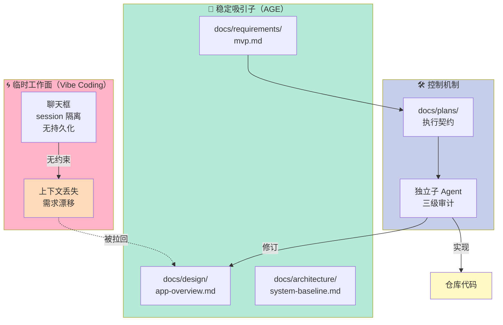
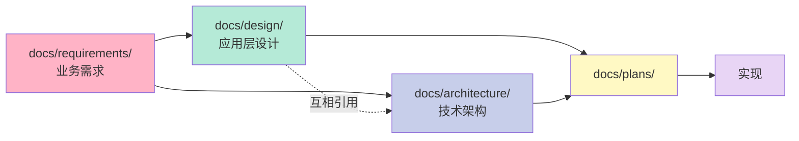
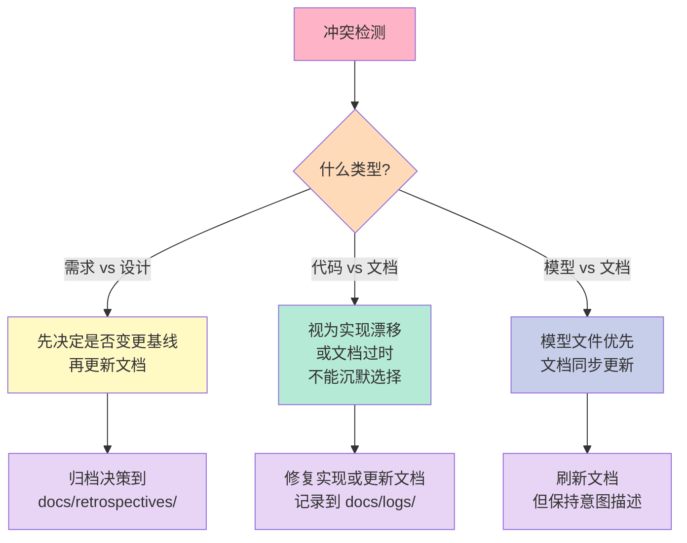
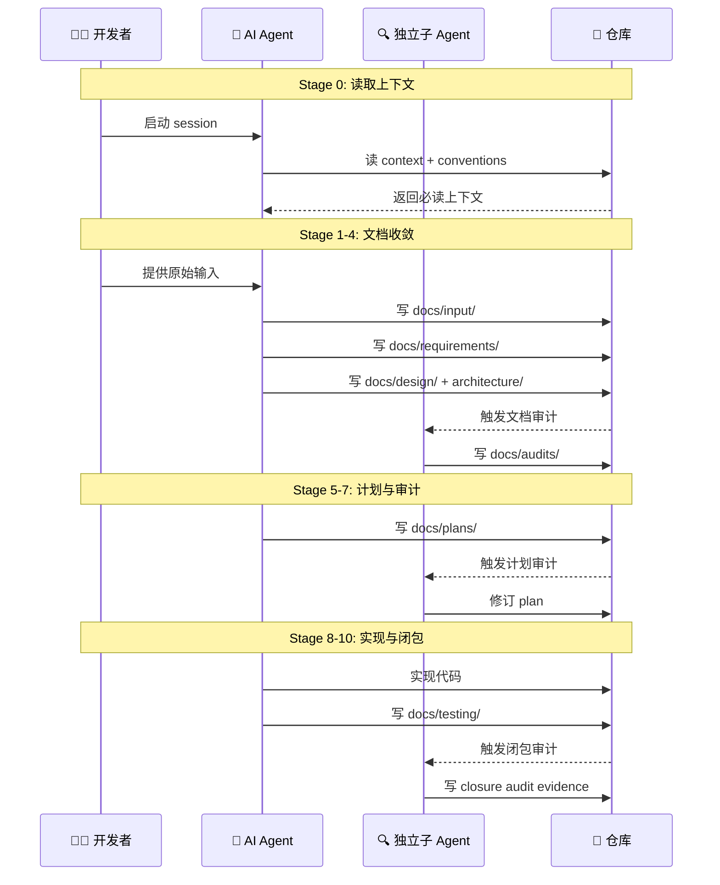
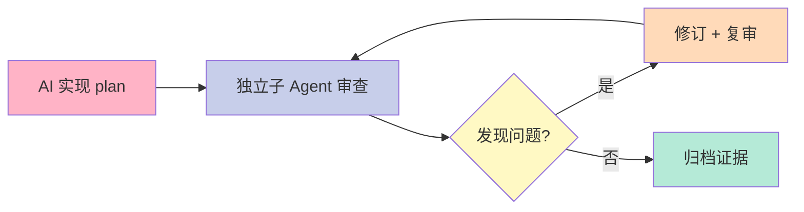
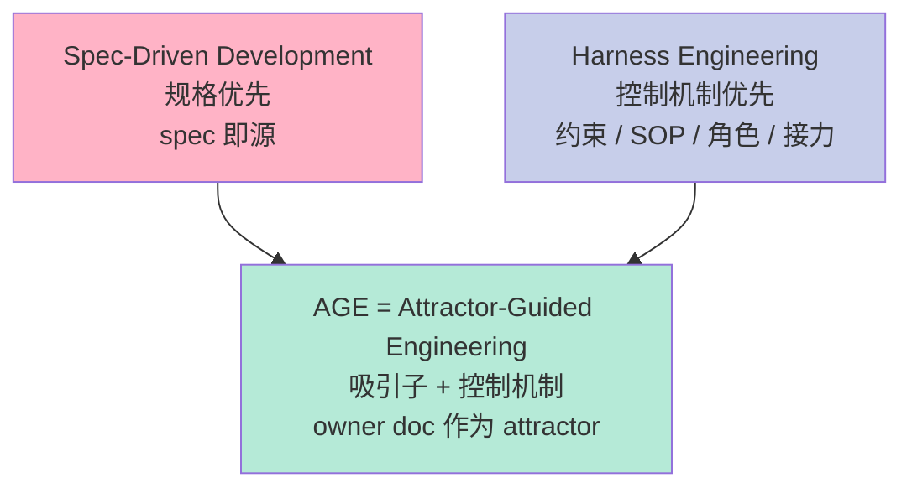
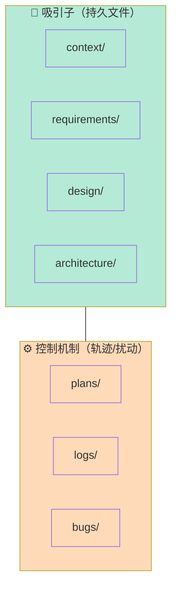

> 如果说 Harness Engineering 回答的是"AI Agent 在工程上由谁来约束"，那 AGE（Attractor-Guided Engineering）回答的就是另一个更基础的问题——**"AI 写代码时，仓库里到底有什么东西能让它不漂移？"**。本文不重复 spec-driven 也不复述 harness，而是把"吸引子"这个工程比喻拆到目录结构、文档优先级、闭包审计这层颗粒度，看一个真实跑在 Nop 系列项目里、又被抽成独立模板的 AGE 实践长什么样。

## 一、为什么需要 AGE——Vibe Coding 必然漂移

写代码这件事，2023 年之前是 IDE + Stack Overflow，2024 年变成 IDE + Copilot，2025 年开始变成"AI 直接吐出整个文件"——但**上下文管理这件事从来没好过**。聊天框是临时工作面，对话历史是按 token 滚动丢弃的；一旦换 session、换人、换 agent，AI 就开始"创造性发挥"。

最常见的三个失败模式我直接引用知乎原文并展开：

| 失败模式 | 表现 | 真正损失 |
|---|---|---|
| 一次性大需求 → Demo 化输出 | "做一个内部 CRM"，AI 吐 50 个文件，能跑但是空壳 | 后续任何迭代都建立在沙地上 |
| Vibe Coding 无历史 | 只在聊天里说"这里加个字段"，session 一关全没 | 团队成员无法接手、无法审计 |
| 需求漂移、架构失真 | 改了 5 次需求，代码已经和最初需求对不上 | 业务部门拿到的和合同里的不是同一个东西 |

AGE 的回应不是"加个 prompt 模板"，而是把仓库**重新定义**：

> **仓库 = 真相源（Source of Truth），聊天 = 临时工作面**

这一句话把所有的工作流反过来了。Vibe Coding 时代，文档是代码的"附加产物"；在 AGE 里，**文档才是吸引子，代码只是受吸引子牵引的轨迹**。AI 写代码不是"自由发挥后留下文件"，而是"在稳定吸引子场内做有限度的局部运动"。

这个比喻不是文学修辞。动力系统里的 attractor（吸引子）有严格的数学定义：相空间中一个子集，所有附近的轨迹最终都会向它收敛并停留在那里。AGE 用文档做吸引子的物理意义是——**当 AI 因为上下文丢失而"忘记"目标时，周围有足够密度的稳定结构把它拉回来**。



这张图是 AGE 整个方法论的"鸟瞰"。**左边的粉色区域是 Vibe Coding 的临时工作面（无持久化 → 漂移）**，**中间的绿色区域是 owner doc 吸引子**（design/architecture/requirements 三件套）**，**右边的紫色是控制机制**（plan + 独立审计）。绿色吸引子既是漂移的"反作用力"，又是紫色控制机制的"基准"——**所有 plan 都从 owner doc 派生，所有审计都对照 owner doc 验证**，这三者形成一个闭合的反馈环。

## 二、AGE 模板从哪里来——Nop 系列的实战提炼

AGE 不是论文里推出来的，是从三个真实跑通了的 Nop 系列项目里"蒸馏"出来的应用层模板。我把它和原文的对应关系整理一下：

| 来源项目 | 角色定位 | 沉淀的 AGE 实践 |
|---|---|---|
| **nop-chaos-flux** | 前端低代码运行时 + 设计器（框架级） | owner-doc precedence、plan closure、audit、bug note、log、full-green baseline（**完整版 AGE**） |
| **nop-chaos-next** | 应用层（贴近普通业务） | design/、input/、logs/、bugs/、skills/（**轻量版文档实践**） |
| **nop-entropy** | 后端框架 | AI 必读的规范性文档 + 开发过程记忆的**分离** |

这里的关键洞察是：**框架项目的文档体系太重，不能直接复制给应用团队**。framework 项目天然要处理"通用抽象 + 多种使用方式"，文档密度比应用项目高一个数量级。把 nop-chaos-flux 的目录结构原样搬到一个 CRUD 后台系统上，结果是 80% 的目录都是空的、维护成本反噬业务。

`age-app-template` 做的就是**减法**——从框架级 AGE 里抽出对中小型应用真正有用的部分：

- 文件进文件出
- owner doc 三个层次
- 轻量 plan
- 独立审计
- 日志 + bug 记忆
- 验证基线
- 清晰的文档路由

因此它**不是任何框架项目的缩小版**。它**是一个面向应用层的模板**，适合后台系统、门户、工作流应用、Dashboard、内部工具、CRUD 较多的领域系统等已经有技术栈的项目。

```bash
age-app-template/
├── AGENTS.md                    # 角色契约
├── docs/
│   ├── index.md                 # 顶级文档路由
│   ├── context/                 # AI 必读
│   ├── backlog/                 # 工作队列
│   ├── process/                 # 10 阶段工作流
│   ├── input/                   # 原始输入
│   ├── requirements/            # 实现就绪需求
│   ├── design/                  # 应用层设计
│   ├── architecture/            # 技术架构
│   ├── discussions/             # 歧义澄清（按需）
│   ├── plans/                   # 执行契约（按需）
│   ├── logs/                    # 变更日志（按需）
│   ├── bugs/                    # 缺陷记录（按需）
│   ├── audits/                  # 审计记录
│   ├── skills/                  # 复用审查模板
│   ├── testing/                 # 测试记录
│   ├── lessons/                 # 经验沉淀
│   ├── retrospectives/          # 复盘
│   └── analysis/                # 调研
```

这个目录布局有一个隐藏原则：**"按需触发"的目录只有在确实有内容时才有文件**。空目录代表"这块没发生"，不是"这块缺失"——这一点对 AI Agent 是个友好的信号，因为它能从目录的存在/缺失判断项目阶段。

## 三、6 条核心原则——为什么"文件进文件出"排第一

AGE 模板里一共有 6 条核心原则，我按重要性重排一下：

### 3.1 文件进，文件出（最优先）

> 重要输入写文件，重要输出回写仓库，不允许只留在聊天里。

这一条放在首位不是因为它"正确"，而是因为它是后面所有原则的**可执行基础**。如果 AI 的输出都不落盘，那"日志"、"审计"、"设计基线"全部无源之水。

具体操作上的两个细节：

1. **重要输入写文件**——PM 邮件、外部参考链接、用户访谈笔记，都写进 `docs/input/`，附日期前缀。AI Agent 在一个长 session 末尾可以扫这个目录刷新记忆。
2. **重要输出回写**——"我们决定改用 PostgreSQL"——这种结论必须出现在 `docs/architecture/decision-records/` 或 `docs/analysis/` 里，不能只留在聊天。

### 3.2 吸引子 = 稳定结构

吸引子是一个小集合的**持久文件**：

| 目录 | 职责 | 稳定性 |
|---|---|---|
| `docs/context/` | AI 必读上下文 | 极高（一般不动） |
| `docs/requirements/` | 实现就绪需求 | 高（每次需求冻结） |
| `docs/design/` | 应用层设计 | 高（架构级） |
| `docs/architecture/` | 技术架构 | 极高（很少变） |

注意 AGE 明确把"计划、日志、Bug 排除在吸引子之外"——它们是**控制机制**，不是吸引子本身。这和动力系统的比喻完全一致：吸引子是**状态空间的几何结构**，轨迹、噪声、扰动不是吸引子。混了就会变成"日志和需求同等重要"——结果 AI 反而更不知道该看哪个。

### 3.3 设计分离（业务 vs 技术）



业务设计和技术架构是**两个正交的吸引子**。一个电商项目的"购物车流程"是 design，"购物车服务用 Saga 模式"是 architecture；两者可以独立演进，但必须互相引用。

为什么这么分？因为**改业务的人不一定要改架构，改架构的人不一定要懂业务**。混在一起写的文档改起来永远是一锅粥，分开写可以分别审计——文档审计可以先看 design 一致性，架构审计可以只看 architecture。

### 3.4 最小完整切片

AGE 反复强调：**一个真实功能切片 > 五个空壳页面**。

这条原则的反面是 Vibe Coding 时代的"广度幻觉"——AI 在 5 分钟内吐出 20 个页面（CRUD 全套），看起来很全，但每个页面都是空壳，没有真实数据、没有边界条件、没有错误处理。AGE 反对这种"广度优化"。

具体判断标准是：

- 这个切片**真实可演示**（有数据、有流程、有错误处理）
- 这个切片**端到端可验证**（从 UI 到数据库）
- 这个切片**有自己的基线**（有自己的 acceptance criteria）

### 3.5 独立审查（高风险必触发）

| 触发条件 | 必须独立子 Agent 审查 |
|---|---|
| 需求模糊、有歧义 | ✅ |
| 跨模块/跨 Session | ✅ |
| 涉及 API/DB/Auth/集成变更 | ✅ |
| 存在未解决的产品/技术风险 | ✅ |
| 简单文案、纯样式调整 | ❌ 可省略 |

审查者有两条铁律：

1. **必须引用文件和证据**——不能只说"我觉得有问题"，必须指出 `docs/design/app-overview.md:42` 那行和实现不一致
2. **修订直到主要异议解决**——审查不是一次性活动，是个循环

### 3.6 代码注释最少化

这一条放在最后但很反直觉。AGE 明确说"不生成大量注释，必要时极少注释即可"。原因不是"AI 写注释烂"（其实写得不错），而是**自解释代码本身就是最好的文档**。如果一段代码需要 5 行注释解释它做什么，那大概率说明命名/结构有问题。注释一旦写错就会变成长期的谎言（注释不说谎，但会过期），而代码本身至少是诚实的。

## 四、docs/ 目录结构——按"核心/按需/可选"三档分类

AGE 模板把 docs/ 拆成 12 个子目录，按存在性分三档：

### 4.1 核心（必须存在）

| 目录 | 职责 | 文件数参考 |
|---|---|---|
| `AGENTS.md` | AI 角色行为契约 | 1 个 |
| `docs/index.md` | 顶级文档路由 | 1 个 |
| `docs/context/` | AI 必读上下文 | 3-5 个 |
| `docs/backlog/` | 工作队列 | 5-20 个 |
| `docs/process/` | 10 阶段工作流 | 1 个 |
| `docs/input/` | 原始输入 | 0-N |
| `docs/requirements/` | 实现就绪需求 | 1-5 个 |
| `docs/design/` | 应用层设计 | 2-5 个 |
| `docs/architecture/` | 技术架构 | 2-5 个 |

`docs/context/` 内部通常有这些文件（来自原文 `context/` 描述）：

- `project-context.md`——项目是什么、为什么、给谁用
- `source-of-truth.md`——什么文件是哪个问题的真相源
- `conventions.md`——命名、目录、commit 规范
- `ai-autonomy-policy.md`——AI 自主性等级（哪些决策可以自主做、哪些必须问）
- `codebase-map.md`——仓库地图

这 5 个文件就是 AI 进项目的"30 分钟 onboarding"——读完这 5 个，AI 至少不会乱动文件、不会违反命名规范、不会越权决策。

### 4.1.1 `docs/index.md`（文档路由）示例

```markdown
# Docs Index

## 🚀 我是新 AI，怎么开始？
1. 读 `AGENTS.md`（角色契约）
2. 读 `docs/context/project-context.md`（项目是什么）
3. 读 `docs/context/ai-autonomy-policy.md`（我能做什么）
4. 读 `docs/backlog/active.md`（现在该做什么）

## 🎯 我要查"应用应该长什么样"
→ `docs/design/app-overview.md`
→ `docs/design/order-sync.md`

## 🏗️ 我要查"技术架构"
→ `docs/architecture/system-baseline.md`
→ `docs/architecture/data-model.md`
→ `docs/architecture/channel-adapter.md`

## 📋 我要查"当前要做的需求"
→ `docs/requirements/mvp.md`
→ `docs/backlog/active.md`

## 🛠️ 我要查"怎么执行一个变更"
→ `docs/process/10-stages.md`（10 阶段工作流）
→ 最近一个 plan：`docs/plans/2026-06-28-douyin-channel.md`

## 🐛 我要查"昨天发生了什么 / 有没有 bug"
→ `docs/logs/2026/`
→ `docs/bugs/`

## 🔍 我要查"之前的审计"
→ `docs/audits/`
```

### 4.2 按需触发

| 目录 | 触发条件 |
|---|---|
| `docs/discussions/` | 需求模糊，需要多轮澄清 |
| `docs/plans/` | 涉及 API/DB/Auth/集成/多模块变更 |
| `docs/logs/` | 有实际代码变更落地 |
| `docs/bugs/` | 非显而易见的缺陷或回归 |

"按需"在这里是个**强信号**：AI 看到 `docs/plans/` 目录存在，说明这个项目当前阶段在做 plan 级变更；看到 `docs/plans/` 不存在，说明只是在做小修小补。**目录的存在/缺失就是 AI 决策的上下文**。

### 4.3 可选（经验沉淀类）

| 目录 | 用途 |
|---|---|
| `docs/audits/` | 三级审计记录（文档/计划/闭包） |
| `docs/skills/` | 审查提示词模板（可复用） |
| `docs/testing/` | 手动/探索性测试记录 |
| `docs/lessons/` | 重复失败中提炼的经验 |
| `docs/retrospectives/` | 事后分析 |
| `docs/analysis/` | 调研、选型、被否决方向 |

可选目录是"项目长了之后自然出现"的——前 3 个月可能一个都没有，半年后开始有 `docs/lessons/`、一年后开始有 `docs/retrospectives/`。**不要一开始就建空目录等填**——空目录是噪声不是信号。

## 五、真相源优先级——AI 决策时到底看哪个文件

AGE 模板里最有"工程味道"的一节是**真相源优先级表**。我把原文搬过来再展开：

| 问题 | 主真相源 | 补充 |
|---|---|---|
| 应该构建什么？ | `docs/requirements/` | `docs/input/`, `docs/discussions/` |
| 当前应用行为？ | `docs/design/` | 需求驱动变更 |
| 当前技术结构？ | `docs/architecture/` | 模块边界 |
| 数据库真相？ | 模型/ORM 文件 | 文档只解释意图 |
| API 契约？ | Schema 文件 | 可执行定义优先 |
| 如何执行？ | `docs/plans/` | 执行契约 |
| 实际发生了什么？ | `docs/logs/` | 测试/审计 |

这张表的核心思想是**"可执行定义 > 文档"**：

- 数据库结构真不真，看 ORM 模型文件，不看 `docs/architecture/data-model.md`
- API 契约真不真，看 OpenAPI/Protobuf schema 文件，不看 `docs/design/api-overview.md`
- 实际行为真不真，看代码 + 测试，不看 `docs/logs/`

AGE 给这个原则配了三条**冲突解决规则**：



第三条规则特别值得展开。AGE 明确说"模型文件与文档不一致 → 模型文件优先"——这是一种**信任"可执行"超过"文字描述"**的工程哲学。在 spec-driven 流派里，文档是源、代码是派生；在 AGE 里，**对于"事实类信息"（结构、契约、行为）可执行定义才是源，文档是解释**。这和 modern data stack 里"schema as source of truth"是同一个思想。

但 AGE 并不否定"意图类信息"（why、how should）的文档——这部分仍然以文档为源。**关键区分是：what（事实）和 why（意图）走不同的真相路径**。

## 六、10 阶段工作流——把"AI 写代码"切成可审计的原子

AGE 的 10 阶段工作流是模板里最像"过程"的部分：



我把 10 个阶段按"收敛 vs 扩张"重新组织一下：

| 阶段 | 类型 | 关键产出 |
|---|---|---|
| Stage 0 读取上下文 | **收敛**（AI 进入项目态） | 加载 conventions + project-context |
| Stage 1 收集原始输入 | **扩张**（外部信息入仓） | `docs/input/` |
| Stage 2 澄清歧义（可选） | **收敛**（消歧） | `docs/discussions/` |
| Stage 3 合成需求 | **收敛**（多源合一） | `docs/requirements/` |
| Stage 4 更新设计基线 | **收敛**（建吸引子） | `docs/design/` + `docs/architecture/` |
| Stage 5 审计文档 | **验证** | `docs/audits/*-doc-audit.md` |
| Stage 6 编写计划 | **收敛**（建执行契约） | `docs/plans/` |
| Stage 7 审计计划 | **验证** | `docs/audits/*-plan-audit.md` |
| Stage 8 实现切片 | **扩张**（代码落地） | 仓库代码 |
| Stage 9 验证 | **验证** | `docs/testing/` + 测试报告 |
| Stage 10 闭包审计 | **验证** | `docs/audits/*-closure-audit.md` |

注意**审计出现了三次**（Stage 5 / 7 / 10），分别对应文档、计划、闭包。这是后面要单独展开的"三级审计体系"在工作流里的具体落点。

## 七、Plan 规则——什么时候必须写 plan，什么时候可以省

AGE 模板对"什么时候必须写 plan"有非常具体的触发条件：

### 7.1 必须写 Plan 的触发条件

1. 变更 API、数据库/模型、认证、集成、部署
2. 跨多个功能面变更用户可见行为
3. 涉及多个模块、改变共享行为
4. 预计超过一个 AI Session
5. 需要分阶段执行或显式闭包门
6. 存在未解决的产品/技术风险

这些条件的共同点是**"牵一发动全身"**——单点修改影响其他模块、未来可能还要回来修、不能在一个 session 内闭环。

### 7.2 跳过 Plan 的安全场景

1. 文案修改、小型样式调整
2. 纯测试代码清理
3. 单文件修复且有明确测试覆盖
4. 低风险本地编辑

### 7.3 Plan 的最小结构

```markdown
## Current Baseline — 当前基线
引用 owner doc 中相关的 design / architecture 段落，
说明 plan 开始时的"已知起点"。

## Goals / Non-Goals — 目标/非目标
明确写出"这次 plan 要做什么"和"这次 plan 不做什么"。
Non-Goals 非常重要——它定义了边界，避免 scope creep。

## Execution Plan — 分阶段执行（checkbox）
把工作切成可勾选的步骤，每一步应该能在 30-60 分钟内完成。

## Closure Gates — 闭包门（验证命令 + 文档 + 日志）
明确写出"什么算完成"——不是"代码写完了"，
而是"`pytest tests/ --full-green` 全部通过 + 文档已更新 + 日志已记录"。

## Closure Audit Evidence — 闭包证据
列出实际跑过的命令、输出的关键片段、文档链接。
```

### 7.4 一个真实的 Plan 示例

```markdown
# Plan — 订单同步服务接入抖音渠道

## Current Baseline
- docs/architecture/system-baseline.md:18
  已有的渠道接入模式：HTTP 回调 + 本地消息表
- docs/design/order-sync.md:42
  天猫、京东渠道已经实现，抖音渠道为待接入
- 现有 OrderSyncService.handle(channel) 模式
  不区分渠道，需要重构

## Goals
- 接入抖音渠道，订单延迟 < 5 分钟
- 沿用现有的 HTTP 回调 + 消息表模式
- 抽出 ChannelAdapter 接口，天猫/京东/抖音统一实现

## Non-Goals
- 不动订单履约主流程
- 不重写 OrderSyncService
- 不引入新的消息队列（继续用本地消息表）
- 不动退款流程

## Execution Plan
- [ ] Stage 1: 在 docs/architecture/ 写 channel-adapter.md
- [ ] Stage 2: 抽 ChannelAdapter 接口
- [ ] Stage 3: 把现有天猫/京东代码迁移到新接口
- [ ] Stage 4: 写抖音 ChannelAdapter 实现
- [ ] Stage 5: 加 mock 抖音回调的集成测试
- [ ] Stage 6: 真实联调（需要抖音开发者账号）

## Closure Gates
- [ ] `make test` 全绿（含 5 个新测试）
- [ ] `make lint` 0 错误
- [ ] docs/architecture/channel-adapter.md 已写
- [ ] docs/logs/2026/06-30.md 已记录本次接入
- [ ] 独立子 Agent 完成闭包审计

## Closure Audit Evidence
- pytest 输出：`====== 142 passed in 8.3s ======`
- ruff 输出：`All checks passed!`
- 子 Agent 审计报告：`docs/audits/2026-06-30-closure-audit.md`
- 联调截图：见 `docs/testing/2026-06-30-douyin-mock.md`
```

Plan 的"闭包门"是整个结构里最反直觉的部分。Vibe Coding 时代"完成" = "代码能跑"；AGE 时代"完成" = **代码能跑 + 文档已对齐 + 日志已记录 + 审计证据已归档**。完成度的定义本身被扩展了。

## 八、三级审计体系——独立子 Agent 是怎么"不自己审自己"

AGE 模板里有一个独立小节讲"三级审计体系"：

| 审计类型 | 时机 | 检查重点 |
|---|---|---|
| 文档审计 | 需求/设计更新后、实现前 | 范围边界、隐藏未解决问题、输入与需求一致性 |
| 计划审计 | Plan 写完后、实现前 | 闭包门是否诚实、隐藏依赖、需求缺口 |
| 闭包审计 | 实现完成后 | 实际行为匹配需求、证明存在于文件、文档已对齐 |

三级审计对应工作流的 Stage 5 / 7 / 10。这个设计的核心是**审计者不能是被审计者**——必须用独立子 Agent（或人），不能是同一个 Agent 自己审自己。

为什么？"自己审自己"有结构性偏差：




独立审查者的两条铁律：

1. **必须引用文件和证据**——"我觉得有问题"不算审查，"`docs/design/app-overview.md:42` 写的是 X，但 `src/cart/service.py:118` 实现的是 Y，这两处不一致"才算审查
2. **修订直到主要异议解决**——审查是个循环，不是签字画押

AGE 还把审查结果存成文件（`docs/audits/*-doc-audit.md` 等），**让审计本身可被审计**。这是元层面的可追溯性。

## 九、文档命名规则——日期前缀的力量

AGE 模板的命名规则看起来很琐碎，其实是**为 AI 服务的元数据**：

| 类型 | 命名方式 | 示例 | 含义 |
|---|---|---|---|
| 稳定 owner-doc | 固定名称 | `app-overview.md`, `system-baseline.md` | AI 知道"这是基线" |
| 时效文件 | 带日期前缀 | `2026-05-21-feature-req.md` | "这文件反映那一天的状态" |
| 日志 | 年/月/日 | `docs/logs/2026/05-21.md` | "这天的变更轨迹" |
| 审计 | 日期+类型+主题 | `2026-05-21-doc-audit.md` | "那天对那个主题的审计" |

日期前缀对 AI 来说是**重要的时间锚点**。AI 可以按日期排序、按日期过滤、按日期对比（"5/21 的需求 vs 5/28 的需求有什么变化"）。没有日期前缀的"feature-req.md"在 AI 看来是不可读的——AI 不知道这个文件是昨天的还是去年的。

审计文件命名里的"类型"字段也很关键——`doc-audit`、`plan-audit`、`closure-audit` 是不同的审计类型，AI 在做特定类型审计时可以定向检索。

## 十、首次使用清单——Day 0 必填、渐进填、禁启动条件

AGE 模板对"第一次用这个模板"做了非常具体的清单约束：

### 10.1 Day 0 必须（编码前）

```markdown
- [ ] 替换所有 <project-name> 占位符
- [ ] 填写 docs/context/project-context.md（真实内容）
- [ ] 确认 Active Requirement 路径
- [ ] 确认 Active Owner Doc 路径
- [ ] 在 docs/backlog/ 中填写第一个工作项及其优先级和自主性标签
- [ ] 填写真实可执行的验证命令
```

注意"真实可执行"——`pytest tests/ --full-green` 可以，`make test` 可以，`echo "done"` 不行。验证命令是闭包门的核心，**假的验证命令等于没有闭包门**。

### 10.2 渐进填写（不阻塞第一个切片）

```markdown
- [ ] docs/architecture/project-vision.md
- [ ] docs/architecture/system-baseline.md
- [ ] docs/design/app-overview.md
- [ ] docs/requirements/product-scope.md
- [ ] docs/requirements/mvp.md
```

这 5 个文档是"中期必须"，但允许**不阻塞第一个切片**——你可以一边写代码一边补这些文档，只要不把它们当成"必须先有才能写代码"。

### 10.3 禁止启动条件

```markdown
- project-context.md 为空
- 验证命令仍为占位符
- Active Requirement 为 none
- 需求模糊到需要猜测用户可见行为
```

### 10.4 一个完整的 `project-context.md` 示例

```markdown
# Project Context — 内部订单履约后台

## 这是什么
为运营团队提供的内部订单履约系统。处理来自天猫 / 京东 /
抖音的订单同步、库存扣减、发货确认、退款审核。

## 给谁用
- 主要用户：运营专员（每天 8 小时在系统里工作）
- 次要用户：客服（查询订单状态、修改地址）
- 管理员：电商总监（看 Dashboard、月度对账）

## 为什么做
当前用 Excel + 微信群管理订单，每天 ~300 单，
错误率 ~3%，运营投诉集中在"找不到某个订单"。

## 成功标准
- 订单同步延迟 < 5 分钟
- 错误率 < 0.5%
- 运营每天花在"找订单"的时间 < 30 分钟

## 自主性等级（AI Autonomy Policy）
- 等级 A（完全自主）：纯文案、测试代码、已知 bug 修复
- 等级 B（自主 + 报告）：单文件逻辑修改、加新单元测试
- 等级 C（先问再做）：DB schema 变更、API 新增
- 等级 D（必须人审）：认证、支付、跨模块重构

## 验证命令（Closure Gates）
- 全量测试：`make test`（等同于 `pytest tests/ -v --full-green`）
- Lint：`make lint`（等同于 `ruff check src/ tests/`）
- 类型检查：`make typecheck`（等同于 `mypy src/ --strict`）
- 集成测试：`make integration`（需要 docker-compose up）
```

这是一个**真实可填**的 project-context 例子。可以看到它回答了 5 个问题：

1. 这是什么（业务边界）
2. 给谁用（用户画像）
3. 为什么做（动机，避免重新发明轮子）
4. 成功标准（可量化的 acceptance）
5. 自主性等级（AI 决策权限矩阵）

### 10.5 `AGENTS.md`（AI 角色契约）示例

```markdown
# AGENTS.md

## 你是谁
你是这个项目的 AI 工程师搭档。你的工作方式是：
- 任何代码改动前先读 docs/context/ 和 docs/architecture/
- 任何业务逻辑变更前先更新 docs/design/
- 任何 API/DB 变更前先写 docs/plans/ 并触发独立子 Agent 审计
- 完成后必须写 docs/logs/YYYY/MM-DD.md

## 你能做什么
- 等级 A / B 的任务：自主完成，结束时报告
- 等级 C 的任务：写 plan 后等待人类确认
- 等级 D 的任务：必须由人类完成，你只能辅助

## 你的边界
- 不修改 docs/context/project-context.md（它是只读的基线）
- 不绕过闭包门（验证命令必须真实跑过）
- 不自己审自己（用独立子 Agent）
- 不把 chat 里的结论当真相（必须落盘到 docs/）

## 你不做什么
- 不写大量注释（自解释代码优先）
- 不从原始输入直接跳到代码
- 不优化 Demo 广度（一个真实切片 > 五个空壳）
- 不把验证命令写成占位符
```

这 4 条是**硬性禁启动**——任何一条没满足，AI Agent 不应该开始写代码。这比传统软件工程的"需求文档必须评审通过"更严——因为 AI 不知道什么时候该停下来问人，所以必须把"不能猜"做成启动前的硬约束。

### 10.6 启动一个 AGE 项目的典型 shell 流程

```bash
# 1. 克隆模板
git clone https://github.com/entropy-cloud/attractor-guided-engineering-template
cd attractor-guided-engineering-template

# 2. 复制应用层模板到新项目
cp -r templates/age-app-template/* ../my-new-app/
cp templates/age-app-template/.gitignore ../my-new-app/ 2>/dev/null
cd ../my-new-app

# 3. 替换占位符（每个项目都不一样）
find . -type f -name "*.md" -exec sed -i 's/<project-name>/my-new-app/g' {} \;

# 4. 初始化 git
git init && git add . && git commit -m "chore: bootstrap from age-app-template"

# 5. 启动 AI 协作
# 第一次启动 AI 时，让它读 AGENTS.md → docs/index.md
# 然后让它帮你填 docs/context/project-context.md
claude code  # 或者 codex / hermes-agent

# 6. AI 完成填写后，触发第一次独立子 Agent 审查
# 让另一个 AI 子 agent 审查 docs/context/project-context.md
# 反馈修订 → 反复直到通过

# 7. 把第一个 work item 写到 docs/backlog/active.md
# 让 AI 按 10 阶段工作流推进
```

## 十一、AI 开发可以不做的事——边界同样重要

AGE 模板最后一节是"AI 开发可以不做的事"——这反向定义了边界：

| 不做 | 为什么 |
|---|---|
| 不生成大量注释 | 自解释代码 > 注释；注释会过期 |
| 不从原始输入直接跳到代码 | 必须先收敛到 requirements |
| 不优化 Demo 广度 | 一个真实切片 > 五个空壳 |
| 不把验证命令写成占位符 | 假的验证 = 没有验证 |
| 不自己审查自己 | 独立子 Agent 审查 |

这 5 条"不做"和 6 条核心原则是**互为表里**的——"做 X"配一个"不做非 X 的捷径"。**AGE 抵抗的不是"AI 写代码差"，而是"AI 写代码看起来好但实际漂移"**。

## 十二、和 spec-driven / harness engineering 的关系

知乎原文在开头明确区分了 AGE、Spec-Driven Development、Harness Engineering 三者。我用一个三层结构整理一下：



- **Spec-Driven** 强调"规格是源、代码是派生"——这是**文档**层面的方法论
- **Harness Engineering** 强调"约束 / SOP / 角色 / 接力 / 关卡 / 外部接口"——这是**控制机制**层面的方法论
- **AGE 把两者合并**：**用 owner doc 做吸引子（spec 思路）+ 用 plan/audit/独立子 Agent 做控制机制（harness 思路）**

具体差别举一个例子——

- Spec-Driven：写一个完整的 `spec.md`，让 AI 严格按 spec 实现
- Harness Engineering：搭一个 harness（Rule + Skill + Sub-Agent + Hooks），让 AI 在 harness 框定的范围内运行
- AGE：写 3 个层次的 owner doc（context/requirements/design/architecture），让 AI 围绕这些"吸引子"做局部运动；**Plan 和三级审计是 harness**——**AGE 是 spec 和 harness 的结合体**

知乎原文章给出了一个非常精炼的总结：

> AGE 不是 spec-driven workflow 的替代包装，而是以带 precedence 的 owner docs 定义 attractor、再通过 harness 让仓库轨迹持续收敛的工程框架。

这句话有三个关键词：

1. **precedence（优先级）**——owner doc 不是平铺的，有真相源优先级（参考第五节）
2. **attractor（吸引子）**——文档是动力系统的吸引子，不是普通的"参考资料"
3. **harness（控制机制）**——Plan + 独立子 Agent + 三级审计是 harness，让"轨迹持续收敛"

## 十三、AGE 的工程哲学——四个反直觉的设计决策

最后这一节总结 AGE 模板里**反直觉**的设计决策——这些是真正"如果没人告诉你，你不会想到这样做"的部分。

### 13.1 决策一：把日志、计划、Bug 排除在吸引子之外

Vibe Coding 时代我们本能觉得"日志也是文档、也应该重要"——AGE 明确把它们从"吸引子"降级为"控制机制"。



**为什么不把日志当吸引子**——因为日志是"已经发生的事"的记录，**不是 AI 决策的基准**。AI 写代码时参考的是"应用应该长什么样"（design），不是"上次改了什么"（log）。混了就会让 AI 越来越保守——它会优先匹配历史而不是匹配目标。

### 13.2 决策二：业务设计 vs 技术架构分开写

很多团队习惯把"业务 + 技术"写在一个 design doc 里——AGE 强制分开。

为什么？**因为 review 视角不同**：

| 视角 | 关心 | 文档 |
|---|---|---|
| PM / 业务方 | 业务流程、用户故事、acceptance criteria | `docs/design/` |
| 架构师 / Tech Lead | 模块边界、技术选型、性能指标 | `docs/architecture/` |
| 共同关心 | 数据流、接口契约 | 互相引用 |

一个文档服务两个读者，写出来一定两边都不讨好。AGE 的解法是**按"读者关心的颗粒度"切片**。

### 13.3 决策三：可执行定义 > 文档（针对事实类信息）

AGE 明确说：数据库真相 = 模型文件，API 契约 = Schema 文件。**文档只解释意图**。

这反 spec-driven 的直觉——spec-driven 流派是"spec 是源、代码是派生"。AGE 修正了这一点：**对"事实类"信息（结构、契约、行为），可执行定义才是源；对"意图类"信息（why、should），文档是源**。

一个 ORM 模型比一段描述数据结构的 markdown 更可信——因为模型是**强制**的（错就编译不过），markdown 是**自愿**的（错也发现不了）。

### 13.4 决策四：禁止启动条件（硬约束）

AGE 模板有 4 条硬性的"禁启动条件"——任何一条没满足，AI 不应该开始写代码。

| 条件 | 为什么是硬约束 |
|---|---|
| `project-context.md` 为空 | AI 不知道自己在做什么 |
| 验证命令是占位符 | 闭包门 = 假的，AI 无法知道完成度 |
| `Active Requirement` 为 none | AI 没有目标 |
| 需求模糊到需要猜测用户可见行为 | 猜 = 漂移的起点 |

Vibe Coding 时代这些是"建议"，AGE 把它们升格为"硬约束"——因为 AI 不知道什么时候该停下来问人，**把约束做在启动前**比"中途发现错了再回头"成本低一个数量级。

## 十四、AGE 的局限——它不是银弹

我必须诚实说 AGE 模板**不是什么**：

| 不是 | 原因 |
|---|---|
| 不是银弹 | 文档驱动方法论都有"维护成本"问题 |
| 不是 spec-driven 替代品 | spec 强在"事前定义"，AGE 强在"事中收敛"，可以共存 |
| 不适合纯研究性项目 | 研究项目没有"应用行为"可描述，AGE 的 design/ 不好填 |
| 不适合一次性脚本 | 10 阶段工作流对单文件脚本是 overkill |
| 不解决 AI 本身能力问题 | AGE 让 AI 不漂移，但不能让 7B 模型写出 GPT-4 质量的代码 |

AGE 的"代价"是**显式的文档维护成本**——10 个阶段、3 级审计、12 个子目录、3 类真相源，都需要人来维护。对于一个 1 周交付的内部工具来说，AGE 太重；对于一个 6 个月演进的企业系统来说，AGE 可能是**唯一能撑过去的方法**。

## 十六、和 Hermes / superpowers / ECC 的对比

AGE 模板是一个**应用层文档驱动框架**，而我们之前调研的 Harness Engineering 6 大项目是**Agent 运行时框架**。两者解决不同层面的问题：

| 维度 | AGE 模板 | Hermes Agent | Superpowers | ECC | oh-my-claudecode |
|---|---|---|---|---|---|
| 解决什么 | 仓库文档结构 | Agent 运行 CLI | AI 协作方法论 | 商业 SaaS | Claude Code 编排 |
| Rule 系统 | `docs/architecture/` 隐式 | 配置文件 | `skills/` 显式 | 闭源 | 显式 |
| Skill 系统 | `docs/skills/` 模板 | 内置 | 14+ skill | 闭源 | 强 |
| Sub-Agent | 独立审查子 Agent | Task 工具 | brainstorming / writing-plans | 闭源 | 强 |
| Hooks | 无（用审计替代） | 无 | 部分 | 闭源 | 弱 |
| Context Engineering | owner doc precedence | LLM 管理 | memory + skills | 闭源 | 中 |
| Workflow | 10 阶段 | Task graph | 多阶段 | 闭源 | pipeline |
| 适用对象 | 业务应用仓库 | 通用 agent 框架 | 任何项目 | 不开源 | Claude Code 用户 |
| 上手成本 | 中（需维护文档） | 低 | 中 | 闭源 | 中 |

AGE 和这些项目的核心区别是**抽象层次**：

- **Hermes / Superpowers / oh-my-claudecode** 解决的是"AI Agent 怎么运行"——它们是 harness runtime
- **AGE 模板** 解决的是"AI Agent 写代码时仓库应该长什么样"——它是 repo structure

两者完全可以叠加：在 AGE 模板的仓库上用 Hermes 或 Claude Code 跑 AI 协作，AGE 负责"仓库结构"层，Harness 负责"Agent 行为"层。这和我之前在 Harness Engineering 文章里讲的"6 件套"概念一致——**AGE 是 Skill + Rule 的物理载体，Harness 是加载它们的机制**。

## 十七、给正在做 AI 工程的团队的实操建议

如果你想在自己的项目里试 AGE 模板，**不要一次性全上**。AGE 是一套"完整时很完整、缺失时很受罪"的框架——4 条禁启动条件没满足就启动，反而比 Vibe Coding 更糟（Vibe Coding 至少不写假文档）。

我的建议是**分三波采用**：

### 17.1 第一波：只上"文件进文件出"和"项目上下文"

工作量：1-2 天
- 创建 `docs/context/project-context.md`（按 10.4 节示例填）
- 创建 `AGENTS.md`（按 10.5 节示例填）
- 创建 `docs/index.md`（按 4.1.1 节示例填）
- 约定："重要决策必须落盘到 docs/，不允许只在 chat 里"

收益：AI 不会乱动文件、不会忘记项目背景、不会做出和业务目标冲突的决策。

### 17.2 第二波：加 owner doc 三件套

工作量：1-2 周
- 写 `docs/design/app-overview.md`（应用层设计）
- 写 `docs/architecture/system-baseline.md`（技术架构）
- 写 `docs/requirements/mvp.md`（当前 MVP 需求）
- 在 `docs/backlog/` 维护一个 active 列表

收益：AI 有了"目标吸引子"，长 session 末尾仍然知道下一步该做什么。

### 17.3 第三波：上 10 阶段 + 三级审计

工作量：1 个月
- 把"先写 plan 再写代码"固化为流程
- 引入独立子 Agent 做文档 / 计划 / 闭包审计
- 跑 2-3 个完整切片，验证全流程
- 收尾时把 lessons 写到 `docs/lessons/`

收益：AI 不再"自己说完成"——每个完成都有证据，每个 plan 都有审计。

**不要跳级**。第一波不完成就上第三波，会出现"审计一个空的 project-context"的尴尬——审计没有基准就只能流于形式。

### 17.4 一个反面教材：直接跳到第三波会怎样

我见过一些团队听说"AGE 模板很好"就直接 fork 模板、把所有目录建好、然后让 AI 开始填。结果是这样的：

```text
docs/context/project-context.md  ←  3 行占位符
docs/design/app-overview.md      ←  5 行占位符
docs/architecture/system-baseline.md  ←  0 行（根本没建文件）
docs/requirements/mvp.md         ←  "TODO: 待 PM 填"
docs/audits/                     ←  空的
docs/plans/                      ←  空的
docs/logs/                       ←  空的
```

然后他们让 AI 开始按 10 阶段工作流推进。AI 在 Stage 5 触发文档审计时，独立子 Agent 看到的是一堆占位符——它能审计什么呢？只能审计"占位符都没填"。

**教训**：AGE 不是一个"建好空架子就能让 AI 填"的模板。**它是一个"人先把骨架搭好、AI 在骨架上工作"的协议**。跳过"人搭骨架"这一步直接让 AI 填，结果是 AI 也填出占位符。

正确的流程是：

1. **人**先把 `project-context.md` 填到 60% 以上（哪怕是草稿）
2. **人**先把 `system-baseline.md` 填出"我们用什么技术栈"那一段
3. **人**先把第一个 work item 写进 `backlog/active.md`
4. **然后**让 AI 接手，按 10 阶段推进
5. AI 在每个阶段结束时**更新**文档，但**初始骨架是人搭的**

这和软件工程的 TDD 原则类似——**测试先于实现，但"写一个失败的测试"仍然需要人先写出来**，AI 只能帮你"让测试从红变绿"。

## 十八、参考资料

- [Attractor-Guided Engineering 模板项目](https://github.com/entropy-cloud/attractor-guided-engineering-template)
- [从 Spec-Driven Development 到 Attractor-Guided Engineering](https://mp.weixin.qq.com/s/j4dZm1bAK61qB8i5RzHRWA)
- [Attractor Before Harness: AI 大规模开发的方法论](https://mp.weixin.qq.com/s/TwMkUDLNo2-bIrXrfvPqIw)
- [知乎原文：AGE 模板介绍](https://zhuanlan.zhihu.com/p/2041653562044847838)
- [Harness Engineering 实战：6 个真实开源项目解析](/2026/06/26/harness-engineering-6-opensource-projects-deep-dive/)
- [Anthropic: Effective harnesses for long-running agents](https://www.anthropic.com/engineering/effective-harnesses-for-long-running-agents)
- [OpenAI: Harness engineering — leveraging Codex in an agent-first world](https://openai.com/index/harness-engineering/)
