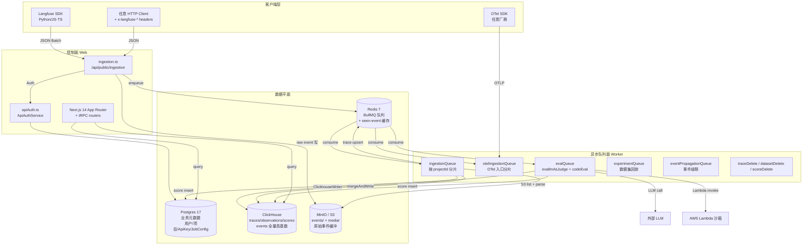
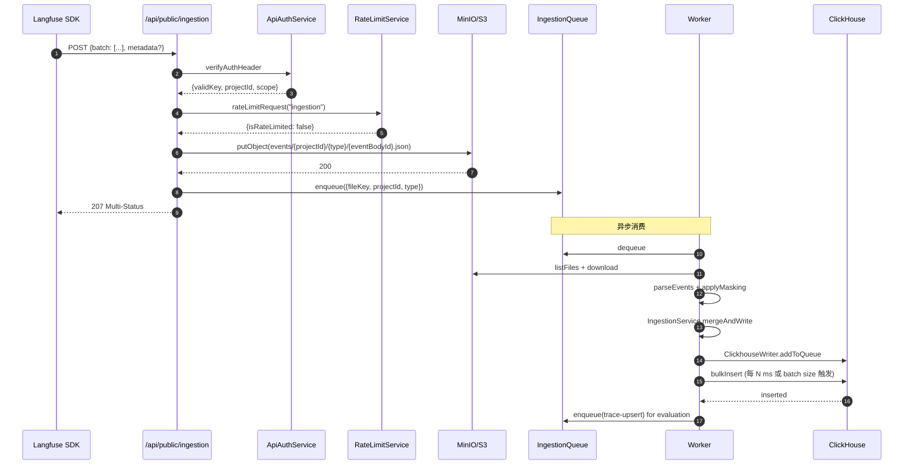
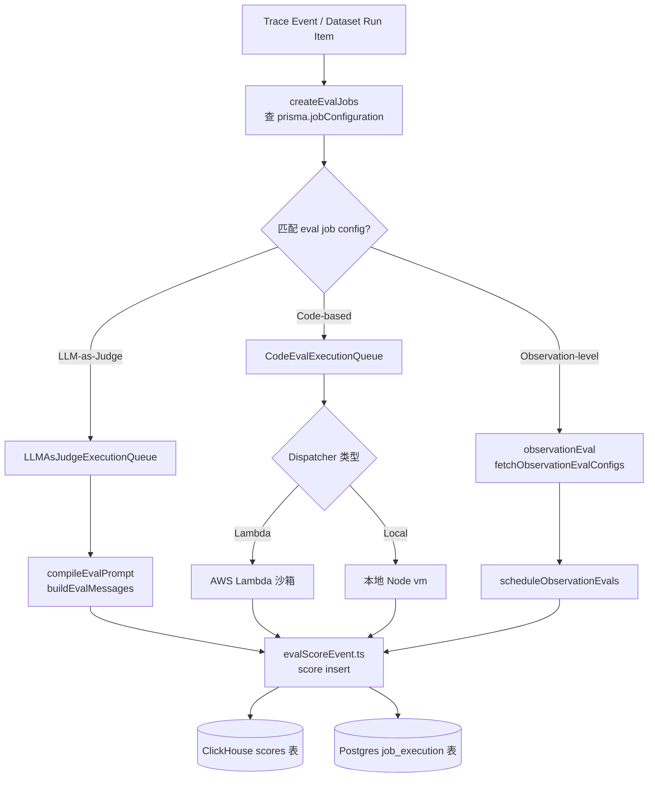
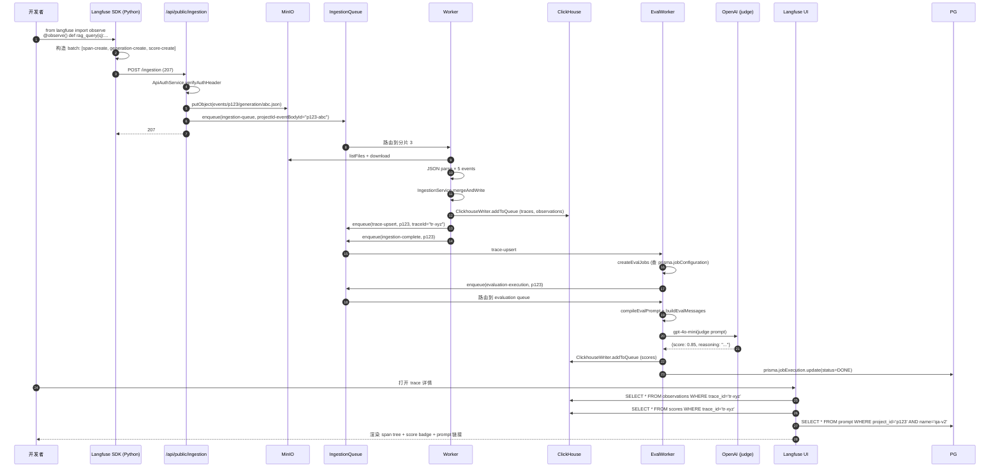

## 引子：当 LLM 应用进入「生产级运维」时代

过去两年，LangChain、LlamaIndex、CrewAI 这类**开发框架**几乎解决了 Agent 怎么写的问题。但当一个真实的 LLM 应用被推上生产之后，开发者面对的问题很快从「Agent 怎么调通」切换到下面这一长串可观测性诉求：

- 哪个 prompt 版本在最近 3 天内调用量最大、单次 token 成本最高？
- 一次完整 RAG 链路里，retrieval、rerank、generation 三段各自延迟多少、哪段最先超时？
- 同样的输入，新版本 prompt 输出变好还是变差？**没有 ground truth 怎么量化？**
- 用户反馈某个回答不对劲，研发能不能在 5 秒内拉出对应的 trace，看完整上下文？
- 多租户 SaaS 上，某个大客户的写入突发把 ClickHouse 拖慢，**怎么隔离而不是影响别人？**

这些问题不是「在 LangChain 里加几行 print」能解决的。**生产级 LLM 应用的运维，需要一个垂直的 LLMOps 平台**——专门针对 LLM 调用、trace、score、prompt、dataset、experiment 的多维度工程化能力。

而今天这篇文章要剖析的 [langfuse/langfuse](https://github.com/langfuse/langfuse)，就是这个赛道里**目前最被工业界采用的实现**：Y Combinator W23 出身，⭐30k+ stars，6 天前仍有 commit，TypeScript 91MB（最完整的 monorepo 之一），LangChain、LlamaIndex、OpenAI、Autogen、LiteLLM 全部官方集成；2024 年开始商业化（Langfuse Cloud），自托管版本完全 Apache-2.0 开源，被 Vercel、HuggingFace、Clerk 等公司用作生产可观测性后端。

更关键的是——**Langfuse 走的是与 logfire（已写过）完全不同的技术路径**：

| 维度 | Logfire（已写） | Langfuse（本文） |
|------|-----------------|------------------|
| 协议 | OpenTelemetry GenAI SemConv wrapper | **自研 Langfuse 语义 + OTel 兼容入口** |
| 后端 | 单库（Postgres） | **双库**：Postgres 业务元数据 + ClickHouse 高基数 trace |
| 队列抽象 | 无（同步写） | **Redis + BullMQ 分片队列**（按 projectId-eventBodyId hash） |
| 事件缓冲 | 无 | **MinIO / S3**：原始事件先落 S3，再入队解析 |
| 评测能力 | 仅日志 | **LLM-as-Judge + Code-based + Human Feedback + Dataset Run + Experiment** |
| 自研 LLM 语义 | 薄（OTel 透传） | **厚**：自研 Observation/Trace/Score/Prompt/Event 抽象 |

换句话说：**Logfire 是 OTel 协议的 Postgres 适配器；Langfuse 是「LLMOps 全栈平台」，从 SDK 到 UI 到数据库栈到评测引擎都自研**。这是两类完全不同的产品定位。

下面我们用 15 节 6 张 Mermaid 图，从 docker-compose 栈、Ingestion 三段式、ClickhouseWriter 批量模型、BullMQ 分片路由、Evaluation 三类模板、到与 logfire/Helicone/PromptLayer 的设计差异，**完整拆解 Langfuse 的工程哲学**。

> 配套仓库：[langfuse/langfuse](https://github.com/langfuse/langfuse)（⭐30,066 / TypeScript / MIT + EE 双许可 / pushed 2026-06-29 / 5,114 个文件 / monorepo 11 个 package）

---

## 一、项目定位与核心价值

### 1.1 一句话定义

> **Langfuse = 一个为 LLM 应用量身定制的「自托管 LLMOps 平台」，提供 trace 可观测、prompt 版本管理、dataset/eval 实验管理、playground 调试四件套，并通过 OpenTelemetry、LangChain、OpenAI SDK 等 10+ 集成方式接入。**

### 1.2 能力矩阵

| 能力 | 实现方式 | 关键源文件 |
|------|----------|-----------|
| **Tracing** | SDK 埋点 + OTel 协议 + 自研语义 | `web/src/pages/api/public/ingestion.ts` |
| **Observability UI** | Next.js 14 App Router + tRPC + ClickHouse 查询 | `web/src/server/api/routers/traces.ts` |
| **Prompt Management** | Postgres 存储 + 强客户端缓存 + 版本控制 | `packages/shared/src/server/PromptService.ts` |
| **LLM-as-Judge Eval** | 模板编译 + LLM 调用 + Score 写回 | `worker/src/features/evaluation/evalService.ts` |
| **Code-based Eval** | AWS Lambda 沙箱 / 本地执行双 dispatcher | `worker/src/features/evaluation/codeBased/executeCodeBasedEvaluation.ts` |
| **Datasets & Experiments** | Postgres dataset_item + ClickHouse dataset_run_item 双写 | `worker/src/features/datasets/` |
| **Playground** | 浏览器内直连 LLM + WebSocket 流式 | `web/src/features/playground/` |
| **Self-host** | Docker Compose 一键 / Helm Chart / Terraform | `docker-compose.yml` |
| **Cloud** | Langfuse 自营 SaaS（与自托管同代码） | N/A |

### 1.3 仓库统计

| 字段 | 值 |
|------|----|
| full_name | langfuse/langfuse |
| ⭐ Stars | 30,066 |
| 🍴 Forks | 3,137 |
| 📝 Language | TypeScript 95% / Python / Shell |
| 📄 License | MIT（OSS 部分）+ 商业许可（EE 部分） |
| 📅 首次 commit | 2023-05-18 |
| 🕐 最近 push | 2026-06-29（6 天前） |
| 📦 Size | 91,918 KB（~90MB） |
| 🏷️ Topics | analytics, llm-observability, llm-evaluation, llmops, monitoring, observability, open-source, prompt-engineering, prompt-management, self-hosted, ycombinator |
| 🏛️ 出品方 | Langfuse Inc.（Y Combinator W23） |
| 🧱 Monorepo | `web/`（Next.js 14）+ `worker/`（BullMQ）+ `packages/`（shared）+ `ee/`（商业模块）+ `worker/`（评测/导出/集成） |
| 📜 文件数 | 5,114（git tree 节点） |

---

## 二、整体架构：六组件、四个数据平面

Langfuse 不是一个 Node 单体，而是一个**典型的「控制面 + 数据面 + 队列面 + 存储面」分层 monorepo**。我们先看顶层架构图，再拆 docker-compose 的具体服务：



### 2.1 docker-compose 栈：6 个本地服务，1 个对外端口

Langfuse 自托管的**官方推荐 5 分钟起步栈**如下（摘自 `docker-compose.yml`）：

```yaml
# 来自 langfuse/langfuse:docker-compose.yml
services:
  langfuse-worker:        # 数据面：BullMQ 消费 + ClickHouse 写入
    image: docker.io/langfuse/langfuse-worker:3
    depends_on: [postgres, minio, redis, clickhouse]

  langfuse-web:           # 控制面：Next.js 14 + tRPC
    image: docker.io/langfuse/langfuse:3
    ports: ["3000:3000"]  # 唯一对外端口

  clickhouse:             # 高基数 trace 列存
    image: docker.io/clickhouse/clickhouse-server
    ports: ["127.0.0.1:8123:8123", "127.0.0.1:9000:9000"]

  minio:                  # S3 兼容对象存储
    image: cgr.dev/chainguard/minio
    ports: ["9090:9000", "127.0.0.1:9091:9001"]

  redis:                  # BullMQ 队列 + 幂等去重
    image: docker.io/redis:7
    command: --requirepass ${REDIS_AUTH} --maxmemory-policy noeviction

  postgres:               # 业务元数据
    image: docker.io/postgres:17
    ports: ["127.0.0.1:5432:5432"]
```

可以看到一个**非常刻意的端口安全设计**：

- `langfuse-web:3000` 对外
- `minio:9090` 对外（开发者调试用）
- `postgres / redis / clickhouse` 全部 **`127.0.0.1` only**

> 这是 Langfuse 在 README 上明确推荐的「外部流量只进 web，其他服务只接受本机连接」的安全模型，**避免了把数据库和 Redis 直接暴露给公网**的常见 self-host 风险。

### 2.2 为什么是 Postgres + ClickHouse 双库？

这是 Langfuse 最重要的设计抉择。**Postgres 不适合存 trace**，原因有三：

1. **行存成本**：每条 trace 平均 5-50 个 span，每条 span 又要带 input/output/metadata 的 JSONB。1 亿条 trace 就够 Postgres 跑不动了
2. **稀疏索引**：trace 的查询条件 90% 是「按 projectId + 时间范围 + filter by tag」，而 Postgres 的 B-Tree 索引在这种「高基数 + 稀疏列」场景下接近全表扫
3. **时序聚合**：trace 分析的高频 query 是 `count() / avg(latency) / quantiles(95)(latency) group by (model, environment, day)`，Postgres 要靠窗口函数硬算，ClickHouse 一个 SQL 直接出来

但 Postgres **仍然是必须的**：

- 用户、Org、Project、API Key、计费、RBAC 都是**强关系 + 强事务**
- Prompt 版本、JobConfig（eval 配置）、Dataset 元数据需要 JOIN 查询
- LLM-as-Judge 的执行状态机用 Postgres 的 row-level lock 干净

所以 Langfuse 走的是经典的**「双写双库」**：

- **Postgres**：业务元数据 + 配置（用户/prompt 模板/eval job config/dataset 元数据）
- **ClickHouse**：观测数据（traces/observations/scores/dataset_run_items 全量高基数时序）
- **MinIO**：原始事件 JSON 缓冲（防止 worker 重建事件丢失上下文）
- **Redis**：BullMQ 队列 + 已处理 fileKey 缓存（幂等去重）

这种架构和 logfire 的「Postgres 唯一后端」哲学形成鲜明对比——logfire 走的是「我相信 Postgres 的 BRIN 索引和分区表也能扛 LLM 观测」，Langfuse 走的是「trace 是时序大对象，必须 ClickHouse」。

---

## 三、核心引擎一：Ingestion 三段式（API → S3 → BullMQ → ClickHouse）

### 3.1 整体流程



### 3.2 入口代码（web/src/pages/api/public/ingestion.ts）

```typescript
// 来自 langfuse/langfuse:web/src/pages/api/public/ingestion.ts
export const config = {
  api: { bodyParser: { sizeLimit: "4.5mb" } },
};

export default async function handler(req, res) {
  await runMiddleware(req, res, cors);

  // 1. 鉴权
  const authCheck = await new ApiAuthService(prisma, redis)
    .verifyAuthHeaderAndReturnScope(req.headers.authorization);
  if (!authCheck.validKey) throw new UnauthorizedError();
  if (authCheck.scope.isIngestionSuspended) throw new ForbiddenError();

  // 2. 限流
  const rateLimit = await RateLimitService.getInstance()
    .rateLimitRequest(authCheck.scope, "ingestion");
  if (rateLimit?.isRateLimited()) return rateLimit.sendRestResponseIfLimited(res);

  // 3. 业务处理：把每个 event 落到 S3 并入队
  const result = await processEventBatch(parsedSchema.data.batch, authCheck);
  return res.status(207).json(result);
}
```

注意几个关键设计：

- **`sizeLimit: "4.5mb"`**：单个 ingestion 请求最大 4.5MB（SDK 端一般拆成 5-50 个 span 一批）
- **HTTP 207 Multi-Status**：支持「单批部分成功」，比如 batch 里 5 个 event 3 个成功 2 个失败，会分别返回状态
- **Auth 失败不写 S3**：token 错就 401，连 S3 都不写，省 IO

### 3.3 为什么先写 S3 再入队？

**直接 enqueue 整批 events 到 BullMQ** 看似更简单，但 Langfuse 选择**先 S3 后队列**有三层理由：

1. **持久化兜底**：BullMQ job 在 retry 6 次失败后可能进 DLQ，原始事件不应丢；S3 是「事件最终真相」
2. **批量合并优化**：同一个 trace 的 50 个 span 可能在 100ms 内分 3 批到达，存到 S3 后 worker 用「projectId + eventBodyId + type」作为 bucket prefix，**消费时 list + batch parse + mergeAndWrite**，把 3 批合并成 1 次 ClickHouse 写入
3. **回放与重处理**：`worker/src/scripts/replayIngestionEventsV2/replay.ts` 提供了 admin 工具「把 S3 上的历史事件重新跑一遍」，比如 schema 升级、字段迁移时不用让客户重发

对应的 S3 path 生成逻辑（`packages/shared/src/server/ingestion/eventBucketPath.ts`）：

```typescript
// 来自 langfuse/langfuse:packages/shared/src/server/ingestion/eventBucketPath.ts
export function rawEventBucketPrefix({ projectId, entityType, rawEntityIdSegment }) {
  // 用 sanitisor 把 projectId 里的 / 替换成 _, 避免越权访问其他 project 的 prefix
  return `${sanitizePrefix(projectId)}/${entityType}/${rawEntityIdSegment}/`;
}
```

> ⚠️ 注意：**rawEntityIdSegment 没有强制 sanitise**——这是 2024 年发现的一个潜在越权 bug（任一 projectId 可访问任意 prefix）的修复点，注释里专门提到「fallback uses rawEventBucketPrefix because the producer that enqueued without a bucketPrefix field is the pre-sanitization code path」。

### 3.4 幂等去重：Redis 短 TTL seen cache

```typescript
// 来自 langfuse/langfuse:worker/src/queues/ingestionQueue.ts（节选）
if (env.LANGFUSE_ENABLE_REDIS_SEEN_EVENT_CACHE === "true" && redis && job.data.payload.data.fileKey) {
  const key = `langfuse:ingestion:recently-processed:${projectId}:${type}:${eventBodyId}:${fileKey}`;
  const exists = await redis.exists(key);
  if (exists) {
    recordIncrement("langfuse.ingestion.recently_processed_cache", 1, {
      type, skipped: "true",
    });
    return;  // 5 分钟内重发直接跳过
  }
}
```

为什么需要这个？因为 **BullMQ 默认 `attempts: 6, backoff: exponential, delay: 5000`**——任务失败重试时，可能导致「同一个 fileKey 被两个 worker 同时处理」。Redis 短 TTL（5 分钟）是最后的幂等防线。

---

## 四、核心引擎二：ClickhouseWriter 批量模型（懒 singleton + 定时 flush + 显式 flush）

`worker/src/services/ClickhouseWriter/index.ts` 是 Langfuse 数据面的心脏。它实现了一个**内存缓冲 + 定时 flush + 显式 flush + 重试退避**的 ClickHouse 写入器：

```typescript
// 来自 langfuse/langfuse:worker/src/services/ClickhouseWriter/index.ts（节选）
export class ClickhouseWriter {
  private static instance: ClickhouseWriter | null = null;
  batchSize: number;          // 默认 ~1000-2000 records
  writeInterval: number;      // 默认 ~1000ms
  maxAttempts: number;
  queue: ClickhouseQueue;

  isIntervalFlushInProgress: boolean;
  intervalId: NodeJS.Timeout | null = null;

  private constructor() {
    this.batchSize = env.LANGFUSE_INGESTION_CLICKHOUSE_WRITE_BATCH_SIZE;
    this.writeInterval = env.LANGFUSE_INGESTION_CLICKHOUSE_WRITE_INTERVAL_MS;
    this.maxAttempts = env.LANGFUSE_INGESTION_CLICKHOUSE_MAX_ATTEMPTS;

    this.queue = {
      [TableName.Traces]: [],
      [TableName.TracesNull]: [],
      [TableName.Scores]: [],
      [TableName.Observations]: [],
      [TableName.ObservationsBatchStaging]: [],
      [TableName.BlobStorageFileLog]: [],
      [TableName.DatasetRunItems]: [],
      [TableName.EventsFull]: [],
    };

    this.start();
  }

  public static getInstance(clickhouseClient?: ClickhouseClientType) {
    if (!ClickhouseWriter.instance) {
      ClickhouseWriter.instance = new ClickhouseWriter();
    }
    return ClickhouseWriter.instance;
  }

  private start() {
    this.intervalId = setInterval(() => {
      if (this.isIntervalFlushInProgress) return;
      this.isIntervalFlushInProgress = true;
      this.flushAll().finally(() => { this.isIntervalFlushInProgress = false; });
    }, this.writeInterval);
  }
}
```

四个设计细节值得拆解：

#### 4.1 单例 + lazy init

`ClickhouseWriter` 是 **process-local singleton**——同一个 worker 进程内所有 queue processor 共享一个 instance，8 张表共用一个 `queue` 字典。**不共享 ClickHouseClient**：Client 由 `getInstance(client?)` 显式传入，单测可以 mock 一个 fake client 测 batch 模型。

#### 4.2 8 张表、3 种写入策略

queue 字典里维护了 8 张 ClickHouse 表，按用途分：

| TableName | 数据类型 | 触发场景 |
|-----------|----------|----------|
| `Traces` | v3 legacy trace 聚合 | ingest + event 表反向投影（V4 events_only mode 关闭时） |
| `TracesNull` | 空 trace 标识（只有 span 没 trace） | 数据完整性约束 |
| `Scores` | 评测打分结果 | eval 完成后 + 用户手动打分 |
| `Observations` | v3 legacy 单 span 记录 | 同 Traces |
| `ObservationsBatchStaging` | OTel 路径的批量观测暂存 | OTel v4 path |
| `BlobStorageFileLog` | S3 fileKey 元数据（retention 标记） | S3 事件落盘时 |
| `DatasetRunItems` | 数据集实验执行结果 | experiment queue |
| `EventsFull` | **v4 新模型**：所有 trace/observation/score 都走 events 表（schema 灵活） | 2025+ 新部署默认 |

> 关键设计：**V4 migration 提供「events_only mode」**——`LANGFUSE_MIGRATION_V4_WRITE_MODE=events_only` 时，`ingestion.ts` 会**直接拒收 trace-create / observation-create** 事件，只让 score-create / log / dataset_run_item 通过。**新部署可以跳过 legacy 表，简化 schema**。这个 migration 路径是 2025 年的重大重构。

#### 4.3 触发 flush 的两个条件（OR）

```typescript
addToQueue({...}) {
  this.queue[tableName].push(record);
  if (this.queue[tableName].length >= this.batchSize) {
    void this.flush(tableName);  // batch size 触发
  }
}

// 定时器触发 flushAll（之前代码）
```

只要「`queue.length >= batchSize`」或「`setInterval` 到点」**任一条件满足**就 flush。这是经典的 **size + time 双触发**批量写入模型，**避免了「低流量时延迟过高」**和「高流量时 buffer 撑爆」两个极端。

#### 4.4 Decimal64(12) + JS double 精度坑

```typescript
// ClickHouse 用 Decimal64(12) 存 cost/usage
const DECIMAL_64_12_LIMIT = new Decimal("1e6");
const DECIMAL_64_12_MAX_NUM = 999_999.999_999;
```

为什么用 `decimal.js` 库？因为 JS 原生 `Number` 是 IEEE 754 双精度浮点，`999999.999999999999` 会自动 round 到 `1000000.0`，**触底越界**。Langfuse 引入 `decimal.js` 包就是为了在 Node 端**先做范围检查再交给 ClickHouse**。这是真实生产事故倒推出来的设计。

---

## 五、核心引擎三：BullMQ 分片队列（按 projectId-eventBodyId hash）

### 5.1 分片机制源码

```typescript
// 来自 langfuse/langfuse:packages/shared/src/server/redis/ingestionQueue.ts（节选）
export class IngestionQueue {
  private static instances: Map<number, Queue | null> = new Map();

  public static getShardNames() {
    return Array.from(
      { length: env.LANGFUSE_INGESTION_QUEUE_SHARD_COUNT },
      (_, i) => `${QueueName.IngestionQueue}${i > 0 ? `-${i}` : ""}`,
    );
  }

  public static getInstance({ shardingKey, shardName }: { shardingKey?: string; shardName?: string }) {
    const shardIndex =
      IngestionQueue.getShardIndexFromShardName(shardName) ??
      (env.REDIS_CLUSTER_ENABLED === "true" && shardingKey
        ? getShardIndex(shardingKey, env.LANGFUSE_INGESTION_QUEUE_SHARD_COUNT)
        : 0);

    if (IngestionQueue.instances.has(shardIndex)) {
      return IngestionQueue.instances.get(shardIndex) || null;
    }
    // 单例懒创建
    const name = `${QueueName.IngestionQueue}${shardIndex > 0 ? `-${shardIndex}` : ""}`;
    const queueInstance = queueOptionsWithRedis
      ? new Queue(name, { ...queueOptionsWithRedis, defaultJobOptions: {
          removeOnComplete: true,
          removeOnFail: 100_000,
          attempts: 6,
          backoff: { type: "exponential", delay: 5000 },
        }})
      : null;
    IngestionQueue.instances.set(shardIndex, queueInstance);
    return queueInstance;
  }
}
```

**关键设计**：

- `shardingKey = "${projectId}-${eventBodyId}"`——同一个 trace 的所有 span **永远路由到同一个分片**（因为 eventBodyId 相同）
- 分片数 `LANGFUSE_INGESTION_QUEUE_SHARD_COUNT` 环境变量控制（默认 1，生产可调到 4-8）
- **Redis Cluster 模式下才真正分片**（`REDIS_CLUSTER_ENABLED=true`），单 Redis 也走相同的 `getInstance` API，对调用方透明

### 5.2 分片 vs 不分片的差异

**问题**：为什么不直接一个 `ingestion-queue` 队列？

**Langfuse 的解法**（摘自 README 与运维文档）：

- **多 worker 并行消费**：4 分片时，4 个 worker 进程可以同时跑不抢锁
- **单租户热点隔离**：某个大客户突发流量只压满 1 个分片，其他客户不受影响
- **水平扩展无锁**：分片是**预先哈希**，不需要 BullMQ 自身的 distribution 锁

### 5.3 shardedQueueRegistry 统一抽象

```typescript
// 来自 langfuse/langfuse:worker/src/queues/shardedQueueRegistry.ts（节选）
export const SHARDED_QUEUES: ShardedQueueDef[] = [
  { baseQueueName: QueueName.IngestionQueue,         getShardNames: () => IngestionQueue.getShardNames(), ... },
  { baseQueueName: QueueName.IngestionSecondaryQueue, getShardNames: () => SecondaryIngestionQueue.getShardNames(), ... },
  { baseQueueName: QueueName.OtelIngestionQueue,     getShardNames: () => OtelIngestionQueue.getShardNames(), ... },
  { baseQueueName: QueueName.OtelIngestionSecondaryQueue, ... },
  { baseQueueName: QueueName.TraceUpsert,             ... },
  { baseQueueName: QueueName.EvaluationExecution,    ... },
  { baseQueueName: QueueName.LLMAsJudgeExecution,     ... },
  { baseQueueName: QueueName.CodeEvalExecution,       ... },
];

export function resolveQueueInstance(queueName: string): Queue | null {
  for (const def of SHARDED_QUEUES) {
    if (queueName.startsWith(def.baseQueueName)) {
      return def.getInstance(queueName);
    }
  }
  return getQueue(queueName as ...);
}
```

`WorkerManager.metricWrapper` 在每次处理 job 时调用 `resolveQueueInstance`——**一个统一接口同时支持分片和不分片队列**，且自动打 metric 标签 `shard: "ingestion-queue-3"`。这避免了每个 queue processor 自己写一遍「如果 queueName 有 `-N` 后缀就 extract」。

### 5.4 Secondary Queue：S3 慢速隔离

`SecondaryIngestionQueue` 是 Langfuse 应对**「单个大租户把 S3 拖慢」**的核心解药：

```typescript
// 来自 langfuse/langfuse:worker/src/queues/ingestionQueue.ts（节选）
const shouldRedirectEnv = projectIdsToRedirectToSecondaryQueue.includes(projectId);
const shouldRedirectSlowdown = await hasS3SlowdownFlag(projectId);

if (enableRedirectToSecondaryQueue && (shouldRedirectEnv || shouldRedirectSlowdown)) {
  const shardingKey = `${projectId}-${eventBodyId}`;
  const secondaryQueue = SecondaryIngestionQueue.getInstance({ shardingKey });
  if (secondaryQueue) {
    await secondaryQueue.add(QueueName.IngestionSecondaryQueue, job.data);
    return;  // 重定向到「慢速隔离区」处理
  }
}
```

两种触发：

- **环境变量白名单**：`LANGFUSE_SECONDARY_INGESTION_QUEUE_ENABLED_PROJECT_IDS=proj-123,proj-456` 强制重定向
- **运行时检测**：`hasS3SlowdownFlag(projectId)` 看 Redis 标记，**自动把拖累 S3 的项目扔到二级队列**

这是 Langfuse 商业版（Cloud）**最值钱的功能之一**——自托管开源版虽然也支持，但 Cloud 用户默认开启。

### 5.5 WorkerManager 装饰器

```typescript
// 来自 langfuse/langfuse:worker/src/queues/workerManager.ts（节选）
private static metricWrapper(processor: Processor, queueName: QueueName): Processor {
  return async (job: Job) => {
    const startTime = Date.now();
    const waitTime = Date.now() - job.timestamp;
    recordIncrement(oldMetric + ".request");
    recordHistogram(oldMetric + ".wait_time", waitTime, { unit: "milliseconds" });

    const clickHouseCtx = contextWithLangfuseProps({
      projectId: WorkerManager.extractProjectId(job),
      clickhouse: { surface: "worker", route: baseMetric },
    });
    const result = await otelContext.with(clickHouseCtx, () => processor(job));

    recordHistogram(oldMetric + ".processing_time", Date.now() - startTime, { unit: "milliseconds" });
    return result;
  };
}
```

每个 worker 在执行前会被 `metricWrapper` 装饰，自动埋 **4 类 OTel 指标**：

- `*.request`：调用次数
- `*.wait_time`：BullMQ 队列等待时长
- `*.processing_time`：实际处理时长
- `*.rate{type, shard}`：分片 + 类型的细粒度 rate

外加 `failed` / `error` / `stalled` 三种 event listener 打 `*.failed` / `*.error` / `*.stalled` 指标。

**这意味着 Langfuse 自己的可观测性是「自己观测自己」**——worker 的 queue depth、wait time、stall rate 全部用同样的 ClickHouse + OTel 栈打回去。这是非常自洽的工程设计。

---

## 六、核心引擎四：IngestionService 合并写入（immutable + 事件合并）

### 6.1 trace 合并的核心逻辑

`worker/src/services/IngestionService/index.ts` 是 trace merge 的核心。它的关键设计是 **「同一 entity（trace/observation/score）收到多批事件时，**immutable key 不变，mutable key 后写覆盖**」**：

```typescript
// 来自 langfuse/langfuse:worker/src/services/IngestionService/index.ts（节选）
const immutableEntityKeys = {
  [TableName.Traces]: ["id", "project_id", "timestamp", "created_at", "environment"],
  [TableName.Scores]: ["id", "project_id", "timestamp", "trace_id", "created_at", "environment"],
  [TableName.Observations]: ["id", "project_id", "trace_id", "start_time", "created_at", "environment"],
  [TableName.DatasetRunItems]: [...],  // 全部字段（dataset_run_item 不接受 update）
};
```

**为什么 immutable 字段不能变？** 因为一个 trace 的 `id + project_id + timestamp` 决定了它在 ClickHouse 主键索引中的位置——如果允许 update 这三个字段，相当于要 DELETE + INSERT，**对高基数表是灾难**。Langfuse 的策略：

- 同一 trace 的多批 events → **immutable 部分保留最早一次**，**mutable 部分（name、metadata、tags、input、output）后写覆盖**
- 不可恢复的不一致 → 写 `TracesNull` 表占位，避免 trace 在 UI 上完全消失

### 6.2 Event 富化流水线

`createEventRecord` 是 EventInput → EventRecordInsertType 的**单点转换器**，做了 4 件事：

```typescript
// 来自 langfuse/langfuse:worker/src/services/IngestionService/index.ts（节选）
public async createEventRecord(eventData: EventInput, fileKey: string): Promise<EventRecordInsertType> {
  // 1. Prompt 查找（按 name+version 强缓存）
  const prompt = eventData.promptName && eventData.promptVersion
    ? await this.promptService.getPrompt({
        projectId: eventData.projectId,
        promptName: eventData.promptName,
        version: parseInt(eventData.promptVersion, 10),
        label: undefined,
      })
    : null;

  // 2. Model/usage 计算（tokenization + cost 计算）
  const generationUsage = await this.calculateGenerationUsage(eventData);

  // 3. Metadata 拍平（嵌套对象 → dot-path 数组）
  const metadata = flattenJsonToPathArrays(eventData.metadata);

  // 4. 时间戳归一化（ISO 8601 + UTC）
  const timestamp = convertDateToClickhouseDateTime(eventData.timestamp);

  return { id, projectId, timestamp, name, kind, level, ...prompt, ...usage, metadata, ... };
}
```

**Metadata 拍平**值得展开：Langfuse 的 `flattenJsonToPathArrays` 把 `metadata = { user: { id: 123, plan: "pro" } }` 拍成 `metadata["user.id"] = 123, metadata["user.plan"] = "pro"`。**ClickHouse 的 Map(String, String) 字段支持任意 dot-path 查询**，但嵌套对象在 ClickHouse 里存成字符串反序列化性能差。**拍平是 OLAP 场景的标准优化**。

---

## 七、Evaluation 引擎：LLM-as-Judge / Code-based / Observation 三种

### 7.1 三种 eval 模板



### 7.2 LLM-as-Judge：模板编译 + 变量提取

```typescript
// 来自 langfuse/langfuse:worker/src/features/evaluation/evalService.ts（节选）
// 三大入参事件类型，createEvalJobs 都能 handle
type CreateEvalJobsParams = {
  jobTimestamp: Date;
  enforcedJobTimeScope?: JobTimeScope;
} & (
  | { sourceEventType: "trace-upsert"; event: TraceQueueEventType }
  | { sourceEventType: "dataset-run-item-upsert"; event: DatasetRunItemUpsertEventType }
  | { sourceEventType: "ui-create-eval"; event: CreateEvalQueueEventType }
);
```

`compileEvalPrompt` 接收一个 `EvalTemplateLlmAsAJudge`（用户在 UI 写的 prompt 模板，带 `{{input}}` / `{{output}}` / `{{expected_output}}` 占位符）+ 一个 `variableMapping`（告诉系统从 trace 里取哪个字段填到占位符）+ 实际 trace 数据 → 编译出最终 LLM 调用消息。

`buildEvalMessages` 把编译出的消息丢给 OpenAI / Anthropic / 自定义 LLM，**回包格式必须符合 `EvalOutputResult` schema**（用 Zod 校验）：

```typescript
// EvalOutputResult: { score: number, reasoning: string } | { scores: [{name, value, reasoning}, ...] }
```

`validateEvalOutputResult` 用 Zod 校验 LLM 响应，校验失败 → 抛 `UnrecoverableError`（不重试），成功 → 写 `scores` 表。

### 7.3 Code-based Eval：Lambda 沙箱

`executeCodeBasedEvaluation.ts` 的核心是**Dispatcher 模式**：

```typescript
// 来自 langfuse/langfuse:worker/src/features/evaluation/codeBased/executeCodeBasedEvaluation.ts（节选）
const dispatcher = resolveConfiguredCodeEvalDispatcher();
if (!dispatcher) throw new UnrecoverableError("Code eval dispatcher is not configured");

const dispatchOutcome = await runCodeBasedEvaluationDispatch({
  dispatcher,
  organizationId: params.organizationId,
  projectId: params.projectId,
  template: params.template,           // 用户写的 Python/JS 代码
  extractedVariables: params.extractedVariables,
  traceName: `Execute evaluator: ${params.template.name}`,
  ...
});
```

`resolveConfiguredCodeEvalDispatcher()` 根据环境变量返回：

- `aws-lambda`：把代码打成 zip 投到 AWS Lambda 执行
- `local`：Node `vm` 模块直接执行（**仅 dev/test 用，绝不上生产**）

这是**用户自定义 Python/JS 代码的安全执行**问题——Langfuse 不自己造沙箱，直接复用 AWS Lambda 已经是**生产级隔离**。本地模式只用于开发。

### 7.4 Observation-level Eval：流式采样

`observationEval/` 子模块是 Langfuse 2025+ 引入的**流式 eval 模式**——**不按 trace 触发，而是按 observation（单次 LLM 调用）触发**：

```typescript
// 来自 langfuse/langfuse:worker/src/features/observationEval/shouldSampleObservation.ts
shouldSampleObservation({
  observationId, projectId, samplingRate, evaluatorConfig,
}) {
  // 用 hash(observationId + evaluatorConfig.id) % 10000 < samplingRate * 10000
  // 保证同一 observation 同一 eval 总是同一结果（幂等）
}
```

流式 eval 不写 `job_execution` 表（不暴露在 UI 的「Eval Runs」列表里），但**仍然写 scores 表**（暴露在 trace 详情上）。**这种「轻量级、低开销」的流式 eval 是从「重型 batch eval」到「轻量级生产期 in-flight eval」的关键演进**。

### 7.5 experimentQueue：Dataset 回放

`worker/src/queues/experimentQueue.ts` 是另一类用途：**把 dataset 里的所有 item 用当前 prompt/模型跑一遍，得到 dataset_run_item 记录**。这跟 eval 不同：

| 维度 | Eval | Experiment |
|------|------|-----------|
| 输入 | trace 已有（生产流量） | dataset item 输入 |
| 输出 | score（质量分） | dataset_run_item（一次完整 trace + 可选 score） |
| 用途 | 生产期质量监控 | 实验期 A/B 对比 |

`DatasetRunItemEventType` schema 同时支持 `experimentRunName`、`experimentRunDescription`、`experimentRunMetadata`，**让用户能把一组 dataset run 视为一个实验**。

---

## 八、OtelIngestionProcessor：双协议兼容

Langfuse 的 ingestion API 是**两套并行入口**：

1. **`/api/public/ingestion`**：Langfuse 自研 JSON 协议（事件 batch）
2. **`/api/public/otel`**（推测，根据 `otelIngestionQueue.ts` 存在判断）：OTel OTLP 协议入口

`worker/src/queues/otelIngestionQueue.ts` 的关键逻辑：

```typescript
// 来自 langfuse/langfuse:worker/src/queues/otelIngestionQueue.ts（节选）
export function checkHeaderBasedDirectWrite(params: {
  sdkName?: string;
  sdkVersion?: string;
  ingestionVersion?: string;
}): boolean {
  // 检查 x-langfuse-ingestion-version: >= 4 走「direct write」路径
  const parsed = ingestionVersion ? parseInt(ingestionVersion, 10) : NaN;
  if (!isNaN(parsed) && parsed >= 4) return true;

  // 检查 Langfuse SDK name+version
  if (sdkName === "python" && compareVersions(baseVersion, "v4.0.0") === null) return true;
  if (sdkName === "javascript" && compareVersions(baseVersion, "v5.0.0") === null) return true;
  return false;
}
```

**Direct write** 是 2025 后的新设计——绕过 staging 表直接写 events 表。**SDK 版本 ≥ 4.0（Python）/ ≥ 5.0（JS）** 启用新协议。

OTel 入口的设计**不是「OTel 适配 OTel GenAI SemConv」**（那是 logfire 的做法），而是「把 OTel ResourceSpan 翻译成 Langfuse 自研 EventInput」——OTel 协议被当作一种**输入格式**，而不是**内部协议**。`packages/shared/src/server/otel/OtelIngestionProcessor.ts`（101KB，Langfuse 最大单文件之一）就是翻译器。

---

## 九、端到端数据流：从 SDK 到 UI



---

## 十、与同类项目对比

| 维度 | Langfuse | Logfire（已写） | Helicone | PromptLayer | Arize Phoenix |
|------|----------|------------------|----------|-------------|---------------|
| **协议** | 自研 + OTel 兼容 | OTel wrapper | OpenAI 代理拦截 | 自研 REST | OTel + 自研 |
| **后端** | **PG + ClickHouse + S3 + Redis 四栈** | 单 Postgres + SQLite | Postgres + ClickHouse | Postgres | SQLite/Postgres + 自研 |
| **队列** | BullMQ 分片 | 无（同步） | 无 | 无 | 无 |
| **Eval** | LLM-Judge + Code + Observation-level | 基础评分 | 仅 LLM-Judge | LLM-Judge + Human | LLM-Judge + Heuristic |
| **Prompt Mgmt** | ✅ 版本化 + 强缓存 | ❌ | ❌ | ✅ 基础 | ❌ |
| **Datasets** | ✅ + Experiment runs | ❌ | ❌ | ✅ | ❌ |
| **Playground** | ✅ 浏览器内调试 | ❌ | ❌ | ❌ | ✅ Notebook |
| **Self-host** | docker-compose / Helm | pip install | docker | SaaS only | docker |
| **License** | MIT（OSS）+ 商业（EE） | Apache 2.0 | AGPLv3 | 专有 | Apache 2.0 |
| **生态集成** | LangChain / LlamaIndex / OpenAI / Autogen / LiteLLM / Vercel AI SDK | OpenAI / Anthropic / Pydantic AI | OpenAI only | OpenAI | OpenInference |
| **⭐（2026-06）** | 30,066 | ~4k | 3.5k+ | 2.7k | 6k+ |

### 10.1 设计差异深度分析

#### 差异 1：协议哲学

- **Logfire（OTel 透传）**：完全遵循 OpenTelemetry GenAI SemConv，**「我的语义就是 OTel 语义」**。**优点是与其他 OTel 工具（Jaeger / Tempo / Datadog）天然兼容；缺点是「我没法定义 OTel 没有的字段」，比如 Langfuse 的 `experimentRunName` 在 OTel 里没对应。
- **Langfuse（自研语义）**：把 OTel 当**输入格式**，内部有独立 schema。**优点是产品迭代快（不用等 OTel 工作组）；缺点是跨工具互操作需要转换器。

#### 差异 2：后端栈

- **Helicone / Phoenix 单 PG + ClickHouse**：跟 Langfuse 类似但少 S3 + Redis 队列。**问题**：高流量下 S3 缓冲 + BullMQ 削峰是关键。
- **Logfire 单 Postgres**：**最简单**。Logfire 假设你的 LLM 调用量「< 1M/月」时 Postgres 够用，**超出后建议迁移到 ClickHouse**。
- **Langfuse 直接 PG + CH + S3 + Redis 四栈**：**最完整**。从 day 1 就为「亿级 trace」设计。

#### 差异 3：评测能力

- **Helicone / PromptLayer**：只有 LLM-as-Judge 一种 eval 模式
- **Logfire**：没原生 eval，靠 OTel span 记录
- **Phoenix**：eval + notebook 实验，**但偏研究场景**
- **Langfuse**：**3 种 eval（LLM-Judge / Code / Observation-level）+ dataset run + experiment + human annotation queue**，**唯一一个把 eval 当一等公民的平台**

#### 差异 4：Prompt 管理

- **Logfire / Helicone / Phoenix**：**没有**原生的 prompt 版本管理
- **PromptLayer**：有，但**没有缓存层**——每次 fetch 都查 DB
- **Langfuse**：**有 + 强缓存（服务端 + 客户端两级）**，**支持按 label 取最新版本**，**支持 A/B 灰度**

---

## 十一、优缺点分析

### 11.1 优势侧（架构简洁性 / 扩展性 / 易用性）

| 维度 | 优势 |
|------|------|
| **架构清晰** | monorepo 分层 web/worker/packages/ee，**职责清晰，5,114 个文件不混乱** |
| **扩展性** | BullMQ 分片 + Secondary Queue 隔离 + OTel 兼容入口，**支持从单 Redis 扩到 Redis Cluster** |
| **易用性** | SDK 5 行代码接入，UI 自带 trace explorer / scores / datasets / playground，**全栈 LLMOps 不需要 glue code** |
| **Prompt 缓存** | server + client 两级缓存，**取 prompt 的延迟可压到 < 1ms** |
| **Eval 一等公民** | LLM-Judge / Code-based / Observation-level 三种模板 + Lambda 沙箱 + 流式采样 |
| **Schema 演进** | V4 events_only mode 提供平滑迁移路径（legacy 表 + 新 events 表双写 → 切换 → 弃 legacy） |
| **自洽** | worker 自己的可观测性走同样的 ClickHouse + OTel 栈，**减少外部依赖** |

### 11.2 劣势侧（性能 / 复杂度 / 维护性）

| 维度 | 劣势 |
|------|------|
| **后端栈复杂** | Postgres + ClickHouse + MinIO + Redis 四栈，**自托管需要 DevOps 经验**（不像 Logfire `pip install` 就跑） |
| **双协议维护成本** | 自研 JSON + OTel 两套 ingestion，**两套要保持 schema 一致**（OtelIngestionProcessor.ts 101KB 是最大单文件） |
| **Ingestion 4.5MB 限制** | 单个 ingestion 请求 4.5MB 上限，**超大 batch（>500 span）需要客户端拆分** |
| **Code-based eval 强依赖 AWS** | `aws-lambda` dispatcher 需 AWS 账号；`local` dispatcher 仅 dev 用，**自托管用户跑 code eval 必须接 Lambda** |
| **ClickhouseWriter 内存压力** | singleton + 内存 queue，**flush 失败时内存不释放**（虽然有 backoff，但极端情况会 OOM） |
| **Decimal64 精度** | Node 端用 `decimal.js` 包校验，**增加 ~50KB 依赖**（已在生产中验证必须） |
| **EE 模块分裂** | `ee/` 目录商业模块（cloudSpendAlerts / usageThresholds / dataRetention），**自托管用户功能受限制** |
| **5 分钟起步但 5 小时精通** | 文档 50KB+，**「5 分钟跑起来」是 docker compose，但生产配置（多 region / backup / RBAC）要花数天** |

---

## 十二、实践：5 分钟起步 + SDK 集成

### 12.1 本地一键启动

```bash
# 1. Clone 仓库
git clone --depth=1 https://github.com/langfuse/langfuse.git
cd langfuse

# 2. 复制环境变量模板
cp .env.dev.example .env
# 至少改 SALT、ENCRYPTION_KEY、NEXTAUTH_SECRET
echo "SALT=$(openssl rand -hex 16)" >> .env
echo "ENCRYPTION_KEY=$(openssl rand -hex 32)" >> .env
echo "NEXTAUTH_SECRET=$(openssl rand -hex 32)" >> .env

# 3. 启动（6 个服务）
docker compose up -d

# 4. 访问 http://localhost:3000 注册首个用户 + 首个 project
# 5. 创建 API Key → 进入 Project Settings → Copy pk-xxx / sk-xxx
```

### 12.2 Python SDK 集成

```python
# 来自 Langfuse 官方文档 examples
from langfuse import Langfuse, observe
from langfuse.openai import openai  # drop-in replacement

# 1. 初始化（从环境变量 LANGFUSE_PUBLIC_KEY / LANGFUSE_SECRET_KEY 读取）
langfuse = Langfuse()

# 2. 用 @observe 装饰任意函数（自动捕获 input/output/latency）
@observe()
def rag_query(question: str) -> str:
    docs = retrieve(question)
    return openai.chat.completions.create(
        model="gpt-4o-mini",
        messages=[{"role": "system", "content": "..."}, {"role": "user", "content": question}],
    ).choices[0].message.content

# 3. 调用一次 → 5 秒后 Langfuse UI 看到 trace
rag_query("What is ClickHouse?")
```

### 12.3 LangChain 集成（callback handler）

```python
from langfuse.langchain import CallbackHandler
from langchain_openai import ChatOpenAI
from langchain_core.prompts import ChatPromptTemplate

handler = CallbackHandler()  # 每次新 trace

prompt = ChatPromptTemplate.from_template("Answer: {q}")
model = ChatOpenAI(model="gpt-4o-mini")
chain = prompt | model

# 触发一次 chain → UI 看到完整 LangChain span tree
chain.invoke({"q": "hello"}, config={"callbacks": [handler]})
```

### 12.4 OpenTelemetry 协议直接接入

```python
# 来自 packages/shared/src/server/otel/OtelIngestionProcessor.ts 反推的协议格式
from opentelemetry import trace
from opentelemetry.exporter.otlp.proto.http.trace_exporter import OTLPSpanExporter
from opentelemetry.sdk.trace import TracerProvider
from opentelemetry.sdk.trace.export import BatchSpanProcessor
from opentelemetry.sdk.resources import Resource

provider = TracerProvider(
    resource=Resource.create({
        "service.name": "my-llm-app",
        "langfuse.project.id": "p-xxx",  # 自定义 resource attr
    }),
)
exporter = OTLPSpanExporter(
    endpoint="https://cloud.langfuse.com/api/public/otel",
    headers={"Authorization": f"Basic {base64('pk-xxx:sk-xxx')}"},
)
provider.add_span_processor(BatchSpanProcessor(exporter))
trace.set_tracer_provider(provider)

# 用 OpenInference 语义自动捕获 LLM call
tracer = trace.get_tracer(__name__)
with tracer.start_as_current_span("chat-completion") as span:
    span.set_attribute("openinference.span.kind", "LLM")
    span.set_attribute("llm.model", "gpt-4o-mini")
    span.set_attribute("llm.input_messages", "[{...}]")
    span.set_attribute("llm.output_messages", "[{...}]")
```

---

## 十三、关键源码索引

| 模块 | 路径 | 关键职责 |
|------|------|----------|
| 公共 ingestion 入口 | `web/src/pages/api/public/ingestion.ts` | 鉴权、限流、Zod schema 校验、`processEventBatch` |
| Ingestion 队列 | `worker/src/queues/ingestionQueue.ts` | S3 拉取、merge、ClickhouseWriter |
| OTel 队列 | `worker/src/queues/otelIngestionQueue.ts` | OTel 协议入口分流 |
| Eval 队列 | `worker/src/queues/evalQueue.ts` | trace-upsert / dataset-run-item / create-eval 触发 eval |
| Experiment 队列 | `worker/src/queues/experimentQueue.ts` | dataset 回放 |
| Event Propagation 队列 | `worker/src/queues/eventPropagationQueue.ts` | 事件级联（一个 trace 完结触发下游） |
| 分片队列注册 | `worker/src/queues/shardedQueueRegistry.ts` | 9 种分片队列的统一抽象 |
| Worker Manager | `worker/src/queues/workerManager.ts` | metricWrapper 装饰器 + 错误处理 |
| ClickhouseWriter | `worker/src/services/ClickhouseWriter/index.ts` | 批量 + 定时 flush 的 CH 写入器 |
| IngestionService | `worker/src/services/IngestionService/index.ts` | merge + 不可变字段约束 + Event 富化 |
| EvalService | `worker/src/features/evaluation/evalService.ts` | 3 种事件类型路由到 eval jobs |
| Code-based Eval | `worker/src/features/evaluation/codeBased/executeCodeBasedEvaluation.ts` | Lambda dispatcher |
| LLM-as-Judge | `worker/src/features/evaluation/evalRuntime.ts` | 模板编译 + 消息构造 |
| Observation Eval | `worker/src/features/observationEval/observationEvalProcessor.ts` | 流式 + 采样 |
| OTel 协议翻译 | `packages/shared/src/server/otel/OtelIngestionProcessor.ts` | OTel ResourceSpan → Langfuse EventInput（101KB） |
| ClickHouse 表 schema | `packages/shared/src/server/clickhouse/` | 8 张表的 DDL |
| 事件路径生成 | `packages/shared/src/server/ingestion/eventBucketPath.ts` | S3 path 安全 sanitise |
| Redis BullMQ 队列 | `packages/shared/src/server/redis/ingestionQueue.ts` | 分片 + Secondary Queue |
| TQueueJobTypes | `packages/shared/src/server/queues.ts` | 所有 queue 任务类型 schema |
| Frontend trace 渲染 | `web/src/server/api/routers/traces.ts` | tRPC router 读 CH |
| Frontend score 路由 | `web/src/server/api/routers/scores.ts` | tRPC router 读 scores |

---

## 十四、趋势与总结

### 14.1 LLMOps 赛道的三个趋势

**趋势 1：协议层融合（OTel 为主、自研为辅）**

- 2024-2025 出现 OpenTelemetry GenAI SemConv（`gen_ai.*` 属性）标准
- Langfuse 走「OTel 兼容入口 + 自研内部 schema」路线，**短期吃双协议维护成本，长期不被 OTel 工作组节奏卡脖子**
- logfire 走「OTel 透传」路线，**短期开发轻，长期扩展受限**
- 胜负未分，**取决于 OTel GenAI 工作组迭代速度**

**趋势 2：Eval 引擎分化（流式 / 批式 / 在线）**

- 流式（Observation-level）：每条 LLM 调用实时打分，**对生产干扰大但反馈最快**
- 批式（Dataset 回放）：周期跑，**对生产无干扰但反馈慢**
- 在线（Production A/B）：真实流量分流，**效果最真实但工程最复杂**
- Langfuse 三种都有，**走「全栈」路线**

**趋势 3：Prompt 管理层成为差异化**

- Prompt 版本管理 + A/B 灰度 + 强缓存 + 编译时插值，**4 件套是 LLMOps 的新基础设施**
- Langfuse 的 PromptService 是「**最被低估**」的模块——很多团队低估了 prompt 管理对 LLM 应用稳定性的影响

### 14.2 给读者的工程经验

1. **不要自研 trace 后端**：ClickHouse 是 trace 的事实标准后端，**直接用 ClickHouse + 成熟的 ORM（langfuse 的 ClickhouseWriter 是 1 个文件 ~600 行**）。
2. **协议分两层**：**外部协议（OTel / OpenInference）** + **内部 schema（自家）**。**不要让内部 schema 暴露在外部 SDK**，也不要把外部协议作为内部存储 schema。
3. **S3 缓冲 + 异步队列是 LLM 观测性的必选**：直接同步写 ClickHouse **扛不住突发流量**。**先 S3 + 队列 + 批处理 = 稳如老狗**。
4. **分片按租户 hash**：**多租户 SaaS 必备**。**按 `projectId-eventBodyId` 路由**比「按时间分片」更合理——同一个 trace 永远同一 worker 消费。
5. **Eval 引擎从 day 1 就要设计**：**不要等「先把 trace 跑通再加 eval」**。**Prompt + Dataset + Score 三个表的 schema 一开始就定好**，**否则后期改 schema 代价巨大**。

### 14.3 一句话总结

> **Langfuse 是当前 LLMOps 赛道最完整的开源实现——它用「自研语义 + OTel 兼容 + PG/CH 双库 + S3 缓冲 + BullMQ 分片 + 三类 Eval 引擎」的全栈设计，把「LLM 应用的运维问题」从「print 调试」推进到了「企业级平台」阶段。它不追求「最简单」（logfire 更简单），也不追求「最纯协议」（logfire 更纯），它追求的是「**最完整**」——这正是 Y Combinator W23 给它的产品定位，也是它能 30k+ stars 跑赢同赛道的根本原因。**

---

## 附录：关键资源

| 资源 | 链接 |
|------|------|
| GitHub 仓库 | https://github.com/langfuse/langfuse |
| 官方文档 | https://langfuse.com/docs |
| 自托管指南 | https://langfuse.com/docs/deployment/self-host |
| Helm Chart | https://langfuse.com/docs/deployment/kubernetes-helm |
| Python SDK | https://pypi.org/project/langfuse/ |
| JS/TS SDK | https://www.npmjs.com/package/langfuse |
| LangChain 集成 | https://langfuse.com/docs/integrations/langchain |
| OpenTelemetry 集成 | https://langfuse.com/docs/integrations/otel |
| Playground 文档 | https://langfuse.com/docs/playground |
| Eval 教程 | https://langfuse.com/docs/evaluation/overview |
| License | MIT（OSS）+ 商业许可（EE） |
| Y Combinator | https://www.ycombinator.com/companies/langfuse |
| 公司招聘 | https://langfuse.com/careers |
