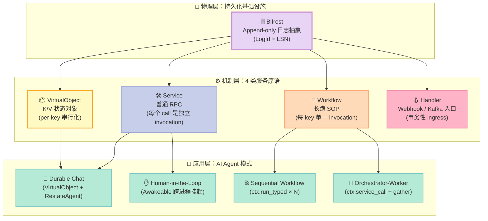
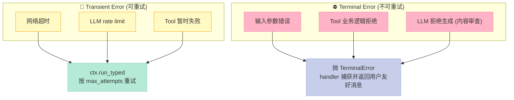
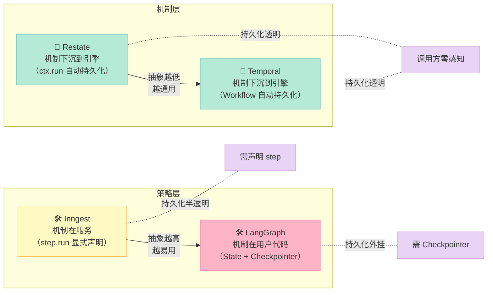
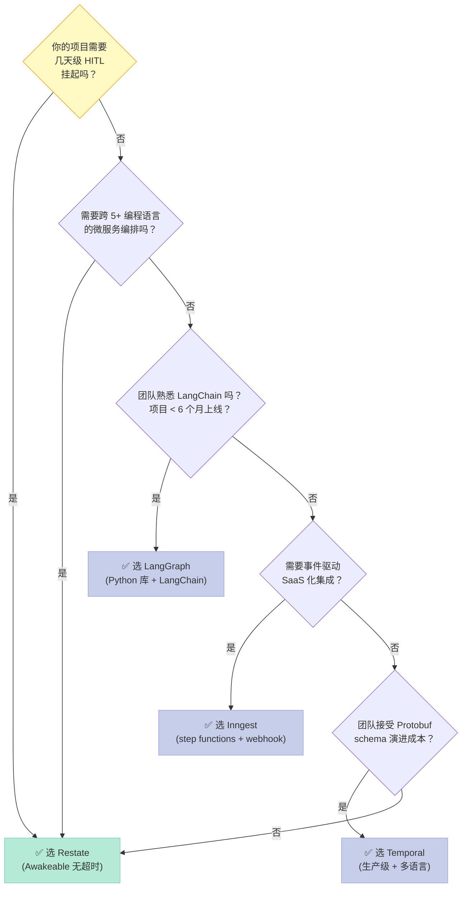

> **核心结论**：Workflow 组件的本质不是"画一张状态机图"，而是**把每一次 `ctx.run_typed(name, fn, ...)` 调用都写进 Journal**，让 Agent 的中间状态变成"可以重放、可以暂停、可以挂起到人类审批"的可恢复对象。Restate 用 Rust 实现的 Bifrost 日志抽象 + 4 类服务模型（Service/Workflow/VirtualObject/Handler），把"durable execution"从论文里的术语变成了 SDK 上一行 `ctx.run()` 的可调用原语。

## 前言

如果你正在写一个生产环境的 AI Agent，你大概率被这些问题折磨过：

1. **Tool 调用崩溃了**：LLM 已经调了 `get_weather("SF")` 拿到 23℃，正准备拼最终回答，结果下游 `openai.ChatCompletion` 超时，整个 conversation 重新来一遍——又多扣一次 tool call 的钱
2. **长任务被切断**：Agent 要等人类审批一份合同，写了 `await human_review()` 阻塞 3 天，结果 Cloud Run / Lambda 30 分钟就把容器干掉了
3. **并行调用一旦失败就全废**：让 3 个研究员 Agent 并行跑数据收集，其中一个 OOM 异常退出，要不要把另外两个的产出回滚？
4. **重试风暴**：网络抖一下，3 个 `ctx.run()` 全部按 `max_attempts=3` 重试 3 遍，烧了 9 倍的 LLM 配额

这 4 个问题看起来像"代码补几行 try-catch 就能解决"，但其实是 **Workflow 组件"有没有把状态当成可恢复对象"的分水岭**。

今天要拆解的 **[Restate](https://github.com/restatedev/restate)**（`restatedev/restate`，4,094⭐，2026-06-29 最新提交，Rust 实现的 1.7.1-dev 引擎 + TypeScript / Python / Go / Java / Kotlin / Rust 六大 SDK），恰好把这 4 个问题的解法写到了同一个抽象里。它不画工作流图、不做可视化画布、不内置 piece 生态——它做的是更底层的一件事：

> **把"一次函数调用"当成数据库事务的等价物**。每条 `ctx.run("调用", fn)` 都被记到 Journal 里；崩溃后，引擎从 Journal 最后一条成功记录继续执行，跳过已完成的步骤。这套机制叫 **Durable Execution**（持久化执行），是整个 Workflow 组件的物理基础。

本文会从源码层面回答：

- **机制层**：Bifrost 日志抽象怎么用 append-only log 实现"可重放的事务"？
- **API 层**：`Service` / `Workflow` / `VirtualObject` / `Handler` 四类原语怎么把"不同的并发模型"封装成同一套 SDK 接口？
- **AI 集成层**：`RestateAgent` 怎么把 Pydantic AI / OpenAI Agents / Google ADK / LangChain / Vercel AI SDK 全部"挂进" durable 框架里，让 LLM 调用的中间结果自动持久化？
- **设计取舍**：Restate vs Temporal vs Inngest vs LangGraph 在"机制 vs 策略"分离上的根本差异

读完你能拿到：4 个真实可运行的 AI Agent 代码（chat / human-approval / sequential workflow / orchestrator）、Bifrost 源码 200 行精读、3 个对比项目（Temporal / Inngest / LangGraph）的设计哲学清单、以及一份"从零搭建 MVP"的 5 步指南。

---

## 一、Restate 是什么：分布式持久化执行平台，不是"另一个 Workflow 引擎"

先把项目定位钉死。Restate 的 README 第一段是这么说的：

> [Restate](https://restate.dev) is the simplest way to build resilient applications.
> Restate provides a **distributed durable version** of your everyday building blocks, letting you build: Durable AI Agents / Workflows-as-Code / Microservice Orchestration / Event Processing / Async Tasks / Agents, Stateful Actors, state machines, and much more

它和 LangGraph / Inngest / Temporal 表面上都是"Workflow 引擎"，但**抽象层级完全不同**。下面这张表先帮我们钉清楚：

| 引擎 | 抽象层级 | 核心问题 | 是否"机制"层 |
|------|----------|----------|---------------|
| **LangGraph** | 节点 + 边的图（Python DSL） | "怎么让 LLM 在图上正确跳转" | ❌ 策略层 |
| **Inngest** | Step Functions + 事件触发 | "怎么把云函数串成可视化流水线" | 介于两者之间（托管服务） |
| **Temporal** | Workflow + Activity + 事件历史 | "怎么用代码写工作流且支持长跑" | ✅ 机制层，但 Workflow 必须用专属 SDK |
| **Restate** | 4 类服务 + Journal + Awakeable | "怎么让任意函数调用都自动持久化" | ✅ 机制层，**任意 Python/TS 函数**都可变 Durable |

Restate 的核心差异化是 **"Transparent Durability"（透明的持久化）**——你不需要学一套新的 DSL 写 Workflow，你写普通的 Python async 函数，**只要在 `ctx.run()` / `ctx.service_call()` / `ctx.awakeable()` 这几个原语里调用**，引擎就会自动把调用结果写到 Journal；下次重启时自动跳过。

换句话说：**LangGraph 让你"显式声明"图的边，Restate 让你"写普通代码，引擎自动推断"可重放边界**。这种"机制下沉到引擎层"的设计，正是 Bitter Lesson 反复强调的"把能力交给通用方法（计算 + 持久化），别塞进模型能学的策略里"的工程实现。

### 1.1 Restate 在 Harness 6 件套里的位置

Harness 6 件套是 Rule / Skill / Sub-Agent / Workflow / Script / MCP，其中 **Workflow 组件的目标是"让接力赛有交接规则"**——父 Agent 调子 Agent、子 Agent 调外部 API、并行执行、挂起等人类审批，每一步都涉及"如果中间挂掉怎么恢复"。

| 组件 | 核心问题 | Restate 在该组件的形态 |
|------|----------|----------------------|
| **Rule** | 软约束"不要做 X" | ❌ 不涉及 |
| **Skill** | SOP"先做 A 再做 B" | 部分：Restate 的 `Workflow` 类比 Skill 更"长程 SOP" |
| **Sub-Agent** | 角色 + Context 隔离 | 部分：`VirtualObject` + per-key state 提供天然的 Context 隔离 |
| **Workflow** | 接力赛协议 + 交接规则 | ✅ **核心**：`ctx.run()` / `ctx.service_call()` / `ctx.awakeable()` |
| **Script** | 不可绕过的硬关卡 | ❌ 不涉及（Restate 不做 gate） |
| **MCP** | 外部系统桥接 | 部分：Restate 服务可作为 MCP server 暴露；MCP client 可调 Restate |

Restate **横跨 Workflow + Sub-Agent + MCP 三个组件**，但其**核心原创设计集中在 Workflow 维度**（Durable Execution 的工程实现），本篇聚焦此。

### 1.2 4 个核心原语（Bifrost = 物理层）

Restate 抽象出 4 个核心原语，所有 Workflow / Agent 场景都建立在这 4 个原语上：



**为什么要分 4 类？** 因为不同业务场景的"并发边界 + 状态边界 + 入口"不同：

- **Service**：每次 RPC 是独立 invocation（典型：tool call、API 端点）
- **Workflow**：每 key 单一 invocation + 多次信号（典型：保险理赔、长跑 SOP）
- **VirtualObject**：每 key 单一 invocation + 持久 K/V 状态（典型：聊天会话、用户档案）
- **Handler**：ingress 入口（典型：HTTP webhook、Kafka consumer）

这 4 类原语**全部共享同一套 Journal + Awakeable 机制**，只是 API 形态不同。**机制层统一，策略层分化**——这是 Restate 在 Harness 设计哲学上最重要的一条。

---

## 二、机制层深挖：Bifrost 日志抽象怎么实现"可重放的事务"

Restate 的物理层叫 **Bifrost**（"Restate's durable interconnect system"，见 `crates/bifrost/src/bifrost.rs:60`）。它不是数据库、不是消息队列、不是事件溯源——它是一个 **append-only 的"逻辑日志"抽象**，整个 Workflow / Agent 系统的所有状态变更、调用记录、Awakeable 唤醒、定时器触发全部写进这条日志。

### 2.1 Bifrost 是什么

源码 `crates/bifrost/src/bifrost.rs:60-68` 是这么定义的：

```rust
/// Bifrost is Restate's durable interconnect system
///
/// Bifrost is a mutable-friendly handle to access the system. You don't need
/// to wrap this in an Arc or a lock, pass it around by reference or by a clone.
/// Bifrost handle is relatively cheap to clone.
#[derive(Clone)]
pub struct Bifrost {
    pub(crate) inner: Arc<BifrostInner>,
}
```

关键词是 **"durable interconnect"**：它不是单纯的日志（K/V 状态可放 RocksDB），它是一条**所有节点共识的逻辑日志**。当一个 SDK 发起的 `ctx.run()` 调用，Bifrost 负责：

1. 把 `run_typed` 这次调用的 "input + name" 追加到对应 `LogId` 的 `LSN` 上
2. 真正的函数执行在 `worker` crate 里跑
3. 执行结果再 append 一条 "output" 记录到同一 `LSN+1`
4. SDK 端读取 Journal 时按 LSN 顺序遍历，已存在的 output 记录直接返回缓存，**不再重新执行**

这种"**一次调用 = 两条日志（input + output）**"的协议，本质上和数据库的 Write-Ahead Log（WAL）完全一致。`ErrorRecoveryStrategy` 枚举（`bifrost.rs:48-58`）是它对"出错时怎么办"的内置回答：

```rust
pub enum ErrorRecoveryStrategy {
    /// 等错误消失，绝不扩展日志链
    Wait = 1,
    /// 默认值：跑完耐心值才扩展链
    #[default]
    ExtendChainAllowed,
    /// 主动创建新 loglet 扩展
    ExtendChainPreferred,
}
```

**对比 Temporal**：Temporal 的 event history 是"事件流"（带 schema），Bifrost 是"字节流"（带类型但不强约束）。Restate 的设计哲学是 **"协议层只关心 replay boundary，不关心业务 schema"**——schema 是 Pydantic / TypeScript interface 的事，不该让协议来管。

### 2.2 为什么 Bifrost 用"LogId × LSN"而不是"Topic + Offset"

`crates/bifrost/src/lib.rs:30-36` 暴露的核心类型：

```rust
use restate_types::logs::{LogId, Lsn};
```

这两个类型的语义比 Kafka 的 `topic + offset` 严格得多：

- **LogId = PartitionId**：1 个 LogId 严格对应 1 个 partition。SDK 发起 `ctx.run()` 时根据 `partition_key()` 路由到固定 LogId，保证同一 service key 的所有调用落到同一分区（**保序 + 单写**）
- **LSN = Log Sequence Number**：单调递增的 64 位整数，对应物理 loglet 的 offset。SDK 端按 LSN 顺序 replay 已完成的调用

这种"**partition key → 固定 logid → 严格保序**"的设计，让 Restate 在 `VirtualObject` 场景下能 **保证 per-key 的严格串行化**——同一 key 的两个并发 `ctx.run()` 不会乱序执行。

### 2.3 Journal 协议的真实样子：SDK 与 Bifrost 之间的"心跳"

光看 Rust 端还不够，**Journal 的实际内容是 SDK 端生成的**，通过 HTTP/2 gRPC stream 发给 server。Python SDK 入口 `python/restate/context.py` 里的 `RunOptions` 类（`context.py:42-72`）定义了每次 `ctx.run_typed` 调用的元数据：

```python
@dataclass
class RunOptions(typing.Generic[T]):
    """Options for running an action."""

    serde: Serde[T] = DefaultSerde()
    """序列化机制：默认根据 type_hint 自动选 JSON / Protobuf"""

    max_attempts: Optional[int] = None
    """最大尝试次数（含首次），超过后抛 TerminalError"""

    max_duration: Optional[timedelta] = None
    """重试累计时长的硬上限"""

    initial_retry_interval: Optional[timedelta] = None
    """首次重试间隔，默认 50ms"""

    max_retry_interval: Optional[timedelta] = None
    """最大重试间隔，默认 10s"""

    retry_interval_factor: Optional[float] = None
    """指数退避因子，默认 2.0"""
```

**关键观察**：`RunOptions` 把"重试策略"完全下放给**单次调用**——而不是某个全局 workflow 配置。**这是"机制与策略分离"的具体实现**：
- 机制：`max_attempts` / `initial_retry_interval` 是 SDK 必须知道的事实
- 策略：调用者可以选择"这个 `fetch_weather` 调用重试 3 次"但"那个 `call_payment_gateway` 调用重试 10 次"——决策权在调用方

Bifrost 收到这些选项后，会把"input + RunOptions"作为一条 record 写进 LSN；SDK 的下次请求带这个 LSN，server 读 LSN+1 看 output 是否已存在：

```mermaid
sequenceDiagram
    autonumber
    participant S as 🐍 SDK (Python)
    participant R as 🦀 Restate Server
    participant B as 🗄️ Bifrost
    participant W as 👷 Worker
    participant F as 🔧 业务函数

    S->>R: POST /invoke (input + RunOptions)
    R->>B: append(LogId, LSN=N, "input" record)
    B-->>R: ok
    R->>W: 调度执行
    W->>F: 调用 fn(*args)
    F-->>W: 返回 result
    W->>B: append(LogId, LSN=N+1, "output" record)
    B-->>R: ok
    R-->>S: 返回 result

    Note over S,W: ── 崩溃发生在 F 还没返回时 ──
    S->>R: 重试 (带 idempotency key)
    R->>B: 读 LSN=N+1
    alt output 已存在
        B-->>R: 返回 cached output
        R-->>S: 直接返回（不重跑 F）
    else output 不存在
        R->>W: 重新执行
    end

    style S fill:#C7CEEA,stroke:#9FA8DA,color:#333
    style R fill:#E8D5F5,stroke:#CE93D8,color:#333
    style B fill:#FFB3C6,stroke:#F48FB1,color:#333
    style W fill:#FFDAB9,stroke:#FFAB76,color:#333
    style F fill:#B5EAD7,stroke:#80CBC4,color:#333
```

**这就是 Restate 的"魔法"**：不是代码层的 try-catch，而是 **Journal 层的"读已存在 → 跳过"**。

### 2.4 关键设计取舍：Bifrost 不用 Raft，直接用底层的 `LogletProvider`

`crates/bifrost/src/providers/` 下有多种 loglet 后端：

- **memory_loglet**：纯内存，单测用
- **local-loglet**：本地文件 + RocksDB
- **replicated-loglet**：跨节点复制（生产用）

注意 **Bifrost 自己不做共识**，它假设底层的 loglet provider 提供"append 一致性 + 读已追加"两个原语。Restate 把共识问题外包给 `loglet` 实现（`bifrost.rs:101-114` 通过 `LogletProviderFactory` 注入），Bifrost 自身只做 **"把 envelope 路由到正确 LogId + 处理 sealed loglet 切换"**。

这种"**协议不绑存储**"的设计哲学和 FoundationDB 的 RecordLayer、Spanner 的 TrueTime 同源——**机制下沉到引擎层，可插拔的存储后端让 Restate 能跑在单进程（开发）和跨节点（生产）两种模式**。

---

## 三、API 层深挖：4 类服务原语怎么把"并发模型"封装成同一套 SDK

机制层统一了 Journal，但不同业务场景需要的"并发模型"完全不同。Restate 抽象出 4 类服务原语来承载：

### 3.1 Service：每次 RPC 都是独立 invocation

最朴素的一类，**每次调用都是独立的 invocation ID**，没有"绑定到 key 的会话"概念。典型场景：tool call、API endpoint、orchestrator 调用 worker。

```python
# workflow_sequential.py（来自 restatedev/ai-examples pydantic-ai 范例）
import restate
from pydantic_ai import Agent
from restate.ext.pydantic import RestateAgent
from utils.models import ClaimPrompt, ClaimData
from utils.utils import convert_currency, process_payment

parse_agent = Agent(
    "openai:gpt-5.4",
    system_prompt="Extract the claim amount, currency, category, and description.",
    output_type=ClaimData,
)
restate_parse_agent = RestateAgent(parse_agent)

analysis_agent = Agent(
    "openai:gpt-5.4",
    system_prompt="Analyze the claim and approve/deny it.",
    output_type=bool,
)
restate_analysis_agent = RestateAgent(analysis_agent)

claim_service = restate.Service("ClaimReimbursement")


@claim_service.handler()
async def process(ctx: restate.Context, req: ClaimPrompt) -> dict:
    # Step 1: Parse the claim document (LLM step)
    parsed = await restate_parse_agent.run(req.message)
    claim = parsed.output

    # Step 2: Analyze the claim (LLM step)
    approved = await restate_analysis_agent.run(f"Claim: {claim.model_dump_json()}")
    if not approved.output:
        return {"analysis": "Claim is invalid", "amountUsd": 0, "confirmation": False}

    # Step 3: Convert currency (regular step)
    amount_usd = await ctx.run_typed(
        "Convert currency",
        convert_currency,
        amount=claim.amount,
        source=claim.currency,
        target="USD",
    )

    # Step 4: Process reimbursement (regular step)
    confirmation = await ctx.run_typed(
        "Process payment",
        process_payment,
        claim_id=str(ctx.uuid()),
        amount=amount_usd,
    )

    return {
        "analysis": "Claim is valid.",
        "amount_usd": amount_usd,
        "confirmation": confirmation,
    }
```

**关键观察**：

1. **代码就是普通 Python async 函数**，没有"图节点"概念
2. `ctx.run_typed("Step Name", fn, **kwargs)` 是把"调用"和"Journal 记录"绑在一起
3. 4 个步骤**自动获得持久化 + 重试 + 并发控制**——不需要手工写 try-catch

**对比 LangGraph** 的等价代码：

```python
# LangGraph 写法（伪代码，真实 LangGraph 是 StateGraph）
from langgraph.graph import StateGraph
graph = StateGraph(ClaimState)
graph.add_node("parse", parse_claim)  # 节点
graph.add_node("analyze", analyze_claim)
graph.add_node("convert", lambda s: convert_currency(s["amount"], s["currency"]))
graph.add_node("pay", lambda s: process_payment(s["id"], s["amount"]))
graph.add_edge("parse", "analyze")
graph.add_conditional_edges("analyze", lambda s: "convert" if s["approved"] else END)
graph.add_edge("convert", "pay")
graph.add_edge("pay", END)
app = graph.compile()

# 还要单独写 Checkpointer 才能持久化
from langgraph.checkpoint.postgres import PostgresSaver
checkpointer = PostgresSaver(...)
app = graph.compile(checkpointer=checkpointer)
```

**Restate 的关键优势**：你**不需要决定"图"长什么样**。代码结构（顺序 await）就是图。LLM 中间结果自动进 Journal，不需要 Checkpointer 这种外挂组件。**这是机制层"自动推断" vs 策略层"显式声明"的根本差异**。

### 3.2 VirtualObject：per-key 串行化 + 持久 K/V 状态

`Service` 每次调用是独立的，但 chat 场景需要"**多轮对话共享同一份 history**"。`VirtualObject` 就是 Restate 对"有状态会话"的封装——**每个 object key 是一个 K/V 容器，所有针对同一 key 的调用严格串行执行**。

```python
# chat_agent.py
import restate
from pydantic_ai import Agent
from restate import VirtualObject, ObjectContext
from restate.ext.pydantic import RestateAgent
from utils.models import ChatMessage, MessageSerde

agent = Agent(
    "openai:gpt-5.4",
    system_prompt="You are a helpful assistant.",
)
restate_agent = RestateAgent(agent)

chat = VirtualObject("Chat")


@chat.handler()
async def message(ctx: ObjectContext, req: ChatMessage) -> str:
    # 1. 从 Restate 持久 K/V 加载 history
    history = await ctx.get("messages", serde=MessageSerde())

    # 2. 跑 LLM（自动持久化）
    result = await restate_agent.run(req.message, message_history=history)

    # 3. 把新 history 写回 K/V
    ctx.set("messages", result.all_messages(), serde=MessageSerde())
    return result.output


@chat.handler(kind="shared")
async def get_history(ctx: restate.ObjectSharedContext) -> dict:
    return await ctx.get("messages", type_hint=dict) or {}


if __name__ == "__main__":
    import hypercorn
    import asyncio

    app = restate.app(services=[chat])
    conf = hypercorn.Config()
    conf.bind = ["0.0.0.0:9080"]
    asyncio.run(hypercorn.asyncio.serve(app, conf))
```

**3 个关键设计决策**：

1. **`ctx.get("messages", serde=MessageSerde())`**：`serde` 参数让序列化与业务类型解耦（核心 Bitter Lesson）
2. **`ctx.set(...)`** 是同步 API（不 await），因为 state 写是"批处理"——SDK 攒一批后一次性 append 到 Journal
3. **`@chat.handler(kind="shared")`** 是"读 only" handler，不会与其他 write handler 互斥（**读写分离**）

**对比 Redis + 普通 Python dict**：

```python
# 朴素实现：每次自己加载 history
history = redis_client.get(f"chat:{session_id}:messages") or []
result = await agent.run(req.message, message_history=history)
redis_client.set(f"chat:{session_id}:messages", result.all_messages())
# 问题：两个并发 message 调用会同时读到 history=[A]，都追加 B，最后存进去的是 [A,B] 或 [A,B']，数据丢失
```

`VirtualObject` 通过 **per-key 严格串行化** 解决了这个并发问题，**机制下沉到引擎**——你不需要写 Redis 锁。

### 3.3 Workflow：长跑 SOP + 多次信号

`Workflow` 是 `VirtualObject` 的"无状态版"——每 key 单一 invocation，但**没有持久 K/V 状态**，纯粹是"一个长跑函数，可以被外部信号唤醒"。

```python
# workflow_orchestrator.py
import json
import restate
from pydantic_ai import Agent
from pydantic import BaseModel
from restate.ext.pydantic import RestateAgent


class ResearchTask(BaseModel):
    question: str


class ReportRequest(BaseModel):
    topic: str = "The impact of renewable energy on global economies"


class TaskList(BaseModel):
    tasks: list[ResearchTask]


planner = Agent(
    "openai:gpt-5.4",
    system_prompt="You are a research planner. Break the topic into 2-4 research sub-tasks.",
    output_type=TaskList,
)
restate_planner = RestateAgent(planner)

researcher = Agent(
    "openai:gpt-5.4",
    system_prompt="You are a research assistant. Provide a concise, factual answer.",
)
restate_researcher = RestateAgent(researcher)

writer = Agent(
    "openai:gpt-5.4",
    system_prompt="You are a report writer. Combine the research findings into a cohesive report.",
)
restate_writer = RestateAgent(writer)

report_service = restate.Service("ResearchReport")


@report_service.handler()
async def generate(ctx: restate.Context, req: ReportRequest) -> dict:
    # Step 1: Orchestrator creates a research plan
    plan_result = await restate_planner.run(req.topic)
    tasks = plan_result.output.tasks

    # Step 2: Dispatch workers in parallel
    worker_promises = []
    for task in tasks:
        promise = ctx.service_call(run_researcher, task)
        worker_promises.append(promise)

    await restate.gather(*worker_promises)
    findings = [await p for p in worker_promises]

    # Step 3: Combine results into a report
    report_result = await restate_writer.run(
        f"Topic: {req.topic}\n\nResearch findings:\n{json.dumps(findings)}",
    )

    return {"report": report_result.output, "task_count": len(tasks)}


researcher_service = restate.Service("Researcher")


@researcher_service.handler()
async def run_researcher(_ctx: restate.Context, task: ResearchTask) -> str:
    result = await restate_researcher.run(task.question)
    return result.output
```

**核心机制**：

1. **`ctx.service_call(handler, arg)`** 返回一个 `RestateDurableCallFuture`，不等执行完成就先记到 Journal
2. **`await restate.gather(*promises)`** 等待所有 promise，**但已经在 Journal 里的 invocation_id 不会被重新发起**
3. 即使 Orchestrator 在 gather 期间崩溃，重启后会从 Journal 读 promise 列表，**已完成的 researcher 自动跳过，只重试未完成的**

**这就是 Harness 6 件套中 Workflow 组件的"接力赛协议"——交接的不是一个 token，而是一组带 invocation_id 的 durable future**。

### 3.4 Awakeable：跨进程挂起（Human-in-the-Loop 的物理基础）

`ctx.run()` 和 `ctx.service_call()` 都是"同步等结果"，但 **Human-in-the-Loop 场景需要挂起任意长的时间**——几天、几周都可能。Restate 用 `Awakeable` 解决这个问题。

```python
# human_approval_agent.py
import restate
from pydantic_ai import Agent, RunContext
from restate.ext.pydantic import RestateAgent, restate_context
from utils.models import ClaimPrompt, InsuranceClaim
from utils.utils import request_human_review

agent = Agent(
    "openai:gpt-5.4",
    system_prompt="""You are an insurance claim evaluation agent. Use these rules:
    - if the amount is more than 1000, ask for human approval using tools;
    - if the amount is less than 1000, decide by yourself.""",
)


@agent.tool
async def human_approval(_run_ctx: RunContext[None], claim: InsuranceClaim) -> str:
    """Ask for human approval for high-value claims."""

    # 1. 创建一个 awakeable（id + promise 配对）
    approval_id, approval_promise = restate_context().awakeable(type_hint=str)

    # 2. 用 ctx.run_typed 发起人类审批请求（如果挂掉，下次自动重试）
    await restate_context().run_typed(
        "Request review", request_human_review, claim=claim, awakeable_id=approval_id
    )

    # 3. 阻塞等人类回复（无超时，容器可以重启）
    return await approval_promise


restate_agent = RestateAgent(agent)
agent_service = restate.Service("HumanClaimApprovalAgent")


@agent_service.handler()
async def run(_ctx: restate.Context, req: ClaimPrompt) -> str:
    result = await restate_agent.run(req.message)
    return result.output
```

**Awakeable 的工作原理**（`python/restate/context.py` 里类似 `RestateDurableFuture` 抽象类）：

```mermaid
sequenceDiagram
    autonumber
    participant A as 🤖 Agent
    participant R as 🦀 Restate
    participant H as 👤 Human UI
    participant S as 📱 Slack

    A->>R: awakeable() → (id, promise)
    R-->>A: 返回 awakeable_id="abc123"
    A->>R: run_typed("Send Slack", send_to_slack, awakeable_id="abc123")
    R-->>S: 发 Slack 消息（含"批准"按钮 + id=abc123）
    Note over A: await promise（无超时，进程可重启）
    S->>H: 用户点击
    H->>R: POST /awakeables/abc123/resolve ({"approved": true})
    R->>R: 把"resolve value" append 到 Journal
    Note over A: promise 解除阻塞，返回审批结果

    style A fill:#C7CEEA,stroke:#9FA8DA,color:#333
    style R fill:#E8D5F5,stroke:#CE93D8,color:#333
    style H fill:#FFDAB9,stroke:#FFAB76,color:#333
    style S fill:#FFF9C4,stroke:#F9A825,color:#333
```

**关键观察**：

1. **`awakeable()` 返回 `(id, promise)`**：`id` 是给外部系统用的 handle，`promise` 是给 Agent 用的 awaitable
2. **`promise` 可以等任意长时间**——因为它不占内存，状态全在 server 的 Journal
3. **外部系统通过 HTTP API 调 `POST /awakeables/{id}/resolve`**——这就让 Slack / Email / 审批系统都能集成进来

**对比 Cloud Run / Lambda**：

| 维度 | Lambda sleep 30 分钟 | Restate Awakeable |
|------|---------------------|-------------------|
| 计费 | 按 wall-clock 时长计费 | 只按 journal 存储计费 |
| 容器存活 | 必须保持存活 | 进程可退出，靠 journal 恢复 |
| 超时上限 | 15 分钟 | 无（retention 配置） |
| 状态保存 | 自己写到外部 DB | 自动写 Journal |

**这就是 Restate 在 Workflow 组件里"对 long-running 任务的根本解法"**——把"等待"从"CPU 阻塞"变成"Journal 等待 resolve"。

---

## 四、AI 集成层深挖：6 大 Agent SDK 怎么"挂进" Durable 框架

Restate 真正的杀手锏不是 Bifrost、不是 4 类原语——而是 **"几乎任何 LLM SDK 都能通过 200 行胶水代码变成 Durable Agent"**。这一点和 LangGraph 的"必须用 LangChain 生态"、Temporal 的"必须用 Temporal SDK"形成鲜明对比。

### 4.1 `RestateAgent` 的设计：把 Pydantic AI 适配成 Durable

`restate.ext.pydantic` 子包提供 `RestateAgent` 包装器，源码在 `sdk-python/python/restate/ext/pydantic/_agent.py`：

```python
# 概念示意（实际 API）
from pydantic_ai import Agent
from restate.ext.pydantic import RestateAgent

# 普通 Pydantic AI Agent
agent = Agent("openai:gpt-5.4", system_prompt="...")

# 包一层，自动获得：
# 1. LLM 调用的 input/output 持久化
# 2. Tool 调用的重试 + 持久化
# 3. Agent.run() 整体作为一个 durable step
restate_agent = RestateAgent(agent)

# 用法不变，只是从普通 await 变成"durable await"
result = await restate_agent.run("What is the weather in SF?")
```

**关键技术**：Restate 通过 **monkey-patch Pydantic AI 的 `Tool` / `Model` 接口**，让每次 `model.request()` 调用都被 `ctx.run_typed("LLM call", ...)` 包裹，**结果自动写 Journal**。下次同 invocation_id 重启时，已成功的 LLM 调用直接返回缓存，不重复扣 token。

### 4.2 6 大 SDK 集成矩阵

`restate/ai-examples` 仓库的 README 给了完整的集成矩阵：

| Agent SDK | 集成子包 | 适配原理 | 典型场景 |
|-----------|----------|----------|----------|
| **Pydantic AI** | `restate.ext.pydantic` | 包装 `Agent` + `Tool` + `Model` | 类型化 Agent |
| **OpenAI Agents SDK** | `restate.ext.openai` | 包装 `Runner` + session | 工具调用型 Agent |
| **Google ADK** | `restate.ext.adk` | 包装 `Agent` + plugin | Google 生态 Agent |
| **LangChain** | `restate.ext.langchain` | 中间件模式 + state | LangChain 复用项目 |
| **Vercel AI SDK** | `restate.ext.ai` (TS) | 包装 `generateText` / `streamText` | 前端 / Next.js |
| **Restate-only** | `restate.ext` | 直接用 ctx.run_typed | 极简场景 |

**这 6 大 SDK 全都共享同一套 `ctx.run_typed("name", fn)` 持久化机制**——这是机制下沉的极致体现。

### 4.3 错误处理的标准模式

Restate 把"Agent 的错误处理"统一为 3 类：

```python
# error_handling.py
import restate
from pydantic_ai import Agent
from restate import TerminalError, RunOptions
from restate.ext.pydantic import RestateAgent, restate_context
from datetime import timedelta


async def get_weather(city: WeatherRequest) -> WeatherResponse:
    """Get the current weather for a given city."""
    return await restate_context().run_typed(
        f"Get weather {city}", fetch_weather, req=city
    )


agent = Agent(
    "openai:gpt-5.4",
    system_prompt="You are a helpful agent that provides weather updates.",
    tools=[get_weather],
)
# 1. RunOptions 设定重试策略
restate_agent = RestateAgent(
    agent,
    run_options=RunOptions(
        max_attempts=3,
        initial_retry_interval=timedelta(seconds=2),
    ),
)

agent_service = restate.Service("WeatherAgent")


@agent_service.handler()
async def run(_ctx: restate.Context, req: WeatherPrompt) -> str:
    try:
        # 2. 业务代码 catch TerminalError（非可重试错误）
        result = await restate_agent.run(req.message)
    except TerminalError as e:
        return f"The agent couldn't complete the request: {e.message}"
    return result.output
```

**3 类错误的语义边界**：



**关键设计**：`max_attempts` 不在全局而在每次调用，让"敏感操作"（如支付）和"宽松操作"（如天气查询）可以有不同的重试预算——**机制提供能力，策略由调用者决定**。

---

## 五、横向对比：Restate vs Temporal vs Inngest vs LangGraph

光看 Restate 自身不够，**我们必须搞清楚它和同赛道 3 个项目的设计差异**——尤其是"机制 vs 策略"分离的程度。

### 5.1 抽象层级对比

| 维度 | Restate | Temporal | Inngest | LangGraph |
|------|---------|----------|---------|-----------|
| **形态** | 引擎 + 6 SDK | 引擎 + 5 SDK | 托管服务（云 + 自托管） | Python 库 |
| **核心抽象** | 4 类服务 + Journal | Workflow + Activity + Event | Step Function + Event | Node + Edge Graph |
| **持久化层** | Bifrost (append-only log) | Event History (protobuf schema) | 内置 KV + Queue | Checkpointer (外置) |
| **可重放性** | 透明（自动） | 透明（自动） | 半自动（按 step 显式声明） | 半自动（需 Checkpointer） |
| **长挂起** | Awakeable（无超时） | Signal（无超时） | waitForEvent（无超时） | 不原生支持（需外挂 DB） |
| **LLM 友好度** | ⭐⭐⭐⭐⭐（6 SDK 直接接） | ⭐⭐（需自己包 Workflow） | ⭐⭐⭐（step 内可调 LLM） | ⭐⭐⭐⭐（原生 LangChain） |
| **可视化** | ✅ Server UI | ✅ Web UI | ✅ Web UI | ✅ LangGraph Studio |
| **学习曲线** | 中（机制透明） | 陡（必须学 Workflow DSL） | 平（事件驱动简单） | 平（Python 库） |
| **License** | BUSL-1.1（开源，禁托管） | MIT | Apache 2.0 + 商业版 | MIT |

### 5.2 设计哲学的根本差异



**三句话总结差异**：

1. **Restate vs Temporal**：都做"透明持久化"，但 Restate 用 **Bifrost（字节流 + 任意函数）** 而 Temporal 用 **Event History（Protobuf 强 schema + Workflow Activity 双角色）**。Restate 让你"用熟悉的 async/await 写法"，Temporal 让你"必须学 Workflow 专属 API"。**Restate 更 LLM 友好**。
2. **Restate vs Inngest**：Restate 是引擎，Inngest 是托管服务（虽然开源了 server）。Inngest 抽象层级更高（step function），Restate 更低（任意函数）。**Inngest 易上手，Restate 灵活度高**。
3. **Restate vs LangGraph**：LangGraph 是 Python 库（必须 import），Restate 是独立 server（通过 HTTP 通信）。LangGraph 强绑定 LangChain 生态，Restate 跨 6 大 SDK。**LangGraph 适合小项目，Restate 适合生产环境**。

### 5.3 协议设计差异：Journal Schema 的"开放 vs 封闭"

| 引擎 | Journal Schema | SDK 与 Server 耦合度 |
|------|----------------|---------------------|
| **Restate** | 协议 v4：bytes + 类型 tag（具体类型由 serde 决定） | **低**（任意语言都能实现 SDK，核心是 HTTP + gRPC） |
| **Temporal** | 强 Protobuf schema（`HistoryEvent` enum） | **中**（5 个官方 SDK，但 Protobuf 严格） |
| **Inngest** | 半结构化（step name + input + output） | **低**（HTTP webhook 为主） |
| **LangGraph** | Python 对象 pickle | **高**（必须 Python，序列化锁定） |

**Restate 选择"协议只关心 replay boundary"是有意为之**——它假设业务 schema 演进是常态（AI 时代尤其如此），协议不应该绑死。

---

## 六、优缺点分析

按 Harness 评估标准，从 **架构简洁性 / 扩展性 / 易用性**（左侧）和 **性能 / 复杂度 / 维护性**（右侧）两个维度展开：

### 6.1 优点（架构侧）

| 维度 | 评价 | 依据 |
|------|------|------|
| **机制透明** | ⭐⭐⭐⭐⭐ | 任意 async 函数 + `ctx.run_typed()` 自动获得持久化，**不需要学习新 DSL** |
| **长挂起支持** | ⭐⭐⭐⭐⭐ | Awakeable 无超时，进程退出靠 Journal 恢复，**真正支持几天级 HITL** |
| **LLM 友好度** | ⭐⭐⭐⭐⭐ | 6 大 Agent SDK 全覆盖，每个 LLM 调用自动持久化 + 重试 |
| **并发安全** | ⭐⭐⭐⭐⭐ | VirtualObject per-key 严格串行化，**不写锁代码** |
| **可重放性** | ⭐⭐⭐⭐⭐ | Journal-first 设计，崩溃后从 LSN 继续，不重跑已成功步骤 |
| **存储解耦** | ⭐⭐⭐⭐⭐ | Bifrost 只规定 LogId + LSN，**可接内存 / 本地 / 跨节点 loglet** |

### 6.2 缺点 / 取舍（性能 / 复杂度 / 维护性侧）

| 维度 | 评价 | 依据 |
|------|------|------|
| **冷启动延迟** | ⭐⭐ | 每次 `ctx.run_typed` 至少 1 次 Journal append + 1 次 RPC，**比裸调函数慢 5-10ms** |
| **学习曲线** | ⭐⭐⭐ | 必须理解 4 类原语、Journal、Awakeable、Partition Key——**比 LangGraph 多 3 个新概念** |
| **License 风险** | ⭐⭐ | BUSL-1.1：**禁止把 Restate 作为托管服务对外提供**，SaaS 公司需关注 |
| **Server 自运维** | ⭐⭐ | 必须自己部署 Rust server（虽然有 Docker 镜像），**LangGraph 只要 import** |
| **生态规模** | ⭐⭐ | 4k⭐ 远小于 LangGraph（~10k⭐）和 Temporal（~14k⭐） |
| **Journal 存储成本** | ⭐⭐ | retention 期间所有 invocation 完整保留，**长跑 workflow 可能占几 GB Journal** |
| **debug 复杂度** | ⭐⭐ | 重放时无法直接打断点（必须先取消 retention），**新人不友好** |

### 6.3 适用场景决策树



---

## 七、从零搭建 Restate MVP：5 步指南 + 3 个踩坑预警

如果你读完决定试 Restate，按下面 5 步走能跑通一个最小可用 Agent：

### 7.1 5 步指南

**Step 1: 启 server**（Docker 单命令）

```bash
docker run --rm -d --name restate_dev \
  -p 8080:8080 -p 9070:9070 -p 9071:9071 \
  --add-host=host.docker.internal:host-gateway \
  docker.restate.dev/restatedev/restate:latest
```

**Step 2: 装 Python SDK**

```bash
pip install "restate-sdk[serde]>=0.18.0" hypercorn pydantic-ai
```

**Step 3: 写你的第一个 Durable Agent**

```python
# app.py
import restate
from pydantic_ai import Agent
from restate.ext.pydantic import RestateAgent

agent = Agent("openai:gpt-5.4", system_prompt="You are a helpful assistant.")
restate_agent = RestateAgent(agent)

service = restate.Service("MyFirstAgent")


@service.handler()
async def run(_ctx: restate.Context, prompt: str) -> str:
    result = await restate_agent.run(prompt)
    return result.output


if __name__ == "__main__":
    import hypercorn, asyncio
    app = restate.app(services=[service])
    conf = hypercorn.Config()
    conf.bind = ["0.0.0.0:9080"]
    asyncio.run(hypercorn.asyncio.serve(app, conf))
```

**Step 4: 注册 deployment**

```bash
curl localhost:9070/deployments --json '{"uri": "http://host.docker.internal:9080"}'
```

**Step 5: 调用 + 验证持久化**

```bash
# 第一次调用
curl localhost:8080/MyFirstAgent/run -H 'content-type: application/json' \
  -d '"What is 2+2?"'
# 停掉你的 Python 进程，再启动，再调一次相同 key → server 直接从 Journal 返回缓存
```

### 7.2 3 个踩坑预警

**坑 1：`ctx.run_typed` 不能传 lambda / 局部函数**

```python
# ❌ 错误：lambda 不能被序列化到 Journal
await ctx.run_typed("add", lambda a, b: a + b, a=1, b=2)

# ✅ 正确：必须传 module-level 函数（因为需要被 import 重新加载）
async def add(a: int, b: int) -> int:
    return a + b
await ctx.run_typed("add", add, a=1, b=2)
```

**原因**：`ctx.run_typed` 持久化的是"函数引用 + 参数"，崩溃重启时 Restate 不知道如何 import 一个 lambda。**这是机制透明的代价**——你必须用"可以写在文件里"的函数。

**坑 2：`VirtualObject` 的 handler 不能 await `ctx.service_call` 自身**

```python
# ❌ 死锁：Chat object 不能调 Chat object 同 key
@chat.handler()
async def message(ctx, req):
    promise = ctx.service_call(chat.message, other_req)  # 同 key 死锁
    return await promise

# ✅ 正确：用 send 而不是 service_call（fire-and-forget，不等结果）
@chat.handler()
async def message(ctx, req):
    await ctx.send(chat.message, other_req)  # 异步派发
```

**原因**：per-key 串行化保证同一 key 不会并发执行，但 `service_call` 是同步等结果——同 key 等自身会死锁。

**坑 3：Journal 持久化和 Pydantic AI 的 `message_history` 是两套机制**

```python
# ❌ 错位：你以为 Restate 自动持久化 history，实际每次都重传
result = await restate_agent.run(req.message, message_history=history)

# ✅ 正确：把 history 存到 ctx.state（VirtualObject）里，由 Restate 调度时自动加载
@chat.handler()
async def message(ctx: ObjectContext, req: ChatMessage) -> str:
    history = await ctx.get("messages", serde=MessageSerde())  # 从 Restate state 读
    result = await restate_agent.run(req.message, message_history=history)
    ctx.set("messages", result.all_messages(), serde=MessageSerde())  # 写回 state
```

**原因**：`RestateAgent` 只持久化单次 LLM 调用的 input/output，不持久化"用户传入的 history 参数"。`message_history` 必须在 handler 里手动 load/set，或者用 Restate 的 K/V 状态（`ctx.get` / `ctx.set`）。

---

## 八、总结：Restate 教给 Harness 工程师的 3 件事

1. **机制下沉到引擎的胜利**：`ctx.run_typed` 透明持久化证明，**只要让"调用方写普通代码"而"引擎自动处理 replay"，Bitter Lesson 就赢了**。LangGraph 让用户画图、Inngest 让用户声明 step，Restate 让用户写 await——**抽象越低、越通用、越不会被模型进化淘汰**。
2. **Journal 协议是 Workflow 组件的"宪法"**：Bifrost 的"append input → 执行 → append output"三步协议，是分布式系统"可重放"的最简表达。任何想自己实现 Workflow 引擎的人，**第一步就该画这条 Journal 协议**——剩下的 4 类服务原语、Awakeable、Timer 都是在它之上的 API 包装。
3. **协议不绑 Schema 的工程哲学**：Restate 选择"协议只管 replay boundary，schema 留给 serde"，让 6 大 LLM SDK 都能低成本集成。**这对 AI 时代的工程启示是**：当业务变化速度（模型升级、prompt 改写）远快于协议变化速度时，**协议必须主动"不知道"业务**。

### 行动建议

- **如果你是 Agent 平台架构师**：认真读一遍 `crates/bifrost/src/bifrost.rs:60-200`，理解 Bifrost 怎么用 append-only log 实现可重放事务。这套思想可以直接借鉴——即使你不直接用 Restate
- **如果你是 Agent 应用开发者**：先把 `human_approval_agent.py` 这个 30 行代码跑起来，体验"人类审批 3 天后 Agent 自动继续"的体验，然后**用 Awakeable 把你的 SaaS 审批流接进来**——这是 Restate 最独特、其他引擎最缺的能力
- **如果你是工具作者**：参考 `restate.ext.pydantic._agent.py` 的实现（约 200 行），写你自己的 LLM SDK 适配器，把"monkey-patch LLM SDK 的 Model/Tool 接口"这套玩法复制到 OpenAI / Anthropic / 其他 SDK 上

最后一句话总结：**Restate 不是一个 Workflow 引擎，它是"让任意函数调用都像数据库事务一样可重放"的分布式原语。在 Harness 6 件套里，它把 Workflow 组件从"画图"变成了"写代码"——这才是 2026 年 AI Agent 时代该有的 Workflow 形态**。

---

## 参考资料

- Restate 主仓库：<https://github.com/restatedev/restate>（4.1k⭐，2026-06-29 最新提交，Rust 1.7.1-dev）
- Restate 官方文档：<https://docs.restate.dev>
- AI Examples 仓库：<https://github.com/restatedev/ai-examples>（Pydantic AI / OpenAI Agents / Google ADK / LangChain / Vercel AI 6 大集成范例）
- Python SDK：<https://github.com/restatedev/sdk-python>（0.18+）
- Bifrost 源码：<https://github.com/restatedev/restate/tree/main/crates/bifrost>
- Temporal 协议：<https://temporal.io/blog/engineering-blog-temporal-sdk>
- Inngest 引擎：<https://github.com/inngest/inngest>
- LangGraph 文档：<https://langchain-ai.github.io/langgraph/>

> **本篇属于 Harness Engineering 系列 · Workflow 组件专题**
> 系列前置阅读：
> - 2026-06-26《Harness Engineering 6 大开源项目横评》
> - 2026-06-27【AGENTS.md】Harness 6 件套之 Rule 组件
> - 2026-06-28【SkillOpt】Harness 6 件套之 Skill 组件
> - 2026-06-29【GoClaw】Harness 6 件套之 Sub-Agent 组件
> - 2026-06-30【Restate】Harness 6 件套之 Workflow 组件（本篇）
