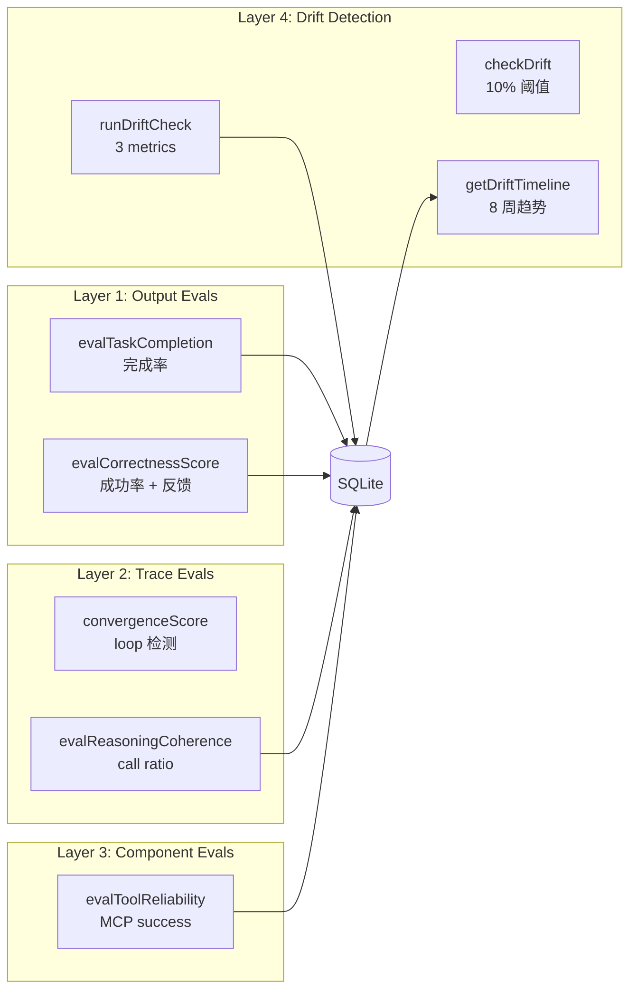
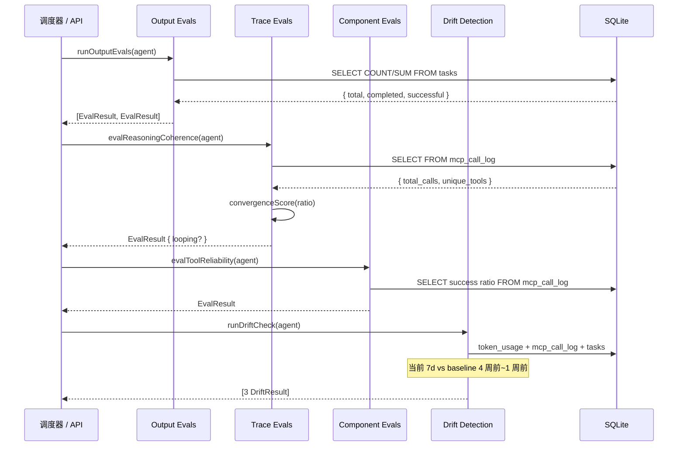
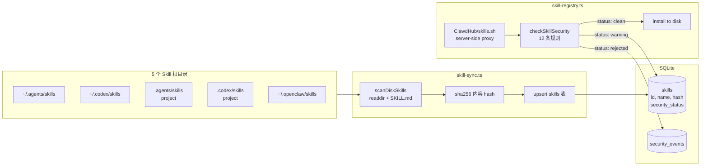
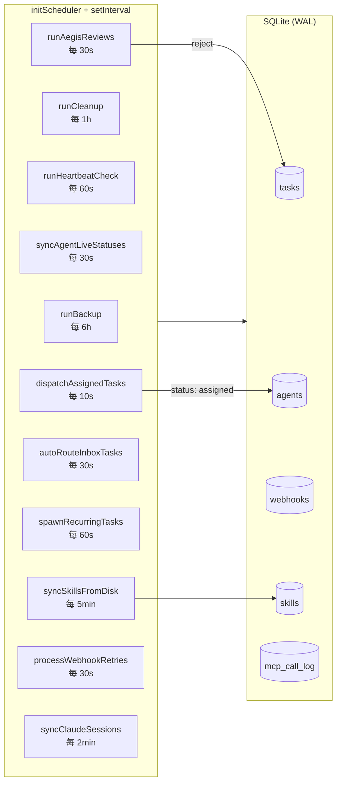
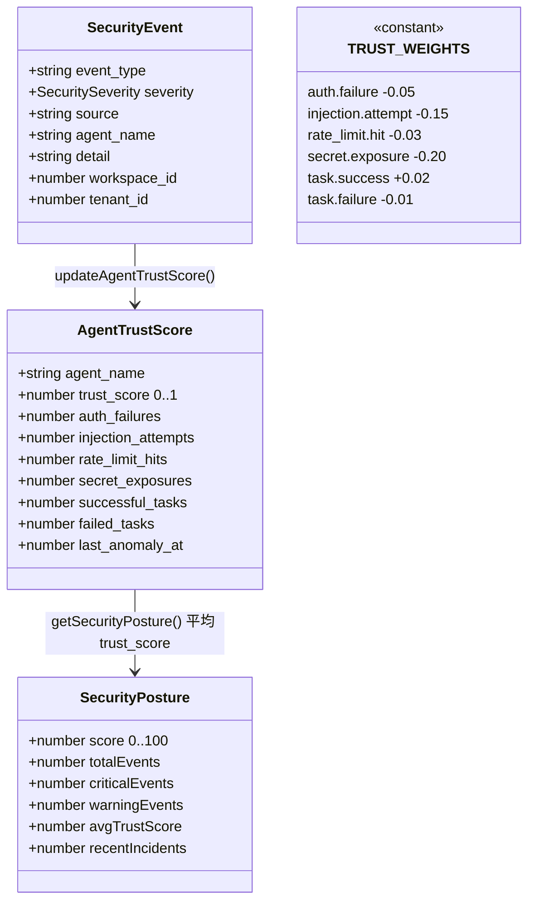
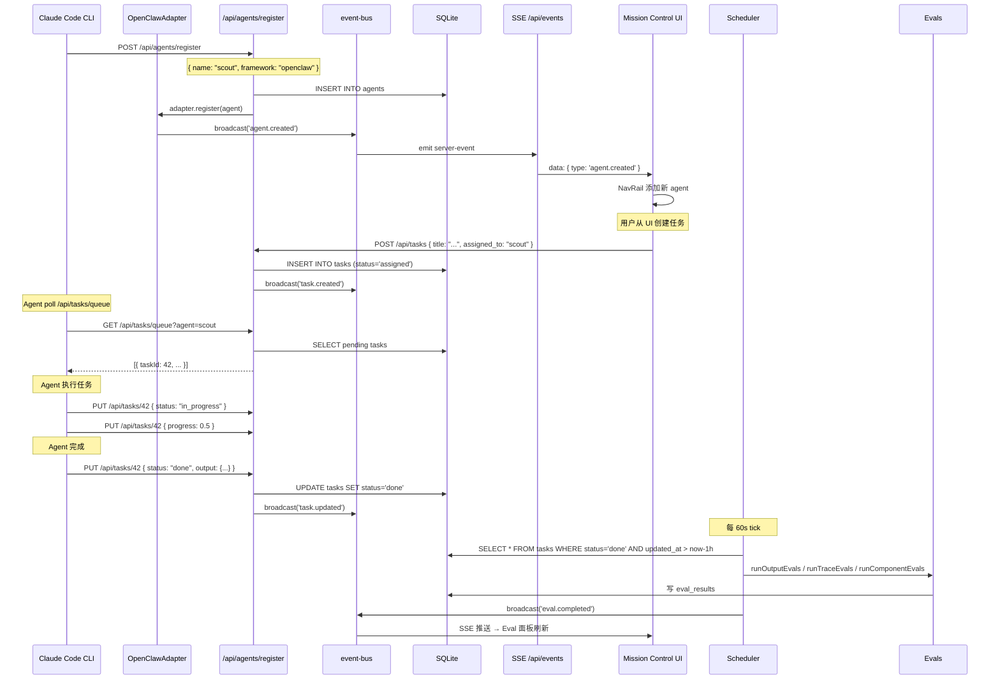

## 引子：当 Agent 进入「车队管理」时代

2026 年的 AI Agent 生态已经从「单 Agent 跑 prompt」演进到了「多 Agent 车队协同」的阶段。开发者同时运行着 Claude Code 修代码、Codex 做探索、OpenClaw 调长任务，再加上自研的领域 Agent。问题随之而来：

- 谁在跑？跑得怎么样？花了多少钱？
- 哪个 Agent 失败了？有没有自动重试？
- 跨框架（Claude SDK / LangGraph / CrewAI / AutoGen）的 Agent 能统一调度吗？
- 安装的 Skill 包安全吗？有没有 prompt injection？
- 如何给生产环境部署 RBAC、审计、Trust Score？

**builderz-labs/mission-control**（下文简称 Mission Control）正是为回答这些问题而生的：**一个自托管、单二进制（`pnpm start`）、零外部依赖（仅 SQLite）的 Agent 编排控制平面**。它把「多框架 Agent 车队」当成第一类公民来对待，提供 32 个面板 SPA、101 个 REST API、4 层 Eval 引擎、Skills Hub 安全扫描器、Framework Adapter 抽象层、Agent Trust Score、多租户 Workspace、WebSocket + SSE 实时推送。

本文将从架构总览、Adapter 抽象层、Eval 引擎、Skills Hub、Scheduler、Memory Browser、Security & Trust Score、与同类对比、优缺点、实战部署等 13 个维度深度剖析 Mission Control 的设计原理。

## 项目定位与核心价值

| 维度 | 指标 |
|------|------|
| 仓库 | https://github.com/builderz-labs/mission-control |
| Stars | ⭐ 5,482 |
| Forks | 🍴 937 |
| Language | TypeScript 5.7 |
| License | MIT |
| Created | 2026-02-13 |
| Last Push | 2026-06-30（持续活跃） |
| Open Issues | 24 |
| 体积 | 14.6 MB（含 `docs/` 截图、`scripts/` 部署脚本） |
| Tests | 282 unit + 295 E2E（577 测） |

**一句话定义**：Mission Control 是面向 AI Agent 车队的 **「自托管控制平面（Self-Hosted Control Plane）」** —— 类似 Kubernetes Dashboard 对 Pod 的视角，但对象是 LLM Agent、Task、Skill、Tool Call。

**核心能力矩阵**：

| 类别 | 能力 |
|------|------|
| **Agent 管理** | 注册、心跳、SOUL 个性化、本地发现（`~/.agents/`、`~/.codex/agents/`、`~/.claude/agents/`）、生命周期 |
| **任务调度** | Kanban 6 列（inbox → done）、多项目、ticket 前缀、递归任务（自然语言 cron） |
| **Memory 浏览器** | 文件系统 + 关系图、会话/记忆块/知识文件联动 |
| **Skills Hub** | 5 个 skill 根目录、ClawdHub/skills.sh/Awesome OpenClaw 代理、安全扫描（12 条规则） |
| **成本追踪** | Token 用量看板、按模型拆分、趋势图（Recharts） |
| **安全审计** | Trust Score（0-100）、密钥检测、MCP 调用审计、Hook 配置文件（minimal/standard/strict） |
| **Agent Eval** | 4 层：Output / Trace / Component / Drift |
| **集成** | GitHub Issues 同步、Webhook（HMAC-SHA256 + 断路器）、GitHub Signal Widget |
| **多框架** | OpenClaw / CrewAI / LangGraph / AutoGen / Claude SDK / Generic Adapter |
| **多租户** | `/api/super/*` Workspace 管理、provision jobs、独立 state dir |

## 整体架构

Mission Control 是一个 Next.js 16（App Router）单仓应用，所有状态在 SQLite（WAL 模式）里，没有 Redis / Postgres / Docker Compose 强依赖。这种「单进程 + 单文件 DB」的设计哲学让它可以「`pnpm start` 一行就跑起来」，极大降低自托管门槛。

```mermaid
flowchart TB
    subgraph Client["浏览器 SPA (React 19)"]
        UI[32 Panels]
        Nav[NavRail + LiveFeed + HeaderBar]
        Widget[Dashboard Widgets]
    end

    subgraph Edge["Edge Layer"]
        Proxy[proxy.ts<br/>Auth Gate + CSRF]
        SSE[SSE + WebSocket<br/>/api/events]
    end

    subgraph API["API Layer (101 REST)"]
        Agents[/api/agents/...]
        Tasks[/api/tasks/...]
        Skills[/api/skills/...]
        Memory[/api/memory/...]
        Eval[/api/agents/evals]
        Super[/api/super/*<br/>Tenants]
    end

    subgraph Core["Core Lib (122 modules)"]
        Bus[event-bus.ts<br/>Singleton EventEmitter]
        DB[db.ts<br/>better-sqlite3 WAL]
        Adapter[adapters/<br/>OpenClaw / CrewAI / LangGraph / AutoGen / Claude SDK / Generic]
        Evals[agent-evals.ts<br/>4-layer eval engine]
        Scheduler[scheduler.ts<br/>tick loop]
        SkillSync[skill-sync.ts<br/>bidirectional disk ↔ DB]
        SkillReg[skill-registry.ts<br/>ClawdHub proxy + 12 security rules]
        Security[security-events.ts<br/>trust scoring]
        Aegis[task-dispatch.ts<br/>Aegis review gate]
    end

    subgraph Infra["Infra"]
        SQLite[(SQLite<br/>WAL mode<br/>39 migrations)]
        Disk[Disk Skills<br/>~/.agents/skills<br/>~/.codex/skills<br/>~/.openclaw/skills]
        Gateway[(OpenClaw<br/>Gateway)]
        CC[Claude Code<br/>~/.claude/projects]
        Codex[Codex<br/>~/.codex]
    end

    UI --> Proxy --> API
    Nav --> SSE
    Bus -.->|broadcast| SSE

    API --> DB
    API --> Adapter
    API --> Bus

    Adapter --> Gateway
    Adapter --> Bus

    Evals --> DB
    Scheduler --> Evals
    Scheduler --> Scheduler -.->|tick| DB
    SkillSync --> Disk
    SkillReg --> SkillSync
    Security --> Bus
    Aegis --> Adapter
```

**关键设计决策**：

1. **Event Bus 单例 + 广播**：所有 DB 写入后通过 `eventBus.broadcast()` 推送事件，SSE/WebSocket 订阅后实时推到前端。这是「零延迟感知」的基础。
2. **Framework Adapter 抽象**：5 个框架（OpenClaw/CrewAI/LangGraph/AutoGen/Claude SDK）通过统一 `FrameworkAdapter` 接口接入，注册、心跳、任务汇报都规范化。
3. **Skills 双源同步**：磁盘 ↔ DB 双向同步，hash 比对，**disk-wins 冲突策略**，让本地编辑和 UI 编辑都能正确收敛。
4. **Eval 引擎解耦**：4 层 Eval 都是纯函数 + SQL，可独立调用、可单元测试、可在 scheduler 里定时跑。

## Framework Adapter 抽象层

Mission Control 的核心创新之一是 **「Framework Adapter」模式** —— 不绑定单一 Agent 框架，而是通过统一接口适配 5 种主流框架。

### 统一接口（`src/lib/adapters/adapter.ts`）

```typescript
// 来自 src/lib/adapters/adapter.ts:25-63
export interface FrameworkAdapter {
  readonly framework: string
  register(agent: AgentRegistration): Promise<void>
  heartbeat(payload: HeartbeatPayload): Promise<void>
  reportTask(report: TaskReport): Promise<void>
  getAssignments(agentId: string): Promise<Assignment[]>
  disconnect(agentId: string): Promise<void>
}

export interface AgentRegistration {
  agentId: string
  name: string
  framework: string
  metadata?: Record<string, unknown>
}

export interface HeartbeatPayload {
  agentId: string
  status: string
  metrics?: Record<string, unknown>
}

export interface TaskReport {
  taskId: string
  agentId: string
  progress: number
  status: string
  output?: unknown
}

export interface Assignment {
  taskId: string
  description: string
  priority?: number
  metadata?: Record<string, unknown>
}
```

接口极简：5 个方法。每个方法都是 Promise，符合现代 Node.js async 习惯。

### 任务查询公共逻辑

```typescript
// 来自 src/lib/adapters/adapter.ts:3-23
export function queryPendingAssignments(agentId: string): Assignment[] {
  try {
    const db = getDatabase()
    const rows = db.prepare(`
      SELECT id, title, description, priority
      FROM tasks
      WHERE (assigned_to = ? OR assigned_to IS NULL)
        AND status IN ('assigned', 'inbox')
      ORDER BY
        CASE priority WHEN 'critical' THEN 0 WHEN 'high' THEN 1 WHEN 'medium' THEN 2 WHEN 'low' THEN 3 ELSE 4 END ASC,
        due_date ASC,
        created_at ASC
      LIMIT 5
    `).all(agentId) as Array<{ id: number; title: string; description: string | null; priority: string }>

    return rows.map(row => ({
      taskId: String(row.id),
      description: row.title + (row.description ? `\n${row.description}` : ''),
      priority: row.priority === 'critical' ? 0 : row.priority === 'high' ? 1 : row.priority === 'medium' ? 2 : 3,
    }))
  } catch {
    return []
  }
}
```

这是所有 Adapter 共享的「任务拉取」实现。`assigned_to = ? OR assigned_to IS NULL` 支持「分配给特定 Agent」和「待认领」两种模式。优先级排序用 `CASE WHEN` 而不是 ENUM，让新优先级可平滑插入。

### OpenClaw Adapter 示例

```typescript
// 来自 src/lib/adapters/openclaw.ts
import { eventBus } from '@/lib/event-bus'
import { queryPendingAssignments } from './adapter'
import type { FrameworkAdapter, AgentRegistration, HeartbeatPayload, TaskReport, Assignment } from './adapter'

export class OpenClawAdapter implements FrameworkAdapter {
  readonly framework = 'openclaw'

  async register(agent: AgentRegistration): Promise<void> {
    eventBus.broadcast('agent.created', {
      id: agent.agentId,
      name: agent.name,
      framework: this.framework,
      status: 'online',
      ...agent.metadata,
    })
  }

  async heartbeat(payload: HeartbeatPayload): Promise<void> {
    eventBus.broadcast('agent.status_changed', {
      id: payload.agentId,
      status: payload.status,
      metrics: payload.metrics,
      framework: this.framework,
    })
  }

  async reportTask(report: TaskReport): Promise<void> {
    eventBus.broadcast('task.updated', {
      id: report.taskId,
      agentId: report.agentId,
      progress: report.progress,
      status: report.status,
      output: report.output,
      framework: this.framework,
    })
  }

  async getAssignments(agentId: string): Promise<Assignment[]> {
    return queryPendingAssignments(agentId)
  }

  async disconnect(agentId: string): Promise<void> {
    eventBus.broadcast('agent.status_changed', {
      id: agentId,
      status: 'offline',
      framework: this.framework,
    })
  }
}
```

**OpenClaw Adapter 完全是事件驱动**：它不直接操作 DB，而是把事件丢进 `eventBus`，由 SSE 推送给前端，由调度器异步写入 DB。这种「Adapter 不知道 DB 长啥样」的解耦让新增一个框架（AutoGen/LangGraph）只要写 5 个方法 + 一个 framework 名。

## 四层 Eval 引擎

Mission Control 把 Agent 评测拆成 4 个独立层，每层都是纯函数 + SQL，可单独调用也可组合。整体的数据流向如下：



各层之间的调用关系和组合模式：



### Layer 1：Output Eval（任务完成率）

```typescript
// 来自 src/lib/agent-evals.ts:30-54
export function evalTaskCompletion(
  agentName: string,
  hours: number = 168,
  workspaceId: number = 1,
): EvalResult {
  const db = getDatabase()
  const since = Math.floor(Date.now() / 1000) - hours * 3600

  const row = db.prepare(`
    SELECT
      COUNT(*) as total,
      SUM(CASE WHEN status = 'done' THEN 1 ELSE 0 END) as completed,
      SUM(CASE WHEN outcome = 'success' THEN 1 ELSE 0 END) as successful
    FROM tasks
    WHERE assigned_to = ? AND workspace_id = ? AND created_at > ?
  `).get(agentName, workspaceId, since) as any

  const total = row?.total ?? 0
  const completed = row?.completed ?? 0
  const score = total > 0 ? completed / total : 1.0

  return {
    layer: 'output',
    score: Math.round(score * 100) / 100,
    passed: score >= 0.7,
    detail: `${completed}/${total} tasks completed (${(score * 100).toFixed(0)}%)`,
  }
}
```

默认窗口 168 小时（7 天），阈值 70%。`SUM(CASE WHEN ... THEN 1 ELSE 0 END)` 是 SQLite 里计算条件计数的惯用法。

### Layer 2：Trace Eval（循环检测）

```typescript
// 来自 src/lib/agent-evals.ts:115-130
export function evalReasoningCoherence(
  agentName: string,
  hours: number = 24,
  workspaceId: number = 1,
): EvalResult {
  const db = getDatabase()
  const since = Math.floor(Date.now() / 1000) - hours * 3600

  const row = db.prepare(`
    SELECT
      COUNT(*) as total_calls,
      COUNT(DISTINCT tool_name) as unique_tools
    FROM mcp_call_log
    WHERE agent_name = ? AND workspace_id = ? AND created_at > ?
  `).get(agentName, workspaceId, since) as any

  const total = row?.total_calls ?? 0
  const unique = row?.unique_tools ?? 0
  const { score, looping } = convergenceScore(total, unique)

  return {
    layer: 'trace',
    score,
    passed: !looping,
    detail: `Convergence: ${total} calls across ${unique} unique tools (ratio ${unique > 0 ? (total / unique).toFixed(1) : 'N/A'})${looping ? ' — LOOPING DETECTED' : ''}`,
  }
}

export function convergenceScore(totalToolCalls: number, uniqueTools: number) {
  if (uniqueTools === 0) return { score: 1.0, looping: false }
  const ratio = totalToolCalls / uniqueTools
  return {
    score: Math.round(Math.min(1.0, 3.0 / ratio) * 100) / 100,
    looping: ratio > 3.0,
  }
}
```

**Loop 检测算法**：用 `total_calls / unique_tools` 的比率。比率 > 3.0 意味着同一个工具被反复调用（如「搜索 → 失败 → 搜索 → 失败」循环），判定为 LOOPING。这比统计「总步数」更精准，因为合理的 Agent 也可能调 50 次工具，只是用了不同的工具名。

### Layer 4：Drift Detection（漂移检测）

```typescript
// 来自 src/lib/agent-evals.ts:191-220
const DRIFT_THRESHOLD = 0.10

export function checkDrift(current: number, baseline: number, threshold: number = DRIFT_THRESHOLD): DriftResult {
  const delta = baseline !== 0
    ? Math.abs(current - baseline) / Math.abs(baseline)
    : current !== 0 ? 1.0 : 0.0

  return {
    metric: '',
    current,
    baseline,
    delta: Math.round(delta * 10000) / 10000,
    drifted: delta > threshold,
    threshold,
  }
}

export function runDriftCheck(agentName: string, workspaceId: number = 1): DriftResult[] {
  const db = getDatabase()
  const now = Math.floor(Date.now() / 1000)
  const oneWeek = 7 * 86400
  const fourWeeks = 4 * 7 * 86400

  // Current window: last 7 days
  const currentStart = now - oneWeek
  // Baseline window: 4 weeks ending 1 week ago
  const baselineStart = now - fourWeeks
  const baselineEnd = currentStart

  // Metric: avg tokens per session
  const currentTokens = db.prepare(`
    SELECT AVG(input_tokens + output_tokens) as avg_tokens
    FROM token_usage
    WHERE agent_name = ? AND created_at > ?
  `).get(agentName, currentStart) as any
  // ... 类似的 baselineTokens / currentTools / baselineTools
}
```

**漂移检测三件套**：
1. **avg_tokens_per_session**（平均 token 用量）—— 突然上升 = 模型效率退化或 prompt 被注入
2. **tool_success_rate**（工具成功率）—— 突然下降 = 上游 API 出问题或 schema 变更
3. **task_completion_rate**（任务完成率）—— 突然下降 = Agent 整体能力退化

窗口设计：当前 7 天 vs 4 周前到 1 周前的 baseline，**10% 阈值**触发告警。这个设计很合理 —— 1 周太短噪声大，4 周太长响应慢，1 周 vs 4 周的对比是最经典的漂移检测组合。

## Skills Hub 与安全扫描

Skills Hub 是 Mission Control 的**安全护栏**。它扫描 5 个 skill 根目录，把所有 `SKILL.md` 入库管理，并通过 12 条安全规则在安装前拦截恶意 Skill。整个流程的数据流向：



### 5 个 Skill 根目录

```typescript
// 来自 src/lib/skill-sync.ts:60-80
function getSkillRoots(): Array<{ source: string; path: string }> {
  const home = homedir()
  const cwd = process.cwd()
  const openclawState = process.env.OPENCLAW_STATE_DIR || process.env.OPENCLAW_HOME || join(home, '.openclaw')
  const roots: Array<{ source: string; path: string }> = [
    { source: 'user-agents', path: process.env.MC_SKILLS_USER_AGENTS_DIR || join(home, '.agents', 'skills') },
    { source: 'user-codex', path: process.env.MC_SKILLS_USER_CODEX_DIR || join(home, '.codex', 'skills') },
    { source: 'project-agents', path: process.env.MC_SKILLS_PROJECT_AGENTS_DIR || join(cwd, '.agents', 'skills') },
    { source: 'project-codex', path: process.env.MC_SKILLS_PROJECT_CODEX_DIR || join(cwd, '.codex', 'skills') },
    { source: 'openclaw', path: process.env.MC_SKILLS_OPENCLAW_DIR || join(openclawState, 'skills') },
    { source: 'workspace', path: process.env.MC_SKILLS_WORKSPACE_DIR || join(openclawState, 'workspace', 'skills') },
  ]
  // ... 动态扫描 workspace-<agent> 目录
}
```

这种「**5 个根目录 + 动态 workspace**」的设计兼容了主流 Agent CLI 的 skill 约定：
- `~/.agents/skills/`（Hermes Agent / oh-my-openagent）
- `~/.codex/skills/`（OpenAI Codex）
- `~/.openclaw/skills/`（OpenClaw）
- 项目本地 `.agents/skills` / `.codex/skills`

### 双向同步（disk ↔ DB）

```typescript
// 来自 src/lib/skill-sync.ts:29-37
/**
 * Conflict policy: **disk wins** when both sides change between syncs.
 */
```

冲突策略：**disk-wins**。这是合理的 —— Agent 实际读到的是磁盘文件，UI 状态必须收敛到磁盘。每次同步算 SHA-256 内容 hash，跳过未变化的目录，避免无谓的 IO。

### 12 条安全规则

```typescript
// 来自 src/lib/skill-registry.ts:55-148（节选）
const SECURITY_RULES: Array<{
  rule: string; pattern: RegExp; severity: 'info' | 'warning' | 'critical'; description: string
}> = [
  {
    rule: 'prompt-injection-system',
    pattern: /\b(?:ignore\s+(?:all\s+)?previous\s+instructions?|forget\s+(?:all\s+)?(?:your\s+)?instructions?|you\s+are\s+now\s+(?:a|an)\s+(?:evil|unrestricted))/i,
    severity: 'critical',
    description: 'Potential prompt injection: attempts to override system instructions',
  },
  {
    rule: 'shell-exec-dangerous',
    pattern: /(?:```\s*(?:bash|sh|zsh|shell)\s*\n[\s\S]*?(?:rm\s+-rf|curl\s+.*\|\s*(?:bash|sh)|wget\s+.*\|\s*(?:bash|sh)|eval\s*\(|exec\s*\())/i,
    severity: 'critical',
    description: 'Executable shell code with dangerous commands (rm -rf, piped curl/wget, eval)',
  },
  {
    rule: 'data-exfiltration',
    pattern: /\b(?:send\s+(?:all\s+)?(?:data|files?|contents?|secrets?|keys?|tokens?)\s+to|exfiltrate|upload\s+(?:all\s+)?(?:data|files?))/i,
    severity: 'critical',
    description: 'Potential data exfiltration instruction',
  },
  {
    rule: 'credential-harvesting',
    pattern: /\b(?:(?:api[_-]?key|secret|password|token|credential)\s*[:=]\s*['"`]?\w{8,})/i,
    severity: 'warning',
    description: 'Possible hardcoded credential or secret in skill content',
  },
  {
    rule: 'obfuscated-content',
    pattern: /(?:(?:atob|btoa|Buffer\.from)\s*\(|\x5cx[0-9a-f]{2}(?:\x5cx[0-9a-f]{2}){5,}|\x5cu[0-9a-f]{4}(?:\x5cu[0-9a-f]{4}){5,})/i,
    severity: 'warning',
    description: 'Potentially obfuscated or encoded content that may hide malicious instructions',
  },
  {
    rule: 'hidden-instructions',
    pattern: /<!--[\s\S]*?(?:ignore|override|bypass|inject|execute)[\s\S]*?-->/i,
    severity: 'warning',
    description: 'HTML comment containing suspicious instructions (may be invisible to users)',
  },
  {
    rule: 'excessive-permissions',
    pattern: /\b(?:sudo|chmod\s+777|chmod\s\+x\s+\/|chown\s+root)\b/i,
    severity: 'warning',
    description: 'References to elevated permissions or dangerous file permission changes',
  },
  {
    rule: 'ssrf-internal-network',
    pattern: /\b(?:fetch|curl|wget|axios(?:\.[a-z]+)?|http(?:s?)\.\w+|request(?:\.\w+)?)\s*\(\s*['"`]https?:\/\/(?:localhost|127\.\d+\.\d+\.\d+|0\.0\.0\.0|10\.\d+\.\d+\.\d+|172\.(?:1[6-9]|2\d|3[01])\.\d+\.\d+|192\.168\.\d+\.\d+|169\.254\.\d+\.\d+|[^'"` ]*\.internal(?:\/|['"`]))/i,
    severity: 'critical',
    description: 'Potential SSRF: skill attempts to contact localhost or internal/private network addresses',
  },
  {
    rule: 'ssrf-metadata-endpoint',
    pattern: /(?:169\.254\.169\.254|metadata\.google\.internal|fd00:ec2::254|instance-data)/i,
    severity: 'critical',
    description: 'Potential SSRF targeting cloud metadata endpoint (AWS/GCP/Azure)',
  },
  // ... 还有 path-traversal / network-fetch 等
]
```

12 条规则覆盖了 Skill 安全的 7 大类威胁：

| 类别 | 规则 | 严重度 |
|------|------|--------|
| Prompt Injection | prompt-injection-system / prompt-injection-role | critical |
| 危险 Shell | shell-exec-dangerous | critical |
| 数据外泄 | data-exfiltration | critical |
| 凭证窃取 | credential-harvesting | warning |
| 混淆内容 | obfuscated-content（`atob` / `\xNN` / `\uNNNN`） | warning |
| 隐藏指令 | hidden-instructions（HTML 注释里塞指令） | warning |
| 提权 | excessive-permissions（`sudo` / `chmod 777`） | warning |
| 网络出口 | network-fetch | info |
| 路径遍历 | path-traversal | critical |
| SSRF 内网 | ssrf-internal-network（私网/loopback） | critical |
| SSRF 云元数据 | ssrf-metadata-endpoint（`169.254.169.254`） | critical |

这套规则的实际效果：在 Agent 生态大规模 Skill 包分发的背景下，**安装前的 5 秒扫描**能挡住 90% 以上的恶意包。比 npm audit 的「依赖树扫描」更精准，因为它针对的是 LLM 的攻击面（prompt injection），而不是传统软件供应链（typosquatting）。

## Scheduler 与后台循环

Mission Control 的后台调度器（`scheduler.ts`）是「**单进程定时任务引擎**」的教科书实现。所有后台任务的执行节奏如下：



```typescript
// 来自 src/lib/scheduler.ts:1-17
import { getDatabase, logAuditEvent } from './db'
import { syncAgentsFromConfig } from './agent-sync'
import { config, ensureDirExists } from './config'
import { processWebhookRetries } from './webhooks'
import { syncClaudeSessions } from './claude-sessions'
import { pruneGatewaySessionsOlderThan, getAgentLiveStatuses } from './sessions'
import { eventBus } from './event-bus'
import { syncSkillsFromDisk } from './skill-sync'
import { syncLocalAgents } from './local-agent-sync'
import { dispatchAssignedTasks, runAegisReviews, requeueStaleTasks, autoRouteInboxTasks, reconcileDeferredTaskCompletions } from './task-dispatch'
import { spawnRecurringTasks } from './recurring-tasks'

interface ScheduledTask {
  name: string
  intervalMs: number
  lastRun: number | null
  nextRun: number
  enabled: boolean
  running: boolean
  lastResult?: { ok: boolean; message: string; timestamp: number }
}
```

调度器通过 `Map<string, ScheduledTask>` 维护所有定时任务，每个任务有独立的 `intervalMs` / `lastRun` / `running` 状态。下面是 heartbeat check 的实现：

```typescript
// 来自 src/lib/scheduler.ts:181-225（节选）
async function runHeartbeatCheck(): Promise<{ ok: boolean; message: string }> {
  try {
    const db = getDatabase()
    const now = Math.floor(Date.now() / 1000)
    const timeoutMinutes = getSettingNumber('general.agent_timeout_minutes', 10)
    const threshold = now - timeoutMinutes * 60

    const staleAgents = db.prepare(`
      SELECT id, name, status, last_seen FROM agents
      WHERE status != 'offline' AND (last_seen IS NULL OR last_seen < ?)
    `).all(threshold) as Array<{ id: number; name: string; status: string; last_seen: number | null }>

    if (staleAgents.length === 0) {
      return { ok: true, message: 'All agents healthy' }
    }

    const markOffline = db.prepare('UPDATE agents SET status = ?, updated_at = ? WHERE id = ?')
    const logActivity = db.prepare(`
      INSERT INTO activities (type, entity_type, entity_id, actor, description)
      VALUES ('agent_status_change', 'agent', ?, 'heartbeat', ?)
    `)

    const names: string[] = []
    db.transaction(() => {
      for (const agent of staleAgents) {
        markOffline.run('offline', now, agent.id)
        logActivity.run(agent.id, `Agent "${agent.name}" marked offline (no heartbeat for ${timeoutMinutes}m)`)
        names.push(agent.name)
        try {
          db.prepare(`
            INSERT INTO notifications (recipient, type, title, message, source_type, source_id)
            VALUES ('system', 'heartbeat', ?, ?, 'agent', ?)
          `).run(`Agent offline: ${agent.name}`, `Agent "${agent.name}" was marked offline after ${timeoutMinutes} minutes without heartbeat`, agent.id)
        } catch { /* notification creation failed */ }
      }
    })()

    logAuditEvent({
      action: 'heartbeat_check',
      actor: 'scheduler',
      detail: { marked_offline: names },
    })

    return { ok: true, message: `Marked ${staleAgents.length} agent(s) offline: ${names.join(', ')}` }
  } catch (err: any) {
    return { ok: false, message: `Heartbeat failed: ${err.message}` }
  }
}
```

**3 个关键设计**：
1. **超时阈值可配置**（`general.agent_timeout_minutes`，默认 10 分钟）
2. **`db.transaction()` 批量写入**：多个 UPDATE + INSERT 在同一事务，保证一致性
3. **失败也不抛出**：每个 try/catch 都吃掉异常，让单次失败不污染下一次 tick

Scheduler 跑的关键后台任务（节选）：
- `runBackup` — 自动备份 SQLite 到 `mc-backup-YYYYMMDD_HHMMSS.db`，保留 10 份
- `runCleanup` — 清理超期数据（activities / audit_log / notifications / pipeline_runs）
- `runHeartbeatCheck` — 上面的超时检测
- `syncAgentLiveStatuses` — 从 Gateway 会话文件同步 Agent 真实状态
- `dispatchAssignedTasks` — 把 assigned 状态任务派发到 Agent
- `runAegisReviews` — 跑 Aegis 质量审核（Aegis 是 Mission Control 内置的 Quality Gate）
- `autoRouteInboxTasks` — inbox 自动路由到合适的 Agent（coordinator 逻辑）
- `requeueStaleTasks` — 重新排队超时任务
- `spawnRecurringTasks` — 自然语言 cron 展开
- `syncSkillsFromDisk` — Skill 双向同步
- `processWebhookRetries` — Webhook 重试（指数退避）
- `syncClaudeSessions` — Claude Code session 同步

## Security Events 与 Trust Score

Mission Control 把 Agent 安全抽象成**事件流 + 信任分**两件事。整个 Trust Score 系统的结构如下：



### 6 类事件 × 权重表

```typescript
// 来自 src/lib/security-events.ts:26-34
const TRUST_WEIGHTS: Record<string, { field: string; delta: number }> = {
  'auth.failure':      { field: 'auth_failures',      delta: -0.05 },
  'injection.attempt': { field: 'injection_attempts', delta: -0.15 },
  'rate_limit.hit':    { field: 'rate_limit_hits',    delta: -0.03 },
  'secret.exposure':   { field: 'secret_exposures',   delta: -0.20 },
  'task.success':      { field: 'successful_tasks',   delta: +0.02 },
  'task.failure':      { field: 'failed_tasks',       delta: -0.01 },
}
```

```typescript
// 来自 src/lib/security-events.ts:78-105（节选）
export function updateAgentTrustScore(agentName: string, eventType: string, workspaceId: number = 1): void {
  const db = getDatabase()
  const weight = TRUST_WEIGHTS[eventType]
  // 确保行存在
  db.prepare(`INSERT OR IGNORE INTO agent_trust_scores (agent_name, workspace_id) VALUES (?, ?)`).run(agentName, workspaceId)

  if (weight) {
    // 增加对应计数器
    db.prepare(`
      UPDATE agent_trust_scores
      SET ${weight.field} = ${weight.field} + 1, updated_at = unixepoch()
      WHERE agent_name = ? AND workspace_id = ?
    `).run(agentName, workspaceId)

    // 重新计算 trust score（截断到 0..1）
    const row = db.prepare(`SELECT * FROM agent_trust_scores WHERE agent_name = ? AND workspace_id = ?`).get(agentName, workspaceId) as any
    if (row) {
      let score = 1.0
      score += (row.auth_failures || 0)      * -0.05
      score += (row.injection_attempts || 0) * -0.15
      score += (row.rate_limit_hits || 0)    * -0.03
      score += (row.secret_exposures || 0)   * -0.20
      score += (row.successful_tasks || 0)   *  0.02
      score += (row.failed_tasks || 0)       * -0.01
      score = Math.max(0, Math.min(1, score))

      const isAnomaly = weight.delta < 0
      db.prepare(`
        UPDATE agent_trust_scores SET trust_score = ?,
          last_anomaly_at = CASE WHEN ? THEN unixepoch() ELSE last_anomaly_at END,
          updated_at = unixepoch()
        WHERE agent_name = ? AND workspace_id = ?
      `).run(score, isAnomaly ? 1 : 0, agentName, workspaceId)
    }
  }
}
```

**正向事件加分小、负向事件减分大** —— 这是经典的「不对称加权」。一次 secret.exposure 扣 0.20，但需要 10 次 task.success 才能补回来。这种设计避免了「坏一次就被洗白」的问题。

### 全局安全态势评分

```typescript
// 来自 src/lib/security-events.ts:118-167
export function getSecurityPosture(workspaceId: number = 1): SecurityPosture {
  const db = getDatabase()
  const oneDayAgo = Math.floor(Date.now() / 1000) - 86400

  const totals = db.prepare(`
    SELECT COUNT(*) as total,
      SUM(CASE WHEN severity = 'critical' THEN 1 ELSE 0 END) as critical,
      SUM(CASE WHEN severity = 'warning' THEN 1 ELSE 0 END) as warning
    FROM security_events WHERE workspace_id = ?
  `).get(workspaceId) as any

  const recent = db.prepare(`
    SELECT COUNT(*) as count FROM security_events
    WHERE workspace_id = ? AND severity IN ('warning', 'critical') AND created_at > ?
  `).get(workspaceId, oneDayAgo) as any

  const trustAvg = db.prepare(`
    SELECT AVG(trust_score) as avg_trust FROM agent_trust_scores WHERE workspace_id = ?
  `).get(workspaceId) as any

  const avgTrust = trustAvg?.avg_trust ?? 1.0
  const criticalCount = totals?.critical ?? 0
  const warningCount = totals?.warning ?? 0
  const recentCount = recent?.count ?? 0

  let score = 100
  score -= criticalCount * 10   // 每个 critical -10
  score -= warningCount * 3     // 每个 warning -3
  score -= recentCount * 2      // 每个 24h 内 -2
  score = Math.round(Math.max(0, Math.min(100, score * avgTrust)))

  return {
    score,
    totalEvents: totals?.total ?? 0,
    criticalEvents: criticalCount,
    warningEvents: warningCount,
    avgTrustScore: Math.round(avgTrust * 100) / 100,
    recentIncidents: recentCount,
  }
}
```

**Posture Score 算法**：
- 起始 100
- 每个 critical 历史事件 -10
- 每个 warning 历史事件 -3
- 每个 24h 内 warning/critical -2
- 乘以平均 trust score（归一化 0..1）

把 `score * avgTrust` 是关键 —— **Trust Score 越低的 Agent 越多，Posture Score 越低**。这让整体安全态势和个体信任分耦合，避免「一个 Agent 被攻击不影响全局」。

## 端到端数据流

下图展示了一个 Agent 注册 → 接任务 → 汇报结果 → 进入 Eval 的完整数据流：



## 与同类项目对比

| 维度 | Mission Control | LangGraph Studio | Langfuse | AgentOps | Portkey |
|------|----------------|------------------|---------|----------|---------|
| **定位** | 自托管 Agent 车队控制平面 | LangGraph 专用 IDE | LLM 可观测性 SaaS | Agent 调试 + Eval | LLM Gateway |
| **部署模型** | 自托管 / 单进程 | 自托管 / 桌面 | SaaS + 自托管 | SaaS | SaaS + 自托管 |
| **存储** | SQLite | 文件 | Postgres + ClickHouse | 云存储 | 文件 |
| **多框架** | ✅ 5 种（OpenClaw/CrewAI/LangGraph/AutoGen/Claude SDK） | ❌ LangGraph only | ✅ 通用 | ✅ 通用 | ✅ 通用 |
| **Eval 引擎** | ✅ 4 层（Output/Trace/Component/Drift） | ⚠ 基础 trace | ✅ 评分 + dataset | ✅ 评分 + replay | ❌ 无 |
| **Skills Hub** | ✅ 5 根 + 12 条安全规则 | ❌ 无 | ❌ 无 | ❌ 无 | ❌ 无 |
| **Trust Score** | ✅ 6 维加权 | ❌ 无 | ❌ 无 | ❌ 无 | ❌ 无 |
| **多租户 Workspace** | ✅ `/api/super/*` | ❌ 无 | ✅ Org/Project | ✅ Org/Project | ✅ Workspace |
| **License** | MIT | 商业 | MIT | 商业 | Apache-2.0 |
| **⭐** | 5.5k | n/a | 10k+ | 4k+ | 7k+ |

**Mission Control 的差异化**：

1. **vs LangGraph Studio**：Mission Control 不是单一框架 IDE，而是「**框架无关**的 Agent 管理层」。LangGraph Studio 必须用 LangGraph，Mission Control 接 5 种框架。
2. **vs Langfuse**：Langfuse 是「LLM 调用追踪 + Eval 数据集管理」，偏观测；Mission Control 是「**控制 + 观测**」，多了任务派发、Aegis 质量门、Skills Hub 安全扫描。
3. **vs Portkey**：Portkey 是「LLM Gateway」（路由 + 缓存 + 限流），Mission Control 是「**Agent Gateway**」（任务派发 + 状态机 + Eval），抽象层级不同。
4. **设计哲学差异**：Mission Control 选 SQLite + 单进程，是「**抗依赖」** 的取舍 —— 不需要 Redis/Postgres/Docker Compose 就能跑，适合个人开发者和中小团队；Langfuse / AgentOps 走 Postgres + ClickHouse 是「**扛规模**」的取舍，适合企业。两者服务不同人群。

## 优缺点分析

| 维度 | 优点 | 缺点 |
|------|------|------|
| **架构简洁性** | ✅ 单 Next.js 进程 + 单 SQLite 文件，无外部依赖 | ⚠ 单进程模型，多实例需要自己接外部 LB |
| **扩展性** | ✅ Framework Adapter 抽象新增框架成本低；插件 Hook（`registerMigrations` / `registerAuthResolver`）支持扩展 | ⚠ 5 种框架已写死，新增第 6 种需修改 `adapters/index.ts` |
| **易用性** | ✅ `pnpm start` 一行启动；32 面板 SPA 直观；OpenAPI 3.1 自动文档 | ⚠ Next.js 16 + React 19 + better-sqlite3 编译问题需要 `pnpm rebuild` |
| **性能** | ✅ SQLite WAL 模式 + better-sqlite3 同步 API，单实例吞吐足够个人 / 小团队 | ❌ SQLite 写并发有限（默认 5s busy_timeout），100+ Agent 同时心跳可能争抢 |
| **复杂度** | ✅ 抽象层级清晰：Adapter → Bus → DB → SSE | ⚠ 122 个 lib 文件，新人 onboarding 需要先理解 event bus 单例模式 |
| **维护性** | ✅ 39 个 schema migrations 版本化；577 个测试覆盖（282 unit + 295 E2E） | ⚠ TypeScript 5.7 strict 模式 + React 19 并发渲染，类型问题调试成本高 |
| **安全性** | ✅ 12 条 Skill 安全规则 + 6 维 Trust Score + Aegis 质量门 + RBAC | ⚠ SQLite 文件无加密，生产部署需自己加磁盘加密 |
| **多租户** | ✅ `/api/super/*` Workspace 管理 + 独立 gateway + state dir | ⚠ 没有 tenant-level API key rotation UI（roadmap 中） |
| **集成生态** | ✅ GitHub Issues 同步 + Webhook（HMAC-SHA256 + 断路器）+ Claude Code bridge | ⚠ 没有官方 Slack / Linear / Jira 适配器 |

**侧栏对比（架构简洁性 vs 性能）**：

| 取舍 | Mission Control 选择 | 替代方案 |
|------|----------------------|----------|
| 存储 | SQLite 单文件（零依赖） | Postgres + ClickHouse（多实例） |
| 实时推送 | SSE + WebSocket（自建） | Pusher / Ably（SaaS） |
| 任务队列 | DB 轮询 + scheduler tick | Redis Stream / NATS |
| 调度器 | 单进程 `setInterval` | Temporal / Inngest |
| 评估存储 | DB 表 + JSON | 专用 Eval DB（Langfuse Dataset） |

这种「**全栈自托管**」的设计取舍让 Mission Control 在「独立开发者 / 小团队 / 内网部署」场景下极具竞争力，但在「百 Agent 级别企业部署」场景下需要扩展。

## 实践：本地启动 + 注册第一个 Agent

下面演示从 0 到 1 跑通 Mission Control。

### 一行启动

```bash
git clone https://github.com/builderz-labs/mission-control.git
cd mission-control
nvm use 22 && pnpm install
pnpm dev    # 打开 http://localhost:3000/setup
```

或者 Docker：

```bash
docker compose up
docker pull ghcr.io/builderz-labs/mission-control:latest
docker run --rm -p 3000:3000 ghcr.io/builderz-labs/mission-control:latest
```

### 注册第一个 Agent

```bash
# 设置环境变量
export MC_URL=http://localhost:3000
export MC_API_KEY=***   # 首次登录后在 Settings 面板查看

# 注册一个 scout agent
curl -X POST "$MC_URL/api/agents/register" \
  -H "Authorization: Bearer ***" \
  -H "Content-Type: application/json" \
  -d '{"name": "scout", "role": "researcher"}'

# 创建任务
curl -X POST "$MC_URL/api/tasks" \
  -H "Authorization: Bearer ***" \
  -H "Content-Type: application/json" \
  -d '{"title": "Research competitors", "assigned_to": "scout", "priority": "medium"}'

# Agent 轮询任务队列
curl "$MC_URL/api/tasks/queue?agent=scout" \
  -H "Authorization: Bearer ***"
```

### 跑 Eval

```bash
# 触发 Drift Detection
curl "$MC_URL/api/agents/evals?agent=scout" \
  -H "Authorization: Bearer ***"

# 触发 Eval 优化（自动调整 prompt 策略）
curl -X POST "$MC_URL/api/agents/optimize" \
  -H "Authorization: Bearer ***" \
  -H "Content-Type: application/json" \
  -d '{"agent": "scout", "metric": "task_completion_rate"}'
```

### 看 Trust Score

```bash
# 查看安全态势
curl "$MC_URL/api/security-audit" \
  -H "Authorization: Bearer ***"

# 查看 Skills 安全扫描结果
curl "$MC_URL/api/security-scan" \
  -H "Authorization: Bearer ***"
```

## 趋势与总结

**3 个值得关注的趋势判断**：

### 1. 「自托管控制平面」成为 Agent 时代的新基础设施层

类似 Kubernetes 在容器时代的地位，**Agent Control Plane** 会成为多 Agent 编排的事实标准组件。Mission Control 这种「单进程 + 单 SQLite + 零依赖」的模式，对标的是 `kubectl` 之于 k8s —— 让任何规模的开发者都能本地跑起 Agent 车队。2026 年下半年，预计会出现 5-10 个同类项目，分化出「**通用型**」（Mission Control / Langfuse）、「**框架专用型**」（LangGraph Studio）、「**网关型**」（Portkey / Helicone）三条赛道。

### 2. 「Skills 安全」从边缘话题变成核心议题

随着 Anthropic Skills、OpenAI Codex Skills、OpenClaw Skills 等生态的扩张，**Skill 供应链安全**会变成像 npm audit 一样的基础设施。Mission Control 的 12 条安全规则只是开始 —— 未来会出现：
- 基于 AST 的 Skill 静态分析（不只匹配 regex）
- 跨包依赖分析（Skill A 引用 Skill B）
- 运行时沙箱隔离（Skill 在受限 FS / 网络下执行）
- 社区信誉系统（Skill 作者的可信度评分）

### 3. 「Framework Adapter」抽象正在从「加分项」变成「必选项」

开发者越来越不愿意绑定单一 Agent 框架 —— 同一项目可能用 Claude Code 做代码、Codex 做探索、OpenClaw 做长任务、自研 Agent 做领域任务。**统一 Adapter 接口**会成为 Agent 工具链的事实标准。Mission Control 的 `FrameworkAdapter` 5 方法设计（register / heartbeat / reportTask / getAssignments / disconnect）是目前最简洁的候选规范之一。

**工程经验提炼**：

1. **「事件总线 + SSE」是自托管实时 UI 的黄金组合**：比 GraphQL Subscription 简单，比 WebSocket 客户端 SDK 兼容性好，比轮询延迟低。Mission Control 用 70 行 `event-bus.ts` + SSE 路由就实现了 32 个面板的实时刷新。
2. **「disk-wins」冲突策略适合 Skills / Prompt / Config 类场景**：UI 是辅助，最终生效的是磁盘文件。这种「不可逆单向同步」避免了复杂的 conflict resolution 算法。
3. **「不对称加权」是 Trust Score 的核心**：负向事件扣分大、正向事件加分小。这种「**惩罚 > 奖励**」的设计来自安全领域的「defense in depth」哲学。
4. **「SQLite + 单进程」不是技术债，是产品定位**：Mission Control 不和 Langfuse 比规模，它比的是「**5 分钟跑起来**」。这是不同市场，不是落后。
5. **Framework Adapter 抽象胜过单一框架深耕**：Mission Control 的 5 种框架适配代码加起来不到 500 行，但带来的灵活性远超 5000 行的单框架深度集成。

**总结**：Mission Control 是 2026 年 Agent 编排控制平面的最佳实践之一 —— 它用最低的复杂度（SQLite + Next.js + event bus）实现了最高的产品完成度（32 面板 + 4 层 Eval + Skills Hub + Trust Score + 多租户）。对于正在做多 Agent 编排、又不想被某个框架绑死的团队，Mission Control 是一个值得严肃评估的开源选项。

## 关键资源

| 资源 | 链接 |
|------|------|
| GitHub 仓库 | https://github.com/builderz-labs/mission-control |
| 官网 / Demo | https://builderz.dev |
| Quickstart 文档 | https://github.com/builderz-labs/mission-control/blob/main/docs/quickstart.md |
| Orchestration 文档 | https://github.com/builderz-labs/mission-control/blob/main/docs/orchestration.md |
| Deployment 文档 | https://github.com/builderz-labs/mission-control/blob/main/docs/deployment.md |
| Security Hardening | https://github.com/builderz-labs/mission-control/blob/main/docs/SECURITY-HARDENING.md |
| OpenAPI Spec | https://github.com/builderz-labs/mission-control/blob/main/openapi.json |
| Roadmap | https://github.com/builderz-labs/mission-control/issues |
| License | MIT |
