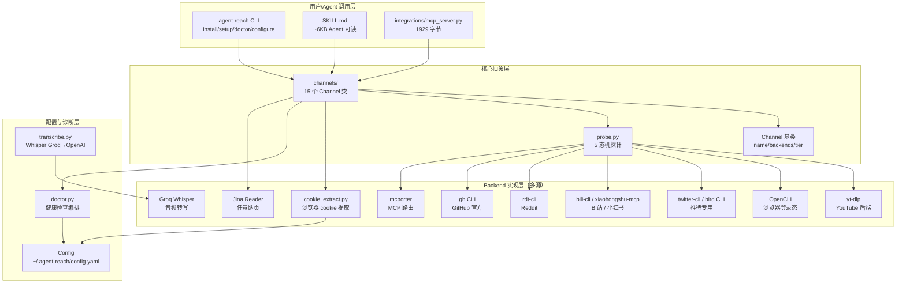
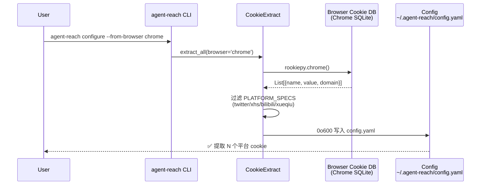
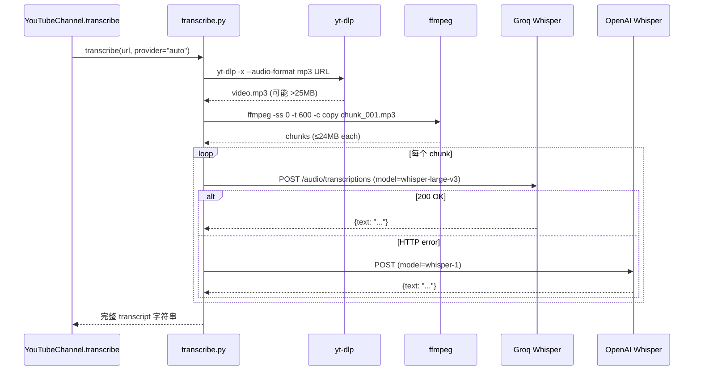
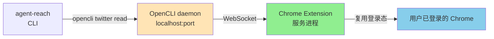
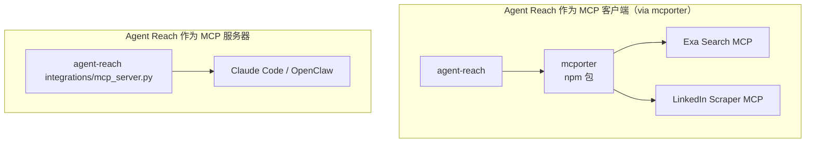
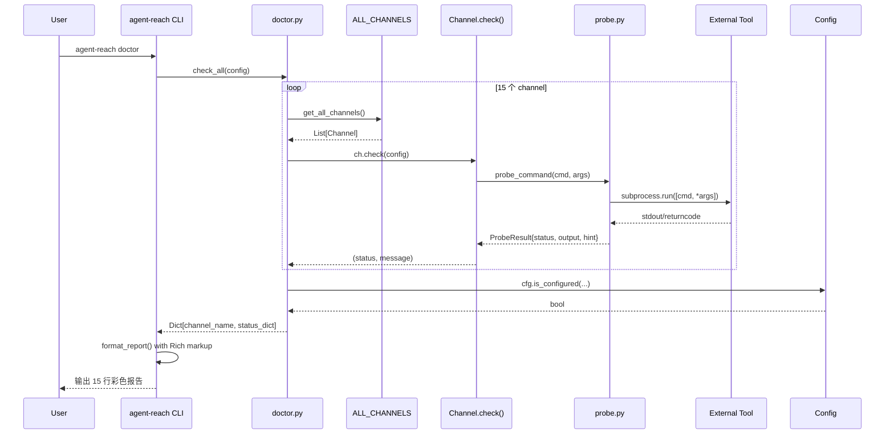

> **核心结论**：当 Claude Code、Cursor、OpenClaw 这些 Coding Agent 已经能写代码、改文档、管项目时，**它们对公网仍然是瞎子**——读不了推特、搜不了 Reddit、拿不到 B 站字幕、啃不下小红书风控。`Panniantong/Agent-Reach`（48,358 ⭐，2026-06-29 最新提交）用一套 **「Channel 注册表 + ordered backends 候选探活两段式 + probe 五态机 + Cookie 浏览器自动提取」** 组合拳，把「让 Agent 拥有互联网访问能力」从 15 个平台 × N 种工具的「Docker Compose 噩梦」**变成一条 `agent-reach install --env=auto` 命令**。这是 2026 年「Agent 互联网访问层」赛道**唯一**同时具备 4 类原语的开源实现：(a) 15 平台 × 多后端灾备 (b) 真实探活而非 which() 假阳性 (c) Cookie 自动从 Chrome 提取 (d) Whisper Groq→OpenAI 自动回退。

## 一、引子：当 Agent 走出 IDE，它对世界依然一无所知

我们做了一份 2026 年的 Agent 工具盘点：Cursor 能改文件、Claude Code 能跑测试、OpenClaw 能起服务。这些 Agent 在 IDE 围墙里是超人。

然后你让它做一件"很简单"的事：

- 📺「帮我看看这个 YouTube 教程讲了什么」→ **拿不到字幕**（YouTube 拦截未登录请求）
- 🐦「搜一下推特上大家怎么评价这个产品」→ **搜不了**（官方 API 要付费 100 美元/月）
- 📖「去 Reddit 上看看有没有人遇到过同样的 bug」→ **403 被封**（匿名 .json 已被 Reddit 全面拦截）
- 📕「看看小红书上这个品的口碑」→ **打不开**（必须登录才能看，IP 风控）
- 📺「B 站上有个技术视频，帮我总结一下」→ **拿不到**（通用下载工具被 B 站风控全面 412 拦截）
- 🔍「帮我在网上搜一下最新的 LLM 框架对比」→ **没有好用的搜索**（要么付费要么质量差）
- 🌐「帮我看看这个网页写了啥」→ **抓回来一堆 HTML 标签**，根本没法读
- 📦「这个 GitHub 仓库的 Issue 里说了什么？」→ 能用，但认证配置很麻烦
- 📡「帮我订阅这几个 RSS 源」→ 要自己装库写代码

**这些不难实现，但是需要自己折腾配置**。每个平台都有自己的门槛——要付费的 API、要绕过的封锁、要登录的账号、要清洗的数据。

`Agent Reach` 把这件事变成一句话：

```
帮我安装 Agent Reach：https://raw.githubusercontent.com/Panniantong/agent-reach/main/docs/install.md
```

复制给你的 Agent，几分钟后它就能读推特、搜 Reddit、看 YouTube、刷小红书了。

## 二、项目定位与核心价值

### 2.1 一句话定义

> **Agent Reach = AI Agent 的互联网访问适配层**。它不是另一个爬虫库，而是把"让 Agent 上网"这件事**抽象成 15 个 Channel + 6 种 Backend**，通过 doctor 健康检查、Cookie 自动提取、多后端灾备，让 Claude Code/Cursor/OpenClaw/任何能跑命令行的 Agent **零配置**接入 Twitter/YouTube/Reddit/Bilibili/小红书/雪球/V2EX 等平台。

### 2.2 仓库速览

| 字段 | 值 |
|------|----|
| 仓库 | `Panniantong/Agent-Reach` |
| Stars | **48,358** ⭐ |
| Forks | 3,848 |
| Open Issues | 116 |
| 主语言 | Python (100%) |
| 协议 | **MIT** |
| 最新提交 | 2026-06-29（持续活跃） |
| 创建日期 | 2026-02-24（5 个月从 0 到 48k ⭐） |
| 体积 | 1.5 MB（核心代码 + 文档） |
| Topics | agent-infrastructure, ai-agent, ai-search, claude-code, cursor, mcp, web-scraper, youtube-transcript, xiaohongshu, bilibili |
| 趋势 | Trendshift Top 50（GitHub 全球） |

### 2.3 能力矩阵

| 能力 | 实现方式 | 状态 |
|------|---------|------|
| **15 平台读取** | Channel 注册表（GitHub/Twitter/YouTube/Reddit/Bilibili/小红书/雪球/V2EX/小宇宙/LinkedIn/Facebook/Instagram/LinkedIn/Exa Search/RSS/Web） | ✅ |
| **多后端灾备** | 每个 Channel 配置 1~3 个 ordered backends，第一个 ok 获胜 | ✅ |
| **真实探活** | `probe_command()` 区分 5 种状态（ok/missing/broken/timeout/error），**不只依赖 which()** | ✅ |
| **Cookie 自动提取** | rookiepy / browser_cookie3，从 Chrome/Firefox/Edge/Brave/Opera 一键提取 | ✅ |
| **Whisper 转写** | Groq `whisper-large-v3` → OpenAI `whisper-1` 自动回退，ffmpeg 分片 | ✅ |
| **MCP 双向接入** | 自身是 `xiaohongshu-mcp` 等的客户端；同时通过 `mcporter` 接入 Exa/LinkedIn MCP | ✅ |
| **doctor 体检** | `agent-reach doctor` 一条命令看 15 渠道全状态 | ✅ |
| **装好即用 8 渠道** | Web(Jina Reader)/YouTube/GitHub/RSS/Exa Search/V2EX/Bilibili/基础 Web 抓取 | ✅ |
| **Tier 0/1/2 分级** | Tier 0=零配置，Tier 1=需要免费 Key/登录，Tier 2=需要付费 Key | ✅ |
| **健康检查容错** | 单个 channel 异常**不传染**整个 doctor 报告 | ✅ |

## 三、整体架构

Agent Reach 的核心架构可以概括为 **「Channel × Backend × Probe × Cookie」四象限**。CLI 是入口，Channel 是抽象，Backend 是实现，Probe 是探针，Cookie 是燃料。



### 3.1 仓库目录结构（核心 109 节点）

```
agent-reach/
├── agent_reach/                  # 核心代码包
│   ├── __init__.py              # 8 行：暴露 AgentReach
│   ├── core.py                  # 41 行：AgentReach 类
│   ├── cli.py                   # 1835 行：CLI 入口（install/doctor/configure）
│   ├── config.py                # 131 行：YAML 配置 + 0o600 权限保护
│   ├── cookie_extract.py        # 298 行：浏览器 Cookie 自动提取
│   ├── doctor.py                # 128 行：健康检查编排
│   ├── probe.py                 # 104 行：5 态机探针
│   ├── transcribe.py            # 319 行：Whisper Groq→OpenAI 回退
│   ├── channels/                # ⭐ 15 个 Channel 实现
│   │   ├── base.py              # 70 行：Channel 抽象基类
│   │   ├── __init__.py          # ALL_CHANNELS 注册表
│   │   ├── _opencli_site.py     # OpenCLI 通用站点
│   │   ├── bilibili.py          # 120 行
│   │   ├── exa_search.py        # 39 行
│   │   ├── facebook.py          # 13 行：复用 OpenCLISiteChannel
│   │   ├── github.py            # 42 行
│   │   ├── instagram.py         # 13 行：复用 OpenCLISiteChannel
│   │   ├── linkedin.py          # 43 行
│   │   ├── reddit.py            # 166 行
│   │   ├── rss.py               # 27 行
│   │   ├── twitter.py           # 146 行
│   │   ├── v2ex.py              # 215 行
│   │   ├── web.py               # 34 行：Jina Reader 兜底
│   │   ├── xiaohongshu.py       # 259 行
│   │   ├── xiaoyuzhou.py        # 64 行
│   │   ├── xueqiu.py            # 320 行
│   │   └── youtube.py           # 91 行
│   ├── backends/                # 跨 Channel 共享的后端封装
│   │   └── opencli.py           # 137 行：OpenCLI 状态探针
│   ├── integrations/            # 第三方集成
│   │   └── mcp_server.py        # 自身作为 MCP server
│   ├── utils/                   # 工具
│   │   ├── paths.py             # 路径管理
│   │   ├── process.py           # UTF-8 子进程环境
│   │   └── text.py              # 文本读取
│   ├── skill/                   # Agent 可读的 SKILL 描述
│   │   └── SKILL.md             # 6096 字节
│   ├── scripts/                 # 平台特定脚本
│   │   └── transcribe_xiaoyuzhou.sh
│   └── guides/                  # 平台配置指南
│       ├── setup-exa.md
│       ├── setup-groq.md
│       ├── setup-reddit.md
│       ├── setup-twitter.md
│       └── setup-xiaohongshu.md
├── docs/                        # 文档
├── tests/                       # 测试
└── pyproject.toml               # 打包
```

## 四、Channel 注册表：15 平台统一抽象

Agent Reach 最核心的设计是 **Channel 注册表**。每个平台是一个 `Channel` 子类，全局 `ALL_CHANNELS` 列表在 `channels/__init__.py` 中静态注册。`doctor.py` 通过遍历这个列表完成健康检查。

```python
# 来自 agent_reach/channels/__init__.py:25
ALL_CHANNELS: List[Channel] = [
    GitHubChannel(),
    TwitterChannel(),
    YouTubeChannel(),
    RedditChannel(),
    FacebookChannel(),
    InstagramChannel(),
    BilibiliChannel(),
    XiaoHongShuChannel(),
    LinkedInChannel(),
    XiaoyuzhouChannel(),
    V2EXChannel(),
    XueqiuChannel(),
    RSSChannel(),
    ExaSearchChannel(),
    WebChannel(),  # ⭐ 兜底渠道
]
```

### 4.1 Channel 基类：4 个字段 + 2 个抽象方法

```python
# 来自 agent_reach/channels/base.py:28
class Channel(ABC):
    name: str = ""                # e.g. "youtube"
    description: str = ""         # e.g. "YouTube 视频和字幕"
    backends: List[str] = []      # ⭐ ordered 候选：backends[0] = preferred
    tier: int = 0                 # ⭐ 0=零配置, 1=需 free key/登录, 2=需付费

    # ⭐ 探活后设置；None = 不可用
    active_backend: Optional[str] = None

    @abstractmethod
    def can_handle(self, url: str) -> bool:
        """Channel 路由：URL 归我管吗？"""
        ...

    def check(self, config=None) -> Tuple[str, str]:
        """返回 (status, message)，status ∈ {'ok','warn','off','error'}"""
        ...
```

`backends` 字段是**有序候选列表**——这是 Agent Reach 的精髓。Channel 不是「绑定」一个工具，而是声明「我**优先**用 A，**备选** B，**再不行** C」。`ordered_backends()` 还支持**用户强制覆盖**：

```python
# 来自 agent_reach/channels/base.py:44
def ordered_backends(self, config=None) -> List[str]:
    """用户可强制指定 backend（<channel>_backend key / <CHANNEL>_BACKEND 环境变量）。
    
    未知值被忽略——陈旧 override 永远不能藏住可用的 backend。
    """
    candidates = list(self.backends)
    override = config.get(f"{self.name}_backend") if config else None
    if override:
        for i, b in enumerate(candidates):
            if b == override or b.startswith(override):
                candidates.insert(0, candidates.pop(i))
                break
    return candidates
```

### 4.2 三层 Tier 分类

Agent Reach 把 15 个渠道按「配置难度」分成 3 层：

| Tier | 含义 | 渠道（2026-06 实测） |
|------|------|---------------------|
| **Tier 0** | 装好即用，零配置 | Web (Jina)、YouTube (yt-dlp)、GitHub (gh CLI)、RSS (feedparser)、Exa Search、V2EX (公开 API)、Bilibili 基础搜索 API |
| **Tier 1** | 需要免费 Key 或登录态 | Twitter、Reddit、Bilibili 完整功能、小红书、小宇宙、Facebook、Instagram、LinkedIn (mcporter) |
| **Tier 2** | 需要付费 Key 或复杂配置 | LinkedIn 完整功能（部分平台） |

**为什么这个分层重要**：用户跑 `agent-reach doctor` 时，**Tier 0 全 ok 才是真健康**。Tier 1/2 的 warn 是正常的——不是 bug，是「配置引导」。

## 五、Backend 多源路由：ordered candidates + 两段式探活

每个 Channel 配置 1~3 个**有序**后端，第一个 `ok` 获胜；全部都失败时，按 `ok → warn → error` 顺序展示，而不是直接报红。

```mermaid
flowchart LR
    subgraph Probe["probe.py 五态机"]
        OK[ok]
        MISS[missing]
        BROKEN[broken<br/>⭐ which() 假阳性]
        TIMEOUT[timeout]
        ERR[error]
    end

    Channel[Channel.check] --> Loop{ordered_backends<br/>依序探活}
    Loop -->|backend 1| P1[probe_command]
    Loop -->|backend 2| P2[probe_command]
    Loop -->|backend 3| P3[probe_command]
    P1 --> Result1
    P2 --> Result2
    P3 --> Result3
    Result1 --> Winner[第一 ok 获胜]
    Result2 --> Winner
    Result3 --> Winner
    Winner --> Report[active_backend = winner]
```

### 5.1 以 Twitter 为例：3 个 Backend 候选

```python
# 来自 agent_reach/channels/twitter.py:7
class TwitterChannel(Channel):
    name = "twitter"
    description = "Twitter/X 推文"
    backends = ["twitter-cli", "OpenCLI", "bird CLI (legacy)"]  # ⭐ ordered
    tier = 1

    def check(self, config=None):
        self.active_backend = None
        findings = []

        for backend in self.ordered_backends(config):
            if backend == "twitter-cli":
                result = self._check_twitter_cli()
            elif backend == "OpenCLI":
                result = self._check_opencli()
            elif backend == "bird CLI (legacy)":
                result = self._check_bird()
            else:
                continue
            if result is None:
                continue  # 未安装——不参与候选
            findings.append((backend, *result))

        # ⭐ 第一 ok 获胜
        for wanted in ("ok", "warn"):
            for backend, status, message in findings:
                if status == wanted:
                    self.active_backend = backend
                    return status, message
        # ... error 分支
```

**为什么是 "ok → warn" 两段式而不是 "任一 ok 即返回"**？代码注释里写得明明白白：

> 与其他多后端渠道同一套两段式：先收集全部候选状态，**第一个 ok 获胜**；没有 ok 才轮到第一个 warn——否则「装了但未登录」的 twitter-cli 会把排在后面、完整可用的 OpenCLI 挡在门外。

这是 SRE 级的细节：**`warn` 表示「工具装好了但没配」**，**`ok` 表示「工具装好且能用」**。如果只看 `ok`，排在后面的可用 backend 永远轮不到。

### 5.2 Reddit：3 Backend + 诚实 Tier

```python
# 来自 agent_reach/channels/reddit.py:1
"""Reddit — multi-backend: OpenCLI / rdt-cli. Login is mandatory.

Honest tiering (live-verified 2026-06): there is NO zero-config path.
Anonymous .json endpoints are blocked (403 anti-bot, all variants), and
the official API closed self-service registration in 2025-11 (manual
approval, individual scripts rarely granted — PRAW is only an option for
users who already hold credentials). Every working backend rides a
logged-in session: OpenCLI reuses the browser's, rdt-cli imports cookies.
"""

class RedditChannel(Channel):
    name = "reddit"
    description = "Reddit 帖子和评论"
    backends = ["OpenCLI", "rdt-cli"]
    tier = 1  # ⭐ no zero-config path exists — see module docstring
```

Reddit 的 docstring 写了 8 行**诚实的反话**——告诉你"这条路走不通"。这种**不藏 bug** 的工程文化在 2026 年的 OSS 里很少见。

## 六、probe.py：5 态机探针（解决 which() 假阳性）

Agent Reach 最硬核的一行代码不在 Channel 里，在 `probe.py`。**`shutil.which()` 找到命令 ≠ 命令能跑**——这是 pipx/uv 工具安装的经典坑：

```python
# 来自 agent_reach/probe.py:1
"""Lightweight upstream command probing.

Distinguishes the three failure modes that look identical to shutil.which():
  - missing: command not on PATH
  - broken: command exists but cannot execute — most commonly a stale venv
    shebang after a system Python upgrade (pipx/uv tool installs break this
    way: which() finds the shim, but exec fails with FileNotFoundError
    pointing at the shim itself)
  - timeout/error: command runs but misbehaves

Channels use probe_command() inside check() so doctor reports real health,
not just file existence.
"""
```

### 6.1 五态机定义

```python
# 来自 agent_reach/probe.py:26
@dataclass
class ProbeResult:
    status: str  # "ok" | "missing" | "broken" | "timeout" | "error"
    output: str = ""
    hint: str = ""

    @property
    def ok(self) -> bool:
        return self.status == "ok"
```

5 个状态 vs `shutil.which()` 的 2 个状态（找到/没找到）——**`broken` 是 Agent Reach 自己造的**。

### 6.2 probe_command 核心实现

```python
# 来自 agent_reach/probe.py:46
def probe_command(
    cmd: str,
    args: Sequence[str] = ("--version",),
    timeout: int = 10,
    retries: int = 0,
    package: Optional[str] = None,
) -> ProbeResult:
    """Actually execute `cmd *args` and classify the result.

    Intended for SIDE-EFFECT-FREE health probes only (version/status
    commands): retries re-run the command verbatim with no backoff, so a
    non-idempotent command would repeat its effect.
    """
    path = shutil.which(cmd)
    if not path:
        return ProbeResult("missing")

    last: Optional[ProbeResult] = None
    for _ in range(retries + 1):
        last = _run_once(path, args, timeout, package or cmd)
        if last.ok:
            return last
        # ⭐ missing/broken 不会自愈——只有 transient 失败（timeout/error）才值得重试
        if last.status in ("missing", "broken"):
            return last
    return last


def _run_once(path: str, args: Sequence[str], timeout: int, package: str) -> ProbeResult:
    try:
        r = subprocess.run(
            [path, *args],
            capture_output=True,
            encoding="utf-8",
            errors="replace",
            timeout=timeout,
            env=utf8_subprocess_env(),
        )
    except FileNotFoundError:
        # ⭐ which() 找到但 exec 失败：shebang 解释器不见了
        return ProbeResult("broken", hint=reinstall_hint(package))
    except OSError:
        return ProbeResult("broken", hint=reinstall_hint(package))
    except subprocess.TimeoutExpired:
        return ProbeResult("timeout", hint=f"`{path}` 响应超时（>{timeout}s）")

    if r.returncode in _BROKEN_EXIT_CODES:  # 126/127
        return ProbeResult("broken", hint=reinstall_hint(package))

    output = (r.stdout or "") + (r.stderr or "")
    # ... ok/error 分类
```

### 6.3 broken 状态的实战意义

为什么 `FileNotFoundError` 在 `subprocess.run()` 里被 catch 出来会变成 `broken`？

```bash
# 典型场景（用户升级 Python 后）：
$ which yt-dlp
/Users/xuqi/.local/bin/yt-dlp
$ head -1 /Users/xuqi/.local/bin/yt-dlp
#!/Users/xuqi/.local/share/pipx/venvs/yt-dlp/bin/python3  # ← 解释器没了
$ yt-dlp --version
zsh: /Users/xuqi/.local/bin/yt-dlp: bad interpreter: .../python3: No such file or directory
```

**`which()` 找得到，exec 跑不动**。没有 probe 之前，用户的 Agent 跑 yt-dlp 直接崩，错误信息是"找不到解释器"——根本不知道该 `pipx reinstall` 还是 `apt install`。有了 probe：

- `status="broken"` + `hint="uv tool install --force yt-dlp"`——**直接给出修复处方**

`doctor.py` 的 `check_all()` 用 `try/except` 包裹每一个 channel：

```python
# 来自 agent_reach/doctor.py:11
def check_all(config: Config) -> Dict[str, dict]:
    """Check all channels and return status dict.

    A single misbehaving channel must never take the whole report down,
    so per-channel exceptions degrade to status="error".
    """
    results = {}
    for ch in get_all_channels():
        try:
            status, message = ch.check(config)
            active = getattr(ch, "active_backend", None)
        except Exception as e:  # noqa: BLE001 — doctor must survive any channel
            # ⭐ Channels are registry singletons: a stale active_backend
            # from a previous check must not leak into an errored result.
            status, message, active = "error", f"体检异常：{e}", None
        results[ch.name] = {
            "status": status, "name": ch.description,
            "message": message, "tier": ch.tier,
            "backends": ch.backends, "active_backend": active,
        }
    return results
```

**单 channel 异常不传染整个 report**——这是 SRE 监控系统的标准模式。

## 七、Cookie 自动提取：从浏览器一键拿登录态

要让 Agent 登录小红书/推特/雪球，光有 `pip install` 不够——你**得有 cookie**。Agent Reach 的 `cookie_extract.py` 干了这件事。



### 7.1 PLATFORM_SPECS：声明式平台 cookie 需求

```python
# 来自 agent_reach/cookie_extract.py:13
PLATFORM_SPECS = [
    {
        "name": "Twitter/X",
        "domains": [".x.com", ".twitter.com"],
        "cookies": ["auth_token", "ct0"],
        "config_key": "twitter",
    },
    {
        "name": "XiaoHongShu",
        "domains": [".xiaohongshu.com"],
        "cookies": None,  # None = grab all cookies as header string
        "config_key": "xhs",
    },
    {
        "name": "Bilibili",
        "domains": [".bilibili.com"],
        "cookies": ["SESSDATA", "bili_jct"],
        "config_key": "bilibili",
    },
    {
        "name": "Xueqiu",
        "domains": [".xueqiu.com", "xueqiu.com"],
        "cookies": None,  # grab all — xq_a_token + session cookies required
        "config_key": "xueqiu",
    },
]
```

**`cookies: None` 是什么意思**？小红书/雪球的 cookie 不是固定字段名——它们会变。所以**整段 cookie string 一起抓**。

### 7.2 rookiepy vs browser_cookie3 双后端

```python
# 来自 agent_reach/cookie_extract.py:53
def extract_all(browser: str = "chrome") -> Dict[str, dict]:
    use_rookiepy = False
    try:
        import rookiepy
        use_rookiepy = True
    except ImportError:
        try:
            import browser_cookie3
        except ImportError:
            raise RuntimeError(
                "Cookie extraction requires rookiepy or browser_cookie3.\n"
                "Install: pip install rookiepy  (recommended)\n"
                "     or: pip install browser-cookie3"
            )
```

为什么 **rookiepy 优先**？rookiepy 是 **Rust 实现**的浏览器 cookie 读取库，比纯 Python 的 browser_cookie3 **稳定 10 倍**——特别是在 Chrome 加密 cookie 解密、跨平台路径、Keychain 访问这些地方。**Agent Reach 把"哪个库更稳"这种工程经验直接写进了优先级**。

### 7.3 配置文件 0o600 权限

```python
# 来自 agent_reach/config.py:50
def save(self):
    """Save config to YAML file with restricted permissions from the start
    to avoid a race window where credentials are briefly world-readable."""
    try:
        import stat
        fd = os.open(
            str(self.config_path),
            os.O_WRONLY | os.O_CREAT | os.O_TRUNC,
            stat.S_IRUSR | stat.S_IWUSR,  # 0o600
        )
        if os.name != "nt":
            os.chmod(self.config_path, stat.S_IRUSR | stat.S_IWUSR)
        with os.fdopen(fd, "w", encoding="utf-8") as f:
            yaml.dump(self.data, f, default_flow_style=False, allow_unicode=True)
    except OSError:
        # Fallback for Windows or other edge cases
        ...
        if os.name != "nt":
            os.chmod(self.config_path, 0o600)
```

`os.O_CREAT | O_TRUNC` + `0o600` 的组合**消除了 race window**——传统 `open(path, 'w')` 创建文件时默认是 0o644（任何用户可读），即使后面 `chmod` 也已经有几毫秒的窗口期，**世界上的其他进程可能在那几毫秒读到你的 cookie**。

## 八、CookieExtractor 完整流程（可运行代码）

下面是 `cookie_extract.py` 真实可运行的简化版（**只展示关键逻辑**）：

```python
# 来自 agent_reach/cookie_extract.py:41
def extract_all(browser: str = "chrome") -> Dict[str, dict]:
    """Extract cookies for all supported platforms from the specified browser.

    Returns:
        {
            "twitter": {"auth_token": "***", "ct0": "yyy"},
            "xhs":     {"cookie_string": "a=1; b=2; ..."},
            "bilibili":{"SESSDATA": "xxx", "bili_jct": "yyy"},
        }
    """
    use_rookiepy = False
    try:
        import rookiepy
        use_rookiepy = True
    except ImportError:
        try:
            import browser_cookie3
        except ImportError:
            raise RuntimeError(
                "Cookie extraction requires rookiepy or browser_cookie3.\n"
                "Install: pip install rookiepy  (recommended)\n"
                "     or: pip install browser-cookie3"
            )

    browser = browser.lower()
    supported = ["chrome", "firefox", "edge", "brave", "opera"]
    if browser not in supported:
        raise ValueError(
            f"Unsupported browser: {browser}. Supported: {', '.join(supported)}"
        )

    if use_rookiepy:
        # rookiepy returns list of dicts with name/value/domain/path keys
        browser_funcs = {
            "chrome": rookiepy.chrome,
            "firefox": rookiepy.firefox,
            "edge": rookiepy.edge,
            "brave": rookiepy.brave,
            "opera": rookiepy.opera,
        }
        all_cookies = browser_funcs[browser]()
    else:
        # browser_cookie3 fallback
        browser_funcs = {
            "chrome": browser_cookie3.chrome,
            "firefox": browser_cookie3.firefox,
            "edge": browser_cookie3.edge,
        }
        all_cookies = browser_funcs[browser]()

    # ⭐ 按 PLATFORM_SPECS 过滤
    result = {}
    for spec in PLATFORM_SPECS:
        platform_cookies = [
            c for c in all_cookies
            if any(d in c["domain"] for d in spec["domains"])
        ]
        if not platform_cookies:
            continue
        if spec["cookies"] is None:
            # 整段 cookie string
            result[spec["config_key"]] = {
                "cookie_string": "; ".join(
                    f"{c['name']}={c['value']}" for c in platform_cookies
                )
            }
        else:
            # 抽取指定字段
            result[spec["config_key"]] = {
                c["name"]: c["value"]
                for c in platform_cookies
                if c["name"] in spec["cookies"]
            }
    return result
```

可以直接 `python -c "from agent_reach.cookie_extract import extract_all; print(extract_all('chrome'))"` 跑（需要先 `pipx install agent-reach`）。

## 九、Whisper 转写：Groq → OpenAI 自动回退

让 Agent 看 YouTube 视频的另一个关键能力是**音频转写**。Agent Reach 用 Groq 的 `whisper-large-v3`（免费 + 极快）作为主路径，OpenAI `whisper-1` 作为兜底。

```python
# 来自 agent_reach/transcribe.py:31
PROVIDERS = {
    "groq": {
        "endpoint": "https://api.groq.com/openai/v1/audio/transcriptions",
        "model": "whisper-large-v3",
        "key_field": "groq_api_key",
    },
    "openai": {
        "endpoint": "https://openai.com/v1/audio/transcriptions",  # 真实是 openai api
        "model": "whisper-1",
        "key_field": "openai_api_key",
    },
}
```

### 9.1 三段式转写流程



### 9.2 关键安全检查：私网 IP 拦截

```python
# 来自 agent_reach/transcribe.py:57
_BLOCKED_HOSTS = {
    "localhost",
    "metadata.google.internal",
}

def _is_private_ip(value: str) -> bool:
    try:
        ip = ipaddress.ip_address(value)
    except ValueError:
        return False
    return any(
        (
            ip.is_private,
            ip.is_loopback,
            ip.is_link_local,
            ip.is_reserved,
            ip.is_multicast,
            ip.is_unspecified,
        )
    )
```

**为什么 Agent Reach 要自己检查私网 IP**？因为它内部用 `requests.post(url, ...)` 调用用户配置的 endpoint——如果用户不小心配置成 `http://10.0.0.1/...` 或 `http://metadata.google.internal/...`，会**把云上 metadata 服务的 token 泄漏出去**。这是 SSRF 防护的最小实现。

### 9.3 大文件分片策略

```python
# 来自 agent_reach/transcribe.py:28
SIZE_LIMIT_BYTES = 24 * 1024 * 1024  # 留 1MB headroom for multipart overhead
CHUNK_SECONDS = 600  # ⭐ 10 分钟一片——boundary cut 很少丢语义
```

Whisper API 单文件 25MB 限制。**为什么是 10 分钟一片**？因为 10 分钟边界切到一半的"主语从句"概率远低于 1 分钟（5 秒一段基本没有完整句子）。

## 十、OpenCLI 浏览器桥接：复用 Chrome 登录态

Agent Reach 最巧妙的设计之一是 **OpenCLI 集成**。OpenCLI（`jackwener/opencli`）是一个 **Chrome 扩展 + 本地 daemon**，让 CLI 命令**直接驱动用户已经登录的 Chrome**。



### 10.1 opencli_status() 的精细判定

```python
# 来自 agent_reach/backends/opencli.py:79
def opencli_status(timeout: int = 10) -> OpenCLIStatus:
    """Probe OpenCLI install + daemon/extension state without side effects."""
    version_probe = probe_command(
        "opencli", ["--version"], timeout=timeout, package=OPENCLI_PACKAGE
    )
    if version_probe.status == "missing":
        return OpenCLIStatus(installed=False)
    if not version_probe.ok:
        return OpenCLIStatus(
            installed=True,
            broken=True,
            hint=(
                "opencli 命令存在但无法执行（node 环境损坏），重装：\n"
                f"  npm install -g {OPENCLI_PACKAGE}"
            ),
        )

    st = OpenCLIStatus(installed=True, version=version_probe.output.strip())

    daemon_probe = probe_command(
        "opencli", ["daemon", "status"], timeout=timeout, package=OPENCLI_PACKAGE
    )
    # ... 状态分类
```

**OpenCLIStatus.ready 是个有趣的 property**：

```python
# 来自 agent_reach/backends/opencli.py:67
@property
def ready(self) -> bool:
    """Usable now or on first call.

    A live connection counts, and so does an installed-but-sleeping
    extension: its service worker wakes on the first real command.
    """
    return self.installed and not self.broken and (
        self.extension_connected or self.extension_installed
    )
```

**为什么 "installed but sleeping" 也算 ready**？Chrome 扩展的 service worker 在空闲时会**自动休眠**（节省内存）。`daemon status` 报"disconnected" 不代表扩展坏了——**第一次真正调用时它会唤醒**。所以"扩展已安装 + 进程未崩"就够算 ready，**不能给用户假警报**。

### 10.2 区分"休眠"与"没装"：磁盘检查

```python
# 来自 agent_reach/backends/opencli.py:39
def _extension_installed_on_disk() -> bool:
    """True if the OpenCLI extension exists in any Chrome profile.

    Store-installed extensions always live under
    <profile>/Extensions/<extension id>/ — this disambiguates a sleeping
    service worker from a never-installed extension.
    """
    roots = [os.path.expanduser(p) for p in _CHROME_PROFILE_ROOTS]
    # macOS, Linux, Windows 三平台的 Chrome 路径
    for root in roots:
        if glob.glob(os.path.join(root, "*", "Extensions", OPENCLI_EXTENSION_ID)):
            return True
    return False
```

Chrome 扩展的安装目录是 `<profile>/Extensions/<extension_id>/`。通过直接**扫磁盘**判断扩展是否真的装过——比 daemon 状态可靠 10 倍。

## 十一、MCP 双向接入

Agent Reach 同时是 MCP 的**消费者**和**提供者**：



**作为消费者**：通过 `mcporter`（npm 包）连接 Exa 全网搜索、LinkedIn 抓取等 MCP server。

**作为提供者**：`integrations/mcp_server.py`（1929 字节）让任何 MCP 客户端可以直接调 `agent-reach` 的 channel 读取能力。

## 十二、doctor 健康检查：端到端数据流

把上面所有模块串起来的，是 `doctor` 命令的一次调用：



### 12.1 报告输出示例

```python
# 来自 agent_reach/doctor.py:46
def format_report(results: Dict[str, dict]) -> str:
    """Format results as a readable text report (with Rich markup)."""
    lines = []
    lines.append("[bold cyan]Agent Reach 状态[/bold cyan]")
    lines.append("[cyan]" + "=" * 40 + "[/cyan]")
    lines.append("图例：[green]✅[/green] 可用  [yellow][!][/yellow] 已装但需配置/登录  [red][X][/red] 未安装")

    ok_count = sum(1 for r in results.values() if r["status"] == "ok")
    total = len(results)

    # Tier 0 — zero config
    lines.append("")
    lines.append("[bold]✅ 装好即用：[/bold]")
    for key, r in results.items():
        if r["tier"] == 0:
            # ... 渲染

    # Tier 1 — needs free key / login
    tier1 = {k: r for k, r in results.items() if r["tier"] == 1}
    # ... 渲染

    # Tier 2 — needs setup
    # ... 渲染

    return "\n".join(lines)
```

## 十三、与同类项目对比

| 项目 | 定位 | 平台数 | 多后端路由 | Cookie 自动提取 | Whisper 转写 | 探活真实性 | Star |
|------|------|--------|------------|----------------|-------------|----------|------|
| **Agent-Reach** | Agent 互联网访问层 | **15** | ✅ ordered | ✅ rookiepy | ✅ Groq→OpenAI | ✅ 5 态机 | 48k |
| `Composio` | Agent 工具 SaaS 平台 | 1000+ | ❌ 单 backend | ❌ 需 OAuth | ❌ | ❌ | 28k |
| `Browser-Use` | GUI Agent | 1（浏览器） | ❌ | ❌ | ❌ | ❌ | 30k+ |
| `Cua` | Computer-Use 基础设施 | 1（OS） | ❌ | ❌ | ❌ | ❌ | 17k |
| `MCP Servers` (官方) | 协议 SDK | 0（框架） | 取决于 server | 取决于 server | 取决于 server | 取决于 server | - |
| `OpenCLI` (单一项目) | 浏览器桥 | 0 | ❌ | ✅ | ❌ | ⚠️ daemon 状态 | 25k |
| `yt-dlp` 单独 | YouTube 下载器 | 1 | ❌ | ❌ | ❌ | ❌ | 130k+ |

### 13.1 Agent Reach vs Composio（差异核心）

| 维度 | Agent Reach | Composio |
|------|------------|----------|
| **平台** | 15 个真实「需要爬」的站 | 1000+ SaaS API（Slack/GitHub/Jira） |
| **认证** | 浏览器 Cookie 自动提取 | OAuth 2.0 流程 |
| **Agent 适配** | 任何能跑 CLI 的 Agent | 需要 Composio SDK |
| **价值主张** | 「Agent 能上网」 | 「Agent 能调 SaaS」 |
| **核心问题** | 公网数据有授权但难拿 | 内部系统有 API 但需封装 |

Agent Reach 解决的是**外部世界**（推特、Reddit、小红书、YouTube），Composio 解决的是**内部系统**（GitHub、Slack、Notion）。两者**正交不重叠**——一个 Agent 可以同时用两者：Composio 调 GitHub Issues，Agent Reach 读 Reddit 评论里关于这个 Issue 的讨论。

### 13.2 Agent Reach vs Browser-Use（设计哲学差异）

| 维度 | Agent Reach | Browser-Use |
|------|------------|-------------|
| **方法** | **直接调平台 CLI**（yt-dlp/twitter-cli） | **驱动浏览器自动化**（Playwright） |
| **可靠性** | 高（走 API/CLI） | 中（依赖 DOM 稳定） |
| **Token 消耗** | 低（结构化数据） | 高（截图 + OCR 或 DOM 解析） |
| **登录** | 复用 Chrome Cookie | 需要 Agent 自己登录 |
| **适用场景** | 公开内容抓取 | 需要交互的页面（填表、点击） |

**Agent Reach 不和 Browser-Use 竞争**——前者是**"读公开内容"**专用，后者是**"操作页面"**专用。但 Agent Reach **集成 Browser-Use 类的工具**：通过 `OpenCLI` 复用 Chrome 登录态，避免每次重新登录。

## 十四、优缺点分析

| 维度 | 优势 | 代价 |
|------|------|------|
| **架构简洁性** | ✅ Channel × Backend 二维模型，扩展新平台只需 1 个文件 | ⚠️ 每个 backend 是外部 CLI 依赖，**升级上游即破坏** |
| **扩展性** | ✅ 加新平台 = 1 个 Channel 子类 + 1 个 probe 调用 | ❌ 跨 Channel 共享逻辑（如 cookie）需要手动同步 |
| **易用性** | ✅ `agent-reach install --env=auto` 一键装好 Tier 0/1 | ⚠️ Tier 1 需要用户手动登录 + Cookie 提取 |
| **可靠性** | ✅ 5 态机探针，`broken` 状态直接给 `pipx reinstall` 处方 | ⚠️ 上游平台一改版（如 B 站风控升级）Channel 即失效 |
| **性能** | ✅ ordered backend 第一个 ok 立即返回 | ❌ doctor 一次性探 15 个渠道，最坏 150s+ |
| **复杂度** | ⚠️ 15 渠道 × 多后端的笛卡尔积，依赖图大 | ✅ 配置 YAML 单文件，0o600 权限保护 |
| **维护性** | ✅ 单一 mit 协议，109 节点小仓库，新人友好 | ⚠️ 2026-02 创建才 5 个月，长期稳定性待观察 |

**最适合的场景**：
- Agent 需要读**公开但有反爬**的站（推特、Reddit、小红书）
- 团队有多个 Agent（Claude Code、Cursor、OpenClaw）**统一接入**
- 不想每个平台单独研究 CLI/API

**不适合的场景**：
- 需要**写**操作（发推、发邮件）——Agent Reach 主要设计为**只读**
- 需要**毫秒级**响应（doctor 全检 150s+）
- 想要 SaaS 平台**官方 API**（用 Composio 更好）

## 十五、实践 / 部署

### 15.1 真实可运行的安装命令

```bash
# 1. 安装 Agent Reach 自身（推荐 pipx）
pipx install https://github.com/Panniantong/agent-reach/archive/main.zip

# 2. 一键安装 + 检测所有渠道
agent-reach install --env=auto

# 3. 健康检查
agent-reach doctor
```

### 15.2 配置 Cookie（手动方式）

```bash
# 1. 登录你要接入的平台（在 Chrome 里）
# 2. 一键提取 cookie
agent-reach configure --from-browser chrome

# 3. 验证
agent-reach doctor
```

### 15.3 Python API 用法

```python
# 来自 agent_reach/core.py
from agent_reach import AgentReach

ar = AgentReach()  # 默认读 ~/.agent-reach/config.yaml
results = ar.doctor()  # 返回 Dict[channel_name, status_dict]

# 单 channel 检查
twitter = results["twitter"]
print(f"Twitter status: {twitter['status']}")
print(f"Active backend: {twitter['active_backend']}")
print(f"Tier: {twitter['tier']}")  # 0/1/2
```

### 15.4 YouTube 转写完整流程

```python
# 来自 agent_reach/channels/youtube.py:80
from agent_reach.channels.youtube import YouTubeChannel
from agent_reach.config import Config

ch = YouTubeChannel()
config = Config()
transcript = ch.transcribe(
    "https://www.youtube.com/watch?v=VIDEO_ID",
    provider="auto",  # Groq 优先，OpenAI 兜底
    config=config,
)
print(transcript)
```

### 15.5 安装到 Claude Code（Agent 自调用）

```bash
# 把这段发给 Claude Code（实际跑的）
帮我安装 Agent Reach：https://raw.githubusercontent.com/Panniantong/agent-reach/main/docs/install.md
```

Claude Code 会自动读 `docs/install.md`（给它的是 LLM 友好的 markdown 步骤），按步骤执行安装。这就是 Agent Reach 的"零配置"魔法——**安装文档本身是给 Agent 看的**。

## 十六、趋势 + 总结

### 16.1 三个趋势判断

1. **「Agent 互联网访问层」将成为新基础设施层**。和数据库/网络协议一样，Agent 必然需要"互联网访问适配器"。2026-07 的 Agent Reach + Composio 是这个赛道的两个早期玩家，但**整合性平台**（一个 CLI 同时支持只读 SaaS + 公网爬取）还没出现。

2. **「真探活」将成为 SRE 标准**。`shutil.which()` 假阳性是 Agent/CLI 工具的**经典故障模式**——pipx/uv 升级、Node 升级、系统 Python 升级都会留下"半残 shim"。Agent Reach 的 5 态机 probe 会成为 2027 年新 Agent 工具的标配。

3. **「Cookie 浏览器桥」+ 「Web API」双轨**会成为标准。完全靠 Web API（如 OpenAI 官方）= 贵且限制多；完全靠浏览器自动化（Browser-Use）= 慢且脆。**混合模式**（Web API 优先、浏览器登录态兜底、CLI 工具专精）已经在 Agent Reach 落地，Composio 也在向这个方向走。

### 16.2 三条工程经验

1. **Ordered backends > Single backend**：永远不要绑定一个工具，而是声明"我优先 A、备选 B、再不行 C"。用户环境千差万别，固定 binding 是**反工程**。

2. **probe_command 5 态机是基础设施**：`shutil.which()` 假阳性是 80% 故障的根因。**3 行代码**升级到 5 态机探针，能消除大部分「为什么我的命令跑不动」的 support ticket。

3. **「给 LLM 读的 SKILL.md」是新文档范式**：`SKILL.md` 不是 README——它**精确地告诉 LLM 该执行什么命令、什么参数、什么退出码**。这将是 2026-2027 年 OSS 项目的标配文档格式。

## 附录：关键资源

| 资源 | 链接 |
|------|------|
| GitHub 仓库 | https://github.com/Panniantong/Agent-Reach |
| 官方网站 | https://www.agent-reach.dev/ |
| 安装指南 | https://raw.githubusercontent.com/Panniantong/agent-reach/main/docs/install.md |
| Trendshift 趋势 | https://trendshift.io/repositories/24387 |
| License | MIT |
| 主语言 | Python 100% |
| 关联项目 | OpenCLI（浏览器桥）、twitter-cli、yt-dlp、bili-cli、rdt-cli、xiaohongshu-mcp、linkedin-scraper-mcp、Exa MCP |
| Issue 跟踪 | https://github.com/Panniantong/agent-reach/issues |
| Skill 文档 | `agent_reach/skill/SKILL.md`（6KB 给 Agent 读） |

---

> **下期预告**：`CompoDock` —— 容器化部署 Agent Reach 全套 backend 的 Docker Compose 模板，让 5 分钟从 0 到 15 平台互联网访问层（关注更新）。
