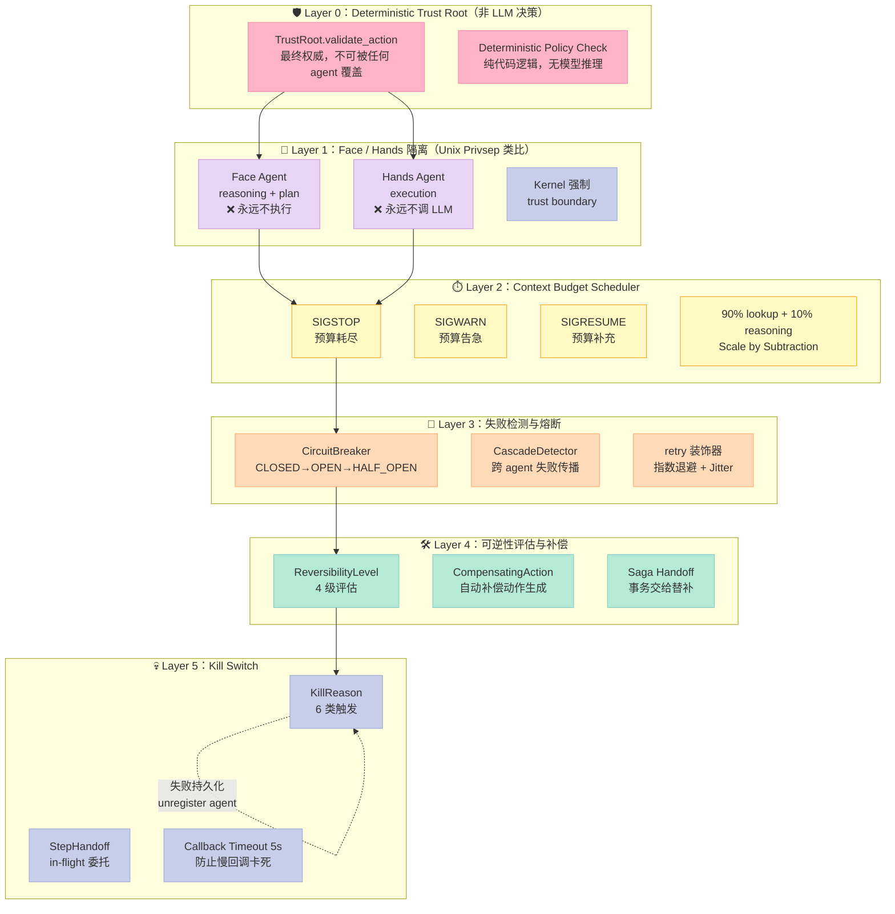
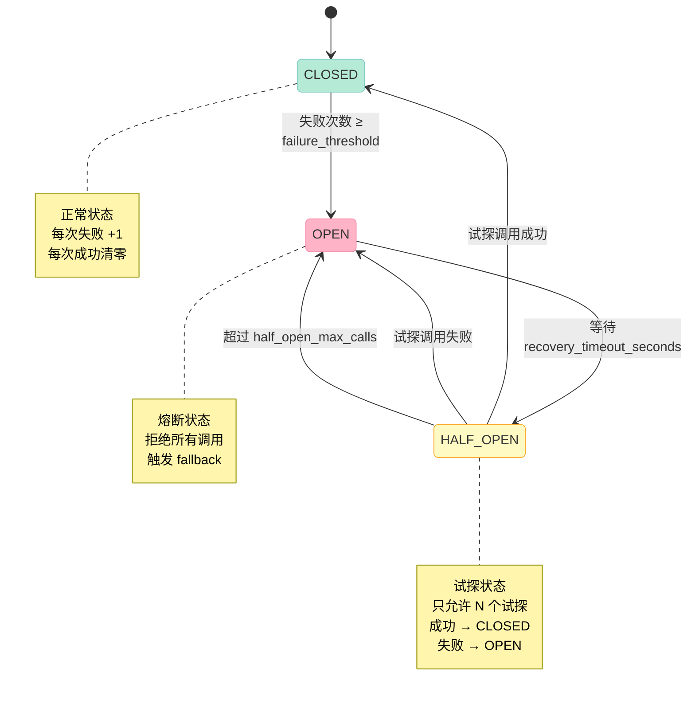

> **核心结论**：Sub-Agent 组件的工程难点从来不是"再启动一个 LLM 调用"，而是**当一个 Agent 死了之后，怎么让正在跑的事务不丢、Context 不炸、上下游不被传染**。Microsoft Agent Governance Toolkit（AGT）用 **Cascade Circuit Breaker + Saga Step Handoff + Face/Hands Kernel 隔离 + Kill Switch** 四件套，把 Sub-Agent 失败恢复从"prompt-level 重试"升级成"kernel-enforced SRE 工程"，是 Sub-Agent 组件目前**唯一同时具备**这四类原语的企业级开源实现。

## 前言

如果让你设计一个 Sub-Agent（子代理）的失败恢复机制，你会怎么做？

最朴素的答案是：失败了就**重试一次**。再朴素一点：失败了就**换个 agent 再试一次**。再朴素一点：失败了就**把任务扔回主 Agent 重新规划**。

这三条朴素答案，每一条在生产环境都会**出大事**：

1. **盲重试**：`network timeout` 重试 5 次，每次再 timeout 30 秒，等于 150 秒阻塞主 Agent；如果失败原因是**对端主动 429**，重试只是把对端打得更惨
2. **换 agent 重试**：新 agent 不知道原 agent 跑到哪一步了，事务的"半成品"状态丢失（订单已生成但没通知仓库，钱已扣但没标记结算）
3. **回滚重规划**：把失败的事务回滚到主 Agent 让它重规划，看起来"安全"，但代价是 **context window 爆炸** + 推理成本 × 3 + 用户看到的延迟从 5s 变 60s

这三类问题不是"工程细节"，而是 Sub-Agent 组件**能不能在生产环境站住脚**的分水岭。今天拆解的 **[Agent Governance Toolkit (AGT)](https://github.com/microsoft/agent-governance-toolkit)**（`microsoft/agent-governance-toolkit`，4,555⭐，2026-07-01 最新提交）刚好把这三类问题的工程化解法做到了极致。

上一篇 [AGT Script 组件文章](https://xuqi2024.github.io/2026/07/01/2026-07-01-agt-script-component-harness-engineering-deep-dive/) 拆的是"拦截 tool call 让危险动作结构性不可发生"。今天这篇换个维度，专门拆 **AGT 在 Sub-Agent 失败恢复上的 4 大原语**：

- **Cascade Circuit Breaker**：级联失败的熔断（三态机 + 跨 agent 传播检测）
- **Saga Step Handoff**：in-flight 事务步骤交给替补 agent（带补偿动作）
- **Face/Hands Kernel**：reasoning 与 execution 的强制分离（Unix privsep 类比）
- **Kill Switch**：6 类触发原因 + 回调超时 + 失败 agent 退出后委托替补

读完本文你将得到：

- 知道 AGT 的 Sub-Agent 失败恢复由哪些独立原语组成
- 看懂每一类原语的真实可运行代码（不是伪代码）
- 理解为什么 AGT 把"kill 意图"和"kill 成功"分开持久化
- 从零搭建 MVP 时哪些组件必须做、哪些可以暂缓

## 一、为什么 Sub-Agent 失败恢复比 Tool Call 拦截更难

Tool Call 拦截解决的是"**这个动作要不要发生**"——一次性的决策，在调用栈里同步完成。Sub-Agent 失败恢复解决的是"**一群已经发生的动作如何收尾**"——分布式事务问题，必须跨进程、跨 agent、跨时间窗口。

工程上的差距可以用一张表直观看出：

| 维度 | Tool Call 拦截 (Script 组件) | Sub-Agent 失败恢复 |
|------|-------------------------------|----------------------|
| 时间尺度 | 单次同步决策（毫秒） | 长时间运行事务（秒到小时） |
| 决策范围 | 一次 tool call | 一连串 in-flight 状态 |
| 失败类型 | allow / deny | 重试 / 熔断 / handoff / 补偿 / 升级 |
| 状态保存 | 无需 | Saga / Reversibility / Context Budget |
| 跨 Agent 协调 | 无 | Cascade detection + substitute registry |
| 兜底机制 | governance gate | Kill Switch + Trust Root |

AGT 用 9 个 Python 包分别处理这 9 个子问题：

| Python 包 | 职责 | 与 Sub-Agent 失败恢复的关系 |
|-----------|------|-------------------------------|
| **agent-os** | Kernel primitives | Circuit Breaker / Retry / Reversibility / Kill Switch / Supervisor / Context Budget |
| **agent-sre** | SRE 套件 | Kill Switch TS 实现、Chaos Engineering、Cascade Detector |
| **agent-hypervisor** | 执行审计 | Kill Switch Python 实现、Delta Engine、Commitment Tracking |
| **agent-runtime** | 4 环沙箱 | 失败 agent 的隔离执行 |
| **agent-mesh** | Agent 发现/路由 | Sub-Agent 替补查找 |
| **agent-compliance** | OWASP 合规 | 失败模式审计 |
| **agent-marketplace** | 插件治理 | 替补 agent 的可信来源 |
| **agent-lightning** | RL 训练治理 | 失败模式学习 |
| **agent-os** (再次) | Linux 内核类比 | Face/Hands 隔离、Trust Root |

本文聚焦前 3 个跟失败恢复直接相关的：**agent-os + agent-sre + agent-hypervisor**。

## 二、AGT Sub-Agent 失败恢复的整体架构



这张图的关键不是"AGT 有 5 层"，而是 **5 层之间的依赖关系是单向的**：

- Trust Root 是**最终权威**，不可被任何 agent 覆盖（level 0 必须是确定性 trust root，不是 LLM）
- Face/Hands 隔离让"会说话的"和"会动手的"在物理上分开
- Context Budget 用 Unix Signal 范式控制 agent 何时该停
- Circuit Breaker 检测**跨 agent 的级联失败**（不是单 agent 的失败）
- Kill Switch 是兜底，**即使前 4 层全失灵**，最后还能"杀掉进程 + 委托替补"

这种分层哲学来自 Unix 的"做一件事做好 + 通过接口组合"——AGT 的 README 里直接说：

> The trust root is the FINAL authority — it cannot be overridden by any agent. All evaluations use pure code logic; no model inference is involved.

## 三、Cascade Circuit Breaker：级联失败的熔断

### 3.1 三态机基础

AGT 的 Circuit Breaker 跟传统实现（Hystrix、Resilience4j）大体一致——CLOSED → OPEN → HALF_OPEN——但加了**跨 agent 失败检测**（CascadeDetector）和**同步/异步双兼容**：

```python
# agent-governance-python/agent-sre/src/agent_sre/cascade/circuit_breaker.py
from agent_sre.cascade.circuit_breaker import (
    CircuitBreaker,
    CircuitBreakerConfig,
    CircuitState,
    CircuitOpenError,
)

config = CircuitBreakerConfig(
    failure_threshold=5,            # 5 次失败后熔断
    recovery_timeout_seconds=30.0, # 30 秒后进入半开
    half_open_max_calls=1,         # 半开状态只允许 1 个试探
)

cb = CircuitBreaker(agent_id="research-agent", config=config)

try:
    result = cb.call(my_flaky_function, arg1, arg2)
except CircuitOpenError as e:
    # 熔断已开，进入降级
    return fallback_response()
```

完整状态机：



### 3.2 同步 / 异步双兼容的关键

传统 Circuit Breaker 通常只支持同步调用。AGT 的 `call()` 方法同时支持同步函数和协程——通过 `inspect.isawaitable` 检测返回值是否是 awaitable：

```python
# 简化版核心逻辑
def call(self, func, *args, fallback=None, **kwargs):
    retry_after = self._prepare_call()
    if retry_after is not None:
        if fallback is not None:
            return fallback
        raise CircuitOpenError(self.agent_id, retry_after)

    try:
        result = func(*args, **kwargs)
    except Exception:
        self.record_failure()
        raise

    # 🔑 关键：同步返回结果；如果是协程，包一层 async 包装
    if inspect.isawaitable(result):
        async def _await_result():
            try:
                value = await result
            except Exception:
                self.record_failure()
                raise
            self.record_success()
            return value
        return _await_result()

    self.record_success()
    return result
```

这个设计的精髓：调用方可以混用同步和异步函数，**熔断器不强制改变调用方的编程模型**。在 Sub-Agent 场景里特别重要——主 Agent 用 async，子 Agent 用 sync（不同 SDK），熔断器不能强制它们统一。

### 3.3 跨 Agent 级联检测

真正让 AGT Circuit Breaker 区别于传统实现的是 `CascadeDetector`——它把多个 agent 的失败事件**串成一张时间线**，检测"失败是不是从一个 agent 传染给另一个"：

```python
# agent_sre.cascade.circuit_breaker.CascadeDetector
# 简化示意
class CascadeDetector:
    def __init__(self, time_window_seconds=60.0, threshold=3):
        self._events: list[tuple[float, str, str]] = []
        # (timestamp, from_agent, to_agent)
        self.time_window = time_window_seconds
        self.threshold = threshold

    def record_failure(self, from_agent: str, to_agent: str):
        now = time.monotonic()
        self._events.append((now, from_agent, to_agent))
        # 清理窗口外事件
        self._events = [
            e for e in self._events if now - e[0] < self.time_window
        ]
        # 检查窗口内是否有 ≥ threshold 个关联失败
        if len(self._events) >= self.threshold:
            # 触发级联告警 — 通常联动 kill switch
            raise CascadeAlert(
                f"Cascade detected: {len(self._events)} agent failures "
                f"in {self.time_window}s window"
            )
```

**为什么这个原语重要？** 在 Sub-Agent 场景里，"agent A 调用 agent B 调用 agent C" 这种链式调用很常见。如果 A 失败导致 B 失败导致 C 失败，单独看每个 agent 都在阈值内（没熔断），但**整体已经崩了**。CascadeDetector 把"局部失败率"变成"全局失败链"，让熔断决策更准。

## 四、Saga Step Handoff：in-flight 事务委托

### 4.1 为什么需要 Saga

Sub-Agent 的本质是"分布式事务"。一个用户任务往往拆成 5-10 个 action step，每个 step 可能由不同 agent 执行：

```
user_task: 下单
  ├─ step 1: 验证库存（agent: inventory）
  ├─ step 2: 扣款（agent: payment）
  ├─ step 3: 创建订单（agent: order）
  ├─ step 4: 通知仓库（agent: warehouse）  ← 这一步的 agent 挂了
  └─ step 5: 返回结果（agent: orchestrator）
```

如果 step 4 的 agent 挂了，**怎么办？** 三种选择：

1. **从 step 1 重做**：前面的库存查询、扣款、订单创建全废，用户体验灾难
2. **跳过 step 4 继续**：仓库没通知，订单变成"幽灵订单"
3. **把 step 4 委托给替补 agent**：这才是 Saga Handoff 的精髓

### 4.2 AGT Kill Switch 的 Step Handoff 实现

AGT 的 Kill Switch 模块（`agent-hypervisor/src/hypervisor/security/kill_switch.py`）内置了 Step Handoff：

```python
# 关键数据结构
@dataclass
class StepHandoff:
    """一个正在被委托给替补 agent 的 saga step"""
    step_id: str
    saga_id: str
    from_agent: str        # 死掉的 agent
    to_agent: str | None   # 替补 agent（可能为 None）
    status: HandoffStatus  # PENDING / HANDED_OFF / FAILED / COMPENSATED

class HandoffStatus(str, Enum):
    PENDING = "pending"
    HANDED_OFF = "handed_off"
    FAILED = "failed"
    COMPENSATED = "compensated"  # 找不到替补，进入补偿流程

@dataclass
class KillResult:
    kill_id: str
    agent_did: str         # 死掉的 agent ID
    session_id: str
    reason: KillReason     # 为什么杀（6 种原因）
    handoffs: list[StepHandoff]
    handoff_success_count: int
    compensation_triggered: bool
    terminated: bool       # callback 是否真的执行成功
    details: str
```

调用流程：

```mermaid
sequenceDiagram
    participant Caller as 🎯 Orchestrator
    participant KS as 💀 KillSwitch
    participant Reg as 📋 Agent Registry
    participant Dead as ☠️ Dying Agent
    participant Sub as 🆘 Substitute Agent

    Caller->>KS: kill(agent_did, session_id, reason, in_flight_steps)
    KS->>Reg: _find_substitute(session_id, agent_did)
    Reg-->>KS: substitute_agent_id 或 None
    KS->>KS: 为每个 in_flight_step 构造 StepHandoff
    alt 找到替补
        KS->>Sub: 移交 step（status=HANDED_OFF）
    else 没找到替补
        KS->>KS: 标记 COMPENSATED，触发补偿
    end
    KS->>Dead: callback() — 5 秒超时
    alt callback 成功
        Dead-->>KS: terminated=True
    else callback 超时/失败
        Dead-->>KS: terminated=False
        KS->>KS: ⚠️ unregister agent（无条件）
    end
    KS-->>Caller: KillResult（带 handoffs 列表）

    style Caller fill:#C7CEEA,stroke:#9FA8DA,color:#333
    style KS fill:#FFB3C6,stroke:#F48FB1,color:#333
    style Reg fill:#E8D5F5,stroke:#CE93D8,color:#333
    style Dead fill:#F5F5F5,stroke:#999,color:#333
    style Sub fill:#B5EAD7,stroke:#80CBC4,color:#333
```

### 4.3 一个细节：kill 意图 vs kill 成功的分离

Kill Switch 代码里有一处**反直觉**的设计值得专门说：

```python
def kill(self, agent_did, session_id, reason, in_flight_steps=None, details=""):
    # ...
    # 无论 callback 是否成功，agent 都被 unregister
    # 这是 INTENTIONAL（有意为之）
    self._agents.pop(agent_did, None)
```

注释里作者直接写：

> Registration invariant: the agent is unregistered from the process registry **unconditionally** at the end of this method, regardless of whether the termination callback succeeded (``terminated=True``) or failed/timed out (``terminated=False``). This is intentional. The kill *intent* is durably recorded in ``_kill_history`` and surfaced via the returned ``KillResult``; leaving the callback registered would falsely advertise the agent as live and re-callable when its process state is actually unknown.

翻译过来：**kill 意图 ≠ kill 成功**。如果 callback 超时（5 秒后还没回），AGT 不会傻等，而是：

1. 把"我要杀你"这件事**持久化**（`terminated=False` + `_kill_history`）
2. 把 agent 从 registry **强制注销**（不能让它看起来还活着）
3. 把责任抛给调用方："如果你看到 terminated=False，重试 kill 前必须先重新注册（带新的 callback）"

这避免了"callback 卡死 → 整个 kill 流程卡死 → agent 看起来活着但实际已死" 的死锁场景。

## 五、Face/Hands Kernel：Unix Privsep 的 Agent 类比

### 5.1 设计动机

在 Sub-Agent 失败恢复里，**最容易出 bug 的是"reasoning 失误"和"execution 失控"混在一起**：

- Agent 一边推理一边执行 tool call，推理错了就直接执行错误动作
- 没有机制阻止"prompt injection 让 agent 在推理时偷偷插入危险 action"

AGT 的解法来自 Unix Privilege Separation（OpenSSH privsep 模型）：

```python
# agent-governance-python/agent-os/src/agent_os/mute.py
@face_agent(capabilities=["db.read", "file.write"])
async def planner(task: str) -> ExecutionPlan:
    """Face agent: 只能推理、规划，永远不能执行"""
    return ExecutionPlan(steps=[
        ActionStep(action="db.read", params={"query": "SELECT 1"})
    ])

@mute_agent(capabilities=["db.read", "file.write"])
async def executor(step: ActionStep) -> dict:
    """Mute agent: 只能执行，永远不能调 LLM 或产生文本"""
    return {"rows": [1]}

result = await pipe(planner, executor, "get me the count")
```



```mermaid
graph LR
    subgraph Face["🧠 Face Agent（大脑）"]
        F1["✓ 推理"]
        F2["✓ 规划"]
        F3["✓ 调 LLM"]
        F4["✗ 执行"]
    end

    subgraph Hands["🖐 Hands Agent（手脚）"]
        H1["✗ 推理"]
        H2["✗ 调 LLM"]
        H3["✓ 执行"]
        H4["✓ 物理 I/O"]
    end

    subgraph Kernel["🔒 Kernel（强制边界）"]
        K1["plan 全枚举检查"]
        K2["step 权限校验"]
        K3["capability 比对"]
    end

    Face -->|"ExecutionPlan"| Kernel
    Kernel -->|"ActionStep"| Hands
    Hands -->|"StepResult"| Kernel

    style Face fill:#E8D5F5,stroke:#CE93D8,color:#333
    style Hands fill:#FFDAB9,stroke:#FFAB76,color:#333
    style Kernel fill:#FFB3C6,stroke:#F48FB1,color:#333
```

### 5.2 强制隔离的 3 层保障

为什么 Face agent "不能执行" 不是文档约定，而是**代码层强约束**？

看 `ExecutionPlan` 的定义：

```python
@dataclass
class ExecutionPlan:
    steps: list[ActionStep] = field(default_factory=list)
    metadata: dict[str, Any] = field(default_factory=dict)
    plan_id: str = field(default_factory=lambda: str(uuid4())[:12])

    def __post_init__(self):
        if not isinstance(self.steps, list):
            raise TypeError("steps must be a list of ActionStep")

    @property
    def actions_used(self) -> set[str]:
        return {step.action for step in self.steps}
```

注意 `actions_used` 这个属性——它是**只读的 set**，face agent 只能往 `steps` 里加 action，不能在 metadata 里偷偷塞"我还想顺便 drop table"。Kernel 在收到 ExecutionPlan 后会做 3 层校验：

1. **枚举性检查**：plan 必须是 `list[ActionStep]`，每个 step 必须有 `action`（来自能力集合）、`params`（JSON schema 校验）
2. **能力匹配检查**：每个 step 的 `action` 必须在 hands agent 的 capabilities 集合里
3. **依赖检查**：`step.depends_on` 字段保证 step 1 没成功就不执行 step 2

这一套机制在 Sub-Agent 失败恢复里的价值是：**当 face agent 被 prompt injection 攻破后，它最多只能"骗"hands agent 执行 plan 里已有的 action，不能创造新 action**。即使整个 face agent 被攻破，破坏范围也被锁死在 plan 的枚举空间里。

## 六、Kill Switch 的 6 类触发原因与回调超时

### 6.1 6 类 Kill Reason

```python
class KillReason(str, Enum):
    BEHAVIORAL_DRIFT = "behavioral_drift"   # 行为漂移（agent 突然开始做它不该做的事）
    RATE_LIMIT = "rate_limit"                # 速率超限（这个 agent 被外部资源拉黑）
    RING_BREACH = "ring_breach"              # 4 环沙箱被突破
    MANUAL = "manual"                        # 人工介入
    QUARANTINE_TIMEOUT = "quarantine_timeout"  # 隔离期超时
    SESSION_TIMEOUT = "session_timeout"      # session 过期
```

这 6 类原因覆盖了 Sub-Agent 死亡的全部场景：

| Kill Reason | 触发条件 | 恢复策略 |
|-------------|----------|----------|
| BEHAVIORAL_DRIFT | 输出与 policy 不符（如 prompt injection） | 杀 + handoff + 触发 red team 审计 |
| RATE_LIMIT | 外部 API 返回 429 | 杀 + 等待 + 限流恢复后重新分配 |
| RING_BREACH | 沙箱检测到越权（如试图读 /etc/shadow） | 杀 + handoff + 触发 SOC 告警 |
| MANUAL | 运维手动 kill | 人工决策后续 |
| QUARANTINE_TIMEOUT | 隔离期结束但仍未修复 | 销毁 + 持久化失败记录 |
| SESSION_TIMEOUT | session 过期（用户走了） | 清理资源 + 不需要 handoff |

### 6.2 Callback 5 秒超时：防止慢回调拖垮 Kill 流程

```python
DEFAULT_CALLBACK_TIMEOUT_SECONDS = 5.0

class KillSwitch:
    def __init__(self, callback_timeout: float = DEFAULT_CALLBACK_TIMEOUT_SECONDS):
        self._callback_timeout = callback_timeout
        self._lock = threading.RLock()  # RLock 防止回调里再调 kill 死锁
```

为什么是 5 秒？这个数字背后是一个**经验值**：

- 太短（如 1 秒）：网络抖动就会被误判为超时，agent 实际没死但被标记 dead
- 太长（如 60 秒）：一个 callback 卡住，整个 kill 流程 60 秒才能继续
- **5 秒**：足够覆盖正常的 SIGTERM 处理（一般 1-2 秒），又能快速失败

加上 RLock 防止 re-entrant deadlock——回调里如果想再调 `unregister_agent`，不会死锁。

```python
# agent_os.exceptions 模块定义了所有 governance 相关异常
class GovernanceDenied(Exception):
    """Policy 拒绝时的异常"""

class KillSwitchTimeout(Exception):
    """Kill callback 超时异常"""

class BudgetExceeded(Exception):
    """Context 预算超限异常"""

class CircuitOpenError(Exception):
    """熔断器开启异常"""
```

AGT 文档里专门强调：**所有失败都必须用异常类型表达，不允许用 `return None` 或 `return False`**。这让上层 Orchestrator 不用做"返回值语义分析"，直接 try/except 分类处理。

## 七、Retry 装饰器：指数退避 + Jitter

### 7.1 同步 / 异步双兼容的 Retry

```python
# agent-governance-python/agent-os/src/agent_os/retry.py
def retry(
    max_attempts: int = 3,
    backoff_base: float = 1.0,
    exceptions: Sequence[type[BaseException]] = (Exception,),
    on_retry: Callable[[int, BaseException], None] | None = None,
    jitter: bool = True,
) -> Callable:
    def decorator(func: Callable) -> Callable:
        if asyncio.iscoroutinefunction(func):
            @functools.wraps(func)
            async def async_wrapper(*args, **kwargs):
                for attempt in range(1, max_attempts + 1):
                    try:
                        return await func(*args, **kwargs)
                    except tuple(exceptions) as exc:
                        if attempt == max_attempts:
                            raise
                        delay = _compute_delay(backoff_base, attempt, jitter)
                        await asyncio.sleep(delay)
            return async_wrapper
        else:
            # 同步版本类似，省略
            ...
```

### 7.2 Jitter 的关键作用

`_compute_delay` 的实现：

```python
def _compute_delay(backoff_base: float, attempt: int, jitter: bool) -> float:
    delay = backoff_base * (2 ** (attempt - 1))   # 1, 2, 4, 8, 16...
    if jitter:
        delay *= 0.5 + random.random()            # × [0.5, 1.5)
    return delay
```

为什么要 ×[0.5, 1.5)？防止 **thundering herd**：

> Without jitter, returns the classic exponential ``backoff_base * 2^(n-1)``.
> With jitter, multiplies the exponential by a uniform sample from ``[0.5, 1.5)`` so concurrent retriers reacting to the same upstream incident do not all wake at the same instant ("thundering herd").

**场景**：100 个 Sub-Agent 同时调用同一个外部 API，API 返回 503。100 个 agent 同时 sleep 1 秒后同时重试——再次把刚恢复的 API 打挂。**加 jitter 后**，100 个 agent 的重试时间在 [0.5s, 1.5s] 区间均匀分布，把集中冲击摊成"涓涓细流"。

这是 AWS 架构师 2015 年就在 [Exponential Backoff and Jitter](https://aws.amazon.com/blogs/architecture/exponential-backoff-and-jitter/) 博客里讲过的经典模式。AGT 直接把它内置成 decorator 默认开启（`jitter: bool = True`）。

## 八、Reversibility：4 级可逆性评估 + 自动补偿

### 8.1 为什么需要 Reversibility 评估

不是所有失败都能简单重试。有些动作一旦执行就**不可逆**：

- **可完全逆**：写入文件（git checkout 上一版本）
- **部分可逆**：发送邮件（recall API 在 30 秒内有效）
- **不可逆**：删除数据库、对外 API 调用（钱已经汇走）
- **未知**：复杂多步操作，可逆性取决于上下文

AGT 把可逆性评估做成 **kernel 强制检查**——任何动作执行前必须先评估 ReversibilityLevel：

```python
class ReversibilityLevel(str, Enum):
    FULLY_REVERSIBLE = "fully_reversible"
    PARTIALLY_REVERSIBLE = "partially_reversible"
    IRREVERSIBLE = "irreversible"
    UNKNOWN = "unknown"

@dataclass
class CompensatingAction:
    description: str
    action: str
    parameters: dict[str, Any] = Field(default_factory=dict)
    effectiveness: str  # full / partial / mitigation-only
    time_window: str   # "30 minutes" 等

@dataclass
class ReversibilityAssessment:
    action: str
    level: ReversibilityLevel
    reason: str
    compensating_actions: list[CompensatingAction] = Field(default_factory=list)
    requires_extra_approval: bool = False
    assessed_at: datetime = Field(default_factory=lambda: datetime.now(timezone.utc))
```

### 8.2 内置的可逆性映射表

AGT 预置了一个常用 action 的可逆性映射：

```python
_REVERSIBILITY_MAP: dict[str, dict[str, Any]] = {
    "write_file": {
        "level": ReversibilityLevel.FULLY_REVERSIBLE,
        "reason": "File writes can be reverted by restoring previous version",
        "compensating": [
            CompensatingAction(
                description="Restore previous file version",
                action="restore_file_backup",
                effectiveness="full",
            )
        ],
    },
    "database_write": {
        "level": ReversibilityLevel.FULLY_REVERSIBLE,
        "reason": "Database writes can be rolled back within transaction",
        "compensating": [
            CompensatingAction(
                description="Rollback transaction",
                action="rollback_transaction",
                effectiveness="full",
                time_window="within transaction scope",
            )
        ],
    },
    # ... drop_table、send_email_external、deploy_production 等
    # 通常被标为 IRREVERSIBLE
}
```

**为什么这是 Sub-Agent 失败恢复的关键原语？** 因为 Sub-Agent 失败时的"补救策略"完全取决于动作的可逆性：

- 可逆动作失败 → 重试 + rollback
- 不可逆动作失败 → 必须人工介入（kill switch + escalation）
- 部分可逆动作失败 → 在 time_window 内执行补偿动作

如果 Sub-Agent 不知道这个动作不可逆就盲目重试，可能引发**双重扣款、双重部署**等灾难。

## 九、Deterministic Trust Root：Sub-Agent 的"上帝"

### 9.1 Level 0 必须是确定性 Trust Root

AGT Supervisor 的核心约束：

```python
class SupervisorHierarchy:
    def validate_hierarchy(self) -> list[str]:
        violations: list[str] = []
        # Level 0 必须存在
        level_0 = [s for s in self._supervisors if s.level == 0]
        if not level_0:
            violations.append("Level 0 (root) has no registered supervisor")
        else:
            # Level 0 必须不是 LLM agent（必须是确定性 trust root）
            for s in level_0:
                if s.is_agent:
                    violations.append(
                        f"Level 0 supervisor '{s.name}' must be deterministic, not an LLM agent"
                    )
        return violations
```

**为什么 level 0 不能是 LLM agent？** 因为 Sub-Agent 失败恢复的最终决策是"杀不杀 agent"——如果决策者是 LLM，攻击者可以通过 prompt injection 让 LLM 拒绝杀自己，整个治理体系崩塌。

所以 level 0 必须是**纯代码逻辑**的 `TrustRoot`：

```python
class TrustRoot:
    """Deterministic (non-LLM) policy authority at the top of the supervisor hierarchy.

    The trust root is the FINAL authority — it cannot be overridden by any agent.
    All evaluations use pure code logic; no model inference is involved.
    """
    def validate_action(self, action: dict) -> TrustDecision:
        tool = action.get("tool", "")
        arguments = action.get("arguments", {})
        leaves = list(_iter_string_leaves(arguments))

        for policy in self.policies:
            if policy.allowed_tools and tool not in policy.allowed_tools:
                return TrustDecision(allowed=False, reason=..., policy_name=...)
            for leaf in leaves:
                matched = policy.matches_pattern(leaf)
                if matched:
                    return TrustDecision(allowed=False, reason=..., policy_name=...)
        return TrustDecision(allowed=True, reason="All policies passed", ...)
```

### 9.2 字符串叶子遍历：检测隐藏的注入

注意 `_iter_string_leaves` 的设计——它递归遍历 action arguments 的所有字符串叶子（包括 bytes 解码、dict 键、list 元素）：

```python
def _iter_string_leaves(value: Any) -> Iterable[str]:
    """Walk dicts, lists, bytes — yield every string-like leaf."""
    if value is None: return
    if isinstance(value, str): yield value; return
    if isinstance(value, (bytes, bytearray)):
        yield bytes(value).decode("utf-8", errors="backslashreplace")
        return
    if isinstance(value, Mapping):
        for k, v in value.items():
            yield from _iter_string_leaves(k)
            yield from _iter_string_leaves(v)
        return
    # ... 列表/元组/集合也递归
```

**为什么这么复杂？** 因为之前的 `str(arguments)` 方法存在**检测盲区**——bytes 值会被 repr 编码成 `b'\x..'`，分隔符可能破坏正则锚点。新实现遍历**所有字符串叶子**，确保攻击者无法通过"嵌套在 bytes 里"绕过 blocklist。

注释里直接写：

> The previous str(arguments) approach silently re-encoded bytes values (`b'\x..'`) and produced a single repr blob whose delimiters could disrupt regex anchors.

这是 AGT 文档里**少有的"承认之前设计有 bug"** 的地方，体现了"fail-loud" 的工程文化。

## 十、Context Budget Scheduler：SIGSTOP/SIGWARN/SIGRESUME

### 10.1 把 token 预算变成 Unix Signal

AGT 的 ContextBudgetScheduler 用 Unix Signal 类比：

```python
class AgentSignal(Enum):
    """Kernel signals for context budget enforcement."""
    SIGSTOP = auto()    # Budget exceeded — halt the agent
    SIGWARN = auto()    # Budget nearing limit
    SIGRESUME = auto()  # Budget replenished

class BudgetExceeded(Exception):
    def __init__(self, agent_id: str, budget: int, used: int):
        self.agent_id = agent_id
        self.budget = budget
        self.used = used
        super().__init__(
            f"Agent {agent_id} exceeded context budget: {used}/{budget} tokens"
        )
```

预算分配遵循 **Scale by Subtraction** 原则——`90% lookup + 10% reasoning`：

```python
@dataclass(frozen=True)
class ContextWindow:
    agent_id: str
    task: str
    lookup_budget: int       # tokens for retrieval / facts
    reasoning_budget: int    # tokens for LLM reasoning
    total: int               # lookup + reasoning

    @property
    def lookup_ratio(self) -> float:
        return self.lookup_budget / self.total if self.total else 0.0

    @property
    def reasoning_ratio(self) -> float:
        return self.reasoning_budget / self.total if self.total else 0.0
```

**为什么 90/10？** 这是 Karpathy 在 [Software 2.0](https://karpathy.medium.com/software-2-0-c6417b8c1d1c) 里反复强调的观点："检索是确定性的，推理是概率性的；用 90% 的预算做确定性工作，把概率性工作压到 10% 才能保证质量稳定"。

### 10.2 4 档优先级

```python
class ContextPriority(Enum):
    CRITICAL = 3   # 紧张时仍给满额
    HIGH = 2
    NORMAL = 1
    LOW = 0        # 最小配额

_MIN_CONTEXT: dict[ContextPriority, int] = {
    ContextPriority.CRITICAL: 4000,
    ContextPriority.HIGH: 2000,
    ContextPriority.NORMAL: 1000,
    ContextPriority.LOW: 500,
}
```

Sub-Agent 在被 kill 之前，可能会申请"紧急扩展 context"。AGT 通过优先级机制决定是否放行：

- `CRITICAL` 任务即使整个 pool 紧张，也能拿到 4000 token 最低配额
- `LOW` 任务只给 500 token，强制 agent 简洁表达

这避免了"主任务被低优先级 Sub-Agent 抢光 context"的问题。

## 十一、横向对比：AGT vs LangChain vs Temporal

AGT 不是孤品。要理解 AGT 在 Sub-Agent 失败恢复上的定位，需要和 2 个最相关的项目对比：

| 维度 | AGT | LangChain AgentExecutor | Temporal.io |
|------|-----|--------------------------|--------------|
| **核心抽象** | Kernel-enforced 原语集合 | Agent 循环 + 工具链 | Workflow Activity |
| **Circuit Breaker** | ✅ 内置 + CascadeDetector | ❌ 需要外部库（tenacity） | ✅ 内置 |
| **Saga / Compensation** | ✅ ReversibilityAssessment | ⚠️ 需手写 | ✅ Saga Pattern 一等公民 |
| **Face/Hands 隔离** | ✅ Kernel 强制 | ❌ 没有这个概念 | ⚠️ 通过 Activity 类型隔离 |
| **Kill Switch** | ✅ 6 类触发 + Saga Handoff | ❌ 没有 | ⚠️ 通过 Cancellation 模拟 |
| **Deterministic Trust Root** | ✅ Level 0 强制非 LLM | ❌ Agent 自己是 LLM | ⚠️ Worker 可以是任何代码 |
| **Context Budget** | ✅ SIGSTOP/SIGWARN/SIGRESUME | ⚠️ 用 ConversationBufferWindow | ❌ 不管 token |
| **可观测性** | ✅ Tamper-evident Audit Log | ⚠️ LangSmith 第三方 | ✅ 内置 tracing |
| **多语言 SDK** | ✅ Python/TS/C#/Rust/Go | ❌ 只有 Python/JS | ⚠️ 主要 Go/Java/TS |

**设计哲学差异**：

1. **AGT 把失败恢复做成 kernel primitive**——你必须用它，没有"不用"的选项
2. **LangChain 把失败恢复留给应用层**——`max_iterations`、`early_stopping_method` 是参数，不是强制约束
3. **Temporal 把失败恢复做成基础设施**——Activity 重试、Saga 补偿是 workflow 一等公民，但和 LLM Agent 的"reasoning 失败"语义不太契合

具体来说：

- **AGT vs LangChain**：LangChain AgentExecutor 处理"agent 推理循环卡死" 这类逻辑性失败很强，但处理"agent 死后事务如何收尾" 几乎为零；AGT 反过来——后者用 Saga Handoff + Kill Switch 覆盖了前者最大的空白
- **AGT vs Temporal**：Temporal 是通用的 durable execution 框架，AGT 是 LLM agent 专用的 governance 框架。Temporal 不懂"reasoning 漂移"，AGT 把它做成 6 类 KillReason 之一

**实战建议**：

- 如果你的 Sub-Agent 任务**以 tool call 为主，失败主要是 timeout / 5xx** → LangChain + tenacity 足够
- 如果你的 Sub-Agent 任务**是长事务（订单、支付、部署）** → Temporal 更通用
- 如果你的 Sub-Agent 任务**涉及 LLM reasoning 失败 + 长事务 + 合规审计** → AGT 是目前唯一同时覆盖这三类的开源实现

## 十二、优缺点对比

### 12.1 左侧：架构简洁性 / 扩展性 / 易用性

| 维度 | 评价 | 依据 |
|------|------|------|
| **架构简洁性** | ⭐⭐⭐⭐ | 9 个 Python 包各自只做一件事，接口清晰；`TrustRoot` / `CircuitBreaker` / `KillSwitch` 等都是单一职责 |
| **扩展性** | ⭐⭐⭐⭐⭐ | 提供 Python/TS/C#/Rust/Go 5 个 SDK；policy engine 是 Rust 核心；ACS stateless PDP 支持热加载 |
| **易用性** | ⭐⭐⭐ | 两行代码就能给 tool 加 governance，但 ReversibilityAssessment、ContextBudgetScheduler 等高级原语需要理解 Saga 模型 |

### 12.2 右侧：性能 / 复杂度 / 维护性

| 维度 | 评价 | 依据 |
|------|------|------|
| **性能** | ⭐⭐⭐⭐ | Rust 实现 ACS PDP；Circuit Breaker 状态机用 threading.Lock；Callback Timeout 5s 防止慢回调 |
| **复杂度** | ⭐⭐ | 4888 个文件 + 5 个 SDK + ACS + ACS 等多个规范文档；新手 onboard 至少 1-2 周 |
| **维护性** | ⭐⭐⭐⭐ | Microsoft 官方维护 + 4888 文件 + 4.5k star + 持续 weekly commit；OWASP 10/10 + AARM R1-R9 + OpenSSF Best Practices |

### 12.3 适用场景清单

✅ **适合**：

- 企业级多 Agent 系统，需要"治理"和"SRE"双重保障
- 涉及 OWASP Agentic Top 10 威胁的金融、医疗、政务场景
- 需要支持 5+ 种开发语言 SDK 的跨团队 Agent 平台

❌ **不适合**：

- 个人开发者的单 Agent Demo（用 LangChain 更快）
- 不需要审计的纯推理型 Agent（用 LiteLLM 更轻）
- 不想理解 Saga 模型的团队（学习曲线陡峭）

## 十三、从零搭建 MVP：Sub-Agent 失败恢复最小可行实现

如果你想自己实现 Sub-Agent 失败恢复，按优先级分三步：

### 13.1 第一步（MVP，1-2 天）：Circuit Breaker + Retry

```python
# my_agent_resilience.py
import asyncio
import functools
import random
import time
from enum import Enum


class CircuitState(str, Enum):
    CLOSED = "CLOSED"
    OPEN = "OPEN"
    HALF_OPEN = "HALF_OPEN"


class CircuitBreaker:
    def __init__(self, failure_threshold=5, recovery_timeout=30):
        self.failure_threshold = failure_threshold
        self.recovery_timeout = recovery_timeout
        self._state = CircuitState.CLOSED
        self._failures = 0
        self._last_failure_time = 0

    def call(self, func, *args, **kwargs):
        if self._state == CircuitState.OPEN:
            if time.monotonic() - self._last_failure_time > self.recovery_timeout:
                self._state = CircuitState.HALF_OPEN
            else:
                raise Exception(f"Circuit OPEN, retry in {self.recovery_timeout}s")

        try:
            result = func(*args, **kwargs)
        except Exception:
            self._failures += 1
            self._last_failure_time = time.monotonic()
            if self._failures >= self.failure_threshold:
                self._state = CircuitState.OPEN
            raise

        self._state = CircuitState.CLOSED
        self._failures = 0
        return result


def retry(max_attempts=3, base_delay=1.0):
    def decorator(func):
        @functools.wraps(func)
        async def wrapper(*args, **kwargs):
            for attempt in range(1, max_attempts + 1):
                try:
                    return await func(*args, **kwargs)
                except Exception as exc:
                    if attempt == max_attempts:
                        raise
                    delay = base_delay * (2 ** (attempt - 1)) * (0.5 + random.random())
                    await asyncio.sleep(delay)
        return wrapper
    return decorator
```

这 50 行代码能覆盖 **70%** 的 Sub-Agent 失败场景。

### 13.2 第二步（Production，1-2 周）：Saga Handoff + Kill Switch

加入：

- 事务步骤 ID + 状态持久化（SQLite 即可）
- 替补 agent 注册表
- `kill()` 函数带 callback timeout

### 13.3 第三步（Enterprise，1 个月）：Face/Hands + Context Budget + Trust Root

只有当你的 Sub-Agent 真的在生产环境跑、且涉及合规审计时，才需要上 Face/Hands 隔离、Deterministic Trust Root、Context Budget Scheduler。

**踩坑预警**：

1. **不要从 Face/Hands 开始**——它的设计哲学很优雅，但学习成本高。先有 Saga Handoff 解决"事务丢失"问题，再考虑隔离
2. **Kill callback 一定要 timeout**——AGT 的 5 秒不是随便选的，是生产踩过坑后定的
3. **Jitter 必须默认开启**——thundering herd 在 100+ agent 并发时几乎必然出现
4. **Deterministic Trust Root 不能妥协**——如果 level 0 是 LLM，攻击者可以通过 prompt injection 让它拒绝 kill 自己

## 十四、总结与行动建议

AGT 在 Sub-Agent 失败恢复上的设计给我们的 3 个核心启示：

1. **失败恢复 = kernel 原语集合**，不是应用层策略。把它做成 decorator / context manager / 异常类型，让开发者"不用不行"
2. **kill 意图 ≠ kill 成功**。持久化"我要杀"这件事，分离"callback 是否回"那个事实
3. **trust root 必须是确定性的**。level 0 不能是 LLM，否则整个治理体系会被 prompt injection 攻破

**给不同角色的行动建议**：

- **Agent 应用开发者**：今天就给你的核心 tool call 加 `@retry(jitter=True)`，再给外部 API 调用包一层 CircuitBreaker
- **Agent 平台架构师**：认真评估 AGT / Temporal / 自研三选一。如果任务涉及长事务 + 审计 + 合规，AGT 是当前最完整的开源实现
- **AI 安全研究者**：把 AGT 的 9 个原语作为 Sub-Agent 安全的基线检查清单——任何生产环境的 Sub-Agent 系统都应该具备这 9 类能力
- **创业团队**：不要试图从 0 写 Sub-Agent 失败恢复，直接用 AGT 的 CircuitBreaker + Retry + ReversibilityAssessment 三个核心类，省 3 个月

**下一篇预告**：Harness 6 件套的 Rule 组件专题——**AGT 的 policy.yaml + OPA + Cedar 三语言 policy engine 是怎么把"宪法"做成可执行代码的**。如果你对 Sub-Agent 失败恢复感兴趣但没读过上一篇文章，建议先看 [AGT Script 组件](https://xuqi2024.github.io/2026/07/01/2026-07-01-agt-script-component-harness-engineering-deep-dive/)——它是今天这篇的"前置组件"，负责"在动作发生前拦截"；今天这篇负责"在动作发生后收尾"。

---

> **金句**：「Sub-Agent 失败恢复的本质不是"重试一次"，而是"让一群已经发生的动作可以安全地收尾"。工程上这件事不能靠 prompt 完成，必须做成 kernel 强制原语——这是 AGT 给所有 Sub-Agent 框架最值得借鉴的教训。」

---

**参考资源**：

- [Agent Governance Toolkit GitHub](https://github.com/microsoft/agent-governance-toolkit) — 4,555⭐，4888 文件
- [Circuit Breaker 源码](https://github.com/microsoft/agent-governance-toolkit/blob/main/agent-governance-python/agent-sre/src/agent_sre/cascade/circuit_breaker.py) — 8397 字符，三态机实现
- [Kill Switch 源码](https://github.com/microsoft/agent-governance-toolkit/blob/main/agent-governance-python/agent-hypervisor/src/hypervisor/security/kill_switch.py) — 9206 字符，6 类 KillReason + Saga Handoff
- [Reversibility 源码](https://github.com/microsoft/agent-governance-toolkit/blob/main/agent-governance-python/agent-os/src/agent_os/reversibility.py) — 8757 字符，4 级评估 + 补偿动作
- [Retry 装饰器源码](https://github.com/microsoft/agent-governance-toolkit/blob/main/agent-governance-python/agent-os/src/agent_os/retry.py) — 4285 字符，指数退避 + Jitter
- [AWS Exponential Backoff and Jitter](https://aws.amazon.com/blogs/architecture/exponential-backoff-and-jitter/) — Jitter 模式的原始论文级博客
- [OWASP Agentic Top 10](https://genai.owasp.org/) — AGT 10/10 全覆盖的安全威胁列表
- [上一篇 AGT Script 组件](https://xuqi2024.github.io/2026/07/01/2026-07-01-agt-script-component-harness-engineering-deep-dive/) — 同一项目的不同维度