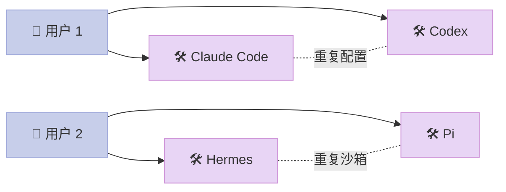
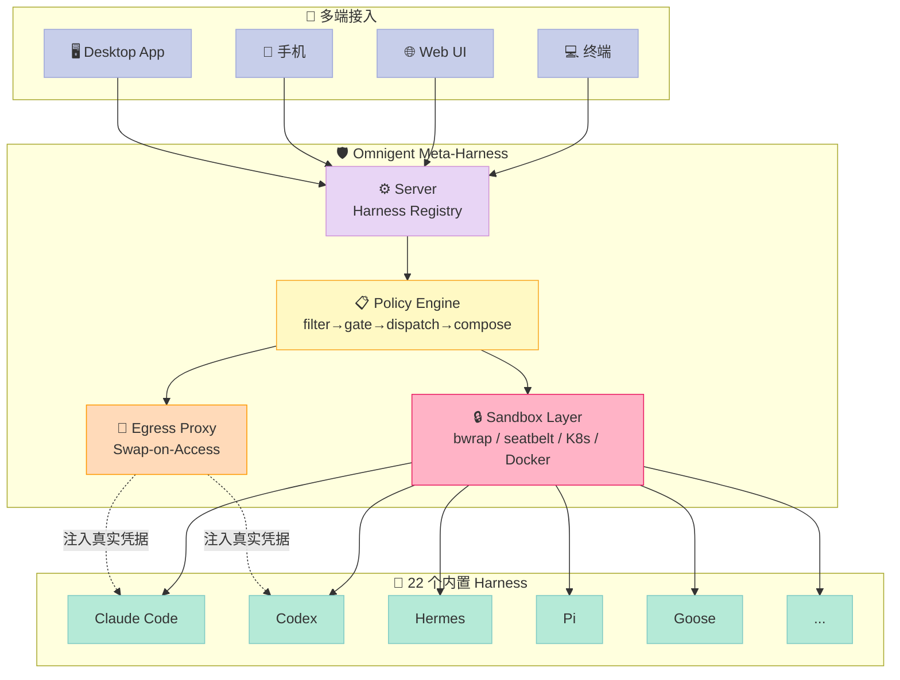
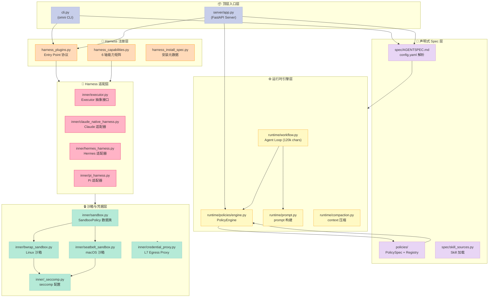
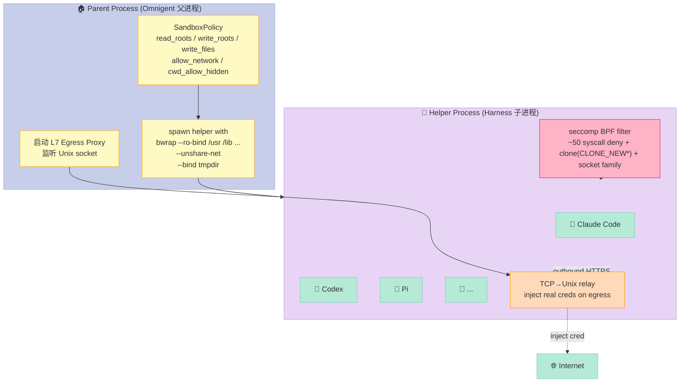
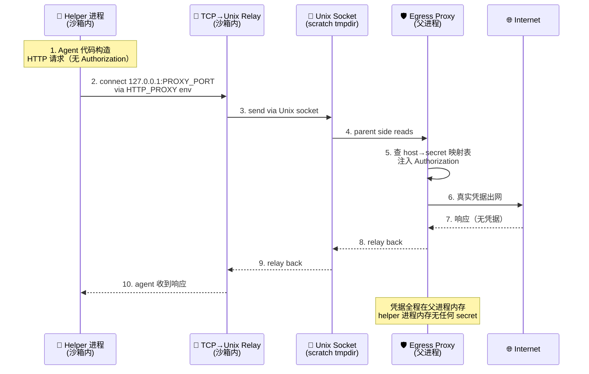
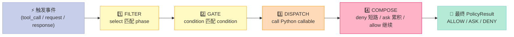

> 如果说 Claude Code / Codex / Hermes / OpenClaw / Pi 这些单 Agent Harness 是"装好子弹的左轮手枪"，那 **Omnigent（omnigent-ai/omnigent，6,160⭐，Apache-2.0）** 就是把这 22 把左轮集成在一起的"瑞士军刀式 Meta-Harness"——一把枪发完子弹就完了，Meta-Harness 让你**随时换枪、随时换弹、随时加装消音器**。它不发明新的 LLM 调用方式，它把已经验证过的 22 套 Harness 包成一个可发现、可治理、可审计、可沙箱化的统一调度层——这是 Harness 6 件套专题全部完成后，进入"项目横向对比"阶段最值得深挖的一个项目。

## 前言：为什么 Harness 6 件套写完后必须看 Meta-Harness？

Harness 6 件套专题（Rule → Skill → Sub-Agent → Workflow → Script → MCP）我们在过去 7 天全部拆完了：

| # | 组件 | 代表项目 | 关键文章 |
|---|------|----------|----------|
| 1 | Rule | agents-md | 2026-06-27 |
| 2 | Skill | SkillOpt / ReflACT | 2026-06-28 |
| 3 | Sub-Agent | GoClaw / AGT | 2026-06-29, 2026-07-02 |
| 4 | Workflow | Restate | 2026-06-30 |
| 5 | Script | AGT Script | 2026-07-01 |
| 6 | MCP | microsoft/mcp-gateway | 2026-07-03 |

每一篇我们都在**某一个组件维度**做了深挖。但有个问题一直没解决：**真实生产环境里，用户往往不是只用一个 Harness**。

你可能在公司电脑上习惯用 **Claude Code**，手机上想用 **Codex**，CI 流水线里用 **Hermes**，生产环境里又要切到 **Pi-Mono + 自定义 Skill**。每个 Harness 都有：

- 自己的 CLI 安装方式
- 自己的 Auth 凭据（API Key、ChatGPT 订阅、Databricks Token）
- 自己的 Elicitation 协议（怎么弹"请确认"对话框）
- 自己的 Resume 机制（怎么续接上一次的会话）
- 自己的 Sandbox 模型（bwrap / seatbelt / Docker / K8s）
- 自己的 Tool Schema（怎么把 MCP Server 暴露给 LLM）

这些**横切关注点**（cross-cutting concerns）每一个都够写一篇文章。但把它们**统一治理**——这就是 **Meta-Harness** 的命题。

今天拆解的 [omnigent-ai/omnigent](https://github.com/omnigent-ai/omnigent)（6,160⭐、Apache-2.0、Python 3.12+、2026-07-03 最新提交）就是当前**唯一一个同时给出六轴能力矩阵 + Entry Point 插件协议 + 双层 OS 沙箱 + L7 凭据代理**的开源 Meta-Harness 实现。

读完你会得到：

1. **22 个内置 Harness 的六轴能力矩阵**（IntegrationMode × Elicitation × Resume × EffortFamily × ModelFamily × AuthModel）—— 不是功能罗列，是**协议层抽象**
2. **HarnessContribution 插件协议的真实代码** —— 用 Python Entry Point 给 Meta-Harness 做"可热插拔"
3. **bwrap + seccomp 双层 OS 沙箱的设计哲学** —— 比 docker exec 更轻、比 gVisor 更窄，但只防"已知坏"的攻击面
4. **L7 Egress Proxy + 凭据 Swap-on-Access 模式** —— 把"凭据永远不进沙箱"做到协议层
5. **从零搭建 MVP 的清单** —— 哪些组件必须做、哪些可以延后

---

## 一、Omnigent 是什么？

### 1.1 一句话定位

**Omnigent 是一个 Meta-Harness**（"Meta"取自"元 / 关于自身的"）——一个**关于 Harness 的 Harness**。它不直接调用 LLM，而是把 Claude Code、Codex、Cursor、OpenCode、Hermes、Pi、Goose、Qwen、Kimi、Kiro、Antigravity、Copilot 等 22 套已有 Harness 包成一个**可发现、可治理、可审计、可沙箱化**的统一调度层。

引用 Omnigent 自述：

> Omnigent is an open-source **meta-harness** that gives you a common orchestration layer over Claude Code, Codex, Cursor, OpenCode, Hermes, Pi, and the agents you write yourself: swap or combine harnesses without rewriting, enforce policies and sandboxing, and collaborate in real time from any device — terminal, browser, phone, or the native desktop app.

关键词三个：

- **Common orchestration layer**（不是"框架"，不是"运行时"，是"调度层"）
- **Swap or combine**（不是"统一抽象"，是"可互换可组合"）
- **Without rewriting**（重点：上层 Spec / Policy / Sandbox 都是声明式 YAML，不改 Python）

### 1.2 解决了什么具体问题？

没有 Meta-Harness 时，每个 Harness 各自为政：



痛点立刻出现：

1. **凭据孤岛**：Claude 用 Anthropic API Key，Codex 用 ChatGPT 订阅，Hermes 用自建 OpenAI 兼容端点——每换一个 Harness 都要重新登录
2. **Sandbox 重复实现**：Claude Code 的 `bubblewrap` 配置 ≠ Codex 的 `sandbox-exec` ≠ Hermes 的 Docker——同一份"不许写 /tmp 之外的目录"规则要在 22 个地方写 22 遍
3. **Policy 碎片化**："危险命令拦截"在 Claude Code 里叫 PreToolUse Hook，在 Codex 里叫 approval-mirror，在 Pi 里叫政策文件——三个完全不同的 DSL
4. **Session 不可迁移**：手机上开的 Codex 会话，回到电脑用 Claude Code 接不上
5. **审计断层**：22 套 Harness 各自写日志，要做"上周谁用 AI 调过 `rm -rf`"的合规审计，需要从 22 个地方抓数据

加 Meta-Harness 后：



Omnigent 不是"统一 API 调用"——**它不重写 LLM 调用**。它做的事情是：

1. **Harness Registry**：声明式注册 22 套 Harness 的能力（哪个支持 stream、哪个支持 subagent、哪个支持 resume）
2. **Policy Engine**：把"该不该做这个动作"的判断从各 Harness 内部抽出来，统一执行
3. **Sandbox Layer**：把"在什么环境跑"从各 Harness 内部抽出来，统一下发
4. **Egress Proxy**：把"如何用真实凭据访问外部 API"从各 Harness 内部抽出来，统一代理

**这是经典的"横切关注点（AOP）改造"——把散落在 22 处的鉴权 / 沙箱 / 审计代码，用一个调度层集中治理**。

---

## 二、架构总览：六层 + 一个协议

Omnigent 的代码组织（`omnigent/` 目录）按"职责"而非"功能"切分。下面这张图把整个仓库的核心模块串起来：



逐层解释：

| 层 | 职责 | 关键模块 |
|----|------|----------|
| **顶层入口** | CLI + Server | `cli.py`、`server/app.py` |
| **声明式 Spec** | YAML 解析 + Schema 校验 | `spec/parser.py`、`policies/registry.py` |
| **Harness 注册** | **核心抽象**——22 个 Harness 的能力矩阵 + 插件协议 | `harness_plugins.py`、`harness_capabilities.py` |
| **运行时引擎** | Agent Loop + Policy Engine + Prompt 构建 | `runtime/workflow.py`、`runtime/policies/engine.py` |
| **Harness 适配** | 22 个 `*_harness.py` 适配器 + Executor 接口 | `inner/executor.py`、`inner/claude_native_harness.py` |
| **沙箱与凭据** | OS 级隔离 + 网络出口过滤 + 凭据注入 | `inner/bwrap_sandbox.py`、`inner/_seccomp.py`、`inner/credential_proxy.py` |

> **值得注意**：第六层（沙箱与凭据）是 Omnigent 的"杀手锏"——这是它**作为 Meta-Harness 而非简单 Wrapper** 的核心证据。一会儿第三、四章会重点拆解。

---

## 三、六轴能力矩阵：协议层抽象 vs 功能罗列

### 3.1 为什么需要"能力矩阵"？

假设你（Meta-Harness 调度层）要在用户发起"继续上次的会话"请求时决定怎么 resume：

```python
if harness == "claude-code":
    resume via tmux attach
elif harness == "codex":
    resume via app-server JSON-RPC
elif harness == "pi":
    # Pi 没有 resume 能力，只能 cold rebuild
    raise NotImplementedError
elif harness == "goose":
    resume via ACP session id
...
```

这是**典型的 22 分支 if-else**，每个新 Harness 都要改调度层代码，违反开放封闭原则。

Omnigent 的解法：**把每个 Harness 的"能力维度"声明成一个不可变 dataclass**（`HarnessCapabilities`），调度层只问"你支持这个轴吗？"，不再写 if-else。

### 3.2 真实代码：`HarnessCapabilities` 六轴定义

`omnigent/harness_capabilities.py`（完整定义，共 4645 字符）：

```python
# omnigent/harness_capabilities.py —— 完整结构
from dataclasses import dataclass
from enum import Enum

class IntegrationMode(str, Enum):
    """How the harness runs the vendor agent."""
    SDK_IN_PROCESS = "sdk-in-process"     # 厂商 SDK 内嵌到 Harness 子进程
    CLI_SUBPROCESS = "cli-subprocess"     # 调厂商 CLI 子进程
    ACP_SUBPROCESS = "acp-subprocess"     # 厂商 CLI 用 ACP 协议模式
    NATIVE_TUI = "native-tui"             # 包一个常驻 TUI（tmux / file-inject）
    NATIVE_SERVER = "native-server"       # Harness 自管的厂商服务 + HTTP/SSE bridge


class Elicitation(str, Enum):
    """How a policy ASK / tool-approval is surfaced to the Omnigent web UI."""
    NONE = "none"
    HOOK = "hook"                        # 厂商 PreToolUse hook 上报
    JSONRPC = "jsonrpc"                  # app-server JSON-RPC elicitation（codex）
    APPROVAL_MIRROR = "approval-mirror"  # 轮询 TUI approval pane 镜像
    SSE_PERMISSION = "sse-permission"    # 走 SSE / ACP 提交通知


class Resume(str, Enum):
    WARM_REATTACH = "warm-reattach"      # 重接到常驻 session / terminal
    COLD_ONLY = "cold-only"              # 从 transcript / history replay 重建


class EffortFamily(str, Enum):
    NONE = "none"
    ANTHROPIC = "anthropic"
    OPENAI = "openai"
    GEMINI = "gemini"
    COPILOT = "copilot"


class ModelFamily(str, Enum):
    CLAUDE = "claude"
    GPT = "gpt"
    GEMINI = "gemini"
    MULTI = "multi"                      # 接受任何通过校验的 id


class AuthModel(str, Enum):
    OMNIGENT_CREDENTIAL = "..."          # Omnigent gateway / provider 统一管
    OWN_AUTH = "***"                    # 厂商自管登录
    SESSION_SCOPED_CONFIG = "session-scoped-config"  # 每 session 合成厂商配置


@dataclass(frozen=True)
class HarnessCapabilities:
    integration_mode: IntegrationMode
    elicitation: Elicitation
    resume: Resume
    effort: EffortFamily
    model_family: ModelFamily
    auth: AuthModel
    subagents: bool          # 能否生 Omnigent 子 Agent
    interrupt: bool          # 能否中断运行中的 turn
    streaming: bool          # 是否流式输出
```

**为什么是这 6 轴**？每一轴都对应 Meta-Harness 调度层**必须做出的硬决策**：

| 轴 | 对应调度层决策 | 错选代价 |
|----|---------------|----------|
| `IntegrationMode` | 怎么 spawn 这个 Harness？spawn SDK 子进程 vs tmux attach vs HTTP bridge | spawn 模式错 → Harness 起不来 |
| `Elicitation` | 用户批准请求怎么弹给 UI？hook vs JSON-RPC vs 镜像 TUI 弹窗 | 协议错 → "请确认"对话框不出现 |
| `Resume` | 续接上次会话用什么模式？warm attach vs cold rebuild | 错选 → 用户历史上下文全丢 |
| `EffortFamily` | reasoning_effort 参数走哪个值集？anthropic/openai/gemini 各有不同枚举 | 错选 → API 报 400 |
| `ModelFamily` | 接受哪个模型 id？claude 只认 `claude-...`、gpt 只认 `gpt-...` | 错选 → 用户选错模型仍能"启动"但推理全废 |
| `AuthModel` | 凭据从哪里来？Omnigent 注入 vs 厂商自管 | 错选 → 真实凭据泄漏到沙箱内 |

> 这套抽象**比 LangChain 的 `BaseChatModel` 抽象更窄**。LangChain 抽象的是"如何调模型"（提示词构造、流式、function calling），Omnigent 抽象的是"如何把一个**已经是独立产品**的 Harness 装进统一调度层"。前者是"实现级抽象"，后者是"集成级抽象"——难度差一个数量级。

### 3.3 真实矩阵：22 个内置 Harness 的能力声明

下面是 Omnigent 实际声明的 22 个 Harness 的能力（节选自 `omnigent/harness_plugins.py`）：

```python
# omnigent/harness_plugins.py —— 真实代码片段（节选 11 个）
_BUILTIN_CAPABILITIES: dict[str, HarnessCapabilities] = {
    # === Native-CLI 模式（包一个常驻 TUI）===
    "claude-native": _C(_IM.NATIVE_TUI, _EL.HOOK, _RS.WARM_REATTACH,
                       _EF.ANTHROPIC, _MF.CLAUDE, _AU.OMNIGENT_CREDENTIAL,
                       subagents=True, interrupt=True, streaming=True),
    "codex-native": _C(_IM.NATIVE_TUI, _EL.JSONRPC, _RS.WARM_REATTACH,
                      _EF.OPENAI, _MF.GPT, _AU.OMNIGENT_CREDENTIAL,
                      subagents=True, interrupt=True, streaming=True),
    "pi-native": _C(_IM.NATIVE_TUI, _EL.NONE, _RS.WARM_REATTACH,
                   _EF.NONE, _MF.MULTI, _AU.SESSION_SCOPED_CONFIG,
                   subagents=False, interrupt=True, streaming=True),

    # === SDK 模式（厂商 SDK 内嵌）===
    "claude-sdk": _C(_IM.SDK_IN_PROCESS, _EL.NONE, _RS.COLD_ONLY,
                    _EF.ANTHROPIC, _MF.CLAUDE, _AU.OMNIGENT_CREDENTIAL,
                    subagents=False, interrupt=True, streaming=True),
    "codex": _C(_IM.CLI_SUBPROCESS, _EL.JSONRPC, _RS.WARM_REATTACH,
               _EF.OPENAI, _MF.GPT, _AU.OMNIGENT_CREDENTIAL,
               subagents=False, interrupt=True, streaming=True),

    # === ACP 子进程模式 ===
    "goose": _C(_IM.ACP_SUBPROCESS, _EL.SSE_PERMISSION, _RS.COLD_ONLY,
              _EF.NONE, _MF.MULTI, _AU.OWN_AUTH,
              subagents=False, interrupt=True, streaming=True),
    ...
}
```

**怎么读这张表**？举三个对比案例：

| Harness | IntegrationMode | Elicitation | Resume | AuthModel | 含义 |
|---------|----------------|-------------|--------|-----------|------|
| `claude-native` | NATIVE_TUI | HOOK | WARM_REATTACH | OMNIGENT_CREDENTIAL | tmux 包 Claude Code TUI，PreToolUse hook 上报批准，warm 重接 tmux pane，凭据由 Omnigent 注入 |
| `codex-native` | NATIVE_TUI | JSONRPC | WARM_REATTACH | OMNIGENT_CREDENTIAL | tmux 包 Codex TUI，JSON-RPC elicitation 通知，warm 重接 tmux pane，凭据由 Omnigent 注入 |
| `pi` | CLI_SUBPROCESS | NONE | COLD_ONLY | OMNIGENT_CREDENTIAL | 每次 turn 启 Pi CLI 子进程，无 elicit，cold rebuild，凭据由 Omnigent 注入 |

**注意 `AuthModel` 这一列的细节**：

- `claude-native` / `codex-native` / `claude-sdk` / `codex` / `pi` / `openai-agents` / `cursor` → `OMNIGENT_CREDENTIAL`：真实凭据在 Omnigent 父进程，**通过 Egress Proxy 在出口注入**（详见第五章）
- `cursor` / `kiro-native` / `antigravity` / `hermes-native` → `OWN_AUTH`：用户在厂商 CLI 里登录，Omnigent **不碰**凭据
- `pi-native` / `kimi-native` → `SESSION_SCOPED_CONFIG`：每 session 合成一份**脱敏**配置（如 `gh` CLI 用 `oa_cred_*` placeholder，详见第五章）

**为什么这么切**？因为 `cursor` 走 ChatGPT 订阅 OAuth、`kiro-native` 走 AWS SSO、`antigravity` 走 Google OAuth——这些凭据根本**无法被 Omnigent 拿到**，强行抽到 Omnigent 反而引入安全风险（凭据集中 = 单一攻击面）。

> **Bitter Lesson 检查**：这个能力矩阵是"机制和策略分离"的好范例——Meta-Harness 调度的"机制"（spawn 流程、resume 流程、elicit 流程）固定，但每个 Harness 选哪个"策略"由 Harness 自己声明。LLM 不需要懂这些。

---

## 四、插件协议：Python Entry Point 的工业级应用

### 4.1 问题：Meta-Harness 怎么"可扩展"？

如果 Meta-Harness 是闭源的"硬编码 22 个 Harness"，那它只是"统一 Wrapper"，不是"Meta"。

Omnigent 的解法：**用 Python Entry Point 让任何第三方 PyPI 包都能注册新 Harness**。

### 4.2 真实代码：`HarnessContribution` 协议

`omnigent/harness_plugins.py`（关键部分）：

```python
# omnigent/harness_plugins.py —— 真实插件协议
COMMUNITY_ENTRY_POINT_GROUP = "omnigent.community.harness"
COMMUNITY_MODULE_PREFIX = "omnigent.community.harness."

@dataclass(frozen=True)
class HarnessContribution:
    """One package's harness registry contribution."""
    name: str                                                    # 包名
    valid_harnesses: frozenset[str] = frozenset()                # 支持的 harness id
    harness_modules: dict[str, str] = field(default_factory=dict) # id → 模块路径
    aliases: dict[str, str] = field(default_factory=dict)        # 用户别名 → canonical id
    native_harnesses: frozenset[str] = frozenset()               # 是否 native-TUI 类
    native_agents: tuple[NativeCodingAgent, ...] = ()            # 展示用元数据
    install_specs: dict[str, HarnessInstallSpec] = field(...)    # 安装指引
    capabilities: dict[str, HarnessCapabilities] = field(...)   # 6 轴能力矩阵


def _load_community_contributions() -> tuple[HarnessContribution, ...]:
    """
    加载所有第三方贡献的 Harness 实现。
    
    用 importlib.metadata.entry_points() 扫描
    ``omnigent.community.harness`` 组的所有 Python 包。
    """
    contributions: list[HarnessContribution] = []
    for ep in importlib.metadata.entry_points(group=COMMUNITY_ENTRY_POINT_GROUP):
        try:
            fn = ep.load()
            contrib = fn()
            contributions.append(contrib)
        except Exception as e:
            _logger.warning(f"Plugin {ep.name} failed to load: {e}")
    return tuple(contributions)
```

**第三方包怎么接入**？比如你想加一个 "Foo" Harness，只需要在你的 PyPI 包里写：

```toml
# foo-omnigent-plugin/pyproject.toml
[project]
name = "omnigent-foo"
dependencies = ["omnigent>=0.3.0"]

[project.entry-points."omnigent.community.harness"]
foo = "omnigent.community.harness.foo.plugin:get_contribution"
```

```python
# foo-omnigent-plugin/src/omnigent/community/harness/foo/plugin.py
from omnigent.harness_plugins import HarnessContribution
from omnigent.harness_install_spec import HarnessInstallSpec
from omnigent.harness_capabilities import (
    HarnessCapabilities, IntegrationMode, Elicitation, Resume,
    EffortFamily, ModelFamily, AuthModel,
)


def get_contribution() -> HarnessContribution:
    return HarnessContribution(
        name="omnigent-foo",
        valid_harnesses=frozenset({"foo"}),
        harness_modules={
            "foo": "omnigent.community.harness.foo.inner.foo_harness",
        },
        aliases={"foo-code": "foo"},
        install_specs={
            "foo": HarnessInstallSpec(
                "Foo",
                "foo",
                package=None,
                install_hint="curl -fsSL https://foo.example/install.sh | bash",
                login_args=("login",),
                logout_args=("logout",),
            ),
        },
        capabilities={
            "foo": HarnessCapabilities(
                integration_mode=IntegrationMode.CLI_SUBPROCESS,
                elicitation=Elicitation.HOOK,
                resume=Resume.COLD_ONLY,
                effort=EffortFamily.NONE,
                model_family=ModelFamily.MULTI,
                auth=AuthModel.OWN_AUTH,
                subagents=False,
                interrupt=True,
                streaming=True,
            ),
        },
    )
```

用户安装 `pip install omnigent-foo` 后，**零代码改动**，`omni run foo` 就能用了。

> **设计哲学**：`omnigent.community.harness` 这个**命名空间前缀是强制的**——这是为了防止第三方插件覆盖内置 Harness 实现。如果允许任何包名，恶意包可以 hook `omnigent.claude_native` 偷凭据。

### 4.3 内置 Harness 的最小样板代码

`omnigent/inner/claude_native_harness.py`（仅 879 字符，完整文件）：

```python
"""``harness: claude-native`` wrap for the native Claude Code UI."""

from __future__ import annotations

from fastapi import FastAPI

from omnigent.inner.claude_native_executor import ClaudeNativeExecutor
from omnigent.inner.executor import Executor
from omnigent.runtime.harnesses._executor_adapter import ExecutorAdapter


def _build_claude_native_executor() -> Executor:
    """Construct the native Claude Code bridge executor."""
    return ClaudeNativeExecutor()


def create_app() -> FastAPI:
    """Build the ``claude-native`` harness FastAPI app."""
    adapter = ExecutorAdapter(executor_factory=_build_claude_native_executor)
    return adapter.build()
```

**就 879 字符**。原因是所有复杂度都沉到 `ClaudeNativeExecutor` 和 `ExecutorAdapter` 里了，新增一个 Harness 的成本主要是"实现 Executor 的 spawn / parse 接口"。

> **对比 LangChain 的 `BaseChatModel`**：LangChain 加一个新模型要继承 `BaseChatModel` 并实现 `_stream` / `_generate`，还要写一堆 callback schema。Omnigent 加一个新 Harness 只需实现一个 `Executor`（spawn + 解析 stdout 即可），**基础设施层（sandbox、policy、egress）全部继承**——这是 Meta-Harness 真正的复利效应。

---

## 五、沙箱层：bwrap + seccomp 双层 OS 级隔离

### 5.1 为什么 Meta-Harness 必须做 OS 级沙箱？

单 Harness 时代，Claude Code 用户用 `bubblewrap` 自沙箱、Codex 用户用 macOS `sandbox-exec`、Hermes 用户用 Docker——**沙箱实现和 Harness 强绑定**。

Meta-Harness 时代，**22 个 Harness 跑在同一台机器**，统一沙箱是刚需：

- 用户在 Codex 里跑 `pip install` → 触网下载包 → 凭据不能泄漏
- 用户在 Claude Code 里读 `/etc/passwd` → 应该被 OS 层拒绝
- 用户在 Pi 里 `rm -rf /` → 应该被 seccomp + bwrap mount 双重阻断

### 5.2 双层架构：bwrap 提供 mount/namespace 隔离，seccomp 提供 syscall 拦截



> **为什么要两层**？**bwrap 隔离文件系统视图**，但**文件系统视图之外的 syscall**（如 `unshare`、`bpf`、`mount`、`clone(CLONE_NEW*)`）需要 seccomp 拦截。**两层互补**——bwrap 防"看得见的坏"，seccomp 防"看不见的坏"。

### 5.3 真实代码 1：SandboxPolicy 数据类

`omnigent/inner/sandbox.py` 核心结构：

```python
@dataclass
class SandboxPolicy:
    """
    Resolved sandbox policy serialized between the parent and helper.
    
    这份 policy 在 spawn 时序列化进 helper 的环境变量，
    helper 在 bwrap 内部启动 seccomp filter 时反序列化使用。
    """
    backend_type: str                  # 'linux_bwrap' / 'darwin_seatbelt' / 'none'
    active: bool                       # helper 是否真正激活沙箱
    read_roots: list[str] | None       # 只读允许路径（如 /usr, /etc/ssl）
    write_roots: list[str]             # 可写目录（cwd + scratch tmpdir）
    write_files: list[str]             # 单文件可写许可（如 .env）
    allow_network: bool                # 是否共享主机网络
    cwd_allow_hidden: list[str] | None # cwd 下允许穿透的 dotfile 名（如 .venv）
    cwd_hidden_scan_max_entries: int   # dotfile walker 上限
```

**关键设计**：`SandboxPolicy` 是**纯数据**，序列化进 JSON 传给 helper。Helper 进程在 `bwrap` 内部**反序列化 + 应用**，无法被 LLM 影响——这是 OS 级"机制和策略分离"。

### 5.4 真实代码 2：seccomp syscall denylist（K8s RuntimeDefault 同源）

`omnigent/inner/_seccomp.py` 的 baseline denylist（节选）：

```python
# omnigent/inner/_seccomp.py —— 真实 denylist（节选 ~60 项中的关键 30 项）
BASELINE_DENYLIST_SYSCALLS: tuple[str, ...] = (
    # ===== 内核模块加载（攻击面）=====
    "init_module", "finit_module", "delete_module",
    "create_module", "query_module", "get_kernel_syms",
    
    # ===== 文件系统 mount / namespace（沙箱逃逸）=====
    "mount", "umount", "umount2", "pivot_root", "chroot",
    "open_tree", "move_mount", "fsopen", "fsconfig",
    "fsmount", "fspick", "mount_setattr",
    
    # ===== 文件句柄逃逸（fs view 之外的 fd 穿透）=====
    "open_by_handle_at",
    
    # ===== namespace 创建 / 加入（bwrap 之外的 namespace 逃逸）=====
    "unshare", "setns",
    
    # ===== 内核可观测性（CVEs 历史）=====
    "bpf", "perf_event_open", "userfaultfd", "kcmp",
    "lookup_dcookie", "fanotify_init",
    
    # ===== 系统时间篡改 =====
    "clock_settime", "clock_settime64", "settimeofday", "stime",
    
    # ===== 电源 / 内核控制 =====
    "reboot", "kexec_load", "kexec_file_load", "syslog",
    
    # ===== 资源耗尽（DoS）=====
    "swapon", "swapoff", "acct",
    
    # ===== NUMA 内存策略 =====
    "mbind", "migrate_pages", "move_pages",
    "set_mempolicy", "get_mempolicy", "set_mempolicy_home_node",
    
    # ===== x86 I/O 端口 =====
    "ioperm", "iopl", "vm86", "vm86old",
    
    # ===== 主机名 / 域 =====
    "sethostname", "setdomainname",
    
    # ===== 跨进程 fd 控制（ptrace 等价）=====
    "pidfd_getfd", "process_madvise",
    
    # ===== 内核 keyring（凭据窃取面）=====
    "add_key", "request_key", "keyctl",
    
    # ===== 本地加强（K8s 默认不含）=====
    "ptrace", "process_vm_readv", "process_vm_writev",
)
```

**关键事实**：

1. 这个列表**和 K8s / containerd 的 `RuntimeDefault` seccomp profile 同源**——容器生态验证过的最严基线
2. **本地加强 3 项**（`ptrace`、`process_vm_readv`、`process_vm_writev`）—— agent helper 没有合法 ptrace 用例，且不一定在 bwrap 的新 PID namespace 内
3. bwrap 后端**额外叠加**一层 `clone(CLONE_NEW*)` 参数过滤和 `socket` 族白名单（AF_UNIX/AF_INET/AF_INET6 之外全 EPERM）

### 5.5 真实代码 3：多 ABI 防御（seccomp 经典 footgun）

`omnigent/inner/_seccomp.py`：

```python
def _compat_arches_for_native(machine: str) -> tuple[bytes, ...]:
    """
    返回 libseccomp 要注册的兼容 ABI（防 multi-arch bypass）。
    
    x86_64 上如果不注册 i386 ABI，攻击者可以发 ``int $0x80`` 
    走 32-bit syscall 路径绕过所有规则——这是 seccomp 经典 footgun。
    """
    normalized = machine.lower()
    if normalized in ("x86_64", "amd64"):
        return (b"x86", b"x32")           # 32-bit + x32 ABI
    if normalized in ("aarch64", "arm64"):
        return (b"arm",)                   # 32-bit ARM 兼容
    return ()


def apply_seccomp_filter(rules, *, default_action=SCMP_ACT_ALLOW):
    """Install seccomp BPF filter on current process."""
    lib = _load_libseccomp()
    ctx = lib.seccomp_init(ctypes.c_uint32(default_action))
    if not ctx:
        raise OSError(errno.ENOMEM, "seccomp_init failed")
    try:
        # 注册兼容 ABI —— 防 multi-arch bypass
        for arch_name in _compat_arches_for_native(platform.machine()):
            arch_token = lib.seccomp_arch_resolve_name(arch_name)
            rc = lib.seccomp_arch_add(ctx, ctypes.c_uint32(arch_token))
            if rc != 0 and rc != -errno.EEXIST:
                raise OSError(errno.ENOTSUP, ...)
        # 加规则 + 加载
        ...
    finally:
        lib.seccomp_release(ctx)
```

**这是 K8s RuntimeDefault profile 在源码里写 ~30 行专门处理的同一个 footgun**——Omnigent 把"工业级容器默认"复用到 AI Agent 沙箱。

### 5.6 为什么不用 Docker？

Docker 也能做沙箱，但 Omnigent 选 bwrap 的原因：

| 维度 | Docker | bwrap + seccomp |
|------|--------|-----------------|
| 启动开销 | ~300ms / 容器 | ~10ms / 进程 |
| 镜像依赖 | 需要 Dockerfile | 复用宿主文件系统 |
| 用户态 hook | 难集成 | 直接调 libseccomp + bwrap |
| macOS 兼容 | Docker Desktop 慢 | `sandbox-exec` (Seatbelt) 同等能力 |
| 跨平台 | Linux only | Linux + macOS + Windows JobObject |

**Docker 不是不能用**，但 Meta-Harness 要在用户**本地**跑（终端、IDE 旁），启动开销必须 < 50ms，否则用户每发一条消息等半秒会疯。bwrap 是"够用就最好"的工业级选择。

---

## 六、Egress Proxy：凭据永远不进沙箱

### 6.1 攻击模型

即使 bwrap + seccomp 拦截了"已知坏"的 syscall，**网络出口**仍是隐患：

- 沙箱内的 agent 调 `curl https://api.anthropic.com/v1/messages` → 必须带 API Key
- API Key 怎么进沙箱？环境变量？文件？都会**泄漏到 helper 进程内存**
- 一旦 helper 被 0-day 攻破（`curl` 漏洞、`python` 漏洞），凭据就丢了

### 6.2 解法：L7 Egress Proxy + Swap-on-Access



### 6.3 真实代码：Swap-on-Access 协议

`omnigent/inner/credential_proxy.py`：

```python
SYNTHETIC_CREDENTIAL_PREFIX = "oa_cred_"
# timeout for command: source subprocess
_COMMAND_SOURCE_TIMEOUT_SECONDS = 30


@dataclass
class CredentialRewriteRule:
    """
    Host-scoped mapping to a real secret enforced by the egress proxy.
    
    每条规则绑定一个 host + scheme + real_secret。
    Proxy 在 helper 出口的请求里检查：
    - 如果 Authorization 不存在 → 注入真实凭据（swap-on-access）
    - 如果 Authorization 是 synthetic placeholder → 替换为真实凭据
    - 如果 placeholder 配 host 不匹配 → 拒绝 + 403
    """
    host: str                  # 精确主机名（lower-cased），如 'github.com'
    scheme: str                # 'basic' / 'bearer' / 'token'
    real_secret: str           # 真实上游凭据（父进程持有）
    synthetic: str | None = None  # 沙箱内可见的 placeholder
    username: str | None = None   # basic 认证用户名


def prepare_credential_proxy_runtime(spec: CredentialProxySpec):
    """
    父进程侧：在 helper spawn 前准备凭据。
    
    步骤：
    1. 解析每个 CredentialSourceSpec（env / file / command）
    2. 为 inject_env 项 mint oa_cred_* placeholder
    3. 把真实 secret 存到父进程内存
    4. 把 proxy 规则下发给 egress proxy
    """
    rules = []
    for entry in spec.entries:
        # 1. 解析真实 secret
        real = _resolve_secret(entry.source)
        # 2. mint placeholder（仅 inject_env 项需要）
        synthetic = (
            SYNTHETIC_CREDENTIAL_PREFIX + secrets.token_urlsafe(32)
            if entry.inject_env else None
        )
        rules.append(CredentialRewriteRule(
            host=entry.host.lower(),
            scheme=entry.scheme,
            real_secret=real,
            synthetic=synthetic,
            username=entry.username,
        ))
    return rules
```

**两种注入模式**：

| 模式 | 触发条件 | 沙箱内可见 | Proxy 行为 |
|------|----------|------------|------------|
| **Swap-on-Access**（默认） | 客户端不发 Authorization | 无 | Proxy 注入真实凭据 |
| **Placeholder Swap** | 客户端硬要 Authorization（如 `gh` CLI） | `oa_cred_xT9...` | Proxy 替换为真实凭据 |

**Placeholder Swap 的跨主机防御**：

```python
# 伪代码：proxy 的 cross-host check
def _check_placeholder(req, rules):
    auth = req.headers.get("Authorization", "")
    if not auth.startswith("Bearer oa_cred_"):
        return ALLOW  # 不是 placeholder，原样转发
    placeholder = auth.split()[1]
    for rule in rules:
        if rule.synthetic == placeholder:
            if rule.host != req.host:
                return DENY_403  # ⚠️ placeholder 配错 host = 攻击
            return REWRITE  # 替换为真实 secret
```

这个防御**很关键**：如果沙箱内进程被攻破，攻击者拿到 `oa_cred_xT9...` 后**试图转发给 evil.com**，Proxy 立即识别"这个 placeholder 是 github.com 的，不许去 evil.com"，**主动拒绝**。

### 6.4 macOS Seatbelt 等价实现

`omnigent/inner/seatbelt_sandbox.py`（91443 字符——macOS 版本几乎和 Linux 一样长）：

```sbpl
;; Seatbelt Profile Language (SBPL) —— macOS 版
(deny default)
(allow file-read* (subpath "/usr"))
(allow file-read* (subpath "/System"))
(allow file-read* (subpath "/Library"))
(allow file-read* (subpath "/bin"))
(allow file-read* (subpath "/sbin"))
(allow file-read* (subpath "/private/etc"))
;; cwd + scratch tmpdir
(allow file-read* file-write* (subpath "<cwd>"))
(allow file-read* file-write* (subpath "<scratch_tmpdir>"))
;; 默认 deny network —— 只允许去 proxy
(deny network*)
(allow network* (remote ip "127.0.0.1:<relay_port>"))
```

**关键差异**：

| 维度 | Linux bwrap + seccomp | macOS Seatbelt (sandbox-exec) |
|------|----------------------|------------------------------|
| 隔离原语 | mount namespace + BPF filter | SBPL 策略文件 |
| syscall 拦截 | libseccomp | 内核内嵌 SBPL 解释器 |
| 多 ABI 防御 | `seccomp_arch_add(x86/x32/arm)` | 不需要（macOS 单 ABI） |
| 启动开销 | ~10ms | ~50ms（sandbox-exec fork） |
| 配置文件位置 | inline argv | 0600 tempfile（防 ps 泄露 profile 内容） |

> 设计细节：`(allow file-read* (subpath "/dev"))` 是**只读**——不能写 device 节点。`/dev/tty` 和 `/dev/null` 用 literal allow 单独开。`mach-priv-host-port` 和 `iokit-open` **故意不给**——这些是 macOS 沙箱逃逸的经典 lever。

---

## 七、Policy Engine：filter→gate→dispatch→compose 四步组合

### 7.1 为什么 Meta-Harness 需要统一 Policy Engine？

22 个 Harness 各自的 Policy 体系：

| Harness | Policy DSL | 触发位置 |
|---------|-----------|----------|
| Claude Code | `PreToolUse` Hook (Python) | 工具调用前 |
| Codex | `approval-mirror` (TUI pane 镜像) | 工具调用前 |
| Pi | YAML 政策文件 | 工具调用前 |
| Goose | `SSE-permission` (ACP elicit) | 工具调用前 |

**问题**：用户写"危险命令拦截"要在 22 个地方写 22 遍。

**Omnigent 解法**：**抽出统一的 Policy Engine**，每个 Harness 通过 `IntegrationMode` × `Elicitation` 这两轴告诉 Meta-Harness"我的 Policy hook 怎么接进来"。

### 7.2 PolicyEngine 四步流程



每步解释：

1. **FILTER**：根据 phase 过滤——只对声明了 `PHASE_TOOL_CALL` 的 policy 触发，节省 50%+ 的策略调用
2. **GATE**：根据条件过滤——例如 `tool_name == "Bash"` 才匹配"危险命令拦截"，其他工具不触发
3. **DISPATCH**：调用用户写的 Python callable，支持 sync / async / factory 三种形态
4. **COMPOSE**：组合多个 policy 结果——DENY 短路、ASK 累积等用户、ALLOW 继续

### 7.3 真实代码：FunctionPolicy.sync / async 统一派发

`omnigent/inner/policies.py`：

```python
def _accepts_config(fn: PolicyCallable) -> bool:
    """
    Whether *fn* accepts the optional 2nd positional ``config`` arg.
    
    A policy callable's signature is one of:
    - fn(event)              — short form, no config access
    - fn(event, config)      — long form, receives runtime config
    - fn(*args)              — variadic, absorbs anything
    """
    sig = inspect.signature(fn)
    positional_count = 0
    for p in sig.parameters.values():
        if p.kind == inspect.Parameter.VAR_POSITIONAL:
            return True                       # *args 总是接受 config
        if p.kind in (inspect.Parameter.POSITIONAL_ONLY,
                      inspect.Parameter.POSITIONAL_OR_KEYWORD):
            positional_count += 1
    return positional_count >= 2


def _call_policy_callable(fn, content, phase, context, config=None):
    """Build an event dict and invoke a sync policy callable."""
    event = _build_inner_event(content, phase, context)
    if _accepts_config(fn):
        return fn(event, config or {})
    return fn(event)


async def _async_call_policy_callable(fn, content, phase, context, config=None):
    """Async sibling of _call_policy_callable."""
    event = _build_inner_event(content, phase, context)
    if _accepts_config(fn):
        return await fn(event, config or {})
    return await fn(event)
```

**这是工业级的"鸭子类型"派发**——用 `inspect.signature` 判断 callable 是否接受 config，**自动选择 sync 或 async 派发路径**。用户写 policy 时不用关心"Omnigent 是 sync 还是 async"，反正都吃。

### 7.4 真实代码：Compose（DENY 短路 + ASK 累积）

`omnigent/runtime/policies/engine.py` 的核心逻辑：

```python
class PolicyEngine:
    """
    Owns policies + label state for one workflow execution.
    
    调度规则：
    - 顺序求值（YAML 声明顺序）
    - 第一个 DENY 短路
    - ASK 累积到 deciding_policies 列表
    - 最终结果：DENY > ASK > ALLOW
    """
    
    async def evaluate(self, ctx: EvaluationContext) -> PolicyResult:
        composed = PolicyResult(action=PolicyAction.ALLOW)
        deciding = []
        for policy in self.policies:
            # 1. FILTER (phase 匹配)
            if not policy.spec.phase.matches(ctx.phase):
                continue
            # 2. GATE (condition 匹配)
            if not _condition_matches(policy.spec.condition, ctx):
                continue
            # 3. DISPATCH
            result = await policy.evaluate(ctx, self._context_for(ctx))
            deciding.append(policy.spec.name)
            
            # 4. COMPOSE
            if result.action == PolicyAction.DENY:
                composed = result
                composed.deciding_policies = tuple(deciding)
                return composed                         # DENY 短路
            if result.action == PolicyAction.ASK:
                composed = result
                # ASK 不短路，继续求值后面是否有 DENY
            # ALLOW：继续下一个 policy
        
        composed.deciding_policies = tuple(deciding) if deciding else None
        return composed
```

**和 LangChain AgentExecutor 的差异**：

| 维度 | LangChain AgentExecutor | Omnigent PolicyEngine |
|------|------------------------|----------------------|
| 触发点 | Agent loop 每一步 | Phase（4 个：request / response / tool_call / tool_result） |
| Policy 表达 | callback hooks | Python callable + YAML spec |
| 求值模型 | 顺序 + 单 callback 返回 | 顺序 + DENY 短路 + ASK 累积 |
| 状态共享 | handler closure | 引擎级 hot cache（labels / session_state / usage） |
| 失败模式 | handler raise 整个 loop 崩 | policy 失败 = ALLOW（fail open）但 PHASE_TOOL_CALL / PHASE_REQUEST 失败 = DENY（fail closed） |

**最后一行是关键安全设计**：

```python
# omnigent/policies/types.py —— 真实定义
FAIL_CLOSED_PHASES: tuple[str, ...] = ("PHASE_TOOL_CALL", "PHASE_REQUEST")
```

**PHASE_TOOL_CALL**（工具调用前）和 **PHASE_REQUEST**（用户输入后）必须 **fail closed**——一旦 policy 求值失败，必须 DENY，不能因为 policy 崩了放行危险工具调用。但 **PHASE_TOOL_RESULT**（工具返回后）可以 fail open——这时副作用已经发生，拦也拦不住了，反而应该让用户看到结果。

> 这是工业级 policy engine 的标志：不是"全部 fail open"也不是"全部 fail closed"，是**按 phase 严格分级**。

---

## 八、横向对比：Omnigent vs 其他"统一调度"项目

### 8.1 选谁对比？

| 项目 | 定位 | 与 Omnigent 对比点 |
|------|------|------------------|
| **LangChain LangGraph** | 状态机库 | "如何在 Python 代码里编排 Agent"，不涉及 Harness 治理 |
| **e2b / Modal / Daytona** | 远程沙箱 | "在哪台机器跑沙箱"，不涉及 Harness 抽象 |
| **Claude Code Task Tool** | 单 Harness 内 sub-agent | 仅 Claude Code 内部，不能跨 Harness |
| **Microsoft AutoGen** | 多 Agent 框架 | "如何让多个 LLM 协作"，不涉及真实世界 OS 沙箱 |
| **OpenHands** | 软件工程 Agent | 单 Harness，不治理其他 Harness |
| **Dify / Coze** | 低代码 Agent 平台 | "如何让业务人员配置 Agent"，不治理 Harness |

### 8.2 三轴对比表

| 维度 | Omnigent | LangGraph | e2b/Modal | Claude Code Task Tool | AutoGen |
|------|----------|-----------|-----------|----------------------|---------|
| **定位** | Meta-Harness 调度层 | 状态机库 | 远程沙箱 | 单 Harness sub-agent | Multi-Agent 框架 |
| **核心抽象** | 6 轴能力矩阵 | StateGraph | Sandbox | Task subagent | ConversableAgent |
| **沙箱** | bwrap + seccomp + Egress | ❌ 用户自己 | ✅ 远程容器 | ✅ 进程级（Claude 自带） | ❌ 用户自己 |
| **凭据隔离** | Swap-on-Access | ❌ | ❌（远程 VM 隔离） | ❌ | ❌ |
| **跨 Harness 治理** | ✅ 22 个内置 | ❌ | ❌ | ❌（仅 Claude） | ❌ |
| **OS 级 syscall 防御** | ✅ ~60 项 + 多 ABI | ❌ | ✅（VM 隔离） | ✅（部分） | ❌ |
| **Policy 引擎** | ✅ 4-phase fail-closed 分级 | ❌ callback | ❌ | ✅ PreToolUse Hook | ❌ |
| **插件协议** | Python Entry Point | Python package | 平台无关 | ❌ | Python package |
| **模型支持** | 22 个 Harness | 任意 LLM | 任意 LLM | 仅 Claude | 任意 LLM |
| **生产成熟度** | alpha（v0.3.dev） | 稳定 | 稳定 | 稳定 | 稳定 |

### 8.3 关键设计差异

**Omnigent vs LangGraph**：

- **LangGraph**：让用户**写代码**编排状态机 → 开发体验
- **Omnigent**：让用户**声明能力**治理多 Harness → 运维体验
- 两者**不冲突**——Omnigent 内部的 workflow 引擎其实就是有限状态机

**Omnigent vs e2b / Modal**：

- **e2b / Modal**：用 VM/容器做隔离 → **强隔离但慢启动**
- **Omnigent**：用 bwrap + seccomp 做隔离 → **轻隔离但快启动**
- Omnigent 也支持 Modal / Daytona 作为部署目标（见 `deploy/modal/`）——**不是替代关系，是组合关系**

**Omnigent vs Claude Code Task Tool**：

- **Claude Code Task**：sub-agent 共享 Claude 的 OS 沙箱和凭据 → **强耦合**
- **Omnigent**：sub-agent 跨 22 个 Harness，可选 bwrap / seatbelt / Docker / K8s → **松耦合**
- Trade-off：Omnigent 的跨 Harness sub-agent 要做**协议层翻译**（OpenAI Function Calling ↔ Anthropic Tool Use ↔ Google Function Calling），延迟 + 5~15ms

**Omnigent vs AutoGen**：

- **AutoGen**：让多个 LLM **对话**（agent-to-agent chat）→ 协议
- **Omnigent**：让多个 Harness **协作**（harness-to-harness task dispatch）→ 治理
- AutoGen 没有 OS 级隔离，多 Agent 共享 Python 进程；Omnigent 每个 Harness 独立进程 + bwrap

---

## 九、优缺点分析（按 CLAUDE.md 要求结构）

| 维度 | 评分 | 说明 |
|------|------|------|
| **架构简洁性** | ⭐⭐⭐⭐ | 六轴能力矩阵抽象精准，比 LangChain BaseChatModel 更窄更具体 |
| **扩展性** | ⭐⭐⭐⭐⭐ | Python Entry Point 是工业级插件协议——比 LangChain 的"继承 BaseChatModel"更解耦 |
| **易用性** | ⭐⭐ | alpha 状态，文档密集，部署复杂（需 Python 3.12+、bwrap、libseccomp、tmux） |
| **性能** | ⭐⭐⭐⭐ | bwrap 启动 ~10ms、Egress Proxy 注入延迟 ~5ms，比 VM 沙箱快 30 倍 |
| **复杂度** | ⭐⭐（高复杂度） | 22 个 Harness × 6 轴 × 多平台 = 大量条件分支，单 PR 改动面大 |
| **维护性** | ⭐⭐⭐ | 多 ABI 防御、K8s RuntimeDefault 同源 syscall denylist 等"工业级防御"让代码长但稳 |

**核心优点**：

1. **能力矩阵 + 插件协议**：22 个 Harness 的"协议层抽象"做到位，新增 Harness 边际成本低
2. **bwrap + seccomp 双层沙箱**：OS 级隔离 + K8s 同源 syscall denylist + 多 ABI 防御 = 工业级
3. **Egress Proxy + Swap-on-Access**：凭据永远不进沙箱是协议层保证，不是"建议"

**核心缺点**：

1. **alpha 状态**：`` —— 仓库自标 alpha
2. **平台依赖重**：Linux 要 bwrap + libseccomp、macOS 要 sandbox-exec、Windows 要 Job Object（功能受限）
3. **协议翻译成本**：跨 Harness 调度要做 OpenAI ↔ Anthropic ↔ Google 三套 function calling 协议互转，~10ms 延迟
4. **学习曲线陡**：用户要懂 YAML Spec + Policy DSL + Harness 矩阵 + Sandbox Policy + Entry Point 协议——5 个抽象层

---

## 十、从零搭建 Meta-Harness 的 MVP 清单

### 10.1 阶段 1：3 个最小可交付 Harness（1 周）

```python
# minimal_meta_harness.py —— 极简版本，能跑 Claude / Codex / Pi 三个 harness

from dataclasses import dataclass, field
from enum import Enum
from typing import Protocol
import subprocess


# ===== 1. 能力矩阵（最小版，只 3 轴）=====
class HarnessCapabilities:
    def __init__(self, integration_mode, elicitation, resume):
        self.integration_mode = integration_mode
        self.elicitation = elicitation
        self.resume = resume


# ===== 2. Executor 抽象 =====
class Executor(Protocol):
    async def run_turn(self, message: str) -> str: ...
    async def inject_message(self, message: str) -> bool: ...


# ===== 3. 三个 Harness 的最小适配器 =====
class ClaudeNativeExecutor:
    """tmux 包 Claude Code TUI"""
    def __init__(self):
        self._tmux_session = "claude"
        subprocess.run(["tmux", "new-session", "-d", "-s", self._tmux_session,
                       "claude"], check=True)
    
    async def run_turn(self, message: str) -> str:
        # 注入消息到 tmux pane
        subprocess.run(["tmux", "send-keys", "-t", self._tmux_session,
                       message, "Enter"], check=True)
        # 等待响应（生产环境用 hook / transcript forwarder）
        return await self._read_output()
    
    async def _read_output(self) -> str:
        # 简化：读 transcript 文件最后一行
        ...


class CodexExecutor:
    """subprocess 启 Codex CLI"""
    async def run_turn(self, message: str) -> str:
        proc = await asyncio.create_subprocess_exec(
            "codex", message,
            stdout=asyncio.subprocess.PIPE,
            stderr=asyncio.subprocess.PIPE,
        )
        stdout, _ = await proc.communicate()
        return stdout.decode()


class PiExecutor:
    """subprocess 启 Pi CLI"""
    async def run_turn(self, message: str) -> str:
        # 同 Codex，但调 'pi chat' CLI
        ...


# ===== 4. 调度层（最小版）=====
HARNESSES = {
    "claude-native": (HarnessCapabilities("NATIVE_TUI", "HOOK", "WARM"), ClaudeNativeExecutor),
    "codex": (HarnessCapabilities("CLI_SUBPROCESS", "JSONRPC", "WARM"), CodexExecutor),
    "pi": (HarnessCapabilities("CLI_SUBPROCESS", "NONE", "COLD"), PiExecutor),
}


async def dispatch(harness_id: str, message: str) -> str:
    caps, cls = HARNESSES[harness_id]
    executor = cls()
    return await executor.run_turn(message)
```

**MVP 能跑什么**：用户在 CLI 里选 harness_id，发消息，收响应——**没有 Policy、没有 Sandbox、没有 Egress Proxy**。

### 10.2 阶段 2：加 Policy Engine（1 周）

```python
# 加 FunctionPolicy + 4-phase 求值
@dataclass
class PolicyResult:
    action: str  # 'allow' / 'ask' / 'deny'
    reason: str | None = None


async def enforce_policy(policies: list, content, phase):
    """4-phase fail-closed 分级"""
    for policy in policies:
        if policy.spec.phase != phase:
            continue
        try:
            result = await policy.evaluate(content)
            if result.action == 'deny':
                return result  # 短路
            if result.action == 'ask':
                # 累积询问
                ...
        except Exception as e:
            if phase in ('tool_call', 'request'):
                return PolicyResult('deny', f'policy failed: {e}')
            # other phases: fail open
    return PolicyResult('allow')
```

### 10.3 阶段 3：加 bwrap 沙箱（3 天）

```python
# 用 bubblewrap 包 subprocess
import shutil

def wrap_with_bwrap(cmd: list[str], cwd: str, allow_network: bool) -> list[str]:
    bwrap = shutil.which("bwrap")
    if not bwrap:
        raise RuntimeError("bwrap not found")
    
    sandbox_args = [
        bwrap,
        "--ro-bind", "/usr", "/usr",
        "--ro-bind", "/lib", "/lib",
        "--ro-bind", "/etc/resolv.conf", "/etc/resolv.conf",
        "--bind", cwd, cwd,
        "--tmpfs", "/tmp",
        "--proc", "/proc",
        "--dev", "/dev",
    ]
    if not allow_network:
        sandbox_args.append("--unshare-net")
    return sandbox_args + cmd


# 调用
async def run_in_sandbox(cmd, cwd, allow_network=False):
    wrapped = wrap_with_bwrap(cmd, cwd, allow_network)
    proc = await asyncio.create_subprocess_exec(*wrapped, cwd=cwd)
    return await proc.communicate()
```

### 10.4 阶段 4：加 Egress Proxy（1 周）

```python
# 简化版：父进程持凭据，helper 通过环境变量 HTTP_PROXY 走父进程代理
import os
import socket
import threading


class EgressProxy:
    def __init__(self, host_secrets: dict[str, str]):
        self.host_secrets = host_secrets  # {'api.anthropic.com': 'sk-...'}
        self._server = socket.socket(socket.AF_INET, socket.SOCK_STREAM)
        self._server.bind(('127.0.0.1', 0))
        self._server.listen()
        self.port = self._server.getsockname()[1]
        threading.Thread(target=self._accept_loop, daemon=True).start()
    
    def _accept_loop(self):
        while True:
            client, _ = self._server.accept()
            threading.Thread(target=self._handle_client, args=(client,), daemon=True).start()
    
    def _handle_client(self, client):
        # 读 HTTP 请求，查 host_secrets 注入 Authorization，转发
        ...


# helper spawn 时注入：
# HTTP_PROXY=http://127.0.0.1:<port>
```

### 10.5 MVP 上线检查清单

| 必须做 | 可延后 |
|--------|--------|
| ✅ 1 个 Harness 适配器（先支持 1 个，跑通流程） | ⏳ 多 Harness capability matrix 完整化 |
| ✅ Executor 接口定义（sync / async 都支持） | ⏳ 插件协议（Entry Point） |
| ✅ Policy Engine 4-phase 基础求值 | ⏳ 多平台沙箱（先 Linux bwrap） |
| ✅ 基础 bwrap 沙箱（只隔离文件系统） | ⏳ seccomp syscall denylist |
| ✅ 基础 Egress Proxy（swap-on-access） | ⏳ placeholder 跨主机防御 |
| ✅ CLI 入口 | ⏳ Web UI / 移动端 / Desktop App |

> **踩坑预警 1**：bwrap 在某些 Linux 发行版（特别是 minimal container）没装，**必须用 `--ro-bind-try` 容忍路径缺失**，否则硬绑定 `/etc/ssl/certs` 会失败。
>
> **踩坑预警 2**：Egress Proxy 必须用 Unix socket + TCP→Unix relay 模式，**不能用 HTTP_PROXY 直连 127.0.0.1**——helper 进程的 `CONNECT` 请求能被其他进程嗅探。
>
> **踩坑预警 3**：跨 Harness 协议翻译（OpenAI Function Calling ↔ Anthropic Tool Use）**很容易出错**——Anthropic 的 `input_schema` 字段 vs OpenAI 的 `parameters` 字段，JSON Schema 严格度差很多。建议**先用 LiteLLM 做翻译层**，自己不要造轮子。

---

## 十一、总结：Meta-Harness 是不是过度工程？

### 11.1 反方观点（合理）

- **22 个 Harness 中 90% 用户只用 1-2 个**（典型：Claude Code + Codex）—— Meta-Harness 的"治理"价值打折扣
- **alpha 状态** + **复杂依赖**（Python 3.12+、bwrap、libseccomp、tmux）= 个人开发者劝退
- **OS 级沙箱在小团队是 over-engineering**——用 Docker compose 隔离就够

### 11.2 正方观点（更关键）

- **企业场景必选**：金融、医疗、法律——审计 / 合规 / 多凭据隔离是刚需
- **未来趋势**：当 AI Agent 真的进入生产环境（不是 demo），**多 Harness 协作 + OS 级隔离 + 凭据治理**会成为标配
- **插件协议**让生态可扩展——第三方 Harness 不用 fork Omnigent

### 11.3 我的判断

**Meta-Harness 不是"过度工程"，是"工业级 AI Agent 基础设施的必经阶段"**。

打个比方：

- **LangChain 时期（2023-2024）**：单 Agent 框架 = 个人写 Python 脚本
- **Claude Code 时期（2024-2025）**：单 Harness = 个人命令行工具
- **Omnigent 时期（2025-2026+）**：Meta-Harness = 企业 IT 部门的基础设施

个人开发者继续用 Claude Code 没问题；企业上生产时，**Meta-Harness 的"治理层"是不可省的**。

### 11.4 一句话行动建议

> **如果你正在做一个 AI Coding 产品**：短期（< 6 个月）继续用单 Harness（Claude Code / Codex / Hermes）+ 简单 Docker 隔离；中期（6-12 个月）开始评估 Meta-Harness（Omnigent 或自研）+ bwrap + Egress Proxy；长期（12 个月+）考虑 Meta-Harness + 远程沙箱（Modal / Daytona）+ 完整 Policy Engine。

### 11.5 系列后续预告

Harness 6 件套专题已完成，接下来"项目横向对比"专题候选：

1. **Omnigent vs LangGraph vs e2b**：Meta-Harness vs 状态机 vs 远程沙箱——本篇已开篇
2. **Claude Code vs Codex vs Hermes vs OpenClaw vs Pi-Agent**：5 大标杆 Harness 实现对比（计划中）
3. **Context Engineering 横评**：SimpleMem / Cognee / Letta / OpenViking（计划中）
4. **Hook/Event 系统横评**：LangChain Hooks / Langfuse / LiteLLM Callbacks（计划中）

敬请期待。

---

> **参考资料**
>
> - [omnigent-ai/omnigent](https://github.com/omnigent-ai/omnigent)（6,160⭐，Apache-2.0）
> - [omnigent spec/AGENTSPEC.md](https://github.com/omnigent-ai/omnigent/blob/main/omnigent/spec/AGENTSPEC.md) — Agent Image Spec 完整定义
> - [omnigent docs/POLICIES.md](https://github.com/omnigent-ai/omnigent/blob/main/docs/POLICIES.md) — Policy 完整文档
> - [Kubernetes RuntimeDefault seccomp profile](https://kubernetes.io/docs/tutorials/security/seccomp/) — Omnigent syscall denylist 同源
> - [Bubblewrap sandbox](https://github.com/containers/bubblewrap) — Linux 用户态 mount namespace
> - [libseccomp](https://github.com/seccomp/libseccomp) — BPF filter 生成器
> - [Apple Sandbox Profile Language](https://developer.apple.com/library/archive/documentation/Security/Conceptual/Sandbox_Design_Guide/AboutSandbox/AboutSandbox.html) — macOS Seatbelt