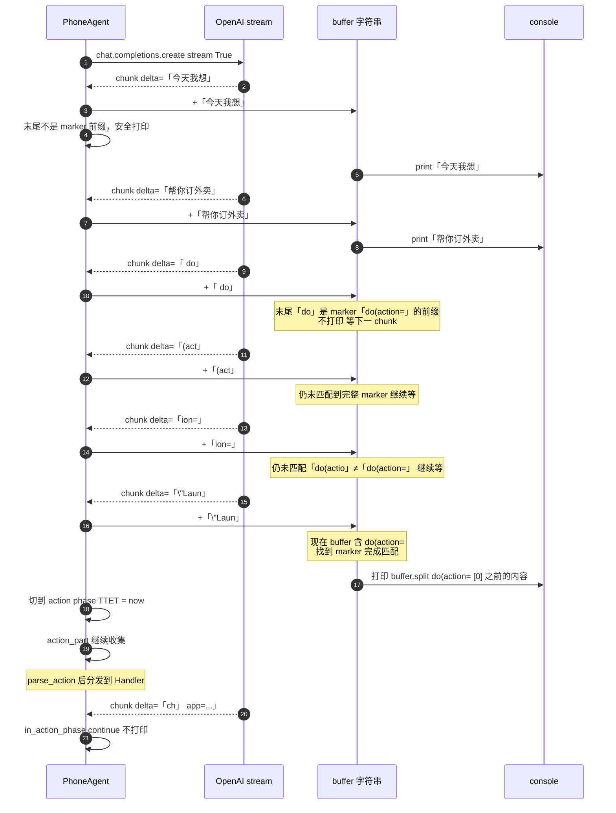
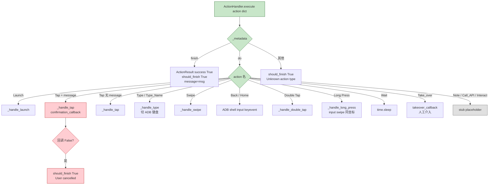
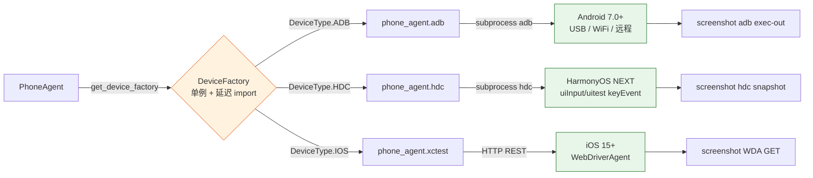
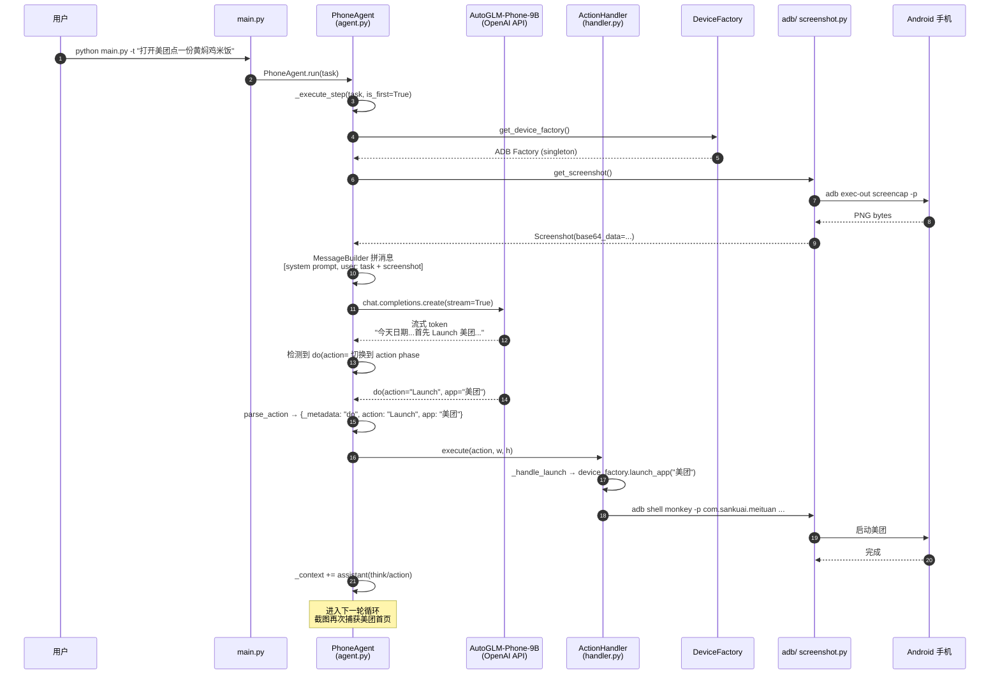

## 引子：当 LLM 学会「滑动手机」

2024 年底 OpenAI 发布 Computer-Use，2025 年初 Anthropic 推出 Claude Computer Use，「AI 操作电脑」正式从论文走向 demo。但**操作手机**这件事比操作电脑更难：屏幕更小、控件更密集、生命周期管理更复杂、安全边界更模糊。直到 2025 年下半年，智谱 AI 把自研的 `AutoGLM-Phone-9B` 视觉语言模型连同 **Phone Agent** 框架一起开源（[zai-org/Open-AutoGLM](https://github.com/zai-org/Open-AutoGLM)），5 个月斩获 25,690 ⭐，「让 LLM 帮你用手机」这件事才真正有了可落地的工程化范式。

Open-AutoGLM 的核心价值在于：**把"屏幕理解 + 操作意图 + 设备驱动"三条链路统一在同一套框架里**，同时兼容 Android (ADB)、HarmonyOS (HDC)、iOS (WebDriverAgent) 三种底层设备协议。它不只是一个"AI 自动化工具"，更是当前**唯一支持国产手机 OS** 的开源 Phone Agent 框架。本文从架构、模型协议、Action 主循环、相对坐标归一化、敏感操作拦截、iOS 适配等 9 个维度，深度剖析这套框架的设计哲学与工程取舍。

> ⚠️ 本文分析基于仓库 `zai-org/Open-AutoGLM`（Apache-2.0，⭐25,690）截至 2026-07-05 的源码。

---

## 一、项目定位与核心价值

### 1.1 一句话定义

**Open-AutoGLM = 9B VLM（AutoGLM-Phone）+ 标准动作协议 + ADB/HDC/WDA 三端适配 + think/action 主循环**，让开发者用 Python API 直接驱动真实手机完成复杂任务。

### 1.2 解决了什么问题

| 痛点 | 传统方案 | Open-AutoGLM |
|------|---------|--------------|
| App 没有开放 API | 写 Appium / uiautomator2 脚本，每次 UI 改版就失效 | VLM 直接看屏幕，UI 改版完全无感 |
| 任务跨度大（多步跳转） | RPA 厂商按流程固定，工作量大 | 自然语言一句话描述，模型自己规划 |
| 国产 ROM 自定义深 | 通用工具遇到 MIUI/HyperOS/ColorOS 截图就崩 | AutoGLM-Phone-9B 用中文 App 数据训练 |
| HarmonyOS 没适配 | 几乎所有开源框架只支持 ADB | 加了 HDC 模块，HarmonyOS NEXT 直接跑 |
| 想跑自己模型 | 闭源 SDK 绑定云服务 | OpenAI 兼容 API，本地 vLLM/SGLang 部署 |

### 1.3 仓库统计

| 指标 | 数据 |
|------|------|
| Stars | 25,690 |
| Forks | 公开，未列 |
| 主语言 | Python（90%）+ 文档/截图 |
| License | Apache-2.0 |
| 最近推送 | 2026-03-06 |
| 项目规模 | 89 个文件、~5,400 KB |
| 默认分支 | main |
| 模型权重 | [AutoGLM-Phone-9B](https://huggingface.co/zai-org/AutoGLM-Phone-9B)（中文）/ `9B-Multilingual`（英文） |
| 适配设备 | Android (ADB) + HarmonyOS (HDC) + iOS (WDA) |

> 备注：iOS 入口在独立的 `ios.py` 与 `phone_agent/agent_ios.py`，需要额外配置 WebDriverAgent（详见 [docs/ios_setup/ios_setup.md](https://github.com/zai-org/Open-AutoGLM/blob/main/docs/ios_setup/ios_setup.md)）。

---

## 二、整体架构

Open-AutoGLM 采用**「VLM 在云端、Agent 在本地、设备 SDK 在系统层」**的三层架构：

```mermaid
flowchart TB
    subgraph Client[用户侧]
        CLI[main.py CLI]
        SDK[Python SDK]
        Examples[examples/*.py]
    end

    subgraph Agent[Agent 层 phone_agent/*]
        AgentMain[PhoneAgent.run 主循环]
        ActionHandler[ActionHandler 动作分发]
        DeviceFactory[DeviceFactory 设备工厂]
        Timing[TIMING_CONFIG 节奏控制]
        Config[config/ 提示词+应用字典+i18n]
    end

    subgraph Device[设备层 phone_agent/{adb,hdc,xctest}]
        ADBMod[adb/ USB/WiFi/远程]
        HDCMod[hdc/ HarmonyOS]
        XDMod[xctest/ WDA iOS]
    end

    subgraph Model[VLM 层]
        AutoGLM[AutoGLM-Phone-9B<br/>vLLM/SGLang/BigModel]
        OpenAIAPI[OpenAI 兼容 API]
    end

    subgraph Devices[物理设备]
        Android[Android 7.0+]
        HarmonyOS[HarmonyOS NEXT]
        iPhone[iOS 15+]
    end

    CLI --> AgentMain
    SDK --> AgentMain
    Examples --> AgentMain

    AgentMain --> ActionHandler
    AgentMain --> Config
    AgentMain --> OpenAIAPI
    OpenAIAPI --> AutoGLM

    ActionHandler --> DeviceFactory
    ActionHandler --> Timing
    DeviceFactory --> ADBMod
    DeviceFactory --> HDCMod
    DeviceFactory --> XDMod

    ADBMod --> Android
    HDCMod --> HarmonyOS
    XDMod --> iPhone
```

**模块职责拆解**：

| 包 | 路径 | 职责 |
|----|------|------|
| `phone_agent.agent` | `agent.py` + `agent_ios.py` | 主循环（截图→拼消息→请求 VLM→解析→执行→重试） |
| `phone_agent.actions` | `handler.py` + `handler_ios.py` | 14 类标准 Action 的安全分发 |
| `phone_agent.device_factory` | `device_factory.py` | ADB/HDC/iOS 三选一的工厂模式 + 全局单例 |
| `phone_agent.adb` | 4 个文件 | ADB 连接、截图、输入、设备控制 |
| `phone_agent.hdc` | 4 个文件 | HarmonyOS HDC 适配层（Android API Mirror） |
| `phone_agent.xctest` | 4 个文件 | iOS WebDriverAgent HTTP API 封装 |
| `phone_agent.model` | `client.py` | OpenAI 兼容流式客户端 + 性能埋点 |
| `phone_agent.config` | 7 个文件 | 系统提示词（中英双版本）、应用字典、节奏配置、i18n |

---

## 三、模型协议：Think/Action 二段式输出

Open-AutoGLM 最核心的设计是**让 VLM 用固定格式输出 thinking 和 action**。模型不是「直接给屏幕坐标」，而是先 reasoning、再具体指令。这套协议贯穿 prompt、客户端解析、ActionHandler 三层。

### 3.1 系统提示词模板（中英双版本）

模型必须严格输出：

```text
今天的日期是: 2026年07月05日 星期日
你是一个智能体分析专家，可以根据操作历史和当前状态图执行一系列操作来完成任务。
你必须严格按照要求输出以下格式：
<>hink{think}</>hink
<answer>{action}</answer>
```

Action 是一段**字符串表达式**，形如：

- `do(action="Launch", app="微信")` — 启动 App
- `do(action="Tap", element=[512, 800])` — 点击坐标（**相对坐标 0–999**）
- `do(action="Tap", element=[512, 800], message="支付")` — 触发敏感拦截
- `do(action="Type", text="北京美食")` — 文本输入
- `do(action="Swipe", start=[500, 800], end=[500, 200])` — 滑动
- `do(action="Back")` / `do(action="Home")` / `do(action="Long Press", element=[x,y])`
- `do(action="Double Tap", element=[x,y])` / `do(action="Wait", duration="2 seconds")`
- `do(action="Note", message="True")` / `do(action="Call_API", instruction="...")`
- `do(action="Take_over", message="需要登录")` — **请求用户接管**
- `do(action="Interact")` — **触发交互询问**
- `finish(message="任务完成，已点好外卖")`

完整提示词长达 18 条规则（来自 `phone_agent/config/prompts_zh.py`），核心规则示例：

| # | 规则 | 工程目的 |
|---|------|----------|
| 1 | 操作前先检查 current_app，否则先 Launch | 防止误点到桌面 |
| 2 | 进错页面先 Back | 状态恢复 |
| 3 | 页面未加载最多连续 Wait 三次，否则 Back | 防止死循环 |
| 11 | 用户的特殊要求可执行多次搜索、滑动查找 | 允许模糊匹配 |
| 14 | 上一步没生效时先 Wait，再调整坐标，再 fallback | 容错 |
| 18 | 任务结束前再检查一次是否漏选/错选 | 兜底 |

### 3.2 流式解析：等待「do(action=」边界出现再切分

VLM 推理输出是流式的，Open-AutoGLM 的客户端 `phone_agent/model/client.py` 必须**精确判断「推理段结束 + 动作段开始」**的分界线。代码实现非常巧妙：

```python
# 来自 phone_agent/model/client.py:746-867
def request(self, messages):
    start_time = time.time()
    time_to_first_token = None
    time_to_thinking_end = None

    stream = self.client.chat.completions.create(
        messages=messages,
        model=self.config.model_name,
        max_tokens=self.config.max_tokens,
        temperature=self.config.temperature,
        top_p=self.config.top_p,
        frequency_penalty=self.config.frequency_penalty,
        stream=True,
    )

    raw_content = ""
    buffer = ""  # 关键：缓冲可能成为 marker 的前缀
    action_markers = ["finish(message=", "do(action="]
    in_action_phase = False
    first_token_received = False

    for chunk in stream:
        if len(chunk.choices) == 0:
            continue
        content = chunk.choices[0].delta.content
        if content is None:
            continue
        raw_content += content

        if not first_token_received:
            time_to_first_token = time.time() - start_time
            first_token_received = True

        if in_action_phase:
            continue  # 已经进入动作段，不再打印

        buffer += content

        # 1. 检查 marker 是否完整出现
        for marker in action_markers:
            if marker in buffer:
                thinking_part = buffer.split(marker, 1)[0]
                print(thinking_part, end="", flush=True)
                print()
                in_action_phase = True
                if time_to_thinking_end is None:
                    time_to_thinking_end = time.time() - start_time
                break
        else:
            # 2. 检查 buffer 末尾是否是 marker 的前缀
            is_potential_marker = False
            for marker in action_markers:
                for i in range(1, len(marker)):
                    if buffer.endswith(marker[:i]):
                        is_potential_marker = True
                        break
                if is_potential_marker:
                    break

            if not is_potential_marker:
                print(buffer, end="", flush=True)
                buffer = ""
```

**两个关键技巧**：

1. **延迟打印（prefix-aware buffering）**：当 `buffer` 末尾刚好是 `d` / `do` / `do(` / `do(act` 等 marker 前缀时，**不清空 buffer**，等下一 chunk 进来确认是不是 `do(action=`，避免误判把 `do(act` 后的字符当 thinking 打印出去。
2. **TTFT 埋点**：模型收到第一个 token 的延迟、thinking 段结束的延迟（进入 action 段），分别记录为 `time_to_first_token` 和 `time_to_thinking_end`，方便上层做性能监控。

下面的序列图展示了一次完整推理 + 解析的时序：



解析函数 `_parse_response` 的 fallback 顺序：

| 优先级 | 标志位 | 用途 |
|--------|--------|------|
| 1 | `finish(message=` | 任务终止消息 |
| 2 | `do(action=` | 正常动作指令 |
| 3 | `<answer>` | 旧版 XML 兼容 |
| 4 | — | 整段当 action（异常 fallback） |

### 3.3 应用字典：200+ App 的中文名 → package 名映射

`phone_agent/config/apps.py` 内置了一张 **Chinese-name → package name** 的映射表，是 Phone Agent 在真实任务里能精准启动 App 的基础（`Launch` action 需要 app 名，但底层 `am start` 需要 package name）：

```python
# 来自 phone_agent/config/apps.py:1153-1300
APP_PACKAGES: dict[str, str] = {
    # 社交 & 即时通信
    "微信": "com.tencent.mm",
    "QQ": "com.tencent.mobileqq",
    # 电商
    "淘宝": "com.taobao.taobao",
    "京东": "com.jingdong.app.mall",
    "拼多多": "com.xunmeng.pinduoduo",
    # 内容
    "小红书": "com.xingin.xhs",
    "抖音": "com.ss.android.ugc.aweme",
    "bilibili": "tv.danmaku.bili",
    # 本地生活
    "美团": "com.sankuai.meituan",
    "饿了么": "me.ele",
    # ... 共 ~50 个中文 App + ~150 个英文 App
    "Booking.com": "com.booking",
    "Duolingo": "com.duolingo",
    "Google Calendar": "com.google.android.calendar",
}
```

**巧妙处**：同一 App 的多种写法（"淘宝闪购"/"淘宝" 都映射到 `com.taobao.taobao`、"Booking"/"BOOKING.COM" 都映射 `com.booking`），都映射到同一 package——VLM 在 thinking 阶段可能产生不同拼写，但底层能鲁棒启动。

### 3.4 节奏可配置：所有 sleep 都过 TIMING_CONFIG

跨设备最大的坑是**操作节奏**——同一个 Tap 在低配机上需要 1.5s 响应，高配机 0.5s 就够。Open-AutoGLM 把所有 delay 抽到 `phone_agent/config/timing.py`：

```python
# 来自 phone_agent/config/timing.py
@dataclass
class ActionTimingConfig:
    keyboard_switch_delay: float = 1.0   # 切换 ADB 键盘等待
    text_clear_delay: float = 1.0         # 清空文字等待
    text_input_delay: float = 1.0         # 输入文字等待
    keyboard_restore_delay: float = 1.0   # 还原原键盘等待

@dataclass
class DeviceTimingConfig:
    default_tap_delay: float = 1.0
    default_swipe_delay: float = 1.0
    default_back_delay: float = 1.0
    default_home_delay: float = 1.0
    default_launch_delay: float = 1.0
    # ...

@dataclass
class ConnectionTimingConfig:
    adb_restart_delay: float = 2.0
    server_restart_delay: float = 1.0
```

并且**全部支持环境变量覆盖**（`__post_init__` 自动读 `PHONE_AGENT_*` env），用户无需改代码就能调节奏。这是横跨 Android/HarmonyOS/iOS/不同 ROM 时的关键工程化设计。

---

## 四、Action 执行层：14 类标准指令 + 敏感操作接管

`phone_agent/actions/handler.py` 是 VLM 输出与设备命令的"翻译官"，分两层：第一层区分 `_metadata` 是 `"finish"` / `"do"` 还是其他；第二层按 action 名查 handler。

### 4.1 Handler 分发表

```python
# 来自 phone_agent/actions/handler.py:94-112
def _get_handler(self, action_name: str) -> Callable | None:
    handlers = {
        "Launch": self._handle_launch,
        "Tap": self._handle_tap,
        "Type": self._handle_type,
        "Type_Name": self._handle_type,   # 别名共用
        "Swipe": self._handle_swipe,
        "Back": self._handle_back,
        "Home": self._handle_home,
        "Double Tap": self._handle_double_tap,
        "Long Press": self._handle_long_press,
        "Wait": self._handle_wait,
        "Take_over": self._handle_takeover,
        "Note": self._handle_note,
        "Call_API": self._handle_call_api,
        "Interact": self._handle_interact,
    }
    return handlers.get(action_name)
```

**两点设计哲学**：

- Type 与 Type_Name 共用 handler：人名输入和普通文本输入在手势上完全相同，只是给模型不同的语义标签。这种「语义化的别名共享」减少了 boilerplate。
- 3 个 placeholder Handler：`Note`、`Call_API`、`Interact` 都是 stub（只 return `ActionResult(True, False)`），留给上层业务集成（录制内容、调用外部 API 摘要、向用户确认选择）。

Handler 分发流程如下：



### 4.2 相对坐标归一化：屏幕尺寸无关的 VLM 友好设计

VLM 在屏幕上输出坐标时，如果用绝对像素，训练时见过的 1080×2400 设备换到 1440×3200 就会全错。Open-AutoGLM **强制让模型在 0–999 相对坐标空间输出**，底层再换算回绝对像素：

```python
# 来自 phone_agent/actions/handler.py:114-120
def _convert_relative_to_absolute(
    self, element: list[int], screen_width: int, screen_height: int
) -> tuple[int, int]:
    """Convert relative coordinates (0-1000) to absolute pixels."""
    x = int(element[0] / 1000 * screen_width)
    y = int(element[1] / 1000 * screen_height)
    return x, y
```

```python
# 来自 phone_agent/adb/device.py:711-741
def swipe(self, start_x, start_y, end_x, end_y,
          duration_ms=None, device_id=None, delay=None):
    if duration_ms is None:
        # 滑动时长基于距离自适应（最少 1000ms，最多 2000ms）
        dist_sq = (start_x - end_x) ** 2 + (start_y - end_y) ** 2
        duration_ms = int(dist_sq / 1000)
        duration_ms = max(1000, min(duration_ms, 2000))  # clamp

    subprocess.run(
        adb_prefix + ["shell", "input", "swipe",
                       str(start_x), str(start_y),
                       str(end_x), str(end_y),
                       str(duration_ms)],
        capture_output=True,
    )
```

**工程意义**：

- 训练数据永远在 0–999 空间，模型迁移到任何分辨率设备都不用重新训练
- 滑动时长基于「相对距离²」自适应，避免短距离用 1000ms（太慢）或长距离用 500ms（太快）的极端

### 4.3 敏感操作双重拦截

包含支付、转账、隐私销毁类按钮的 Tap，模型必须额外传 `message` 字段，触发人工确认：

```python
# 来自 phone_agent/actions/handler.py:134-153
def _handle_tap(self, action, width, height) -> ActionResult:
    element = action.get("element")
    if not element:
        return ActionResult(False, False, "No element coordinates")

    x, y = self._convert_relative_to_absolute(element, width, height)

    # 关键设计：敏感操作双重拦截
    if "message" in action:
        if not self.confirmation_callback(action["message"]):
            return ActionResult(
                success=False,
                should_finish=True,            # 终止整个任务
                message="User cancelled sensitive operation",
            )

    device_factory.tap(x, y, self.device_id)
    return ActionResult(True, False)
```

而 `Take_over` 则是**主动请求人工接管**（登录、验证码场景）：

```python
# 来自 phone_agent/actions/handler.py:239-243
def _handle_takeover(self, action, width, height) -> ActionResult:
    message = action.get("message", "User intervention required")
    self.takeover_callback(message)  # 默认调用 console input()
    return ActionResult(True, False)
```

**两者的差异**：
- `Tap + message`：**强拦截**——必须用户确认才执行（支付场景）
- `Take_over(message)`：**谦逊移交**——任务让出控制权，等用户操作完按回车继续（登录场景）

这个区分让模型既能"知道自己在做什么危险的事"（Tap + 敏感 message），也能"承认自己处理不了"（Take_over 把锅丢回给人）。

---

## 五、设备层：ADB / HDC / WDA 三端适配

`device_factory.py` 用经典工厂模式屏蔽三种底层协议差异：

```python
# 来自 phone_agent/device_factory.py:551-590
class DeviceType(Enum):
    ADB = "adb"
    HDC = "hdc"
    IOS = "ios"


class DeviceFactory:
    def __init__(self, device_type: DeviceType = DeviceType.ADB):
        self.device_type = device_type
        self._module = None

    @property
    def module(self):
        if self._module is None:
            if self.device_type == DeviceType.ADB:
                from phone_agent import adb
                self._module = adb
            elif self.device_type == DeviceType.HDC:
                from phone_agent import hdc
                self._module = hdc
            else:
                raise ValueError(f"Unknown device type: {self.device_type}")
        return self._module

    # 透传方法：get_screenshot / tap / swipe / launch_app / type_text 等
    def tap(self, x, y, device_id=None, delay=None):
        return self.module.tap(x, y, device_id, delay)

    # ...

# 全局单例（set_device_type + get_device_factory）
_device_factory: DeviceFactory | None = None

def set_device_type(device_type: DeviceType):
    global _device_factory
    _device_factory = DeviceFactory(device_type)

def get_device_factory() -> DeviceFactory:
    global _device_factory
    if _device_factory is None:
        _device_factory = DeviceFactory(DeviceType.ADB)  # 默认 ADB
    return _device_factory
```

**关键设计**：

- 延迟 import：`_module` 在第一次访问时才 import 对应包，避免 Android-only 用户引入 HarmonyOS/iOS 依赖
- 全局单例：通过 `set_device_type()` 在启动时确定，运行期切换无意义（同一手机不能切协议）
- 统一接口：所有 tap/swipe/launch_app 等方法签名一致，handler 不需要写三遍

下面这张图展示了设备工厂在不同设备类型间的 routing 逻辑：



### 5.1 ADB 连接管理

`phone_agent/adb/connection.py` 实现了完整的连接管理：

```python
# 来自 phone_agent/adb/connection.py:60-99
def connect(self, address: str, timeout: int = 10) -> tuple[bool, str]:
    if ":" not in address:
        address = f"{address}:5555"  # 默认端口

    result = subprocess.run(
        [self.adb_path, "connect", address],
        capture_output=True, text=True, timeout=timeout,
    )
    output = result.stdout + result.stderr

    if "connected" in output.lower():
        return True, f"Connected to {address}"
    elif "already connected" in output.lower():
        return True, f"Already connected to {address}"
    return False, output.strip()
```

支持三种连接方式：
- **USB** — 直接数据线
- **WiFi/TCP/IP** — `adb tcpip 5555` 后用 IP 连接
- **Remote** — 连接远程开发机暴露的 ADB 端口

`adb shell ip route` / `ip addr show wlan0` 自动获取设备 IP，方便 WiFi 调试。

### 5.2 HDC：HarmonyOS NEXT 的镜像适配

`phone_agent/hdc/connection.py` 是 HarmonyOS NEXT 的 `hdc` 工具镜像实现，接口签名几乎 1:1 复刻 `adb`。但 HarmonyOS 在某些特殊 keycode（如 Enter）用了不同的数值：

```python
# 来自 phone_agent/actions/handler.py:274-300（HDC 分支）
if device_factory.device_type == DeviceType.HDC:
    hdc_prefix = ["hdc", "-t", self.device_id] if self.device_id else ["hdc"]

    # KEYCODE_ENTER (66) -> 2054 (HarmonyOS Enter key code)
    if keycode == "KEYCODE_ENTER" or keycode == "66":
        subprocess.run(
            hdc_prefix + ["shell", "uitest", "uiInput", "keyEvent", "2054"],
            capture_output=True, text=True,
        )
    else:
        # 其他按键回退到 ADB 风格（部分支持）
        try:
            if keycode.startswith("KEYCODE_"):
                if "ENTER" in keycode:
                    # 同上 ENTER 分支
                else:
                    subprocess.run(
                        hdc_prefix + ["shell", "input", "keyevent", keycode],
                        capture_output=True, text=True,
                    )
```

这是 Open-AutoGLM 区别于其他开源 Phone Agent 框架的关键差异化能力——**支持 HarmonyOS**。考虑到华为手机在国内市场份额，这是必选项。

### 5.3 iOS 适配：WebDriverAgent HTTP 抽象

iOS 不能直接安装 ADB，所以走 WebDriverAgent（WDA）协议，在 iPhone 上跑一个 HTTP 服务：

```python
# 来自 phone_agent/agent_ios.py:329-359
class IOSPhoneAgent:
    def __init__(self, model_config, agent_config,
                 confirmation_callback=None, takeover_callback=None):
        self.model_config = model_config or ModelConfig()
        self.agent_config = agent_config or IOSAgentConfig()

        self.model_client = ModelClient(self.model_config)

        # 初始化 WDA 连接
        self.wda_connection = XCTestConnection(wda_url=self.agent_config.wda_url)

        # 自动创建 session（如未指定）
        if self.agent_config.session_id is None:
            success, session_id = self.wda_connection.start_wda_session()
            if success and session_id != "session_started":
                self.agent_config.session_id = session_id
                if self.agent_config.verbose:
                    print(f"✅ Created WDA session: {session_id}")

        self.action_handler = IOSActionHandler(
            wda_url=self.agent_config.wda_url,
            session_id=self.agent_config.session_id,
            confirmation_callback=confirmation_callback,
            takeover_callback=takeover_callback,
        )

        self._context = []
        self._step_count = 0
```

iOS 的 `_execute_step` 主循环和 Android 版本几乎一致，差异只在「截图来源 / 输入源」。WDA 通过 HTTP `/screenshot` 返回图片，通过 `/wda/tap` 接受点击，API 比 ADB 啰嗦但更稳定（苹果签名机制不允许直接 access 屏幕）。

---

## 六、端到端执行流：从一句话到完成外卖点单

下面用「打开美团点一份黄焖鸡米饭」为示例展示完整数据流：



主循环核心代码（来自 `phone_agent/agent.py:88-114`）：

```python
def run(self, task: str) -> str:
    self._context = []
    self._step_count = 0

    # 第一步：构造 system + user 消息
    result = self._execute_step(task, is_first=True)
    if result.finished:
        return result.message or "Task completed"

    # 后续步骤：每步拿最新截图注入 user 消息
    while self._step_count < self.agent_config.max_steps:
        result = self._execute_step(is_first=False)
        if result.finished:
            return result.message or "Task completed"

    return "Max steps reached"
```

每一步的核心（来自 `phone_agent/agent.py:140-247`）：

```python
def _execute_step(self, user_prompt=None, is_first=False) -> StepResult:
    self._step_count += 1

    # 1. 截图 + 当前 App 名
    device_factory = get_device_factory()
    screenshot = device_factory.get_screenshot(self.agent_config.device_id)
    current_app = device_factory.get_current_app(self.agent_config.device_id)

    # 2. 拼消息：system + user(text + image)
    if is_first:
        self._context.append(
            MessageBuilder.create_system_message(self.agent_config.system_prompt)
        )
        screen_info = MessageBuilder.build_screen_info(current_app)
        text_content = f"{user_prompt}\n\n{screen_info}"
        self._context.append(
            MessageBuilder.create_user_message(text=text_content,
                                               image_base64=screenshot.base64_data)
        )
    else:
        screen_info = MessageBuilder.build_screen_info(current_app)
        text_content = f"** Screen Info **\n\n{screen_info}"
        self._context.append(
            MessageBuilder.create_user_message(text=text_content,
                                               image_base64=screenshot.base64_data)
        )

    # 3. 调 VLM
    response = self.model_client.request(self._context)

    # 4. 解析 action（容错：解析失败自动 finish）
    action = parse_action(response.action)
    if isinstance(action_error := None, ValueError):
        action = finish(message=response.action)

    # 5. 执行（context 中移除图片省 token）
    self._context[-1] = MessageBuilder.remove_images_from_message(self._context[-1])
    result = self.action_handler.execute(action, screenshot.width, screenshot.height)

    # 6. 回灌 assistant 消息（think+answer 双段）
    self._context.append(
        MessageBuilder.create_assistant_message(
            f"<>hink{response.thinking}</>hink<answer>{response.action}</answer>"
        )
    )

    # 7. 终止判定
    finished = action.get("_metadata") == "finish" or result.should_finish
    return StepResult(success=result.success, finished=finished,
                      action=action, thinking=response.thinking,
                      message=result.message or action.get("message"))
```

**几个巧妙的工程取舍**：

1. **第一步把任务拼到 user 消息，后续步骤只注入 screen info**：不让原始任务重复出现在上下文，节省 token
2. **`remove_images_from_message` 在加入上下文前一刻执行**：模型实时推理用的是最新截图，但**回灌 assistant/下一轮时**只保留文本（screenshots 不永久占 context）
3. **解析失败自动 finish**：模型输出不可解析时不崩溃，回退到「以模型输出当 finish message」的优雅降级

---

## 七、与同类项目对比

「AI 操作手机」这个赛道目前有三类代表项目，Open-AutoGLM 取了一个中间位：

| 维度 | Open-AutoGLM | Claude Computer Use | AppAgent / Mobile-Agent |
|------|--------------|---------------------|--------------------------|
| **底层模型** | 9B 专用 VLM（公开权重） | Anthropic Claude Opus 4（闭源） | GPT-4V / Claude（闭源 API） |
| **设备控制** | ADB / HDC / WDA 三协议 | 计算机 UI 全栈 | ADB（仅 Android） |
| **架构透明度** | 完整开源 | 闭源 | 部分开源 |
| **国产 ROM 适配** | ✅ 直接支持 | ❌ 需要 PC | ⚠️ 未深度测试 |
| **HarmonyOS** | ✅ 内置 HDC 模块 | ❌ | ❌ |
| **iOS 支持** | ✅ WDA 模块 | ❌ PC only | ⚠️ 部分 |
| **think/action 协议** | ✅ 自研 think + answer 双段 | 内部 | 自研 |
| **敏感操作拦截** | Tap + message 强拦截 | 仅 UI 提示 | 部分 |
| **人工接管** | Take_over action | 不可 | 不可 |
| **应用启动速度** | 直接调 package 名（adb monkey） | 需找图标点击 | 需找图标点击 |
| **性能** | 9B 本地可跑（消费级 GPU） | 闭源 API token 计费 | 闭源 API token 计费 |
| **价格** | 免费 | ~$15/M tokens | ~$15/M tokens |

**核心差异总结**：

- **Open-AutoGLM vs Claude Computer Use**：前者走「手机专用 + 开源 9B 模型 + 标准协议」路线，目标是「能让消费级 GPU 跑」；后者走「闭源云端 + 计算机通用」路线，目标是大模型厂商的场景演示。两者**不是直接对手**——前者比部署成本，后者比通用能力。
- **Open-AutoGLM vs AppAgent/Mobile-Agent**：这三者最接近。Open-AutoGLM 多了 HarmonyOS (HDC)、iOS (WDA)、系统级相对坐标归一化、节奏可配置、TTFT/TTET 性能埋点，是工程完成度更高的版本。

### 设计哲学 vs Computer Use 的本质差异

| 维度 | Computer Use | Phone Agent |
|------|--------------|-------------|
| **目标设备** | PC（屏幕大、控件大、图标清晰） | 手机（屏幕小、控件密集、热区重叠） |
| **动作空间** | 鼠标点击 + 键盘 | Tap / Long Press / Swipe / 双击 + 软键盘 |
| **坐标精度** | 16px 容错即可 | 8px 容错已困难，0–999 相对坐标系统是刚需 |
| **状态切换** | Alt-Tab / 切窗口 | App 切换 + 多任务栈 |
| **横竖屏** | 不存在 | 必须处理 |
| **应用启动** | 从桌面点击图标或搜索 | `Launch` action 直接调 package 名绕过点击 |

Phone Agent 的本质难度是**「屏幕密度高 + 控件尺寸小 + 误触代价大」**，所以才有相对坐标归一化、敏感操作拦截、`Take_over` 人工接管这些工程设计——这是 Open-AutoGLM 在 `Computer Use` 之外独立开发的核心理由。

---

## 八、优缺点分析

### 8.1 架构层面

| 维度 | 优点 | 缺点 |
|------|------|------|
| **架构简洁性** | 三层解耦清晰（VLM / Agent / 设备 SDK），Handler 分发表只有 14 个 key，几乎一览无余 | 跨设备封装仍偏重 — `device_factory` 没完全抽到接口层；Android 分支和 iOS 分支两套 Agent 类有 ~70% 代码重复 |
| **扩展性** | Action 协议字符串化（`do(action="X", ...)`），新增动作只需在 `_get_handler` 加一行 + 实现 handler；prompt 和 handler 完全解耦 | 设备协议层是 `subprocess.run` 直接调 ADB/HDC，没有抽象 `DeviceDriver` 接口，未来加 macOS / Windows 设备要重写 |
| **易用性** | 一行 `PhoneAgent(model_config).run(task)` 跑完整流程；环境变量覆盖全部 timing | 部署门槛：必须先启 vLLM/SGLang 部署 AutoGLM-Phone-9B（或用智谱 BigModel），9B 模型对显存 > 16GB |
| **多语言支持** | 中英 prompt 双版本 + i18n message | 模型权重要选对（中文用 `-Phone-9B`，英文用 `-Multilingual`），新手容易踩坑 |

### 8.2 工程层面

| 维度 | 优点 | 缺点 |
|------|------|------|
| **性能** | 流式输出首 token 后立刻可读 thinking；TTFT/TTET 埋点方便监控；启动 App 用 package 名比点击图标快 ~3 倍 | 9B VLM 推理延迟通常 1.5–4 秒 / step，纯 PC 操作 User 比可慢一个数量级；显存需求 16GB+ |
| **复杂度** | 协议规范清晰（14 类 Action），内部耦合度低（handler 和 prompt 解耦） | 端到端 test 不容易：需要真实手机 + ADB + 模型服务 + 干净测试 App |
| **维护性** | Apache-2.0，三个月内 5+ 迭代；HarmonyOS/iOS 同步进化；`privacy_policy` 表明有合规意识 | 模型权重和 prompt 强耦合（如果换成 Qwen-VL 或 InternVL 就要重新调 prompt），缺乏标准化评估 |
| **安全** | 敏感操作 Tap + message 强拦截；Take_over 让模型在登录/验证码场景主动让位；不连接外部网络 | 默认 confirmation 是 console `input()`，无人值守场景需要用户自行实现 |

---

## 九、实践：3 分钟跑通一个真实任务

### 9.1 准备

```bash
# 1. 启动手机开发者模式 + USB 调试
# 设置 → 关于手机 → 连续点击 7 次 "版本号"
# 设置 → 开发者选项 → USB 调试

# 2. 安装 ADB Keyboard（Android 必需，鸿蒙不需要）
# 下载 https://github.com/senzhk/ADBKeyBoard/blob/master/ADBKeyboard.apk
adb install ADBKeyboard.apk
adb shell ime enable com.android.adbkeyboard/.AdbIME
adb shell ime set com.android.adbkeyboard/.AdbIME

# 3. 连接手机
adb devices  # 应该看到你的设备

# 4. 启动 VLM 服务（用智谱 BigModel，无需本地 GPU）
export PHONE_AGENT_BASE_URL="https://open.bigmodel.cn/api/paas/v4"
export PHONE_AGENT_MODEL="autoglm-phone-9b"
export PHONE_AGENT_API_KEY="<your_zhipu_api_key>"
```

### 9.2 跑任务

```bash
# 方式 1：CLI
python main.py --task "打开小红书搜索北京美食攻略"

# 方式 2：Python SDK
python examples/basic_usage.py
```

`examples/basic_usage.py` 核心示例：

```python
from phone_agent import PhoneAgent
from phone_agent.agent import AgentConfig
from phone_agent.model import ModelConfig


model_config = ModelConfig(
    base_url="https://open.bigmodel.cn/api/paas/v4",
    model_name="autoglm-phone-9b",
    temperature=0.1,
)

agent_config = AgentConfig(
    max_steps=50,
    verbose=True,
    lang="cn",
)

agent = PhoneAgent(model_config=model_config, agent_config=agent_config)
result = agent.run("打开小红书搜索北京美食攻略")
print(f"任务结果: {result}")
```

### 9.3 高级用法：自定义接管回调 + 自动确认

```python
import threading
from queue import Queue

# 用于跨线程通信的确认队列
confirm_queue = Queue()

def submit_confirmation(message: str) -> bool:
    """把确认消息推到队列，由另一个线程（前端/Web）处理后入队 True/False"""
    confirm_queue.put(("confirm", message, threading.Event()))
    evt = confirm_queue.get()  # 阻塞等前端响应
    return evt == "yes"

def submit_takeover(message: str) -> None:
    """把接管请求通知前端，让前端展示手动接管界面"""
    confirm_queue.put(("takeover", message, threading.Event()))
    confirm_queue.get()  # 等用户操作完确认

agent = PhoneAgent(
    model_config=model_config,
    agent_config=agent_config,
    confirmation_callback=submit_confirmation,
    takeover_callback=submit_takeover,
)

result = agent.run("在淘宝下单这个商品")
print(f"最终结果: {result}")
```

### 9.4 部署自己的模型（可选）

```bash
# 使用 vLLM 部署 AutoGLM-Phone-9B
python -m vllm.entrypoints.openai.api_server \
    --model zai-org/AutoGLM-Phone-9B \
    --served-model-name autoglm-phone-9b \
    --port 8000 \
    --max-model-len 8192

# 然后启动 Phone Agent 指向本地服务
export PHONE_AGENT_BASE_URL="http://localhost:8000/v1"
export PHONE_AGENT_MODEL="autoglm-phone-9b"
export PHONE_AGENT_API_KEY="EMPTY"

python main.py --task "在京东搜索无线耳机"
```

---

## 十、趋势与总结

### 10.1 三个未来趋势

**趋势 1：Phone Agent 会成为 Agent 框架的"标配 vertical"**

Computer Use 的本质是 LLM 看着屏幕点 UI，Phone Agent 是 LLM 看着手机点 App。两者技术栈高度相似，但手机场景因为**屏幕密度 + 控件精度 + 应用数量 + 多模态 UI** 的复杂度更高，会率先推动 **Action 协议化 + 相对坐标 + 节奏控制** 这三个工程范式的标准化。预计未来 12 个月内：

- OpenAI / Anthropic / Google 都会推出官方 Phone Agent 子产品
- 第三方 Phone Agent 框架会围绕「垂直场景」（点外卖 / 抢票 / 出行 / 办公）做差异化
- `Take_over` 协议会被标准化为 `request_human_input(action_type, payload)` 协议

**趋势 2：从「OpenAI 兼容 API」走向「MCP 协议」**

当前 Open-AutoGLM 的 VLM 接口走 OpenAI 兼容协议（`/v1/chat/completions`），下一步演进大概率是 **MCP (Model Context Protocol) 化**：把「截图」「屏幕信息」抽象成 MCP Resource，把 14 个 Action 抽象成 MCP Tool，把 Take_over 抽象成 MCP Sampling Callback。这会让 Phone Agent 框架**第一次能直接被 Claude Desktop / Cursor / Codex 调用**，而无需 Python SDK 集成。

**趋势 3：本地化趋势 — 9B 模型 + 消费级 GPU**

AutoGLM-Phone-9B 模型在 14B/9B 级别已经在多个公开测试集（AndroidLab、MobileAgentBench）上接近 GPT-4V，这说明 **Phone Agent 任务不需要 70B+ 的大模型**。消费级显卡（4090/5090）跑 9B VLM 完全够用，意味着：

- Phone Agent 会从「云服务计费」回归「本地推理」，隐私/离线体验大幅改善
- 国产 NPU（华为 MDC、地平线 J6）会推出专用 VLM 加速
- 配套的「屏幕理解 benchmark」「App 完成率评测」会先于模型本身成熟

### 10.2 工程经验提炼

从源码设计中可以提炼出几条**对其他 Agent 框架有借鉴意义**的经验：

1. **Action 必须有显式 schema + str 化**：不要让模型输出结构化对象（dict/JSON Schema），让它输出「类代码字符串」，**解析容错性大幅提升**，fallback 容易实现
2. **缓冲 + prefix-aware marker 检测**：流式推理时分段要严谨——既要等 marker 完整出现，又不能在 buffer 末是 marker 前缀时把字符提早吐出
3. **节奏（T timing）必须可配置**：跨设备部署最大的坑是节奏，全部集中到 `TIMING_CONFIG` 一个 dataclass + env override 是最务实的做法
4. **相对坐标归一化**：让模型在固定空间（0–999）输出，部署到任意分辨率设备都不用重新训练——**这是 VLM × 屏幕操作场景的通用设计**
5. **敏感操作双层拦截**：强拦截（Tap + message 必须用户确认）+ 谦逊移交（Take_over 主动让位）两种语义不同，分开建模
6. **设备协议层做透传抽象**：ADB/HDC/WDA 三个不同协议在 `device_factory.py` 内做延迟 import + 单例 + 统一接口，handler 层只调用统一 API，不感知底层差异

### 10.3 总结

Open-AutoGLM 把 **「让 LLM 帮你玩手机」** 这件事从 hackathon demo 推向**工程化框架**。它用三协议统一（ADB/HDC/WDA）、14 类 Action 协议化、相对坐标归一化、流式 prefix-aware 解析、四级 i18n 应用字典、可配置节奏系统，把 Phone Agent 这个赛道的**工程门槛**压到了「会 Python + 有 Android 手机」就足够。在 25,690 ⭐、Apache-2.0、智谱 AI 持续投入的三重保障下，它已经成为国内开发者构建手机自动化方案的**默认起点**。

如果你打算上手 AI Phone Agent，**Open-AutoGLM 是 2026 年最值得研究的开源项目之一**——不是因为它最完美，而是因为它在「VLM × 真实设备 × 工程约束」这个交叉点上，把 90% 的常见坑都替你踩过了一遍。

---

## 附录：关键资源

| 类别 | 资源 |
|------|------|
| **GitHub 仓库** | https://github.com/zai-org/Open-AutoGLM |
| **官方博客** | https://autoglm.z.ai/blog |
| **中文模型权重** | https://huggingface.co/zai-org/AutoGLM-Phone-9B |
| **英文模型权重** | https://huggingface.co/zai-org/AutoGLM-Phone-9B-Multilingual |
| **ModelScope 镜像** | https://modelscope.cn/models/ZhipuAI/AutoGLM-Phone-9B |
| **智谱 BigModel API** | https://bigmodel.cn/glm-coding |
| **iOS 配置文档** | https://github.com/zai-org/Open-AutoGLM/blob/main/docs/ios_setup/ios_setup.md |
| **ADB Keyboard** | https://github.com/senzhk/ADBKeyBoard/blob/master/ADBKeyboard.apk |
| **Midscene.js 集成** | https://midscenejs.com/zh/model-common-config.html#auto-glm |
| **License** | Apache-2.0 |
| **相关框架** | [PhoneAgent](https://github.com/MooreThreads/PhoneAgent) / [AppAgent](https://github.com/TencentQQGYLab/AppAgent) / [Mobile-Agent](https://github.com/X-PLUG/MobileAgent) |
