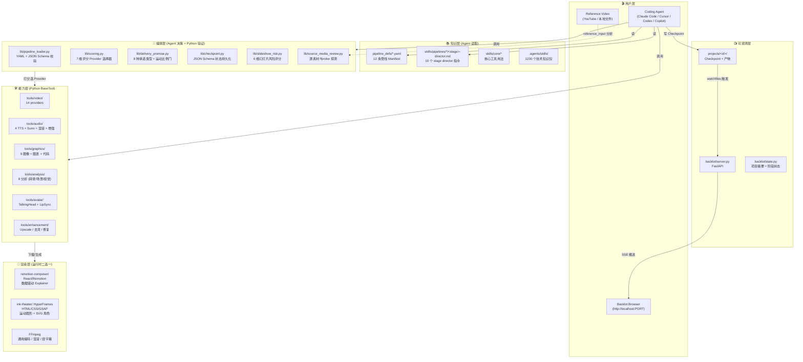
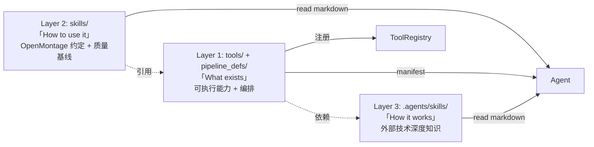
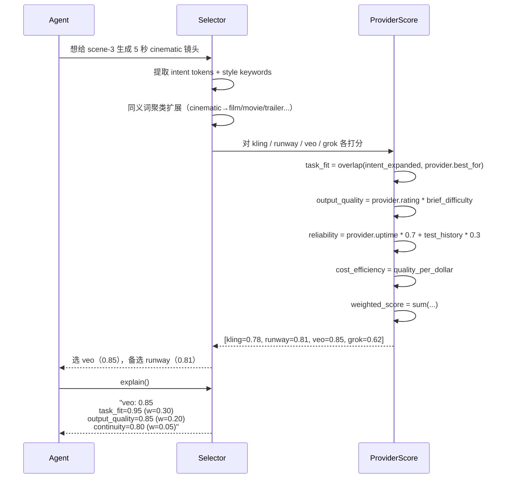
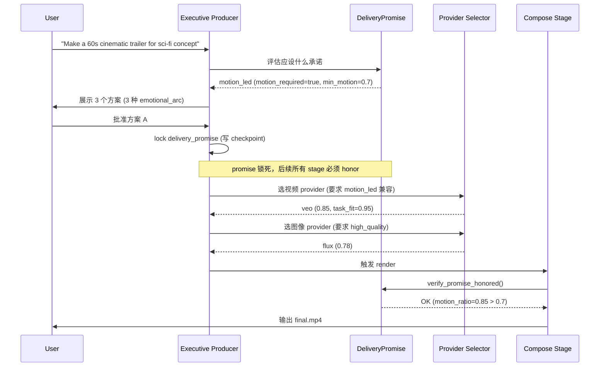
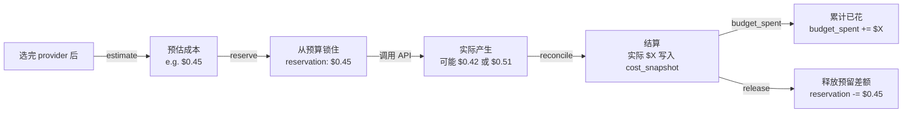

## 引子：当 AI 编程助手变成 AI 制片公司

2026 年，「AI 编程助手」和「AI 视频生成」这两个赛道已经各自红海。但 **calesthio/OpenMontage** 做了一件非常特别的事 —— 它把这两条赛道**焊在了一起**：让 Claude Code、Cursor、GitHub Copilot、Codex 等任何「能读文件、能跑 Python」的 Coding Agent，**直接当制片人用**。

> "Make a 60-second animated explainer about how neural networks learn"
> —— 只需要这一句话，Agent 会自己跑 15-25 次网页搜索做调研、写脚本、做分镜、生成图像、配音、找音乐、加字幕、渲染成片。整个过程不需要任何 GUI，你只是在 IDE 里跟你的 Coding Agent 说话。

这不是 demo。OpenMontage 仓库里附带了六个实拍案例：一部 60 秒吉卜力风格短片「THE LAST BANANA」（6 段 Kling v3 视频 + Chirp3-HD 旁白 + 钢琴配乐 + 字级字幕，成本 **$1.33**）、一部 70 秒历史挽歌「The Library at Alexandria」（5 段手写场景 + OpenAI 'ash' 旁白，成本 **$0.02**）、一部 30 秒 Ghibli 风格动画「Afternoon in Candyland」（12 张 FLUX 图像 + Ken Burns + 粒子特效，成本 **$0.15**）。最关键的是 —— **它不挑工具**：零 API key 也能跑（全靠 Piper TTS + Archive.org/NASA/Wikimedia 开放素材 + Remotion 合成器），想用顶级模型也能跑（Veo/Kling/Runway/FLUX 全打通）。

从架构师的视角看，OpenMontage 真正有意思的不是「用 AI 做了视频」，而是它**用了一整套工程化的制片系统抽象**来阻止 AI 视频常见的四种灾难：

1. **静默降级**：用户要「电影感短片」结果 Agent 给你 30 张静态图加 Ken Burns，OpenMontage 用 **Delivery Promise（交付承诺）** 强制锁定 motion_required 标志，渲染前先检查真视频占比 ≥ 70%。
2. **幻灯片陷阱**：你以为是「动画」其实是「PowerPoint 加了滤镜」，**Slideshow Risk 评分器**从 6 个维度（重复性、装饰视觉、弱运动、镜头意图、排版过度、不实电影感宣传）量化评分，临界分直接阻断渲染。
3. **账单失控**：用 Veo 跑 10 次发现 $200 没了，OpenMontage 有 **三级预算治理**（observe / warn / cap）+ 预估 → 预留 → 结算 三段账本 + 单次操作审批阈值（默认 $0.50）。
4. **跑偏且不知情**：Agent 自由发挥、最后给出一坨不能用的素材，OpenMontage 用 **Checkpoint 协议 + Schema 校验** 把每个阶段的产物都结构化、JSON Schema 验证、未通过自动拒收。

本文会深度拆解这套「Agent-first 视频制片系统」的完整架构：12 条 pipeline、52 个 tool、500+ skill、7 维评分器、Delivery Promise、Backlot 活体故事板，以及「**Manifest-as-Code、Skill-as-Knowledge、Tool-as-Capability、Backlot-as-Observability**」的四层抽象模型。

---

## 1. 项目定位与核心价值

### 1.1 一句话定义

> **OpenMontage 是首个把 Coding Agent 变成「AI 制片公司」的开源 Agentic 视频生产系统。** 它的核心抽象是「**Pipeline Manifest（YAML） + Stage Director Skills（Markdown） + Provider-Tools（Python）**」三件套，让 Agent 能在没有中央调度器的情况下，按 12 条工业化管线之一，从 0 完成一支成片。

### 1.2 仓库统计

| 指标 | 数据 |
|------|------|
| 仓库 | `calesthio/OpenMontage` |
| Stars | ⭐ 32,431（2026-07-04 截至） |
| Forks | 3,691 |
| 主语言 | Python 100% |
| License | AGPL-3.0 |
| 创建时间 | 2026-03-29 |
| 最近推送 | 2026-07-03（3 天前） |
| 仓库大小 | 73.6 MB |
| 代码节点 | 2,373 个文件 / 目录 |
| 12 条 pipeline | cinematic / animation / avatar-spokesperson / character-animation / clip-factory / documentary-montage / explainer / hybrid / localization-dub / podcast-repurpose / screen-demo / talking-head |
| 52 个 tool | 视频生成 13 + 音频 11 + 图形 9 + 增强 4 + 分析 8 + 化身 2 + 字幕 1 + 工具基类 4 |
| 500+ agent skill | 1230 个 `.agents/skills/` + 510 个 `.claude/skills/` + 173 个 `skills/` |
| 14 个视频 provider | 云端（Kling / Runway / Veo / Grok / Higgsfield / MiniMax / HeyGen）+ 本地（WAN 2.1 / Hunyuan / CogVideo / LTX-Video）+ 素材（Pexels / Pixabay / Wikimedia） |
| 10 个图像 provider | FLUX / Imagen / Grok / GPT Image 2 / Recraft / 本地 SD / Pexels / Pixabay / Unsplash / ManimCE |
| 4 个 TTS provider | ElevenLabs / Google TTS / OpenAI TTS / Piper（本地免费） |

### 1.3 能力矩阵

| 维度 | 能力 |
|------|------|
| **免费本地通路** | Piper TTS（离线旁白）+ Archive.org / NASA / Wikimedia 公共素材 + Remotion / HyperFrames（Node.js 渲染器）+ FFmpeg 后处理 |
| **云端高端通路** | FLUX / Imagen 图像 + Veo / Kling / Runway / Sora 视频 + Suno / ElevenLabs 音乐 + ElevenLabs / OpenAI / Google TTS |
| **零键即可成片** | 任何 pipeline 都可零 API key 跑（用本地 / 公共素材） |
| **人审门强制** | research / proposal / script / scene_plan / assets / compose / publish 全部预设 human_approval_default，可逐级拒绝 |
| **多 Agent harness 兼容** | Claude Code / Cursor / Copilot / Codex / Windsurf / Gemini CLI —— 6 套平台适配文件（CLAUDE.md / CURSOR.md / COPILOT.md / CODEX.md / .windsurfrules） |
| **Backlot 活体故事板** | FastAPI + watchfiles + SSE，监控 `projects/` 目录变化，浏览器实时看到剧本、资产、渲染进度 |
| **预算治理** | observe / warn / cap 三模式 + 单次审批 + 总额度 + 预留百分比 + 实时对账 |

### 1.4 与众不同之处

> **关键洞察**：OpenMontage 不是「又一套 AI 视频生成工具」。它是「**一个把 Coding Agent 当成调度器** 的制片系统」。这个定位让它和同类项目（如 heygen-com/hyperframes、remotion、moviepy、Sora 客户端、ComfyUI）有根本性差异 —— 它**不抢 Agent 的工作**，而是给 Agent **一套工业级的 SOP**。

---

## 2. 整体架构：Agent-First 四层抽象

OpenMontage 的设计哲学可以总结为一句：**「You AI coding assistant IS the orchestrator.」** —— 没有中央 Python 调度器，没有 WebUI 控制台，Agent 自己读 Manifest、自己调 Tool、自己 Checkpoint、自己问人类要审批。整个系统是「**Manifest + Skill + Tool + State**」四层松耦合架构。

### 2.1 顶层架构图



### 2.2 四层抽象的语义角色

| 层级 | 角色 | 物理形态 | 改动方式 |
|------|------|----------|----------|
| **知识层** | 给 Agent 看的「剧本」 | YAML + Markdown | 加新 pipeline 改 YAML；加新 stage 改 Markdown |
| **编排层** | 给 Agent 用的「验证器 + 评分器」 | 纯 Python（无副作用） | 加新维度扩 scoring.py；加新承诺类型扩 delivery_promise.py |
| **能力层** | Agent 的「手」 | Python BaseTool 子类 | 加新 provider 继承 BaseTool，自动注册到 tool registry |
| **渲染层** | Agent 的「画笔」 | Node.js / 本地二进制 | 替换 Remotion / HyperFrames 即可换渲染引擎 |

**关键设计点**：知识层和编排层**没有调用关系**。知识层是「Agent 看的书」，编排层是「Agent 调用的库」。Agent 自己决定何时读哪段 skill、何时调哪个 Python 模块。这种松耦合让 OpenMontage 可以**零修改地移植到任何 Coding Agent**（只要它能读文件 + 跑 Python）。

### 2.3 仓库目录结构

```text
OpenMontage/
├── tools/                    # 48 Python tools (Agent 的「手」)
│   ├── video/                # 14 个视频生成 provider
│   ├── audio/                # 4 个 TTS + Suno/ElevenLabs 音乐 + 混音 + 增强
│   ├── graphics/             # 9 个图像/图形生成 + 图表 + 代码片段 + 数学
│   ├── enhancement/          # 4 个增强（升频、去背、面部增强、面部修复）
│   ├── analysis/             # 8 个分析（转录、场景检测、关键帧、视频理解）
│   ├── avatar/               # 2 个化身（TalkingHead、唇同步）
│   ├── subtitle/             # 1 个字幕生成
│   └── base_tool.py          # BaseTool 抽象基类
│
├── pipeline_defs/            # 12 条 YAML pipeline Manifest（Agent 的「剧本」）
│   ├── cinematic.yaml
│   ├── animation.yaml
│   ├── avatar-spokesperson.yaml
│   ├── character-animation.yaml
│   ├── clip-factory.yaml
│   ├── documentary-montage.yaml
│   ├── explainer.yaml
│   ├── hybrid.yaml
│   ├── localization-dub.yaml
│   ├── podcast-repurpose.yaml
│   ├── screen-demo.yaml
│   └── talking-head.yaml
│
├── skills/                   # 173 个 Markdown skill（Agent 的「知识」）
│   ├── pipelines/            # 12 个 pipeline × 6-10 个 stage director
│   ├── creative/             # 创意技巧（kinetic typography、scene craft）
│   ├── core/                 # 核心工具用法（render_runtime 选择、playbook）
│   └── meta/                 # 元能力（reviewer / checkpoint-protocol / selector）
│
├── schemas/                  # 15 个 JSON Schema（契约验证）
│   ├── artifacts/            # 9 种产物 schema（research_brief, script, scene_plan...）
│   ├── checkpoints/          # checkpoint.schema.json
│   ├── pipelines/            # pipeline_manifest.schema.json
│   └── tools/                # tool_contract.schema.json
│
├── styles/                   # 视觉风格 playbook（clean-professional, flat-motion, minimalist-diagram）
├── remotion-composer/        # React/Remotion 视频合成引擎（47 文件）
├── ink-theater/              # HyperFrames（HTML/CSS/GSAP）合成器
├── lib/                      # 22 个核心基础设施
│   ├── pipeline_loader.py    # YAML 加载 + schema 校验 + 缓存
│   ├── scoring.py            # 7 维评分器
│   ├── delivery_promise.py   # 交付承诺
│   ├── checkpoint.py         # 状态持久化
│   ├── slideshow_risk.py     # 幻灯片风险评分
│   └── source_media_review.py
│
├── backlot/                  # 活体故事板（FastAPI + watchfiles + SSE）
├── projects/                 # 用户项目（运行时生成）
├── config.yaml               # 全局配置（LLM / 预算 / 输出）
├── CLAUDE.md / CURSOR.md / COPILOT.md / CODEX.md / .windsurfrules
└── docs/                     # 架构 / 提供商 / PR review 指南
```

### 2.4 三层知识架构

OpenMontage 把所有「知识」分成三层，Agent 按需加载：



每个 tool 在声明中会指明它依赖哪些 Layer 3 skills。Agent 选完 provider 后**自动加载对应 skill**，避免「用 Veo 之前忘了读 Veo 用法」。

---

## 3. 12 条 Production Pipeline：Manifest 即剧本

### 3.1 Pipeline 类型全景

| Pipeline | 适用场景 | 默认交付承诺 | 推荐 Style Playbook | 必需 Provider |
|----------|----------|--------------|---------------------|----------------|
| **cinematic** | 电影感预告、品牌片、情绪蒙太奇 | motion_led | flat-motion-graphics | Veo / Kling / Runway |
| **animation** | 动画短片、运动图形、抽象概念 | motion_led | flat-motion-graphics | FLUX / Imagen + Remotion |
| **avatar-spokesperson** | 数字人主持、企业沟通、培训 | avatar_presenter | clean-professional | HeyGen / TalkingHead |
| **character-animation** | SVG/GSAP 角色动画 | motion_led | flat-motion-graphics | HyperFrames + 本地 SD |
| **clip-factory** | 长视频 → 多个短视频 | hybrid | flat-motion-graphics | Transcriber + SceneDetect |
| **documentary-montage** | 真实素材蒙太奇、纪录短片 | source_led | clean-professional | Pexels / Pixabay / Archive.org |
| **explainer** | 教育讲解、数据可视化 | teacher_explainer | minimalist-diagram | FLUX + Piper TTS + Remotion |
| **hybrid** | 现有素材 + AI 增强图形 | hybrid | clean-professional | 任意 |
| **localization-dub** | 多语言翻译配音 | localization | clean-professional | Google TTS（700+ 声音） |
| **podcast-repurpose** | 播客 → 短视频 | hybrid | flat-motion-graphics | Transcriber + SceneDetect |
| **screen-demo** | 软件录屏、操作演示 | screen_demo | minimalist-diagram | ScreenCapture + Remotion |
| **talking-head** | 真人主讲、Vlog、采访 | source_led | clean-professional | Transcriber + SceneDetect |

### 3.2 Manifest 结构：cinematic.yaml 全解

下面是一段精简的 `pipeline_defs/cinematic.yaml`（`来自 pipeline_defs/cinematic.yaml:1-160`）：

```yaml
name: cinematic
version: "2.0"
description: >
  Mood-led cinematic pipeline for trailers, brand films, montages, and short-form
  dramatic edits. Works best with supplied footage, stills, or source media.
category: cinematic
stability: production
default_checkpoint_policy: guided

# 引用视频输入支持（如「像这个 YouTube 短片那样做」）
reference_input:
  supported: true
  analysis_depth: deep
  analysis_tools:
    - video_analyzer
    - transcript_fetcher
    - video_downloader
    - scene_detect
    - frame_sampler

# 编排：Executive Producer 模式
orchestration:
  mode: executive-producer
  skill: pipelines/cinematic/executive-producer
  budget_default_usd: 2.00
  max_revisions_per_stage: 3
  max_send_backs: 3
  max_wall_time_minutes: 12

extensions:
  custom_scripts: true
  custom_playbooks: true
  custom_skills: true
  custom_tools: false  # 工具注册由 tool registry 管理，不在 manifest 层

required_skills:
  - pipelines/cinematic/executive-producer
  - pipelines/cinematic/research-director
  - pipelines/cinematic/proposal-director
  - pipelines/cinematic/script-director
  - pipelines/cinematic/scene-director
  - pipelines/cinematic/asset-director
  - pipelines/cinematic/edit-director
  - pipelines/cinematic/compose-director
  - pipelines/cinematic/publish-director
  - meta/reviewer
  - meta/checkpoint-protocol
  - meta/animation-runtime-selector

# 8 个 stage 串行编排
stages:
  - name: research
    skill: pipelines/cinematic/research-director
    produces: [research_brief]
    tools_available: [web_search]
    checkpoint_required: true
    human_approval_default: false
    review_focus:
      - 视觉参考具体且与情绪相关（不是泛泛的「cinematic」搜索）
      - 声音/音乐方向是实质性的，不是泛泛的
      - 运动承诺对当前能力诚实
      - 至少 3 个真正不同的电影方向
    success_criteria:
      - Schema 合规的 research_brief 产物
      - 至少 8 次 web search
      - 视觉参考包含具体 URL + 描述

  - name: proposal
    skill: pipelines/cinematic/proposal-director
    required_artifacts_in: [research_brief]
    optional_artifacts_in: [source_media_review]
    produces: [proposal_packet, decision_log]
    checkpoint_required: true
    human_approval_default: true   # ← 提案必须人审
    # ...

  - name: script       # 串行下一个
  - name: scene_plan   # 串行下一个
  - name: assets       # 串行下一个（生成图像/视频/音乐）
  - name: edit         # 串行下一个（剪辑决策）
  - name: compose      # 串行下一个（Remotion / HyperFrames 渲染）
  - name: publish      # 最终发布
```

### 3.3 Pipeline Manifest Schema 校验

`lib/pipeline_loader.py:32-64` 实现了「加载 → 校验 → 缓存」三步：

```python
@lru_cache(maxsize=1)
def _load_manifest_schema() -> dict:
    """加载 pipeline_manifest.schema.json（lru_cache 单次）"""
    with open(SCHEMA_PATH) as f:
        return json.load(f)


@lru_cache(maxsize=64)
def _load_pipeline_cached(name: str, defs_dir_key: str) -> dict[str, Any]:
    """缓存 manifest 加载。返回值是 READ-ONLY。"""
    return load_pipeline(name, Path(defs_dir_key) if defs_dir_key else None)


def load_pipeline(name: str, defs_dir: Optional[Path] = None) -> dict[str, Any]:
    """加载 + 校验 pipeline manifest。
    
    Args:
        name: pipeline 名（不带 .yaml 扩展名）
        defs_dir: 自定义 manifest 目录（用于测试或自定义 pipeline）
    
    Returns:
        校验后的 manifest dict
    """
    defs_dir = defs_dir or PIPELINE_DEFS_DIR
    path = defs_dir / f"{name}.yaml"
    if not path.exists():
        raise FileNotFoundError(f"Pipeline manifest not found: {path}")

    with open(path) as f:
        manifest = yaml.safe_load(f)

    schema = _load_manifest_schema()
    jsonschema.validate(instance=manifest, schema=schema)  # ← 强制 schema 校验

    return manifest
```

**注意 `jsonschema.validate`** —— 所有 manifest 都必须通过 `schemas/pipelines/pipeline_manifest.schema.json` 的校验。schema 强制要求 `name` / `version` / `stages` 三个必填字段，stage 必须声明 `name` + 产物（`produces`）+ 可用工具（`tools_available`）+ 评审要点（`review_focus`）+ 成功标准（`success_criteria`）。这种「**Manifest 写错 = 不让你跑**」的硬约束，是 OpenMontage 工程化程度的体现。

### 3.4 通用 8 阶段工作流

所有 12 条 pipeline 都遵循同一条「主干」，差异只在于每个 stage 内部允许的工具和成功标准：


> **Web 调研是第一等公民**。在写第一个字剧本前，Agent 跑 15-25 次 web 搜索（YouTube / Reddit / Hacker News / 新闻 / 学术），收集数据点、用户问题、热门角度、视觉参考，**全部带引用**。这与「拍脑袋写 prompt」是质的差异。

---

## 4. Stage Director Skills：把「制片分工」编码成 Markdown

### 4.1 每个 Stage = 一份 Markdown 指令

12 条 pipeline × 平均 8 个 stage ≈ 100 份 stage director skill。每个 stage director 都是一份 ~5-10KB 的 Markdown，告诉 Agent「**你是谁、做什么、用什么工具、产出什么、自我评审什么、失败如何回退**」。

以 `skills/pipelines/cinematic/executive-producer.md` 开头为例（`来自 skills/pipelines/cinematic/executive-producer.md:1-60`）：

```markdown
# Executive Producer — Cinematic Pipeline

## When to Use
You are the **Executive Producer (EP)** for a cinematic video...

## Cumulative State
EP_STATE:
  pipeline: cinematic
  playbook: <selected>
  target_duration_seconds: <from proposal_packet>
  budget_total_usd: <configured>
  budget_spent_usd: 0.0

  # Cinematic-specific
  emotional_arc: null         # build → reveal → landing
  delivery_promise: null      # motion_required, tone_mode, quality_floor
  renderer_family: null       # locked at proposal stage
  color_grade_target: null    # mood-driven color palette
  hero_moments: []            # key reveal/climax frames
  music_beat_map: null        # audio-driven pacing reference

  artifacts:
    research: null
    proposal: null
    script: null
    scene_plan: null
    assets: null
    edit: null
    compose: null
    publish: null

## Execution Protocol
PREPARE → SPAWN DIRECTOR → REVIEW → GATE DECISION (pass / revise / send-back)
```

### 4.2 EP 模式：Executive Producer 编排

cinematic 这条 pipeline 用的是 **Executive Producer (EP) 编排模式**。EP 负责：

1. **串行调度**：research → proposal → script → scene_plan → assets → edit → compose → publish，每个 stage 都有 gate。
2. **预算治理**：每个 stage 完成后更新 `budget_spent_usd`，接近 90% 阈值时告警。
3. **决策可追溯**：所有「换 provider / 改模型 / 切 medium」必须**停下来问用户**，已批准的路径若被阻塞，**必须展示 4 件事**（尝试路径 / 失败原因 / 问题分类 / 推荐下一步）。
4. **跨 stage 检查**：除了 stage 内部的成功标准，EP 在 stage 交界处还有「跨 stage 健全性检查」（如 PROPOSAL 后检查「delivery_promise 完整 + renderer_family 已锁」）。

EP 不写 Python 调度器，**它自己就是 Agent 自己**。这份 Markdown 就是 Agent 读完之后「我作为 EP」的内部状态机。

### 4.3 Stage Director 类型矩阵

| Director 角色 | 职责 | 典型 Skill 路径 |
|--------------|------|-----------------|
| **research-director** | 跑 web 搜索、收集视觉参考、生成 research_brief | `pipelines/cinematic/research-director.md` |
| **proposal-director** | 综合 research，生成 3 个差异化方案 + delivery_promise | `pipelines/cinematic/proposal-director.md` |
| **script-director** | 写剧本，包含 beat map、旁白节奏、镜头方向 | `pipelines/cinematic/script-director.md` |
| **scene-director** | 把剧本拆成场景卡（每个 beat 一张） | `pipelines/cinematic/scene-director.md` |
| **asset-director** | 调用 tools 生成图像/视频/音乐/旁白，组装 asset_manifest | `pipelines/cinematic/asset-director.md` |
| **edit-director** | 排时间线、选转场、定调色、配音乐 | `pipelines/cinematic/edit-director.md` |
| **compose-director** | 选 render_runtime（Remotion vs HyperFrames vs FFmpeg）触发渲染 | `pipelines/cinematic/compose-director.md` |
| **publish-director** | 套平台 profile（YouTube / TikTok / LinkedIn）输出 | `pipelines/cinematic/publish-director.md` |

每个 pipeline 都有这一套 6-10 个 director 的组合。

### 4.4 Agent 怎么「执行」一份 Skill

`lib/checkpoint.py` 的 `EP_STATE` YAML 块定义了一份「运行时上下文」。Agent 的执行循环是：

1. **读 manifest**（`pipeline_defs/cinematic.yaml`）→ 知道有哪些 stage
2. **读当前 stage 的 skill**（`skills/pipelines/cinematic/proposal-director.md`）→ 知道怎么做
3. **调 tools**（registry.discover() 后用选中的 provider）→ 执行
4. **自审**（用 `meta/reviewer` skill 校验产物）→ 通过则写 checkpoint，失败则回退
5. **问人类**（如 `human_approval_default: true`）→ 阻塞等用户回复
6. **写 checkpoint**（`projects/<id>/pipeline/checkpoints/<stage>.json`）→ 下次可恢复

---

## 5. BaseTool 抽象层：Agent 的「手」怎么分类

### 5.1 BaseTool 强制接口

`tools/base_tool.py:13-95` 定义了所有 tool 必须继承的基类。OpenMontage 的 tool 抽象非常严格 —— 不仅是「能调」，还要声明 **6 个元数据维度**：

```python
class ToolTier(str, Enum):
    """工具在制片流程中的位置"""
    CORE = "core"           # 核心（FFmpeg / Remotion）
    VOICE = "voice"         # TTS / 配音
    ENHANCE = "enhance"     # 后期（升频 / 去背 / 修脸）
    GENERATE = "generate"   # 生成（图像 / 视频 / 音乐）
    SOURCE = "source"       # 源素材（stock footage / 用户上传）
    ANALYZE = "analyze"     # 分析（转录 / 场景检测 / 视频理解）
    PUBLISH = "publish"     # 发布（上传 / 转码）

class ToolStability(str, Enum):
    EXPERIMENTAL = "experimental"  # 实验性，可能坏
    BETA = "beta"                  # 基本可用，可能有边角问题
    PRODUCTION = "production"      # 已生产验证

class ToolStatus(str, Enum):
    AVAILABLE = "available"        # 当前可用（API key 在、库装了）
    UNAVAILABLE = "unavailable"    # 不可用
    DEGRADED = "degraded"          # 部分功能受限

class ToolRuntime(str, Enum):
    """Tool 在哪里执行 —— 这是 OpenMontage「零 key 也能跑」的关键"""
    LOCAL = "local"            # 完全在本地跑，免费，无网络
    LOCAL_GPU = "local_gpu"    # 本地但要 GPU
    API = "api"                # 调外部 API，要 key，要钱
    HYBRID = "hybrid"          # 本地 / API 都可（如图像生成可 SD 本地也可 FLUX 云端）

class ExecutionMode(str, Enum):
    SYNC = "sync"      # 同步
    ASYNC = "async"    # 异步

class Determinism(str, Enum):
    DETERMINISTIC = "deterministic"  # 同样输入必同样输出
    SEEDED = "seeded"                # 有 seed 即可复现
    STOCHASTIC = "stochastic"        # 不可复现

class ResumeSupport(str, Enum):
    NONE = "none"                 # 不可恢复
    FROM_START = "from_start"     # 失败需从头开始
    FROM_CHECKPOINT = "from_checkpoint"  # 支持断点续传
```

### 5.2 Tool 必须声明的资源画像

```python
@dataclass
class ResourceProfile:
    """硬件资源画像 —— 让 Agent 知道这工具能不能跑"""
    cpu_cores: int = 1
    ram_mb: int = 512
    vram_mb: int = 0      # 0 = 不需要 GPU
    disk_mb: int = 100
    network_required: bool = False


@dataclass
class RetryPolicy:
    """Tool 失败时如何重试"""
    max_retries: int = 0
    backoff_seconds: float = 1.0
    retryable_errors: list[str] = field(default_factory=list)
```

这种「**资源画像 + 重试策略 + 运行时类型 + 稳定性等级**」的元数据，让 `tool_registry.discover()` 能给出 `support_envelope()` 和 `provider_menu()`，让 Agent 在跑之前**先确认我的机器 + key 能不能跑**。

### 5.3 52 个 Tool 全景

按目录统计（`tools/` 139 个节点）：

| 类别 | 工具数 | 典型代表 |
|------|--------|----------|
| `tools/video/` | 13 provider + 多个 utility | kling_video / runway_video / veo_video / grok_video / cogvideo_local / hunyuan_local / wan_local / ltx_video / minimax_video / heygen_video / higgsfield_video / hyperframes_compose / comfyui_video / clip_cache / clip_search / clip_embedder / corpus_builder / direct_clip_search / auto_reframe / green_screen_composite / green_screen_processor / video_compose / video_stitch / video_trim |
| `tools/audio/` | 11 | elevenlabs_tts / google_tts / openai_tts / piper_tts / doubao_tts / tts_selector / suno_music / music_gen / music_library / pixabay_music / freesound_music / audio_mixer / audio_enhance |
| `tools/graphics/` | 9 | flux_image / imagen / gpt_image / recraft / local_diffusion / manim_ce / diagram / code_snippet / math |
| `tools/enhancement/` | 4 | upscale / background_remove / face_enhance / face_restore |
| `tools/analysis/` | 8 | transcriber / scene_detect / frame_sampler / video_understand / video_analyzer / video_downloader / audio_probe / audio_energy / composition_validator / face_tracker / visual_qa / transcript_fetcher |
| `tools/avatar/` | 2 | talking_head / lip_sync |
| `tools/subtitle/` | 1 | subtitle_gen |
| `tools/capture/` | 2 | cap_recorder / screen_recorder / screen_capture_selector |
| `tools/character/` | 1 | character_animation |
| `tools/_comfyui/` | 1+ | comfyui/client.py + metadata |
| `tools/base_tool.py` + 一些 `_shared.py` | 4 | 抽象基类 + 共享工具 |

### 5.4 ToolRegistry：自动发现 + 能力清单

`tools/tool_registry.py` 提供两个关键 API（`来自 README.md:155-175`）：

```bash
python -c "from tools.tool_registry import registry; import json; registry.discover(); print(json.dumps(registry.support_envelope(), indent=2))"
python -c "from tools.tool_registry import registry; import json; registry.discover(); print(json.dumps(registry.provider_menu(), indent=2))"
```

- `support_envelope()`：返回「我当前环境 + key 支持哪些能力」（如 `video.flux=true, video.kling=false, tts.piper=true`）
- `provider_menu()`：返回「每个能力下有哪几个 provider 可选 + 评分」

Agent 在跑之前先调这两个 API 探活，避免「读了 skill 写 Veo prompt，但 key 没配」的白跑。

---

## 6. 7 维评分 Provider 选择器：为什么选 Veo 不选 Kling

### 6.1 ProviderScore 7 维加权

`lib/scoring.py:21-46` 实现了 7 维加权评分（`来自 lib/scoring.py:21-46`）：

```python
@dataclass
class ProviderScore:
    """对某 provider 在特定 task context 下的评分"""
    tool_name: str
    provider: str
    task_fit: float = 0.0       # 0-1: 与任务最匹配度
    output_quality: float = 0.0  # 0-1: 预期保真度
    control: float = 0.0        # 0-1: 参考/风格可控性
    reliability: float = 0.0    # 0-1: 运行时稳定性
    cost_efficiency: float = 0.0  # 0-1: 质量 / 美元
    latency: float = 0.0        # 0-1: 可接受响应
    continuity: float = 0.0     # 0-1: 与已锁定决策一致

    @property
    def weighted_score(self) -> float:
        return (
            self.task_fit * 0.30
            + self.output_quality * 0.20
            + self.control * 0.15
            + self.reliability * 0.15
            + self.cost_efficiency * 0.10
            + self.latency * 0.05
            + self.continuity * 0.05
        )

    def explain(self) -> str:
        """人类可读的解释 —— 审计追溯用"""
        parts = [f"{self.tool_name} ({self.provider}): {self.weighted_score:.2f}"]
        top = sorted([
            ("task_fit", self.task_fit, 0.30),
            ("output_quality", self.output_quality, 0.20),
            ("control", self.control, 0.15),
            ("reliability", self.reliability, 0.15),
            ("cost_efficiency", self.cost_efficiency, 0.10),
            ("latency", self.latency, 0.05),
            ("continuity", self.continuity", 0.05),
        ], key=lambda x: x[1] * x[2], reverse=True)
        for name, val, weight in top[:3]:
            parts.append(f"  {name}={val:.2f} (w={weight})")
        return "\n".join(parts)
```

**总权重 1.0**：`task_fit` 0.30 + `output_quality` 0.20 + `control` 0.15 + `reliability` 0.15 + `cost_efficiency` 0.10 + `latency` 0.05 + `continuity` 0.05。

### 6.2 评分不靠硬编码规则，靠同义词聚类

`lib/scoring.py:107-145` 实现了一个非常巧妙的「**同义词聚类 + 重叠系数**」打分（`来自 lib/scoring.py:107-145`）：

```python
# 语义同义词聚类
_SYNONYM_CLUSTERS: list[set[str]] = [
    {"cinematic", "film", "movie", "trailer", "dramatic", "epic"},
    {"explainer", "educational", "tutorial", "teaching", "lesson"},
    {"corporate", "business", "professional", "enterprise"},
    {"social", "tiktok", "instagram", "reels", "shorts", "viral"},
    {"animation", "animated", "motion-graphics", "motion", "kinetic"},
    {"pixar", "animation", "animated", "stylized", "storybook", "character"},
    {"realistic", "photorealistic", "lifelike", "natural"},
    {"stock", "footage", "b-roll", "library"},
    {"avatar", "presenter", "talking-head", "spokesperson"},
    {"voiceover", "narration", "speech", "voice"},
    {"music", "soundtrack", "background-music", "score", "ambient"},
]


def _keyword_overlap(set_a: set[str], set_b: set[str]) -> float:
    """Overlap coefficient = |A ∩ B| / min(|A|, |B|)
    
    不用 Jaccard（Jaccard 会过度惩罚「best_for 写得很细的 premium provider」）。
    Overlap 回答的是正确问题：「intent 是 tool 自述能力的子集吗？」。
    """
    if not set_a or not set_b:
        return 0.0
    a = {s.lower().strip() for s in set_a}
    b = {s.lower().strip() for s in set_b}
    intersection = len(a & b)
    smaller = min(len(a), len(b))
    return intersection / smaller if smaller > 0 else 0.0
```

**关键设计**：不用 Jaccard 而用 Overlap Coefficient。Jaccard = |A∩B| / |A∪B|，对「写了很多 best_for 的 premium provider」不公平（基数大导致 |A∪B| 偏大）。Overlap = |A∩B| / min(|A|, |B|)，回答的是「**小集合（intent）是不是大集合（best_for）的子集**」 —— 这正是 provider scoring 真正想问的问题。

### 6.3 评分流程



### 6.4 ProductionPathScore：8 维路径评分

除了选单个 provider，OpenMontage 还会对**整条生产路径**打分（`lib/scoring.py:50-78`）：

```python
@dataclass
class ProductionPathScore:
    """对整条生产路径的评分（不只是单个 tool）"""
    path_label: str
    delivery_fit: float = 0.0           # 与 delivery_promise 的契合度
    quality_fit: float = 0.0           # 与 quality_floor 的契合度
    capability_confidence: float = 0.0  # 信心度
    fallback_integrity: float = 0.0     # 回退完整性
    budget_fit: float = 0.0            # 与预算的契合度
    speed_fit: float = 0.0             # 与时间的契合度
    controllability: float = 0.0        # 可控性
    consistency_fit: float = 0.0        # 与已有产物的一致性

    @property
    def weighted_score(self) -> float:
        return (
            self.delivery_fit * 0.25
            + self.quality_fit * 0.20
            + self.capability_confidence * 0.15
            + self.fallback_integrity * 0.10
            + self.budget_fit * 0.10
            + self.speed_fit * 0.08
            + self.controllability * 0.07
            + self.consistency_fit * 0.05
        )
```

**注意**：`ProductionPathScore` 是「**整条路径**能不能用」的判断，而 `ProviderScore` 是「**单个 provider** 好不好」。两个独立打分 —— 路径分低的方案即使有顶级 provider 也会被否决（如 motion_led 但只能用本地 SD）。

---

## 7. Delivery Promise 交付承诺：阻止「静默降级」

### 7.1 8 种承诺类型

`lib/delivery_promise.py:13-78` 定义了 8 种 delivery promise（`来自 lib/delivery_promise.py:13-78`）：

```python
class PromiseType(Enum):
    MOTION_LED = "motion_led"             # 电影感、运动为主
    SOURCE_LED = "source_led"             # 用户素材为主
    DATA_EXPLAINER = "data_explainer"     # 数据可视化
    TEACHER_EXPLAINER = "teacher_explainer"  # 教育
    SCREEN_DEMO = "screen_demo"           # 软件演示
    AVATAR_PRESENTER = "avatar_presenter" # 数字人
    HYBRID = "hybrid"                     # 混合
    LOCALIZATION = "localization"         # 翻译/配音


# 每种承诺的「硬规则」—— 编译时不能违反
PROMISE_RULES: dict[str, dict[str, Any]] = {
    "motion_led": {
        "still_fallback_allowed": False,       # ← 禁用静图替代！
        "requires_video_generation": True,
        "min_motion_ratio": 0.7,               # 至少 70% 真运动
        "description": "Video's quality depends on real motion",
    },
    "source_led": {
        "still_fallback_allowed": True,
        "requires_video_generation": False,
        "min_motion_ratio": 0.3,
        "description": "User-provided footage is primary",
    },
    "data_explainer": {
        "still_fallback_allowed": True,
        "requires_video_generation": False,
        "min_motion_ratio": 0.0,
        "description": "Data viz and explanation",
    },
    # ...
}
```

**关键设计**：`motion_led` 类型的视频**禁止用静图替代**（`still_fallback_allowed: False`）且要求至少 70% 的镜头是「真运动」（视频或动画，不能是 Remotion 幻灯片）。这意味着如果 Agent 跑着跑着发现没配视频生成 provider，**必须停下来问人类**，而不是悄悄给你 30 张静态图 + Ken Burns 假装是电影。

### 7.2 承诺在哪儿锁

`DeliveryPromise` 在 `proposal` stage 设定并锁定，之后所有 stage 必须 honor 它。`compose` stage 渲染前会调 `verify_promise_honored()` 验证，如果发现 promise 说 motion_led 但实际 min_motion_ratio < 0.7，**渲染被阻断**，必须先解决。

### 7.3 流程图



---

## 8. Checkpoint 协议：状态可恢复 + 决策可审计

### 8.1 Checkpoint 是 JSON Schema 验证的状态

`lib/checkpoint.py` 把每个 stage 写一个 JSON 文件，结构必须符合 `schemas/checkpoints/checkpoint.schema.json`：

```python
# 来自 lib/checkpoint.py:21-45
CANONICAL_STAGE_ARTIFACTS = {
    "research": "research_brief",
    "proposal": "proposal_packet",
    "script": "script",
    "scene_plan": "scene_plan",
    "assets": "asset_manifest",
    "edit": "edit_decisions",
    "compose": "render_report",
    "publish": "publish_log",
}

# 补充产物（不在主流程但 governance 契约要求）
SUPPLEMENTARY_ARTIFACTS = {
    "source_media_review",   # 用户素材存在时第一阶段前必填
    "final_review",          # compose 阶段前必填
    "video_analysis_brief",  # 引用视频分析产物
}
```

每个 stage 完成时把「**阶段名 + 状态 + 产物 + 决策日志 + 成本**」写盘，下次可恢复。

### 8.2 校验：canonical artifact + 决策日志双校验

`lib/checkpoint.py:73-105` 实现了双层校验：

```python
def _validate_artifacts_for_stage(
    stage: str, status: str, artifacts: dict[str, Any],
) -> None:
    required_artifact = CANONICAL_STAGE_ARTIFACTS[stage]
    if status in {"completed", "awaiting_human"} and required_artifact not in artifacts:
        raise CheckpointValidationError(
            f"Stage {stage!r} with status {status!r} must include "
            f"canonical artifact {required_artifact!r}"
        )

    for artifact_name, artifact_data in artifacts.items():
        if artifact_name not in ARTIFACT_NAMES:
            continue
        if not isinstance(artifact_data, dict):
            raise CheckpointValidationError(
                f"Artifact {artifact_name!r} must be a JSON object"
            )
        try:
            validate_artifact(artifact_name, artifact_data)  # JSON Schema 校验
        except Exception as exc:
            raise CheckpointValidationError(
                f"Artifact {artifact_name!r} failed schema validation: {exc}"
            ) from exc
```

**两道闸**：
1. `completed` 或 `awaiting_human` 状态必须包含「canonical artifact」（如 `proposal` 必须有 `proposal_packet`）
2. 每个 artifact 必须通过对应 JSON Schema 校验（schema 在 `schemas/artifacts/`）

任何 stage 拿不到完整、合规的产物，**checkpoint 写盘直接抛异常**，整个 pipeline 必须停下来重做。

### 8.3 Checkpoint 写入位置

```python
# 来自 lib/checkpoint.py:55-65
from lib.paths import PROJECTS_DIR  # 单一 source of truth
PROJECT_MARKER_FILENAME = "project.json"
HISTORY_DIRNAME = "history"
```

项目结构：

```text
projects/
└── <project-id>/
    ├── project.json                # 项目元信息
    └── pipeline/
        ├── checkpoints/
        │   ├── research.json       # 阶段 checkpoint
        │   ├── proposal.json
        │   ├── script.json
        │   ├── scene_plan.json
        │   ├── assets.json
        │   ├── edit.json
        │   ├── compose.json
        │   └── publish.json
        ├── history/                # 修订历史
        │   ├── research_v1.json
        │   ├── research_v2.json
        └── artifacts/              # 产物
            ├── research_brief.json
            ├── proposal_packet.json
            ├── script.json
            ├── scene_plan.json
            └── asset_manifest.json
```

每次 stage 修订，旧 checkpoint 进 `history/`，新 checkpoint 进 `checkpoints/`。审计 trail 完整。

### 8.4 Checkpoint 决策日志样例

```json
{
  "stage": "assets",
  "status": "awaiting_human",
  "artifacts": {
    "asset_manifest": {
      "videos": [
        {
          "scene": "scene-3",
          "provider": "veo",
          "model": "veo-3",
          "score": 0.85,
          "alternatives_considered": [
            {"provider": "runway", "score": 0.81, "rejected": "cost"},
            {"provider": "kling", "score": 0.78, "rejected": "continuity"}
          ],
          "cost_usd": 0.45,
          "duration_seconds": 5
        }
      ]
    }
  },
  "decision_log": [
    {"timestamp": "...", "decision": "veo", "reasoning": "task_fit 0.95, motion_led 兼容"},
    {"timestamp": "...", "decision": "flux images", "reasoning": "static style + cinematic mood"}
  ],
  "cost_snapshot": {"spent": 1.20, "reserved": 0.30, "remaining": 8.50}
}
```

这种**全量决策日志 + 替代方案 + 拒绝原因**的记录，让审计师能完整回放「为什么这段视频用了 Veo 而不是 Kling」。

---

## 9. Backlot 活体故事板：把 pipeline 跑成「可看的演出」

### 9.1 Backlot 是什么

`backlot/` 是一个 **FastAPI + watchfiles + SSE** 的本地 Web 服务，它做一件很优雅的事：**监控 `projects/` 目录的文件变化，把「Agent 正在做的每一步」实时画到一个浏览器故事板上**。

> "Chat tells you what the agent *said*. **Backlot shows you what the production is actually doing** — a local board that fills itself in as the pipeline runs."

### 9.2 Backlot 服务架构

`backlot/server.py:1-65` 实现了 5 个核心组件（`来自 backlot/server.py:1-65`）：

```python
class ChangeHub:
    """订阅者扇出 —— 一次文件系统变化能唤醒所有 SSE 订阅者
    
    订阅可按 project_id 过滤：订阅了 project A 的 board 不会收到 project B 的通知。
    """
    def __init__(self) -> None:
        self._subscribers: dict[asyncio.Queue, Optional[str]] = {}

    def subscribe(self, project_id: Optional[str] = None) -> asyncio.Queue:
        q: asyncio.Queue = asyncio.Queue(maxsize=64)
        self._subscribers[q] = project_id
        return q

    def unsubscribe(self, q: asyncio.Queue) -> None:
        self._subscribers.pop(q, None)

    def publish(self, project_id: str) -> None:
        for q, only in list(self._subscribers.items()):
            if only is not None and only != project_id:
                continue
            try:
                q.put_nowait(project_id)
            except asyncio.QueueFull:
                # Queue 只装「这个订阅者关心的」id，所以 full 一定意味着
                # 已有待唤醒通知 → 安全丢弃
                pass
```

**关键设计**：
- **Per-project filter**：每个订阅者只关心特定 project，避免「A 项目狂写 checkpoint 把 B 项目的 board 唤醒队列堵死」
- **Queue size 64**：上限保护，但 `QueueFull` 异常吞掉是**安全**的（因为 queue 里已有待唤醒，丢一次不会错过）
- **asyncio.Queue**：纯内存，**server 从不写项目目录**（watcher 只观察，不副作用）

### 9.3 文件监控：避免噪音路径

```python
# 来自 backlot/server.py:55-80
_IGNORE_PARTS = {"node_modules", ".git", "__pycache__", ".cache"}

def _project_of_change(path_str: str) -> Optional[str]:
    """把变化的路径映射到 project_id（None = 无关）"""
    norm = _os.path.normcase(_os.path.normpath(path_str))
    if not norm.startswith(_PROJECTS_ROOT_STR):
        return None
    rel = norm[len(_PROJECTS_ROOT_STR):].lstrip("\\/")
    if not rel:
        return None
    parts = rel.replace("\\", "/").split("/")
    if _IGNORE_PARTS.intersection(parts):
        return None
    return parts[0]


async def _watch_projects() -> None:
    """后台任务：用 watchfiles 监控 projects/"""
    try:
        from watchfiles import awatch
    except ImportError:
        return  # watcher 不可用 → board 仍可通过手动刷新工作
    if not PROJECTS_DIR.is_dir():
        return
    async for changes in awatch(PROJECTS_DIR, recursive=True, step=400):
        # 一次 render 可能产生数千次写，debounce 是必要的
        touched: set[str] = set()
        for _change, path_str in changes:
            pid = _project_of_change(path_str)
            if pid:
                touched.add(pid)
        for pid in touched:
            _invalidate_summary(pid)
            hub.publish(pid)
```

**性能考量**：
- `_PROJECTS_ROOT_STR` 缓存为字符串，hot path 只做字符串比较，**不做文件系统调用**
- `_IGNORE_PARTS` 是 set 交集，O(1)
- `step=400` 毫秒 debounce 防止 render 期间数千次写触发数千次 publish
- `watchfiles` 是 Rust 写的，比 inotify 直接用更快

### 9.4 Backlot 故事板三态

| 状态 | 视觉表现 | 触发条件 |
|------|----------|----------|
| **Live（活体）** | 故事板发光、scene card 闪烁 | 有 stage 正在 `in_progress` |
| **Awaiting Human（等人批）** | 故事板灰显、提示「等你的回复」 | stage 处于 `awaiting_human` |
| **Done（完成）** | 故事板静态、可点 REPLAY RUN 重放 | 全部 stage `completed` |

`backlot/state.py` 的 `summarize_project()` 负责把所有项目状态推到一个 board-ready dict 供前端渲染。每次项目文件变化，`_invalidate_summary()` 清缓存，下次请求时重算。

### 9.5 使用方式

```bash
python -m backlot open                  # 打开 library (所有项目)
python -m backlot open <project-id>     # 打开单个项目的 live board
python scripts/backlot_simulate_run.py  # 模拟一次跑（无 LLM 也能看）
```

所有 staging 路径都遵循「Live first」原则 —— **Agent 启动时自动打开 board**，你不用主动去查。

---

## 10. 工具集成层：把 14 视频 provider 装进同一接口

### 10.1 Provider 选型矩阵

| Provider | 类型 | 适用场景 | 评分侧重 |
|----------|------|----------|----------|
| **Kling** | 云 API | 高质量、快 | task_fit 高、cost 偏高 |
| **Runway Gen-4** | 云 API | 电影感、Turbo / Aleph 多档 | output_quality 顶 |
| **Google Veo 3** | 云 API | 长镜头、电影 | control 高 |
| **Grok Imagine Video** | 云 API | 强参考图、xAI 生态 | continuity 高 |
| **Higgsfield** | 云 API | Soul ID 角色一致性 | task_fit 顶（角色） |
| **MiniMax** | 云 API | 性价比 | cost_efficiency 高 |
| **HeyGen** | 云 API | 多模型 gateway | reliability 高 |
| **WAN 2.1** | 本地 GPU | 免费、1.3B/14B | cost_efficiency 1.0 |
| **Hunyuan** | 本地 GPU | 免费、画质高 | output_quality 中 |
| **CogVideo** | 本地 GPU | 免费、2B/5B | cost_efficiency 1.0 |
| **LTX-Video** | 本地/Modal | 本地免费或自托管 | flexibility 高 |
| **Pexels** | Stock | 免费真实素材 | reliability 1.0 |
| **Pixabay** | Stock | 免费真实素材 | reliability 1.0 |
| **Wikimedia Commons** | Stock | 开放档案、纪录片 | reliability 1.0 |

### 10.2 选 Provider 的「Reference Video」路径

`reference_input` 机制是 OpenMontage 的一个特别设计 —— 用户给一个 YouTube 视频，Agent **先把这个参考视频做完整分析**（转录 + 场景检测 + 关键帧 + 视觉理解），再基于分析结果生成 2-3 个差异化方案。Manifest 中显式声明哪些 tool 参与 reference analysis：

```yaml
# 来自 pipeline_defs/cinematic.yaml
reference_input:
  supported: true
  analysis_depth: deep
  analysis_tools:
    - video_analyzer      # CLIP/BLIP-2 视觉理解
    - transcript_fetcher  # 下载转录
    - video_downloader    # 下载视频本体
    - scene_detect        # 场景边界检测
    - frame_sampler       # 智能关键帧提取
```

### 10.3 Documentary Montage：免费真实素材的「CLIP 检索蒙太奇」

**documentary-montage** pipeline 是 OpenMontage 区别于其他 AI 视频工具的最强杀手锏 —— 它**不靠任何生成 API**，就能从免费/开放素材源（Archive.org / NASA / Wikimedia Commons / Pexels / Pixabay）建一个 CLIP 可检索的语料库，**真剪**一支带情绪的纪录短片。

`tools/video/corpus_builder.py`（25KB）和 `tools/video/direct_clip_search.py`（26KB）实现了：

1. 拉源素材 → 抽关键帧 → CLIP 编码 → 入向量索引
2. 用户 prompt → 编码为向量 → 检索 top-K 匹配镜头
3. 按情绪/类型/时长过滤 → 选镜头
4. Remotion 合成成片

**结果**：在零 API key 情况下，$0.02 成本就能做出 70 秒的历史挽歌（项目 README 给的真实案例）。

---

## 11. 预算治理：三级模式 + 实时对账

### 11.1 config.yaml 全局配置

`来自 config.yaml:1-25`：

```yaml
budget:
  mode: warn                     # observe | warn | cap
  total_usd: 10.00               # 总额度
  reserve_pct: 0.10              # 10% 留给重试 / 清理
  single_action_approval_usd: 0.50   # 单次操作超过 $0.50 必须审批
  require_approval_for_new_paid_tool: true  # 新付费工具必审批
```

### 11.2 三级模式

| 模式 | 行为 | 适用场景 |
|------|------|----------|
| `observe` | 只记录，不阻断 | 调试 / 学习阶段 |
| `warn` | 超出时告警，让 Agent 决定是否继续 | **默认**，安全但灵活 |
| `cap` | 硬性阻断 | 严格控制（公司项目） |

### 11.3 三段账本

OpenMontage 的成本治理采用 **estimate → reserve → reconcile** 三段式：



**优势**：
- 即使并发跑多个 stage，预留机制保证**总额不会爆**
- 实际成本和预估不符时，**reconcile 阶段对账**，不会「扣了 $0.45 实际只花 $0.20 也不退」

### 11.4 单次审批阈值

`single_action_approval_usd: 0.50` 意味着**任何单次操作预计超过 $0.50，Agent 必须先停下来问用户**。这避免了「Agent 一口气跑 50 次 Veo，花了 $150 才发现」。

---

## 12. 端到端数据流：从用户 prompt 到 final.mp4

### 12.1 完整时序图

```mermaid
sequenceDiagram
    participant U as User (Claude Code)
    participant SM as Skill Manifest
    participant DP as DeliveryPromise
    participant SL as Selector (scoring.py)
    participant TR as ToolRegistry
    participant TV as tools/video (Veo)
    participant TA as tools/audio (Piper)
    participant CK as Checkpoint Writer
    participant BL as Backlot SSE
    participant FS as projects/&lt;id&gt;/

    U->>SM: 读 cinematic.yaml manifest
    SM-->>U: 8 stages, EP 模式, $2 budget
    U->>U: 读 executive-producer.md
    U->>U: 读 research-director.md
    U->>U: 跑 15 次 web_search
    U->>U: 写 research_brief.json
    U->>CK: 写 research.json checkpoint
    CK->>FS: projects/x/pipeline/checkpoints/research.json
    CK->>BL: 触发 SSE 更新
    
    U->>U: 读 proposal-director.md
    U->>DP: 评估 delivery_promise
    DP-->>U: motion_led, 70% motion floor
    U->>U: 写 proposal_packet.json (3 个方案)
    U->>U: 问用户选哪个 (human_approval_default=true)
    U-->>U: 用户批准方案 A
    U->>CK: 写 proposal.json (status=completed)
    CK->>FS: 写盘
    
    U->>U: 读 script-director.md → 写 script.json
    U->>U: 读 scene-director.md → 写 scene_plan.json (8 scenes)
    U->>CK: 写 script.json + scene_plan.json
    
    U->>U: 读 asset-director.md
    loop 对每个 scene 选 provider
        U->>SL: 调 score_provider() for 视频
        SL->>TR: 列出可用 video providers
        SL-->>U: veo (0.85) > runway (0.81) > kling (0.78)
        U->>TV: 调 veo_video.generate(prompt, 5s)
        TV-->>U: {success, video_path, cost=0.45}
    end
    U->>TA: 调 piper_tts.synthesize(narration_text)
    TA-->>U: {audio_path, cost=0}
    U->>U: 写 asset_manifest.json (含 cost_snapshot)
    U->>CK: 写 assets.json
    
    U->>U: 读 edit-director.md
    U->>U: 写 edit_decisions.json (timeline + 转场)
    U->>CK: 写 edit.json
    
    U->>U: 读 compose-director.md
    U->>U: 评估 render_runtime (Remotion vs HyperFrames)
    U->>DP: verify_promise_honored()
    DP-->>U: OK (motion_ratio=0.85)
    U->>U: 调 Remotion render
    U->>U: post-render self-review (ffprobe + frame 采样 + audio)
    U->>CK: 写 compose.json (status=awaiting_human)
    U->>FS: projects/x/renders/final.mp4
    
    U->>U: 读 publish-director.md
    U->>U: 套 platform profile (YouTube 1920x1080)
    U->>U: 输出 final.mp4 到 library/
    U->>CK: 写 publish.json (status=completed)
    CK->>FS: 全流程 checkpoint 序列完成
```

### 12.2 故障回退

每个 stage 有 `max_revisions_per_stage: 3` 和 `max_send_backs: 3`（来自 cinematic.yaml orchestration 配置）。如果某个 stage 评审失败，EP 可以：
- **revise**：让当前 director 改 1 次（不重新做）
- **send-back**：回退到上一个 stage 重做

超过 3 次 send-back，整个 pipeline abort。预算自动 reconcile（已花费部分记账，剩余 reservation 释放）。

---

## 13. 与同类项目对比

### 13.1 横向对比表

| 维度 | **OpenMontage** | **Remotion** | **HeyGen/HyperFrames** | **ComfyUI** | **Sora/Runway 客户端** | **N8N + 视频插件** |
|------|-----------------|---------------|------------------------|-------------|-----------------------|-------------------|
| **定位** | 制片系统 (Pipeline) | 渲染引擎 (React→视频) | 单视频生成 / 渲染 | 图像工作流 | 视频生成 API | 工作流自动化 |
| **核心抽象** | Manifest + Skill + Tool | React Component | 单一 prompt | Node graph | Text prompt | Node-based flow |
| **Agent 集成** | **一等公民**（Agent 即调度器） | 需要自己写 wrapper | 需要自己集成 | 需要自己写 | 单一 API 调用 | 节点式但非 Agent-native |
| **多模态支持** | 14 视频 + 10 图像 + 4 TTS + 3 音乐 | 仅渲染（输入是 React 代码） | 视频 + 化身 | 图像为主 | 视频 | 取决于插件 |
| **质量门** | **强制**（schema + 评分 + Promise） | 无 | 无 | 弱 | 无 | 弱 |
| **预算治理** | **三级 + 实时对账** | 无 | 取决于套餐 | 无 | 取决于套餐 | 弱 |
| **零 key 跑** | **是**（Piper + Archive + Remotion） | 是（纯 React） | 否 | 是（本地模型） | 否 | 部分 |
| **可观测性** | **Backlot 活体故事板** | 无 | 无 | 节点预览 | 无 | 执行日志 |
| **人审门** | **每 stage 默认 + manifest 可配** | 无 | 无 | 无 | 无 | 弱 |
| **代码可读性** | 中（需懂 YAML + Markdown + Python） | 高（纯 React） | 中 | 中 | N/A | 中 |
| **学习曲线** | 陡（要懂 8 stage 流程） | 中（React） | 平（GUI） | 中（图） | 平（API） | 中（GUI） |
| **适合谁** | 想做「完整 AI 制片」的人 | 懂 React 想做可控视频的人 | 想要快速单视频的人 | 图像 AI 工作流研究者 | 想用顶级模型的人 | 业务自动化集成者 |

### 13.2 设计差异：Manifest-as-Code vs Component-as-Code vs Prompt-as-Code

**OpenMontage 的核心差异是抽象层**：

| 抽象层 | OpenMontage | Remotion | HeyGen |
|--------|-------------|----------|--------|
| **代码层** | Python tools (48 个) | React components | 单一 API |
| **配置层** | YAML Manifest (12 个) | JSON props | 无 |
| **指令层** | Markdown skills (173 个) | Component README | 文档 |
| **运行时** | Agent 读 manifest → 调 tool → 写 checkpoint | React render | HTTP POST |
| **可扩展** | 加 pipeline = 加 YAML + 加 skill | 加 React 组件 | 加 wrapper |

**真正独特的点**：

1. **「Agent 即调度器」**：没有中央 Python 调度器。Agent 自己读 manifest、自己决定下一步。这让 OpenMontage 可以零修改地支持 6+ 种 Coding Agent（Claude Code、Cursor、Copilot、Codex、Windsurf、Gemini CLI）。
2. **「Delivery Promise 硬约束」**：其他项目都把「不能静默降级」写在文档里，OpenMontage 把它编码成 enum + 校验函数 + 强制阻断。这是从「demo 工具」到「生产系统」的关键跨越。
3. **「Manifest + Skill + Tool 三件套」**：Remotion 是「Component-as-Code」（React 是配置），ComfyUI 是「Node-as-Code」，Sora 是「Prompt-as-Code」。OpenMontage 把「**Pipeline 是什么**」（YAML manifest）、「**Pipeline 怎么做**」（Markdown skill）、「**Pipeline 能用什么能力**」（Python tool）分成**三个独立可改的层**。这让加新 pipeline 不用改 Python、加新 tool 不用改 Markdown、加新 stage 不用改 YAML。
4. **「Backlot 活体故事板」**：其他项目给你日志，OpenMontage 给你**可在浏览器看的现场演出**。这是把 `tail -f` 升级成「导演监视器」。

### 13.3 「不做什么」的设计哲学

OpenMontage **明确不做**的事：

- ❌ 不做 WebUI 控制台（**故意** —— 强迫你用 Coding Agent）
- ❌ 不做中央 Python 调度器（**故意** —— 调度是 Agent 的事）
- ❌ 不做模型训练 / fine-tune（**故意** —— 永远用现成 API/本地模型）
- ❌ 不做账号系统 / 多租户（**故意** —— 你是单用户做项目）
- ❌ 不做实时多人协作（**故意** —— Backlot 是单浏览器观察）

这种「**克制的功能边界**」是工业级系统的标志 —— 把 6 件事做到极致，比把 60 件事做到能用要难得多。

---

## 14. 优缺点分析

### 14.1 架构简洁性 / 扩展性 / 易用性视角

| 维度 | 评价 | 说明 |
|------|------|------|
| **架构简洁性** | ⭐⭐⭐⭐ | 四层抽象干净（Knowledge / Orchestration / Capability / Render），无循环依赖 |
| **扩展性** | ⭐⭐⭐⭐⭐ | 加新 pipeline 只需加 YAML + Markdown；加新 tool 只需继承 BaseTool；加新 stage 只需改 schema |
| **易用性** | ⭐⭐⭐ | 对 Coding Agent 用户极友好（直接对话），对 GUI 用户不友好（必须装 IDE + Agent） |
| **Manifest 可读性** | ⭐⭐⭐⭐⭐ | YAML 字段语义化（`human_approval_default`、`review_focus`、`success_criteria`），一眼看懂 |
| **Skill 可维护性** | ⭐⭐⭐⭐ | Markdown 纯文本，可 diff、可 review、可团队协作 |
| **Tool 一致性** | ⭐⭐⭐⭐ | BaseTool 抽象强制 6 个元数据，registry 自动发现，难写出「野 tool」 |
| **可观测性** | ⭐⭐⭐⭐⭐ | Backlot + Checkpoint + Decision Log 三件套，调试体验好 |
| **零键可用性** | ⭐⭐⭐⭐⭐ | Piper TTS + Archive.org + Remotion 零 key 出片 |

### 14.2 性能 / 复杂度 / 维护性视角

| 维度 | 评价 | 说明 |
|------|------|------|
| **运行性能** | ⭐⭐⭐⭐ | Python 校验 + Node.js 渲染，分层清晰，无明显瓶颈；GPU 推理时受限于本地硬件 |
| **Agent 上下文成本** | ⭐⭐⭐ | 读大量 skill（500+）会撑爆 context window，需要 Agent 自己摘要/分层加载 |
| **Manifest 复杂度** | ⭐⭐ | 12 个 pipeline × 8 stage × 多个字段，第一次看会懵；好在有 cinematic.yaml 作为模板 |
| **Tool 数量管理** | ⭐⭐⭐ | 52 个 tool 看着吓人，但 BaseTool 抽象让它们接口一致；ToolRegistry 自动发现 |
| **Provider 维护成本** | ⭐⭐ | 每个云端 provider API 变化时要改 Python；OpenMontage 社区需主动跟进 Veo/Kling/Runway |
| **Schema 演化管理** | ⭐⭐⭐ | 每次新增字段要改 schema，存量 checkpoint 可能失效；需 migration 机制 |
| **文档完整度** | ⭐⭐⭐⭐ | README 39KB、PROMPT_GALLERY、AGENT_GUIDE、PROJECT_CONTEXT、docs/ 4 份 |
| **社区活跃度** | ⭐⭐⭐ | 32k stars 1 个多月达成，Discussions 活跃；但 AGPL-3.0 限制商业 fork |
| **学习曲线** | ⭐⭐ | 需懂 YAML / Markdown / Python / Node.js / 视频术语 5 件事 |
| **故障排查** | ⭐⭐⭐⭐ | Checkpoint 状态 + Decision Log + Backlot 故事板三重 trace |

### 14.3 适用 vs 不适用场景

**适合**：
- 🎬 想做完整 AI 制片流水线的研究者 / 小团队
- 🧠 想给 Coding Agent 注入「视频生产能力」的 Agent builder
- 🎓 教育场景（数字人讲解 / 课件生成）
- 📱 内容工作室（播客剪辑 / 短视频批量）
- 🏢 企业内部培训视频 / 多语言本地化
- 🎮 独立游戏 / 短剧 / MV demo

**不适合**：
- ❌ 想要「一键出片」的纯 GUI 用户（推荐 Runway / Pika / Sora 客户端）
- ❌ 想要 100% 商业闭源产品（AGPL-3.0 限制）
- ❌ 想要 8K 电影级输出（OpenMontage 最高 4K，受 Remotion 限制）
- ❌ 想要实时多人协作（Backlot 是单浏览器观察）
- ❌ 想要 closed-form 提示即出片（OpenMontage 需要「Agent + Manifest + Skill」三件套）

---

## 15. 实践：5 分钟跑通最小例子

### 15.1 环境准备

```bash
# 1. 克隆
git clone https://github.com/calesthio/OpenMontage.git
cd OpenMontage

# 2. 装依赖
make setup
# 等价于：
#   python3 -m venv .venv && source .venv/bin/activate
#   python -m pip install -r requirements.txt
#   cd remotion-composer && npm install && cd ..
#   python -m pip install piper-tts
#   cp .env.example .env

# 3. 在你的 Coding Agent (Claude Code / Cursor) 中打开此目录
# 4. 试着说：
"Make a 60-second animated explainer about why the sky is blue"
```

### 15.2 零 Key 跑：documentary-montage

```text
"Make a 90-second documentary montage about what a city feels like at 4am. 
 Use real footage only, no narration, elegiac tone, with music."
```

OpenMontage 会自动：
1. 选 `documentary-montage` pipeline
2. 跑 web 搜索收集「城市 4am 孤独」关键词
3. 调 `corpus_builder` 从 Archive.org / Pexels / Pixabay 拉 50+ 段素材
4. CLIP 编码 → 建向量索引
5. 按 prompt 检索 top 镜头
6. Piper TTS 不需要（无旁白）
7. 选 Pixabay 的 ambient music
8. Remotion 渲染成 90s 视频
9. 成本：**$0**（零 API key）

### 15.3 配 Key 后跑：cinematic

`.env` 加：
```bash
FAL_KEY=your-fal-key
ELEVENLABS_API_KEY=your-elevenlabs-key
```

```text
"Make a cinematic 30-second trailer for a sci-fi concept: 
 humanity receives a warning from 1000 years in the future"
```

OpenMontage 会自动：
1. 选 `cinematic` pipeline
2. 跑 15-20 次 web 搜索 sci-fi 视觉参考
3. 写 3 个差异化方案
4. **停下问**你选哪个（human_approval_default=true）
5. 你批准后，video 选 veo、image 选 flux、voice 选 elevenlabs、music 选 suno
6. 渲染 + 自审 + 输出
7. 成本：约 **$1-3**

### 15.4 Backlot 监控

另开一个终端：
```bash
python -m backlot open
# 浏览器打开 http://localhost:PORT
# 看到 live board 自动打开
```

### 15.5 加新 Pipeline 模板

`pipeline_defs/my_custom.yaml`：
```yaml
name: my_custom
version: "1.0"
description: "My custom video pipeline"
category: custom
stability: beta
stages:
  - name: research
    skill: pipelines/my_custom/research-director
    produces: [research_brief]
    tools_available: [web_search]
    checkpoint_required: true
    human_approval_default: false
  - name: proposal
    skill: pipelines/my_custom/proposal-director
    required_artifacts_in: [research_brief]
    produces: [proposal_packet]
    checkpoint_required: true
    human_approval_default: true
  # ... 完整 8 stage
```

然后在 `skills/pipelines/my_custom/` 下加 director markdown，零 Python 改动。

### 15.6 加新 Tool 模板

`tools/my_category/my_tool.py`：
```python
from tools.base_tool import BaseTool, ToolResult, ToolTier, ToolStability, ToolRuntime

class MyTool(BaseTool):
    name = "my_tool"
    tier = ToolTier.GENERATE
    stability = ToolStability.BETA
    runtime = ToolRuntime.API  # 或 LOCAL / LOCAL_GPU / HYBRID
    description = "What my tool does"
    best_for = ["social", "short", "tiktok"]  # 用于 provider 评分
    cost_per_call_usd = 0.10
    
    def execute(self, prompt: str, **kwargs) -> ToolResult:
        # 实际逻辑
        return ToolResult(success=True, data={"path": "..."}, cost_usd=0.10)
```

无需在 registry 注册，`registry.discover()` 自动找到。

---

## 趋势与总结

### 趋势 1：Agent-Native 内容生产工具的崛起

OpenMontage 的核心范式 ——「**Coding Agent 即调度器，Manifest + Skill + Tool 三层分离**」—— 将在 2026 下半年扩散到其他内容生产领域：音频（播客 / 音乐）、3D（Blender / Unreal）、设计（Figma）、写作（小说 / 剧本）。**任何重复性的「多阶段创作流程」都会被这套范式改造**。

### 趋势 2：Delivery Promise 范式会变成多模态 AI 工具的标配

今天 AI 视频工具最大的问题是「**承诺漂移**」：用户要「电影感」结果给 30 张静图。OpenMontage 的 `DeliveryPromise` enum + `min_motion_ratio` 硬约束 + `verify_promise_honored()` 阻断，是首个工程化的承诺管理系统。预测 2026 H2 会出现「**Promise-aware 多模态框架**」（视频、3D、音乐、写作都跟进）。

### 趋势 3：Backlot 模式的「Live Storyboard」会取代传统日志

`tail -f` 是 1990 年代的工具。OpenMontage 的 Backlot 把 pipeline 跑的过程**可视化、可审批、可重放**，这是把「开发者体验」升级到「创作者体验」的关键一步。预计会出现独立产品「**Live Storyboard as a Service**」专门做这件事。

### 趋势 4：零 Key + 多 Provider 切换的混合云架构

OpenMontage 同时支持 14 个视频 provider + 本地模型 + 公共素材的混合使用，让「**不锁定 + 不付钱**」成为可能。这是 2026 多模态 AI 工具的**唯一可持续路径** —— 单 provider 锁定必然导致用户流失。

### 趋势 5：AGPL-3.0 限制下会出现「商业友好版 fork」

OpenMontage 用 AGPL-3.0（不是更宽松的 Apache-2.0）说明项目方希望**保持开源但限制 SaaS 化**。预测 2026 H2 会出现「OpenMontage Enterprise Edition」或「OpenMontage-Apache」类 fork，专门给商业用户用。

### 工程经验提炼

1. **「Manifest-as-Code」是处理多阶段工作流的最强抽象**：把「做什么 / 怎么做 / 用什么」三层分开，比把所有逻辑塞进一个 Python 调度器可维护性高 10 倍。
2. **「Agent 即调度器」让多平台兼容零成本**：OpenMontage 没有自己的调度器，所以 Claude Code / Cursor / Codex 切换零修改。
3. **「7 维评分 + 决策日志」让 AI 选型不再是黑盒**：所有「为什么选 A 不选 B」都有解释 + 替代方案 + 拒绝原因，可审计。
4. **「Delivery Promise 硬约束」是 AI 内容生产从 demo 到 production 的关键**：承诺必须编码、必须校验、违反必须阻断。
5. **「Backlot 活体故事板」是新的可观测性范式**：不仅要看日志，还要看现场。
6. **「零 Key 也能跑」是降低试用门槛的杀手锏**：OpenMontage 文档开篇就强调「零 API key 出片」，让用户先尝后买。

### 一句话总结

> **OpenMontage 的真正创新不是「用 AI 做了视频」，而是「**让 AI 编程助手直接当制片人**」。通过 Manifest（剧本）+ Skill（指令）+ Tool（能力）+ Backlot（现场）四层抽象，它把「多阶段、多模型、多模态、多人协作」的视频生产流程，编码成任何 Coding Agent 都能运行的「**可读、可改、可审计**」的工业化 SOP。** 在 2026 年的 AI 工具洪流中，这种「**克制、显式、可恢复**」的设计哲学，比任何花哨的 demo 都更有长期价值。**

---

## 附录：关键资源

| 资源 | 链接 |
|------|------|
| GitHub 仓库 | <https://github.com/calesthio/OpenMontage> |
| README | <https://github.com/calesthio/OpenMontage/blob/main/README.md> |
| 中文 README | <https://github.com/calesthio/OpenMontage/blob/main/README_zh-CN.md> |
| Agent Guide | <https://github.com/calesthio/OpenMontage/blob/main/AGENT_GUIDE.md> |
| Project Context | <https://github.com/calesthio/OpenMontage/blob/main/PROJECT_CONTEXT.md> |
| Architecture | <https://github.com/calesthio/OpenMontage/blob/main/docs/ARCHITECTURE.md> |
| Providers | <https://github.com/calesthio/OpenMontage/blob/main/docs/PROVIDERS.md> |
| Prompt Gallery | <https://github.com/calesthio/OpenMontage/blob/main/PROMPT_GALLERY.md> |
| YouTube Channel | <https://www.youtube.com/@OpenMontage> |
| X / Twitter | <https://x.com/calesthioailabs> |
| Discussions | <https://github.com/calesthio/OpenMontage/discussions> |
| License | AGPL-3.0 |

> **如果本文对你有帮助，欢迎在 GitHub 给 [calesthio/OpenMontage](https://github.com/calesthio/OpenMontage) 点个 ⭐ —— 32k stars 项目在 100 天内达成，这种速度本身就是质量的证明。**
