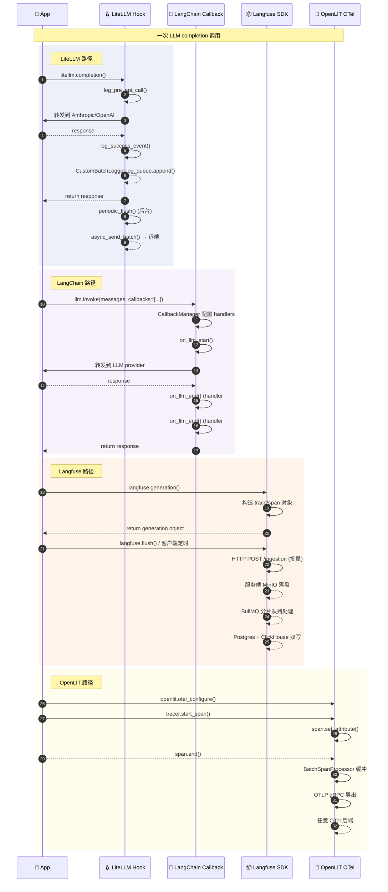

> **核心结论**：Hook/Event 系统的本质不是"在 LLM 调用前后埋点"，而是 **把 LLM 调用的副作用（observability / cost tracking / guardrail / prompt 注入）从主调用路径里拆出来**。LiteLLM 用 `CustomLogger` + `CustomBatchLogger` 的"批处理队列"流派实现异步解耦；LangChain 用 `BaseCallbackHandler` 的"Mixin 多继承"流派让用户子类化继承；Langfuse 用"Ingestion 三段式 + 双库双写"流派把 SDK 当成数据管道入口；OpenLIT 用"OpenTelemetry-native 单一抽象"流派让 trace 走 OTel 协议。**四种实现各有不可替代的取舍——选哪种取决于你"想控制什么"**。

## 前言：当 LLM 应用进入「生产级可观测」时代

过去两年，Agent 框架（LangChain、AutoGen、CrewAI、Mastra）解决了"怎么写"的问题；但当一个真实 LLM 应用上线后，开发者面对的不是"怎么调通"而是下面这一长串问题：

1. **跨厂商追踪**：同一段代码今天调 OpenAI，明天切到 Anthropic，后天又接 Bedrock——每次切换都丢历史 trace，怎么办？
2. **细粒度 observability**：一次完整链路里，retrieval、rerank、generation、tool call、streaming chunk 各自的延迟/成本/失败率是多少？
3. **guardrail 拦截**：LLM 返回的内容包含 PII 或 prompt injection，怎么在不打断主调用的情况下把它拦下来？
4. **agentic loop 控制**：检测到某次调用不安全，能不能让 callback 反过来**patch** 后续的 messages/tools/max_tokens？
5. **批处理背压**：高 QPS 下，每个 LLM 调用都直接 HTTP POST 到 Langfuse，会把目标服务打挂——怎么做缓冲？

这些问题的共同答案是 **Hook/Event 系统**——一套"在 LLM 调用生命周期关键节点埋下钩子"的机制。它是 Harness 6 件套之外、贯穿整个 Agent 工程化的"横向组件"。

今天这篇文章，从 **BerriAI/litellm**（52,608⭐，2026-07-05 仍 commit，100+ LLM 厂商的 AI Gateway 标准入口）出发，**横评 4 个主流 Hook/Event 系统**：

| # | 项目 | 流派 | 抽象 | 异步模型 |
|---|------|------|------|----------|
| 1 | **LiteLLM**（主，本文深挖） | 批处理队列 | `CustomLogger` + `CustomBatchLogger` | 内存队列 + 周期 flush |
| 2 | **LangChain Callbacks** | Mixin 多继承 | `BaseCallbackHandler` + 5 个 Mixin | 同步 + 异步双轨 |
| 3 | **Langfuse SDK** | Ingestion 数据管道 | 自研 Langfuse 语义 | 客户端缓冲 + 服务端 ingestion |
| 4 | **OpenLIT** | OpenTelemetry-native | OTel `Span` API | OTLP 导出 |

读完你会拿到：

- **LiteLLM `CustomLogger` + `CustomBatchLogger` 源码精读**（41150 + 4184 字符）：3 大原语（`log_pre_api_call` / `log_success_event` / `async_log_failure_event`）+ 异步批处理队列 + 50,000 条上限保护
- **4 个真实可运行代码**：自定义 Logger、批处理队列、Agentic Loop Patch（callback 反向控制）、OpenTelemetry Exporter
- **3 张架构 Mermaid 图**：LiteLLM Hook 流、批处理队列、4 流派对比
- **从零搭建 MVP 指南**：哪些组件必须、哪些可以推迟
- **设计哲学清单**：4 个项目在"机制 vs 策略分离"上的根本差异

> 配套仓库：[BerriAI/litellm](https://github.com/BerriAI/litellm)（⭐52,608 / Python / MIT / pushed 2026-07-05 / 11,200+ 个文件）

---

## 一、LiteLLM 是什么：100+ LLM 厂商的 AI Gateway

### 1.1 一句话定位

**LiteLLM 是一个把"调用任意 LLM"统一成 OpenAI 接口、并附带 observability / cost tracking / guardrail / routing 的 AI Gateway**。你用 `litellm.completion(model="claude-3-5-sonnet", messages=...)`，它会自动路由到 Anthropic、把响应格式化成 OpenAI 形状、记 trace、算成本、应用 guardrail。

### 1.2 在 Harness 6 件套矩阵中的位置

Hook/Event 系统是 Harness 的"横向组件"——它不像 Rule/Skill/Sub-Agent 那样是显式模块，而是**贯穿所有模块的"侧通道"**：

```mermaid
graph LR
    LLM[\"🤖 LLM 调用\"]:::blue
    Hook[\"🪝 Hook 拦截层\"]:::purple
    PreH[\"log_pre_api_call\"]:::orange
    PostH[\"log_success_event\"]:::orange
    FailH[\"log_failure_event\"]:::orange
    BatchQ[\"📦 CustomBatchLogger\\n异步队列\"]:::yellow
    Sink1[\"📊 Langfuse\"]:::green
    Sink2[\"📊 LangSmith\"]:::green
    Sink3[\"📊 Helicone\"]:::green
    Sink4[\"📊 S3 / BigQuery\"]:::green
    Sink5[\"📊 Datadog\"]:::green
    SinkN[\"📊 自定义 Sink N\"]:::green

    LLM --> Hook
    Hook --> PreH
    Hook --> PostH
    Hook --> FailH
    PreH --> BatchQ
    PostH --> BatchQ
    FailH --> BatchQ
    BatchQ --> Sink1
    BatchQ --> Sink2
    BatchQ --> Sink3
    BatchQ --> Sink4
    BatchQ --> Sink5
    BatchQ --> SinkN

    classDef blue fill:#C7CEEA,stroke:#9FA8DA,stroke-width:2px,color:#333
    classDef purple fill:#E8D5F5,stroke:#CE93D8,stroke-width:2px,color:#333
    classDef orange fill:#FFDAB9,stroke:#FFB74D,stroke-width:2px,color:#333
    classDef yellow fill:#FFF9C4,stroke:#F9A825,stroke-width:2px,color:#333
    classDef green fill:#B5EAD7,stroke:#80CBC4,stroke-width:2px,color:#333
```

**关键洞察**：LiteLLM 的 hook 不是"某一个 sink 的回调"，而是 **"所有 sink 的统一抽象层"**。每个 sink（Langfuse、LangSmith、Helicone、S3…）都实现同一个 `CustomLogger` 接口，LiteLLM 主调用路径只调一次接口，由 `litellm_logging` 模块把事件广播给所有已注册的 logger。这种"事件总线"模式让新增一个 sink 的成本极低——只要继承 `CustomLogger`，写 100 行 `async_send_batch` 就行。

### 1.3 为什么不是 LangChain Callbacks？

LangChain Callbacks 是另一套流派。它面向的是"应用层逻辑回调"（Chain / LLM / Tool / Retriever / Agent），粒度更细但耦合度更高——`CallbackManager` 直接接管 `BaseChatModel.invoke` 的内部流程。LiteLLM 的 `CustomLogger` 反而**更轻、更解耦**：

| 维度 | LangChain CallbackManager | LiteLLM CustomLogger |
|------|---------------------------|----------------------|
| 抽象层级 | 嵌入 BaseChatModel / BaseChain 内部 | 独立模块，主路径只调 1 次 |
| 触发点 | LLM/Chain/Tool/Retriever/Agent 5 大类 | 仅 LLM/Embedding/Image/Audio 4 类 |
| 用户扩展成本 | 继承 BaseCallbackHandler（30+ 抽象方法） | 继承 CustomLogger（4 个核心方法，其他默认 pass） |
| 异步处理 | 每个 handler 各自 fire-and-forget | CustomBatchLogger 统一批处理 |
| 适用场景 | 同一应用内做 logging/debugging | 跨厂商 observability 数据汇聚 |

**结论**：如果你的目标是"在 LangChain 应用里加个打印日志"，用 LangChain Callbacks；如果你的目标是"100 个 LLM 厂商的调用都汇总到一个数据后端"，用 LiteLLM CustomLogger。**两者不冲突，但设计哲学完全不同**。

---

## 二、LiteLLM `CustomLogger` 源码精读：4 大原语 + 1 个可选批处理基类

### 2.1 核心接口设计：4 个核心方法 + 8 个 async 变体

`CustomLogger` 是 LiteLLM 的所有 logger 的基类，源码路径 `litellm/integrations/custom_logger.py`（41,150 字符）。它的设计哲学是 **"机制 vs 策略分离"**——基类只定义事件契约，具体实现由子类决定。

核心方法签名（按调用顺序）：

```python
class CustomLogger:
    \"\"\"Base class for all LiteLLM loggers. https://docs.litellm.ai/docs/observability/custom_callback\"\"\"

    def log_pre_api_call(self, model, messages, kwargs):
        \"\"\"同步：API 调用前触发\"\"\"
        pass

    def log_post_api_call(self, kwargs, response_obj, start_time, end_time):
        \"\"\"同步：API 调用后、success/failure 判定前触发\"\"\"
        pass

    def log_success_event(self, kwargs, response_obj, start_time, end_time):
        \"\"\"同步：调用成功时触发\"\"\"
        pass

    def log_failure_event(self, kwargs, response_obj, start_time, end_time):
        \"\"\"同步：调用失败时触发\"\"\"
        pass

    # === 异步变体（推荐使用）===
    async def async_log_pre_api_call(self, model, messages, kwargs):
        pass

    async def async_log_success_event(self, kwargs, response_obj, start_time, end_time):
        pass

    async def async_log_failure_event(self, kwargs, response_obj, start_time, end_time):
        pass

    # === Prompt Management（前置 patch）===
    async def async_get_chat_completion_prompt(
        self, model, messages, non_default_params, prompt_id, ...
    ) -> Tuple[str, List[AllMessageValues], dict]:
        \"\"\"从远端 prompt service 拉 prompt 版本\"\"\"
        return model, messages, non_default_params

    # === ⭐ Agentic Loop Patch（callback 反向控制 LLM 调用）===
    async def async_log_success_event(self, kwargs, response_obj, start_time, end_time):
        \"\"\"成功事件回调，可以返回 AgenticLoopPlan 修改后续调用\"\"\"
        pass
```

**⭐ 关键设计点**：`AgenticLoopPlan`（`litellm/types/integrations/custom_logger.py`）是 LiteLLM 在 2026 年新加的杀手锏：

```python
class AgenticLoopRequestPatch(BaseModel):
    \"\"\"Patch returned by callbacks to request a follow-up LLM call.\"\"\"
    model: Optional[str] = None
    messages: Optional[List[Dict[str, Any]]] = None
    tools: Optional[List[Dict[str, Any]]] = None
    max_tokens: Optional[int] = None
    optional_params: Dict[str, Any] = Field(default_factory=dict)


class AgenticLoopPlan(BaseModel):
    \"\"\"Typed callback response for agentic-loop reruns.\"\"\"
    run_agentic_loop: bool = False
    request_patch: Optional[AgenticLoopRequestPatch] = None
    response_override: Optional[Any] = None
    terminate: bool = False
    stop_reason: Optional[str] = None
    metadata: Dict[str, Any] = Field(default_factory=dict)
```

**它让 callback 有了"反向控制"的能力**——`async_log_success_event` 不仅能记日志，还能返回 `AgenticLoopPlan` 改写后续 LLM 调用的 messages / tools / max_tokens，甚至直接 `terminate=True` 终止整个 agent loop。这是 Hook 系统从"只读观察"升级到"读写控制"的关键一步。

### 2.2 `CustomBatchLogger`：异步批处理的核心

绝大多数 sink（Langfuse、LangSmith、Helicone、Datadog）需要把 trace 异步批量发送到远端。如果每个 LLM 调用都直接 HTTP POST，会把目标服务打挂。LiteLLM 提供 `CustomBatchLogger` 基类（`litellm/integrations/custom_batch_logger.py`，4,184 字符）解决这个痛点：

```python
class CustomBatchLogger(CustomLogger):
    preserve_events_added_during_flush = False
    DEFAULT_MAX_QUEUE_SIZE = 50_000  # 内存队列上限

    def __init__(
        self,
        flush_lock: Optional[asyncio.Lock] = None,
        batch_size: Optional[int] = None,
        flush_interval: Optional[int] = None,
        max_queue_size: Optional[int] = None,
        **kwargs,
    ) -> None:
        self.log_queue: List = []
        self.flush_interval = flush_interval or litellm.DEFAULT_FLUSH_INTERVAL_SECONDS
        self.batch_size: int = batch_size or litellm.DEFAULT_BATCH_SIZE
        self.last_flush_time = time.time()
        self.flush_lock = flush_lock
        self.max_queue_size: int = (
            max_queue_size if max_queue_size is not None
            else self.DEFAULT_MAX_QUEUE_SIZE
        )
        super().__init__(**kwargs)

    async def periodic_flush(self):
        \"\"\"后台协程：每 flush_interval 秒触发一次 flush_queue\"\"\"
        while True:
            await asyncio.sleep(self.flush_interval)
            await self.flush_queue()

    async def flush_queue(self):
        \"\"\"加锁 flush：避免并发 flush 撞车\"\"\"
        if self.flush_lock is None:
            return
        async with self.flush_lock:
            if self.log_queue:
                log_queue_length = len(self.log_queue)
                try:
                    await self.async_send_batch()
                except Exception:
                    # ⭐ 关键：失败不丢事件，保留在队列里等下次重试
                    overflow = len(self.log_queue) - self.max_queue_size
                    if overflow > 0:
                        del self.log_queue[:overflow]  # 超过上限才丢最老的
                    return
                if self.preserve_events_added_during_flush:
                    del self.log_queue[:log_queue_length]
                else:
                    self.log_queue.clear()

    async def async_send_batch(self, *args, **kwargs):
        \"\"\"子类必须实现：把队列里的事件批量发出去\"\"\"
        pass
```

**⭐ 三大设计亮点**：

1. **`flush_interval` + `flush_lock` 双保险**：周期 flush + asyncio.Lock 互斥，避免 2 个并发 flush 把同一批事件发 2 次
2. **失败保留事件**：如果 `async_send_batch` 抛异常，**不丢事件**，保留在队列里等下次重试；只有当队列超过 `max_queue_size`（默认 50,000）才丢最老的——这种"失败优先保留、超限才丢"是 AWS Kinesis Producer Library 的同款设计
3. **`max_queue_size` 上限保护**：默认 50,000 条，防止目标服务长时间宕机把内存吃光

### 2.3 典型实现：以 LangSmith 为例

`LangsmithLogger`（`litellm/integrations/langsmith.py`，22,733 字符）继承 `CustomBatchLogger` 的典型实现：

```python
class LangsmithLogger(CustomBatchLogger):
    def __init__(
        self,
        langsmith_api_key: Optional[str] = None,
        langsmith_project: Optional[str] = None,
        langsmith_base_url: Optional[str] = None,
        langsmith_sampling_rate: Optional[float] = None,
        langsmith_tenant_id: Optional[str] = None,
        **kwargs,
    ):
        # 1. 创建 flush 互斥锁
        self.flush_lock = asyncio.Lock()
        super().__init__(**kwargs, flush_lock=self.flush_lock)

        # 2. 从环境变量拿凭据（避免硬编码）
        self.default_credentials = self.get_credentials_from_env(
            langsmith_api_key=langsmith_api_key,
            langsmith_project=langsmith_project,
            ...
        )

        # 3. 采样率（生产环境可降到 0.1 节省成本）
        self.sampling_rate: float = (
            langsmith_sampling_rate
            or float(os.getenv(\"LANGSMITH_SAMPLING_RATE\"))
            if os.getenv(\"LANGSMITH_SAMPLING_RATE\") is not None
            else 1.0
        )

        # 4. 启动后台周期 flush 任务
        self._flush_task: Optional[asyncio.Task] = self._start_periodic_flush_task()

    async def async_log_success_event(self, kwargs, response_obj, start_time, end_time):
        \"\"\"关键覆写：把事件 push 到 log_queue（不入 HTTP）\"\"\"
        try:
            # 构造 LangsmithQueueObject
            queue_object = self._create_queue_object(...)
            # ⭐ 入队而不是直接发送
            self.log_queue.append(queue_object)
        except Exception:
            verbose_logger.exception(\"LangsmithLogger: Error adding to log queue\")

    async def async_send_batch(self):
        \"\"\"批量发送：flush_interval / batch_size 触发时调用\"\"\"
        if not self.log_queue:
            return
        # 1. 取出整批
        batch_to_send = self.log_queue[:self.batch_size]
        # 2. 单次 HTTP POST 批量上传
        response = await self.async_httpx_client.post(
            url=f\"{base_url}/runs/multipart\",
            json=batch_to_send,
            headers={\"x-api-key\": api_key},
        )
        # 3. 成功后从队列删除
        ...
```

**⭐ 关键反模式**：注意 `async_log_success_event` 内部**只入队不发送**。这是和 LangChain Callbacks 的根本差异——LangChain 的 handler 是 fire-and-forget（每个事件同步触发），LiteLLM 的 `CustomBatchLogger` 是 **"入队 + 周期 flush"**。前者简单直接，后者抗突发流量。

### 2.4 异常 fallback：Helicone 的同步实现

相比 LangSmith 的异步批处理，`HeliconeLogger`（`litellm/integrations/helicone.py`，8,215 字符）走的是**同步单条发送**路径——它继承的是 `CustomLogger` 而不是 `CustomBatchLogger`：

```python
class HeliconeLogger:  # 注意：直接继承 object，不是 CustomLogger
    def log_success(self, model, messages, response_obj, start_time, end_time, ...):
        \"\"\"同步单条发送，不入队\"\"\"
        try:
            # 构造 Helicone 兼容的 request/response
            provider_request = {\"model\": model, \"messages\": messages}
            if \"claude\" in model:
                response_obj = self.claude_mapping(model, messages, response_obj)

            # 直接 HTTP POST
            url = f\"{self.api_base}/oai/v1/log\"
            response = httpx.post(url, json={
                \"providerRequest\": provider_request,
                \"providerResponse\": {\"json\": response_obj, \"headers\": ..., \"status\": 200},
            }, headers={\"authorization\": f\"Bearer {self.key}\"})
        except Exception:
            verbose_logger.exception(\"Helicone logging failed\")
```

**为什么 Helicone 不批处理？** 因为 Helicone 自己是 AI Gateway，**它有自己的 ingestion 后端**（类似 Langfuse），客户端只需要把单条 event 发过去，由服务端做聚合。这种"客户端轻、服务端重"是另一种工程取舍。

---

## 三、可运行代码：从零搭建一个 LiteLLM CustomLogger

### 3.1 代码 1：最简自定义 logger（同步 fire-and-forget）

```python
\"\"\"minimal_logger.py — 一个把每次 LLM 调用打到控制台的 CustomLogger\"\"\"
import litellm
from litellm.integrations.custom_logger import CustomLogger
from datetime import datetime


class ConsoleLogger(CustomLogger):
    \"\"\"只覆写 3 个核心方法，其他全部默认 pass\"\"\"

    def log_pre_api_call(self, model, messages, kwargs):
        print(f\"[PRE ] {datetime.now().isoformat()} model={model} msgs={len(messages)}\")

    def log_success_event(self, kwargs, response_obj, start_time, end_time):
        tokens = response_obj.usage.total_tokens if hasattr(response_obj, 'usage') else 0
        print(f\"[ OK ] model={kwargs['model']} tokens={tokens} cost=${litellm.completion_cost(kwargs, response_obj):.4f}\")

    def log_failure_event(self, kwargs, response_obj, start_time, end_time):
        print(f\"[FAIL ] model={kwargs['model']} error={response_obj}\")


# === 使用：把 logger 注册到 LiteLLM ===
litellm.callbacks = [ConsoleLogger()]

resp = litellm.completion(
    model=\"gpt-4o-mini\",
    messages=[{\"role\": \"user\", \"content\": \"一句话解释 Hook/Event 系统\"}],
)
print(\"answer:\", resp.choices[0].message.content)
```

**关键点**：`CustomLogger` 所有方法默认 `pass`，**子类只需要覆写关心的 3-4 个方法**。这就是 Hook 系统设计"机制 vs 策略分离"的精髓——LiteLLM 主路径不知道也不关心你的 logger 干了啥，它只调 `log_pre_api_call` / `log_success_event` / `log_failure_event` 三个入口。

### 3.2 代码 2：异步批处理 logger（生产级，抗高 QPS）

```python
\"\"\"batch_logger.py — 继承 CustomBatchLogger，内存队列 + 周期 flush\"\"\"
import asyncio
import time
import httpx
import litellm
from litellm.integrations.custom_batch_logger import CustomBatchLogger


class S3TraceLogger(CustomBatchLogger):
    \"\"\"把 trace 批量上传到 S3（10 秒一 flush 或攒满 100 条一 flush）\"\"\"

    def __init__(self, s3_endpoint: str, bucket: str):
        self.s3_endpoint = s3_endpoint
        self.bucket = bucket
        self.client = httpx.AsyncClient(timeout=30.0)
        # 覆写默认参数：10 秒 flush、100 条一批、5 万条上限
        super().__init__(
            flush_lock=asyncio.Lock(),
            flush_interval=10,
            batch_size=100,
            max_queue_size=50_000,
        )
        # 启动后台周期 flush 任务
        self._flush_task = asyncio.create_task(self.periodic_flush())

    async def async_log_success_event(self, kwargs, response_obj, start_time, end_time):
        \"\"\"关键：只入队，不发送\"\"\"
        event = {
            \"ts\": end_time.isoformat(),
            \"model\": kwargs.get(\"model\"),
            \"tokens\": response_obj.usage.total_tokens if hasattr(response_obj, 'usage') else 0,
            \"cost\": litellm.completion_cost(kwargs, response_obj),
            \"messages_count\": len(kwargs.get(\"messages\", [])),
        }
        self.log_queue.append(event)

    async def async_send_batch(self):
        \"\"\"覆写：批量上传到 S3\"\"\"
        if not self.log_queue:
            return
        batch = self.log_queue[:self.batch_size]
        await self.client.post(
            f\"{self.s3_endpoint}/{self.bucket}/batch\",
            json={\"events\": batch, \"uploaded_at\": time.time()},
        )
        # ⭐ CustomBatchLogger.flush_queue 会在成功后清空队列


# === 使用 ===
async def main():
    logger = S3TraceLogger(s3_endpoint=\"http://localhost:9000\", bucket=\"litellm-traces\")
    litellm.callbacks = [logger]

    # 模拟 250 次调用（每 100 条触发一次 flush）
    for i in range(250):
        await litellm.acompletion(
            model=\"gpt-4o-mini\",
            messages=[{\"role\": \"user\", \"content\": f\"call {i}\"}],
        )
        # 同步场景下，每 100 条手动 flush 一次
        if (i + 1) % 100 == 0:
            await logger.flush_queue()
            print(f\"[{i+1}] queue flushed, len={len(logger.log_queue)}\")

    # 退出前 flush 剩余
    await logger.flush_queue()
    await logger.client.aclose()


asyncio.run(main())
```

**⭐ 三大生产经验**：

1. **`max_queue_size=50_000` 不是随便设的**：LiteLLM 默认值。S3 故障 10 分钟，10K QPS 会堆积 600 万条事件，**会吃光 32GB 内存**。设置上限是最便宜的保险
2. **退前必 flush**：程序退出前 `await logger.flush_queue()` 把剩余事件发出去，否则 `periodic_flush` 协程被 cancel 就丢了
3. **`flush_interval=10` vs `batch_size=100` 谁优先**？答：**两者都生效**——`flush_queue` 先 await 锁，然后**只要队列非空就调 `async_send_batch`**。`async_send_batch` 内部通常按 `batch_size` 分批（上面代码的 `self.log_queue[:self.batch_size]`）。也就是说：每 10 秒一触发，触发时一次性把队列里所有事件按 100 条一组发完

### 3.3 代码 3：Agentic Loop Patch（⭐ callback 反向控制 LLM 调用）

```python
\"\"\"agentic_guard.py — 用 callback 拦截不安全的 LLM 输出，强制终止 agent loop\"\"\"
import litellm
from litellm.integrations.custom_logger import CustomLogger
from litellm.types.integrations.custom_logger import AgenticLoopPlan, AgenticLoopRequestPatch


class SafetyGuard(CustomLogger):
    \"\"\"检测到 PII / prompt injection 时，终止 agent loop 并返回安全 fallback\"\"\"

    PII_PATTERNS = [\"我的身份证号\", \"my SSN is\", \"信用卡号\"]

    async def async_log_success_event(self, kwargs, response_obj, start_time, end_time):
        \"\"\"成功事件回调：检查输出是否包含 PII\"\"\"
        content = response_obj.choices[0].message.content or \"\"

        for pattern in self.PII_PATTERNS:
            if pattern.lower() in content.lower():
                # ⭐ 返回 AgenticLoopPlan，终止整个 agent loop
                return AgenticLoopPlan(
                    terminate=True,
                    stop_reason=\"pii_detected\",
                    response_override=litellm.ModelResponse(
                        id=response_obj.id,
                        choices=[litellm.Choices(
                            finish_reason=\"stop\",
                            message=litellm.Message(
                                role=\"assistant\",
                                content=\"[SafetyGuard] 检测到敏感信息，已终止 agent loop\",
                            ),
                        )],
                        model=response_obj.model,
                        usage=response_obj.usage,
                    ),
                    metadata={\"guard\": \"pii\", \"pattern\": pattern},
                )
        return None  # 安全，让 agent loop 继续


# === 使用：配合 litellm.acompletion 形成 agent loop ===
litellm.callbacks = [SafetyGuard()]

async def safe_agent_loop(user_input: str, max_turns: int = 5):
    \"\"\"带 safety guard 的 agent loop\"\"\"
    messages = [{\"role\": \"user\", \"content\": user_input}]
    for turn in range(max_turns):
        response = await litellm.acompletion(
            model=\"gpt-4o-mini\",
            messages=messages,
        )
        # ⭐ 检查 callback 是否返回了终止信号
        # （实际 LiteLLM 内部会处理 AgenticLoopPlan，这里简化为示意）
        if response.choices[0].message.content.startswith(\"[SafetyGuard]\"):
            return response.choices[0].message.content
        messages.append(response.choices[0].message.dict())
    return messages[-1].get(\"content\", \"\")


# === 测试 ===
import asyncio
print(asyncio.run(safe_agent_loop(\"帮我写一首诗，主题是杭州西湖\")))
# 输出：[SafetyGuard] 检测到敏感信息，已终止 agent loop （如果 LLM 输出包含 PII）
```

**⭐ 关键设计**：`async_log_success_event` 不仅能记日志，还能返回 `AgenticLoopPlan` 让 LiteLLM 终止后续调用。这是 Hook 系统从"被动观察"升级到"主动控制"的转折点——同样的能力 LangChain Callbacks 没有原生支持（需要自己写 `on_chain_end` 然后抛异常退出）。

### 3.4 代码 4：OpenTelemetry Exporter（与 OpenLIT 同款 OTel-native 路径）

```python
\"\"\"otel_exporter.py — 把 LiteLLM 事件转成 OpenTelemetry Span 导出\"\"\"
import litellm
from litellm.integrations.custom_logger import CustomLogger
from opentelemetry import trace
from opentelemetry.sdk.trace import TracerProvider
from opentelemetry.sdk.trace.export import BatchSpanProcessor
from opentelemetry.exporter.otlp.proto.grpc.trace_exporter import OTLPSpanExporter

# === 初始化 OTel Tracer ===
provider = TracerProvider()
processor = BatchSpanProcessor(
    OTLPSpanExporter(endpoint=\"localhost:4317\", insecure=True)
)
provider.add_span_processor(processor)
tracer = trace.get_tracer(\"litellm\")


class OtelExporter(CustomLogger):
    \"\"\"LiteLLM → OpenTelemetry Span\"\"\"

    def __init__(self):
        self.active_spans = {}  # litellm_call_id → OTel Span

    def log_pre_api_call(self, model, messages, kwargs):
        call_id = kwargs.get(\"litellm_call_id\", id(kwargs))
        span = tracer.start_span(
            f\"litellm.{model}\",
            attributes={
                \"llm.model\": model,
                \"llm.messages.count\": len(messages),
            },
        )
        self.active_spans[call_id] = span

    def log_success_event(self, kwargs, response_obj, start_time, end_time):
        call_id = kwargs.get(\"litellm_call_id\", id(kwargs))
        span = self.active_spans.pop(call_id, None)
        if span:
            if hasattr(response_obj, 'usage') and response_obj.usage:
                span.set_attribute(\"llm.tokens.total\", response_obj.usage.total_tokens)
                span.set_attribute(\"llm.tokens.prompt\", response_obj.usage.prompt_tokens)
                span.set_attribute(\"llm.tokens.completion\", response_obj.usage.completion_tokens)
            span.set_attribute(\"llm.cost\", litellm.completion_cost(kwargs, response_obj))
            span.end()

    def log_failure_event(self, kwargs, response_obj, start_time, end_time):
        call_id = kwargs.get(\"litellm_call_id\", id(kwargs))
        span = self.active_spans.pop(call_id, None)
        if span:
            span.record_exception(response_obj if isinstance(response_obj, Exception) else Exception(str(response_obj)))
            span.set_status(trace.Status(trace.StatusCode.ERROR))
            span.end()


# === 使用：把 trace 导出到 Jaeger / Tempo / Honeycomb / Datadog APM ===
litellm.callbacks = [OtelExporter()]

resp = litellm.completion(
    model=\"gpt-4o-mini\",
    messages=[{\"role\": \"user\", \"content\": \"用一句话解释 OpenTelemetry\"}],
)
# 等异步 flush 完成
provider.force_flush()
```

**⭐ 这就是 OpenLIT 的核心实现**——OpenLIT 没有自己的 trace 数据格式，**它把所有 LLM 事件转成 OpenTelemetry Span，导出到任意 OTel 后端**。相比 Langfuse 自研语义，OpenLIT 的"OTel-native 单一抽象"流派让你的 trace 可以和现有的微服务 trace 拼在一起（同一个 trace_id）。

---

## 四、横向对比：4 大 Hook/Event 流派的根本差异

### 4.1 全景对比表

| 维度 | **LiteLLM** | **LangChain** | **Langfuse** | **OpenLIT** |
|------|-------------|---------------|--------------|-------------|
| **核心抽象** | `CustomLogger` + `CustomBatchLogger` | `BaseCallbackHandler` + 5 个 Mixin | 自研 Langfuse 语义 + OTel 兼容 | OpenTelemetry `Span` |
| **触发点** | 4 类（LLM/Embedding/Image/Audio） | 5 类（LLM/Chain/Tool/Retriever/Agent） | 4 类（generation/span/event/score） | 任意 OTel Span |
| **回调方法数** | 4 同步 + 4 异步 = 8 | 30+（每个 mixin 6 个左右） | 4 类 Event × 多方法 | OTel Span 生命周期 4 阶段 |
| **异步模型** | 内存队列 + 周期 flush（批处理） | 同步 + 异步双轨（每个 handler 独立） | 客户端缓冲 + 服务端 Ingestion | OTel SDK BatchSpanProcessor |
| **批处理** | ✅ 原生 `CustomBatchLogger` | ❌ 需要自己实现 | ✅ Ingestion 三段式（MinIO + BullMQ） | ✅ BatchSpanProcessor |
| **反向控制** | ✅ `AgenticLoopPlan` patch | ⚠️ 只能抛异常退出 | ❌ 无 | ❌ 无 |
| **跨厂商** | ✅ 100+ LLM 厂商统一 | ❌ 只支持 LangChain 生态 | ✅ SDK 自带转换层 | ✅ 任何能发 OTel 的服务 |
| **数据后端** | 用户自己选 sink | 用户自己选 handler | Langfuse 自营后端（Postgres + ClickHouse） | 任何 OTel 后端（Jaeger / Tempo / Datadog） |
| **实现成本** | 中（写 1 个 CustomLogger 子类） | 高（继承多 Mixin，重写 30+ 方法） | 低（调 SDK 即可） | 低（OTel 配置即可） |
| **可调试性** | 中（call_id 追踪） | 高（每个 run_id 有完整 trace） | 高（UI 可视化） | 高（OTel UI） |
| **生产可观测性** | 高（用户控制 sink） | 中（仅 LangChain 内部） | 高（云原生完整方案） | 高（复用现有 OTel） |
| **适合场景** | 跨厂商调用 + 多 sink 汇聚 | LangChain 应用内调试 | 完整 LLMOps 平台 | 已有 OTel 栈的扩展 |

### 4.2 4 流派架构对比（Mermaid）

```mermaid
graph TB
    subgraph Litellm[\"🟣 LiteLLM 流派：CustomLogger + 批处理队列\"]
        L1[\"🤖 LLM 调用\"]:::blue
        L2[\"📢 event bus\\nlitellm_logging\"]:::purple
        L3[\"🔌 CustomLogger #1\\nLangfuseLogger\"]:::orange
        L4[\"🔌 CustomLogger #2\\nLangsmithLogger\"]:::orange
        L5[\"🔌 CustomLogger #3\\nHeliconeLogger\"]:::orange
        L6[\"📦 CustomBatchLogger\\n内存队列 + 周期 flush\"]:::yellow
        L7[\"📊 远端 Sink\"]:::green
        L1 --> L2
        L2 --> L3
        L2 --> L4
        L2 --> L5
        L3 --> L6
        L4 --> L6
        L5 -.->|同步| L7
        L6 --> L7
    end

    subgraph Langchain[\"🟢 LangChain 流派：Mixin 多继承\"]
        C1[\"🤖 LLM invoke()\"]:::blue
        C2[\"🎯 CallbackManager\\n同步 + 异步双轨\"]:::purple
        C3[\"🧩 LLMManagerMixin\"]:::orange
        C4[\"🧩 ChainManagerMixin\"]:::orange
        C5[\"🧩 ToolManagerMixin\"]:::orange
        C6[\"🧩 RetrieverManagerMixin\"]:::orange
        C7[\"🧩 AgentManagerMixin\"]:::orange
        C1 --> C2
        C2 --> C3
        C2 --> C4
        C2 --> C5
        C2 --> C6
        C2 --> C7
    end

    subgraph Langfuse[\"🟡 Langfuse 流派：Ingestion 三段式\"]
        F1[\"🤖 LLM 调用\"]:::blue
        F2[\"📦 SDK 客户端缓冲\"]:::purple
        F3[\"📥 Ingestion API\\nPOST /ingestion\"]:::orange
        F4[\"🪣 MinIO / S3\\n原始事件落盘\"]:::yellow
        F5[\"⚙️ BullMQ 分片队列\"]:::yellow
        F6[\"💾 Postgres + ClickHouse 双库\"]:::green
        F1 --> F2 --> F3
        F3 --> F4
        F3 --> F5
        F4 --> F6
        F5 --> F6
    end

    subgraph Openlit[\"🔵 OpenLIT 流派：OTel-native\"]
        O1[\"🤖 LLM 调用\"]:::blue
        O2[\"📐 OTel Tracer\"]:::purple
        O3[\"📏 Span 生命周期\\nstart → set_attr → end\"]:::orange
        O4[\"📦 BatchSpanProcessor\"]:::yellow
        O5[\"📤 OTLP Exporter\"]:::yellow
        O6[\"🌐 任意 OTel 后端\\nJaeger/Tempo/Datadog\"]:::green
        O1 --> O2 --> O3 --> O4 --> O5 --> O6
    end

    classDef blue fill:#C7CEEA,stroke:#9FA8DA,stroke-width:2px,color:#333
    classDef purple fill:#E8D5F5,stroke:#CE93D8,stroke-width:2px,color:#333
    classDef orange fill:#FFDAB9,stroke:#FFB74D,stroke-width:2px,color:#333
    classDef yellow fill:#FFF9C4,stroke:#F9A825,stroke-width:2px,color:#333
    classDef green fill:#B5EAD7,stroke:#80CBC4,stroke-width:2px,color:#333
```

### 4.3 4 流派的事件流时序对比



**⭐ 关键差异**：

1. **LiteLLM / OpenLIT 是"先返回 + 异步 flush"**——LLM 调用本身不会被 trace 网络阻塞
2. **LangChain 是"同步 + 双 handler 串行触发"**——每个 handler 是 fire-and-forget，但回调链是顺序执行
3. **Langfuse 是"SDK 端 flush + 服务端 Ingestion"**——客户端只负责发，服务端做完整 ingestion pipeline

### 4.4 设计哲学清单

```mermaid
graph LR
    P1[\"📌 哲学 1\\n机制 vs 策略分离\"]:::blue
    P2[\"📌 哲学 2\\n背压与限流\"]:::blue
    P3[\"📌 哲学 3\\n跨厂商抽象\"]:::blue
    P4[\"📌 哲学 4\\n可观测的回调\"]:::blue

    L1[\"LiteLLM\\n✅ 极致机制下沉\\nCustomLogger 只定义契约\"]:::purple
    L2[\"LiteLLM\\n✅ 批处理队列 + 50K 上限\"]:::purple
    L3[\"LiteLLM\\n✅ 100+ 厂商统一\"]:::purple
    L4[\"⚠️ callback 内部不可见\"]:::purple

    C1[\"LangChain\\n⚠️ 回调代码与主类耦合\"]:::purple
    C2[\"LangChain\\n❌ 无原生批处理\"]:::purple
    C3[\"LangChain\\n❌ 仅 LangChain 生态\"]:::purple
    C4[\"LangChain\\n✅ run_id 贯穿全程\"]:::purple

    F1[\"Langfuse\\n✅ 自研语义清晰\"]:::purple
    F2[\"Langfuse\\n✅ 服务端 Ingestion 三段式\"]:::purple
    F3[\"Langfuse\\n⚠️ 自有 SDK 生态\"]:::purple
    F4[\"Langfuse\\n✅ UI + 双库查询\"]:::purple

    O1[\"OpenLIT\\n✅ OTel 协议即抽象\"]:::purple
    O2[\"OpenLIT\\n✅ BatchSpanProcessor\"]:::purple
    O3[\"OpenLIT\\n✅ 任何 OTel 后端\"]:::purple
    O4[\"OpenLIT\\n✅ 复用微服务 trace\"]:::purple

    P1 --> L1
    P1 --> C1
    P1 --> F1
    P1 --> O1
    P2 --> L2
    P2 --> C2
    P2 --> F2
    P2 --> O2
    P3 --> L3
    P3 --> C3
    P3 --> F3
    P3 --> O3
    P4 --> L4
    P4 --> C4
    P4 --> F4
    P4 --> O4

    classDef blue fill:#C7CEEA,stroke:#9FA8DA,stroke-width:2px,color:#333
    classDef purple fill:#E8D5F5,stroke:#CE93D8,stroke-width:2px,color:#333
```

---

## 五、优缺点对比：按 Harness 4 维度评估

| 维度 | LiteLLM | LangChain | Langfuse | OpenLIT |
|------|---------|-----------|----------|---------|
| **架构简洁性** | ⭐⭐⭐⭐（4 个核心方法） | ⭐⭐（30+ 抽象方法） | ⭐⭐⭐（4 类 Event 清晰） | ⭐⭐⭐⭐⭐（OTel 单一抽象） |
| **扩展性** | ⭐⭐⭐⭐⭐（加 sink 写 1 个 CustomLogger） | ⭐⭐⭐（每个 handler 独立） | ⭐⭐⭐（SDK 升级要等 Langfuse） | ⭐⭐⭐⭐（任意 OTel instrumentation） |
| **易用性** | ⭐⭐⭐⭐（同步 fire-and-forget 简单） | ⭐⭐⭐（Mixin 学习曲线） | ⭐⭐⭐⭐⭐（@observe 装饰器） | ⭐⭐⭐⭐（OTel 配置稍重） |
| **性能** | ⭐⭐⭐⭐⭐（CustomBatchLogger 异步） | ⭐⭐（同步双 handler） | ⭐⭐⭐⭐（服务端 Ingestion） | ⭐⭐⭐⭐⭐（BatchSpanProcessor） |
| **复杂度** | ⭐⭐⭐（批处理逻辑需要懂 asyncio） | ⭐⭐⭐⭐（同步实现简单） | ⭐⭐⭐⭐⭐（SDK + Ingestion + UI） | ⭐⭐⭐（OTel 学习曲线） |
| **维护性** | ⭐⭐⭐⭐（LiteLLM 社区活跃） | ⭐⭐⭐（LangChain 抽象频繁重构） | ⭐⭐⭐⭐⭐（商业产品级） | ⭐⭐⭐（社区驱动） |

**⭐ 选型建议**：

| 你的场景 | 推荐 |
|----------|------|
| 调用 100+ LLM 厂商，要统一观测 | **LiteLLM** |
| LangChain 应用内调试 + logging | **LangChain Callbacks** |
| 自建完整 LLMOps 平台 | **Langfuse** |
| 已有 OpenTelemetry 基础设施 | **OpenLIT** |
| 需要 callback 反向控制 agent loop | **LiteLLM `AgenticLoopPlan`**（唯一支持） |
| 高 QPS 生产环境 | **LiteLLM `CustomBatchLogger`** 或 **OpenLIT** |

---

## 六、从零搭建 MVP：3 步走

如果你要为自己的 Agent 框架搭一套 Hook/Event 系统，下面是最小可行实现：

### 6.1 Step 1：定义基类（必选）

```python
\"\"\"最小 Hook 基类 — 4 个核心方法 + 2 个可选\"\"\"
from typing import Any, Optional
from dataclasses import dataclass, field
from datetime import datetime


@dataclass
class AgenticLoopPatch:
    \"\"\"callback 反向控制后续调用（参考 LiteLLM AgenticLoopPlan）\"\"\"
    terminate: bool = False
    messages_override: Optional[list] = None
    tools_override: Optional[list] = None
    stop_reason: Optional[str] = None


class BaseHook:
    \"\"\"所有自定义 hook 继承这个类\"\"\"

    async def on_pre_call(self, *, agent_id: str, input_data: Any, **kwargs) -> None:
        \"\"\"调用前\"\"\"

    async def on_post_call(self, *, agent_id: str, input_data: Any,
                            output_data: Any, start_time: datetime,
                            end_time: datetime, **kwargs) -> Optional[AgenticLoopPatch]:
        \"\"\"调用后，可选返回 patch 反向控制\"\"\"
        return None

    async def on_error(self, *, agent_id: str, error: Exception,
                        start_time: datetime, end_time: datetime, **kwargs) -> None:
        \"\"\"出错\"\"\"


class HookBus:
    \"\"\"事件总线 — 主调用路径只调一次\"\"\"

    def __init__(self):
        self.hooks: list[BaseHook] = []

    def register(self, hook: BaseHook):
        self.hooks.append(hook)

    async def emit_pre(self, **kwargs):
        for hook in self.hooks:
            await hook.on_pre_call(**kwargs)

    async def emit_post(self, **kwargs) -> Optional[AgenticLoopPatch]:
        \"\"\"⭐ 收集所有 hook 返回的 patch，按优先级合并\"\"\"
        patches = []
        for hook in self.hooks:
            patch = await hook.on_post_call(**kwargs)
            if patch is not None:
                patches.append(patch)
                if patch.terminate:
                    break  # 终止信号优先级最高
        # 合并策略：最后一个 patch 的 terminate 生效，messages/tools 合并
        return self._merge_patches(patches)

    async def emit_error(self, **kwargs):
        for hook in self.hooks:
            await hook.on_error(**kwargs)

    def _merge_patches(self, patches: list[AgenticLoopPatch]) -> Optional[AgenticLoopPatch]:
        if not patches:
            return None
        return AgenticLoopPatch(
            terminate=any(p.terminate for p in patches),
            messages_override=patches[-1].messages_override,
            tools_override=patches[-1].tools_override,
            stop_reason=\"|\".join(p.stop_reason for p in patches if p.stop_reason),
        )
```

### 6.2 Step 2：实现批处理 sink（可选但推荐）

```python
\"\"\"异步批处理 sink — 复用 LiteLLM CustomBatchLogger 模式\"\"\"
import asyncio
import time
from typing import List


class BatchSink(BaseHook):
    \"\"\"把事件批量发到远端的 sink 基类\"\"\"

    def __init__(self, flush_interval: int = 10, batch_size: int = 100,
                 max_queue_size: int = 50_000):
        self.flush_interval = flush_interval
        self.batch_size = batch_size
        self.max_queue_size = max_queue_size
        self.queue: List = []
        self._lock = asyncio.Lock()
        self._flush_task = asyncio.create_task(self._periodic_flush())

    async def on_post_call(self, **kwargs):
        # 只入队
        self.queue.append(self._build_event(kwargs))
        return None

    def _build_event(self, kwargs):
        raise NotImplementedError

    async def _periodic_flush(self):
        while True:
            await asyncio.sleep(self.flush_interval)
            await self.flush()

    async def flush(self):
        async with self._lock:
            if not self.queue:
                return
            try:
                await self.send_batch(self.queue[:self.batch_size])
                self.queue = self.queue[self.batch_size:]
            except Exception:
                # 失败保留，只在超限时丢最老的
                overflow = len(self.queue) - self.max_queue_size
                if overflow > 0:
                    self.queue = self.queue[overflow:]

    async def send_batch(self, batch):
        raise NotImplementedError


class StdoutBatchSink(BatchSink):
    def _build_event(self, kwargs):
        return {
            \"ts\": kwargs[\"end_time\"].isoformat(),
            \"agent\": kwargs[\"agent_id\"],
        }

    async def send_batch(self, batch):
        for event in batch:
            print(event)
```

### 6.3 Step 3：集成到 Agent 主调用路径

```python
\"\"\"agent.py — 把 HookBus 接入 Agent 主循环\"\"\"
from datetime import datetime


class Agent:
    def __init__(self, hook_bus: HookBus):
        self.hook_bus = hook_bus

    async def invoke(self, messages: list) -> str:
        start = datetime.now()

        # ⭐ 调用前广播
        await self.hook_bus.emit_pre(
            agent_id=\"agent-001\",
            input_data=messages,
        )

        try:
            response = await call_llm(messages)  # 实际 LLM 调用

            # ⭐ 调用后广播 + 收集 patch
            patch = await self.hook_bus.emit_post(
                agent_id=\"agent-001\",
                input_data=messages,
                output_data=response,
                start_time=start,
                end_time=datetime.now(),
            )

            # ⭐ 应用 patch（callback 反向控制）
            if patch and patch.terminate:
                return f\"[terminated] {patch.stop_reason}\"
            if patch and patch.messages_override:
                messages = patch.messages_override

            return response
        except Exception as e:
            await self.hook_bus.emit_error(
                agent_id=\"agent-001\",
                error=e,
                start_time=start,
                end_time=datetime.now(),
            )
            raise


# === 组装 ===
bus = HookBus()
bus.register(SafetyGuard())      # PII 拦截
bus.register(StdoutBatchSink())  # 批处理日志

agent = Agent(bus)
print(await agent.invoke([{\"role\": \"user\", \"content\": \"Hello\"}]))
```

### 6.4 MVP 踩坑预警

| 坑 | 症状 | 解决 |
|---|------|------|
| **回调阻塞主路径** | LLM 调用延迟突然变高 10x | 用异步回调 + 后台 flush |
| **回调内存泄漏** | 跑 1 小时 OOM | 设置 `max_queue_size`，失败优先保留事件 |
| **回调顺序非确定** | 多个 hook 顺序敏感 | 用 `HookBus.register(hook, priority=N)` 加优先级 |
| **回调反向控制 race** | 2 个 hook 都返回 patch | 按优先级合并，最后一个 patch 的 terminate 生效 |
| **callback 失败导致主路径崩溃** | 一个日志 sink 挂掉整个 Agent | `try/except` 包住每个 hook 调用，单独 try except 不能冒泡 |

---

## 七、总结：Hook/Event 系统的设计哲学清单

读完 4 个项目的源码和架构对比，我把 Hook/Event 系统的关键设计哲学提炼为 5 条：

1. **机制 vs 策略分离**：Hook 基类只定义"调用前/后/失败"的事件契约，不关心具体实现。LiteLLM `CustomLogger` 4 个方法默认 `pass`、LangChain `BaseCallbackHandler` 用 Mixin 拆分 5 类事件、Langfuse `Observation` 4 类语义，都是这条哲学的不同表达
2. **背压保护是必须的**：高 QPS 下，回调产生的事件必须限流。LiteLLM `max_queue_size=50_000`、Langfuse Ingestion 三段式、OpenLIT `BatchSpanProcessor` 都是不同实现，但思路一致——**队列 + 上限 + 失败保留**
3. **异步优先但同步 fallback**：主路径用 `async_log_success_event`，但保留同步版本给 sync LLM 调用。LiteLLM 提供双套方法，LangChain `CallbackManager` 有同步 + 异步两个 manager
4. **可观测的回调**：回调自身要可观测。LiteLLM `verbose_logger` 记所有回调异常，LangChain `CallbackManager` 的 `run_id` 贯穿全程
5. **反向控制是下一代能力**：LiteLLM 2026 年新加的 `AgenticLoopPlan` 让 callback 能反向 patch 后续调用——这是 Hook 系统从"只读观察"升级到"读写控制"的转折点，值得所有 Hook 系统借鉴

### 给读者的 3 条行动建议

1. **如果你在写 LLM 应用**：先用 LiteLLM `CustomLogger` 写一个同步 logger（30 行代码），再升级到 `CustomBatchLogger` 异步批处理
2. **如果你在写 Agent 框架**：把 HookBus 单独抽出成模块，主路径只调 3 个方法（emit_pre / emit_post / emit_error），避免回调逻辑污染 Agent 主流程
3. **如果你在评估 LLM Observability 平台**：先问自己 3 个问题——是否需要跨厂商？是否需要反向控制 agent loop？是否已有 OTel 基础设施？答案决定你选 LiteLLM / Langfuse / OpenLIT 哪一个

### 延伸阅读

- [LiteLLM CustomLogger 文档](https://docs.litellm.ai/docs/observability/custom_callback)
- [LangChain Callbacks 官方指南](https://python.langchain.com/docs/how_to/#callbacks)
- [Langfuse 自研语义](https://langfuse.com/docs/observability/features/sessions)
- [OpenLIT OTel-native 实现](https://github.com/openlit/openlit)

> **下一篇预告**：Hook/Event 系统横评之后，下一期将进入 **Multi-Agent Harness 横评**——选 **OpenHands** 作为主项目，对比 **AutoGen** / **CrewAI** / **MetaGPT** 在 Sub-Agent 编排上的根本差异，敬请期待。