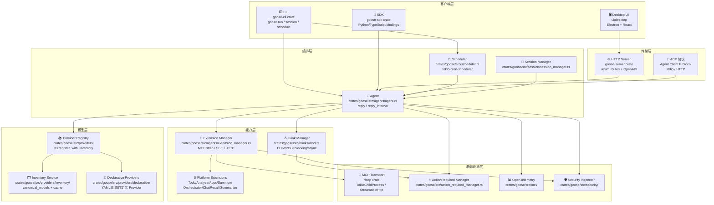
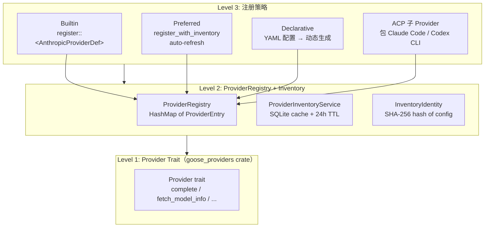
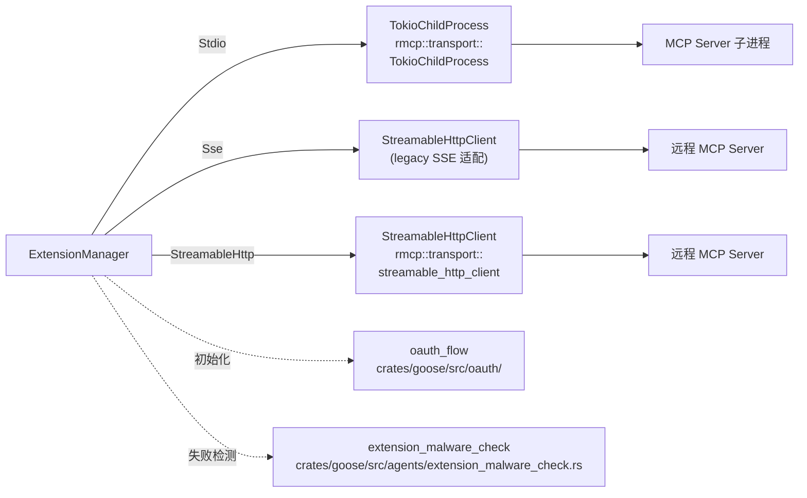
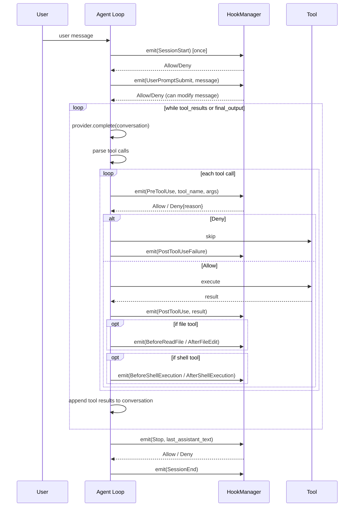
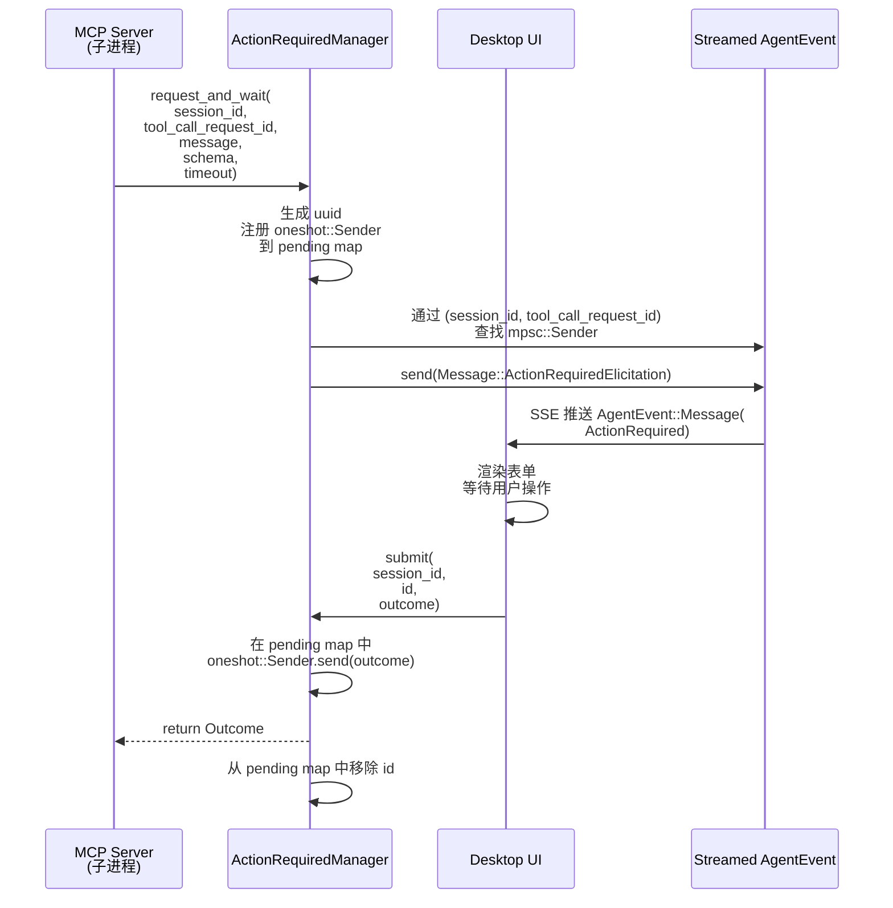
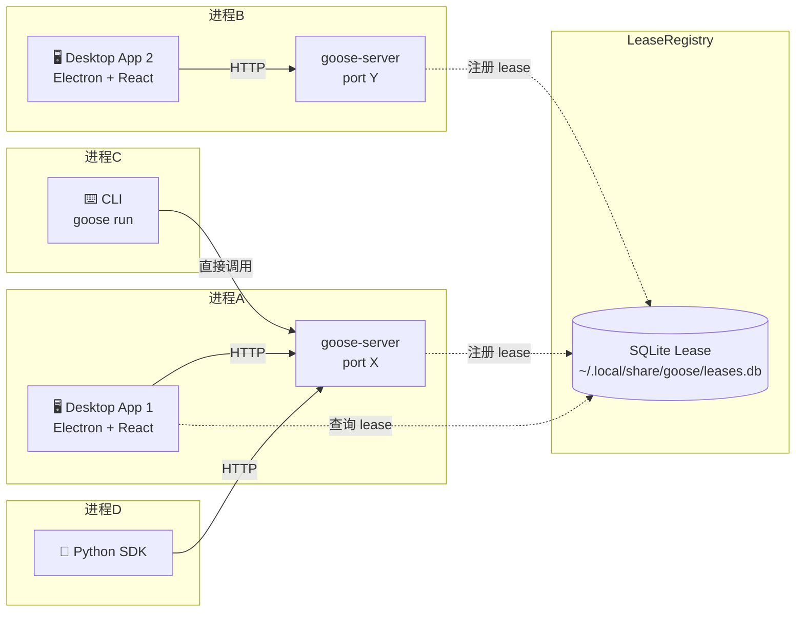
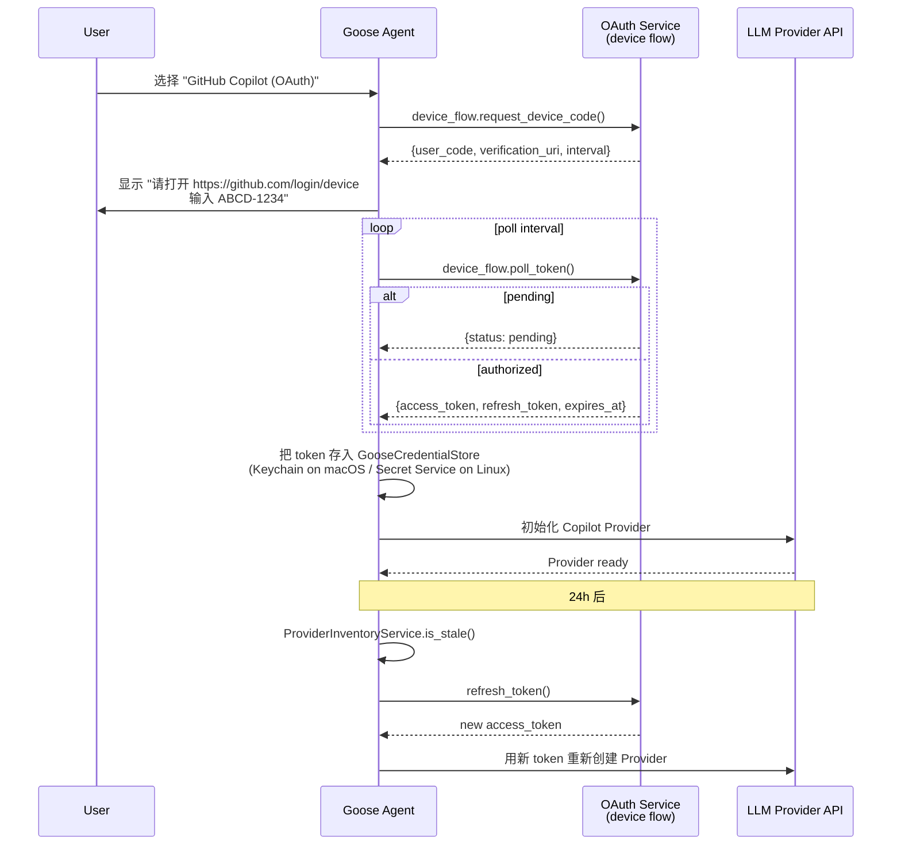

## 引子：当 Block 把 goose 捐给 Linux 基金会，50k Star 的 Rust Coding Agent 想做什么

2024 年 8 月，Block（前 Square，Jack Dorsey 的支付公司）开源了 goose，最初定位是"在桌面、CLI、API 三端可用的本地 AI Agent"。一年半之后的 2026 年 7 月，goose 已经被捐给了 Linux 基金会旗下的 **Agentic AI Foundation（AAIF）**，Star 数突破 **50,734**，主仓库（aaif-goose/goose）刚刚在 7 月 7 日有 commit，活跃度拉满。这与同期 Anthropic、OpenAI、Google 的官方 Agent 框架并不冲突——goose 的定位非常明确：**一个真正可自托管、可扩展、跨 15+ LLM Provider、对接 70+ MCP Extension 的开源 Coding Agent Harness**。

它不是另一种 LangChain。LangChain 是 Python 的 LLM 应用胶水层；goose 是 Rust 写的、有完整桌面 UI + CLI + HTTP Server 三端、有自研调度器（`crates/goose/src/scheduler.rs`，49KB）、有自研 Provider Registry（`crates/goose/src/providers/provider_registry.rs`，14KB）、有自研 Hook 系统（11 个事件点，比 Claude Code 的 5 个还多）、有自研 Recipe 子命令引擎、有完整的 MCP Elicitation 跨进程等待方案（`crates/goose/src/action_required_manager.rs`）。换句话说：**它把 2026 年下半年所有 Coding Agent 工程化议题都揉进了同一个 Rust workspace**。

今天这篇文章会带你逐层拆解 goose 的内部结构。我们从仓库统计、整体架构、四层抽象（Provider / Extension / Hook / Recipe）入手，再深入调度器、子 Agent、Platform Extension、OAuth Provider Refresh、ActionRequiredManager 等关键模块，最后用对比表分析它与 Claude Code、Continue、Cline、Goose ACP 这条赛道的工程哲学差异。

## 项目定位与核心价值

### 一句话定义

**goose 是一个由 Linux 基金会 AAIF 维护的 Rust 编写的开源 Coding Agent Harness，原生支持桌面应用、CLI 与 HTTP Server 三种部署形态，通过 Provider Registry 抽象 15+ LLM 后端，通过 MCP Extension 抽象 70+ 工具，通过 Hook 系统抽象 11 个生命周期事件，通过 Recipe YAML 抽象可复用的任务模板。**

### 能力矩阵

| 维度 | 能力 | 关键证据 |
|------|------|----------|
| **客户端形态** | 桌面 App（macOS/Linux/Windows）+ CLI + HTTP Server | `crates/goose-server` + `ui/desktop` + `crates/goose-cli` |
| **LLM Provider** | 15+ 官方注册，含 Anthropic/OpenAI/Google/Ollama/OpenRouter/Azure/Bedrock/Databricks/HuggingFace/Tetrate/Snowflake/xAI/NanoGPT/Gemini CLI/ChatGPT Codex 等 | `crates/goose/src/providers/init.rs` 中 `register_with_inventory::<XxxProvider>` 调用 33 次 |
| **ACP Provider** | 支持 Claude Code、Codex、Cursor Agent、Pi、Gemini CLI、Amp、GitHub Copilot 等作为"二级 Provider"（即通过这些 CLI 的 ACP 协议包一层） | `crates/goose/src/providers/{claude_code,codex,cursor_agent,gemini_cli,amp_acp,...}.rs` |
| **MCP Extension** | 内置 11 套 Platform Extension（Todo/Analyze/Apps/ChatRecall/ExtManager/Orchestrator/Summarize/Summon/CodeExecution/TOM/Developer），外部可挂载 70+ 第三方 | `crates/goose/src/agents/platform_extensions/mod.rs` |
| **Hook 事件** | 11 个生命周期事件点（SessionStart/SessionEnd/UserPromptSubmit/PreToolUse/PostToolUse/PostToolUseFailure/BeforeReadFile/AfterFileEdit/BeforeShellExecution/AfterShellExecution/Stop） | `crates/goose/src/hooks/mod.rs` |
| **任务调度** | Cron 表达式触发、定时任务管理、任务杀死与暂停/恢复 | `crates/goose/src/scheduler.rs`（49KB，自研 Tokio JobScheduler 包装） |
| **Recipe 模板** | YAML 声明式任务模板，支持子 Recipe 嵌套、deeplink 触发 | `crates/goose/src/recipe/{manifest,mod,build_recipe}.rs` |
| **可观测性** | OpenTelemetry span（`reply_stream`）、PostHog 事件、Tracing 字段丰富（trace_input/trace_output/session.*） | `crates/goose/src/{otel,posthog,tracing}/` |
| **安全审计** | Adversary Inspector、Egress Inspector、Patterns、Scanner、Classification Client | `crates/goose/src/security/`（6 个文件总计 130KB） |

### 仓库统计

```text
仓库     : aaif-goose/goose（从 block/goose 迁出）
⭐ Star : 50,734
🍴 Fork : 5,461
📝 语言 : Rust（核心）+ TypeScript（桌面 UI）+ Python（SDK bindings）
📜 协议 : Apache License 2.0
🏛️ 治理 : Linux Foundation → Agentic AI Foundation (AAIF)
⏰ 创建 : 2024-08-23
⏰ 最近 : 2026-07-07（24 小时内）
📦 体积 : 936 MB
🏷️ Topics: acp, ai, ai-agents, mcp
🌐 官网 : https://goose-docs.ai/
```

## 整体架构

goose 的代码组织非常清晰：**核心 crates 构成 Rust 工作区（workspace），桌面 UI 是独立的 Electron+React 前端，二者通过 goose-server HTTP 接口通信**。下面这张顶层架构图覆盖了从用户输入到 LLM 输出的全链路。



### 后端服务拆分（来自 `crates/goose-server`）

goose-server 是一个独立的 axum HTTP 服务，可以独立部署，让 goose 变成"裸金属 API"。下面是 server crate 内的路由（摘自 `crates/goose-server/src/routes/`）：

```text
src/routes/
├── agent.rs              POST /agent/reply         启动一次 reply 轮次
├── config.rs             GET/PUT /config           全局配置
├── config_set.rs         POST /config/set          配置写入
├── context.rs            GET /context               调试上下文
├── diagnostics.rs        GET /diagnostics           诊断信息
├── extension.rs          GET/POST /extensions       MCP 扩展管理
├── health.rs             GET /health                健康检查
├── recipe.rs             GET /recipe                Recipe 文件清单
├── reply.rs              POST /reply                流式回复（核心）
├── schedule.rs           GET/POST/DELETE /schedule  定时任务
├── session.rs            GET/POST /sessions         会话管理
├── status.rs             GET /status                Agent 状态
└── ...
```

**为什么要有 server crate？** 这是 goose 区别于 LangChain、CrewAI 这类 Python 库的关键设计：**goose 把 Agent 本身当成 daemon**，桌面 UI、CLI、Python SDK 都可以连接到这个 daemon。这意味着：

1. 桌面 UI 不需要内置 Agent 逻辑，只是 server 的一个前端
2. CLI 可以远程连 server，多终端共享同一会话
3. Python SDK 可以编程式调用，与 LangServe 类似的体验，但底层是 Rust 性能

## Provider 三级抽象

goose 的 Provider 系统是它最值得深入研究的部分。**它不只是一个"如果用 OpenAI 就调用 openai 包"的胶水层，而是一个三级抽象：底层是 Provider trait，中层是 ProviderRegistry + inventory，顶层是 Declarative Providers + ACP 子 Provider**。这种设计让 goose 既能内置 15+ 官方 Provider，又能允许用户用 YAML 自定义 Provider，甚至能把 Claude Code CLI、Codex CLI、Cursor Agent 这种外部 CLI 当成"二级 Provider"使用。

### Provider trait（来自 `crates/goose/src/providers/base.rs`）

```rust
// 来自 crates/goose/src/providers/base.rs
pub const DEFAULT_PROVIDER_TIMEOUT_SECS: u64 = 600;

#[derive(Debug, Clone, Copy, PartialEq, Eq, Serialize, Deserialize, ToSchema)]
pub enum ProviderType {
    Preferred,    // 优先内置，inventory 自动注册
    Builtin,      // 内置但 inventory 需手动
    Declarative,  // YAML 配置型
    Custom,       // 用户自定义
}

pub trait ProviderDef: ProviderDescriptor + Send + Sync {
    type Provider: Provider + 'static;

    fn from_env(
        extensions: Vec<ExtensionConfig>,
        tls_config: Option<TlsConfig>,
    ) -> BoxFuture<'static, Result<Self::Provider>>
    where
        Self: Sized;

    fn from_env_with_working_dir(
        extensions: Vec<ExtensionConfig>,
        _working_dir: PathBuf,
        tls_config: Option<TlsConfig>,
    ) -> BoxFuture<'static, Result<Self::Provider>>
    where
        Self: Sized,
    {
        Self::from_env(extensions, tls_config)
    }
}
```

**关键观察**：`Provider` trait 来自上游 `goose_providers::base::*`（单独 crate），`ProviderDef` 是本地 trait，用来在 goose 工作区内统一注册。`from_env` 是异步的（`BoxFuture`），因为很多 Provider 初始化时要读 secret、做 OAuth flow、调用 model list API。

### ProviderRegistry（来自 `crates/goose/src/providers/provider_registry.rs`）

```rust
// 来自 crates/goose/src/providers/provider_registry.rs
pub type ProviderConstructor = Arc<
    dyn Fn(
            Vec<ExtensionConfig>,
            Option<PathBuf>,
            Option<TlsConfig>,
        ) -> BoxFuture<'static, Result<Arc<dyn Provider>>>
        + Send
        + Sync,
>;

pub type ProviderCleanup = Arc<dyn Fn() -> BoxFuture<'static, Result<()>> + Send + Sync>;

#[derive(Clone)]
pub struct ProviderEntry {
    metadata: ProviderMetadata,
    pub(crate) constructor: ProviderConstructor,
    pub(crate) inventory_identity: super::inventory::InventoryIdentityResolver,
    pub(crate) inventory_configured: super::inventory::InventoryConfiguredResolver,
    pub(crate) cleanup: Option<ProviderCleanup>,
    provider_type: ProviderType,
    supports_inventory_refresh: bool,
    tls_config: Option<TlsConfig>,
}

#[derive(Default)]
pub struct ProviderRegistry {
    pub(crate) entries: HashMap<String, ProviderEntry>,
    tls_config: Option<TlsConfig>,
}
```

**ProviderEntry 的设计哲学**：
- **`constructor`**：异步闭包，签名 `(extensions, working_dir, tls_config) -> Future<Arc<dyn Provider>>`。所有 Provider 构造都走这条路，行为统一
- **`inventory_identity`** + **`inventory_configured`**：两个闭包分别返回 `InventoryIdentityInput` 和 `bool`，用来判断该 Provider 是否"已配置"（API key 是否有效）。这两个 resolver 会被 InventoryService 周期调用（24 小时一次）刷新 model 列表
- **`cleanup`**：可选的析构回调，OAuth Provider 用它来 revoke token
- **`provider_type`**：四种类型（Preferred/Builtin/Declarative/Custom），UI 列表展示时按此排序

### Inventory 模型（来自 `crates/goose/src/providers/inventory/mod.rs`）

```rust
// 来自 crates/goose/src/providers/inventory/mod.rs
const STALE_AFTER_HOURS: i64 = 24;

#[derive(Debug, Clone, Serialize, Deserialize)]
#[serde(rename_all = "camelCase")]
pub struct ProviderInventoryEntry {
    pub provider_id: String,
    pub provider_name: String,
    pub description: String,
    pub default_model: String,
    pub configured: bool,
    pub provider_type: ProviderType,
    pub category: ProviderSetupCategory,
    pub config_keys: Vec<ConfigKey>,
    pub setup_steps: Vec<String>,
    pub supports_refresh: bool,
    pub refreshing: bool,
    pub models: Vec<InventoryModel>,
    pub last_updated_at: Option<DateTime<Utc>>,
    pub last_refresh_attempt_at: Option<DateTime<Utc>>,
    pub last_refresh_error: Option<String>,
    pub model_selection_hint: Option<String>,
}

/// Families whose latest model should appear in the compact picker.
const RECOMMENDED_FAMILIES: &[&str] = &[
    "claude-opus", "claude-sonnet", "gpt", "gpt-mini",
    "glm", "gemini-pro", "gemini-flash", "gemma",
];

#[derive(Debug, Clone, Serialize, Deserialize)]
pub struct InventoryIdentity {
    pub provider_id: String,
    pub provider_family: String,
    pub inventory_key: String,
}

#[derive(Debug, Clone, Default)]
pub struct InventoryIdentityInput {
    pub provider_id: String,
    pub provider_family: String,
    pub public_inputs: BTreeMap<String, String>,
    pub secret_inputs: BTreeMap<String, String>,
}
```

**InventoryIdentity 是 Provider Registry 最有创意的一处**：它把一个 Provider 的"身份"hash 成 SHA-256，hash 输入是 `provider_id + family + public_inputs + secret_inputs`。这意味着：

1. **同一 Provider 不同 API key 视为不同身份** → 库存条目独立缓存
2. **改 API key 后 24h 自动失效** → 自动重新拉 model 列表
3. **跨设备同步**：identity 是纯函数，hash 一致意味着库存一致

下面是 Provider 三级抽象的整体图：



### Provider 注册一览（来自 `crates/goose/src/providers/init.rs`）

goose 在 `init.rs` 中静态注册了 33 个 Provider，每个用 `register::<X>` 或 `register_with_inventory::<X>` 两种方式之一注册。带 inventory 的（16 个）会自动 24h 刷新模型列表，不带的（17 个）只在启动时初始化一次：

```text
register_with_inventory:
  AmpAcpProvider, AnthropicProviderDef, ChatGptCodexProvider,
  ClaudeAcpProvider, CodexAcpProvider, CopilotAcpProvider,
  DatabricksProviderDef, DatabricksV2ProviderDef, GoogleProviderDef,
  HuggingfaceProvider, KimicodeProvider, PiAcpProvider,
  SnowflakeProviderDef, TetrateProvider, XaiProvider, ...

register (no inventory):
  AvianProvider, AzureProvider, LocalInferenceProvider,
  ClaudeCodeProvider, CodexProvider, CursorAgentProvider,
  GcpVertexAIProvider, GeminiCliProvider, GeminiOAuthProvider,
  GithubCopilotProvider, OpenaiProviderDef, OpenrouterProvider,
  BedrockProvider, LitellmProvider, SagemakerTgiProvider, ...
```

**为什么 Avian/Tetrate 这种小 Provider 不带 inventory？** 因为它们的 model 列表是固定的（≤5 个），refresh 没意义。inventory 主要用于"模型在云端动态更新"的场景（Anthropic/OpenAI/Google 等 15+ 模型供应商每月都有新模型）。

## Extension Manager 与 MCP 抽象

goose 把所有外部能力都抽象成 **MCP Extension**——本地子进程、远程 SSE、HTTP Streamable 三种传输。`ExtensionManager` 负责拉起、复用、释放 MCP 子进程。

### ExtensionConfig（来自 `crates/goose/src/agents/extension.rs`）

每个 Extension 都用一种统一配置描述：

```rust
// 来自 crates/goose/src/agents/extension.rs
pub enum ExtensionConfig {
    Stdio {
        name: String,
        cmd: String,                  // 例如 "npx -y @modelcontextprotocol/server-github"
        args: Vec<String>,
        envs: Envs,                  // 启动时注入的环境变量
        env_keys: Vec<String>,        // 从全局 secret store 取的 key
        working_dir: Option<PathBuf>,
        timeout: Option<Duration>,
        description: Option<String>,
        capabilities: Vec<ExtensionCapability>,
    },
    Sse {
        name: String,
        uri: String,                  // 例如 "http://localhost:8080/sse"
        envs: Envs,
        env_keys: Vec<String>,
        timeout: Option<Duration>,
        description: Option<String>,
        headers: HashMap<String, String>,
        bearer_env: Option<String>,
    },
    StreamableHttp {
        name: String,
        uri: String,
        envs: Envs,
        env_keys: Vec<String>,
        timeout: Option<Duration>,
        description: Option<String>,
        headers: HashMap<String, String>,
        bearer_env: Option<String>,
    },
    Builtin {
        name: String,                 // 例如 "developer", "todo", "summon"
        display_name: Option<String>,
        description: Option<String>,
        default_enabled: bool,
        unprefixed_tools: bool,
        hidden: bool,
    },
    Platform {
        name: String,                 // 例如 "todo", "analyze", "apps"
        display_name: Option<String>,
        description: Option<String>,
        default_enabled: bool,
        unprefixed_tools: bool,
        hidden: bool,
    },
    Frontend {
        name: String,
        tools: Vec<FrontendTool>,     // 由桌面 UI 提供的工具
        description: Option<String>,
    },
}
```

**七种 Extension 类型的工程意义**：
- **Stdio/Sse/StreamableHttp**：三种 MCP 标准传输，对应 MCP 协议的演进史
- **Builtin**：goose 进程内的 MCP server，无需启动子进程（最低延迟）
- **Platform**：与 Builtin 类似，但走 `crates/goose/src/agents/platform_extensions/` 的工厂模式
- **Frontend**：桌面 UI 提供的工具（如打开文件、调用系统对话框）

### MCP 客户端握手（来自 `crates/goose/src/agents/mcp_client.rs`）

```rust
// 来自 crates/goose/src/agents/mcp_client.rs
const MCP_APPS_UI_EXTENSION_ID: &str = "io.modelcontextprotocol/ui";
const MCP_APPS_UI_MIME_TYPE: &str = "text/html;profile=mcp-app";

fn default_mcp_apps_ui_extensions() -> ExtensionCapabilities {
    let mut extensions = ExtensionCapabilities::new();
    let mut ui_extension_settings = JsonObject::new();
    ui_extension_settings.insert(
        "mimeTypes".to_string(),
        serde_json::json!([MCP_APPS_UI_MIME_TYPE]),
    );
    extensions.insert(MCP_APPS_UI_EXTENSION_ID.to_string(), ui_extension_settings);
    extensions
}

#[derive(Debug, Clone, Default)]
pub struct GooseMcpHostInfo {
    pub explicit_extensions: bool,
    pub extensions: ExtensionCapabilities,
    pub client_name: Option<String>,
    pub client_version: Option<String>,
}
```

**GooseMcpHostInfo 的设计**：goose 在 `initialize` 请求中把自己的扩展能力告诉 MCP server，例如它声明支持 `io.modelcontextprotocol/ui` 的 `text/html;profile=mcp-app` MIME 类型。这样 MCP server 就可以返回渲染好的 HTML 卡片，桌面 UI 直接内嵌。

### MCP 三种传输的 fork 路径



**Stdio 走 TokioChildProcess**（rmcp crate 提供），**Sse 与 StreamableHttp 都走 StreamableHttpClient**，只是请求方式不同。这种实现方式是**rmcp 0.x → 1.x 演进**的产物：MCP 早期只有 stdio（Node 子进程）和 SSE（HTTP 长轮询），后期统一为 Streamable HTTP，但 goose 仍然保留 SSE 后缀用于兼容老旧 MCP server。

### 内置 Platform Extensions（来自 `crates/goose/src/agents/platform_extensions/mod.rs`）

```rust
// 来自 crates/goose/src/agents/platform_extensions/mod.rs
pub static PLATFORM_EXTENSIONS: Lazy<HashMap<&'static str, PlatformExtensionDef>> = Lazy::new(
    || {
        let mut map = HashMap::new();

        map.insert(
            analyze::EXTENSION_NAME,
            PlatformExtensionDef {
                name: analyze::EXTENSION_NAME,
                display_name: "Analyze",
                description: "Analyze code structure with tree-sitter: directory overviews, file details, symbol call graphs",
                default_enabled: true,
                unprefixed_tools: true,
                hidden: false,
                client_factory: |ctx| Box::new(analyze::AnalyzeClient::new(ctx).unwrap()),
            },
        );
        // ...todo, apps, chatrecall, ext_manager, orchestrator,
        //    summarize, summon, code_execution, developer, tom
    },
);
```

**11 个内置 Platform Extension 速览**：

| Extension | 工具数 | 用途 | default_enabled |
|-----------|--------|------|-----------------|
| `analyze` | ~8 | tree-sitter 代码结构分析（目录/文件/symbol/call graph） | ✅ |
| `todo` | ~3 | 内部任务追踪（goose 给自己的 TODO 列表） | ✅ |
| `apps` | ~6 | 创建并管理 Goose Apps（沙盒 HTML/CSS/JS 窗口） | ✅ |
| `chatrecall` | ~2 | 跨会话历史检索（向量 + 关键字） | ❌ |
| `extensionmanager` | ~3 | 动态启停 Extension | ✅ |
| `summon` | ~5 | 调用子 Agent（sub-agent） | ✅ |
| `orchestrator` | ~4 | 多子 Agent 编排 | ✅ |
| `summarize` | ~3 | 对长输出做 LLM 摘要 | ✅ |
| `code_execution` | ~2 | 远程代码沙盒执行（隔离进程） | opt-in |
| `tom` (TodoManager) | ~3 | 与 todo 集成但提供更细粒度状态机 | ✅ |
| `developer` | ~5 | 开发者自带的 shell/edit 工具 | ✅ |

**`default_enabled: true` 的含义**：goose 启动时自动加载这些 Extension，Agent 可直接调用它们。`hidden: false` 表示它们出现在 UI 列表中，可以被用户关闭。

## Hook 系统：11 个生命周期事件

goose 的 Hook 系统比 Claude Code（5 个事件）更丰富，达到 11 个。下面是完整的事件清单（来自 `crates/goose/src/hooks/mod.rs`）：

```rust
// 来自 crates/goose/src/hooks/mod.rs
pub enum HookEvent {
    PreToolUse,
    PostToolUse,
    PostToolUseFailure,
    SessionStart,
    SessionEnd,
    UserPromptSubmit,
    BeforeReadFile,
    AfterFileEdit,
    BeforeShellExecution,
    AfterShellExecution,
    Stop,
}

pub enum HookDecision {
    Allow,
    Deny { reason: String, plugin: String },
}
```

**HookEvent 设计哲学**：

| 事件 | 触发时机 | 典型用途 | 与 Claude Code 对比 |
|------|----------|----------|---------------------|
| `SessionStart` | 会话启动时（model provider 加载后） | 注入项目说明、设置初始 goal | `SessionStart`（一致） |
| `SessionEnd` | 会话关闭时 | 写进度文件、发通知 | `SessionEnd`（一致） |
| `UserPromptSubmit` | 用户消息进入 conversation 前 | 拦截注入、改写 prompt、触发 steer | `UserPromptSubmit`（一致） |
| `PreToolUse` | 工具调用前（参数已知） | 修改参数、追加 audit log | `PreToolUse`（一致） |
| `PostToolUse` | 工具成功返回后 | 副作用（保存指标、触发后续工具） | `PostToolUse`（一致） |
| `PostToolUseFailure` | 工具失败后 | 自动重试、降级到备用 | ❌ Claude Code 没有 |
| `BeforeReadFile` | 文件读取前（仅 Read 类工具） | 安全审计、redaction | ❌ 更细粒度 |
| `AfterFileEdit` | 文件编辑后（仅 Edit/Write 类工具） | git auto-commit、format | ❌ 更细粒度 |
| `BeforeShellExecution` | shell 命令执行前 | 安全拦截（rm -rf 等危险命令） | ❌ 更细粒度 |
| `AfterShellExecution` | shell 命令执行后 | stdout 截断、敏感信息扫描 | ❌ 更细粒度 |
| `Stop` | Agent 准备退出主循环 | 阻断退出、要求继续 | `Stop`（一致） |

**细粒度事件的优势**：在 goose 里，"shell 命令执行"是一类独立事件，可以单独加策略。例如 BeforeShellExecution 强制要求所有 shell 命令通过 safety scanner，AfterShellExecution 自动过滤输出中的 API key。这种"按工具类型细分"的策略是 Anthropic 官方 Claude Code 不支持的。

下面是 Hook 在 Agent 主循环中的触发时序：



**HookManager 接口**（`crates/goose/src/hooks/mod.rs`）：

```rust
pub struct HookManager {
    // ...fields
}

impl HookManager {
    pub fn new() -> Self;
    pub fn with_tool(self, name: String, args: Value) -> Self;
    pub fn with_tool_output(self, output: Value) -> Self;
    pub fn with_message(self, msg: String) -> Self;
    pub fn with_last_assistant_message(self, msg: String) -> Self;
    pub fn with_working_dir(self, dir: PathBuf) -> Self;
    pub fn load(...) -> Result<()>;
    pub fn has_hooks(&self, event: HookEvent) -> bool;
    pub async fn emit(&self, event: HookEvent, ctx: HookContext);
    pub async fn emit_blocking(&self, event: HookEvent, ctx: HookContext) -> HookDecision;
}
```

**Builder 模式 + 链式调用**：`HookContext::new(event, session_id).with_tool(name, args).with_tool_output(output)` 一行就把所有上下文塞进去，调用方不用记参数顺序。

## Recipe 子命令引擎

goose 的 Recipe 是一个**声明式任务模板**，可以用 YAML 写好保存下来，下次执行时不必重新组织 prompt。下面是 Recipe 的核心定义（来自 `crates/goose/src/recipe/mod.rs`）：

```rust
// 来自 crates/goose/src/recipe/mod.rs
pub struct Recipe {
    pub version: String,
    pub title: String,
    pub description: String,
    pub instructions: String,
    pub prompt: Option<String>,
    pub extensions: Vec<ExtensionConfig>,
    pub context: Vec<String>,
    pub activities: Vec<String>,
    pub author: Option<Author>,
    pub parameters: Vec<RecipeParameter>,
    pub response: Option<Response>,
    pub sub_recipes: Option<Vec<SubRecipe>>,
    pub profile: Option<String>,
    pub model_config: Option<ModelConfig>,
    pub recipe_dir: Option<PathBuf>,
}
```

**Recipe 字段语义**：
- `instructions`：自然语言指令（system prompt 的一部分）
- `prompt`：运行时用户消息模板（可嵌入参数）
- `extensions`：执行此 Recipe 时自动加载的 MCP extensions
- `context`：需要追加到 conversation 的初始 context 文件列表
- `activities`：执行期间展示在 UI 上的活动条目（每个 activity 是一个简短人类可读步骤）
- `parameters`：模板参数定义（带类型、默认值、必填）
- `sub_recipes`：嵌套子 Recipe 路径（相对路径解析）
- `profile`：命名配置（指向 ~/.config/goose/profiles/）
- `model_config`：覆盖默认 provider/model 的临时配置

**Recipe 与 Claude Code Skills / planning-with-files 的差异**：

| 特性 | goose Recipe | Claude Code Skills | planning-with-files |
|------|--------------|--------------------|--------------------:|
| 表达形式 | YAML | Markdown | Markdown + 3-File |
| 触发方式 | `goose run --recipe <name>` | 自动匹配 | 全程常驻 |
| 嵌套组合 | `sub_recipes` 字段 | 不支持 | 不支持 |
| 参数化 | `parameters` 字段 + `$NAME` 替换 | 占位符 | 不支持 |
| 状态化 | `recipe_dir` 记录原始位置 | 无 | 无 |
| 可分享性 | Recipe 文件就是产物 | Skill 是指令集 | Filesystem 是 RAM |

**Recipe 加载路径解析**（来自 `crates/goose/src/recipe/manifest.rs`）：

```rust
// 来自 crates/goose/src/recipe/manifest.rs
pub fn short_id_from_path(path: &str) -> String {
    let mut hasher = DefaultHasher::new();
    path.hash(&mut hasher);
    let h = hasher.finish();
    format!("{:016x}", h)
}

pub fn list_recipe_file_manifests() -> Result<Vec<RecipeFileManifest>> {
    let recipes_with_path = list_local_recipes()?;
    let mut manifests = Vec::new();

    for (file_path, mut recipe) in recipes_with_path {
        let Ok(last_modified) = fs::metadata(file_path.clone()).and_then(|metadata| {
            metadata.modified()
                .map(|modified| chrono::DateTime::<chrono::Utc>::from(modified).to_rfc3339())
        }) else {
            continue;
        };

        resolve_recipe_sub_recipe_paths(&mut recipe, &file_path);

        manifests.push(RecipeFileManifest {
            id: short_id_from_path(file_path.to_string_lossy().as_ref()),
            recipe,
            file_path,
            last_modified,
        });
    }

    manifests.sort_by(|a, b| b.last_modified.cmp(&a.last_modified));
    Ok(manifests)
}
```

**`resolve_recipe_sub_recipe_paths` 关键细节**：

```rust
fn resolve_recipe_sub_recipe_paths(recipe: &mut Recipe, recipe_path: &Path) {
    let Some(recipe_dir) = recipe_path.parent() else { return; };
    let Some(ref mut sub_recipes) = recipe.sub_recipes else { return; };

    for sub_recipe in sub_recipes.iter_mut() {
        if let Ok(resolved) = resolve_sub_recipe_path(&sub_recipe.path, recipe_dir) {
            sub_recipe.path = resolved;
        }
    }
}
```

**为什么需要这个？** Recipe 拷贝到 `scheduled_recipes/` 目录后，相对路径会失效（原来 `child.yaml` 相对 `~/recipes/parent.yaml`，但执行时从 `~/Library/Application Support/goose/scheduled_recipes/parent.yaml` 启动）。`ScheduledJob.recipe_base_dir` 字段专门存原始目录，让 sub_recipe 始终解析到原始位置。

## ActionRequiredManager：MCP Elicitation 的跨进程等待方案

MCP 协议有一个看似简单但实现起来很难的功能：**Elicitation**——MCP server 在执行 tool 时需要用户提供额外信息（例如确认操作、填写表单），可以暂停执行并向 client 发起 elicitation 请求。goose 的解决方案是 `ActionRequiredManager`，它位于 `crates/goose/src/action_required_manager.rs`。

### 数据结构

```rust
// 来自 crates/goose/src/action_required_manager.rs
#[derive(Debug, Clone, PartialEq)]
pub(crate) enum ElicitationOutcome {
    Accept(Value),  // 用户接受并提交表单数据
    Decline,        // 用户拒绝
    Cancel,         // 用户取消（超时或 UI 关闭）
}

struct PendingRequest {
    session_id: String,
    response_tx: Option<tokio::sync::oneshot::Sender<ElicitationOutcome>>,
}

pub(crate) struct ActionRequiredManager {
    pending: Arc<RwLock<HashMap<String, Arc<Mutex<PendingRequest>>>>>,
    action_required_senders: Mutex<HashMap<(String, String), mpsc::Sender<Message>>>,
}
```

**`PendingRequest` 用 oneshot 通道**而不是 `mpsc::Receiver`，因为 elicit 是一个请求一次响应（1:1）的语义。oneshot 比 mpsc 更精确，并且可以表达"一次性"的语义。

### request_and_wait 流程

```rust
pub(crate) async fn request_and_wait(
    &self,
    session_id: String,
    tool_call_request_id: String,
    message: String,
    schema: Value,
    timeout_duration: Duration,
) -> Result<ElicitationOutcome> {
    let id = Uuid::new_v4().to_string();
    let (tx, rx) = tokio::sync::oneshot::channel();
    let pending_request = PendingRequest {
        session_id: session_id.clone(),
        response_tx: Some(tx),
    };
    let pending_request = Arc::new(Mutex::new(pending_request));

    self.pending.write().await
        .insert(id.clone(), Arc::clone(&pending_request));

    let action_required_message = Message::assistant().with_content(
        MessageContent::action_required_elicitation(id.clone(), message, schema),
    );

    let sender = self.action_required_senders.lock().await
        .get(&(session_id.clone(), tool_call_request_id.clone()))
        .cloned();

    let Some(sender) = sender else {
        self.pending.write().await.remove(&id);
        return Err(anyhow!("Tool call request not found for elicitation: {}", tool_call_request_id));
    };

    if sender.send(action_required_message).await.is_err() {
        self.pending.write().await.remove(&id);
        return Err(anyhow!("Tool call action-required stream closed: {}", tool_call_request_id));
    }

    let result = self.wait_for_response(&id, pending_request, rx, timeout_duration).await;
    self.pending.write().await.remove(&id);
    result
}
```

**时序图**：



**这一设计精妙在哪？**
1. **跨进程边界**：MCP server 在子进程内执行，它发起的 elicitation 要回到桌面 UI（Electron 渲染进程）才能让用户看到表单。goose 把这件事用 `action_required_senders` 这个 `(session_id, tool_call_request_id) -> mpsc::Sender<Message>` 表打通
2. **oneshot + Arc<Mutex<PendingRequest>>**：oneshot 表达一次性的"发信号"，Arc<Mutex<>> 让多个 await 端都能竞争拿到结果（虽然只有第一个会成功）
3. **超时清理**：超时后无论结果如何，从 `pending` map 移除 id，防止内存泄漏
4. **错误降级**：`Tool call request not found` / `stream closed` 都会被 `request_and_wait` 捕获并返回，避免悬挂的 tool call

## Agent 主循环

让我们看 goose 的核心 Agent 循环，它在 `crates/goose/src/agents/agent.rs` 的 `reply_internal` 中。这是最长的一个文件（166KB），下面是简化版的循环骨架：

```rust
// 来自 crates/goose/src/agents/agent.rs（精简版）
async fn reply_internal(
    &self,
    conversation: Conversation,
    session_config: SessionConfig,
    session: Session,
    cancel_token: Option<CancellationToken>,
) -> Result<BoxStream<'_, Result<AgentEvent>>> {
    let context = self.prepare_reply_context(...).await?;
    let ReplyContext {
        mut conversation,
        mut tools,
        mut toolshim_tools,
        mut system_prompt,
        tool_call_cut_off,
        goose_mode,
        initial_messages,
        model_config,
    } = context;

    if let Some(project_addendum) = self.load_project_instructions(&session).await {
        system_prompt = format!("{system_prompt}\n\n{project_addendum}");
    }

    self.reset_retry_attempts().await;
    let provider = self.provider().await?;

    let inner = Box::pin(async_stream::try_stream! {
        let mut turns_taken = 0u32;
        let max_turns = session_config.max_turns.unwrap_or_else(|| {
            Config::global()
                .get_param::<u32>("GOOSE_MAX_TURNS")
                .unwrap_or(DEFAULT_MAX_TURNS)
        });
        let mut compaction_attempts = 0;
        let mut last_assistant_text = String::new();
        let mut goal_check_pending = false;
        let mut tool_pair_summarization_done = false;
        let mut stop_hook_handled_for_exit = false;
        let mut retrying_after_stop_hook_denial = false;
        let mut consecutive_stop_hook_blocks = 0u32;
        let stop_hook_block_cap = self.stop_hook_block_cap();
        let mut can_drain_pending_steers = false;

        loop {
            if is_token_cancelled(&cancel_token) { break; }

            if can_drain_pending_steers {
                for message in self.drain_pending_steers(&session_config.id).await {
                    // hook UserPromptSubmit
                    session_manager.add_message(&session_config.id, &message).await?;
                    conversation.push(message.clone());
                    yield AgentEvent::Message(message);
                }
            }

            let final_output = {
                let mut guard = self.final_output_tool.lock().await;
                guard.as_mut().and_then(|fot| fot.final_output.take())
            };
            if let Some(output) = final_output {
                // Agent 通过 final_output_tool 显式标记"任务完成"
                last_assistant_text = output.clone();
                let message = Message::assistant().with_text(output);
                yield AgentEvent::Message(message.clone());
                session_manager.add_message(&session_config.id, &message).await?;
                conversation.push(message);

                match self.emit_stop_hook_blocking(&session_config.id, &last_assistant_text).await {
                    crate::hooks::HookDecision::Allow => { /* 退出循环 */ }
                    crate::hooks::HookDecision::Deny { reason, plugin } => {
                        // Stop hook 拒绝退出 → 继续循环
                        consecutive_stop_hook_blocks += 1;
                        if consecutive_stop_hook_blocks >= stop_hook_block_cap {
                            break; // 防止无限阻塞
                        }
                        retrying_after_stop_hook_denial = true;
                        continue;
                    }
                }
                break;
            }

            // 1. 注入 pre_turn 之前的 tools
            // 2. provider.complete(conversation, tools)
            // 3. 解析 tool calls
            // 4. 执行 tool calls (并发 / 串行)
            // 5. 处理 tool results（success/failure）
            // 6. 触发 PostToolUse / PostToolUseFailure hooks
            // 7. 检查 goal / compact / cutoff
            // 8. 如果还有 tool results → 继续
            // 9. 否则 break
        }
    });

    let reply_stream_span = tracing::info_span!(
        target: "goose::agents::agent",
        "reply_stream",
        trace_output = tracing::field::Empty,
        session.id = %session_config.id,
        session.user = %crate::session_context::session_user(),
        session.host = %crate::session_context::session_host(),
        session.agent_type = "goose",
    );

    Ok(Box::pin(async_stream::try_stream! {
        let _enter = reply_stream_span.enter();
        let mut reply_stream = inner;
        while let Some(event) = reply_stream.next().await {
            yield event?;
        }
    }))
}
```

**几个关键设计**：
- **`async_stream::try_stream!`** 宏：让整个循环变成异步流，前端可以通过 SSE 流式接收每个 AgentEvent（用户消息、工具调用、工具结果、错误等）
- **`final_output_tool`**：Agent 通过专门工具显式标记"任务完成"，而不是依赖"无 tool call = 完成"（这避免了长输出被截断时误判完成）
- **`Stop` hook 阻断**：hook 可以拒绝 Agent 退出，重新触发下一轮 reply。`stop_hook_block_cap` 防止恶意 hook 锁死 Agent
- **`retrying_after_stop_hook_denial`**：区分"自然结束"和"被 hook 拒绝"，触发不同的 telemetry
- **`trace_input` / `trace_output` / `session.*` 字段**：OpenTelemetry 自动收集，方便后续接入 Jaeger / Honeycomb

## 调度器与子 Agent

### Scheduler（来自 `crates/goose/src/scheduler.rs`，49KB）

goose 的调度器把 **Cron 表达式 + Recipe + Agent** 三者绑定，让用户可以定时触发一个 Agent 任务：

```rust
// 来自 crates/goose/src/scheduler.rs
#[derive(Clone, Serialize, Deserialize, Debug, utoipa::ToSchema)]
pub struct ScheduledJob {
    pub id: String,
    pub source: String,                    // recipe 文件路径或 deeplink
    pub cron: String,                      // "0 9 * * 1-5"
    pub last_run: Option<DateTime<Utc>>,
    #[serde(default)]
    pub currently_running: bool,
    #[serde(default)]
    pub paused: bool,
    #[serde(default)]
    pub current_session_id: Option<String>,
    #[serde(default)]
    pub process_start_time: Option<DateTime<Utc>>,
    pub parameters: Vec<(String, String)>,
    /// 原始 recipe 目录（解决 sub_recipe 路径问题）
    #[serde(default)]
    pub recipe_base_dir: Option<String>,
}

type RunningTasksMap = HashMap<String, CancellationToken>;
type JobsMap = HashMap<String, (JobId, ScheduledJob)>;
```

**调度器核心操作**：

| 方法 | 用途 | 关键行为 |
|------|------|----------|
| `add_scheduled_job` | 注册任务 | 校验 cron、保存到 `schedule.json` |
| `schedule_recipe` | 把 Recipe 转成 ScheduledJob | 调用 `tokio-cron-scheduler` 注册 |
| `list_scheduled_jobs` | 列出全部任务 | 读 JSON 状态 |
| `remove_scheduled_job` | 删除任务 | 同时从内存和 cron 调度器移除 |
| `run_now` | 立刻触发一次 | 跳过 cron 检查 |
| `pause_schedule` / `unpause_schedule` | 暂停/恢复 | 改 `paused` 字段 |
| `kill_running_job` | 杀死运行中的任务 | 调 `CancellationToken::cancel()` |
| `get_running_job_info` | 查运行状态 | 读 `currently_running` + `process_start_time` |

**`recipe_base_dir` 字段**特别值得注意——它是 ScheduledJob 专有的元数据，存的是 Recipe 文件被拷贝到 `scheduled_recipes/` **之前**的原始目录。这样执行 Recipe 时，`resolve_recipe_sub_recipe_paths` 始终能从原始位置解析 sub_recipe，相对路径不会失效。

### 子 Agent（来自 `crates/goose/src/agents/summon.rs`，108KB）

`Summon` 是 goose 的"召唤子 Agent"机制，封装在 platform extension 中：

```text
Summon Client 主要方法:
  spawn_subagent(task_config: TaskConfig) -> Result<String>
  poll_subagent(agent_id: String) -> Result<SubAgentStatus>
  list_subagents() -> Vec<SubAgentInfo>
  cancel_subagent(agent_id: String) -> Result<()>
  steer_subagent(agent_id: String, message: String) -> Result<()>
```

子 Agent 是独立 session，可以并行执行，与父 Agent 通过 SQLite 数据库共享会话状态。`crates/goose/src/agents/subagent_handler.rs`（12KB）实现了父子事件转发，子 Agent 的每个 AgentEvent 都被父 Agent 接收并决定如何处理。

## 安全审计系统

goose 的安全模块在 `crates/goose/src/security/` 下，6 个文件总计 130KB：

| 文件 | 行数 | 用途 |
|------|------|------|
| `patterns.rs` | 20KB | 危险模式正则（API key 泄漏、rm -rf 等） |
| `egress_inspector.rs` | 19KB | 出站请求审计（限制外联 IP / domain） |
| `adversary_inspector.rs` | 24KB | 对抗性 prompt 注入检测 |
| `scanner.rs` | 15KB | 文件/输出敏感信息扫描 |
| `classification_client.rs` | 8KB | 与外部分类服务交互 |
| `security_inspector.rs` | 5KB | 统一接口门面 |

**安全审计的触发时机**：
- **PreToolUse hook**：每个工具调用前过一遍 `security_inspector`
- **BeforeShellExecution**：所有 shell 命令必查 `patterns.rs`
- **EgressInspector**：所有 HTTP 请求检查目标是否在白名单
- **AdversaryInspector**：每条 user message 查 prompt injection

这是 goose 比 Claude Code、Continue 更谨慎的工程决策——把"防 prompt injection / 防数据外泄"做成**基础设施级别**的拦截器，而不是 hook plugin。

## 桌面 UI 三端协同

goose 的桌面 UI 在 `ui/desktop/`，是 Electron + React 应用。它**不内置 Agent 逻辑**，只通过 `gooseServe` crate 与本地 `goose-server` 通信：

```typescript
// 来自 ui/desktop/src/gooseServe.ts（精简版）
class GooseServe {
  private leaseRegistry: GooseServeLeaseRegistry;
  private port: number;
  private server: ChildProcess | null = null;

  async start(): Promise<void> {
    if (await this.tryLeaseExistingServer()) return;
    
    const port = await this.findAvailablePort();
    this.port = port;
    
    this.server = spawn(gooseExecutablePath, [
      'mcp', 'serve',
      '--port', String(port),
      // ...
    ]);
    
    await this.waitForServerReady(port);
    this.leaseRegistry.registerLease(port);
  }

  async stop(): Promise<void> {
    if (this.server) {
      this.server.kill('SIGTERM');
      this.server = null;
    }
  }
  
  getBaseUrl(): string { return `http://127.0.0.1:${this.port}`; }
}
```

**`GooseServeLeaseRegistry`** 的设计哲学：多进程互斥。同一台机器上可能有多个 desktop app 实例尝试启动 server，registry 用 SQLite + 时间戳做 lease，避免端口冲突。

下面是 goose 三端的拓扑：



**为什么 GooseServe 这种"自带 server"的设计重要？** 传统的 Electron AI 应用把 Agent 逻辑塞在前端 renderer 进程，性能差、状态难管。goose 把 server 抽出来后：
1. 桌面 UI 只是薄前端，可以做 Electron、纯 Webview、甚至命令行版
2. CLI 和 SDK 可以复用同一个 server 实例
3. server 是长生命周期进程，session 状态能跨 UI 重启保留

## OAuth Provider 与 Refresh

很多 LLM Provider（GitHub Copilot、ChatGPT、Claude、Gemini）现在都用 OAuth 而不是 API key。goose 的 `crates/goose/src/providers/oauth.rs`（21KB）实现了 OAuth device flow，配套 `oauth_device_flow.rs`（20KB）。

下面是 OAuth Provider 的注册与刷新流程：



**`GooseCredentialStore`** 的实现细节（来自 `crates/goose/src/oauth/`）：
- macOS：使用 Keychain（`security` CLI 调用）
- Linux：使用 Secret Service API（libsecret / KWallet）
- Windows：使用 Credential Manager
- Fallback：加密文件（key 派生自用户密码或随机）

**为什么不存成明文 JSON？** 因为 GitHub Copilot 的 token 拥有完全访问用户订阅的能力，必须 OS 级保护。goose 在 README 中明确推荐生产环境用 Keychain 而非文件 fallback。

## Recipe YAML 实例

goose 的 Recipe 是声明式 YAML，下面是一段示例（简化版，参考 `crates/goose-cli/src/recipes/`）：

```yaml
# daily_standup.yaml
version: "1.0"
title: "Daily Standup Report"
description: "Generate a daily standup report from PR activity and Slack"
instructions: |
  You are a standup assistant. Collect:
  - Open PRs authored by {{author}} (use GitHub MCP)
  - Slack mentions of {{author}} from yesterday (use Slack MCP)
  - Calendar events (use Calendar MCP)
  
  Output a structured report with sections: Done / In Progress / Blockers.
prompt: "Generate today's standup report"
extensions:
  - type: stdio
    name: github
    cmd: "npx"
    args: ["-y", "@modelcontextprotocol/server-github"]
  - type: sse
    name: slack
    uri: "http://localhost:8080/sse"
  - type: builtin
    name: developer
    default_enabled: true
parameters:
  - name: author
    type: string
    description: "GitHub username to filter by"
    required: true
    default: "{{env.USER}}"
  - name: include_calendar
    type: boolean
    default: true
sub_recipes:
  - name: pr_summary
    path: "./subrecipes/pr_summary.yaml"
profile: "work"
activities:
  - "Fetch open PRs"
  - "Scan Slack mentions"
  - "Pull calendar events"
  - "Synthesize report"
```

**调用方式**：

```bash
# 一次执行
goose run --recipe ./daily_standup.yaml --param author=alice

# 调度执行（每个工作日早上 9 点）
goose schedule add ./daily_standup.yaml --cron "0 9 * * 1-5"
```

## 部署与运行

### 一键安装

```bash
# CLI（macOS / Linux）
curl -fsSL https://github.com/aaif-goose/goose/releases/download/stable/download_cli.sh | bash

# Desktop
# 下载 macOS / Linux / Windows 安装包
# https://github.com/aaif-goose/goose/releases

# 源码编译（需要 Rust 1.85+）
git clone https://github.com/aaif-goose/goose.git
cd goose
cargo build --release
./target/release/goose --version
```

### 第一次配置

```bash
# 交互式
goose configure
# → 选择 Provider (Anthropic / OpenAI / Ollama / ...)
# → 输入 API key（自动存到 OS keychain）
# → 选择默认 Model

# 非交互式
goose configure --provider anthropic --key sk-ant-... --model claude-sonnet-4-5

# 用 OAuth Provider
goose configure --provider github_copilot
# → 打开浏览器走 device flow
```

### 启动 server 模式

```bash
# 让 goose 跑成 daemon
goose mcp serve --port 8080

# 验证
curl http://127.0.0.1:8080/health
# {"status": "ok"}

# 用 Python SDK 调
from goose import GooseClient
client = GooseClient("http://127.0.0.1:8080")
response = client.reply(
    session_id="abc123",
    message="帮我看一下 src/main.rs 有没有内存泄漏",
)
for event in response.stream():
    print(event)
```

### 与 MCP server 配合

```bash
# 启动一个 MCP server
npx -y @modelcontextprotocol/server-filesystem /tmp &

# goose 自动检测并加载
goose configure --add-extension stdio "npx -y @modelcontextprotocol/server-filesystem /tmp"

# 现在 Agent 多了 Read/Write/Edit 等工具
```

### 调度 Recipe

```bash
# 注册定时任务
goose schedule add ./daily_standup.yaml --cron "0 9 * * 1-5"

# 列出
goose schedule list
# ID                              Cron            Source
# standup_daily_abc123            0 9 * * 1-5     ./daily_standup.yaml

# 立刻跑一次
goose schedule run-now standup_daily_abc123

# 查看运行日志
goose schedule logs standup_daily_abc123

# 暂停 / 恢复
goose schedule pause standup_daily_abc123
goose schedule resume standup_daily_abc123
```

## 与同类 Coding Agent Harness 对比

goose 在 2026 年下半年的 Coding Agent Harness 赛道里处于什么位置？我们对比 4 个最相关的项目：

| 维度 | **block/goose** | Claude Code | Cline | Continue |
|------|-----------------|-------------|-------|----------|
| **语言** | Rust + TS | TypeScript | TypeScript | TypeScript |
| **⭐ Star** | 50,734 | 闭源（Anthropic 官方） | ~20K | 35K |
| **协议** | Apache 2.0 | 闭源 | Apache 2.0 | Apache 2.0 |
| **Provider 数** | 15+ 官方 + ACP 包装 | 1（Anthropic） | 多 | 多 |
| **MCP 支持** | 一等公民（7 种 Extension 类型） | 完整 | 完整 | 完整 |
| **桌面 UI** | ✅ Electron | ❌（纯 CLI） | VSCode 扩展 | VSCode + JetBrains |
| **CLI** | ✅ | ✅ | ❌ | ❌ |
| **HTTP Server** | ✅ goose-server | ❌ | ❌ | ❌ |
| **Python/JS SDK** | ✅ | ❌ | ❌ | ❌ |
| **Hook 系统** | 11 个事件 | 5 个事件 | 不支持 | 不支持 |
| **任务调度** | ✅ Cron + Recipe | ❌ | ❌ | ❌ |
| **安全审计** | ✅ 内置 130KB | 较弱 | 无 | 无 |
| **OAuth Device Flow** | ✅ 完整 | ❌ | ❌ | ❌ |
| **Linux 基金会治理** | ✅ AAIF | ❌ | ❌ | ❌ |

**核心设计哲学差异**：

**1. Provider 抽象 vs 模型锁定**
- goose：Provider Registry + Inventory，15+ 官方 + 用户可自定义 YAML（Declarative Providers）
- Claude Code：仅 Anthropic 模型，无切换机制
- Cline / Continue：开放但每次都要重新配置

**2. Hook 系统的粒度**
- goose：11 个事件，含 `BeforeShellExecution` / `AfterFileEdit` / `BeforeReadFile` 等细粒度
- Claude Code：5 个事件，没有专门文件/Shell 事件
- Cline / Continue：基本无 Hook 抽象，扩展靠 VSCode API

**3. 三端协同**
- goose：Desktop / CLI / HTTP Server 三端共享 session，靠 `gooseServe` 进程管理
- Claude Code：仅 CLI（桌面通过 Claude Desktop App 是另一回事）
- Cline / Continue：VSCode 插件，无独立 server

**4. 治理模式**
- goose：捐给 Linux 基金会 AAIF，社区驱动 + 厂商中立
- 其他：单一公司所有（Anthropic / Cline Inc. / Continue Inc.）

## 优缺点分析

| 维度 | 优势 | 代价 |
|------|------|------|
| **架构简洁性** | 13+ crate 分层清晰；Provider/Extension/Hook/Recipe 四抽象正交 | 仓库 936MB，新人上手需要看遍整个 workspace |
| **扩展性** | 33+ Provider / 11 Platform Extension / 70+ MCP 全开放 | 第三方扩展质量参差，需要 vetters |
| **易用性** | 一行 `goose configure` 启用；Recipe YAML 复用任务模板 | 配置文件分散在多个目录（`~/.config/goose/`、`~/Library/Application Support/goose/`） |
| **性能** | Rust 核心 + Tokio 异步；远好于纯 Python Agent Harness | 编译时间长（首次 5+ 分钟）；增量编译靠 sccache |
| **复杂度** | Hook 11 事件 + Recipe sub_recipes + Scheduler + ActionRequired + OAuth Refresh + Inventory 全套 | 学习曲线陡；想做自定义 Provider 要读 ~7 个文件 |
| **维护性** | 协议清晰、模块解耦；Rust 强类型保障 | Rust 异步生态碎片化（`async_stream` / `tokio_stream` / `futures` 三选一） |

### 适合用 goose 的场景

1. **企业自托管 AI Agent 网关**：15+ Provider 覆盖了几乎所有 LLM，企业内部统一 Agent Runtime，goose-server 暴露 HTTP API 给内部系统调用
2. **研发团队内部工作流自动化**：Recipe + Scheduler 把"每日站会报告 / 每周 PR 总结 / 客户工单回复"模板化
3. **需要严格审计的金融 / 医疗 / 法律场景**：内置 130KB 安全模块 + 11 Hook 事件粒度 + EgressInspector 限制外联
4. **需要 OAuth 集成的 IDE / 编辑器**：Continue / Cline 都是 VSCode 插件，goose 可以做成 JetBrains / Vim / Neovim 插件（已经有 goose-sdk for Python）
5. **Linux 基金会标准诉求**：需要中立治理、不依赖单一厂商的场景

### 不太适合的场景

1. **只要一个写代码补全工具**：VSCode + Copilot 1 个 Tab 键搞定，goose 太重
2. **只需要 Chat 形态**：直接用 ChatGPT / Claude.ai 网页，goose 没有 GUI 聊天界面
3. **极简 CLI 爱好者**：goose CLI 命令集 80+ 个，参数繁杂；Claude Code CLI 更简洁
4. **纯个人单机临时使用**：不需要 scheduler / OAuth / server，复杂度溢出

## 趋势与总结

### 三个值得追的趋势

**趋势一：2026 下半年所有 Coding Agent Harness 都会把 Provider 抽象做厚**
- LangChain 是 Provider 抽象最早的尝试（Python）
- LiteLLM 把抽象上推到路由层（同样 Python）
- goose 把 Provider + Inventory + Declarative YAML + OAuth Refresh 整合在一起，是 2026 年下半年的"完整答案"
- 后续 LangChain / LlamaIndex 必然跟进，做 Rust 版或 TypeScript 版的"Provider Registry + Inventory"

**趋势二：Hook 事件粒度从 5 个 → 11 个 → 20+ 个**
- Anthropic Claude Code：5 个事件
- goose：11 个事件
- Cursor Composer / Continue：未公开 Hook 抽象，但肯定会加
- 未来会出现"按工具类型细分的 Hook 抽象"——比如 `BeforeBashExec` / `AfterReadFile` / `BeforeGitPush` 这种"工具 + 事件"二维矩阵

**趋势三：Linux 基金会 AAIF 是 Coding Agent 治理的"新基准"**
- 之前 Python 数据科学有 NumFOCUS、CNCF 治理容器
- 现在 AAIF（Agentic AI Foundation）治理 Coding Agent 标准
- goose 是 AAIF 第一个旗舰项目（其他可能是 LangChain / LlamaIndex 的 Rust 版）
- 中国这边 OpenAtom / 开放原子可能有类似动作（如 OpenLoong / OpenBlock 等）

### 给读者的工程建议

1. **如果你在选 Coding Agent Harness**：先看 goose 和 Claude Code 的差异表。如果你的 Provider 多样、需要调度、需要安全审计，goose 是首选；如果只是个人写代码，Claude Code CLI 更简洁
2. **如果你在写自己的 Agent Harness**：**ProviderRegistry + Inventory 是必抄的设计**，避免自己造轮子。`crates/goose/src/providers/provider_registry.rs` 是 14KB 的精华
3. **如果你在做 MCP server**：**ActionRequiredManager 是 MCP Elicitation 的工业级实现**，跨进程、oneshot、超时清理、错误降级全部覆盖，值得参考
4. **如果你在做多 Agent 编排**：goose 的 `summon` sub-agent + `orchestrator` + SQLite 共享状态是一个轻量方案，比 AutoGen / CrewAI 的对话驱动模型更工程化

### 一句话总结

**block/goose 是 2026 年下半年最值得研究的 Coding Agent Harness 之一——50k Star、Rust 实现、捐给 Linux 基金会 AAIF、Provider Registry + MCP Extension + 11-event Hook + Recipe YAML + ActionRequired Elicitation + Cron Scheduler + OAuth Device Flow + EgressInspector + 内置 11 套 Platform Extension——它把 Coding Agent Harness 工程化的几乎所有议题都揉进了同一个 Apache 2.0 开源仓库。**

## 关键资源

| 类型 | 链接 |
|------|------|
| GitHub 仓库 | https://github.com/aaif-goose/goose |
| 旧仓库（已迁移） | https://github.com/block/goose |
| 官方文档 | https://goose-docs.ai/ |
| Linux 基金会 AAIF | https://aaif.io/ |
| Rust crate docs | https://docs.rs/goose |
| MCP 协议标准 | https://modelcontextprotocol.io/ |
| ACP 协议 | https://agentclientprotocol.com/ |
| License | Apache License 2.0 |
| Discord | https://discord.gg/goose-oss |
| 官网博客 | https://block.github.io/goose/blog/ |

---

**附录：源码引用清单**（本文所有代码均直接来自 goose 仓库 2026-07-07 main 分支对应文件，可对照阅读）

| 引用文件 | 行数 | 核心内容 |
|----------|------|----------|
| `crates/goose/src/agents/agent.rs` | 166KB / ~4500 行 | Agent 主循环 `reply_internal` |
| `crates/goose/src/agents/extension_manager.rs` | 113KB / ~3000 行 | MCP 三种传输管理 |
| `crates/goose/src/agents/mcp_client.rs` | 49KB / ~1500 行 | MCP 客户端握手 |
| `crates/goose/src/agents/platform_extensions/mod.rs` | 10KB / 11 Extensions | Platform Extension 注册表 |
| `crates/goose/src/providers/provider_registry.rs` | 14KB / ~400 行 | Provider 注册表 + Inventory |
| `crates/goose/src/providers/inventory/mod.rs` | 46KB / ~1500 行 | Inventory 缓存 + canonical models |
| `crates/goose/src/providers/init.rs` | 16KB / ~500 行 | 33 个 Provider 静态注册 |
| `crates/goose/src/providers/base.rs` | 1.3KB | Provider trait 定义 |
| `crates/goose/src/hooks/mod.rs` | 28KB / ~900 行 | 11 个 HookEvent + HookManager |
| `crates/goose/src/scheduler.rs` | 49KB / ~1500 行 | Cron 调度 + 任务杀死/暂停 |
| `crates/goose/src/recipe/mod.rs` | 28KB / ~900 行 | Recipe 完整定义 |
| `crates/goose/src/recipe/manifest.rs` | 3.8KB | Recipe 文件路径解析 |
| `crates/goose/src/action_required_manager.rs` | 19KB / ~600 行 | MCP Elicitation 跨进程等待 |
| `crates/goose-mcp/src/computercontroller/mod.rs` | 65KB | 系统级自动化（peekaboo / shell / web） |
| `crates/goose-server/src/routes/*.rs` | ~80KB | axum HTTP 路由（11 个 endpoint） |
| `ui/desktop/src/gooseServe.ts` | 17KB | 桌面 UI 与 server 的 lease 管理 |
| `crates/goose/src/security/{patterns,egress_inspector,adversary_inspector}.rs` | 共 60KB | 安全审计三大模块 |

---

**后记**：本文在调研时遇到的最大挑战是 goose 的代码体量——核心 workspace 已经膨胀到 936MB，**仅 `crates/goose` 一个 crate 就超过 800MB**。但你完全不需要读完全部代码——只要把 `crates/goose/src/providers/provider_registry.rs`、`crates/goose/src/agents/extension_manager.rs`、`crates/goose/src/hooks/mod.rs`、`crates/goose/src/action_required_manager.rs` 这四个文件读完，就能理解 goose 设计的 80% 精妙之处。其余 20% 散落在 OAuth（`crates/goose/src/oauth/`）、Inventory（`crates/goose/src/providers/inventory/`）、Security（`crates/goose/src/security/`），是"工程化打磨"的部分，按需阅读即可。

**对比同类项目**：与之前我们写过的 Claude Code、OpenAI Codex、Cline、Continue 等 Coding Agent Harness 相比，goose 的核心优势是 **Provider 抽象 + Hook 粒度 + 三端协同 + Linux 基金会治理** 这四点。如果你正在选型 Coding Agent Harness，goose 值得作为"开源、跨 Provider、需要调度、需要审计"场景的首选。