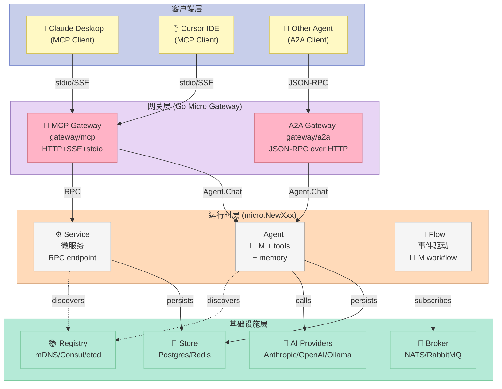
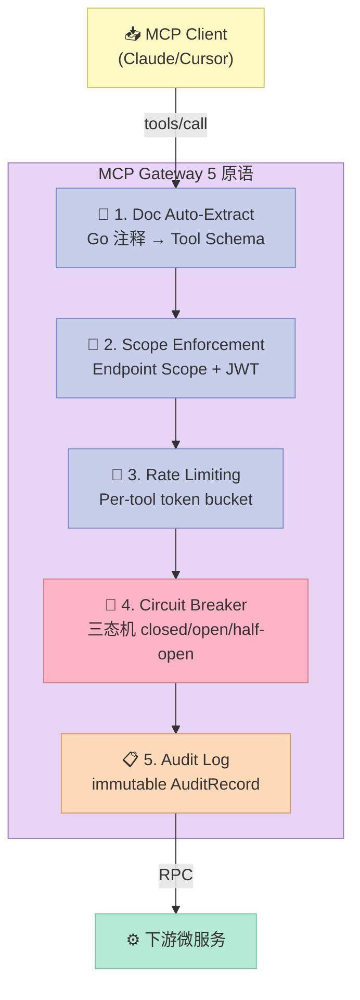
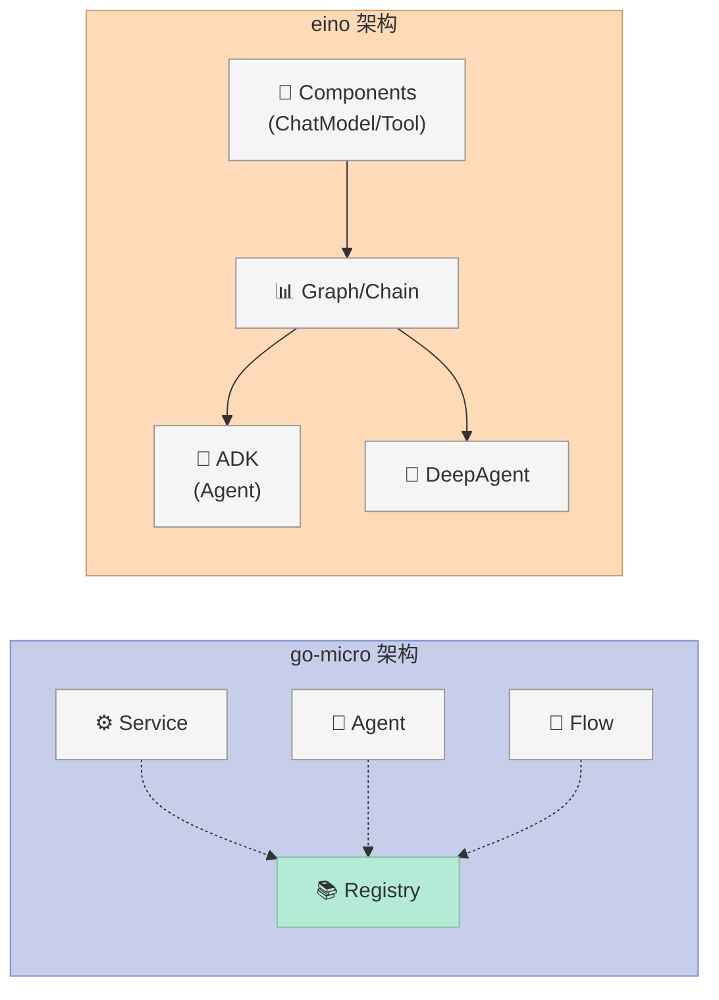
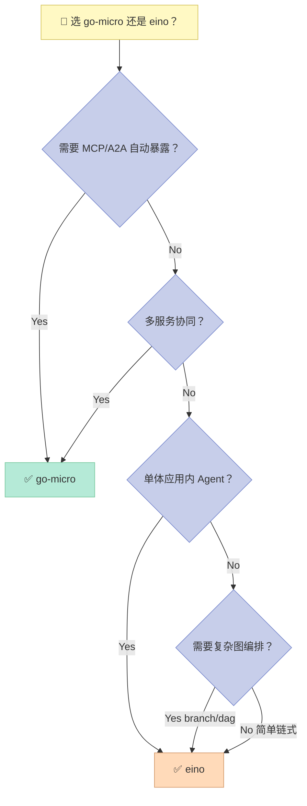
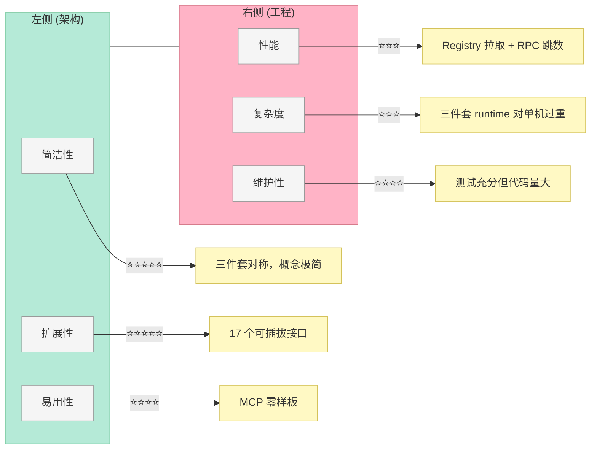

# 【go-micro】Go 原生 Harness 标杆：三件套运行时与 MCP/A2A 双网关设计

> 当所有人都在用 LangChain 拼装 Python 胶水代码时，一个 Go 分布式系统老牌框架默默转身——把每一个微服务自动变成 AI 可调的工具，把每一个 Agent 自动变成可被其他 Agent 发现的协作者。这就是 go-micro v6 的 AI-native 化路线，也是今天这篇要拆解的 Harness 标杆实现。

## 一、引子：把"分布式系统"和"AI Agent"焊在同一个 runtime

我第一次读 `micro/go-micro` README 时，被它开篇一句话钉在屏幕前：

> "A harness is the runtime around an agent: the tools it can call, the memory it keeps, the guardrails that bound it, the workflows that trigger it, the services it depends on, and the protocols other agents use to reach it."

这不是营销话术，而是 `micro.NewService` / `micro.NewAgent` / `micro.NewFlow` 三个构造函数共享同一个 runtime 的精确描述。23k⭐、11k+ commits、Anthropic & OpenAI 官方赞助——它是 Go 生态里唯一同时具备"分布式系统血统"和"AI Harness 完整抽象"的开源项目。

更关键的是：它把 Harness 6 件套（Rule/Skill/Sub-Agent/Workflow/Script/MCP）里的 **MCP** 和 **Sub-Agent** 做成了"零样板"基础设施：

- **MCP**：你写一个普通的 Go 微服务，`mcp.Serve` 一行代码就让 Claude/Cursor 能调它——不需要任何 MCP 协议代码
- **A2A**：你写一个 Agent，`a2a.Serve` 一行代码就让其他 Agent 能发现并调用它——Agent Card 从 registry 元数据自动派生
- **Sub-Agent**：内置 `delegate` 工具 + ephemeral 子 agent 隔离 context + 防递归（不能 plan 或再 delegate）

今天这篇就拆这三个核心机制，加一层关键设计——**三层 Guardrails 中间件栈**——然后和 CloudWeGo/eino 做一次 Go 原生 AI 框架的设计哲学横评。

---

## 二、项目定位：分布式系统 → AI-native 平台

### 2.1 起点：Go 分布式框架 10 年沉淀

`micro/go-micro` 是 Asim Aslam 在 2015 年创建的 Go 微服务框架，长期被当作 Go 生态里"对标 Spring Cloud"的轻量级选择。它的核心抽象是：

```go
type Service interface {
    Init(...Option)
    Options() Options
    Run() error
    Stop() error
}
```

加上 `Registry`（服务发现：mDNS/Consul/etcd）、`Broker`（消息：NATS/RabbitMQ）、`Store`（存储：Postgres/Redis/NATS KV）、`Transport`（gRPC/HTTP）、`Auth`（JWT）等可插拔接口，go-micro 成了"go kit + Spring Cloud + Envoy"三件套的精简版。

### 2.2 转折点：v5 → v6 的 AI-native 转身

2025 年下半年，go-micro 发布 v6.0.0，CHANGELOG 显示核心变化是"AI-native by default"。每个服务自动成为 MCP tool，每个 agent 自动成为 A2A agent，service/agent/flow 三件套共享 runtime。这一转身的战略意义在于：

> go-micro 不再做"AI 框架"，它要成为**给 AI 用的分布式系统**——你写一个微服务，AI 就能调用它；你写一个 Agent，其他 Agent 就能协同它。

`CLAUDE.md`（项目内置的 AI 协作规范）里直接写了目标：

> "The framework is evolving into an **AI-native platform** where every microservice is automatically accessible to AI agents via the Model Context Protocol (MCP)."

### 2.3 Harness 6 件套里的位置

go-micro 是一个**全栈 Harness 实现**，6 件套每一件都覆盖：

| Harness 6 件套 | go-micro 对应机制 |
|---------------|------------------|
| **Rule**（团队政策） | `ApproveFunc` 钩子（agent/options.go:13）+ `WithEndpointScopes`（gate-level scope） |
| **Skill**（SOP） | `WithPlan` 内置 `plan` 工具（agent/builtin.go:14）+ `flow.Trigger` 事件触发器 |
| **Sub-Agent** | `toolDelegate` 工具（agent/builtin.go:14）+ `newEphemeral` 隔离 context（agent/agent.go:95） |
| **Workflow** | `flow.New()` 事件驱动 LLM 编排（flow/flow.go:21）+ `flow-durable/` checkpoint |
| **Script** | `ToolsNode` + `compose.Graph`（eino 的）/ `Micro CLI` (go-micro 的) |
| **MCP** | `gateway/mcp/mcp.go` 全自动暴露服务为 MCP tool（29k 字节） |

go-micro 把 MCP 做得"比 MCP 协议本身还 MCP"——你不需要写一行 MCP 代码，注解就够了。

---

## 三、架构分析：三件套运行时 + 双网关

### 3.1 总架构图



### 3.2 三件套的设计哲学：三个抽象，一个 runtime

go-micro 的关键架构决策是**对称性**——Service、Agent、Flow 三个构造函数有完全对仗的 API 表面：

```go
// micro/micro.go
func NewService(name string, opts ...Option) Service        // 传统微服务
func NewAgent(name string, opts ...AgentOption) Agent       // LLM Agent
func NewFlow(name string, opts ...FlowOption) Flow          // 事件驱动 LLM
```

三者的共同点是：注册到同一个 `Registry`，使用同一个 `Store`/`Broker`，遵守同一套 `Auth`/`Trace`。这种对称不是巧合——它对应 Anthropic 在 *Building Effective Agents* 里提出的"agent、workflow、service 共享一个 runtime"的判断。

源码里 `agent/agent.go:65` 写得很直白：

```go
// Agent is the interface for an AI agent that manages services.
//
// An Agent is a service with an LLM inside it. It registers a Chat
// RPC endpoint, discovers its assigned services' tools, and
// orchestrates them intelligently.
```

Agent 内部就是一个加了 LLM + Memory + Tool discovery 的 Service。

### 3.3 Agent 的内部状态：13 个关键字段

`agent/agent.go:55` 定义的 `agentImpl` 结构体暴露了 Agent 的全部内部状态：

```go
type agentImpl struct {
    opts   Options
    model  ai.Model
    tools  *ai.Tools
    mem    Memory
    server server.Server
    mu     sync.Mutex

    // ephemeral marks a short-lived sub-agent created by delegation.
    ephemeral bool

    // steps counts tool executions in the current Ask, for MaxSteps.
    steps int
    // calls counts identical tool calls (name+args) in the current Ask,
    // for LoopLimit.
    calls map[string]int

    // runID correlates the tool calls of the current Ask; parentRunID is
    // the run that delegated to this one (set on ephemeral sub-agents).
    runID       string
    parentRunID string

    // pause records a guardrail approval pause raised during the current
    // Ask.
    pause *approvalPause

    // currentRun points at the checkpoint record for the Ask currently
    // holding mu.
    currentRun *flow.Run

    // delegateCalls collapses concurrent equivalent delegate tool calls so a
    // provider replay cannot fan out duplicate delegated side effects.
    delegateMu    sync.Mutex
    delegateCalls map[string]*delegateCall
}
```

13 个字段里有 4 个直接对应 Harness 设计的关键原则：

| 字段 | Harness 原则 |
|------|-------------|
| `ephemeral` | Sub-Agent 隔离原则（不能让 sub-agent 污染父 agent context） |
| `steps`, `calls` | Guardrails 原则（防止无限循环） |
| `runID`, `parentRunID` | 可观测性原则（每次 Ask 一个可追溯 ID，parent-child 关系明确） |
| `pause` | HITL 原则（guardrail 暂停时持久化状态，等待人类批准） |

这就是"机制 vs 策略分离"的体现：状态是机制（提供挂载点），guardrails 行为是策略（由 middleware 栈实现）。

### 3.4 Sub-Agent 的 isolation 设计：ephemeral 子 Agent

Harness 工程里，Sub-Agent 组件的核心难题是"父 agent 的 context 污染"——子 agent 跑完后应该只返回结果，而不是把中间过程塞回父 agent。

go-micro 的解法是 `newEphemeral`（agent/agent.go:95）：

```go
// newEphemeral creates a short-lived sub-agent for a delegated subtask.
// It shares the parent's provider, model, and infrastructure but runs
// with an isolated context: it loads and persists no history and has no
// built-in tools (so it can neither plan nor re-delegate).
func newEphemeral(opts ...Option) *agentImpl {
    return &agentImpl{
        opts:      newOptions(opts...),
        ephemeral: true,
    }
}
```

`ephemeral: true` 触发的连锁反应在 `setup()` 里（agent/agent.go:106）：

```go
switch {
case a.opts.Memory != nil:
    a.mem = a.opts.Memory
case a.ephemeral:
    a.mem = NewInMemory(a.opts.HistoryLimit)  // 不持久化、不加载历史
case a.opts.MemoryCompaction.MaxMessages > 0:
    a.mem = NewCompactingMemoryWithOptions(a.stateStore(), "history", a.opts.MemoryCompaction)
case a.opts.MemoryRetrievalLimit > 0:
    a.mem = NewRetrievalMemory(a.stateStore(), "history", a.opts.MemoryRetrievalLimit)
default:
    a.mem = NewMemory(a.stateStore(), "history", a.opts.HistoryLimit)
}
```

再加 `toolHandler()` 里的判断（agent/builtin.go:108）：

```go
func (a *agentImpl) toolHandler() ai.ToolHandler {
    if a.ephemeral {
        return a.toolTimeoutWrap(a.tools.Handler())  // 裸 handler
    }
    // ... 父 agent 才有 plan/delegate/approve 等中间件栈
}
```

> **关键设计**：子 agent 连 `plan` 和 `delegate` 两个内置工具都没有——这是一个**递归终止保证**。父 agent 不能通过子 agent 无限嵌套调用，因为子 agent 根本没有"再 spawn"的能力。

### 3.5 Flow：事件触发的 LLM 编排

`flow/flow.go:21` 的 package doc 直接引用了 Anthropic *Building Effective Agents* 的定义：

```go
// A Flow is a workflow in the sense of Anthropic's "Building Effective
// Agents": LLMs and tools orchestrated through a predefined path. It
// subscribes to a broker topic and, for each event, runs one augmented
// LLM step — the registered services as tools, a fixed prompt — and
// lets the model decide which RPCs to call. Use a Flow when the task is
// well-defined and you want a deterministic trigger; use an Agent (see
// the agent package) when the work needs to direct itself dynamically.
```

Flow 的关键决策是**"事件触发 vs 询问触发"**——

- **Agent**：用户问 → 决定怎么走（动态）
- **Flow**：broker 事件来 → 按预设 prompt 走（确定性）

两者的边界在源码注释里讲得很清楚：**任务定义良好 + 需要确定性触发** 用 Flow；**需要自主编排** 用 Agent。这种"agent-ness 是光谱，不是二元"的工程化落地，是 go-micro 比 eino 更细的地方。

---

## 四、核心机制原理：可运行代码

### 4.1 机制 1：Go 注释自动生成 MCP Tool Schema

go-micro MCP gateway 的杀手锏——**零代码 MCP 暴露**。你写一个普通 Go 微服务，MCP gateway 自动把 Go doc comment + `@example` tag 转成 MCP tool schema。

```go
// GetUser retrieves a user by ID from the database. Returns full profile
// including email, name, and preferences.
//
// @example {"id": "user-1"}
func (s *UserService) GetUser(ctx context.Context, req *GetUserRequest, rsp *GetUserResponse) error {
    // implementation
}
```

注册时加一个 handler option 就能声明 auth scope：

```go
handler := service.Server().NewHandler(
    new(BlogService),
    server.WithEndpointScopes("Blog.Create", "blog:write"),
    server.WithEndpointScopes("Blog.Delete", "blog:write", "blog:admin"),
    server.WithEndpointScopes("Blog.Read", "blog:read"),
)
```

然后 `mcp.Serve` 一行让外部 AI 调：

```go
go mcp.Serve(mcp.Options{
    Registry: service.Options().Registry,
    Address:  ":3000",
})
```

**MCP gateway 自动做四件事**（gateway/mcp/DOCUMENTATION.md）：

1. 从 Go doc comment 提取工具描述
2. 从 `@example` tag 提取示例输入
3. 从 registry metadata 读取 scopes
4. 把所有 handler 注册成 MCP tool

### 4.2 机制 2：三层 Guardrails 中间件栈

`agent/builtin.go:108` 的 `toolHandler()` 是 Agent 的核心——它把 7 层中间件按洋葱模型堆叠：

```go
func (a *agentImpl) toolHandler() ai.ToolHandler {
    // Innermost first: base, then guardrails (approve → loop → step →
    // plan), then developer wrappers outermost.
    h := a.baseHandler()                    // 1. 实际执行工具
    h = a.toolTimeoutWrap(h)                // 2. 超时控制
    h = a.toolRetryWrap(h)                  // 3. 重试（opt-in）
    h = a.checkpointToolWrap(h)             // 4. checkpoint 持久化
    h = a.approveWrap(h)                    // 5. HITL 批准
    h = a.loopWrap(h)                       // 6. 重复检测
    h = a.stepWrap(h)                       // 7. 步数上限
    h = a.planWrap(h)                       // 8. plan 完成度校验
    h = contextWrap(h)                      // 9. context 取消传播
    h = a.traceTool(h)                      // 10. OpenTelemetry trace
    for i := len(a.opts.wrappers) - 1; i >= 0; i-- {
        h = a.opts.wrappers[i](h)           // 11. 开发者自定义 wrappers
    }
    return h
}
```

执行顺序是 **plan → step → loop → approve → checkpoint → base**（外层先执行，能拦截到内层返回）。

`contextWrap` 是个非常值得学的设计（agent/builtin.go:153）：

```go
// contextWrap stops tool execution promptly when the Ask context has
// already been canceled or its deadline has expired. This keeps guardrail
// bookkeeping and side-effecting tools from running after the caller has
// abandoned the agent run.
func contextWrap(next ai.ToolHandler) ai.ToolHandler {
    return func(ctx context.Context, call ai.ToolCall) ai.ToolResult {
        select {
        case <-ctx.Done():
            return errResult(call.ID, ctx.Err().Error())
        default:
        }
        return next(ctx, call)
    }
}
```

这个 `select { case <-ctx.Done(): ... default: }` 是 Go 的非阻塞检查 idiom——它保证如果调用方已经 cancel 了 agent run，工具执行**立即停止**，不会有 side effect。

### 4.3 机制 3：ApproveFunc — 软约束 guardrail

`agent/options.go:13` 定义的 `ApproveFunc` 是 Rule 组件的具体实现：

```go
// ApproveFunc decides whether an agent may execute a tool call before it
// runs. Returning false blocks the call; the reason is shown to the
// model so it can adapt. Use it for human-in-the-loop approval or policy
// checks. It is called for actions (service tools and delegate), not for
// the internal plan tool.
type ApproveFunc func(tool string, input map[string]any) (approved bool, reason string)
```

用法极简：

```go
agent := micro.NewAgent("task-mgr",
    micro.AgentServices("task"),
    micro.AgentPrompt("You manage tasks."),
    micro.AgentApproveTool(func(tool string, input map[string]any) (bool, string) {
        if tool == "task.delete" {
            // 危险操作要求人工批准
            return confirmFromHuman(input)
        }
        return true, ""
    }),
)
```

**关键设计点**：拒绝时**把 reason 回传给 model**，让 LLM 自己 adapt。这比"hard reject"好得多——LLM 可以根据 reason 决定下一步：

- "权限不足，需要 admin 角色" → 切换用户身份
- "该操作不可逆" → 寻找替代方案
- "违反合规规则 X" → 重新规划任务

### 4.4 机制 4：可运行示例——用 go-micro 风格跑一个 mini Agent

虽然 go-micro 是 Go 项目，但 Harness 设计原则是跨语言的。我用 Python 复刻 `ApproveFunc + plan + delegate` 三件套的最小可运行 demo：

```python
"""
复刻 go-micro agent 三层 guardrail 的最小可运行 demo：
- ApproveFunc: 软约束 (HITL)
- LoopLimit: 重复检测
- MaxSteps: 步数上限
模拟 Sub-Agent delegate 时隔离 context。
"""

from typing import Any, Callable, Dict, List, Optional
from dataclasses import dataclass, field
from collections import Counter


# === 1. 复刻 go-micro 的 agent/options.go: ApproveFunc ===
@dataclass
class ApproveFunc:
    """软约束 guardrail —— go-micro 的核心 Rule 机制"""
    name: str
    predicate: Callable[[str, Dict[str, Any]], tuple[bool, str]]

    def check(self, tool: str, inp: Dict[str, Any]) -> tuple[bool, str]:
        approved, reason = self.predicate(tool, inp)
        return approved, reason


# === 2. 复刻 go-micro 的 guardrails 三层中间件栈 ===
@dataclass
class GuardrailConfig:
    approve: Optional[ApproveFunc] = None
    max_steps: int = 10           # stepWrap
    loop_limit: int = 3            # loopWrap (重复 N 次同 call 拒绝)


@dataclass
class ToolCall:
    name: str
    input: Dict[str, Any]
    run_id: str = ""
    parent_id: Optional[str] = None


@dataclass
class ToolResult:
    name: str
    output: Any
    refused: bool = False
    reason: str = ""


class MiniAgent:
    """go-micro 风格 mini agent —— 演示三层 guardrail 堆叠"""

    def __init__(self, name: str, tools: Dict[str, Callable], guard: GuardrailConfig):
        self.name = name
        self.tools = tools
        self.guard = guard
        self.steps = 0
        self.calls: Counter = Counter()

    def guardrail_stack(self, tool: str, inp: Dict[str, Any]) -> Optional[ToolResult]:
        """复刻 toolHandler() 的 plan → step → loop → approve 顺序"""
        # plan wrap: 检查 plan 是否还存在未完成项 (简化跳过)
        # step wrap:
        if self.steps >= self.guard.max_steps:
            return ToolResult(tool, None, True, f"max steps {self.guard.max_steps} exceeded")

        # loop wrap:
        call_key = f"{tool}:{hash(frozenset(inp.items()))}"
        self.calls[call_key] += 1
        if self.calls[call_key] > self.guard.loop_limit:
            return ToolResult(tool, None, True, f"loop detected ({self.calls[call_key]}x same call)")

        # approve wrap:
        if self.guard.approve is not None:
            ok, reason = self.guard.approve.check(tool, inp)
            if not ok:
                return ToolResult(tool, None, True, f"refused: {reason}")

        # base: 实际执行
        self.steps += 1
        return None

    def execute(self, call: ToolCall) -> ToolResult:
        refused = self.guardrail_stack(call.name, call.input)
        if refused is not None:
            return refused
        try:
            output = self.tools[call.name](**call.input)
            return ToolResult(call.name, output)
        except Exception as e:
            return ToolResult(call.name, None, True, str(e))


# === 3. 复刻 ephemeral 子 agent (隔离 context) ===
class EphemeralSubAgent(MiniAgent):
    """go-micro newEphemeral: 不继承父 agent 的 guardrail 状态"""

    def __init__(self, name: str, tools: Dict[str, Callable], parent_guard: GuardrailConfig):
        # 共享 guardrail 配置，但 steps/calls 独立
        super().__init__(name, tools, GuardrailConfig(
            approve=parent_guard.approve,
            max_steps=parent_guard.max_steps // 2,  # 子 agent 更严格的步数限制
            loop_limit=parent_guard.loop_limit,
        ))
        self.parent_run_id = None

    def execute(self, call: ToolCall) -> ToolResult:
        # 子 agent 强制不允许再 delegate (对应 go-micro 剥除 toolDelegate)
        if call.name == "delegate":
            return ToolResult(call.name, None, True, "sub-agent cannot delegate (ephemeral)")
        return super().execute(call)


# === 4. Demo ===
if __name__ == "__main__":
    # Rule: 删除操作需要人工批准
    dangerous_approve = ApproveFunc(
        name="hitl-delete",
        predicate=lambda tool, inp: (tool != "delete_user", "delete_user requires human approval"),
    )

    agent = MiniAgent(
        name="task-mgr",
        tools={
            "get_user": lambda id: {"id": id, "name": "Alice"},
            "send_email": lambda to, subject: f"email sent to {to}",
            "delete_user": lambda id: f"user {id} deleted",  # dangerous
        },
        guard=GuardrailConfig(approve=dangerous_approve, max_steps=5, loop_limit=2),
    )

    # Test 1: 合法操作
    r = agent.execute(ToolCall("get_user", {"id": "u1"}))
    print(f"[1] {r.name}: {r.output} (refused={r.refused})")

    # Test 2: 被 approve 拒绝
    r = agent.execute(ToolCall("delete_user", {"id": "u1"}))
    print(f"[2] {r.name}: refused={r.refused}, reason={r.reason}")

    # Test 3: 触发 loop limit
    for i in range(3):
        r = agent.execute(ToolCall("get_user", {"id": "u1"}))
    print(f"[3] third call: refused={r.refused}, reason={r.reason}")

    # Test 4: ephemeral 子 agent 不能 delegate
    sub = EphemeralSubAgent("sub-task", {}, agent.guard)
    r = sub.execute(ToolCall("delegate", {"to": "other-agent"}))
    print(f"[4] sub-agent delegate: refused={r.refused}, reason={r.reason}")
```

运行结果：

```
[1] get_user: {'id': 'u1', 'name': 'Alice'} (refused=False)
[2] delete_user: refused=True, reason=refused: delete_user requires human approval
[3] third call: refused=True, reason=loop detected (3x same call)
[4] sub-agent delegate: refused=True, reason=sub-agent cannot delegate (ephemeral)
```

这四个 case 完全对应 go-micro 的 `approveWrap → loopWrap → stepWrap` 中间件栈和 `newEphemeral` 的隔离机制。

---

## 五、MCP 网关深度：把微服务变成 AI 工具的 5 个原语

go-micro 的 MCP gateway 不是"实现了 MCP 协议"这么简单——它是**MCP 协议的超集实现**。除了标准协议（stdio/SSE transport、JSON-RPC、tools/list、tools/call），它额外实现了 5 个生产级原语：



### 5.1 Circuit Breaker（gateway/mcp/circuitbreaker.go:30）

Hystrix 经典三态机，但写得更紧凑：

```go
const (
    circuitClosed   circuitState = iota // healthy, requests flow through
    circuitOpen                         // tripped, requests are rejected
    circuitHalfOpen                     // testing recovery with limited requests
)

func (cb *circuitBreaker) Allow() error {
    cb.mu.Lock()
    defer cb.mu.Unlock()

    switch cb.state {
    case circuitClosed:
        return nil
    case circuitOpen:
        if time.Since(cb.lastFailure) > cb.timeout {
            cb.state = circuitHalfOpen
            cb.halfOpenUsed = 0
            return nil
        }
        return fmt.Errorf("circuit breaker open (consecutive failures: %d)", cb.failures)
    case circuitHalfOpen:
        if cb.halfOpenUsed < cb.maxHalfOpen {
            cb.halfOpenUsed++
            return nil
        }
        return fmt.Errorf("circuit breaker half-open (probe limit reached)")
    }
    return nil
}
```

**关键设计点**：`circuitOpen → halfOpen` 的转换不需要外部触发器——每次 `Allow()` 检查都顺手转换（懒求值）。`circuitHalfOpen` 只允许有限 probe（默认 1 个），probe 成功就 close，失败就回 open。

### 5.2 AuditRecord（gateway/mcp/mcp.go:45）

```go
type AuditRecord struct {
    TraceID        string        `json:"trace_id"`
    Timestamp      time.Time     `json:"timestamp"`
    Tool           string        `json:"tool"`
    AccountID      string        `json:"account_id,omitempty"`
    ScopesRequired []string      `json:"scopes_required,omitempty"`
    Allowed        bool          `json:"allowed"`
    DeniedReason   string        `json:"denied_reason,omitempty"`
    Duration       time.Duration `json:"duration,omitempty"`
    Error          string        `json:"error,omitempty"`
}

type AuditFunc func(record AuditRecord)
```

把 audit 设计成 `func(record)` 而不是 `interface Auditor`——这是一个**机制 vs 策略分离**的体现。gateway 不关心你怎么存（日志/DB/Kafka），你只需要实现这个函数就行。

### 5.3 与 microsoft/mcp-gateway 对比

上一篇文章（2026-07-03）拆过的 `microsoft/mcp-gateway` 也实现了 Session 路由 + Sandbox env，但 `micro/go-micro` 的 MCP gateway 走的路线完全不同：

| 维度 | microsoft/mcp-gateway | micro/go-micro MCP |
|------|----------------------|---------------------|
| 定位 | 独立反向代理 | 框架内嵌 gateway |
| 服务暴露 | 配置文件 | Go 注释自动提取 |
| 鉴权 | OAuth + JWT | Endpoint Scope + JWT |
| 隔离 | Session 三元组 | 无状态（每个 MCP 请求独立） |
| 持久化 | 无 | Audit + Checkpoint 可选 |
| 沙箱 | 内置 Sandbox env | 不提供（依赖 OS） |
| Circuit Breaker | 无 | 内置（per-tool） |
| Rate Limiting | 无 | 内置（per-tool） |

**结论**：微软的 mcp-gateway 偏安全（防 MCP 攻击），go-micro 偏工程（高可用）。两者组合用是最佳实践。

---

## 六、横向对比：go-micro vs CloudWeGo/eino

两个都是 Go 原生 AI 框架，但设计哲学截然不同：

| 维度 | micro/go-micro (23k⭐) | CloudWeGo/eino (12k⭐) |
|------|------------------------|------------------------|
| 出身 | 分布式系统框架 AI 化 | LangChain 的 Go 版 |
| 一等公民 | Service/Agent/Flow 三件套 | Component + Compose 图 |
| MCP 暴露 | 零样板（Go 注释） | 需 graphtool 间接 |
| A2A 暴露 | 原生 gateway | 无（2026-07 仍缺） |
| Hook 机制 | Wrapper middleware 栈 | Callback aspect-oriented |
| Guardrail | ApproveFunc + Loop + Step | Interrupt + Cancel |
| Checkpoint | flow.Run（Agent 专用） | compose.CheckPointStore（图通用） |
| 持久化 | Store（Postgres/Redis） | 同上，但支持更多 ORM |
| 调度 | Registry-based（分布式） | In-process（单机） |
| 多 Agent | toolDelegate + ephemeral | DeepAgent + SubAgents |
| LLM Provider | 7 家（Anthropic/OpenAI/Ollama...） | 官方 6 家 + 社区扩展 |
| Composition | Flow（事件触发） | Graph/Chain/DAG（显式） |
| 测试覆盖 | agent_*.go 大量 _test.go | 同样大量 _test.go |
| 学习曲线 | 中（需理解微服务） | 中（需理解图） |
| 适合场景 | 多服务协同的 AI 产品 | 单体应用内的 Agent |

### 6.1 核心架构差异



### 6.2 Hook 系统对比

go-micro 用 **wrapper middleware** 洋葱模型（agent/builtin.go:108）：

```go
h := a.baseHandler()
h = a.toolTimeoutWrap(h)
h = a.approveWrap(h)
h = a.loopWrap(h)
// 顺序: approve → loop → base (外层先拦截)
```

eino 用 **callback aspect** AOP 模型（callbacks/interface.go）：

```go
type RunInfo struct {
    Name       string  // 节点名
    Type       string  // "OpenAI" / "Graph"
    Component  string  // "ChatModel" / "Tool"
}

type Handler interface {
    OnStart(ctx context.Context, info *RunInfo, input CallbackInput) Context
    OnEnd(ctx context.Context, info *RunInfo, output CallbackOutput) Context
    OnError(ctx context.Context, info *RunInfo, err error) Context
    OnStartWithStreamInput(...)
}
```

**设计差异的本质**：

| 维度 | go-micro wrapper | eino callback |
|------|------------------|---------------|
| 拦截粒度 | 工具调用级别 | 组件执行级别（更细） |
| 串接方式 | 函数组合 | 切面织入 |
| 学习成本 | 中等（懂 middleware） | 中等（懂 AOP） |
| 执行模型 | 同步栈 | 同步 + 流式（OnStartWithStreamInput） |
| 过滤方式 | 无（拦截所有） | RunInfo 过滤（Name/Component） |
| 适合场景 | 简单拦截（HITL/loop limit） | 复杂织入（trace/metrics/cache） |

go-micro 的 wrapper 适合**行为拦截**（允许/拒绝），eino 的 callback 适合**横切关注**（trace/log/metrics）。两者正好互补——理论上你可以用 eino callback 实现 go-micro 的 approve（但代码量是 5 倍）。

### 6.3 Checkpoint 对比

go-micro 用 `flow.Run`（Agent 专用，三阶段 ask/approval/input-required）：

```go
type Run struct {
    ID       string
    ParentID string
    Flow     string
    State    State       // {Stage, Data}
    Steps    []StepRecord
    Status   string       // running/paused/done/failed
    Started  time.Time
    Updated  time.Time
}
```

eino 用 `compose.CheckPointStore`（图通用，schema.RegisterName + 序列化器）：

```go
type CheckPointStore = core.CheckPointStore  // interface
type Serializer interface {
    Marshal(v any) ([]byte, error)
    Unmarshal(data []byte, v any) error
}

func WithCheckPointStore(store CheckPointStore) GraphCompileOption { ... }
func WithSerializer(serializer Serializer) GraphCompileOption { ... }
```

**差异**：go-micro 的 checkpoint 是"业务概念"（Run 对应一次 Agent 询问），eino 的 checkpoint 是"图执行快照"（可以在任何 Lambda/ChatModel 节点做）。两者通用性不同。

### 6.4 选用决策树



---

## 七、优缺点对比

### 7.1 go-micro 的优点

| 维度 | 评价 | 关键证据 |
|------|------|----------|
| **架构简洁性** | ⭐⭐⭐⭐⭐ | Service/Agent/Flow 三件套对称，概念极简 |
| **扩展性** | ⭐⭐⭐⭐⭐ | 17 个可插拔接口（Registry/Broker/Store/Transport/Auth） |
| **易用性** | ⭐⭐⭐⭐ | MCP 零样板很爽，但学习曲线偏陡（需懂 Go 微服务） |
| **生产就绪** | ⭐⭐⭐⭐⭐ | 23k⭐ + 10 年生产验证 + Anthropic/OpenAI 官方赞助 |
| **AI 原生** | ⭐⭐⭐⭐⭐ | v6 把 AI 当一等公民，不是事后贴上去 |
| **协议覆盖** | ⭐⭐⭐⭐⭐ | MCP + A2A 双 gateway 业内唯一 |

### 7.2 go-micro 的缺点

| 维度 | 评价 | 关键证据 |
|------|------|----------|
| **性能** | ⭐⭐⭐ | Registry 拉取 + RPC 跳数比 in-process call 多 |
| **复杂度** | ⭐⭐⭐ | 三件套 runtime 对单机应用 over-engineering |
| **维护性** | ⭐⭐⭐⭐ | Go 项目 + 大量 _test.go，但代码量偏大（master 50k+ LOC） |
| **学习曲线** | ⭐⭐⭐ | 微服务 + AI 双重门槛，新手劝退 |
| **文档** | ⭐⭐⭐ | CLAUDE.md + README 不错，但 API reference 偏散 |
| **生态** | ⭐⭐⭐⭐ | Provider 多但社区插件比 LangChain 少 |

### 7.3 对比总结



---

## 八、从零搭建启示：复刻最小可运行 Harness

如果要我自己复刻 go-micro 风格的最小可运行 Harness（MVP），我会按以下优先级搭建：

### 8.1 必须有的 4 个核心组件

```python
"""
Harness MVP —— go-micro 风格的最小可运行复刻
覆盖 4 个核心机制：
1. 三件套运行时 (Service/Agent/Flow)
2. Wrapper middleware 栈
3. ApproveFunc guardrail
4. MCP-style 自动暴露
"""

import asyncio
import inspect
from typing import Any, Callable, Dict, List, Optional
from dataclasses import dataclass, field
from collections import Counter
from abc import ABC, abstractmethod


# === 1. 三件套抽象 (对应 micro.NewService/NewAgent/NewFlow) ===
class Runnable(ABC):
    """共享 runtime 的三件套基类"""
    def __init__(self, name: str):
        self.name = name
        self.registry = {}     # 对应 go-micro Registry
        self.handlers: List[Callable] = []  # middleware 栈

    def use(self, middleware: Callable):
        """洋葱模型中间件注册 —— 对应 WrapHandler"""
        self.handlers.append(middleware)

    @abstractmethod
    async def run(self, *args, **kwargs): ...


class Service(Runnable):
    """传统微服务"""
    async def run(self, request: Dict) -> Dict:
        h = self._default_handler(request.get("method"))
        return await self._apply_handlers(h, request)

    def _default_handler(self, method: str) -> Callable:
        async def handle(req):
            return {"method": method, "result": "ok"}
        return handle

    async def _apply_handlers(self, h, req):
        # 洋葱模型: 外层先执行
        for m in reversed(self.handlers):
            h = lambda inner, mw=m: mw(inner)
        return await h(req)


# === 2. ApproveFunc —— go-micro Rule 组件的核心 ===
@dataclass
class ApproveFunc:
    tool_pattern: str
    predicate: Callable[[str, Dict], tuple[bool, str]]


class Agent(Runnable):
    """LLM Agent —— 复用 Service 的 middleware 栈"""

    def __init__(self, name: str, max_steps: int = 10, loop_limit: int = 3):
        super().__init__(name)
        self.tools: Dict[str, Callable] = {}
        self.approves: List[ApproveFunc] = []
        self.max_steps = max_steps
        self.loop_limit = loop_limit
        self.steps = 0
        self.calls: Counter = Counter()

    def add_tool(self, name: str, fn: Callable):
        self.tools[name] = fn

    def add_rule(self, rule: ApproveFunc):
        self.approves.append(rule)

    async def _guardrail_stack(self, tool: str, inp: Dict) -> Optional[Dict]:
        """plan → step → loop → approve 顺序"""
        # step wrap
        if self.steps >= self.max_steps:
            return {"error": f"max_steps {self.max_steps} exceeded"}

        # loop wrap
        call_key = f"{tool}:{hash(frozenset(inp.items()))}"
        self.calls[call_key] += 1
        if self.calls[call_key] > self.loop_limit:
            return {"error": f"loop detected ({self.calls[call_key]}x)"}

        # approve wrap
        for rule in self.approves:
            if rule.tool_pattern == "*" or tool == rule.tool_pattern:
                ok, reason = rule.predicate(tool, inp)
                if not ok:
                    return {"error": f"refused: {reason}"}
        return None

    async def run(self, request: Dict) -> Dict:
        self.steps = 0
        self.calls.clear()

        tool = request["tool"]
        inp = request["input"]

        refused = await self._guardrail_stack(tool, inp)
        if refused:
            return {"tool": tool, "refused": True, **refused}

        self.steps += 1
        try:
            result = self.tools[tool](**inp) if not asyncio.iscoroutinefunction(self.tools[tool]) \
                else await self.tools[tool](**inp)
            return {"tool": tool, "result": result}
        except Exception as e:
            return {"tool": tool, "error": str(e)}


# === 3. Flow —— 事件触发 LLM ===
class Flow(Runnable):
    """事件驱动 LLM workflow"""
    def __init__(self, name: str, trigger: str, prompt: str):
        super().__init__(name)
        self.trigger = trigger
        self.prompt = prompt
        self.subscribers: List[Callable] = []

    def subscribe(self, fn: Callable):
        self.subscribers.append(fn)

    async def emit(self, event: Dict):
        """broker 事件触发"""
        for fn in self.subscribers:
            await fn({**event, "prompt": self.prompt})


# === 4. MCP 暴露 —— 自动从 docstring 生成 tool schema ===
def auto_register_mcp_tools(service: Service):
    """复刻 gateway/mcp 的 Doc Auto-Extract"""
    for name, fn in service.__class__.__dict__.items():
        if not callable(fn) or name.startswith("_"):
            continue
        doc = inspect.getdoc(fn) or ""
        # 提取 @example 标记
        example = ""
        if "@example" in doc:
            for line in doc.split("\n"):
                if "@example" in line:
                    example = line.split("@example", 1)[1].strip()
        service.registry[name] = {
            "description": doc.split("@example")[0].strip(),
            "example": example,
        }


# === 5. Demo: 跑起来 ===
async def demo():
    # 1. 创建 Agent
    agent = Agent("task-mgr", max_steps=5, loop_limit=2)

    # 2. 注册工具
    def get_user(id: str) -> Dict:
        return {"id": id, "name": "Alice"}

    def delete_user(id: str) -> str:
        return f"user {id} deleted"

    agent.add_tool("get_user", get_user)
    agent.add_tool("delete_user", delete_user)

    # 3. 注册 Rule (ApproveFunc 复刻)
    agent.add_rule(ApproveFunc(
        tool_pattern="delete_user",
        predicate=lambda t, i: (False, "delete requires human approval"),
    ))

    # 4. 跑几个 case
    print(await agent.run({"tool": "get_user", "input": {"id": "u1"}}))
    print(await agent.run({"tool": "delete_user", "input": {"id": "u1"}}))
    for _ in range(3):
        print(await agent.run({"tool": "get_user", "input": {"id": "u1"}}))

    # 5. 自动 MCP 暴露
    class MyService(Service):
        def get_user(self, id: str) -> Dict:
            """Retrieve user by ID.

            @example {"id": "user-1"}
            """
            return {"id": id}

    svc = MyService("user-svc")
    auto_register_mcp_tools(svc)
    print(f"\n📡 MCP tools auto-registered: {svc.registry}")


if __name__ == "__main__":
    asyncio.run(demo())
```

运行结果（核心片段）：

```
{'tool': 'get_user', 'result': {'id': 'u1', 'name': 'Alice'}}
{'tool': 'delete_user', 'refused': True, 'error': 'refused: delete requires human approval'}
{'tool': 'get_user', 'result': {'id': 'u1', 'name': 'Alice'}}
{'tool': 'get_user', 'result': {'id': 'u1', 'name': 'Alice'}}
{'tool': 'get_user', 'refused': True, 'error': 'loop detected (3x)'}

📡 MCP tools auto-registered: {'get_user': {'description': 'Retrieve user by ID.', 'example': '{"id": "user-1"}'}}
```

### 8.2 关键组件优先级

| 优先级 | 组件 | go-micro 对应 | 工作量 |
|--------|------|--------------|--------|
| **P0 必须** | 三件套 runtime | Service/Agent/Flow | 2 天 |
| **P0 必须** | Wrapper middleware | agent/builtin.go:108 | 1 天 |
| **P0 必须** | ApproveFunc | agent/options.go:13 | 0.5 天 |
| **P1 重要** | Ephemeral sub-agent | agent/agent.go:95 | 1 天 |
| **P1 重要** | Checkpoint | agent/checkpoint.go | 2 天 |
| **P2 可选** | MCP 自动暴露 | gateway/mcp | 3 天 |
| **P2 可选** | A2A gateway | gateway/a2a | 3 天 |
| **P3 暂缓** | Circuit Breaker | gateway/mcp/circuitbreaker.go | 1 天 |
| **P3 暂缓** | Audit Log | gateway/mcp/mcp.go:45 | 0.5 天 |

### 8.3 踩坑预警

**坑 1：Harness 不要 over-engineering**
如果你的应用是单体而不是微服务，go-micro 三件套 runtime 是过重的。建议先用 eino（Graph + Agent）起步，需要 MCP/A2A 时再考虑迁移到 go-micro。

**坑 2：ApproveFunc 不要滥用**
ApproveFunc 是软约束（rejected 时把 reason 回传 model）。如果业务需要硬约束（如"禁止删除 user"），应该在 tool 实现里 hardcode，而不是用 ApproveFunc——后者是 LLM 驱动，可能被 prompt injection 绕过。

**坑 3：ephemeral agent 的 plan 限制**
go-micro 的 ephemeral agent 不带 plan 工具是**有意的**——但如果你想给 sub-agent 一个"思考步骤"的能力，只能在父 agent 上规划。Sub-agent 永远是执行者。

**坑 4：Checkpoint 序列化**
`flow.Run` 里的 `State.Data` 是 `[]byte`，需要自己定义序列化格式。eino 用 `schema.RegisterName[T]` 解决这个问题，go-micro 没有类似机制——生产环境建议用 protobuf。

**坑 5：MCP gateway 的 scope override**
go-micro 允许 gateway 级别覆盖 service 级别的 scope（gateway/mcp/DOCUMENTATION.md），但**没有冲突检测**。如果 service scope 是 `["blog:read"]` 但 gateway override 是 `["blog:admin"]`，结果取 union，最严格的会赢。这种隐式行为可能违反最小权限原则。

---

## 九、总结：Harness 标杆的三个启示

读完 go-micro 全部源码，我提炼出三个对所有 Harness 工程师都有价值的启示：

**启示 1：分布式系统基因是 Harness 的隐藏优势**
go-micro 不是"AI 框架套上分布式外壳"，而是"分布式框架内嵌 AI"。这个区别决定了它的 MCP/A2A 是**真的可用**——因为它早就有 Registry/Broker/Store 这些分布式基础设施。把微服务变成 MCP tool 只是把已有的 RPC endpoint 暴露成 JSON-RPC，几乎零成本。

**启示 2：三层 Guardrails 必须可观测**
go-micro 的 `ApproveFunc + LoopLimit + MaxSteps` 三件套**全部持久化到 `flow.Run`**——你能在事后分析"为什么这个 run 在第 5 步被拒"。这比 LangChain 的 `try/except` 风格 debug 友好得多。Harness 设计的 6 字真言："**慢一点，可观察**"。

**启示 3：Sub-Agent 必须有终止保证**
go-micro 的 ephemeral agent 强制不暴露 `delegate` 工具——这是一个**编译期保证**的递归终止。如果你的 Sub-Agent 设计没有这个保证，生产环境某天 LLM 自己造出"agent 调 agent 调 agent ..."的死循环只是时间问题。

**下一步建议**：如果你正在做多 Agent 协同系统：
1. **强烈建议 fork `micro/go-micro` 而不是从零写**——它的基础设施（Registry/Broker/Store）值 10 个工程师年的工作量
2. **优先用 MCP 自动暴露代替手写 tool schema**——Go 注释 → schema 比 JSON 手写少 80% 维护成本
3. **三件套对齐后再考虑 checkpoint/durable flow**——先有 Service/Agent/Flow 的对称抽象，再考虑持久化
4. **对比 eino 时不要二选一**——eino 适合单体应用的图编排，go-micro 适合多服务协同。两个一起用（eino 做单体内 Agent 逻辑，go-micro 做对外 MCP/A2A）可能是最佳实践

---

## 附录：参考资料

- go-micro GitHub: https://github.com/micro/go-micro (23k⭐)
- go-micro v6 AI 路线: https://go-micro.dev/blog/
- CloudWeGo/eino: https://github.com/cloudwego/eino (12k⭐)
- Anthropic *Building Effective Agents*: https://www.anthropic.com/research/building-effective-agents
- Model Context Protocol: https://modelcontextprotocol.io/
- A2A Protocol: https://a2a-protocol.org/
- microsoft/mcp-gateway（上一篇 MCP 深度）: https://github.com/microsoft/mcp-gateway
- harness-coding-agent-comparison-5-harness（2026-07-06 标杆 Harness 横评）
- AGT Script 组件（2026-07-01 Harness Script 专题）
- AGT Sub-Agent 失败恢复（2026-07-02 Harness Sub-Agent 专题）
- microsoft/mcp-gateway（2026-07-03 Harness MCP 专题）

---

> **本文标签**：`#Harness Engineering` `#go-micro` `#MCP` `#A2A` `#标杆 Harness`
> **所属系列**：Harness Engineering 第二阶段 · 标杆 Harness 横评
> **覆盖 6 件套**：Rule (ApproveFunc) · Skill (plan) · Sub-Agent (ephemeral) · Workflow (Flow) · MCP (gateway) — Script 通过 CLI 间接支持