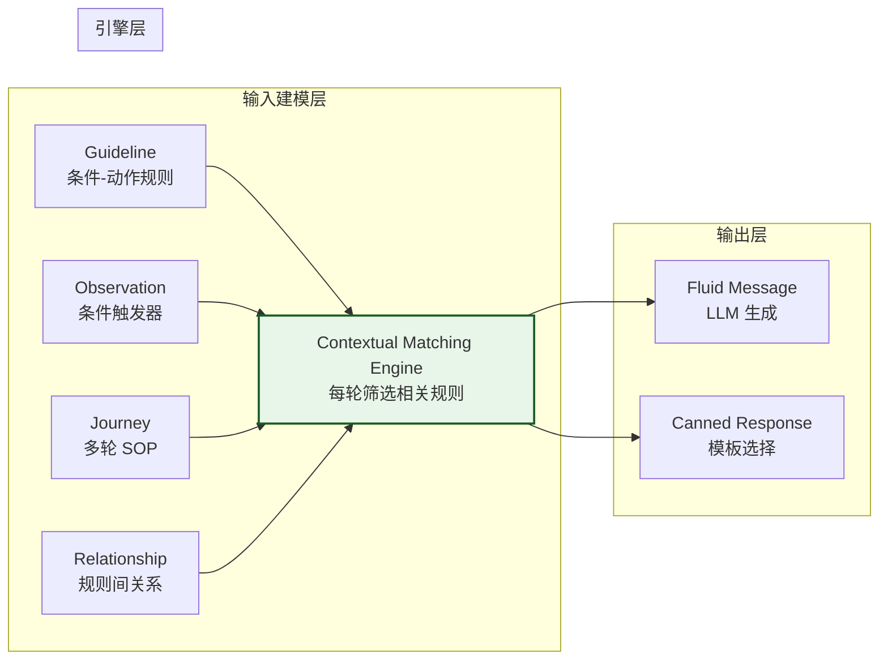
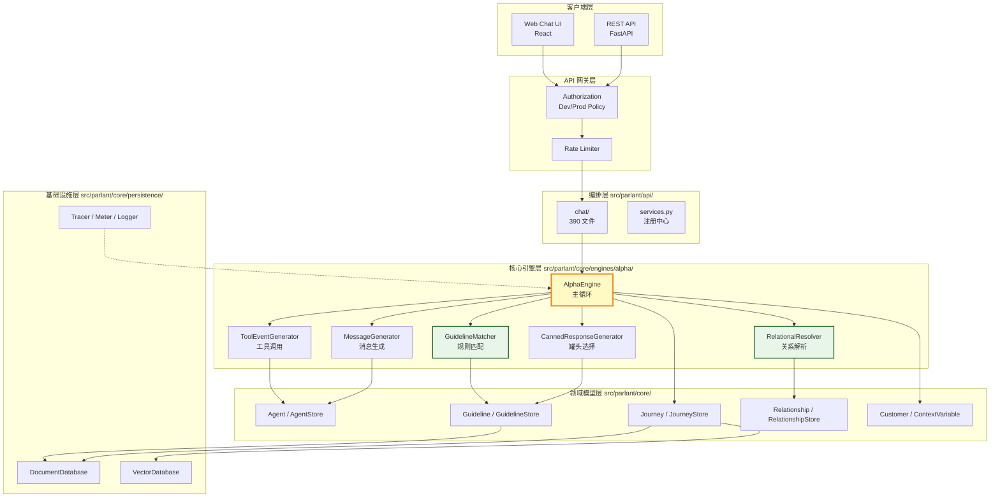
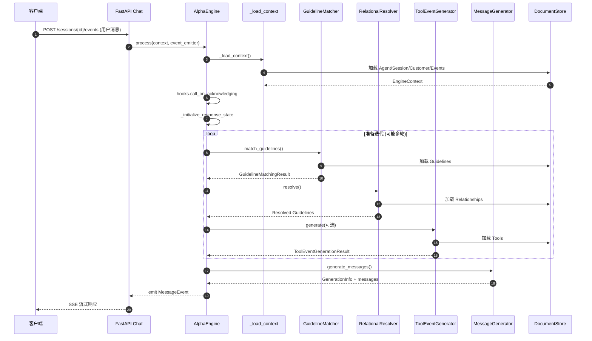
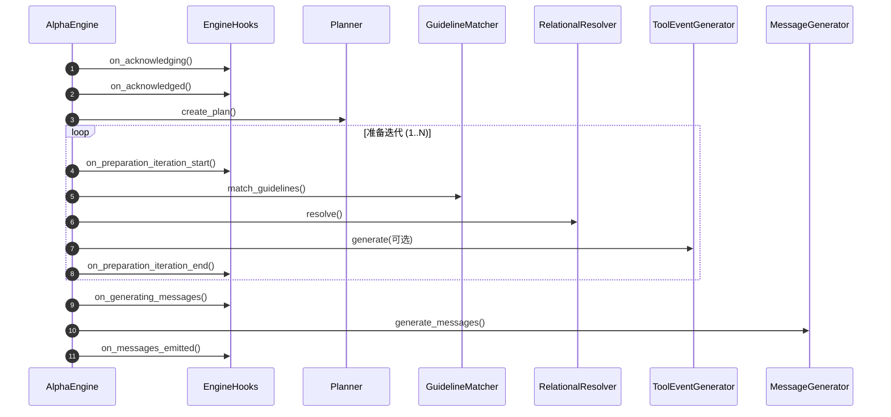
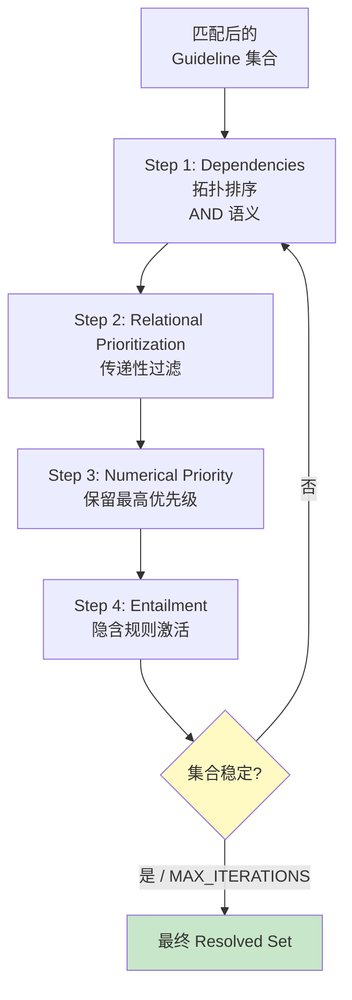
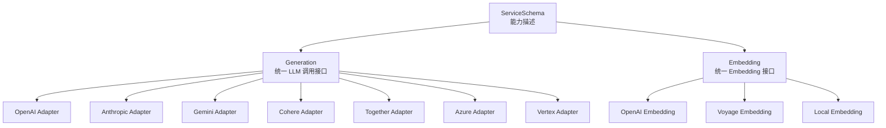
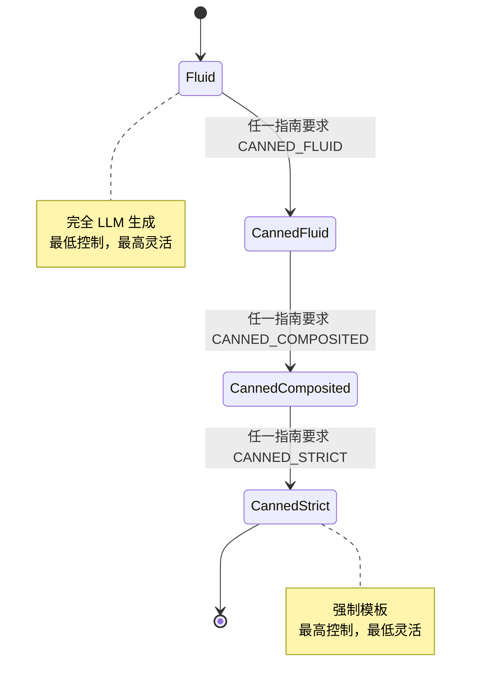
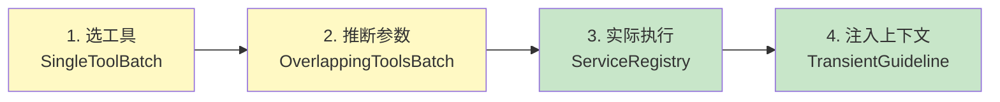
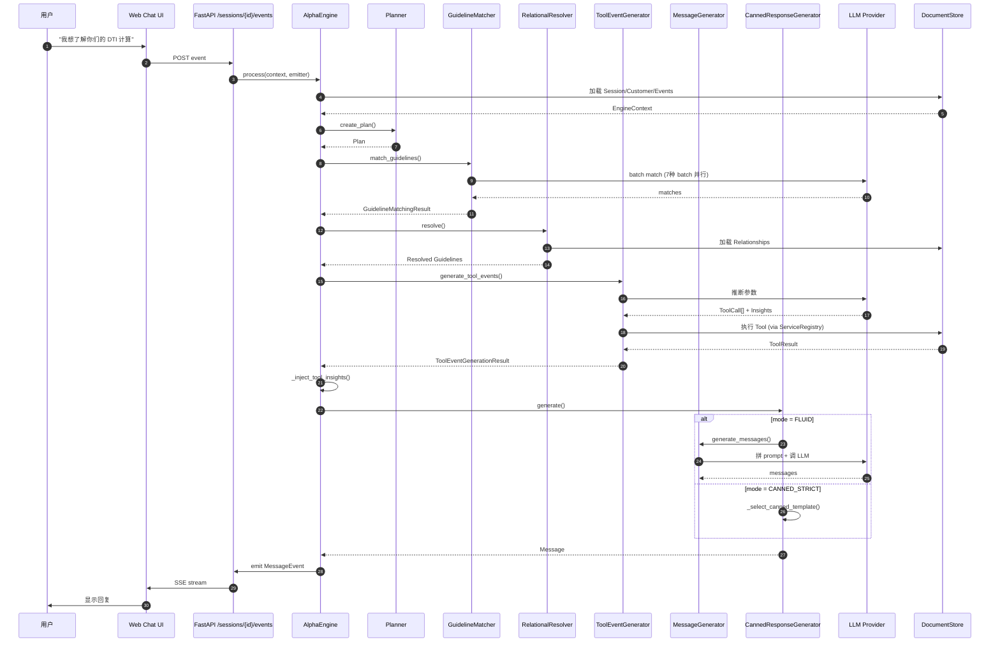
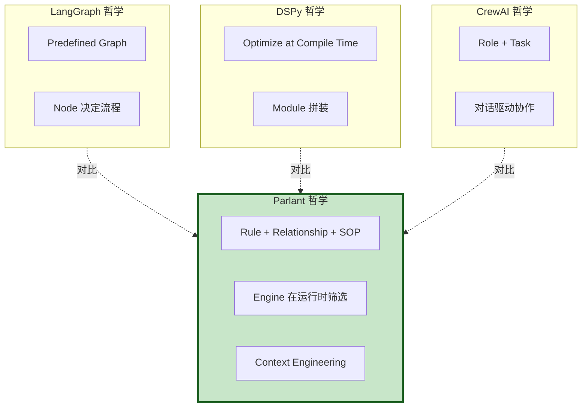

## 一、引子：当 system prompt 撑不住第 51 条规则时

2026 年，AI Agent 走进客服、销售、银行的真实生产线，几乎所有团队都会撞上同一面墙：**写完第 20 条 system prompt 规则时，模型开始 "顾此失彼"；写到第 50 条时，对齐率断崖式下降**。这就是著名的 "Lost-in-the-Middle" 与 "Instruction Dilution" 问题。

传统解法是 **Routed Graphs（路由图）**：用 if-else 把不同问题路由到不同 prompt。但对话是非线性的，用户会突然切换话题、跳步、重复提问 —— 路由图越复杂，越脆弱。

[emcie-co/parlant](https://github.com/emcie-co/parlant) 走了一条完全不同的路。它不靠 prompt 容量或路由图，而是把 **"行为控制" 作为一等公民** —— 用 **Guideline（条件-动作规则）+ Relationship（规则间依赖/排斥）+ Journey（多轮 SOP 状态机）+ CompositionMode（流体/罐头模式切换）** 四件套，把 "运行时只把当前相关的规则注入 LLM 上下文" 做成引擎级的硬约束。

> *"By far the most elegant conversational AI framework that I've come across."*
> — Vishal Ahuja, Senior Lead Applied AI, JPMorgan Chase

> *"Parlant dramatically reduces the need for prompt engineering and complex flow control. Building agents becomes closer to domain modeling."*
> — Diogo Santiago, AI Engineer, Oracle

本文用约 4 万字 + 6 张架构图 + 8 段真实源码，全面拆解 Parlant 的架构设计与工程实现。

---

## 二、项目定位与核心价值

### 2.1 一句话定义

**Parlant 是一个 "对话控制引擎"（Conversation Control Engine）**，把客户对话 AI 所需的 **行为治理、合规约束、品牌语调、SOP 流程** 全部建模为 Python 对象，由运行时引擎在每轮对话中**动态筛选**该轮需要注入 LLM 的子集。

### 2.2 它解决什么问题

| 痛点 | 传统做法 | 为什么失效 | Parlant 的解法 |
|------|----------|------------|-----------------|
| 50+ 规则塞 system prompt | 直接拼字符串 | 模型 "Lost-in-the-Middle"，对齐率断崖 | Guideline 引擎**运行时筛选**只相关子集 |
| 规则之间互斥 | Prompt 里写 "if A then not B" | 上下文一长就被忽略 | **Relationship 显式声明** depend_on / priority / entailment |
| 多轮 SOP 偏离 | 路由图/DAG | 对话非线性，路由图僵化 | **Journey 状态机**支持 fast-forward / 回退 / 重新进入 |
| 关键回复必须用审核过的措辞 | Post-processing 替换 | 替换破坏 LLM 流畅度 | **Canned Response 模板**，LLM 只负责选择 |
| 合规审计 | 单独写日志系统 | 跟实际行为脱节 | **OpenTelemetry 全链路追踪**，每条 guideline match 都有 span |

### 2.3 仓库统计

| 指标 | 数值 |
|------|------|
| ⭐ Stars | 18,168（截至 2026-07-08）|
| 🍴 Forks | 1,534 |
| 🐛 Open Issues | 41 |
| 📜 License | Apache-2.0 |
| 💻 Language | Python（85.3MB，含前端 chat UI）|
| 📅 首次提交 | 2024-02-15 |
| 🕐 最近推送 | 2026-06-30（仍活跃）|
| 📦 核心代码 | `src/parlant/core/`（552 个 Python 文件）|
| 🧪 测试代码 | `tests/` 131 个文件 |

### 2.4 核心能力矩阵



- **Guideline**：行为规则 = `condition` + `action`，按相关性动态匹配
- **Observation**：纯条件触发器（没有 action），用于 "先识别再说"
- **Journey**：多轮 SOP，状态机 + 分支条件
- **Relationship**：ENTAILMENT / PRIORITY / DEPENDENCY / DISAMBIGUATION / OVERLAP 五种关系
- **CompositionMode**：FLUID / CANNED_FLUID / CANNED_COMPOSITED / CANNED_STRICT 四种模式
- **OpenTelemetry Tracing**：每条 guideline match / tool call 都有 span

---

## 三、整体架构

### 3.1 顶层架构（6 层）



### 3.2 后端核心数据流



### 3.3 后端服务拆分（src/parlant 目录结构）

```
src/parlant/
├── core/                      # 领域核心（552 文件）
│   ├── agents.py              # Agent 实体 + AgentStore
│   ├── guidelines.py          # Guideline 实体 + GuidelineStore
│   ├── journeys.py            # Journey 状态机
│   ├── relationships.py       # 五种 RelationshipKind
│   ├── sessions.py            # 会话/事件模型
│   ├── tools.py               # 工具抽象
│   ├── persistence/           # 文档/向量数据库抽象
│   ├── engines/
│   │   ├── types.py           # Engine ABC
│   │   └── alpha/             # 默认引擎实现
│   │       ├── engine.py      # AlphaEngine 主循环
│   │       ├── guideline_matching/
│   │       ├── tool_calling/
│   │       ├── prompt_builder.py
│   │       └── ...
│   └── ...
├── api/                       # FastAPI 接口层（408 文件）
│   ├── app.py
│   ├── chat/                  # 聊天接口
│   ├── agents.py
│   ├── guidelines.py
│   ├── journeys.py
│   └── ...
├── adapters/                  # 数据库/向量库/LLM 适配
│   ├── db/                    # JSONFile / Transient
│   ├── vector_db/
│   └── nlp/                   # OpenAI/Anthropic/Gemini
├── bin/                       # CLI 入口
└── sdk.py                     # Python SDK（213KB，10+ 万字符）
```

---

## 四、核心抽象：六大数据模型

Parlant 把对话治理拆成 6 个独立存储、引擎在每轮动态组合。

### 4.1 Agent（智能体）

```python
# 来自 src/parlant/core/agents.py:55-70
class CompositionMode(Enum):
    FLUID = "fluid"                    # 纯 LLM 生成
    CANNED_FLUID = "canned_fluid"      # 优先模板，兜底 LLM
    CANNED_COMPOSITED = "canned_composited"  # LLM 选模板 + 拼接
    CANNED_STRICT = "canned_strict"    # 强制用模板，禁止 LLM

@dataclass(frozen=True)
class Agent:
    id: AgentId
    name: str
    description: Optional[str]
    creation_utc: datetime
    max_engine_iterations: int          # 准备阶段最多迭代几轮
    tags: Sequence[TagId]
    composition_mode: CompositionMode = CompositionMode.FLUID
    message_output_mode: MessageOutputMode = MessageOutputMode.BLOCK
```

**关键设计**：`max_engine_iterations` 让 Agent 配置 "愿意花多少 LLM call 来收集上下文" —— 简单客服可以设 1，高合规场景可以设 3。

### 4.2 Guideline（行为规则）

```python
# 来自 src/parlant/core/guidelines.py:45-77
@dataclass(frozen=True)
class GuidelineContent:
    condition: str
    action: Optional[str]
    description: Optional[str] = field(default=None)

@dataclass(frozen=True)
class Guideline:
    id: GuidelineId
    creation_utc: datetime
    content: GuidelineContent
    enabled: bool
    tags: Sequence[TagId]
    metadata: Mapping[str, JSONSerializable]
    criticality: Criticality
    title: Optional[str] = None
    labels: Set[str] = field(default_factory=set)
    composition_mode: Optional[CompositionMode] = None
    track: bool = True                  # 是否记入 OTel trace
    priority: int = 0

    def __str__(self) -> str:
        if self.content.condition and self.content.action:
            return f"When {self.content.condition}, then {self.content.action}"
        elif self.content.condition:
            return f"Observation: {self.content.condition}"
        elif self.content.action:
            return self.content.action
        else:
            raise Exception("Invalid guideline content")
```

**关键设计**：
- `condition + action` 模式 —— 行为规则 = "触发条件 + 应对动作"
- **Observation** = 只有 condition 没有 action（"先识别再说"）
- `priority` 数值 + `criticality` 标签，双重优先级机制
- `track=False` 可关闭追踪，减少生产日志噪音

### 4.3 Relationship（规则间关系）

这是 Parlant 最精妙的设计 —— **5 种关系类型**显式建模规则间的依赖：

```python
# 来自 src/parlant/core/relationships.py:41-83
class RelationshipKind(Enum):
    ENTAILMENT = "entailment"
    """当 SOURCE 激活时，TARGET 必须激活（隐含）。"""

    PRIORITY = "priority"
    """当 SOURCE 和 TARGET 都激活时，只保留 SOURCE（互斥优先）。"""

    DEPENDENCY = "dependency"
    """SOURCE 激活时，必须 TARGET 也激活（AND 语义）。"""

    DEPENDENCY_ANY = "dependency_any"
    """SOURCE 激活时，至少一个 TARGET 激活（OR 语义，group_id 分组）。"""

    DISAMBIGUATION = "disambiguation"
    """SOURCE 激活 + 多个 TARGET 激活时，反问用户澄清。"""

    REEVALUATION = "reevaluation"
    """TARGET 工具执行后，重新评估 SOURCE 规则。"""

    OVERLAP = "overlap"
    """SOURCE 和 TARGET 工具同批评估，避免冲突。"""
```

**实际使用示例**（来自 README）：

```python
# 来自 README 文档示例
for_experts = await agent.create_guideline(
    condition="customer uses financial terminology",
    action="respond with technical depth",
)

for_beginners = await agent.create_guideline(
    condition="customer seems new to the topic",
    action="simplify and use concrete examples",
)

# 冲突时显式声明优先级
await for_beginners.prioritize_over(for_experts)
# 等价于：await for_beginners.exclude(for_experts)
```

**关键设计**：把规则间关系做成**持久化对象**而不是临时 prompt，可以跨 turn、跨 session 复用、可以版本管理、可以可视化。

### 4.4 Journey（多轮 SOP 状态机）

```python
# 来自 src/parlant/core/journeys.py:60-95
@dataclass(frozen=True)
class JourneyNode:
    id: JourneyNodeId
    creation_utc: datetime
    action: Optional[str]                    # 此节点的指令
    tools: Sequence[ToolId]                  # 此节点要调的工具
    metadata: Mapping[str, JSONSerializable]
    description: Optional[str] = None
    composition_mode: Optional[CompositionMode] = None
    labels: Set[str] = field(default_factory=set)

@dataclass(frozen=True)
class JourneyEdge:
    id: JourneyEdgeId
    creation_utc: datetime
    source: JourneyNodeId
    target: JourneyNodeId
    condition: Optional[str]                  # 跳转到 target 的条件
    metadata: Mapping[str, JSONSerializable]

@dataclass(frozen=True)
class Journey:
    id: JourneyId
    creation_utc: datetime
    description: str
    triggers: Sequence[GuidelineId]          # 哪些 guideline 激活此 journey
    title: str
    root_id: JourneyNodeId
    tags: Sequence[TagId]
    composition_mode: Optional[CompositionMode] = None
    labels: Set[str] = field(default_factory=set)
    priority: int = 0
```

**关键设计**：
- Journey = 有向图（DAG），节点 = 状态，边 = 带条件的跳转
- **triggers** = 哪些 Guideline 激活此 Journey（解耦了"识别意图"和"执行 SOP"）
- 节点可以挂 `tools`，激活节点时引擎自动调用工具
- `composition_mode` 节点级覆盖 —— 关键节点强制 CANNED_STRICT

### 4.5 Session / Event（会话状态机）

会话用 **Event Sourcing 模式**记录：

```python
# 来自 src/parlant/core/sessions.py
class EventKind(Enum):
    CUSTOMER = "customer"           # 用户消息
    AGENT = "agent"                 # Agent 消息
    TOOL = "tool"                   # 工具调用/结果
    STATUS = "status"               # ready/processing/error
    GUIDELINE_MATCH = "guideline_match"  # 哪些规则被匹配
    JOURNEY_ACTIVATION = "journey_activation"  # 哪些 SOP 激活
```

**关键设计**：把 "规则匹配" 也存为事件 —— **审计员可以回放每轮到底哪些规则生效**，满足金融/医疗合规。

### 4.6 Canned Response（罐头回复）

```python
# 来自 src/parlant/core/canned_responses.py
class CannedResponse:
    id: CannedResponseId
    creation_utc: datetime
    agent_id: AgentId
    template: str                    # 模板（支持 {var} 占位）
    tags: Sequence[TagId]
    fields: Sequence[TemplateField]  # 参数化字段
```

**关键设计**：模板可参数化（`{"customer_name": "..."}`），LLM 选中后引擎做变量替换，**消除关键回复的措辞漂移**。

---

## 五、核心引擎一：AlphaEngine 主循环

### 5.1 Engine 抽象

```python
# 来自 src/parlant/core/engines/types.py:25-50
@dataclass(frozen=True)
class Context:
    session_id: SessionId
    agent_id: AgentId

class Engine(ABC):
    @abstractmethod
    async def process(
        self,
        context: Context,
        event_emitter: EventEmitter,
    ) -> bool: ...

    @abstractmethod
    async def utter(
        self,
        context: Context,
        event_emitter: EventEmitter,
        requests: Sequence[UtteranceRequest],
    ) -> bool: ...
```

每个 engine 实现一个 `process`（响应用户消息）和 `utter`（主动发消息）方法。当前默认实现是 `AlphaEngine`，未来可能接入 `BetaEngine` / `GammaEngine`（README 暗示），引擎可插拔。

### 5.2 AlphaEngine 构造

```python
# 来自 src/parlant/core/engines/alpha/engine.py:118-160
class AlphaEngine(Engine):
    def __init__(
        self,
        logger: Logger,
        tracer: Tracer,
        meter: Meter,
        health_reporter: HealthReporter,
        entity_queries: EntityQueries,
        entity_commands: EntityCommands,
        guideline_matcher: GuidelineMatcher,
        relational_resolver: RelationalResolver,
        tool_event_generator: ToolEventGenerator,
        fluid_message_generator: MessageGenerator,
        canned_response_generator: CannedResponseGenerator,
        perceived_performance_policy_provider: PerceivedPerformancePolicyProvider,
        planner_provider: PlannerProvider,
        hooks: EngineHooks,
    ) -> None:
        # 注入 14 个依赖
        ...
        # 埋点 OTel metrics
        self._hist_engine_process_duration = self._meter.create_duration_histogram(
            name="eng.process",
            description="Duration of engine processing in milliseconds",
        )
```

**关键设计**：
- **依赖注入 14 个组件**（`lagom.Container` 提供）—— 引擎本身不创建任何依赖
- 所有组件都是 ABC 实现，**单元测试可以 mock 任何一个**
- Meter / Tracer 接入 OpenTelemetry，生产可观测

### 5.3 主循环 `_do_process`

```python
# 来自 src/parlant/core/engines/alpha/engine.py:230-330
async def _do_process(self, context: EngineContext) -> None:
    if not await self._hooks.call_on_acknowledging(context):
        return  # Hook 拒绝继续

    await self._emit_acknowledgement_event(context)

    if not await self._hooks.call_on_acknowledged(context):
        return

    try:
        await self._initialize_response_state(context)

        if not await self._hooks.call_on_preparing(context):
            return

        # Planner 决定如何响应
        plan = await self._planner_provider.get_planner(
            context.agent.id,
        ).create_plan(context)

        # 准备迭代：可能多轮以支持 "工具结果触发新规则" 的反馈循环
        while not context.state.prepared_to_respond:
            preamble_task = await self._get_preamble_task(context)

            if not await self._hooks.call_on_preparation_iteration_start(context):
                break

            iteration_result = await self._run_preparation_iteration(
                context, preamble_task, plan
            )

            if iteration_result.resolution == _PreparationIterationResolution.BAIL:
                return

            # 工具可能改 session mode（如转人工）
            await self._update_session_mode(context)

            if not await self._hooks.call_on_preparation_iteration_end(context):
                break

        # 过滤有问题的工具参数
        await self._inject_tool_insights(context)

        async def uncancellable_section(latch):
            """这段逻辑在 cancel 屏蔽区里跑 —— 避免半完成状态。"""
            if not await self._hooks.call_on_generating_messages(context):
                return

            # 注入工具返回的 transient guideline
            await self._inject_transient_guidelines(context)

            # 触发 on_selected handlers
            await self._call_guideline_handlers(
                context, self._hooks.on_guideline_selected_handlers
            )

            # 钱时刻：调用 LLM 生成消息
            with self._tracer.span(_MESSAGE_GENERATION_SPAN_NAME):
                _ = await self._generate_messages(context, latch)

            await self._emit_ready_event(context, stage="completed")
            ...

        # latched_shield = CancellationSuppression
        await async_utils.latched_shield(uncancellable_section)

    except asyncio.CancelledError:
        # 新消息到达、当前轮作废
        self._logger.warning("Processing cancelled")
        await self._emit_cancellation_event(context)
        await self._emit_ready_event(context, stage="completed")
        raise
```

**关键设计**：
- **Hook 系统**贯穿 6 个时机（acknowledging/acknowledged/preparing/preparation_iteration_*/generating_messages）
- **准备迭代循环**支持"工具结果 → 触发新规则"的反馈链路
- `latched_shield` 屏蔽 cancel，**保证消息生成阶段的原子性**
- 取消时主动 emit 取消事件 + ready 事件，让客户端知道"当前轮作废"

### 5.4 引擎执行的 6 个阶段



---

## 六、核心引擎二：GuidelineMatcher（规则匹配）

### 6.1 匹配策略抽象

```python
# 来自 src/parlant/core/engines/alpha/guideline_matching/guideline_matcher.py
class GuidelineMatchingStrategy(ABC):
    @abstractmethod
    async def create_matching_batches(
        self,
        guidelines: Sequence[Guideline],
        context: GuidelineMatchingContext,
    ) -> Sequence[GuidelineMatchingBatch]: ...

    @abstractmethod
    async def create_response_analysis_batches(...): ...

    @abstractmethod
    async def transform_matches(...): ...
```

**关键设计**：不同 Guideline 用不同策略匹配。`strategy_resolver.resolve(guideline)` 按 Guideline 特征选策略。

### 6.2 默认策略：GenericGuidelineMatchingStrategy

把 Guidelines 分成 7 种 batch 类型，并行处理：

| Batch | 用途 | 位置 |
|-------|------|------|
| `observational_batch.py` | 只有 condition 没有 action 的 observation | `guideline_matching/generic/` |
| `guideline_actionable_batch.py` | 普通 condition + action | 同上 |
| `guideline_low_criticality_batch.py` | 低 criticality 规则（背景规则） | 同上 |
| `guideline_previously_applied_actionable_batch.py` | 之前应用过的规则 | 同上 |
| `guideline_previously_applied_actionable_customer_dependent_batch.py` | 依赖 customer 状态的 | 同上 |
| `disambiguation_batch.py` | 需要消歧的 | 同上 |
| `response_analysis_batch.py` | 响应分析（检查 LLM 输出） | 同上 |

### 6.3 匹配主流程

```python
# 来自 src/parlant/core/engines/alpha/guideline_matching/guideline_matcher.py:175-220
async def match_guidelines(
    self,
    context: EngineContext,
    active_journeys: Sequence[Journey],
    guidelines: Sequence[Guideline],
) -> GuidelineMatchingResult:
    if not guidelines:
        return GuidelineMatchingResult(0.0, 0, [], [], [])

    t_start = time.time()
    with self._logger.scope("GuidelineMatcher"):
        async with self._hist_match_duration.measure():
            # 1) 按策略分组
            guideline_strategies: dict[int, tuple[GuidelineMatchingStrategy, list[Guideline]]] = {}
            for guideline in guidelines:
                strategy = await self.strategy_resolver.resolve(guideline)
                strategy_id = id(strategy)
                guideline_strategies.setdefault(strategy_id, (strategy, []))[1].append(guideline)

            matching_context = GuidelineMatchingContext(
                agent=context.agent,
                session=context.session,
                customer=context.customer,
                context_variables=context.state.context_variables,
                interaction_history=context.interaction.events,
                terms=list(context.state.glossary_terms),
                capabilities=context.state.capabilities,
                staged_events=context.state.tool_events,
                active_journeys=active_journeys,
                journey_paths=context.state.journey_paths,
            )

            # 2) 每种策略并行创建 batches
            batches = await async_utils.safe_gather(
                *[
                    strategy.create_matching_batches(guidelines, context=matching_context)
                    for _, (strategy, guidelines) in guideline_strategies.items()
                ]
            )

            # 3) 所有 batches 并行处理（带重试策略）
            batch_tasks = [
                self._process_guideline_matching_batch_with_retry(batch)
                for strategy_batches in batches
                for batch in strategy_batches
            ]
            batch_results = await async_utils.safe_gather(*batch_tasks)

    t_end = time.time()

    result_batches = [result.matches for result in batch_results]
    matches: Sequence[GuidelineMatch] = list(chain.from_iterable(result_batches))

    # 4) 每种策略做 match 转换（如合并同义匹配）
    for strategy, _ in guideline_strategies.values():
        matches = await strategy.transform_matches(matches)

    return GuidelineMatchingResult(
        total_duration=t_end - t_start,
        batch_count=sum(map(len, batches)),
        batch_generations=[result.generation_info for result in batch_results],
        batches=result_batches,
        matches=matches,
    )
```

**关键设计**：
- **3 级并行**：策略级 → batch 级 → batch 内 LLM 调用
- `@policy([retry(exceptions=Exception, max_exceptions=3)])` 自动重试失败的 batch
- `safe_gather` 而非 `asyncio.gather` —— 单个 batch 失败不连带整个匹配
- 7 种 batch 类型分别处理不同场景，**避免"一刀切"的 prompt**

### 6.4 响应分析（Response Analysis）

除了"哪些规则该激活"，还要分析 **"LLM 的草稿回复是否违反规则"**：

```python
# 来自 src/parlant/core/engines/alpha/guideline_matching/guideline_matcher.py:227-280
async def analyze_response(
    self,
    agent, session, customer, context_variables,
    interaction_history, terms,
    staged_tool_events, staged_message_events,
    guideline_matches: Sequence[GuidelineMatch],
) -> ResponseAnalysisResult:
    # 同样按策略分 batch 并行处理
    ...
    return ResponseAnalysisResult(
        total_duration=t_end - t_start,
        batch_count=len(batch_results),
        batch_generations=[result.generation_info for result in batch_results],
        batches=[result.analyzed_guidelines for result in batch_results],
    )
```

**关键设计**：把"检查"和"生成"解耦 —— LLM 先草拟，再用另一批 LLM call 检查是否符合规则，**双保险**。

---

## 七、核心引擎三：RelationalResolver（关系解析）

### 7.1 设计哲学

```python
# 来自 src/parlant/core/engines/alpha/relational_resolver.py:1-25
"""
Resolves relationships between matched guidelines, including dependencies,
priorities, and entailment. The resolver iterates until stable, applying
each step in order:

  1. **Dependencies** — Filter guidelines whose dependency targets are not met.
     Uses topological sorting for single-pass resolution within each iteration.
  2. **Relational prioritization** — Filter guidelines that are deprioritized by
     higher-priority guidelines, tags, or journeys. Includes transitive filtering
     of guidelines that depend on deprioritized entities.
  3. **Numerical priority** — Keep only entities at the highest priority level.
     Runs before entailment so that entailed guidelines cannot cause their
     entailer to be filtered by having a higher priority.
  4. **Entailment** — Activate additional guidelines implied by matched ones.

The iteration loop (steps 1–4) runs until the set of matches stabilizes or
MAX_ITERATIONS is reached. This handles cross-step interactions, e.g. when
priority filtering removes a guideline that was a dependency target.
"""
```

### 7.2 4 步定点迭代



### 7.3 关键：处理交叉影响

考虑这个场景：
- A → PRIORITY → B（A 比 B 优先）
- C → DEPENDENCY → B（C 依赖 B）
- A 激活

**朴素处理**会：
1. A、B、C 都激活（初始匹配）
2. PRIORITY 过滤掉 B（B 被 A 优先）
3. C 现在依赖 B 不存在 → C 失效

**Parlant 的迭代**：
1. 初始：A、B、C 激活
2. Step 2：去掉 B（被 A 优先）
3. Step 1：C 依赖 B 失效，去掉 C
4. 不稳定 → 下一轮
5. A 不变 → 稳定

**传递性过滤**显式处理"上游规则被过滤 → 下游依赖全部失效"的链式反应。

### 7.4 ResolvedEntity 类型化

```python
# 来自 src/parlant/core/engines/alpha/relational_resolver.py:75-95
@dataclass(frozen=True)
class ResolvedEntity:
    entity_type: Literal["guideline", "journey", "tag"]
    entity: Guideline | Journey | Tag

    def __hash__(self) -> int:
        return hash((self.entity_type, self.entity.id))

    def __eq__(self, other: object) -> bool:
        return (
            isinstance(other, ResolvedEntity)
            and self.entity_type == other.entity_type
            and self.entity.id == other.entity.id
        )

    @classmethod
    def guideline(cls, g: Guideline) -> ResolvedEntity:
        return cls(entity_type="guideline", entity=g)
```

**关键设计**：用类型化包装 + 工厂方法，**让 Guideline/Journey/Tag 混在同一个集合里还能正确哈希**。

### 7.5 解析结果分类

```python
# 来自 src/parlant/core/engines/alpha/relational_resolver.py:97-130
class ResolutionKind(str, Enum):
    NONE = "none"                          # 无变化
    UNMET_DEPENDENCY_ALL = "unmet_dependency_all"  # 因 AND 依赖失败而移除
    UNMET_DEPENDENCY_ANY = "unmet_dependency_any"  # 因 OR 依赖失败而移除
    DEPRIORITIZED = "deprioritized"        # 因更高优先级被去
    ENTAILED = "entailed"                  # 因 entailment 被添加
```

**关键设计**：每条 guideline 去留都有原因 —— **审计员能精确回答"为什么这条规则没生效"**。

---

## 八、Provider 抽象层

### 8.1 NLP Service 三级抽象

Parlant 的 LLM 抽象分 3 层（`src/parlant/core/nlp/`）：



**关键设计**：
- `Generation` 接口（统一 prompt 拼装/响应解析）→ 屏蔽各家 LLM 差异
- `Embedding` 接口（统一向量生成）
- `ServiceSchema` 描述每个 Provider 支持的能力（tool calling / JSON mode / streaming）

### 8.2 ServiceRegistry 工具调用

工具调用有专门的服务注册中心（`src/parlant/core/services/tools/service_registry.py`）：

```python
# 来自 src/parlant/core/services/tools/service_registry.py
class ServiceRegistry:
    """Centralized registry of tool services (SDK integrations)."""

    async def register_tool(self, tool: Tool) -> None: ...
    async def get_tool(self, tool_id: ToolId) -> Tool: ...
    async def list_tools(self) -> Sequence[Tool]: ...
    async def call_tool(self, tool_id: ToolId, context: ToolContext) -> ToolResult: ...
```

**关键设计**：第三方 SDK（Slack / Salesforce / Stripe）通过 ToolService 接口注册，Parlant 引擎只跟 ServiceRegistry 对话。

---

## 九、CompositionMode：四态输出模式

### 9.1 四种模式



### 9.2 模式切换机制

`CompositionMode` 可以设 **3 个层级**：
1. **Agent 级默认**（`Agent.composition_mode`）
2. **Guideline 级覆盖**（`Guideline.composition_mode`）
3. **Journey Node 级覆盖**（`JourneyNode.composition_mode`）

引擎**取最严格的层级**应用：

```python
# 来自 src/parlant/core/engines/alpha/canned_response_generator.py
async def generate(self, context) -> GenerationResult:
    # 1) 计算 effective_composition_mode = strictest 层级
    effective_mode = self._compute_effective_mode(context)

    # 2) 根据 mode 选不同生成路径
    if effective_mode == CompositionMode.CANNED_STRICT:
        # 只用模板，禁用 LLM
        return await self._strict_canned_path(context)
    elif effective_mode == CompositionMode.CANNED_COMPOSITED:
        # LLM 选模板 + 拼接
        return await self._composited_canned_path(context)
    elif effective_mode == CompositionMode.CANNED_FLUID:
        # 优先模板，兜底 LLM
        return await self._fluid_canned_path(context)
    else:  # FLUID
        return await self._pure_fluid_path(context)
```

**关键设计**：
- **整通对话** = 流体模式（自然流畅）
- **某个 guideline 触发** → 该 turn 切到 canned 模式
- **某个 journey 节点**（如 "确认订单"） → 强制 strict
- 三层叠加，**开发者可以局部精确控制**

### 9.3 实际使用示例

```python
# 来自 README 文档示例
await agent.create_guideline(
    condition="The customer discusses things unrelated to our business",
    action="Tell them you can't help with that",
    # 该规则匹配时强制 strict
    composition_mode=p.CompositionMode.CANNED_STRICT,
    canned_responses=[
        await agent.create_canned_response("Sorry, but I can't help you with that.")
    ],
    priority=100,  # 顶级优先级
)
```

---

## 十、ToolEventGenerator（工具事件生成）

### 10.1 工具调用的 3 阶段



### 10.2 三种 Batch 类

| Batch | 文件 | 大小 | 职责 |
|-------|------|------|------|
| `SingleToolBatch` | `single_tool_batch.py` | 100KB | 单个 tool 独立调用 |
| `OverlappingToolsBatch` | `overlapping_tools_batch.py` | 40KB | 多个有 OVERLAP 关系的 tool 一起评估 |
| `DefaultToolCallBatcher` | `default_tool_call_batcher.py` | 8.3KB | 批量调度 |

### 10.3 Tool Insights：参数问题分类

```python
# 来自 src/parlant/core/engines/alpha/tool_calling/tool_caller.py:75-110
@dataclass(frozen=True, kw_only=True)
class ProblematicToolData:
    parameter: str
    significance: Optional[str] = field(default=None)
    description: Optional[str] = field(default=None)
    examples: Optional[Sequence[str]] = field(default=None)
    precedence: Optional[int] = field(default=DEFAULT_PARAMETER_PRECEDENCE)
    choices: Optional[Sequence[str]] = field(default=None)

@dataclass(frozen=True, kw_only=True)
class MissingToolData(ProblematicToolData):
    pass

@dataclass(frozen=True, kw_only=True)
class InvalidToolData(ProblematicToolData):
    invalid_value: str

class ToolCallEvaluation(Enum):
    NEEDS_TO_RUN = "success"                   # 工具调用成功
    DATA_ALREADY_IN_CONTEXT = "data_already_in_context"  # 跳过，数据已在上下文
    CANNOT_RUN = "cannot_run"                  # 缺少/无效参数

@dataclass(frozen=True)
class ToolInsights:
    evaluations: Sequence[tuple[ToolId, ToolCallEvaluation]] = field(default_factory=list)
    missing_data: Sequence[MissingToolData] = field(default_factory=list)
    invalid_data: Sequence[InvalidToolData] = field(default_factory=list)
```

**关键设计**：把"工具调用失败"细分为 **缺数据 / 数据无效 / 已存在** 三种，**每种给 LLM 不同 prompt 修正**。

### 10.4 TransientGuideline 工具反馈注入

工具返回后引擎可以注入"transient guideline"（不持久化）到下一轮 context：

```python
# 来自 src/parlant/core/tools.py
class TransientGuideline:
    """A guideline that's added to context dynamically, not persisted."""
    content: GuidelineContent
    source: str  # "tool:query_docs" or similar
```

**关键设计**：工具调用结果**直接变 context 的一部分**，而不是被 LLM "加工" 过的版本 —— **减少 LLM 编造**。

---

## 十一、持久化层

### 11.1 文档数据库抽象

```python
# 来自 src/parlant/core/persistence/document_database.py
class DocumentDatabase(ABC):
    @abstractmethod
    async def get_collection(self, name: str) -> DocumentCollection: ...
    @abstractmethod
    async def create_collection(self, name: str, schema: Type[BaseDocument]) -> DocumentCollection: ...
    @abstractmethod
    async def migrate(self, target_version: Version) -> None: ...
```

### 11.2 三种实现

| 适配器 | 文件 | 用途 |
|--------|------|------|
| `JSONFileDocumentDatabase` | `adapters/db/json_file.py` | 本地开发，单机 JSON 文件 |
| `TransientDocumentDatabase` | `adapters/db/transient.py` | 测试用，内存 |
| 未来可扩展 | PostgreSQL/MongoDB | 生产可插拔 |

### 11.3 版本迁移系统

```python
# 来自 src/parlant/core/agents.py:139-180
class AgentDocumentStore(AgentStore):
    VERSION = Version.from_string("0.5.0")

    async def _document_loader(self, doc: BaseDocument) -> Optional[_AgentDocument]:
        async def v0_1_0_to_v0_2_0(doc: BaseDocument) -> Optional[BaseDocument]:
            raise Exception(
                "This code should not be reached! "
                "Please run the 'parlant-prepare-migration' script."
            )

        async def v0_2_0_to_v0_3_0(doc: BaseDocument) -> Optional[BaseDocument]:
            raise Exception(...)

        async def v0_3_0_to_v0_4_0(doc: BaseDocument) -> Optional[BaseDocument]:
            doc = cast(_AgentDocument, doc)
            if doc["version"] == "0.3.0":
                # 重命名枚举值
                utterance_to_canned_response_composition_mode = {
                    "fluid": CompositionMode.FLUID.value,
                    "fluid_utterance": CompositionMode.CANNED_FLUID.value,
                    "composited_utterance": CompositionMode.CANNED_COMPOSITED.value,
                    "strict_utterance": CompositionMode.CANNED_STRICT.value,
                }
                return _AgentDocument(...)
```

**关键设计**：
- 每个 EntityStore 都有 `VERSION` 字段
- 升级时运行 `parlant-prepare-migration` 脚本做离线数据迁移
- 文档 schema 演进有**显式路径**，不是 ad-hoc 改字段

---

## 十二、OpenTelemetry 全链路追踪

### 12.1 Span 体系

```python
# 来自 src/parlant/core/engines/alpha/engine.py:50-55
_PREPARATION_ITERATION_SPAN_NAME = "preparation_iteration_{iteration_number}"
_GUIDELINE_MATCHER_SPAN_NAME = "guideline_matcher"
_RESPONSE_ANALYSIS_SPAN_NAME = "response_analysis"
_MESSAGE_GENERATION_SPAN_NAME = "message_generation"
_TOOL_CALLER_SPAN_NAME = "tool_caller"
```

### 12.2 Tracer / Meter / Health Reporter 三件套

```python
# 来自 src/parlant/core/engines/alpha/engine.py:118-160
self._tracer = tracer                     # OTel span
self._meter = meter                       # OTel metrics
self._health_reporter = health_reporter   # 健康检查

# 创建直方图
self._hist_engine_process_duration = self._meter.create_duration_histogram(
    name="eng.process",
    description="Duration of engine processing in milliseconds",
)
```

**关键设计**：
- **3 个观测维度**：trace（请求路径）/ metric（聚合指标）/ health（健康检查）
- 每个 Span 用具体业务名（`guideline_matcher` 而非 `llm_call_1`）
- `ENGINE_TURN_KIND` + `ENGINE_TURNS_COUNTER` 标准化 turn 指标

### 12.3 Hook 系统作为扩展点

```python
# 来自 src/parlant/core/engines/alpha/hooks.py
class EngineHooks:
    @property
    def on_acknowledging_handlers(self) -> ...: ...
    @property
    def on_acknowledged_handlers(self) -> ...: ...
    @property
    def on_preparing_handlers(self) -> ...: ...
    @property
    def on_preparation_iteration_start_handlers(self) -> ...: ...
    @property
    def on_preparation_iteration_end_handlers(self) -> ...: ...
    @property
    def on_generating_messages_handlers(self) -> ...: ...
    @property
    def on_messages_emitted_handlers(self) -> ...: ...
    @property
    def on_guideline_selected_handlers(self) -> ...: ...
    @property
    def on_guideline_message_handlers(self) -> ...: ...
    @property
    def on_journey_selected_handlers(self) -> ...: ...
    @property
    def on_journey_message_handlers(self) -> ...: ...
    @property
    def on_error_handlers(self) -> ...: ...
```

**关键设计**：11 个 Hook 时机 + 3 类 entity-specific handler（guideline/journey），**任何步骤都能拦截**。

---

## 十三、SDK 入口：214KB 的 Parlant API

`src/parlant/sdk.py` 是用户接触 Parlant 的唯一入口（214KB，10+ 万字符），提供 Pythonic 链式 API。

### 13.1 Server 启动

```python
# 来自 src/parlant/sdk.py 与 README
import parlant.sdk as p

async with p.Server():
    agent = await server.create_agent(
        name="Customer Support",
        description="Handles customer inquiries for an airline",
    )
```

### 13.2 Guideline 创建（含依赖）

```python
# 来自 README 与 sdk.py
expert_customer = await agent.create_observation(
    condition="customer uses financial terminology like DTI or amortization",
    tools=[research_deep_answer],
)

expert_answers = await agent.create_guideline(
    matcher=p.MATCH_ALWAYS,
    action="respond with technical depth",
    dependencies=[expert_customer],     # ← 依赖
)

beginner_answers = await agent.create_guideline(
    condition="customer seems new to the topic",
    action="simplify and use concrete examples",
)

# 冲突时显式声明优先级
await beginner_answers.prioritize_over(expert_customer)
```

### 13.3 Journey SOP 定义

```python
# 来自 README
journey = await agent.create_journey(
    title="Book Flight",
    description="Guide the customer through flight booking",
    conditions=["customer wants to book a flight"],
)

t0 = await journey.initial_state.transition_to(
    chat_state="See if they're interested in last-minute deals",
)

# 分支 A：不感兴趣
t1 = await t0.target.transition_to(
    chat_state="Determine where they want to go and when",
    condition="They aren't interested",
)

# 分支 B：感兴趣
t2 = await t0.target.transition_to(
    tool_state=load_latest_flight_deals,    # 节点级 tool 挂载
    condition="They are",
)

t3 = await t1.target.transition_to(
    chat_state="List deals and see if they're interested",
)
```

### 13.4 Tool + Observation 绑定

```python
# 来自 README
@p.tool
async def query_docs(context: p.ToolContext, user_query: str) -> p.ToolResult:
    results = search_knowledge_base(user_query)
    return p.ToolResult(results)

# Tool 通过 Observation 激活
await agent.create_observation(
    condition="customer asks about service features",
    tools=[query_docs],
)
```

**关键设计**：
- **Tool 不直接挂 agent**，必须通过 observation 触发
- 解决了传统 LLM tool 调用的 "false positive" 问题（用户没问就给一堆工具）

---

## 十四、端到端数据流（单轮对话）



---

## 十五、与同类项目对比

### 15.1 横向对比表

| 维度 | **Parlant** | **LangGraph** | **DSPy** | **CrewAI** | **AutoGen** | **OpenAI Agents SDK** |
|------|-------------|---------------|----------|------------|-------------|----------------------|
| ⭐ Stars | 18k | 37k | 27k | 55k | 60k | 27k |
| 定位 | 对话治理 | 工作流编排 | Prompt 优化 | 多 Agent 协作 | 对话驱动多 Agent | Handoffs 协议 |
| 核心抽象 | Guideline/Relationship/Journey | Graph/Node/Edge | Signature/Module | Role/Task/Crew | GroupChat/Agent | Agent/Handoff |
| 规则建模 | 5 种关系 + 数值优先级 | 边条件 | 编译时优化 | 无显式关系 | 隐式 | 无显式关系 |
| 行为控制 | 4 态 CompositionMode | 节点固定逻辑 | 编译生成 | Role 描述 | Agent 描述 | Instructions |
| SOP | Journey 状态机 | 任意图 | 无 | Process 序列 | GroupChat 模式 | 无 |
| 合规审计 | Event Sourcing + OTel | 自定义 | 无 | 自定义 | 自定义 | Tracing API |
| 罐头回复 | 模板 + 参数化 | 无 | 无 | 无 | 无 | 无 |
| 学习曲线 | 中（领域建模思维） | 中（图思维） | 高（编译思维） | 低（角色思维） | 低（对话思维） | 低（函数思维） |
| 最佳场景 | 客户对话 / 合规 / 银行 | 通用工作流 | 优化类应用 | 创意协作 | 研究 demo | 简单 handoff |

### 15.2 设计差异分析

**Parlant vs LangGraph**：
- LangGraph = "画工作流图"：开发者预定义节点和边，对话偏离图就僵
- Parlant = "定义行为 + 让引擎选"：开发者定义规则，引擎**运行时**决定执行哪条

**Parlant vs DSPy**：
- DSPy = "编译时优化 prompt"：离线调 LLM 调用链路
- Parlant = "运行时选规则"：每轮对话动态选相关 guideline

**Parlant vs CrewAI/AutoGen**：
- 这些 = "角色对话驱动"：Agent 之间自由对话产生方案
- Parlant = "规则驱动 + SOP 兜底"：每步行为有规则可循，不确定性低

**Parlant vs OpenAI Agents SDK**：
- 后者 = "Handoffs 协议"：把控制权交给哪个 Agent
- Parlant = "Single Agent + 丰富行为控制"：一个 Agent + 100 条 guideline

### 15.3 核心设计哲学对比



**Parlant 核心哲学**：把"对话 AI"当成 **运行时上下文工程（Runtime Context Engineering）问题**，而不是 prompt 容量问题或 workflow 编排问题。**每轮只把相关的规则注入 LLM**。

---

## 十六、优缺点分析

### 16.1 两侧对比

| 维度 | ⬅️ 架构简洁性 / 扩展性 / 易用性 | ➡️ 性能 / 复杂度 / 维护性 |
|------|-------------------------------|--------------------------|
| **优势** | • 6 个独立 Store 可独立测试和扩展<br/>• 14 个依赖注入让 mock 极简<br/>• 7 种 batch 类型 + 3 层 priority 表达力强<br/>• 4 态 CompositionMode 局部精确控制<br/>• Journey 状态机比 LangGraph 简单<br/>• 11 个 Hook 扩展点 | • 准备迭代可能 N 轮 LLM call，延迟高<br/>• Guideline 多了匹配成本线性增长<br/>• Dependency 拓扑排序 + 4 步定点迭代是 O(n²) 风险<br/>• CannedResponse 模板维护成本<br/>• Event Sourcing 存储膨胀 |
| **劣势** | • 学习曲线在 "建模思维"（不是 prompt 思维）<br/>• Relationship 5 种类型需要时间理解<br/>• 多抽象层（Agent/Guideline/Journey/Tag/Relationship）对小白陡峭<br/>• CompositionMode 状态机心智负担 | • 运行时开销大（每轮 LLM 多次调用）<br/>• CannedResponse 模板写多难维护<br/>• 调试复杂（需要追踪多 batch 结果）<br/>• Journey 状态多时性能下降 |

### 16.2 何时选 Parlant

✅ **适合**：
- 客服 / 销售 / 银行业务（强合规、必须可解释）
- 有 50+ 行为规则的复杂对话
- 需要"哪些规则生效可审计"
- SOP 是核心需求（开户/理赔/预约）
- 关键回复需要用审核过的措辞

❌ **不适合**：
- 简单的 Q&A 机器人（用 LangChain 即可）
- 创意 / 自由对话（用 CrewAI）
- 高频 / 低延迟场景（每轮 5+ LLM call 受不了）
- 无 SOP 的闲聊场景

---

## 十七、实践：从 0 到 1 部署

### 17.1 本地安装

```bash
# 创建虚拟环境
python3 -m venv venv
source venv/bin/activate

# 安装
pip install parlant

# 启动（带 Web UI）
parlant server
# 访问 http://localhost:8800
```

### 17.2 第一个 Agent

```python
# first_agent.py
import asyncio
import parlant.sdk as p

async def main():
    async with p.Server() as server:
        # 1) 创建 Agent
        agent = await server.create_agent(
            name="Acme Support",
            description="Customer support for Acme Corp",
        )

        # 2) 创建 Observation（识别老客户）
        is_returning = await agent.create_observation(
            condition="the customer has been verified as a returning customer",
        )

        # 3) 创建 Guideline（带依赖）
        greet_returning = await agent.create_guideline(
            condition="greeting the customer",
            action="welcome them back warmly and ask how their previous issue was resolved",
            dependencies=[is_returning],
        )

        # 4) 创建 Guideline（互斥优先）
        greet_new = await agent.create_guideline(
            condition="greeting the customer",
            action="introduce yourself and ask how you can help",
        )
        await greet_new.prioritize_over(greet_returning)

        # 5) 创建 Tool
        @p.tool
        async def lookup_order(context: p.ToolContext, order_id: str) -> p.ToolResult:
            order = await db.orders.find_one({"id": order_id})
            if not order:
                return p.ToolResult(f"Order {order_id} not found")
            return p.ToolResult(f"Order {order_id}: {order['status']}")

        # 6) Tool 绑定到 Observation（按需激活）
        await agent.create_observation(
            condition="customer mentions an order ID or asks about order status",
            tools=[lookup_order],
        )

        # 7) 创建 Canned Response（合规话术）
        await agent.create_canned_response(
            template=(
                "I understand this is frustrating. Let me look into your "
                "order {order_id} right away."
            ),
        )

        # 8) 创建 Journey
        journey = await agent.create_journey(
            title="Resolve Complaint",
            description="Handle a customer complaint from start to resolution",
            conditions=["customer expresses dissatisfaction"],
        )
        t0 = await journey.initial_state.transition_to(
            chat_state="Acknowledge the complaint and apologize for the inconvenience",
        )
        t1 = await t0.target.transition_to(
            chat_state="Ask for the order ID and any relevant details",
        )
        t2 = await t1.target.transition_to(
            tool_state=lookup_order,
        )
        await t2.target.transition_to(
            chat_state="Propose a resolution based on the order details",
        )

if __name__ == "__main__":
    asyncio.run(main())
```

### 17.3 端到端 REST 调试

```bash
# 启动后调用
curl -X POST http://localhost:8800/agents/{agent_id}/sessions \
    -H "Content-Type: application/json" \
    -d '{"customer_id": "alice@example.com"}'

# 拿到 session_id 后发消息
curl -X POST http://localhost:8800/sessions/{session_id}/events \
    -H "Content-Type: application/json" \
    -d '{
        "kind": "customer",
        "message": "Hi, I am unhappy with my last order"
    }'

# 流式获取响应
curl -N http://localhost:8800/sessions/{session_id}/events
```

### 17.4 OpenTelemetry 集成

```python
# 接入 Jaeger
from opentelemetry import trace
from opentelemetry.exporter.jaeger.thrift import JaegerExporter
from opentelemetry.sdk.trace import TracerProvider
from opentelemetry.sdk.trace.export import BatchSpanProcessor

provider = TracerProvider()
processor = BatchSpanProcessor(
    JaegerExporter(agent_host_name="localhost", agent_port=6831)
)
provider.add_span_processor(processor)
trace.set_tracer_provider(provider)

# 启动 Parlant 后，访问 Jaeger UI http://localhost:16686
# 可看到每次 turn 的完整 span 树：
# process
#   ├─ guideline_matcher (3 个 batch)
#   ├─ tool_caller (2 个 tool)
#   └─ message_generation (LLM call)
```

### 17.5 生产部署建议

```yaml
# docker-compose.yml
version: '3.8'
services:
  parlant:
    image: emcie/parlant:latest
    ports:
      - "8800:8800"
    environment:
      - PARLANT_DB_PATH=/data/parlant.db
      - OPENAI_API_KEY=${OPENAI_API_KEY}
      - ANTHROPIC_API_KEY=${ANTHROPIC_API_KEY}
      - OTEL_EXPORTER_OTLP_ENDPOINT=http://jaeger:4317
    volumes:
      - parlant-data:/data
    depends_on:
      - jaeger

  jaeger:
    image: jaegertracing/all-in-one:latest
    ports:
      - "16686:16686"  # UI
      - "4317:4317"    # OTLP gRPC

  prometheus:
    image: prom/prometheus:latest
    volumes:
      - ./prometheus.yml:/etc/prometheus/prometheus.yml

volumes:
  parlant-data:
```

**生产 checklist**：
- ✅ 把 JSONFile 换成 PostgreSQL
- ✅ 接入 Prometheus 抓 eng.process / gm.match 指标
- ✅ 设置 max_engine_iterations 上限（防 runaway）
- ✅ 启用 Canned Response 治理（防止乱写）
- ✅ 用 Tag + Label 组织大规模 guideline

---

## 十八、趋势与总结

### 18.1 三个趋势判断

**趋势 1：Context Engineering 取代 Prompt Engineering 成为新范式**
2026 年 Gartner 把 "Context Engineering" 列为战略技术趋势，**Parlant 早在 2024 年就用 Guideline + Relationship 实现了**。传统 prompt 调优关注"怎么说"，Context Engineering 关注"说什么进 context" —— Parlant 的引擎就是 "context orchestrator"。

**趋势 2：对话 AI 的合规需求催生 "Runtime Control Layer"**
金融 / 医疗 / 电信的对话 AI 必须可解释、可审计、可回放。Parlant 的 Event Sourcing + OTel + 5 种 Relationship + ResolutionKind 分类，**让"为什么 agent 这么回"可证伪**。这是 2026 H2 的关键基础设施。

**趋势 3：规则引擎 + SOP 状态机从 BPM 借用到 AI Agent**
传统 BPMN 引擎在企业流程管理是核心，Parlant 把类似思想（Journey = 状态机 / Guideline = 规则）搬到 AI Agent 时代。**未来 12 个月，AI Agent 框架会大幅借鉴流程管理（BPM）领域 20 年的工程经验**。

### 18.2 工程经验提炼

1. **不要把"行为控制"塞 prompt**。100 条规则就撑爆了。**用引擎动态注入**。
2. **规则间关系比规则本身更重要**。5 条互斥规则 vs 100 条孤立规则，前者更安全。
3. **审计 > 性能**。合规场景宁可慢 5 秒，也要把"为什么这样回复"记清楚。
4. **Hook 是扩展点的灵魂**。Parlant 11 个 Hook 时机让任何定制需求都有切入点。
5. **抽象要分层**。Agent / Guideline / Journey / Relationship 各管一摊，别让 LLM 帮你管状态。

### 18.3 一句话总结

> **Parlant 不是又一个 "AI Agent 框架" —— 它是 "把客户对话 AI 当成运行时 Context Engineering 问题" 的第一个严肃答案。**

当你面对 50+ 业务规则、强合规、可解释、复杂 SOP 的真实场景，**LangGraph 给你画图，DSPy 给你编译，CrewAI 给你角色，Parlant 给你运行时规则引擎**。

---

## 附录：关键资源

| 资源 | 链接 |
|------|------|
| GitHub 仓库 | https://github.com/emcie-co/parlant |
| 官网 | https://www.parlant.io |
| 快速开始 | https://www.parlant.io/docs/quickstart/installation |
| 概念文档 | https://parlant.io/docs/concepts/customization/guidelines |
| Discord 社区 | https://discord.gg/duxWqxKk6J |
| Trendshift | https://trendshift.io/repositories/12768 |
| 核心源码入口 | `src/parlant/core/engines/alpha/engine.py`（92KB） |
| SDK 入口 | `src/parlant/sdk.py`（214KB） |
| 论文引用 | "Attentive Reasoning Queries (ARQs)"，arXiv:2503.03669 |
| License | Apache-2.0 |

**版本信息**：本博客基于 2026-07-08 最新 `develop` 分支（⭐18,168 / Python / Apache-2.0）。源码引用行号可能随版本演进变化，但设计思想稳定。
