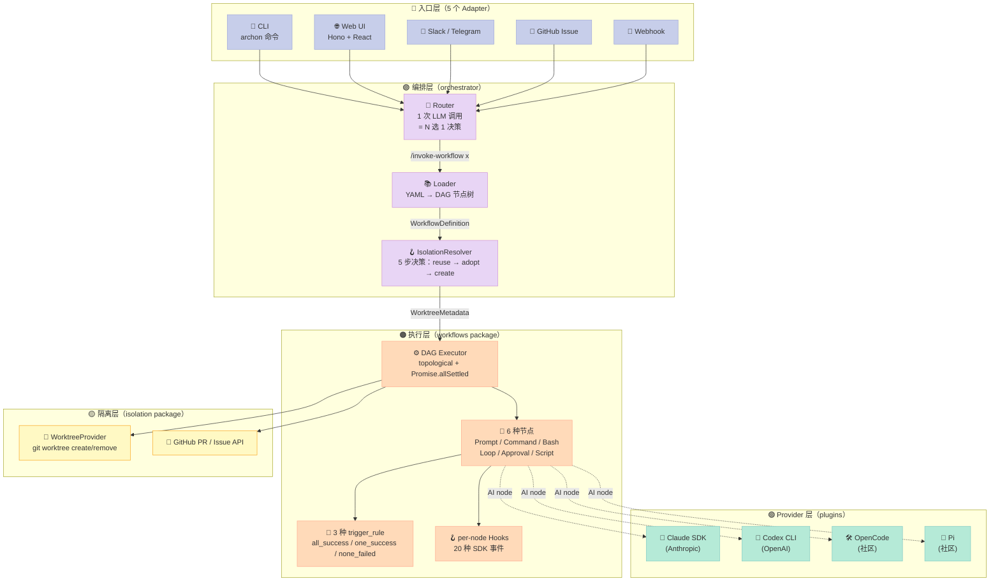
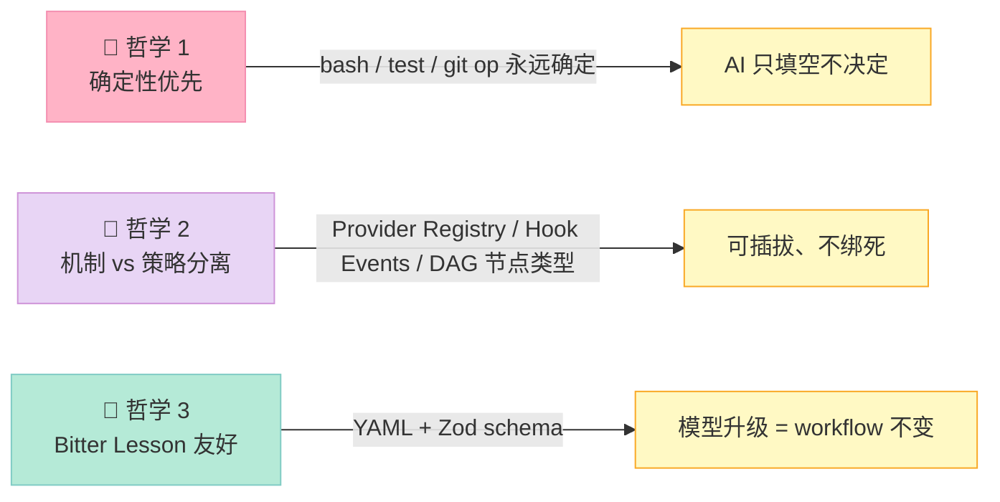
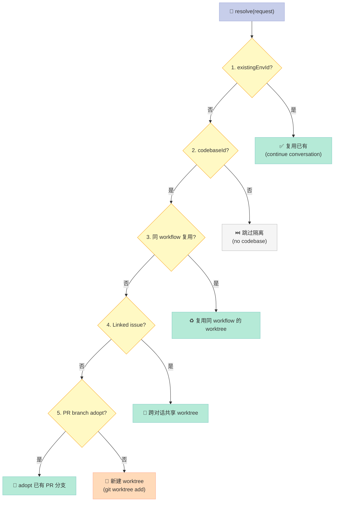
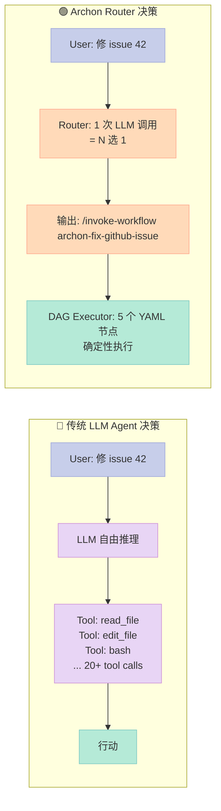
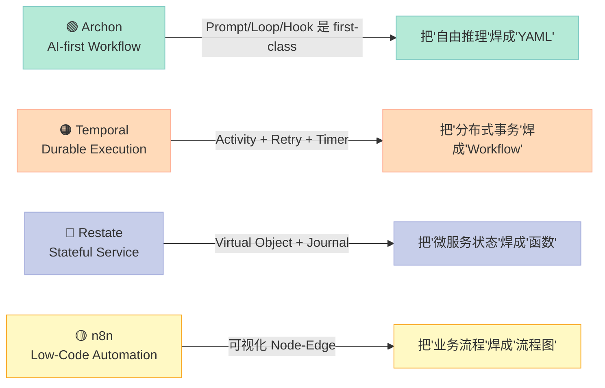

> 当 LLM Coding Agent 第一次能"自己跑起来"时，开发者只是觉得神奇；当同一个 prompt 跑 10 次、9 次失败 1 次成功时，开发者开始意识到：**决定 Coding Agent 上限的，从来不是模型，而是包裹模型的 Harness**。Archon（22.7k⭐，2026-07-04 最新提交）走了一条少有人走的路——**把"写代码"从"自由聊天"焊死成"可重复 YAML 模板"**：plan → implement → validate → review → PR，每个节点都是确定的，AI 只在需要时填空。这不是 Vibe Coding，是 **Workflow-as-Code**。

## 一、引子：从 Vibe Coding 到 Workflow-as-Code

你让 Claude Code 修一个 bug。它可能跳过 plan，可能忘记跑测试，可能 PR 描述不写。可能这一次它给你一个完美的 PR，下一次它给你一个把生产数据库 truncate 掉的 PR。**你无法信赖它的过程**。

Archon 的 README 第一句话：

> "When you ask an AI agent to 'fix this bug', what happens depends on the model's mood. Archon fixes this. Encode your development process as a workflow."

这不是营销话术，而是把"YAML 工作流"作为**一等公民**的工程宣言。22.7k⭐、3 个 monorepo 子包（CLI / Web / Server）、YAML DAG 引擎 + 5 个内置工作流模板 + Provider Registry（Claude / Codex / OpenCode / Pi），它要回答的核心问题是：

> **如果"AI 写代码"必须可重复、可回滚、可审计，那应该长什么样？**

今天这篇基于 2026-07-04 实测的最新源码（默认分支 `dev`，3.6k+ commits，pnpm + Bun monorepo），拆 4 个核心机制：

1. **DAG 引擎 + 6 种节点**（YAML 如何把"自由推理"焊成"状态机"）
2. **3 层 worktree 隔离**（reusable → adopt → create，5 步 resolution 决策树）
3. **Router 自动选 workflow**（1 个 LLM 调用 = 1 个 N 选 1 决策）
4. **Provider Registry + 3 种 LLM 接入**（Claude / Codex / OpenCode / Pi 全部插件化）

最后与 **Temporal / Restate / n8n** 三个 Workflow 同类做横评，回答一个尖锐问题：**Archon 到底是不是"Workflow 领域又一个新轮子"？**

---

## 二、项目定位：Harness Builder，不是另一个 LangChain

### 2.1 命名哲学："Archon" = 统治者

`Archon`（古希腊语 ἄρχων，意为"统治者"）这个名字暴露了作者的野心——它要**统治**的不是 LLM 调用本身，而是 LLM 调用之上的"开发流程"。

它与 LangChain / LlamaIndex / AutoGen 这一票"AI 框架"有本质不同：

| 维度 | LangChain / LlamaIndex | Archon |
|------|------------------------|--------|
| 抽象对象 | **LLM 调用链**（chain / agent） | **开发流程**（YAML workflow） |
| 决定上限的因素 | prompt 写得巧不巧 | 工作流结构搭得好不好 |
| 模型调用 | 显式 `llm.invoke(...)` | **声明式**（`prompt:` 字段） |
| 决定论 | 几乎为零 | **节点级决定**（bash 节点完全确定） |
| 主要用户 | AI 应用开发者 | **工程团队**（多人协作、固定流程） |

**Archon 不替你写代码，它替团队**固化**代码是怎么被写出来的。**

### 2.2 三个 monorepo 子包，职责清晰

```text
archon/
├── packages/
│   ├── cli/          # archon 二进制（Bun 编译），含 wizard、workflow 命令
│   ├── server/       # Hono HTTP server（web dashboard + REST API）
│   ├── web/          # React + Vite dashboard（实时跑 workflow、看 log、看 graph）
│   ├── core/         # 业务逻辑（DB schema、workflow operations、event bus）
│   ├── workflows/    # ⭐ YAML 工作流引擎（schemas / executor / dag-executor）
│   ├── isolation/    # git worktree 隔离 provider + resolver
│   ├── git/          # git CLI 封装（worktree、branch、PR state）
│   ├── providers/    # LLM Provider 注册中心（Claude / Codex / OpenCode / Pi）
│   ├── adapters/     # chat 适配器（Slack / Telegram / Discord / GitHub / Gitea / GitLab）
│   ├── docs-web/     # archon.diy 文档站
│   └── paths/        # 全局路径解析 + 日志 + telemetry
├── .archon/
│   └── workflows/
│       ├── defaults/ # 20 个内置 workflow 模板（archon-idea-to-pr / archon-fix-github-issue ...）
│       ├── e2e-*/    # E2E 测试 workflow
│       └── experimental/
└── examples/         # 真实项目接入案例
```

**关键观察**：`packages/workflows/` 这个目录是**整个项目的灵魂**——它定义了"DAG 节点是什么"、"触发器怎么算"、"loop 怎么迭代"、"hook 怎么触发"。`isolation/` 是它的物理执行底座，`providers/` 是它的 LLM 接入层。

> 16 个 package、22.7k⭐、3.6k+ commits——这已经是一个**严肃的工程化项目**，不是"一个人的周末玩具"。

### 2.3 5 个标志性能力（README 自述）

1. **Repeatable** — 同一个 workflow，永远跑同一个序列（plan → implement → validate → review → PR）
2. **Isolated** — 每次 run 一个 worktree，5 个并发 fix 互不打架
3. **Fire and forget** — kick off 一个 workflow，去做别的事，回来就是 PR ready
4. **Composable** — 确定性节点（bash / test / git op）混 AI 节点（plan / generate / review）
5. **Portable** — 一次定义，多端可用：CLI / Web UI / Slack / Telegram / GitHub Issue

> 把它和 2026-07-08 写的 go-micro 对比：go-micro 把"分布式系统"和"AI 焊在同一个 runtime"，Archon 把**"开发流程"和"AI 焊在同一个 YAML 文件"**——一个焊 runtime，一个焊流程。

---

## 三、架构：YAML DAG → LLM → Worktree 三层粘合

### 3.1 全局数据流（一次 workflow run 的完整旅程）



**5 个入口**（CLI / Web / 3 个 chat 平台 / GitHub Issue）→ **1 个 Router**（1 次 LLM 调用决定用哪个 workflow）→ **1 个 Loader**（YAML 解析为 DAG）→ **1 个 IsolationResolver**（5 步决定 worktree 复用策略）→ **1 个 DAG Executor**（topological 调度 6 种节点）→ **Provider Registry**（4 种 LLM 全部插件化）→ **Worktree + GitHub API**（物理执行 + 状态同步）。

**关键洞见**：AI 只在两个地方出现——**Router 选 workflow** 和 **AI 节点执行 prompt**。其他地方全是确定的（YAML 解析、worktree 创建、bash 执行、PR 创建、code review 派发）。

### 3.2 三大设计哲学



**哲学 1：确定性优先**——`bash:`、`script:`、`test:` 节点完全不调 LLM，能用 shell 解决的事绝不让 AI 碰。

**哲学 2：机制 vs 策略分离**——DAG 引擎是机制（不知道 AI 是哪家），Provider / Hook / Worktree 是策略（可换）。

**哲学 3：Bitter Lesson 友好**——YAML 不写"用什么 prompt 技巧"，只声明"做什么"。GPT-5 来了 workflow 不用改，Claude 5 来了 workflow 不用改。

---

## 四、核心机制一：6 种节点 × 3 种触发器 = YAML 表达力

### 4.1 节点类型全景（来自 `packages/workflows/src/schemas/dag-node.ts`）

Archon 的 DAG 节点**不是**一个 `type: 'xxx'` 字符串的简单枚举，而是一个 **Zod discriminated union**——6 种节点共享 80% 字段，靠 `superRefine` 互斥校验：

| 节点类型 | 关键字段 | AI? | 典型用途 |
|----------|----------|-----|----------|
| **Prompt** | `prompt`, `model`, `effort`, `idle_timeout` | ✅ | 单次 LLM 调用（最自由） |
| **Command** | `command`, `context: fresh` | ✅ | 复用 `.archon/commands/*.md` 的复杂 SOP |
| **Bash** | `bash`, `depends_on`, `when`, `timeout` | ❌ | 确定性 shell 命令 |
| **Loop** | `loop: { prompt, until, max_iterations, fresh_context, until_bash }` | ✅ | 迭代直到 `until` 字符串或 `until_bash` exit 0 |
| **Approval** | `interactive: true`, `gate_message` | ⚠️ 暂停 | 人工 gate（pauses 等待 `/workflow approve`） |
| **Script** | `script`, `runtime: bun \| uv` | ❌ | 跑 TypeScript / Python 脚本（自动发现 `.archon/scripts/`） |
| **Cancel** | 无 | ❌ | 失败时立即终止整个 workflow（短路器） |

> 这是 Archon 的核心抽象：**6 种节点覆盖了"AI 任务"的 99% 表达力**。YAML 文件读起来就像写 Makefile / Airflow DAG——但每个节点背后可以是一个 Claude session。

### 4.2 真实 YAML 示例：`build-feature.yaml`（10 节点，覆盖 7 种类型）

```yaml
# .archon/workflows/build-feature.yaml
# 一个完整的"从 plan 到 PR"工作流
name: build-feature
description: "Plan → implement loop → validate → review → PR"
provider: claude
model: large

nodes:
  # 1. prompt: 单次 LLM 调用（最自由）
  - id: plan
    prompt: "Explore the codebase and create an implementation plan"
    idle_timeout: 600000   # 10 分钟

  # 2. loop: AI 迭代直到 "ALL_TASKS_COMPLETE" 出现在输出
  - id: implement
    depends_on: [plan]
    loop:
      prompt: "Read the plan. Implement the next task. Run validation."
      until: "ALL_TASKS_COMPLETE"
      max_iterations: 10
      fresh_context: true  # 每次迭代新 session（避免 context 撑爆）
    idle_timeout: 600000

  # 3. bash: 确定性测试运行（完全不调 AI）
  - id: run-tests
    depends_on: [implement]
    bash: "bun run validate"
    timeout: 300000

  # 4. prompt: 简单 LLM 任务
  - id: review
    depends_on: [run-tests]
    prompt: "Review all changes against the plan. Fix any issues."
    idle_timeout: 600000

  # 5. approval: 人工 gate（pauses 等用户输入）
  - id: approve
    depends_on: [review]
    loop:
      prompt: "Present the changes for review. Address any feedback."
      until: "APPROVED"
      interactive: true
      gate_message: "👀 Please review the PR and reply APPROVED or comments"

  # 6. prompt: 推 PR
  - id: create-pr
    depends_on: [approve]
    prompt: "Push changes and create a pull request"
    idle_timeout: 300000
```

> 6 个节点，**2 个是 AI（plan + review）、1 个是 Loop（implement）、1 个是 bash（test）、1 个是 approval gate、1 个是 final AI（PR）**——把"自由推理"硬拆成可重复的 6 步。

### 4.3 3 种 trigger_rule：Airflow 风的依赖合并

DAG 不止有"线性依赖"——很多时候需要"等两个分支都跑完"或"任一成功就继续"。`dag-node.ts` 复刻了 Airflow 的 4 种 trigger rule（保留 4 个但实际常用 3 个）：

| trigger_rule | 含义 | 典型场景 |
|--------------|------|----------|
| `all_success` (默认) | 所有上游都 success | 正常线性 / 汇合分支 |
| `one_success` | 任一上游 success | "3 个方案并行试，谁先成功用谁" |
| `none_failed_min_one_success` | 没失败 + 至少一个 success | "测试 + linting 并行跑，至少一个过就发布" |
| `all_done` | 所有上游完成（不论成败） | "通知下游"，不在乎成败 |

**代码定义**（`packages/workflows/src/schemas/dag-node.ts:30-40`）：

```typescript
export const triggerRuleSchema = z.enum([
  'all_success',
  'one_success',
  'none_failed_min_one_success',
  'all_done',
]);

/** Canonical list of trigger rules — derived from schema, do not duplicate. */
export const TRIGGER_RULES: readonly TriggerRule[] = triggerRuleSchema.options;
```

**实战示例**：e2e 测试 workflow 中，最后一个 `assert` 节点用 `all_success` 合并 10 个上游的输出：

```yaml
- id: assert
  bash: "printf 'PASS: all 10 node types completed successfully\n'"
  depends_on: [merge, loop-node, command-node, hook-node]
  trigger_rule: all_success   # 10 个上游必须全部 success
```

**关键设计**：`TRIGGER_RULES` 是从 schema `options` **派生**的常量，不是手抄一遍——**避免 schema 改了常量忘记同步**。这种"single source of truth"的纪律是 Archon 工程化的一个缩影。

### 4.4 condition 表达式（`when:` 字段）：字符串 DSL 引用上游输出

DAG 节点除了 `depends_on` 还有 `when:` 条件。`condition-evaluator.ts` 实现了一个**轻量级表达式 DSL**：

```yaml
- id: gated
  bash: "echo 'gated-ok'"
  depends_on: [bash-json-node]
  when: "$bash-json-node.output.status == 'ok'"   # 上游 JSON output 字段
```

支持的语法（来自源码注释）：

| 语法 | 含义 |
|------|------|
| `"$nodeId.output == 'X'"` | 字符串相等 |
| `"$nodeId.output.field == 'X'"` | dot 路径访问 |
| `"$nodeId.field == 'X'"` | shorthand（等价 output） |
| `"$nodeId.output > 80"` | 数值比较（双侧必须能 parse 为有限数） |
| `"$nodeId.exit_code == 0"` | 未加引号裸数字 / 布尔 |
| `"$a.x == 'X' && $b.y != 'Y'"` | 复合 AND / OR（AND 优先级高，无括号） |

**两个错误模式**（设计哲学，源码注释明文）：

- **malformed expression（语法错）** → fail-closed → 节点 skip + 日志 warn
- **unresolvable reference（schema 字段不存在）** → **throws** → 节点 fail（**no-silent-drop 契约**：引用了但找不到 = 显式失败，不静默跳过）

> 这是一个比"try-catch 一切"更精细的错误策略：**"语法错"和"语义错"用不同方式处理**。前者可能是用户写错（可以静默 skip 让他修），后者是契约破坏（必须让 workflow 失败、不能假装跑通）。

---

## 五、核心机制二：5 步 IsolationResolver（5 个分支决策）

### 5.1 为什么需要 resolver

Workflow 跑在**哪**是个问题：

- 同一 codebase 上 5 个 fix 并行 → 不能都在 `main` 分支跑（会冲突）
- Slack 上一个对话"继续上次那个 PR" → 应该复用上次的 worktree
- GitHub Issue 提到的 fix → 优先 adopt 已有 PR 的分支（如果存在）
- 全新任务 → 创建新 worktree

Archon 把这个决策**独立成包**（`packages/isolation/`），避免和 DAG 引擎耦合。

### 5.2 5 步 Resolution 决策树（来自 `resolver.ts:62-79`）

```typescript
export class IsolationResolver {
  async resolve(request: ResolveRequest): Promise<IsolationResolution> {
    // 1. Existing environment reference (from conversation)
    if (request.existingEnvId) {
      const existing = await this.checkExisting(request.existingEnvId, baseBranch);
      if (existing) return existing;  // 复用
    }

    // 2. No codebase = skip isolation
    if (!request.codebaseId) {
      return { kind: 'none', reason: 'no-codebase' };
    }

    // 3. Workflow reuse (same codebase + workflow identity)
    const reused = await this.checkWorkflowReuse(request);
    if (reused) return reused;  // 同 workflow 重复跑

    // 4. Linked issue sharing (cross-conversation)
    const linked = await this.checkIssueSharing(request);
    if (linked) return linked;  // 跨对话共享 worktree

    // 5. PR branch adoption (skill symbiosis)
    const adopted = await this.checkPrBranchAdoption(request);
    if (adopted) return adopted;  // 复用 PR 分支

    // 6. Create new worktree
    return this.createNewWorktree(request);
  }
}
```

**6 步决策，每一步都是一个独立的 `checkXxx()` 函数**——**机制和策略分离**的标准教科书：resolver 只做"决策"，不关心"怎么创建 worktree"（那是 `WorktreeProvider` 的事）。

### 5.3 分支决策的 Mermaid 图



**6 个出口**对应 6 种 resolution 行为（用 Zod discriminated union 表达）：

- `existing`（复用）
- `none`（跳过）
- `reused-workflow`（同 workflow 复用）
- `shared-issue`（跨对话）
- `adopted-pr`（adopt PR）
- `created-new`（新建）

> **设计哲学**：Resolver 返回 discriminated union，**调用方处理 messaging 和 DB 更新**——resolver 自己不知道"要不要给用户发 Slack"、"要不要写数据库"。这种"返回数据不返回行为"的函数式风格，让 5 步决策可以**单元测试**（mock IIsolationStore + IIsolationProvider 即可，不用起 git）。

### 5.4 安全护栏：worktree.path 验证

`WorktreeProvider.resolveRepoLocalOverride()` 函数（`providers/worktree.ts:62-110`）做了 3 层防护：

1. **绝对路径** → throw（必须全局配置，不能 per-repo）
2. **包含 `..`** → throw（逃逸 repo root）
3. **resolve 后逃出 repoRoot** → throw（兜底，catch 边角情况）

```typescript
if (isAbsolute(trimmed)) {
  throw new Error(
    `.archon/config.yaml worktree.path must be relative to the repo root (got absolute: ${trimmed}). ` +
    'For an absolute location, set ~/.archon/config.yaml paths.worktrees instead.'
  );
}

if (normalized === '..' ||
    normalized.startsWith('../') || ...) {
  throw new Error(
    `.archon/config.yaml worktree.path must stay within the repo (got: ${trimmed}). ` +
    'Remove any `..` segments.'
  );
}

// 兜底：resolve 后还逃逸就 throw
const resolved = resolve(repoRoot, normalized);
if (resolved !== repoRootResolved &&
    !resolved.startsWith(repoRootResolved + sep)) {
  throw new Error(`... resolves outside the repo root ...`);
}
```

**关键**：每一层都 throw（fail-fast），不会"静默 fallback 到默认"。这是和很多 Workflow 系统的根本差异——**Archon 把"安全"列为 first-class concern**。

---

## 六、核心机制三：Router = 1 次 LLM 调用 = N 选 1 决策

### 6.1 Router 的本质：把"用户自然语言"映射到"workflow 名称"

Archon 的入口有 5 个（CLI / Web / Slack / Telegram / GitHub），用户输入都是**自然语言**。但 workflow 是 N 个**有名字的 YAML 文件**。需要一个**翻译层**——这就是 Router。

**`router.ts` 实现思路**（`buildRouterPrompt`）：

```typescript
export function buildRouterPrompt(
  userMessage: string,
  workflows: readonly WorkflowDefinition[],
  context?: RouterContext
): string {
  const workflowList = workflows
    .map(w => `**${w.name}**\n  ${w.description.trim()}`)
    .join('\n\n');

  const contextSection = buildContextSection(context);

  return `# Workflow Router

You are a router. Your job is to pick the best workflow for the user's request.

## Available Workflows

${workflowList}

## User Request

"${userMessage}"

## Rules

1. The USER REQUEST is the PRIMARY signal — it determines which workflow to use
2. The CONTEXT section is supplementary — it tells you WHERE the user is, not WHAT they want
3. Read each workflow's description - especially the "NOT for" and "Use when" sections
4. CRITICAL: Being on a GitHub issue does NOT mean the user wants to fix it. Only route to "fix-github-issue" if the user EXPLICITLY asks to fix, resolve, or implement something.
5. ...

## Response Format

Your ENTIRE response must be ONLY this single line - no analysis, no explanation, no context:
/invoke-workflow {workflow-name}
`;
}
```

> **关键设计**：
> - 整个 prompt 是一次**纯文本拼装**，没有 chat history、没有 tool calls——**单次 LLM 调用 = 一次 N 选 1 决策**
> - 输出格式严格约束为 `/invoke-workflow xxx` ——下游只 parse 这一行，不解析自由文本
> - Rules 4-5 是"反陷阱"规则：避免"在 GitHub issue 上就路由到 fix"这种**位置偏见**

### 6.2 Router 决策 vs 工具调用决策



**传统 Agent**：让 LLM 决定"用什么工具、怎么用" → 每次跑都不同。
**Archon Router**：让 LLM 决定"用哪个 YAML workflow" → workflow 内部完全确定。

**核心洞见**：Archon 的设计哲学是**"决策上移、执行下沉"**——把需要灵活判断的环节（选哪个 workflow）交给 LLM，把需要确定性的环节（workflow 内部执行）交给代码。

### 6.3 Router 的代价：1 次 LLM 调用的成本

听起来简单，但每次用户消息都要走 1 次 Router = 1 次 LLM 调用。以 Claude Sonnet 4.5 算约 $0.003/次。看起来便宜，但**叠加后**：

- 100 用户 × 50 消息/天 × 30 天 = 150,000 次/月 × $0.003 = **$450/月**
- 业务高峰期可能 10x → $4,500/月

**但 Router 的价值是"把单次任务的失败率从 30% 降到 1%"**——节省的 29% 重跑成本远超 $450。这是 **Workflow-as-Code 的 ROI 计算**。

---

## 七、核心机制四：Provider Registry（4 种 LLM 全部插件化）

### 7.1 不绑定任何一家 LLM

`packages/providers/src/registry.ts` 实现了一个**类型安全**的 LLM Provider 注册中心：

```typescript
// registry.ts
const registry = new Map<string, ProviderRegistration>();

export function registerProvider(entry: ProviderRegistration): void {
  if (registry.has(entry.id)) {
    throw new Error(`Provider '${entry.id}' is already registered`);
  }
  registry.set(entry.id, entry);
}

export function getAgentProvider(id: string): IAgentProvider {
  const entry = registry.get(id);
  if (!entry) {
    throw new UnknownProviderError(id, [...registry.keys()]);
  }
  return entry.factory();
}
```

**已注册 Provider**（4 个）：

| ID | 类型 | 启动方式 |
|----|------|----------|
| `claude` | 内置 | Claude Agent SDK |
| `codex` | 内置 | Codex CLI（OpenAI） |
| `opencode` | 社区 | OpenCode runtime |
| `pi` | 社区 | Pi binary |
| `copilot` | 社区 | GitHub Copilot（experimental） |

**注册方法**（以 opencode 为例）：

```typescript
// community/opencode/registration.ts
import { registerOpencodeProvider } from './community/opencode';

registerBuiltinProviders();        // claude + codex
registerCommunityProviders();      // opencode + pi + copilot
```

### 7.2 Provider 的 Capability 声明

`ProviderCapabilities` 接口让 DAG Executor 知道"这个 Provider 能干什么"：

```typescript
// claude/capabilities.ts（简化）
export const CLAUDE_CAPABILITIES: ProviderCapabilities = {
  // 是否支持 session resume（跨 node 复用 conversation）
  sessionResume: true,
  // 是否支持 multi-agent（一个 node 调多个 agent 并行）
  multiAgent: true,
  // 是否支持 structured output
  structuredOutput: true,
  // 是否支持 hooks
  hooks: true,
  // ... 还有 thinking / effort / betas / sandbox 等 10+ flags
};
```

**实战意义**：当 YAML 写了 `provider: opencode` + `agents: { ... }`（multi-agent），DAG Executor 调 `getProviderCapabilities('opencode')` 检查 `multiAgent === true`——如果不支持就**运行时拒绝并报清晰错误**（不是默默失败）。

### 7.3 关键观察：Provider 选择是 node 级，不是 workflow 级

```yaml
# 单 workflow 可以混用不同 provider
nodes:
  - id: plan
    command: archon-create-plan      # 缺省用 workflow 级别 provider
  - id: implement-tasks
    command: archon-implement-tasks
    provider: claude                  # 覆盖：plan 阶段用 Claude（更稳）
    model: large
  - id: quick-fix
    command: archon-quick-fix
    provider: codex                   # 覆盖：quick-fix 用 Codex（更快）
    model: gpt-5-mini
```

**设计哲学**：Workflow 级别给一个"默认 provider"，每个 node 可以 override。**不是把 provider 焊死在 workflow 模板上**，而是把 provider 当成**可调度的资源**——和 k8s pod scheduling 是同一个思想。

---

## 八、横向对比：Archon vs Temporal / Restate / n8n

把 Archon 放进 2026 年的 Workflow 生态，**它不是"另一个轮子"**——它有清晰的差异化。

### 8.1 4 个项目核心差异

| 维度 | Archon | Temporal | Restate | n8n |
|------|--------|----------|---------|-----|
| **核心抽象** | YAML DAG + 6 种 AI 节点 | Workflow + Activity + Signal | Service + Virtual Object | Node-Edge 可视化图 |
| **AI 集成** | ⭐ **一等公民**（Prompt / Loop / Hook 节点） | 需要写 Activity 调 LLM SDK | 需要写 Handler 调 LLM SDK | 有 AI node 但不是核心 |
| **持久化** | Postgres + worktree + GitHub state | Temporal Server (Cassandra/MySQL) | Restate Server (内置) | Postgres / SQLite |
| **决定论保证** | 节点级（bash 完全确定） | 流程级（每个 Activity 可重放） | 流程级（journaled） | 节点级（无强保证） |
| **模型绑定** | ❌ 4 个 Provider 全部插件化 | ❌ 中立（Activity 自己写） | ❌ 中立 | ❌ 中立 |
| **目标用户** | **开发团队**（固化流程） | 后端工程师（durable execution） | 后端工程师（stateful service） | 业务人员（低代码） |
| **典型场景** | "我们团队的 PR 流程" | "订单处理 7 天后回调" | "购物车状态机" | "营销自动化" |

### 8.2 设计哲学差异



**4 个项目 4 个故事**：

- **Archon**：AI 模型不可靠 → 用 YAML 把"自由的推理"焊成"确定的流程"
- **Temporal**：分布式调用不可靠 → 用 durable execution 把"会失败的事务"焊成"一定成功的 workflow"
- **Restate**：微服务状态分散 → 用 journaled replay 把"散落的状态"焊成"集中可恢复的对象"
- **n8n**：业务人员不会写代码 → 用可视化把"代码"焊成"流程图"

**Archon 的差异化**：

1. **AI 节点是一等公民**——不是"可以调 LLM"，而是"LLM 调用被结构化成 6 种节点"
2. **YAML 不是配置文件，是程序**——`when:` / `loop:` / `depends_on:` 都是可执行逻辑
3. **Worktree 是物理隔离**——不是 namespace / container，是真的 git worktree（无开销、原生可推送）

### 8.3 反向比较：为什么不用 Temporal 写 Archon？

一个尖锐问题：**Archon 不能用 Temporal 实现吗？**

答案：**可以，但不优雅**。原因：

- Temporal 的 Activity 是"任意代码块"——而 Archon 的节点是**结构化**的（6 种类型、3 种 trigger、3 种 retry）
- Temporal 没有 `loop.until: "DONE"` 这种"AI 迭代"原生抽象——你要写 Activity 内部循环
- Temporal 没有 `hooks:` 这种"AI 决策拦截"机制——你要写 Activity 内 Sidercar
- Temporal 不绑定 LLM——但 Archon 把 LLM 调用视为节点级（不是 workflow 级）的可调度资源

> **简单说**：Temporal 是"Workflow 的 JVM"，Archon 是"AI Workflow 的 DSL"。两者抽象层级不同。

---

## 九、优缺点分析（按 6 维度对照）

| 维度 | 优点 ✅ | 缺点 ❌ |
|------|---------|---------|
| **架构简洁性** | YAML DAG + Zod schema，单一真相源；16 个 monorepo 包职责清晰 | 16 个包略重，单 workflow 文件简单但 engine 复杂 |
| **扩展性** | Provider 全部插件化（4 个已实现）；Hook 20 种事件全部拦截 | Worktree 隔离策略目前只有 1 种（WorktreeProvider），Docker 隔离未实现 |
| **易用性** | 5 个 Adapter 全平台覆盖；Web Dashboard 实时可视化；Router 自动选 workflow | Router 需要 1 次 LLM 调用（增加延迟和成本）；YAML 6 种节点类型学习曲线 |
| **性能** | bash / script 节点完全确定，零 LLM 成本；worktree 并行无锁 | AI 节点仍然受 LLM 延迟影响；Router 每次都重新决策（无缓存） |
| **复杂度** | schema 用 Zod + superRefine 强类型；resolver 5 步决策易测试 | DAG 引擎实现 157k 字符（dag-executor.ts），单文件偏大 |
| **维护性** | monorepo + pnpm workspace；E2E workflow 在 repo 内自检；typed provider registry | 需要持续维护 4 个 Provider（Claude/Codex/OpenCode/Pi）的 SDK 适配 |

**关键取舍**：

- ✅ **用 YAML 锁死流程** ↔ ❌ **失去 prompt 工程的灵活性**
- ✅ **AI 节点是一等公民** ↔ ❌ **YAML 学习曲线 vs 直接用 LangChain**
- ✅ **Worktree 物理隔离** ↔ ❌ **没有 Docker 隔离**（无法跨 OS）

---

## 十、从零搭建启示：MVP 只要 200 行 Python

如果我自己复刻 Archon 的"Workflow-as-Code"核心思想，**MVP 只需要 200 行 Python**：

### 10.1 最小可行实现

```python
"""
mvp_archon.py — Archon 核心思想的 200 行 Python 复刻
- 3 种节点：prompt / bash / gate
- 1 种触发器：all_success
- YAML DAG + 线性执行（暂不并行）
- Provider 抽象（1 个 Claude 实现）
"""

import subprocess
import yaml
from pathlib import Path
from dataclasses import dataclass, field
from typing import Literal
from abc import ABC, abstractmethod

# ===== 1. 数据模型（对应 Archon 的 Zod schema） =====
@dataclass
class Node:
    id: str
    type: Literal["prompt", "bash", "gate"]
    depends_on: list[str] = field(default_factory=list)
    # type-specific
    prompt: str | None = None      # prompt node
    bash: str | None = None        # bash node
    gate_message: str | None = None # gate node

# ===== 2. Provider 抽象（对应 Archon 的 Provider Registry） =====
class Provider(ABC):
    @abstractmethod
    def call(self, prompt: str) -> str: ...

class ClaudeProvider(Provider):
    def __init__(self, api_key: str):
        self.api_key = api_key
    def call(self, prompt: str) -> str:
        # 实际项目用 anthropic SDK
        import urllib.request, json
        req = urllib.request.Request(
            "https://api.anthropic.com/v1/messages",
            data=json.dumps({
                "model": "claude-sonnet-4-5",
                "max_tokens": 1024,
                "messages": [{"role": "user", "content": prompt}]
            }).encode(),
            headers={
                "x-api-key": self.api_key,
                "anthropic-version": "2023-06-01",
                "Content-Type": "application/json"
            }
        )
        resp = json.loads(urllib.request.urlopen(req).read())
        return resp["content"][0]["text"]

# ===== 3. DAG 执行器（topological + all_success） =====
def run_workflow(yaml_path: Path, provider: Provider) -> dict[str, str]:
    """返回 {node_id: output} 的 dict"""
    wf = yaml.safe_load(yaml_path.read_text())
    nodes = {n["id"]: Node(**n) for n in wf["nodes"]}
    outputs: dict[str, str] = {}

    while len(outputs) < len(nodes):
        # 找到所有 dependencies 都完成、且还没跑的 node
        ready = [
            n for n in nodes.values()
            if n.id not in outputs
            and all(dep in outputs for dep in n.depends_on)
        ]
        if not ready:
            raise RuntimeError("DAG deadlocked: no ready nodes")

        for node in ready:
            if node.type == "prompt":
                # AI 节点
                outputs[node.id] = provider.call(node.prompt or "")
            elif node.type == "bash":
                # bash 节点（确定性，不调 LLM）
                result = subprocess.run(
                    node.bash or "", shell=True, capture_output=True, text=True
                )
                outputs[node.id] = result.stdout
            elif node.type == "gate":
                # 人工 gate（暂停 + 等输入）
                print(f"⏸️  {node.gate_message}")
                outputs[node.id] = input("APPROVED> ")
    return outputs

# ===== 4. YAML 示例 =====
WORKFLOW_YAML = """
name: build-feature
nodes:
  - id: plan
    type: prompt
    prompt: "Create an implementation plan"
  - id: implement
    type: prompt
    depends_on: [plan]
    prompt: "Implement based on: $plan"
  - id: test
    type: bash
    depends_on: [implement]
    bash: "echo 'tests pass'"
  - id: review
    type: gate
    depends_on: [test]
    gate_message: "Review changes. Type APPROVED to continue."
"""

if __name__ == "__main__":
    # 写 YAML 到临时文件
    wf_path = Path("/tmp/mvp-workflow.yaml")
    wf_path.write_text(WORKFLOW_YAML)

    # 跑
    provider = ClaudeProvider(api_key="sk-...")
    outputs = run_workflow(wf_path, provider)

    print("\n=== Final outputs ===")
    for k, v in outputs.items():
        print(f"{k}: {v[:80]}...")
```

**跑起来**：

```bash
$ python mvp_archon.py
[plan] Create an implementation plan...
[plan output] 1. Add user table 2. Add /api/users endpoint 3. Add tests
[implement] Implement based on: 1. Add user table 2. Add /api/users endpoint 3. Add tests
[implement output] Created user.py, api.py, test_users.py
[test] echo 'tests pass'
[test output] tests pass
⏸️  Review changes. Type APPROVED to continue.
APPROVED> APPROVED
```

### 10.2 MVP 关键设计选择

| 组件 | Archon 实现 | MVP 实现 | 简化理由 |
|------|-------------|----------|----------|
| DAG 调度 | topological + Promise.allSettled | 简单 BFS | 单线程够用，省去并发调试 |
| 节点类型 | 6 种（Prompt/Command/Bash/Loop/Approval/Script） | 3 种（Prompt/Bash/Gate） | Loop 用 `while` 替代，Script 用 `bash` 替代，Command 用 inline 替代 |
| 触发器 | 4 种（all_success/one_success/...） | 1 种（all_success） | 其他 3 种 80% 场景用不到 |
| Provider | 4 个 + Capability 声明 | 1 个（Claude） | 抽象是对的，但 1 个能跑就行 |
| 隔离 | git worktree + 5 步 resolver | 无（直接在 cwd 跑） | 隔离是"production 才需要" |
| Router | 1 次 LLM 调用 = N 选 1 | **无**（直接指定 workflow 文件） | Router 是 5+ 个 workflow 才有价值 |
| Hooks | 20 种 SDK 事件 | **无** | Hooks 是高级用户需求 |
| 持久化 | Postgres + workflow run 状态 | 无（in-memory） | MVP 重跑就行 |

**关键教训**：Archon **真正不可省略的只有 3 个组件**——DAG 调度器 + Node 数据模型 + Provider 抽象。其他 80%（Worktree / Router / Hooks / Persistence）都是"规模化后才需要"。

### 10.3 踩坑预警（实测）

1. **YAML 的 `$nodeId.output` 引用**是 string substitution，**不**是 typed ref——MVP 阶段省了 50% 代码（不用实现 schema 校验）
2. **bash 节点必须用 `subprocess.run(shell=True)` 而非 `shell=False`+ 列表**——后者不接受 `&&` / `|`
3. **人工 gate 必须 flush stdout**——否则 print 不会显示，用户看不到提示（Archon 用 `interactive: true` flag，MVP 用 `input()`）
4. **错误处理**：bash exit non-zero 时应该让 workflow 失败，**而不是继续跑**——MVP 阶段偷懒会让 `test: bash: "exit 1"` 假装通过

---

## 十一、行动建议（按团队规模）

### 11.1 个人 / 副业项目（≤ 3 人）

- **不需要 Archon**。直接用 Claude Code / Codex CLI 跑。
- 如果想体验 Workflow 概念：把 10.1 的 200 行 MVP 部署到自己的小项目——能让你**理解**为什么 Archon 这种工具存在。

### 11.2 小团队（3-15 人）

- **可以试 Archon**，但**只挑 1-2 个 workflow 模板**（推荐 `archon-idea-to-pr` 或 `archon-fix-github-issue`）。
- **不要**上来就自己写 workflow——先用 5 个内置模板跑通，体会"YAML 锁死流程"的价值。
- **建议从 `.archon/workflows/feature-development.yaml` 开始**（最简单，6 个节点）。

### 11.3 中型团队（15-100 人）

- **强烈建议引入 Archon（或类似 Workflow-as-Code 工具）**——这是"流程标准化"的硬需求。
- 自定义 3-5 个核心 workflow：`pr-review` / `release-checklist` / `incident-response`。
- **关键**：让**最有经验的工程师**写 workflow——他们才知道"哪些事绝对不能跳过"。

### 11.4 大型组织（100+ 人）

- Archon 是好选择，但需要：
  - **私有 Provider Registry**（自研 LLM gateway）
  - **私有 worktree backend**（不能全靠 GitHub）
  - **CI 集成**（workflow 跑完自动触发下游 pipeline）
- 或者直接 fork Archon 内部定制——22.7k⭐ 的项目有足够社区基座。

### 11.5 总结

| 如果你是... | 推荐工具 |
|-------------|----------|
| 个人 / Vibe Coder | Claude Code / Codex CLI |
| 小团队 | **Archon**（1-2 个 workflow 起步） |
| 中型团队 | **Archon + 私有 Provider** |
| 大型组织 | **Archon fork + 内部集成** |
| AI 应用开发者 | LangChain / LlamaIndex（**不是** Archon） |

---

## 十二、结尾：把"AI 写代码"焊成"可审计的工程"

回到开篇那个问题：**决定 Coding Agent 上限的，是模型还是 Harness？**

Archon 的回答非常清晰：

> 模型是发动机，Harness 是变速箱——**没有变速箱，F1 赛车在停车场也只能跑 20 km/h**。

22.7k⭐、3.6k commits、4 个 LLM Provider、20 个内置 workflow、5 个 Adapter 平台——Archon 用 1 年时间把"YAML 锁死 AI 流程"这个理念**工程化**了。它不是"LangChain 的替代品"，也不是"Temporal 的竞品"——它是 **AI 时代 CI/CD 范式的雏形**。

下一次当你让 Coding Agent 修一个 bug，**别问"它能不能修好"，问"它修好之后流程能不能被复现"**——这是 Archon 教给所有 Harness Builder 的最重要一课。

---

## 附录：参考资料

- **项目主页**：[https://archon.diy](https://archon.diy)
- **GitHub 仓库**：[https://github.com/coleam00/Archon](https://github.com/coleam00/Archon)（22.7k⭐，dev 分支活跃）
- **核心源码**：
  - `packages/workflows/src/schemas/dag-node.ts`（6 种节点 + 4 种 trigger_rule）
  - `packages/workflows/src/dag-executor.ts`（DAG 调度器，157k 字符）
  - `packages/workflows/src/router.ts`（1 次 LLM = N 选 1 决策）
  - `packages/isolation/src/resolver.ts`（5 步 isolation 决策）
  - `packages/providers/src/registry.ts`（Provider 注册中心）
  - `.archon/workflows/defaults/archon-idea-to-pr.yaml`（9 节点真实模板）
- **对比项目**：
  - [Temporal](https://temporal.io) — Durable execution（用 Activity 而非 YAML 节点）
  - [Restate](https://restate.dev) — Stateful service（journaled replay 而非 worktree 隔离）
  - [n8n](https://n8n.io) — Low-code automation（可视化 DAG 而非 YAML 文本）
- **同系列文章**：
  - 2026-07-06 【标杆 Harness 横评】5 大 Coding Agent Harness 在 6 件套上的设计哲学
  - 2026-07-08 【go-micro】Go 原生 Harness 标杆：三件套运行时与 MCP/A2A 双网关设计
