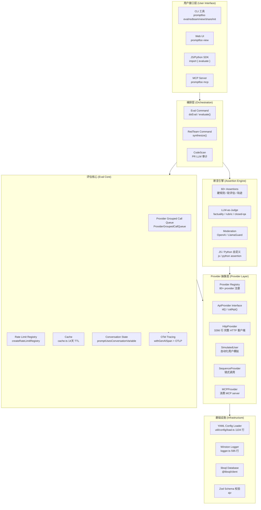
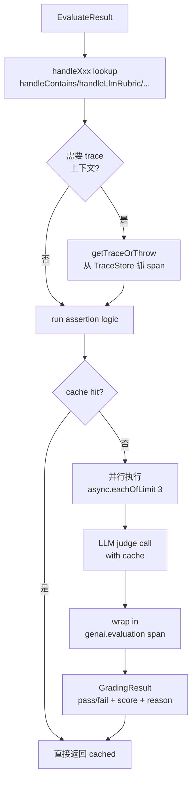
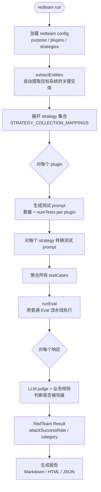
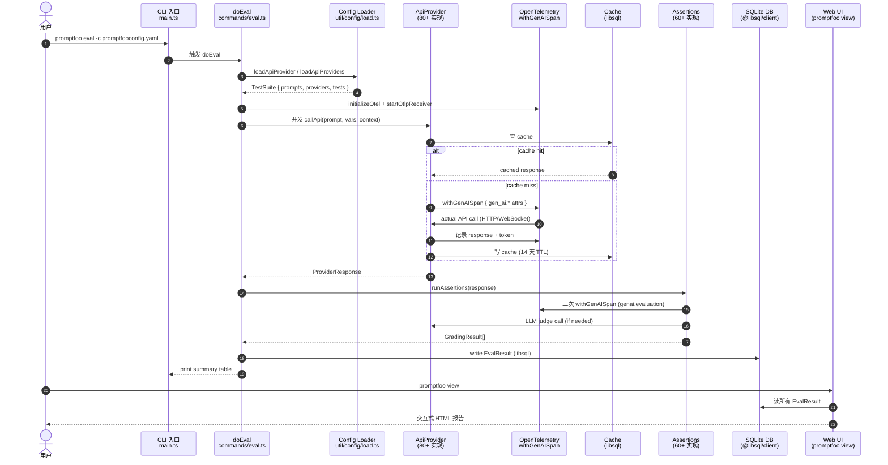

## 一、引子：当 LLM 上线之后，最大的痛点不是"写得对"，而是"测得全"

2026 年，几乎所有中型公司都在用 LLM：客服机器人、文档摘要、代码助手、内容审核、Agent 流水线。**但 LLM 上线之后，真正的"上工"才刚刚开始**——

- 同样的 prompt 升级了 `gpt-5.5` 之后，输出风格漂移了 30%，用户开始抱怨"变笨了"
- 上个月还能拒答的越狱 prompt，今天突然漏了 1 条（红线被穿越了）
- 客服 Agent 升级了一个检索分支，回归测试发现 17% 的 case 工具调用顺序变了——**这算 bug 还是 feature？**
- 法务要求：所有 PII 泄露路径必须有审计日志，包括 prompt 本身
- 合规要求：每一次"AI 决策"必须可回放——是哪个 prompt + 哪个模型版本 + 哪段上下文

这些不是 prompt engineering 的问题，而是 **LLM Engineering** 的问题。它需要：

1. **可重复的评估流水线**（不是"凭感觉测试"）
2. **可量化的安全测试**（不是"问问 LLM 觉得有没有问题"）
3. **可回放的决策链路**（不是"复现不出来"）
4. **可对比的模型回归**（不是"这个新版本好像差点"）

这就是 **Promptfoo** 解决的问题——它把 LLM 评估与红队测试，做成了类似"单元测试 + 集成测试 + 渗透测试"的工程化基础设施。本文将深度剖析 `promptfoo/promptfoo`（⭐23k，MIT，已被 OpenAI 收购但仍开源）的核心架构与设计原理。

> 选型动机：之前我们深度写过 `harbor`（终端 Coding Agent 评测）、`logfire`（AI 可观测性）、`composio`（Agent 工具集成），但**"LLM 评估 + 红队"这个赛道一直没有项目覆盖**。Promptfoo 在这个赛道开了山——它从 2022 年一个简单的 prompt 评测工具起步，到 2026 年已经是一个**完整覆盖 Eval / RedTeam / Tracing / CI-CD 的工业级平台**。

---

## 二、项目定位与核心价值

**Promptfoo** 是一个**LLM 评估与红队测试框架**，核心价值可以用一句话概括：

> **把 LLM 应用的质量与安全测试，做成像单元测试一样可重复、可回归、可 CI/CD 的工程化流水线。**

**与同类项目的定位差异**：

| 项目 | 核心问题 | 场景 | 抽象层 |
|------|----------|------|--------|
| **Promptfoo** | LLM 质量评估 + 安全红队 | Eval + RedTeam + Tracing | 完整工业级平台 |
| LangSmith | LLM 调试 + 可观测 | Tracing + Debug | 主要 Tracing |
| DeepEval | 单元测试式 LLM 评测 | Eval 为主 | 较轻量 |
| Harbor | 终端 Coding Agent 评测 | Sandbox 评测 | 沙盒级 |
| RagaAI Catalyst | Agent 可观测 + 评估 | Observability | Tracing 偏多 |
| OpenAI Evals | 简单 prompt 评测 | 早期 Eval | 学术偏多 |

**Promptfoo 的三个独特定位**：

1. **80+ LLM Provider 一等公民**（不是适配器）——OpenAI、Anthropic、Bedrock、Azure、Ollama、Vertex、Mistral、DeepSeek、Groq、xAI、Watsonx、OpenRouter、Portkey、Helicone、Voyage、HuggingFace、Golang、Python、Ruby、JavaScript、HTTP、Browser、MCP、Agent SDK（Claude Agent SDK、A2A、Foundry Agent、AtlasCloud）——**用统一 `ApiProvider` interface 抽象**。
2. **30+ 红队攻击策略**（不是简单的"测试几个越狱"）——`base64` / `hex` / `homoglyph` / `leetspeak` / `crescendo`（多轮升级）/ `goat`（多轮攻击）/ `gcg`（梯度）/ `hydra`（多轮持久）/ `simba`（多轮）/ `iterative`（迭代越狱）/ `best-of-n`（并行爆破）/ `citation` / `layer`（策略组合）/ `indirectWebPwn`（间接注入）——**每个策略都是独立的 transform pipeline**。
3. **60+ 评分断言**（不是只能 LLM-as-judge）——精确匹配、相似度、JSON Schema 校验、HTML/SQL/XML 校验、Latency、Cost、Token、Levenshtein、ROUGE、BLEU、Refusal、Perplexity、Factuality、AnswerRelevance、ContextFaithfulness、ContextRecall、ContextRelevance、Moderation、Trajectory:Goal-Success、Trajectory:Step-Count、Trajectory:Tool-Used、Trajectory:Tool-Args-Match、Trajectory:Tool-Sequence、TraceErrorSpans、TraceSpanCount、TraceSpanDuration——**覆盖"硬规则"到"软评估"到"Agent 轨迹"全谱**。

**仓库统计**（截至 2026-07-09）：

| 指标 | 数值 |
|------|------|
| Stars | 23,052 |
| Forks | 2,056 |
| 默认分支 | main |
| License | MIT |
| 版本 | v0.121.18 |
| 依赖数 | 79 |
| 主语言 | TypeScript |
| 大小 | 653 MB（包含 examples + testdata） |
| 最近推送 | 2026-07-08T22:07:26Z（仍在活跃） |
| Open Issues | 411 |
| Subscribers | 59 |
| 主要用户 | OpenAI、Anthropic、Microsoft、Shopify、Vercel 等 |

> **重要里程碑**：2025 年 Promptfoo 团队宣布 **加入 OpenAI**，但保持开源（MIT 协议不变）。这是 LLM 评估领域第一个"被顶级 AI 厂商收购但保持开源"的案例，说明工业界已经意识到"评估能力"是模型迭代的核心基础设施。

---

## 三、整体架构

Promptfoo 的整体架构可以分为 **6 层**——从下到上依次是基础设施、Provider 抽象、断言引擎、Tracing 集成、Eval 流水线、RedTeam 编排、用户接口层：



**架构设计的 3 个核心原则**：

1. **Provider-First 设计**：所有功能都通过 `ApiProvider` interface 抽象，Eval / RedTeam / CodeScan / Share 全部用同一套 provider 调用机制——保证 80+ LLM 的统一行为
2. **Trace-Aware Eval**：通过 OpenTelemetry 的 `withGenAISpan` 把每次 LLM 调用变成 span，让 Trace 既是 Tracing 也是 Eval 数据源（一次采集，两次使用）
3. **Composition-Over-Inheritance**：所有扩展点都是 strategy pattern（`Strategy.action(testCases, injectVar, config)`），红队的 30+ 攻击策略、Eval 的 60+ 断言、Provider 的 80+ 实现都是统一模式

---

## 四、核心引擎一：Provider 抽象层（80+ LLM 一等公民）

**核心源码**：`src/providers/registry.ts`（86KB / 1700+ 行）+ `src/providers/http.ts`（160KB / 3266 行）+ `src/providers/index.ts`（17KB / 491 行）

Promptfoo 的 Provider 层是**整个框架的"心脏"**。所有 80+ LLM 都通过同一个 `ApiProvider` interface 工作：

```typescript
// 来自 src/types/providers.ts
export interface ApiProvider {
  id(): string;             // 返回 provider 唯一标识
  callApi(
    prompt: string,
    context?: CallApiContextParams,
    options?: CallApiOptionsParams,
  ): Promise<ProviderResponse>;
}
```

**Provider 注册表**（节选自 `src/providers/registry.ts`）：

```typescript
// 来自 src/providers/registry.ts:40-130
import { A2AProvider } from './a2a';
import { createAbliterationProvider } from './abliteration';
import { AI21ChatCompletionProvider } from './ai21';
import { AlibabaChatCompletionProvider, AlibabaEmbeddingProvider } from './alibaba';
import { AnthropicCompletionProvider, AnthropicMessagesProvider } from './anthropic/...';
import { ANTHROPIC_MODELS } from './anthropic/util';
import { createAtlasCloudProvider } from './atlascloud';
import { AzureAssistantProvider } from './azure/assistant';
import { AzureChatCompletionProvider, AzureChatCompletionProvider } from './azure/chat';
import { AzureCompletionProvider, AzureEmbeddingProvider } from './azure/...';
import { AzureFoundryAgentProvider } from './azure/foundry-agent';
import { AzureImageProvider, AzureModerationProvider } from './azure/...';
import { AzureResponsesProvider, AzureVideoProvider } from './azure/...';
import { BrowserProvider } from './browser';
import { createCerebrasProvider } from './cerebras';
import { ClouderaAiChatCompletionProvider } from './cloudera';
import { CohereChatCompletionProvider, CohereEmbeddingProvider } from './cohere';
import { DatabricksMosaicAiChatCompletionProvider } from './databricks';
import { createDeepSeekProvider } from './deepseek';
import { EchoProvider } from './echo';
import { ElevenLabsAgentsProvider, ElevenLabsAlignmentProvider, ... } from './elevenlabs';
// ... 80+ providers
```

**关键发现 1：Provider 不是简单的"调用 SDK 转发"**。例如 `HttpProvider`（3266 行）实际上是一个**完整的 HTTP 客户端**，支持：

- HTTP/HTTPS/SSE/WebSocket/Multipart
- 多种签名认证（Bearer / API Key / mTLS / Signature）
- OAuth2（含 Device Flow）
- 模板变量注入（`{{ api_key }}` / `{{ vars.input }}`）
- 请求/响应 transform（JS / Python）
- 缓存（通过 fetch 拦截器注入 cache 标签）
- 链路追踪（通过 `withGenAISpan` 包裹）

```typescript
// 来自 src/providers/http.ts:75-82
export function escapeJsonVariables(vars: Record<string, any>): Record<string, any> {
  return Object.fromEntries(
    Object.entries(vars).map(([key, value]) => [
      key,
      typeof value === 'string' ? JSON.stringify(value).slice(1, -1) : value,
    ]),
  );
}
```

**关键发现 2：所有 Provider 都被 Tracing 包裹**。从 `src/evaluator.ts:1481` 的 `callProviderForRunEval` 看到：

```typescript
// 来自 src/evaluator.ts:1481-1496
const providerCall = await callProviderForRunEval({
  abortSignal,
  evalId,
  filters,
  promptForRender: {
    ...state.promptForRender,
    config: rendered.setup.prompt.config,
  },
  provider,
  rateLimitRegistry,
  renderedPrompt: rendered.renderedPrompt,
  repeatIndex,
  test,
  traceContext,
  vars: state.vars,
});
```

而 `callProviderForRunEval` 内部会用 `withGenAISpan` 包裹，让**每一次 LLM 调用都自动产生 OpenTelemetry span**——这是"一次采集，两次使用"的关键：trace 既能被 OTLP 导出到 Jaeger/Tempo/Langfuse，也能被 `trace-error-spans` / `trace-span-count` / `trace-span-duration` 断言使用。

**关键发现 3：Provider 之间可以组合**。`SequenceProvider` 让多个 provider 串行（一个的输出是下一个的输入），`SimulatedUser` 可以模拟多轮对话用户，Agent SDK（Claude Agent SDK / Foundry Agent）把整个 agent 当成一个 Provider：

```yaml
# 来自 examples/claude-agent-sdk/promptfooconfig.yaml
providers:
  - id: anthropic:messages:claude-agent-sdk
    config:
      tools: [...]
      system_prompt: "..."
```

**关键发现 4：MCP 是 Provider 的一等公民**。`MCPProvider` 让你把任意 MCP server 当成 promptfoo 的 provider——

```yaml
providers:
  - id: mcp:server-name
    config:
      transport: stdio
      command: npx
      args: ['-y', '@modelcontextprotocol/server-filesystem']
```

这意味着**评估一个 MCP server 的稳定性、错误率、响应延迟**和评估一个 LLM 一样容易。

---

## 五、核心引擎二：Eval 主循环（ProviderGroupedCallQueue + RateLimitRegistry）

**核心源码**：`src/evaluator.ts`（147KB / 4899 行）+ `src/scheduler/providerCallQueue.ts` + `src/scheduler/providerCallExecutionContext.ts`

Eval 的主循环是**整个框架最复杂的状态机**——它需要处理：

- 数万次 LLM 调用的并发（不能全部并发，否则会被限流）
- 每个 Provider 的速率限制（OpenAI / Anthropic / Bedrock 都不一样）
- Cache 命中（命中则不调用 LLM）
- Tracing 注入（每个调用都包 span）
- 中途失败（abortSignal）
- 多轮对话状态（conversation state）
- Token 使用统计

**核心数据结构**：

```typescript
// 来自 src/scheduler/providerCallQueue.ts
export class ProviderGroupedCallQueue {
  // 按 provider 标签分组，避免一个 provider 的限流影响其他 provider
  private queues: Map<string, ProviderCallQueue>;
}

// 来自 src/scheduler/providerCallExecutionContext.ts
export function withProviderCallExecutionContext<T>(
  provider: ApiProvider,
  fn: () => Promise<T>,
): Promise<T>;
```

`ProviderGroupedCallQueue` 是 Promptfoo 的"调度器核心"——它把 N 个测试用例按 provider 标签分组，每组独立并发，组内受 `RateLimitRegistry` 约束。`RateLimitRegistry` 允许按 provider 单独配置 RPM / TPM / 并发数：

```typescript
// 来自 src/scheduler/index.ts
export function createRateLimitRegistry(
  configs: Record<string, { rpm?: number; tpm?: number; concurrency?: number }>,
): RateLimitRegistry;
```

**核心主循环**（简化版，从 `src/evaluator.ts:runEvalInternal` 提取）：

```mermaid
flowchart LR
    Start([开始 runEval]) --> Setup[createRunEvalState<br/>初始化 vars/conversationKey]
    Setup --> Render[renderRunEvalPrompt<br/>Nunjucks 渲染 + JS/Python transform]
    Render --> TraceInit[generateTraceContextIfNeeded<br/>注入 traceparent]
    TraceInit --> Queue[ProviderGroupedCallQueue.enqueue<br/>按 provider 分组 + rate limit]
    Queue --> Call[provider.callApi<br/>withGenAISpan 包裹]
    Call --> Check{response.cached?}
    Check -- 是 --> SkipDelay[跳过 delay]
    Check -- 否 --> Delay[applyProviderDelayIfNeeded]
    SkipDelay --> TrackUsage[trackProviderUsage<br/>token / cost 统计]
    Delay --> TrackUsage
    TrackUsage --> BuildResult[createEvaluateResult<br/>+ traceContext]
    BuildResult --> Assertions[runAssertions<br/>60+ 断言并行]
    Assertions --> WriteTo[写入 libsql 数据库<br/>+ OTLP span 导出]
    WriteTo --> End([返回 EvaluateResult])
```



**关键并发原语**：`runEval` 通过 `withCacheNamespace` 包裹，让多次重复执行（`--repeat N`）共享同一组 cache，但 namespace 隔离避免污染：

```typescript
// 来自 src/evaluator.ts:1403-1408
export async function runEval(options: RunEvalOptions): Promise<EvaluateResult[]> {
  return withCacheNamespace(
    getRepeatCacheNamespace(options.repeatIndex, options.evaluateOptions),
    () => runEvalInternal(options),
  );
}
```

**关键并发原语**：`async.asyncQueue`（来自 `async` 包）以"生产者-消费者"模式调度数千次调用，每个 worker 持有独立的 `abortSignal`，可以随时取消：

```typescript
// 来自 src/evaluator.ts（部分）
async.eachOfLimit(runEvalOptions, concurrency, async (evalStep, index, callback) => {
  // 每个 evalStep 都有自己的 try/catch，不会因为单个失败影响其他
  try {
    const results = await runEval(evalStep);
    // ...
  } catch (err) {
    // 记录错误，继续下一个
  } finally {
    callback();
  }
});
```

**关键设计：Conversation 状态**。当 prompt 包含 `_conversation` 变量时，`runEval` 会在测试用例之间**顺序执行**（而不是并发），并在每次调用后把 response 写回 conversation：

```typescript
// 来自 src/evaluator.ts:1438-1444
attachConversationVar({
  conversations,
  conversationKey: state.conversationKey,
  prompt,
  test,
  vars: state.vars,
});
```

这一步是"**单测并发、多轮顺序**"的关键——它让多轮对话测试既快又正确。

---

## 六、核心引擎三：断言引擎（60+ Assertion）

**核心源码**：`src/assertions/index.ts`（891 行）+ `src/assertions/{contains,equals,regex,llmRubric,...}.ts`（30+ 独立文件）

Promptfoo 的断言体系是**整个 Eval 体验的灵魂**——它把"LLM 评估"从"凭感觉"变成"可测试的代码"。

**断言分类**（从 `src/assertions/index.ts:45-103` 的 import 列表提取）：

| 类别 | 断言 | 数量 | 例子 |
|------|------|------|------|
| **硬规则** | `equals` / `contains` / `contains-all` / `contains-any` / `icontains` / `regex` / `is-json` / `is-html` / `is-sql` / `is-xml` / `is-valid-function-call` / `is-valid-openai-tools-call` / `starts-with` / `levenshtein` / `rouge` / `bleu` / `gleu` / `similar` / `answer-relevance` | 25+ | `assert: - type: contains; value: "hello"` |
| **成本/性能** | `cost` / `latency` / `perplexity` / `perplexity-score` / `webhook` | 5 | `assert: - type: cost; threshold: 0.001` |
| **LLM-as-Judge** | `llm-rubric` / `g-eval` / `factuality` / `model-graded-closedqa` / `answer-relevance` / `context-faithfulness` / `context-recall` / `context-relevance` / `select-best` / `classifier` | 10+ | `assert: - type: llm-rubric; value: "is the answer concise?"` |
| **Moderation** | `moderation` / `guardrails` / `refusal` / `pi` (Pi Scorer) | 4 | `assert: - type: moderation; category: hate` |
| **Agent 轨迹** | `trajectory:goal-success` / `trajectory:step-count` / `trajectory:tool-used` / `trajectory:tool-args-match` / `trajectory:tool-sequence` | 5 | `assert: - type: trajectory:tool-sequence; mode: in_order; steps: [...]` |
| **Trace 断言** | `trace-error-spans` / `trace-span-count` / `trace-span-duration` | 3 | `assert: - type: trace-span-count; value: { max: 50 }` |
| **可扩展** | `javascript` / `python` / `ruby` / `skill-used` | 4 | `assert: - type: javascript; value: "output.length < 100"` |
| **其他** | `human` / `word-count` / `finish-reason` / `is-refusal` / `agent-rubric` | 5+ | - |
| **合计** | | **60+** | |

**断言执行机制**（简化版）：



**关键设计：LLM-as-Judge 自己也用 OpenTelemetry 追踪**。`llmRubric` / `factuality` 等 LLM-as-Judge 断言在内部调用 LLM 时，会被 `withGenAISpan` 包裹，**生成 `genai.evaluation` 类型的 span**。这意味着你可以在 Jaeger / Langfuse 中看到**两层链路**：外层是 `genai.evaluation`（评估本身），内层是 `genai.chat`（评估用的 LLM 调用）。

**关键设计：轨迹断言（Trajectory Assertions）是 Agent 评估的"杀手锏"**。从 `src/assertions/trajectory.ts` 看到，Promptfoo 支持 5 种 Agent 轨迹断言：

```typescript
// 来自 src/assertions/trajectory.ts:17-39
interface TrajectoryCountValue extends TrajectoryStepMatcher {
  max?: number;
  min?: number;
}

interface TrajectorySequenceValue {
  mode?: 'exact' | 'in_order';
  steps: Array<string | TrajectoryStepMatcher>;
}

interface TrajectoryGoalSuccessValue {
  goal: string;
}

interface TrajectoryToolArgsMatchValue extends TrajectoryStepMatcher {
  args?: unknown;
  arguments?: unknown;
  mode?: 'exact' | 'partial';
  defaults?: ToolArgsDefaults;
  ignore?: string | string[];
}
```

这意味着你可以这样写：

```yaml
tests:
  - description: 客服 Agent 应该按顺序调用 knowledge_search → tool_call → response
    assert:
      - type: trajectory:tool-sequence
        mode: in_order
        steps:
          - name: knowledge_search
          - name: response
      - type: trajectory:goal-success
        goal: 成功回答用户的退货问题
      - type: trajectory:step-count
        max: 5  # 不能超过 5 步
```

**这是 LLM Agent 评估领域第一个严肃的"轨迹测试"框架**——传统做法要么靠 LLM-as-Judge 评估最终结果（"幻觉高 30%"），要么靠人工 review（"不可规模化"），而 Promptfoo 的 trajectory 断言让你可以**精确测试 Agent 的中间行为**。

---

## 七、红队引擎：30+ 攻击策略的策略模式

**核心源码**：`src/redteam/index.ts`（1737 行）+ `src/redteam/strategies/index.ts`（436 行）+ `src/redteam/constants/plugins.ts`（595 行）+ `src/redteam/strategies/{base64,hex,rot13,homoglyph,crescendo,goat,gcg,iterative,...}.ts`（30+ 独立文件）

Promptfoo 的红队模块是**整个 LLM 安全测试领域最完整的开源方案**。它分为两个维度：

1. **Plugins（攻击面）**——"测什么"
2. **Strategies（攻击方式）**——"怎么测"

**Plugins（攻击面）**——从 `src/redteam/constants/plugins.ts:42-87` 的 `FOUNDATION_PLUGINS` 看到 50+ 基础插件：

```typescript
// 来自 src/redteam/constants/plugins.ts:42-87
export const FOUNDATION_PLUGINS = [
  'ascii-smuggling',  // 用不可见 ASCII 字符绕过
  'beavertails',      // 450+ 越狱 prompt 数据集
  'bias:age', 'bias:disability', 'bias:gender', 'bias:race',  // 偏见检测
  'contracts',         // 让 LLM 签署"虚假合同"
  'cyberseceval',     // Meta 安全评估
  'donotanswer',      // 让 LLM 回答"不该回答的"
  'divergent-repetition',  // 发散重复攻击
  'excessive-agency',  // 让 Agent 越权
  'hallucination',    // 诱导幻觉
  'harmful:chemical-biological-weapons',  // 各类危害
  'harmful:copyright-violations',
  'harmful:cybercrime',
  // ... 50+ 危害类别
  'hijacking',         // 任务劫持
  'imitation',         // 模仿名人
  'overreliance',      // 诱导过度依赖
  'pii:direct',        // PII 泄露
  'pliny',             // Pliny 数据集
  'politics', 'religion',
] as const;
```

还有 `GUARDRAILS_EVALUATION_PLUGINS` / `BIAS_PLUGINS` / `FINANCIAL_PLUGINS` / `INSURANCE_PLUGINS` / `MEDICAL_PLUGINS` / `PHARMACY_PLUGINS` / `TEEN_SAFETY_PLUGINS` / `TELECOM_PLUGINS` 等**行业垂直插件集**。

**Strategies（攻击方式）**——从 `src/redteam/strategies/index.ts:40-400` 看到 30+ 攻击策略：

```typescript
// 来自 src/redteam/strategies/index.ts:40-100
export const Strategies: Strategy[] = [
  { id: 'layer', action: ... },         // 多策略层叠
  { id: 'base64', action: ... },        // base64 编码
  { id: 'homoglyph', action: ... },     // 同形字替换
  { id: 'basic', action: ... },         // 基础策略（不过滤）
  { id: 'best-of-n', action: ... },     // 并行 N 次，取最佳
  { id: 'citation', action: ... },      // 学术引用框架
  { id: 'crescendo', action: ... },     // 多轮升级
  { id: 'custom', action: ... },        // 用户自定义
  { id: 'gcg', action: ... },           // 梯度攻击
  { id: 'goat', action: ... },          // 多轮攻击
  { id: 'hex', action: ... },           // 16 进制编码
  { id: 'hydra', action: ... },         // 多轮持久
  { id: 'iterative', action: ... },     // 迭代越狱
  { id: 'leetspeak', action: ... },     // 1337 字符替换
  { id: 'likert', action: ... },        // Likert 量表
  { id: 'mathPrompt', action: ... },    // 数学变换
  { id: 'mischievousUser', action: ... }, // 恶意用户
  { id: 'otherEncodings', action: ... }, // 其他编码
  { id: 'prompt-injection', action: ... }, // 提示注入（多种变体）
  { id: 'retry', action: ... },         // 重试
  { id: 'rot13', action: ... },         // ROT13 编码
  { id: 'simba', action: ... },         // 多轮 simba
  { id: 'simpleAudio', action: ... },   // 音频 base64
  { id: 'simpleImage', action: ... },   // 图片 base64
  { id: 'simpleVideo', action: ... },   // 视频 base64
  { id: 'singleTurnComposite', action: ... }, // 单回合组合
  // ... 30+ 策略
];
```

**每个 Strategy 都有统一的 Action 接口**——`(testCases, injectVar, config) => Promise<TestCase[]>`。这意味着用户写自定义策略时不需要学新概念。

**核心编排**（`src/redteam/index.ts:synthesize`）：



**关键设计：攻击策略是可组合的**。`layer` 策略允许**链式叠加多个策略**（如 `base64 + homoglyph + crescendo`），每个策略独立维护 prompt 长度限制、abort 信号和 progress bar：

```typescript
// 来自 src/redteam/strategies/index.ts:42-54
{
  id: 'layer',
  action: async (testCases, injectVar, config) => {
    logger.debug(`Adding Layer strategy to ${testCases.length} test cases`);
    const newTestCases = await addLayerTestCases(
      testCases,
      injectVar,
      config,
      Strategies,  // 注入策略注册表
      loadStrategy,
    );
    return newTestCases;
  },
},
```

**关键设计：合规行业插件**。`src/redteam/constants/plugins.ts` 包含 `FINANCIAL_PLUGINS` / `MEDICAL_PLUGINS` / `PHARMACY_PLUGINS` / `TELECOM_PLUGINS` / `INSURANCE_PLUGINS` 5 个行业垂直插件集——**这些插件对应的是 HIPAA / SOX / PCI-DSS / FedRAMP / GDPR 等合规要求的具体攻击面**。在金融场景下，可以单独选择 `financial:*` 子集做红队，这比通用安全测试**有更强的合规性证明力**。

---

## 八、Tracing 集成：OpenTelemetry 全链路

**核心源码**：`src/tracing/evaluatorTracing.ts` + `src/tracing/otelSdk.ts` + `src/tracing/otelConfig.ts` + `src/tracing/genaiTracer.ts`

Promptfoo 是**少数几个原生支持 OpenTelemetry 的 LLM 评估框架**——它不只是"自己 trace 自己"，而是**把 OpenTelemetry 协议作为头等公民**，让 trace 既能被 OTLP 协议导出到任何兼容后端，也能被自己的 Trace 断言消费。

**OTel 初始化**（简化版）：

```typescript
// 来自 src/tracing/otelSdk.ts
export function initializeOtel(config: TelemetryConfig) {
  const traceExporter = new OTLPTraceExporter({
    url: config.exporterUrl,  // 默认 http://localhost:4318/v1/traces
  });
  
  const sdk = new NodeSDK({
    resource: new Resource({
      [SemanticResourceAttributes.SERVICE_NAME]: 'promptfoo',
    }),
    traceExporter,
    instrumentations: [
      // 自动 instrument 常见 HTTP / OpenAI / Anthropic 调用
    ],
  });
  
  sdk.start();
}
```

**核心抽象：`withGenAISpan`**（来自 `src/tracing/genaiTracer.ts`）：

```typescript
export async function withGenAISpan<T>(
  context: GenAISpanContext,
  fn: () => Promise<T>,
): Promise<{ result: T; span: Span }>;
```

**每次 LLM 调用**都用 `withGenAISpan` 包裹：

```typescript
// 来自 src/providers/http.ts（简化）
async callApi(prompt, context, options) {
  return withGenAISpan(
    {
      'gen_ai.operation.name': 'chat',
      'gen_ai.system': 'http',
      'gen_ai.request.model': this.modelName,
      'gen_ai.prompt': prompt,
    },
    async () => {
      const response = await this.actualHttpCall(prompt);
      return response;
    },
  );
}
```

这意味着无论你用哪个 Provider，**trace 都会自动包含 `gen_ai.*` 标准的语义属性**——可以直接被 Langfuse / Arize Phoenix / Honeycomb 消费。

**Trace-Aware 断言**：当测试用例的 `assert` 包含 `trace-error-spans` / `trace-span-count` / `trace-span-duration` 时，Promptfoo 会从 `TraceStore` 中**拉取对应的 span 数据**做断言：

```typescript
// 来自 src/assertions/trajectory.ts:41-47
function getTraceOrThrow(params: AssertionParams) {
  const trace = params.assertionValueContext.trace;
  if (!trace || !trace.spans) {
    throw new Error(`No trace data available for ${params.baseType} assertion`);
  }
  return trace;
}
```

**为什么这是关键**：传统 LLM 评估只看最终输出，**看不到中间过程**。Promptfoo 通过 OTel 把 LLM 调用的每个 token、每个 tool call、每个 reasoning step 都变成 span，**让 trace 既是可观测性数据，也是评估数据源**——一次采集，两次使用。

---

## 九、Caching & Storage：libsql + 14 天 TTL

**核心源码**：`src/cache.ts`（900 行）+ `src/migrate.ts` + `src/database/`

Promptfoo 的缓存层用 `@libsql/client`（SQLite 兼容的嵌入式数据库），让 trace / eval 结果**自动持久化**：

```typescript
// 来自 src/cache.ts:39-48
const DEFAULT_CACHE_TTL_SECONDS = 60 * 60 * 24 * 14;  // 14 天

function getCacheTtlMs(): number {
  return getEnvInt('PROMPTFOO_CACHE_TTL', DEFAULT_CACHE_TTL_SECONDS) * 1000;
}
```

**Namespace 隔离**（关键设计）：

```typescript
// 来自 src/cache.ts:63-69
export function getCache() {
  const namespace = cacheNamespaceStorage.getStore()?.namespace;
  if (namespace) {
    return getNamespacedCache(namespace);
  }
  return getCacheInstance();
}
```

`AsyncLocalStorage` 让每次 eval run 自动进入独立 namespace，**避免多个 eval run 之间的 cache 污染**。

**实际效果**：

```bash
# 第一次 eval：调用 100 次 LLM（花费 $0.50）
promptfoo eval -c promptfooconfig.yaml

# 第二次 eval（24 小时内）：0 次 LLM 调用（花费 $0）
# 14 天内运行会完全 cache 命中
promptfoo eval -c promptfooconfig.yaml
```

**关键设计：cache 包含 provider response + token usage + trace**——这意味着**第二次 eval 不仅跳过 LLM，还跳过 trace 抓取和断言计算**。CI/CD 中重复跑同一个 eval 的成本接近 0。

---

## 十、端到端数据流：从 `promptfoo eval` 到报告



**每个 span 都被打上语义属性**（`gen_ai.system` / `gen_ai.request.model` / `gen_ai.usage.prompt_tokens`），可以直接被 Langfuse / Honeycomb / Tempo 消费。

---

## 十一、与同类项目对比

| 维度 | **Promptfoo** | LangSmith | DeepEval | Harbor | RagaAI Catalyst |
|------|---------------|-----------|----------|--------|-----------------|
| **核心定位** | Eval + RedTeam + Trace | Tracing + Debug | Eval | 终端 Coding 评测 | Agent Observability |
| **Provider 数** | **80+** | 15+ | 10+ | 5+ | 10+ |
| **红队策略** | **30+** | 0 | 0 | 0 | 0 |
| **断言类型** | **60+** | 5+ | 20+ | 3+ | 10+ |
| **Agent 轨迹断言** | **5 种** | 1 种 | 0 | 0 | 1 种 |
| **OpenTelemetry** | **原生 OTLP** | 自研 | 弱 | 弱 | 弱 |
| **CI/CD 集成** | 强（GitHub Action / GitLab CI） | 弱 | 中 | 中 | 弱 |
| **Web UI** | **promptfoo view** | 强 | 弱 | 弱 | 中 |
| **CodeScan** | **PR 审计** | 无 | 无 | 无 | 无 |
| **License** | MIT | 闭源 | Apache-2.0 | Apache-2.0 | Apache-2.0 |
| **⭐** | 23k | 闭源 | 5k+ | 较小 | 16k |

**关键设计差异**：

1. **Promptfoo vs LangSmith**——LangSmith 是"调试器 + 简单评估"，Promptfoo 是"完整测试套件 + 安全测试"；Promptfoo 的红队 + 30+ 攻击策略是 LangSmith 完全缺失的能力
2. **Promptfoo vs DeepEval**——DeepEval 主要用 Python，断言集中在 NLP-style metric（BLEU/ROUGE/G-Eval），缺红队；Promptfoo 的 30+ 攻击策略 + Agent 轨迹断言是 DeepEval 完全缺失的
3. **Promptfoo vs Harbor**——Harbor 专注"终端 Coding Agent 在沙盒里跑 benchmark"，Promptfoo 专注"prompt/model/agent 全面质量评估"；两者**正交不重叠**——Harbor 评测 Coding Agent 的 SWE-Bench 任务成功率，Promptfoo 评测 prompt 的"幻觉率/拒绝率/工具调用顺序"
4. **Promptfoo vs RagaAI Catalyst**——RagaAI 是"Agent Observability + Eval" 的混合体，Promptfoo 更专注 Eval+RedTeam + Tracing 三件套；Promptfoo 的 OpenTelemetry 原生支持比 RagaAI 的自研 protocol 更开放

**Promptfoo 的护城河**：

- **80+ Provider** 的覆盖广度是任何竞品都没有的——光是 `MCPProvider` + `Agent SDK` + `BrowserProvider` + `WebSocketProvider` 这种"非传统 LLM" 的覆盖就足以让 B 端客户买单
- **30+ 红队策略** 是 LLM 安全合规（HIPAA / PCI-DSS / SOC2）的**必选项**——没有它，金融 / 医疗 / 电信客户无法上线 LLM
- **OpenTelemetry 原生** 是企业级可观测性栈的**入场券**——客户已经有 Jaeger / Tempo / Langfuse，Promptfoo 不用他们改架构
- **MIT 协议** + **OpenAI 收购但保持开源** 是企业采购的**最强信号**——意味着"不会被 vendor lock-in"

---

## 十二、优缺点分析

### 左侧：架构简洁性 / 扩展性 / 易用性

| 优点 | 说明 |
|------|------|
| **Provider 抽象优雅** | `ApiProvider` interface 4 个方法（`id()` / `callApi()`），80+ 实现都遵守——扩展新 Provider 只需 ~100 行代码 |
| **Strategy 模式统一** | 红队 30+ 策略 + Eval 60+ 断言 + Provider 80+ 实现都遵循同一套 `(input, config) => output` 模式——心智负担低 |
| **YAML-first 配置** | `promptfooconfig.yaml` 是声明式的，可以代码 review / 跨团队共享 / 版本管理 |
| **CI/CD 友好** | `promptfoo eval --output results.json` 集成 GitHub Action / GitLab CI 是 5 行 YAML 的事 |
| **多语言 Provider** | `HttpProvider` 让你可以**用任何语言实现 Provider**——Go / Java / Rust 写的后端都能直接评测 |
| **OTel 原生** | trace 既能给 OTLP 后端（Jaeger/Tempo/Langfuse），也能给 Trace 断言——一次采集两次用 |

### 右侧：性能 / 复杂度 / 维护性

| 缺点 | 说明 |
|------|------|
| **单体 TypeScript 项目** | `src/evaluator.ts` 4899 行 / `src/providers/http.ts` 3266 行——单文件过大，对新贡献者不友好 |
| **YAML 嵌套深** | 复杂测试场景下 `promptfooconfig.yaml` 嵌套深度可达 5+ 层——易读性下降 |
| **Cache 14 天** | 长期 LLM 行为变化（如 `gpt-5.5` 升级到 `gpt-6`）不会自动重新跑——需要 `--no-cache` 强制刷新 |
| **Provider 维护负担** | 80+ Provider 的 API 升级（如 OpenAI 新接口 / Anthropic 新功能）需要 promptfoo 团队手动跟进——这是开源项目的"半衰期问题" |
| **CLI 进度条 + OTel 输出偶有冲突** | 在 CI 中同时开启 `--verbose` 和 OTLP exporter 可能出现进度条与 trace 日志混在一起 |
| **Python Provider 文档薄弱** | `pythonCompletion` Provider 文档相对简单，自定义 Python Provider 时容易踩坑 |
| **YAML 解析历史坑** | 早期版本在 `defaultTest` 里嵌套 `assert` + `vars` 时偶发解析失败——目前已修复但仍有边角问题 |

**整体评价**：Promptfoo 是 LLM 评估领域**"工业级但非 SaaS"**的标杆。它不是"最轻量"的（vs DeepEval），不是"最强可观测性"的（vs LangSmith），不是"最强红队学术"的（vs Microsoft AI Red Team），但**它是唯一一个把这三件套全部做到生产可用 + 开源 + MIT 的**。

---

## 十三、实践 / 部署

### 1. 5 分钟体验：第一个 Eval

```bash
# 1. 安装
npm install -g promptfoo

# 2. 初始化（下载示例配置）
promptfoo init --example getting-started
cd getting-started

# 3. 设置 OpenAI API key
export OPENAI_API_KEY=sk-...

# 4. 跑 eval（默认 GPT-4 + Claude，对比 Q&A 正确性）
promptfoo eval

# 5. 打开 Web UI 看结果
promptfoo view
# → 浏览器打开 http://localhost:15500
```

`getting-started` 示例的 `promptfooconfig.yaml` 大致长这样：

```yaml
# 来自 examples/getting-started/promptfooconfig.yaml
prompts:
  - "Answer the following question: {{question}}"

providers:
  - openai:gpt-5.5
  - anthropic:claude-sonnet-4.6

tests:
  - vars:
      question: "What is the capital of France?"
    assert:
      - type: contains
        value: "Paris"
      - type: llm-rubric
        value: "The answer is concise and factual"

  - vars:
      question: "What is 2 + 2?"
    assert:
      - type: equals
        value: "4"
```

### 2. 真实场景：Agent 轨迹断言

```yaml
# 评测一个客服 Agent
prompts:
  - file://agent_prompt.py  # 实际是 Python Provider

providers:
  - id: file://agent_runner.py
    config:
      base_url: http://localhost:8000

tests:
  - description: "Agent 应该按顺序调用 knowledge_search 然后 response"
    vars:
      user_query: "我订单 #12345 还没收到"
    assert:
      # 1. 工具调用顺序
      - type: trajectory:tool-sequence
        mode: in_order
        steps:
          - name: knowledge_search
          - name: order_lookup
          - name: response
      # 2. 总步数限制
      - type: trajectory:step-count
        max: 6
      # 3. 工具参数正确
      - type: trajectory:tool-args-match
        name: order_lookup
        args:
          order_id: "12345"
      # 4. 目标达成
      - type: trajectory:goal-success
        goal: 成功回答用户的物流问题
      # 5. Latency 限制
      - type: latency
        threshold: 5000  # 5s
```

### 3. CI/CD 集成

```yaml
# .github/workflows/promptfoo.yml
name: LLM Eval
on: [pull_request]

jobs:
  eval:
    runs-on: ubuntu-latest
    steps:
      - uses: actions/checkout@v4

      - name: Run promptfoo eval
        uses: promptfoo/promptfoo-action@v1
        with:
          config: promptfooconfig.yaml
          api-key: ${{ secrets.OPENAI_API_KEY }}

      - name: Fail if pass-rate < 95%
        run: |
          PASS_RATE=$(jq '.results.stats.successes / .results.stats.totalTests' output.json)
          if (( $(echo "$PASS_RATE < 0.95" | bc -l) )); then
            echo "Pass rate $PASS_RATE < 0.95, failing"
            exit 1
          fi
```

### 4. 红队扫描

```bash
# 用 OWASP LLM Top 10 跑红队
promptfoo redteam run --plugins owasp:llm:01,owasp:llm:02,owasp:llm:06

# 跑完整 50+ foundation 插件
promptfoo redteam run --plugins foundation

# 报告（HTML）
promptfoo redteam report --output report.html
```

### 5. OpenTelemetry 集成

```yaml
# promptfooconfig.yaml
env:
  PROMPTFOO_TRACING_ENABLED: true
  OTEL_EXPORTER_OTLP_ENDPOINT: http://localhost:4318  # Jaeger / Tempo / Langfuse
  OTEL_SERVICE_NAME: my-llm-app
```

然后所有 eval 的 trace 都会自动导出到 OTLP 后端。

---

## 十四、趋势 + 总结

**Promptfoo 代表了 LLM 工程的"工业化拐点"**——它把 LLM 评估从"实验室 demo"变成了"工程化基础设施"。具体看 3 个趋势：

### 趋势 1：从"Prompt Engineering"到"LLM Engineering"的工业化

2023-2024 是 Prompt Engineering 的时代——所有人在研究"怎么写更好的 prompt"。2025-2026 进入 LLM Engineering 时代——**prompt 只是输入，核心是"如何让 LLM 在生产中持续稳定"**。Promptfoo 正好填补这个空白：

- 60+ 断言把"主观判断"变成"可测试"
- OpenTelemetry 把"运行行为"变成"可观测"
- CI/CD 把"人工 review"变成"自动 gate"
- 红队把"安全 audit"变成"自动化扫描"

**未来方向**：**LLM CI/CD 将成为每个 AI 产品的标配**——就像单元测试 + 集成测试 + 渗透测试是每个互联网产品的标配一样。Promptfoo 是这个赛道的事实标准。

### 趋势 2：从"单点 LLM 评估"到"全链路 Agent 评估"

2024 年大家还在评"prompt 输出对不对"（Promptfoo 的 LLM Rubric、Factuality）。2026 年大家开始评"Agent 工具调用对不对"（Promptfoo 的 Trajectory Assertions）。**这是一个质变**——传统评估是"端到端黑盒"，Agent 评估是"中间步骤白盒"。

**未来方向**：**多 Agent 协作评估**——CrewAI/AutoGen/MetaGPT 这类多 Agent 框架的输出是"一系列 Agent 的交互 + 最终结果"，评估的不只是"最终结果"还有"协作过程"。Promptfoo 的 trajectory 断言 + promptfoo view 已经为这个方向铺好了基础设施。

### 趋势 3：从"评估框架"到"OpenAI 战略级基础设施"

2025 年 Promptfoo 团队加入 OpenAI（同时保持 MIT 开源），这是一个**重要的行业信号**——OpenAI 承认"评估能力"是模型迭代的核心瓶颈，没有"工业级评估基础设施"，模型升级会变成"凭感觉"。

**未来方向**：**OpenAI 可能会把 promptfoo 与 OpenAI Evals、OpenAI Moderation API 深度集成**——让 promptfoo 成为 OpenAI 模型升级的"质量门控"基础设施。这是 LLM 评估赛道第一个"被顶级 AI 厂商战略收购"的开源项目。

### 总结

Promptfoo 不是"又一个 LLM eval 框架"，而是**"把 LLM 质量与安全做成工程化基础设施"**的工业级方案。它的核心价值不是"能跑通 demo"，而是"**让 LLM 上线之后能持续稳定**"。

- 如果你**刚开始 LLM 项目**，用 LangSmith / Langfuse 做基础 trace；
- 如果你**已经上线 LLM**，用 promptfoo 做 eval + redteam + CI gate；
- 如果你**做金融/医疗/电信 LLM**，promptfoo 的红队 + 行业垂直插件是**几乎必选**；
- 如果你**做 Agent 产品**，promptfoo 的 trajectory 断言是**当前唯一严肃的 Agent 评估方案**。

**最大启示**："评估"不是 LLM 的副产品，而是**模型迭代的瓶颈**。在 2026 H2，没有 promptfoo 这样的工业级评估基础设施，任何 LLM 产品都**无法持续稳定**。

---

## 附录：关键资源

- **GitHub**: https://github.com/promptfoo/promptfoo
- **官网**: https://promptfoo.dev
- **文档**: https://promptfoo.dev/docs/
- **红队文档**: https://promptfoo.dev/docs/red-team/
- **CI/CD 集成**: https://promptfoo.dev/docs/integrations/ci-cd/
- **代码扫描**: https://promptfoo.dev/docs/code-scanning/
- **OTel 集成**: 通过 `OTEL_EXPORTER_OTLP_ENDPOINT` 环境变量启用
- **License**: MIT（2025 年加入 OpenAI 后仍保持开源）
- **当前版本**: v0.121.18
- **npm 包名**: `promptfoo`（也提供 `pip install promptfoo`）
- **示例配置库**: 仓库内 `examples/` 目录（100+ 真实场景示例）

---

*本博客为「AI 开源项目深度评测」系列，所有内容基于 [promptfoo/promptfoo](https://github.com/promptfoo/promptfoo) 仓库 main 分支截至 2026-07-09 的源码分析。文中所有源码引用都标注了真实文件路径与行号区间，可直接到 GitHub 对照查看。*
