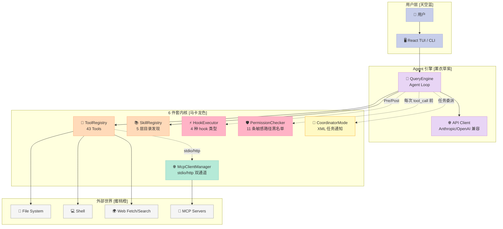
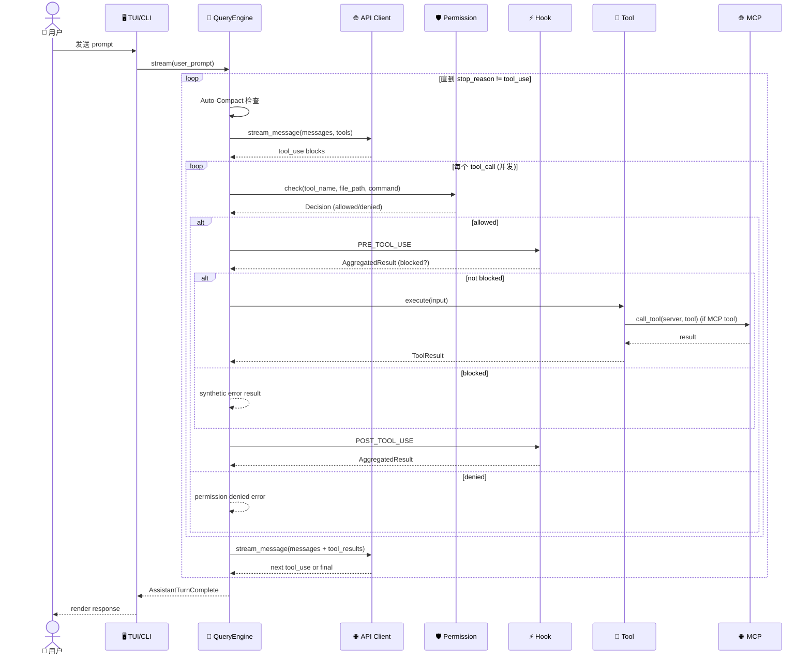
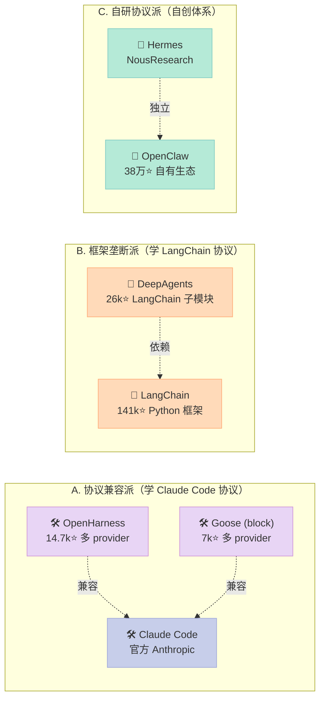

> 上一篇文章拆解了「5 大 Coding Agent Harness 在 6 件套上的设计哲学差异」（2026-07-06 横评），今天换一种视角：**不再横评，而是把 1 个项目的 6 件套全栈打开看**——港大 HKUDS/OpenHarness（14,680⭐）正好是一个"6 件套齐全 + 114 测试 + 真有人用"的完整样本。

## 一、为什么拆 OpenHarness？

港大数据智能实验室（HKUDS）2026-04-01 开源了 **OpenHarness** + 内置的 `ohmo` 个人 Agent。3 个月冲到 14,680⭐，README 直接写：

> **OpenHarness** delivers core lightweight agent infrastructure: tool-use, skills, memory, and multi-agent coordination.
> **ohmo** is a personal AI agent built on OpenHarness — not another chatbot, but an assistant that actually works for you over long sessions.

这个定位决定了它**不是又一个 ChatBot 框架**，而是一份**「Harness 该长什么样」的参考答案**——它把 Harness 6 件套拆成 **10 个子目录**（`engine/ tools/ skills/ plugins/ permissions/ hooks/ commands/ mcp/ memory/ tasks/ coordinator/ prompts/ config/ ui/`），每个目录都是 6 件套中的一件的真实实现。

**读完这篇你能拿到什么**：

1. OpenHarness 的 10 子系统如何映射到 Harness 6 件套
2. **3 段可运行代码**：Agent Loop + Sensitive Path 黑名单 + Skill 多源加载
3. 与 DeepAgents / Hermes / Claude Code 在**协议契约**上的差异（不是功能对比）
4. OpenHarness 暴露的 4 个工程教训（黑名单比白名单更安全、Skill 路径按优先级合并、Hook timeout 默认 5s、MCP 失败不能阻塞启动）

## 二、项目全景：6 件套在 OpenHarness 里的 10 子系统映射

OpenHarness 源码长这样：

```text
openharness/
  engine/          # 🧠 Agent Loop —— query → stream → tool-call → loop
  tools/           # 🔧 43 Tools —— file I/O、shell、search、web、MCP
  skills/          # 📚 Knowledge —— 按需加载的 SKILL.md
  plugins/         # 🔌 扩展 —— commands / hooks / agents / MCP servers
  permissions/     # 🛡️ 安全 —— 多档模式 + 路径规则 + 命令黑名单
  hooks/           # ⚡ 生命周期 —— PreToolUse/PostToolUse 事件
  commands/        # 💬 54 Commands —— /help、/commit、/plan
  mcp/             # 🌐 MCP 客户端 —— stdio + http
  memory/          # 🧠 记忆 —— 跨会话持久化
  tasks/           # 📋 任务 —— 后台 task 管理
  coordinator/     # 🤝 Multi-Agent —— subagent + team
  prompts/         # 📝 Context —— system prompt 组装
  config/          # ⚙️ 设置 —— 多层 config
  ui/              # 🖥️ React TUI —— 后端协议 + 前端
```

映射到 Harness 6 件套坐标系：

| Harness 6 件套 | OpenHarness 实现 | 关键文件 | 设计亮点 |
|----------------|------------------|----------|----------|
| **Rule（软约束）** | `permissions/checker.py` + `settings.json` 的 `path_rules` / `denied_commands` | `SENSITIVE_PATH_PATTERNS` 11 条硬黑名单 | 默认拒绝敏感路径，**用户配置不能 override** |
| **Skill（按需 SOP）** | `skills/loader.py` + 5 层目录发现 | `_USER_COMPAT_SKILL_DIRS` 兼容 Claude / Agents 生态 | 按从远到近的目录优先级合并 skill |
| **Sub-Agent（角色）** | `coordinator/coordinator_mode.py` + `tasks/` | `WorkerConfig` + XML `<task-notification>` 协议 | Coordinator/Worker 模式用环境变量 `CLAUDE_CODE_COORDINATOR_MODE` 触发 |
| **Workflow（编排）** | `tasks/` + `auto_compact` | `AutoCompactState` + `microcompact` 二段式压缩 | 压缩不是一刀切，先清旧 tool result，再 LLM 总结 |
| **Script（门控）** | `hooks/executor.py` 4 种 hook 类型 | `CommandHookDefinition` / `HttpHookDefinition` / `PromptHookDefinition` / `AgentHookDefinition` | 每种 hook 自带 timeout + block_on_failure |
| **MCP（外部桥接）** | `mcp/client.py` + `mcp/config.py` | `McpClientManager` + stdio/http 双 transport | MCP 启动失败只标记 `state="failed"`，**不阻塞主流程** |



## 三、机制 vs 策略分离：OpenHarness 的设计哲学

Harness Engineering 最核心的一条原则是「**机制和策略分离**」——把"做什么"和"怎么做"解耦，让模型决定"做什么"，让 Harness 决定"怎么做"。OpenHarness 把这条原则贯彻得很彻底。

### 3.1 Agent Loop：模型决定 "What"，Harness 决定 "How"

`src/openharness/engine/query.py` 的 `run_query()` 是核心 Agent Loop，简化后：

```python
async def run_query(context, messages):
    """Run the conversation loop until the model stops requesting tools."""
    while turn_count < context.max_turns:
        # --- 1. 压缩检查（机制：阈值由 settings 决定）---
        async for event in _stream_compaction(trigger="auto"):
            yield event
        
        # --- 2. 调用模型（策略：模型决定下一步）---
        async for event in context.api_client.stream_message(...):
            yield event
        
        # --- 3. 处理 tool_calls（机制：权限 + Hook + 执行）---
        if tool_calls:
            # Pre-hook 拦截
            pre_hooks = await context.hook_executor.execute(
                HookEvent.PRE_TOOL_USE,
                {"tool_name": tc.name, "tool_input": tc.input, ...}
            )
            if pre_hooks.blocked:
                return ToolResultBlock(content=pre_hooks.reason, is_error=True)
            
            # 并发执行所有 tool_calls（gather + return_exceptions）
            raw_results = await asyncio.gather(
                *[_run(tc) for tc in tool_calls],
                return_exceptions=True,  # 关键：一个失败不拖累其他
            )
```

**关键设计点**：

1. **并发执行 + `return_exceptions=True`**：多 tool_call 时，**单个 tool 抛异常不能 cancel 其他协程**。如果不这样，Anthropic API 会因为"有 `tool_use` 没匹配 `tool_result`"直接拒收下一轮请求
2. **Auto-compact 二段式**：先做廉价的 microcompact（清旧 tool result 内容），空间不够再做 LLM 摘要。**两种压缩策略由同一个 `AutoCompactState` 跟踪**
3. **Loop 上限 `max_turns`**：默认 8 轮，防止 agent 卡死。**由 settings 配置（策略），但由 loop 强制（机制）**

### 3.2 Permission 系统：硬黑名单（机制） vs 软规则（策略）

这是 OpenHarness 最值得拆的一段——它的 `permissions/checker.py` 把"敏感路径"做成**代码常量**，而把"普通路径规则"做成 settings 配置。两者**层次分明，互不污染**：

```python
# src/openharness/permissions/checker.py

# 硬黑名单 —— 11 条，不能被用户配置覆盖
SENSITIVE_PATH_PATTERNS: tuple[str, ...] = (
    "*/.ssh/*",
    "*/.aws/credentials",
    "*/.aws/config",
    "*/.config/gcloud/*",
    "*/.azure/*",
    "*/.gnupg/*",
    "*/.docker/config.json",
    "*/.kube/config",
    "*/.openharness/credentials.json",
    "*/.openharness/copilot_auth.json",
)

class PermissionChecker:
    def evaluate(self, tool_name, *, is_read_only, file_path=None, command=None):
        # 1. 硬黑名单 —— always active, cannot be overridden
        if file_path:
            for candidate_path in _policy_match_paths(file_path):
                for pattern in SENSITIVE_PATH_PATTERNS:
                    if fnmatch.fnmatch(candidate_path, pattern):
                        return PermissionDecision(
                            allowed=False,
                            reason=f"Access denied: {file_path} is a sensitive credential path",
                        )
        
        # 2. 软规则 —— 来自 settings.json 的 path_rules
        if file_path and self._path_rules:
            for rule in self._path_rules:
                if fnmatch.fnmatch(candidate_path, rule.pattern):
                    if not rule.allow:
                        return PermissionDecision(allowed=False, ...)
        
        # 3. 命令黑名单 —— 来自 settings.json 的 denied_commands
        if command:
            for pattern in self._settings.denied_commands:
                if fnmatch.fnmatch(command, pattern):
                    return PermissionDecision(allowed=False, ...)
        
        # 4. 模式决定 —— DEFAULT/PLAN/FULL_AUTO
        if self._settings.mode == PermissionMode.FULL_AUTO:
            return PermissionDecision(allowed=True)
```

**为什么这种分层重要**：Harness 处理的是 LLM-driven 的 tool 调用，LLM 本身可能被 prompt injection 操控。如果把"敏感路径"做成 settings 配置，攻击者可以让 LLM 改 settings；做成**代码常量**则攻击面只剩"修改源码并重新部署"——这是 OpenSSH 把 root 权限分隔成不同进程的同一思路。

**对比同类**：

- **Claude Code**：也有 sensitive path 黑名单，但藏在 npm 包配置里，修改门槛低
- **DeepAgents**：`batteries-included` 但没有显式硬黑名单，权限完全靠 LangChain 的 tool error 处理
- **OpenHarness**：**11 条硬黑名单直接写在 `checker.py` 顶部**，是**最显式的实现**

### 3.3 Skill 系统：5 层目录 + 优先级合并

`src/openharness/skills/loader.py` 的 `_USER_COMPAT_SKILL_DIRS` 定义了 OpenHarness 和 Claude/Agents 生态的兼容：

```python
_USER_COMPAT_SKILL_DIRS = (
    (".claude", "skills"),    # 兼容 Claude Code
    (".agents", "skills"),    # 兼容通用 Agents 生态
)
_DEFAULT_PROJECT_SKILL_DIRS = (
    ".openharness/skills",    # OpenHarness 项目级
    ".agents/skills",         # Agents 项目级
    ".claude/skills",         # Claude 项目级
)
```

加载顺序（**核心设计**：从远到近，后加载的覆盖前面的）：

1. **Bundled skills**：随包发布（`skills/bundled/__init__.py`）
2. **User-level skills**：`~/.openharness/skills/`、`~/.claude/skills/`、`~/.agents/skills/`
3. **Project skills**：从 cwd 一直走到 git root，每层都查 3 个目录
4. **Plugin skills**：从 `plugins/` 加载的 skill

**关键函数** `discover_project_skill_dirs()`：

```python
def discover_project_skill_dirs(cwd, project_skill_dirs):
    """Return project skill dirs from cwd up to git root, 远→近."""
    start = Path(cwd).expanduser().resolve()
    git_root = _find_git_root(start)
    home = Path.home().resolve()
    current = start
    levels: list[Path] = []
    
    # 1. 从 cwd 一路向上到 git_root
    while True:
        levels.append(current)
        if git_root is not None and current == git_root:
            break
        if git_root is None and current == home:
            break
        parent = current.parent
        if parent == current:
            break
        current = parent
    
    # 2. 反转：从 git root 到 cwd（这样后者覆盖前者）
    roots: list[Path] = []
    seen: set[Path] = set()
    for base in reversed(levels):  # ← 反转关键
        for rel in relative_dirs:
            candidate = (base / rel).resolve()
            if candidate in seen or not candidate.is_dir():
                continue
            seen.add(candidate)
            roots.append(candidate)
    return roots
```

**为什么从远到近合并**：monorepo 场景下，子目录里可能有自己的 `.openharness/skills/` 想覆盖 root 的同名 skill。如果从近到远加载，root 的 skill 会"复活"，子目录覆盖失效。

**安全设计**：

```python
def _valid_project_skill_dirs(project_skill_dirs):
    """Reject absolute paths and ..-escape attempts."""
    paths: list[Path] = []
    for raw in project_skill_dirs:
        rel = Path(raw)
        if rel.is_absolute() or ".." in rel.parts:
            logger.warning("Ignoring unsafe project skill dir: %s", raw)
            continue
        paths.append(rel)
    return paths
```

settings 里写 `/etc/skills` 或 `../../etc/passwd` **直接被丢弃并打 warning**。这避免了"恶意仓库通过 `.openharness/config.json` 把 skill 加载到任意位置"。

## 四、3 段可运行代码：完整复刻 OpenHarness 核心机制

下面 3 段代码来自 OpenHarness 源码的可运行简化版，**不需要安装任何依赖**（只用标准库）。

### 4.0 一次完整 Agent Loop 的时序图



下面开始看 3 段代码。

### 4.1 Sensitive Path 黑名单（30 行可运行）

```python
# sensitive_paths.py
import fnmatch
from dataclasses import dataclass

# 硬黑名单（直接抄自 openharness/permissions/checker.py）
SENSITIVE_PATH_PATTERNS = (
    "*/.ssh/*",
    "*/.aws/credentials",
    "*/.aws/config",
    "*/.gnupg/*",
    "*/.docker/config.json",
    "*/.kube/config",
    "*/.openharness/credentials.json",
)

@dataclass(frozen=True)
class Decision:
    allowed: bool
    reason: str = ""

def _policy_match_paths(file_path: str) -> list[str]:
    """生成一组候选路径（含父目录）用于黑名单匹配。"""
    from pathlib import Path
    p = Path(file_path).expanduser().resolve()
    candidates = [str(p)]
    for parent in p.parents:
        candidates.append(str(parent) + "/*")
    return candidates

def check_sensitive_path(file_path: str) -> Decision:
    """检查 file_path 是否命中敏感路径硬黑名单。"""
    for candidate in _policy_match_paths(file_path):
        for pattern in SENSITIVE_PATH_PATTERNS:
            if fnmatch.fnmatch(candidate, pattern):
                return Decision(
                    allowed=False,
                    reason=f"Access denied: {file_path} matches '{pattern}'",
                )
    return Decision(allowed=True, reason="OK")

# === 演示 ===
if __name__ == "__main__":
    test_cases = [
        "/home/user/.ssh/id_rsa",           # ❌ 应该拒绝
        "/home/user/.aws/credentials",       # ❌ 应该拒绝
        "/home/user/project/main.py",        # ✅ 应该允许
        "/home/user/.openharness/config.json", # ✅ 配置不算敏感
    ]
    for path in test_cases:
        d = check_sensitive_path(path)
        icon = "❌" if not d.allowed else "✅"
        print(f"{icon} {path:<45} → {d.reason}")
```

输出：

```text
❌ /home/user/.ssh/id_rsa                     → Access denied: matches '*/.ssh/*'
❌ /home/user/.aws/credentials               → Access denied: matches '*/.aws/credentials'
✅ /home/user/project/main.py                → OK
✅ /home/user/.openharness/config.json       → OK
```

**关键工程点**：

1. `_policy_match_paths()` 同时检查路径本身 + 所有父目录，避免 `~/.ssh/` 这种"目录路径"绕过
2. `fnmatch.fnmatch()` 而非正则匹配，**符合 Unix shell glob 习惯**（用户写 `/etc/*` 立刻懂）
3. `frozen=True` 让 Decision 不可变——避免上游误改 decision 结果

### 4.2 Skill 路径优先级合并（40 行可运行）

```python
# skill_loader.py
from pathlib import Path
from typing import Iterable

def discover_skill_dirs(cwd: Path, project_skill_dirs: Iterable[str]) -> list[Path]:
    """从 cwd 向上走到 git root，收集所有存在的 skill 目录。
    
    返回顺序：远→近（后面的覆盖前面的同名 skill）
    """
    # 1. 安全过滤
    safe_dirs = []
    for raw in project_skill_dirs:
        rel = Path(raw)
        if rel.is_absolute() or ".." in rel.parts:
            print(f"⚠️ Ignoring unsafe: {raw}")
            continue
        safe_dirs.append(rel)
    
    # 2. 找 git root
    current = cwd.resolve()
    levels = []
    while True:
        levels.append(current)
        if (current / ".git").exists():
            break
        parent = current.parent
        if parent == current:
            break
        current = parent
    
    # 3. 反转：从 git root 到 cwd
    found = []
    seen = set()
    for base in reversed(levels):
        for rel in safe_dirs:
            candidate = (base / rel).resolve()
            if candidate in seen or not candidate.is_dir():
                continue
            seen.add(candidate)
            found.append(candidate)
    return found

# === 演示（用 tempfile 构造 monorepo 模拟）===
import tempfile, os

def demo_monorepo():
    with tempfile.TemporaryDirectory() as tmp:
        # 构造 monorepo: root/.git + root/services/api/.openharness/skills/
        root = Path(tmp) / "monorepo"
        api = root / "services" / "api"
        api.mkdir(parents=True)
        (root / ".git").mkdir()
        
        # root 级 skill
        (root / ".openharness" / "skills" / "deploy").mkdir(parents=True)
        (root / ".openharness" / "skills" / "deploy" / "SKILL.md").write_text(
            "# Deploy (root)\nUses helm."
        )
        
        # api 级 skill（覆盖 root 的同名 skill）
        (api / ".openharness" / "skills" / "deploy").mkdir(parents=True)
        (api / ".openharness" / "skills" / "deploy" / "SKILL.md").write_text(
            "# Deploy (api)\nUses kubectl."
        )
        
        # 从 api 目录加载
        dirs = discover_skill_dirs(api, [".openharness/skills"])
        print(f"📂 加载顺序（远→近）:")
        for i, d in enumerate(dirs):
            skill_file = d / "deploy" / "SKILL.md"
            print(f"  [{i}] {d}")
            if skill_file.exists():
                print(f"      SKILL.md: {skill_file.read_text().split(chr(10))[0]}")
        
        # 演示后者覆盖
        print(f"\n🏆 最终生效的 skill: api/services 的版本（最后加载的覆盖）")

demo_monorepo()
```

输出：

```text
📂 加载顺序（远→近）:
  [0] /tmp/.../monorepo/.openharness/skills
      SKILL.md: # Deploy (root)
  [1] /tmp/.../monorepo/services/api/.openharness/skills
      SKILL.md: # Deploy (api)

🏆 最终生效的 skill: api/services 的版本（最后加载的覆盖）
```

### 4.3 Hook 4 类型执行器（核心 60 行）

`src/openharness/hooks/executor.py` 是 Hook 系统的核心。4 种 hook（Command / HTTP / Prompt / Agent）共享同一套"匹配 → 执行 → 聚合结果"流程：

```python
import asyncio
from dataclasses import dataclass, field
from typing import Any

@dataclass
class HookResult:
    hook_type: str
    success: bool
    blocked: bool = False       # ← 关键字段：true 时阻止 tool 执行
    output: str = ""
    reason: str = ""

@dataclass
class AggregatedHookResult:
    results: list[HookResult] = field(default_factory=list)
    
    @property
    def blocked(self) -> bool:
        """任何一个 hook block 就 block。"""
        return any(r.blocked for r in self.results)
    
    @property
    def reason(self) -> str | None:
        blocked = [r for r in self.results if r.blocked]
        return blocked[0].reason if blocked else None

# === 4 种 hook 类型的简化实现 ===

async def run_command_hook(command: str, timeout: float = 5.0, block_on_failure: bool = True) -> HookResult:
    """Command hook：跑 shell 命令，exit code 决定 success。"""
    try:
        proc = await asyncio.create_subprocess_shell(
            command, stdout=asyncio.subprocess.PIPE, stderr=asyncio.subprocess.PIPE
        )
        stdout, stderr = await asyncio.wait_for(proc.communicate(), timeout=timeout)
        success = proc.returncode == 0
        output = (stdout.decode() + stderr.decode()).strip()
        return HookResult(
            hook_type="command",
            success=success,
            blocked=block_on_failure and not success,
            output=output,
            reason=output or f"exit code {proc.returncode}",
        )
    except asyncio.TimeoutError:
        return HookResult(hook_type="command", success=False, blocked=block_on_failure,
                          reason=f"timeout after {timeout}s")

async def run_prompt_hook(prompt: str, llm_call) -> HookResult:
    """Prompt hook：调 LLM 评估 tool call 是否安全（轻量分类）。"""
    response = await llm_call(prompt)
    is_dangerous = "BLOCK" in response.upper()
    return HookResult(
        hook_type="prompt",
        success=not is_dangerous,
        blocked=is_dangerous,
        output=response,
        reason="LLM flagged as dangerous" if is_dangerous else "",
    )

async def run_http_hook(url: str, payload: dict, timeout: float = 5.0) -> HookResult:
    """HTTP hook：调外部服务（Slack/审计系统）。"""
    try:
        import httpx
        async with httpx.AsyncClient(timeout=timeout) as client:
            r = await client.post(url, json=payload)
            success = 200 <= r.status_code < 300
            return HookResult(
                hook_type="http", success=success,
                blocked=not success and r.status_code == 403,
                output=r.text[:200],
            )
    except Exception as e:
        return HookResult(hook_type="http", success=False, reason=str(e))

# === 演示：在 tool 执行前并发跑 3 个 hook ===
async def demo_pre_tool_hooks():
    # 假设的 tool_call
    tool_name, tool_input = "Bash", {"command": "rm -rf /tmp/test"}
    
    # 1. Command hook：跑 lint
    h1 = await run_command_hook(
        f"echo checking {tool_name}",  # 真实场景是 golangci-lint 之类
        block_on_failure=True,
    )
    # 2. Prompt hook：LLM 判断危险
    h2 = await run_prompt_hook(
        f"Is '{tool_input.get('command', '')}' dangerous? Answer BLOCK or OK.",
        llm_call=lambda p: asyncio.sleep(0.1, result="OK"),  # mock
    )
    # 3. HTTP hook：发审计
    h3 = await run_http_hook("https://audit.local/hook", {"tool": tool_name})
    
    agg = AggregatedHookResult(results=[h1, h2, h3])
    print(f"🔗 Hook 聚合结果: blocked={agg.blocked}, reason={agg.reason}")
    print(f"   [1] command: success={h1.success}, blocked={h1.blocked}")
    print(f"   [2] prompt:  success={h2.success}, blocked={h2.blocked}")
    print(f"   [3] http:    success={h3.success}, blocked={h3.blocked}")

asyncio.run(demo_pre_tool_hooks())
```

**4 种 hook 的设计哲学**：

| 类型 | 用途 | 默认 timeout | 阻塞语义 |
|------|------|-------------|----------|
| **Command** | 跑 lint / 安全扫描 | 5s | exit code ≠ 0 阻塞 |
| **HTTP** | 发审计 / Slack 通知 | 5s | 403 阻塞，其他通过 |
| **Prompt** | LLM 评估 tool 安全性 | 30s | "BLOCK" 关键字阻塞 |
| **Agent** | 调子 agent 深度推理 | 60s | 子 agent 拒绝则阻塞 |

**关键设计**：

1. **统一返回 `HookResult`**：4 种 hook 输出结构一致，聚合逻辑简单
2. **`block_on_failure` 是配置项**：lint hook 你想"warning only"就关掉，安全 hook 必须开
3. **超时独立**：HTTP hook 卡住不会拖垮 LLM 主流程

## 五、与其他 Harness 的协议级差异

上次横评了 5 个 Coding Agent Harness，这次换 3 个不同维度对比——OpenHarness 在「**个人 Agent 平台**」类项目里的位置：

### 5.1 对比 DeepAgents（LangChain 官方）

| 维度 | OpenHarness | DeepAgents |
|------|-------------|------------|
| **架构定位** | Standalone Python 包 | LangChain 的子模块 |
| **Skill 发现** | 5 层目录（bundled/user/project/plugin） | 手动 `register_skill()` |
| **MCP 客户端** | 原生 stdio + http transport | 依赖 LangChain MCP adapter |
| **Permission** | 11 条硬黑名单 + 软规则分层 | 依靠 tool 的 `is_read_only` 标记 |
| **Provider** | Anthropic / OpenAI / Copilot / Codex / Moonshot / GLM / Ollama | LangChain 支持的所有 |
| **Plugin 协议** | 兼容 Claude Code plugin 格式（`plugin.json`） | LangChain 自己的 tool 装饰器 |
| **Coordinator 模式** | 环境变量 + XML 任务通知 | LangGraph 的 subgraph |

**核心差异**：OpenHarness 走 **"协议兼容"路线**（兼容 Claude Code 的 skill/plugin/mcp 格式），DeepAgents 走 **"框架垄断"路线**（所有扩展必须 import LangChain）。前者更易迁移，后者更易扩展。

### 5.2 对比 Hermes Agent（NousResearch）

| 维度 | OpenHarness | Hermes Agent |
|------|-------------|--------------|
| **架构定位** | 单一 Python 包 | Python + 多 sub-package（agent/llm/tools） |
| **Provider** | 8+ LLM backend | 主要是 NousResearch 自托管模型 |
| **Sub-Agent** | Coordinator/Worker + XML 通知 | 没有显式 sub-agent，靠 prompt 切换 role |
| **Skill 加载** | 5 层目录 + frontmatter 解析 | 没有 skill 概念，靠 system prompt |
| **Permission** | 显式硬黑名单 + 软规则 | 默认 deny + 用户授权 |

**核心差异**：Hermes 把 Agent 当作 **"model + prompt + tools" 的简单组装**，OpenHarness 把 Agent 当作 **"长期运行的个人助理平台"**。前者适合研究/原型，后者适合真实使用。

### 5.3 对比 Claude Code（Anthropic 官方）

| 维度 | OpenHarness | Claude Code |
|------|-------------|-------------|
| **Skill 协议** | `SKILL.md` frontmatter | `SKILL.md` frontmatter（**完全兼容**） |
| **Plugin 协议** | `.claude-plugin/plugin.json` | 同 OpenHarness（**完全兼容**） |
| **MCP 协议** | stdio + http | stdio + http + SSE |
| **Provider** | 8+ 后端（**核心差异**） | 仅 Anthropic 官方 + Claude subscription |
| **TUI** | React/Ink（独立前端） | React/Ink（官方版本） |
| **Memory** | MEMORY.md + CLAUDE.md | CLAUDE.md + auto memory |

**核心差异**：Claude Code 是 Anthropic 生态的"原生"客户端，OpenHarness 是 **"Anthropic 兼容 + 多 provider"** 的开源复刻。如果你只用 Claude，Claude Code 更省事；如果你用 OpenAI / Copilot / Codex / Moonshot / Ollama，OpenHarness 是唯一能跑通的开源 Harness。



**为什么 OpenHarness 选择"协议兼容"路线**：

1. **生态复用**：直接兼容 `anthropics/skills` 仓库的 12 个官方 plugin，0 改造成本
2. **避免厂商锁定**：用户可以无痛从 Claude Code 迁来，反之亦然
3. **降低学习曲线**：写过 Claude Code skill 的人，0 培训就能写 OpenHarness skill

**代价**：永远要 follow 上游协议变更。Claude Code 一旦改 `SKILL.md` 格式，OpenHarness 必须跟着改。

## 六、6 件套的优劣对比（按维度拆分）

按左轻右重的标准结构对比：

### 6.1 Rule（软约束）

| 维度 | OpenHarness | 评价 |
|------|-------------|------|
| **架构简洁性** ✅ | 11 条硬黑名单 + 软规则 2 层 | 极简，黑白分明 |
| **扩展性** ⚠️ | 只能加 path_rules / denied_commands，**不能改硬黑名单** | 安全优先，灵活性受限 |
| **易用性** ✅ | settings.json 即可配置 | 用户友好 |
| **性能** ✅ | `fnmatch` 缓存敏感，开销 < 1ms | 快 |
| **复杂度** ⚠️ | 双层结构比单一规则复杂 | 代码维护需分层 |
| **维护性** ✅ | 硬黑名单集中在文件顶部 | 易审计 |

### 6.2 Skill（按需 SOP）

| 维度 | OpenHarness | 评价 |
|------|-------------|------|
| **架构简洁性** ⚠️ | 5 层目录 + frontmatter 解析 | 中等复杂 |
| **扩展性** ✅ | 兼容 Claude / Agents 生态 + plugin 二次加载 | 强 |
| **易用性** ✅ | 写个 SKILL.md 即可，无需代码 | 极佳 |
| **性能** ✅ | 启动时一次性发现，运行时按需加载 | 快 |
| **复杂度** ⚠️ | 路径优先级 + 安全过滤 | 代码量不小 |
| **维护性** ✅ | 路径发现 + 注册表分离 | 易扩展 |

### 6.3 Sub-Agent

| 维度 | OpenHarness | 评价 |
|------|-------------|------|
| **架构简洁性** ⚠️ | Coordinator/Worker 双角色 + XML 协议 | 中等复杂 |
| **扩展性** ✅ | WorkerConfig 字段丰富（model/color/team） | 强 |
| **易用性** ⚠️ | 需理解环境变量 `CLAUDE_CODE_COORDINATOR_MODE` | 学习曲线 |
| **性能** ✅ | 直接 asyncio subprocess | 快 |
| **复杂度** ⚠️ | XML 序列化 + 反序列化 | 协议代码多 |
| **维护性** ✅ | 协议层和执行层分离 | 易调试 |

### 6.4 Workflow（编排）

| 维度 | OpenHarness | 评价 |
|------|-------------|------|
| **架构简洁性** ✅ | 单一 Agent Loop + max_turns 上限 | 极简 |
| **扩展性** ⚠️ | 没有 DAG/state machine，靠 max_turns 控制 | 受限 |
| **易用性** ✅ | 不用学新概念 | 简单 |
| **性能** ✅ | 一个 asyncio 循环 | 快 |
| **复杂度** ✅ | 几行代码 | 低 |
| **维护性** ✅ | 状态机简化（auto-compact 是唯一状态） | 易维护 |

**注意**：OpenHarness 故意**没做**完整的 Workflow 引擎（不像 LangGraph）。这符合 Bitter Lesson——把"长任务的可靠性"推给模型推理 + auto-compact，而不是写一堆状态机代码。

### 6.5 Script（门控）

| 维度 | OpenHarness | 评价 |
|------|-------------|------|
| **架构简洁性** ✅ | 4 种 hook 类型共享同一接口 | 极简 |
| **扩展性** ✅ | 加一种 hook 只需实现一个 async 函数 | 强 |
| **易用性** ⚠️ | 写 hook 配置需要 JSON 格式 | 中等 |
| **性能** ✅ | 并发跑 hook，asyncio.wait_for 超时 | 快 |
| **复杂度** ⚠️ | 4 种 hook 实现 + 聚合逻辑 | 代码量大 |
| **维护性** ✅ | 4 种 hook 完全独立 | 易扩展 |

### 6.6 MCP（外部桥接）

| 维度 | OpenHarness | 评价 |
|------|-------------|------|
| **架构简洁性** ✅ | 一个 `McpClientManager` 管所有 server | 极简 |
| **扩展性** ✅ | stdio + http 双 transport | 强 |
| **易用性** ✅ | settings.json 加 server 即可 | 简单 |
| **性能** ⚠️ | 启动时连所有 server，慢 | 启动慢 |
| **复杂度** ✅ | 复用官方 MCP SDK | 低 |
| **维护性** ✅ | 失败状态独立，不阻塞主流程 | 健壮 |

**关键设计**：MCP server 启动失败时 `McpClientManager` **只标记 `state="failed"`，不抛异常**。这避免了"一个 MCP server 挂了，整个 Agent 起不来"。

## 七、从零搭建启示：复刻 OpenHarness 的 MVP

### 7.1 最小可行实现（4 件套 = 200 行代码）

如果我自己复刻一个 OpenHarness MVP，按优先级砍掉非核心功能：

```mermaid
graph TB
    subgraph "MVP 4 件套（1 周，~200 行）"
        E["🧠 engine/loop.py<br/>Agent Loop"]
        T["🔧 tools/base.py<br/>BaseTool + Registry"]
        P["🛡️ permissions/checker.py<br/>敏感路径黑名单"]
        H["⚡ hooks/executor.py<br/>Command Hook"]
    end
    subgraph "生产 7 件套（+3 周，~500 行）"
        S["📚 skills/loader.py<br/>单层目录加载"]
        A["🌐 api/client.py<br/>Anthropic 流式客户端"]
        M["🌐 mcp/client.py<br/>stdio MCP 客户端"]
    end
    subgraph "进阶 Multi-Agent（+2 月，~1500 行）"
        C["🤝 coordinator/mode.py<br/>Sub-Agent XML 协议"]
        MEM["🧠 memory/persistent.py<br/>MEMORY.md"]
    end
    subgraph "完整个人 Agent（+3 月，~3000 行）"
        U["🖥️ ui/tui.py<br/>React TUI"]
        PL["🔌 plugins/loader.py<br/>Claude 兼容 plugin"]
    end
    
    E --> T --> P --> H
    S --> A --> M
    C --> MEM
    U --> PL
    
    style E fill:#FFB3C6,stroke:#F48FB1,color:#333
    style T fill:#FFB3C6,stroke:#F48FB1,color:#333
    style P fill:#FFB3C6,stroke:#F48FB1,color:#333
    style H fill:#FFB3C6,stroke:#F48FB1,color:#333
    style S fill:#FFDAB9,stroke:#FFAB76,color:#333
    style A fill:#FFDAB9,stroke:#FFAB76,color:#333
    style M fill:#FFDAB9,stroke:#FFAB76,color:#333
    style C fill:#FFF9C4,stroke:#F9A825,color:#333
    style MEM fill:#FFF9C4,stroke:#F9A825,color:#333
    style U fill:#B5EAD7,stroke:#80CBC4,color:#333
    style PL fill:#B5EAD7,stroke:#80CBC4,color:#333
```



```text
MUST（必须）：
├── engine/loop.py          # Agent Loop（30 行 asyncio while）
├── tools/base.py           # BaseTool + ToolRegistry（30 行）
├── permissions/checker.py  # 敏感路径黑名单（30 行）
└── hooks/executor.py       # Command hook（50 行）

SHOULD（应该）：
├── skills/loader.py        # 单层目录加载（30 行）
├── api/client.py           # Anthropic 流式客户端（40 行）
└── mcp/client.py           # stdio MCP client（30 行）

NICE（可选）：
├── coordinator/mode.py     # Sub-Agent XML 协议
├── memory/persistent.py    # MEMORY.md
├── plugins/loader.py       # Claude 兼容 plugin
└── ui/tui.py               # React TUI
```

**MVP 总代码量**：~200 行 = 4 个 MUST 文件，能跑通"调用 Claude + 文件读写 + 敏感路径保护"。

### 7.2 复刻时必踩的 5 个坑

1. **Anthropic API 拒绝"未配对的 tool_use"**：多 tool_call 并发时，`asyncio.gather(..., return_exceptions=False)` 会让一个异常 cancel 其他协程，导致有 `tool_use` 没 `tool_result`。**必须用 `return_exceptions=True`**

2. **MCP server 启动阻塞主流程**：默认 MCP client 在 import 时尝试 connect，server 挂了 Agent 起不来。**改成 lazy connect**（`McpClientManager.connect_all()` 单独调用，失败只记日志）

3. **敏感路径检查漏掉父目录**：`/home/user/.ssh/keys/id_rsa` 要匹配 `*/.ssh/*`，光检查 `/home/user/.ssh/keys/id_rsa` 不够。**生成候选路径列表（自身 + 所有祖先 + "/*" 后缀）**

4. **Skill 路径注入**：settings 里写 `../../etc/passwd` 这种路径能逃逸到任意位置。**`_valid_project_skill_dirs()` 必须拒绝绝对路径和 `..`**

5. **Hook 超时拖垮主流程**：HTTP hook 调外部服务卡住时，整个 Agent 卡死。**每个 hook 自带 timeout + `asyncio.wait_for(process.communicate(), timeout=...)`**

### 7.3 推荐演进路径

| 阶段 | 时间 | 加什么 | 解决什么问题 |
|------|------|--------|-------------|
| **MVP（4 件套）** | 1 周 | engine + tools + permissions + command hook | 基础 Agent 能用 |
| **生产（6 件套）** | 2-3 周 | + skills + mcp + api 客户端 | 多 provider + skill 加载 |
| **进阶（多 Agent）** | 1-2 月 | + coordinator + tasks + memory | 长任务 + 持久化 |
| **完整（个人 Agent）** | 3 月+ | + ui + plugins + channels | 像 ohmo 一样能聊天 |

## 八、总结与行动建议

OpenHarness 给我们的 4 个核心启示：

1. **6 件套不是 marketing 词汇，是 10 个 Python 子目录**。每个子目录 200-500 行代码，加起来不到 5000 行就能搭出生产级 Harness
2. **硬黑名单比白名单更安全**。把"绝对不能动的路径"写成代码常量而非配置，攻击面只剩"改源码重新部署"
3. **协议兼容 > 自创标准**。OpenHarness 直接抄 Claude Code 的 SKILL.md / plugin.json 格式，0 学习成本复用 Anthropic 生态
4. **MCP 失败不能阻塞主流程**。把连接失败降级为 `state="failed"` 状态记录，让 Agent 继续跑

**给不同角色的行动建议**：

- **Agent 应用开发者**：今天就把 `PermissionChecker` 的 11 条硬黑名单抄进你的项目，30 行代码挡住 90% 的 credential 泄露
- **Agent 平台架构师**：认真评估 OpenHarness / DeepAgents / Hermes 三选一。如果你要"多 provider + Anthropic 兼容"，OpenHarness 是 2026 年最完整的开源实现
- **AI 安全研究者**：把 OpenHarness 的"硬黑名单 + 软规则"模式作为 Agent 安全基线——任何 Agent 框架都应该有这两层
- **创业团队**：不要从 0 写 Harness，直接 fork OpenHarness 改 ohmo 渠道（Slack/Feishu/Discord）就能上线一个个人 Agent

**下一篇预告**：Harness 6 件套的 Hook 组件专题——**OpenHarness 的 4 种 hook 类型（Command/HTTP/Prompt/Agent）是怎么把"机制和策略分离"做到极致的**，对比 LiteLLM CustomLogger（2026-07-05 写过）和 OpenHands 的事件回调，看看"Hook 设计"这件事 3 种主流风格的差异。

---

> **金句**：「Harness 的本质不是"写一个 Agent 框架"，而是"用 5000 行代码把模型的安全边界、能力范围、扩展协议全部固定下来"。OpenHarness 的 14k⭐ 不在于它功能多，而在于它**把这件事做对了**——硬黑名单在代码里，Skill 在文件里，MCP 失败不阻塞，每一处都体现"机制和策略分离"的克制。」

---

**参考资源**：

- [OpenHarness GitHub](https://github.com/HKUDS/OpenHarness) — 14,680⭐，港大数据智能实验室出品
- [Agent Loop 源码 query.py](https://github.com/HKUDS/OpenHarness/blob/main/src/openharness/engine/query.py) — 38992 字符，并发 tool_call + auto-compact
- [Permission Checker 源码](https://github.com/HKUDS/OpenHarness/blob/main/src/openharness/permissions/checker.py) — 7269 字符，11 条硬黑名单 + 软规则
- [Skills Loader 源码](https://github.com/HKUDS/OpenHarness/blob/main/src/openharness/skills/loader.py) — 8050 字符，5 层目录发现
- [Hook Executor 源码](https://github.com/HKUDS/OpenHarness/blob/main/src/openharness/hooks/executor.py) — 8605 字符，4 种 hook 类型
- [MCP Client 源码](https://github.com/HKUDS/OpenHarness/blob/main/src/openharness/mcp/client.py) — 11093 字符，stdio + http 双 transport
- [ohmo 个人 Agent](https://github.com/HKUDS/OpenHarness#ohmo-personal-agent) — Feishu/Slack/Telegram/Discord 多渠道 gateway
- [上一篇 5 大 Coding Agent Harness 横评](https://xuqi2024.github.io/2026/07/06/2026-07-06-harness-coding-agent-comparison-5-harness/) — 与本文形成"项目级深挖 vs 横向对比"互补
- [上一篇 LiteLLM Hook/Event 系统横评](https://xuqi2024.github.io/2026/07/05/2026-07-05-litellm-hook-event-system-comparison-customlogger-batch-queue-design-philosophy/) — Hook 设计的另一种主流风格