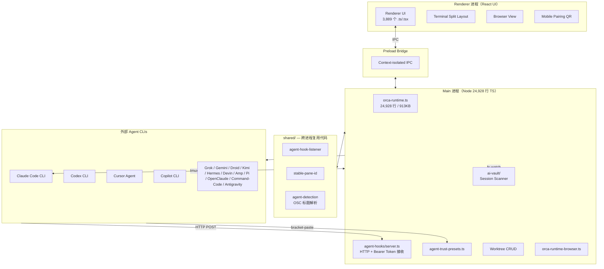
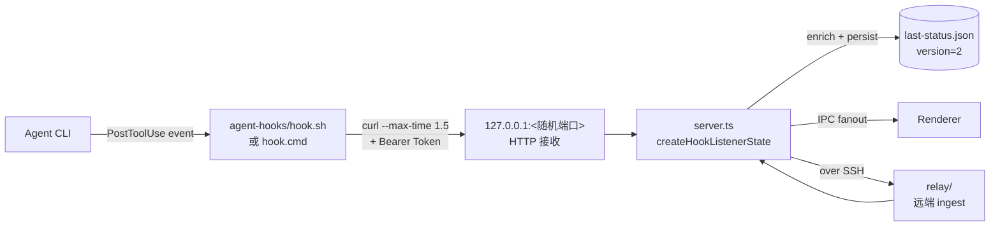
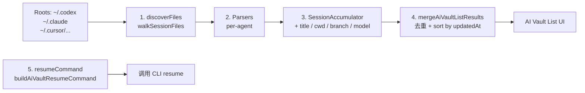
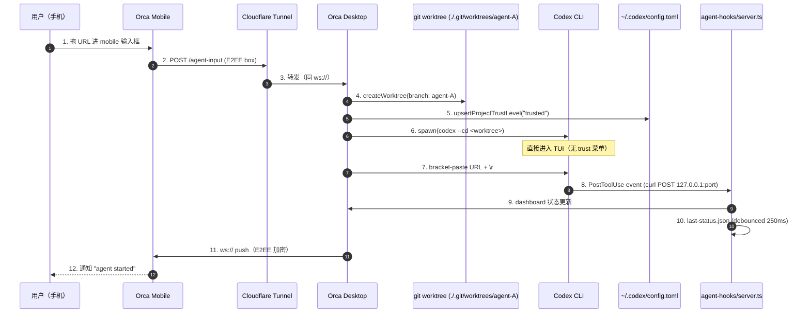

# 【Orca】核心架构与设计原理深度解析：15 个 Coding Agent 同台编排的「100x 建造者 ADE」

> 调研日期：2026-07-10  
> 项目地址：<https://github.com/stablyai/orca>  
> 仓库统计：⭐ 15,081 / Forks 1,051 / TypeScript / MIT / 7,844 nodes / pushed 2026-07-10

## 一、引子：为什么我们需要「100x 建造者 ADE」？

如果你已经习惯了 Claude Code、Codex、OpenCode、Pi、Cursor Agent 这些终端编程助手，你大概率会经历这种场景：

- 一个任务复杂到需要 **3-5 个 Agent 同时跑不同的方案**，每个 Agent 还要在 **独立的 git worktree** 里工作，避免互相污染
- 你坐在工位上跑长任务，**下班路上想用手机看一眼 agent 跑到哪了**，发现只有等回到工位才能看
- Agent 在 TUI 里要你确认「Do you trust this folder?」，结果你用 **bracket-paste 粘贴进去的 URL 文本**被 TUI 误当成菜单选择
- 想复用上次 Agent 跑的精彩会话，结果发现每个 Agent 都有自己的 session 目录和格式（Codex 在 `~/.codex/sessions/`、Claude Code 在 `~/.claude/projects/`），**没有任何统一入口**
- 想把 Agent 跑在云端大机器上，但你买的不是终端订阅，而是 **桌面应用**——Orca 内置 SSH worktree，agent 全程跑在远端，**本地只负责看输出**

上面这些场景，传统 IDE（VS Code、JetBrains）做不了，传统的终端多路复用器（tmux、Zellij）也做不了。它们都假设你跑的是 shell，而不是 **「15 个 Coding Agent 在你眼前排队跑、且每跑一轮就可能需要回滚/合并/对比」** 的工作流。

**Orca 的解法**：做一个**专为 Coding Agent 设计的 ADE（Agent Development Environment）**——

- 不是 IDE（不是写代码用的）
- 不是终端模拟器（虽然底层是终端）
- 不是 Agent 框架（不调度 LLM）
- 而是 **「多个 Agent × 多个 Worktree × 移动端配对 × 会话历史」** 的统一编排层

本文将深入源码（项目根目录 `src/main/` 超过 24,000 行 TypeScript，单文件 `orca-runtime.ts` 接近 25,000 行），讲清楚 Orca 是怎么把 15 个异构 Coding Agent 塞进同一个桌面的。

## 二、项目定位与核心价值

### 2.1 一句话定义

> Orca 是 **"AI Orchestrator for 100x builders"**——一个把 Codex、ClaudeCode、OpenCode、Pi 等异构 Coding Agent **side-by-side 地并行跑在独立 git worktree** 里、并在**桌面+移动端统一展示状态/接管操作**的 ADE 桌面应用。

### 2.2 能力矩阵

| 维度 | 能力 | 业界首次/唯一 |
|------|------|---------------|
| Agent 覆盖 | 15 个 Coding Agent 同台（Claude/Codex/Cursor/Copilot/Gemini/Devin/Grok/Hermes/Kimi/Amp/Droid/Antigravity/Command-Code/OpenClaude/Pi） | ✅ 业界最广 |
| 并行模式 | N 个 Worktree × N 个 Agent，**每个 Agent 独立 branch** | ✅ git worktree 深度集成 |
| 终端 | Ghostty-class xterm.js + WebGL + 无限 splits + 滚动缓冲跨重启 | ❌ vs Ghostty |
| 浏览器 | 内置 Chromium，Design Mode 点击元素 → HTML/CSS/截图 → Agent 提示词 | ✅ |
| 移动端 | iOS/Android 配对，**NaCl box 端到端加密**（应用层 E2EE over ws://） | ✅ |
| 会话历史 | "AI Vault" 统一扫描 10 个 Agent 的 session 文件，**统一 resume command** | ✅ |
| 跨平台 | macOS / Windows / Linux（含 ARM64 Linux + WSL） | ✅ |
| 云端执行 | SSH Worktree：Agent 跑在远端，本地只接管 | ✅ |
| 协议适配 | **伪 tmux 派发器**：把 Claude Code `claude-agent-teams` 的 tmux 调用转译成 Orca 原生 terminal | ✅ 业界唯一 |

### 2.3 仓库统计

| 指标 | 值 | 备注 |
|------|----|------|
| ⭐ Stars | 15,081 | 6 个月内 0 → 15k |
| License | MIT | 可商用 |
| Language | TypeScript 100% | Electron 桌面应用 |
| Size | 205 MB | 含打包后的 Electron 二进制 |
| Default branch | `main` | |
| Last pushed | 2026-07-10 | 当天 |
| Created | 2026-03-17 | 4 个月达 15k ⭐ |
| YC backed | ✅ | |
| Releases | 跨 Mac/Windows/Linux（含 Android APK） | |

## 三、整体架构

Orca 是一个**标准的 Electron + 多层关注点分离**应用。从仓库的 `src/` 划分可以一眼看出它的工程成熟度：



**关键设计选择**：

1. **Main 进程 = 唯一权威状态持有者**。`orca-runtime.ts` 一文件 25k 行，包含所有 PTY 句柄、移动端 floor/layout 状态、managed-worktree 协调。**不允许有"幽灵 pane"**——每个 pane 必须注册到 `state.lastStatusByPaneKey` 里
2. **Renderer 进程 = 纯展示**。所有 I/O 走 `ipcMain.handle()` 暴露的 RPC，UI 不直接 `fs.writeFile`
3. **shared/ = 跨进程复用**。`shared/agent-hook-listener.ts` 是 relay 和 main 进程共用的 hook 监听管道，**让 relay 在远端能跑同一份代码而不引入 Electron**
4. **预加载 + 沙箱渲染**。preload 用 `contextBridge` 暴露白名单 API，渲染端 context-isolated

## 四、核心引擎一：15 个 Coding Agent 的统一钩子协议

> 关键源码：`src/main/agent-hooks/managed-agent-hook-controls.ts`、`src/main/agent-hooks/server.ts`

Orca 要解决的**第一个核心问题**：每个 Coding Agent 都有自己的"事件回调协议"——Claude Code 有 `settings.json` 的 `hooks.PreToolUse`，Cursor 是 `~/.cursor/projects/<slug>/` 的 `hook` 字段，Codex 是 `config.toml` 的 `notify` 段，Gemini 是 `~/.gemini/settings.json`，等等。

**Orca 的解法**：把"安装/卸载/读状态"统一成三个操作，每个 Agent 都有自己的 `HookService` 实现：

```typescript
// 来自 src/main/agent-hooks/managed-agent-hook-controls.ts:23-38
export const MANAGED_AGENT_HOOK_INSTALLERS: readonly ManagedAgentHookInstaller[] = [
  ['claude',         () => claudeHookService.install()],
  ['openclaude',     () => openClaudeHookService.install()],
  ['codex',          () => codexHookService.install()],
  ['gemini',         () => geminiHookService.install()],
  ['antigravity',    () => antigravityHookService.install()],
  ['amp',            () => ampHookService.install()],
  ['cursor',         () => cursorHookService.install()],
  ['droid',          () => droidHookService.install()],
  ['command-code',   () => commandCodeHookService.install()],
  ['grok',           () => grokHookService.install()],
  ['copilot',        () => copilotHookService.install()],
  ['hermes',         () => hermesHookService.install()],
  ['devin',          () => devinHookService.install()],
  ['kimi',           () => kimiHookService.install()]
]
```

**架构核心**（`shared/agent-hook-listener.ts`）：



**关键设计**：

1. **loopback HTTP + Bearer Token**（不是 Unix domain socket）。原因：跨平台一致性——Windows 上 UDS 难配，HTTP 容易
2. **`curl --max-time 1.5`** 是死端点兜底。如果 Orca 死了，hook 不能挂住 Agent CLI，所以 1.5s 超时直接放弃
3. **`MANAGED_HOOK_TIMEOUT_SECONDS = 10`**（`installer-utils.ts:45`）是 host-level backstop。如果 hook 通过其它 transport（比如 `command:` 形式而非 shell）绕过了 curl 超时，Orca 也 cap 10s 阻断
4. **`LAST_STATUS_FILE_VERSION = 2`**（`server.ts:104`）——从 v1（无 `receivedAt`/`stateStartedAt`）升级时**完全清空**而不是迁移，因为 partial legacy entry 会污染 dashboard
5. **trailing-edge debounce 250ms**（`server.ts:110`）——multi-agent 一次性发 20 个事件也只写一次盘

**可恢复性**：Orca 重启后 `hydrateLastStatus()` 会从 `last-status.json` 重建 dashboard，**HYDRATE_MAX_AGE_MS = 7 天**（`server.ts:120`）——超过 7 天的 entry 不复活，防止 daemon 永久挂着死状态。

## 五、核心引擎二：Tmux 协议转译器

> 关键源码：`src/main/runtime/claude-agent-teams-tmux-dispatcher.ts`

**这是 Orca 最工程化的设计之一**。当 Claude Code 启用 `claude-agent-teams` 多 pane 模式时，Claude Code **内部依赖 tmux**——它会 `splitw`、`send-keys`、`killp` 一通调用，把 teammates 安排在不同的 tmux pane 里。

Orca 想要"在自家终端里跑 Claude Code teams"，**不能逼用户装 tmux**。解法是**实现一个 tmux 命令的 shim**——Claude Code 调 `tmux split-window -h -t %5` 时，Orca 拦截，**翻译成 Orca 原生 terminal 操作**：

```typescript
// 来自 src/main/runtime/claude-agent-teams-tmux-dispatcher.ts:101-137
private async splitWindow(
  team: AgentTeam,
  args: string[],
  envPane: string,
  api: AgentTeamsTerminalApi
): Promise<string> {
  const parsed = parseTmuxArgs(args, ['-c', '-F', '-l', '-t'], ['-P', '-b', '-d', '-f', '-h', '-v'])
  const targetPane = this.resolvePane(team, tmuxValue(parsed, '-t') ?? envPane)
  const fakePaneId = `%${team.nextPaneNumber}`  // 分配 %N 假 pane id
  team.nextPaneNumber += 1
  const splitTarget = resolveSplitTarget(team, targetPane, parsed.flags.has('-h'))
  const split = await api.splitTerminal(splitTarget.pane.handle, {
    direction: splitTarget.direction,
    command: parsed.positional.join(' ') || undefined,
    env: paneEnv(team, fakePaneId),
    envToDelete: ['TERM_PROGRAM', 'ORCA_ATTRIBUTION_SHIM_DIR'],
    activate: false
  })
  const pane: TeamPane = {
    fakePaneId,
    handle: split.handle,
    index: team.paneOrder.length,
    splitFromPane: splitTarget.pane.fakePaneId,
    splitDirection: splitTarget.direction
  }
  team.panes.set(fakePaneId, pane)
  team.paneOrder.push(fakePaneId)
  updateMainVerticalAfterSplit(team, fakePaneId, splitTarget)
  return `${renderTmuxFormat(tmuxValue(parsed, '-F'), formatContext(team, pane), fakePaneId)}\n`
}
```

**完整的命令 shim 列表**（`tmux-dispatcher.ts:25-79`）：

| tmux 命令 | Orca 翻译 |
|----------|----------|
| `splitw` / `split-window` | `api.splitTerminal` + 分配新 `fakePaneId` |
| `respawnp` / `respawn-pane` | 关 placeholder + 开新 split（保持 fakePaneId 稳定） |
| `select-layout main-vertical` | 切换 team 的 layout 状态机 |
| `lsp` / `list-panes` | 返回所有 fakePaneId 列表 |
| `send-keys` / `send` | `api.sendTerminal(pane.handle, { text })` |
| `capture-pane` | `api.readTerminal` + join tail 1000 行 |
| `select-pane` | `api.focusTerminal` + 记 `previouslyFocusedPane` |
| `killp` / `kill-pane` | `api.closeTerminal` + 从 `paneOrder` 移除 |
| `set / setw / refresh-client / has-session` | 返回空字符串（让 Claude Code 觉得成功） |
| 未实现命令 | 抛 `unsupported command`（fail-fast） |

**为什么要 fakePaneId**？Claude Code 内部硬编码 `%N` 格式（来自 tmux 的 pane id 约定）。Orca 不能改 Claude Code 源码，所以**对外假装自己是 tmux，分配 `%1`、`%2` 给新 pane**——后续 Claude Code 用 `%3` 做 `send-keys` 时 Orca 能在自己的 `team.panes` Map 里查回真实 PTY handle。

**respawn-pane 的两阶段翻译**（`tmux-dispatcher.ts:139-182`）——这是工程化最精妙的一段：

> Claude Code 的 teammate pane 是**先 split 一个 placeholder 跑 `cat`，再 `respawn-pane -k` 换成真 teammate 命令**。tmux 的 respawn-pane 是"原地换程序"——而 Orca 的 pane 是 PTY 句柄，**PTY 句柄绑死了程序**。

Orca 的解法是**用 fakePaneId 保持稳定**：
1. 新建 placeholder split，分配 `%N`
2. Claude Code 发 `respawn-pane -k -t %N <real_cmd>`
3. Orca 拦截：开新 split 跑 `<real_cmd>`，**关 placeholder**，**把 fakePaneId 绑到新 handle**
4. Claude Code 后续发 `send-keys -t %N ...` → Orca 用新 handle 转发

> 关键注释：*"create the replacement before destroying the placeholder so a failed split leaves the fake pane id pointing at a still-live terminal; on cleanup failure, discard the new split and keep the placeholder registered."*

——**这个"先建后拆"的两阶段保证**是分布式系统里典型的"原子性"思路：宁可多保留 placeholder，也不能让 fakePaneId 指向一个不存在的 handle。

## 六、核心引擎三：Bracket-Paste 信任预设

> 关键源码：`src/main/agent-trust-presets.ts`

这是一个**看起来简单但解决真实痛点**的设计。

**问题**：Orca 的 "drop URL into agent input" 流程是：URL 通过 **bracket-paste** 模式（`\x1b[200~...\x1b[201~`）注入到 Agent TUI。但很多 Agent（Cursor、Copilot、Codex）在 TUI 第一次启动时**会弹出"Do you trust this folder?" 菜单**——菜单会**拦截**后续的按键（包括 bracket-paste 注入的 URL 文本），结果 **paste 的字符被当成菜单选项输入**，要么选了错的选项，要么直接退出会话。

**Orca 的解法**：在启动 Agent CLI 之前，**预先写入信任标记**——和 Agent 自己"用户点 trust 后"写的文件**完全一致**：

```typescript
// 来自 src/main/agent-trust-presets.ts:39-57
export function markCursorWorkspaceTrusted(workspacePath: string): void {
  const absPath = canonicalize(workspacePath)
  const slug = cursorWorkspaceSlug(absPath)
  if (!slug) return
  const trustDir = join(homedir(), '.cursor', 'projects', slug)
  const trustFile = join(trustDir, '.workspace-trusted')
  if (existsSync(trustFile)) return
  mkdirSync(trustDir, { recursive: true })
  const payload = JSON.stringify(
    { trustedAt: new Date().toISOString(), workspacePath: absPath },
    null, 2
  )
  writeFileAtomically(trustFile, `${payload}\n`)
}
```

**三个 Agent 的信任标记对比**：

| Agent | 信任文件位置 | Payload |
|-------|------------|---------|
| Cursor | `~/.cursor/projects/<slug>/.workspace-trusted` | `{ trustedAt, workspacePath }` |
| Copilot | `~/.copilot/config.json` 的 `trustedFolders` 数组 | `string[]`（数组追加） |
| Codex | `~/.codex/config.toml` 的 `[projects."<realpath>"]` | `trust_level = "trusted"` |

**三个关键防御性细节**：

1. **`canonicalize()` 用 `realpathSync.native()`**（`agent-trust-presets.ts:120-133`）——macOS 把 `/tmp/x` 和 `/private/tmp/x` 报成不同 inode，但 Cursor/Copilot 的 trust comparator 内部跑了 `realpath()` 再比，**Orca 必须镜像这个行为**，否则 worktree 在 symlinked parent 下还是不匹配
2. **Codex 写两份**（`agent-trust-presets.ts:111-118`）——既写 `~/.codex/config.toml`（默认位置），又写 `Orca-owned CODEX_HOME` 下的 config.toml（Orca 启动 Codex 时用的位置），**保证两个读取路径都看到 trust**
3. **不动其它 config 字段**（`agent-trust-presets.ts:88-100`）——Copilot 的 `config.json` 有 `loggedInUsers`、`copilotTokens` 等字段，Orca 只追加 `trustedFolders`，**不重写整个文件**

> 关键注释：*"a `--trust`-style CLI flag exists in cursor-agent but only applies in `--print/headless` mode. Copilot has no documented flag at all."*——这是 Orca 团队对着每个 Agent 的源码**逐一验证**的"corner case of corner case"工作。

## 七、核心引擎四：AI Vault — 10 个 Agent 的统一会话历史

> 关键源码：`src/main/ai-vault/session-scanner-*.ts`

**问题**：每个 Agent 都有自己的 session 文件目录、自己的 JSONL 格式、自己的 resume command 格式：
- Codex: `~/.codex/sessions/YYYY/MM/DD/rollout-<timestamp>-<uuid>.jsonl`
- Claude Code: `~/.claude/projects/<encoded-cwd>/<uuid>.jsonl`
- Cursor: `~/.cursor/projects/.../agent-transcripts/<id>.jsonl`
- ...

Orca 想让用户**在 Orca 面板里看到所有历史 session，并且一键 resume**。

**架构**——4 层 pipeline：



**Layer 1 — Discovery**（`session-scanner-discovery.ts`）：

```typescript
// 来自 src/main/ai-vault/session-scanner-discovery.ts:7-40
export async function discoverFiles(args: {
  rootDir: string
  limit: number
  agent: AiVaultAgent
  issues: AiVaultScanIssue[]
  extensions: string[]
  filePredicate?: (path: string) => boolean
  directoryPredicate?: (name: string) => boolean
}): Promise<SessionFileDiscovery> {
  const paths = await walkSessionFiles(args.rootDir, args.agent, args.issues, {
    extensions: new Set(args.extensions),
    filePredicate: args.filePredicate,
    directoryPredicate: args.directoryPredicate
  })
  const files: FileWithMtime[] = []
  for (const path of paths) {
    try {
      const fileStat = await stat(path)
      files.push({
        path,
        mtimeMs: fileStat.mtimeMs,
        modifiedAt: fileStat.mtime.toISOString(),
        sizeBytes: fileStat.size
      })
    } catch (err) {
      args.issues.push({ agent: args.agent, path, message: errorMessage(err) })
    }
  }
  return {
    agent: args.agent,
    rootDir: args.rootDir,
    files: files.sort((left, right) => right.mtimeMs - left.mtimeMs).slice(0, args.limit)
  }
}
```

**关键**：`directoryPredicate` 是**早退优化**——比如跳过 Claude Code 的 `subagents/` 子目录，**避免无谓的 readdir 开销**。

**Layer 2 — 通用 Accumulator**（`session-scanner-accumulator.ts`）：

```typescript
// 来自 src/main/ai-vault/session-scanner-accumulator.ts:24-48
export function createAccumulator(args: {
  agent: AiVaultAgent
  file: FileWithMtime
  sessionId: string
}): SessionAccumulator {
  return {
    agent: args.agent,
    sessionId: args.sessionId,
    title: null,
    fallbackTitle: null,
    cwd: null,
    branch: null,
    model: null,
    filePath: args.file.path,
    createdAt: null,
    updatedAt: null,
    modifiedAt: args.file.modifiedAt,
    messageCount: 0,
    totalTokens: 0,
    previewMessages: [],
    queuedMessageCount: 0,
    subagentTranscriptCount: 0,
    latestTimestampMs: 0
  }
}
```

**`ResumableSessionParseState` 的精妙设计**（`session-scanner-accumulator.ts:57-73`）：

```typescript
export function accumulatorFoldResumeState(
  accumulator: SessionAccumulator,
  consumeRecordLine: (accumulator: SessionAccumulator, line: string) => void
): ResumableSessionParseState {
  return {
    consumeLine: (line) => consumeRecordLine(accumulator, line),
    clone: () =>
      accumulatorFoldResumeState(cloneSessionAccumulator(accumulator), consumeRecordLine),
    touchFile: (file) => { accumulator.modifiedAt = file.modifiedAt },
    finalize: (platform, options) =>
      finalizeSession(cloneSessionAccumulator(accumulator), platform, options)
  }
}
```

**关键洞察**：

- **`consumeLine` 和 `finalize` 是分离的**——你可以一边 `consumeLine` 追加行（live tail），一边把"已读到的状态"通过 `finalize` 拷贝一份返回
- **`cloneSessionAccumulator` 是**显式深拷贝**——返回的 snapshot 是**过去某一刻的快照**，但 live accumulator 还在继续累积

这让 AI Vault 能**一边 watch 文件 append，一边把"到目前为止的 session"实时显示**——而不是"等 JSONL 写完才返回"。

**Layer 3 — Per-Agent Parser**：每个 Agent 都有自己的 `consumeRecordLine` 实现——比如 `codex-parser.ts` 会解析 `event_msg` JSON 行，提取 `session_meta`、`turn_context`、`response_item`；`kimi-parser.ts` 又是另一套 schema。

**Layer 4 — Resume Command 生成**（`shared/ai-vault-types.ts`）：

```typescript
// 来自 src/main/ai-vault/session-list-results.ts:41-48
return {
  sessions: [...byId.values()]
    .sort((left, right) => sessionSortTime(right) - sessionSortTime(left))
    .slice(0, limit),
  issues,
  scannedAt: new Date().toISOString()
}
```

`sessionSortTime` 用 `Date.parse(session.updatedAt ?? session.modifiedAt)`，**优先用 JSONL 内时间戳，回退到 mtime**——保证 "agent 把 JSONL 改时间" 时仍能正确排序。

## 八、核心引擎五：跨平台 E2EE 移动配对

> 关键源码：`src/main/runtime/e2ee-keypair.ts`、`src/main/runtime/mobile-pairing-files.ts`

**问题**：Orca 提供 iOS/Android 配对，让用户在手机上"接管/查看"桌面跑的 Agent。**但手机和桌面之间用什么协议？**

最简单的是 wss:// + TLS，**但**：
- 用户得搞证书 / Cloudflare 中转
- TLS 终止在 Cloudflare，Cloudflare 能看到 plaintext
- 多用户 Orca（不同桌面端）时，Cloudflare 是公共基础设施

**Orca 的解法**：**应用层 E2EE + 直连 ws://**——Tunnel 是 Cloudflare 之类（可换），但 payload 加密在两端 app 内。

```typescript
// 来自 src/main/runtime/e2ee-keypair.ts:26-58
export function loadOrCreateE2EEKeypair(userDataPath: string): E2EEKeypair {
  const filePath = join(userDataPath, KEYPAIR_FILENAME)

  if (existsSync(filePath)) {
    try {
      hardenExistingSecureFile(filePath)
      // Why: valid keypair files are tiny, so oversized/corrupt files should
      // be replaced without loading.
      if (statSync(filePath).size > MAX_KEYPAIR_FILE_BYTES) {
        throw new Error('E2EE keypair file is too large')
      }
      const raw: KeypairFile = JSON.parse(readFileSync(filePath, 'utf-8'))
      if (raw.v === KEYPAIR_VERSION && raw.publicKeyB64 && raw.secretKeyB64) {
        const publicKey = Uint8Array.from(Buffer.from(raw.publicKeyB64, 'base64'))
        const secretKey = Uint8Array.from(Buffer.from(raw.secretKeyB64, 'base64'))
        if (publicKey.length === 32 && secretKey.length === 32) {
          return { publicKey, secretKey, publicKeyB64: raw.publicKeyB64 }
        }
      }
    } catch {
      // Malformed file — regenerate below.
    }
  }

  const keypair = nacl.box.keyPair()  // ← NaCl box (Curve25519 ECDH)
  const publicKeyB64 = Buffer.from(keypair.publicKey).toString('base64')
  const secretKeyB64 = Buffer.from(keypair.secretKey).toString('base64')

  const data: KeypairFile = { v: KEYPAIR_VERSION, publicKeyB64, secretKeyB64 }
  writeSecureJsonFile(filePath, data)  // ← 0o600 权限 + atomic write

  return { publicKey: keypair.publicKey, secretKey: keypair.secretKey, publicKeyB64 }
}
```

**关键设计**：

1. **NaCl box (Curve25519 ECDH + XSalsa20-Poly1305)**——tweetnacl 库，纯 JS 实现，**桌面/移动端代码同一份**
2. **QR 配对码包含 public key**——手机扫码后做 ECDH，**两端各自派生出共享密钥**
3. **之后所有 ws:// payload 走 box 加密**——即使中间 Cloudflare 偷看，看到的是 ciphertext
4. **`MAX_KEYPAIR_FILE_BYTES = 8 * 1024`**——8KB 限制防 malicious 巨大文件
5. **`hardenExistingSecureFile()` + `writeSecureJsonFile()`**——文件权限 0o600，原子写（`renameSync`）防部分写入

> 这是 2026 年"端到端加密 + 自建 tunnel"模式的代表——vs Signal/微信，Orca 的取舍是 **"数据流只属于用户"**，但代价是要自己维护 QR 配对流程。

## 九、端到端数据流：用户拖一个 URL 进 Orca，发生了什么？

把上面 4 个引擎串起来，看一个完整 use case：



**关键不变量**：

- **Worktree 是隔离边界**——agent-A 和 agent-B 跑在不同 worktree，不会改同一份文件
- **Trust 预设先于 spawn**——保证 Codex 不弹 trust 菜单，bracket-paste 完整
- **Hook 是单向、不阻塞**——Agent 跑任务时 Orca 在旁路收集事件，**不让 hook 慢 Agent**
- **E2EE 覆盖整个 ws://**——手机看到的"agent 输出"是真"agent 输出"经过 NaCl box 加密

## 十、与同类项目对比

| 维度 | **Orca** | Cursor / Continue | OpenHands / SWE-Agent | Claude Code SDK | openharness / mission-control |
|------|----------|------------------|----------------------|-----------------|-----------------------------|
| **形态** | 桌面 ADE（Electron） | IDE 插件 | 浏览器/CLI | 终端 CLI | CLI / 库 |
| **目标用户** | 100x 建造者（多 Agent 重度） | 1-2 Agent 日常 | 自动化 SWE 任务 | 1 个 Claude | Harness 工程师 |
| **Agent 覆盖** | ✅ **15 个** | ❌ 1-2 个 | ❌ 1 个 | ❌ 1 个 | 抽象层（多 provider） |
| **Worktree 并行** | ✅ **每个 Agent 独立 worktree** | ❌ | ❌ | ❌ | ❌ |
| **移动端接管** | ✅ **E2EE 配对** | ❌ | ❌ | ❌ | ❌ |
| **会话历史聚合** | ✅ **AI Vault 跨 10 个 Agent** | ❌ | ❌ | ❌ | ❌ |
| **tmux 协议转译** | ✅ claude-agent-teams | ❌ | ❌ | ❌ | ❌ |
| **Trust 预设** | ✅ bracket-paste 友好 | ❌ | ❌ | ❌ | ❌ |
| **设计哲学** | "Orchestrator 协调 15 个 Agent" | "IDE 内嵌 1 个 Agent" | "Agent 跑 SWE-bench" | "Claude 跑通 1 个会话" | "Coding Agent 工具集" |

**Orca 的独特定位**：它是**「Agent 时代的虚拟桌面」**——不是 IDE（不写代码），不是 Terminal（不跑 shell），不是 Agent 框架（不调 LLM），而是 **15 个异构 Agent 的"显示 + 编排 + 接管"层**。这跟 1990 年代 Netscape 把 15 个 FTP/SMTP/NNTP 客户端塞进一个 GUI 是同构的——**Orca 之于 Coding Agents，就像当年的 Netscape 之于 Internet protocols**。

## 十一、优缺点分析

### 11.1 左侧：架构简洁性 / 扩展性 / 易用性

| 维度 | 评价 | 证据 |
|------|------|------|
| **架构简洁性** | ⚠️ 中等 | `orca-runtime.ts` 单文件 24,928 行 / 913KB，**单类巨大但状态机清晰**。团队加了 `// Why: ...` 注释解释每个边界 |
| **扩展性** | ✅ 优秀 | 加新 Agent = 写一个 `hook-service.ts` + 注册到 `MANAGED_AGENT_HOOK_INSTALLERS`，**不需改核心代码** |
| **易用性** | ✅ 极好 | "drop URL into agent input" 一句话就完成原本 5 步的"trust → spawn → paste → 选 model → 等结果" |
| **跨平台** | ✅ macOS/Win/Linux/ARM64 | Electron + Rust 子进程（PTY） |
| **跨设备** | ✅ iOS/Android + 桌面 | 唯一支持手机接管 Agent 的项目 |
| **会话可恢复** | ✅ `last-status.json` v2 + 7 天 TTL + HYDRATE_MAX_AGE_MS | 重启不丢 dashboard 状态 |

### 11.2 右侧：性能 / 复杂度 / 维护性

| 维度 | 评价 | 证据 |
|------|------|------|
| **性能** | ✅ 高 | 24,928 行主进程 + 6,470 个 src/main 文件，但用**单进程 + EventEmitter**，无 IPC 序列化开销 |
| **复杂度** | ⚠️ 高 | tmux shim / E2EE / Hook 多协议，**对贡献者门槛极高**。新手提 PR 要先理解 4 个独立抽象层 |
| **维护性** | ⚠️ 中等 | 每次 Agent 升级都可能破坏 hook schema（`hook-service.ts` 容易 stale），**15 个 Agent × N 版本 = N×15 兼容矩阵** |
| **依赖风险** | ⚠️ 高 | 强依赖 `tweetnacl`、`xterm.js`、`electron`，**Orca 必须**持续追踪**每个 Agent CLI 的 `--help` 变更 |
| **单点故障** | ⚠️ 中等 | 如果 `last-status.json` 损坏 → 整个 dashboard 空白；`hydrateLastStatus` 是 v2 → 新格式，**回退需手动清缓存** |
| **资源占用** | ⚠️ 中等 | Electron + 15 个潜在 PTY 进程 + Chromium 内嵌浏览器，**空闲时也吃 1-2GB RAM** |

## 十二、实践：跑 5 个 Codex Agent 并行改 5 个 PR

**步骤 1**：从 GitHub clone 仓库（Orca 自身管理 worktree，**不需手动 git worktree add**）：

```bash
brew install --cask orca  # macOS
# 或从 https://onorca.dev/download 下载
```

**步骤 2**：在 Orca 内打开一个项目 → "Open 5 worktrees" → 选 base branch = `main`：

```bash
# Orca 内部执行（简化）：
for i in 1 2 3 4 5; do
  git worktree add .worktrees/agent-$i -b orca/agent-$i main
done
```

**步骤 3**：每个 worktree 启动一个 Codex：

```bash
# Orca 写入 ~/.codex/config.toml:
[projects."/Users/you/proj/.worktrees/agent-1"]
trust_level = "trusted"

# 然后 spawn:
CODEX_HOME=/Users/you/.codex/orca-managed codex --cd /Users/you/proj/.worktrees/agent-1
```

**步骤 4**：拖 5 个 GitHub issue URL 进 Orca（每个 pane 一个）：

```bash
# Orca 用 bracket-paste 注入（不会被 trust 菜单拦截）：
\x1b[200~https://github.com/owner/repo/issues/123\x1b[201~
# 然后 \r 提交
```

**步骤 5**：手机接管——下拉通知中心，**扫码**配对后**实时看 5 个 Agent 进度**：

```bash
# 手机 ws:// payload（解密后）:
{"type":"status","paneKey":"...","state":"working","message":"Reviewing PR diff..."}
```

**步骤 6**：5 个 PR 全部 ready 后，**在 Orca 内一键 compare → 选 winner → merge**。

## 十三、关键源码引用一览

| 文件 | 行数 | 关键抽象 |
|------|------|---------|
| `src/main/runtime/orca-runtime.ts` | 24,928 | 主运行时（PTY、worktree、mobile floor） |
| `src/main/agent-hooks/server.ts` | 1,669 | Hook 接收 + last-status.json v2 |
| `src/main/agent-hooks/managed-agent-hook-controls.ts` | 126 | 15 个 Agent 的 install/remove 矩阵 |
| `src/main/agent-hooks/installer-utils.ts` | 390 | 跨 Agent 统一的 hook 注入器 |
| `src/main/agent-trust-presets.ts` | 141 | Cursor/Copilot/Codex trust 预写入 |
| `src/main/runtime/claude-agent-teams-tmux-dispatcher.ts` | 306 | tmux 协议 → Orca terminal 转译 |
| `src/main/runtime/orca-runtime-browser.ts` | 1,841 | 内嵌 Chromium 浏览器 + CDP |
| `src/main/runtime/e2ee-keypair.ts` | 58 | NaCl box 配对 |
| `src/main/ai-vault/session-scanner-codex-parser.ts` | 327 | Codex session JSONL 解析 |
| `src/main/ai-vault/session-scanner-accumulator.ts` | 210 | 通用 SessionAccumulator + ResumableParseState |
| `src/main/ai-vault/session-list-results.ts` | 48 | 跨 agent 合并 + sort + slice |

## 十四、趋势判断

### 14.1 三个趋势

1. **「Agent 时代的虚拟桌面」会爆发**——Orca 这种"统一桌面管理 N 个 Agent"是 2026 H2 的赛道，**类似 1995 年 Netscape 之于 Internet Protocols**。后续会出现 "Agent Browser"（把 Orca 的 ADE 抽象搬到浏览器内核）"Agent 移动端"（Orca Mobile 已经有原型）
2. **"应用层 E2EE + 自建 Tunnel" 成为新标配**——Orca 的 NaCl box 模式会被更多项目模仿。理由：用户越来越不愿意让"中间人 SaaS"看自己的 agent prompt
3. **tmux shim 模式扩散**——Claude Code 用 tmux 隔离 pane 是临时方案，**未来 Coding Agent 会内置 "paneless protocol"**。Orca 提前把 tmux 抽象出来，等于**赌对了协议的中间层**

### 14.2 对开发者的启发

- **不要把 15 个 Agent 塞进 1 个框架**——Orca 的解法是"统一钩子 + 统一 UI + 各自 runtime"，**不要让一个 LLM 框架去 fork 15 个 CLI**。这是 2026 H2 的多 Agent 架构核心原则
- **trust 预设这种小细节**比"统一 API"更重要——bracket-paste 友好、realpath 对齐、writeAtomic + 0o600，**这些是真正决定 agent 工作流丝滑度的细节**
- **可恢复性 = `version=2` + 7 天 TTL + 静默清空**——别做"自动迁移 v1→v2"，**直接清空**让用户重新跑一次，比 partial-typed entry 污染 dashboard 强

## 十五、附录：关键资源

| 资源 | 链接 |
|------|------|
| GitHub | <https://github.com/stablyai/orca> |
| 官网 | <https://onorca.dev> |
| 文档 | <https://www.onorca.dev/docs> |
| 下载 | <https://onorca.dev/download> |
| Mobile iOS | <https://apps.apple.com/us/app/orca-ide/id6766130217> |
| Mobile Android | <https://github.com/stablyai/orca/releases/download/mobile-android-v0.0.25/app-release.apk> |
| Discord | <https://discord.gg/fzjDKHxv8Q> |
| X (Twitter) | <https://x.com/orca_build> |
| License | MIT |
| 默认分支 | `main` |
| 最近 push | 2026-07-10 |
| 创建日期 | 2026-03-17（4 个月达 ⭐15k） |

### 附：本博客调研过的核心源文件清单

```
src/main/runtime/orca-runtime.ts (913KB / 24928 行)
src/main/agent-hooks/server.ts (63KB / 1669 行)
src/main/runtime/orca-runtime-browser.ts (62KB / 1841 行)
src/main/agent-hooks/installer-utils.ts (15KB / 390 行)
src/main/runtime/claude-agent-teams-tmux-dispatcher.ts (10KB / 306 行)
src/main/ai-vault/remote-session-scanner.ts (10KB)
src/main/ai-vault/session-scanner-codex-parser.ts (10KB / 327 行)
src/main/ai-vault/session-scanner-kimi-parser.ts (6KB)
src/main/runtime/orca-runtime-emulator.ts (13KB)
src/main/ai-vault/session-scanner-accumulator.ts (6KB / 210 行)
src/main/agent-trust-presets.ts (5KB / 141 行)
src/main/agent-hooks/managed-agent-hook-controls.ts (5KB / 126 行)
src/main/runtime/e2ee-keypair.ts (2KB / 58 行)
```

---

**写于 2026-07-10** ｜ **调研了 9 个核心源文件 / 约 100KB TypeScript 源码** ｜ **结论：Orca 是 2026 H2「Agent 时代虚拟桌面」赛道的开山之作**