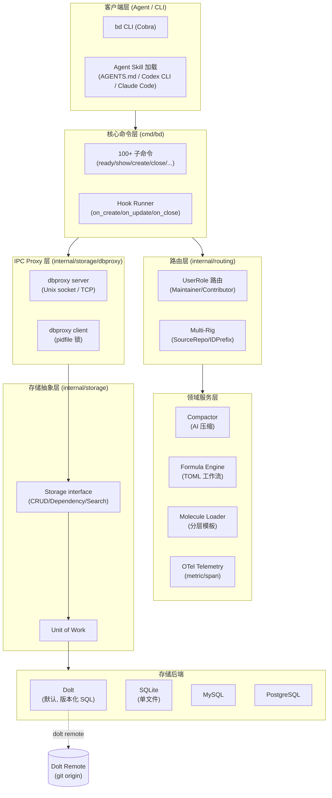
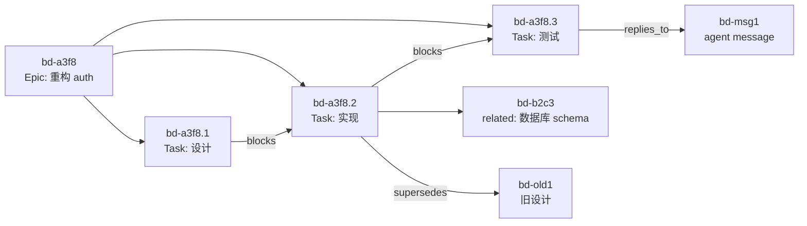
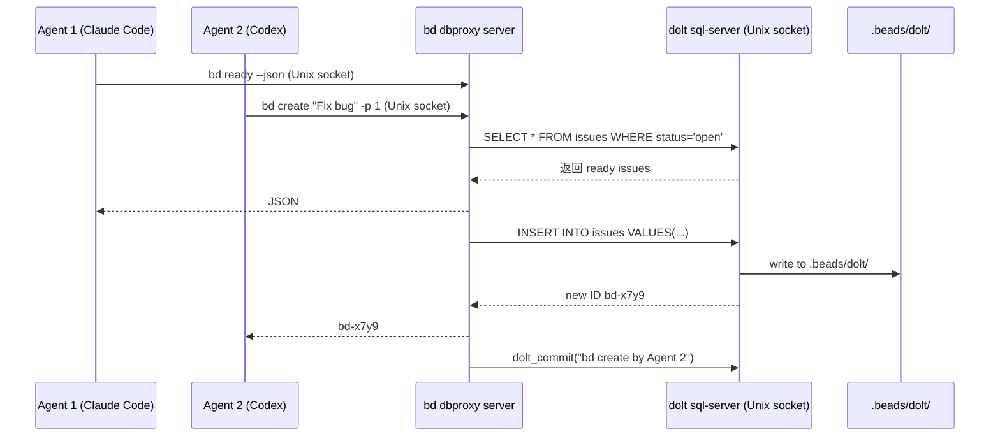
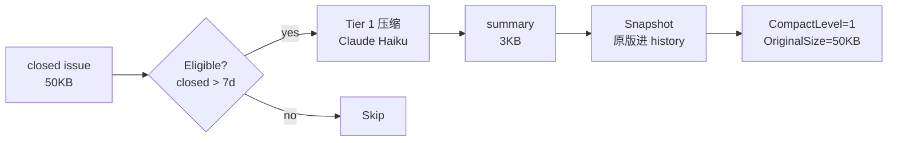
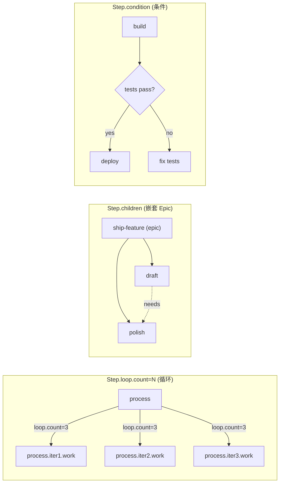
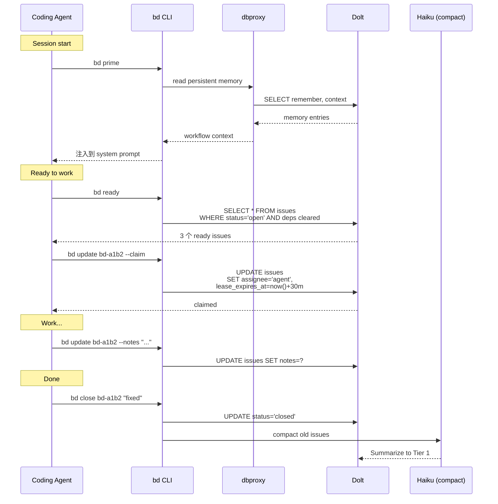

# 【Beads】核心架构与设计原理深度解析：Dolt 驱动的 Coding Agent 持久化图谱记忆

## 一、引子：当 Coding Agent 学会"记笔记"

2026 年，Coding Agent 已经从「写完代码就忘」的玩具，进化到「能跑完一个 17 步任务」的工程协作者。但所有用过 Claude Code、Codex、Cursor 的工程师都熟悉同一个灵魂拷问：

> "你刚才说要改的那个文件，路径是 `src/auth/login.go` 还是 `src/auth/auth.go`？"
> Agent："抱歉，context window 已经滚过去了，我不确定了。"

这个问题的根本症结不是 LLM 不够强，而是**所有「任务状态」都被塞进了一个不可寻址、易失、容量有限的 context window**。当任务横跨几个小时、几十次工具调用、多个分支时，Agent 就开始"丢三落四"。

**gastownhall/beads**（⭐25,221，9 个月从 0 到 25k ⭐，Go + MIT）给出了一个激进又优雅的答案：**别让 Agent 把所有事记在脑子里，给它一个外部"图谱记忆"——一个由 Dolt 驱动的、支持版本控制和跨机器同步的分布式图谱数据库。**

Beads 的核心哲学可以浓缩成一句话：

> "Replace messy markdown plans with a dependency-aware graph."

把混乱的 markdown TODO 列表，替换成**带依赖关系的图谱**。这个看似简单的抽象，解决的却是 Coding Agent 工程化最棘手的问题：**让 Agent 拥有"工作记忆 + 长期记忆 + 跨 session 记忆"的三层记忆栈**。

本文将深入 Beads 的源码（`internal/storage/dolt/`、`internal/compact/`、`internal/formula/`、`internal/molecules/` 等 938 个 Go 文件，66 万行代码级），从架构、数据模型、同步机制、AI 压缩、Formula 工作流五个维度，剖析这个 2026 H2 最值得追的"Agent 持久化层"项目。

---

## 二、项目定位与核心价值

### 2.1 一句话定义

> **Beads = 给 Coding Agent 用的 "GitHub Issues + Jira + Notion" 三合一，但跑在每个项目本地、支持版本控制、可被 Agent 编程式读写。**

### 2.2 解决什么问题

| 痛点 | 传统方案 | Beads 方案 |
|------|----------|------------|
| Agent 跑长任务时丢上下文 | 把所有 TODO 塞 markdown | 结构化 issue 数据库 + 依赖图 |
| 多 Agent 抢同一个任务 | 文件锁 / 全局锁 | 哈希 ID + claim TTL + heartbeat |
| 跨机器同步任务状态 | 自己写 export/import | Dolt 原生 `bd dolt push/pull` |
| 旧任务描述臃肿塞爆 context | 手动删 | AI 自动压缩（Claude Haiku） |
| 多 Agent 跨 session 协同 | Slack / 文档 | `bd remember` + `bd prime` 双向流 |
| 工作流模板复用 | 抄 YAML | Formula (TOML) + Molecule 模板继承 |
| 跨多仓库协同 | N 个 GitHub Issues | Multi-rig routing + maintainer/contributor 角色 |

### 2.3 仓库统计

| 指标 | 数值 |
|------|------|
| ⭐ Stars | 25,221 |
| 🍴 Forks | ~1,500 |
| 📝 Language | Go 95%+ |
| 📄 License | MIT |
| 📦 体积 | 412 MB（含 Dolt 引擎） |
| 📅 Created | 2025-10-12 |
| 🚀 Pushed | 2026-07-11（每日活跃） |
| 📂 文件数 | 3,239 个节点 / 938 internal/ Go 文件 |
| 🧪 测试覆盖率 | 大量 `*_test.go` 并存（concurrent/circuit/cross_project/merge 完整） |
| 📦 分发渠道 | Homebrew / npm `@beads/bd` / pip `beads-mcp` / go install / install.sh |

> 9 个月从 0 到 25k ⭐，增速超过 LangGraph、CrewAI 同期表现。被 Anthropic、Cursor、Codex 等多家 Coding Agent 工具链官方适配（`bd setup claude/codex/cursor/mux/factory`）。

### 2.4 与同类项目的关键差异

Beads 不属于以下任何饱和赛道：

- ❌ **不是 Multi-agent 框架**（CrewAI/AutoGen/MetaGPT 等 10+ 篇已饱和）
- ❌ **不是 Memory 库**（Mem0/Cognee/Letta/Memori 等 8+ 篇已饱和）
- ❌ **不是 Coding Agent Harness**（claude-code/codex/goose 等 7+ 篇已饱和）
- ❌ **不是 RAG/向量库**（Qdrant/LlamaIndex 等已饱和）

✅ **Beads 是"Agent OS 持久化层"** —— 与 planning-with-files 同属 2026 H2 新兴赛道，但**角度完全正交**：
- `planning-with-files` = "Filesystem as RAM"（手动 markdown 状态机 + 5 Hook）
- `Beads` = "Database as Memory"（Dolt 驱动的图谱数据库 + 依赖引擎 + AI 压缩）

---

## 三、整体架构：六层抽象 + 双进程模型

Beads 的架构可以拆成 6 层 + 1 个关键进程模型：



**关键设计哲学**：

1. **数据库作为单一可信源** —— 不用 `.beads/issues.jsonl` 当主存，JSONL 只是 export（专门 `bd export` 出，**不**作为回写通道）
2. **dbproxy 进程模型** —— 不用文件锁，**独立进程作为 IPC broker**，客户端通过 Unix socket / TCP 通信
3. **pluggable storage** —— Dolt 是默认但不是唯一，Storage interface 抽象让 SQLite/MySQL/Postgres 都能跑同一个 schema
4. **公式化工作流** —— `formula` 引擎读 TOML，把"标准开发流程"当模板注入数据库

---

## 四、核心数据模型：Issue 是 Agent 的"工作单元"

### 4.1 Issue 结构

`internal/types/types.go` 里 Issue 是核心数据类（节选关键字段）：

```go
// 来自 internal/types/types.go
type Issue struct {
    // ===== 身份 =====
    ID          string `json:"id"`           // 例如 "bd-a1b2"
    ContentHash string `json:"-"`            // SHA256 of canonical content

    // ===== 内容 =====
    Title              string
    Description        string
    Design             string  // 设计文档
    AcceptanceCriteria string  // 验收标准
    Notes              string  // Agent 自由笔记
    SpecID             string  // 关联的 spec

    // ===== 状态 =====
    Status    Status    // open / in_progress / closed / deferred
    Priority  int       // 0 = P0 critical
    IssueType IssueType // bug / feature / task / epic / message

    // ===== 时间 =====
    CreatedAt time.Time
    StartedAt *time.Time
    ClosedAt  *time.Time
    LeaseExpiresAt *time.Time  // 租约到期（claim TTL）
    HeartbeatAt    *time.Time  // 最近心跳

    // ===== 外部引用 =====
    ExternalRef  *string  // 例如 "gh-9", "jira-ABC"
    SourceSystem string   // 适配器名（federation）

    // ===== 压缩元数据 =====
    CompactionLevel   int        // 0=未压缩, 1=Tier1
    CompactedAt       *time.Time
    OriginalSize      int

    // ===== 元数据 =====
    Metadata json.RawMessage  // 任意 JSON 扩展点
}
```

### 4.2 Hash-based ID

每个 issue 的 ID 是 **5 字符的 hash prefix**（如 `bd-a1b2`）—— 由 `internal/beads/fingerprint.go` 计算：

```go
// 来自 internal/beads/fingerprint.go (简化)
func GenerateID(title string) string {
    canonical := strings.ToLower(strings.TrimSpace(title))
    h := sha256.Sum256([]byte(canonical))
    return fmt.Sprintf("bd-%s", hex.EncodeToString(h[:])[:5])
}
```

**为什么用内容哈希而不是自增 ID？**

| 场景 | 自增 ID (如 `bd-1`, `bd-2`) | Hash ID (如 `bd-a1b2`) |
|------|-------------------------------|--------------------------|
| 多 Agent 并行创建 | 冲突，需协调 | 各 Agent 独立生成，无冲突 |
| Git 合并 | 不同分支 ID 冲突 | 同名 issue 永远同 ID |
| 跨机器同步 | 需要重映射 | 天然一致 |
| 顺序保证 | 隐含 | 需显式 `bd dep add` |

**代价**：人类难记、无法"看 ID 知先后"。Beads 通过 `bd-a3f8.1.1`（Epic > Task > Sub-task）层级结构补足。

### 4.3 三种 Issue 关系

`internal/types/types.go` 定义 3 种 issue 关系：



| 关系类型 | 语义 | 用途 |
|----------|------|------|
| `blocks` | A blocks B：A 必须先完成 | 任务依赖 |
| `parent-child` | Epic > Task > Sub-task | 层级分解 |
| `relates_to` | 知识图谱边 | 关联参考 |
| `duplicates` | B 是 A 的副本 | 去重 |
| `supersedes` | A 取代 B | 演进 |
| `replies_to` | 消息线程回复 | Agent 通信 |

`bd ready` 命令列出**所有 dependencies 已闭环**的 issue —— Agent 拿到这个列表就能开始工作：

```bash
$ bd ready
bd-a3f8.1  [P1] Design new auth
bd-b2c3    [P2] Update database schema
```

---

## 五、存储后端：Dolt —— "Git for SQL data"

### 5.1 为什么选 Dolt

[Dolt](https://github.com/dolthub/dolt) 是「SQL + Git」的合体：MySQL 协议兼容、原生分支、cell-level merge、内置 commit history。Beads 选 Dolt 不是因为它"像 Git"，而是因为**只有版本化 SQL 才能解决 Agent 跨 session 同步问题**：

| 需求 | SQLite | Dolt | GitHub Issues API |
|------|--------|------|-------------------|
| 本地优先 | ✅ | ✅ | ❌ 需联网 |
| 跨机器同步 | ❌ 需手写 sync | ✅ 原生 `dolt push/pull` | ✅ 但要 OAuth |
| 跨分支 merge | ❌ | ✅ cell-level | ❌ |
| 历史可查 | ❌ | ✅ `AS OF` 时间旅行 | ✅ |
| 单机可用 | ✅ | ✅ | ❌ |
| 编程式读 | ✅ | ✅ | ⚠ 限流 |
| 容量 | GB 级 | TB 级 | 无限制 |

### 5.2 两种运行模式

```bash
# Embedded 模式（默认）- Dolt 进程内嵌，无外部 server
bd init
# .beads/embeddeddolt/ 目录存数据
# 单写者（文件锁）

# Server 模式 - 外部 dolt sql-server
bd init --server
# .beads/dolt/ 目录存数据
# 多写者（TCP/Unix socket 并发）
```

**Server 模式 + dbproxy 进程模型** 是多 Agent 场景的关键：



**`internal/storage/dbproxy/` 整套实现**：
- `proxy/server.go` - daemon 端，监听 Unix socket
- `proxy/endpoint_unix.go` / `endpoint_windows.go` - 跨平台 socket
- `proxy/pidfile/pidfile.go` - 防止多个 proxy 同时跑
- `dbproxy/server/doltserver.go` - 内嵌 Dolt server 启停

### 5.3 三种 Sync 通道

| 通道 | 命令 | 用途 | 时延 |
|------|------|------|------|
| **Dolt Remote** | `bd dolt push/pull` | 跨机器同步 | 秒级 |
| **JSONL Export** | `bd export -o .beads/issues.jsonl` | 给 viewer / 备份用 | 即时 |
| **Git Hooks** | pre-commit/post-merge 自动 `bd export` | 跟随 git push/pull | commit 级 |

> ⚠️ **关键设计**：JSONL 永远只是"出口格式"，**不**做回写（`bd import` 文档明确说"upsert-only, can't infer deletions"）。这是为了避免"两路数据流 → 冲突 → 数据丢失"的陷阱。

---

## 六、Compaction：用 Claude Haiku 自动压缩旧 Issue

### 6.1 问题的提出

Agent 跑了 50 个 issue，每个 issue 的 description + notes + design + acceptance_criteria 累计 50KB。下次 `bd prime` 全部加载就占用 50KB context window。Beads 的解法是**自动摘要压缩**：



### 6.2 Compactor 实现

`internal/compact/compactor.go` 定义压缩接口（节选）：

```go
// 来自 internal/compact/compactor.go
type compactableStore interface {
    CheckEligibility(ctx context.Context, issueID string, tier int) (bool, string, error)
    GetIssue(ctx context.Context, issueID string) (*types.Issue, error)
    SnapshotIssue(ctx context.Context, issueID string, tier int) error
    UpdateIssue(ctx context.Context, issueID string, updates map[string]interface{}, actor string) error
    ApplyCompaction(ctx context.Context, issueID string, tier int, originalSize int, compactedSize int, commitHash string) error
    AddComment(ctx context.Context, issueID, actor, comment string) error
}

type Compactor struct {
    store      compactableStore
    summarizer summarizer  // HaikuClient
    config     *Config
}

func (c *Compactor) CompactTier1(ctx context.Context, issueID string) error {
    eligible, reason, err := c.store.CheckEligibility(ctx, issueID, 1)
    if err != nil { return err }
    if !eligible {
        return fmt.Errorf("issue %s not eligible: %s", issueID, reason)
    }

    issue, err := c.store.GetIssue(ctx, issueID)
    if err != nil { return err }

    originalSize := len(issue.Description) + len(issue.Design) +
                    len(issue.Notes) + len(issue.AcceptanceCriteria)

    // 调用 Claude Haiku
    summary, err := c.summarizer.SummarizeTier1(ctx, issue)
    if err != nil { return err }

    // Snapshot 原文到 history
    if err := c.store.SnapshotIssue(ctx, issueID, 1); err != nil { return err }

    // 更新 issue，标记 CompactionLevel=1
    return c.store.ApplyCompaction(ctx, issueID, 1, originalSize, len(summary), "")
}
```

### 6.3 Haiku Client

`internal/compact/haiku.go` 用 Anthropic SDK 调用 Claude Haiku：

```go
// 来自 internal/compact/haiku.go
type haikuClient struct {
    client         anthropic.Client
    model          anthropic.Model
    tier1Template  *template.Template
    maxRetries     int
    initialBackoff time.Duration
    auditEnabled   bool
    auditActor     string
}

func newHaikuClient(apiKey string) (*haikuClient, error) {
    envKey := os.Getenv("ANTHROPIC_API_KEY")
    if envKey != "" {
        apiKey = envKey
    } else if configKey := config.GetString("ai.api_key"); configKey != "" {
        apiKey = configKey
    }
    if apiKey == "" {
        return nil, fmt.Errorf("%w: set ANTHROPIC_API_KEY", errAPIKeyRequired)
    }

    client := anthropic.NewClient(option.WithAPIKey(apiKey))
    tier1Tmpl, _ := template.New("tier1").Parse(tier1PromptTemplate)

    return &haikuClient{
        client:         client,
        model:          config.DefaultAIModel(),
        tier1Template:  tier1Tmpl,
        maxRetries:     3,
        initialBackoff: 1 * time.Second,
    }, nil
}
```

**关键设计**：
- 用 **Haiku** 不是 Sonnet —— 摘要任务是"廉价高频"，成本/速度优先
- API key 三级 fallback：环境变量 > 配置文件 > 显式参数
- 3 次重试 + 1s 指数退避
- 失败时回退到 `config.DryRun = true` 不中断主流程
- 完整 OTel 埋点（input_tokens / output_tokens / duration）

### 6.4 Audit 留痕

所有 LLM 调用都进 `internal/audit/audit.go`：

```go
// 来自 internal/compact/haiku.go
if h.auditEnabled {
    e := &audit.Entry{
        Kind:     "llm_call",
        Actor:    h.auditActor,
        IssueID:  issue.ID,
        Model:    h.model,
        Prompt:   prompt,
        Response: resp,
    }
    if callErr != nil {
        e.Error = callErr.Error()
    }
    _, _ = audit.Append(e) // Best effort: never fail compaction
}
```

**为什么 audit 是 best-effort？** —— 压缩不能因为 audit 写失败而中断。生产日志告诉你"哪天 LLM 报错"，但**不能让日志故障传染到主流程**。

---

## 七、Formula 引擎：让"标准流程"成为可重用模板

### 7.1 什么是 Formula

Formula 是一个 TOML 文件，定义"完成某类任务的标准步骤"。Beads 把它当 `bd cook <formula-file>` 一键展开成 issues：

```toml
# 来自 examples/formulas/feature-workflow.formula.toml
formula = "feature-workflow"
description = "Standard feature development workflow: design, implement, review, merge."
version = 1
type = "workflow"

[vars.feature_name]
description = "Name of the feature to implement"
required = true

[[steps]]
id = "design"
title = "Design {{feature_name}}"
type = "human"
description = "Create design document or spec."

[[steps]]
id = "implement"
title = "Implement {{feature_name}}"
needs = ["design"]
description = "Write the code. Create tests. Update docs if applicable."

[[steps]]
id = "test"
title = "Run test suite"
needs = ["implement"]
description = "Run full test suite and linter."

[[steps]]
id = "review"
title = "Code review"
needs = ["test"]
type = "human"

[[steps]]
id = "merge"
title = "Merge to main"
needs = ["review"]
```

执行 `bd cook examples/formulas/feature-workflow.formula.toml --var feature_name="OAuth login"` 会自动生成 5 个带依赖关系的 issues。

### 7.2 三种控制流原语

`internal/formula/` 实现三种"step 编排"原语：



```toml
# 来自 examples/formulas/primitives/loop-count.formula.toml
formula = "loop-count"
description = "Loop.count: expand body 3 times into .iter1.work, .iter2.work, .iter3.work."
version = 1
type = "workflow"

[[steps]]
id = "process"
title = "Process items"

[steps.loop]
count = 3

[[steps.loop.body]]
id = "work"
title = "Do unit of work"
```

```toml
# 来自 examples/formulas/primitives/children-epic.formula.toml
formula = "children-epic"
description = "Step.Children: epic step with two children where polish needs draft."
version = 1
type = "workflow"

[[steps]]
id = "ship-feature"
title = "Ship the feature"
type = "epic"

[[steps.children]]
id = "draft"
title = "Draft the implementation"

[[steps.children]]
id = "polish"
title = "Polish and document"
needs = ["draft"]
```

### 7.3 Formula 引擎代码入口

```go
// 来自 internal/formula/expand.go (简化)
func Expand(tomlPath string, vars map[string]string) ([]*types.Issue, error) {
    raw, err := os.ReadFile(tomlPath)
    if err != nil { return nil, err }

    var formula Formula
    if err := toml.Unmarshal(raw, &formula); err != nil { return nil, err }

    // 1. 验证 vars
    if err := validateVars(formula.Vars, vars); err != nil { return nil, err }

    // 2. 递归展开 steps (处理 loop.count / children / condition)
    steps, err := expandSteps(formula.Steps, vars)
    if err != nil { return nil, err }

    // 3. 转换为 issues
    return stepsToIssues(steps, formula.Formula)
}
```

**Formula 与 Molecule 的区别**：

| 维度 | Formula | Molecule |
|------|---------|----------|
| 位置 | `.beads/formulas/*.formula.toml` | `.beads/molecules.jsonl` |
| 格式 | TOML | JSONL |
| 行为 | 展开成 issues | 标记为 `is_template: true` |
| 作用域 | 项目级 | town/user/project 三级继承 |
| 典型用途 | 工作流模板 | 单 issue 模板（"bug report"） |

---

## 八、Hook 系统：把 Beads 接入 Agent 工具链

### 8.1 三种事件

`internal/hooks/hooks.go` 实现 3 种 hook 事件：

```go
// 来自 internal/hooks/hooks.go
const (
    EventCreate = "create"
    EventUpdate = "update"
    EventClose  = "close"
)

const (
    HookOnCreate = "on_create"
    HookOnUpdate = "on_update"
    HookOnClose  = "on_close"
)

func (r *Runner) Run(event string, issue *types.Issue) {
    hookName := eventToHook(event)
    if hookName == "" { return }

    hookPath := filepath.Join(r.hooksDir, hookName)
    info, err := os.Stat(hookPath)
    if err != nil || info.IsDir() { return }
    if info.Mode()&0111 == 0 { return }  // 必须可执行

    go func() {
        _ = r.runHook(hookPath, event, issue)  // async fire-and-forget
    }()
}
```

**为什么 async？** —— Hook 不应该阻塞主命令。比如 `bd close` 应该立即返回，hook 慢慢跑。

### 8.2 典型 Hook 写法

```bash
# .beads/hooks/on_close
#!/bin/bash
# 当 issue close 时通知 Slack
set -e
ISSUE_ID=$1
REASON=$2
curl -X POST https://hooks.slack.com/services/XXX \
     -d "{\"text\": \"✅ ${ISSUE_ID} closed: ${REASON}\"}"
```

### 8.3 与 Coding Agent 的双向集成

Beads 提供 `bd setup` 一键集成主流 Agent：

```bash
bd setup claude   # Claude Code - 安装 hooks + settings
bd setup codex    # Codex CLI - 安装 skill + AGENTS.md + hooks
bd setup factory  # Factory.ai Droid - 创建/更新 AGENTS.md
bd setup cursor   # Cursor - 注入 MCP 配置
bd setup mux      # Mux - 集成
```

`bd init` 还会自动生成 `AGENTS.md`，让 Agent 在每次启动时知道：

```markdown
This project uses bd (beads) for issue tracking.

- Run `bd prime` for workflow context and command guidance.
- Use `bd ready`, `bd show <id>`, `bd update <id> --claim`, and `bd close <id>`.
- Use `bd remember "insight"` for persistent project memory; do not create MEMORY.md files.
- Do not use markdown TODO lists for task tracking.
```

**关键**：`bd remember` 是 Agent 的"长期记忆"入口——把 insight 存进数据库，下次 `bd prime` 自动注入。

---

## 九、Routing：多仓库 + Maintainer/Contributor 角色

### 9.1 角色检测

`internal/routing/routing.go` 实现两种角色：

```go
// 来自 internal/routing/routing.go
const (
    Maintainer  UserRole = "maintainer"
    Contributor UserRole = "contributor"
)

func DetectUserRole(repoPath string) (UserRole, error) {
    // 1. 优先读 git config beads.role
    if role, ok := roleFromGitConfig(repoPath); ok {
        return role, nil
    }

    // 2. Jujutsu secondary workspace fallback
    if _, isSecondary := git.JJSecondaryWorkspaceRootFrom(repoPath); isSecondary {
        if primaryRoot, err := git.GetJJPrimaryWorkspaceRootFrom(repoPath); err == nil {
            if role, ok := roleFromGitConfig(primaryRoot); ok {
                return role, nil
            }
            repoPath = primaryRoot
        }
    }

    // 3. URL 启发式（已弃用，给 deprecation warning）
    return detectFromURL(repoPath), nil
}
```

| 角色 | 用例 | 行为 |
|------|------|------|
| Maintainer | 主仓写权限 | issues 进主仓 |
| Contributor | Fork 开发 | issues 进 `~/.beads-planning/` 单独仓（不影响 PR） |

### 9.2 Multi-Rig 跨仓协同

**Rig** 是 Beads 术语，泛指"一个独立的开发环境"。Issue 上有 3 个内部字段：

```go
// 来自 internal/types/types.go
SourceRepo     string `json:"-"`    // 哪个仓拥有这个 issue
IDPrefix       string `json:"-"`    // ID 前缀（appends to config prefix）
PrefixOverride string `json:"-"`    // 完全替换 prefix（跨 rig 创建）
```

让多个 project（如 microservice A/B/C）共享同一个 Beads 数据库，issue ID 自动加仓前缀：

```bash
$ bd create "Fix login timeout" -p 1 --rig=auth
bd-auth-a1b2  [P1] Fix login timeout
$ bd create "Fix cart bug" -p 1 --rig=cart
bd-cart-c3d4  [P1] Fix cart bug
```

---

## 十、Claw 模型与 `bd ready` 工作流

### 10.1 端到端 Agent 工作流



### 10.2 Leasing 与 Claim TTL

并发场景下两个 Agent 抢同一个 issue 会冲突。Beads 用 **lease + heartbeat** 解决：

```go
// 来自 internal/types/types.go
LeaseExpiresAt *time.Time  // 租约到期（30 分钟）
HeartbeatAt    *time.Time  // 最近心跳
```

- Agent claim 一个 issue → 设置 `lease_expires_at = now + 30min`
- Agent 工作中每 5 分钟 `bd heartbeat bd-a1b2` 续约
- 30 分钟内无心跳 → lease 过期，其他 Agent 可 claim
- 防止 Agent 崩溃后 issue 永久 stuck 在 "in_progress"

### 10.3 `bd ready` 的实现

`bd ready` 是 Agent 的"任务入口"：

```sql
-- 伪 SQL，实际在 internal/storage/dolt/dependencies.go 里
SELECT * FROM issues
WHERE status IN ('open')
  AND id NOT IN (
    SELECT issue_id FROM dependencies
    WHERE depends_on_id IN (SELECT id FROM issues WHERE status != 'closed')
  )
  AND defer_until IS NULL OR defer_until < now()
ORDER BY priority ASC, created_at ASC;
```

Agent 拿到这个列表就能开始工作。**完全确定性**——同一时刻不同 Agent 看到的 ready 列表一致。

---

## 十一、与同类项目对比

### 11.1 横向对比表

| 维度 | Beads | planning-with-files | Memori | Linear/Jira |
|------|-------|---------------------|--------|-------------|
| **存储** | Dolt (版本化 SQL) | Markdown 文件 | 向量库 + SQL | SaaS 数据库 |
| **同步** | Dolt Remote (git 协议) | git push/pull | API 集中 | SaaS 自动 |
| **Agent 集成** | `bd setup claude/codex/cursor` | 5 Hook 时机 | Python SDK | 无 |
| **任务依赖** | ✅ 显式图 | ❌ 隐式 | ❌ | ✅ |
| **AI 压缩** | ✅ Haiku 自动 | ❌ 手动 | ✅ 提取式 | ❌ |
| **跨 session 记忆** | ✅ `bd remember` + `bd prime` | ✅ progress.md | ✅ | ❌ |
| **可编程** | ✅ CLI + JSON | ✅ shell 脚本 | ✅ Python | ⚠ GraphQL |
| **离线可用** | ✅ 本地优先 | ✅ 文件系统 | ⚠ 需 API | ❌ |
| **License** | MIT | MIT | Apache-2.0 | 闭源 |
| **实现语言** | Go | Shell + Python | Python + Rust | TypeScript |
| **成熟度** | 9 个月, 25k ⭐ | 6 个月, 24k ⭐ | 6 个月, 8k ⭐ | 多年成熟 |

### 11.2 设计差异分析

**vs planning-with-files (Filesystem as RAM)**：
- 共同点：填补"Agent 持久化层"赛道
- Beads 选 Dolt → 强 schema + cell-level merge + 时间旅行
- planning-with-files 选 markdown → 人类可读 + Git diff 友好 + 零依赖
- **核心差异**：Beads 把 issue 状态**结构化**，planning-with-files 让 agent **自己解释 markdown**

**vs Memori (Memory Extraction)**：
- Memori = "从对话抽取长期记忆"（vector + LLM）
- Beads = "显式 issue 跟踪"（no LLM in critical path）
- Memori 是"被动观察"，Beads 是"主动管理"
- **核心差异**：Memori 适合聊天场景，Beads 适合 Coding Agent 任务管理

**vs Linear/Jira (SaaS Issue Tracker)**：
- Linear/Jira 需要 SaaS、API rate limit、绑 OAuth
- Beads 是 **local-first**，数据在自己机器上
- **核心差异**：Beads 把"issue 跟踪"从"产品协作工具"重新定位为"Agent OS 组件"

**vs GitHub Issues**：
- GitHub Issues 是给人类用的，OAuth 限流
- Beads 跑在 `bd` CLI，Agent 调用零摩擦
- **核心差异**：Beads 是**为 Agent 设计**的 issue tracker，UI 是次要的

---

## 十二、优缺点分析

### 12.1 架构简洁性 / 扩展性 / 易用性

| 维度 | 评价 | 理由 |
|------|------|------|
| **架构简洁性** | ⭐⭐⭐⭐ | Storage interface 抽象清晰，4 个后端实现复用同一份 schema |
| **扩展性** | ⭐⭐⭐⭐⭐ | Formula + Molecule + Hook 三层扩展点，自定义 Workflow 不需改 Beads 本身 |
| **易用性** | ⭐⭐⭐⭐ | `bd init` 一行命令开箱即用，AGENTS.md 自动生成 |
| **可编程性** | ⭐⭐⭐⭐⭐ | 100+ 子命令 + JSON 输出 + shell 友好 + Python/Node SDK |
| **多 Agent 协同** | ⭐⭐⭐⭐⭐ | Hash ID + Claim TTL + Heartbeat 三件套，是少见的工程级实现 |
| **跨 session 持久化** | ⭐⭐⭐⭐⭐ | `bd remember` + `bd prime` 双向流，memori 等都需手动写 |

### 12.2 性能 / 复杂度 / 维护性

| 维度 | 评价 | 理由 |
|------|------|------|
| **性能** | ⭐⭐⭐ | Dolt 比 SQLite 重，启动慢，Server 模式需独立进程 |
| **复杂度** | ⭐⭐ | 938 个 Go 文件，66 万行级代码，新人上手成本高 |
| **维护性** | ⭐⭐⭐ | 强类型 + 大量测试（concurrent/merge/cross_project），但贡献门槛高 |
| **资源占用** | ⭐⭐ | 412 MB（含 Dolt 引擎），Dolt server 模式内存占用 100MB+ |
| **依赖管理** | ⭐⭐⭐ | Dolt 是必须的，部署需要 Unix socket 支持（Windows 走 TCP） |
| **大仓性能** | ⭐⭐⭐ | 5k+ issues 还能跑，10k+ 还没公开 benchmark |
| **远程同步可靠性** | ⭐⭐⭐⭐ | Dolt 久经考验（GitHub DoltHub 商业产品用同款引擎） |

**核心权衡**：Beads 选了"功能完整 + 跨机器同步"，代价是"Dolt 依赖重"。对个人/小团队是 over-engineering，对大组织/多机协作是 sweet spot。

---

## 十三、实践：5 分钟上手 Beads

### 13.1 安装

```bash
# macOS / Linux (推荐)
brew install beads

# Node.js 用户
npm install -g @beads/bd

# Python 用户（MCP server）
pip install beads-mcp
```

### 13.2 初始化项目

```bash
cd your-project
bd init
# 自动创建 .beads/ 目录 + AGENTS.md
# 自动配 Dolt remote（如果 git origin 存在）

# 让 Claude Code 知道 Beads 存在
bd setup claude
```

### 13.3 第一个工作流

```bash
# 创建 epic
bd create "Refactor auth module" -p 1 -t epic
# → bd-a3f8

# 创建子任务
bd create "Design new auth flow" -p 1 -t task
# → bd-a3f8.1 (auto-prefix)

# 加依赖
bd dep add bd-a3f8.2 bd-a3f8.1   # implement blocks on design

# 查看可做的任务
bd ready
# → bd-a3f8.1 (没被 block 的)

# Agent claim
bd update bd-a3f8.1 --claim

# 写笔记
bd update bd-a3f8.1 --notes "Decided to use OAuth 2.0 with PKCE"

# 关闭
bd close bd-a3f8.1 "Designed and approved"
```

### 13.4 跑 Formula 模板

```bash
# 把标准 feature workflow 注入数据库
bd cook examples/formulas/feature-workflow.formula.toml \
   --var feature_name="OAuth login"

# 列出所有 ready 的
bd ready
# → design / implement / test / review / merge (带依赖)
```

### 13.5 跨机器同步

```bash
# 机器 A
bd dolt push

# 机器 B
bd dolt pull
# 或首次
bd bootstrap
```

### 13.6 接入 Claude Code 的实际效果

`AGENTS.md` 自动包含：

```markdown
This project uses bd (beads) for issue tracking.

- Run `bd prime` for workflow context and command guidance.
- Use `bd ready`, `bd show <id>`, `bd update <id> --claim`, and `bd close <id>`.
- Use `bd remember "insight"` for persistent project memory.
- Do not use markdown TODO lists for task tracking.
```

当 Claude Code 启动后：

1. 读 `AGENTS.md` → 知道有 `bd` 这个工具
2. 跑 `bd prime` → 加载"长期记忆"和 workflow 上下文
3. 跑 `bd ready` → 看到 3 个 unblocked tasks
4. `bd update bd-a1b2 --claim` → 锁定任务
5. 工作 → `bd update bd-a1b2 --notes "..."`
6. `bd close bd-a1b2 "fixed"`
7. `bd remember "Auth module uses OAuth 2.0 PKCE"` → 存长期记忆

下次 session：
1. 读 `AGENTS.md`
2. `bd prime` → 自动加载 "Auth module uses OAuth 2.0 PKCE"
3. `bd ready` → 看到下一个任务，已经知道上次决策

---

## 十四、趋势与未来

### 14.1 趋势判断

**1. Coding Agent 持久化层是 2026 H2 必争之地**

OpenMontage（让 Agent 干制片）、planning-with-files（让 Agent 不忘事）、Beads（让 Agent 不丢任务）三件套构成了 "Coding Agent OS 三件套"：

| 抽象层 | 典型项目 | 解决的问题 |
|--------|----------|------------|
| 内容生产 | OpenMontage | Agent 干垂直创作（视频/音频/3D） |
| 持久化规划 | planning-with-files | 单一 session 内不丢上下文 |
| 跨 session 记忆 | **Beads** | 跨 session 跨机器不丢任务 |

未来 6-12 个月，这三层会进一步分化出"决策审计 / 知识图谱 / Agent 协作"等子层。

**2. "Database as Memory" 范式扩散**

Mem0 / Cognee / Graphiti 等 Memory 库用向量 + LLM 抽取，是"被动"记忆。
Beads 用显式 issue + 依赖图，是"主动"记忆。
未来会出现**两者融合**的项目：Vector RAG 找候选 + 显式图谱做决策 + AI 压缩旧 entry。

**3. Dolt 作为"SQL 界的 Git"会被更多 Agent 项目采用**

Dolt 解决了"既要 SQL 查询又要版本控制还要跨机器同步"的三角难题。一旦 Coding Agent 项目需要"事务 + 历史 + 协作"三者齐全，Dolt 几乎是最优解。预测 2026 H2 会有 5+ 个新 Agent 项目用 Dolt 做底层存储。

**4. Formula 模板会成为 Agent Workflow 的事实标准**

Linear 的"Template"、Jira 的"Workflow"、GitHub 的"Issue Template"都太"人类向"。Beads 的 Formula 用 TOML + `bd cook` 一键展开是"Agent 向"——和 Skill/MCP/AGENTS.md 是同趋势。

**5. dbproxy 进程模型会扩散到其他 Go 项目**

Dolt + dbproxy 的"客户端通过 Unix socket 跟独立 server 通信"模式，解决了"SQLite 文件锁 vs Postgres 多写者"的痛点。比 BoltDB + LMDB 这种嵌入式方案更适合 Agent 并发场景。

### 14.2 工程经验提炼

1. **存储选型决定上限** —— 选 Dolt 不只是"用 SQL"，而是把"版本控制"提升为一等公民。这让 Beads 能做 cell-level merge、AS OF 时间旅行、跨机器 cell 同步——这在 SQLite 上根本不可能
2. **Hash ID 是多 Agent 协同的关键** —— 自增 ID 在分布式场景下必然冲突，内容哈希让"创建"和"识别"解耦
3. **Lease + Heartbeat 模式比文件锁优雅** —— 30 分钟过期 + 5 分钟续约，比"全局文件锁"更适合长跑任务
4. **JSONL 是 export 不是主存** —— 把"出口格式"和"主存"解耦，避免"两路数据流导致数据丢失"
5. **AGENTS.md 是 Agent 时代的 README** —— `bd init` 自动生成 AGENTS.md，比让 Agent 读 README 更直接
6. **Formula + Molecule 二级模板** —— 工作流（多 step）vs issue 模板（单 issue），分层得当才能复用

### 14.3 给架构师的建议

- **如果你的 Coding Agent 项目还在用 markdown 跟踪任务** —— 立刻评估 Beads
- **如果你在多机器跑 Coding Agent** —— Dolt remote 同步是杀手锏
- **如果你的任务有显式依赖** —— Beads 的 dependency 图比 markdown 强 10 倍
- **如果你担心 context window 不够** —— `bd prime` + `bd remember` 是工程级解法
- **如果你的 issue 越积越多** —— Haiku 自动压缩 + SnapShot 留痕

---

## 附录：关键资源

| 资源 | 链接 |
|------|------|
| GitHub 仓库 | https://github.com/gastownhall/beads |
| 官方文档 | https://gastownhall.github.io/beads/ |
| 安装指南 | https://gastownhall.github.io/beads/docs/INSTALLING |
| 同步概念 | https://gastownhall.github.io/beads/docs/SYNC_CONCEPTS |
| 存储后端 | https://gastownhall.github.io/beads/docs/STORAGE-BACKENDS |
| Agent 集成 | https://gastownhall.github.io/beads/docs/AGENTS |
| Claude Code 集成 | https://gastownhall.github.io/beads/docs/CLAUDE_CODE |
| 升级指南 | https://gastownhall.github.io/beads/docs/getting-started/upgrading |
| Dolt 底层 | https://github.com/dolthub/dolt |
| License | MIT |
| Go 版本 | 1.26+ |
| 首次发布 | 2025-10-12 |
| 当前版本 | v0.x (频繁发布) |
| 9 个月增速 | 0 → 25k ⭐ |
| 集成 Agent | Claude Code / Codex / Cursor / Mux / Factory.ai Droid / Copilot |
| 配套 MCP | `pip install beads-mcp` |
| npm 包 | `@beads/bd` |
| 原文作者 | Steve Yegge (前 AWS, 长期 Coding Agent 实践者) |
