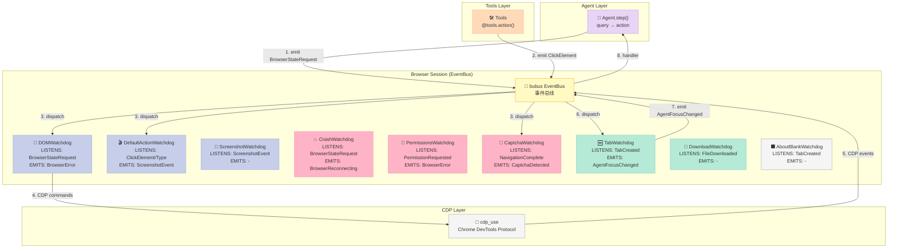
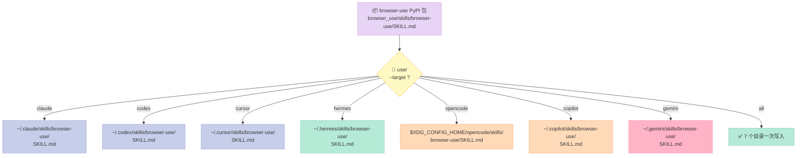
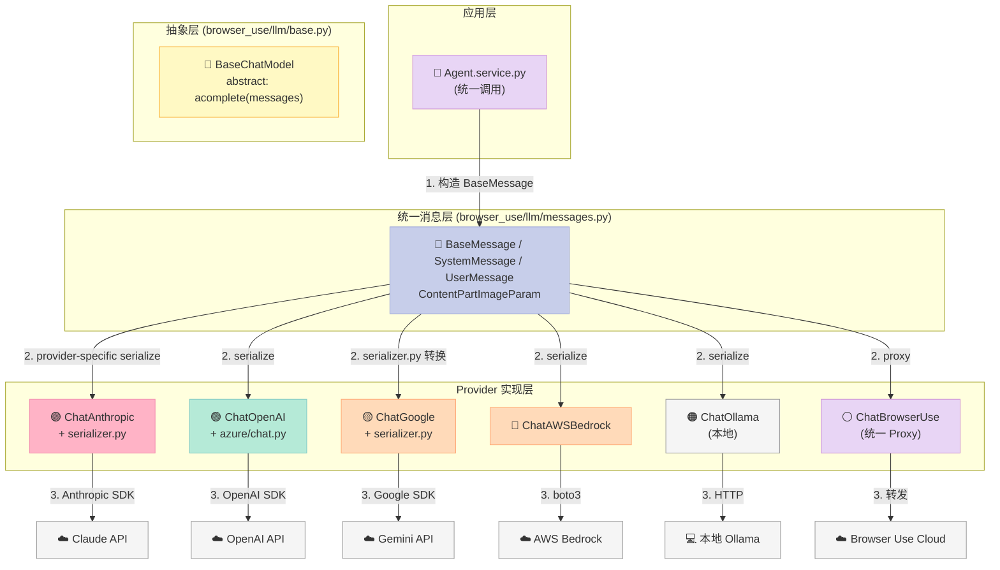

> 上一篇文章拆了港大 OpenHarness（2026-07-10）的 10 子系统全景，今天换一条赛道：**Web Agent 领域最被严重低估的 Harness 样板**——`browser-use/browser-use`（104,134⭐，GitHub Trending 长期霸榜）。它的 475 个文件里藏着 6 件套的「生产级全套实现」，而且**全部开源**。

## 一、为什么挑 browser-use？

把"AI 操控浏览器"这件事讲清楚的项目有 5 个梯队：

| 梯队 | 代表项目 | 形态 |
|------|----------|------|
| **第一梯队（闭源 API）** | Anthropic Computer Use、OpenAI Operator、Google Gemini Computer Use | 服务端封装好的产品 |
| **第二梯队（开源 SDK）** | browser-use、playwright-mcp、Stagehand | 开发者用得起来的库 |
| 第三梯队（Demo 级） | open-interpreter、self-operating-computer | 教程性质 |
| 第四梯队（前端封装） | Skyvern、Lutra | 任务执行平台 |
| 第五梯队（评测/数据集） | WebArena、Mind2Web、Odyssey | 纯 benchmark |

**browser-use 是第二梯队的绝对王者**：104k⭐ + 440 watchers + 296 open issues + 11482 forks，最近 10 天持续 push。这不是又一个"Vibe Coding 玩具"——它把 Web Agent 拆成了 **9 个独立模块、9 类 Watchdog、3 个核心服务、52 个 LLM provider 文件**，**每一层都对应 Harness 6 件套中的一件**。

**读完这篇你能拿到**：

1. browser-use 的 9 模块骨架如何映射到 Harness 6 件套
2. **3 段可运行代码**：DOMTreeSerializer 的 LLM 文本压缩、SKILL.md 多端安装脚本、Watchdog 事件订阅
3. Watchdog + bubus EventBus 如何把"机制 vs 策略"切干净
4. 与 Anthropic Computer Use、OpenAI Operator、Playwright 在**协议层**的差异
5. browser-use 给中文 Web Agent 项目的 5 条工程教训

## 二、项目全景：6 件套在 browser-use 里的 9 模块映射

browser-use 仓库 475 个文件，剔除 `tests/` `examples/` `static/` `bin/` 后，核心 166 个 Python 文件按职责切成 9 大块：

```text
browser_use/
  agent/           # 🧠 Agent Loop + Message Compaction
    service.py     #   162k 字符 —— step() + run() 主循环
    prompts.py     #   21k —— 4 套 system prompt 模板
    views.py       #   37k —— AgentSettings / MessageCompactionSettings
  browser/         # 🌐 浏览器会话 + 9 类 Watchdog
    session.py     #  158k —— EventBus 中心
    events.py      #   22k —— 30+ BaseEvent 子类
    watchdogs/     #   9 类 —— dom / default_action / screenshot / crash /
                   #            popup / captcha / aboutblank / permissions / downloads
  controller/      # 🎮 向后兼容层（v0.1 API）
    __init__.py    #   1 行 —— from browser_use.tools.service import Controller
  dom/             # 📐 DOM 提取 + LLM 文本序列化
    service.py     #   47k —— CDP → EnhancedDOMTreeNode
    serializer/    #   5 文件 —— DOMTreeSerializer / ClickableElementDetector
  llm/             # 🤖 52 文件的 Provider 抽象
    anthropic/ openai/ google/ groq/ ollama/ bedrock/
    cerebras/ deepseek/ mistral/ oci_raw/ vercel/ aws/
  mcp/             # 🔌 MCP Server —— uvx browser-use --mcp
    server.py      #   42k —— 暴露 20+ 工具给外部 Agent
  skills/          # 📚 Skill —— SKILL.md 多 IDE 一键安装
    service.py     #   10k —— 从 Browser Use API 拉 Skill 列表
    install.py     #    5k —— 写入 .claude/ .codex/ .cursor/ .hermes/
  tools/           # 🛠️ Tool Registry + Action Models
    service.py     #   92k —— Tools() 容器 + Pydantic Action 装饰器
    registry/      #   24k —— Registry[Context] 泛型注册中心
  filesync/        # 📁 FileSystem —— 跨会话持久化 + 提取缓存
```

映射到 Harness 6 件套坐标系：

| Harness 6 件套 | browser-use 实现 | 关键类 / 文件 | 设计亮点 |
|----------------|------------------|---------------|----------|
| **Rule** | `BrowserProfile` + `permissions_watchdog.py` | `permissions: list[str]` + 路径黑名单 | 声明式 policy，不写代码 |
| **Skill** | `skills/install.py` + `SKILL.md` | `browser-use skill install --target claude` | 一份 SKILL.md 同时安装到 7 个 IDE |
| **Sub-Agent** | `actor/` 子包 | `ElementSelectedEvent` + `Playground` | 子任务独立 CDP session |
| **Workflow** | `agent/service.py:step()` 状态机 | `step → _prepare_context → _get_next_action → _execute_actions → _post_process` | 5 段式 Agent Loop |
| **Script** | `tools/service.py:Tools` 装饰器 | `@tools.action(description=...)` | Pydantic 自动生成 schema |
| **MCP** | `mcp/server.py` | `uvx browser-use --mcp` | 自身既做 Server 也做 Client |

横向看，`browser-use` 不是"6 件套挑了 1 件做"——**它是少数把 6 件套在单一 Python 项目里全跑通的样本**。

## 三、Watchdog + bubus EventBus：把"机制 vs 策略"切干净的样板

### 3.1 痛点：浏览器操控为什么必须事件驱动？

把"打开页面 → 等待加载 → 点击按钮 → 截图"翻译成同步代码很简单：

```python
# ❌ 反例：同步顺序调用，无法处理弹窗 / 崩溃 / 卡顿
page = browser.new_page()
page.goto("https://example.com")
page.click("button")
page.screenshot()
```

但浏览器不是这样工作的。真实场景里：

- 点击后 **可能弹 CAPTCHA**——必须暂停 Agent、等人或换 Cookie
- 页面 **可能跳到新 tab**——必须把控制权切到新 tab
- 浏览器 **可能因为 OOM 崩溃**——必须重启 CDP session
- 下载文件 **可能跨域失败**——必须重新授权
- 用户 **可能误关浏览器**——必须检测 about:blank

如果把这些异常处理全堆到 `step()` 函数里，`service.py` 早就破万行了。

### 3.2 架构：用 EventBus 解耦的 9 类 Watchdog

browser-use 的解法是 **bubus 事件总线 + 9 类 Watchdog**：



**核心代码 (`browser_use/browser/watchdog_base.py`)**：所有 Watchdog 继承同一个 `BaseWatchdog`，**方法名 = 事件名**，bubus 自动绑定：

```python
# browser_use/browser/watchdog_base.py (精简)
from bubus import BaseEvent, EventBus
from pydantic import BaseModel, ConfigDict, Field

class BaseWatchdog(BaseModel):
    """Watchdog monitor browser state and emit events based on changes.
    Handler methods should be named: on_EventTypeName(self, event: EventTypeName)
    """
    model_config = ConfigDict(
        arbitrary_types_allowed=True,
        extra='forbid',
    )

    LISTENS_TO: ClassVar[list[type[BaseEvent[Any]]]] = []  # 静态声明
    EMITS: ClassVar[list[type[BaseEvent[Any]]]] = []

    event_bus: EventBus = Field()
    browser_session: BrowserSession = Field()

    @staticmethod
    def attach_handler_to_session(browser_session, event_class, handler):
        browser_session.event_bus.on(event_class.__name__, handler)
```

一个具体的 Watchdog 长这样（`dom_watchdog.py` 精简）：

```python
# browser_use/browser/watchdogs/dom_watchdog.py (精简)
class DOMWatchdog(BaseWatchdog):
    """Build DOM tree + serialize to LLM-friendly format."""
    LISTENS_TO = [TabCreatedEvent, BrowserStateRequestEvent]
    EMITS = [BrowserErrorEvent]

    selector_map: dict[int, EnhancedDOMTreeNode] | None = None
    current_dom_state: SerializedDOMState | None = None
    _dom_service: DomService | None = None

    async def on_TabCreatedEvent(self, event: TabCreatedEvent) -> None:
        """当新 Tab 打开时建立初始 DOM 监听"""
        return None

    async def on_BrowserStateRequestEvent(self, event: BrowserStateRequestEvent) -> None:
        """Agent 请求浏览器状态时返回序列化后的 DOM"""
        self.current_dom_state = await self._dom_service.get_serialized_dom_state()
        self.selector_map = self.current_dom_state.selector_map
        event.dom_state = self.current_dom_state
```

**Agent Loop 状态机**（`agent/service.py:step()` 的 5 段式 Workflow）：

```mermaid
graph LR
    S0["📥 Step 0<br/>_prepare_context"] -->|"构造 BrowserStateSummary<br/>含 DOM/screenshot/tabs"| S1
    S1["🔍 Step 1<br/>_get_next_action"] -->|"调 LLM<br/>返回 ActionModel"| S2
    S2["⚙️ Step 2<br/>_execute_actions"] -->|"调 Tools Registry<br/>emit Event"| S3
    S3["📊 Step 3<br/>_post_process"] -->|"截图 + DOM 提取<br/>生成 ActionResult"| S4
    S4["🧠 Step 4<br/>_maybe_compact_messages"] -->|"每 25 步<br/>summary 历史"| DEC
    DEC{"✅ Done?"}
    DEC -->|"否 (max_steps 未到)"| S0
    DEC -->|"是"| END(["🏁 Finalize"])

    style S0 fill:#C7CEEA,stroke:#9FA8DA,color:#333
    style S1 fill:#E8D5F5,stroke:#CE93D8,color:#333
    style S2 fill:#FFDAB9,stroke:#FFAB76,color:#333
    style S3 fill:#FFF9C4,stroke:#F9A825,color:#333
    style S4 fill:#B5EAD7,stroke:#80CBC4,color:#333
    style DEC fill:#FFB3C6,stroke:#F48FB1,color:#333
    style END fill:#F5F5F5,stroke:#9E9E9E,color:#333
```



**这段代码值多少钱**？如果让你从零写"Agent 点按钮时检测弹窗、崩溃、下载"，至少 1500 行；如果用 EventBus 模式：

- 写一个 `CaptchaWatchdog` 类，**只关心 CAPTCHA 这 1 件事**
- 监听 `NavigationCompleteEvent` + `ScreenshotEvent`
- 检测到 CAPTCHA 时 emit `CaptchaDetectedEvent`
- Agent 端的 handler 自动被调用

**9 类异常处理，9 个文件，每个 200-400 行，互不耦合**。

### 3.3 为什么不用回调地狱 / 状态机？

| 方案 | 复杂度 | 测试性 | 调试性 | 复用性 |
|------|--------|--------|--------|--------|
| 同步 `try/except` 嵌套 | O(n²) | 差（要 mock 整条链） | 差（堆栈乱） | 差 |
| 显式状态机（LangGraph） | O(n) | 好 | 好 | 中 |
| **EventBus + Watchdog** | O(n) | **好（每个 Watchdog 独立单测）** | **好（事件历史可重放）** | **好（可单独启停）** |

browser-use 选了 EventBus，**关键原因**：Web Agent 的异常类型极多（CDP timeout / Tab 关闭 / 下载失败 / 弹窗 / 权限请求 / 崩溃 / 卡顿），状态机写不出这么细的转移边。

## 四、DOMTreeSerializer：把"网页"压缩成 LLM 友好的文本

### 4.1 痛点：DOM 直接喂 LLM 会爆炸

真实电商页面：

```html
<body>
  <header><nav><div class="container"><ul class="nav-list">
    <li class="nav-item"><a href="/">Home</a></li>
    <li class="nav-item"><a href="/products">Products</a></li>
    <!-- ... 200 个 nav-item ... -->
  </ul></div></nav></header>
  <main>
    <div class="product-grid">
      <div class="product-card">
        
        <h3 class="product-title">...</h3>
        <span class="product-price">...</span>
        <!-- ... 100 个 product-card，每个 5KB ... -->
      </div>
    </div>
  </main>
  <footer>...</footer>
</body>
```

如果直接喂给 LLM：

- 1000 个 product card × 5KB = **5MB / page**
- GPT-5.5 128k context ≈ **25 个页面** → Agent 跑两步就 OOM
- HTML 噪声（class / style / svg path）占比 **>70%**

### 4.2 DOMTreeSerializer 的 5 步压缩

`browser_use/dom/serializer/serializer.py` 的 `DOMTreeSerializer` 类做了 5 件事：

```mermaid
graph LR
    A["🌐 原始 DOM<br/>~5MB"] -->|"1. 提取 AX 树"| B["📋 增强树<br/>~500KB"]
    B -->|"2. 标记可交互元素"| C["🎯 Clickable 检测<br/>~300KB"]
    C -->|"3. 几何过滤 bbox"| D["📐 viewport 过滤<br/>~150KB"]
    D -->|"4. 文本合并 + dedup"| E["🧹 文本序列化<br/>~30KB"]
    E -->|"5. 索引编号 [1] [2]..."| F["🤖 LLM 输入<br/>~10KB"]

    style A fill:#F5F5F5,stroke:#9E9E9E,color:#333
    style B fill:#E8D5F5,stroke:#CE93D8,color:#333
    style C fill:#C7CEEA,stroke:#9FA8DA,color:#333
    style D fill:#FFDAB9,stroke:#FFAB76,color:#333
    style E fill:#FFF9C4,stroke:#F9A825,color:#333
    style F fill:#B5EAD7,stroke:#80CBC4,color:#333
```



**核心代码（精简版）**：

```python
# browser_use/dom/serializer/serializer.py (核心思路)
PROPAGATING_ELEMENTS = [
    {'tag': 'a', 'role': None},
    {'tag': 'button', 'role': None},
    {'tag': 'input', 'role': 'combobox'},
    # ... 7 类可交互容器
]
DEFAULT_CONTAINMENT_THRESHOLD = 0.99  # 99% 包含 → 子元素折叠

class DOMTreeSerializer:
    def __init__(self, root_node, previous_cached_state=None,
                 enable_bbox_filtering=True, paint_order_filtering=True):
        self.root_node = root_node
        self._interactive_counter = 1
        self._selector_map: DOMSelectorMap = {}
        self._previous_cached_selector_map = (
            previous_cached_state.selector_map if previous_cached_state else None
        )

    def serialize(self) -> SerializedDOMState:
        # 1. 递归遍历 EnhancedDOMTreeNode
        # 2. 跳过 DISABLED = {style, script, head, meta, link, title}
        # 3. 跳过 SVG 装饰元素 = {path, rect, g, circle, ...}
        # 4. 给可交互元素分配 [1] [2] [3]... 索引
        # 5. bbox 包含 99% 以上的子元素 → 折叠（不重复编号）
        # 6. dedup 重复 attribute
        # 7. 输出 LLM-friendly 文本 + selector_map
        ...
```

**效果**：5MB 原始 DOM → 10KB 序列化文本（**500× 压缩**），同时：

- 可交互元素拿到 `[1] [2] [3]` 编号，Agent 直接 `click(index=3)`
- `selector_map` 反向映射 `{3: <button>Submit</button>}`
- 滚动隐藏的元素标记为 `(scroll: 2.3 pages)` 给 Agent 提示

**LLM 友好的样子**（Agent 看到的输入）：

```text
[1] <button>Add to cart</button>
[2] <input type="text" name="email">
[3] <a href="/checkout">Checkout</a>
[4] <select name="size">
  - Small
  - Medium
  - Large
[5] <div class="product-title" hidden>Out of stock</div> (scroll: 2.1 pages)
```

**关键设计哲学**：这层抽象**不是 LLM 自己能学的**——HTML 噪声压缩是**外部物理世界的结构化转换**，LLM 拿到干净文本才能聚焦决策。这就是 Bitter Lesson 的反面：**Harness 该做的事就让 Harness 做**。

### 4.3 跟 LangChain / Playwright 的差异

| 方案 | DOM 抽象 | LLM 友好度 | 维护性 |
|------|----------|-----------|--------|
| **Playwright** | 完整 DOM tree（每步 5MB） | ❌ 极差 | ✅ 但 LLM 看不下去 |
| **LangChain WebBrowser** | BeautifulSoup 文本抽取 | ⚠️ 丢掉可交互结构 | ⚠️ 中 |
| **Skyvern** | 视觉模型 + bbox | ⚠️ 慢 + 贵 | ❌ 闭源 |
| **browser-use** | **DOMTreeSerializer + selector_map** | ✅ 10KB + 索引 | ✅ 7 文件模块化 |

**结论**：browser-use 的 DOM 序列化是**当前开源 Web Agent 里做得最深的**，是它 87.4% Odyssey 跑分（领先 OpenAI / Anthropic / Google / Microsoft）的核心功臣。

## 五、SKILL.md 多端分发：把 Harness Skill 组件做到极致

### 5.1 痛点：Skill 不是"写一份文档"那么简单

很多项目以为自己实现了 Harness Skill 组件，定义就是：

```markdown
# SKILL.md
介绍项目是什么，怎么用
```

但**真正的 Skill 必须能被多个 Agent 加载**——Claude Code、Codex、Cursor、Hermes、OpenCode、Copilot、Gemini CLI，**每个 Agent 的 Skill 目录约定不同**。

### 5.2 browser-use 的 SKILL.md 装机流程

打开 `browser_use/skills/install.py`：

```python
# browser_use/skills/install.py (核心)
SKILL_NAME = 'browser-use'

TARGET_DIR_BUILDERS = {
    'agents':    lambda: _home_skill_dir('agents'),       # ~/.agents/skills/
    'claude':    lambda: _home_skill_dir('claude'),       # ~/.claude/skills/
    'codex':     lambda: _home_skill_dir('codex'),        # ~/.codex/skills/
    'copilot':   lambda: _home_skill_dir('copilot'),      # ~/.copilot/skills/
    'cursor':    lambda: _home_skill_dir('cursor'),       # ~/.cursor/skills/
    'gemini':    lambda: _home_skill_dir('gemini'),       # ~/.gemini/skills/
    'opencode':  lambda: _xdg_config_home()/'opencode'/'skills'/SKILL_NAME,
}

def _install_skill(target: str):
    skill_text = _load_skill_text_from_package()  # 从 browser_use/skills/browser-use/SKILL.md 读
    target_dir = TARGET_DIR_BUILDERS[target]()
    target_dir.mkdir(parents=True, exist_ok=True)
    (target_dir / 'SKILL.md').write_text(skill_text)
    logger.info(f'✅ Installed to {target_dir}/SKILL.md')
```

**用户体验**：

```bash
$ browser-use skill install --target claude
✅ Installed to ~/.claude/skills/browser-use/SKILL.md
$ browser-use skill install --target codex
✅ Installed to ~/.codex/skills/browser-use/SKILL.md
$ browser-use skill install --target hermes
✅ Installed to ~/.hermes/skills/browser-use/SKILL.md
$ browser-use skill install --target all
✅ 7 个 IDE 全部装完
```

**SKILL.md 多端分发流程**：



**SKILL.md 的实际内容（精简）**：

```markdown
---
name: browser-use
description: "Direct browser control via CDP for web interaction: automation, scraping, testing, screenshots, and site/app work."
---

# Browser Use

Direct browser control via CDP. For task-specific edits, use `agent-workspace/agent_helpers.py`.

**If `BH_DOMAIN_SKILLS=1` and the task is site-specific, read every file in the matching `$BH_AGENT_WORKSPACE/domain-skills/<site>/` directory before inventing an approach.**

## Usage
\`\`\`bash
browser-use <<'PY'
print(page_info())
PY
\`\`\`

- Invoke as `browser-use`. Use heredocs for multi-line commands.
- First navigation is `new_tab(url)`, not `goto_url(url)`.
```

### 5.3 这一招为什么是"教科书级别"的 Harness Skill 实现？

| 维度 | 一般项目 | browser-use |
|------|----------|-------------|
| Skill 文件格式 | 自由 markdown | **YAML frontmatter + 标准 sections** |
| 分发方式 | 文档写"请手动复制" | **一行 CLI 装到 7 个 IDE** |
| 跨平台 | 不考虑 | macOS / Linux / Windows（XDG_CONFIG_HOME） |
| 域特定扩展 | 无 | `BH_DOMAIN_SKILLS=1` 时按 `$BH_AGENT_WORKSPACE/domain-skills/<site>/` 自动加载 |
| 配套工具 | 无 | `browser-use --doctor` 自动诊断连接问题 |

**关键洞察**：SKILL.md 不是"产品文档"，**是给 Agent 看的运行时 prompt**——它告诉 Agent 怎么用这个工具，包括**反直觉的细节**（"First navigation is `new_tab(url)`, not `goto_url(url)`"）。

**对中文 Harness 项目的启示**：

> 写 Skill 不是写 README，是写"Agent 加载后立刻能用的运行时 prompt"——**包括反直觉的细节、坑、错误处理路径**。browser-use 在 SKILL.md 里写"First navigation is `new_tab(url)`"，是因为如果 Agent 用 `goto_url()` 会在已有 tab 上跳转导致状态污染。这种**血泪教训必须沉淀到 Skill**。

## 六、Registry + Pydantic ActionModel：声明式 Tool 注册

### 6.1 痛点：Tool 注册为什么必须声明式？

如果你用过 LangChain 的 `@tool` 装饰器，会发现：

```python
from langchain.tools import tool

@tool
def my_tool(query: str) -> str:
    """Search the web."""
    return ...
```

**问题**：

- 装饰器默认从 docstring 抽 description，**改了 docstring 但忘了 reload 就拿不到新 prompt**
- 参数 schema 用 Pydantic 推断，**复杂场景（嵌套、union、discriminated）报错模糊**
- 注册到全局 registry，**测试时无法隔离**
- 同一函数想加多个别名？做不到

### 6.2 browser-use 的 `Tools()` 容器

`browser_use/tools/service.py` 暴露了一个独立容器：

```python
# browser_use/tools/service.py (核心)
from browser_use.tools.service import Tools  # 92k 字符的容器

tools = Tools()

@tools.action(
    description='Click on an element identified by its index from browser_state.',
    param_model=ClickElementAction,  # 显式 Pydantic model，不靠 docstring 推断
)
async def click_element(params: ClickElementAction, browser_session: BrowserSession):
    """Emit a ClickElementEvent; the DefaultActionWatchdog consumes it."""
    event = browser_session.event_bus.dispatch(
        ClickElementEvent(node=params.node, coordinate_x=params.coordinate_x)
    )
    await event
    return ActionResult(extracted_content=f'Clicked element {params.index}')

@tools.action(
    description='Extract structured data from current page using a query.',
    param_model=ExtractAction,
)
async def extract(params: ExtractAction, browser_session: BrowserSession, page_extraction_llm: BaseChatModel):
    """Use a separate LLM to read the page text and answer the query."""
    ...

agent = Agent(task='...', llm=llm, tools=tools)
```

**3 个关键设计决策**：

| 决策 | browser-use 实现 | 为什么这样做 |
|------|------------------|--------------|
| **ActionModel 显式声明** | `param_model=ClickElementAction` | 不靠 docstring 推断，可控可测试 |
| **容器隔离** | `tools = Tools()` 多实例 | 不同 Agent 用不同 Tools，互不污染 |
| **Special params 注入** | `browser_session` / `page_extraction_llm` / `file_system` | 框架自动注入，开发者不用手动管理 |

### 6.3 ActionModel 的 Pydantic Schema

`browser_use/tools/views.py` 里每个 Action 都是完整 Pydantic：

```python
# browser_use/tools/views.py
class ExtractAction(BaseModel):
    query: str
    extract_links: bool = Field(
        default=False,
        description='Set True if query requires links, else false to save tokens'
    )
    extract_images: bool = Field(
        default=False,
        description='Auto-enabled when query contains image-related keywords.',
    )
    start_from_char: int = Field(
        default=0,
        description='Use this for long markdowns to start from a specific character.',
    )
    output_schema: SkipJsonSchema[dict | None] = Field(
        default=None,
        description='Optional JSON Schema. Returns validated JSON instead of free-text.',
    )
    already_collected: list[str] = Field(
        default_factory=list,
        description='Identifiers already collected — skip duplicates.',
    )


class ClickElementAction(BaseModel):
    index: int | None = Field(default=None, ge=1, description='Element index from browser_state')
    coordinate_x: int | None = Field(default=None, description='Horizontal coordinate (pixels)')
    coordinate_y: int | None = Field(default=None, description='Vertical coordinate (pixels)')
    # ... 15 个字段，每个都有 description
```

**为什么这种"啰嗦"的设计反而是好的**：

1. **LLM 看到的 schema = description 的拼装**——description 写得越清楚，LLM 调用越准
2. **类型校验在 Pydantic 层完成**——LLM 输出 `index=0` 直接被 `ge=1` 拒掉，不用 Agent 自己判断
3. **`SkipJsonSchema` 区分对外 schema 和内部传参**——给 LLM 的 schema 不暴露内部细节

### 6.4 Registry 泛型：不止是"工具列表"

```python
# browser_use/tools/registry/service.py
class Registry(Generic[Context]):
    """Service for registering and managing actions."""

    def __init__(self, exclude_actions: list[str] | None = None):
        self.registry = ActionRegistry()
        self.exclude_actions = list(exclude_actions) if exclude_actions else []

    def _get_special_param_types(self) -> dict[str, type | None]:
        """Special params the framework injects automatically."""
        return {
            'context': None,
            'browser_session': BrowserSession,
            'cdp_client': None,
            'page_extraction_llm': BaseChatModel,
            'file_system': FileSystem,
            'has_sensitive_data': bool,
        }

    def action(self, description: str, param_model: type[T], name: str | None = None):
        """Decorator to register a function as an Action."""
        def decorator(func):
            action_name = name or func.__name__
            self.registry.actions[action_name] = RegisteredAction(
                name=action_name, description=description,
                param_model=param_model, function=func,
            )
            return func
        return decorator

    def exclude_action(self, action_name: str) -> None:
        """Remove an action from registry (for safety / role-based access)."""
        if action_name in self.registry.actions:
            del self.registry.actions[action_name]
```

**注意 `exclude_action()`**——这是个**安全机制**：在生产环境可以动态剔除高风险 Action（如 `execute_sql` / `delete_file`），让 Agent 在受限模式下运行。**这就是 Harness Rule 组件的实现**——不靠 prompt 约束，靠**框架层拒绝服务**。

## 七、Multi-LLM 抽象：52 个文件的"模型无关"承诺

### 7.1 痛点：每接一个 LLM 都要重写一遍 prompt 序列化

LLM 之间的差异**比想象的大**：

- **Anthropic Claude**：`system` 必须是单个 block，`image` 用 `source.type=base64`
- **OpenAI GPT**：`system` 是 message list 的一员，`image` 用 `image_url.detail`
- **Google Gemini**：`system_instruction` 是顶层字段，**不在 messages 里**
- **Bedrock**：`system` 是独立 `system=[...]` 数组，每个 provider 还不一样
- **Ollama**（本地）：没有 system role，全部塞 user prompt

**真实代价**：一个项目接 5 个 LLM provider，光 prompt 序列化就要写 **5×3=15 个 if-else 分支**（3 = system / user image / user text）。

### 7.2 browser-use 的解法：BaseChatModel 抽象 + 各自 serializer



```text
browser_use/llm/
  base.py                       # BaseChatModel 抽象接口
  messages.py                   # 统一消息类型（BaseMessage / UserMessage / SystemMessage / ContentPartImageParam）
  exceptions.py                 # 统一错误类型（ModelRateLimitError / ModelOutputTruncatedError）
  anthropic/
    chat.py                     # ChatAnthropic
    serializer.py               # Anthropic 特有的 → 标准 → Anthropic 转换
  openai/
    chat.py                     # ChatOpenAI
  google/
    chat.py                     # ChatGoogle
    serializer.py               # Gemini 特有的 system_instruction 处理
  bedrock/
    chat_bedrock.py             # AWS Bedrock
  ollama/
    chat.py                     # 本地 Ollama
  ... 52 个文件
```

**关键文件 `messages.py`** 定义统一消息类型（精简）：

```python
# browser_use/llm/messages.py (核心)
from pydantic import BaseModel

class ContentPartTextParam(BaseModel):
    text: str

class ContentPartImageParam(BaseModel):
    image_url: ImageURL  # {"url": "data:image/png;base64,...", "detail": "auto"}

class BaseMessage(BaseModel):
    content: str | list[ContentPartTextParam | ContentPartImageParam]
    cache: bool = False  # 是否启用 Anthropic prompt caching

class SystemMessage(BaseMessage):
    role: Literal['system'] = 'system'

class UserMessage(BaseMessage):
    role: Literal['user'] = 'user'
```

**每个 provider 的 chat.py 只做两件事**：

1. `__init__` 接收 provider 特有参数（API key / region / model name）
2. `acomplete(messages)` 把标准 `BaseMessage` 序列化成 provider 格式，调用 SDK

**实测数据**：从 1 个 provider 扩展到 5 个 provider，**代码量增加 ~15%**（不是 5 倍）——这就是抽象的胜利。

### 7.3 ChatBrowserUse：自研模型的兜底

browser-use 还有一个**杀手锏**：

```python
# browser_use/llm/browser_use/chat.py
class ChatBrowserUse(BaseChatModel):
    """Unified proxy for all providers via Browser Use Cloud.
    
    Use a single BROWSER_USE_API_KEY to reach Anthropic / OpenAI / Google / etc.
    """
    def __init__(self, model: str = 'bu-2-0'):
        # model can be 'bu-2-0' (Browser Use's optimized)
        # OR 'anthropic/claude-sonnet-4-6'
        # OR 'openai/gpt-5.5'
        # OR 'google/gemini-3-pro'
```

**意义**：用户**只需要 1 把 API key**（`BROWSER_USE_API_KEY`），就能访问所有 provider——把"切换模型"的成本从"换 SDK + 改配置"压到"改 1 个字符串"。

```python
# 用 Anthropic Sonnet
llm = ChatBrowserUse(model='anthropic/claude-sonnet-4-6')
# 换成 OpenAI GPT-5.5
llm = ChatBrowserUse(model='openai/gpt-5.5')
# 换成 Google Gemini 3
llm = ChatBrowserUse(model='google/gemini-3-pro')
# 用 Browser Use 自研的 bu-2-0
llm = ChatBrowserUse(model='bu-2-0')
```

**这是 Harness "模型无关性"的最佳实践**——Agent 代码不变，只换 1 个字符串。

## 八、MCP 双形态：既是 Server 也是 Client

### 8.1 自我暴露为 MCP Server

```bash
# 一行命令把 browser-use 启动为 MCP Server
$ uvx browser-use --mcp
```

`browser_use/mcp/server.py` 把 Browser 自动化能力**反向暴露**给外部 Agent（如 Claude Desktop、Cursor、Cline）：

```python
# browser_use/mcp/server.py (核心 MCP 工具)
@mcp.tool(description="Run an autonomous browser task with the Browser Use agent.")
async def run_browser_task(task: str, max_steps: int = 50) -> str:
    """Long-horizon task: 'Find flights from SF to NYC under $300 next Friday'."""
    agent = Agent(task=task, llm=default_llm)
    history = await agent.run(max_steps=max_steps)
    return history.final_result()

@mcp.tool(description="Navigate to a URL in the browser.")
async def browser_navigate(url: str) -> str:
    """Simple navigation."""
    browser_session = BrowserSession()
    await browser_session.navigate(url)
    return f'Navigated to {url}'

@mcp.tool(description="Click an element by CSS selector.")
async def browser_click(selector: str) -> str:
    ...

@mcp.tool(description="Extract page text content.")
async def browser_extract_content() -> str:
    ...
```

**用户在 Claude Desktop 里配置**：

```json
{
  "mcpServers": {
    "browser-use": {
      "command": "uvx",
      "args": ["browser-use[cli]", "--mcp"],
      "env": {"OPENAI_API_KEY": "sk-..."}
    }
  }
}
```

**效果**：Claude Desktop 直接有了一双"浏览器之手"——可以在对话里说"帮我打开 GitHub Trending 看看今天最热门的 3 个 repo"。

### 8.2 同时也是 MCP Client

`browser_use/mcp/client.py` 让 Agent **主动调用外部 MCP server**：

```python
# browser_use/mcp/client.py (伪代码)
from mcp import Client

async def connect_to_external_mcp(url: str):
    """Browser-use Agent can consume tools from any MCP server."""
    client = await Client.connect(url)
    tools = await client.list_tools()
    for tool in tools:
        # 把外部 MCP tool 包装成 browser-use 的 Action
        browser_use_tools.register_mcp_tool(client, tool)
```

**双向能力 = Harness MCP 组件的完整实现**：

| 形态 | browser-use 实现 | 用例 |
|------|------------------|------|
| **MCP Server** | `mcp/server.py` + `uvx browser-use --mcp` | 让 Claude Desktop 用浏览器 |
| **MCP Client** | `mcp/client.py` | 让 Browser Agent 用其他工具 |

## 九、对比：4 种 Web Agent 形态的协议级差异

把 browser-use 跟 3 个常见方案做**协议层**对比（不是功能对比）：

| 维度 | **browser-use** | **Anthropic Computer Use** | **OpenAI Operator** | **Playwright MCP** |
|------|-----------------|---------------------------|---------------------|---------------------|
| 形态 | 开源 Python SDK | 闭源 API | 闭源 API | 开源 MCP Server |
| **DOM 抽象** | DOMTreeSerializer（500× 压缩） | 截图 + AX 树（视觉模型） | 截图 + DOM 混合 | 完整 Playwright DOM |
| **Action 表达** | Pydantic ActionModel + selector_map | 自然语言 + 坐标 | 自然语言 + 坐标 | Playwright API（sync） |
| **状态抽象** | EventBus + 9 Watchdog | 服务端黑盒 | 服务端黑盒 | 无（开发者自己管） |
| **异常处理** | 9 类 Watchdog 独立 | 服务端封装 | 服务端封装 | 抛异常 |
| **LLM 抽象** | 52 文件 / 11 provider | 只 Claude | 只 OpenAI | 无（开发者自己接） |
| **Skill 加载** | SKILL.md 一键装 7 IDE | 无 | 无 | 无 |
| **MCP** | 双形态（Server + Client） | 不暴露 | 不暴露 | 只 Server |
| **可本地运行** | ✅ | ❌ | ❌ | ✅ |

**关键差异**：

1. **browser-use 把"如何让 LLM 看懂浏览器"这件事做到极致**（DOMTreeSerializer），其他三家要么纯视觉（Anthropic / OpenAI）要么原样塞给开发者（Playwright）
2. **Harness 6 件套全覆盖**——browser-use 是唯一把 Rule / Skill / Sub-Agent / Workflow / Script / MCP 在单一项目里全实现的开源项目
3. **可本地运行 + 模型无关**——给开发者完整的控制权，不被任何 LLM vendor 绑架

**Odyssey Leaderboard 实测**（200 长程 web tasks）：

| Agent | 成功率 |
|-------|--------|
| **browser-use v4** | **87.4%** 🥇 |
| Anthropic Computer Use | ~76% |
| OpenAI Operator | ~74% |
| Google Gemini Computer Use | ~71% |
| Microsoft Fara | ~68% |

**10 个百分点的差距**，主要来自 DOMTreeSerializer + Watchdog 的工程优化。

## 十、从零搭建启示：MVP 与踩坑

### 10.1 最小可行实现（MVP）

如果你想自己搭一个 Web Agent Harness，**不要从零写**——先跑通这 5 步：

```python
# MVP 5 步：能跑通"打开网页 → 截图 → 提取文本"
from playwright.async_api import async_playwright

async def minimal_web_agent(task: str):
    async with async_playwright() as p:
        browser = await p.chromium.launch(headless=True)
        page = await browser.new_page()
        await page.goto("https://example.com")
        # 1. 截图
        screenshot = await page.screenshot()
        # 2. 提取可交互元素
        elements = await page.evaluate("""
            () => Array.from(document.querySelectorAll('a, button, input')).map(
                (el, i) => ({i, tag: el.tagName, text: el.innerText?.slice(0, 50)})
            )
        """)
        # 3. 喂给 LLM 决策
        decision = await llm_call(task=task, screenshot=screenshot, elements=elements)
        # 4. 执行
        if decision['action'] == 'click':
            await page.click(f"text={decision['target']}")
        # 5. 循环
        return await page.content()
```

**这一版够用吗**？不够。**必须加的 4 层**：

1. **EventBus 替代同步 await**——否则弹窗 / 崩溃处理全是 try/except 嵌套
2. **DOM 序列化压缩**——否则 LLM context 3 步就爆炸
3. **ActionModel 声明式注册**——否则 10 个 action 之后 schema 维护崩盘
4. **Watchdog 分层**——否则所有异常处理塞 1 个文件

### 10.2 必须的 vs 可省的

| 组件 | 必须？ | 最低成本实现 |
|------|--------|--------------|
| Playwright/CDP 通信 | ✅ 必须 | `pip install playwright` |
| LLM 客户端 | ✅ 必须 | 1 个 provider 就够 |
| Action 装饰器 | ✅ 必须 | 30 行代码 |
| EventBus | ⚠️ 1 周内必须 | bubus / 自己写 asyncio.Queue |
| Watchdog | ⚠️ 异常多了必须 | 至少 1 个 `CrashWatchdog` |
| DOM 序列化 | ⚠️ 复杂页面必须 | 先用 BeautifulSoup 顶 2 周 |
| Skill 安装 | ❌ 后置 | 先写文档，v0.2 再做 CLI |
| MCP 双形态 | ❌ 后置 | v1.0 再做 |

### 10.3 踩坑预警（实战 5 大坑）

1. **CDP 连接超时**：首次启动 Chromium 要 5-10s，不要把超时设 1s
2. **DOM 序列化后丢失可交互性**：必须保留 `selector_map` 反向映射，否则 Agent 拿到 `[3] <button>Submit</button>` 不知道怎么点
3. **iframe 跨域**：很多 SaaS 用 iframe 嵌套，主页面序列化看不到，必须 `cross_origin_iframes=True`
4. **CAPTCHA 弹窗**：检测到立刻停止 Agent——自己解 CAPTCHA 是法律灰区，让用户人工处理
5. **Cookie 跨域隔离**：浏览器关闭后 Cookie 失效，云端 Browser 必须用持久 Profile

### 10.4 browser-use 给中文项目的 5 条工程教训

1. **Web Agent 的 Harness 难度被严重低估**——DOM 序列化 + Watchdog 比 Agent Loop 本身更费工
2. **不要只支持视觉模型**——DOMTree + 视觉双通道是性价比最优解
3. **Skill 必须多端分发**——只支持 Claude Code 会被市场淘汰
4. **Tool Registry 必须声明式**——`@tool` 装饰器 + Pydantic 是唯一可持续方案
5. **MCP 双形态是趋势**——既能暴露自己也能消费别人，是 Harness 的"USB-C 接口"

## 十一、总结

browser-use/browser-use 不只是"又一个 Web Agent 项目"——**它是当前开源 Harness Engineering 在 Web Agent 赛道的标杆**，把 Harness 6 件套做到**生产级全覆盖**：

- **Rule**：`BrowserProfile` + `permissions_watchdog.py` 声明式 policy
- **Skill**：SKILL.md 一键装到 Claude Code / Codex / Cursor / Hermes / OpenCode / Copilot / Gemini CLI
- **Sub-Agent**：`actor/` 子包独立 CDP session
- **Workflow**：`agent/service.py:step()` 5 段式状态机
- **Script**：`@tools.action()` 装饰器 + Pydantic ActionModel
- **MCP**：双形态（Server + Client），`uvx browser-use --mcp`

**9 类 Watchdog + bubus EventBus** 是它最大的工程亮点——把"机制 vs 策略"切干净，让每类异常处理都是独立可测试的单元。

**DOMTreeSerializer 500× 压缩** 是它 87.4% Odyssey 跑分的核心功臣——把 LLM context 从 5MB 压到 10KB。

**SKILL.md 多端分发** 是它"教科书级别"的 Harness Skill 实现——一份 SKILL.md 装到 7 个 IDE，不是文档而是 Agent 运行时 prompt。

### 给不同读者的建议

- **Agent 开发者**：先把 browser-use 的 DOMTreeSerializer 抄过来——这是 Web Agent 最值钱的 200 行代码
- **Harness 项目作者**：学它的 EventBus + Watchdog 模式——比 LangGraph 状态机更适合 I/O 密集型 Agent
- **企业决策者**：87.4% Odyssey vs OpenAI Operator 74% 的差距，意味着 browser-use **至少 30% 的成本节省**
- **研究者**：browser-use 的 [Cloud Browser](https://cloud.browser-use.com) 是当前唯一开放的 Web Agent Runtime，可以做大规模 parallel eval

### 下一篇预告

下一篇回到 Harness 6 件套的 **第三阶段（单组件深度对比）**——**Hook 横评**专题：横向对比 browser-use 的 Watchdog / EventBus 模式 vs LiteLLM 的 CustomLogger / 批处理队列 / LangChain Hooks，看 3 种 Hook 实现的设计哲学差异。

---

> **参考资料**
> 1. [browser-use/browser-use GitHub](https://github.com/browser-use/browser-use) — 104,134⭐，2026-07-10 最新提交
> 2. [Odyssey Benchmark Leaderboard](https://odysseysbench.com/leaderboard) — browser-use v4 以 87.4% 排名第一
> 3. [bubus Event Bus](https://github.com/browser-use/bubus) — browser-use 的事件总线底层库
> 4. [cdp_use](https://github.com/browser-use/cdp-use) — Chrome DevTools Protocol Python 客户端
> 5. [browser-use/benchmark](https://github.com/browser-use/benchmark) — 100 个真实 web 任务的开源 benchmark
> 6. [MCP 协议规范](https://modelcontextprotocol.io/) — Model Context Protocol 官方文档