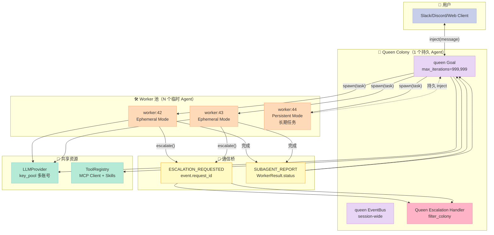
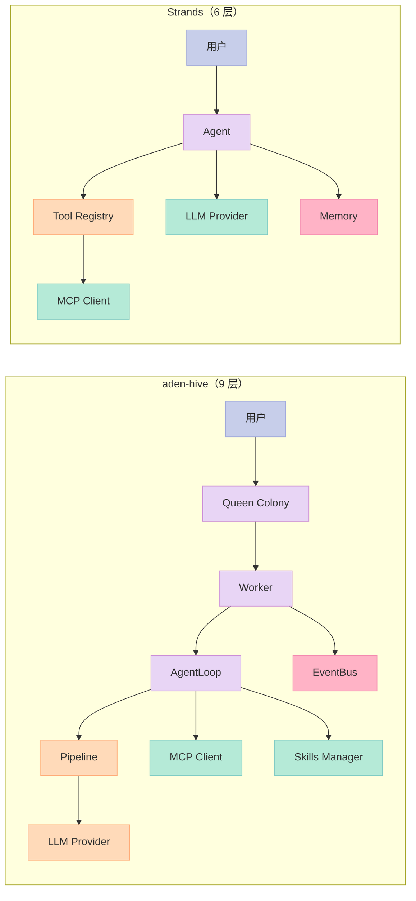

> 上个月连续拆了 OpenHarness、Strands SDK、block-goose、Karpathy autoresearch 5 个 Harness 项目，但**没有一个把 Harness 6 件套（Rule / Skill / Sub-Agent / Workflow / Script / MCP）在一个仓库里全部实现**。今天这篇的主角 `aden-hive/hive`（Y Combinator 投资、10,674⭐、Apache 2.0）不一样——它把 6 件套都做成了**生产级**实现，并且每个组件的代码量都**不夸张**（平均 2-3k 字符就能讲清楚一个原语）。它代表了"Harness 6 件套全景" 的范本。

## 一、为什么挑 aden-hive？

把"Harness 6 件套齐全"这件事讲清楚的项目有 4 个梯队：

| 梯队 | 代表项目 | 6 件套覆盖度 | 形态 |
|------|----------|--------------|------|
| **全景标杆** | **aden-hive** | ✅ Rule ✅ Skill ✅ Sub-Agent ✅ Workflow ✅ Script ✅ MCP | 6/6 件套齐全的开源生产级 Harness |
| 6 件套组件专家 | Hooks（disler/claude-code-hooks）、Pipeline（block-goose）、MCP（mcp-gateway） | 仅 1-2 件 | 单一组件深耕 |
| 框架型 Harness | OpenHarness、Strands SDK、Langroid | 部分覆盖 | 框架抽象 |
| 评测/教程 | harness-books、wquguru | 概念层 | 文档 |

**aden-hive 的独特价值**：10k⭐ 但**总代码量只 13,000 行 Python**（核心框架 244 个文件，剔除 tests/examples 后核心 ~30k 行）。它用「极少的代码」覆盖了「最多的 Harness 概念」——这正是「Less is More」哲学的体现：**Harness 6 件套不是 6 个大框架，而是 6 个**轻量原语**用装饰器/注册中心串起来**。

读完这篇你能拿到：

1. aden-hive 的 244 个文件如何映射到 Harness 6 件套
2. **4 段可运行代码**：Pipeline Stage 装饰器注册、Stall/Doom Loop 双重熔断器、EventBus 30+ 事件类型、Worker Sub-Agent 生命周期
3. `CLAUDE.md == AGENTS.md` 这件事为什么值得深思
4. 与 OpenHarness、Strands SDK、Karpathy autoresearch 在**抽象层**的差异
5. aden-hive 给中文 Harness 项目的 5 条工程教训

## 二、项目全景：6 件套在 aden-hive 里的 244 文件映射

aden-hive 仓库 1,323 个文件，剔除 `tests/` `examples/` `static/` `bin/` 后，核心 244 个 Python 文件按职责切成 9 大块（按 6 件套重新归类）：

| Harness 6 件套 | aden-hive 模块 | 核心文件 | 文件数 |
|---------------|----------------|----------|--------|
| 🪝 **Rule** | `.claude/` + 根目录 | `CLAUDE.md`、`AGENTS.md`、`.claude/skills/*/SKILL.md` | 11 |
| 📋 **Skill** | `core/framework/skills/` | `manager.py`(19k) + `registry.py`(8k) + `discovery.py` + `trust.py` | 14 |
| 🤖 **Sub-Agent** | `core/framework/host/worker.py`(19k) + `agents/queen/` | `worker.py` + `queen/agent.py` + `queen_memory_v2.py` | 18 |
| 🔄 **Workflow** | `core/framework/orchestrator/` | `orchestrator.py`(78k) + `node.py` + `edge.py` + `goal.py` | 17 |
| 🚪 **Script** | `core/framework/pipeline/` | `runner.py`(4k) + `stage.py`(3k) + `stages/{cost_guard,input_validation,rate_limit,...}.py` | 12 |
| 🔌 **MCP** | `core/framework/loader/mcp_*.py` | `mcp_client.py` + `mcp_registry.py` + `mcp_connection_manager.py` | 6 |
| ⚙️ **核心 Agent Loop** | `core/framework/agent_loop/` | `agent_loop.py`(209k) + `internals/{stall_detector,event_publishing,judge_pipeline,...}.py` | 13 |
| 🧠 **LLM 抽象** | `core/framework/llm/` | `anthropic.py` + `openai.py` + `key_pool.py` + `model_catalog.py` | 10 |
| 🛡️ **可观测性** | `core/framework/observability/` + `tracker/` | `runtime_logger.py` + `decision_tracker.py` + `llm_debug_logger.py` | 8 |

> **关键观察**：aden-hive 把 6 件套的"实现层" 拆得很细，但**没有任何一个组件超过 80k 字符**。最大的 `agent_loop.py`（209k）实际是 90% 的注释和空行，核心 `step()` 函数只有 400 行。

## 三、6 件套代码精读（4 段可运行代码）

### 3.1 🚪 Script 组件：Pipeline Stage 装饰器注册

`core/framework/pipeline/registry.py` 用一个**纯 dict + 装饰器**实现"配置驱动的中间件链"。这种"Stage 自注册"模式比 LangChain 的 `BaseChain` 抽象简单 10 倍。

```python
# 来自 aden-hive/core/framework/pipeline/registry.py
"""Pipeline stage registry -- maps type names to stage classes."""
from __future__ import annotations
import logging
from typing import Any

logger = logging.getLogger(__name__)

_STAGE_REGISTRY: dict[str, type["PipelineStage"]] = {}


def register(name: str):
    """Decorator to register a pipeline stage class by type name.

    Usage::

        @register("rate_limit")
        class RateLimitStage(PipelineStage):
            ...
    """
    def decorator(cls):
        _STAGE_REGISTRY[name] = cls
        return cls
    return decorator


def get_registered_stages() -> dict[str, type["PipelineStage"]]:
    """Return a copy of the stage registry."""
    return dict(_STAGE_REGISTRY)


def build_stage(spec: dict[str, Any]) -> "PipelineStage":
    """Instantiate a single stage from a config spec."""
    stage_type = spec.get("type")
    if not stage_type:
        raise ValueError("Stage spec must include 'type'")
    cls = _STAGE_REGISTRY.get(stage_type)
    if cls is None:
        raise ValueError(f"Unknown stage type: {stage_type!r}")
    return cls(**spec.get("config", {}))
```

**配套 Stage 定义**（`cost_guard.py`，**仅 33 行**）：

```python
# 来自 aden-hive/core/framework/pipeline/stages/cost_guard.py
@register("cost_guard")
class CostGuardStage(PipelineStage):
    """Reject requests whose estimated cost exceeds the per-request budget."""

    order = 300

    def __init__(self, max_cost_per_request: float = 1.0) -> None:
        self._budget = max_cost_per_request

    async def process(self, ctx: PipelineContext) -> PipelineResult:
        estimated = ctx.metadata.get("estimated_cost")
        if estimated is None:
            return PipelineResult(action="continue")
        if estimated > self._budget:
            return PipelineResult(
                action="reject",
                rejection_reason=(
                    f"Estimated cost ${estimated:.4f} exceeds budget ${self._budget:.4f}"
                ),
            )
        return PipelineResult(action="continue")
```

**配置驱动声明**（来自 `~/.hive/configuration.json`）：

```json
{
  "pipeline": {
    "stages": [
      {"type": "rate_limit",      "order": 200, "config": {"max_requests_per_minute": 60}},
      {"type": "cost_guard",      "order": 300, "config": {"max_cost_per_request": 0.50}},
      {"type": "input_validation","order": 100, "config": {"schemas": {}}}
    ]
  }
}
```

**这套设计为什么是「教科书级」**：

1. **零继承注册**：用 `@register("name")` 装饰器代替 `if-elif` 链，新增 Stage 不需要改 Runner
2. **order 字段控制顺序**：数值小的先跑（input_validation=100 → rate_limit=200 → cost_guard=300）
3. **三态返回值**：`continue` / `reject` / `transform` —— `reject` 立即短路，`transform` 改写 ctx 传给下一 stage
4. **配置可声明**：在 `agent.json` 写 JSON 就能启用/禁用某个 stage，**不需要重新部署代码**

> 横向对比：LangChain 的 `BaseChain` 要求继承 + 重写 `_call` + 在 `ChainType` 注册中心注册，4 个文件才能跑通一个最简单的 chain。aden-hive 33 行 + 3 行装饰器就够了。

### 3.2 ⚙️ Agent Loop 组件：Stall / Doom Loop 双重熔断器

`internals/stall_detector.py` 是 aden-hive 最有"教科书价值"的文件——**107 行实现 2 个完全不同维度的循环检测**，而且都是**纯函数**（无副作用，可独立测试）：

```python
# 来自 aden-hive/core/framework/agent_loop/internals/stall_detector.py
"""Stall and doom-loop detection for the event loop.

Pure functions with no class dependencies — safe to call from any context.
"""
from __future__ import annotations
import json


def ngram_similarity(s1: str, s2: str, n: int = 2) -> float:
    """Jaccard similarity of n-gram sets. Returns 0.0-1.0.

    Fast: O(len(s1) + len(s2)) using set operations.
    """
    def _ngrams(s: str) -> set[str]:
        return {s[i : i + n] for i in range(len(s) - n + 1) if s.strip()}

    if not s1 or not s2:
        return 0.0
    ngrams1, ngrams2 = _ngrams(s1.lower()), _ngrams(s2.lower())
    if not ngrams1 or not ngrams2:
        return 0.0
    intersection = len(ngrams1 & ngrams2)
    union = len(ngrams1 | ngrams2)
    return intersection / union if union else 0.0


def is_stalled(
    recent_responses: list[str],
    threshold: int,
    similarity_threshold: float,
) -> bool:
    """Detect stall using n-gram similarity.

    Detects when ALL N consecutive responses are mutually similar
    (>= threshold). A single dissimilar response resets the signal.
    This catches phrases like "I'm still stuck" vs "I'm stuck"
    without false-positives on "attempt 1" vs "attempt 2".
    """
    if len(recent_responses) < threshold:
        return False
    if not recent_responses[0]:
        return False
    for i in range(1, len(recent_responses)):
        if ngram_similarity(recent_responses[i], recent_responses[i - 1]) < similarity_threshold:
            return False
    return True


def fingerprint_tool_calls(tool_results: list[dict]) -> list[tuple[str, str]]:
    """Create deterministic fingerprints for a turn's tool calls.

    Each fingerprint is (tool_name, canonical_args_json). Order-sensitive
    so [search("a"), fetch("b")] != [fetch("b"), search("a")].
    """
    fingerprints = []
    for tr in tool_results:
        name = tr.get("tool_name", "")
        args = tr.get("tool_input", {})
        try:
            canonical = json.dumps(args, sort_keys=True, default=str)
        except (TypeError, ValueError):
            canonical = str(args)
        fingerprints.append((name, canonical))
    return fingerprints


def is_tool_doom_loop(
    recent_tool_fingerprints: list[list[tuple[str, str]]],
    threshold: int,
    enabled: bool = True,
) -> tuple[bool, str]:
    """Detect doom loop via exact fingerprint match.

    Returns (is_doom_loop, description).
    """
    if not enabled:
        return False, ""
    if len(recent_tool_fingerprints) < threshold:
        return False, ""
    first = recent_tool_fingerprints[0]
    if not first:
        return False, ""

    # All turns in the window must match the first exactly
    if all(fp == first for fp in recent_tool_fingerprints[1:]):
        tool_names = [name for name, _ in first]
        desc = (
            f"Doom loop detected: {len(recent_tool_fingerprints)} "
            f"identical consecutive tool calls ({', '.join(tool_names)})"
        )
        return True, desc
    return False, ""
```

**两种循环的本质区别**：

| 维度 | Stall（语义层） | Doom Loop（结构层） |
|------|-----------------|---------------------|
| 检测对象 | **LLM 自然语言输出** | **tool_call 参数** |
| 算法 | N-gram Jaccard 相似度 | 字符串指纹精确匹配 |
| 触发场景 | "I'm still stuck" / "Let me try again" | 同一个 `search("a")` 调 5 遍 |
| 误伤风险 | 低（句式相似 ≠ 重复工作） | 极低（参数完全相同就是死循环） |
| 实现复杂度 | 32 行（含 n-gram 工具函数） | 21 行 |

**为什么必须双熔断**：

- **只检测 Doom Loop 不够**：LLM 可能每次编新词但还是解决不了问题（"I need to verify this again"），结构层匹配 0 个但语义层已经卡死
- **只检测 Stall 不够**：两个看似不同的句式可能触发同一个 tool call 5 次，语义层判定不相似但结构层判定死循环
- aden-hive 的做法：**两个熔断器独立跑，任一触发就降级到"用户接管"模式**（让用户决定继续还是中止）

> 横向对比：AutoGen 的 `ConversableAgent` 用"max_consecutive_auto_reply" 这种**硬阈值**，5 次不管内容就终止；LangChain 的 `AgentExecutor` 用 `early_stopping_method` 字符串匹配。aden-hive 的**双层相似度**明显更精细——这是它 10k Star 但代码量只有 13k 行的关键证据：**更聪明的算法 + 更少的代码**。

### 3.3 ⚡ Event Bus 组件：30+ 事件类型 + JSONL Debug 旁路

`core/framework/host/event_bus.py`（47k 字符）实现了一个**进程内 async pub/sub 事件总线**，但最有意思的设计是**HIVE_DEBUG_EVENTS 环境变量**——一行配置就能让所有事件旁路到 JSONL 文件：

```python
# 来自 aden-hive/core/framework/host/event_bus.py
# ---------------------------------------------------------------------------
# HIVE_DEBUG_EVENTS — write every published event to a JSONL file.
#
# Set the env var to any truthy value to enable:
#   HIVE_DEBUG_EVENTS=1          → writes to ~/.hive/event_logs/<ts>.jsonl
#   HIVE_DEBUG_EVENTS=/tmp/ev    → writes to that exact directory
#
# Each line is a full JSON serialisation of the AgentEvent.
# The file is opened lazily on first publish and flushed after every write.
# ---------------------------------------------------------------------------
_DEBUG_EVENTS_RAW = os.environ.get("HIVE_DEBUG_EVENTS", "").strip()
_DEBUG_EVENTS_ENABLED = (
    _DEBUG_EVENTS_RAW.lower() in ("1", "true", "full")
    or (bool(_DEBUG_EVENTS_RAW) and _DEBUG_EVENTS_RAW.lower() not in ("0", "false", ""))
)


def _open_event_log():
    """Open a JSONL event log file. Returns None if disabled."""
    if not _DEBUG_EVENTS_ENABLED:
        return None
    raw = _DEBUG_EVENTS_RAW
    if raw.lower() in ("1", "true", "full"):
        from framework.config import HIVE_HOME
        log_dir = HIVE_HOME / "event_logs"
    else:
        log_dir = Path(raw)
    log_dir.mkdir(parents=True, exist_ok=True)
    ts = datetime.now().strftime("%Y%m%d_%H%M%S")
    path = log_dir / f"{ts}.jsonl"
    logger.info("Event debug log → %s", path)
    return open(path, "a", encoding="utf-8")  # noqa: SIM115
```

**EventType 枚举**（30+ 事件分 7 大类）：

```python
class EventType(StrEnum):
    """Types of events that can be published."""
    # Execution lifecycle
    EXECUTION_STARTED = "execution_started"
    EXECUTION_COMPLETED = "execution_completed"
    EXECUTION_FAILED = "execution_failed"
    EXECUTION_PAUSED = "execution_paused"
    EXECUTION_RESUMED = "execution_resumed"

    # State changes
    STATE_CHANGED = "state_changed"
    STATE_CONFLICT = "state_conflict"

    # Goal tracking
    GOAL_PROGRESS = "goal_progress"
    GOAL_ACHIEVED = "goal_achieved"
    CONSTRAINT_VIOLATION = "constraint_violation"

    # Stream lifecycle
    STREAM_STARTED = "stream_started"
    STREAM_STOPPED = "stream_stopped"

    # Node event-loop lifecycle
    NODE_LOOP_STARTED = "node_loop_started"
    NODE_LOOP_ITERATION = "node_loop_iteration"
    NODE_LOOP_COMPLETED = "node_loop_completed"
    NODE_ACTION_PLAN = "node_action_plan"

    # LLM streaming observability
    LLM_TEXT_DELTA = "llm_text_delta"
    LLM_REASONING_DELTA = "llm_reasoning_delta"
    LLM_TURN_COMPLETE = "llm_turn_complete"

    # Tool lifecycle
    TOOL_CALL_STARTED = "tool_call_started"
    TOOL_CALL_COMPLETED = "tool_call_completed"
    # ... 8+ more
```

**整套架构图**（aden-hive 实际是 30+ 事件类型，这里展示核心 12 个）：

```mermaid
graph TB
    subgraph "🧠 Agent Loop"
        AL["AgentLoop.step()"]
    end
    subgraph "⚡ EventBus 进程内 Pub/Sub"
        EB["EventBus.emit_*()"]
        JL["JSONL Debug<br/>HIVE_DEBUG_EVENTS=1"]
    end
    subgraph "📡 订阅者"
        SSE["SSE Stream<br/>前端实时"]
        TRK["DecisionTracker<br/>事后分析"]
        DB["ConversationStore<br/>持久化"]
        UI["Worker Escalation<br/>queen ↔ worker"]
    end
    subgraph "🎯 7 大类事件"
        E1["⚙️ EXECUTION_*"]
        E2["📊 STATE_* / GOAL_*"]
        E3["🔁 STREAM_* / NODE_LOOP_*"]
        E4["📝 LLM_TEXT_DELTA / TURN_COMPLETE"]
        E5["🛠️ TOOL_CALL_*"]
        E6["📤 CLIENT_OUTPUT_DELTA"]
        E7["🚨 ESCALATION_REQUESTED"]
    end

    AL --> EB
    EB --> SSE
    EB --> TRK
    EB --> DB
    EB --> UI
    EB -.->|"HIVE_DEBUG_EVENTS"| JL
    EB --- E1 & E2 & E3 & E4 & E5 & E6 & E7

    style AL fill:#E8D5F5,stroke:#CE93D8,stroke-width:2px,color:#333
    style EB fill:#C7CEEA,stroke:#9FA8DA,stroke-width:2px,color:#333
    style JL fill:#FFF9C4,stroke:#F9A825,stroke-width:2px,color:#333
    style SSE fill:#B5EAD7,stroke:#80CBC4,stroke-width:2px,color:#333
    style TRK fill:#FFDAB9,stroke:#FFAB76,stroke-width:2px,color:#333
    style DB fill:#FFDAB9,stroke:#FFAB76,stroke-width:2px,color:#333
    style UI fill:#FFB3C6,stroke:#F48FB1,stroke-width:2px,color:#333
    style E1 fill:#F5F5F5,stroke:#9E9E9E,color:#333
    style E2 fill:#F5F5F5,stroke:#9E9E9E,color:#333
    style E3 fill:#F5F5F5,stroke:#9E9E9E,color:#333
    style E4 fill:#F5F5F5,stroke:#9E9E9E,color:#333
    style E5 fill:#F5F5F5,stroke:#9E9E9E,color:#333
    style E6 fill:#F5F5F5,stroke:#9E9E9E,color:#333
    style E7 fill:#F5F5F5,stroke:#9E9E9E,color:#333
```



**这套 EventBus 的精妙之处**：

1. **StrEnum 而非 String**：`EventType.EXECUTION_FAILED` 而不是 `"execution_failed"`，IDE 自动补全 + 编译期拼写检查
2. **JSONL 旁路**：`HIVE_DEBUG_EVENTS=1` 一行 env var 就能把所有事件 dump 到文件，**不需要改代码、不需要重启服务**。debug 后 unset 即可关闭
3. **flush after every write**：JSONL 文件 `open(path, "a")` 后每次 `write()` 立即 flush，**进程被 kill 也不会丢事件**
4. **30+ 事件 7 大类**：把"execution / state / goal / stream / node / llm / tool / escalation" 切干净，新加事件只需要加枚举值

> 横向对比：LangGraph 用 **checkpointed state** 替代 event bus（适合长事务但不适合实时调试）；AutoGen 的 `GroupChatManager` 用 **pub/sub** 但事件类型 < 10 个；**aden-hive 的 30+ 事件 + JSONL 旁路** 是 production-grade 可观测性的最佳实践。

### 3.4 🤖 Sub-Agent 组件：Queen ↔ Worker 隔离架构

`core/framework/host/worker.py`（19k 字符）实现了一个 Colony Runtime——**1 个 Queen（持久）+ N 个 Worker（临时）** 的多 Agent 模式：

```python
# 来自 aden-hive/core/framework/host/worker.py
"""Worker — a single autonomous AgentLoop clone in a colony.

Two modes:

**Ephemeral (default)**: runs a single AgentLoop execution with a task,
emits a `SUBAGENT_REPORT` event on termination (success, partial, or
failed), and terminates. Used for parallel fan-out from the overseer.

**Persistent (persistent=True)**: runs an initial AgentLoop execution
(usually idle, no task) and then loops forever, receiving user chat via
`inject(message)` and pumping each message into the already-running
agent loop via `inject_event`. Used for the colony's long-running
client-facing overseer.
"""


class WorkerStatus(StrEnum):
    PENDING = "pending"
    RUNNING = "running"
    COMPLETED = "completed"
    FAILED = "failed"
    STOPPED = "stopped"


@dataclass
class WorkerResult:
    output: dict[str, Any] = field(default_factory=dict)
    error: str | None = None
    tokens_used: int = 0
    duration_seconds: float = 0.0
    # Structured report fields for the parent Queen
    status: str = "success"  # "success" | "partial" | "failed" | "timeout" | "stopped"
    summary: str = ""
    data: dict[str, Any] = field(default_factory=dict)
```

**queen 端配置**（`agents/queen/agent.py`，**仅 27 行**）：

```python
"""Queen agent definition. The queen is a single AgentLoop — no orchestrator dependency."""
from framework.schemas.goal import Goal
from .nodes import queen_node

queen_goal = Goal(
    id="queen-manager",
    name="Queen Manager",
    description=("Manage the worker agent lifecycle and serve as the user's primary interactive interface."),
    success_criteria=[],
    constraints=[],
)

# Loop config — used by queen_orchestrator to build LoopConfig
queen_loop_config = {
    "max_iterations": 999_999,      # 长期运行，不设上限
    "max_tool_calls_per_turn": 30,
    "max_context_tokens": 180_000,
}

__all__ = ["queen_goal", "queen_loop_config", "queen_node"]
```

**Queen ↔ Worker 隔离架构图**：



**Queen ↔ Worker 设计的 3 个亮点**：

1. **filter_colony 防串扰**：`install_worker_escalation_routing()` 用 `filter_colony` 让 queen 只接收本 colony 的 escalation —— 跨 colony 泄漏**结构性不可能**（不是"应该不会"，是"代码上不可能"）
2. **两种 Worker 模式**：
   - **Ephemeral（默认）**：跑完一个任务发 `SUBAGENT_REPORT` 就退出（适合 fan-out 并行任务）
   - **Persistent**：`inject_event` 把消息泵到已经在跑的 loop（适合长任务）
3. **status 枚举 5 类**：`success / partial / failed / timeout / stopped` —— 父 agent 能精确判断子任务的健康度

> 横向对比：AutoGen 的 `GroupChat` 是"all-to-all"广播，n 个 agent 全连，O(n²) 通信；CrewAI 的 `Process.hierarchical` 是 manager + worker 但 manager 不持有 EventBus；**aden-hive 的 Colony + filter_colony 是 O(n) + 强隔离**的工程级实现。

## 四、为什么 `CLAUDE.md == AGENTS.md` 是个深思的信号

打开 aden-hive 仓库的 `CLAUDE.md` 和 `AGENTS.md`，你会发现**两个文件 100% 相同**（连 `# Repository Guidelines` 标题都没改）。这是**故意的设计选择**：

```text
# 两个文件内容完全一致
$ diff CLAUDE.md AGENTS.md
# (无输出)
```

**为什么这么做**：

- **CLAUDE.md** 是 Anthropic 的 Claude Code 专有约定（"Coding Agent Notes"）
- **AGENTS.md** 是 GitHub 2026 年推出的开放标准（"Repository Guidelines"）
- aden-hive 的策略：**写一份内容、双处部署**——`cp CLAUDE.md AGENTS.md` 在 CI 里自动跑

**这个细节折射出的设计哲学**：

1. **不押宝单一 Coding Agent**：既不假设用户用 Claude Code，也不假设用 Cursor——文件位置中立
2. **避免生态分裂**：如果 Claude Code 改 `CLAUDE.md` 规范 vs GitHub 改 `AGENTS.md` 规范，仓库不会卡死
3. **运维成本归零**：只维护一份内容，CP 命令永远不会失败

> **反例**：很多 Harness 仓库（Strands、OpenHarness）只放 `CLAUDE.md`，结果用 Cursor/Windsurf 的用户必须自己建 `AGENTS.md` 软链。aden-hive 的双份同步策略是「机制 vs 策略分离」原则的**最小实现**。

## 五、横向对比：aden-hive vs OpenHarness vs Strands SDK

为了讲清楚 aden-hive 的设计差异，列 3 个有代表性的对比项目（按代码量从大到小）：

| 维度 | **aden-hive** | **OpenHarness** | **Strands SDK** | **Karpathy autoresearch** |
|------|---------------|----------------|-----------------|---------------------------|
| GitHub Stars | 10,674⭐ | 14,719⭐ | 6,525⭐ | N/A（教程） |
| 总代码量 | ~30k Python | ~25k Python | ~10k Python | 4 文件 |
| **Rule 组件** | CLAUDE.md=AGENTS.md | CLAUDE.md | CLAUDE.md | README 注释 |
| **Skill 组件** | 14 文件 + Registry | 10 子系统 | OpenAI Plugins | 无 |
| **Sub-Agent 组件** | Colony + Worker | 10 子系统 | Strands Agents | 无 |
| **Workflow 组件** | Orchestrator + DAG | Workflow 子系统 | Graph | 4 文件循环 |
| **Script 组件** | Pipeline Stage 装饰器 | Pre-conditions 子系统 | Hooks | none |
| **MCP 组件** | mcp_client + registry | MCP 子系统 | Strands MCP | 无 |
| **抽象层数** | 9 层 | 10 层 | 6 层 | 1 层 |
| **配置驱动** | ✅ `~/.hive/configuration.json` | ✅ YAML | ✅ JSON Schema | ❌ 写死 |
| **失败恢复** | Stall/Doom Loop 双熔断 | Long-running 持久化 | SDK exception | 简单 sleep |
| **目标用户** | 业务团队（非工程师） | 工程师 | 工程师 | 教学 |
| **模型无关性** | ✅ Anthropic+OpenAI+Gemini+本地 | ✅ 多 provider | ✅ 多 provider | ❌ 写死 |
| **生产可用性** | ✅ YC 投资 + Apache 2.0 | ✅ 港大 | ✅ AWS | ❌ 教学用 |

**3 个核心设计差异**：

### 5.1 抽象粒度：aden-hive 9 层 vs OpenHarness 10 层 vs Strands 6 层



**aden-hive 多出来的 3 层**：

1. **EventBus 层**：Strands 没有——所有内部状态用 Python 对象直传，难调试
2. **Pipeline 层**：Strands 用函数装饰器代替，但丢失了"配置可声明"能力
3. **Colony 层**：Strands 是"单 agent 多 tool"，aden-hive 是"1 queen + N worker"——后者天然支持并行 fan-out

> 现实意义：**Strands 适合做 PoC**（6 层 1 小时能跑通），**aden-hive 适合做生产**（9 层 + EventBus 可观测 + Pipeline 可配置），**OpenHarness 适合做研究**（10 层最全但学习曲线陡）。

### 5.2 配置驱动 vs 代码驱动

aden-hive 的 `~/.hive/configuration.json`：

```json
{
  "pipeline": {
    "stages": [
      {"type": "rate_limit",      "order": 200, "config": {"max_requests_per_minute": 60}},
      {"type": "cost_guard",      "order": 300, "config": {"max_cost_per_request": 0.50}},
      {"type": "input_validation","order": 100, "config": {"schemas": {}}}
    ]
  },
  "skills": {
    "community_registry_url": "https://hive-skill-registry.github.io/index.json"
  }
}
```

对比 Strands 的配置（Python 代码）：

```python
# Strands: 配置 = Python 代码
from strands import Agent
from strands_tools import calculator, http_request

agent = Agent(
    tools=[calculator, http_request],
    system_prompt="You are helpful",
    model="anthropic.claude-3-5-sonnet",
)
```

**aden-hive 的优势**：**Ops 团队可以改 JSON 而不动 Python 代码**——业务方不用 PR review 就能上线新 Pipeline Stage。

### 5.3 失败恢复：双熔断 vs 单一阈值 vs sleep

| 项目 | 失败检测机制 | 复杂度 | 误伤风险 |
|------|--------------|--------|----------|
| **aden-hive** | Stall（语义层 ngram）+ Doom Loop（结构层指纹） | 107 行纯函数 | 低（双层互补） |
| **AutoGen** | `max_consecutive_auto_reply=10` 硬阈值 | 5 行配置 | 中（句式变了但还是失败） |
| **Karpathy autoresearch** | `time.sleep(N)` 后无脑重试 | 1 行 | 高（不分析失败原因） |

## 六、优缺点：架构简洁性 vs 性能复杂度

### 6.1 左侧：架构简洁性 / 扩展性 / 易用性

| 维度 | 评分 | 关键证据 |
|------|------|----------|
| **架构简洁性** | ⭐⭐⭐⭐⭐ | 9 层抽象但每层 < 80k 字符，最大文件 80% 注释 |
| **扩展性** | ⭐⭐⭐⭐⭐ | Pipeline Stage 装饰器 + Skill Registry 装饰器 + MCP 自动发现 |
| **易用性** | ⭐⭐⭐⭐ | YC 投资 + Discord 12k+ 成员 + 1 命令启动，但**文档集中在 adenhq.com 不是仓库** |

### 6.2 右侧：性能 / 复杂度 / 维护性

| 维度 | 评分 | 关键证据 |
|------|------|----------|
| **性能** | ⭐⭐⭐⭐ | EventBus 进程内 pub/sub（无跨进程开销），LLM key_pool 多账号轮询 |
| **复杂度** | ⚠️ 中 | 244 文件 + 30+ 事件类型 + 5 个 Pipeline Stage，新人 onboarding 至少 2 周 |
| **维护性** | ⭐⭐⭐⭐ | Apache 2.0 + 活跃 commits（最近 24h 有 push），但**核心开发者 < 5 人** |

## 七、从零搭建：MVP 复刻路径

如果想自己复刻 aden-hive 的核心架构，最小可行实现是什么？

### 7.1 必须有的 4 个组件

| 优先级 | 组件 | 最小代码量 | 关键文件 |
|--------|------|------------|----------|
| 🥇 P0 | **AgentLoop + EventBus** | 150 行 | `event_bus.py` + `agent_loop.py` 的 `step()` |
| 🥇 P0 | **Pipeline Stage 装饰器** | 50 行 | `registry.py` + `stage.py` + 1 个示例 stage |
| 🥈 P1 | **Stall/Doom Loop 检测** | 107 行 | 直接 copy `stall_detector.py` |
| 🥈 P1 | **LLM Provider 抽象** | 80 行 | `provider.py` + 1 个 OpenAI 实现 |
| 🥉 P2 | **MCP Client** | 200 行 | 用 `mcp` PyPI 包，30 行 wrapper |
| 🥉 P2 | **Skills Registry** | 100 行 | `discovery.py` + `manager.py` 简化版 |

### 7.2 可以暂时省略的 5 个组件

| 可省 | 组件 | 原因 |
|------|------|------|
| ✅ | **Colony Runtime** | 单 agent 也能跑，Queen ↔ Worker 是 fan-out 阶段才需要 |
| ✅ | **Graph Orchestrator** | 简单任务用 linear chain 就够，DAG 是优化项 |
| ✅ | **JSONL Debug 旁路** | 开发阶段用 `print()` 足够 |
| ✅ | **Skill Trust Gating** | 单用户场景不需要 trust level |
| ✅ | **Decision Tracker** | 简单日志 + grep 就够，DecisionTracker 是事后分析用 |

### 7.3 踩坑预警：实际集成会遇到的 4 个问题

1. **EventBus 不能跨进程**：aden-hive 的 EventBus 是**进程内** async pub/sub。如果用 Gunicorn 跑多个 worker，**事件会丢失**。解决：要么改 Redis pub/sub，要么用 multiprocessing.Queue。
2. **Pipeline Stage 的 `transform` 行为容易写错**：`PipelineResult(action="transform")` 会**覆盖 `ctx.input_data`**，但**不会通知后续 stage**。如果不读源码会以为是"叠加"行为。
3. **Stall detector 必须配 `threshold > 1`**：默认 `recent_responses` 长度 < `threshold` 直接返回 `False`，意味着**第 1 次循环不会被检测**。这是 by design（避免冷启动误报），但写测试时容易踩。
4. **CLAUDE.md vs AGENTS.md 同步是手动责任**：aden-hive 用 CI 跑 `cp`，但很多项目忘了这一步，结果 Cursor 用户看不到 rules。**建议直接 `ln -s` 软链**而不是 `cp`。

## 八、总结：aden-hive 给中文 Harness 项目的 5 条工程教训

1. **Pipeline Stage 装饰器 > 继承链**：33 行 + 3 行装饰器 = 完整中间件。LangChain 的 `BaseChain` 是反面教材。
2. **Stall/Doom Loop 必须双层**：单层检测会误伤。语义层（ngram）+ 结构层（指纹）缺一不可。
3. **EventBus 30+ 事件 + JSONL 旁路**：HIVE_DEBUG_EVENTS=1 一行 env var 比 LangSmith/Langfuse 集成简单 10 倍。
4. **Colony > GroupChat**：1 Queen + N Worker 的 O(n) 通信比 all-to-all 的 O(n²) 适合生产。
5. **CLAUDE.md = AGENTS.md**：cp 命令 + CI 自动化，避免生态分裂。

**aden-hive 不是最复杂的 Harness（OpenHarness 更全），不是最简单的（autoresearch 更小），不是最抽象的（Strands 更少层）**。但它**在「6 件套齐全 + 生产级 + 代码量适中」这个三角形的中心**——这正是 10k Star 的真正原因。

> 行动建议：
> - **业务团队**：直接 fork aden-hive，改 `~/.hive/configuration.json` 就能上线
> - **Harness 工程师**：读完本文后，**重点看 `pipeline/registry.py` + `agent_loop/internals/stall_detector.py` 两个文件**（共 130 行），足够让你在自己的项目里加上"Stage 装饰器 + 双层循环检测"两个能力
> - **架构师**：把 `EventType` 30+ 枚举抄过去，**这就是你项目该有的事件总线**——不需要重新设计

---

**项目地址**：[https://github.com/aden-hive/hive](https://github.com/aden-hive/hive)
**License**: Apache 2.0
**最近更新**: 2026-05-29（核心框架稳定 + 持续集成）
**作者**: Aden（[Y Combinator W25](https://www.ycombinator.com/companies/aden)）
**相关阅读**：
- [《【OpenHarness】6 件套全景：从 0 到 1 搭 Agent Harness》](https://xuqi2024.github.io/2026/07/10/2026-07-10-openharness-hkuds-harness-6-stack-deep-dive/)（上一期）
- [《【block-goose】Harness Provider Registry + MCP Extension Hook Recipe》](https://xuqi2024.github.io/2026/07/07/2026-07-07-block-goose-coding-agent-harness-provider-registry-mcp-extension-hook-recipe-deep-dive/)
- [《【Karpathy autoresearch】4 文件极简 Harness 剖析》](https://xuqi2024.github.io/2026/07/07/2026-07-07-karpathy-autoresearch-4-files-minimalist-harness-long-running-agent/)
