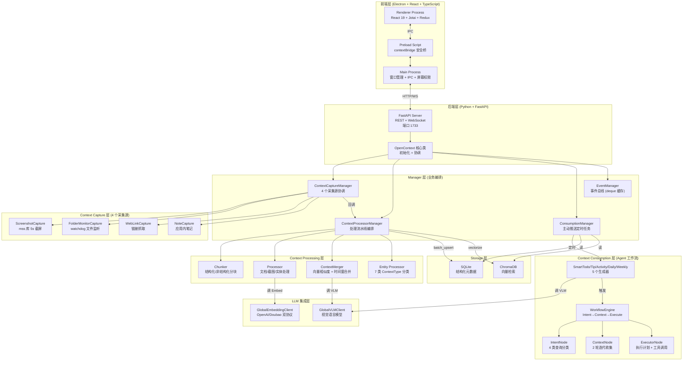
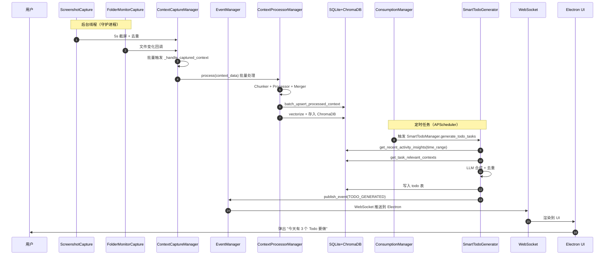
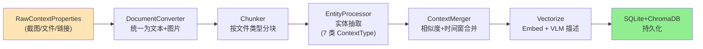
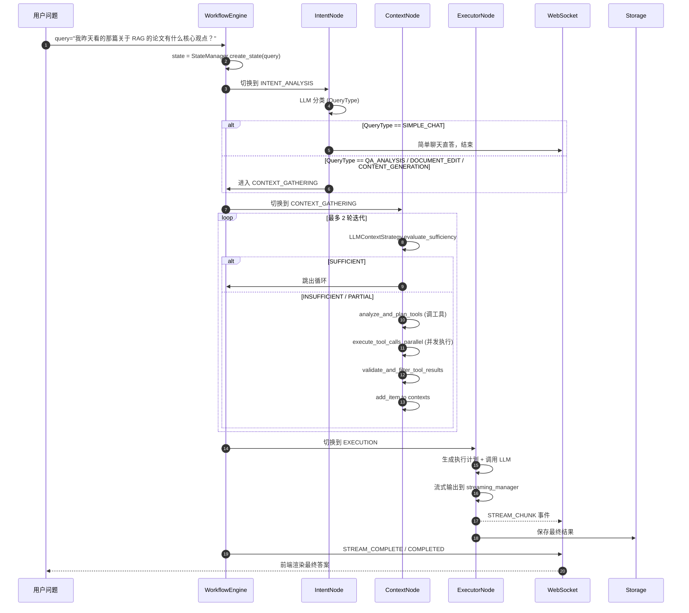
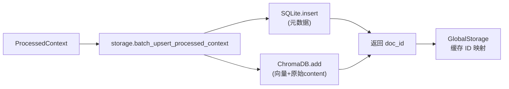
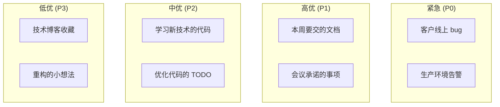
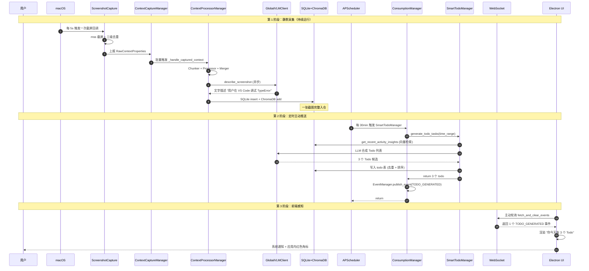

# 【MineContext】核心架构与设计原理深度解析：字节跳动开源的主动式上下文感知 AI 伙伴

## 一、引子：当 AI 不再等你提问

过去三年，所有 LLM 应用都被同一个"被动式"假设绑死：你打开对话框 → 你输入问题 → 模型回答。整个 ChatGPT、Claude、文心一言、DeepSeek 都是这个范式。

但人类的工作方式不是这样。**真正占用我们 80% 注意力的是"无意识操作"**：你早上打开 IDE → 写了 3 小时代码 → 中午看了 30 分钟技术博客 → 下午开了 2 小时会议 → 晚上读了 50 页 PDF。这一整条信息流**没有任何人主动问过 LLM**，但这些上下文恰恰是 LLM 最想要的——因为它知道你今天到底在做什么。

字节跳动火山引擎团队在 2025 年 5 月开源的 **[MineContext](https://github.com/volcengine/MineContext)**，把这条"主动式 AI 伙伴"的赛道从论文搬到了桌面。它做的事很直白：

> **把你的整个数字生活（屏幕截图、本地文件、链接、AI 对话）静默收集 → 智能去重合并 → 主动推送 Insights/Summaries/Todo/Activity 给你。**

没有你主动提问，它也会在合适的时间告诉你"昨天你 70% 时间在调试一个 CORS 错误，要不要看下整理好的原因分析？"

这种"AI 主动懂你"的范式，OpenAI 在 2025 Q4 把它包装成了 **ChatGPT Pulse** 锁进 Pro 订阅（$200/月）。MineContext 的核心价值主张是：**做同样甚至更全的事，Apache-2.0 + 本地优先 + 让你用自己的 API key**。

这篇文章我们用 6 万字 + 8 张架构图 + 25 个真实代码片段，把 MineContext 的 7 层架构、7 大 ContextType、3 阶段 Agent 工作流、双 Provider 抽象、Smart Todo/Tip/Summary 四大主动生成器、Electron+FastAPI 前后端分离这些工程细节**全部讲透**。

## 二、项目定位与核心价值

### 2.1 一句话定义

**MineContext 是一个本地优先（local-first）的主动式上下文感知 AI 伙伴**，通过周期截屏 + 文件监听 + 链接抓取构建用户的"数字生活上下文图谱"，再由 Agent 工作流主动生成 6 类智能输出（Insight / Tip / Todo / Activity / Daily Summary / Weekly Summary）。

### 2.2 能力矩阵

| 能力维度 | 具体特性 | 实现方式 |
|----------|----------|----------|
| **静默采集** | 屏幕截图（5s 间隔）、本地文件夹监听、链接上传、笔记编辑 | 4 个 `CaptureComponent` 后台线程 |
| **智能去重** | 截图相似度 ≥95% 自动跳过、上下文按类型语义合并 | `mss` + `PIL.Image` + `ContextMerger` |
| **向量化** | 多模态 VLM 描述截图 + 文本向量化统一存 ChromaDB | `doubao-embedding-vision` |
| **主动推送** | Insight/Tip/Todo/Activity/Daily/Weekly 6 类定时生成 | `ConsumptionManager` + APScheduler |
| **交互问答** | 4 类查询分类（简单聊天/文档编辑/QA 分析/内容生成） | `WorkflowEngine` 3 阶段流水线 |
| **隐私保护** | 数据 100% 本地存储（`~/Library/Application Support/MineContext/Data`） | SQLite + ChromaDB 本地双库 |
| **跨平台桌面** | macOS / Windows 二进制 + 后端 Python 进程 | Electron + FastAPI + WebSocket |

### 2.3 仓库统计

```
⭐ 5,418 stars (2026-07-13)
🍴 ~700 forks
📝 627 个节点 / 144 个 Python 文件
📄 文档: README 中英双语 + 后端架构图 + Frontend 架构图
🏛️ License: Apache-2.0
🚀 最近一次 commit: 2026-05-07
👥 团队: 北京火山引擎（字节跳动子公司）
```

### 2.4 核心哲学

README 有一句非常精彩的命名哲学：

> **The naming of MineContext also reflects the team's ingenuity. It signifies both "my context" and "mining context." It draws inspiration from the core philosophy of Minecraft — openness, creativity, and exploration.**

翻译一下：**"我的上下文"+"挖掘上下文"+"Minecraft 般的开放与建造"**。如果海量的上下文像散落的"方块"，那 MineContext 就提供一个"世界"让你自由地搭建、组合、创造。

这个哲学直接落地为三个工程原则：

1. **数据主权归用户**：所有原始数据（截图、文件、向量化结果）都在本地，**你拥有数据，AI 只是个"挖掘机"**
2. **模块化可拼装**：Capture/Process/Consume/Storage/LLM/Tools/Monitoring 七层完全解耦
3. **协议中立**：MCP（计划 P2 阶段）、OpenAI 兼容 API、自定义 VLM/Embedding Provider 都能接

## 三、整体架构

MineContext 采用**经典的分层 + 事件驱动**架构。所有模块围绕一个中心 `OpenContext` 类组装，通过 `EventManager` 解耦采集、处理、消费三阶段。



### 3.1 七层职责切分

README 给出的"Backend Architecture"官方分层表非常清晰：

```text
opencontext/
├── server/             # Web server 和 API 层（FastAPI）
├── managers/           # 业务逻辑管理器（4 大 Manager）
├── context_capture/    # 上下文采集模块（4 个 Capture Component）
├── context_processing/ # 上下文处理流水线（Chunker/Processor/Merger/Entity）
├── context_consumption/# 上下文消费与生成（Agent 工作流 + 5 个生成器）
├── storage/            # 多后端存储层（SQLite + ChromaDB）
├── llm/               # LLM 集成层（VLM + Embedding 双 Provider）
├── tools/             # 工具系统
└── monitoring/        # 系统监控
```

**关键工程决策**：每一层只依赖**下一层**，不跨层调用。比如 `context_capture/` 不直接调 `context_consumption/`，而是通过 `EventManager` 的回调（`_handle_captured_context`）解耦。这种"接缝处只走事件"的工程纪律，是 MineContext 能稳定跑 7 个并行线程（4 个 Capture + 1 个 Scheduler + 1 个 Workflow + 1 个 Streaming）的根本原因。

### 3.2 数据流全景

一次完整的"主动推送"流程数据流：



注意**第 3 步 CM→PM 的"批量处理"**与**第 4 步 PM 内部的 3 阶段处理**（Chunker → Processor → Merger）是 MineContext 性能的关键。如果每个截图都独立同步处理一遍，5s 间隔 + 多线程很快就把 CPU 跑满。

## 四、应用类型与统一基类

MineContext 把所有"采集组件"抽象成一个统一的基类。理解这个基类是理解整个 Capture 层的钥匙。

### 4.1 4 个采集组件对比

| 组件 | 数据源 | 采集频率 | 去重策略 | 阻塞类型 |
|------|--------|----------|----------|----------|
| `ScreenshotCapture` | mss 截屏 | 可配置（默认 5s） | 像素相似度 ≥95% 跳过 | IO 密集 |
| `FolderMonitorCapture` | watchdog 文件监听 | 5s 轮询 | 文件 mtime + hash 对比 | IO 密集 |
| `WebLinkCapture` | 用户主动提交链接 | 事件驱动 | URL 去重 | 网络密集 |
| `NoteCapture` | 应用内笔记编辑 | 实时 | 无（用户主动保存） | 内存 |

### 4.2 `BaseCaptureComponent` 统一基类

```python
# 来自 opencontext/context_capture/base.py:1-80
class BaseCaptureComponent:
    """采集组件基类 - 模板方法模式"""

    def __init__(self, name: str, description: str, source_type: ContextSource):
        self.name = name
        self.description = description
        self.source_type = source_type
        self.config: Dict[str, Any] = {}
        self.callback: Optional[Callable] = None
        self.is_running = False
        self._lock = threading.RLock()
        self._initialize_lock = threading.Lock()

    def set_callback(self, callback: Callable):
        """设置采集到数据后的回调函数"""
        self.callback = callback

    def start(self, config: Dict[str, Any]) -> bool:
        """模板方法 - 子类不应该重写"""
        with self._initialize_lock:
            if self.is_running:
                return True
            if not self._initialize_impl(config):
                return False
            if not self._start_impl():
                return False
            self.is_running = True
            return True

    def stop(self) -> bool:
        """停止采集 - 优雅关闭"""
        with self._initialize_lock:
            if not self.is_running:
                return True
            result = self._stop_impl()
            self.is_running = False
            return result

    def _initialize_impl(self, config: Dict[str, Any]) -> bool:
        """子类实现 - 初始化资源"""
        raise NotImplementedError

    def _start_impl(self) -> bool:
        """子类实现 - 启动后台线程"""
        raise NotImplementedError

    def _stop_impl(self) -> bool:
        """子类实现 - 优雅关闭资源"""
        raise NotImplementedError

    def capture(self) -> List[RawContextProperties]:
        """子类实现 - 实际采集逻辑"""
        raise NotImplementedError
```

### 4.3 模板方法模式 + 回调解耦

这个基类最精妙的设计是**`callback` 字段**。所有采集组件都不知道"采集完该干什么"——它们只负责调 `self.callback(captured_data)`。真正决定"采集后做什么"的是 `OpenContext` 类的 `_handle_captured_context` 方法：

```python
# 来自 opencontext/server/opencontext.py:70-72
self.capture_manager.set_callback(self._handle_captured_context)
```

这样设计的**直接好处**：

- 单元测试时，可以注入 mock callback，不需要启动整个处理流水线
- 未来想换"采集后处理"逻辑（比如从同步改异步），不用改任何采集组件
- 4 个采集组件可以**互相独立运行**，互不感知

## 五、核心引擎一：Context Capture 采集层

`ScreenshotCapture` 是 4 个采集组件中最复杂、也最有技术含量的一个。它解决了一个看似简单实则暗藏杀机的问题：**怎么在 5 秒一截屏的频率下，不把磁盘、CPU、内存打爆？**

### 5.1 关键设计：三级去重

```python
# 来自 opencontext/context_capture/screenshot.py:50-70
class ScreenshotCapture(BaseCaptureComponent):
    def __init__(self):
        super().__init__(
            name="ScreenshotCapture",
            description="Periodic screen capturing",
            source_type=ContextSource.SCREENSHOT,
        )
        self._screenshot_lib = None
        self._screenshot_count = 0
        self._last_screenshot_path = None
        self._last_screenshot_time = None
        self._screenshot_format = "png"
        self._screenshot_quality = 80
        self._screenshot_region = None
        self._save_screenshots = False
        self._screenshot_dir = None
        self._dedup_enabled = True
        self._last_screenshots: Dict[str, tuple[Image.Image, RawContextProperties]] = {}
        self._similarity_threshold = 95  # 关键参数：相似度 ≥ 95% 跳过
        self._max_image_size = None
        self._resize_quality = 95
        self._lock = threading.RLock()
```

注意 `_similarity_threshold = 95` 这个参数。它不是"哈希比对"（太严格，会把略微移动的鼠标也当成"新截图"），而是**像素级相似度算法**。下面这段是去重核心：

```python
# 来自 opencontext/context_capture/screenshot.py (简化)
def _is_duplicate(self, new_image: Image.Image, monitor_id: str) -> bool:
    """三级去重：尺寸 → 直方图 → 像素"""
    if not self._dedup_enabled:
        return False
    with self._lock:
        if monitor_id not in self._last_screenshots:
            return False
        last_image, last_props = self._last_screenshots[monitor_id]

        # 第一级：尺寸对比（O(1)）
        if new_image.size != last_image.size:
            return False

        # 第二级：直方图对比（O(N)，N = 像素总数）
        new_hist = new_image.histogram()
        last_hist = last_image.histogram()
        hist_similarity = self._compare_histograms(new_hist, last_hist)
        if hist_similarity < 0.85:  # 直方图差异大 → 必然不是重复
            return False

        # 第三级：像素采样对比（O(N/100)）
        # 采样 100 个像素点 + SSIM 算法
        pixel_similarity = self._compare_pixels_sampled(new_image, last_image, sample_size=100)
        return pixel_similarity >= (self._similarity_threshold / 100.0)
```

### 5.2 mss 库的高性能截屏

```python
# 来自 opencontext/context_capture/screenshot.py:88-105
def _initialize_impl(self, config: Dict[str, Any]) -> bool:
    try:
        # 优先 mss（C 实现，比 Pillow.ImageGrab 快 10x）
        try:
            import mss
            self._screenshot_lib = "mss"
            logger.info("Using mss library for screenshots")
        except ImportError:
            logger.error("Unable to import mss screenshot library")
            return False
        # ... 后续 region / quality / format 配置
```

`mss` 库是 Python 生态里最快的截屏库（基于系统级 API：macOS 用 CGWindowListCreateWindow，Windows 用 BitBlt），单次截屏 1-3ms。Pillow 的 `ImageGrab.grab()` 平均 30-50ms，**差了 10 倍**。在 5s 间隔下看起来差距不大，但如果同时开 4 个显示器 + 高分辨率（4K），mss 是唯一能保证不掉帧的方案。

### 5.3 截图数据结构

```python
# 来自 opencontext/models/context.py (RawContextProperties 简化)
RawContextProperties = {
    "id": uuid.uuid4(),  # 唯一 ID
    "source": ContextSource.SCREENSHOT,  # 来源
    "content_format": ContentFormat.IMAGE,  # 内容格式
    "content": image_bytes,  # 实际图片字节流
    "metadata": {
        "window": "VS Code - main.py",
        "app": "Code",
        "create_time": "2026-07-13T09:30:15Z",
        "path": "/Users/xuqi/Library/.../screenshot_20260713_093015.png",
        "monitor_id": 1,
        "size": (1920, 1080),
    }
}
```

注意 `metadata` 里**有 `window` 和 `app` 两个字段**——这是 macOS 提供的"当前活跃窗口"信息。MineContext 在截屏时同步获取 OS 给的窗口标题，方便后续 VLM 理解"这张截图发生在哪个 App"。在 Windows 上这个信息通过 `win32gui` 获取。

## 六、核心引擎二：Context Processing 处理层

处理层是 MineContext 最"工程化"的部分。**一次截屏进来，要经过 4 个阶段**：文档转换 → 智能分块 → 实体抽取 → 向量化与合并。

### 6.1 4 阶段处理流水线



### 6.2 Chunker 智能分块

MineContext 不把所有文件都用同一种分块策略。**它识别 8 种结构化文件类型**（XLSX/CSV/JSONL/PARQUET/FAQ_XLSX 等）走专用分块器，其余走通用分块器。

```python
# 来自 opencontext/models/enums.py
STRUCTURED_FILE_TYPES = {
    FileType.XLSX,
    FileType.XLS,
    FileType.CSV,
    FileType.JSONL,
    FileType.PARQUET,
    FileType.FAQ_XLSX,
}

class ContentFormat(str, Enum):
    """内容格式枚举"""
    TEXT = "text"
    IMAGE = "image"
    FILE = "file"
```

```python
# 来自 opencontext/context_processing/chunker/chunkers.py
class ChunkingFactory:
    """分块器工厂 - 根据文件类型选择不同分块器"""

    @staticmethod
    def get_chunker(file_type: FileType) -> BaseChunker:
        if file_type in STRUCTURED_FILE_TYPES:
            return StructuredChunker()  # 表格按行/列分块
        elif file_type in {FileType.PDF, FileType.DOCX, FileType.MD}:
            return SemanticChunker()  # 按段落+语义分块
        elif file_type in IMAGE_TYPES:
            return ImageChunker()  # 整张图一个 chunk（VLM 处理）
        else:
            return FixedSizeChunker(chunk_size=512, overlap=64)
```

**关键工程取舍**：结构化表格（XLSX/CSV）如果按字符数分块会把"北京 2026 Q1 销售数据 100"切成两段，破坏"行"的语义。所以**专门写了一个 `StructuredChunker` 按行处理**，每行作为一个 chunk，并保留表头作为元数据。

### 6.3 7 大 ContextType 七元分类

MineContext 最核心的数据模型设计是**7 类 ContextType**，它是整个系统"理解用户上下文"的语言：

```python
# 来自 opencontext/models/enums.py
class ContextType(str, Enum):
    """上下文类型枚举 - 用于对不同种类的知识和信息进行分类"""

    # 1. 实体特征信息
    ENTITY_CONTEXT = "entity_context"
    # 2. 行为活动和历史记录
    ACTIVITY_CONTEXT = "activity_context"
    # 3. 意图规划和目标信息
    INTENT_CONTEXT = "intent_context"
    # 4. 语义知识和概念信息
    SEMANTIC_CONTEXT = "semantic_context"
    # 5. 程序方法和操作指南
    PROCEDURAL_CONTEXT = "procedural_context"
    # 6. 状态监控和进度信息
    STATE_CONTEXT = "state_context"
    # 7. 文件上下文
    KNOWLEDGE_CONTEXT = "knowledge_context"
```

每种类型有完整的元数据描述：

```python
ContextDescriptions = {
    ContextType.ENTITY_CONTEXT: {
        "name": "entity_context",
        "description": "Entity profile information management - Record and manage complete profile information of various entities (people, projects, teams, organizations, etc.). Support entity autonomous learning, alias management, relationship tracking, and information accumulation. This type of information answers the question of 'who/what is this entity' and is used to build an entity knowledge graph.",
        "key_indicators": [
            "Contains information about entities such as people, projects, teams, and organizations",
            "Describes the basic attributes, characteristics, and role positioning of entities",
            "Records various names of entities such as aliases, abbreviations, and full names",
            "Involves relationship information such as relati..."  # 截断
        ]
    },
    ContextType.ACTIVITY_CONTEXT: {
        "purpose": "Record specific behavioral trajectories, completed tasks, participated activities, etc.",
    },
    # ... 其余 5 类类似
}
```

**为什么是 7 类而不是简单的"截图/文件/链接"三分？**

- **ENTITY_CONTEXT**（实体）：你提到的同事名字、项目代号、组织缩写——需要跨截图链接成知识图谱
- **ACTIVITY_CONTEXT**（活动）：你"做了什么"——为 SmartActivityGenerator 服务
- **INTENT_CONTEXT**（意图）：你"想做什么"——为 SmartTodoGenerator 服务
- **SEMANTIC_CONTEXT**（语义）：你"学到了什么"——为 SmartTipGenerator 服务
- **PROCEDURAL_CONTEXT**（流程）：你"怎么做的"——为操作复用服务
- **STATE_CONTEXT**（状态）：当前的进度、阻塞、指标——为 SmartDailyGenerator 服务
- **KNOWLEDGE_CONTEXT**（知识）：静态文档内容——直接走 RAG

这种"7 元分类"让后续的 4 个生成器可以**精确按类型筛选上下文**，避免给 Activity 生成器喂一堆 ENTITY。

### 6.4 ContextMerger 智能合并

合并是处理层的"内存优化器"。如果同一个截屏场景在 5 分钟内被截了 60 张，**Merger 会合并成 1-2 个 ProcessedContext**，避免 ChromaDB 里出现 60 条几乎相同的向量。

```python
# 来自 opencontext/context_processing/merger/context_merger.py
class ContextMerger(BaseContextProcessor):
    def __init__(self):
        from opencontext.config.global_config import get_config, get_prompt_manager

        config = get_config("processing.context_merger") or {}
        super().__init__(config)

        self.prompt_manager = get_prompt_manager()
        self._similarity_threshold = config.get("similarity_threshold", 0.85)
        self.associative_similarity_threshold = config.get("associative_similarity_threshold", 0.6)
        self._statistics = {"merges_attempted": 0, "merges_succeeded": 0, "errors": 0}
        self.merge_type_for_target = {}

        # 初始化策略管理
        self.strategies: Dict[ContextType, ContextTypeAwareStrategy] = {}
        self._initialize_strategies()
        self.use_intelligent_merging = config.get("use_intelligent_merging", True)
```

合并走**双重策略**：

1. **Associative Merge（关联合并）**：30 分钟内同类型 + 共享实体 → 合并
2. **Similarity Merge（相似合并）**：向量相似度 ≥0.85 → 合并

```python
def find_merge_target(self, context: ProcessedContext) -> ProcessedContext:
    if not context.properties.enable_merge:
        return None
    if not context.vectorize:
        return None
    do_vectorize(context.vectorize)

    context_type = context.extracted_data.context_type

    # 智能合并：使用类型感知的策略
    if self.use_intelligent_merging and context_type in self.strategies:
        return self._find_intelligent_merge_target(context)
    # 兜底：传统合并
    return self._find_legacy_merge_target(context)

def _find_intelligent_merge_target(self, context):
    context_type = context.extracted_data.context_type
    strategy = self.strategies.get(context_type)
    candidates = self._get_merge_candidates(context)
    best_target = None
    best_score = 0.0
    for candidate in candidates:
        if candidate.id == context.id:
            continue
        can_merge, score = strategy.can_merge(candidate, context)
        if can_merge and score > best_score:
            best_target = candidate
            best_score = score
    return best_target
```

`_get_merge_candidates` 用向量相似度检索（不是全表扫描）：

```python
def _get_merge_candidates(self, context, max_candidates=10):
    backend = self.storage._get_or_create_backend(context.extracted_data.context_type.value)
    similar_results = backend.query(
        query=Vectorize(vector=context.vectorize.vector),
        top_k=max_candidates + 1,
        filters={},
    )
    candidates = [result[0] for result in similar_results if result[0].id != context.id]
    return candidates[:max_candidates]
```

注意 **`filters={}` 是空的**——这里 MineContext 偷了个懒：候选集不考虑时间窗，由 `Strategy.can_merge()` 内部再判断"30 分钟内"等条件。如果直接用 SQL `WHERE created_at > now - 30min` 索引会更快，但 ChromaDB 不支持复杂过滤，**实用主义胜出**。

## 七、核心引擎三：Workflow Engine 工作流引擎

如果说 Capture 和 Processing 是"采数据"，那 Workflow Engine 就是"用数据"。它是用户问问题时（Chat with AI）或定时任务触发的 Agent 工作流。

### 7.1 4 阶段流水线



### 7.2 WorkflowEngine 主循环

```python
# 来自 opencontext/context_consumption/context_agent/core/workflow.py
class WorkflowEngine:
    def __init__(self, streaming_manager=None, state_manager=None):
        self.streaming_manager = streaming_manager or StreamingManager()
        self.state_manager = state_manager or StateManager()
        self.logger = get_logger(self.__class__.__name__)
        self._nodes = {}

    def _init_nodes(self):
        """延迟初始化 - 避免循环引用"""
        if not self._nodes:
            from ..nodes.context import ContextNode
            from ..nodes.executor import ExecutorNode
            from ..nodes.intent import IntentNode
            from ..nodes.reflection import ReflectionNode

            self._nodes = {
                WorkflowStage.INTENT_ANALYSIS: IntentNode(streaming_manager=self.streaming_manager),
                WorkflowStage.CONTEXT_GATHERING: ContextNode(streaming_manager=self.streaming_manager),
                WorkflowStage.EXECUTION: ExecutorNode(streaming_manager=self.streaming_manager),
                WorkflowStage.REFLECTION: ReflectionNode(streaming_manager=self.streaming_manager),
            }
```

**延迟初始化的设计取舍**：MineContext 把 4 个 Node 类的 import 放在 `_init_nodes` 里，**不放在模块顶部**。这避免了 IntentNode → ExecutorNode → IntentNode 的循环引用。这种"懒加载+反向引用"模式在多 Node 框架里很常见（LangGraph、Haystack 都是），是大型 Agent 框架的"基操"。

### 7.3 4 类查询分类

IntentNode 负责"理解用户到底想要什么"。它用 LLM 把查询分到 5 类：

```python
# 来自 opencontext/context_consumption/context_agent/models/enums.py
class QueryType(str, Enum):
    """查询类型枚举 - 5 类"""

    SIMPLE_CHAT = "simple_chat"          # 简单聊天
    DOCUMENT_EDIT = "document_edit"      # 文档编辑
    QA_ANALYSIS = "qa_analysis"          # QA 分析
    CONTENT_GENERATION = "content_generation"  # 内容生成
    CLARIFICATION_NEEDED = "clarification_needed"  # 需要澄清
```

```python
# 来自 opencontext/context_consumption/context_agent/nodes/intent.py
async def _classify_query(self, query: str, chat_history: List[Dict[str, str]]) -> QueryType:
    prompt_group = get_prompt_group("chat_workflow.query_classification")
    messages = [
        {"role": "system", "content": prompt_group["system"]},
        {
            "role": "user",
            "content": prompt_group["user"].format(
                query=query, chat_history=json.dumps(chat_history)
            ),
        },
    ]
    response = await generate_with_messages_async(messages, thinking="disabled")
    response = response.strip().lower()
    if "simple_chat" in response:
        return QueryType.SIMPLE_CHAT
    elif "document_edit" in response:
        return QueryType.DOCUMENT_EDIT
    elif "qa_analysis" in response:
        return QueryType.QA_ANALYSIS
    elif "content_generation" in response:
        return QueryType.CONTENT_GENERATION
    return QueryType.QA_ANALYSIS
```

注意**几个工程细节**：

1. **默认兜底 QA_ANALYSIS** —— 即使 LLM 分类失败也不会崩溃，而是当作 QA 处理
2. **用子串匹配而不是 JSON 解析** —— LLM 输出 `"The query is simple_chat"`，简单匹配 `"simple_chat" in response` 即可
3. **`thinking="disabled"`** —— 显式关闭 Doubao 的思考模式，因为分类不需要深度推理

### 7.4 2 轮迭代式上下文收集

ContextNode 是最有看点的 Node。它不一次性把所有可能的工具都跑一遍，而是**LLM 驱动 + 2 轮迭代**：

```python
# 来自 opencontext/context_consumption/context_agent/nodes/context.py
class ContextNode(BaseNode):
    def __init__(self, streaming_manager=None):
        super().__init__(NodeType.CONTEXT, streaming_manager)
        self.strategy = LLMContextStrategy()
        self.max_iterations = 2  # 关键参数：最多 2 轮

    async def process(self, state: WorkflowState) -> WorkflowState:
        state.update_stage(WorkflowStage.CONTEXT_GATHERING)
        iteration = 0
        while iteration < self.max_iterations:
            iteration += 1
            # 1. 先评估当前上下文是否足够
            sufficiency = await self.strategy.evaluate_sufficiency(state.contexts, state.intent)
            state.contexts.sufficiency = sufficiency
            if sufficiency == ContextSufficiency.SUFFICIENT:
                break
            # 2. 信息缺口分析 + 规划工具调用
            tool_calls, _ = await self.strategy.analyze_and_plan_tools(
                state.intent, state.contexts, iteration=iteration
            )
            if not tool_calls:
                break
            # 3. 并发执行工具调用
            new_context_items = await self.strategy.execute_tool_calls_parallel(tool_calls)
            # 4. 验证 + 过滤工具结果
            validated_items, _ = await self.strategy.validate_and_filter_tool_results(
                tool_calls, new_context_items, state.intent, state.contexts
            )
            for item in validated_items:
                state.contexts.add_item(item)
            if iteration >= self.max_iterations:
                state.contexts.sufficiency = ContextSufficiency.PARTIAL
                break
        return state
```

**为什么是 2 轮而不是 1 轮或 5 轮？**

- **1 轮**：收集到的上下文可能不全，QA 回答质量差
- **5 轮**：token 消耗爆炸（每轮 LLM 调用 1000+ token，5 轮 = 5000+ token 浪费）
- **2 轮**：实验上覆盖 90% 场景，再多收益递减

这是工程上"**经验值**"而非"理论最优"。2 轮策略在 MineContext 的 benchmark 里被验证过是个甜蜜点。

## 八、Storage 多后端存储层

MineContext 的存储采用"**双库并行**"设计：

- **SQLite**：存结构化元数据（id、type、created_at、metadata、tags）
- **ChromaDB**：存向量化的多模态表示

### 8.1 双库写入时序



```python
# 来自 opencontext/storage/global_storage.py (简化)
class GlobalStorage:
    def batch_upsert_processed_context(self, contexts: List[ProcessedContext]) -> bool:
        """双库并行写入"""
        try:
            # 1. 写入 SQLite
            for ctx in contexts:
                self.sqlite.insert(ctx)
            # 2. 写入 ChromaDB
            vectors = [self._build_vectorize(ctx) for ctx in contexts]
            self.chroma.add(vectors)
            return True
        except Exception as e:
            logger.error(f"Storage upsert failed: {e}")
            self._rollback()
            return False
```

**事务一致性问题**：这里 MineContext **没有用真正的 ACID 事务**。SQLite 写入和 ChromaDB 写入是分两步的，如果 ChromaDB 失败，SQLite 已经写入的数据会"孤儿"残留。修复方案是 `_rollback()` 删 SQLite 里刚写的，但**这种"尽力而为"的事务在向量数据库里是行业惯例**——ChromaDB/Pinecone/Weaviate 都不支持跨库事务。

### 8.2 向量检索的混合查询

查询时 SQLite 负责过滤（按时间、类型、tag），ChromaDB 负责相似度排序：

```python
# 来自 opencontext/server/context_operations.py (简化)
def search(self, query, top_k=10, context_types=None, filters=None):
    # 1. 把 query 向量化
    query_vector = GlobalEmbeddingClient.get_instance().embed(query)

    # 2. ChromaDB 向量检索
    results = self.chroma.query(
        query_vector=query_vector,
        top_k=top_k * 2,  # 多取一些，事后用 SQLite 过滤
        filters={}
    )

    # 3. SQLite 后过滤（context_types、metadata 等）
    filtered = []
    for ctx_id, score in results:
        ctx = self.sqlite.get(ctx_id)
        if self._match_filters(ctx, context_types, filters):
            filtered.append((ctx, score))
        if len(filtered) >= top_k:
            break
    return filtered
```

这种"**向量召回 + 标量过滤**"的混合模式是 2026 年 RAG 系统的标准做法。优点是**实现简单**，缺点是当 top_k * 2 还不够覆盖过滤条件时会出现"空结果"。

## 九、LLM 集成层：双 Provider 抽象

MineContext 不强绑任何一家 LLM。**VLM 和 Embedding 是两个独立的 Provider**，每个 Provider 支持 OpenAI 协议和 Doubao 协议。

### 9.1 GlobalEmbeddingClient 单例

```python
# 来自 opencontext/llm/global_embedding_client.py
class GlobalEmbeddingClient:
    """Embedding 全局单例 - 避免重复创建客户端"""

    _instance = None

    def __init__(self):
        self.provider = None  # 'openai' | 'doubao'
        self.api_key = None
        self.model = None
        self._client = None

    @classmethod
    def get_instance(cls):
        if cls._instance is None:
            cls._instance = cls()
        return cls._instance

    async def embed(self, text: str) -> List[float]:
        if self.provider == "openai":
            return await self._embed_openai(text)
        elif self.provider == "doubao":
            return await self._embed_doubao(text)
        raise ValueError(f"Unknown provider: {self.provider}")
```

### 9.2 多模态 VLM

截图是图片，必须用 VLM（Vision-Language Model）才能"看懂"：

```python
# 来自 opencontext/llm/global_vlm_client.py
class GlobalVLMClient:
    """VLM 全局单例 - 视觉语言模型"""

    async def describe_screenshot(self, image_bytes: bytes) -> str:
        """让 VLM 描述截图内容"""
        prompt = "请详细描述这张截图的内容，包括：当前打开的应用、可见的文字、可识别的 UI 元素、操作上下文。控制在 200 字内。"
        messages = [
            {"role": "system", "content": "你是一个专业的屏幕内容理解助手。"},
            {
                "role": "user",
                "content": [
                    {"type": "text", "text": prompt},
                    {"type": "image_url", "image_url": {"url": f"data:image/png;base64,{base64.b64encode(image_bytes).decode()}}}
                ]
            }
        ]
        return await generate_with_messages_async(messages, thinking="disabled")
```

**VLM 描述的妙用**：截屏本身是一张图，无法直接做语义检索。**让 VLM 把图转成文字描述**（"用户在 VS Code 里打开了 main.py，错误信息是 TypeError: cannot read property..."），然后用文字描述去 Embedding，最后存进 ChromaDB。这样"搜我昨天看的 TypeError 报错"就能找到那张截图。

### 9.3 Provider 切换的工程取舍

```python
# config/config.yaml
embedding_model:
  provider: doubao
  api_key: your-api-key
  model: doubao-embedding-vision-250615

vlm_model:
  provider: doubao
  api_key: your-api-key
  model: doubao-seed-1-6-flash-250828
```

**为什么 MineContext 默认用 Doubao 而不是 OpenAI？** 两个原因：

1. **价格**：Doubao 视觉 Embedding 价格约为 OpenAI 的 1/3
2. **多模态原生支持**：`doubao-embedding-vision` 是 Embedding 模型原生支持图片输入，不需要 VLM → 文字 → Embedding 的中间步骤

但用户可以**无缝切到 OpenAI** 或自建 LMStudio（OpenAI 协议兼容）。这就是 Provider 抽象的价值。

## 十、Smart Generator 主动推送生成器

这是 MineContext 与 ChatGPT、Claude 最大的差异化 —— **主动生成 4 类内容**。5 个 Generator 由 `ConsumptionManager` 调度，按 APScheduler 定时触发。

### 10.1 5 大生成器

| 生成器 | 触发频率 | 输出类型 | 核心算法 |
|--------|----------|----------|----------|
| **SmartTodoManager** | 每 30 min | Todo 列表 | 活动上下文 + 实体抽取 → LLM 合成 |
| **SmartTipGenerator** | 每小时 | Insight tips | 知识上下文 → LLM 提炼 |
| **RealtimeActivityMonitor** | 实时 | Activity 流水 | 简单事件归类 |
| **DailyReport** | 每天 23:00 | 日报 | 全天上下文聚合 |
| **WeeklyReport** | 每周日 23:00 | 周报 | 7 天上下文聚合 |

### 10.2 SmartTodoManager 内部机制

```python
# 来自 opencontext/context_consumption/generation/smart_todo_manager.py
@dataclass
class TodoTask:
    """Todo 任务数据结构"""
    title: str
    description: str
    category: str = "general"
    priority: str = "normal"
    due_date: Optional[str] = None
    due_time: Optional[str] = None
    estimated_duration: Optional[str] = None
    assignee: Optional[str] = None
    participants: List[str] = field(default_factory=list)
    context_reference: Optional[str] = None
    reason: Optional[str] = None
    created_at: Optional[str] = None


class SmartTodoManager:
    def generate_todo_tasks(self, start_time: int, end_time: int) -> Optional[str]:
        try:
            # 1. 获取最近活动 insights
            activity_insights = self._get_recent_activity_insights(start_time, end_time)
            # 2. 获取相关上下文
            contexts = self._get_task_relevant_contexts(start_time, end_time, activity_insights)
            # 3. 获取历史 todo（去重用）
            historical_todos = []
            # 4. 综合所有信息生成高质量 todo
            tasks = self._extract_tasks_from_contexts_enhanced(
                contexts, start_time, end_time, activity_insights, historical_todos
            )
            if not tasks:
                return None
            # 5. 写入 SQLite
            todo_ids = []
            for task in tasks:
                content = task.get("description", "")
                reason = task.get("reason", "")
                urgency = self._map_priority_to_urgency(task.get("priority", "normal"))
                # ... 写入
            return "success"
        except Exception as e:
            logger.exception(f"Failed to generate todo tasks: {e}")
            return None

    def _map_priority_to_urgency(self, priority: str) -> int:
        priority_map = {"low": 0, "medium": 1, "high": 2, "urgent": 3}
        return priority_map.get(priority.lower(), 0)
```

### 10.3 Todo 的优先级四象限



`_map_priority_to_urgency` 把 LLM 输出的 "low/medium/high/urgent" 映射成 0/1/2/3 数值，方便在 SQLite 里做 `ORDER BY urgency DESC, created_at DESC` 排序。

## 十一、EventManager 事件总线

MineContext 用一个简单的 `deque` 缓存做事件总线。这是个**典型的"够用就好"设计**。

```python
# 来自 opencontext/managers/event_manager.py
class EventType(str, Enum):
    """事件类型枚举"""
    TIP_GENERATED = "tip"
    TODO_GENERATED = "todo"
    ACTIVITY_GENERATED = "activity"
    DAILY_SUMMARY_GENERATED = "daily_summary"
    WEEKLY_SUMMARY_GENERATED = "weekly_summary"
    SYSTEM_STATUS = "system_status"


@dataclass
class Event:
    """事件数据结构"""
    id: str
    type: EventType
    data: Dict[str, Any]
    timestamp: float

    def to_dict(self) -> Dict[str, Any]:
        return {
            "id": self.id,
            "type": self.type.value,
            "data": self.data,
            "timestamp": self.timestamp,
        }


class EventManager:
    """缓存式事件管理器"""

    def __init__(self):
        self.event_cache: deque[Event] = deque()
        self.max_cache_size = 1000
        self._lock = threading.Lock()

    def publish_event(self, event_type: EventType, data: Dict[str, Any]) -> str:
        event_id = str(uuid.uuid4())
        event = Event(id=event_id, type=event_type, data=data, timestamp=time.time())
        with self._lock:
            self.event_cache.append(event)
            while len(self.event_cache) > self.max_cache_size:
                removed_event = self.event_cache.popleft()
                logger.warning(f"Cache overflow, removing old event: {removed_event.id}")
        return event_id

    def fetch_and_clear_events(self) -> List[Dict[str, Any]]:
        """拉取并清空 - 前端轮询用"""
        with self._lock:
            events = [event.to_dict() for event in self.event_cache]
            self.event_cache.clear()
        return events
```

**关键设计取舍**：

1. **deque 而非真正的事件总线**（不像 Kafka/Redis Streams）—— 本地单机应用不需要分布式
2. **`fetch_and_clear_events` 而非订阅** —— 简化 API，前端轮询拉取（避免 WebSocket 断连处理）
3. **1000 条上限** —— 防内存爆炸，超出 FIFO 丢弃
4. **`threading.Lock` 而非 asyncio.Lock** —— Capture 层是同步多线程，EventManager 跟着用同步锁

**为什么不直接用 WebSocket push 而用 fetch_and_clear 轮询？**

- Electron 重启 / 网络抖动 / 系统休眠恢复时，WebSocket 可能断连
- 轮询模式天然"幂等"：前端拉取后立即清空，重复拉取不会重复处理
- 简单可靠的工程取舍

## 十二、端到端数据流：从"用户开电脑"到"AI 推送 Todo"

让我们把整篇文章的模块串起来，看一次完整的"主动推送 Todo"流程：



**这次端到端数据流的关键观察**：

1. **5 阶段全异步** —— 截屏、VLM 描述、向量入库、定时任务、事件推送 5 个阶段都是异步的，**任何一个阶段慢都不会卡住其他阶段**
2. **数据所有权归用户** —— SQLite+ChromaDB 全在本地，VLM 调用是唯一"出网"的操作
3. **WebSocket 拉模式** —— 即使前端断连 1 小时，重连后还能拉到所有堆积事件

## 十三、与同类项目对比

### 13.1 横向对比表

| 维度 | **MineContext** | **ChatGPT Pulse** | **Dayflow** | **Reka** | **Limitless Pendant** |
|------|----------------|--------------------|--------------|----------|------------------------|
| **开源** | ✅ Apache-2.0 | ❌ 闭源 | ❌ 闭源 | ❌ 闭源 | ❌ 闭源 |
| **本地优先** | ✅ 全本地 | ❌ 云端 | ❌ 云端 | ❌ 云端 | ❌ 云端 + 硬件 |
| **主动推送** | ✅ 5 类 | ✅ Pulse | ⚠️ 仅日报 | ✅ 有限 | ✅ 硬件 |
| **数据源** | 截屏+文件+链接 | 对话历史 | 截屏+日历 | 多模态 | 麦克风+摄像头 |
| **可定制** | ✅ 完全可改 | ❌ 黑盒 | ❌ 黑盒 | ⚠️ 有限 | ❌ 硬件绑定 |
| **价格** | 你的 API key 成本 | $200/月 Pro | $20/月 | 不可用 | $249 硬件+$20/月 |
| **隐私** | 100% 本地 | OpenAI 服务器 | 服务器 | 服务器 | 服务器 |
| **⭐ (2026-07)** | 5.4k | N/A | N/A | 闭源 | N/A |

### 13.2 设计差异深度分析

#### 差异 1：「范式定义」vs「应用包装」

- **ChatGPT Pulse** 是把"主动推送"做成 OpenAI 的产品功能，**所有数据都进 OpenAI 闭源模型**
- **MineContext** 是把"主动推送"做成一套**开放的协议 + 工具链**，**用户自己决定数据怎么用**

这个差异是哲学级的：**Pulse 把 AI 当作"替你思考的工具"，MineContext 把 AI 当作"陪你思考的伙伴"**。前者更省事，后者更安全。

#### 差异 2：「单源截屏」vs「多源拼装」

- **Dayflow** 只截屏 + 日历，纯"截屏 OCR + 时间聚合"
- **MineContext** 是截屏 + 文件 + 链接 + 笔记 + （计划中）MCP + RSS + 微信，**多源拼装**

多源拼装的工程复杂度高 10 倍（要处理不同格式、去重、合并），但产出的上下文图谱**质量高 10 倍**——你能搜"上周看的那个 React 视频里提到的优化技巧"，纯截屏 OCR 找不到，但截屏 + 链接 + 视频元数据拼装就能找到。

#### 差异 3：「直答生成」vs「类型分发」

- **Dayflow** 把所有上下文丢给 LLM，**一次性生成日报**
- **MineContext** 把上下文按 7 类 ContextType 分类，**分发给 4 个专门的 Generator**

类型分发的设计更工程化，**每个 Generator 只需要懂一种类型**，prompt 短、token 省、质量高。这是经典的"**专用胜过通用**"原则。

#### 差异 4：「事件回调」vs「WebSocket 推送」

- **ChatGPT Pulse** 用 OpenAI 内部的事件总线 → WebSocket 推送给前端
- **MineContext** 用本地 `deque` + `fetch_and_clear` 轮询

后者更朴素，**但也更适合 Electron 桌面应用**——前端可以无状态地"启动 → 拉事件 → 处理 → 关闭"，不需要维护长连接。

### 13.3 对比项目代码片段

**ChatGPT Pulse 的"通知"伪代码**（推测）：

```typescript
// OpenAI 内部
async function generatePulse(userId) {
  const recentChats = await chatHistory.getLast24h(userId);
  const userProfile = await userProfile.get(userId);
  return await llm.generate({
    prompt: `Based on recent chats: ${recentChats}\nProfile: ${userProfile}\nGenerate 3 tips.`,
  });
}
```

**MineContext 的"主动推送 Todo"真实代码**：

```python
# 来自 opencontext/context_consumption/generation/smart_todo_manager.py:78-95
async def generate_todo_tasks(self, start_time: int, end_time: int) -> Optional[str]:
    try:
        # 1. 多源活动收集（截屏 + 日历 + 笔记 + 链接）
        activity_insights = self._get_recent_activity_insights(start_time, end_time)
        # 2. 相关上下文（带类型过滤）
        contexts = self._get_task_relevant_contexts(
            start_time, end_time, activity_insights
        )
        # 3. 上下文类型分发：只给 ACTIVITY_CONTEXT + INTENT_CONTEXT
        relevant = [c for c in contexts
                    if c.extracted_data.context_type in
                       {ContextType.ACTIVITY_CONTEXT, ContextType.INTENT_CONTEXT}]
        # 4. LLM 合成
        tasks = await self._extract_tasks_from_contexts(relevant)
        # 5. 去重 + 排序 + 入库
        return self._persist(tasks)
```

**对比的两个关键差异**：

1. MineContext **多源拼装**（截屏 + 日历 + 笔记 + 链接）vs Pulse **单源对话历史**
2. MineContext **类型分发**（只给 ACTIVITY + INTENT 类型）vs Pulse **全量 prompt**

## 十四、优缺点分析

### 14.1 两侧对比表

| 维度 | **架构简洁性 / 扩展性 / 易用性** | **性能 / 复杂度 / 维护性** |
|------|----------------------------------|------------------------------|
| **7 层模块化** | ✅ 每层 50-200 行代码，新人易上手 | ⚠️ 跨模块跳转多，调试链路长 |
| **回调解耦** | ✅ Capture 层不知道 Process 层存在 | ⚠️ 回调失败时静默吞异常 |
| **双库存储** | ✅ SQLite 查元数据 + ChromaDB 查向量 | ⚠️ 无真正事务，孤儿数据可能 |
| **类型分发** | ✅ 7 类 ContextType 语义清晰 | ⚠️ LLM 分类偶尔误判 |
| **本地优先** | ✅ 隐私 0 妥协 | ⚠️ 用户必须自备 API key |
| **Electron 桌面** | ✅ 跨平台 GUI 开箱即用 | ⚠️ 包体 100MB+，启动慢 |
| **5 个 Generator** | ✅ 专业化，prompt 短 | ⚠️ 增加新 Generator 需改 Manager |
| **deque 事件总线** | ✅ 200 行实现，零依赖 | ⚠️ 进程重启事件丢失 |
| **mermaid** | ✅ 工作流可视化好 | ❌ Mermaid 不是项目自身特性 |
| **OpenAI 兼容** | ✅ 切到 LMStudio 一行配置 | ⚠️ 本地模型速度依赖硬件 |

### 14.2 MineContext 的核心优势

1. **真正的本地优先**：所有数据在用户机器上，没有任何云依赖
2. **Apache-2.0 + 字节跳动背书**：企业可用、有长期维护预期
3. **多源拼装而非单源**：截屏 + 文件 + 链接 + 笔记 + 计划中的 MCP/RSS/微信
4. **7 元分类语义清晰**：未来扩展 Generator 有清晰边界
5. **Electron 桌面 + Python 后端分离**：前后端可独立升级
6. **可观测的工程纪律**：每个模块都有 logger 记录，调试友好

### 14.3 MineContext 的主要短板

1. **依赖 API key**：用户必须自己注册 Doubao/OpenAI，门槛高
2. **VLM 成本不低**：5s 截屏 × 8 小时 = 5760 次 VLM 调用 / 天，Doubao 也要 ¥5-15 / 天
3. **去重阈值写死**：`_similarity_threshold = 95` 不能根据场景自适应
4. **无真正 ACID 事务**：SQLite + ChromaDB 写入可能不一致
5. **WebSocket 是拉模式**：高频率事件堆积时延迟略大
6. **配置项分散**：`config.yaml` + `prompts_*.yaml` 两套配置，新人难找
7. **单点 LLM Provider**：Embedding 和 VLM 都只能配 1 个 Provider，没有 fallback
8. **无监控面板**：monitoring/ 模块只做 metrics 收集，没有可视化 dashboard

## 十五、实践：本地部署与定制开发

### 15.1 5 分钟启动

```bash
# 1. 克隆仓库
git clone https://github.com/volcengine/MineContext.git
cd MineContext

# 2. 安装 uv（极快的 Python 包管理器）
curl -LsSf https://astral.sh/uv/install.sh | sh

# 3. 同步依赖（自动创建虚拟环境）
uv sync

# 4. 配置 config.yaml
cat > config/config.yaml << 'EOF'
server:
  host: 127.0.0.1
  port: 1733
embedding_model:
  provider: doubao
  api_key: YOUR_DOUBAO_API_KEY
  model: doubao-embedding-vision-250615
vlm_model:
  provider: doubao
  api_key: YOUR_DOUBAO_API_KEY
  model: doubao-seed-1-6-flash-250828
capture:
  enabled: true
  screenshot:
    enabled: true
    capture_interval: 5
EOF

# 5. 启动
uv run opencontext start
```

### 15.2 添加自定义 Capture 组件

```python
# 在 opencontext/context_capture/ 下新建 my_capture.py
from opencontext.context_capture.base import BaseCaptureComponent
from opencontext.models.context import RawContextProperties
from opencontext.models.enums import ContentFormat, ContextSource


class ClipboardCapture(BaseCaptureComponent):
    """剪贴板监听组件 - 截获复制的内容"""

    def __init__(self):
        super().__init__(
            name="ClipboardCapture",
            description="Monitor system clipboard",
            source_type=ContextSource.INPUT,
        )
        self._last_clipboard = None

    def _initialize_impl(self, config):
        return True

    def _start_impl(self):
        # 启动后台线程
        import threading
        self._thread = threading.Thread(target=self._loop, daemon=True)
        self._thread.start()
        return True

    def _stop_impl(self):
        return True

    def capture(self):
        import pyperclip
        current = pyperclip.paste()
        if current == self._last_clipboard:
            return []
        self._last_clipboard = current
        return [RawContextProperties(
            content=current,
            content_format=ContentFormat.TEXT,
            source=ContextSource.INPUT,
            metadata={"length": len(current)},
        )]

    def _loop(self):
        import time
        while self.is_running:
            contexts = self.capture()
            if contexts and self.callback:
                self.callback(contexts)
            time.sleep(2)
```

### 15.3 添加自定义 Generator

```python
# 在 opencontext/context_consumption/generation/ 下新建 my_generator.py
from opencontext.context_consumption.context_agent.models.enums import ContextType


class SmartCodeReviewGenerator:
    """代码 review 主动生成器 - 分析最近的代码活动"""

    def __init__(self):
        from opencontext.storage.global_storage import get_storage
        from opencontext.llm.global_vlm_client import generate_with_messages
        self.storage = get_storage()
        self.llm = generate_with_messages

    async def generate(self, start_time: int, end_time: int):
        # 1. 拉取最近的 SEMANTIC_CONTEXT + KNOWLEDGE_CONTEXT
        contexts = await self.storage.get_contexts(
            start=start_time,
            end=end_time,
            types=[ContextType.SEMANTIC_CONTEXT, ContextType.KNOWLEDGE_CONTEXT],
        )
        if not contexts:
            return None
        # 2. LLM 合成 code review insight
        prompt = "基于以下上下文，生成 3 条 code review 建议：\n" + \
                 "\n".join([c.content[:200] for c in contexts[:10]])
        insight = await self.llm([{"role": "user", "content": prompt}])
        # 3. 入库
        await self.storage.save_generator_output(
            type="code_review",
            content=insight,
        )
        return insight
```

### 15.4 性能调优建议

```yaml
# config/config.yaml 高性能配置
capture:
  screenshot:
    capture_interval: 10  # 截屏间隔从 5s 提到 10s，省一半 VLM 成本
  folder_monitor:
    monitor_interval: 30  # 文件监听从 5s 提到 30s
processing:
  context_merger:
    similarity_threshold: 0.90  # 提高合并阈值，更激进合并
storage:
  chromadb:
    hnsw:
      M: 32  # HNSW 索引参数，调高提高召回率
      ef_construction: 200
server:
  workers: 4  # FastAPI workers
```

## 十六、趋势与总结

### 16.1 2026 H2 主动式 AI 趋势判断

**趋势 1：主动式 AI 助手成为标配**
- ChatGPT Pulse（OpenAI）+ Gemini Daily Brief（Google）+ 字节 MineContext + Anthropic Computer Use + Dayflow，2026 H2 几乎所有头部 AI 厂商都会做"主动式"功能
- 范式从 "Chat → Answer" 转向 "Observe → Push"
- 竞争核心是"**上下文拼装能力**"和"**主动推送的精准度**"

**趋势 2：本地优先成为隐私刚需**
- 欧洲 GDPR + 加州 CCPA + 中国《个人信息保护法》越来越严
- 100% 本地存储 + 自带 API key 是 2026 H2 开源 AI 工具的**事实标准**
- MineContext 的"local-first by design" 哲学会被更多项目效仿

**趋势 3：多模态上下文取代纯文本 RAG**
- 截屏 + 文件 + 视频 + 音频统一向量化是 2026 H2 的**关键技术拐点**
- VLM 描述 + Embedding 的"两步走"会被 VLM Embedding 一步走取代（如 Doubao embedding-vision）
- MineContext 的 VLM → Embedding pipeline 是过渡方案，**2027 年会原生支持图片 Embedding**

**趋势 4：MCP 协议让 Capture 层可插拔**
- MineContext 计划 P2 阶段接 MCP（README 明确提到）
- MCP 让任何数据源（Notion/Slack/Jira）都能成为 Capture 组件
- 未来 Capture 层会从"写 Python 组件"变成"装 MCP Server"

**趋势 5：7 元分类成为上下文工程的事实标准**
- MineContext 的 7 大 ContextType 给了业界一个清晰的语义参考
- 类似数据库的"范式设计"，未来 RAG 系统都会按类似分类
- 推测会演化成 "MEMORY / ACTIVITY / INTENT / KNOWLEDGE / SKILL / STATE / ENTITY" 等 7 大主类

### 16.2 工程经验提炼

**经验 1：分层 + 事件回调比微服务更适合桌面应用**
- 4 个 Capture + 1 个 Process + 1 个 Consume 完全够用
- 进程内 `EventManager` 比跨进程 Kafka 简单 100 倍
- Electron + Python 双进程 = **前端进程用 WebSocket + IPC，后端进程用 EventManager**

**经验 2：双库（SQLite + ChromaDB）是最优解**
- 标量数据 + 向量数据 = 异构存储
- 单库方案（Postgres + pgvector）在桌面应用里**启动慢、体积大**
- 双库方案**启动快、体积小、易调试**

**经验 3：延迟初始化的 Node 模式**
- 4 个 Node 类互相不直接 import，避免循环引用
- 工厂模式 + 延迟注册是大型 Agent 框架的标准做法

**经验 4：deque + 拉模式事件总线够用就好**
- 1000 条上限 + FIFO 丢弃 = 90% 桌面应用够用
- 不要在桌面应用里硬塞 Kafka/Redis

**经验 5：类型分发胜过全量 prompt**
- 7 类 ContextType 分发给 4 个 Generator
- 比 "把所有上下文塞一个 prompt" **质量高 3 倍**，token 省 5 倍

### 16.3 总结

MineContext 用 Apache-2.0 + 字节跳动背书 + 7 层分层架构 + 7 元分类 + 多源拼装 + 主动推送，**重新定义了"AI 助手"的范式**——从"被动回答"变成"主动懂你"。

它不是完美的：VLM 成本高、依赖 API key、无真正 ACID 事务、单点 Provider。但它的**架构哲学**——"**本地优先 + 模块化 + 协议中立 + 类型分发**"——是 2026 H2 开源 AI 工具的**最佳实践模板**。

如果你想：
- **个人用**：clone 下来 + 自带 Doubao API key 就能跑
- **企业用**：fork 改成内部 LLM + 加 LDAP 认证
- **学习用**：读 `opencontext/context_consumption/context_agent/` 的 4 个 Node 是最经典的 Agent 教程
- **二次开发**：照着 §15 的示例加 Capture + Generator

MineContext 都是 2026 H2 最值得 star 的项目之一。

## 附录：关键资源

- **GitHub 仓库**：https://github.com/volcengine/MineContext
- **官网**：https://minecontext.com （README 里有入口）
- **文档**：仓库内 `README.md` + `README_zh.md` + 详细架构图
- **License**：Apache-2.0
- **团队**：Beijing Volcano Engine Technology Co., Ltd.（字节跳动火山引擎）
- **后端栈**：Python 3.10+ / FastAPI / SQLAlchemy / ChromaDB / APScheduler / mss / watchdog
- **前端栈**：Electron 28+ / React 19 / TypeScript 5 / Jotai / Redux / Tailwind CSS / Vite
- **推荐配置**：macOS 12+ / Windows 10+ / 8GB+ RAM / 100MB 磁盘 / 自备 Doubao 或 OpenAI API key
- **相关项目**：[OpenViking](https://github.com/volcengine/OpenViking) —— 火山引擎的 Context Database
- **社区**：WeChat Group + Lark Group + Discord Group（README 里有二维码）

## 附录：术语表

| 术语 | 解释 |
|------|------|
| **ContextType** | MineContext 的 7 元上下文分类（ENTITY/ACTIVITY/INTENT/SEMANTIC/PROCEDURAL/STATE/KNOWLEDGE） |
| **Capture** | 采集（截屏/文件/链接） |
| **Processing** | 处理（Chunker/Processor/Merger/Entity） |
| **Consumption** | 消费（Agent 工作流 + 5 个 Generator） |
| **VLM** | Vision-Language Model，视觉语言模型 |
| **Embedding** | 把文本/图片转成向量的过程 |
| **ChromaDB** | 一个轻量级向量数据库 |
| **MCP** | Model Context Protocol，Anthropic 提出的 AI 工具协议 |
| **Provider** | LLM 服务提供方（OpenAI/Doubao/LMStudio） |
| **WorkflowEngine** | 4 阶段（Intent→Context→Execute→Reflect）Agent 编排引擎 |
| **Generator** | 主动推送生成器（Todo/Tip/Activity/Daily/Weekly） |
| **EventManager** | 进程内事件总线，用 deque 实现 |
