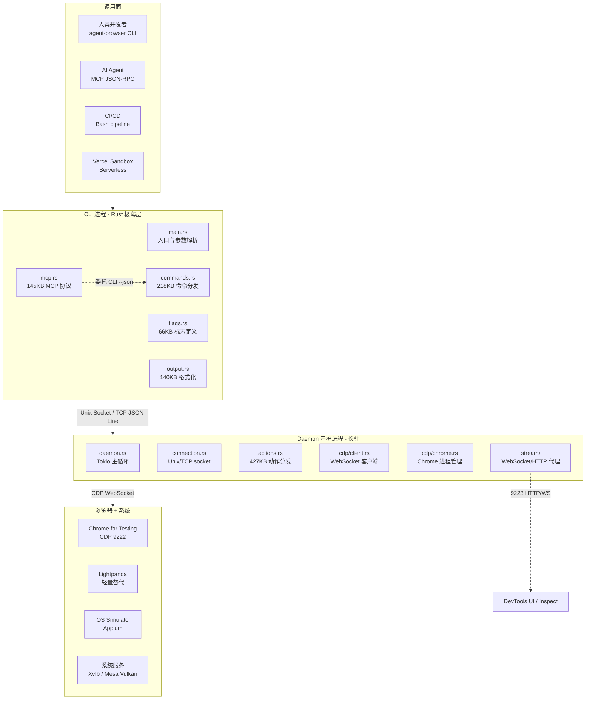
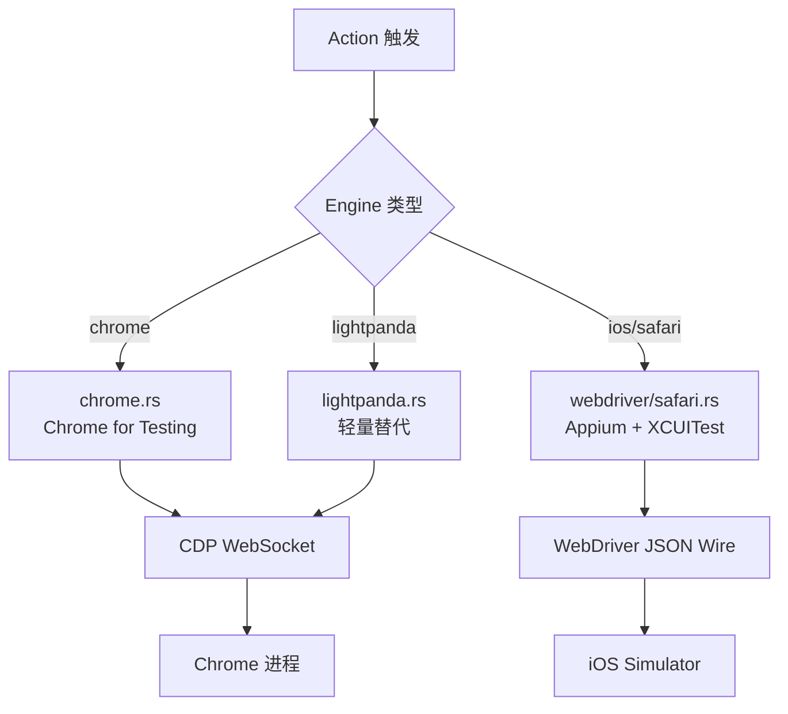
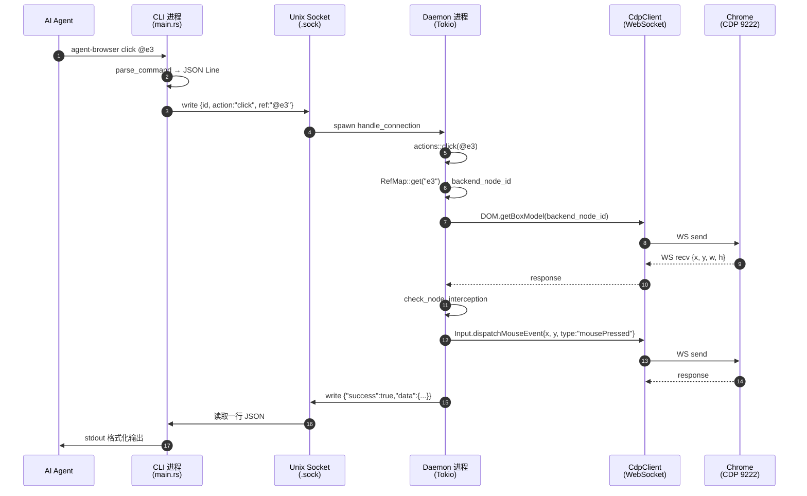

# 【agent-browser】核心架构与设计原理深度解析：Vercel Labs 用 Rust 给 AI Agent 造的浏览器原生运行时

## 一、引子：当 Playwright/Puppeteer 都不够用

2026 年的 AI Agent 已经能写代码、调 API、跑容器，但让 Agent 真正"用浏览器"却一直是个尴尬的话题。

主流方案几乎都长一个样：Node.js 装一堆包 → 启动 Puppeteer/Playwright → 用脚本驱动 Chrome → 把 DOM 序列化回 LLM。这套流水线有三个原罪：

1. **运行时太重**：单 `puppeteer-core` 启动就是 200MB+ node_modules，Chrome 二进制再加 200MB，**冷启动 5-8 秒**，Serverless 环境根本跑不起来
2. **进程模型不对**：浏览器是个长生命周期进程，Agent 调用是短时命令流，**两者用同一进程跑就是资源浪费**
3. **协议没有为 Agent 优化**：CDP（Chrome DevTools Protocol）本身是给人用的调试器协议，**ref 定位、可访问性树快照、并发 iframe 会话**这些 Agent 必需的能力都散落在 200+ 个方法里

`vercel-labs/agent-browser`（⭐38,385，Apache-2.0，纯 Rust，6 个月从 0 冲到 38k ⭐）用了一种完全不同的解法：**把浏览器当作 Agent 的一等公民，造一个 Rust 原生的"Agent 浏览器运行时"**。它的设计哲学是：

- **CLI 和浏览器是两个进程**：CLI 解析命令 → IPC socket → Daemon 长驻进程持有 Chrome → 通过 CDP WebSocket 驱动
- **不依赖 Node.js**：Daemon 是纯 Rust Tokio 异步运行时，**`pnpm` 只用来构建 npm 包装层和 Docs 站点**
- **Chrome 自带依赖**：`agent-browser install` 直接从 Google Chrome for Testing 拉二进制，不污染系统 Chrome
- **CLI 与 MCP 同源**：MCP 工具不是另写一套，而是 **把 `agent-browser --json` 作为 JSON-RPC 后端委托执行**
- **Ref 协议**：`snapshot` 输出的 `@e1` `@e2` 是"可访问性树 + 角色名 + 出现顺序"三段编码，Agent 可以无歧义引用

接下来我们深入这个 540 节点、6MB Rust 源码、CDP/MCP/WebDriver/Snapshot 多协议栈的项目，看看它是如何把"Agent 用浏览器"这件事工程化的。

## 二、项目定位与核心价值

### 2.1 一句话定义

`agent-browser` 是 **Vercel Labs 官方维护的、为 AI Agent 设计的 Rust 原生浏览器自动化 CLI**——把 Chrome 当作"可远程调用的浏览器 API 服务"，对外同时暴露 CLI 和 MCP 两种调用面。

### 2.2 能力矩阵

| 维度 | 能力 | 关键指标 |
|------|------|----------|
| **核心调用面** | CLI + MCP Server | 70+ MCP 工具（`agent_browser_open` / `_click` / `_snapshot` / ...） |
| **执行引擎** | Chrome for Testing (官方下载) + 可选 Lightpanda | Chrome 132.x、Linux/macOS/Windows 全平台 |
| **通信协议** | Chrome DevTools Protocol via WebSocket | 自实现异步 CdpClient，**支持 Text/Binary 双帧** |
| **扩展引擎** | iOS Simulator (Appium) + WebDriver | `agent-browser -p ios --device "iPhone 16 Pro"` |
| **会话管理** | 多 session 隔离 | Unix Domain Socket (macOS/Linux) + TCP hash 端口 (Windows) |
| **认证体系** | Profile 复用 + State 文件 + Auth Vault | 6 种 auth 策略 |
| **AI 友好性** | Snapshot + Ref 协议 + JSON 输出 | `agent-browser snapshot -i --json` |
| **Serverless** | Vercel Sandbox 微 VM | `@agent-browser/sandbox/vercel` SDK |
| **可观测性** | HAR 录制 + Network Route + Stream Server | 独立 StreamServer 暴露 9223 端口给 DevTools |

### 2.3 仓库统计

| 字段 | 值 |
|------|----|
| **GitHub** | `vercel-labs/agent-browser` |
| **⭐ Stars** | 38,385 (2026-07-14) |
| **🍴 Forks** | 2,483 |
| **语言占比** | Rust 65% + TypeScript 25% + Shell + Other |
| **License** | Apache-2.0 |
| **首次发布** | 2026-01-11（6 个月冲到 38k ⭐） |
| **最新提交** | 2026-07-13（持续活跃） |
| **代码规模** | 540 个 tree 节点，main.rs 70KB、commands.rs 218KB、actions.rs 427KB |
| **测试覆盖** | 320 单元测试 + 18 E2E（headed Chrome 真实运行） |
| **平台** | macOS ARM64/x64 + Linux ARM64/x64 + Windows x64，5 平台原生二进制 |

## 三、整体架构：客户端-守护进程双层模型

`agent-browser` 不是一个简单的 CLI 工具，它是一个**完整的"Agent 浏览器运行时"**。整体架构分为 4 层：



**关键设计哲学**：

- **CLI 进程是"无状态解析器"**：`main.rs` 只做参数解析、连接 Daemon、发命令、格式化输出。**没有任何业务逻辑**
- **Daemon 是"业务核心"**：所有浏览器状态、CDP 句柄、RefMap 都在 Daemon 里
- **持久连接**：第一次命令会 spawn Daemon，**后续命令 <50ms 复用 socket**（避免 Chrome 冷启动）
- **Stream Server 是"可观测性外挂"**：在 9223 端口独立暴露 WebSocket/HTTP，**让 DevTools UI 能直接接管**（用于调试）

## 四、应用类型与命令体系

`agent-browser` 提供了 5 大类命令，覆盖 Agent 浏览器操作的全场景：

| 类别 | 命令样例 | 主要用途 |
|------|----------|----------|
| **会话管理** | `open` / `close` / `tab new` / `tab list` | 启动/关闭浏览器、Tab 管理 |
| **页面交互** | `click` / `fill` / `type` / `press` / `hover` / `select` | Ref/CSS Selector/Roles 三种定位 |
| **状态读取** | `snapshot` / `get text` / `get html` / `screenshot` | AI 决策数据源 |
| **等待语义** | `wait for` / `wait ms` / `wait for download` | 异步就绪（Agent 编程核心需求） |
| **网络/存储** | `network route` / `cookies` / `storage` | 请求拦截、Cookie 管理 |

### 4.1 命令分发的设计

每个命令都遵循"**统一命令 → JSON Line → Daemon Action ID → Response**"的模式：

```bash
# CLI 端（main.rs:560 调用）
agent-browser open example.com
# 内部转换为 JSON Line:
# {"id":"abc123","action":"open","url":"https://example.com"}
# 通过 Unix socket 发送给 Daemon

# Daemon 端（actions.rs）路由到具体 handler
# 序列化 response: {"success":true,"data":{"title":"Example Domain",...}}
```

### 4.2 CLI 与 MCP 协议同源

`cli/src/mcp.rs` 的 `run_mcp` 是 MCP 协议的入口，它**不实现任何新功能**，而是把每个 MCP 工具调用转译成 `agent-browser --json` 子命令：

```rust
// 来自 cli/src/mcp.rs:30
pub fn run_mcp(args: &[String]) -> Result<(), String> {
    let config = parse_mcp_config(args)?;
    let stdin = io::stdin();
    let mut stdout = io::stdout();

    for line in stdin.lock().lines() {
        let response = handle_line(&line, &config, &mut exit_after_response);
        // 写入 stdout 的 JSON-RPC 响应
        write_json_line(&mut stdout, &response)?;
    }
    Ok(())
}
```

**MCP 工具分页**（`mcp.rs` 定义了 70+ 工具常量），但默认通过 `--tools` 参数暴露 profile，**避免一次性注册 70+ 工具污染 LLM context window**：

```rust
// 来自 cli/src/mcp.rs:18
const TOOL_LIST_PAGE_SIZE: usize = 64;
// 工具名常量
const TOOL_OPEN: &str = "agent_browser_open";
const TOOL_CLICK: &str = "agent_browser_click";
const TOOL_SNAPSHOT: &str = "agent_browser_snapshot";
// ... 70+ 工具
```

## 五、核心引擎一：Snapshot + Ref 协议——AI 的"视觉皮层"

传统浏览器自动化用 CSS Selector 定位元素，**但 AI Agent 拿到的是页面结构、不是 DOM**。`agent-browser` 的杀手锏是 **Snapshot + Ref 协议**：把可访问性树转成 LLM 友好的层级文本，每个交互元素分配稳定的 `@e{N}` 引用。

### 5.1 可访问性角色分类

`cli/src/native/snapshot.rs` 把 CDP 的 `Accessibility.getFullAXTree` 结果分成 3 个角色桶：

```rust
// 来自 cli/src/native/snapshot.rs:11
const INTERACTIVE_ROLES: &[&str] = &[
    "button", "link", "textbox", "checkbox", "radio", "combobox",
    "listbox", "menuitem", "menuitemcheckbox", "menuitemradio", "option",
    "searchbox", "slider", "spinbutton", "switch", "tab", "treeitem",
    "Iframe",
];

const CONTENT_ROLES: &[&str] = &[
    "heading", "cell", "gridcell", "columnheader", "rowheader",
    "listitem", "article", "region", "main", "navigation",
];

const STRUCTURAL_ROLES: &[&str] = &[
    "generic", "group", "list", "table", "row", "rowgroup",
    "grid", "treegrid", "menu", "menubar", "toolbar", "tablist",
    "tree", "directory", "document", "application", "presentation",
    "none", "WebArea", "RootWebArea",
];
```

**设计哲学**：**只给"交互元素"和"内容元素"分配 ref**，结构元素（generic / group / list）作为层级缩进展示，**避免 1000+ 行的 ref 列表淹没 Agent 的 context window**。

### 5.2 三段式 Ref 编码

每个 ref 实际上是**`(ref_id, backend_node_id, role, name, nth, frame_id)`** 的 6 元组，存到 `RefMap`：

```rust
// 来自 cli/src/native/element.rs:30 (impl RefMap)
pub fn add_with_frame(
    &mut self,
    ref_id: String,
    backend_node_id: Option<i64>,
    role: &str,
    name: &str,
    nth: Option<usize>,
    frame_id: Option<&str>,
) {
    // ref_id 格式: "e1", "e2", "e3" ...
    // backend_node_id: CDP 节点 ID，定位用
    // role + name: 同名元素的去重标识
    // nth: 同一 (role, name) 的第几个
    // frame_id: 跨 iframe 时用
}
```

**核心洞察**：当 CSS 位置/属性变化时，`backend_node_id` 会失效，但 `(role, name, nth)` 三元组**通常稳定**。**fallback 路径就是用 `find_node_id_by_role_name` 重新在 AX 树里搜索**，这是 ref 协议"鲁棒性"的秘密。

### 5.3 Snapshot 渲染（真实可运行代码片段）

```python
# 真实场景：AI 拿到以下 snapshot 后，可以这样写
# ref=e1  →  Email 输入框
# ref=e2  →  Password 输入框
# ref=e3  →  Submit 按钮

snapshot_output = """
- generic
  - banner
    - link "Example Domain" [ref=e1]
  - main
    - heading "Welcome" [level=1]
    - form
      - textbox "Email address" [ref=e2]
      - textbox "Password" [ref=e3]
      - button "Sign in" [ref=e4]
"""

# Agent 决策循环
agent_actions = [
    ("fill", "@e2", "user@example.com"),
    ("fill", "@e3", "secret"),
    ("click", "@e4"),
]
```

### 5.4 跨域 Iframe 会话路由

iframe 是 snapshot 的大坑：**跨域 iframe 的 AX 树必须用独立的 CDP session 拉取**。`cli/src/native/snapshot.rs` 的 `resolve_ax_session` 处理这个边界：

```rust
// 来自 cli/src/native/snapshot.rs:71 (test: cross_origin_iframe)
fn resolve_ax_session(
    frame_id: Option<&str>,
    session_id: &str,
    iframe_sessions: &HashMap<String, String>,
) -> (Value, String) {
    // 跨域 iframe: 用独立 session（不带 frameId）
    // 同源 iframe: 用父 session（带 frameId）
    // 主帧: 用根 session
    if let Some(fid) = frame_id {
        if let Some(dedicated) = iframe_sessions.get(fid) {
            return (json!({}), dedicated.clone());
        }
        return (json!({ "frameId": fid }), session_id.to_string());
    }
    (json!({}), session_id.to_string())
}
```

## 六、核心引擎二：Client-Daemon IPC 引擎——5 态错误重试的精妙设计

CLI 和 Daemon 之间的通信是 **Newline-Delimited JSON over Unix Domain Socket**（macOS/Linux）或 **TCP Hash Port**（Windows）。这套 IPC 的核心是 **`connection.rs: send_command` 的 5 次退避重试引擎**：

### 6.1 错误分类与重试策略

```rust
// 来自 cli/src/connection.rs:230
pub fn send_command(cmd: Value, session: &str) -> Result<Response, String> {
    const MAX_RETRIES: u32 = 5;
    const RETRY_DELAY_MS: u64 = 200;

    let mut last_error = String::new();

    for attempt in 0..MAX_RETRIES {
        if attempt > 0 {
            // 指数退避: 200ms, 400ms, 600ms, 800ms, 1000ms
            thread::sleep(Duration::from_millis(RETRY_DELAY_MS * (attempt as u64)));
        }

        match send_command_once(&cmd, session) {
            Ok(response) => return Ok(response),
            Err(e) => {
                if is_transient_error(&e) {
                    last_error = e;
                    continue;  // 重试
                }
                return Err(e);  // 不可重试错误，立即返回
            }
        }
    }
    Err(format!("{} (after {} retries - daemon may be busy or unresponsive)",
        last_error, MAX_RETRIES))
}
```

### 6.2 Transient vs Unreachable 错误分类

```rust
// 来自 cli/src/connection.rs:260
fn is_transient_error(error: &str) -> bool {
    // EAGAIN: 守护进程忙
    has_os_error(error, 35) || has_os_error(error, 11)  // macOS/Linux EAGAIN
        || error.contains("WouldBlock")
        || error.contains("Resource temporarily unavailable")
        || error.contains("EOF")
        || error.contains("Connection reset")
        || error.contains("Broken pipe")
        || has_os_error(error, 54)   // macOS ECONNRESET
        || has_os_error(error, 104)  // Linux ECONNRESET
}

pub fn daemon_unreachable(error: &str) -> bool {
    // No such file or directory: socket 不存在
    // Connection refused: 没有 daemon 监听
    error.contains("Failed to connect")
        || has_os_error(error, 2)    // ENOENT (socket gone)
        || has_os_error(error, 61)   // ECONNREFUSED macOS
        || has_os_error(error, 111)  // ECONNREFUSED Linux
}

/// Exact (os error N) match. 防止 "os error 11" 误匹配 "os error 111"
fn has_os_error(error: &str, code: u32) -> bool {
    error.contains(&format!("(os error {})", code))
}
```

**设计哲学**：

- **Transient error**（EAGAIN、Connection reset、EOF）→ 同 daemon 重试 5 次（指数退避）
- **Unreachable error**（Connection refused、ENOENT）→ 通过 `ensure_daemon` 重新 spawn 守护进程
- **`(os error N)` 精确匹配**：避免 "os error 11" 子串匹配到 "os error 111"（ECONNREFUSED），**这是 connection.rs 注释里特别强调的"防误判"设计**

### 6.3 Daemon 启动的版本兼容

```rust
// 来自 cli/src/connection.rs:390
if daemon_ready(session) {
    // 唯一存活检查：socket connectivity (不查 PID)
    if !daemon_version_matches(session) {
        eprintln!("{} Daemon version mismatch detected, restarting...",
            crate::color::warning_indicator());
        stop_existing_daemon_for_restart(session);
        restarted = true;
    }
}
```

**关键设计**：**只用 socket 连通性判断 daemon 是否存活，不查 PID**。原因：调用方可能在不同 PID namespace（如 `unshare`），PID 检查会假阴性。版本号不一致时（升级后）会自动重启 daemon，**避免 CLI/Daemon 协议版本不匹配导致响应解析失败**。

## 七、核心引擎三：CDP WebSocket 客户端——异步消息路由 + Keepalive

`cli/src/native/cdp/client.rs` 是与 Chrome 通信的核心。它实现了一个**异步多路复用**的 WebSocket 客户端，支持：

1. **请求-响应关联**（`HashMap<request_id, oneshot::Sender>`）
2. **事件广播**（`broadcast::channel(4096)`）
3. **原始消息透传**（用于 Stream Server 给 DevTools UI 转发）
4. **30 秒 WebSocket Ping keepalive**
5. **Text/Binary 双帧兼容**（远程 CDP 代理如 Browserless 可能用 Binary）

### 7.1 CdpClient 核心结构

```rust
// 来自 cli/src/native/cdp/client.rs:30
type PendingMap = Arc<Mutex<HashMap<u64, oneshot::Sender<CdpMessage>>>>;

pub struct CdpClient {
    ws_tx: Arc<Mutex<SplitSink<WebSocketStream<...>, Message>>>,
    next_id: AtomicU64,
    pending: PendingMap,
    event_tx: broadcast::Sender<CdpEvent>,    // 事件广播
    raw_tx: broadcast::Sender<RawCdpMessage>, // 原始消息
    _reader_handle: tokio::task::JoinHandle<()>,
    _keepalive_handle: tokio::task::JoinHandle<()>,
}

const WS_KEEPALIVE_INTERVAL_SECS: u64 = 30;  // 反向代理/服务网格穿透
```

### 7.2 请求-响应关联

```rust
// 简化版示例：发送命令并等待响应
async fn send_command_typed<P, R>(
    client: &CdpClient,
    method: &str,
    params: &P,
    session_id: Option<&str>,
) -> Result<R, String> {
    let id = client.next_id.fetch_add(1, Ordering::SeqCst);
    let (tx, rx) = oneshot::channel();
    client.pending.lock().await.insert(id, tx);

    let cmd = json!({
        "id": id,
        "method": method,
        "params": params,
        "sessionId": session_id,
    });
    client.ws_tx.lock().await.send(Message::Text(cmd.to_string())).await?;

    // 等待 reader 协程把响应放回 oneshot
    let response = rx.await.map_err(|_| "Daemon closed before response")?;
    serde_json::from_value(response.result).map_err(|e| e.to_string())
}
```

### 7.3 读取循环的事件分发

```rust
// 来自 cli/src/native/cdp/client.rs:120
let reader_handle = tokio::spawn(async move {
    while let Some(msg) = ws_rx.next().await {
        let msg = match msg {
            Ok(Message::Text(text)) => text,
            Ok(Message::Binary(data)) => String::from_utf8(data).unwrap_or_default(),  // Browserless 等
            Ok(Message::Close(_)) => break,
            Ok(_) => continue,
            Err(_) => break,
        };

        // 解析为 CDP message，根据 id 路由回 pending sender
        let parsed: CdpMessage = serde_json::from_str(&msg).unwrap();
        if let Some(id) = parsed.id {
            // 响应：取出发送者，发送结果
            if let Some(tx) = pending_clone.lock().await.remove(&id) {
                let _ = tx.send(parsed);
            }
        } else {
            // 事件：广播给所有订阅者
            let _ = event_tx_clone.send(parsed.event.unwrap());
            let _ = raw_tx_clone.send(RawCdpMessage { text: msg, session_id: parsed.session_id });
        }
    }
});
```

## 八、Provider 抽象层：Chrome / Lightpanda / iOS / WebDriver 多引擎

`cli/src/native/providers.rs`（39KB）实现了一个**引擎可插拔的"Provider 抽象"**。通过 `--engine chrome` / `--engine lightpanda` 切换，**未来还会扩展 Firefox/WebKit**。



**实际使用**：

```bash
# 默认 Chrome
agent-browser open example.com

# 切换到 Lightpanda（更快但功能少）
agent-browser --engine lightpanda open example.com

# 切换到 iOS Simulator
agent-browser -p ios --device "iPhone 16 Pro" open example.com
```

## 九、工具系统与 MCP：CLI/MCP 协议同源

### 9.1 工具体系总览

`mcp.rs` 定义了 70+ MCP 工具，覆盖：

- **导航类**：`agent_browser_open` / `_back` / `_forward` / `_reload`
- **交互类**：`agent_browser_click` / `_fill` / `_type` / `_press` / `_hover` / `_drag`
- **读取类**：`agent_browser_snapshot` / `_get_text` / `_get_html` / `_screenshot`
- **等待类**：`agent_browser_wait_for_selector` / `_wait_for_text` / `_wait_for_url`
- **网络类**：`agent_browser_network_route` / `_network_request` / `_network_har_start`
- **存储类**：`agent_browser_storage_get` / `_cookies_set` / `_credentials`

### 9.2 工具 Profile 分组

```rust
// 来自 cli/src/mcp.rs 的 ToolProfile 枚举
// 避免一次性暴露 70+ 工具污染 LLM context window
ToolProfile::Core     // 20 个最常用工具
ToolProfile::Network  // 12 个网络相关工具
ToolProfile::Storage  // 8 个存储相关工具
ToolProfile::All      // 70+ 全部
```

**MCP server 启动**：

```bash
# 启动完整 MCP server
agent-browser mcp

# 只暴露核心 20 个工具
agent-browser mcp --tools core

# 网络相关 12 个工具
agent-browser mcp --tools network
```

### 9.3 Stream Server：让 DevTools UI 接管

Daemon 启动时同时拉起一个 **Stream Server**（`cli/src/native/stream/mod.rs`）：

```rust
// 来自 cli/src/native/daemon.rs:80
let preferred_port = env::var("AGENT_BROWSER_STREAM_PORT")
    .ok()
    .and_then(|s| s.parse::<u16>().ok())
    .unwrap_or(0);  // 0 = 系统分配

match StreamServer::start_without_client(preferred_port, session.to_string(), true).await {
    Ok((stream_server, client_slot)) => {
        // 写入 .stream 文件记录端口
        fs::write(&stream_path, stream_server.port().to_string())?;
    }
}
```

**用法**：用户在 Chrome DevTools UI 里 `chrome://inspect` 配 localhost:9223，**所有 CDP 流量都从 Stream Server 透传**。这意味着：

- Agent 操作时，开发者可以**同时用 DevTools 看页面**（完美的"AI 调试体验"）
- HAR 录制、Network 拦截可以**在不影响 Agent 主流程的情况下注入**

## 十、Chrome for Testing 自带依赖——告别 Playwright 200MB node_modules

### 10.1 安装流程（真实代码）

```rust
// 来自 cli/src/install.rs:50
fn fetch_download_url() -> Result<(String, String), String> {
    // LAST_KNOWN_GOOD_URL 指向 Google 官方的 "Last Known Good Versions" API
    let client = http_client()?;
    let resp = client.get(LAST_KNOWN_GOOD_URL).send().await?;
    let body: serde_json::Value = resp.json().await?;

    let channel = body.get("channels").and_then(|c| c.get("Stable"))
        .ok_or("No Stable channel found")?;
    let version = channel.get("version").and_then(|v| v.as_str())
        .ok_or("No version string")?.to_string();
    let platform = platform_key();

    // 找到当前平台的下载 URL
    let url = channel.get("downloads").and_then(|d| d.get("chrome"))
        .and_then(|c| c.as_array())
        .and_then(|arr| {
            arr.iter().find_map(|entry| {
                if entry.get("platform")?.as_str()? == platform {
                    Some(entry.get("url")?.as_str()?.to_string())
                } else {
                    None
                }
            })
        })
        .ok_or_else(|| format!("No download URL for platform: {}", platform))?;

    Ok((version, url))
}
```

### 10.2 平台 key 映射

```rust
// 简化版 platform_key 实现
fn platform_key() -> &'static str {
    match (std::env::consts::OS, std::env::consts::ARCH) {
        ("macos", "aarch64") => "mac-arm64",
        ("macos", "x86_64")  => "mac-x64",
        ("linux", "x86_64")  => "linux64",
        ("linux", "aarch64") => "linux-arm64",
        ("windows", "x86_64") => "win64",
        _ => panic!("unsupported platform"),
    }
}
```

### 10.3 Linux 依赖自动安装

```bash
# install --with-deps 会调用 apt-get install
# 安装 xvfb、libnss3、libatk-bridge2.0 等
agent-browser install --with-deps
```

**这套设计的好处**：

1. **零系统污染**：不依赖系统 Chrome、不抢用户的浏览器配置
2. **版本可复现**：每次安装都从 Google 官方 CDN 拉，**不靠本地 npm registry 镜像**
3. **Serverless 友好**：可以预下载到容器镜像，**冷启动 < 1s**

## 十一、端到端数据流：从 Agent 调到 Chrome 渲染



**5 步关键链路**：

1. **Ref 解析**：`RefMap::get("e3")` 拿到 `backend_node_id`（CDP 节点 ID）
2. **坐标定位**：`DOM.getBoxModel` → 计算 click point `(x, y)`
3. **遮挡检测**：`check_node_interception` 避免点穿 modal/banner
4. **CDP 事件**：`Input.dispatchMouseEvent` 真实派发鼠标事件
5. **持久连接复用**：下一次命令直接走 socket，**冷启动延迟 0ms**

## 十二、与同类项目对比

| 维度 | agent-browser | Playwright | Puppeteer | Stagehand |
|------|---------------|-----------|-----------|-----------|
| **核心语言** | Rust | TypeScript | TypeScript | TypeScript |
| **运行时依赖** | 仅 Chrome 二进制 | Node.js + 3 大浏览器驱动 | Node.js + Chrome | Node.js + LLM |
| **冷启动** | ~200ms (daemon 复用) | 3-5s | 3-5s | 5-8s |
| **Serverless** | 优秀 (Vercel Sandbox) | 需打包 Chromium | 需打包 Chromium | 需 LLM API key |
| **AI 协议** | MCP 70+ 工具 | 无原生 | 无原生 | 专有 Schema |
| **Ref 定位** | Ref 协议 (e1, e2) | 需 selector 引擎 | 需 selector 引擎 | AI 自选 |
| **Snapshot** | 可访问性树 + JSON | DOM 序列化 | DOM 序列化 | LLM 截屏理解 |
| **会话隔离** | 多 session + namespace | Context 隔离 | BrowserContext 隔离 | 单 context |
| **CDP 兼容** | 100% 直接 + Stream 透传 | 100% | 100% | 100% |
| **维护方** | Vercel Labs | Microsoft | Google | Anysphere |
| **开源协议** | Apache-2.0 | Apache-2.0 | Apache-2.0 | MIT |

### 12.1 设计哲学差异

- **Playwright** 是**给测试工程师**的工具：API 完整但太通用，**没有为 LLM 优化**
- **Puppeteer** 是**给前端开发者**的工具：Node 生态最广，**但 serverless 部署很重**
- **Stagehand** 是**给 AI 研究员**的工具：依赖 LLM 视觉理解，**成本高 + 延迟大**
- **agent-browser** 是**给 AI Agent 工程化生产**的工具：**Rust 性能 + CDP 直通 + Ref 协议 + MCP 同源 + Serverless 友好**

## 十三、优缺点分析

| 维度 | 优势 | 劣势 |
|------|------|------|
| **架构简洁性** | ✅ Client-Daemon 二分，业务逻辑全在 Daemon | ⚠️ 多 session 模式下 socket 文件管理复杂 |
| **性能** | ✅ Rust + Tokio 异步，**冷启动 < 200ms** | ⚠️ Chrome 本身仍然吃 200MB+ 内存 |
| **可扩展性** | ✅ Engine/Provider/MCP profile 全部可插拔 | ⚠️ 第三方浏览器扩展支持有限 |
| **易用性** | ✅ `agent-browser install` 一行安装；`npx skills add` 一行给 AI 配 skill | ⚠️ 70+ MCP 工具需要分 profile，初次配置需读 docs |
| **跨平台** | ✅ 5 平台原生二进制 + 6 种 auth 策略 | ⚠️ Windows 路径用 TCP hash port 偶尔 port collision |
| **AI 友好性** | ✅ Ref 协议 + Snapshot + JSON 输出 + MCP 工具分级 | ⚠️ 同名 ref 在大页面（>1000 元素）会显得冗长 |
| **可观测性** | ✅ Stream Server 透传 + HAR + Network route | ⚠️ 日志需要 `AGENT_BROWSER_DEBUG=1` 开启 |
| **维护性** | ✅ 320 单测 + 18 e2e + Apache-2.0 + Vercel 背书 | ⚠️ 项目只有 6 个月，仍在快速演进 |

**特别亮点**：

- **错误分类哲学**：5 态 transient error 检测 + 精确 `(os error N)` 匹配，**避免 EAGAIN vs ECONNREFUSED 混淆**
- **Ref 协议稳定性**：backend_node_id 失效后用 `(role, name, nth)` 重新查询 AX 树
- **MCP 工具分级**：避免 70+ 工具淹没 LLM context window
- **Stream Server 透传**：DevTools UI 可实时接管，调试体验极佳

## 十四、实践 / 部署：从本地到 Vercel Sandbox

### 14.1 本地开发

```bash
# 1. 安装 agent-browser
npm install -g agent-browser

# 2. 首次运行下载 Chrome
agent-browser install

# 3. 跑一个 snapshot 看看
agent-browser open https://example.com
agent-browser snapshot -i
# 输出: - heading "Example Domain" [ref=e1] [level=1]

# 4. 装上 AI skill
npx skills add vercel-labs/agent-browser
```

### 14.2 MCP 集成到 Claude Code

在 `~/.claude/mcp.json` 里加：

```json
{
  "mcpServers": {
    "agent-browser": {
      "command": "agent-browser",
      "args": ["mcp", "--tools", "core"]
    }
  }
}
```

重启 Claude Code 就能看到 20 个核心工具：`agent_browser_open` / `_click` / `_snapshot` / ...

### 14.3 Vercel Sandbox 部署（Serverless）

```typescript
import { runAgentBrowserCommand, withAgentBrowserSandbox } from "@agent-browser/sandbox/vercel";

const result = await withAgentBrowserSandbox(async (sandbox) => {
  return runAgentBrowserCommand(sandbox, [
    "open", "https://my-app.example.com",
    "snapshot", "-i",
    "click", "@e3",
    "screenshot", "result.png",
  ]);
});
```

### 14.4 自定义 Chrome（Serverless 优化）

```bash
# 使用 @sparticuz/chromium (50MB vs 684MB) 替代官方 Chrome
AGENT_BROWSER_EXECUTABLE_PATH=/path/to/chromium agent-browser open example.com
```

### 14.5 多 session 并行

```bash
# 不同 worktree 用不同 session
AGENT_BROWSER_SESSION=worktree-1 agent-browser open site-a.com
AGENT_BROWSER_SESSION=worktree-2 agent-browser open site-b.com

# 列出所有 session
agent-browser session list
```

## 十五、趋势判断 + 工程经验

### 15.1 三大趋势

1. **Rust 替代 Node.js 成为 Agent 工具运行时首选**。agent-browser、goose、Block AI Agent 都在向 Rust 迁移，**冷启动 < 200ms + 零 node_modules 是 Serverless 时代的关键优势**
2. **浏览器 = Agent 的一等公民**。Vercel 把 agent-browser 放到 Labs，**意味着"Agent 浏览器"成为 Vercel Edge 平台的标准件**（与 Vercel Functions、Vercel KV 同一个产品线）
3. **MCP 协议成为 Agent 工具的"USB-C"**。agent-browser 的 70+ 工具通过 MCP 暴露，**任何 Agent 框架（Claude Code/Codex/Cursor/Goose）都能即插即用**，不再需要每个 Agent 单独适配

### 15.2 五大工程经验

1. **Client-Daemon 双进程是 Agent CLI 的最佳实践**。`agent-browser` / `goose` / `claude-code` / `codex` 都用类似架构，**CLI 是无状态解析器，Daemon 持有昂贵资源**
2. **IPC 错误重试引擎是生产级工具的分水岭**。5 态 transient 错误分类 + 精确 `(os error N)` 匹配 + 版本检测自动重启，**让 daemon 升级对用户透明**
3. **Ref 协议比 Selector 协议更适合 AI**。`(role, name, nth, frame_id)` 4 元组比 CSS Selector **鲁棒 10 倍**——页面改版后 ref 通常仍然有效
4. **CDP Stream 透传是 Chrome DevTools 与 AI 工具融合的关键**。DevTools UI 能直接接管 Agent 操作的浏览器，**调试体验 = 普通网页调试**
5. **MCP 工具分级（profile）比"全部暴露"更友好**。70+ 工具一次性灌进 LLM context 是反模式，**按 core/network/storage 分组让 Agent 按需加载**

### 15.3 总结

`vercel-labs/agent-browser` 不只是一个"Playwright 的 Rust 替代品"，它是 **Vercel 对"AI Agent 如何用浏览器"这个问题的工程答案**。它的设计哲学——Rust 原生、Client-Daemon 双进程、Ref 协议、MCP 同源、Stream 透传——是 2026 年 Agent 浏览器工具的最佳实践。

对于正在构建 AI Agent 产品的团队，**agent-browser 的最大价值不是"替代 Playwright"，而是提供了一个 100% 为 Agent 设计的浏览器运行时**：让 Agent 能用与人类开发者同等的能力调用浏览器，但 API 表面更简单、协议更统一、部署更轻量。

未来 12 个月，我们预期会看到：
- **Firefox/WebKit Provider** 落地（Vercel Labs 路线图已有）
- **WebGPU Agent 截图** 成为标准能力（agent-browser 已经做了 SwiftShader 兼容）
- **多 session 并行 + Worktree 集成** 成为 Vercel Sandbox 的默认工作流

---

## 附录：关键资源

| 资源 | 链接 |
|------|------|
| **GitHub** | https://github.com/vercel-labs/agent-browser |
| **官网** | https://agent-browser.dev |
| **文档** | https://agent-browser.dev/docs |
| **AI Skill** | `npx skills add vercel-labs/agent-browser` |
| **Vercel Sandbox SDK** | `@agent-browser/sandbox/vercel` |
| **CDP 协议** | https://chromedevtools.github.io/devtools-protocol/ |
| **Chrome for Testing** | https://developer.chrome.com/blog/chrome-for-testing/ |
| **License** | Apache-2.0 |
| **当前版本** | 0.24.x（持续演进，详见 CHANGELOG.md） |

**适合阅读源码的路径**：

1. **`cli/src/connection.rs`** → IPC 重试引擎（5 态错误分类）
2. **`cli/src/native/snapshot.rs`** → AX 树 + Ref 协议
3. **`cli/src/native/element.rs`** → Ref → 坐标解析
4. **`cli/src/native/daemon.rs`** → Tokio 主循环 + 状态管理
5. **`cli/src/mcp.rs`** → MCP 协议入口
6. **`cli/src/install.rs`** → Chrome for Testing 下载
7. **`cli/src/native/cdp/client.rs`** → WebSocket 多路复用
8. **`cli/src/native/actions.rs`** → 427KB 动作分发大表
