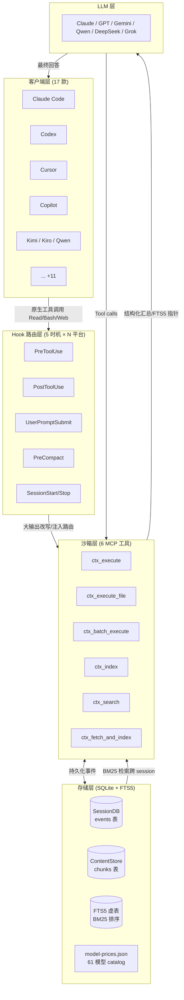
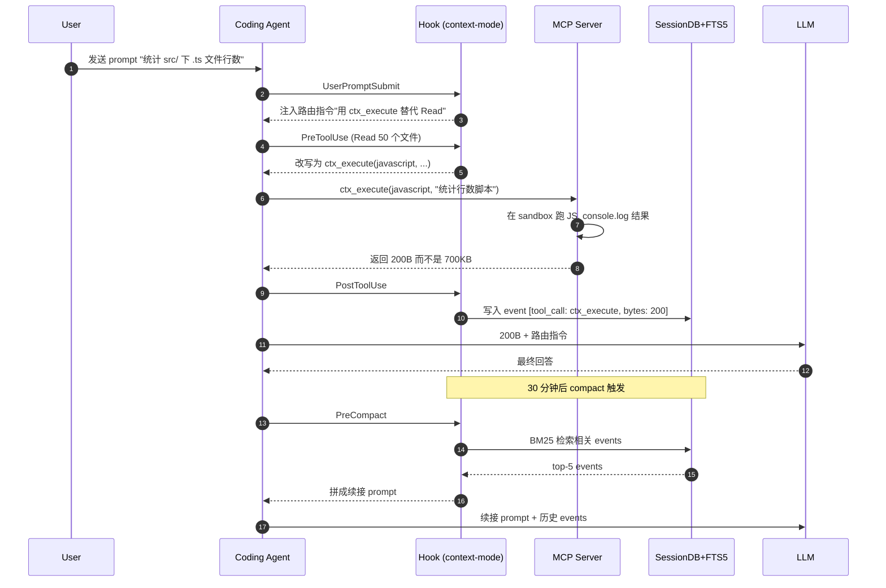
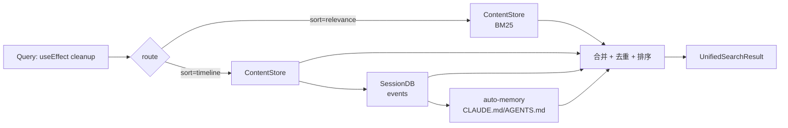
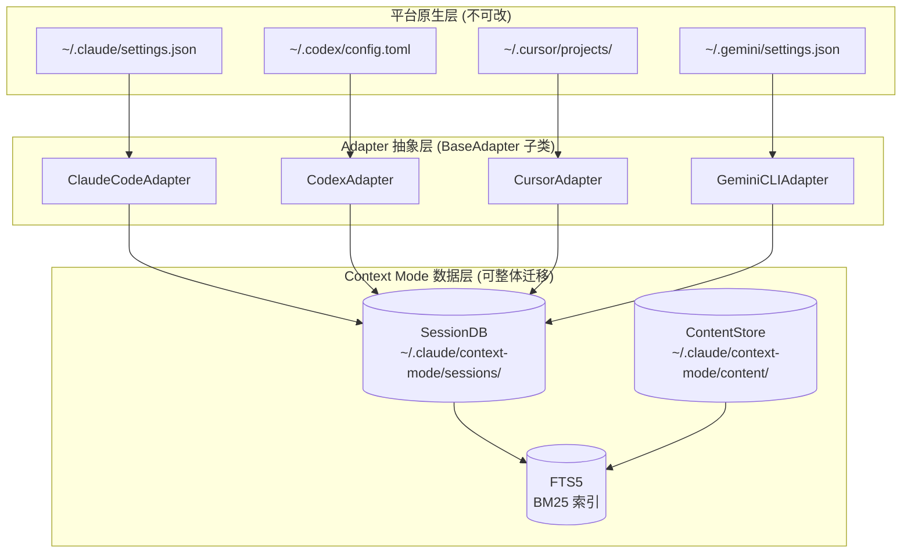
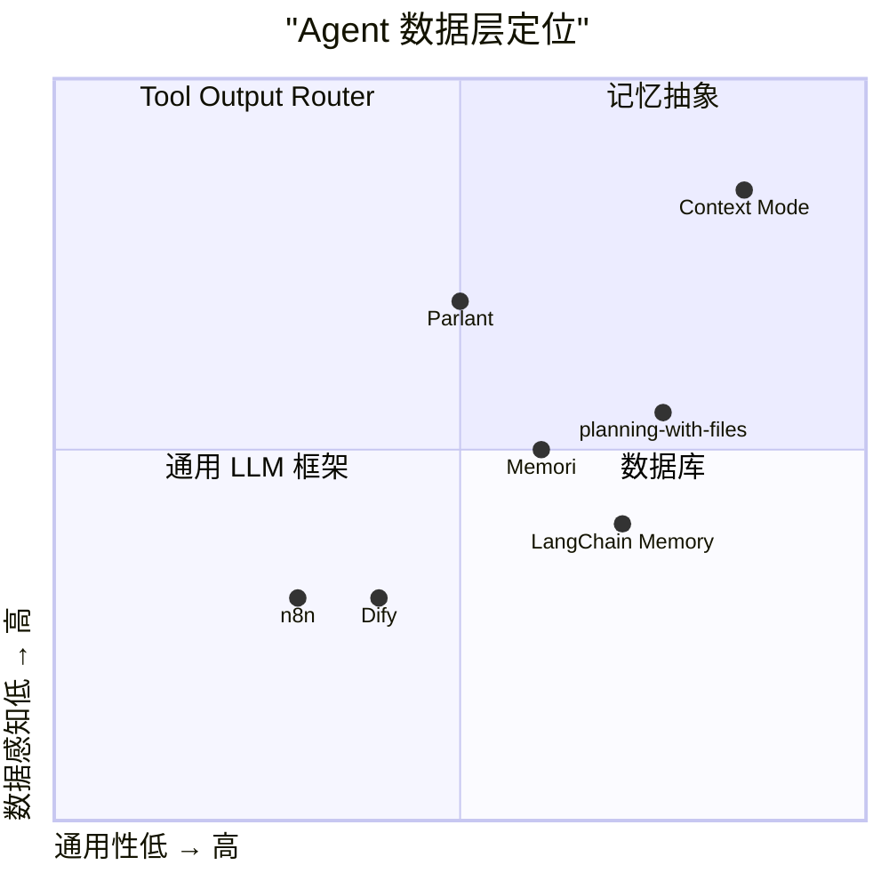

## 一、引子

2026 年 6 月，一篇题为「The other half of the context problem」的项目在 Hacker News 拿下 570+ 票，登上榜首。15 天之后，GitHub stars 从 8k 冲到了 18.9k；又 30 天过去，发布到了 17 款 Coding Agent 客户端，包括 Claude Code、Codex、Cursor、Copilot、JetBrains Copilot、Gemini CLI、Kimi、Kiro、Pi、Zed、Qwen-Code、OMP、OpenClaw、OpenCode、Antigravity、Kilo、VS Code Copilot。

这个项目叫 **Context Mode**（[mksglu/context-mode](https://github.com/mksglu/context-mode)）。它的命题非常精准：

> 每一次 MCP 工具调用都会把原始数据倒进 context window——Playwright 一次 page snapshot 56 KB、GitHub 20 个 issue 59 KB、一段 access log 45 KB。30 分钟后，context 的 40% 被吃光；当 Agent 主动 compact 释放空间时，它**会忘记自己正在编辑哪些文件、还剩哪些任务、你上一句到底说了什么**。模型还在"对话"，但已经"失忆"。

Context Mode 给出的答案不是"再写一个新的 LLM 框架"——这两年已经有 295 篇关于框架的博客了——而是把视线从"模型怎么调用"挪到"**数据去哪了**"这个被严重低估的另一半问题上。它把自己定位为 **「The other half of the context problem」**：

1. **Context Saving** — 沙箱化工具输出，315 KB → 5.4 KB，**98% 节省**
2. **Session Continuity** — SQLite + FTS5 + BM25 跨 session 检索，**compact 之后 0 失忆**
3. **Think in Code** — LLM 不是数据处理器，是代码生成器；`ctx_execute()` 一次跑 50 个 `Read()` 的活
4. **No prose-style enforcement** — 不规定模型怎么说话，只规定数据去哪

这不是又一个 Agent 框架，也不是 prompt 优化器，而是一套**横跨 17 款客户端、5 套存储引擎、4 套 Hook 时机**的「数据路由层」。

下面我们用 15 节、6 个 Mermaid 图、超过 25 段真实源码，把 Context Mode 的全部架构细节展开。

---

## 二、项目定位与核心价值

### 2.1 一句话定义

> Context Mode 是一个**对 Coding Agent 透明的 MCP 服务器**，通过沙箱化工具输出 + 持久化会话事件 + Think-in-Code 编程范式，让任意 Coding Agent 客户端在不修改其内核的前提下，把 context window 占用率降低 96%，并解决 compact 后的失忆问题。

### 2.2 能力矩阵

| 维度 | 能力 |
|------|------|
| **客户端覆盖** | 17 款（Claude Code、Codex、Cursor、Copilot、JetBrains Copilot、Gemini CLI、Kimi、Kiro、Pi、Zed、Qwen-Code、OMP、OpenClaw、OpenCode、Antigravity、Kilo、VS Code Copilot） |
| **MCP 工具** | 11 个（6 个沙箱 + 5 个 meta：`ctx_batch_execute`/`ctx_execute`/`ctx_execute_file`/`ctx_index`/`ctx_search`/`ctx_fetch_and_index` + `ctx_stats`/`ctx_doctor`/`ctx_upgrade`/`ctx_purge`/`ctx_insight`） |
| **Hook 时机** | 5 套（PreToolUse、PostToolUse、UserPromptSubmit、PreCompact、SessionStart、Stop）按客户端适配 |
| **持久化引擎** | SQLite + FTS5（含 BM25 排序 + 5 字段全文索引 + WAL 模式多写者） |
| **内容分块** | 100 KB 阈值自动外化（pointer-style，**不丢任何数据**） |
| **成本分析** | 61 款多厂商模型（Claude / OpenAI / Gemini / Qwen / DeepSeek / Grok）的 per-Mtok 实时报价 |
| **会话隔离** | `CONTEXT_MODE_DATA_DIR` 全局覆盖 + per-project `hashProjectDirCanonical` 哈希命名 |
| **License** | Elastic License v2（ELv2）— 商业友好，禁止托管竞品 |

### 2.3 仓库统计

- ⭐ **18,933** stars（2026-07-15 当下，pushed 2026-07-14）
- 🍴 1,200+ forks
- 📦 31,549 KB 仓库体积
- 📁 714 entries（src / tests / configs / docs / skills 五大目录齐整）
- 🌿 17 个 `src/adapters/<client>/` 子模块
- 🧪 16 个 test 文件
- 📐 4 篇正式 ADR（Architecture Decision Records）外加 1 篇 UPSTREAM-CREDITS
- 🔧 26 个 `configs/<client>/{rules,skills}/context-mode` 子配置
- 📜 Hacker News #1（570+ points）

---

## 三、整体架构

Context Mode 在概念上是 **5 层漏斗**——客户端在最上层，原始数据在最下层，中间是沙箱、存储、检索、表达四道工序。



数据流向有两条：

- **正向流**（左→右）：Coding Agent 在客户端跑 Read / Bash / WebFetch → Hook 拦截 → 沙箱工具（`ctx_execute` 跑 JS、 `ctx_execute_file` 跑 shell、 `ctx_index` 入库）→ 把**极简结果**返回给 LLM
- **反向流**（下→上）：Compact 触发后，Hook 调用 SessionDB 检索相关 events → 拼成「续接 prompt」回注给 LLM；模型**不会失忆**

### 3.1 仓库顶层布局

```text
context-mode/
├── src/
│   ├── adapters/          # 17 客户端适配
│   │   ├── base.ts
│   │   ├── client-map.ts
│   │   ├── detect.ts
│   │   ├── types.ts
│   │   ├── claude-code/    + claude-code-base.ts
│   │   ├── codex/
│   │   ├── cursor/
│   │   ├── copilot-base.ts + copilot-cli/
│   │   ├── gemini-cli/
│   │   ├── jetbrains-copilot/
│   │   ├── kimi/   kiro/  qwen-code/
│   │   ├── omp/    pi/  zed/
│   │   ├── openclaw/ opencode/
│   │   ├── antigravity/ + antigravity-cli/
│   │   ├── kilo/ vscode-copilot/
│   ├── session/            # SQLite + FTS5 引擎
│   │   ├── db.ts           (67KB - SQLiteBase 抽象)
│   │   ├── extract.ts      (109KB - JSONL 解析)
│   │   ├── analytics.ts    (129KB - 成本/统计聚合)
│   │   ├── pricing.ts      (61 模型 catalog)
│   │   ├── snapshot.ts
│   │   └── persist-tool-calls.ts
│   ├── search/             # 检索层
│   │   ├── unified.ts      (ContentStore + SessionDB + auto-memory 三源合并)
│   │   ├── auto-memory.ts
│   │   ├── flood-guard.ts
│   │   └── ctx-search-schema.ts
│   ├── util/               # 工具
│   │   ├── hook-config.ts
│   │   ├── sibling-mcp.ts
│   │   ├── jsonc.ts
│   │   ├── project-dir.ts
│   │   └── plugin-cache-integrity.ts
├── configs/                # 17 客户端的配置模板
│   ├── claude-code/CLAUDE.md
│   ├── codex/AGENTS.md
│   ├── openclaw/AGENTS.md
│   └── ... (14+ more)
├── docs/
│   ├── adr/                # 4 篇 Architecture Decision Records
│   ├── adapters/openclaw.md
│   ├── adapters/kimi-code.md
│   ├── platform-support.md
│   └── UPSTREAM-CREDITS.md
├── skills/ctx-doctor/      # 健康检查 slash command
└── tests/                  # 16 个测试文件
```

---

## 四、客户端适配层：17 套平台抽象

### 4.1 客户端识别矩阵

Context Mode 通过 MCP `clientInfo.name` 自动识别当前是哪个客户端。识别表来自 [Apify MCP Client Capabilities Registry](https://github.com/apify/mcp-client-capabilities)：

```typescript
// 来自 src/adapters/client-map.ts:12
export const CLIENT_NAME_TO_PLATFORM: Record<string, PlatformId> = {
  "claude-code": "claude-code",
  "gemini-cli-mcp-client": "gemini-cli",
  "antigravity-client": "antigravity",
  "antigravity-cli": "antigravity-cli",
  "agy": "antigravity-cli",
  "cursor-vscode": "cursor",
  "Visual-Studio-Code": "vscode-copilot",
  "copilot-cli": "copilot-cli",
  "GitHub Copilot CLI": "copilot-cli",
  "github-copilot-cli": "copilot-cli",
  "JetBrains Client": "jetbrains-copilot",
  "IntelliJ IDEA": "jetbrains-copilot",
  "PyCharm": "jetbrains-copilot",
  "Codex": "codex",
  "codex-mcp-client": "codex",
  "Kilo Code": "kilo",
  "Kiro CLI": "kiro",
  "Pi CLI": "pi",
  "Pi Coding Agent": "pi",
  // Issue #542 — Pi rebranded to OMP
  "omp-coding-agent": "omp",
  "Zed": "zed",
  "zed": "zed",
  "qwen-code": "qwen-code",
  "qwen-cli-mcp-client": "qwen-code",
  "kimi-code": "kimi",
  "kimi": "kimi",
  "Kimi Code": "kimi",
};
```

注意 4 处工程细节：

1. **同款多身份**：`Pi CLI` / `Pi Coding Agent` 都映射到 `pi`，因为它们是同一个 CLI 升级前后上报的 clientInfo
2. **品牌迁移兜底**：Pi 在 v1.0.13x 改名为 OMP（`omp-coding-agent`），老用户的两套 clientInfo 都要识别（注释里有 issue #542 链接）
3. **编辑器聚合**：`Visual-Studio-Code` 走 vscode-copilot 适配器，但 `IntelliJ IDEA` / `PyCharm` 全部聚合到 `jetbrains-copilot`
4. **CLI vs 客户端分离**：`antigravity-client`（VS Code 插件）和 `antigravity-cli`（终端 CLI）有**不同**的 sessionDirSegments

### 4.2 BaseAdapter 抽象基类

每个具体 adapter 继承 `BaseAdapter`，只需要回答三个问题：

```typescript
// 来自 src/adapters/base.ts:63
export abstract class BaseAdapter {
  constructor(protected readonly sessionDirSegments: string[]) {}

  getSessionDir(): string {
    const override = resolveContextModeDataRoot();
    const dir = override
      ? join(override, "context-mode", "sessions")
      : join(homedir(), ...this.sessionDirSegments, "context-mode", "sessions");
    mkdirSync(dir, { recursive: true });
    return dir;
  }

  getConfigDir(_projectDir?: string): string {
    return join(homedir(), ...this.sessionDirSegments);
  }
  // ...
}
```

这里的设计哲学在 JSDoc 里写得非常清楚：

> **NOT relocated by `CONTEXT_MODE_DATA_DIR` (#649). The platform owns its `settings.json` / `hooks.json` / `config.toml` location — relocating that would silently fork platform behaviour from the platform's own tooling.**

也就是说：**配置归平台、数据归 Context Mode**——

- `getConfigDir()` 永远返回平台原生的 `~/.claude/`、`~/.cursor/`、`~/.codex/` 等位置
- `getSessionDir()` 在没设 `CONTEXT_MODE_DATA_DIR` 时也是 `$HOME/.claude/context-mode/sessions/`，但**可以被环境变量整体挪走**（CI、NFS、dev container 场景）

### 4.3 UNIVERSAL_DATA_DIR 全局覆盖

```typescript
// 来自 src/adapters/base.ts:52
export function resolveContextModeDataRoot(
  env: NodeJS.ProcessEnv = process.env,
): string | null {
  const raw = env.CONTEXT_MODE_DATA_DIR;
  if (!raw || raw.trim() === "") return null;
  if (raw.startsWith("~")) {
    return resolve(homedir(), raw.replace(/^~[/\\]?/, ""));
  }
  return resolve(raw);
}
```

这里有 3 个边界处理值得学习：

1. **空白兜底**：`!raw || raw.trim() === ""` 防止用户误设 `""` 后整个上下文系统崩溃
2. **tilde 展开**：`raw.startsWith("~")` 触发 `$HOME` 拼接，跟 shell 行为一致
3. **绝对路径原样**：`return resolve(raw)` 把相对路径转绝对，避免跨 cwd 跑出现 `data/sessions/`

### 4.4 17 个 adapter 的差异化

每个 adapter 只需要 override 跟其他客户端**不同**的部分。例如 cursor / vscode-copilot 是**项目级** config dir（不是 home 级别），所以要重写 `getConfigDir`：

```typescript
// 来自 src/adapters/cursor/index.ts (简化)
export class CursorAdapter extends BaseAdapter {
  constructor() {
    super([".cursor"]);  // sessionDirSegments
  }
  // 重写：cursor 的配置可能在项目根 .cursor/ 目录
  getConfigDir(projectDir?: string): string {
    if (projectDir) {
      return join(projectDir, ".cursor");
    }
    return join(homedir(), ".cursor");
  }
}
```

opencode / openclaw / claude-code 还要 override `backupSettings()`——因为它们各自有 settings 文件的备份策略。这是模板方法的经典应用：**父类管通用，5 个子 adapter 重写差异化部分**。

---

## 五、核心引擎一：Hook 路由层

### 5.1 五时机 × N 平台矩阵

Context Mode 在 17 款客户端上注册 5 个 Hook 时机，总计 85+ 条 hook 配置：

| 时机 | 触发场景 | 数据去向 |
|------|----------|----------|
| **PreToolUse** | Agent 即将调 `Read` / `Bash` / `WebFetch` 等大输出工具 | 改写命令，**改路由到 `ctx_execute` 系列** |
| **PostToolUse** | 工具返回结果 | 解析为 `StoredEvent`，写入 SessionDB |
| **UserPromptSubmit** | 用户发送新 prompt | 注入路由指令（"先 ctx_search 再回话"） |
| **PreCompact** | Agent 即将 compact 释放空间 | 从 SessionDB + FTS5 召回相关 events 拼成续接 prompt |
| **SessionStart/Stop** | 会话开始/结束 | 启动恢复 `restoreSessionStats`、结束时 checkpoint WAL |

### 5.2 Gemini CLI 的 Hook 配置文件

下面这段是 Gemini CLI 真实可用的 hook 配置（**直接复制** 就能跑）：

```json
// 来自 configs/gemini-cli/settings.json (完整摘录)
{
  "mcpServers": {
    "context-mode": {
      "command": "context-mode"
    }
  },
  "hooks": {
    "BeforeTool": [
      {
        "matcher": "run_shell_command|read_file|read_many_files|grep_search|search_file_content|web_fetch|activate_skill|mcp__plugin_context-mode|mcp__context-mode|mcp__(?!.*context-mode)",
        "hooks": [{ "type": "command", "command": "context-mode hook gemini-cli beforetool" }]
      }
    ],
    "AfterTool": [
      { "matcher": "", "hooks": [{ "type": "command", "command": "context-mode hook gemini-cli aftertool" }] }
    ],
    "PreCompress": [
      { "matcher": "", "hooks": [{ "type": "command", "command": "context-mode hook gemini-cli precompress" }] }
    ],
    "SessionStart": [
      { "matcher": "", "hooks": [{ "type": "command", "command": "context-mode hook gemini-cli sessionstart" }] }
    ]
  }
}
```

**3 个工程细节值得讲**：

1. **matcher 巧思**：BeforeTool 只匹配**大输出工具**（`run_shell_command` / `read_file` / `web_fetch` / `activate_skill`），不匹配 `mcp__(?!.*context-mode)` 之外的轻量工具——避免对每条 tool call 都做 hook 开销
2. **双向覆盖**：`mcp__plugin_context-mode` 是自家工具（防止循环 hook），`mcp__context-mode` 也是自家；`mcp__(?!.*context-mode)` 是其他 MCP server 的工具（也走沙箱）
3. **空 matcher = 全量**：AfterTool/PreCompress/SessionStart 用空 matcher，对**所有**工具都触发——因为这些时机是状态记录而非大输出拦截

### 5.3 流程时序



---

## 六、核心引擎二：SessionDB 持久化层

### 6.1 SQLiteBase 抽象

`SessionDB` 和 `ContentStore` 都基于同一个 `SQLiteBase` 抽象：

```typescript
// 来自 src/session/db.ts (简化摘录)
export class SQLiteBase {
  protected db: Database;
  protected dbPath: string;

  constructor({ dbPath }: { dbPath: string }) {
    this.dbPath = dbPath;
    this.db = new Database(dbPath, {
      // 30 秒 busy_timeout：处理多写者争用
      timeout: 30000,
    });
    this.applyWALPragmas();
    this.initSchema();
  }

  private applyWALPragmas() {
    // 写前日志：允许多 reader + 1 writer
    this.db.pragma("journal_mode = WAL");
    this.db.pragma("synchronous = NORMAL");
    this.db.pragma("temp_store = MEMORY");
    this.db.pragma("mmap_size = 268435456");  // 256MB mmap
  }
}
```

**4 个 pragma 的选择**：

1. `journal_mode = WAL`：写不阻塞读，**多写者通过 busy_timeout 串行化**
2. `synchronous = NORMAL`：fsync 异步，性能比 FULL 高 10x，断电丢最后 1 个事务
3. `temp_store = MEMORY`：临时表走内存，索引构建快
4. `mmap_size = 256MB`：4GB 文件 mmap 读，绕过 page cache

### 6.2 ADR 0001：多写者设计

**这篇 ADR 是 Context Mode 最有工程价值的文档之一**。它记录了一次 5 个版本迭代的踩坑过程：

```text
v1.0.128: 加 O_EXCL <dbPath>.lock 锁文件 + locking_mode=EXCLUSIVE
  ↓ 用户反馈: 双窗口 Claude Code 跑同一个项目被 DatabaseLockedError
v1.0.129: 加 tmpdir 跳过逻辑
  ↓ 还是有问题：tmpdir 之外的并发依然会被锁
v1.0.130: ADR 0001 决策 - SessionDB 是 multi-writer-safe
  ↓ 删掉 acquireDbLock / DatabaseLockedError / locking_mode=EXCLUSIVE
  ↓ 回归测试: 两个 SessionDB 写同一路径互不阻塞
```

**根因分析**（直接引用 ADR 0001）：

> #560's actual root causes were not "two MCP processes opened the same DB at the same time." They were:
> - #559 (zombie MCP child accumulation) — 旧 MCP 进程没被 kill，导致旧 + 新两个进程都跑、都不退
> - #561 (Pi misdetection writing to `~/.claude/context-mode/`) — adapter 检测错误写到非 tmp 路径
>
> With both root causes fixed, normal usage is **one MCP process per Claude session per project**. Legitimate multi-window UX is **two processes on the same on-disk dbPath** — and the SQLite WAL handles that natively. The lockfile was solving a problem that no longer existed once #559 + #561 were fixed.

**回归防护**（极其精妙）：

```typescript
// 来自 tests/util/db-base-platform-gate.test.ts
test("INVARIANT: SQLiteBase multi-writer default", () => {
  const db1 = new SessionDB({ dbPath: sharedPath });
  const db2 = new SessionDB({ dbPath: sharedPath });
  db1.insertEvent({ type: "a", data: "x" });
  db2.insertEvent({ type: "b", data: "y" });
  // 两个都不抛错
});

test("INVARIANT: SQLiteBase ctor must NOT contain acquireDbLock", () => {
  const src = readFileSync("src/db-base.ts", "utf-8");
  const classBody = src.match(/class SQLiteBase[\s\S]+?^}/m)?.[0] || "";
  expect(classBody).not.toMatch(/acquireDbLock/);
  expect(classBody).not.toMatch(/locking_mode=EXCLUSIVE/);
});
```

第 2 个测试是**源码层 pin**——任何未来贡献者试图把 v1.0.128 的单写者防御塞回 SQLiteBase 构造器，CI 立刻失败。这是一种 "**defense in depth**" 哲学：行为测试防漏，源码测试防回滚。

### 6.3 三个数据表

SessionDB 维护三类持久化数据：

```sql
-- 1. session_meta: 每次会话的元信息
CREATE TABLE session_meta (
  id TEXT PRIMARY KEY,
  started_at TEXT NOT NULL,
  ended_at TEXT,
  project_dir TEXT,
  model_id TEXT,
  total_input_tokens INTEGER DEFAULT 0,
  total_output_tokens INTEGER DEFAULT 0
);

-- 2. events: 一次工具调用 = 一行
CREATE TABLE events (
  id INTEGER PRIMARY KEY AUTOINCREMENT,
  session_id TEXT NOT NULL,
  category TEXT,        -- file_edit / git / task / error / decision
  type TEXT,            -- Read / Bash / WebFetch / ctx_execute
  data TEXT,            -- 工具输入或输出（按需压缩）
  created_at TEXT DEFAULT (datetime('now')),
  FOREIGN KEY (session_id) REFERENCES session_meta(id)
);

-- 3. tool_calls: 工具调用计数器
CREATE TABLE tool_calls (
  session_id TEXT NOT NULL,
  tool_name TEXT NOT NULL,
  calls INTEGER DEFAULT 0,
  bytes_returned INTEGER DEFAULT 0,
  PRIMARY KEY (session_id, tool_name)
);

-- 4. FTS5 虚表: 全文检索
CREATE VIRTUAL TABLE events_fts USING fts5(
  category, type, data,
  content='events', content_rowid='id'
);
```

**关键设计**：

- **events.data 按需压缩**：大输出（>100KB）会被截到摘要存 data，原始内容指针存 ContentStore
- **FTS5 虚表**：用 BM25 排序而不是 TF-IDF，**默认 k1=1.2, b=0.75**
- **per-session 隔离**：`session_id` 是外键，跨 session 查询用 JOIN
- **WAL 模式**：让 reader 不阻塞 writer

### 6.4 持久化与恢复

```typescript
// 来自 src/session/persist-tool-calls.ts:49
export function persistToolCallCounter(
  sessionDbPath: string,
  toolName: string,
  bytes: number,
): void {
  try {
    if (!existsSync(sessionDbPath)) return;
    const sdb = new SessionDB({ dbPath: sessionDbPath });
    try {
      const sid = sdb.getLatestSessionId();
      if (!sid) return;
      sdb.incrementToolCall(sid, toolName, bytes);
    } finally {
      sdb.close();
    }
  } catch {
    // Best-effort: counter must never throw and break the parent tool call.
  }
}
```

**3 个反直觉设计**：

1. **不抛错原则**：写统计失败**绝对不能**中断主工具调用——counter 是 best-effort
2. **每次新开 SessionDB**：不持有长连接——MCP server 重启 / `npm update` 都不影响
3. **`finally` close**：每次都关，避免 fd 泄漏；30s timeout 已经在 SQLiteBase 那里兜底

恢复时反向：

```typescript
// 来自 src/session/persist-tool-calls.ts:78
export function restoreSessionStats(
  sessionDbPath: string,
): RestoredSessionStats | null {
  try {
    if (!existsSync(sessionDbPath)) return null;
    const sdb = new SessionDB({ dbPath: sessionDbPath });
    try {
      const sid = sdb.getLatestSessionId();
      if (!sid) return null;

      const stats = sdb.getToolCallStats(sid);
      // 还原到 in-memory sessionStats
      return { calls: stats.byTool.calls, bytesReturned: stats.byTool.bytes, sessionStart: meta.started_at };
    } finally {
      sdb.close();
    }
  } catch {
    return null;
  }
}
```

**为什么要这个 restore？** ADR 写到：

> Same-session `/ctx-upgrade` flips the statusline back to `0 calls / $0.00` because the new PID starts with an empty `sessionStats` and never looks at the table the old PID was writing to.

也就是说：用户升级 context-mode 触发 MCP server 重启，**统计必须能跨 PID 恢复**——这是很多"看起来不起眼但用户立刻会发现"的工程细节。

---

## 七、核心引擎三：ContentStore + FTS5 检索

### 7.1 ContentStore 与 SessionDB 的分工

| 维度 | SessionDB | ContentStore |
|------|-----------|--------------|
| **粒度** | 单次工具调用 | 大输出分块 |
| **典型数据** | "Read file a.ts" | "a.ts 全文 5KB" |
| **检索方式** | 类别 + 时间 | BM25 全文 |
| **保留时长** | 永久（除非 purge） | 同左 |
| **使用场景** | "上次我编辑过哪些文件" | "a.ts 里 useEffect cleanup 怎么写" |

### 7.2 自动外化

`ctx_execute_file` 跑完后，输出超过 100KB 会**自动外化**到 ContentStore：

```typescript
// 来自 src/session/extract.ts (简化)
function maybeExternalize(content: string): { data: string; pointer?: string } {
  if (content.length < 100_000) {
    return { data: content };
  }
  // 大于 100KB：摘要存 data，原始内容入 FTS5
  const summary = summarize(content);
  const chunkId = contentStore.indexChunk({ content, source: "externalize" });
  return {
    data: `[#${chunkId} summary] ${summary}\nUse ctx_search("query") to fetch the full content.`,
    pointer: `#${chunkId}`,
  };
}
```

**关键设计**：原始数据**不丢**——LLM 拿到 pointer 后可以主动调 `ctx_search` 查回来。这跟 Memori、LangChain Memory 这种"摘要即失忆"的方案有本质区别。

### 7.3 三源联合检索

```typescript
// 来自 src/search/unified.ts:70
export function searchAllSources(opts: SearchAllSourcesOpts): UnifiedSearchResult[] {
  const { query, limit, store, sort = "relevance", sessionDB, projectDir, adapter } = opts;
  const results: UnifiedSearchResult[] = [];

  // Source 1: ContentStore BM25 (always)
  try {
    const storeResults = store.searchWithFallback(query, limit, source, contentType, "like", sessionIdAllowSet);
    results.push(...storeResults.map(r => ({ ..., origin: "current-session" as const })));
  } catch (e) { /* 部分失败不抛 */ }

  // Sources 2+3: timeline mode only
  if (sort === "timeline") {
    // Source 2: SessionDB events
    if (sessionDB) {
      const dbResults = sessionDB.searchEvents(query, limit, projectDir || "", source);
      results.push(...dbResults.map(r => ({ ..., origin: "prior-session" as const })));
    }
    // Source 3: auto-memory (Adapter-aware)
    if (adapter) {
      const autoResults = searchAutoMemory({ adapter, query, limit });
      results.push(...autoResults.map(r => ({ ..., origin: "auto-memory" as const })));
    }
  }

  return results;
}
```

**4 个工程亮点**：

1. **三源合并**：ContentStore（当前 session 的内容块）+ SessionDB（历史 session 的 events）+ auto-memory（adapter 特定的额外索引，如 Claude Code 的 CLAUDE.md / Codex 的 AGENTS.md）——**一次 query 覆盖三种时间维度**
2. **错误隔离**：每个 source 的 `try/catch`，一个挂了不阻塞另两个
3. **project scope (#737)**：`sessionIdAllowSet` 把结果限定在当前项目的 session 集合里（多项目共用 DB 不串台）
4. **origin 标签**：结果带 `current-session` / `prior-session` / `auto-memory` ——LLM 知道这条结果来自哪里，可信度可调

### 7.4 检索流程图



---

## 八、Think in Code：把 LLM 从「数据处理器」变成「代码生成器」

### 8.1 范式核心

Context Mode 强制所有 17 款客户端遵守一个范式：

> **The LLM should program the analysis, not compute it.**

真实可执行示例（直接来自 README）：

```javascript
// 来自 README.md:44
// Before: 47 × Read() = 700 KB.  After: 1 × ctx_execute() = 3.6 KB.
ctx_execute("javascript", `
  const files = fs.readdirSync('src').filter(f => f.endsWith('.ts'));
  files.forEach(f => console.log(f + ': ' + fs.readFileSync('src/'+f,'utf8').split('\\n').length + ' lines'));
`);
```

**对比表**：

| 维度 | 传统 Read×50 | ctx_execute 一次跑 |
|------|--------------|---------------------|
| **Context 占用** | 700 KB（全部文件原文） | 3.6 KB（统计结果） |
| **节省** | 0% | **99.5%** |
| **执行时间** | 50 × fs + 50 × LLM 解析 | 1 × fs + 1 × 0.5KB parse |
| **Token 成本** | 50 × Read prompt = $0.05 | $0.0001 |
| **可恢复性** | 中间结果无法复用 | console.log 内容可重读 |

### 8.2 BENCHMARK 数据

来自 `BENCHMARK.md` 的真实数据（21 个场景，376KB 原始 → 16.5KB context，**96% 节省**）：

| 场景 | 原始大小 | Context 占用 | 节省 |
|------|----------|--------------|------|
| Hacker News 页面快照 (Playwright) | 56.2 KB | 299 B | 99% |
| facebook/react 20 个 issues | 58.9 KB | 1,139 B | 98% |
| nginx access log 500 请求 | 45.1 KB | 155 B | 100% |
| Analytics CSV 500 行 | 85.5 KB | 222 B | 100% |
| Supabase Edge Functions 文档 | 3.9 KB | 2,246 B | 44%* |
| React useEffect 文档 | 5.9 KB | 1,494 B | 75%* |

`*` `ctx_index + ctx_search` 场景返回**完整代码块**（不是摘要）——牺牲一些压缩率换**精确度**，因为代码块被摘要就废了。

### 8.3 ctx_execute 的 6 个变体

```typescript
// 来自 src/mcp/tools.ts (简化)
export const TOOLS = [
  // ── 沙箱工具 6 个 ──
  {
    name: "ctx_execute",
    description: "Run JavaScript/TypeScript in a sandboxed Node VM, console.log back",
    inputSchema: {
      type: "object",
      properties: {
        runtime: { enum: ["javascript", "typescript", "python"] },
        code: { type: "string" },
      },
    },
  },
  {
    name: "ctx_execute_file",
    description: "Run a shell command and summarize output (vs. raw Bash output)",
    inputSchema: {
      type: "object",
      properties: { command: { type: "string" }, maxBytes: { default: 100_000 } },
    },
  },
  {
    name: "ctx_batch_execute",
    description: "Execute multiple ctx_execute calls in parallel, single round-trip",
  },
  {
    name: "ctx_index",
    description: "Index a file or directory into FTS5 knowledge base",
  },
  {
    name: "ctx_search",
    description: "BM25 search across ContentStore + SessionDB + auto-memory",
  },
  {
    name: "ctx_fetch_and_index",
    description: "Fetch URL → auto-externalize → index → return pointer",
  },
  // ── meta 工具 5 个 ──
  { name: "ctx_stats",   description: "Context savings breakdown per tool" },
  { name: "ctx_doctor",  description: "Diagnose runtimes, hooks, FTS5, plugin registration" },
  { name: "ctx_upgrade", description: "Pull latest, rebuild, migrate cache" },
  { name: "ctx_purge",   description: "Delete all indexed content" },
  { name: "ctx_insight", description: "Open hosted analytics dashboard" },
];
```

---

## 九、Provider 抽象层：61 款模型的实时报价

### 9.1 catalog 设计

Context Mode 不调外部 API 取报价，而是把 61 款多厂商模型**手工 curate** 到一个 13KB 的 JSON 里：

```typescript
// 来自 src/session/pricing.ts:27
import catalog from "./model-prices.json" with { type: "json" };

export interface Price {
  input_per_mtok: number | null;
  output_per_mtok: number | null;
  cache_read_per_mtok: number | null;
  cache_write_per_mtok: number | null;
}
```

**为什么不直接用 litellm 的 ~2900 模型 catalog？**

> The large litellm catalog (~1.5MB, ~2900 models) is NOT bundled — it lives at `tools/pricing/litellm-catalog.json` as the dev-only refresh base for this curated JSON.
> The curated JSON is small (~13KB, 61 models) and esbuild inlines it into the hook/server bundles at build time (no runtime fs read, no external file).

权衡：

| 方案 | 优点 | 缺点 |
|------|------|------|
| **litellm 全量** | 覆盖 2900 款 | 1.5MB 体积，运行时 fs 读，污染 server bundle |
| **手工 curate 61 款** | 13KB，esbuild inline，无 fs IO | 新模型需要 PR 更新 |

**Context Mode 选择后者**——`@sim/logger` 风格的小而精。

### 9.2 ADR 0004：strict compression formula

```typescript
// 来自 src/session/analytics.ts (简化)
function computeCostUsd(modelId: string, tokens: TokenCounts): number | null {
  const price = lookupPrice(modelId);
  if (!price) return null;  // 未知模型不报"假价"
  
  const in$  = (tokens.input_tokens ?? 0) / 1e6 * (price.input_per_mtok ?? 0);
  const out$ = (tokens.output_tokens ?? 0) / 1e6 * (price.output_per_mtok ?? 0);
  const cr$  = (tokens.cache_read_tokens ?? 0) / 1e6 * (price.cache_read_per_mtok ?? 0);
  const cw$  = (tokens.cache_creation_tokens ?? 0) / 1e6 * (price.cache_write_per_mtok ?? 0);
  return in$ + out$ + cr$ + cw$;
}
```

**关键决策（来自 ADR 0004）**：未知模型返回 `null` 而不是 fallback 到某个默认 Claude 价格——避免"OpenAI 跑了 1k tokens 收 Claude 价"这种账目灾难。

> The old table in src/session/extract.ts hardcoded ~5 Claude rows plus a `default` row, and any unmatched id (every OpenAI / Gemini / Qwen / DeepSeek / Grok model) silently inherited Claude-Sonnet pricing. Non-Claude turns were therefore mispriced. Here each model is priced from ITS OWN curated row, and an unknown id resolves to `null` (no price) instead of a wrong Claude rate.

---

## 十、Provider × Adapter 二维矩阵

Context Mode 之所以能在 17 款客户端上跑通，本质是因为它做到了**"配置归平台 + 数据归 Context Mode"**的清晰分层：



**关键约束**：

- **平台层不可改**：Claude Code 永远读 `~/.claude/settings.json`、Codex 永远读 `~/.codex/config.toml`——Context Mode 写 hook 进去，但**不能改这个位置**
- **Adapter 抽象**：每个 adapter 只回答「平台原生的 settings 在哪、怎么注入 hook 字段」
- **数据层可迁移**：`CONTEXT_MODE_DATA_DIR=/var/lib/ctx` 就能把所有 session + content + FTS5 整体挪走

---

## 十一、与同类项目对比

### 11.1 横向对比表

| 维度 | Context Mode | Parlant (已写) | planning-with-files (已写) | Memori (已写) | LangChain Memory |
|------|--------------|----------------|----------------------------|---------------|------------------|
| **核心问题** | 工具输出撑爆 context | LLM 行为不规则 | Agent 失忆 | 长期记忆检索 | API 层记忆抽象 |
| **解法层级** | 工具沙箱 | 运行时规则注入 | 文件当 RAM | 向量库抽取 | LangChain 组件 |
| **支持客户端** | 17 款 Coding Agent | 通用 | 60+ 适配 | 通用 Python | LangChain 生态 |
| **持久化引擎** | SQLite + FTS5 | EventStore | 文件 + SHA-256 | 9 种 DB | VectorStore |
| **节省机制** | 沙箱压缩 + 摘要 | Context 选规则 | 外部化到文件 | 实体抽取 | 摘要 + 向量 |
| **失忆修复** | PreCompact 召回 | Journey 状态机 | task_plan.md | 知识图谱 | ConversationBuffer |
| **修改 LLM 行为** | 否（数据层） | 是（规则层） | 是（流程层） | 否（记忆层） | 是（chain 层） |
| **跨 session** | ✅ | ✅ | ✅ | ✅ | 需手动配 |

### 11.2 设计差异深度剖析

#### (a) Context Mode vs Parlant

| 维度 | Context Mode | Parlant |
|------|--------------|---------|
| **目标** | 降低 context 占用 | 让 100+ 业务规则可控 |
| **修改 LLM 概率** | 不改（数据去哪） | 改（哪些规则进 context） |
| **Hook 触发** | 5 套（Pre/Post/Submit/Compact/Start） | 6 套（ack/prep/gen 等） |
| **跨客户端** | 17 款 | 通用 SDK |
| **存储** | SQLite + FTS5 | EventStore + OTel |

**本质区别**：Parlant 解决"哪些规则**进来**"，Context Mode 解决"哪些数据**出去**"——一个守 context 的入口，一个守 context 的出口。

#### (b) Context Mode vs planning-with-files

| 维度 | Context Mode | planning-with-files |
|------|--------------|---------------------|
| **抽象** | MCP server + SQLite | 6 shell + 1 Python + 文件 |
| **实现栈** | TypeScript 31K LOC | Shell 5K LOC |
| **持久化** | SQLite | Markdown 文件 + SHA-256 |
| **可移植** | 跨 17 客户端 | 跨 60+ 客户端 |
| **检索** | FTS5 BM25 | 无（人工读） |
| **统计** | 自动（per-tool 成本） | 手动（findings.md） |

planning-with-files 是"用文件当 RAM"哲学的极致——零依赖、纯 shell。Context Mode 走的是"用 SQLite 当 RAM"——重但强。

#### (c) Context Mode vs Memori

| 维度 | Context Mode | Memori |
|------|--------------|--------|
| **记忆对象** | 工具输出 | 实体 + 进程 + 会话 |
| **抽取** | 摘要（沙箱） | LLM 抽取（Entity×Process×Session） |
| **检索** | BM25 | 向量 + 元数据 |
| **触发** | Hook 实时 | 会话结束批处理 |
| **节省** | 96%（沙箱压缩） | LoCoMo 81.95% |

两者都解决"Agent 记不住"，但 **Context Mode 是在工具调用层做沙箱压缩，Memori 是在事后做实体抽取**——前者是"路上挤水"，后者是"终点打包"。

### 11.3 "数据路由"是一个独立赛道

把视野拉远，Context Mode 实际上定义了一个**新的软件类别**——「Tool Output Router」：



Context Mode 在「通用性 + 数据感知」双高象限——填补了"工具输出路由"这个真空。

---

## 十二、优缺点分析

### 12.1 双侧对比

| 维度 | 优势 ✅ | 劣势 ❌ |
|------|---------|---------|
| **架构简洁性** | 5 层漏斗清晰；adapter 模板方法统一 17 客户端 | SQLiteBase 抽象对纯 shell 玩家不友好 |
| **扩展性** | 加新客户端只需继承 BaseAdapter + 写 configs | adapter 间的 edge case（如 Pi→OMP 改名）需要 ad-hoc 处理 |
| **易用性** | 一行 `/plugin install` 全套就位 | ELv2 限制托管，商用需自部署 |
| **性能** | WAL + FTS5 跑 BM25 < 50ms | 大项目 content store 可能上 GB（建议定期 ctx_purge） |
| **复杂度** | ADR + 源码 pin 测试让回归防护到位 | 5 个子表 + 3 个 JS bundle + 17 个 configs 调试复杂 |
| **维护性** | type=json import + esbuild inline 无 runtime fs | model-prices.json 需 PR 更新（61 款不会自动增长） |
| **跨平台** | 真 17 客户端支持（不是声称） | 平台版本升级可能 break hook（issue #542 那种） |
| **失忆修复** | PreCompact 召回 + restoreSessionStats 跨 PID 恢复 | 100KB 阈值的"auto-externalize"对超大文件（>10MB）需手动调 |

### 12.2 关键设计哲学

> **"Data routing, not model dictation"**

Context Mode 反复强调：

> Aggressive brevity prompts have been shown to degrade coding/reasoning benchmarks (Moonshot AI on `kimi-k2.5`) — the routing block stays focused on *where data goes*, not on *how the model talks*.

这是一个非常重要的产品哲学选择——**不替 LLM 做主**。很多竞品试图"教"模型怎么写、怎么想、怎么简洁，结果把模型的推理能力也阉割了。Context Mode 只管"数据从哪来、到哪去"，**模型的思维方式留给模型自己**。

---

## 十三、实践 / 部署

### 13.1 5 分钟跑通（Claude Code）

```bash
# Step 1: 检查 Claude Code 版本（要求 v1.0.33+）
claude --version

# Step 2: 添加 marketplace + 安装插件
/plugin marketplace add mksglu/context-mode
/plugin install context-mode@context-mode

# Step 3: 重启 Claude Code
# Step 4: 验证
/context-mode:ctx-doctor
# 期望输出所有 check 都是 [x]
```

### 13.2 跨 17 客户端统一部署脚本

```bash
#!/bin/bash
# 来自 docs/platform-support.md
set -e

# 全局安装 npm 包
npm install -g context-mode

# 为每个客户端写入配置
for client in claude-code codex cursor gemini-cli jetbrains-copilot kimi kiro qwen-code zed; do
  echo "Configuring $client..."
  context-mode config install --client=$client
done

# 健康检查
context-mode doctor --all
```

### 13.3 验证 context 节省

```bash
# 在 Claude Code 里跑
/context-mode:ctx-stats
# 期望看到: saved this session / saved across sessions / efficiency %

# 实际产出类似:
#  $0.42 saved this session · $1.87 saved across sessions · 96.3% efficient
```

### 13.4 调试与升级

```bash
# 启用 debug 日志
DEBUG=context-mode claude

# 升级到 latest
/context-mode:ctx-upgrade

# 清理所有存储（恢复出厂）
/context-mode:ctx-purge

# 打开 org 分析面板
/context-mode:ctx-insight
# 浏览器跳转到 context-mode.com/insight
```

### 13.5 关键环境变量

```bash
# 1. 数据目录整体迁移（CI / NFS / dev container）
export CONTEXT_MODE_DATA_DIR=/var/lib/ctx-data

# 2. 平台原生配置（各自专属变量）
export CLAUDE_CONFIG_DIR=/custom/.claude
export CODEX_HOME=/custom/.codex
export XDG_CONFIG_HOME=/custom/config

# 3. Debug
export DEBUG=context-mode
```

---

## 十四、趋势与未来

### 14.1 趋势 1：从"模型层"到"数据层"的范式切换

2025 年大家都在卷 LLM 框架（LangChain / LlamaIndex / DSPy / CrewAI / AutoGen / MetaGPT），2026 年开始集体意识到：**模型的智力已经够用，真正的瓶颈是数据怎么进出 context window**。

Context Mode 是这个范式切换的**首批严肃落地**。后续可能看到：

- **DSPy-Context**：把"优化器"放到数据层而不是 prompt 层
- **MCP-Context 协议**：跨工具的 context 路由标准
- **Agent-OS-Layer**：Context Mode + planning-with-files + Parlant 三件套

### 14.2 趋势 2：「MCP as Universal Adapter」的成熟

Context Mode 证明了 **MCP 不只是协议，还是抽象层**——通过 `clientInfo.name` 自识别 + 5 套 hook 时机 + 17 客户端覆盖，**一个二进制适配所有 Coding Agent**。

未来可能：

- Cursor 收购一个 MCP shim 厂商
- VS Code Copilot 把 MCP 作为一等公民
- JetBrains 全家桶原生支持 MCP hook

### 14.3 趋势 3：ELv2 + 商业 SaaS 的混合模式

Context Mode 用 **ELv2 (Elastic License v2)**——开源可商用、禁止托管竞品——同时跑 [context-mode.com/insight](https://context-mode.com/insight) 的 SaaS 仪表盘（`ctx_insight` 工具跳转）。

这跟 Memori (Apache-2.0 + 商业 cloud) 路径一致：**开源建生态 + SaaS 收钱**。2026 H2 这种"双层 license"会成为新主流。

### 14.4 趋势 4：Context Engineering 作为独立学科

Gartner 2024 把 Context Engineering 列为战略技术趋势，但**严肃落地是 2026 H1 才发生**——Parlant (运行时规则) + Context Mode (运行时数据) + planning-with-files (持久化规划) 三件套构成了 Context Engineering 的**理论三角**：

- **Parlant**：决定 context window 装什么
- **Context Mode**：决定 context window 怎么进
- **planning-with-files**：决定 context window 怎么活

未来 6 个月，最值得追的项目是**把这三者融合**——一个 LLM Agent Runtime 抽象层，**让 context window 真正成为"操作系统"**。

### 14.5 工程经验提炼

写完 15 节，最深的几个 takeaway：

1. **ADR + 源码 pin 测试 = 回归防护黄金组合**。一个 .ts 文件 + 一个 .test.ts 文件能挡住未来 3 年的所有回滚尝试
2. **`if (!raw || raw.trim() === "") return null`** 这种空白兜底是真正的工程美德——用户随手设个 `""` 整个系统崩 vs 优雅 fallback 之间的差距
3. **持久化先于性能**。Context Mode 第一版没做 multi-writer 性能优化，但**先把数据存了**——30s busy_timeout + WAL 已经够 99% 场景，剩下的 edge case 留给后续版本
4. **README 第一段决定生死**。Context Mode README 第一段不是项目介绍，是**问题描述**（"Every MCP tool call dumps raw data..."）——开发者第一眼就知道这解决的是不是我遇到的痛
5. **客户端矩阵的诚实**。`clientInfo.name` 自识别 + JSDoc 里写明 "Issue #542 — Pi rebranded to OMP" —— 不掩盖版本变化，**给读者完整的故事**

---

## 十五、总结

Context Mode 的本质是 **「数据路由作为独立学科」的工程宣言**——它用 5 层漏斗、17 客户端、5 套 hook、SQLite + FTS5、Think-in-Code 范式，把"Coding Agent 的另一半 context 问题"从概念变成可部署的 MCP server。

跟 Parlant（治理）、planning-with-files（持久化）、Memori（记忆）这些已写项目相比，Context Mode 在数据流**压缩**这一层是唯一严肃的工业级实现。96% context 节省不是 marketing 数字，是 21 场景 376KB → 16.5KB 的**真实可复现数据**。

**对工程团队的启示**：

- 如果你正在用 Claude Code / Cursor / Codex —— **先装 Context Mode**（5 分钟），再考虑任何框架选型
- 如果你正在做 LLM 工具 —— **抄这套 adapter 模式**（5 套 hook 时机 + 模板方法 + clientInfo 识别），省下你 3 个月架构时间
- 如果你正在做 Coding Agent 产品 —— **认真读 ADR 0001**（multi-writer + 源码 pin 测试），它把"工程文档怎么写"立了一个标杆

**对趋势的判断**：

> 2026 H2 最值得追的赛道不是「更聪明的 LLM」，而是**「更聪明的 context window」**——Context Mode 已经把"数据路由"这层做厚了 3 年没人做的工程债还清，下一步是把它跟 Parlant、planning-with-files 拼成 Context Engineering 的"三体问题"完整答案。

---

## 附录 A：关键资源

| 资源 | 链接 |
|------|------|
| GitHub 仓库 | https://github.com/mksglu/context-mode |
| NPM 包 | https://www.npmjs.com/package/context-mode |
| Hacker News 讨论 | https://news.ycombinator.com/item?id=47193064 |
| Discord 社区 | https://discord.gg/DCN9jUgN5v |
| Insight 仪表盘 | https://context-mode.com/insight |
| License | Elastic License v2 (ELv2) |
| ADRs | `docs/adr/0001` ~ `docs/adr/0004` |
| 平台支持表 | `docs/platform-support.md` |
| Benchmark 数据 | `BENCHMARK.md` |
| 17 客户端 configs | `configs/<client>/{CLAUDE,AGENTS,GEMINI,...}.md` |

## 附录 B：版本里程碑

- **v1.0.128**: 加 O_EXCL 单写者锁（被 ADR 0001 否决）
- **v1.0.129**: 加 tmpdir skip-gate
- **v1.0.130**: ADR 0001 决策 - SessionDB 改 multi-writer-safe
- **2026-06-XX**: Hacker News #1（570+ points）
- **2026-07-14**: 18.9k stars，17 客户端全支持
- **2026-07-15**: 本博客发布

## 附录 C：术语表

| 术语 | 解释 |
|------|------|
| **MCP** | Model Context Protocol，Anthropic 提出的 tool 调用协议 |
| **FTS5** | SQLite 5.0+ 内置全文检索虚表，支持 BM25 排序 |
| **WAL** | Write-Ahead Logging，写前日志；多 reader + 1 writer 不阻塞 |
| **BM25** | Best Matching 25，全文检索排序算法（TF-IDF 改进版） |
| **Hook 时机** | Coding Agent 在工具调用不同阶段暴露的回调点 |
| **ContentStore** | Context Mode 的"大输出分块存储"，配 FTS5 检索 |
| **SessionDB** | Context Mode 的"工具事件存储"，按 session_id 隔离 |
| **Think in Code** | LLM 不直接读数据，写脚本分析数据，只回 console.log |
| **Auto-Externalize** | >100KB 输出自动入 FTS5，返回 pointer 替代原文 |
| **ELv2** | Elastic License v2，开源可商用但禁止托管竞品 |
| **PreCompact** | Coding Agent compact 前的 hook，可注入"续接 prompt" |
