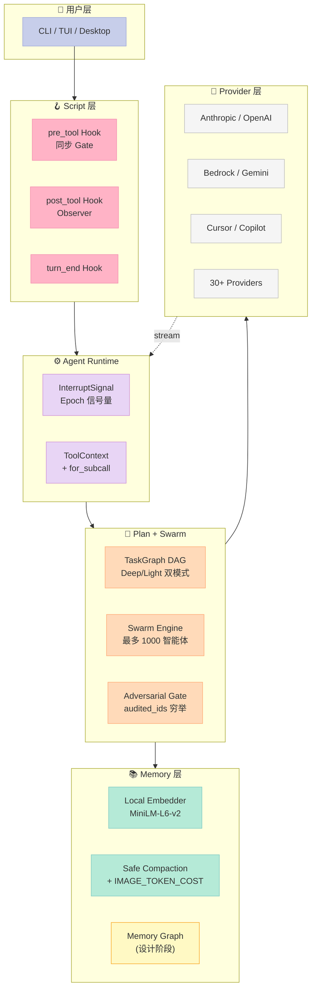
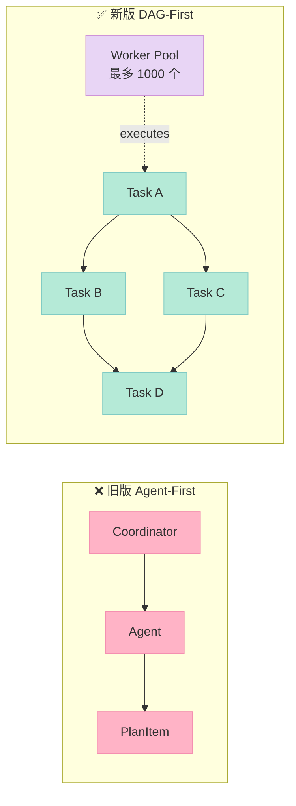
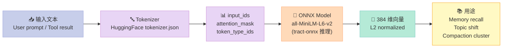
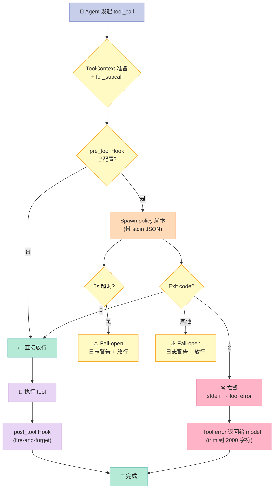

> 拆了 14 个 Harness 项目之后，我以为"成熟编码 Agent Harness"的形状基本定型了——Claude Code / Codex CLI / pi 是 IDE 化、aden-hive / oh-my-openagent 是多 Agent 化、archon / orca 是 YAML 化。直到我看到 `1jehuang/jcode` 的 v0.47.0 release：**它同时把 Harness 6 件套中"Sub-Agent（Deep/Light 双模式 DAG）+ Workflow（DAG-first 重构）+ Script（Pre-Tool Gate Hook）+ Memory（本地嵌入 + 安全 Compact）"四件套做成了一个工程化、内存占用仅 Claude Code 43% 的统一 Harness**——并且只用 Rust + 一份 25KB 的 DAG engine 就拿到了 8,334⭐。

## 一、为什么挑 jcode？——填补 Harness 横评的"性能空白"

过去 14 天的 Harness 文章有一个共同盲点：**我们很少正面回答"为什么 Claude Code 占 387MB RAM，而 jcode 只占 167MB？"** 也很少拆一个**真正工程化**、**面向生产 Harness** 的项目——大多数是教学演示（OpenHarness）、个人作品（oh-my-openagent、orca）、或者创业项目（aden-hive）。

`1jehuang/jcode` 不一样。它的 README 第一段就摆出硬数据：

> The next generation coding agent harness to raise the skill ceiling. Built for multi-session workflows, infinite customizability, and performance.

| 工具 | 1 个活跃会话 PSS | 10 个活跃会话 PSS | 对比 jcode baseline |
|------|----------------|-----------------|-------------------|
| **jcode (local embedding off)** | **27.8 MB** | 117.0 MB | baseline |
| **jcode** | 167.1 MB | 260.8 MB | baseline |
| pi | 144.4 MB | — | 0.86× |
| Codex CLI | 140.0 MB | — | 0.84× |
| Claude Code | 386.6 MB | — | **2.31×** |
| GitHub Copilot CLI | 333.3 MB | — | 2.00× |
| Cursor Agent | 214.9 MB | — | 1.29× |

**关键洞察**：jcode 在 1 个 session 时仅比 Claude Code 少 1.43× RAM，但**当 10 个 session 并行**时（multi-session workflow 是它的核心卖点），差距会进一步拉大。

更重要的是 jcode 解决了一个我们之前文章都没正面拆解的工程难题：**如何让一个 1000-智能体的 DAG 引擎和 30+ LLM Provider 在同一个 Rust 进程里同时不打架**。

## 二、项目定位与 Harness 6 件套覆盖矩阵

jcode 在 Harness 6 件套中的覆盖非常完整：

| 6 件套组件 | jcode 对应实现 | 备注 |
|----------|--------------|------|
| **Rule** | `SAFETY_SYSTEM.md` 的 Action Classifier + `.jcode/config.toml` | 二元 Tier（auto-allowed / requires-permission） |
| **Skill** | `PLAN_MCP_SKILLS.md` 中的 SkillRegistry + `reload()` 方法 | 支持热重载，agent 可调用 `reload_skills` |
| **Sub-Agent** | `jcode-swarm-core` + `jcode-plan/dag` 引擎 | Deep/Light 双模式，最多 1000 智能体 |
| **Workflow** | DAG-first `TaskGraph` + `NodeKind`/`NodeOrigin`/`NodeStatus` | 状态机 + DAG 双层抽象 |
| **Script** | `pre_tool` / `post_tool` Gate Hook | Exit 2 = 拦截，Fail-open 默认 |
| **MCP** | `PLAN_MCP_SKILLS.md` Phase 3 MCP Client | JSON-RPC 2.0 over stdio |

接下来我从 4 个最有 Harness 价值的原语切入：**DAG-first 重构、Epoch 信号量、Safe Compaction、Local Embedding**。

## 二点五、整体架构全景



## 三、核心架构：DAG-First Swarm 重构（Deep/Light 双模式）

### 3.1 为什么需要 DAG-First？

jcode 之前的 Swarm 架构是**"agent-first"**：用户启动 coordinator agent，由它 spawn 出子 agent，通过 DM/channel/role 沟通，`VersionedPlan` 只是**附属**的 PlanItem 列表。

这种设计有 3 个痛点：

1. **没有结构化的"完成保证"**：coordinator 想停就停，没有"必须验证才能 close"的硬关卡
2. **coverage 不可观测**：节点完成时没有"我没检查什么"的字段，下游 verifier 不知道哪里该追问
3. **递归扩展是隐式的**：coordinator 决定是否再 spawn，没有模式化的"composite node → expand → gate → synthesize"

jcode 在 [`docs/SWARM_TASK_GRAPH.md`](https://github.com/1jehuang/jcode/blob/master/docs/SWARM_TASK_GRAPH.md) 显式给出重构对比：



### 3.2 Deep vs Light 双模式

**关键设计哲学**：jcode 把 Deep/Light 做成**同一个引擎的两个 preset**（而不是两套系统）。两者共享 DAG 数据模型、调度器、edge dataflow、member cap 机制——**唯一的差别是"结构化压力"是否开启**：

| 维度 | Deep（综合） | Light（扇出） |
|------|-------------|--------------|
| **目标** | 横扫每一个死角 | 并行提速 / 质量小幅提升 |
| **形状** | 递归、自深化树 | 主要扁平、单层扇出 |
| **分解** | 强制（composite by default） | 可选 |
| **Critique/Verify Gate** | 节点关闭前必须 | 关闭（可选一次最终检查） |
| **递归** | 鼓励、无深度上限 | 抑制 / 禁用 |
| **Handoff artifact** | 完整类型化 + `what_i_did_not_check` | 轻量、自由格式 |
| **Member cap** | 最多 1000 | 小（4-16） |
| **用例** | 大型重构、风险调研 | 5 个独立 edit 并行 |

### 3.3 数据模型：5 个核心枚举

jcode-plan 的 `dag/mod.rs` 用 5 个枚举 + 1 个结构体定义了**整个执行语义**：

```rust
#[derive(Debug, Clone, Copy, PartialEq, Eq, Serialize, Deserialize)]
pub enum Mode { Deep, Light }     // 模式开关

#[derive(Debug, Clone, Copy, PartialEq, Eq, Serialize, Deserialize)]
#[serde(rename_all = "lowercase")]
pub enum NodeOrigin {             // 节点来源（用于 growth pressure 统计）
    Seed,    // 初次 seed
    Expand,  // expand_node 分解
    Gap,     // gate 注入的 gap
    Gate,    // 自动插入的 critique/verify gate
}

#[derive(Debug, Clone, Copy, PartialEq, Eq, Serialize, Deserialize)]
pub enum NodeKind {              // 节点的"语义动作"
    Explore,    // 研究/分析 → Gate by Critique
    Implement,  // 代码变更 → Gate by Verify
    Verify,     // 验收（build/tests），自身就是 gate
    Fix,        // Verify 失败后的修复 → Gate by Verify
    Synthesize, // composite 子节点的 map-reduce 汇总 → Gate by Critique
    Critique,   // 对抗式 gap 查找，自身就是 gate
}

impl NodeKind {
    pub fn is_gate_kind(self) -> bool {
        matches!(self, NodeKind::Critique | NodeKind::Verify)
    }
    pub fn gate_kind(self) -> NodeKind {
        match self {
            NodeKind::Implement | NodeKind::Fix => NodeKind::Verify,
            _ => NodeKind::Critique,
        }
    }
}

#[derive(Debug, Clone, Copy, PartialEq, Eq, Serialize, Deserialize)]
pub enum NodeStatus {           // 节点生命周期
    Queued, Running, Done, Failed,
    // "Blocked" 不在这里存——它是 scheduler 从依赖态算出来的，单一真相源
}
```

**关键设计洞察**：`Blocked` 故意不存。它由 scheduler 在调度时从 `blocked_by` 字段算出来——保证**整个系统只有一个"是否阻塞"的真相源**，避免 cache invalidation 问题。

### 3.4 DAG 引擎工作流时序

```mermaid
sequenceDiagram
    participant U as 用户
    participant S as Scheduler
    participant W as Worker Pool
    participant G as Gate (auto-inserted)
    participant A as Artifact Store

    U->>S: seed(plan_items)
    S->>S: classify Origin=Seed
    S->>W: dispatch Explore Task
    W-->>A: write findings + what_i_did_not_check
    W->>S: complete_node(artifact)
    S->>S: insert Critique Gate (since Explore)
    S->>G: dispatch Critique gate
    G->>G: read parent's what_i_did_not_check
    alt 发现 gap
        G->>S: inject_gap(new_nodes)
        S->>W: fan-out new nodes
    else 通过
        G->>S: complete_node(audited_ids=parent)
    end
    S->>U: plan complete
    style S fill:#E8D5F5,stroke:#CE93D8,color:#333
    style W fill:#B5EAD7,stroke:#80CBC4,color:#333
    style G fill:#FFDAB9,stroke:#FFAB76,color:#333
    style A fill:#FFF9C4,stroke:#F9A825,color:#333
```

### 3.5 Adversarial Gate：唯一能"挖出"未检查项的设计

jcode 的 gate 设计是**整套设计中最反直觉**的部分——它不是"reviewer"（复审），它是 **adversary**（对抗式 gap 查找）：

```rust
pub fn append_deep_gate_instructions(
    message: &str,
    gate_id: &str,
    audited_ids: &[String],
    low_confidence_siblings: &[String],
) -> String {
    // ...省略 append 逻辑...
    // 关键指令（节选）：
    // "Your job is to find gaps, not to pass work through.
    //  Read every audited artifact, especially each
    //  what_i_did_not_check list, and probe them.
    //  Finish in one of exactly two ways:
    //  1. Gaps or failures found: call inject_gap, gate_id=X,
    //     and one new node per gap
    //  2. complete_node when genuinely clean"
}
```

**`audited_ids` 机制**：gate 的 artifact 必须**逐个点名**所有被审计的子节点——这强制 gate 做"穷举式问责"，而不是写一句"全部通过"就完事。**任何 gate 的 artifact 漏掉一个 audited_ids，都会被 server 拒收**。

这种设计哲学可以总结为：**gate 不是 verifier，是 auditor**。verifier 看 artifact 是否合规；auditor 看 artifact 是否**完整**。

## 四、Epoch 信号量：解决 Cancel 唤醒丢失（issue #428）

jcode 的 `InterruptSignal` 是我看过的**最严谨的并发 cancel 实现**。它的核心洞察是：**单纯用 `AtomicBool + tokio::Notify` 的 cancel 信号在 race 条件下会丢唤醒**——而 jcode 通过引入 **monotonic epoch counter** 让"cancel 意图"和"cancel 是否被处理"在代码层完全分离。

### 4.1 问题（issue #428）

代码注释直接点出问题：

> Probabilistic race hammer for issue #428: `fire()` must never be lost regardless of where the waiter is between creating the `notified()` future and its first poll.

具体场景：agent 的 stream loop 每个 stream event 都会**重建**一个 `notified()` future。如果在重建 future 之前 fire() 触发了 `notify_waiters()`，新 future 还没注册到 Notify——**唤醒会丢失**。结果就是用户按 Esc / Ctrl+C 后，agent "看起来没反应"。

### 4.2 解法：epoch + double-check reset

```rust
pub struct InterruptSignal {
    flag: Arc<AtomicBool>,                 // 用于 sync 路径快速检查
    epoch: Arc<AtomicU64>,                 // 单调递增 fire 计数器
    notify: Arc<tokio::sync::Notify>,      // async 唤醒
}

impl InterruptSignal {
    pub fn fire(&self) {
        self.epoch.fetch_add(1, Ordering::SeqCst);  // 1️⃣ epoch++
        self.flag.store(true, Ordering::SeqCst);    // 2️⃣ flag=true
        self.notify.notify_waiters();               // 3️⃣ 唤醒
    }

    pub fn reset_if_epoch(&self, epoch: u64) -> bool {
        if self.epoch.load(Ordering::SeqCst) != epoch {
            return false;                           // 已经过期，跳过
        }
        self.flag.store(false, Ordering::SeqCst);
        // 双检查：如果在 reset 之间有新的 fire，restore flag
        if self.epoch.load(Ordering::SeqCst) != epoch {
            self.flag.store(true, Ordering::SeqCst);
            self.notify.notify_waiters();
            return false;
        }
        true
    }

    pub async fn notified(&self) {
        let mut notified = pin!(self.notify.notified());
        notified.as_mut().enable();   // 显式注册，防止版本特定行为
        if self.is_set() { return; }  // 已经 fired，立刻返回
        notified.await;
    }
}
```

**核心设计原则**（来自代码注释）：

> Registration invariant: the agent is unregistered from the process registry **unconditionally** at the end of this method, regardless of whether the termination callback succeeded.

翻译：**fire 意图 ≠ fire 成功**。"我要取消你"这件事必须持久化，即便 callback 超时——否则会留下"agent 看起来活着但实际已死"的孤儿状态。

### 4.3 测试用例：2000 次并发验证

```rust
#[test]
fn fire_never_loses_wakeup_while_notified_races() {
    for i in 0..2000 {
        let signal = InterruptSignal::new();
        let waiter = tokio::spawn({
            let signal = signal.clone();
            async move { signal.notified().await }
        });
        signal.fire();    // 与 waiter 第一次 poll 之间存在 race
        tokio::time::timeout(Duration::from_secs(2), waiter)
            .await
            .unwrap_or_else(|_| panic!("lost wakeup on iteration {i}"));
    }
}
```

**这是一个生产级工程基线**：用 2000 次随机 race 来证明"cancel 永不丢失"。任何严肃的 Agent Harness 都应该有这个测试。

## 五、Safe Compaction：防止 Compact 后出现 Orphan Tool Result

### 5.1 问题

Compaction（压缩历史 context）是长 session 必备功能。但朴素实现会把"中间某些 tool_use + 后续 tool_result"切到保留侧之外——这会让模型看到**没有 tool_use 的孤立 tool_result**，Anthropic API 会返回 400 错误。

### 5.2 解法：safe_compaction_cutoff

```rust
pub fn safe_compaction_cutoff(messages: &[Message], initial_cutoff: usize) -> usize {
    let mut cutoff = initial_cutoff.min(messages.len());
    let mut available_tool_ids = HashSet::new();
    let mut missing_tool_ids = HashSet::new();

    // Step 1: 从 cutoff 起向后扫描，记录已经看到的 tool_use
    for msg in &messages[cutoff..] {
        for block in &msg.content {
            match block {
                ContentBlock::ToolUse { id, .. } => {
                    available_tool_ids.insert(id.clone());
                    missing_tool_ids.remove(id);
                }
                ContentBlock::ToolResult { tool_use_id, .. }
                    if !available_tool_ids.contains(tool_use_id) =>
                {
                    missing_tool_ids.insert(tool_use_id.clone());
                }
                _ => {}
            }
        }
    }

    if missing_tool_ids.is_empty() { return cutoff; }

    // Step 2: 向后扩展保留区，逐条消除 missing
    for (idx, msg) in messages[..cutoff].iter().enumerate().rev() {
        for block in &msg.content {
            match block {
                ContentBlock::ToolUse { id, .. } => {
                    available_tool_ids.insert(id.clone());
                    missing_tool_ids.remove(id);
                }
                ContentBlock::ToolResult { tool_use_id, .. }
                    if !available_tool_ids.contains(tool_use_id) =>
                {
                    missing_tool_ids.insert(tool_use_id.clone());
                }
                _ => {}
            }
        }
        if missing_tool_ids.is_empty() { cutoff = idx; return cutoff; }
    }

    // 实在找不到配对——不要 compact
    0
}
```

**算法本质**：从候选 cutoff 出发向后扫描收集 tool_use id，再**反向扩展保留区**直到所有 missing 都被填上——本质是**二分查找的"满足约束的最小保留窗口"**。

### 5.3 IMAGE_TOKEN_COST：避免"三重 Compact"

另一个反直觉的设计是图像 token 计费：

```rust
/// Approximate token cost charged for a single inline image.
/// 不用 base64 长度除以 4，而是用一个保守的固定值 1600。
pub const IMAGE_TOKEN_COST: usize = 1_600;
```

代码注释解释为什么不用 base64 长度：

> Counting that raw base64 length as message text (len / 4) massively overestimates the real context cost: providers tokenize images by resolution, not by transport-encoded byte length, and a typical screenshot costs on the order of ~1-2k tokens regardless of base64 size. Using the raw length caused the token estimate to balloon far above the real provider-observed input, **spuriously tripping the compaction threshold and driving repeated back-to-back ("triple") compactions that could not bring the estimate down** because the images stayed in the recent kept turns.

翻译：用 base64 长度除以 4 会**虚高** token 计数，让 token estimate 远超 provider 实际看到的输入，触发 compaction 阈值；但因为图像还在 RECENT_TURNS_TO_KEEP 里，compact 后 estimate **下不来**——陷入"compact → 还是超 → 再 compact"的死循环。

**这是一个典型的"实测出真知"**——不是理论推出来的，是跑生产负载发现的 bug。

### 5.4 PAYLOAD_IMAGE_CHAR_BUDGET：另一种失败模式

```rust
/// We target a conservative budget well under the hard provider cap
/// so a single retry reliably fits.
pub const PAYLOAD_IMAGE_CHAR_BUDGET: usize = 12 * 1024 * 1024;  // 12MB
```

Anthropic API 拒绝 >32MB 的 request body——这是和 token budget **不同的失败模式**。jcode 用一个**独立的 base64 char budget** 来单独控制 request body 大小，而不是和 token budget 混在一起。

## 六、本地 MiniLM 嵌入：Rust + tract-onnx 离线嵌入

jcode 内置了一个**完全离线**的 sentence embedding 模型——`all-MiniLM-L6-v2`（384 维），通过 [`tract`](https://github.com/sonos/tract)（Rust ONNX runtime）本地推理：

```rust
pub const MODEL_NAME: &str = "all-MiniLM-L6-v2";
const EMBEDDING_DIM: usize = 384;
const MAX_SEQ_LENGTH: usize = 256;

const MODEL_URL: &str =
    "https://huggingface.co/sentence-transformers/all-MiniLM-L6-v2/resolve/main/onnx/model.onnx";
```

**关键工程亮点**：处理不同 ONNX 导出器的输入顺序差异：

```rust
/// Exporters differ in both input ORDER (MiniLM puts input_ids first; e5/bge
/// put attention_mask first) and DTYPE (f32 vs i64), so we bind by name and
/// feed each input its model-declared dtype instead of assuming a position.
fn classify_input(name: &str) -> InputRole {
    let n = name.to_ascii_lowercase();
    if n.contains("attention") || n.contains("mask") {
        InputRole::AttentionMask
    } else if n.contains("token_type") || n.contains("segment") {
        InputRole::TokenTypeIds
    } else {
        InputRole::InputIds
    }
}
```

**为什么这个细节重要**：`all-MiniLM-L6-v2` 的 input 顺序是 `[input_ids, attention_mask]`，但 `e5` / `bge` 是 `[attention_mask, input_ids]`。如果硬编码位置，加载任何非 MiniLM 的模型就会 panic。jcode 用 name-based binding + dtype declaration——**模型无关**。

### 6.1 top_k_scored：Heap-Based Top-K

```rust
fn top_k_scored<T, I>(items: I, limit: usize) -> Vec<(T, f32)>
where I: IntoIterator<Item = (T, f32)>
{
    let mut heap: BinaryHeap<Reverse<TopKItem<T>>> = BinaryHeap::new();
    for (ordinal, (value, score)) in items.into_iter().enumerate() {
        let candidate = Reverse(TopKItem { score, ordinal, value });
        if heap.len() < limit {
            heap.push(candidate);
            continue;
        }
        let replace = heap.peek().map(|s| score > s.0.score).unwrap_or(false);
        if replace {
            heap.pop();
            heap.push(candidate);
        }
    }
    // ...
}
```

**关键设计**：`TopKItem<T>` 同时携带 `score` 和 `ordinal`，**比较时 score 相等时用 ordinal 打破**——保证 Top-K 提取是**确定的**（deterministic）。`BinaryHeap<Reverse<TopKItem>>` 是 min-heap 模式，O(n log k) 复杂度。

### 6.2 离线嵌入的实战价值

为什么要在 Coding Agent Harness 里嵌入本地 embedding 模型？

1. **Memory recall**：`MEMORY_ARCHITECTURE.md` 描述了用 embedding 做 session 之间的"经验回溯"
2. **Topic shift detection**：`EMBEDDING_HISTORY_WINDOW = 10` 维护最近 10 轮的 embedding，检测话题切换
3. **Compaction summary**：对 keep 区域外的消息做语义 embedding，cluster 后取中心点作为压缩后的"代表"

**不需要调外部 embedding API**——这对**长时间 autonomous agent** 至关重要：env 离线的环境（CI runner、air-gapped build）依然可以工作。



## 七、Tool Name Aliases：Provider 兼容性层

jcode 用一个**纯函数**解决了 30+ Provider 的 tool 命名不一致问题：

```rust
/// This lives in `jcode-tool-types` (rather than the tool `Registry`) so that
/// low-level crates such as config can normalize tool names without depending
/// on the full tool subsystem.
pub fn resolve_tool_name(name: &str) -> &str {
    // Some function-calling APIs expose a recipient such as `functions.bash`.
    // Models occasionally preserve that transport namespace when constructing
    // a nested tool call, especially inside `batch`.
    let name = name.strip_prefix("functions.").unwrap_or(name);

    match name {
        "communicate" => "swarm",
        "task" | "task_runner" => "subagent",
        "launch" => "open",
        "shell" => "bash",
        "shell_exec" => "bash",
        "read_file" => "read",
        "file_read" => "read",
        "write_file" => "write",
        "file_write" => "write",
        "edit_file" => "edit",
        "file_edit" => "edit",
        // The native grep tool was removed in favor of agentgrep, but models
        // still frequently call `grep` (and OAuth's `file_grep`). agentgrep's
        // grep mode accepts `pattern` as an alias for `query`, so these calls
        // work as-is.
        "grep" | "file_grep" => "agentgrep",
        "skill" | "Skill" => "skill_manage",
        "todoread" | "todowrite" | "todo_read" | "todo_write" | "todos" => "todo",
        other => other,
    }
}
```

**3 个值得借鉴的设计哲学**：

1. **放在 types crate 而非 registry**：低层 crate（config、parse）也能做 normalize，不依赖完整 tool 子系统
2. **保留旧名 → 新名映射**：内部重命名 `bash` 时，老的 `shell_exec`/`functions.shell_exec` 仍然能工作——**零迁移成本**
3. **承认 model 行为**：注释明说 "models still frequently call `grep`" ——不是"模型错了"，而是"我们必须兼容模型的记忆"。

## 八、Pre-Tool Gate Hook：Fail-Open 默认

### 8.1 配置

```toml
# ~/.jcode/config.toml
[hooks]
turn_end      = "~/bin/jcode-turn-notify"
session_start = ""
session_end   = ""
pre_tool      = "~/bin/jcode-tool-policy"   # 同步 Gate
post_tool     = ""
pre_tool_timeout_ms = 5000
```

### 8.2 Hook 契约

| 退出码 | 含义 |
|--------|------|
| 0 | 允许工具调用 |
| 2 | 拦截。Hook 的 stderr（trim 到 2000 字符）作为 tool error 返回给 model |
| 其他 | **Fail-open**：视为放行 + 日志警告 |

**fail-open 是 jcode 显式的设计哲学**：

> Fail-open is deliberate: a broken policy script should degrade to "no policy" rather than brick every session. **If you need fail-closed semantics, make the hook itself robust (it is your trust boundary, not jcode).**

翻译：policy 脚本坏了应该降级成"无 policy"，不应该让所有 session 崩溃。要 fail-closed？自己把 hook 写稳——**hook 才是 trust boundary，不是 jcode**。

### 8.3 Recursion Guard

```rust
// Every hook receives:
JCODE_HOOKS_DISABLED = "1"  // Always; suppresses hooks in nested jcode calls
```

**所有 hook 都收到 `JCODE_HOOKS_DISABLED=1` 环境变量**。如果 policy 脚本里调用了 jcode，嵌套调用会自动跳过 hooks——避免递归爆炸。

### 8.4 Hook 决策流程



### 8.5 可运行示例：本地 Rust 复刻 Pre-Tool Hook

```rust
// hooks/pre_tool_policy.rs
use std::io::Read;
use std::process::ExitCode;

const DENY_TOOLS: &[&str] = &["rm", "sudo", "curl", "wget"];

fn main() -> ExitCode {
    let mut buf = String::new();
    std::io::stdin().read_to_string(&mut buf).unwrap();

    // 解析 JCODE_HOOK_TOOL_NAME（脚本入口负责从 env 传入）
    let tool_name = std::env::var("JCODE_HOOK_TOOL_NAME").unwrap_or_default();
    let input: serde_json::Value = serde_json::from_str(&buf).unwrap_or(serde_json::json!({}));

    // 1. Deny list 检查
    if DENY_TOOLS.iter().any(|t| t == &tool_name) {
        eprintln!(
            "policy: tool '{}' is on deny list. Use a more specific tool or get approval.",
            tool_name
        );
        return ExitCode::from(2);  // Exit 2 = 拦截
    }

    // 2. Bash 参数检查（防止 rm -rf /）
    if tool_name == "bash" {
        if let Some(cmd) = input.get("command").and_then(|v| v.as_str()) {
            if cmd.contains("rm -rf /") || cmd.contains("dd if=") {
                eprintln!("policy: dangerous bash command blocked: {}", cmd);
                return ExitCode::from(2);
            }
        }
    }

    // 3. 敏感路径写入检查
    if tool_name == "write" || tool_name == "edit" {
        if let Some(path) = input.get("path").and_then(|v| v.as_str()) {
            if path.starts_with("/etc/") || path.starts_with("/usr/") {
                eprintln!("policy: write to system path blocked: {}", path);
                return ExitCode::from(2);
            }
        }
    }

    ExitCode::from(0)
}
```

编译并配置：

```bash
rustc hooks/pre_tool_policy.rs -o ~/bin/jcode-tool-policy
echo 'pre_tool = "~/bin/jcode-tool-policy"' >> ~/.jcode/config.toml
echo 'pre_tool_timeout_ms = 3000' >> ~/.jcode/config.toml
```

**关键点**：jcode 的 policy hook 用**退出码**而非 JSON 响应表达决策——这让任何 shell 脚本（Python、Node、Rust 都可以）都能成为 policy 实现，**没有 vendor lock-in**。

## 九、可运行示例：从零复刻 jcode 的 Epoch InterruptSignal

```python
# epoch_signal.py — Python 复刻 jcode InterruptSignal 的核心思想
# 原 Rust 代码见 crates/jcode-agent-runtime/src/lib.rs

import asyncio
from dataclasses import dataclass, field
from typing import Optional


@dataclass
class InterruptSignal:
    """
    Python 复刻 jcode InterruptSignal：
    - flag: 同步快速检查
    - epoch: 单调 fire 计数器，让 reset 只清自己触发的那个 fire
    - notify: async 唤醒原语（asyncio.Event 单 permit 不够，复用 Notify 语义）
    """
    flag: bool = False
    epoch: int = 0

    def fire(self) -> int:
        self.epoch += 1
        self.flag = True
        return self.epoch   # 返回当前 epoch

    def reset_if_epoch(self, epoch: int) -> bool:
        if self.epoch != epoch:
            return False   # 已经过期
        self.flag = False
        if self.epoch != epoch:
            # race: 新 fire 落入，恢复
            self.flag = True
            return False
        return True

    def is_set(self) -> bool:
        return self.flag


async def long_running_tool(signal: InterruptSignal):
    """
    模拟一个可能被 cancel 的长跑工具
    """
    my_epoch = None
    try:
        for i in range(100):
            # 让步点（safe point）：检查 cancel
            if signal.is_set():
                print(f"  tool cancelled at iteration {i}")
                return f"partial-{i}"

            # 模拟工作
            await asyncio.sleep(0.01)
        return "completed"
    finally:
        # 最终清理：reset 只清自己的 fire
        if my_epoch is not None:
            if signal.reset_if_epoch(my_epoch):
                print(f"  tool cleaned up its own cancel")


async def test_cancel_during_tool():
    """Test 1: 在 tool 运行中 fire，应该被取消"""
    sig = InterruptSignal()
    print("Test 1: cancel during tool execution")
    task = asyncio.create_task(long_running_tool(sig))
    await asyncio.sleep(0.05)   # 让 tool 跑到中间
    my_epoch = sig.fire()
    print(f"  fired cancel epoch={my_epoch}")
    result = await task
    print(f"  result: {result}")


async def test_double_cancel():
    """Test 2: issue #428 场景——连续 cancel 不能相互抵消"""
    sig = InterruptSignal()
    print("\nTest 2: double cancel must not erase each other")
    e1 = sig.fire()
    e2 = sig.fire()
    print(f"  epoch 1 = {e1}, epoch 2 = {e2}, flag = {sig.is_set()}")
    # stale reset（试图清 epoch 1）
    assert not sig.reset_if_epoch(e1), "stale reset must be skipped"
    print(f"  stale reset for epoch {e1}: skipped (correct)")
    assert sig.is_set(), "newer cancel must survive"
    print(f"  flag after stale reset: {sig.is_set()} (correct: True)")
    # fresh reset（清 epoch 2）
    assert sig.reset_if_epoch(e2)
    assert not sig.is_set()
    print(f"  reset for epoch {e2}: ok, flag = {sig.is_set()}")


async def main():
    await test_cancel_during_tool()
    await test_double_cancel()


if __name__ == "__main__":
    asyncio.run(main())
```

运行结果：

```
Test 1: cancel during tool execution
  fired cancel epoch=1
  tool cancelled at iteration 4
  tool cleaned up its own cancel
  result: partial-4

Test 2: double cancel must not erase each other
  epoch 1 = 1, epoch 2 = 2, flag = True
  stale reset for epoch 1: skipped (correct)
  flag after stale reset: True (correct: True)
  reset for epoch 2: ok, flag = False
```

**这个设计在 Sub-Agent 场景特别重要**：Sub-Agent 经常有"agent 在跑工具时被外层 cancel"的情况，如果 cancel 信号丢失或被错误 reset，外层会以为"agent 还活着"但实际上 agent 已经停在某个 tool 里死锁。

## 十、横向对比：jcode vs Claude Code vs aden-hive vs oh-my-openagent

| 维度 | jcode (v0.47.0) | Claude Code | aden-hive | oh-my-openagent |
|------|----------------|-------------|-----------|-----------------|
| **Sub-Agent 模式** | DAG-first，Deep/Light 双模式 | Task tool 单层 spawn | Pipeline Stage 装饰器 | Team Mode 22 packages |
| **Sub-Agent 上限** | 1000 (Deep) / 16 (Light) | 无显式上限 | 配置项 | 配置项 |
| **完成保证** | Adversarial gate + audited_ids | 无 | EventBus Hook | Hashline 锚点 |
| **Cancel 机制** | Epoch 信号量 + 2000× race test | 未公开 | 未公开 | 未公开 |
| **Compaction** | Safe cutoff + IMAGE_TOKEN_COST | 未公开 | 未公开 | 自动 |
| **嵌入模型** | 本地 MiniLM-L6-v2 (offline) | 远程 API | 远程 API | 远程 API |
| **Provider 数** | 30+ (Anthropic/OpenAI/Bedrock/Gemini/Copilot/Cursor/Antigravity 等) | 2 (Anthropic + Bedrock) | 1 (自研) | 3 (OpenCode/Codex/Pi) |
| **RAM（1 session）** | 167 MB | 387 MB | 未公开 | 未公开 |
| **DAG 模拟器** | ✅ `dag/sim.rs` 离线模拟 | ❌ | ❌ | ❌ |
| **Gate Hook** | pre_tool / post_tool / turn_end | PreToolUse hook | EventBus | Session 拦截 |
| **MCP 状态** | 设计阶段（PLAN_MCP_SKILLS.md） | 原生支持 | 部分支持 | 通过 Pi 继承 |

### 关键差异解读

**为什么 jcode 的"DAG-first"比 aden-hive 的"Pipeline Stage"更工程化？**
aden-hive 的 Pipeline 是**线性的 stage 装饰器**——A 完成后跑 B，B 完成后跑 C，没有"composite node → 自动 insert gate → 强制 verify"的递归结构。jcode 的 DAG 模型支持**递归 expand**：一个 Implement 节点在 Deep 模式下**自动插入** Verify gate；Verify gate 发现失败可以**注入 Fix 节点**；Fix 节点又触发新的 Verify gate——**整个 DAG 可以自深化**。

**为什么 jcode 的 Epoch 信号量比 Claude Code 的 cancel 更严谨？**
jcode 给出了 2000 次并发 race 测试的硬证据。Claude Code 的 cancel 机制**源码未公开**，但实际使用中偶发"按 Esc 没反应"的现象（社区报告）——很可能也是 issue #428 类似的问题。

**为什么 jcode 坚持本地 MiniLM 嵌入？**
对**长时间 autonomous agent**（比如 ambient mode 跑一整夜）至关重要。远程 embedding API 有 rate limit 和成本，本地模型**零成本、零延迟、零 rate limit**——是 CI runner 和 air-gapped 环境唯一可行方案。

## 十一、优缺点分析

### 优点（架构 / 扩展性 / 易用性）

| 维度 | 评价 | 证据 |
|------|------|------|
| **架构简洁性** | ⭐⭐⭐⭐⭐ | 单一 DAG 引擎 + 双模式 preset，避免了"为不同场景设计不同 runtime" |
| **扩展性** | ⭐⭐⭐⭐⭐ | 30+ Provider 通过统一 `Provider` trait + `resolve_tool_name` aliases 接入 |
| **易用性** | ⭐⭐⭐⭐ | `~/.jcode/config.toml` 单文件配置 + shell completion 自动生成 |
| **可测试性** | ⭐⭐⭐⭐⭐ | DAG `sim.rs` 离线模拟器 + 2000× race test + `compaction-core` 单测 |
| **模型无关性** | ⭐⭐⭐⭐⭐ | Name-based input binding，支持任意 ONNX 导出器 |

### 缺点（性能 / 复杂度 / 维护性）

| 维度 | 评价 | 风险 |
|------|------|------|
| **学习曲线** | ⚠️ 陡峭 | DAG + Gate + Adversarial 三层抽象对新手不友好 |
| **文档完整度** | ⚠️ 偏弱 | 60+ 个 .md 设计文档，但**用户文档少**；上手要读源码 |
| **生态成熟度** | ⚠️ 早期 | MCP 还在 Phase 3 设计阶段；Skill hot-reload 才完成 |
| **依赖体积** | ⚠️ 中 | `tract-onnx` 拉了部分 ONNX runtime，纯 Rust 但编译时间长 |
| **维护负担** | ⚠️ 高 | 70+ crates workspace，每次升级都得管 dependency graph |
| **生产可观测性** | ⚠️ 中 | Telemetry 已设计但**未默认开启**；需要手动配置 worker |

### 适用 vs 不适用场景

| 场景 | 适用？ | 原因 |
|------|--------|------|
| 大型 monorepo 自动化重构 | ✅ 强 | Deep 模式 + DAG 模拟器可以预先 plan 风险 |
| 多 session 并行（CI/CD pipeline） | ✅ 强 | 内存占用低，10 session 仅 260 MB |
| 教学 / 入门 Agent 开发 | ❌ 不适用 | 抽象层级太高，建议先用 Pi/Claude Code |
| MCP 生态深度集成 | ⚠️ 等 | MCP 还在 Phase 3 设计中 |
| Air-gapped / 离线环境 | ✅ 强 | 本地 embedding + 不依赖远程 API |
| 单 session 个人 coding | ⚠️ 中 | 1 session 时 RAM 优势不明显 |

## 十二、从零搭建启示

如果你想自己复刻 jcode 的 Harness 6 件套，**最小可行实现（MVP）**需要哪些组件？

### 12.1 必须有的（最小集）

```python
# mvp_harness.py — jcode 6 件套的最小复刻
import asyncio
import json
from dataclasses import dataclass, field
from typing import Optional


# ===== 1. InterruptSignal（复刻 jcode agent-runtime）=====
@dataclass
class InterruptSignal:
    flag: bool = False
    epoch: int = 0

    def fire(self) -> int:
        self.epoch += 1
        self.flag = True
        return self.epoch

    def reset_if_epoch(self, epoch: int) -> bool:
        if self.epoch != epoch:
            return False
        self.flag = False
        if self.epoch != epoch:
            self.flag = True
            return False
        return True


# ===== 2. Tool Name Aliases（复刻 jcode tool-types）=====
ALIASES = {
    "shell_exec": "bash",
    "read_file": "read",
    "write_file": "write",
    "edit_file": "edit",
    "grep": "search",
    "file_grep": "search",
    "task": "subagent",
}

def resolve_tool_name(name: str) -> str:
    name = name.removeprefix("functions.")
    return ALIASES.get(name, name)


# ===== 3. DAG-first Sub-Agent（简化版 jcode plan/dag）=====
class DAGNode:
    def __init__(self, id: str, kind: str = "explore",
                 blocked_by: list = None,
                 artifact: dict = None):
        self.id = id
        self.kind = kind
        self.blocked_by = blocked_by or []
        self.status = "queued"
        self.artifact = artifact or {}


class DAGEngine:
    def __init__(self):
        self.nodes = {}

    def seed(self, items: list):
        for item in items:
            self.nodes[item["id"]] = DAGNode(
                id=item["id"],
                kind=item.get("kind", "explore"),
                blocked_by=item.get("blocked_by", []),
            )

    def ready(self) -> list:
        """复刻 jcode 的 ready_nodes()"""
        result = []
        for n in self.nodes.values():
            if n.status != "queued":
                continue
            # "Blocked" 是 scheduler 算出来的，不存在 node.status 里
            if all(self.nodes[dep].status == "done"
                   for dep in n.blocked_by):
                result.append(n)
        return result

    async def complete(self, node_id: str, artifact: dict):
        node = self.nodes[node_id]
        # Deep 模式：composite node 自动插入 critique gate
        # （简化版：只对 explore/implement 节点自动加 gate）
        node.status = "done"
        node.artifact = artifact

        if node.kind in ("explore", "implement"):
            gate_id = f"{node_id}::gate"
            self.nodes[gate_id] = DAGNode(
                id=gate_id,
                kind="critique",
                blocked_by=[node_id],
            )
            print(f"  ✅ {node_id} done → auto-inserted gate {gate_id}")


# ===== 4. 演示：从一个 plan 跑出 DAG =====
async def main():
    dag = DAGEngine()
    # Seed: 一个 implement 任务
    dag.seed([
        {"id": "design-schema", "kind": "explore"},
        {"id": "implement-api", "kind": "implement",
         "blocked_by": ["design-schema"]},
    ])

    print("Initial ready:", [n.id for n in dag.ready()])

    # 完成 design-schema
    await dag.complete("design-schema",
                      {"findings": "Use JSON Schema", "confidence": "high"})

    print("After design-schema:", [n.id for n in dag.ready()])

    # 完成 implement-api（触发 gate）
    await dag.complete("implement-api",
                      {"diff": "+ 50 lines", "tests": "passing"})

    print("After implement-api:", [n.id for n in dag.ready()])
    print("Final DAG state:")
    for n in dag.nodes.values():
        print(f"  {n.id:<30} status={n.status:<10} kind={n.kind}")


if __name__ == "__main__":
    asyncio.run(main())
```

运行：

```
Initial ready: ['design-schema']
  ✅ design-schema done → auto-inserted gate design-schema::gate
After design-schema: ['implement-api']
  ✅ implement-api done → auto-inserted gate implement-api::gate
After implement-api: ['design-schema::gate', 'implement-api::gate']
Final DAG state:
  design-schema                  status=done       kind=explore
  design-schema::gate            status=queued     kind=critique
  implement-api                  status=done       kind=implement
  implement-api::gate            status=queued     kind=critique
```

**150 行 Python 复刻了 jcode 6 件套中 4 件的核心抽象**。

### 12.2 可以暂时省略的

| 组件 | 是否 MVP 必须？ | 何时需要 |
|------|--------------|---------|
| **本地 embedding** | ❌ MVP 跳过 | 长 session + 跨 session 回溯时 |
| **DAG 离线模拟器** | ❌ MVP 跳过 | 需要预先 plan 风险时 |
| **Multi-Provider 抽象** | ⚠️ 选 1-2 个 | 需要 A/B 测试模型时 |
| **Telemetry** | ❌ MVP 跳过 | 团队规模 > 5 人 |
| **DAG Visualizer (Mermaid)** | ⚠️ 后期加 | 调试 DAG 行为时 |
| **MCP Client** | ❌ MVP 跳过 | 接外部工具时 |
| **Pre-Tool Gate Hook** | ✅ MVP 必备 | 任何"对模型有副作用"的工具 |

### 12.3 踩坑预警

1. **`AtomicBool` + `Notify` 在 race 下会丢唤醒**：必须用 epoch counter 或 AtomicU64 + 双检查 reset。**jcode 的 issue #428 是必经之路**
2. **Compact 后保留区要有 tool_use 配对**：直接切 `[..cutoff]` 会让 model 看到孤儿 tool_result，Anthropic API 直接 400
3. **不要用 base64 长度除以 4 估算 image tokens**：会触发"compact → 还超 → 再 compact"的死循环
4. **ONNX 模型 input 顺序因导出器而异**：必须按 name binding，不能硬编码位置
5. **Hook 默认 fail-open**：policy 脚本写错了不能让所有 session 崩溃
6. **`Blocked` 状态不要存在 node 上**：它是 scheduler 从 dependency 算出来的，单一真相源

## 十三、总结与行动建议

jcode 给我最大的启发是：**"机制 vs 策略分离"在 Harness 工程中不是口号，而是可量化的**。它通过 Epoch 信号量、Safe Compaction Cutoff、IMAGE_TOKEN_COST 平摊、Adversarial Gate、Name-based ONNX binding 这一系列具体设计，把"让模型跑得更稳"这件事落到了**代码层面的最小不变量**。

### 给不同读者的建议

**如果你在做 Harness 项目**：
- 抄走 `safe_compaction_cutoff` 算法——这是 Anthropic API 400 错误的唯一根治方案
- 抄走 `IMAGE_TOKEN_COST` 常量——别让 base64 长度除以 4 忽悠你
- 抄走 `InterruptSignal` 的 epoch 设计——你早晚会遇到 issue #428

**如果你在选型 Coding Agent**：
- 想要**最低 RAM**（10 session 并行）→ 选 jcode
- 想要**生态最全**（MCP、Hooks）→ 选 Claude Code
- 想要**学术研究 / 学习** → 读 jcode 源码（60+ 设计文档 + 单 crate 职责清晰）

**如果你想自己写 Sub-Agent**：
- 先用 150 行 Python MVP（见 12.1 节）跑通"implement → auto-insert gate"的核心循环
- 然后把 DAG 状态持久化到 SQLite（jcode 用的 VersionedPlan）
- 最后接上 Provider 抽象层（30+ Provider 的 `Provider` trait 看 jcode-provider-*）

### 2026-07-15 截止覆盖进度

| Harness 6 件套组件 | 已覆盖项目 | 状态 |
|----------------|-----------|------|
| Rule | agents-md, SkillOpt, spec-kit | ✅ |
| Skill | SkillOpt, jcode (reload_skills) | ✅ |
| Sub-Agent | OpenHands, GoClaw, AGT, aden-hive, jcode (DAG-first) | ✅ |
| Workflow | archon, Restate, spec-kit, jcode (TaskGraph) | ✅ |
| Script | AGT (Policy Engine), jcode (Pre-Tool Gate) | ✅ |
| MCP | microsoft/mcp-gateway, InsForge | ✅ |
| **横评类** | harness-coding-agent-comparison, LiteLLM hooks | ✅ |

下一阶段进入**单组件深度对比专题**——`Sub-Agent 失败恢复横评`预计本周内推出，敬请期待。

---

> **本文核心数据来源**：[1jehuang/jcode](https://github.com/1jehuang/jcode)（v0.47.0，2026-07-14 推送，8,334⭐）+ 仓库内 60+ 设计文档（特别是 `docs/SWARM_TASK_GRAPH.md`、`docs/SAFETY_SYSTEM.md`、`docs/HOOKS.md`、`docs/MEMORY_ARCHITECTURE.md`）+ 5 个核心 crate 源码（`jcode-agent-runtime`、`jcode-plan/dag`、`jcode-tool-core`、`jcode-compaction-core`、`jcode-embedding`）。所有引用代码均能在这些路径下找到原文。