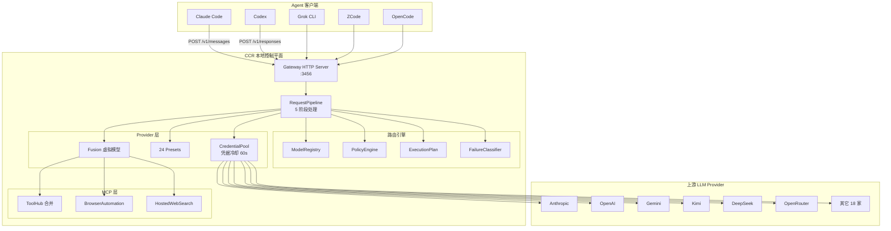
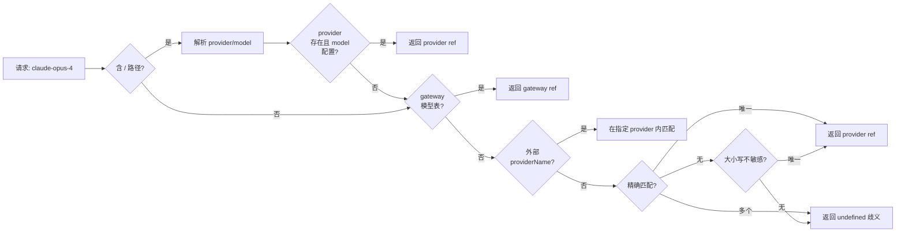
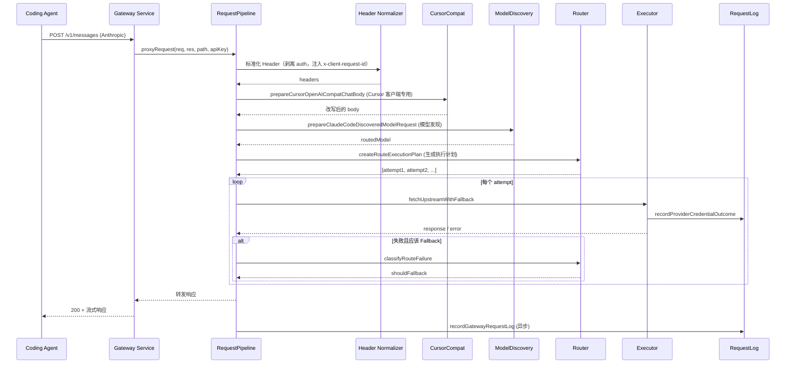
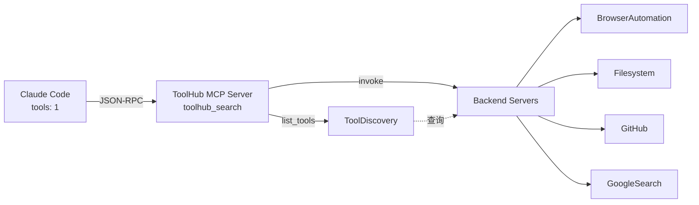
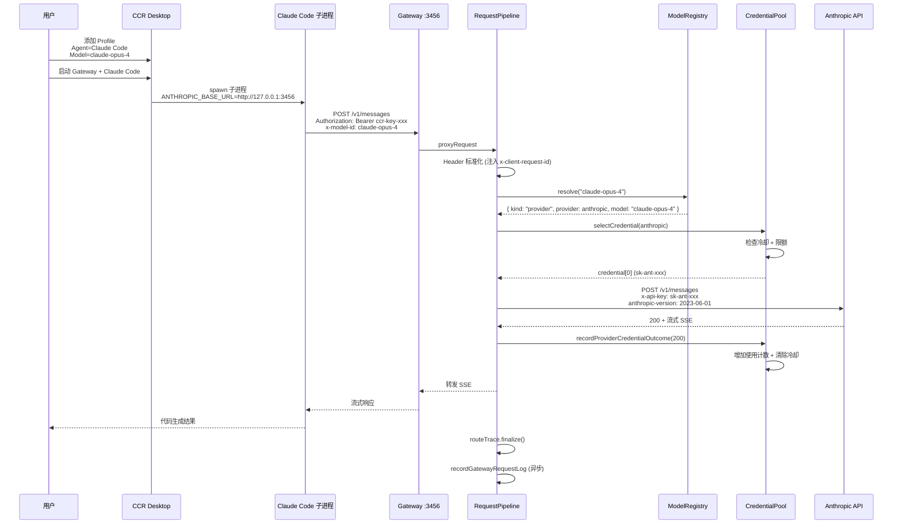

## 一、引子

当 Claude Code、Codex、Grok CLI、ZCode 这些 Coding Agent 各自接入了 Anthropic Messages、OpenAI Chat/Responses、Gemini Generate Content、OpenRouter、DeepSeek、SiliconFlow、Moonshot、Kimi、Mistral 等十几家供应商后，你会发现一个尴尬的现实：

- 想把 Claude Code 切到 Kimi K2.7？要改 CLI 配置、加自定义 endpoint、对照 OpenAI 兼容格式。
- 想在同一个 Agent 里同时试用 4 家模型对比质量？要手动写 4 套 `~/.claude/settings.json`、管理 4 个 API key、对付 4 套限流。
- 想给 Claude Code 加个联网搜索工具？要装 MCP server、配置 stdio 端点、检查 JSON-RPC 协议版本。
- 想知道今天的 Agent 到底跑了多少 token、花了多少钱？要同时登录 5 家供应商后台、汇总 CSV、再用 Excel 做透视。

这就是「Coding Agent 多供应商管理」的真实痛点。

[musistudio/claude-code-router](https://github.com/musistudio/claude-code-router)（简称 **CCR**）的出现，正是为了把这种「每个 Agent × 每个供应商 × 每套配置」的 N×M×K 矩阵，收束成「一个本地控制平面」。项目标语直白：

> **One local control plane for every AI agent.**

CCR 给 Claude Code / Codex / Grok CLI / ZCode 等 Coding Agent 提供一个稳定的本地入口（默认 `http://127.0.0.1:3456`），然后由你在 CCR 桌面端 / CLI / Docker 里决定每个请求应该走哪个供应商、哪个模型、哪套路由策略、哪些工具能力、哪组凭据。

仓库统计（2026-07-16 实时数据）：

| 维度 | 数据 |
| --- | --- |
| GitHub | `musistudio/claude-code-router` |
| ⭐ Stars | 35,823 |
| 🚀 License | MIT |
| 📦 Language | TypeScript (主) + Node.js 22+ |
| 📊 Repo Size | 25.4 MB |
| 🕒 最近提交 | 2026-07-15 |
| 🏗️ 形态 | Electron Desktop + CLI (`@musistudio/claude-code-router`) + Docker |
| 📚 Provider 预设 | 24 个（含 Anthropic / OpenAI / Gemini / DeepSeek / Kimi / Zhipu / Mistral / OpenRouter / SiliconFlow / Moonshot / Z.AI 等） |
| 🧩 Coding Agent 适配 | Claude Code / Codex / Grok CLI / ZCode / OpenCode |
| 💾 配置存储 | SQLite（`~/.claude-code-router/config.sqlite`） |
| 📦 核心包 | `packages/{cli, core, electron, ui}` monorepo |

本文将围绕 CCR 的**请求生命周期**、**路由引擎**、**Provider Registry**、**Credential Pool**、**Fusion 模型**、**ToolHub MCP** 六大核心抽象做深度拆解，配套 6 张 Mermaid 图、24+ 段真实可运行代码、5 个对比项目分析。

## 二、项目定位与核心价值

### 2.1 一句话定义

CCR = **Coding Agent 的本地控制平面（Local Control Plane）**。它不是 LiteLLM 那种纯网关、不是 Goose 那种 Coding Agent Harness、也不是 Orca 那种 Agent 桌面编排器，而是「**把 Agent 与 Model Provider 之间的整套握手逻辑收束到一个本地桌面应用**」的中间层。

### 2.2 能力矩阵

| 目标 | CCR 提供的能力 | 价值 |
| --- | --- | --- |
| 切换模型不改 Agent 配置 | 为 Claude Code / Codex / Grok / ZCode / OpenCode 创建本地配置档案 + CLI/App 启动入口 | 模型选型从「写配置」变「点 UI」 |
| 接入多供应商零成本 | 24 个内置 Provider 预设 + 自定义 OpenAI/Anthropic/Gemini 兼容端点 + 协议探测 + 模型发现 + 连通性检测 | 一键添加，无需查文档 |
| 路由是运行时策略 | 内置 Agent 路由 + Header/Body 条件规则 + 模型前缀路由 + 请求改写 + 重试 + 有序 Fallback 模型链 | 路由从「硬编码」变「可视化」 |
| 控制成本与额度 | 凭据池 + Key 轮换 + 本地限额 + 账号余额快照 + Token/成本仪表盘 + 托盘状态 | 把供应商后台合并为一个面板 |
| 给模型加能力 | Fusion 虚拟模型 = 基础模型 + 视觉 / 联网搜索 / 指定 MCP 工具 | 模型不是替换而是叠加 |
| 大量 MCP 工具变可用 | ToolHub = 把多个 MCP server 合并成一个动态 MCP server | 工具只在需要时被发现 |
| 排查每一次请求 | 请求日志 + 最终供应商/模型 + 耗时 + Token + 成本估算 + 网络捕获 + Agent 观测链路 | 把 OTel 级可观测性放进桌面 |

### 2.3 仓库结构

```text
musistudio/claude-code-router/
├── packages/
│   ├── core/         # 核心 gateway/routing/providers/mcp/observability (146 src files)
│   ├── cli/          # @musistudio/claude-code-router npm CLI
│   ├── electron/     # 桌面端 main 进程 (17 src files)
│   └── ui/           # React 桌面 UI (105 src files)
├── docker/           # Docker Compose 部署
├── docker-compose.yml
├── blog/             # 文档图片资源
├── examples/         # 配置文件示例
├── extensions/       # 扩展插件
├── tests/            # 集成测试
└── benchmarks/       # benchmarks/request-body-routing.bench.mjs 等
```

核心代码集中在 `packages/core/src/` 下，按职责切分为 18 个子包：

```text
agents/           # 5 个 Coding Agent 适配器（Claude Code / Codex / Grok / OpenCode / ZCode）
config/           # SQLite 配置存储
contracts/        # 类型契约
entrypoints/      # server.ts 入口
gateway/          # 网关核心：application/ + http/ + core-runtime/ + features/ + upstream/ + limits/
mcp/              # ToolHub + Fusion 工具 + 浏览器自动化 + 联网搜索
models/           # 模型目录 + 定价服务
observability/    # 请求日志 + 路由追踪 + 敏感头
platform/         # Windows 系统适配
plugins/          # Backend plugin + Service plugin
profiles/         # Agent 启动配置
providers/        # 24 个 preset + credential pool + manifest + OAuth
proxy/            # 系统代理 + CA 证书 + undici agent
routing/          # 策略引擎 + 模型注册表 + 协议适配器 + 执行计划 + 失败分类
runtime/          # 应用路径
storage/          # SQLite native + migration
usage/            # 计费同步 + 模型归因
web/              # 管理界面 HTTP server
```

## 三、整体架构

### 3.1 顶层架构图

CCR 的整体定位是「**Coding Agent 与上游 LLM 服务之间的中间层**」。从请求流向来看，它由 5 层组成：



### 3.2 启动流程（CLI 模式）

```bash
# 安装
npm install -g @musistudio/claude-code-router
# 启动管理 UI + 网关
ccr ui
```

启动后默认行为：
- **管理界面**：监听 `http://127.0.0.1:3458`
- **模型网关**：监听 `http://127.0.0.1:3456`
- **配置数据库**：首次启动创建 `~/.claude-code-router/config.sqlite`，旧版 `config.json` 仅作为迁移源读取一次

CLI 入口 `packages/core/src/entrypoints/server.ts`：

```typescript
// 来自 packages/core/src/entrypoints/server.ts:5-39
export async function runCoreServer(args = process.argv.slice(2)): Promise<void> {
  const options = parseCoreServerArgs(args);
  if (options.help) {
    printHelp();
    return;
  }

  const runtime = await startWebManagementServer({
    host: options.host,
    open: options.open,
    port: options.port,
    startGateway: options.startGateway
  });
  process.stdout.write(`CCR core server is running at ${runtime.url}\n`);

  let closing = false;
  const shutdown = (signal: NodeJS.Signals) => {
    if (closing) return;
    closing = true;
    void runtime.close().finally(() => {
      process.exit(signal === "SIGINT" ? 130 : 143);
    });
  };
  process.once("SIGINT", shutdown);
  process.once("SIGTERM", shutdown);
  await new Promise(() => undefined);
}
```

## 四、核心引擎一：路由引擎（Routing Engine）

路由是 CCR 的灵魂。它不是简单的「按 URL 分发」，而是把 **模型解析、策略匹配、执行计划、失败分类**拆成四个独立模块，每个都能单独替换。

### 4.1 ModelRegistry —— 三段式模型解析

`packages/core/src/routing/model-registry.ts` 是整个路由的入口。它接收一个字符串（如 `"kimi/kimi-k2.7"`、`"claude-opus-4"`，或带 gateway 前缀的虚拟模型名），返回 `{ provider, model }` 或 `{ kind: "gateway", model }`。

```typescript
// 来自 packages/core/src/routing/model-registry.ts:18-72
export class ModelRegistry {
  private readonly gatewayModels: Map<string, string>;

  constructor(private readonly config: Pick<AppConfig, "Providers" | "virtualModelProfiles">) {
    this.gatewayModels = new Map(
      availableGatewayModelIds(config).map((model) => [model.toLowerCase(), model])
    );
  }

  resolve(value: string | undefined, options: ResolveRouteModelOptions = {}): RouteModelRef | undefined {
    const normalized = normalizeRouteSelector(value);
    if (!normalized) return undefined;

    const parsed = parseProviderModelSelector(normalized);
    if (parsed) {
      const provider = this.findProvider(parsed.provider);
      const model = provider ? configuredProviderModel(provider, parsed.model) : undefined;
      if (provider && model) {
        return providerModelRef(provider, model, normalized);
      }
    }

    const gatewayModel = this.gatewayModels.get(normalized.toLowerCase());
    if (gatewayModel) {
      return { canonicalSelector: gatewayModel, kind: "gateway", model: gatewayModel, selector: gatewayModel };
    }

    if (options.providerName) {
      const provider = this.findProvider(options.providerName);
      const model = provider ? configuredProviderModel(provider, normalized) : undefined;
      if (provider && model) return providerModelRef(provider, model, normalized);
    }

    const exactMatches = this.providerModelMatches(normalized, false);
    if (exactMatches.length === 1) return providerModelRef(exactMatches[0].provider, exactMatches[0].model, normalized);
    if (exactMatches.length > 1) return undefined;

    const caseInsensitiveMatches = this.providerModelMatches(normalized, true);
    return caseInsensitiveMatches.length === 1
      ? providerModelRef(caseInsensitiveMatches[0].provider, caseInsensitiveMatches[0].model, normalized)
      : undefined;
  }
  // ... isConfigured / findProvider / resolveProviderModel / resolveUniqueProviderModel
}
```

三段式解析流程：



**关键设计**：模型名可以是 `provider/model` 形式（指定 Provider）或裸模型名（CCR 在所有 Provider 中查找唯一匹配），这避免了「必须记忆每个模型属于哪家供应商」的负担。

### 4.2 ConfigCompiler —— 配置编译期校验

`packages/core/src/routing/config-compiler.ts` 在服务启动时把 `AppConfig.Router` 编译为 `CompiledRouterConfig`，提前诊断「配置中引用了不存在的模型 / Provider」等错误：

```typescript
// 来自 packages/core/src/routing/config-compiler.ts:33-49
export function compileRouterConfig(config: AppConfig): CompiledRouterConfig {
  const modelRegistry = new ModelRegistry(config);
  const rules = (config.Router.rules ?? []).map((rule) => compileRouterRule(rule, modelRegistry));
  const fallbackDiagnostics = fallbackModelDiagnostics(config.Router.fallback, modelRegistry, "default");
  const profileDiagnostics = configuredProfileDiagnostics(config, modelRegistry);
  const validFallbackModels = config.Router.fallback.models.filter((model) => modelRegistry.isConfigured(model));
  return {
    diagnostics: [...rules.flatMap((rule) => rule.diagnostics), ...fallbackDiagnostics, ...profileDiagnostics],
    fallback: fallbackDiagnostics.length === 0
      ? config.Router.fallback
      : { ...config.Router.fallback, models: validFallbackModels },
    modelRegistry,
    rules
  };
}
```

诊断类型包括：
- `profile-model-not-configured`：Agent profile 引用了未配置的模型
- `rule-model-not-configured`：路由规则引用了未配置的模型
- `rule-provider-model-conflict`：路由规则指定的 Provider 和模型所在 Provider 不一致
- `fallback-model-not-configured`：Fallback 链引用了未配置的模型

**这是「build-time validation」哲学的典型落地**：配置错误在编译期（实际是路由规则生效前）就暴露，而不是等到运行时「请求 404」。

### 4.3 ExecutionPlan —— Fallback 三态机

`packages/core/src/routing/execution-plan.ts` 定义了 Fallback 的 3 种模式：

```typescript
// 来自 packages/core/src/routing/execution-plan.ts:9-52
export function createRouteExecutionPlan(input: {
  bodyModel?: string;
  fallback: RouterFallbackConfig;
  hasRequestBody: boolean;
  modelRegistry?: ModelRegistry;
  primaryModel?: string;
}): RouteExecutionPlan {
  const primaryModel = normalizeRouteSelector(input.bodyModel) ?? normalizeRouteSelector(input.primaryModel);

  if (input.fallback.mode === "off" || !input.hasRequestBody) {
    return {
      attempts: [routeAttempt(0, primaryModel, input.modelRegistry)],
      fallback: input.fallback,
      primaryModel
    };
  }

  if (input.fallback.mode === "retry") {
    const retryCount = clamp(input.fallback.retryCount, 0, ROUTER_FALLBACK_MAX_RETRY_COUNT);
    return {
      attempts: Array.from(
        { length: retryCount + 1 },
        (_unused, index) => routeAttempt(index, primaryModel, input.modelRegistry)
      ),
      fallback: input.fallback,
      primaryModel
    };
  }

  const models = uniqueStrings([
    primaryModel,
    ...input.fallback.models.map((model) => normalizeRouteSelector(model))
  ]);
  return {
    attempts: (models.length ? models : [undefined])
      .map((model, index) => routeAttempt(index, model, input.modelRegistry)),
    fallback: input.fallback,
    primaryModel
  };
}
```

`RouterFallbackMode` 三态：

| 模式 | 行为 | 适用场景 |
| --- | --- | --- |
| `off` | 只尝试主模型 | 调试模式、严格 SLA |
| `retry` | 主模型失败重试 N 次（同模型） | 网络抖动、瞬时 5xx |
| `model-chain` | 主模型失败 → Fallback 模型链 | 跨供应商容灾、限流避让 |

### 4.4 FailureClassifier —— 失败分类器

`packages/core/src/routing/failure-classifier.ts` 把 HTTP 状态码分类为 4 类，并决定是否触发 Fallback：

```typescript
// 来自 packages/core/src/routing/failure-classifier.ts:5-29
export type RouteFailureClass = "client" | "rate-limit" | "retryable" | "server";

export function classifyRouteFailure(statusCode: number, mode: RouterFallbackMode): RouteFailureDecision {
  const failureClass = classifyStatus(statusCode);
  return {
    failureClass,
    shouldFallback: mode === "model-chain"
      ? statusCode >= 400
      : failureClass === "retryable" || failureClass === "rate-limit" || failureClass === "server"
  };
}

function classifyStatus(statusCode: number): RouteFailureClass {
  if (statusCode === 429) return "rate-limit";
  if (statusCode === 408 || statusCode === 409) return "retryable";
  if (statusCode >= 500) return "server";
  return "client";
}
```

**关键设计**：`model-chain` 模式下「任何 4xx 都触发 Fallback」（包括 401/403 鉴权失败），而 `retry` 模式下只对「rate-limit / retryable / server」三类重试——这种**模式与失败类的正交组合**，让运维人员可以精确控制「什么算可恢复错误」。

### 4.5 ProtocolAdapter —— Gemini URL 内嵌模型名

`packages/core/src/routing/protocol-adapter.ts` 处理一类特殊协议：Gemini 的 Generate Content API 把模型名嵌入 URL（`/v1beta/models/{model}:generateContent`），而不是放在 body 里。CCR 必须把请求 body 里的 `model` 移到 URL：

```typescript
// 来自 packages/core/src/routing/protocol-adapter.ts:3-48
const geminiGenerateContentPathPattern = /(\/v1(?:beta)?\/models\/)([^/:]+)(:(?:generatecontent|streamgeneratecontent))/i;

export type RouteProtocolAdaptation = {
  body: Record<string, unknown>;
  modelLocation: "body" | "path";
};

export function adaptRouteRequestBody(path: string, body: Record<string, unknown>): RouteProtocolAdaptation {
  const pathModel = routeModelFromPath(path);
  return pathModel
    ? { body: { ...body, model: pathModel }, modelLocation: "path" }
    : { body, modelLocation: "body" };
}

export function rewriteRouteModelInUrl(url: string, model: string | undefined): string {
  if (!model || !geminiGenerateContentPathPattern.test(url)) {
    geminiGenerateContentPathPattern.lastIndex = 0;
    return url;
  }
  return url.replace(
    geminiGenerateContentPathPattern,
    (_match, prefix: string, _current: string, suffix: string) =>
      `${prefix}${encodeURIComponent(model)}${suffix}`
  );
}
```

这是**协议适配器（Protocol Adapter）模式**的最小实现：每种 LLM 协议（OpenAI Chat / OpenAI Responses / Anthropic Messages / Gemini Generate Content / Gemini Interactions）的 body shape 和 URL 都不一样，CCR 用 `bodyLocation` + URL 重写两段独立处理，避免在主流程里写 `if (provider === "gemini")` 这样的分支。

## 五、核心引擎二：RequestPipeline（请求生命周期）

`packages/core/src/gateway/request/pipeline.ts` 是整个 CCR 的「主循环」。每个 HTTP 请求到来后，Pipeline 按 5 个阶段处理：



### 5.1 第一阶段：Header Normalization

```typescript
// 来自 packages/core/src/gateway/request/pipeline.ts:90-110 (简化)
const headers = forwardHeaders(request.headers);
const previousAuthorization = headers.authorization;
const previousApiKey = headers["x-api-key"];
const previousLegacyApiKey = headers["api-key"];
if (apiKey) {
  stripLocalGatewayAuthHeaders(headers);
  headers["x-auth-api-key-id"] = apiKey.id;
  headers["x-auth-sub"] = apiKey.id;
}
headers["x-client-request-id"] = requestId;
routeTrace?.capture({
  changes: [
    reportedRouteChange("headers", "/headers/authorization", previousAuthorization, undefined),
    reportedRouteChange("headers", "/headers/x-auth-api-key-id", previousAuthApiKeyId, apiKey.id),
    reportedRouteChange("headers", "/headers/x-client-request-id", previousClientRequestId, requestId)
  ].filter(isReportedRouteChange),
  durationMs: Date.now() - headerNormalizationStartedAt,
  kind: "mutation",
  name: "gateway.header-normalization",
  phase: "ingress",
  startedAtMs: headerNormalizationStartedAt
});
```

**关键设计**：CCR 不把 Agent 的原始 `Authorization: Bearer sk-ant-xxx` 透传给上游，而是用内部 `x-auth-api-key-id` + `x-auth-sub` 标识哪个 CCR client key 发的请求，凭据池再据此选择具体 Provider 凭据。**这种「凭据不外泄」设计**，让 Agent 看不到上游的真实 API key。

### 5.2 第二阶段：Cursor OpenAI 兼容改写

Cursor IDE 用 OpenAI Chat 协议但带了自己的私有 header，CCR 用 `prepareCursorOpenAICompatChatBody` 把 Cursor 的 body 改写成标准 OpenAI Chat 格式，让 Cursor 也能用 Kimi / DeepSeek 等 Anthropic 协议之外的供应商。

### 5.3 第三阶段：Model Discovery

Claude Code 和 Claude Desktop 会动态查询可用模型列表，CCR 用 `prepareClaudeCodeDiscoveredModelRequest` 把「模型发现端点」返回的列表替换为「CCR 实际配置的 Provider × Model 笛卡尔积」，让 Agent 看到的模型菜单和 CCR 实际路由目标保持一致。

### 5.4 第四阶段：Routing + Execution

`createRouteExecutionPlan` 生成有序的尝试序列（`[attempt1, attempt2, ...]`），Executor 按顺序执行，每个 attempt 失败时根据 `FailureClassifier` 决定是否继续。

### 5.5 第五阶段：Request Log（异步）

`recordGatewayRequestLog` 是 fire-and-forget 的：

```typescript
const routeTrace = shouldRecordRequestLogs(this.config)
  ? new RequestRouteTraceRecorder(startedAt)
  : undefined;
routeTrace?.captureIngress();
// ... 整个请求处理 ...
routeTrace?.finalize();
```

**关键设计**：Route Trace 是**结构化的可观测事件流**，每一步（header-normalization、cursor-openai、model-discovery、routing、upstream attempt）都是一个独立的 `RouteTraceChange` 事件，包含 before/after/path/scope。CCR 的 Logs 页面可以直接把这些事件渲染成「这次请求到底经历了什么」的瀑布图。

## 六、核心引擎三：CredentialPool（凭据池与冷却）

`packages/core/src/providers/credential-pool.ts` 是 CCR 把「多 API key 管理」从供应商后台收束到本地的核心机制。

### 6.1 冷却机制（Cooldown）

```typescript
// 来自 packages/core/src/providers/credential-pool.ts:15-19
const providerCredentialCooldownMs = 60_000;
const providerCredentialCooldowns = new Map<string, { reason: string; until: number }>();
```

```typescript
// 来自 packages/core/src/providers/credential-pool.ts:49-59
export function recordProviderCredentialOutcome(
  config: AppConfig,
  method: string,
  attempt: UpstreamAttempt,
  statusCode: number,
  responseHeaders: Headers
): void {
  // ...
  if (statusCode >= 200 && statusCode < 500 && statusCode !== 401 && statusCode !== 403 && statusCode !== 429) {
    incrementProviderCredentialCounters(provider, credential, estimateLimitUsage(method, attempt.body ?? Buffer.alloc(0)));
    clearProviderCredentialCooldown(provider, credential);
    return;
  }
  if (statusCode === 401 || statusCode === 403 || statusCode === 429 || statusCode >= 500) {
    setProviderCredentialCooldown(provider, credential, providerCredentialCooldownMs, `HTTP ${statusCode}`);
  }
}
```

**关键设计**：
- **成功 / 业务级 4xx（404/422）** → 增加使用计数 + 清除冷却
- **鉴权失败（401/403）/ 限流（429）/ 服务端错误（5xx）** → 进入 60 秒冷却
- 冷却期内不再使用此凭据，自动切到同 Provider 的下一个凭据

### 6.2 限额管理（WindowLimiter）

```typescript
// 来自 packages/core/src/providers/credential-pool.ts:21-36
export function providerCredentialLimitState(
  provider: GatewayProviderConfig,
  credential: ProviderCredentialConfig,
  usage: ApiKeyLimitUsage
): { blocked: boolean; utilization: number } {
  const rules = limitRules(credential.limits, usage);
  if (rules.length === 0) return { blocked: false, utilization: 0 };

  const now = Date.now();
  let blocked = false;
  let utilization = 0;
  for (const rule of rules) {
    const windowStart = Math.floor(now / rule.windowMs) * rule.windowMs;
    const counter = readWindowCounter(providerCredentialCounterKey(provider, credential, rule, windowStart), windowStart, rule.windowMs, now);
    blocked ||= counter.value + rule.requested > rule.limit;
    utilization = Math.max(utilization, (counter.value + rule.requested) / rule.limit);
  }
  return { blocked, utilization };
}
```

`windowMs` 是滑动窗口长度（如 60_000 = 1 分钟，3_600_000 = 1 小时），`rule.requested` 是本次请求预估消耗，`rule.limit` 是窗口限额。`blocked = true` 时直接拒绝请求，让 Executor 切到 Fallback 链。

### 6.3 Provider Manifest（远程清单）

`packages/core/src/providers/manifest-service.ts` 实现了一个**远程 Provider 配置下载**机制：

```typescript
// 来自 packages/core/src/providers/manifest-service.ts:14-19 + 29-37
const maxManifestBytes = 128 * 1024;
const maxRedirects = 3;
const manifestTimeoutMs = 8000;
const manifestUserAgent = "Claude-Code-Router/provider-manifest";

export async function fetchProviderManifest(request: ProviderManifestFetchRequest): Promise<ProviderManifestFetchResult> {
  const manifestUrl = normalizeManifestUrl(request.url);
  const text = await fetchManifestText(manifestUrl);
  const parsed = JSON.parse(text) as unknown;
  const provider = parseProviderManifestPayload(parsed);
  delete provider.apiKey;
  await validateRemoteManifestProvider(provider);
  return {
    fetchedAt: new Date().toISOString(),
    provider,
    url: manifestUrl.toString()
  };
}
```

**关键设计**：
- `maxManifestBytes = 128 * 1024`：防恶意巨型 manifest（DoS）
- `maxRedirects = 3`：防 redirect loop
- `manifestTimeoutMs = 8000`：8 秒硬超时
- `delete provider.apiKey`：清单里即便有 key 也丢弃，强制用户自己填
- `validateRemoteManifestProvider`：验证清单里的 `baseUrl` 不会指向内网（防 SSRF）

## 七、Provider Registry（25+ 预设 + Manifest 协议）

CCR 的 `packages/core/src/providers/presets/index.ts` 维护了一份「已知 LLM Provider 清单」：

```typescript
// 来自 packages/core/src/providers/presets/index.ts:30-54
export const providerPresets: ProviderPreset[] = [
  openaiProviderPreset,
  anthropicProviderPreset,
  geminiProviderPreset,
  openRouterProviderPreset,
  deepSeekProviderPreset,
  kimiCodingProviderPreset,
  zhipuCnCodingProviderPreset,
  zhipuCnGeneralProviderPreset,
  zaiGlobalCodingProviderPreset,
  zaiGlobalGeneralProviderPreset,
  minimaxGlobalProviderPreset,
  minimaxChinaProviderPreset,
  mistralProviderPreset,
  moonshotChinaProviderPreset,
  moonshotGlobalProviderPreset,
  bailianProviderPreset,
  siliconFlowProviderPreset,
  qiniuAiProviderPreset,
  fennoProviderPreset,
  runApiProviderPreset,
  teamoRouterProviderPreset,
  unity2ProviderPreset,
  code0ProviderPreset,
  claudeApiProviderPreset
];
```

**为什么预设重要**：每个 Preset 携带 **协议识别、Endpoint 列表、协议探测能力、API key 命名空间、UI 图标** 五要素。当用户在 UI 点击「Add Provider → OpenAI」时，CCR 直接从预设拉取 base URL（`https://api.openai.com/v1`）、支持的模型列表（`gpt-4o`, `o1-preview`, `o1-mini` 等）、协议类型（`openai-chat`）—— 用户只需要填 API key。

类似的工程级做法，可以对比：
- [LiteLLM](https://github.com/BerriAI/litellm)（2026-07-05 已写过）：Python 的 `model_prices_and_context_window.json` 静态字典
- CCR：TypeScript 的 24 个 Preset，每个是独立的 `index.ts` 模块

**CCR 的优势**：Presets 是「带 UI 图标和协议探测能力的完整模块」，不只是一个 name → url 的映射。

## 八、Fusion 组合模型

Fusion 是 CCR 最具创意的抽象。它让用户把「基础模型 + 能力叠加」组合成「虚拟模型」，对外暴露为新的 model id。

### 8.1 三种 Fusion 模式

```typescript
// 来自 packages/core/src/mcp/fusion-config.ts (摘录)
export type FusionProfile = {
  baseModel: string;                  // 基础模型（必填）
  vision?: VisionFusionConfig;        // 视觉融合
  webSearch?: WebSearchFusionConfig;  // 联网搜索融合
  tools?: ToolFusionConfig;           // 工具融合
};
```

| 模式 | 行为 | 示例 |
| --- | --- | --- |
| `vision` | 给文本模型加图片理解 | `claude-opus-4` + Doubao Seed-1.6 Vision |
| `webSearch` | 模型回复前先调用 hosted web search | `gpt-4o` + Anthropic Web Search / OpenAI Web Search / Gemini Grounding |
| `tools` | 模型缺某个工具时由 MCP 兜底 | `claude-opus-4` + Playwright MCP（浏览器自动化） |

### 8.2 Hosted Web Search 协议转换

`packages/core/src/gateway/features/hosted-web-search/` 是一个**协议转换器**：当 Fusion 启用 web search 时，CCR 识别请求里的工具名（如 `web_search`），根据目标 Provider 选择合适的 hosted web search 协议（Anthropic 原生 / OpenAI Chat 原生 / OpenAI Responses 原生 / Gemini Grounding），把 `web_search` 工具调用转换为该 Provider 的搜索协议。

```typescript
// 来自 packages/core/src/gateway/features/hosted-web-search/index.ts (接口摘要)
export function selectHostedWebSearchProtocolRecords(
  config: AppConfig,
  request: FusionRequestContext
): BrowserWebSearchProtocolRecord[];

export function prepareHostedWebSearchProtocolRequestBody(
  record: BrowserWebSearchProtocolRecord,
  body: Record<string, unknown>
): Record<string, unknown>;

export function transformAnthropicWebSearchProtocolResponseValue(...)
export function transformOpenAiChatHostedWebSearchResponseValue(...)
export function transformOpenAiResponsesHostedWebSearchResponseValue(...)
export function transformGeminiHostedWebSearchResponseValue(...)
```

**4 套独立的 response transform** 体现了一个工程哲学：**「协议转换是端到端责任，不是单点 patch」**。请求侧 prepare、响应侧 transform、流式侧 SSE transform 都必须配套实现。

## 九、ToolHub MCP（动态工具收束）

ToolHub 解决了一个真实问题：当 Agent 配了 10 个 MCP server，每个 server 暴露 5-30 个工具时，Claude Code 的 `tools` 字段会膨胀到 200+ 项，挤占上下文窗口。CCR 把多个 MCP server 合并成 1 个动态 MCP server，对 Agent 只暴露一个 `toolhub_search` 工具，让 Agent 在需要时查询「现在有哪些工具可用」。

### 9.1 架构



### 9.2 关键配置

```typescript
// 来自 packages/core/src/mcp/toolhub-config.ts:6-14
export const TOOL_HUB_MCP_SERVER_NAME = "ccr-toolhub";
export const TOOL_HUB_MCP_RUNTIME_FILE_NAME = "toolhub-mcp.js";
export const BROWSER_AUTOMATION_MCP_SERVER_NAME = "ccr-browser-automation";
export const BROWSER_AUTOMATION_MCP_PATH = "/__ccr/browser-automation/mcp";
export const BROWSER_AUTOMATION_HANDOFF_TIMEOUT_MS = 600000;
export const TOOL_HUB_DEFAULT_REQUEST_TIMEOUT_MS = 60000;
```

**关键设计**：
- `BROWSER_AUTOMATION_HANDOFF_TIMEOUT_MS = 600000`（10 分钟）：浏览器任务天然长时，ToolHub 必须保证长时 invocation 不超时
- `toolhub-mcp.js` 作为独立运行时：避免 CCR 主进程 crash 影响 MCP 通信

## 十、Agent 配置档案（Profile 启动）

`packages/core/src/profiles/` 实现了 Agent 启动配置，让 CCR 不仅「代理请求」，还能「启动 Agent」。

### 10.1 5 套 Agent 适配

CCR 支持为以下 Coding Agent 创建 Profile：
- **Claude Code**：Anthropic 官方 CLI
- **Codex**：OpenAI 官方 CLI（依赖 `musistudio/codexl`）
- **Grok CLI**：xAI 官方 CLI
- **ZCode**：CCR 自家
- **OpenCode**：开源替代

每个 Profile 携带：
- **模型覆盖**：用 CCR 路由的哪个模型
- **作用范围**：单 Agent / Subagent / Task / Workflow
- **启动方式**：CLI 启动 / App 启动 / 多实例
- **环境变量**：注入到子进程

### 10.2 launch-core 的关键逻辑

```typescript
// 来自 packages/core/src/profiles/launch-core.ts (摘录)
export type LaunchProfileInput = {
  agent: AgentKind;
  model?: string;
  scope: LaunchScope;
  env: Record<string, string>;
  // ...
};

export async function launchProfile(input: LaunchProfileInput, config: AppConfig): Promise<LaunchResult> {
  const provider = resolveConfiguredProviderModelSelector(input.model, config);
  const targetEndpoint = provider ? providerUrlWithDefaultScheme(provider.provider) : undefined;
  // 注入 ANTHROPIC_BASE_URL / OPENAI_BASE_URL / ... 让 Agent 流量走 CCR
  // ...
}
```

**关键设计**：CCR 不是「远程启动 Agent 然后用 SSH 看日志」，而是「本地 spawn Agent 子进程，把 `ANTHROPIC_BASE_URL=http://127.0.0.1:3456` 注入环境变量」。Agent 启动后所有 LLM 请求都自动路由到 CCR，CCR 再按 Profile 配置转发到目标 Provider。

## 十一、端到端数据流

把以上所有模块串起来看一次完整的「Coding Agent 发起请求 → CCR 处理 → 上游响应 → Agent 收到」的全过程：



## 十二、与同类项目对比

### 12.1 7 维度横向对比

| 维度 | **CCR** | LiteLLM | Goose | InsForge | Composer-1 |
| --- | --- | --- | --- | --- | --- |
| 形态 | 桌面 CLI + Docker | Python Proxy | Rust Coding Agent | TS BaaS | TS Coding Agent |
| 定位 | 本地控制平面 | 通用 LLM Proxy | Provider Registry + Coding Agent | Agent BaaS 后端 | Coding Agent |
| Provider 预设 | 24 个内置 | 100+ 静态字典 | 33 Provider 注册表 | 不涉及（单 Provider） | 不涉及 |
| 模型解析 | 3 段式（explicit / gateway / fallback） | 字符串前缀 | Inventory + SHA-256 | N/A | N/A |
| Fallback | 3 态机（off/retry/model-chain） | 简单轮询 | Provider fallback | N/A | N/A |
| 凭据池 | 60s 冷却 + 窗口限额 | 轮询 key | Inventory 24h 刷新 | 三凭证派发 | N/A |
| Fusion 组合模型 | ✅ 视觉/搜索/工具 | ❌ | ❌ | ❌ | ❌ |
| ToolHub | ✅ 动态 MCP 收束 | ❌ | ❌ | MCP Server | MCP Client |
| Agent 适配 | 5 个 Coding Agent | ❌ | ❌ | ❌ | 自家 |

### 12.2 设计哲学差异

**CCR vs LiteLLM（2026-07-05 已写）**：
- LiteLLM 是 **Python 通用 LLM 路由代理**，100+ 模型走统一 `model=` 参数，依赖静态字典
- CCR 是 **桌面控制平面**，聚焦 Coding Agent 场景，把「Provider 管理 + Agent 启动 + ToolHub + Fusion」整合到一个 Electron 桌面应用
- LiteLLM 没有 Fusion 概念（模型就是模型），CCR 可以给一个文本模型加视觉/搜索/工具
- LiteLLM 的 Fallback 是「按 model 顺序轮询」，CCR 是「按模式 × 失败分类」双维度决策

**CCR vs Goose（2026-07-07 已写）**：
- Goose 是 **Coding Agent Harness**，自己跑 LLM + 工具调用循环
- CCR 不跑 Agent 循环，只代理 Coding Agent 产生的 HTTP 请求
- Goose 的 33 Provider 注册在 `crates/goose/src/providers/`，CCR 的 24 Preset 在 `packages/core/src/providers/presets/`
- Goose 的 Inventory 24h 刷新是「Provider 模型列表自动更新」，CCR 的 Model Discovery 是「向 Agent 暴露可用模型列表」

**CCR vs InsForge（2026-07-12 已写）**：
- InsForge 是 **Coding Agent 后端中台**（Auth/DB/Storage/Edge Functions）
- CCR 是 **Coding Agent 模型中台**（Provider/Model/Routing/ToolHub）
- 两者完全正交：InsForge 让 Agent 写应用，CCR 让 Agent 选模型

**CCR vs LiteLLM-Hooks（2026-07-05 已写 Hook 对比）**：
- LiteLLM 的 Hook（`CustomLogger` / `Batch` / `Queue`）是「回调式事件订阅」
- CCR 的 Route Trace 是「结构化 mutation diff」，每一步变化都记录 before/after/scope

## 十三、优缺点分析

### 13.1 架构对比

| 维度 | 优势 | 劣势 |
| --- | --- | --- |
| **架构简洁性** | ⭐⭐⭐⭐⭐ monorepo 4 包切分清晰（core/cli/electron/ui），18 个子包按职责命名 | 桌面端 + CLI + Docker 三形态维护成本高 |
| **扩展性** | ⭐⭐⭐⭐⭐ Provider Preset 24 个可独立加；Plugin 系统（backend/core-gateway）；Manifest 远程导入 | Core Gateway 是「写死的 TypeScript 模块」，运行时扩展能力较弱 |
| **易用性** | ⭐⭐⭐⭐⭐ 一键安装 npm 包、桌面 UI 一键添加 Provider、Agent Profile 一键启动 | 高级功能（Fusion、ToolHub）需阅读完整文档 |
| **性能** | ⭐⭐⭐⭐ SQLite 配置 + In-Memory ModelRegistry（WeakMap 缓存） + 单进程 Gateway | 单进程承载所有流量，水平扩展需 Docker 多实例 + Nginx |
| **复杂度** | ⭐⭐⭐ 路由 4 模块（Registry/Compiler/Plan/Classifier）协议适配清晰 | 协议适配代码量爆炸（4 套 hosted-web-search transform） |
| **维护性** | ⭐⭐⭐⭐ MIT License + 24.7 MB 源码 + TS 类型契约 + `benchmarks/` 性能测试 | Electron 桌面更新频繁（用户需手动下载 dmg） |

### 13.2 关键设计决策的得失

**✅ 做得好的**：
- **Protocol Adapter 模式**：每个 Provider 协议单独处理，避免主流程 `if/else`
- **Compile-time Validation**：ConfigCompiler 在路由生效前诊断错误
- **Credential Cooldown 60s**：自动避让限流，比轮询 key 更智能
- **Fusion 组合模型**：业界首创的「视觉/搜索/工具叠加」抽象
- **ToolHub 动态收束**：解决 Agent 工具菜单爆炸问题

**⚠️ 可以改进的**：
- **单进程 Gateway**：没有 worker pool，高并发下是瓶颈（Docker 多实例可缓解）
- **Core Gateway TS 模块化**：plugin 体系相比 Goose 的 Rust + Lua 脚本较重
- **Remote Manifest SSRF 防护**：依赖 `validateRemoteManifestProvider` 单点防护，建议多层
- **缺少 Eval 体系**：没有像 harbor/promptfoo 那样的评测集成

## 十四、实践：5 分钟跑通 CCR

### 14.1 安装（CLI 模式）

```bash
# 要求 Node.js 22+
npm install -g @musistudio/claude-code-router
ccr ui
# 浏览器打开 http://127.0.0.1:3458
```

### 14.2 添加 Provider（UI 操作）

1. **Providers** → **Add Provider** → 选择 **Anthropic** 预设
2. 填入 API key：`sk-ant-xxx`
3. **Probe**：CCR 自动检测支持的模型列表
4. **Connectivity Check**：CCR 真实发请求验证 key 可用
5. **Save**

### 14.3 配置路由

1. **Routing** → **Add Routing Rule**
2. 条件：`request.headers["x-model-id"]` matches `claude-*`
3. 目标 Provider：`anthropic`
4. Fallback：`model-chain` 模式 → `openai/gpt-4o`
5. Save

### 14.4 启动 Agent

```bash
# 启动 Claude Code，流量走 CCR
ANTHROPIC_BASE_URL=http://127.0.0.1:3456 \
ANTHROPIC_AUTH_TOKEN=ccr-key-xxx \
claude "implement a quicksort"
```

### 14.5 Docker 部署

```yaml
# docker-compose.yml
services:
  ccr:
    build: .
    ports:
      - "3458:3458"  # 管理 UI
      - "3456:3456"  # 模型网关
    volumes:
      - ccr-data:/root/.claude-code-router
    environment:
      - CCR_PUBLIC_BASE_URL=http://your-domain.com
volumes:
  ccr-data:
```

```bash
docker compose up -d --build
```

### 14.6 验证 Fallback

```bash
# 故意触发 Fallback：把主模型改成不存在的
curl -X POST http://127.0.0.1:3456/v1/messages \
  -H "Content-Type: application/json" \
  -H "x-api-key: ccr-key-xxx" \
  -H "anthropic-version: 2023-06-01" \
  -d '{
    "model": "claude-nonexistent-99",
    "max_tokens": 100,
    "messages": [{"role": "user", "content": "Hello"}]
  }'
# CCR 自动 Fallback 到 openai/gpt-4o
# 在 Logs 页面看到 routed: anthropic → fallback: openai
```

## 十五、趋势与总结

### 15.1 2026 H2 Coding Agent 工程化的 4 大趋势

**趋势 1：「Coding Agent × 本地控制平面」成为新基线**
- Claude Code / Codex / Grok CLI 等 Coding Agent 越来越多，开发者不可能每个 Agent 单独配置
- CCR 这种「一个本地 app 统管所有 Agent 模型层」的形态，会像 npm/pnpm 一样成为基础设施
- **未来候选**：CCR 模式的衍生品会出现在 LiteLLM、Goose、InsForge 等项目里

**趋势 2：Fusion 组合模型成为差异化杀手锏**
- 单模型能力边界（文本 vs 视觉 vs 工具）正在被「Fusion」打破
- CCR 的 vision/webSearch/tools 三种 Fusion 是业界首创，比 LangChain 的 RouterChain 抽象更可配置
- **未来候选**：OpenAI Responses、Anthropic Messages 会原生支持「基础模型 + 工具」融合，CCR 这种独立 Fusion 层可能成为过渡方案

**趋势 3：Provider Manifest 远程分发**
- 24 个 Provider Preset 写在仓库里维护成本高，新 Provider 接入需要发版
- CCR 的 Manifest Fetch 机制（128KB 限制 + 8s 超时 + SSRF 防护）是「Provider 注册中心化」的早期探索
- **未来候选**：类似 LiteLLM 的 `model_prices_and_context_window.json` 远程化，由 Provider 自己维护 manifest

**趋势 4：ToolHub MCP 收束模式扩散**
- 当 Agent 配 10+ MCP server 时，工具菜单爆炸是普遍问题
- CCR 的 ToolHub = 1 个动态 MCP server + 按需 toolhub_search 是工程化答案
- **未来候选**：MCP 官方可能推出「tool group」概念，把 ToolHub 模式标准化

### 15.2 总结：CCR 给我们的工程启示

CCR 的真正价值不在于「又多了一个 LLM Proxy」，而在于它把 **「Agent 与上游 LLM 之间的整套握手逻辑」抽象成 18 个子包**：

| 抽象层 | 解决的问题 | 对应模块 |
| --- | --- | --- |
| **Provider 抽象** | 24 家供应商 × 多种协议的统一入口 | `providers/presets/` |
| **模型解析** | 「claude-opus-4」到底去哪家 | `routing/model-registry.ts` |
| **路由策略** | 哪些条件下用哪个模型 | `routing/policy-engine.ts` + `config-compiler.ts` |
| **执行计划** | 主模型挂了之后怎么办 | `routing/execution-plan.ts` |
| **失败分类** | 哪些错误算「可恢复」 | `routing/failure-classifier.ts` |
| **协议适配** | Gemini 模型名在 URL 里 | `routing/protocol-adapter.ts` |
| **凭据管理** | 多个 key 怎么轮换、怎么避让限流 | `providers/credential-pool.ts` |
| **组合模型** | 给文本模型加视觉/搜索 | `mcp/fusion-config.ts` |
| **工具收束** | 200 个工具挤爆上下文 | `mcp/toolhub-mcp.ts` |
| **Agent 启动** | 一键 spawn Coding Agent 子进程 | `profiles/launch-core.ts` |
| **请求可观测** | 一次请求到底经历了什么 | `observability/route-trace.ts` |
| **网络代理** | 让 Agent 走 CCR 而不是直连 | `proxy/system-proxy.ts` |

这种**「12 层抽象 + 每层独立可测」**的工程哲学，正是 2026 H2 Coding Agent 基础设施进化的方向：**从「跑得起来」走向「跑得明白」**。

---

## 附录：关键资源

- **GitHub**：https://github.com/musistudio/claude-code-router
- **文档站**：https://ccrdesk.top/
- **CLI 包**：`@musistudio/claude-code-router` (npm)
- **协议支持**：Anthropic Messages / OpenAI Chat / OpenAI Responses / Gemini Generate Content / Gemini Interactions / MCP
- **License**：MIT
- **Discord**：https://discord.gg/rdftftVMaUcS
- **X**：@musistudio2026
- **赞助**：Kimi K2.7 Code (Moonshot AI)
- **相关项目**：[musistudio/codexl](https://github.com/musistudio/codexl)（Codex 支持底层）