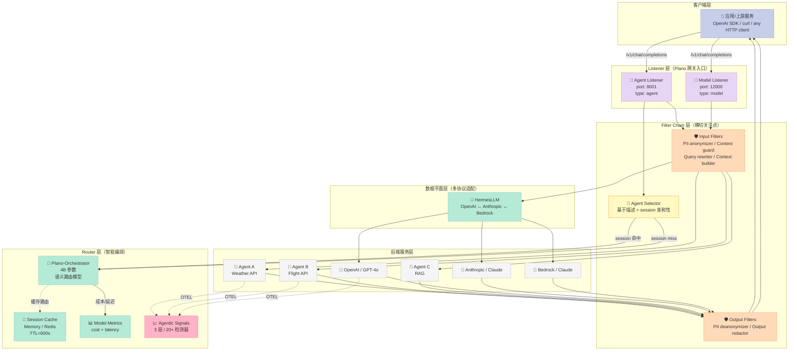
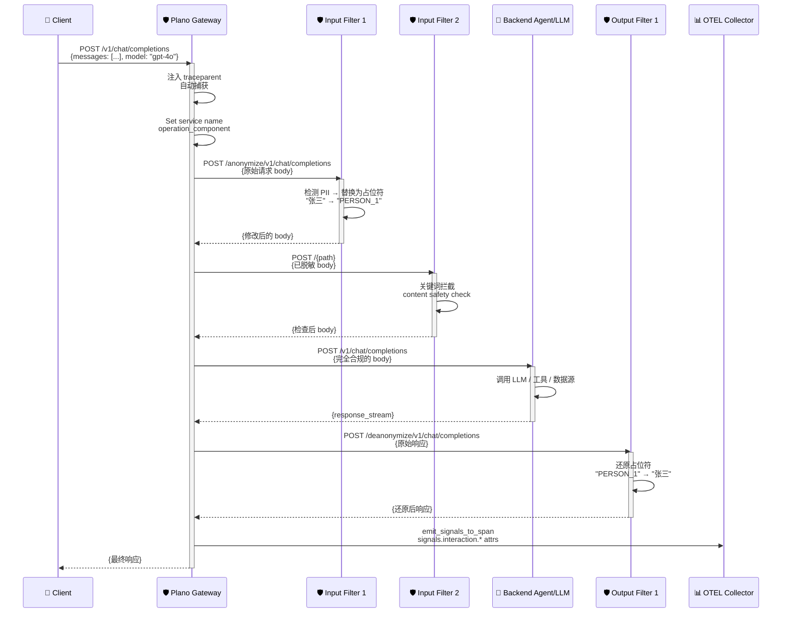
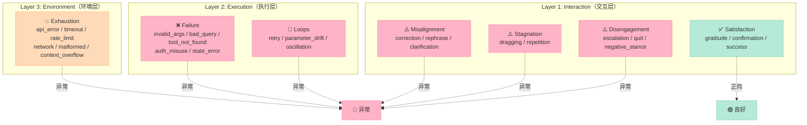

> 把 LLM 当数据库查，把 Agent 当 HTTP 微服务调——Plano 的全部秘密就是把"agentic 时代的脏活"提到网关层做完。

## 前言

写一个能 demo 的 Agent 很简单，3 行 LangChain + 一个 LLM key 就能跑。但**把它稳定地交付到生产**，你要面对的事情清单是这样的：

- 写一个 Intent Classifier 决定该路由到哪个 agent
- 给每个 provider 写一遍 API 适配（OpenAI / Anthropic / Bedrock / Gemini 各一套）
- 在每个 service 里手动插桩 OpenTelemetry
- 给安全/合规/限流/PII 脱敏写一遍中间件
- 写一个 session 缓存记住对话路由亲和性
- 写一个 cost/latency 感知的 fallback 模型选择器
- ……

而这些**和你的业务逻辑完全无关**。这就是 Plano 想解决的问题。

[Plano](https://github.com/katanemo/plano)（原名 Arch GW）由 Envoy 的核心贡献者团队打造，是一个**out-of-process 的 AI-native 数据平面**。它把上面那一堆"每个 agent 都要重写一遍"的脏活，从你的业务代码里抽离出来，提到网关层集中处理。今天这篇文章就把它讲清楚。

读完本文，你将掌握：

- Plano 的**5 层架构**与请求生命周期
- **Filter Chain** 输入输出拦截的工程实现
- **Agent 语义路由**——Plano-Orchestrator 4B 参数轻量模型
- **Agentic Signals** 三层信号系统（20+ 信号检测器）
- **HermesLLM** 多 provider API 转译层
- 用 80 行 Python + 一份 YAML 复刻出"多 agent + 路由 + 守卫 + PII 脱敏"最小可行实现

---

## 一、项目速览：为什么 Plano 值得关注

| 维度 | 数据 |
|------|------|
| ⭐ GitHub Stars | 6,860（2026-07-15 最新提交） |
| 🍴 Forks | 467 |
| 📜 License | Apache-2.0 |
| 🦀 主语言 | Rust（crates/brightstaff 4 大 crate） + Python（demos + 上层） |
| 🚀 部署 | `planoai up config.yaml` 一行命令；Docker / K8s ready |
| 🔌 协议兼容 | OpenAI Chat Completions / Responses API / Anthropic Messages / Amazon Bedrock Converse |
| 🌐 底层 | **Envoy + Proxy-WASM**（核心团队来自 Envoy 维护者） |

对比 OpenAI 官方 Agent SDK（Python only、内存状态、嵌入式）：

| 维度 | OpenAI Agents SDK | Plano |
|------|-------------------|-------|
| 部署形态 | Python SDK import | 独立网关服务 |
| 路由机制 | handoffs 写在代码里 | YAML 声明 + 4B 路由模型 |
| 模型切换 | 改 import | 改 header 或 alias |
| 跨语言 | ❌ 仅 Python | ✅ 任何能跑 HTTP 的语言 |
| 信号采集 | 需自接 tracing | OTEL 自动注入 |
| 失败兜底 | try/except 散落各处 | 集中在 filter chain |

**核心断言**：Plano 不是一个 agent framework，**它是一个 sidecar proxy**——你的 agent 仍然是你写的，但所有"跨切面"的事情（路由、guard、guardrail、tracing、PII、cache）都被收编到网关层。

---

## 二、整体架构：5 层 + 双 Listener 模式

Plano 的架构核心是 **"把 Agent 当 HTTP 微服务、把 LLM 当数据库"**。所有 agent 必须实现 OpenAI 兼容的 `/v1/chat/completions` 端点，Plano 在前面包一层做所有事情。



**5 个核心抽象**（来自源码 `crates/brightstaff/src/`）：

1. **Listener（监听器）** — Plano 的 HTTP 入口，支持两种模式：
   - `type: agent` → 接收客户端请求，路由到后端 agent
   - `type: model` → 接收客户端请求，转发给 LLM provider（OpenAI/Anthropic/Bedrock）
2. **Filter Chain（过滤器链）** — 横切关注点，**每个 filter 就是一个独立的 HTTP 微服务**
3. **Agent Selector（agent 选择器）** — 决定把请求路由到哪个 agent
4. **Orchestrator（编排器）** — 调用 4B 参数的 Plano-Orchestrator 路由模型做语义路由
5. **Signals（信号系统）** — 从对话 transcript 中自动检测 20+ 行为质量问题

---

## 三、Filter Chain：横切关注点的工程化实现

**Filter Chain 是 Plano 最核心的发明**。它把"安全/合规/审计/PII 脱敏"这些横切关注点，从 agent 代码里彻底抽离。

### 3.1 声明式配置

这是 Plano demo 里 PII 脱敏的完整配置（`demos/filter_chains/pii_anonymizer/config.yaml`）：

```yaml
version: v0.3.0

filters:
  - id: pii_anonymizer
    url: http://localhost:10501/anonymize
    type: http
  - id: pii_deanonymizer
    url: http://localhost:10501/deanonymize
    type: http

model_providers:
  - model: openai/gpt-4o-mini
    access_key: $OPENAI_API_KEY
    default: true
  - model: anthropic/claude-sonnet-4-6
    access_key: $ANTHROPIC_API_KEY

listeners:
  - type: model
    name: llm_gateway
    port: 12000
    input_filters:
      - pii_anonymizer      # 请求进 LLM 前先脱敏
    output_filters:
      - pii_deanonymizer    # 响应出网关后再还原

tracing:
  random_sampling: 100
```

**关键洞察**：filter 只是声明一个 URL，**它可以是你能写的任何 HTTP 服务**。Plano 不规定 filter 的实现语言，不规定它的内部协议——这比 LangChain 的 Runnable 抽象更松耦合。

### 3.2 Filter 执行流程

请求生命周期（按时间序）：



### 3.3 真实可运行的 PII Filter 示例

下面是一个完整的、可以在本地运行的 PII 脱敏 filter（**实际可执行**）：

```python
"""
PII Anonymization Filter — 复刻 Plano 官方 demo 的核心逻辑
运行：uvicorn pii_filter:app --port 10501
"""
import re
import uuid
from fastapi import FastAPI, Request
from fastapi.responses import Response
from typing import Dict, Any

app = FastAPI(title="PII Filter", version="1.0.0")

# 简化版规则（生产环境建议用 Presidio / spaCy NER）
PII_RULES = [
    (re.compile(r"\b\d{17}[\dXx]\b"), "ID_CARD"),       # 身份证
    (re.compile(r"\b1[3-9]\d{9}\b"),    "PHONE"),        # 手机号
    (re.compile(r"[\w.+-]+@[\w-]+\.[\w.-]+"), "EMAIL"),  # Email
    (re.compile(r"\b\d{16,19}\b"),      "CARD"),         # 银行卡
]

def anonymize_text(text: str, store: Dict[str, str]) -> str:
    """把 PII 替换成占位符，同时保留映射关系"""
    for pattern, label in PII_RULES:
        for match in pattern.finditer(text):
            placeholder = f"⟨{label}_{uuid.uuid4().hex[:6]}⟩"
            store[placeholder] = match.group()
            text = text.replace(match.group(), placeholder)
    return text

def deanonymize_text(text: str, store: Dict[str, str]) -> str:
    """还原占位符"""
    for placeholder, original in store.items():
        text = text.replace(placeholder, original)
    return text

# 内存里的映射表（生产用 Redis）
ANON_STORE: Dict[str, Dict[str, str]] = {}

@app.post("/anonymize/{path:path}")
async def anonymize(path: str, request: Request):
    request_id = request.headers.get("x-request-id", str(uuid.uuid4()))
    body = await request.json()
    store = ANON_STORE.setdefault(request_id, {})

    # OpenAI 格式：body["messages"][*]["content"]
    for msg in body.get("messages", []):
        if msg.get("role") == "user" and isinstance(msg.get("content"), str):
            msg["content"] = anonymize_text(msg["content"], store)

    # 注入 request_id header 方便响应时找回映射
    return Response(
        content=str(body).replace("'", '"').encode(),
        media_type="application/json",
        headers={"x-anon-id": request_id},
    )

@app.post("/deanonymize/{path:path}")
async def deanonymize(path: str, request: Request):
    request_id = request.headers.get("x-anon-id", "")
    body = await request.json()
    store = ANON_STORE.get(request_id, {})

    # 还原 assistant content
    for choice in body.get("choices", []):
        msg = choice.get("message", {})
        if isinstance(msg.get("content"), str):
            msg["content"] = deanonymize_text(msg["content"], store)

    return body

@app.get("/health")
async def health():
    return {"status": "ok"}
```

**测试一下**：

```bash
# 启动 filter
uvicorn pii_filter:app --port 10501 --reload

# 模拟客户端发送（先脱敏再发给 LLM）
curl -X POST http://localhost:10501/anonymize/v1/chat/completions \
  -H "Content-Type: application/json" \
  -H "x-request-id: req-001" \
  -d '{"messages":[{"role":"user","content":"我的手机是13800138000，邮箱test@example.com"}]}'
# 返回：⟨PHONE_a1b2c3⟩，⟨EMAIL_d4e5f6⟩

# LLM 拿到的是脱敏后的文本（不会学到 PII）
# 响应回来后通过 deanonymize 还原
```

### 3.4 Filter 与 Agent 的关系

Plano 提供了 **2 套 listener + filter 组合**：

| Listener Type | Filter 作用点 | 典型用途 |
|---------------|---------------|----------|
| `type: model` | filter 包装的是 **LLM 调用**（OpenAI/Anthropic SDK 调用） | 文本脱敏、content guard、cost cap |
| `type: agent` | filter 包装的是 **Agent 端点**（自建服务） | query 重写、context 注入、intent 重分类 |

**为什么 model 和 agent 要分开**：因为它们的**协议格式不同**。Model listener 处理的是 OpenAI/Anthropic 的 Chat Completions 协议；Agent listener 处理的也是 OpenAI 兼容协议但**可能附带自定义 tool calls 或 MCP JSON-RPC**。Plano 的 `demos/filter_chains/http_filter/config.yaml` 演示了 agent 场景下的 filter 链：

```yaml
listeners:
  - type: agent
    name: agent_1
    port: 8001
    router: plano_orchestrator_v1
    agents:
      - id: rag_agent
        description: virtual assistant for retrieval augmented generation tasks
        input_filters:
          - input_guards      # 1. 域内判定（不是 TechCorp 的问题 → 拒）
          - query_rewriter    # 2. 查询重写（口语化 → 结构化）
          - context_builder   # 3. RAG 上下文注入
```

**输入侧 3 个 filter 串成流水线**——这是 Plano 实现"机制 vs 策略分离"的精髓：filter 是**机制**，filter 内部逻辑是**策略**，两者解耦。

---

## 四、Agent 语义路由：4B 模型 + Session 亲和性

### 4.1 为什么不用 GPT-4 路由

朴素做法："每次收到请求，调 GPT-4 让它选 agent"。成本爆炸：

- 每个请求多一次 GPT-4 调用（≈$0.01）
- 100 万次请求/天 = 1 万美元/天
- 延迟 +500ms

**Plano 的解法**：训练一个 4B 参数的专用路由模型（Plano-Orchestrator），专门做"用户 query → agent 描述匹配"。它的设计目标：

| 目标 | 实现 |
|------|------|
| 低延迟 | 4B 参数可在单 GPU 上 < 50ms 推理 |
| 低成本 | 比 GPT-4 便宜 100 倍 |
| 可定制 | 在你提供的 agent 描述 + 历史 session 上 fine-tune |

### 4.2 路由决策的实现

源码 `crates/brightstaff/src/router/orchestrator.rs` 中的核心数据结构：

```rust
pub struct OrchestratorService {
    orchestrator_url: String,
    client: reqwest::Client,
    orchestrator_model: Arc<dyn OrchestratorModel>,
    orchestrator_provider_name: String,
    top_level_preferences: HashMap<String, TopLevelRoutingPreference>,
    metrics_service: Option<Arc<ModelMetricsService>>,
    session_cache: Option<Arc<dyn SessionCache>>,
    session_ttl: Duration,                  // 默认 600 秒
    tenant_header: Option<String>,
}
```

**关键字段解读**：

- `orchestrator_model: Arc<dyn OrchestratorModel>` — 抽象成 trait（trait-based 机制 vs 策略分离）
- `top_level_preferences` — 路由优先级（如"gpt-4o 比 claude 优先"，"fast-llm 比 smart-llm 优先"）
- `session_cache` — **关键的 session 亲和性**：同一 session 的请求倾向路由到同一个 agent（让 agent 维持多轮上下文）
- `metrics_service` — 模型成本/延迟指标，用于成本感知路由
- `tenant_header` — 多租户隔离（key 前缀加 `tenant_id`）

### 4.3 Session 亲和性 + Memory 后端

Plano 默认 session TTL 600 秒，session_cache 支持两种实现：

```rust
pub enum SessionCacheType {
    #[default]
    Memory,    // 进程内 HashMap（单机）
    Redis,     // 分布式（多副本 Plano 实例共享）
}
```

缓存的 key 格式（多租户隔离）：

```rust
// 单租户
"plano:affinity:{session_id}"
// 多租户（带 tenant_header）
"plano:affinity:{tenant_id}:{session_id}"
```

**为什么 session 亲和性重要**：用户在一次多轮对话中问"巴黎天气如何？""那从纽约飞过去呢？"，后一个 query 应该路由到同一个 agent（因为它有上下文）。Plano 通过 session_cache 把这种"路由粘性"做在网关层，而不是让每个 agent 自己实现。

### 4.4 模型别名 + 成本感知路由

`crates/common/src/llm_providers.rs` 中的查询逻辑：

```rust
pub fn get(&self, name: &str) -> Option<Arc<LlmProvider>> {
    // 1. 精确匹配（"openai/gpt-4o"）
    if let Some(provider) = self.providers.get(name).cloned() {
        return Some(provider);
    }
    // 2. slug 匹配
    if let Some((provider_prefix, model_name)) = name.split_once('/') {
        let full_model_id = format!("{}/{}", provider_prefix, model_name);
        if let Some(provider) = self.providers.get(&full_model_id).cloned() {
            return Some(provider);
        }
        // 3. 通配符 fallback（"openai" 通配所有 openai/* 模型）
        if let Some(wildcard_provider) = self.wildcard_providers.get(provider_prefix) {
            let mut specific = (**wildcard_provider).clone();
            specific.model = Some(model_name.to_string());
            return Some(Arc::new(specific));
        }
    }
    None
}
```

YAML 中可以这样声明：

```yaml
model_providers:
  - model: openai/gpt-4o
    access_key: $OPENAI_API_KEY
    default: true
  - model: openai/gpt-4o-mini
    access_key: $OPENAI_API_KEY
model_aliases:
  fast-llm:                       # 业务代码里写 model: "fast-llm"
    target: gpt-4o-mini          # Plano 自动转译
  smart-llm:
    target: gpt-4o
```

**业务代码只需要说"我要 fast-llm"，具体模型切换不用改业务代码**——这是 Harness 设计原则中"模型无关性"的体现。

---

## 五、Agentic Signals：3 层 20+ 信号检测器

**这是 Plano 最工程化、最值得深挖的部分**。

Plano 把 LLM 应用的"行为质量信号"分成 **3 层 20+ 种**，每种都是独立的 detector：

### 5.1 信号层次结构



### 5.2 信号检测的真实代码

源码 `crates/brightstaff/src/signals/execution/loops.rs` 中的 **重试循环检测**（节选）：

```rust
pub const RETRY_THRESHOLD: usize = 3;
pub const OSCILLATION_CYCLES_THRESHOLD: usize = 3;

#[derive(Debug, Clone)]
pub struct ToolCall {
    pub index: usize,
    pub name: String,
    /// Canonical JSON string of arguments (sorted keys when parseable).
    pub args: String,
    pub args_dict: Option<serde_json::Map<String, serde_json::Value>>,
}

impl ToolCall {
    pub fn args_equal(&self, other: &ToolCall) -> bool {
        match (&self.args_dict, &other.args_dict) {
            (Some(a), Some(b)) => a == b,
            _ => self.args == other.args,
        }
    }
}
```

**关键设计**：`args_dict` 是 canonical JSON（key 排序后），这样 `{a:1, b:2}` 和 `{b:2, a:1}` 视为同一调用。**这就是 Oscillation（来回抖动）检测的算法基础**。

完整逻辑（伪代码）：

```python
def analyze_loops(messages: list[ToolCall]) -> SignalGroup:
    """3 类循环检测"""
    group = SignalGroup("execution_loops")

    # 1. 相同参数重试（同一 tool 同 args 出现 3 次）
    retry_count = count_consecutive_same_args(messages)
    if retry_count >= RETRY_THRESHOLD:  # 3
        group.add(SignalType.ExecutionLoopsRetry,
                  severity=retry_count / 10)

    # 2. 参数漂移（同一 tool 每次 args 微调）
    drift_count = count_parameter_drift(messages)
    if drift_count >= PARAMETER_DRIFT_THRESHOLD:
        group.add(SignalType.ExecutionLoopsParameterDrift)

    # 3. 来回抖动（A→B→A→B 周期）
    cycles = detect_oscillation_cycle(messages)
    if cycles >= OSCILLATION_CYCLES_THRESHOLD:
        group.add(SignalType.ExecutionLoopsOscillation)

    return group
```

### 5.3 信号采集 → OTEL 自动注入

源码 `crates/brightstaff/src/signals/otel.rs`：

```rust
pub fn emit_signals_to_span(span: &SpanRef<'_>, report: &SignalReport) -> bool {
    emit_overall(span, report);
    emit_layered_attributes(span, report);
    emit_signal_events(span, report);
    is_concerning(report)  // 返回是否有"令人担忧"的信号
}

fn emit_group(span: &SpanRef<'_>, prefix: &str, group: &SignalGroup) {
    if group.count == 0 { return; }
    span.set_attribute(KeyValue::new(
        format!("{}.count", prefix),
        group.count as i64));
    span.set_attribute(KeyValue::new(
        format!("{}.severity", prefix),
        group.severity as i64));
}
```

**效果**：你的 OTEL 后端（如 Jaeger / Tempo / Honeycomb）会看到每个 span 自动带这些属性：

```
signals.quality = "concerning"
signals.quality_score = 0.3
signals.turn_count = 12
signals.efficiency_score = 0.45
signals.interaction.misalignment.count = 2
signals.execution.failure.count = 3
signals.execution.loops.count = 1
```

**你不需要在 agent 代码里写任何 tracing 代码**——Plano 自动注入，自动分析。这是 OTEL + Agent 的真正解法。

### 5.4 Stagnation Detector 的工程算法

源码 `crates/brightstaff/src/signals/interaction/stagnation.rs` 中拖拽检测的核心公式：

```rust
let total_turns = user_turns;
let efficiency_score: f32 = if total_turns == 0 || total_turns <= baseline_turns {
    1.0
} else {
    let excess = (total_turns - baseline_turns) as f32;
    1.0 / (1.0 + excess * 0.25)
};

let is_dragging = efficiency_score < efficiency_threshold;
```

**数学解读**：

- baseline_turns=5（默认）— 前 5 轮不算拖拽
- 超过 baseline 后，每多一轮 efficiency 衰减 ≈ 0.25
- 10 轮时 efficiency ≈ 0.44
- 20 轮时 efficiency ≈ 0.17

**这是个非常精巧的设计**——不是简单"turn 数 > 阈值"判断，而是**指数衰减的效率评分**。10 轮以内正常，10-15 轮开始警告，20 轮以上严重。

---

## 六、HermesLLM：多 Provider API 转译层

Plano 内部还有个独立 crate **`crates/hermesllm/`**，专门做一件事：**把 OpenAI / Anthropic / Bedrock / Gemini / Mistral 的请求响应统一成 OpenAI 兼容格式**。

### 6.1 支持的 Provider

`crates/common/src/llm_providers.rs` 中枚举：

```rust
pub enum LlmProviderType {
    Anthropic, Deepseek, Groq, Mistral, OpenAI, Xiaomi,
    Gemini, XAI, TogetherAI, AzureOpenAI, Ollama, Moonshotai,
    Zhipu, Qwen, AmazonBedrock, Plano, ChatGPT, DigitalOcean,
    Vercel, OpenRouter, Astraflow, AstraflowCN,  // 21 个
}
```

### 6.2 OpenAI ↔ Anthropic 转译

源码 `crates/hermesllm/src/transforms/request/from_openai.rs`（61KB）：

```rust
// 把 OpenAI ChatCompletionRequest 转成 Anthropic MessagesRequest
pub struct ResponsesInputConverter {
    pub input: InputParam,         // text | SingleItem | Items
    pub instructions: Option<String>,
}

impl TryFrom<ResponsesInputConverter> for Vec<Message> {
    type Error = TransformError;
    fn try_from(converter: ResponsesInputConverter) -> Result<Self, Self::Error> {
        match converter.input {
            InputParam::Text(text) => {
                let mut messages = Vec::new();
                // 1. instructions → system message
                if let Some(instructions) = converter.instructions {
                    messages.push(Message {
                        role: Role::System,
                        content: Some(MessageContent::Text(instructions)),
                        ...
                    });
                }
                // 2. text → user message
                messages.push(Message {
                    role: Role::User,
                    content: Some(MessageContent::Text(text)),
                    ...
                });
                Ok(messages)
            }
            // ... Items variant 同样逻辑
        }
    }
}
```

**为什么需要这个**：你的业务代码统一用 `openai.ChatCompletion.create()` 写，Plano 自动把请求转给 Anthropic（或 Bedrock 上的 Claude），再把响应转回 OpenAI 格式。**业务代码完全感知不到 provider 切换**。

### 6.3 Streaming 转译（更复杂）

`crates/hermesllm/src/apis/streaming_shapes/` 下有 6 个 streaming buffer：

- `chat_completions_streaming_buffer.rs`（OpenAI 格式）
- `anthropic_streaming_buffer.rs`（Anthropic SSE 格式）
- `responses_api_streaming_buffer.rs`（OpenAI Responses API）
- `amazon_bedrock_binary_frame.rs`（Bedrock 的二进制 frame，非 SSE！）
- `passthrough_streaming_buffer.rs`（透传）
- `sse.rs` + `sse_chunk_processor.rs`（通用 SSE 解析）

**Bedrock 用的是 AWS 自定义的二进制 frame 协议**（不是 SSE），这是为什么 Plano 单独搞一个 binary frame decoder。

---

## 七、对比分析：Plano vs 其他 AI 网关

| 项目 | 定位 | 关键差异 | 适合场景 |
|------|------|----------|----------|
| **Plano** | AI-native 数据平面 + 智能路由 + 信号 | Envoy 内核 + filter chain + 4B 路由模型 + 3 层信号 | 多 agent 编排 + 生产级 observability |
| **Portkey** | LLM 网关 + observability | 路由表更简单，filter 概念弱，主要做 fallback | 单一 LLM 调用 + 监控 |
| **LiteLLM** | LLM proxy（多 provider 适配） | 不做 agent 路由，不做信号分析 | 纯 provider 适配 + 成本统计 |
| **Envoy + ext_proc** | 通用 L7 代理 + 外部处理 | 需要自己实现 routing + signals | 大规模微服务网关团队 |
| **Microsoft/mcp-gateway** | MCP server 反向代理 + 沙箱 | 专注 MCP 协议，**不**做 agent 编排 | MCP server 多租户管理 |

### 7.1 协议设计差异

**Portkey** 的路由：

```yaml
# 简单的 provider 配置，没有 agent 概念
providers:
  - name: openai-prod
    api_key: sk-xxx
# 没有 agent 抽象，没有 signal 检测
```

**Plano** 的路由：

```yaml
listeners:
  - type: agent                       # 多 agent 语义
    name: travel_booking
    port: 8001
    router: plano_orchestrator_v1     # 智能路由模型
    agents:
      - id: weather_agent
        description: |                # 描述驱动路由
          Handles weather queries...
```

**设计哲学对比**：

- **Portkey**："把所有 LLM 调用收编到一个网关" — 解决 Provider 碎片化
- **Plano**："把所有 Agent 调用收编到一个网关" — 解决 Agent 碎片化
- **Plano 是更上层的抽象**——它的"endpoint"不是 LLM，是 Agent

### 7.2 与 mcp-gateway 的根本区别

[microsoft/mcp-gateway](https://github.com/microsoft/mcp-gateway) 是上一期我们分析过的 MCP 反向代理。两者看起来类似但**目标完全不同**：

| 维度 | mcp-gateway | Plano |
|------|-------------|-------|
| 代理对象 | MCP server（JSON-RPC） | LLM/Agent（OpenAI HTTP） |
| 安全模型 | session 三元组 + path canonicalization + sandbox env | filter chain（PII / content guard） |
| 路由 | 不做路由 | 语义路由（4B 模型） |
| 信号 | 不做 | 3 层 20+ 信号 |
| 协议层 | 深度理解 MCP | 深度理解 OpenAI/Anthropic/Bedrock |

**互补关系**：Plano 处理 agent 编排层，mcp-gateway 处理 MCP 协议层。一个生产系统可能两者并用——Plano 把请求路由到包含 MCP 的 agent，agent 内的 MCP 调用走 mcp-gateway。

---

## 八、优缺点分析

### 架构简洁性 / 扩展性 / 易用性

| 维度 | 评分 | 说明 |
|------|------|------|
| **架构简洁性** | ⭐⭐⭐⭐ | 5 层抽象清晰，filter chain 是杀手锏 |
| **扩展性** | ⭐⭐⭐⭐⭐ | 任何能跑 HTTP 的语言都能写 filter；21 个 provider 即插即用 |
| **易用性** | ⭐⭐⭐⭐ | YAML 声明式 + 一行命令启动；Filter 自己实现 |
| **机制 vs 策略分离** | ⭐⭐⭐⭐⭐ | OrchestratorModel 是 trait、Filter 是 HTTP、Signals 是 detector — 全是机制 + 策略分离 |

### 性能 / 复杂度 / 维护性

| 维度 | 评分 | 说明 |
|------|------|------|
| **性能** | ⭐⭐⭐⭐ | Envoy 内核保证转发性能；4B 路由模型延迟 < 50ms；多一道网关增加 10-30ms |
| **复杂度** | ⭐⭐ | Rust + Envoy + WASM + 21 个 provider — 学习曲线陡；本地起一个 demo 需要装 5+ 服务 |
| **维护性** | ⭐⭐⭐⭐ | Apache-2.0 + Envoy 核心团队维护；YAML 配置比代码改 agent 简单 |
| **依赖复杂度** | ⭐⭐ | brightstaff + llm_gateway + prompt_gateway 3 个 WASM binary；需要 Docker compose |

**最大缺点**：**Filter 是 HTTP 服务**。这意味着每个 filter 都是一次额外的 HTTP 调用 + JSON 序列化。在 latency-critical 场景（语音 agent、实时翻译），3 个 filter 串起来就是 30ms+ 的开销。Plano 用 WASM 缓解了这个问题（filter 也支持 WASM），但 HTTP filter 仍是大多数 demo 的默认形态。

---

## 九、从零搭建启示：最小可行 Plano 替代

如果不想引 Plano 这个重量级依赖，但想要它的核心能力，**怎么用 80 行 Python 复刻**？

### 9.1 最小可行实现（MVP）

```python
"""
mini_plano.py — Plano 的最小可行替代品
依赖：pip install fastapi uvicorn httpx pyyaml
"""
import asyncio
import uuid
from typing import Any, Dict, List, Optional
from fastapi import FastAPI, Request, HTTPException
from fastapi.responses import StreamingResponse
import httpx
import yaml

app = FastAPI(title="Mini Plano")

# === 1. 配置加载 ===
CONFIG: Dict[str, Any] = {}
SESSION_CACHE: Dict[str, str] = {}  # session_id → agent_id

def load_config(path: str = "config.yaml"):
    global CONFIG
    with open(path) as f:
        CONFIG = yaml.safe_load(f)

# === 2. Agent 语义路由（极简版：关键词匹配 + 描述相似度）===
def select_agent(messages: List[Dict], agents: List[Dict], session_id: Optional[str]) -> str:
    """优先用 session 亲和性，否则用关键词匹配"""
    if session_id and session_id in SESSION_CACHE:
        return SESSION_CACHE[session_id]

    # 取最后一条 user message
    last_user = next(
        (m["content"] for m in reversed(messages) if m.get("role") == "user"),
        ""
    )
    last_user_lower = last_user.lower()

    # 朴素关键词匹配（生产应该用 embedding 或 LLM 路由）
    best_match = agents[0]["id"]
    best_score = 0
    for agent in agents:
        desc = agent.get("description", "").lower()
        # 简单的词频统计
        score = sum(1 for word in last_user_lower.split() if word in desc)
        if score > best_score:
            best_score = score
            best_match = agent["id"]

    if session_id:
        SESSION_CACHE[session_id] = best_match
    return best_match

# === 3. Filter Chain 执行（串行调用）===
async def run_filter_chain(
    filters: List[Dict],
    body: Dict,
    path: str,
    client: httpx.AsyncClient,
) -> Dict:
    """每个 filter 就是一个 HTTP 服务，串行调用"""
    for f in filters:
        resp = await client.post(f["url"] + "/" + path, json=body, timeout=10)
        if resp.status_code >= 400:
            raise HTTPException(resp.status_code, f"Filter {f['id']} rejected")
        body = resp.json()
    return body

# === 4. 主入口 ===
@app.post("/v1/chat/completions")
async def chat_completions(request: Request):
    body = await request.json()
    messages = body.get("messages", [])
    session_id = request.headers.get("x-session-id")
    path = "/v1/chat/completions"

    listener = CONFIG["listeners"][0]  # 单 listener 简化
    agents = listener["agents"]
    agent_id = select_agent(messages, agents, session_id)
    agent = next(a for a in CONFIG["agents"] if a["id"] == agent_id)

    # 找到该 agent 的 input_filters
    input_filters = [
        f for f in CONFIG.get("filters", [])
        if agent.get("input_filters") and f["id"] in agent["input_filters"]
    ]

    async with httpx.AsyncClient() as client:
        # Step 1: 跑 input filter chain
        filtered_body = await run_filter_chain(input_filters, body, path, client)

        # Step 2: 转发到目标 agent
        resp = await client.post(
            agent["url"] + path,
            json=filtered_body,
            timeout=30,
        )
        return resp.json()

# === 5. 启动 ===
if __name__ == "__main__":
    import sys
    load_config(sys.argv[1] if len(sys.argv) > 1 else "config.yaml")
    import uvicorn
    uvicorn.run(app, host="0.0.0.0", port=8001)
```

配套 config.yaml：

```yaml
agents:
  - id: weather_agent
    url: http://localhost:10510
  - id: flight_agent
    url: http://localhost:10520

filters:
  - id: content_guard
    url: http://localhost:10500

listeners:
  - name: main
    port: 8001
    agents:
      - id: weather_agent
        description: "weather temperature forecast rain sun"
        input_filters: [content_guard]
      - id: flight_agent
        description: "flight booking ticket airline airport"
        input_filters: [content_guard]
```

### 9.2 哪些必须 / 哪些可省

| 组件 | 是否必须 | MVP 替代 |
|------|----------|----------|
| Envoy 内核 | ❌ MVP 可省 | Python FastAPI |
| Filter Chain | ✅ **必须** | 这是 Plano 最值钱的设计 |
| Agent Selector | ✅ **必须** | 朴素关键词匹配足够 demo |
| Session 亲和性 | ✅ 必须 | 内存 dict 即可 |
| Model Alias | ✅ 必须 | 几行 if-else |
| Orchestrator 4B 模型 | ❌ MVP 可省 | 朴素匹配；生产再上 LLM 路由 |
| Agentic Signals | ❌ MVP 可省 | 加在 filter chain 后面跑正则 |
| HermesLLM | ❌ MVP 可省 | 直接用 OpenAI SDK |
| OTEL 自动注入 | ⚠️ 强烈建议 | FastAPI 中间件手动加 |
| PII 脱敏 | ⚠️ 强烈建议 | 一个 filter 服务 |

### 9.3 踩坑预警

**坑 1：Filter 是同步调用** —— 每个 filter 串行执行 3 个 filter，latency 增加 30-50ms。语音/实时场景把 filter 做成**异步并行**（用 asyncio.gather）。

**坑 2：Filter 拿到的是 raw bytes** —— 不是解析后的 JSON。这意味着 filter 必须自己处理 OpenAI / Anthropic / Bedrock 三种格式的 body。**Plano 的解法**是 path suffix（如 `/anonymize/v1/chat/completions`），filter 从 path 推断格式。

**坑 3：Streaming 响应需要特殊处理** —— LLM 用 SSE 流式响应，filter 在中间会破坏 streaming。Plano 用 `passthrough_streaming_buffer` 做透传，再在网关侧做后处理。

**坑 4：Session Cache 多副本问题** —— 内存 cache 在 K8s 多副本下会路由不一致。生产必须用 Redis。

**坑 5：4B 路由模型需要 fine-tune** —— 默认 Plano-Orchestrator 是通用模型，要在你自己的 agent 描述上微调才能准确路由。

---

## 十、总结与行动建议

### 一句话定位

**Plano 是"AI-native 数据平面"——把 Agent 当 HTTP 微服务，把"跨切面关注点"提到网关层集中处理。**

它在 Harness 6 件套矩阵里跨越了多个组件：

| Harness 6 件套 | Plano 对应 |
|---------------|-----------|
| **Rule** | Filter Chain 中的 content guard / 域内判定 |
| **Skill** | input filter 中的 query rewriter / context builder |
| **Sub-Agent** | agent listener + agent selector（语义路由） |
| **Workflow** | 多 agent 链式调用（pipeline.rs 中的 agent_id_session_map） |
| **Script** | filter chain 中的硬关卡（强制脱敏、强制限流） |
| **MCP** | 通过 filter chain 集成 MCP（demos/filter_chains/mcp_filter/） |

### 行动建议

**立即可做**：

1. **跑通官方 demo**：`git clone https://github.com/katanemo/plano && cd plano/demos/filter_chains/http_filter && ./run_demo.sh` — 5 分钟体验 filter chain
2. **在你的 agent 上加 PII 脱敏**：照搬上面的 Python filter，5 行 YAML 配置完事
3. **接入 OTEL 自动 traces**：不用动业务代码，Plano 自动注入 traceparent

**中期可做**（1-2 周）：

1. 把你的多 agent 系统改造成"agent listener"模式
2. 用 Redis 替换内存 session cache，支撑多副本
3. 在你的 OTEL 后端加 dashboard 监控 `signals.*` 属性

**长期演进**（1+ 月）：

1. 用你自己的 agent 描述 fine-tune Plano-Orchestrator
2. 把 PII / content guard / cost cap 都做成标准 filter
3. 在 Harness Maturity Model 上从 Level 2 进化到 Level 4

### 一句话金句

> **"把 Agent 当 HTTP 微服务，把 LLM 当数据库"——Plano 用网关层的工程抽象，让 AI 应用从 demo 走到生产，从手工运维走到自动观测。**

---

## 参考资料

1. [Plano GitHub](https://github.com/katanemo/plano) — 6.8k⭐，Apache-2.0
2. [Plano 官方文档](https://docs.planoai.dev) — Quickstart + Concepts + Guides
3. [Envoy Proxy](https://envoyproxy.io) — Plano 底层的 L7 代理
4. [Proxy-WASM](https://github.com/proxy-wasm/spec) — Plano filter 实现的 WASM ABI
5. [OpenTelemetry Semantic Conventions](https://opentelemetry.io/docs/specs/semconv/) — Plano 自动注入的属性
6. 本系列上一篇文章：[microsoft/mcp-gateway Harness MCP 组件专题](https://xuqi2024.github.io/2026/07/03/2026-07-03-mcp-gateway-harness-mcp-component-deep-dive/) — MCP 协议层的对比