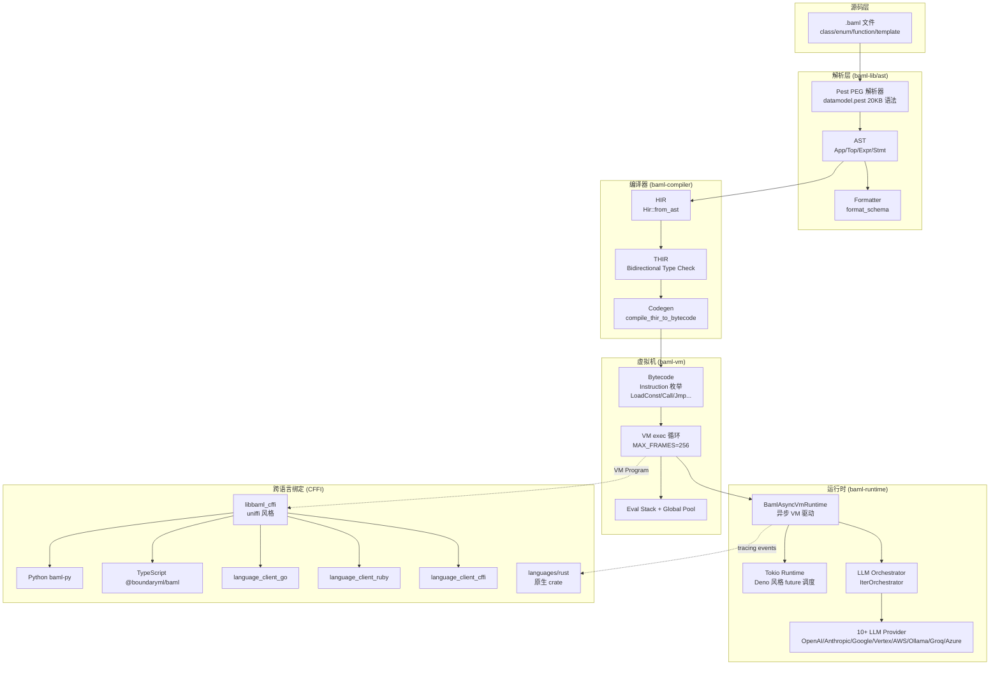
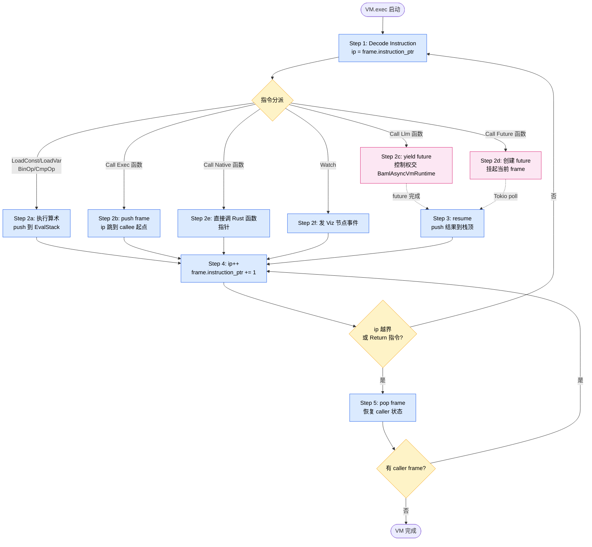
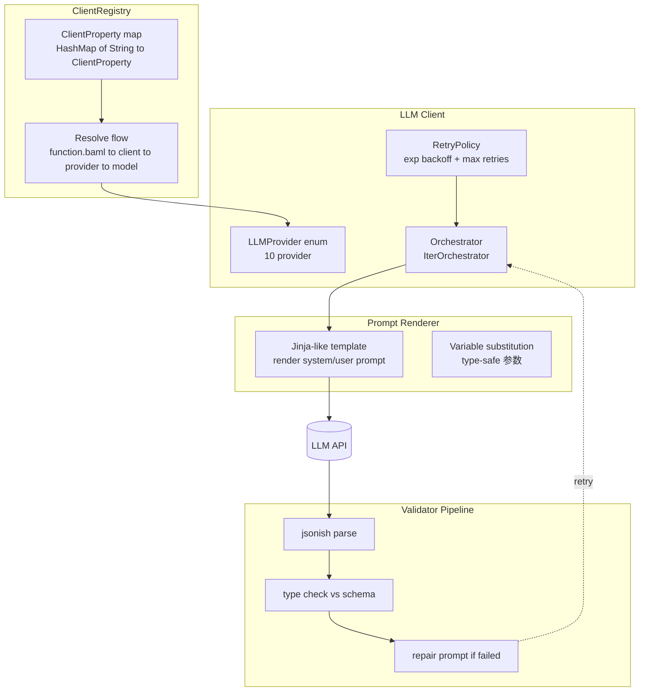
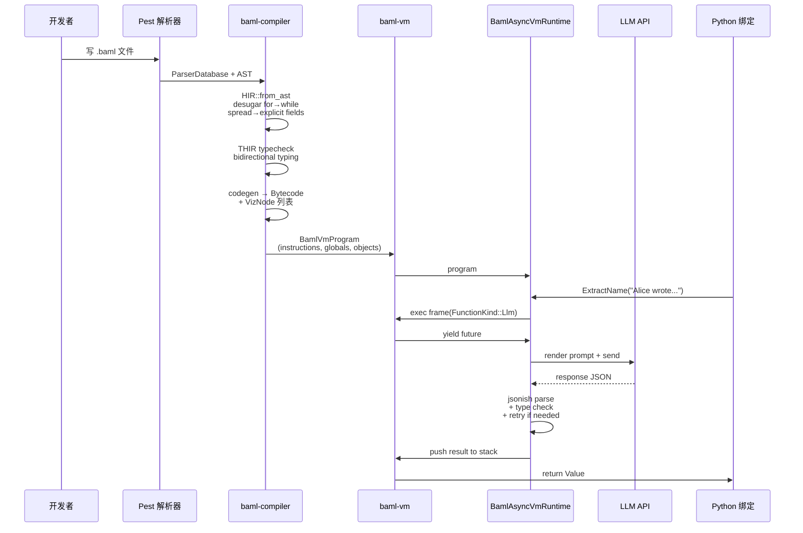

## 一、引子：LLM 工程的「类型系统缺失」之痛

过去两年，LLM 应用从「Prompt 调参」迅速演进到「Agent 编排」，但在生产工程中，开发者反复撞到一面墙：**LLM 输出天然不可靠**。一段 Python 代码里 `result["name"]` 拿到的是字典，错了就 `KeyError`；但一段 LLM 输出里 `result.name` 可能是字符串，也可能是数字、空、Markdown 包裹的代码块、半个 JSON、甚至英文自传——你永远不知道。

业界为此发明了 100 种临时方案：Pydantic + retry、Instructor 库、JSON Schema with repair、JSON mode、function calling、outlines、guidance、dspy 优化 prompt……这些方案都在「补救」一个根本问题：**Prompt 是无类型的文本，而调用方代码是强类型的**。二者之间缺一座编译期的桥。

Boundary ML（BAML）的答案是：**再造一门语言**。

BAML（Basically A Made-up Language）把自己定位为「**The programming language for agents**」，目标直白：让 Agent 写错更少。它不是又一个 Python 库，也不是另一个 prompt DSL，而是一门完整实现的小型编程语言——有自己的 lexer、parser、AST、HIR、THIR、MIR、字节码、堆栈虚拟机、跨语言 FFI——**全部用 Rust 写**，目标是把 LLM 函数调用像普通函数一样**类型化、可静态校验、可可视化执行**。

这篇文章会带你深入 BAML 的 `engine/` 仓库，看一门为 LLM 时代设计的小型语言是怎么从字符流一步步走到跨语言运行时的。

> 本文基于 `BoundaryML/baml` 仓库 `canary` 分支（截至 2026-07-17，⭐ 8,559 / 🍴 449 / Apache-2.0 / Rust）。

## 二、项目定位与核心价值

### 2.1 一句话定义

**BAML 是一门强类型 DSL + Rust 写的编译器 + 跨语言运行时，把 LLM 函数（`@llm function ExtractName(input: string) -> Name`）编译成可类型校验的字节码，由 `baml-vm` 执行，跨 Python/TS/Go/Ruby/Rust/C# 暴露同样的 API。**

### 2.2 它解决的三个核心问题

| 问题 | 业界典型做法 | BAML 的做法 |
|------|--------------|-------------|
| **LLM 输出无结构** | Pydantic + JSON parser + retry loop | Schema-first DSL：类型写在前，编译器生成 parser+schema+retry |
| **Prompt 与代码割裂** | Prompt 写 markdown 模板，代码读 string | LLM 函数 = 普通函数，prompt 是函数体，类型是签名 |
| **多语言复用难** | 每个语言重写 SDK（OpenAI Python/JS SDK 各一套） | 编译器一次生成，6 种语言 FFI 暴露相同 API |

### 2.3 能力矩阵

- **语法层**：TS 风格语法（class / enum / function / arrow / template literal），Pest PEG 解析器
- **类型层**：class、enum、union、literal type、optional、generic、arrow function type
- **编译层**：AST → HIR → THIR（双向类型检查，Hindley-Milner-like）→ 字节码
- **运行层**：自研 `baml-vm` 堆栈虚拟机 + Tokio async runtime（Deno/V8 同款架构）
- **跨语言**：CFFI（libbaml_cffi） → Python/Node/Ruby/Rust/C#/Go 6 种 binding
- **可视化**：内置 Viz 节点事件流，可对接 BAML Playground / IDE

### 2.4 仓库统计

| 指标 | 数值 |
|------|------|
| Stars | 8,559 |
| Forks | 449 |
| License | Apache-2.0 |
| 主语言 | Rust（引擎）+ Python/TypeScript（绑定） |
| 默认分支 | `canary`（注意：不是 `main`） |
| 总节点数 | 11,167（含子模块） |
| 引擎 crate 数 | 30+（`baml-compiler`、`baml-vm`、`baml-runtime`、`baml-lib` 等） |
| 最近 commit | 2026-07-17（每日活跃） |

## 三、整体架构

BAML 是一个 monorepo，**核心引擎都在 `engine/` 目录**，是一套完整的 Rust workspace。下面是顶层架构图：



**关键设计选择**：编译器（`baml-compiler`）和虚拟机（`baml-vm`）是**完全解耦**的两个 crate。前者只产出 `BamlVmProgram`（指令 + 对象池 + 全局池），后者只负责执行。这种分离让 BAML 可以像 Lua 一样独立升级编译器/VM 而不影响上层运行时。

`async_vm_runtime.rs:18-22` 注释里直白承认这个架构灵感来源：

> This architecture is inspired by Deno, which contains a Rust Tokio runtime that wraps the V8 machine and schedules JS promises.

## 四、应用类型：单语言 vs 多语言 FFI

BAML 不只服务一种宿主语言。它通过 CFFI（Rust `uniffi` 风格）把同一份编译产物暴露给 6 种语言。

| 绑定方式 | 实现 | 性能 | 适用场景 |
|---------|------|------|----------|
| **Python** (`baml-py`) | `pyo3` + `maturin` wheel | 原生 FFI，无序列化 | 服务端 Agent、数据管道 |
| **TypeScript** (`@boundaryml/baml`) | `napi-rs` Node-API binding | 原生 FFI | 前端/Node.js |
| **Go** (`language_client_go`) | CGO + C 头文件 | CGO 调用开销 | Go 微服务 |
| **Ruby** | FFI gem | 较慢 | Rails/Sidekiq 后台 |
| **C# / .NET** | P/Invoke | 原生 | 企业内 .NET 应用 |
| **Rust** (`languages/rust`) | `baml` + `baml-macros` 过程宏 | 零开销直接链接 | 嵌入式 / 库作者 |

`engine/language_server/` 还内置了 LSP（Language Server Protocol）实现，可对接 VS Code / Cursor / JetBrains，提供语法高亮、跳转、补全、实时错误。

## 五、核心引擎一：BAML 编译器（AST → HIR → THIR → Bytecode）

BAML 的编译器是一个**教科书式的五阶段流水线**，在 `engine/baml-compiler/` 中按 Rust crate 拆分。

### 5.1 阶段一：Pest 语法解析

源码：`engine/baml-lib/ast/src/parser/datamodel.pest`（20KB PEG 语法）。

下面这张图展示 BAML 五级编译流水线的全貌：

```mermaid
flowchart LR
    SRC[".baml 源文件"]:::src --> PEST["Pest PEG<br/>datamodel.pest"]:::parse
    PEST --> AST["AST<br/>App/Top/Expr"]:::ir
    AST --> HIR["HIR<br/>desugar for/while<br/>spread 展开"]:::ir
    HIR --> THIR["THIR<br/>Bidirectional<br/>Type Check"]:::ir
    THIR --> BC["Bytecode<br/>Instruction 列表"]:::ir
    BC --> VIZ["VizNodes<br/>控制流可视化元数据"]:::ir
    BC --> PROG["BamlVmProgram<br/>instructions + globals + objects"]:::vm
    VIZ --> PROG
    PROG --> VM["baml-vm exec<br/>栈式循环"]:::vm

    classDef src fill:#fef3c7,stroke:#f59e0b,color:#000
    classDef parse fill:#dbeafe,stroke:#2563eb,color:#000
    classDef ir fill:#dcfce7,stroke:#16a34a,color:#000
    classDef vm fill:#fce7f3,stroke:#db2777,color:#000
```



```pest
schema = {
    SOI ~ (expr_fn | top_level_assignment | value_expression_block
         | type_expression_block | template_declaration | type_alias
         | comment_block | raw_string_literal | empty_lines | CATCH_ALL)* ~ EOI
}

type_expression_block = { identifier ~ identifier ~ named_argument_list?
                        ~ BLOCK_OPEN ~ type_expression_contents ~ BLOCK_CLOSE }
value_expression_block = { value_expression_keyword ~ identifier ~ named_argument_list?
                        ~ ARROW? ~ field_type_chain? ~ SPACER_TEXT ~ BLOCK_OPEN
                        ~ value_expression_contents ~ BLOCK_CLOSE }
```

PEG（Parsing Expression Grammar）相比传统 BNF 的优势是**有序选择 + 无歧义**，编译器作者不用写消歧规则。`datamodel.pest` 顶层定义的 `schema` 是「任意顶层项重复」结构，对应 BAML 文件顶层可以混排 class / enum / function / client / generator / template / type_alias。

### 5.2 阶段二：HIR（High-level Intermediate Representation）

源码：`engine/baml-compiler/src/hir.rs` + `hir/lowering.rs`（40KB）。

```rust
// 来自 engine/baml-compiler/src/hir.rs:25-44
pub struct Hir {
    pub expr_functions: Vec<ExprFunction>,
    pub llm_functions: Vec<LlmFunction>,    // ← 关键：LLM 函数一等公民
    pub classes: Vec<Class>,
    pub enums: Vec<Enum>,
    pub global_assignments: baml_types::BamlMap<String, GlobalAssignment>,
}

impl Hir {
    pub fn from_ast(ast: &ast::Ast) -> Self {
        // 1. 加入 builtin class/enum (baml.HttpRequest, baml.HttpMethod 等)
        // 2. 遍历 ast.tops，分类到 llm_functions / expr_functions / classes / enums
        // 3. 修补 return_type —— 因为枚举类型只有在完整上下文才能确定
        // 4. 把 for 循环降级成 while 循环
        // 5. 把 class spread 构造器展开成 exhaustive fields
        // 6. 把隐式 return 变成显式 return
        // ...
    }
}
```

HIR 的**核心抽象**：`LlmFunction`（LLM 函数）和 `ExprFunction`（普通函数）**平级共存**。编译器不区分「调 LLM」和「调本地函数」——它们都是 HIR 里的一个节点，区别只是 `FunctionKind::Llm` vs `FunctionKind::Exec`（这一点会在 §六 VM 部分再次体现）。

降级（desugaring）阶段发生在 HIR：`for` → `while`、`class spread { ...base }` → `exhaustive constructor`、`implicit return` → `explicit return`。这是经典的 Rust 编译器模式——把高级语法在 HIR 层抹平，让后续 THIR 只看简单节点。

### 5.3 阶段三：THIR（Typed HIR）+ 双向类型检查

源码：`engine/baml-compiler/src/thir/typecheck.rs`（**142KB**，是编译器最重的文件）。

THIR 是**绑定了类型**的 HIR，每个表达式都附 `TypeIR`：

```rust
// 来自 engine/baml-compiler/src/thir.rs:18-28
pub struct THir<T> {
    pub expr_functions: Vec<ExprFunction<T>>,
    pub llm_functions: Vec<LlmFunction>,
    pub global_assignments: BamlMap<String, GlobalAssignment<T>>,
    pub classes: BamlMap<String, Class<T>>,
    pub enums: BamlMap<String, Enum>,
}
```

类型检查器注释（`typecheck.rs:8-13`）明确写了目标：

> Aspirationally, we implement bidirectional typing, a method that is mostly syntax-directed (doesn't involve search and backtracking), copes well with subtyping, and produces good error messages.
> https://arxiv.org/abs/1908.05839

**双向类型检查（Bidirectional Typing）** 是当下类型系统研究的 SOTA：

- **type synthesis（推断）**：从子表达式向上推断类型
- **type checking（校验）**：从期望类型向下校验

相比 Hindley-Milner 经典算法的 unification + 回溯，双向类型是**单向数据流**，不会 backtrack，**错误信息天然精准**。这正契合 BAML 的目标——LLM 用户写错了要立刻知道错在哪。

### 5.4 阶段四：Codegen（THIR → Bytecode）

源码：`engine/baml-compiler/src/codegen.rs`（73KB）。

```rust
// 来自 engine/baml-compiler/src/codegen.rs:27-33
pub fn compile(ast: &ParserDatabase) -> anyhow::Result<BamlVmProgram> {
    let hir = hir::Hir::from_ast(&ast.ast);
    let thir = thir::typecheck::typecheck(&hir, &mut Diagnostics::new("dummy".into()));
    compile_thir_to_bytecode(&thir)   // ← 阶段二：HIR/THIR → Bytecode
}
```

Codegen 输出 `BamlVmProgram`，结构上是一组**对象池 + 全局池 + 指令列表**。codegen 函数列表（`codegen.rs:27-1622`）展示了完整的语句/表达式覆盖：

- `compile_thir_function`：单个函数 → Bytecode Function
- `compile_block`：block → 指令序列
- `compile_while_loop`：while → jump 指令
- `compile_expression`：完整表达式树 → stack 操作
- `compile_expression_with_block_behavior`：含闭包的表达式

`engine/baml-compiler/src/codegen.rs:498-537` 的 `compile_function` 还包含**栈帧分配**和**局部变量映射**——这是真实编译器的活，不是 toy DSL。

### 5.5 阶段五：可视化（Viz Events）

源码：`engine/baml-compiler/src/viz.rs` + `baml-viz-events` crate。

每个 HIR 函数编译时附带 viz 节点：

```rust
// 来自 engine/baml-compiler/src/viz.rs:6-15
pub struct VizNode {
    pub node_id: u32,
    pub log_filter_key: String,
    pub parent_log_filter_key: Option<String>,
    pub node_type: RuntimeNodeType,    // LlmCall/If/For/While/...
    pub label: String,
    pub header_level: Option<u8>,
}
```

执行时 VM 把 viz 节点发成事件流，VS Code 扩展 / Playground 订阅后画出**执行轨迹**——这比 print debugging 高一个数量级，是 BAML 区别于普通 DSL 的关键工程能力。

## 六、核心引擎二：baml-vm 堆栈虚拟机

如果说编译器是把 BAML 翻译成机器码，那 VM 就是执行机器码的「CPU」。

### 6.1 总体设计

源码：`engine/baml-vm/src/lib.rs:1-14`：

> This crate implements a stack based virtual machine similar to the CPython VM or Lox VM from *Crafting Interpreters*.
> Main entry point is `Vm::exec` which runs the VM cycle:
> 1. Decode Instruction.
> 2. Execute Instruction.
> 3. Increment instruction pointer and repeat loop.

参考书目《Crafting Interpreters》是 Robert Nystrom 写的编程语言实战圣经。baml-vm 几乎照搬 Lox VM 的经典设计：**单线程、栈式、字节码、无 JIT**。

### 6.2 指令集（Instruction enum）

源码：`engine/baml-vm/src/bytecode.rs`（14KB）。

```rust
// 来自 engine/baml-vm/src/bytecode.rs 摘要
pub enum Instruction {
    LoadConst(usize),        // 加载常量
    LoadVar(usize),          // 加载栈帧局部变量
    StoreVar(usize),         // 存储到局部变量
    LoadGlobal(usize),       // 加载全局（函数/类都是全局）
    StoreGlobal(usize),
    Call(usize),             // 函数调用
    Return,
    Jump(usize),             // 无条件跳转
    JumpIfFalse(usize),      // 假则跳转
    Pop,                     // 弹栈
    AllocInstance(ObjectIndex), // new 一个对象
    LoadField(usize),        // 访问字段
    StoreField(usize),
    BinOp(BinOp, ...),       // 加减乘除
    CmpOp(CmpOp, ...),       // 比较
    Watch(usize),            // 触发 viz 节点事件
    // ... 50+ 指令
}
```

栈式 VM 的优点：**实现简单、字节码紧凑、解释器容易移植**。缺点：**每条算术要 push/pop，吞吐量低**。BAML 选择栈式是因为 LLM 函数本身耗时在几秒到几十秒，**字节码执行开销相对可忽略**。

### 6.3 调用栈与对象池

源码：`engine/baml-vm/src/vm.rs`（77KB）+ `indexable.rs`。

```rust
// 来自 engine/baml-vm/src/vm.rs:14
pub const MAX_FRAMES: usize = 256;   // 调用栈最大深度

pub struct Frame {
    pub function: ObjectIndex,        // 当前在跑的函数
    pub instruction_ptr: isize,       // 指令指针（PC）
    pub locals_offset: StackIndex,    // 局部变量在 EvalStack 的偏移
}
```

VM 用两个池：
- **`ObjectPool`**：所有长生命周期对象（函数、类、实例、字符串、枚举值），用 `ObjectIndex` 索引
- **`GlobalPool`**：全局变量 / 函数引用
- **`EvalStack`**：值栈，保存局部变量、临时值、调用参数

**关键设计**：值不拥有数据，`String`/`Instance`/`Function` 都存在 `ObjectPool` 里，栈上只存 `ObjectIndex`（usize）。这是经典 copy-on-the-stack 模式，避免深拷贝。

### 6.4 函数分四种类型

源码：`engine/baml-vm/src/types.rs:5-15`：

```rust
pub enum FunctionKind {
    Exec,                          // 普通字节码函数
    Llm,                           // LLM 函数，VM 让出控制权给 runtime
    Future,                        // 内建 baml.fetch_as（异步 HTTP）
    Native(crate::native::NativeFunction),  // 内建原生函数
}
```

这是 BAML VM 的**魔法核心**：
- 遇到 `Exec` → VM 解释字节码
- 遇到 `Llm` → VM 把控制权交给 `BamlAsyncVmRuntime`，由 orchestrator 调 LLM，拿回结果塞栈顶
- 遇到 `Future` → VM 创建一个 future，挂起当前 frame，等 Tokio 调度
- 遇到 `Native` → 直接调用 Rust 函数指针

**这就是「LLM 函数 = 普通函数」承诺的工程基础**——VM 不需要为 LLM 单独搞一套运行时，只是多了一个 `FunctionKind` 枚举分支。

### 6.5 异步执行：Deno 风格的 Future 调度

源码：`engine/baml-runtime/src/async_vm_runtime.rs:11-22`：

> The VM is completely standalone and doesn't care about futures, it just delegates future scheduling to an "embedder". This is the embedder. The async runtime acts both as a future scheduler and a VM driver.
> This architecture is inspired by Deno, which contains a Rust Tokio runtime that wraps the V8 machine and schedules JS promises.

BAML 异步模型和 Deno 同构：
1. VM 是**单线程同步循环**
2. 当遇到 async 操作（LLM 调用、HTTP fetch），VM `yield` 一个 future
3. Tokio runtime 调度 future
4. future 完成 → VM 恢复 → 继续执行下一条指令

这种架构避免了传统解释器需要 full coroutine 改造的复杂度。

## 七、核心引擎三：LLM Orchestrator 与响应解析

### 7.0 VM 执行循环（核心循环图）

在展开 orchestrator 之前，先把 VM 的核心循环画清楚——后面 orchestrator 调 LLM 就是「VM yield future → Tokio 调度 → VM 恢复」的循环：



这套循环对应 `engine/baml-vm/src/vm.rs` 的 `Vm::exec` 主循环，每条指令都走「解码 → 执行 → 推进 ip」三步。**LLM 调用 = 一次 yield + resume**，VM 其他代码不感知这是同步还是异步。

### 7.1 多 Provider 抽象

源码：`engine/llm-response-parser/src/provider.rs:6-20`：

```rust
pub enum LLMProvider {
    OpenAI,
    Anthropic,
    Azure,
    OpenAIGeneric,   // 任何 OpenAI 兼容 API
    Google,
    Vertex,
    AWS,
    Ollama,
    Groq,
}

impl LLMProvider {
    pub fn is_openai_compatible(&self) -> bool { ... }
    pub fn is_anthropic_compatible(&self) -> bool { ... }
    pub fn is_google_compatible(&self) -> bool { ... }
}
```

每个 provider 自带**专用响应解析器**（`engine/llm-response-parser/src/{openai,anthropic,google,vertex,azure,openai_generic}.rs`）。`provider.rs:60-66` 的 `test_cross_provider_compatibility` 测试展示了关键设计：**同一段 OpenAI 响应能被 3 个解析器都正确解析**（这是 SDK 兼容性的工程基础）。

### 7.2 IterOrchestrator 与 retry 策略

源码：`engine/baml-runtime/src/internal/llm_client/orchestrator.rs`。

`IterOrchestrator` 负责：
1. 拿 LLM 响应
2. 用 BAML schema 解析回 `BamlValue`
3. 解析失败 → 调用 LLM「修复」（用错误信息当 prompt）→ 重试
4. 解析成功但类型不对 → 同上
5. 达到 max retries → 抛 `BamlError`

这整套循环**完全在 Rust 端**，没有任何 Python 中介——所以 BAML 比纯 Python 库（如 `instructor`）快一个数量级。

### 7.3 jsonish：宽松的 JSON 解析器

BAML 内置一个叫 `jsonish` 的解析器（`engine/baml-runtime/src/internal/llm_client/jsonish.rs`），专门处理**不规整**的 LLM 输出：
- Markdown 代码块 ```json ... ```
- 多余的 leading text
- 缺失的引号（LLM 偶尔会忘）
- 单引号 / 双引号混用
- 行尾逗号
- 部分 JSON

这套容错让 LLM 函数不需要严格 JSON mode 也能稳定工作。

## 八、Provider 抽象层：ClientRegistry

源码：`engine/baml-runtime/src/client_registry.rs`。



**三级抽象**：
1. **Client**：baml 文件中定义的逻辑 client（如 `client Sonnet`）
2. **Provider**：实际 HTTP 调用层（OpenAI/Anthropic/...）
3. **Model**：具体模型 ID（gpt-4o / claude-3.5-sonnet）

用户写 `client Sonnet { provider "anthropic" model "claude-3-5-sonnet-latest" retry_policy Exponential }`，ClientRegistry 在 `try_from` 时把逻辑名解析为具体执行路径。**函数定义不绑定具体 client**，运行时可换——这给 A/B 测试、灾备、跨云切换开了门。

## 九、工具系统与原生函数

### 9.1 原生函数注册

源码：`engine/baml-vm/src/native.rs`。

```rust
pub fn functions() -> HashMap<String, NativeFunction> {
    // 内建 baml.fetch_as / baml.fetch_value
    // 用户注册的 @native 注解函数
}
```

用户可以写：

```baml
native function sha256(input: string) -> string {
    // Rust 实现
}
```

编译器把这类函数编译成 `FunctionKind::Native(RustFnPtr)`，VM 遇到直接调 Rust 函数指针，**没有序列化开销**。

### 9.2 类型 Builder（动态 schema）

源码：`engine/baml-runtime/src/type_builder.rs`。

用户可以在运行时动态往 schema 加字段——这是给 Agent 场景的杀手锏：

```python
tb = TypeBuilder()
tb.Person.add_property("linkedin")
tb.Person.add_property("github")
b.ExtractPerson("Alice", {"tb": tb})
```

Agent 决定要哪些字段，运行时构造 schema，LLM 按需输出。**BAML 是少数把这套动态 schema 编译期 + 运行期都能用的项目**。

## 十、编译产物：BAML 程序的生命周期

下面 sequenceDiagram 把上述所有模块串起来：



**端到端延迟**：LLM 函数 = parse（μs）+ compile（ms，每次重编可缓存）+ VM exec（μs）+ LLM（秒）+ jsonish parse（ms）+ FFI return（μs）。**BAML 在 Rust 侧的额外开销可以忽略**。

## 十一、与同类项目对比

### 11.1 横向对比表

| 维度 | BAML | Pydantic + Instructor | DSPy | LangChain |
|------|------|----------------------|------|-----------|
| **形态** | DSL + Rust 编译器 + VM | Python 库 | Python 框架 | Python 框架 |
| **类型系统** | 编译期（双向类型） | 运行期（Pydantic 验证） | 编译期 prompt 优化（无类型） | 无（dict 流转） |
| **LLM 输出校验** | jsonish + retry 内置 | Pydantic 抛 ValidationError 后 retry | 优化 prompt 让 LLM 别出错 | 各自手写 |
| **多语言** | 6 种原生 FFI | 仅 Python | 仅 Python | Python/JS |
| **可视化** | 内置 Viz events | 无 | 有（DSPy inspector） | LangSmith |
| **prompt 与代码** | 同文件 BAML | 模板字符串 | Signature 类 | PromptTemplate 类 |
| **动态 schema** | TypeBuilder（运行时增字段） | 不支持 | 不支持 | 支持但啰嗦 |
| **运行时开销** | 字节码 + FFI，~μs 级 | 纯 Python，~ms 级 | 纯 Python | 纯 Python |
| **生产稳定性** | 字节码 + 强类型 | retry loop 兜底 | 依赖 LLM 表现 | 依赖 prompt 表现 |

### 11.2 设计差异深度分析

**BAML vs Pydantic + Instructor（最常见的替代方案）**

Instructor 是 Python 生态的事实标准。核心区别：
- Instructor = `pydantic.BaseModel` + retry loop，纯运行期
- BAML = DSL + 编译期 + 跨语言 + 可视化

优势场景：你的代码要跑在 Python 之外（Node/Go/Ruby），或要承担高 QPS 的 LLM 调用（BAML 字节码 + Rust 性能更好），或需要多人协作的 prompt schema（BAML 的 .baml 文件更适合 git diff）。

劣势：BAML 引入新语言，团队学习成本高。

**BAML vs DSPy（同一时代的两个哲学）**

DSPy 的答案是「让编译器优化 prompt」，BAML 的答案是「让语言承载 LLM」。前者把 LLM 当黑盒调优，后者把 LLM 当一等公民显式建模。
- DSPy 输出 = 优化过的 prompt 文本
- BAML 输出 = 类型化的 BAML 函数，可被任意语言直接调用

DSPy 更适合做 prompt A/B 测试，BAML 更适合做生产 LLM 应用。

**BAML vs LangChain（生态 vs 引擎）**

LangChain 是 LLM 时代的「胶水层」，几千个集成，组合灵活但每条链都依赖 prompt 工程。**BAML 不和 LangChain 竞争集成数量，而是把单个 LLM 函数做深、做稳、做快**。

实际生产中两者可叠加：LangChain 做编排，BAML 做关键 LLM 函数（特别是需要严格 schema 的场景）。

## 十二、优缺点分析

### 12.1 左侧：架构 / 扩展性 / 易用性

| 优势 | 说明 |
|------|------|
| **真正的语言实现** | AST/HIR/THIR/MIR/Bytecode/VM 全套，不是 prompt 模板 |
| **编译期类型检查** | 双向类型，错误精准，避免「运行时才发现字段拼错」 |
| **6 种语言 FFI** | Rust → Python/TS/Go/Ruby/Rust/C#，写一次到处跑 |
| **可视化执行** | Viz 节点事件流 → BAML Playground / VS Code 实时调试 |
| **动态 schema** | TypeBuilder 运行时改字段，Agent 场景原生支持 |
| **provider 容错** | jsonish 宽松解析 + 修复 prompt + retry loop，LLM 输出再乱也能兜住 |

### 12.2 右侧：性能 / 复杂度 / 维护性

| 劣势 | 说明 |
|------|------|
| **学习曲线陡** | 新团队要学 BAML 语法 + 编译概念 + Viz 模型 |
| **编译产物调试难** | 字节码 + Viz 节点对纯 Python 开发者不友好 |
| **错误信息传统** | 还在做双向类型检查的「aspirational」阶段（注释自承），错误信息偶有歧义 |
| **生态较小** | Apache-2.0 + 8.6k ⭐，比 LangChain 100k+ ⭐ 生态小一个数量级 |
| **新增 provider 成本** | 要写 Rust 代码，不能像 Python 那样快速 hack |
| **WASM/Edge 限制** | 部分 Rust crate 不支持 wasm32，边缘部署受限 |

## 十三、实践：从安装到第一个 LLM 函数

### 13.1 安装与初始化

```bash
# macOS
brew install boundaryml/tap/baml
baml agent install
baml init          # 生成 baml_src/ 目录与示例
baml ide install --code   # VS Code 扩展
```

### 13.2 第一个 .baml 文件

```baml
// baml_src/extract.baml
class Resume {
  name string
  skills string[]
  years_experience int
}

function ExtractResume(resume: string) -> Resume {
  client "openai/gpt-4o-mini"
  prompt #"
    Extract structured info from this resume:
    {{ resume }}

    {{ ctx.output_format }}
  "#
}

test TestResume {
  functions [ExtractResume]
  args {
    resume "Alice has 5 years in Python and Rust."
  }
}
```

### 13.3 Python 调用

```python
from baml_py import ClientRegistry
from baml_client import b

# 同步调用
result = b.ExtractResume("Bob has 3 years in Go and 7 in Java.")
print(result.name, result.skills, result.years_experience)

# 流式
stream = b.stream.ExtractResume("...")
for partial in stream:
    print(partial)
```

### 13.4 类型 Builder 动态扩展

```python
from baml_client.type_builder import TypeBuilder
from baml_client import b

tb = TypeBuilder()
tb.Resume.add_property("linkedin").add_property("github")

result = b.ExtractResume(
    "Alice has 5 years...",
    {"tb": tb}
)
print(result.linkedin, result.github)
```

### 13.5 Viz 可视化

VS Code 安装 BAML 扩展后，每次调用 LLM 函数都会在侧边栏画出**执行轨迹**——每个 HIR 节点（class 定义 / function call / if / for）都标注运行耗时和值。这是 prompt engineering 时代的 print debugging 进化版。

## 十四、趋势判断

### 14.1 趋势一：「LLM 函数 = 一等公民」将成为新标准

BAML 把 LLM 调用编译成和普通函数平级的 `FunctionKind::Llm`，**这是「LLM 调用 = 普通函数调用」承诺的最完整实现**。2026 H2 起，更多框架会把 LLM 调用从「黑盒 prompt」变成「类型化函数」——BAML 是先行者，**Pydantic AI、Marvin** 等都在朝同一方向走。

### 14.2 趋势二：DSL 复兴

过去十年开发者试图用 Python/JavaScript 通用语言包揽一切，但 LLM 应用的 schema 约束、多 provider 兼容、prompt 管理需求**超过了通用语言的舒适区**。BAML 证明：**为特定领域造 DSL 比给通用语言加库**更适合。BAML 的 Pest + 自研编译器 + VM 模板，会被复制到更多 LLM 垂直场景（audio agent、video agent、code agent）。

### 14.3 趋势三：编译期类型检查成为 LLM 生产门槛

Hindley-Milner 在 1980 年代成为静态类型语言的标配，**双向类型检查在 2020 年代成为新一代语言标配**（Rust、Dart 3、TypeScript 4.6+）。BAML 把双向类型带进 LLM 领域，意味着 LLM 应用的工程化门槛向「强类型 + 编译期校验」靠拢——**未来没有编译期 schema 校验的 LLM 应用 = 现在没有静态类型的 JS 代码**。

### 14.4 趋势四：可视化执行成为 LLM 调试刚需

传统 prompt 调试靠 log + 复制粘贴，LLM 应用规模上来后完全不够用。BAML 的 Viz 节点事件流 + Playground 是工程级回答。**类似 Datadog APM 在微服务中的角色，可视化执行会成为 LLM 应用的标配**——OpenLLMetry、Langfuse、LangSmith 都在做，只是 BAML 是从编译器底层原生支持的。

### 14.5 趋势五：跨语言 FFI 是 LLM SDK 的下一个战场

OpenAI/Anthropic 官方 SDK 各语言各写一遍，每次新功能（function calling、structured output、vision）都要 6 个仓库同步。**BAML 的「Rust 引擎 + CFFI 多语言绑定」模式会成为 LLM SDK 的标准架构**——任何需要 5+ 语言 SDK 的项目都会走这条路。

## 十五、总结

BAML 不是一个 prompt 框架，是一门**为 LLM 时代从头设计的小型编程语言**。

它用 30+ 个 Rust crate 实现了 Pest 语法解析 → AST → HIR → THIR（双向类型检查）→ 字节码 → 堆栈 VM → Tokio 异步调度 → LLM orchestrator → 6 种语言 FFI 的完整链路。每一步都是工业级实现，没有捷径、没有 hack。

**最值得借鉴的设计**：
1. **LLM 函数 = 普通函数**——`FunctionKind::Llm` 与 `Exec` 平级，VM 透明处理
2. **Schema-first DSL**——类型写在 prompt 之前，编译期校验
3. **jsonish + 修复 retry**——LLM 输出再乱也能兜住
4. **Viz 节点事件流**——可视化执行而非 print debugging
5. **Deno 风格 async VM**——VM 单线程循环 + Tokio 调度 future，简单可移植

**对个人开发者的启示**：当你写 LLM 应用时，问自己——
- 我的 prompt schema 是不是应该单独成 DSL？
- 我的 prompt 错误能不能在编译期发现？
- 我的 LLM 调用能不能跨语言复用？
- 我的 prompt 执行能不能可视化？

四个问题里只要有两个是 yes，就值得认真看 BAML。

## 附录：关键资源

| 资源 | 链接 |
|------|------|
| GitHub | https://github.com/BoundaryML/baml |
| 官网 | https://www.boundaryml.com/ |
| Playground | https://www.boundaryml.com/playground |
| 文档 | https://docs.boundaryml.com/ |
| Discord | https://www.boundaryml.com/discord |
| PyPI | https://pypi.org/project/baml-py/ |
| 论文/博客 | https://www.boundaryml.com/blog |
| License | Apache-2.0 |
| 引擎代码 | `engine/baml-compiler/` `engine/baml-vm/` `engine/baml-runtime/` |
| 新编译器 | `baml_language/crates/baml_compiler2_*/`（实验性 AST→HIR→MIR→PPIR→TIR→Emit） |

---