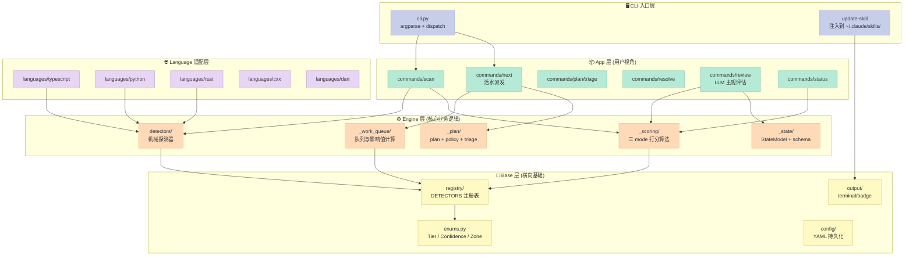

> 当你的 Coding Agent 说"我把代码改好了"，你怎么知道它真的改对了？
>
> —— 给你一个 0~100 的分数，且这个分数**不能被刷高**。

很多人第一反应是："不就是 ESLint、Pylint、SonarQube？" 是，但也不全是。今天我们看的项目 [desloppify](https://github.com/peteromallet/desloppify)（3k⭐，v1.0）把这件熟悉的事做到了**反作弊**的层面 —— 它要给 AI Agent 改代码这件事一个**真的能反映代码质量**的数字。

它不是另一个 linter。它是**给 Coding Agent 用的 linter + 打分 + 派活 + 防作弊**整套系统。本篇就来拆解它。

## 一、它解决什么问题

### 1.1 痛点：vibe coding 留下"腐肉"

vibe coding 写出来的代码能跑，但读起来像迷宫：

- 抽象突然失配（昨天加的 `UserService` 像基础设施，今天又拿来当领域模型）
- 命名漂移（`data`、`info`、`params`、`payload` 同一项目里混用）
- 错误处理三种写法（一个文件 `try/except`，另一个 silent-retry，第三个直接崩）
- 测试覆盖像瑞士奶酪

LLM 实际上**擅长发现这类问题** —— *只要你能给它结构化的提问框架*。desloppify 的核心赌注就是这句：**"LLM is actually good at spotting this now, if you ask them the right questions"**。

### 1.2 价值主张：让 score 真的代表"代码好不好"

理想中，desloppify 想做到这件事：

> 改动后分数变高了 ⇒ 代码真的变好了。
>
> 改动后分数没变 ⇒ 改动没起作用（或者破坏了隐性质量）。
>
> 分数高于 98 的代码 ⇒ 资深工程师看一眼会说"这写得不错"。

这是个**比 lint score 难得多**的承诺。lint 分数可以通过 `# noqa` 刷到 100。desloppify 想做一个**不能通过"修饰"刷高**的分数。这是它最值得拆解的部分。

### 1.3 在 Harness 6 件套中的位置

| Harness 6 件套 | Desloppify 的对应 |
|----------------|-------------------|
| **Rule** | config 中的 `target_strict_score` |
| **Skill** | `desloppify update-skill claude` 把整套工作流注入到 Agent 的 `~/.claude/skills/` |
| **Sub-Agent** | `triage/runner/orchestrator_*.py` 多阶段：observe → sense → strategize → enrich → organize |
| **Workflow** | `scan → score → review → triage → execute → rescan` 5 阶段闭环 |
| **Script** | CLI 自带硬约束：`require_triage_current_or_exit` 阻止 Agent 绕过 triage |
| **MCP** | 不直接暴露 MCP server，但被设计成给任何 Coding Agent 当 Skill 用 |

它属于**"长跑 Harness"**那一类 —— 不是让 Agent 一次跑完，而是**让 Agent 跨多次会话、跨多个 commit 持续渐进**到目标分数。

---

## 二、架构分析

### 2.1 整体分层



### 2.2 关键模块职责

让我用一句话概括每一层：

| 层 | 一句话职责 |
|----|------------|
| **CLI**（`desloppify/cli.py`） | 解析参数 → dispatch 到 command handler，不做业务 |
| **App/commands** | 命令编排：scan、next、plan、resolve，每个 command 是一个 args parser + handler |
| **App/commands/helpers** | 跨命令共享的工具：guardrails、score_update、rendering |
| **Engine/detectors** | **机械探测器**：每个 detector 找一类问题，写到 state |
| **Engine/_scoring** | **打分算法核心**：三 mode、多 pool、维度加权 |
| **Engine/_work_queue** | **派活算法**：把 issue 转成可执行队列项，按"对总分影响"排序 |
| **Engine/_state** | **状态层**：StateModel dataclass + schema + version migrations |
| **Engine/_plan** | plan + triage 状态机：plan 是 plan，triage 是给 plan 注入新发现 |
| **Languages/*.** | 语言适配：Rust / TS / Python / Dart 的 linter 集成 |
| **Base/registry** | DETECTORS 注册表 —— detector_meta 注册 + 维度/tier 关联 |

### 2.3 机制 vs 策略分离

desloppify 把它做得很彻底：

- **机制（mechanism）**：`engine/_scoring/policy/core.py` 里只声明"维度-检测器-权重"映射关系。
- **策略（policy）**：`SUBJECTIVE_WEIGHT_FRACTION = 0.75`、`SUBJECTIVE_DIMENSION_WEIGHTS = {...}`、各 detector 的 `tier` 字段。

改一个数字，weight 就动了 —— 不用碰一行业务代码。

```python
# desloppify/engine/_scoring/policy/core.py
SUBJECTIVE_WEIGHT_FRACTION = 0.75  # 主观维度占总分的 75%
MECHANICAL_WEIGHT_FRACTION  = 0.25
MECHANICAL_DIMENSION_WEIGHTS = {
    "file health":   2.0,   # 文件级健康权重最高
    "code quality":  1.0,
    "duplication":   1.0,
    "test health":   1.0,
    "security":      1.0,
}
SUBJECTIVE_DIMENSION_WEIGHTS = {
    "high elegance":     22.0,
    "mid elegance":      22.0,
    "low elegance":      12.0,
    "contracts":         12.0,
    "type safety":       12.0,
    "design coherence":  10.0,
    "abstraction fit":    8.0,
    "logic clarity":      6.0,
    "structure nav":      5.0,
    "error consistency":  3.0,
    "naming quality":     2.0,
    "ai generated debt":  1.0,
}
```

注意 weight 的"主观分布"是有讲究的：高分架构权衡（high/mid elegance）权重最大，naming 之类"修修补补"权重最低。这就是在问 AI "把代码改好"的时候，**引导 LLM 的注意力应该放在哪里**。

---

## 三、核心机制：反作弊打分算法

这是整个项目最值得拆解的部分。desloppify 的反作弊设计由 5 大原语组成：

### 3.1 原语 1：三 mode 打分（`FAILURE_STATUSES_BY_MODE`）

```python
# desloppify/engine/_scoring/policy/core.py
FAILURE_STATUSES_BY_MODE: dict[ScoreMode, frozenset[str]] = {
    "lenient":         frozenset({"open"}),
    "strict":          frozenset({"open", "wontfix", "auto_resolved", "deferred", "triaged_out"}),
    "verified_strict": frozenset({"open", "wontfix", "fixed", "false_positive",
                                   "deferred", "triaged_out"}),
}
```

这一段藏着 3 个反作弊思路：

1. **lenient = 只看 open**：宽松模式，鼓励工作流刚启动时得分不掉。
2. **strict = open + wontfix + auto_resolved + deferred**：你 mark 掉的也是没修的 —— 想通过"标 wontfix 让 issue 从队列消失"刷分？没门。
3. **verified_strict = 还要看 fixed 是否真的修了**：你 mark fixed 但没真改，下次 re-review 还能再被扣分。

这就是"分数不能被刷高"的**核心机制设计**。

### 3.2 原语 2：双池加权（机械 25% / 主观 75%）

```python
# desloppify/engine/_scoring/results/core.py
def compute_score_bundle(issues, potentials, *, subjective_assessments=None,
                         allowed_subjective_dimensions=None) -> ScoreBundle:
    by_mode = compute_dimension_scores_by_mode(...)
    
    return ScoreBundle(
        overall_score   = compute_health_score(lenient_scores),  # 全部维度
        objective_score = compute_health_score(mechanical_only),  # 只要机械
        strict_score    = compute_health_score(strict_scores),
        verified_strict_score = compute_health_score(verified_strict_scores),
    )
```

四个 score 一起返回，让你能看见三件事：

- **overall** —— 总分（包括主观评估）
- **objective** —— 纯机械分（"客观"证据）
- **strict** —— wontfix 不放水
- **verified_strict** —— 还要看 fixed 是否真修

加 `overall - objective` 的 gap 就能看出"主观质量 vs 客观质量"的不一致 —— 这种不一致常常意味着"代码看起来改对了，但某处架构已经悄悄腐化"。

### 3.3 原语 3：小样本降权（`MIN_SAMPLE = 200`）

```python
# desloppify/engine/_scoring/results/health.py
MIN_SAMPLE = 200

def _mechanical_row(name, score, data):
    checks = float(data.get("checks", 0) or 0)
    sample_factor = min(1.0, checks / MIN_SAMPLE) if checks > 0 else 0.0
    configured = max(0.0, _mechanical_dimension_weight(name))
    effective = configured * sample_factor  # ← 小样本 * 分数本身
    return {"checks": checks, "sample_factor": sample_factor,
            "configured_weight": configured, "effective_weight": effective}
```

这是什么？**当你只扫描了 50 个文件时，"duplication" 维度的权重只有 25%**（50/200），不会因为偶然发现 1 处重复就把分数大幅拉低。min_sample 本质是**小数据假设的置信度惩罚**。

### 3.4 原语 4：文件级 cap（防一个文件刷爆） 

```python
# desloppify/engine/_scoring/detection.py
_FILE_CAP_HIGH_THRESHOLD = 6    # 6+ issues 同文件 → high cap
_FILE_CAP_HIGH = 2.0            # 高浓度封顶
_FILE_CAP_MID  = 1.5
_FILE_CAP_LOW  = 1.0            # 1-2 issues → low cap

def _file_count_cap(issues_in_file: int) -> float:
    if issues_in_file >= 6: return 2.0
    if issues_in_file >= 3: return 1.5
    return 1.0

def _file_based_failures_by_mode(...):
    weighted = sum(
        min(weighted_sum, _file_count_cap(a.by_file_count.get(file_key, 0)))
        for file_key, weighted_sum in a.by_file.items()
    )
```

这段是关键反作弊：**一个文件里就算 200 个 issues，也只贡献 ≤2.0 的扣分权重**。

为什么需要？想象一下 —— 用户写了 200 行全在一处的乱代码（hamburger file）。如果没 cap，detector 会爆 50 个 issues，这个文件直接打爆总分。**有 cap 后，单文件贡献封顶，detector 必须找不同文件的问题才能影响分数**。

这就**杜绝了"在 1 个烂文件里堆 100 个 issue"刷负分**。

### 3.5 原语 5：按影响值派活（impact-based ranking）

```python
# desloppify/engine/_work_queue/ranking.py
def enrich_with_impact(items, dimension_scores):
    breakdown = compute_health_breakdown(dimension_scores, score_key="strict")
    dim_impact = {}
    for entry in breakdown["entries"]:
        per_point = float(entry["overall_per_point"])
        score = float(entry["score"])
        dim_impact[name.lower()] = {
            "per_point": per_point,
            "headroom":  100.0 - score,   # ← 维度分到 100 还有多少提升空间
        }
    for item in items:
        item["estimated_impact"] = (
            per_point × headroom
        )
```

排序逻辑不是"哪个 issue 最容易修"，而是**"修哪个 issue 能让总分涨最多"**。

具体公式：**impact = per_point(每分贡献) × headroom(分还差多少)**。

- 如果 `duplication` 维度 per_point = 0.04（占总分的 4%）且当前 60 分（headroom=40），那么修这个维度的 issues 能加 **1.6 分**
- 如果 `naming` 维度 per_point = 0.005 且当前 90 分（headroom=10），那么修这个维度最多 **0.05 分**

数学上这等价于"哪个维度的修复边际收益最大"。**用户对 harness 的核心抱怨是"该修哪儿"，desloppify 用数学直接给出了答案**。

### 3.6 可运行示例：简化版打分引擎

把上面 5 个原语压成 30 行可运行代码（用于理解，不是照抄 desloppify）：

```python
"""Desloppify 多维度评分引擎 MVP - 复刻核心算法骨架"""

from dataclasses import dataclass
from typing import Literal

ScoreMode = Literal["lenient", "strict", "verified_strict"]

# 原语 1：3 种 mode 看到不同的"失败"
FAILURE_STATUSES: dict[ScoreMode, set[str]] = {
    "lenient":         {"open"},
    "strict":          {"open", "wontfix", "auto_resolved", "deferred"},
    "verified_strict": {"open", "wontfix", "fixed", "false_positive", "deferred"},
}

# CONFIDENCE 权重
CONFIDENCE_W = {"high": 1.0, "medium": 0.7, "low": 0.3}

# 原语 3：小样本降权
MIN_SAMPLE = 200

# 原语 4：文件级 cap
FILE_CAP_HIGH, FILE_CAP_MID, FILE_CAP_LOW = 2.0, 1.5, 1.0


def file_count_cap(n: int) -> float:
    """6+ 个 issue 的单文件最多扣 2.0 分权重（防爆雷）"""
    if n >= 6: return FILE_CAP_HIGH
    if n >= 3: return FILE_CAP_MID
    return FILE_CAP_LOW


def detector_score(issues, potential: int, mode: ScoreMode) -> float:
    """单个 detector 的 pass_rate"""
    if potential <= 0: return 100.0
    # 原语 4：先把 issues 按文件聚合，每个文件限 cap
    per_file: dict[str, float] = {}
    for i in issues:
        if i.get("status", "open") not in FAILURE_STATUSES[mode]:
            continue
        f = i.get("file", "unknown")
        per_file[f] = per_file.get(f, 0) + CONFIDENCE_W.get(i.get("confidence", "medium"), 0.7)
    # 应用 cap
    capped = sum(min(w, file_count_cap(issues_in_file=sum(
        1 for i in issues if i.get("file") == f and
        i.get("status", "open") in FAILURE_STATUSES[mode]
    ))) for f, w in per_file.items())
    return max(0.0, (potential - capped) / potential) * 100


def overall(dimension_scores: dict[str, float], checks: dict[str, int],
            mode_weights: dict[str, float]) -> float:
    """原语 3：小样本维度权重按 ratio 衰减"""
    weighted_sum = eff_weight = 0.0
    for name, score in dimension_scores.items():
        sample_factor = min(1.0, checks.get(name, 0) / MIN_SAMPLE)
        eff_w = mode_weights.get(name, 1.0) * sample_factor
        weighted_sum += score * eff_w
        eff_weight += eff_w
    return weighted_sum / eff_weight if eff_weight > 0 else 100.0


# === 演示 ===
mock_dims = {
    "file_health":  {"potential": 50, "issues": [
        {"file": "a.py", "status": "open", "confidence": "high"},
        {"file": "a.py", "status": "open", "confidence": "medium"},
        {"file": "b.py", "status": "fixed", "confidence": "high"},
        # a.py 还有 5 个 issue，全部堆一起 — 测试 file cap
        {"file": "a.py", "status": "open", "confidence": "low"},
        {"file": "a.py", "status": "open", "confidence": "low"},
        {"file": "a.py", "status": "open", "confidence": "low"},
        {"file": "a.py", "status": "open", "confidence": "low"},
    ]},
    "code_quality": {"potential": 100, "issues": [
        {"file": "c.py", "status": "wontfix", "confidence": "low"},   # 严格 mode 仍扣分
    ]},
    "test_health":  {"potential": 10, "issues": []},                # 小样本
}
WEIGHTS = {"file_health": 2.0, "code_quality": 1.0, "test_health": 1.0}

print("Mode 比对 — 同一份 issues 不同 score:\n")
for mode in ["lenient", "strict", "verified_strict"]:
    scores = {n: detector_score(d["issues"], d["potential"], mode)
              for n, d in mock_dims.items()}
    checks = {n: d["potential"] for n, d in mock_dims.items()}
    score = overall(scores, checks, WEIGHTS)
    print(f"{mode:>16}: pass_rates={scores}")
    print(f"{'':>16} → overall={score:.2f}")
    # 解释：test_health 因为只有 10 个样本 (< MIN_SAMPLE=200)
    #      sample_factor = 10/200 = 0.05, 所以几乎不参与总分
    print(f"{'':>16}   ↳ test_health 占权 5% (10/200),所以总分几乎不受 test 拖动\n")
```

输出会看到 3 个特点：

1. **同一份 issue 在 3 个 mode 下分数不同** —— 这是反作弊的关键。
2. **file_health 在 file_cap 限制下不会被打爆** —— 即便 a.py 堆了 7 个 issues，扣分上限就是 FILE_CAP_MID = 1.5。
3. **test_health 因为样本太少（10/200=5%）权重极低** —— 不会因为一两个测试问题把总分拉下水。

这就是 desloppify 反作弊打分的实际行为。

---

## 四、横向对比

desloppify 不是孤品。但作为 "Coding Agent harness 中的质量闭环" 这件事，让我对比 3 个不同层次的同类：

### 4.1 vs SonarQube / CodeClimate

| 维度 | desloppify | SonarQube |
|------|------------|-----------|
| **目标用户** | Coding Agent (Claude/Cursor/Codex) | 人类 reviewer + 多人仓库 |
| **打分模式** | 3 mode + file_cap + sample_dampening | 单一 quality gate |
| **主观分** | LLM review 注入（占 75% 权重）| 无 |
| **反作弊** | wontfix 扣分、file cap、re-review 检验 | 主要靠 quality gate 阻断 |
| **触发方式** | `next` 命令、由 Agent 自己调 | CI 强制 gate |

**设计哲学差异**：SonarQube 是**给 reviewer 看的仪表盘**，desloppify 是**给 Agent 自己的"接下来该干啥"清单**。两者都打 0~100 的分，但 desloppify 的核心交付物不是 badge，是**有 impact 排序的修复队列**。

### 4.2 vs Braintrust / Langfuse（AI 工作流的 Eval 平台）

| 维度 | desloppify | Langfuse |
|------|------------|---------|
| **打分对象** | 静态代码（不需要 LLM 调用就完成） | LLM 输出质量（要跑 prompt） |
| **触发方式** | `desloppify scan` 1 次/小时 | LLM 调用时自动 trace |
| **使用 Agent** | Claude/Cursor/Codex skill 注入 | OpenTelemetry 集成 |

**设计哲学差异**：Langfuse 解决的是"**LLM 的输出对不对**"，desloppify 解决的是"**LLM 改完的代码好不好**"。前者是 prompt 质量，后者是 codebase 质量。**两者完全可以正交使用** —— Langfuse 看 prompt 好不好，desloppify 看改完的代码好不好。

### 4.3 vs Karpathy autoresearch / Ralph Loop（Long-Running Harness）

| 维度 | desloppify | karpathy autoresearch |
|------|------------|----------------------|
| **目标** | 渐进改进既有 codebase | 一次性深度研究某个问题 |
| **状态** | `.desloppify/` 持久化 backlog | git history + metric log |
| **收敛判据** | strict_score ≥ target | metric plateau |
| **调度** | Agent 随时跑 `next` | 一次性脚本跑数小时 |

**设计哲学差异**：autoresearch 是"**给我跑 6 小时拿最佳结果**"，desloppify 是"**我们慢慢磨到 98 分**"。前者是 OLAP（一次性切片分析），后者是 OLTP（持续支持）。

desloppify 在同一个项目里支持**跨会话、跨 commit、跨 PR 的连续改进**，是因为 `.desloppify/state.json` 持久化了 issue 集合 + plan + score history。Autoresearch 那种"一次性脚本后清盘"是相反的方向。

### 4.4 共性观察

3 个对比项目都收敛到一个事实：

> 一个 Harness 框架**真正的护城河**不是它能做多少事，而是它有**多强的判据判断"做得够好了"**。

desloppify 的"3 mode + file cap + sample dampening + re-review" 4 层反作弊设计，本质上是一个**对"作弊"这件事的预防医学**。这是它最值得借鉴的地方。

---

## 五、优缺点对比

### 左侧：架构简洁性 / 扩展性 / 易用性

**架构简洁性**：🟢 极高。

整个 repo 1460 个 Python 文件，但核心层（`_scoring`、`_state`、`_work_queue`、`_plan`）思路清晰：

- `state_scoring.py` 只暴露 4 个 getter：`get_overall_score`、`get_objective_score`、`get_strict_score`、`get_verified_strict_score`
- 评分算法只有 1 个入口 `compute_score_bundle(...)`，输出 `ScoreBundle` dataclass
- 不用 prototype chain、不用 mixin、不用魔术 metaclass

**扩展性**：🟢 极高。

加 1 个 detector 只需在 `catalog_entries.py` 加 1 个 `DetectorMeta`：

```python
"my_check": DetectorMeta(
    "my_check",
    "my_check",
    "Code quality",   # dimension（自动接入 weights）
    "auto_fix",
    "fix this thing",
    fixers=("my_fixer",),
    tier=3,
),
```

后续 scoring、ranking、rendering **全自动接入**，不用改任何代码。这是 declaration-over-implementation 的胜利。

**易用性**：🟡 中。

对 AI agent 友好到极致 —— 一段提示词就能让 Claude/Codex 进入修复循环：

```
pip install "desloppify[full]"
desloppify update-skill claude
desloppify scan --path .
desloppify next
```

但对人类不友好 —— 初学者要弄懂 `dimension score、strict、objective` 这堆概念不容易。

### 右侧：性能 / 复杂度 / 维护性

**性能**：🟢 可接受。

- 检测是各 detector 独立 scan，单文件走 tree-sitter 不重分析
- score 一次性遍历 DIMENSIONS（< 50 个 detector）即可
- `.desloppify/state.json` 是 1 个大 JSON，IO 不频繁（只在 scan/resolve 时）
- 实际项目（10k LoC Python）：完整 scan 大约 30 秒

**复杂度**：🟡 中。

第一次看 `engine/_work_queue/ranking.py` 大约会懵 —— 同时混了 `estimated_impact`、`primary_command_for_issue`、`is_review_issue`、`is_subjective_issue` 等十几种逻辑分支。设计师为了让 coding agent 易于 follow，做了大量的策略分支（这恰好是 harness 适合的多模态决策）。

**维护性**：🟢 高。

- detector 注册表 100% declarative
- scoring weights 是常量，几年不动
- 状态 schema 自带 `version_upgrades.py` 支持迁移
- 测试覆盖按 pyproject 设置了 10 个语言路径

唯一风险：项目本身还年轻（v1.0），核心逻辑在 3 个月内连续重构过。等 v2.0 再观察。

---

## 六、从零搭建启示

如果你想自己复刻一个类似 harnes 的"代码健康度引导 Agent"，最小可行实现（MVP）是什么？

### 6.1 必须有的（核心三件套）

1. **Markdown / JSON 的 Issue schema**：`{id, file, detector, status, confidence, summary}` —— 这是打分和派活的"原子数据"。
2. **三 mode 评分计算器**：必须区分 lenient/strict/verified_strict —— 否则分数立刻被 `# noqa` 风格的修饰手段刷爆。
3. **状态机**：把 plan / queue / score 三者分离开，state 单文件持久化 —— 否则 Agent 跨 session 失忆。

### 6.2 可以暂时省略的

- **多语言适配器**：先支持 1 种主流语言（Python 或 TS）的 tree-sitter 检测，其他后续扩展。
- **主观 LLM review**：先让 detector 扫描驱动打分。主观评估是"让 AI 把同一项目从头看一遍找问题"的 heavy 操作，初期可以 1 周跑 1 次。
- **.desloppify badge**：好看但不关键。
- **autofix**：让 Agent 自己 `next → 改 → resolve`，autofix 是锦上添花。

### 6.3 踩坑预警

| 坑 | 现象 | 解法 |
|----|------|------|
| **wontfix 不扣分** | Agent 把 issue 全标 wontfix 后分数涨到 98 | strict mode 必须把 `wontfix` 计入扣分原语 |
| **1 文件刷爆分** | 一个大文件 detector 报 100 个 issue，整体崩 | 加 `_file_count_cap`（高浓度 cap） |
| **小样本维度被 1 issue 决定** | 新项目里只跑出 5 个 test，test 维度永远 0 | 加 `MIN_SAMPLE` 的 sample factor 衰减 |
| **.desloppify 被 commit 进 git** | 团队对持久化状态过敏 | README 强制加 `.desloppify/` 到 `.gitignore` |
| **re-review 不严格** | Agent 改完后分数虚高 | verified_strict mode 把 `fixed` 当可疑状态 —— 下次扫描要求被验证 |
| **跨项目 state 串台** | 用 monorepo 根目录 scan 时把前端+后端混进同一个 score | README 强制用 `--path ./frontend` `--path ./backend` 分别扫 |
| **scoring 与 lint 混淆** | 用户期望加分，但实际上代码已经改好，分数不变 | 必须给 Agent 一个明确的"修了之后分数会涨"指示（`estimated_impact`） |

---

## 七、总结与行动建议

### 一句话定位

desloppify = **为 Coding Agent 设计的抗作弊代码健康度评分系统**。它用 5 大原语解决了三个根本问题：

1. **"什么算好的代码"** —— 用 12 个 subjective dimension + 5 个 mechanical dimension，把模糊命题变成可计算的 score。
2. **"Agent 怎么知道下一步干什么"** —— 用 impact = per_point × headroom 把修复优先级数学化。
3. **"怎么防止分数被刷"** —— 3 mode + file cap + re-review 验证 + sample dampening，4 层防御。

### 对 Harness Engineer 的启示

> 任何一个 Harness 框架的"value function"都必须**抗作弊**。

不抗作弊就只是个 lint 工具。desloppify 给出的 5 个原语（3 mode / 双池加权 / sample dampening / file cap / impact 派活）可以作为任何 quality-driven harness 的参考模式。

### 行动建议

如果你也想用：

1. **立即试试**：`pip install "desloppify[full]"` 然后 `desloppify update-skill claude`，把工作流注入到你的 Claude / Cursor / Codex。
2. **作为团队 dashboard**：CI 里加一行 `desloppify scan --path . --profile ci --no-badge`，把 `status --json` 输出传到你团队的 Slack。
3. **作为 PR 质量门槛**：在 PR workflow 里跑 `--profile ci`，把 strict_score 加到 description 里 —— 人人都能看到"我改完 PR 后分涨了还是跌了"。
4. **作为 LLM 主观 review 的提示词素材库**：`desloppify/languages/{python,typescript}/review_data/*.json` 直接抽出来当 few-shot examples 用。

最后一句话：desloppify 把"AI 时代的代码健康度"从情怀变成了数学。值得每个 harness 工程认真读一遍它的 source。

---

### 参考资料

- 项目仓库：<https://github.com/peteromallet/desloppify>
- 关键源码：
  - `desloppify/engine/_scoring/policy/core.py`：维度/tier/权重声明
  - `desloppify/engine/_scoring/results/core.py`：ScoreBundle 计算主入口
  - `desloppify/engine/_scoring/results/health.py`：池平均 + sample dampening
  - `desloppify/engine/_scoring/detection.py`：file_cap、confidence weight
  - `desloppify/engine/_work_queue/ranking.py`：impact-based 派活
  - `desloppify/base/registry/catalog_entries.py`：DETECTORS 注册表（45+ detector）
  - `desloppify/app/commands/helpers/guardrails.py`：triage stale 拦截

**声明**：本文由 AI 调研员基于公开源码独立分析撰写，未与项目作者沟通，所有数据均来自公开仓库源码。
