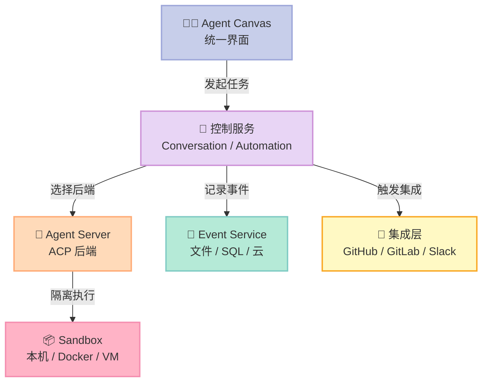
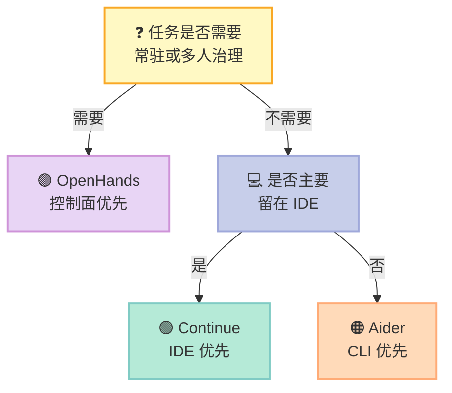

> **反常识结论：Coding Agent 的下一场竞争，不是“谁更会写代码”，而是“谁能把多个 Agent 安全地跑起来、持续运行并接受审计”。** OpenHands 正从单 Agent 产品转向一个自托管控制面（control plane）。

## 摘要

本文聚焦 [OpenHands](https://github.com/All-Hands-AI/OpenHands)，并与 [Aider](https://github.com/Aider-AI/aider)、[Continue](https://github.com/continuedev/continue) 比较。调研快照为 **2026-07-18**：GitHub API 分别显示三者约 **81,128 / 47,467 / 34,938 Stars**；数字会继续变化。

我基于 OpenHands `main` 分支提交 `11d4ecf21fc144d10a614ddba63b84de5c90bfd4` 阅读 README、`openhands/app_server/sandbox/`、`event/`、`app_conversation/` 与测试。结论很明确：**OpenHands 最值得研究的不是提示词，而是 Agent Canvas + Agent Server + Sandbox + Event Service 组成的运行控制面。**

## 1. 为什么选“控制面”类别

近期系列已经覆盖浏览器运行时、记忆、MCP 网关、工作流、SDD 与上下文压缩，但缺少一个问题：**当团队同时运行 OpenHands、Claude Code、Codex、Gemini 时，谁负责会话、权限、定时任务和远程后端？**

OpenHands README 当前把产品定义为“self-hosted developer control center”，并明确支持 OpenHands、Claude Code、Codex、Gemini 及任何兼容 Agent-Client Protocol（ACP）的 Agent。它不是再造一个聊天框，而是在造 Agent 的“机房控制台”。

## 2. 源码看到的四层架构



### 2.1 Canvas 与 Server 解耦

README 明确写出：一个 Agent Server 运行在单一 host/port，Canvas 可以连接多个 Server，并在本地、远程和云端后端间切换。**界面不是运行时，运行时也不绑定界面。**

这项拆分解决了真实团队问题：代码审查 Agent 可以放在共享 VM，涉及私有仓库的 Agent 留在公司网络，个人实验则跑在笔记本；用户仍从一个 Canvas 操作。

### 2.2 Sandbox 是安全边界，不是附加功能

`openhands/app_server/sandbox/README.md` 将 `SandboxService` 定义为生命周期抽象，并列出 Docker 实现、规格服务与 FastAPI Router。项目 Quickstart 也直接警告：无沙箱模式会让 Agent 获得主机文件系统完整权限。

**因此安全默认值应是 Docker/VM 隔离，而非本机直跑。** 这不是保守：Coding Agent 可以执行 shell、安装包、读取环境变量，错误命令的破坏半径远高于普通聊天机器人。

### 2.3 Event Service 让长任务可恢复、可审计

源码中事件层不是单一文件：`FilesystemEventService`、`SQLEventCallbackService`、`AwsEventService`、`GoogleCloudEventService` 都有独立实现。会话元数据与成本事件也在 `sql_app_conversation_info_service.py` 中持久化。

这意味着“Agent 做了什么”可以成为可查询事件，而不只是终端里滚走的文本。对于持续数小时的修复任务，**事件日志就是控制面的事实源**。

## 3. 映射 Harness 六件套

| 组件 | OpenHands 落点 | 工程价值 |
|---|---|---|
| Rule | 仓库指令、权限与安全配置 | 限定 Agent 行为边界 |
| Skill | `skills/*.md` 与技能 API | 复用代码审查、Kubernetes 等能力 |
| Sub-Agent | 多后端与 ACP Agent | 同一界面切换不同执行者 |
| Workflow | Automation Server、定时与 webhook | 把一次对话变成持续任务 |
| Script | CLI、Docker 启动、服务脚本 | 可重复部署和运维 |
| MCP | MCP 路由及集成测试 | 接入外部工具生态 |

六件套并非每项都由同一进程完成。OpenHands 的关键选择是：**用协议与服务边界拼成完整 Harness，而不是把所有能力塞进 Agent Loop。**

## 4. 与 Aider、Continue 横向对比

| 维度 | OpenHands | Aider | Continue |
|---|---|---|---|
| 核心定位 | 自托管 Agent 控制面 | 终端结对编程 | IDE 内开源编码助手平台 |
| 主要入口 | Web Canvas + API | CLI | VS Code / JetBrains |
| 多 Agent 后端 | ✅ ACP 与多 Server | ❌ 主要是单 CLI 会话 | ⚠️ 多模型/规则，非统一运行控制面 |
| 执行隔离 | ✅ Docker、VM、远程后端 | ⚠️ 继承当前 shell 权限 | ⚠️ 依赖 IDE/本地环境边界 |
| 自动化 | ✅ schedule、webhook、集成 | ⚠️ 可脚本化 CLI | ✅ CI/IDE 工作流能力 |
| 事件与会话持久化 | ✅ 文件、SQL、云实现 | ⚠️ Git 与聊天历史 | ✅ IDE 会话与平台能力 |
| 部署复杂度 | 高 | 低 | 中 |
| 最适合 | 团队、长任务、集中治理 | 个人终端快速改代码 | IDE 团队与上下文辅助 |

**我的判断：不要用 OpenHands 替代 Aider，也不要用 Aider 模拟控制面。** 单人、单仓、十分钟修复，Aider 的低摩擦更合适；开发者整天留在 IDE，Continue 更自然；需要远程常驻、多个 Agent、审计和触发器时，OpenHands 才体现优势。

## 5. 真实可运行：安全启动与 200 健康检查

下面脚本使用 OpenHands README 当前给出的 `ghcr.io/openhands/agent-canvas:1`。它只挂载指定项目目录与配置目录，并等待首页返回 HTTP 200。前提是已经安装 Docker。

```bash
#!/usr/bin/env bash
set -euo pipefail

PROJECTS_PATH="${PROJECTS_PATH:-$HOME/projects}"
CONFIG_PATH="${CONFIG_PATH:-$HOME/.openhands}"
CONTAINER="openhands-agent-canvas"

mkdir -p "$PROJECTS_PATH" "$CONFIG_PATH"
docker rm -f "$CONTAINER" >/dev/null 2>&1 || true

docker run -d --name "$CONTAINER" \
  -p 8000:8000 \
  -v "$CONFIG_PATH:/home/openhands/.openhands" \
  -v "$PROJECTS_PATH:/projects" \
  ghcr.io/openhands/agent-canvas:1

# 最多等待 120 秒；非 200 不算就绪
for i in $(seq 1 60); do
  code=$(curl -sS -o /dev/null -w '%{http_code}' http://127.0.0.1:8000/ || true)
  if [ "$code" = "200" ]; then
    echo "OpenHands ready: http://127.0.0.1:8000/"
    exit 0
  fi
  sleep 2
done

docker logs "$CONTAINER"
exit 1
```

如果仓库含密钥，不要把整个 `$HOME` 挂进容器。应单独复制测试仓库，并给云凭据最小权限。生产环境还应增加反向代理认证、网络出口策略、CPU/内存限制与审计日志保留周期。

## 6. 优势、代价与风险

| 项目 | 具体判断 | 应对措施 |
|---|---|---|
| 优势 | 多后端统一入口，支持本地/远程/云 | 按数据敏感度路由后端 |
| 优势 | Sandbox 生命周期有抽象层 | 生产默认 Docker/VM |
| 优势 | 事件服务有多种持久化实现 | 将事件接入集中审计 |
| 代价 | 组件多，运维成本高于 CLI | 小团队先单机 Docker |
| 风险 | README 标注代码正在迁移到 software-agent-sdk 与 agent-canvas | 固定镜像版本并跟踪迁移公告 |
| 风险 | 无沙箱模式拥有主机完整文件权限 | 禁止在生产主机直跑 |
| 风险 | 第三方 Agent 能力与权限模型不完全一致 | 为每个 ACP 后端做能力白名单 |

这里最容易被忽略的是迁移风险。当前仓库 README 已明确指出 Agent/Agent Server 源码迁往 `OpenHands/software-agent-sdk`，Canvas 源码迁往 `OpenHands/agent-canvas`。**评估 OpenHands 时必须把它视为多仓体系，而不是只盯一个仓库目录。**

## 7. 选型建议



给团队的落地顺序是：

1. **先隔离**：用 Docker 跑一个非敏感仓库，验证挂载边界。
2. **再持久化**：确认会话、事件和成本能够追溯。
3. **后接自动化**：先代码审查 webhook，再考虑自动修复。
4. **最后多 Agent**：为 OpenHands、Claude Code、Codex 分别定义权限和适用任务，不做盲目路由。

## 结论

OpenHands 的核心竞争力已经从“一个会写代码的 Agent”转向“让多个 Agent 安全、持续、可观察地工作”。与 Aider、Continue 相比，它牺牲了部署轻量性，换来远程后端、沙箱、事件持久化和自动化治理。

**行动建议：个人开发者先用 Aider 或 Continue；当任务需要跨机器常驻、统一入口和审计时，再引入 OpenHands。控制面不是功能越多越好，而是必须让每一次 Agent 执行都有边界、有记录、能停止。**

## 参考资料

- [OpenHands / OpenHands](https://github.com/All-Hands-AI/OpenHands)
- [OpenHands software-agent-sdk](https://github.com/OpenHands/software-agent-sdk)
- [OpenHands agent-canvas](https://github.com/OpenHands/agent-canvas)
- [Aider](https://github.com/Aider-AI/aider)
- [Continue](https://github.com/continuedev/continue)
