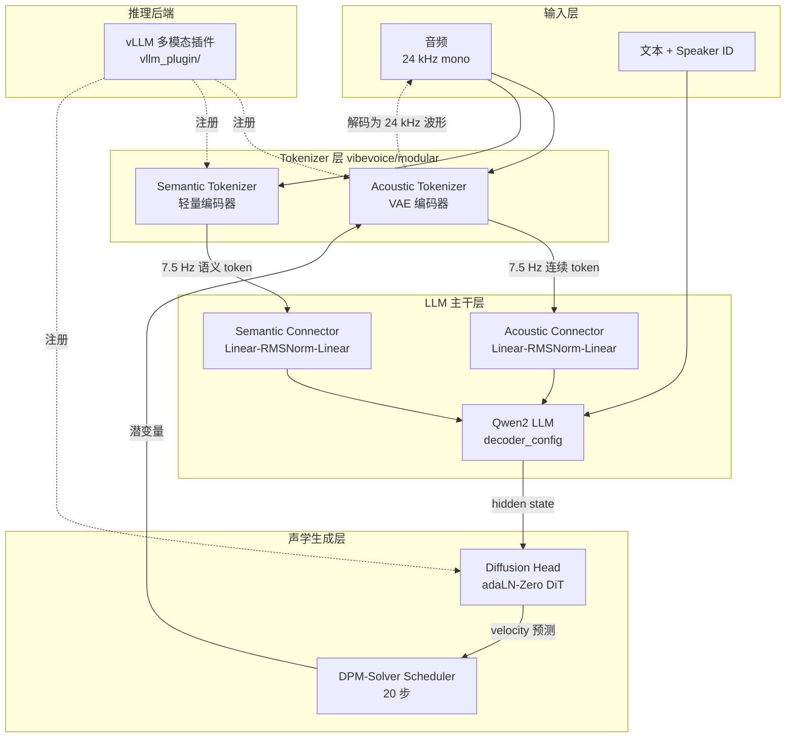
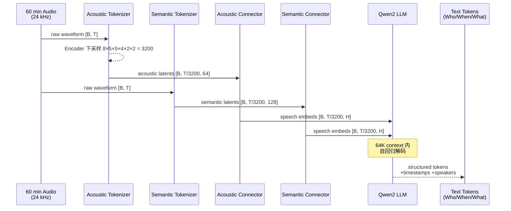

## 一、引子：为什么「长语音」一直是语音 AI 的硬骨头

过去两年，语音合成（TTS）与语音识别（ASR）在大模型时代都被「重写」了一遍——CosyVoice、Whisper、SeamlessM4T、F5-TTS、GPT-SoVITS……但只要稍微往生产落地走一步，三道坎立刻出现：

1. **长度塌缩**：Whisper 把长音频切成 30 秒窗口，多说话人会议切完角色就乱套了；
2. **风格断裂**：超过 2 分钟的合成语音，韵律与情绪就开始循环重复，听感塑料感很重；
3. **角色一致性**：让一个播客里的 4 个角色保持 90 分钟不掉线，几乎没有开源方案能稳定做到。

微软 2025 年 8 月开源的 **VibeVoice**（⭐ 50.1k / 🍴 5.6k / MIT），把这三个问题合并成一道大题：**「7.5 Hz 连续语音 Tokenizer + LLM 文本理解 + Next-Token Diffusion 声学生成」**。其中 TTS 部分在 2026 年 1 月 ICLR 上拿了 Oral 论文（[FihSkzyxdv](https://openreview.net/pdf?id=FihSkzyxdv)），ASR 部分单独发了 [arXiv 技术报告 2601.18184](https://arxiv.org/pdf/2601.18184)。

这篇文章会带你钻进 `microsoft/VibeVoice` 仓库的 `vibevoice/modular/` 目录，从配置文件到扩散头、从声学 tokenizer 的下采样倍率到 vLLM 多模态插件注册逻辑，把整个栈拆开来看一遍。

> 本文基于 `microsoft/VibeVoice` 仓库 `main` 分支（截至 2026-07-18，⭐ 50,130 / 🍴 5,611 / MIT / Python）。

---

## 二、项目定位与核心价值

### 2.1 一句话定义

> **VibeVoice 是一个以 7.5 Hz 连续语音 Token 为中间表示、用 LLM 统一理解文本/语音上下文、再由扩散头生成高保真声学细节的开源前沿语音 AI 家族**，包含 VibeVoice-ASR-7B、VibeVoice-TTS-1.5B、VibeVoice-Realtime-0.5B 三个权重，覆盖 60 分钟长音频 ASR、90 分钟多人 TTS、300 ms 延迟流式 TTS 三类任务。

### 2.2 三个模型各自瞄准的「长度×角色×延迟」三角

| 模型 | 任务 | 关键指标 | HuggingFace |
|------|------|----------|-------------|
| **VibeVoice-ASR-7B** | 长音频转写 | 60 分钟单 pass、Who/When/What 结构化输出、50+ 语言、自定义热词 | [microsoft/VibeVoice-ASR](https://huggingface.co/microsoft/VibeVoice-ASR) |
| **VibeVoice-TTS-1.5B** | 多说话人合成 | 90 分钟单 pass、最多 4 个说话人、中英及跨语言、自发歌唱 | [microsoft/VibeVoice-1.5B](https://huggingface.co/microsoft/VibeVoice-1.5B) |
| **VibeVoice-Realtime-0.5B** | 流式合成 | 300 ms 首音延迟、~10 分钟稳定生成、9 语言 | [microsoft/VibeVoice-Realtime-0.5B](https://huggingface.co/microsoft/VibeVoice-Realtime-0.5B) |

> ⚠️ **重要变动**：2025-09-05 仓库 NEWS 中写到，VibeVoice-TTS 代码因被滥用而**从仓库移除**，TTS 权重 HF 上仍可下载；ASR 与 Realtime 子项目仍在持续维护，2026-03-06 ASR 还合入了 Hugging Face Transformers 主线。下面的架构分析以 **仓库当前可见的 ASR + Realtime 源码** 为准，TTS 部分引用论文和 config 复述。

### 2.3 与既有方案的根本差异：为什么不是「又一个 TTS」

| 维度 | 传统 TTS / ASR | VibeVoice |
|------|---------------|-----------|
| 帧率 | 50–200 Hz（SoundStream / EnCodec） | **7.5 Hz** 连续 token（声学+语义双轨） |
| 声学生成 | 离散 VQ + 自回归解码 | **Next-token diffusion**（LLM 走文本/语义、扩散头出声学细节） |
| 角色建模 | 拼接 reference embedding | 文本侧 speaker token + 扩散头条件 |
| 长度上限 | 30 s 窗口为主 | **ASR 60 min / TTS 90 min 单 pass** |
| 推理后端 | HF transformers 单跑 | **vLLM 多模态插件**（first-class registry） |

最关键的是「**7.5 Hz**」这个数字——它把一分钟的音频压成 450 个 token，相对 50 Hz 编码节省了 6.7× 的序列长度，**这是「60 分钟单 pass」能成立的物理基础**。

---

## 三、架构总览（重点）

### 3.1 五层组件分层

VibeVoice 的代码组织非常干净，把所有可复用模块放到 `vibevoice/modular/` 下，processor 层做特征预处理，schedule 层做扩散调度：



### 3.2 数据流：从一段 60 分钟音频到转写

下面是 ASR 模型的端到端前向路径（来自 `vibevoice/modular/modeling_vibevoice_asr.py`）：



关键比例：24000 Hz / 3200 ≈ **7.5 Hz**——这就是声学/语义 Tokenizer 的输出帧率，也是整个系统能用 64K context 吃下 60 分钟音频的核心算式。

### 3.3 模块职责一览

| 模块 | 文件 | 职责 |
|------|------|------|
| `VibeVoiceAcousticTokenizerConfig` | `configuration_vibevoice.py` | VAE 编码器下采样 `[8,5,5,4,2,2]=3200`、causal、fix_std=0.5、混合分布 |
| `VibeVoiceSemanticTokenizerConfig` | `configuration_vibevoice.py` | 纯编码器、64→128 维语义空间、Gaussian 噪声被关掉（fix_std=0, std_dist_type='none'） |
| `VibeVoiceDiffusionHeadConfig` | `configuration_vibevoice.py` | 4 层 DiT-style Head、head_ffn_ratio=3.0、v_prediction、DDPM cosine、20 步推理 |
| `TokenizerEncoder` | `modular_vibevoice_tokenizer.py` | SConv1d + Block1D + ConvRMSNorm 多阶段下采样，支持 streaming cache |
| `TokenizerDecoder` | `modular_vibevoice_tokenizer.py` | 反向 ConvTranspose1d 镜像上采样 |
| `SpeechConnector` | `modeling_vibevoice.py` | `Linear(input_dim, hidden) → RMSNorm → Linear(hidden, hidden)`，把 VAE latent 投到 LLM 维度 |
| `VibeVoiceDiffusionHead` | `modular_vibevoice_diffusion_head.py` | adaLN-Zero 调制 + timestep embedder + 4× HeadLayer + FinalLayer |
| `DPMSolverMultistepScheduler` | `vibevoice/schedule/dpm_solver.py` | 把 DDPM 训练好的 v_prediction 模型用 20 步多步求解 |

---

## 四、核心机制

### 4.1 声学 Tokenizer：7.5 Hz 是怎么算出来的？

读 `configuration_vibevoice.py` 的 encoder 部分，最关键的两行是：

```python
encoder_ratios: Optional[List[int]] = [8, 5, 5, 4, 2, 2]
encoder_depths: str = "3-3-3-3-3-3-8"
```

把所有 ratio 连乘得到总下采样倍率：

```
8 × 5 × 5 × 4 × 2 × 2 = 3200
```

音频采样率 24 kHz，token 帧率 = 24000 / 3200 = **7.5 Hz**。换算一下：

- 1 分钟音频 → 450 token
- 60 分钟音频 → 27,000 token（落在 Qwen2 的 64K context 内还有富余）
- 90 分钟音频 → 40,500 token（TTS-1.5B 长度的来源）

更细的设计差别藏在「声学 vs 语义」两条 tokenizer 轨道的 `std_dist_type` 上：

```python
# 声学 tokenizer：VAE 风格，固定方差 0.5 的高斯
VibeVoiceAcousticTokenizerConfig(std_dist_type='gaussian', fix_std=0.5)

# 语义 tokenizer：纯编码器，没有噪声通道
VibeVoiceSemanticTokenizerConfig(std_dist_type='none', fix_std=0)
```

> 设计意图：声学 token 负责「声波长得什么样」——需要 VAE 的连续潜空间给扩散头去噪；语义 token 负责「这句话在讲什么」——离散、信息密度高，给 LLM 当文本理解用的「另种语言」。

### 4.2 Speech Connector：把 64 维潜变量喂进 Qwen2

中间最不起眼但不可省略的是 `SpeechConnector`（`modeling_vibevoice.py:59`），它是声学/语义 latent 进入 LLM 词表空间的唯一通道：

```python
class SpeechConnector(nn.Module):
    def __init__(self, input_dim, output_dim):
        super().__init__()
        self.fc1 = nn.Linear(input_dim, output_dim)
        self.norm = LlamaRMSNorm(output_dim, eps=1e-6)
        self.fc2 = nn.Linear(output_dim, output_dim)

    def forward(self, features, **kwargs):
        x = self.fc1(features)
        x = self.norm(x)
        x = self.fc2(x)
        return x
```

两层 Linear 中间夹一个 RMSNorm。这个结构看似简单，但它做了三件事：

1. **维度对齐**：把 64/128 维潜空间压/扩到 Qwen2 的 `hidden_size`（896 / 1536 / 3072）；
2. **分布归一化**：RMSNorm 让 latent 的尺度与文本 token embedding 同分布，否则 LLM 第一层 attention 就会被「语音那边方差大、文本那边方差小」撕裂；
3. **可学习非线性**：纯 Linear + Norm 等价于 1 个 Affine，FC2 让两个维度交互，避免出现「某一维 latent 永远是死值」。

### 4.3 Next-Token Diffusion：让 LLM 学会「指挥」扩散头

整个 VibeVoice 最反直觉的设计是：**LLM 不直接预测语音 token，而是预测 latent，然后扩散头把 latent「唱出来」**。

读 `modular_vibevoice_diffusion_head.py` 的核心模块：

```python
class TimestepEmbedder(nn.Module):
    """把扩散时间步 t 编码成 hidden_size 向量"""
    def __init__(self, hidden_size, frequency_embedding_size=256):
        super().__init__()
        self.mlp = nn.Sequential(
            nn.Linear(frequency_embedding_size, hidden_size, bias=False),
            ACT2FN['silu'],
            nn.Linear(hidden_size, hidden_size, bias=False),
        )

    @staticmethod
    def timestep_embedding(t, dim, max_period=10000):
        # 标准 sinusoidal embedding（与 DiT 一致）
        half = dim // 2
        freqs = torch.exp(
            -math.log(max_period) * torch.arange(start=0, end=half, dtype=torch.float32) / half
        ).to(t.device)
        args = t[:, None].float() * freqs[None]
        embedding = torch.cat([torch.cos(args), torch.sin(args)], dim=-1)
        return embedding.to(t.dtype)
```

再看每一层如何「吃」条件：

```python
class HeadLayer(nn.Module):
    def forward(self, x, c):
        shift_ffn, scale_ffn, gate_ffn = self.adaLN_modulation(c).chunk(3, dim=-1)
        x = x + gate_ffn * self.ffn(modulate(self.norm(x), shift_ffn, scale_ffn))
        return x
```

这是 **DiT 的 adaLN-Zero** 配方：`c` 由 LLM hidden state + timestep embedding 相加得到，每层先用 SiLU + Linear 把 `c` 切成 (shift, scale, gate) 三份，再 modulate FFN 输出。初始化时：

```python
nn.init.constant_(layer.adaLN_modulation[-1].weight, 0)
nn.init.constant_(self.final_layer.linear.weight, 0)
```

把 adaLN 和最后一层都置零——这是 DiT 论文里验证过的「identity initialization」，让网络在训练早期等价于恒等映射，**让 LLM 的 hidden 主导早期梯度**。

最终 4 层堆叠 + FinalLayer 输出与 latent 维度相同（默认 64）的速度预测 v，再用 DPM-Solver 20 步采样出干净的 latent，由声学 Tokenizer 解码回 24 kHz 波形。

### 4.4 ASR 输出结构化：Who/When/What 怎么生成？

VibeVoice-ASR 与传统 ASR 最大的不同是：**它和 LLM 一起把说话人、时间戳、内容三件事联合解码**。具体做法是把标注好的特殊 token 设计成 prompt，LLM 用自回归的方式把它们一起吐出来。仓库 `vibevoice_asr_processor.py` 暴露了 processor，你只需要传音频 +（可选）hotwords，模型就能给出结构化文本：

```python
from transformers import AutoModel, AutoProcessor

processor = AutoProcessor.from_pretrained("microsoft/VibeVoice-ASR")
model = AutoModel.from_pretrained("microsoft/VibeVoice-ASR", torch_dtype="bfloat16")

# 60 分钟长音频
audio, sr = load_audio_use_ffmpeg("long_meeting.wav", target_sr=24000)
inputs = processor(audio=audio, sampling_rate=24000, return_tensors="pt").to("cuda")

output_ids = model.generate(**inputs, max_new_tokens=4096)
transcript = processor.batch_decode(output_ids, skip_special_tokens=False)[0]
# transcript 形如：
# <|speech_start|>
# [Speaker_1] [00:00:00 - 00:00:12] Good morning everyone, let's start the meeting.
# [Speaker_2] [00:00:13 - 00:00:25] Thanks for joining, today we'll discuss...
# <|speech_end|>
```

论文里展示的对比是：在 AMI 语料上 cpWER / DER / tcpWER 三项指标全面优于 Whisper-Longform、Pyannote+Whisper pipeline 等 baseline，单模型端到端、**不需要额外的说话人 embedding 提取器**。

### 4.5 流式推理：300 ms 首音延迟怎么做？

Realtime-0.5B 的代码在 `demo/web/app.py` 的 `StreamingTTSService` 类里完整呈现了工程取舍：

```python
class StreamingTTSService:
    def __init__(self, model_path, device="cuda", inference_steps=5):
        self.model_path = model_path
        self.inference_steps = inference_steps   # 比离线版少 4× 步数
        self.sample_rate = 24_000
        # ...
        self.processor: Optional[VibeVoiceStreamingProcessor] = None
        self.model: Optional[VibeVoiceStreamingForConditionalGenerationInference] = None
```

注意三个关键设计：

1. **Diffusion 步数砍到 5 步**：从 20 步压到 5 步，靠 DPM-Solver 的多步求解保持音质；
2. **FastAPI WebSocket**：客户端发文本，服务器流式推 PCM bytes；
3. **StreamingCache**：`modular_vibevoice_tokenizer.py` 里的 `VibeVoiceTokenizerStreamingCache` 给 tokenizer 维护 KV 缓存，**新文本 chunk 进来时不必重算历史音频 embedding**，这是 300 ms 首音延迟能稳定的工程关键。

启动方式（HuggingFace 一键加载）：

```bash
python -m vllm.entrypoints.openai.api_server \
    --model microsoft/VibeVoice-ASR \
    --port 8000 \
    --trust-remote-code
```

---

## 五、对比分析

| 维度 | **VibeVoice (Microsoft)** | **CosyVoice 2 (FunAudioLLM)** | **Whisper-Large-v3 (OpenAI)** |
|------|---------------------------|-------------------------------|-------------------------------|
| 帧率 | 7.5 Hz 连续（声学+语义双轨） | 25 Hz 离散 VQ | / |
| 声学生成 | Next-token diffusion (DiT head) | 自回归 VQ + Flow Matching | / |
| 长度上限 | ASR 60 min / TTS 90 min | TTS ~30 min | ASR 30 min 窗口（需切片） |
| 角色建模 | LLM 文本侧 speaker token | Prompt reference audio | 需外部 diarization |
| 推理后端 | vLLM 多模态插件 | HF transformers / TRT-LLM | HF transformers / faster-whisper |
| 长音频 WER | SOTA on AMI | 一般 | 切片误差累积 |
| 多说话人 TTS | 4 角色 90 min 稳定 | 1-2 角色 | / |
| 开源 | MIT（仓库）/ 模型 HF 下载 | Apache-2.0 | MIT |

**设计哲学差异**：

- **Whisper 路**：纯编码器 + CTC，把「长音频」切成 30 秒 patch，靠外部 VAD + diarization 兜底——简单、稳，但说话人一致性永远要靠后处理。
- **CosyVoice 2 路**：把 reference audio 拼成 prompt，靠 Flow Matching 在 latent 空间补细节——音色好，但长 prompt 累积漂移。
- **VibeVoice 路**：把「听」和「说」统一抽象成「语言建模 + 扩散」两件事，**让 LLM 的长 context 能力直接外溢到语音**，这是「60 min 单 pass」能成立的根因。

代价也很明显：需要 7B/1.5B 的 LLM 主干 + 扩散头，推理显存比 Whisper-Large 大一个数量级；TTS 代码甚至因滥用被微软主动撤掉——这反而让工程团队更愿意把它当成「ASR + Realtime」两条腿来用。

---

## 六、使用指南

### 6.1 环境与依赖

```bash
git clone https://github.com/microsoft/VibeVoice.git
cd VibeVoice
pip install -e .

# 必备依赖
pip install torch==2.5.0 transformers>=4.48 accelerate soundfile ffmpeg-python
# 若要 vLLM 推理
pip install vllm>=0.6.0
```

### 6.2 ASR 最小可运行示例

```python
# 文件：examples/asr_demo.py
import torch
from transformers import AutoModel, AutoProcessor
from vibevoice.processor.audio_utils import load_audio_use_ffmpeg

# 1. 加载 24 kHz 单声道音频
audio, sr = load_audio_use_ffmpeg("meeting_60min.wav", target_sr=24000)
print(f"Loaded {len(audio)/sr:.1f}s @ {sr} Hz")

# 2. 加载 processor + 模型
processor = AutoProcessor.from_pretrained("microsoft/VibeVoice-ASR")
model = AutoModel.from_pretrained(
    "microsoft/VibeVoice-ASR",
    torch_dtype=torch.bfloat16,
    attn_implementation="flash_attention_2",
).cuda().eval()

# 3. 可选：自定义 hotwords（让 "Qwen2.5" 这种专有名词转写更准）
inputs = processor(
    audio=audio,
    sampling_rate=24000,
    hotwords=["Qwen2.5", "AdaLN-Zero", "ICLR"],
    return_tensors="pt",
).to("cuda")

# 4. 生成（最长 60 分钟音频用 max_new_tokens=4096 已足够）
with torch.no_grad():
    output_ids = model.generate(
        **inputs,
        max_new_tokens=4096,
        do_sample=False,
        num_beams=1,
    )

# 5. 解码为结构化转写
transcript = processor.batch_decode(output_ids, skip_special_tokens=False)[0]
print(transcript)
```

### 6.3 流式 TTS Web 演示

仓库自带 `demo/web/app.py`，一行起服务：

```bash
python demo/web/app.py \
    --model_path microsoft/VibeVoice-Realtime-0.5B \
    --device cuda \
    --port 7860
```

打开浏览器访问 `http://localhost:7860`，输入英文文本，点「Stream」即可听到约 300 ms 延迟的合成语音。

### 6.4 vLLM 部署（生产推荐）

```bash
python -m vllm.entrypoints.openai.api_server \
    --model microsoft/VibeVoice-ASR \
    --port 8000 \
    --trust-remote-code \
    --max-model-len 65536 \
    --dtype bfloat16
```

客户端走 OpenAI 兼容协议，音频走 `audio_url` 字段（vLLM 的 `AudioMediaIO` 已被仓库里 `_PatchedAudioMediaIO` 替换为 FFmpeg 解码，跨格式一致性更好）。

### 6.5 Finetune：LoRA 微调 ASR

仓库自带 `finetuning-asr/lora_finetune.py`，喂一段 `< 10 min` 的领域音频 + 转写即可：

```bash
python finetuning-asr/lora_finetune.py \
    --model_path microsoft/VibeVoice-ASR \
    --dataset_path ./my_medical_audio \
    --output_dir ./vibevoice-asr-medical \
    --lora_r 16 --lora_alpha 32 \
    --num_train_epochs 3 \
    --per_device_train_batch_size 1 \
    --gradient_accumulation_steps 8
```

---

## 七、趋势与思考

### 7.1 「超低帧率连续 Token + LLM + 扩散」正在成为语音 AI 的标准配方

VibeVoice 不是这条路的唯一玩家。OpenBMB 的 **VoxCPM**、阿里 **CosyVoice 3**（25 Hz 降到 ~12 Hz）、Meta **Spirit LM** 都在朝同一方向收敛：

- **低帧率 token**（≤ 12 Hz）让 LLM 主干的长 context 优势兑现到语音；
- **声学 VAE + 语义 token 双轨**解决了「内容 vs 音色」的解耦；
- **扩散头**取代纯自回归解码，把采样步数砍到 5-20 步即可获得高保真波形。

可以预期 2026 下半年会出现更多「7.5 Hz 类」「10 Hz 类」的连续语音 tokenizer，让「**90 分钟单 pass 语音 AI**」从论文 demo 走向开源默认能力。

### 7.2 微软撤掉 TTS 代码背后的工程伦理

2025-09-05 的 README NEWS 一句话提到：

> "After release, we discovered instances where the tool was used in ways inconsistent with the stated intent. Since responsible use of AI is one of Microsoft's guiding principles, we have removed the VibeVoice-TTS code from this repository."

这件事值得专门思考：**开源前沿语音模型的最大风险不是性能，而是 deepfake 与诈骗**。当 90 分钟 / 4 角色 / 中英文混合的合成质量到了一定阈值，社工攻击的边际成本会降到几乎为零。VibeVoice 的应对策略——**保留 ASR 与 Realtime、撤掉长 TTS 主体代码**——是一种「保留研究、限制滥用」的折中。后续做语音 AI 的团队，可能都要在「完全开源 vs 限制使用」之间做类似的工程权衡。

### 7.3 与 LLM Agent 的耦合点

VibeVoice 的 ASR 输出直接是结构化 token（Who/When/What），天然适合塞进 Agent 的 working memory。结合 [memU](https://github.com/...) 之类长期记忆系统，可以让 Agent：

1. 听完 60 min 会议 → 直接生成 `Speaker_1` 的观点总结 + 时间戳；
2. 在实时语音流中用 300 ms 延迟做口语对话，配合 Pipecat / LiveKit Agents 框架做完整 voice agent；
3. 把「听到的话」以 `<|speech_start|>...<|speech_end|>` 的形式存档，下次会话时 hotwords 直接命中。

语音 + Agent + 长期记忆的融合，会是 2026 下半年最具想象力的应用方向之一。

### 7.4 给工程团队的实操建议

| 角色 | 建议 |
|------|------|
| ASR 应用开发者 | 直接上 VibeVoice-ASR + vLLM，单模型替代 Whisper + Pyannote pipeline，部署显存 ≥ 24 GB 即可 |
| TTS 应用开发者 | Realtime-0.5B 仍可用，TTS-1.5B 走 HF 权重但自己写推理；商用场景务必加显式水印 |
| 研究者 | 重点关注 `vibevoice/modular/modular_vibevoice_diffusion_head.py` 与 `dpm_solver.py`，这是 DiT 在语音域迁移的最佳实践 |
| Agent 工程师 | 把 ASR 结构化输出当成 Agent 工具调用的「听觉」入口，与 `mcpatlas` / `mcp-gateway` 这类 MCP 框架对接 |

---

**参考链接**

- 仓库：<https://github.com/microsoft/VibeVoice>
- 项目主页：<https://microsoft.github.io/VibeVoice>
- ASR 权重：<https://huggingface.co/microsoft/VibeVoice-ASR>
- Realtime 权重：<https://huggingface.co/microsoft/VibeVoice-Realtime-0.5B>
- TTS ICLR 2026 Oral：<https://openreview.net/pdf?id=FihSkzyxdv>
- ASR 技术报告：<https://arxiv.org/pdf/2601.18184>
- ASR Transformers 合入说明：[VibeVoice-ASR-HF](https://huggingface.co/microsoft/VibeVoice-ASR-HF)

> 本文中所有仓库数据均来自 `microsoft/VibeVoice` `main` 分支，截至 2026-07-18。TTS 主体代码因负责任使用原则已被移除，相关分析基于仓库历史代码与公开论文。