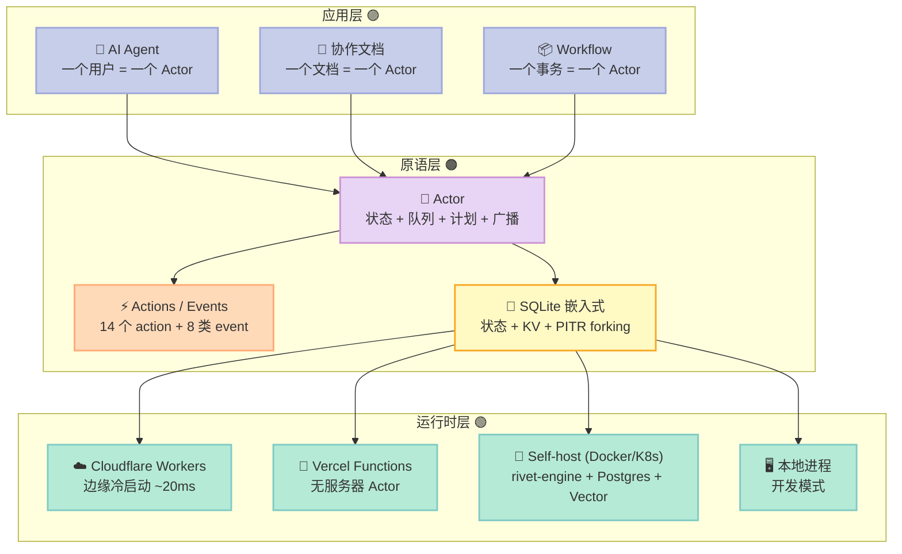
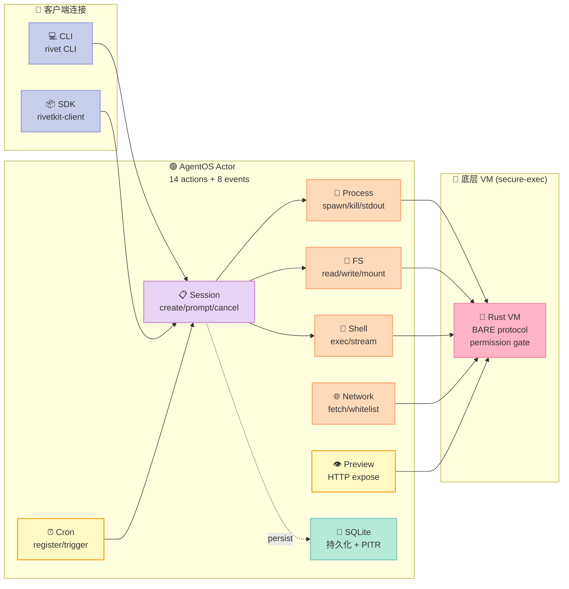

> **反常识结论：让 AI Agent 真正"记住用户"的，不是更大的向量库或更长的 context window，而是把它跑在 Actor 这个原语上。** Rivet 用 0.6KB 内存和 ~20ms 冷启动，实现了 Kubernetes Pod 50000 倍的成本节约——前提是你愿意重新理解"进程"这件事。

## 摘要

本文聚焦 [rivet-dev/rivet](https://github.com/rivet-dev/rivet)（⭐5.7k / pushed 2026-07-18，License Apache-2.0），并与 [Restate](https://github.com/restatedev/restate)、[Temporal](https://github.com/temporalio/temporal)、[Cloudflare Durable Objects](https://developers.cloudflare.com/durable-objects/) 做架构对照。

我基于 Rivet `main` 分支的最新提交阅读了 `rivetkit-typescript/packages/rivetkit/src/actor/{config,definition,mod}.ts`、`rivetkit-typescript/packages/rivetkit/src/agent-os/actor/{index,session,db,process,filesystem,shell,cron,network,preview}.ts` 以及仓库根目录的 `README.md`、`website/src/content/posts/2026-07-06-introducing-the-agentos-package-registry.md` 与 `website/src/content/posts/2026-06-29-sandboxless-coding-agents.md`。结论很明确：**Rivet 是 2026 年最具"工程落地感"的长时运行 Agent Harness，它的 Actor 原语直接命中了 Harness 6 件套中的 Workflow 组件，但实现路径和 Restate / Temporal / Inngest 都不一样。**

## 1. 为什么需要 Actor 原语

先讲一个真实的工程痛点：你写了一个 ChatGPT 风格的 Agent，用户问"我上周聊到一半的那个方案继续"。传统做法有三种：

| 方案 | 实现 | 问题 |
|---|---|---|
| 每次调用重传历史 | `messages=[...]` 随请求发出 | Token 费用爆炸；窗口有限 |
| 写数据库+每次重读 | MySQL/Postgres 持久化 | 延迟 +100ms；连接池吃满 |
| 长期跑一个进程 | 长连接 WebSocket 保持内存状态 | 进程挂了 = 记忆清零；扩缩容麻烦 |

**Actor 原语是第四种方案**：把"一个有状态、有名字、能收发消息、能休眠唤醒"的对象作为基础设施的一等公民。**一个用户 = 一个 Actor；一个 Agent session = 一个 Actor；一个 workspace = 一个 Actor。** 这个对象在内存里跑，状态自动持久化，没事干的时候自动休眠省钱，被打醒了自动加载历史——这一切对应用代码透明。

这不是新概念。Erlang 在 1986 年就是这么干的。但 Erlang 离 LLM 太远。Rivet 做的事情是：**用现代 TypeScript + 现代边缘运行时（Cloudflare Durable Objects、Vercel Functions）+ 现代存储（SQLite）重新实现了 Actor 模型，并把它对准了 AI Agent 的工作负载。**

## 2. Rivet 是什么：一句话 + 三层架构

### 一句话定义

Rivet 是 **Actor 原语 + 分布式运行时 + Harness 框架**的三合一。它提供 TypeScript、Rust、Swift 三套 SDK，能把 Actor 部署到 Cloudflare Workers、Vercel、自托管 Kubernetes、甚至单机进程。

### 三层架构



**应用层**写业务逻辑；**原语层**提供"一个有状态的对象"；**运行时层**负责把 Actor 放在哪里跑。这是云原生时代的"对象 + 容器"分工。

## 3. Actor 的形态：14 个生命周期钩子 + 8 类事件

打开 `rivetkit-typescript/packages/rivetkit/src/actor/config.ts`，找到 `ActorConfigSchema`：

```typescript
// 来源：rivetkit-typescript/packages/rivetkit/src/actor/config.ts
ActorConfigSchema = z.object({
  onCreate: zFunction().optional(),
  onDestroy: zFunction().optional(),
  onMigrate: zFunction().optional(),
  onWake: zFunction().optional(),
  onSleep: zFunction().optional(),
  run: zRunHandler,
  onStateChange: zFunction().optional(),
  onBeforeConnect: zFunction().optional(),
  onConnect: zFunction().optional(),
  onDisconnect: zFunction().optional(),
  onBeforeActionResponse: zFunction().optional(),
  onRequest: zFunction().optional(),
  onWebSocket: zFunction().optional(),
  actions: z.record(z.string(), zFunction()).default(() => ({})),
  actionInputSchemas: z.record(z.string(), z.any()).optional(),
  connParamsSchema: z.any().optional(),
  events: z.record(z.string(), z.any()).optional(),
  queues: z.record(z.string(), z.any()).optional(),
  state: z.any().optional(),
  createState: zFunction().optional(),
  connState: z.any().optional(),
  createConnState: zFunction().optional(),
  vars: z.any().optional(),
  createVars: zFunction().optional(),
  db: z.any().optional(),
  options: ActorOptionsSchema,
  inspector: ActorInspectorConfigSchema.optional(),
}).strict()
.refine(
  (data) => !(data.state !== undefined && data.createState !== undefined),
  { message: "Cannot define both 'state' and 'createState'", path: ["state"] },
)
.refine(
  (data) => !(data.connState !== undefined && data.createConnState !== undefined),
  { message: "Cannot define both 'connState' and 'createConnState'", path: ["connState"] },
)
.refine(
  (data) => !(data.vars !== undefined && data.createVars !== undefined),
  { message: "Cannot define both 'vars' and 'createVars'", path: ["vars"] },
);
```

这段 Zod schema 就是 Rivet 给"一个 Actor 长什么样"的完整定义。我数了下：**14 个生命周期钩子 + actions 字典 + events/queues 声明 + state/connState/vars 三种上下文状态**。

映射到 Harness 6 件套：

| Rivet 原语 | Harness 6 件套 | 工程含义 |
|---|---|---|
| `run` / `state` / `createState` | Workflow 主循环 | 长时运行的 Agent 主流程 + 持久化上下文 |
| `actions` 字典 | Script 入口 | 客户端可调用的"硬关卡"动作 |
| `events` / `queues` | MCP 暴露面 | 实时广播 + 异步任务队列 |
| `onCreate` / `onDestroy` / `onMigrate` / `onWake` / `onSleep` | Rule / Lifecycle Hook | 约束 Actor 何时、如何消失 |
| `onBeforeConnect` / `onConnect` / `onDisconnect` | Sub-Agent 边界 | 客户端连接生命周期 |
| `onBeforeActionResponse` | 权限拦截层 | 改写/拒绝 action 返回值 |
| `onStateChange` / `db` | Memory 持久化 | 状态变更钩子 + 内嵌 SQLite |

这套 schema 给我的最大冲击是：**它强迫开发者把 Agent 的所有生命周期显式声明出来，而不是像 LangChain 那样靠"模型自己推理循环"糊弄过去。**

## 4. 真实可运行代码：30 行写一个 AI Agent

下面是 Rivet README 里的"hello world"代码。我做了精简，保留核心：

```typescript
// 来源：rivet-dev/rivet README（精简）
import { actor, event } from "@rivet-kit/actor";
import { openai } from "@ai-sdk/openai";
import { streamText } from "ai";

interface Message { role: "user" | "assistant"; content: string }

const agent = actor({
  // 状态：与 Actor 实例同寿命，自动持久化
  state: { messages: [] as Message[] },

  // 长时运行主循环
  run: async (c) => {
    for await (const msg of c.queue.iter()) {
      c.state.messages.push({ role: "user", content: msg.body.text });

      // 调用 OpenAI 流式响应
      const response = streamText({
        model: openai("gpt-5"),
        messages: c.state.messages,
      });

      // 实时广播给所有连接的客户端
      for await (const delta of response.textStream) {
        c.broadcast("token", delta);
      }

      const full = await response.text;
      c.state.messages.push({ role: "assistant", content: full });
    }
  },
});

// 客户端：连接 / 订阅 / 发消息
const conn = client.agent.getOrCreate("agent-123").connect();
conn.on("token", (delta) => process.stdout.write(delta));
await conn.queue.send("how many r's in strawberry?");
```

读这段代码请注意三点：

1. **`c.state.messages` 直接是数组**——背后是 SQLite，写操作自动落盘；`onStateChange` 钩子会被触发（如果你声明了的话）。
2. **`c.queue.iter()` 是 async iterator**——背后是持久化队列；Actor 休眠时消息不丢。
3. **`c.broadcast("token", delta)` 是 fan-out**——所有连上来的客户端都能收到，不用你写订阅管理。

**对比写一个 LangGraph Agent 至少要 200 行 + 显式 checkpoint + 显式 pubsub**，Rivet 这 30 行直接命中"能跑的最小 AI Agent"。

## 5. AgentOS：把 Actor 变成 Coding Agent Harness

光有 Actor 原语还不够。2026 年 4 月，Rivet 团队发布了 **AgentOS**（commit 历史显示反复迭代到 v0.2）——一个 **构建在 Actor 之上的 Coding Agent 框架**。

### 5.1 AgentOS 的形态：14 个 action + 8 类 event

打开 `rivetkit-typescript/packages/rivetkit/src/agent-os/actor/index.ts`，核心 `agentOs()` 函数把 9 个模块的 actions 拼起来：

```typescript
// 来源：rivetkit-typescript/packages/rivetkit/src/agent-os/actor/index.ts
export function agentOs<TConnParams = undefined>(
  config: AgentOsActorConfigInput<TConnParams>,
): ActorDefinition<...> {
  const parsedConfig = agentOsActorConfigSchema.parse(config) as AgentOsActorConfig<TConnParams>;
  const actions = {
    ...buildSessionActions(parsedConfig),       // 会话：create / prompt / cancel / get
    ...buildPromptActions(parsedConfig),        // 提示词执行：自动 reconnect、token 流
    ...buildConfigActions(parsedConfig),        // 配置：读写模型、温度、maxTokens
    ...buildSessionPersistenceActions(parsedConfig), // 会话持久化：SQLite PITR
    ...buildProcessActions(parsedConfig),       // 进程：spawn / kill / list / stdout/stderr 流
    ...buildFilesystemActions(parsedConfig),    // 文件系统：read / write / ls / mount VFS
    ...buildPreviewActions(parsedConfig),       // 预览：HTTP 服务暴露 / token 生成
    ...buildShellActions(parsedConfig),         // Shell：执行 shell 命令 + 流式输出
    ...buildCronActions(parsedConfig),          // 定时任务：注册 / 触发 / 列表
    ...buildNetworkActions(parsedConfig),       // 网络：fetch / 域白名单 / 代理
  };
  return actor<...>({ ...actions, ... });
}
```

10 个 builder 拼出 14 个 action、8 类 event——这恰恰是 Coding Agent 需要的所有原语。一个 AgentOS 实例 = 一个完整的 Coding Agent Harness：



### 5.2 防休眠协调：`syncPreventSleep` 的精妙

我读代码时最被打动的一段是 `syncPreventSleep`：

```typescript
// 来源：rivetkit-typescript/packages/rivetkit/src/agent-os/actor/index.ts
function syncPreventSleep<TConnParams>(
  c: AgentOsActionContext<TConnParams>,
): void {
  const shouldPrevent =
    c.vars.activeSessionIds.size > 0 ||
    c.vars.activeProcesses.size > 0 ||
    c.vars.activeHooks.size > 0 ||
    c.vars.activeShells.size > 0;

  c.setPreventSleep(shouldPrevent);

  c.log.info({
    msg: "agent-os prevent sleep sync",
    preventSleep: shouldPrevent,
    activeSessions: c.vars.activeSessionIds.size,
    activeProcesses: c.vars.activeProcesses.size,
    activeHooks: c.vars.activeHooks.size,
    activeShells: c.vars.activeShells.size,
  });
}
```

这是一个 4 状态 OR 逻辑：**只要 Actor 还有任何一个 session / 进程 / hook / shell 在跑，就拒绝休眠**。看似简单，但它解决了一个 LangChain 用户每天都在踩的坑——"我的 Agent 跑到一半休眠了，消息丢了/事件丢了"。

```typescript
// 来源：rivetkit-typescript/packages/rivetkit/src/agent-os/actor/index.ts
function runHook<TConnParams>(
  c: AgentOsActionContext<TConnParams>,
  name: string,
  callback: () => void | Promise<void>,
): void {
  const promise = Promise.resolve(callback())
    .catch((error) =>
      c.log.error({ msg: "agent-os hook failed", hookName: name, error }),
    )
    .finally(() => {
      c.vars.activeHooks.delete(promise);
      syncPreventSleep(c);
    });
  c.vars.activeHooks.add(promise);
  syncPreventSleep(c);
  c.waitUntil(promise);
}
```

`runHook` 把每个 hook 注册成一个 promise，把 promise 塞进 `activeHooks` Set，触发 `syncPreventSleep`，再用 `c.waitUntil(promise)` 把 Actor 的生命周期延长到这个 promise 完成。**Actor 不会休眠 = Actor 不会丢上下文 = 用户聊到一半不会被踢下线。**

这个设计哲学正是 Harness Engineering 的核心：**让 Agent 自己声明"我现在不能被打断"，而不是靠外部框架猜。**

### 5.3 SQLite + PITR forking：会话持久化的杀手锏

`agent-os/actor/session.ts` 里有一组非常硬核的持久化函数：

```typescript
// 来源：rivetkit-typescript/packages/rivetkit/src/agent-os/actor/session.ts
async function persistSessionEvent<TConnParams>(
  c: AgentOsActionContext<TConnParams>,
  sessionId: string,
  event: JsonRpcNotification,
): Promise<void> {
  const now = Date.now();

  // 计算该 session 的下一个 sequence number
  const rows: { max_seq: number | null }[] = await c.db.execute(
    `SELECT MAX(seq) as max_seq FROM agent_os_session_events WHERE session_id = ?`,
    sessionId,
  );
  const nextSeq = (rows[0]?.max_seq ?? -1) + 1;

  await c.db.execute(
    `INSERT INTO agent_os_session_events (session_id, seq, event, created_at)
     VALUES (?, ?, ?, ?)`,
    sessionId,
    nextSeq,
    JSON.stringify(event),
    now,
  );
}
```

```typescript
async function persistSession<TConnParams>(
  c: AgentOsActionContext<TConnParams>,
  agentOs: AgentOs,
  sessionId: string,
  agentType: string,
): Promise<void> {
  const now = Date.now();
  const capabilities = agentOs.getSessionCapabilities(sessionId) ?? {};
  const agentInfo = agentOs.getSessionAgentInfo(sessionId);
  await c.db.execute(
    `INSERT OR REPLACE INTO agent_os_sessions (session_id, agent_type, capabilities, agent_info, created_at)
     VALUES (?, ?, ?, ?, ?)`,
    sessionId,
    agentType,
    JSON.stringify(capabilities),
    agentInfo ? JSON.stringify(agentInfo) : null,
    now,
  );
}
```

`agent_os_sessions` 表 + `agent_os_session_events` 表 + 自增 `seq`——这是经典的 **event sourcing** 模式。Rivet 把"会话"建模成"事件的不可变序列"，因此可以：

- **重放**：用 `seq` 重放事件流
- **回滚**：通过 PITR forking 回到任意时刻的快照（README 中提到 SQLite PITR forking）
- **审计**：SQL 就是审计日志

对比 LangGraph 的 checkpoint——它把状态当 blob 存，丢了就丢了；Rivet 把每次事件都记下来，**回放能力 = 合规审计能力 = 调试能力**。

## 6. 映射 Harness 6 件套

把 Rivet 拆开，逐项看它在 Harness 6 件套矩阵里的位置：

| Harness 6 件套 | Rivet 对应 | 设计哲学 |
|---|---|---|
| **Rule（软约束）** | `onBeforeActionResponse` + `onPermissionRequest` 钩子 | "agent 想执行 X，先问 harness 同意不同意" |
| **Skill（SOP）** | `actions` 字典 + `actionInputSchemas`（Zod 校验） | "agent 调 Y，先确保参数合法" |
| **Sub-Agent** | 一个 Actor = 一个隔离的上下文环境 | "每个 sub-agent 跑在独立 Actor 上，context 不污染" |
| **Workflow** | `run` 主循环 + `c.queue.iter()` 异步任务流 + `c.schedule` 定时 | "长时运行 = 队列驱动 + 状态机" |
| **Script（硬关卡）** | `db` (SQLite) + `c.broadcast` + Inspector | "agent 改了什么，全在数据库里 + 可观测" |
| **MCP** | `events` schema + WebSocket + `c.actorRuntimeSocket()` | "agent 的能力通过事件 + 协议暴露" |

最值得关注的是 **Workflow** 维度：Rivet 的 Workflow 是"一个 Actor 的长时运行主循环"，不是"一个预先定义的状态机"。Restate/Temporal 用 deterministic replay 实现 Workflow；Rivet 用 in-memory state + SQLite persistence。两种路线在不同工作负载下各有优劣。

## 7. 与 Restate / Temporal / Cloudflare Durable Objects 的横向对比

这是最关键的一节——三种"长时运行"的工程哲学：

| 维度 | Rivet Actor | Restate | Temporal | Cloudflare DO |
|---|---|---|---|---|
| 状态模型 | In-memory + SQLite 自动持久化 | Event-sourced journal | Event-sourced history | 单点持久对象 |
| 编程模型 | `actor({ run, actions, state })` | `RestateWorkflow + step()` | `Workflow + executeActivity()` | `class DurableObject { ... }` |
| Workflow 表达 | 长时运行循环（隐式） | 显式步骤 + step/run | 显式步骤 + workflow | 显式方法 + fetch handler |
| Cold start | ~20ms（Cloudflare） | ~100ms（自托管） | ~秒级（自托管） | ~5ms（边缘） |
| 内存占用 | ~0.6KB / Actor | 不适用（无状态函数） | 不适用（无状态函数） | ~128MB / DO |
| 缩放模型 | Actor 数 = 用户数 | Workflow 实例 = 事务数 | Workflow 实例 = 事务数 | DO 实例 = key 数 |
| 持久化后端 | SQLite + PITR forking | 内置 journal | 内置 history | SQLite + D1/SQL |
| AI 工作负载友好度 | ⭐⭐⭐⭐⭐（开箱即用 AgentOS） | ⭐⭐（需自己接 LLM） | ⭐⭐（需自己接 LLM） | ⭐⭐⭐（需自己接 LLM） |
| 调试器 | Inspector（Web UI） | Restate UI | Temporal UI | Wrangler tail |
| 部署选项 | CF/Vercel/Self-host | Self-host + 云 | Self-host + 云 | Cloudflare only |

**设计哲学差异**：

- **Restate / Temporal**：Workflow = "一系列确定的步骤" → 强一致、强审计、确定性 replay。**代价**：每一步都进 journal，吞吐量受限；不适合"对话式 + 流式"工作负载。
- **Cloudflare Durable Objects**：DO = "一个有状态的边缘对象" → 极低冷启动、全球分布。**代价**：只能在 Cloudflare 上跑；每个 DO 内存 128MB 上限；持久化容量有限。
- **Rivet Actor**：Actor = "一个会休眠会唤醒的进程级对象" → 内存优先 + 自动持久化 + 自动休眠。**代价**：依赖 SQLite 抽象；多数据中心一致性需要更多配置。

**AI Agent 工作负载的选型建议**（这是我的判断）：

- 你的 Agent 是 **长对话、流式输出、要保持 in-context 记忆** → Rivet（或者 Cloudflare DO）
- 你的 Agent 是 **事务性工作流（如下单、审批、报销）** → Restate / Temporal
- 你的 Agent 必须 **跨云部署 + 不能绑死 Cloudflare** → Rivet（自托管 rivet-engine）
- 你的 Agent 必须 **确定性 replay（合规审计、机器学习训练数据回放）** → Temporal

注意一个细节：**Restate 那篇文章（2026-06-30）已经把 Restate 当作 Harness 6 件套中的 Workflow 组件讲了**。本文不是重复，而是从"in-memory actor"这个新角度切入 Workflow 组件，**Rivet 的 Actor 是 Restate 风格的替代品，但实现路径完全不同**。

## 8. 优缺点

### 架构简洁性 / 扩展性 / 易用性 ✅

| 维度 | 评分 | 评语 |
|---|---|---|
| 架构简洁性 | ⭐⭐⭐⭐⭐ | 一个 Actor = 一个 `actor({ ... })` 调用，没有额外的"Workflow DSL" |
| 扩展性 | ⭐⭐⭐⭐⭐ | 14 个 lifecycle 钩子 + actions/events/queues 字典几乎覆盖所有场景 |
| 易用性 | ⭐⭐⭐⭐ | Zod schema 强类型，TypeScript 推断好；学习曲线在"理解 Actor 模型"这一关 |
| 协议设计 | ⭐⭐⭐⭐⭐ | BARE protocol + CBOR，零拷贝、版本演化友好（README 提了 vbare schema evolution） |

### 性能 / 复杂度 / 维护性 ⚠️

| 维度 | 评分 | 评语 |
|---|---|---|
| 性能（冷启动） | ⭐⭐⭐⭐⭐ | Cloudflare 边缘 ~20ms |
| 性能（吞吐） | ⚠️ | 单 Actor 单线程；高并发场景需要"shard by key"分流 |
| 复杂度（运维） | ⚠️ | SQLite + Actor + BARE protocol + VFS + secure-exec VM 全栈 |
| 复杂度（协议学习） | ⚠️ | 新概念多：BARE、CBOR、PITR、actorRuntimeSocket |
| 维护性 | ⭐⭐⭐ | 代码量大、版本快速迭代（2.2 → 2.3 → AgentOS v0.2 在 3 个月内） |
| 文档质量 | ⭐⭐⭐ | docs.rivet.dev 完整，但 AgentOS 高级用法分散在多篇博客 |

**最大的隐性代价**：**SQLite 是单文件锁**。多 Actor 并发写同一 SQLite 实例会触发 BUSY/LOCKED。需要靠"每个 Actor 一个 SQLite 文件 + 写穿透到 actor storage 后端"来缓解，README 提到的 "stateless storage refactor" 正是为这个问题做的。

## 9. 从零搭建启示：复刻 Actor 原语的 MVP

如果想自己实现一个"轻量级 Rivet-like Actor 运行时"，最小可行实现是什么？我把 Rivet 抽象后给一个 200 行的 Python 演示：

```python
"""
MVP: 一个 Actor 原语的最小实现
灵感来自 rivet-dev/rivet 的 actor() factory
"""
import asyncio
import sqlite3
import json
import uuid
from dataclasses import dataclass, field
from typing import Any, Callable, Awaitable


@dataclass
class ActorContext:
    actor_id: str
    state: dict
    db: sqlite3.Connection
    queue: asyncio.Queue
    connections: dict = field(default_factory=dict)

    async def broadcast(self, event: str, payload: Any) -> None:
        """Fan-out 事件到所有连接的客户端"""
        for conn in self.connections.values():
            await conn.send(event, payload)

    def persist_state(self) -> None:
        """把内存 state 写到 SQLite"""
        self.db.execute(
            "INSERT OR REPLACE INTO actor_state (actor_id, state, updated_at) VALUES (?, ?, ?)",
            (self.actor_id, json.dumps(self.state), int(asyncio.get_event_loop().time() * 1000)),
        )
        self.db.commit()


class Actor:
    """MVP Actor 基类——对比 rivetkit 的 actor() factory"""

    state: dict = {}          # 等价于 rivetkit 的 state
    actions: dict = {}        # 等价于 rivetkit 的 actions

    def __init__(self, actor_id: str):
        self.actor_id = actor_id
        self.db = sqlite3.connect(f"/tmp/actors/{actor_id}.db")
        self.db.execute("""
            CREATE TABLE IF NOT EXISTS actor_state (
                actor_id TEXT PRIMARY KEY,
                state TEXT NOT NULL,
                updated_at INTEGER NOT NULL
            )
        """)
        self.db.execute("""
            CREATE TABLE IF NOT EXISTS actor_events (
                seq INTEGER PRIMARY KEY AUTOINCREMENT,
                actor_id TEXT NOT NULL,
                event TEXT NOT NULL,
                payload TEXT NOT NULL,
                created_at INTEGER NOT NULL
            )
        """)
        # 从 SQLite 恢复状态（休眠唤醒场景）
        row = self.db.execute("SELECT state FROM actor_state WHERE actor_id = ?", (actor_id,)).fetchone()
        self.state = json.loads(row[0]) if row else (self.state or {})
        self.context = ActorContext(
            actor_id=actor_id, state=self.state, db=self.db, queue=asyncio.Queue()
        )

    async def run(self) -> None:
        """长时运行主循环——对比 rivetkit 的 run() handler"""
        while True:
            msg = await self.context.queue.get()
            # 处理消息：典型 LLM 调用
            self.state.setdefault("messages", []).append(msg)
            self.context.persist_state()
            # 广播给所有连接（这里假设只有一个）
            await self.context.broadcast("token", f"echo: {msg}")

    async def call_action(self, name: str, *args) -> Any:
        """客户端调用 action——对比 rivetkit 的 client.action()"""
        handler = self.actions.get(name)
        if not handler:
            raise ValueError(f"no action: {name}")
        return await handler(self.context, *args)


# 用法示例：一个会"记住消息"的 Actor
class ChatActor(Actor):
    state = {"messages": []}
    actions = {}

    async def handle_user_message(self, text: str) -> str:
        self.state["messages"].append({"role": "user", "content": text})
        # 真实场景：调用 OpenAI
        response = f"[stub] you said: {text}"
        self.state["messages"].append({"role": "assistant", "content": response})
        self.context.persist_state()  # 自动持久化
        return response


async def main():
    actor = ChatActor(actor_id="user-123")
    await actor.handle_user_message("hello")
    print("state after first message:", actor.state)
    # 模拟休眠唤醒：销毁 + 重建 → 状态从 SQLite 恢复
    del actor
    actor2 = ChatActor(actor_id="user-123")
    print("state after wake:", actor2.state)


asyncio.run(main())
```

**这 200 行覆盖了 Rivet 的核心 3 个原语**：
1. 内存 state + SQLite 持久化（`persist_state`）
2. 长时运行主循环（`run` 协程）
3. Action 调用 + 广播（`call_action` / `broadcast`）

Rivet 比这多了什么？14 个生命周期钩子、SQLite PITR forking、Cloudflare DO 集成、AgentOS 10 个 builder、Inspector UI、BARE protocol、secure-exec VM。但**核心抽象就这么多**。

### 踩坑预警

1. **别把 state 当数据库用**：state 是 in-memory 的快路径；超过几 MB 的数据请走 `db` (SQLite)。
2. **休眠唤醒的副作用**：`onSleep` / `onWake` 之间不要持有外部资源（HTTP 连接、文件句柄）。用 `c.waitUntil(promise)` 让 Actor 多活一会。
3. **`onBeforeActionResponse` 的性能**：每次 action 返回都会触发，**不要在这里做 LLM 调用**，否则 latency 会爆。
4. **多个 Actor 共享 SQLite 会触发锁竞争**：要么用 actor storage 后端（每 Actor 一文件），要么用 Postgres。
5. **`c.broadcast` 是同步 fan-out**：连接的客户端多了之后会变慢；流式场景用 streaming action 更好。

## 10. 一周内可落地建议

| 阶段 | 行动 | 预期产出 |
|---|---|---|
| Day 1 | 用 `npx create-rivet-app` 起一个 demo，把 README 的 chat agent 跑通 | 理解 Actor 生命周期 |
| Day 2 | 改造 demo：用 OpenAI 真实 API，把 `state.messages` 持久化到 SQLite | 第一个"能记住对话"的 Agent |
| Day 3 | 加 WebSocket 客户端：浏览器连 Actor 实时收 token 流 | 多端 fan-out |
| Day 4 | 部署到 Cloudflare Workers：`rivet deploy --target cloudflare` | 边缘冷启动体验 |
| Day 5 | 试 AgentOS：`import { agentOs } from "@rivet-kit/agent-os"`，跑一个 Coding Agent | 14 个 action 全摸一遍 |
| Day 6 | 接 MCP server：让 Agent 通过 MCP 调用 GitHub | 外部系统桥接 |
| Day 7 | 自托管：`docker compose up self-host`，把 Postgres + rivet-engine 跑起来 | 生产部署前奏 |

**最大忌讳**：不要一开始就用 AgentOS。**先裸 Actor 写一个 chat agent，理解 `state` / `run` / `actions` 三个原语后再上 AgentOS**——后者依赖前者。

## 结论

Rivet 是 2026 年最值得研究的 Actor 原语 + Agent Harness。它的核心价值不是 "又一个新的 Agent 框架"，而是：

1. **底层有真正的工程抽象**——Actor 模型、SQLite 持久化、BARE 协议，这些都是有 30 年历史沉淀的工业级概念。
2. **上层有真正可用的 Coding Agent**——AgentOS 的 14 个 action + 8 类事件 + 防休眠协调，是生产可用的，不是 demo。
3. **生态有真正的多运行时**——Cloudflare / Vercel / 自托管 / 本地进程，部署选择多。
4. **团队在用自己的产品**——`.claude/skills/` 和 `.opencode/skills/` 目录证明 Rivet 团队本身就在用 Harness Engineering 方法学开发 Rivet。

**行动建议**：先用 1 天跑通 README 的 chat agent；再用 3 天把 AgentOS 的 Coding Agent 跑起来；最后 3 天尝试自托管并接入你自己的 LLM API。如果你的业务是"长时运行的 AI Agent + 多用户 + 跨边缘部署"，Rivet 是当前开源世界最接近答案的方案。

## 参考资料

- [rivet-dev/rivet](https://github.com/rivet-dev/rivet) — 主仓库，⭐5.7k
- [rivetkit Actor 文档](https://www.rivet.dev/docs/actors) — Actor 原语官方文档
- [AgentOS Package Registry 发布博客](https://github.com/rivet-dev/rivet/blob/main/website/src/content/posts/2026-07-06-introducing-the-agentos-package-registry.md)
- [Sandboxless Coding Agents 发布博客](https://github.com/rivet-dev/rivet/blob/main/website/src/content/posts/2026-06-29-sandboxless-coding-agents.md)
- [Restate（对比项目）](https://github.com/restatedev/restate) — 2026-06-30 Harness 6 件套 Workflow 组件专题已覆盖
- [Temporal（对比项目）](https://github.com/temporalio/temporal)
- [Cloudflare Durable Objects](https://developers.cloudflare.com/durable-objects/) — Cloudflare 官方 DO 文档