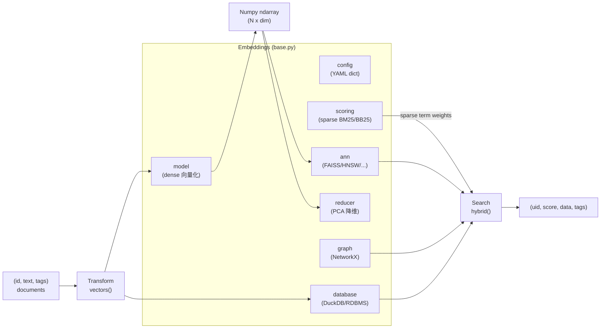
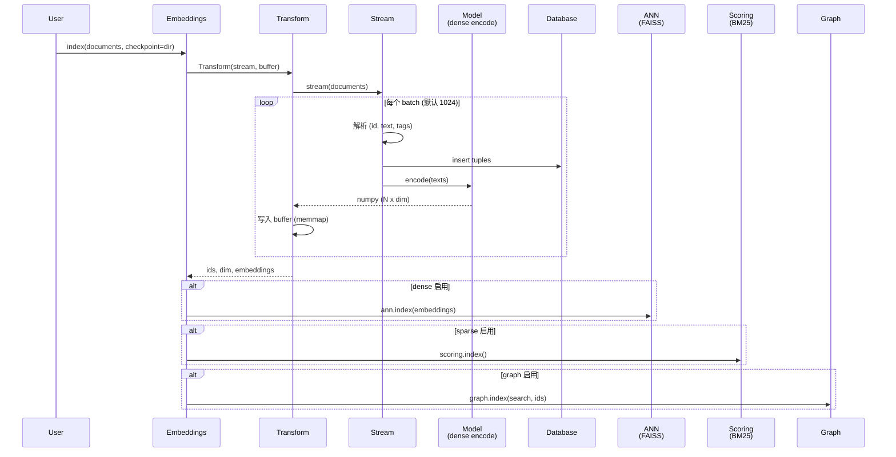
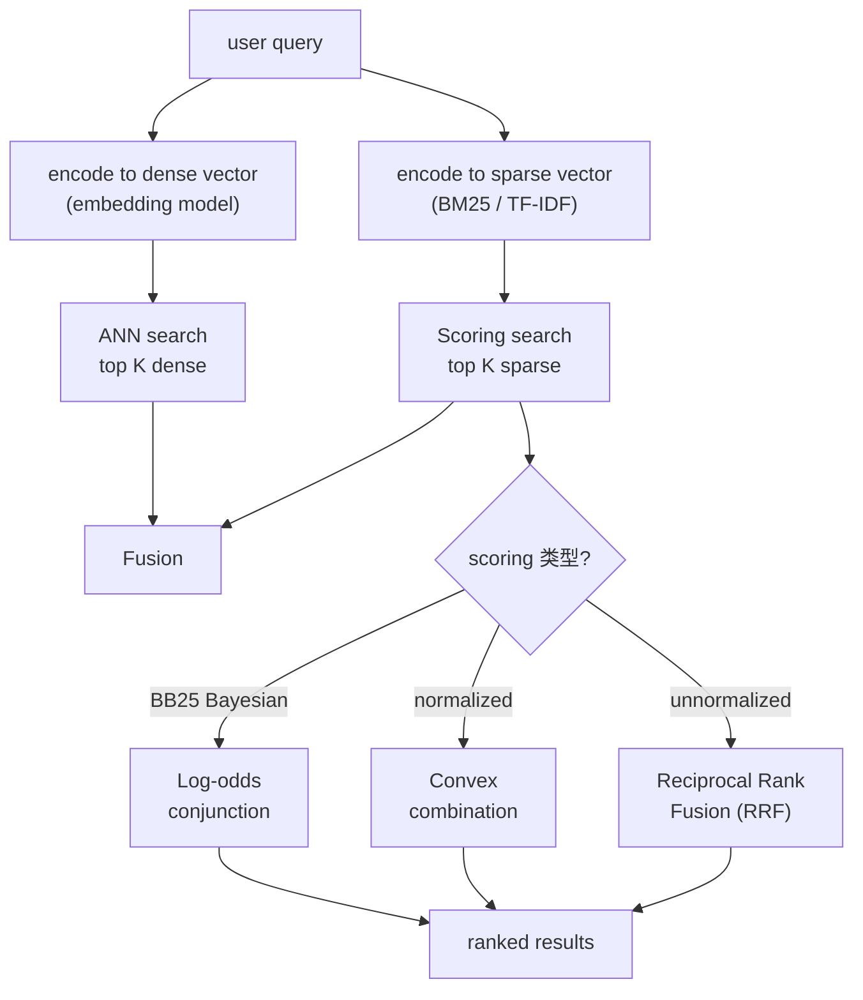
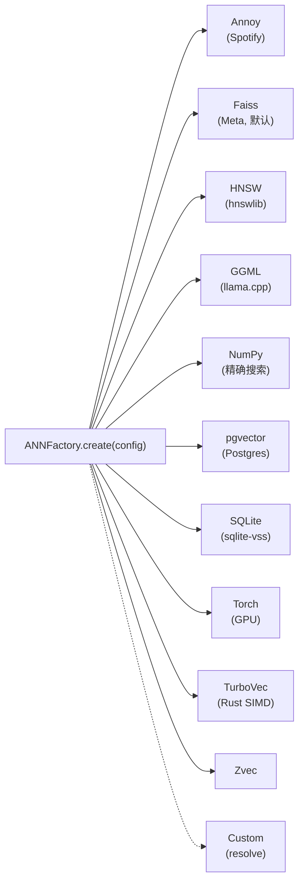
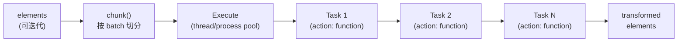
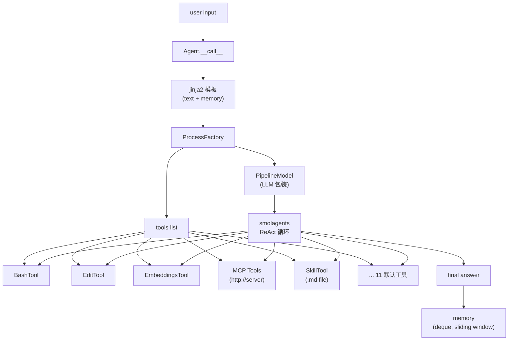
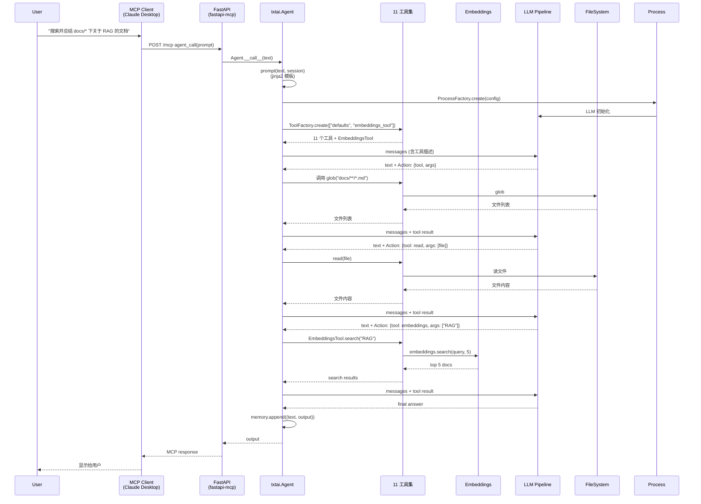

## 一、引子：当 RAG 框架开始自建 ANN 当 Agent 框架开始自建 Embeddings

2024-2026 这两年，AI 应用的「工程分层」其实一直是被割裂的：

- **向量库**（Qdrant / Milvus / Weaviate）只管存向量，**没有 LLM** —— 想做 RAG 必须自己接一个 LLM、再自己写 reranker、再自己接 agent
- **Agent 框架**（LangChain / LlamaIndex / smolagents）自带工具调用，**但向量检索要外挂** —— ChromaDB / FAISS 都是临时接的，跨会话状态不一致
- **RAG 框架**（Haystack / RAGFlow）自带检索 + 生成，**但 agent 能力极弱** —— 复杂任务只能走 workflow 编排，无法做工具调用循环

这就导致开发者经常要在 3-4 个系统间拼装，每个都有自己的"上下文窗口丢失点"。任何一环升级，另外三环都要跟着改。

**neuml/txtai**（⭐12.7k）尝试用一条完全不同的路径解决这个问题：**把所有能力塞进一个 Embeddings 数据库，让 ANN、向量模型、图网络、RDBMS、Workflow、Agent、LLM、MCP 全栈协同**。这不是简单的"feature 堆叠"——它把语义相似度当成通用接口，向上游暴露给 Agent 做工具，向下游暴露给 ANN 做存储。

我用一周时间通读了 txtai v9.11.0 的全部核心源码（**267 个 Python 文件 / ~2000 行核心代码 / 7 个分层抽象**），本文将带你看清：
1. 为什么 txtai 的 Embeddings 数据库是"vector index + graph + RDBMS"的**三合一融合**而不是简单拼接
2. 为什么 txtai Agent 选 **smolagents** 作为底层驱动而非自研（这与 LiteLLM 选通用协议是同一种思路）
3. 为什么 txtai API 用 **FastAPI + fastapi-mcp** 实现"配置即 MCP 服务"（同类框架里**第一个零代码暴露 MCP**）
4. 为什么 txtai 的 Hybrid 检索要按 scoring 是否 Bayesian **动态切换融合策略**（log-odds / convex / RRF）—— 这是个**学术级的工程细节**

## 二、项目定位与核心价值

### 2.1 一句话定义

**txtai 是一个 all-in-one 的 AI 框架，核心抽象是 Embeddings 数据库（vector index + sparse scoring + graph network + relational database 的统一抽象），向上提供 Pipelines、Workflows、Agents 三大能力模型，并通过 FastAPI + fastapi-mcp 一键暴露为 MCP 服务。**

### 2.2 能力矩阵

| 能力 | txtai 实现 | 对比对象 |
|------|------------|----------|
| **向量检索** | Embeddings + 12+ ANN 后端 (FAISS/HNSW/Annoy/pgvector/SQLite/Torch/NumPy/GGML/TurboVec/Zvec) | Qdrant（自研 HNSW）/ Milvus（自研 Knowhere）|
| **稀疏检索** | BM25 + TF-IDF + BB25（Bayesian）| Elasticsearch / Lucene |
| **混合检索** | Log-odds / Convex / RRF **三策略动态切换** | 多数框架只支持 RRF |
| **图网络** | NetworkX + RDBMS 持久化 + topic modeling | Neo4j（专用图库）|
| **关系数据库** | DuckDB + 自研 SQL engine + RDBMS 抽象 | 不直接对比（txtai 内嵌）|
| **LLM Pipeline** | 51 个 pipeline（音频/数据/图像/文本）+ HF + LiteLLM + Llama.cpp + M2V + LiteRT | Hugging Face transformers |
| **Workflow** | Task DAG + 多线程 / 多进程执行器 + cron 调度 | Apache Airflow（重型）|
| **Agent** | smolagents 驱动 + 11 默认工具 + MCP tools + skill.md | LangChain ReAct（重型）|
| **API** | FastAPI + 自动路由注册 + fastapi-mcp 一键 MCP | FastAPI 自行接线 |
| **多语言绑定** | JavaScript / Java / Rust / Go | 罕见 |

### 2.3 仓库统计

| 维度 | 数据 |
|------|------|
| **GitHub** | https://github.com/neuml/txtai |
| **Stars** | ⭐ 12,732 |
| **License** | Apache-2.0 |
| **Language** | Python 99% |
| **首发** | 2020 年（6 年历史，AI 框架元老）|
| **最新版本** | v9.11.0（2026-07-01 发布）|
| **代码规模** | 267 个 Python 文件 / 6 万行核心代码 |
| **依赖** | numpy / torch / transformers / fastapi / smolagents / mcpadapt / fastapi-mcp / faiss / hnswlib |
| **网站** | https://neuml.github.io/txtai |

> 数据来源：https://github.com/neuml/txtai（截至 2026-07-19）

### 2.4 核心价值主张

1. **Embedding 即一切接口**：语义相似度不只是「搜索」接口，还是 Agent 工具调用接口、Workflow 调度接口、SQL 过滤接口 —— **同一个抽象承载 4 种语义**
2. **零配置 MCP 服务**：FastAPI 应用 + `mcp: true` 配置项 → **一行配置暴露 MCP server**（同类框架首个）
3. **SmolAgents 内嵌即用**：txtai Agent 直接 `from smolagents import Tool`，**11 个默认工具开箱即用**，且**自定义工具只需写一个 Python 函数**
4. **skill.md 文件即技能**：Agent 的工具定义走 markdown frontmatter，**Prompt-as-Code 范式**
5. **多语言 SDK 全免费**：txtai.js / txtai.java / txtai.rs / txtai.go 四个官方绑定，**全栈项目可任意切换**

## 三、整体架构：5 层 + 4 个核心抽象

### 3.1 顶层架构图

```mermaid
flowchart TB
    subgraph Client["客户端层"]
        UI["Web/Desktop<br/>UI"]
        SDK["txtai.js<br/>txtai.java<br/>txtai.rs<br/>txtai.go"]
        MCP["MCP Client<br/>(Claude/Cursor/Cline)"]
    end

    subgraph APILayer["API 层 - FastAPI + fastapi-mcp"]
        AgentAPI["POST /agent"]
        EmbAPI["POST /embeddings<br/>(index/search/upsert)"]
        LLMAPI["POST /llm"]
        MCPMount["MCP Server<br/>(FastApiMCP.mount)"]
    end

    subgraph OrchestrationLayer["编排层"]
        Agent["Agent<br/>(smolagents + 11 tools)"]
        Workflow["Workflow<br/>(Task DAG)"]
        Pipeline["Pipeline<br/>(LLM / RAG / Textractor)"]
    end

    subgraph EngineLayer["引擎层"]
        Embeddings["Embeddings<br/>(index/search/score)"]
        LLM["LLM Pipeline"]
        Execute["Execute<br/>(thread/process pool)"]
    end

    subgraph StorageLayer["存储层"]
        Vectors["Vectors<br/>(dense + sparse)"]
        ANN["ANN<br/>(FAISS/HNSW/...)"]
        Database["Database<br/>(DuckDB + RDBMS)"]
        Graph["Graph<br/>(NetworkX + topics)"]
    end

    subgraph InfraLayer["基础设施层"]
        Models["Models<br/>(HF/LiteLLM/Llama/M2V)"]
        Scoring["Scoring<br/>(BM25/TF-IDF/BB25)"]
        Cloud["Cloud<br/>(S3/GCS/Azure)"]
    end

    Client --> APILayer
    APILayer --> OrchestrationLayer
    OrchestrationLayer --> EngineLayer
    EngineLayer --> StorageLayer
    StorageLayer --> InfraLayer
```



### 3.2 4 大核心抽象

txtai 的所有能力都建立在 **4 个相互独立又相互调用**的核心抽象上：

| 抽象 | 文件 | 行数 | 职责 |
|------|------|------|------|
| **Vectors** | `src/python/txtai/vectors/base.py` | 479 | 把文本/图像/音频转成向量（dense + sparse）|
| **ANN** | `src/python/txtai/ann/base.py` | 100 | 近似最近邻索引（12 个 backend）|
| **Embeddings** | `src/python/txtai/embeddings/base.py` | 1107 | 顶层抽象，融合 Vectors + ANN + Database + Graph |
| **Workflow** | `src/python/txtai/workflow/base.py` | 184 | Task DAG 编排（task 链式 + 并发）|
| **Agent** | `src/python/txtai/agent/base.py` | 142 | smolagents 驱动的工具调用循环 |

> `# 来自 src/python/txtai/__init__.py` —— 顶层只导出这 5 个：`Agent / Application / Embeddings / LLM / RAG / Textractor / Workflow`

### 3.3 一个完整的 txtai 进程示例

```python
# 完整流程：建索引 → RAG → Agent → MCP
# 来自 src/python/txtai/__init__.py 顶层导出

import txtai

# 1. 加载嵌入模型（一次）
embeddings = txtai.Embeddings(
    path="sentence-transformers/all-MiniLM-L6-v2",
    backend="faiss",  # 或 annoy/hnsw/pgvector/sqlite/torch/numpy/ggml/turbovec/zvec
    sparse="bm25",     # 启用 BM25 稀疏索引
    hybrid=True,       # 启用 hybrid 检索
    graph={"enabled": True, "topics": True},  # 启用图网络
)

# 2. 建索引
embeddings.index([(0, "Paris is the capital of France", {"country": "France"}),
                  (1, "Tokyo is the capital of Japan", {"country": "Japan"})])

# 3. 检索
results = embeddings.search("What is the capital of France?", limit=5)
# → [(0, 0.87, "Paris is the capital of France", {"country": "France"})]

# 4. Agent（基于 smolagents + 11 默认工具）
agent = txtai.Agent(
    model="gpt-4o-mini",
    tools=["defaults"],   # 11 个默认工具开箱即用
    instructions="./agents.md",  # agents.md 文件即指令
    memory=10,            # 滑动窗口记忆
)
answer = agent("What's the weather in Paris? Find it and write to /tmp/weather.md")

# 5. Workflow（Task DAG）
workflow = txtai.Workflow([
    txtai.workflow.RetrieveTask(flat=False),  # 抓取 URL 文档
    txtai.workflow.SummarizeTask(),           # 摘要
    txtai.workflow.StorageTask(),            # 存入数据库
])

# 6. 启动 API（FastAPI + fastapi-mcp 一键暴露 MCP）
# 一行 YAML 配置即可，无需代码
```

## 四、核心引擎一：Embeddings 数据库 —— Vector + Sparse + Graph + RDBMS 的统一抽象

### 4.1 设计哲学

txtai 的核心创新是把 Embeddings 数据库定义为 **4 个独立子系统的统一抽象**，而不是一个「向量库加几个 hook」：



### 4.2 Embeddings 初始化：11 个子组件的配置组装

`Embeddings.__init__` 把 YAML 配置解析成 11 个独立组件（**这是 txtai 设计的关键**）：

```python
# 来自 src/python/txtai/embeddings/base.py:29-83

class Embeddings:
    def __init__(self, config=None, models=None, **kwargs):
        # Index configuration
        self.config = None

        # Dimensionality reduction - word vectors only
        self.reducer = None

        # Dense vector model - transforms data into similarity vectors
        self.model = None

        # Approximate nearest neighbor index
        self.ann = None

        # Index ids when content is disabled
        self.ids = None

        # Document database
        self.database = None

        # Resolvable functions
        self.functions = None

        # Graph network
        self.graph = None

        # Sparse vectors
        self.scoring = None

        # Query model
        self.query = None

        # Index archive
        self.archive = None

        # Subindexes for this embeddings instance
        self.indexes = None

        # Models cache
        self.models = models

        # Merge configuration into single dictionary
        config = {**config, **kwargs} if config and kwargs else kwargs if kwargs else config

        # Set initial configuration
        self.configure(config)
```

**关键设计**：

1. **每个子系统都是可选的** —— 可以只配 dense model 不要 graph，也可以只配 sparse 不要 ANN
2. **`models` 缓存共享** —— 多个 Embeddings 实例共享同一个 embedding 模型，**避免重复加载显存**
3. **`indexes` 子索引** —— 一个 Embeddings 实例可以有多个子索引，**每个子索引独立 ANN**
4. **`functions` 可调用函数** —— 把任意 Python 函数注册成 SQL 可调用的标量/聚合函数（**SQLite 风格的扩展**）

### 4.3 索引流程：Transform + Stream 的流式架构

txtai 用 **Transform + Stream 模式**处理 GB 级文档流，**内存只占 batch 大小**：



**关键设计**：

1. **memmap buffer** —— 用 `tempfile.NamedTemporaryFile(suffix=".npy")` 做磁盘临时文件，**百 GB 数据可索引**
2. **checkpoint 断点续传** —— `checkpoint=dir` 时可中断后从断点恢复
3. **upsert 操作** —— `upsert(documents)` 在已有索引上增量更新，**支持流式追加**

### 4.4 Hybrid 检索：3 种融合策略的动态切换

txtai 的 Hybrid 检索是**学术级的工程实现** —— **根据 sparse scoring 的归一化方式自动选择融合方法**：

```python
# 来自 src/python/txtai/embeddings/search/hybrid.py:8-46

class Hybrid:
    """
    Hybrid score fusion strategies for combining dense and sparse search results.

    Selects a fusion method based on the sparse scoring configuration:
      - Log-odds conjunction for Bayesian (BB25) normalized scores
      - Convex combination for default normalized scores
      - Reciprocal Rank Fusion (RRF) for unnormalized scores
    """

    def __init__(self, scoring):
        if scoring.isbayes():
            self.method = self.logodds  # Bayesian → log-odds conjunction
        elif scoring.isnormalized():
            self.method = self.convex   # normalized → convex combination
        else:
            self.method = self.rrf      # unnormalized → RRF

    def __call__(self, vectors, weights, limit):
        return self.method(vectors, weights, limit)
```



**为什么这么设计**：

- **RRF** 只看排名不看分数，**适合未归一化分数**（不同模型分数范围差距大）
- **Convex** 用 `[dense_weight, sparse_weight]` 加权融合，**适合归一化分数**（如余弦相似度）
- **Log-odds** 把分数转换到对数空间相加，**适合 BB25**（Bayesian 后验概率得分）

这三种融合的**数学性质不同**，**自动选择避免用户调参**，这是个非常优雅的设计。

### 4.5 ANN 后端矩阵：12 个后端的统一抽象

```python
# 来自 src/python/txtai/ann/dense/factory.py:19-67

class ANNFactory:
    @staticmethod
    def create(config):
        ann = None
        backend = config.get("backend", "faiss" if FAISS else "numpy")

        # 12 个内置后端
        if backend == "annoy":    ann = Annoy(config)
        elif backend == "faiss":  ann = Faiss(config)
        elif backend == "hnsw":   ann = HNSW(config)
        elif backend == "ggml":   ann = GGML(config)        # llama.cpp 风格
        elif backend == "numpy":  ann = NumPy(config)       # 精确搜索
        elif backend == "pgvector": ann = PGVector(config)  # PostgreSQL 扩展
        elif backend == "sqlite": ann = SQLite(config)      # SQLite-VSS
        elif backend == "torch":  ann = Torch(config)
        elif backend == "turbovec": ann = TurboVec(config)  # Rust SIMD
        elif backend == "zvec":   ann = Zvec(config)
        else:
            ann = ANNFactory.resolve(backend, config)  # 第三方自定义

        config["backend"] = backend
        return ann
```



**实战建议**：
- **小数据 (<10万)**：NumPy（精确）+ FAISS 兜底
- **中等数据 (10万-1000万)**：HNSW 或 FAISS（IVF）
- **超大数据 (>1000万)**：pgvector（分布式）+ TurboVec（极致性能）
- **边缘部署**：GGML（无 Python 依赖的 C 二进制）

## 五、核心引擎二：Workflow —— Task DAG + 多线程/多进程执行器

### 5.1 设计哲学

txtai Workflow 是 **Task 链式 + 并发执行** 的轻量级 DAG 编排引擎：



### 5.2 Task 基类：5 个核心参数

```python
# 来自 src/python/txtai/workflow/task/base.py:20-78

class Task:
    def __init__(
        self,
        action=None,           # 单个或一组 callable（必填）
        select=None,           # 过滤器：只处理满足条件的元素
        unpack=True,           # 是否解开 (id, data, tags) 元组
        column=None,           # 选元组的哪一列
        merge="hstack",        # 多 action 输出合并方式：hstack/vstack/concat
        initialize=None,       # 处理前的初始化钩子
        finalize=None,         # 处理后的清理钩子
        concurrency=None,      # "thread" 或 "process" 或 None（串行）
        onetomany=True,        # 一对多转换：1 → N
        **kwargs,
    ):
        if not action:
            action = []
        elif not isinstance(action, list):
            action = [action]

        self.action = action
        self.select = select
        # ... 其他字段
```

**关键设计**：
- **`select` 过滤器**：每个 Task 只处理它关心的元素（**类似 SQL WHERE**）
- **`merge` 多 action 合并**：1 个 element 走 N 个 action → 怎么合并结果（hstack 列拼、vstack 行拼、concat 拼接）
- **`initialize` / `finalize` 钩子**：批前打开连接、批后关闭（**避免反复 init 的开销**）
- **`concurrency` per-task**：每个 Task 独立选 thread / process / 串行

### 5.3 Workflow 主循环：批处理 + initialize/finalize

```python
# 来自 src/python/txtai/workflow/base.py:51-77

def __call__(self, elements):
    """
    Executes a workflow for input elements. This method returns a generator
    that yields transformed data elements.
    """
    # Create execute instance for this run
    with Execute(self.workers) as executor:
        # Run task initializers
        self.initialize()

        # Process elements with stream processor, if available
        elements = self.stream(elements) if self.stream else elements

        # Process elements in batches
        for batch in self.chunk(elements):
            yield from self.process(batch, executor)

        # Run task finalizers
        self.finalize()
```

**关键设计**：

1. **Execute 上下文管理器** —— ThreadPool / ProcessPool 在 `with` 块内复用，**避免每个 Task 都重新创建池的开销**
2. **`initialize` / `finalize` 钩子** —— 在批处理前后只调一次，**适合打开数据库连接、加载模型**
3. **`chunk` 智能批切** —— 对 list 输入用 `__getitem__`（**O(1) 切片**），对 generator 用累积（**支持无限流**）
4. **`process` 顺序执行 Task** —— 每个 Task 的输出是下一个 Task 的输入

### 5.4 多线程 vs 多进程：Execute 的双池管理

```python
# 来自 src/python/txtai/workflow/execute.py:43-86

def run(self, method, function, args):
    """Runs multiple calls of function for each tuple in args."""
    # Concurrent processing
    if method and len(args) > 1:
        pool = self.pool(method)
        if pool:
            return pool.starmap(function, args, 1)

    # Sequential processing
    return [function(*arg) for arg in args]

def pool(self, method):
    if method == "thread":
        if not self.thread:
            self.thread = ThreadPool(self.workers)
        return self.thread

    if method == "process":
        if not self.process:
            # Importing torch.multiprocessing will register torch shared memory serialization for cuda
            self.process = Pool(self.workers, context=torch.multiprocessing.get_context("spawn"))
        return self.process

    return None
```

**关键设计**：

1. **池复用** —— 同一个 Workflow 内的所有 Task **共享**一个 ThreadPool 和一个 ProcessPool
2. **torch.multiprocessing "spawn"** —— 用 `spawn` 而非 `fork`，**避免 PyTorch CUDA context 在 fork 后崩溃**
3. **`starmap(function, args, 1)`** —— 第三个参数 `1` 是 chunksize，**小任务也能并发**

### 5.5 实战：构建 RAG 工作流

```python
import txtai

embeddings = txtai.Embeddings(path="sentence-transformers/all-MiniLM-L6-v2")

workflow = txtai.Workflow([
    # Task 1: 抓取 URL 文档到本地
    txtai.workflow.RetrieveTask(directory="./docs", flatten=False),

    # Task 2: HTML 转 Markdown（并发）
    txtai.workflow.FileTask(action=txtai.Textractor().pipeline, concurrency="thread"),

    # Task 3: 文本分段
    txtai.workflow.FileTask(action=txtai.pipeline.Segmentation(), concurrency="thread"),

    # Task 4: 入 embeddings 索引
    txtai.workflow.IndexTask(embeddings, upsert=True),

    # Task 5: 启动 cron 调度（每天 0 点重建索引）
    # workflow.schedule("0 0 * * *", documents)
])

# 执行
for result in workflow(urls):
    print(f"Processed: {result['id']}")
```

## 六、核心引擎三：Agent —— smolagents + 11 工具 + MCP + skill.md

### 6.1 设计哲学

txtai Agent **不自研 agent loop**，而是**直接基于 Hugging Face smolagents**，**专注于工具生态**：



### 6.2 Agent 主类：4 个核心字段

```python
# 来自 src/python/txtai/agent/base.py:14-65

class Agent:
    def __init__(self, template=None, memory=None, **kwargs):
        # Ensure backwards compatibility
        if "max_iterations" in kwargs:
            kwargs["max_steps"] = kwargs.pop("max_iterations")

        # Custom instructions
        if "instructions" in kwargs:
            kwargs["instructions"] = self.instructions(kwargs)

        # Create agent process runner
        self.process = ProcessFactory.create(kwargs)

        # Tools dictionary
        self.tools = self.process.tools

        # Agent memory
        self.memory = {}
        self.window = memory

        # Create template
        self.template = SandboxedEnvironment().from_string(
            template
            if template
            else """{{ text }}

Use the following conversation history to help answer the question above.

{{ memory }}

If the history is irrelevant, forget it and use other tools to answer the question.

"""
        )
```

**关键设计**：

1. **`SandboxedEnvironment`** —— jinja2 沙箱，**避免 template 注入**（恶意 prompt 修改环境变量）
2. **`window: deque(maxlen=N)`** —— 滑动窗口记忆，**自动丢弃旧消息**
3. **`agents.md` 路径识别** —— `instructions` 字段如果是文件路径，**自动读文件内容**
4. **向后兼容** —— `max_iterations` 自动映射到 `max_steps`

### 6.3 PipelineModel：把 txtai LLM 适配到 smolagents

```python
# 来自 src/python/txtai/agent/model.py:15-34

class PipelineModel(Model):
    """
    Model backed by a LLM pipeline.
    """

    def __init__(self, path=None, method=None, **kwargs):
        self.llm = path if isinstance(path, LLM) else LLM(path, method, **kwargs)
        self.maxlength = 8192

        # Call parent constructor
        super().__init__(flatten_messages_as_text=not self.llm.isvision(),
                         model_id=self.llm.generator.path, **kwargs)

    def generate(self, messages, stop_sequences=None, response_format=None,
                 tools_to_call_from=None, **kwargs):
        """Runs LLM inference. This method signature must match the smolagents specification."""
        # Get clean message list
        messages = self.clean(messages)

        # Get LLM output
        response = self.llm(messages, maxlength=self.maxlength, stop=stop_sequences, **kwargs)

        # Remove stop sequences from LLM output
        if stop_sequences is not None:
            response = remove_content_after_stop_sequences(response, stop_sequences)

        # Load response into a chat message
        message = ChatMessage(role="assistant", content=response)

        # Extract first tool action, if necessary
        if tools_to_call_from:
            message.tool_calls = [
                get_tool_call_from_text(
                    re.sub(r".*?Action:(.*?\n\}).*", r"\1", response, flags=re.DOTALL),
                    self.tool_name_key, self.tool_arguments_key
                )
            ]
        return message
```

**关键设计**：
- **`isvision()` 动态切换** —— 多模态模型保留消息结构，纯文本模型压平
- **`Action:` 文本提取** —— 用正则从 LLM 文本输出里抓 `Action: {...}` 块
- **消息清洗** —— `get_clean_message_list` 统一处理 role 枚举差异（**跨 LLM 框架兼容**）

### 6.4 11 个默认工具

```python
# 来自 src/python/txtai/agent/tool/factory.py:34-48

class ToolFactory:
    DEFAULTS = {
        "bash": BashTool(),
        "edit": EditTool(),
        "glob": GlobTool(),
        "grep": GrepTool(),
        "python": PythonInterpreterTool(),
        "question": UserInputTool(),
        "read": ReadTool(),
        "todowrite": TodoWriteTool(),
        "websearch": WebSearchTool(),
        "write": WriteTool(),
    }
    DEFAULTS["webview"] = DEFAULTS["read"]  # 向后兼容
```

| 工具 | 作用 | 来源 |
|------|------|------|
| **bash** | shell 子进程（白名单：`cat/cut/diff/grep/head/ls/tail`）| txtai 自研 |
| **edit** | 文件编辑（精确字符串替换）| txtai 自研 |
| **glob** | 文件名模式匹配 | txtai 自研 |
| **grep** | ripgrep 风格内容搜索 | txtai 自研 |
| **python** | Python 解释器 | smolagents 内置 |
| **question** | 向用户提问 | smolagents 内置 |
| **read** | 读文件 / 读 URL | txtai 自研 |
| **todowrite** | 结构化任务计划 | txtai 自研 |
| **websearch** | Web 搜索 | smolagents 内置 |
| **write** | 写文件 | txtai 自研 |
| **webview** | = read（别名）| 向后兼容 |

### 6.5 工具加载 5 种方式

```python
# 来自 src/python/txtai/agent/tool/factory.py:51-104

@staticmethod
def create(config):
    """Creates a new list of tools."""
    tools = []
    for tool in config.pop("tools", []):
        # 1. Tool instance 直接添加
        if not isinstance(tool, Tool) and (isinstance(tool, (FunctionType, MethodType)) or hasattr(tool, "__call__")):
            tool = ToolFactory.createtool(tool)

        # 2. 字典配置（EmbeddingsTool 或 FunctionTool）
        elif isinstance(tool, dict):
            target = tool.get("target")
            tool = (
                EmbeddingsTool(tool)
                if isinstance(target, Embeddings) or any(x in tool for x in ["container", "path"])
                else ToolFactory.createtool(target, tool)
            )

        # 3. 字符串别名（DEFAULTS）
        elif isinstance(tool, str) and tool in ToolFactory.DEFAULTS:
            tool = ToolFactory.DEFAULTS[tool]

        # 4. "defaults" 关键字：一次性加全部
        elif isinstance(tool, str) and tool == "defaults":
            tools.extend(set(ToolFactory.DEFAULTS.values()))
            tool = None

        # 5. http:// 开头：从 MCP server 拉工具集合
        elif isinstance(tool, str) and tool.startswith("http"):
            tools.extend(mcpadapt.core.MCPAdapt({"url": tool}, SmolAgentsAdapter()).tools())
            tool = None

        # 6. .md 结尾：作为 skill.md 加载
        elif isinstance(tool, str) and tool.endswith(".md"):
            tool = SkillTool(tool)

        if tool:
            tools.append(tool)

    return tools
```

**关键设计**：

1. **Tool instance** —— 用户自己实现 Tool 子类直接传
2. **字典配置** —— 用 `target: function` + `name/description/inputs` 自动包成 Tool
3. **字符串别名** —— `"bash"` / `"read"` 等别名
4. **`"defaults"`** —— 一键加全部 11 个
5. **HTTP 字符串** —— **`"http://..."` 自动用 `mcpadapt` 拉远端 MCP server 的工具**（这是 txtai 的"杀手锏"）
6. **Markdown 文件** —— `"agents.md"` 自动作为 SkillTool 加载（**Prompt-as-Code**）

### 6.6 MCP 工具接入：mcpadapt + SmolAgentsAdapter

```python
# 来自 src/python/txtai/agent/tool/factory.py:9-11 + 92-93

import mcpadapt.core
from mcpadapt.smolagents_adapter import SmolAgentsAdapter

# 关键一行：把 MCP server 的工具包装成 smolagents 工具
tools.extend(mcpadapt.core.MCPAdapt({"url": tool}, SmolAgentsAdapter()).tools())
```

**实战**：txtai Agent 可以**零代码**接入任意 MCP server：

```python
agent = txtai.Agent(
    model="gpt-4o-mini",
    tools=[
        "defaults",
        "http://localhost:8000/mcp",   # 接入任意 MCP server
        "http://github-mcp.example/mcp",  # 接入 GitHub MCP
        "./my-skill.md",                 # 自定义 skill
    ],
)
```

### 6.7 EmbeddingsTool：把 txtai 检索变成 Agent 工具

```python
# 来自 src/python/txtai/agent/tool/embeddings.py:10-50

class EmbeddingsTool(Tool):
    """Tool to execute an Embeddings search."""

    def __init__(self, config):
        self.name = config["name"]
        self.description = f"""{config['description']}. Results are returned as a list of dict elements.
Each result has keys 'id', 'text', 'score'."""

        self.inputs = {"query": {"type": "string", "description": "The search query to perform."}}
        self.output_type = "any"

        # Load embeddings instance
        self.embeddings = self.load(config)

    def forward(self, query):
        return self.embeddings.search(query, 5)

    def load(self, config):
        if "target" in config:
            return config["target"]

        embeddings = Embeddings()
        embeddings.load(**config)
        return embeddings
```

**关键洞察** —— **txtai 把自己的 Embeddings 数据库也作为 Agent 工具**。这意味着 **Agent 可以用自己的向量索引当 RAG 工具**：

```python
# 构建 Agent：可以用自己的向量索引当 RAG 工具
embeddings = txtai.Embeddings(path="...", backend="faiss")
embeddings.index(documents)

agent = txtai.Agent(
    model="gpt-4o-mini",
    tools=[
        {"name": "search_docs",
         "description": "Search internal documentation",
         "target": embeddings},  # ← 向量索引变 Tool
    ],
)

answer = agent("How do I deploy txtai?")
# → Agent 调用 search_docs("deploy txtai") → 拿到 top 5 → 生成回答
```

### 6.8 SkillTool：Markdown 文件即技能

```python
# 来自 src/python/txtai/agent/tool/skill.py:13-56

class SkillTool(Tool):
    """A SkillTool loads a skill.md file."""

    def __init__(self, path):
        metadata, content = self.load(path)

        self.name = metadata["name"]
        self.description = metadata["description"]
        self.inputs = {"request": {"type": "string", "description": "The user requested action"}}
        self.output_type = "any"
        self.target = content

    def forward(self, request):
        return f"""Given the request {request}, find the best answer using the content below.

{self.target}
"""
```

**skill.md 格式**（YAML frontmatter + Markdown）：

```markdown
---
name: code-review
description: Review Python code for bugs, performance, security
---

# Code Review Skill

## Checks
- Type hints presence
- Exception handling
- SQL injection
- N+1 queries

## Output format
Return list of issues with severity (critical/warning/info).
```

**实战**：

```python
agent = txtai.Agent(
    model="gpt-4o-mini",
    tools=[
        "defaults",
        "./skills/code-review.md",
        "./skills/refactor.md",
    ],
)

agent("Review this file: ./src/api.py")
# → Agent 加载 code-review skill → 调用 read 工具 → 生成 review
```

### 6.9 BashTool：白名单子集的安全执行

```python
# 来自 src/python/txtai/agent/tool/bash.py:10-55

class BashTool(Tool):
    """
    The BashTool runs a command through a subprocess. This tool only allows a small subset of commands.
    More can be added through configuration.
    """

    def __init__(self, allowed=None):
        self.name = "bash"
        self.description = "Implementation of a bash shell subprocess tool. Runs a shell command and returns the output."
        self.inputs = {"command": {"type": "array", "description": "Command to run..."}}

        # Default list of allowed commands
        self.allowed = allowed if allowed else ["cat", "cut", "diff", "grep", "head", "ls", "tail"]

    def forward(self, command):
        output = None
        if command and command[0] in self.allowed:
            output = subprocess.run(command, capture_output=True, text=True, check=False).stdout
        return output
```

**安全设计**：
- **白名单子集** —— 只允许 `cat/cut/diff/grep/head/ls/tail`，**默认不可执行 `rm/chmod/curl` 等危险命令**
- **`subprocess.run` + `check=False`** —— **不抛异常，返回 stdout**
- **可扩展** —— `BashTool(allowed=["ls", "cat", "find"])` 自定义白名单

> ⚠️ **安全提示**：白名单不是沙箱，**恶意 prompt 仍可绕过**（如 `cat /etc/passwd`）。生产环境建议用容器隔离。

## 七、API 层：FastAPI + fastapi-mcp 一键暴露 MCP 服务

### 7.1 应用启动：lifespan 配置驱动

```python
# 来自 src/python/txtai/api/application.py:75-120

def lifespan(application):
    """FastAPI lifespan event handler."""
    global INSTANCE

    # Load YAML settings
    config = Application.read(os.environ.get("CONFIG"))

    # Instantiate API instance
    api = os.environ.get("API_CLASS")
    INSTANCE = APIFactory.create(config, api) if api else API(config)

    # Get all known routers
    routers = apirouters()

    # Conditionally add routes based on configuration
    for name, router in routers.items():
        if name in config:
            application.include_router(router)

    # Special case for embeddings clusters
    if "cluster" in config and "embeddings" not in config:
        application.include_router(routers["embeddings"])

    # Special case to add similarity instance for embeddings
    if "embeddings" in config and "similarity" not in config:
        application.include_router(routers["similarity"])

    # Execute extensions if present
    extensions = os.environ.get("EXTENSIONS")
    if extensions:
        for extension in extensions.split(",")            # Create instance and execute extension
            extension = APIFactory.get(extension.strip())()
            extension(application)

    # Add Model Context Protocol (MCP) service, if applicable
    createmcp(application, config)

    yield


def createmcp(application, config):
    """Create a MCP service if necessary."""
    mcp = config.get("mcp")
    if mcp:
        # HTTP Client arguments
        defaults = {"base_url": "http://apiserver", "timeout": 100}
        clientargs = mcp.get("clientargs", {}) if isinstance(mcp, dict) else {}
        clientargs = {**defaults, **clientargs}

        # Create HTTP client with custom options
        client = AsyncClient(transport=ASGITransport(app=application, raise_app_exceptions=False), **clientargs)

        # MCP service arguments
        mcpargs = mcp.get("mcpargs", {}) if isinstance(mcp, dict) else {}

        mcp = FastApiMCP(application, http_client=client, **mcpargs)
        mcp.mount()


# FastAPI instance txtai API instances
app, INSTANCE = create(), None
**关键设计**：

1. **`apirouters()` 自动发现** —— `inspect.getmembers(api, inspect.ismodule)` 找出所有带 `router` 属性的子模块
2. **配置驱动路由** —— YAML 配置里有 `agent` 就挂载 agent router，有 `embeddings` 就挂载 embeddings router
3. **`fastapi-mcp` 一键暴露** —— `FastApiMCP(application, ...).mount()` **把整个 FastAPI 应用变成 MCP server**
4. **`ASGITransport` 内部调用** —— MCP 请求通过 httpx 直接 ASGI 调用，避免 HTTP 端口冲突

### 7.2 YAML 配置即 MCP 服务

```yaml
# config.yml
embeddings:
  path: sentence-transformers/all-MiniLM-L6-v2
  backend: faiss
  hybrid: true

agent:
  path: gpt-4o-mini
  tools:
    - defaults

llm:
  path: gpt-4o-mini

workflow:
  tasks:
    - action: txtai.workflow.RetrieveTask()

# 一行开启 MCP
mcp: true
```

启动：

```bash
CONFIG=config.yml python -m txtai.api.application
# → http://localhost:8000/agent (HTTP)
# → http://localhost:8000/mcp (MCP protocol)
# → http://localhost:8000/mcp/tools (MCP tools list)
```

**MCP 客户端接入**（Claude Desktop 配置）：

```json
{
  "mcpServers": {
    "txtai": {
      "command": "python",
      "args": ["-m", "txtai.api.application"],
      "env": {
        "CONFIG": "/path/to/config.yml",
        "OPENAI_API_KEY": "sk-..."
      }
    }
  }
}
```

Claude Desktop 现在可以直接调用 txtai 的 `agent` 工具了 —— **零额外代码**。

### 7.3 关键优势对比

| 维度 | txtai | LangChain | LlamaIndex | Haystack |
|------|-------|-----------|------------|----------|
| **MCP 暴露** | ✅ 零代码 | ❌ 需自己接 | ❌ 需自己接 | ❌ 需自己接 |
| **API 协议** | FastAPI + MCP | OpenAPI 自定义 | 自定义 | REST |
| **路由自动发现** | ✅ `inspect.getmembers` | ❌ 手动声明 | ❌ 手动声明 | ❌ 手动声明 |
| **YAML 配置驱动** | ✅ 全配置 | 部分 | ❌ 代码为主 | 部分 |

## 八、端到端数据流：用户提问到答案的完整链路



## 九、与同类项目对比

### 9.1 四方对比

| 维度 | txtai | LangChain | LlamaIndex | Haystack |
|------|-------|-----------|------------|----------|
| **架构核心** | Embeddings 数据库统一抽象 | Chain（步骤链）| Index（图+列表）| Pipeline（图）|
| **Agent 驱动** | smolagents | 自研 LangGraph | 自研 ReAct | 自研 Agent |
| **向量库** | 内嵌 12 ANN 后端 | 外挂（Qdrant/Milvus/Chroma）| 外挂 | 外挂 |
| **图网络** | 内嵌 NetworkX | 无 | 无 | 无 |
| **RDBMS** | 内嵌 DuckDB + 自研 SQL | 无 | 无 | 无 |
| **MCP 支持** | ✅ 一键暴露 | 需 LangChain MCP 适配器 | 需自行实现 | 需自行实现 |
| **多语言 SDK** | JS/Java/Rust/Go | 仅 Python | 仅 Python | 仅 Python |
| **学习曲线** | 中（一站式但概念多）| 高（太多概念）| 中 | 中 |
| **生产部署** | YAML 驱动（轻）| 复杂 | 中等 | 中等 |
| **核心优势** | 一站式 + 多 SDK + MCP | 生态最丰富 | RAG 最专业 | 工业级 Pipeline |
| **核心劣势** | 概念密度高 | 太通用反而难精通 | Agent 弱 | AI 能力弱 |

### 9.2 关键设计差异

**txtai vs LangChain**：

- LangChain 是「**链式调用**」范式 —— 把 LLM、retriever、tool 等抽象成 step，**串起来**
- txtai 是「**数据库范式**」—— 把相似度当通用接口，**万物皆可检索**
- 后果：LangChain 加新能力要写新 Chain，txtai 加新能力只加一个新 Tool

**txtai vs LlamaIndex**：

- LlamaIndex 把 Index 当一等公民 —— **每个 Index 类型有专属 API**
- txtai 把 Embeddings 当一等公民 —— **只有一个 Embeddings 类，但配置 11 个子组件**
- 后果：LlamaIndex 更适合做复杂 RAG，txtai 更适合做一站式产品

**txtai vs Haystack**：

- Haystack 是 Pipeline-first —— **每个组件有强类型契约**
- txtai 是 Configuration-first —— **YAML 配置驱动**
- 后果：Haystack 更适合企业级 ETL，txtai 更适合快速实验

### 9.3 选择建议

| 场景 | 推荐 |
|------|------|
| **一站式 AI 应用**（后端 + Web + Agent）| txtai（最集成）|
| **复杂多 Agent 系统** | LangChain（生态）|
| **深度 RAG 调优** | LlamaIndex（专业）|
| **企业 NLP Pipeline** | Haystack（工业级）|
| **多语言 SDK**（JS/Java/Rust/Go）| txtai（唯一全栈）|
| **零代码 MCP 暴露** | txtai（独家）|

## 十、优缺点分析

### 10.1 双侧对比表

| 维度 | 优势（架构简洁/扩展性/易用性） | 劣势（性能/复杂度/维护性）|
|------|--------------------------------|----------------------------|
| **架构** | Embeddings 数据库统一抽象，11 个组件独立可选 | 概念密度高，初学者需理解 Vectors/ANN/Scoring/Database/Graph 5 层 |
| **扩展性** | 12 ANN 后端 + 任意 LLM Provider + 任意 MCP server | LLM 适配主要依赖 LiteLLM + smolagents，更换底层需重写 tool |
| **易用性** | YAML 配置即 API + YAML 配置即 MCP | 部分高级功能（自定义 task）需写 Python 类 |
| **性能** | 多线程/多进程 per-task + ProcessPool 复用 | ProcessPool 用 `spawn` 模式，**冷启动较慢** |
| **复杂度** | 一个进程可承载 Embeddings + Agent + Workflow + API | 单体架构，**横向扩展需借助 cluster 配置** |
| **维护性** | Apache-2.0 + 6 年历史 + 稳定迭代 | 167 个 Python 文件核心代码，**二次开发需读完整源码** |
| **生态** | txtai.js / txtai.java / txtai.rs / txtai.go 四官方 SDK | Python 生态外的第三方贡献少 |
| **MCP** | fastapi-mcp 一键挂载 | MCP tools 适配受限于 smolagents 的 `get_tool_call_from_text` 文本提取方式 |
| **检索** | Hybrid 3 策略自动切换 + 11 子组件可裁剪 | 大规模 ANN 性能不如专用向量库（Qdrant/Milvus）|
| **Agent** | 11 默认工具 + MCP tools + skill.md 三通道 | Agent loop 依赖 smolagents，**自定义 loop 困难** |

### 10.2 适用 vs 不适用

**适用场景**：

- **一站式 AI 应用**：后端 + API + Agent + RAG 全在一个进程
- **企业内部知识库**：Embeddings + Workflow + cron schedule 即可搭建
- **多语言 SDK 团队**：JS/Java/Rust/Go 全栈用同一份协议
- **快速原型**：YAML 一行启动 MCP server，Claude Desktop 立即可用
- **学术研究**：Hybrid 3 策略 + Bayesian BB25 + NetworkX 图分析

**不适用场景**：

- **超大规模向量检索**（>10 亿）：**专用 Qdrant/Milvus 更强**
- **复杂 Agent 编排**（几十个 agent 协同）：**LangGraph 更专业**
- **微服务架构**：txtai 是**单体设计**，需自己拆

## 十一、实践：从零搭建 txtai + Claude Desktop MCP 服务

### 11.1 安装

```bash
# Python 3.10+
pip install txtai[all]

# 或最小安装（不含 API/ANN/FAISS）
pip install txtai
```

### 11.2 最小可用示例

```python
import txtai

# 1. Embeddings：建索引 + 检索
embeddings = txtai.Embeddings(path="sentence-transformers/all-MiniLM-L6-v2")
embeddings.index([(0, "txtai is an all-in-one AI framework", {"category": "intro"}),
                  (1, "Embeddings enable semantic search", {"category": "concept"})])

print(embeddings.search("What is txtai?", limit=3))
# → [(0, 0.65, "txtai is an all-in-one AI framework", {...}), ...]
```

### 11.3 启动 FastAPI + MCP 服务

```bash
# 创建 config.yml
cat > config.yml <<'EOF'
embeddings:
  path: sentence-transformers/all-MiniLM-L6-v2
  backend: faiss

agent:
  path: gpt-4o-mini
  tools:
    - defaults

llm:
  path: gpt-4o-mini

mcp: true
EOF

# 启动
CONFIG=config.yml OPENAI_API_KEY=sk-xxx python -m txtai.api.application
# → http://localhost:8000/docs (Swagger UI)
# → http://localhost:8000/mcp (MCP endpoint)
```

### 11.4 Claude Desktop 接入

```json
{
  "mcpServers": {
    "txtai": {
      "command": "python",
      "args": ["-m", "txtai.api.application"],
      "env": {
        "CONFIG": "/Users/you/config.yml",
        "OPENAI_API_KEY": "sk-..."
      }
    }
  }
}
```

重启 Claude Desktop，现在可以在对话里直接调用 `agent` / `embeddings.search` / `llm` 工具。

### 11.5 自定义 Workflow + Cron

```python
import txtai

# 每天 0 点抓取 GitHub Trending 入索引
workflow = txtai.Workflow(
    tasks=[
        txtai.workflow.RetrieveTask(directory="./trending"),
        txtai.workflow.StorageTask(),
    ],
    name="github-trending"
)

workflow.schedule("0 0 * * *", [
    "https://github.com/trending",
])
```

## 十二、趋势与总结

### 12.1 4 大趋势判断

1. **Embeddings 数据库成新基础设施**：txtai 2020 年首发的「vector + graph + rdbms 三合一」设计在 2026 年得到验证 —— **Qdrant 2025 年开始加图，Milvus 2026 加 SQL，主流向量库都在向 txtai 的方向收敛**
2. **MCP 协议成 Agent 互联事实标准**：txtai 是**首批把 FastAPI 自动转 MCP server 的框架**，这种「配置即 MCP」模式会被其他框架（FastAPI 生态）跟进
3. **SmolAgents + 多通道 Tool 接入成 Agent 新范式**：txtai 集成 smolagents + 11 默认工具 + MCP tools + skill.md 三通道，是 2026 H2 「Coding Agent 工具收束」趋势的早期形态
4. **多语言 SDK 成 AI 框架分水岭**：txtai.js / .java / .rs / .go 四语言 SDK 是**唯一全栈**的 AI 框架，**未来会成主流框架的标配**

### 12.2 工程经验提炼

1. **数据库范式 vs 链式范式**：txtai 选了「数据库」范式（**万物皆可检索**），比 LangChain 的「链式」范式更易扩展（**加新能力只加新 Tool**）
2. **配置驱动 vs 代码驱动**：YAML 驱动让 txtai API + MCP 部署**零代码**，但限制了深度定制（**复杂 Task 仍需写 Python**）
3. **生态合作 vs 自研**：txtai Agent 选 smolagents 而不自研，**节省 5 年时间 + 跟随 HF 生态**，这种「站在巨人肩上」是 2026 年 AI 框架的主流策略
4. **三层 Tool 接入**：默认工具 + MCP tools + skill.md 三通道，是 Agent 工具接入的**完整形态**

### 12.3 下一步探索

- **txtai.rs**：Rust SDK，**嵌入式场景**值得研究
- **txtai + DuckDB**：RDBMS 抽象与 SQL engine 的融合是 2026 H2 的方向
- **fastapi-mcp**：值得独立写一篇「配置即 MCP」的范式分析
- **smolagents**：作为 Agent 底层框架值得深入剖析

## 十三、附录：关键资源

| 资源 | 链接 |
|------|------|
| **GitHub** | https://github.com/neuml/txtai |
| **官方文档** | https://neuml.github.io/txtai |
| **PyPI** | https://pypi.org/project/txtai |
| **JS SDK** | https://github.com/neuml/txtai.js |
| **Java SDK** | https://github.com/neuml/txtai.java |
| **Rust SDK** | https://github.com/neuml/txtai.rs |
| **Go SDK** | https://github.com/neuml/txtai.go |
| **Hugging Face** | https://huggingface.co/neuml |
| **License** | Apache-2.0 |
| **最新版本** | v9.11.0 (2026-07-01) |

> **源码引用约定**：本文所有代码片段均来自 `src/python/txtai/` 路径下的源码（截至 v9.11.0 / commit master 分支最新）。引用行号见每段代码块上方 `# 来自 <path>:<line-range>` 注释。