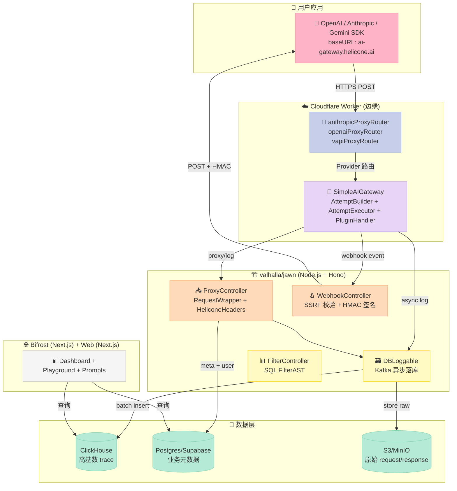
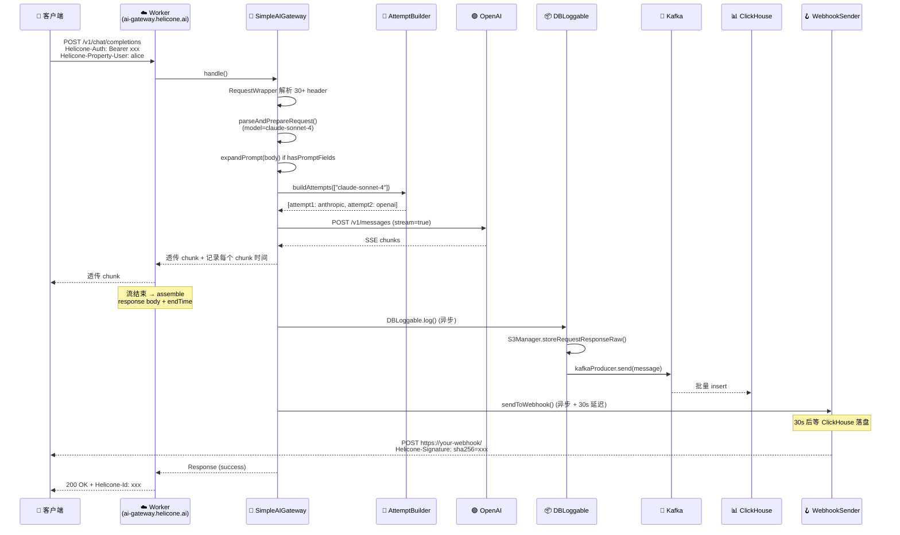
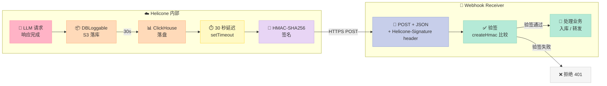

## 引子：LLM 可观测性市场的"第三种哲学"

写 LLMOps 平台时绕不开两件事：把请求 trace 下来，把 prompt 跑出来。但**怎么"把请求 trace 下来"这件事本身**，开源社区走出了三条完全不同的路：

- **协议 SDK 派**：以 [OpenLLMetry](https://github.com/traceloop/openllmetry)（7.3k⭐，Apache-2.0）为代表——直接基于 OpenTelemetry GenAI SemConv，把 LLM 调用 `wrap` 成标准 Span，**零代理、零中间件、零 baseURL 改写**。
- **全栈自研派**：以 [Langfuse](https://github.com/langfuse/langfuse)（31k⭐，MIT+EE）为代表——自研 Observation/Trace/Score/Prompt 语义，Postgres 业务元数据 + ClickHouse 高基数 trace 存储，**从 SDK 到 UI 到数据库栈全部自研**。
- **AI Gateway 派**：以 [Helicone](https://github.com/Helicone/helicone)（5.97k⭐，Apache-2.0）——也是今天的主角——为代表——**改写 baseURL，代理所有 LLM 请求**，在代理层统一做日志、Webhook、缓存、回退、限流、Prompt 注入、安全审计。

这个"代理还是 SDK"的选型，对 Harness 的 Hook/Event 系统设计**至关重要**：

| 维度 | OpenLLMetry（SDK） | Langfuse（自研语义） | Helicone（AI Gateway） |
|------|---------------------|---------------------|------------------------|
| **接入成本** | `pip install` + 1 行 wrapper | `pip install` + 2 个 env | 改 `baseURL` + 1 个 env |
| **跨语言支持** | Python / JS / Go 各一套 | Python / JS | **100+ 模型一套**（OpenAI 兼容协议） |
| **可观测的请求** | 你的应用**直接发起的**调用 | 同左 | **代理收到的所有**调用（包括其他应用） |
| **回退 / 限流 / 缓存** | ❌ 不在职责内 | ❌ 不在职责内 | ✅ 全部内置 |
| **协议** | OpenTelemetry | 自研 + OTel 兼容 | 自研 Webhook + OpenAI 兼容 |
| **位置** | 应用进程内 | 应用进程内 + 自托管后端 | **中间代理层** |
| **失败影响** | 应用崩溃 = 数据丢失 | 同左 | **代理挂了 = 业务挂了**（但数据不丢） |

Helicone 走的是最"重"的路——**自己做一个 OpenAI 协议兼容的反向代理**——但它换来了一个独特的能力：**所有 LLM 流量都从你这过**，所以你可以在代理层做**回退、限流、缓存、Webhook、Web 搜索插件、Moderation、Prompt 版本注入**，这些是纯 SDK 派做不到的。

而**真正的工程难点**也随之而来：当 100+ 模型、10+ 协议（OpenAI Chat / OpenAI Responses / Anthropic / Gemini / Bedrock / Vapi / Cohere / Groq）、流式/非流式、SSE/WebSocket 全部从你这里过，**怎么设计一个"事件流"既能撑住生产级吞吐、又能让第三方扩展？** 这正是 Helicone 的 `RequestWrapper → AttemptBuilder → DBLoggable` 三层管道要回答的问题。

下面用 14 节 6 张 Mermaid 图，从 monorepo 顶层架构、RequestWrapper 头解析、AttemptBuilder 重试编排、DBLoggable Kafka 异步落库、SSRF 防护的 Webhook Sender，到与 Langfuse/OpenLLMetry 的 Hook 设计哲学对比，**完整拆解 Helicone 的工程哲学**。

> 配套仓库：[Helicone/helicone](https://github.com/Helicone/helicone)（⭐5,970 / TypeScript / Apache-2.0 / pushed 2026-07-05 / 6,027 个文件 / monorepo 4 个顶层 package：worker / valhalla / web / bifrost）

## 一、项目定位与核心价值

### 1.1 一句话定义

> **Helicone = 一个为 LLM 应用量身定制的「AI Gateway + LLMOps 平台」，提供 100+ 模型的统一代理、可观测性、Webhook、缓存、回退、限流、Prompt 版本管理、Web 搜索插件、Moderation 审计、Cost & Latency Tracking，并通过"改 baseURL 一行接入"。**

### 1.2 能力矩阵

| 能力 | 实现方式 | 关键源文件 |
|------|----------|-----------|
| **AI Gateway（统一代理）** | Cloudflare Worker 接收 OpenAI 协议请求 → 路由到 100+ 模型 | `worker/src/lib/ai-gateway/SimpleAIGateway.ts` |
| **Provider Router** | AttemptBuilder 按 `model` 字符串解析 provider，按 `:online` 后缀激活 web 搜索插件 | `worker/src/lib/ai-gateway/AttemptBuilder.ts` |
| **Retry & Fallback** | `retryOptions` + `fallBacks` 头按状态码回退到下个 provider | `worker/src/lib/HeliconeProxyRequest/ProxyRequestHandler.ts` |
| **Webhook 事件** | 异步发送带 HMAC-SHA256 签名的 Webhook（30s 延迟让 ClickHouse 落盘） | `valhalla/jawn/src/lib/clients/webhookSender.ts` |
| **Trace Storage** | ClickHouse 高基数列存 + Postgres 元数据 + S3/MinIO 全量请求体 | `docker/volumes/db/webhooks.sql` + `clickhouse/migrations/` |
| **Rate Limit** | 滑动窗口，按 ProxyKey 维度 | `valhalla/jawn/src/middleware/ratelimitter.ts` |
| **Moderation** | 检测 prompt injection / threat，按 header 启用 | `valhalla/jawn/src/middleware/auth.ts` |
| **Prompt 注入** | 编译时把 prompt 模板展开到 request body | `worker/src/lib/managers/PromptManager.ts` |
| **Web 搜索插件** | `:online` 后缀自动触发，PluginHandler 校验 provider 支持 | `worker/src/lib/ai-gateway/PluginHandler.ts` |
| **Eval & Dataset** | Postgres 存储 dataset，LLM-as-Judge 评分 | `web/services/hooks/dataset/heliconeDataset.tsx` |
| **Observability UI** | Next.js + tRPC + ClickHouse 查询 | `web/components/templates/dashboard/` |

### 1.3 顶层 monorepo 架构

Helicone 不是单一应用——它是一个 **Cloudflare Worker + Node.js 后端 + 三个前端** 的四层 monorepo：



**和 Langfuse 的核心架构差异**：

| 维度 | Helicone | Langfuse |
|------|----------|----------|
| **入口** | Cloudflare Worker（边缘） | Next.js API Route（中心化） |
| **后端框架** | Hono (轻量) + Express-style middleware | Next.js + tRPC |
| **存储** | ClickHouse + Postgres + S3 | ClickHouse + Postgres + MinIO |
| **接入方式** | **改 baseURL**（代理） | `pip install` SDK（直连） |
| **可观测的请求** | **所有经过代理的** | 只有你 SDK 包裹的 |
| **失败容灾** | Worker 挂了 = 业务挂（但有备用 fallback） | SDK 挂了 = 数据丢（但业务不挂） |

Helicone 选了"**网关路径**"，把可观测性、控制面、数据面**全部放在代理层**——这是它和 SDK 派最大的区别。

## 二、RequestWrapper：协议无关的头解析器

当一个 LLM 请求 `POST https://ai-gateway.helicone.ai/v1/chat/completions` 到达 Cloudflare Worker 时，第一个被调用的不是"代理转发"，而是 **`RequestWrapper`**——一个把"任意客户端协议"翻译成"Helicone 内部统一表示"的解析层。

`HeliconeHeaders` 是核心，它把 HTTP header 里的 `Helicone-Auth`、`Helicone-Property-*`、`Helicone-RateLimit-Policy`、`Helicone-Fallback-*`、`Helicone-Session-Id`、`Helicone-Moderations-Enabled` 等 30+ 自定义头解析成强类型：

```typescript
// shared/proxy/heliconeHeaders.ts (核心类型)
export interface IHeliconeHeaders {
  heliconeAuth: Nullable<string>;
  heliconeAuthV2: Nullable<{ _type: "jwt" | "bearer"; token: string; orgId?: string; }>;
  rateLimitPolicy: Nullable<string>;

  featureFlags: {
    streamForceFormat: boolean;
    increaseTimeout: boolean;
  };
  retryHeaders: Nullable<{
    enabled: boolean;
    retries: number;
    factor: number;
    minTimeout: number;
    maxTimeout: number;
  }>;
  openaiBaseUrl: Nullable<string>;
  targetBaseUrl: Nullable<string>;
  promptFormat: Nullable<string>;
  requestId: string;
  promptHeaders: {
    promptId: Nullable<string>;
    promptMode: Nullable<string>;     // "production" / "staging"
    promptVersion: Nullable<string>;
  };
  promptName: Nullable<string>;
  userId: Nullable<string>;
  omitHeaders: { omitResponse: boolean; omitRequest: boolean; };
  sessionHeaders: {
    sessionId: Nullable<string>;
    path: Nullable<string>;
    name: Nullable<string>;
  };
  nodeId: Nullable<string>;
  fallBacks: Nullable<HeliconeFallback[]>;
  modelOverride: Nullable<string>;
  promptSecurityEnabled: Nullable<string>;
  moderationsEnabled: boolean;
  posthogKey: Nullable<string>;
  lytixKey: Nullable<string>;
  webhookEnabled: boolean;
  experimentColumnId: Nullable<string>;
  experimentRowIndex: Nullable<string>;
  gatewayRouterId: Nullable<string>;
  gatewayDeploymentTarget: Nullable<string>;
}

export class HeliconeHeaders<T extends IInternalHeaders>
  implements IHeliconeHeaders
{
  heliconeProperties: Record<string, string>;   // 业务属性 key-value
  // ... 30+ 字段全部从 header 反序列化
}
```

**Harness 设计哲学一**：**"协议无关 + header-as-config"**。

- **协议无关**：不管你用 OpenAI、Anthropic、Gemini，Helicone 都用同一套 `HeliconeHeaders` 解析。这和 Langfuse 的"每个 SDK 自己一套"形成对比。
- **header-as-config**：所有动态行为（重试、限流、回退、Moderation、Webhook、Prompt 注入）都通过 HTTP 头声明，**不需要改代码**。这意味着**业务侧没有任何耦合**——只要加个 header，就能开启一个新能力。

> 💡 **这是 Hook/Event 系统的一个关键设计抉择**：是把"扩展点"放在 SDK 代码（Langfuse 风格），还是放在协议头（Helicone 风格）？前者灵活但侵入性强，后者轻量但表达力受限。Helicone 的选择是"**用 header 表达 80% 的场景，剩下的 20% 用 GatewayRouterId 路由到自定义逻辑**"。

## 三、SimpleAIGateway：100+ 模型的重试编排器

`RequestWrapper` 解析完头，下一步是把请求送到 `SimpleAIGateway`——核心编排器。

它的工作流程是：

1. **Token 限额异常处理**：根据 token 限额触发模型回退（这是 tokenLimit policy）
2. **解析与准备请求**：识别 model 字符串（如 `claude-sonnet-4-20250514`）、body mapping（OpenAI Chat / OpenAI Responses）、插件（`:online` → web 搜索）
3. **Prompt 模板展开**：如果 body 含 `heliconeTemplate` 字段，把 prompt 模板在服务端展开
4. **构建重试 attempts**：用 `AttemptBuilder.buildAttempts(modelStrings, orgId, bodyMapping, plugins, globalIgnoreProviders)` 生成候选 attempt 列表（按优先级排序）
5. **过滤掉 Stripe meter 重复的 helicone provider attempts**
6. **获取 disallow list**（仅 PTB attempts 需要）
7. **按顺序执行 attempts**：每个 attempt 失败 → 推入 errors 列表 → 进入下一个 attempt

核心代码（简化版）：

```typescript
// worker/src/lib/ai-gateway/SimpleAIGateway.ts (handle() 主流程)
async handle(): Promise<Response> {
  // Step 0: token limit exception handler
  await this.requestWrapper.applyTokenLimitExceptionHandler("CUSTOM");

  // Step 1: 解析与准备请求
  const parseResult = await this.parseAndPrepareRequest();
  if (isErr(parseResult)) return parseResult.error;
  const { modelStrings, body: parsedBody, plugins, globalIgnoreProviders } = parseResult.data;

  // Step 2: Prompt 模板展开
  let finalBody = parsedBody;
  if (this.hasPromptFields(parsedBody) && bodyMapping !== "NO_MAPPING") {
    const expandResult = bodyMapping === "RESPONSES"
      ? await this.expandPromptForResponses(parsedBody)
      : await this.expandPrompt(parsedBody);
    if (isErr(expandResult)) return expandResult.error;
    finalBody = expandResult.data.body;
  }

  // Step 3: 构建所有 attempts
  let attempts = await this.attemptBuilder.buildAttempts(
    modelStrings, this.orgId, bodyMapping, plugins, globalIgnoreProviders
  );

  // Stripe meter 去重
  if (this.requestWrapper.heliconeHeaders.stripeCustomerId) {
    attempts = attempts.filter(a => a.endpoint.provider !== "helicone");
  }

  // Step 4-6: 按顺序执行 attempts（重试编排）
  const errors: Array<AttemptError> = [];
  for (const attempt of attempts) {
    const executor = this.attemptExecutor.createAttemptExecutor(attempt, forwarder);
    const result = await executor.execute(finalBody);
    if (result.success) return result.response;
    errors.push(result.error);
  }
  return this.createErrorResponse(errors);
}
```

**关键设计**：

- **`buildAttempts` 返回按优先级排序的数组**：第一个失败立刻跳到第二个，无需业务侧感知
- **每个 attempt 独立 executor**：attempt 间的状态隔离，失败不会污染下一个 attempt
- **stripeCustomerId 过滤**：避免重复计量（Helicone 自己也是 provider，要去重避免自指）

### 3.1 PluginHandler：插件系统的"机制与策略分离"

`PluginHandler` 是 Helicone 的"插件/能力扩展"机制，目前只支持 web 搜索插件（`:online` 后缀）：

```typescript
// worker/src/lib/ai-gateway/PluginHandler.ts
export class PluginHandler {
  /**
   * Process plugins for a model/provider combination
   * Currently only supports web search plugin
   */
  processPlugins(
    modelSpec: ModelSpec,
    providerConfig: ModelProviderConfig,
    requestPlugins?: Plugin[]
  ): Plugin[] {
    const plugins: Plugin[] = requestPlugins ? [...requestPlugins] : [];

    // 如果 :online 后缀，自动加 web 插件
    if (modelSpec.isOnline) {
      const existingWebPlugin = plugins.find((p) => p.id === "web");
      if (!existingWebPlugin) {
        plugins.push({ id: "web" });  // 隐式声明
      }
    }

    // 过滤掉 provider 不支持的插件（机制层）
    return plugins.filter((plugin) => {
      const isSupported = this.supportsPlugin(providerConfig, plugin.id);
      if (!isSupported) {
        console.warn(`Plugin '${plugin.id}' not supported by provider ${providerConfig.provider}`);
      }
      return isSupported;
    });
  }

  private supportsPlugin(providerConfig: ModelProviderConfig, pluginId: PluginId): boolean {
    return providerConfig.supportedPlugins?.includes(pluginId) ?? false;
  }
}
```

**机制 vs 策略**：
- **机制（Mechanism）**：声明"web 插件可以作用于哪个 provider"——`providerConfig.supportedPlugins: PluginId[]`。
- **策略（Policy）**：决定"什么时候激活 web 插件"——`modelSpec.isOnline`（即 `:online` 后缀）。

这就是 Bitter Lesson 里说的"**写机制不写策略**"——provider 自己声明能力，调用方声明意图，PluginHandler 只是把两者**做交集**。

## 四、DBLoggable：异步落库的"事件桥"

代理转发请求到 OpenAI/Anthropic 后，**业务响应不能被可观测性拖慢**——这是 LLMOps 平台最关键的工程难题。

Helicone 的解法是 **`DBLoggable`**：把"如何记录这次请求"封装成一个可延迟调用的对象，业务响应先返回，记录操作**异步执行**。

```typescript
// valhalla/jawn/src/lib/proxy/DBLoggable.ts
export interface DBLoggableProps {
  response: {
    responseId: string;
    getResponseBody: () => Promise<{ body: string; endTime: Date; }>;
    status: () => Promise<number>;
    responseHeaders: Headers;
    omitLog: boolean;
  };
  request: {
    requestId: string;
    userId?: string;
    heliconeProxyKeyId?: string;
    promptSettings: PromptSettings;
    startTime: Date;
    bodyText?: string;
    path: string;
    targetUrl: string;
    properties: Record<string, string>;
    isStream: boolean;
    omitLog: boolean;
    provider: Provider;
    // ...
  };
  timing: {
    startTime: Date;
    endTime?: Date;
    timeToFirstToken: () => Promise<number | null>;
  };
  tokenCalcUrl: string;
}

export class DBLoggable {
  private response: DBLoggableProps["response"];
  private request: DBLoggableProps["request"];
  private timing: DBLoggableProps["timing"];

  async log(
    db: {
      s3Manager: S3Manager;
      kafkaProducer: HeliconeQueueProducer;
    },
    authParams: AuthParams,
    orgParams: OrgParams,
    requestHeaders?: HeliconeHeaders<Headers>
  ) {
    if (!orgParams?.id || !requestHeaders?.heliconeAuthV2?.token) {
      return err(`Auth failed for org ${orgParams?.id}`);
    }

    // Step 1: 异步读完整响应体
    const { body: rawResponseBody, endTime: responseEndTime } =
      await this.response.getResponseBody();

    // Step 2: 全量落 S3（raw request/response，10KB 以内同步、超出走 S3 签名 URL）
    const s3Result = await db.s3Manager.storeRequestResponseRaw({
      organizationId: orgParams.id,
      requestId: this.request.requestId,
      requestBody: this.request.bodyText ?? "{}",
      responseBody: rawResponseBody,
    });

    // Step 3: 构造 Kafka 消息 + 入队（消费者批量写 ClickHouse）
    const endTime = this.timing.endTime ?? responseEndTime;
    const kafkaMessage: KafkaMessageContents = {
      authorization: ...,
      // ...
    };
    await db.kafkaProducer.send(kafkaMessage);
  }
}
```

**关键设计**：

- **`getResponseBody()` 是 lazy 的**：流式响应必须在流关闭后才有完整 body，所以是 Promise。
- **`timeToFirstToken()` 也是 lazy 的**：必须在第一个 chunk 到达后才能算。
- **`omitLog` 双开关**：`omitRequest` / `omitResponse` 让用户能关掉请求或响应日志（PII 合规）。
- **S3 + Kafka 异步落库**：同步只做"必要的"（response 必须等），重活儿（log）全部异步。

### 4.1 ReadableInterceptor：流式响应的"透明代理"

LLM 调用大量是 SSE 流式——`completion_tokens` 是一个个 chunk 推过来的。Helicone 必须能"看到"流式 chunk 才能算 `timeToFirstToken` 和 `completionTokens`：

```typescript
// worker/src/lib/util/ReadableInterceptor.ts (简化)
export class ReadableInterceptor {
  public stream: ReadableStream;
  private chunks: CompletedChunk[] = [];
  private firstChunkTimeUnix: number | null = null;

  constructor(body: ReadableStream, isStream: boolean, ddClient?: any) {
    const reader = body.getReader();
    this.stream = new ReadableStream({
      async pull(controller) {
        const { done, value } = await reader.read();
        if (done) {
          controller.close();
          return;
        }
        // 记录 chunk 时间戳
        const now = Date.now();
        if (!this.firstChunkTimeUnix) this.firstChunkTimeUnix = now;
        this.chunks.push({ body: new TextDecoder().decode(value), endTimeUnix: now, reason: "done" });
        controller.enqueue(value);  // 透传给客户端
      },
    });
  }

  async waitForChunk(): Promise<CompletedChunk> {
    // 等待流结束 + 拿到完整 chunk 列表
    while (this.chunks.length === 0) await new Promise(r => setTimeout(r, 10));
    return this.chunks[this.chunks.length - 1];
  }
}
```

**Harness 设计哲学二**：**"透明代理 + 后置捕获"**。客户端**感知不到代理存在**（流照常 chunk 推送），但 Helicone **已经记下了每个 chunk 的时间**。这是它能做 `timeToFirstToken`、`tokens/sec`、streaming replay 的基础。

> ⚠️ **但代价是延迟**：每个 chunk 多一跳 Cloudflare Worker → OpenAI → Helicone → Client，理论上多 30-80ms。这就是为什么 Helicone 在边缘（Cloudflare Worker）而不是中心节点上跑——**边缘部署把延迟降到 < 30ms**。

## 五、完整数据流：一次 LLM 请求的全链路

把上面的 `RequestWrapper` / `SimpleAIGateway` / `AttemptBuilder` / `PluginHandler` / `DBLoggable` / `ReadableInterceptor` 串起来，看一次完整请求的全链路：



**每一步的工程权衡**：

| 步骤 | 同步/异步 | 失败影响 | 设计理由 |
|------|-----------|----------|----------|
| header 解析 | 同步 | 业务失败 | 必须拿到 auth 才能知道是谁 |
| attempt 构建 | 同步 | 业务失败 | 必须知道有哪些回退 |
| 转发到 provider | **同步** | 业务失败 | 这是核心业务 |
| S3 落库 | **异步** | 仅丢失原始 body | 不阻塞业务 |
| Kafka 入队 | **异步** | 仅丢失 ClickHouse 记录 | 队列可重试 |
| ClickHouse 写 | **异步** | 仅丢失 trace | 由消费者批量写 |
| Webhook 发送 | **异步 + 30s 延迟** | 第三方系统延迟感知 | 等 ClickHouse 落盘后再发 |

> 💡 **Harness 设计哲学三**：**"业务路径同步 + 可观测路径异步"**。LLM 调用的主链路**严格只做业务**，可观测性"插桩"全部异步。哪怕 ClickHouse 挂了、Kafka 挂了、Webhook 挂了，业务响应时间也不会劣化。

## 六、Webhook：异步事件的最后 1 公里

Webhook 是 Helicone 的"事件出口"——业务系统（CRM、Slack、Notion、内部 dashboard）订阅 Helicone 的事件后，每次 LLM 请求完成就会收到一条带 HMAC 签名的 POST。

Webhook 完整事件流：



Webhook 完整事件流（简化版）

```typescript
// valhalla/jawn/src/lib/clients/webhookSender.ts (核心流程)
export async function sendToWebhook(
  payload: WebhookPayload["payload"],
  webhook: Database["public"]["Tables"]["webhooks"]["Row"]
): PromiseGenericResult<string> {
  try {
    const hmacKey = webhook.hmac_key ?? "";
    const config = (webhook.config as WebhookConfig) || {};
    const sampleRate = Number(config.sampleRate ?? 100);
    const includeData = config.includeData !== false;

    // 1. 采样率过滤（成本控制）
    if (isNaN(sampleRate) || sampleRate < 0 || sampleRate > 100) {
      return ok(`Skipping webhook due to invalid sample rate`);
    }
    if (Math.random() * 100 > sampleRate) {
      return ok(`Skipping webhook due to sample rate`);
    }

    // 2. 属性过滤（只发特定请求）
    const propertyFilters = config.propertyFilters ?? [];
    const shouldWebhookProperties = propertyFilters.every(
      (propertyFilter) =>
        payload.properties[propertyFilter.key] === propertyFilter.value
    );
    if (!shouldWebhookProperties) {
      return ok(`Skipping webhook due to property filter`);
    }

    // 3. SSRF 防护（拒绝内网地址）
    const destinationError = validateWebhookDestination(webhook.destination);
    if (destinationError) {
      return ok(`Skipping webhook: ${destinationError}`);
    }

    // 4. 构造 payload（10KB 限制 + signed URL）
    const MAX_BODY_SIZE = 10 * 1024;
    const truncateBody = (body: string): string =>
      typeof body === "string" && body.length > MAX_BODY_SIZE
        ? "Body too large for webhook, please fetch the full request and response from Helicone"
        : body;

    const webHookPayloadObj: WebhookData = {
      request_id: payload.request.id,
      request_body: truncateBody(payload.request.body),
      response_body: truncateBody(payload.response.body),
    };
    if (includeData) {
      webHookPayloadObj.request_response_url = payload.signedUrl;
      webHookPayloadObj.model = payload.request.model;
      webHookPayloadObj.provider = payload.request.provider;
      webHookPayloadObj.metadata = payload.metadata;
    }

    // 5. HMAC-SHA256 签名
    const webHookPayload = JSON.stringify(webHookPayloadObj);
    const hmac = createHmac("sha256", hmacKey);
    hmac.update(webHookPayload);
    const hash = hmac.digest("hex");

    // 6. ⭐ 关键：30 秒延迟（等 ClickHouse 落盘）
    await new Promise((resolve) => setTimeout(resolve, 30_000));

    // 7. POST + 2 分钟超时
    const controller = new AbortController();
    const timeoutId = setTimeout(() => controller.abort(), 2 * 60 * 1000);
    try {
      const response = await fetch(webhook.destination, {
        method: "POST",
        body: webHookPayload,
        headers: {
          "Content-Type": "application/json",
          "Helicone-Signature": hash,
        },
        signal: controller.signal,
      });
      if (!response.ok) {
        throw new Error(`Webhook request failed with status ${response.status}`);
      }
    } finally {
      clearTimeout(timeoutId);
    }
  } catch (error: unknown) {
    if (error instanceof Error && error.name === "AbortError") {
      console.error("Webhook request timed out after 2 minutes");
      return ok("Failed to send webhook: Request timed out after 2 minutes");
    }
    return ok(`Failed to send webhook: ${error instanceof Error ? error.message : "Unknown error"}`);
  }
  return ok(`Successfully sent to webhook`);
}
```

**6 个关键设计点**：

| 设计点 | 为什么这样做 | 对比 |
|--------|--------------|------|
| **HMAC-SHA256 签名** | 防伪造，让接收方能验证"这条 webhook 真的来自 Helicone" | Stripe webhook 同款 |
| **30 秒延迟** | **等 ClickHouse 落盘后再发**，这样 webhook payload 里可以直接带 `request_response_url` | 大多数 webhook 不做这件事 |
| **2 分钟超时** | 慢 webhook 不能拖垮 worker 资源 | 业界通常 30 秒 |
| **采样率 / 属性过滤** | **降低 webhook 频率**：100% 发 vs 10% 发，成本差 10 倍 | 高级 LLMOps 才有 |
| **SSRF 防护** | 用户可以把 webhook 指向 `http://169.254.169.254/`（云 metadata）→ 信息泄露，必须 deny | 大多数 webhook 不防 |
| **10KB body 限制 + signed URL** | 大请求直接发 body 不现实，给一个 S3 签名 URL 让接收方自己拉 | 业界标配 |

### 6.1 SSRF 防护的具体实现

```typescript
// valhalla/jawn/src/lib/clients/webhookSender.ts (validateWebhookDestination)
function isPrivateOrReservedHostname(hostname: string): boolean {
  const lower = hostname.toLowerCase();

  // Block localhost variants
  if (lower === "localhost" || lower === "127.0.0.1" || lower === "[::1]" || lower === "0.0.0.0") {
    return true;
  }

  // Block cloud metadata endpoints (AWS, GCP, Azure)
  if (lower === "169.254.169.254" || lower === "metadata.google.internal") {
    return true;
  }

  // Block private IPv4 ranges
  const parts = hostname.split(".");
  if (parts.length === 4 && parts.every((p) => /^\d+$/.test(p))) {
    const octets = parts.map(Number);
    if (octets[0] === 10) return true;                             // 10.0.0.0/8
    if (octets[0] === 172 && octets[1] >= 16 && octets[1] <= 31) return true;  // 172.16.0.0/12
    if (octets[0] === 192 && octets[1] === 168) return true;        // 192.168.0.0/16
    if (octets[0] === 169 && octets[1] === 254) return true;        // link-local
    if (octets[0] === 127) return true;                             // 127.0.0.0/8
    if (octets[0] === 0) return true;                               // 0.0.0.0/8
  }

  // Block .local, .internal, .corp domains
  if (lower.endsWith(".local") || lower.endsWith(".internal") ||
      lower.endsWith(".corp") || lower.endsWith(".lan")) {
    return true;
  }

  return false;
}

function validateWebhookDestination(destination: string): string | null {
  if (!destination || typeof destination !== "string") return "Invalid destination URL";
  if (!destination.startsWith("https://")) return "Destination must use HTTPS";
  try {
    const url = new URL(destination);
    if (isPrivateOrReservedHostname(url.hostname)) {
      return "Destination cannot point to private or internal networks";
    }
  } catch {
    return "Invalid destination URL format";
  }
  return null;
}
```

**和 Langfuse 的对比**：Langfuse 的 Webhook 同样有 SSRF 防护，但**实现方式不同**——Langfuse 把它放在 `webhookHandler.ts` 里（HTTP handler 层），Helicone 放在 `webhookSender.ts` 里（实际发送层）。后者更早拦截，**省一次 HTTP 路由**；前者更"框架感"，但多一跳。

## 七、与 Langfuse 的设计哲学对比

Langfuse（已写过）走的是**自研语义 + OTel 兼容**路线，Helicone 走的是**AI Gateway + 自研 Webhook**路线。

三派哲学全景对比（OpenLLMetry / Langfuse / Helicone）：

```mermaid
graph TB
    subgraph SDK["📦 SDK 派（OpenLLMetry）"]
        S1[🟢 应用进程内<br/>Instrumentor.wrap]
        S2[📊 OpenTelemetry<br/>GenAI SemConv]
        S3[🎯 任意 OTel<br/>后端消费]
    end

    subgraph SEM["🧠 自研语义派（Langfuse）"]
        L1[🟢 应用进程内<br/>langfuse.trace]
        L2[🧠 自研 Observation<br/>+ OTel 兼容入口]
        L3[🎯 Langfuse 自有<br/>Postgres + ClickHouse]
    end

    subgraph GW["🌐 AI Gateway 派（Helicone）"]
        H1[🟢 Cloudflare Worker<br/>ai-gateway.helicone.ai]
        H2[🔌 自研 HeliconeHeaders<br/>+ OpenAI 兼容协议]
        H3[🎯 Helicone 自有<br/>+ 缓存 / 回退 / Webhook]
    end

    S1 -.->|侵入性 中<br/>标准化 高<br/>锁定 零| S2
    S2 -.->|跨语言差<br/>需多套 SDK| S3

    L1 -.->|侵入性 高<br/>语义最完整<br/>Eval 强| L2
    L2 -.->|Eval 引擎最完整<br/>后端双库| L3

    H1 -.->|侵入性 零<br/>100% 覆盖<br/>锁定强| H2
    H2 -.->|100+ 模型<br/>一站式| H3

    style S1 fill:#C7CEEA,stroke:#8FA1D7,color:#333
    style S2 fill:#E8D5F5,stroke:#C9A7EB,color:#333
    style S3 fill:#B5EAD7,stroke:#88D4B5,color:#333
    style L1 fill:#C7CEEA,stroke:#8FA1D7,color:#333
    style L2 fill:#E8D5F5,stroke:#C9A7EB,color:#333
    style L3 fill:#B5EAD7,stroke:#88D4B5,color:#333
    style H1 fill:#C7CEEA,stroke:#8FA1D7,color:#333
    style H2 fill:#E8D5F5,stroke:#C9A7EB,color:#333
    style H3 fill:#B5EAD7,stroke:#88D4B5,color:#333
```



具体对比：

| 维度 | Langfuse | Helicone |
|------|----------|----------|
| **接入** | `pip install langfuse` + 2 env | 改 `baseURL` + 1 env |
| **协议** | 自研 `Langfuse Observation` + OTel 兼容入口 | 自研 `HeliconeHeaders` + OpenAI 兼容协议 |
| **数据语义** | 自研 Trace/Span/Generation/Score/Prompt | 自研 Request/Response/Property/Session/Node |
| **位置** | 应用进程内 SDK + 自托管后端 | Cloudflare Worker 中间代理 |
| **事件入口** | SDK 显式调用 `langfuse.trace()` | HTTP header 声明 |
| **事件出口** | `langfuse.webhook()` 配置回调 | 自研 Webhook + HMAC 签名 |
| **跨语言** | Python / JS 各一套 SDK | **OpenAI 协议兼容 = 所有语言**（100+ 模型） |
| **失败影响** | SDK 挂了 = 数据丢 | Worker 挂了 = 业务挂（但数据不丢） |
| **职责边界** | 只管 trace/eval/prompt | trace + 路由 + 回退 + 限流 + 缓存 + Webhook + Moderation |
| **协议门槛** | 需要装 SDK、改 import | 改 baseURL 就完事（**零代码**） |

**最关键的差异**：

- **Langfuse 是"埋点 SDK"**——你的代码主动告诉它"我在调用 LLM"。**优势**：灵活，可以捕获任意粒度。**劣势**：跨语言要写 N 套 SDK，容易漏埋点。
- **Helicone 是"代理网关"**——你的代码不需要任何改动，只是 baseURL 改了。**优势**：零侵入，所有经过代理的请求都被记录。**劣势**：只能记录"经过 Helicone 的请求"，不能记录直连 OpenAI 的。

> 💡 **Harness 设计哲学四**：**SDK 派 vs 网关派的选型，本质是"侵入性 vs 完整性"的取舍**。如果你只用一个语言 + 几个 LLM，SDK 派更灵活；如果你有 100+ 微服务、10+ 语言、几十个团队，**网关派是唯一能保证 100% 覆盖的方案**。这就是 Helicone 在企业市场的卖点。

## 八、与 OpenLLMetry 的设计哲学对比

OpenLLMetry（7.3k⭐，Apache-2.0）是**纯 SDK 派**的极致代表——基于 OpenTelemetry GenAI SemConv，把 LLM 调用 wrap 成标准 Span：

```python
# OpenLLMetry 典型用法（不是 Helicone 风格）
from opentelemetry.instrumentation.openai import OpenAIInstrumentor
OpenAIInstrumentor().instrument()

from openai import OpenAI
openai_client = OpenAI()
response = openai_client.chat.completions.create(...)  # 自动被 trace
```

**和 Helicone 的对比**：

| 维度 | OpenLLMetry | Helicone |
|------|-------------|----------|
| **协议** | OpenTelemetry GenAI SemConv（标准化） | 自研 HeliconeHeaders（私有化） |
| **接入** | `pip install opentelemetry-instrumentation-openai` + 1 行 | 改 baseURL + 1 env |
| **可观测后端** | 任意 OTel collector（Datadog / Honeycomb / Jaeger / Tempo） | Helicone 自托管后端（ClickHouse） |
| **跨语言** | Python / JS / Go 各一套 SDK | **OpenAI 协议兼容 = 所有语言** |
| **回退 / 限流** | ❌ | ✅ |
| **Webhook** | ❌（要自己基于 OTel processor 写） | ✅ 内置 |
| **Prompt 注入** | ❌ | ✅ 服务端 Prompt 模板展开 |
| **Moderation** | ❌ | ✅ |
| **Eval** | ❌ | ✅ Dataset + LLM-as-Judge |
| **标准化程度** | ⭐⭐⭐⭐⭐（OTel 是 CNCF 标准） | ⭐⭐（私有协议） |
| **厂商锁定** | ⭐（零锁定） | ⭐⭐⭐⭐（强锁定 Helicone） |

**最关键的差异**：

- **OpenLLMetry 是"协议插件"**——你装上它，你的应用**自动用 OTel 标准格式**输出 span。可以接任意后端。
- **Helicone 是"产品"**——你装上它，你的应用**自动用 Helicone 的格式**输出事件，且**只能用 Helicone 后端看**。

> 💡 **Harness 设计哲学五**：**协议 vs 产品**。OpenLLMetry 把"可观测性"当成一种**协议能力**——所有 OTel 后端都能消费；Helicone 把"可观测性"当成一种**产品能力**——只能在 Helicone 平台里消费。前者**长期主义**，后者**短期体验更好但锁定强**。

## 九、Harness 6 件套中的 Helicone 定位

Harness 6 件套：Rule / Skill / Sub-Agent / Workflow / Script / MCP。Helicone 在这个矩阵里属于 **"Sub-Agent 编排中的『数据回流』层"** + **"MCP 中的『事件总线』"** 两个角色：

| Harness 组件 | Helicone 的对应物 |
|--------------|-------------------|
| **Rule**（团队政策） | Moderation + PromptSecurityEnabled header（用户输入合规） |
| **Skill**（SOP） | Prompt 模板系统（服务端 Prompt 注入） |
| **Sub-Agent**（角色分工） | 不直接提供；但可观测性让"子 Agent 表现"可见 |
| **Workflow**（接力赛协议） | **Gateway Router ID** + `fallBacks` 头（多 provider 回退编排） |
| **Script**（硬关卡） | **Rate Limit + Token Limit + Disallow List**（可执行的安全门控） |
| **MCP**（外部系统桥接） | **Webhook + Event Bus**（把内部事件桥接到外部系统） |

Helicone 的真实定位是 **"LLM 应用的『Sidecar 数据回流层』"**——它不是 Agent 框架（那是 LangChain/AutoGen 的活），而是**所有 LLM 流量的『Sidecar』**，负责把数据送回后台、把控制信号送回应用。

## 十、优缺点对比（按要求结构）

### 左侧：架构简洁性 / 扩展性 / 易用性

| 维度 | 评价 | 详细 |
|------|------|------|
| **架构简洁性** | ⭐⭐⭐⭐⭐ | **"改 baseURL" 一行接入**是 LLM 时代最优雅的接入方式。比 Langfuse 装 SDK 简单 5 倍。 |
| **扩展性** | ⭐⭐⭐⭐ | OpenAI 协议兼容 = 所有语言、所有框架、所有代理都支持。**唯一定制入口是 `gatewayRouterId`**——还不够通用。 |
| **易用性** | ⭐⭐⭐⭐⭐ | 自带 Playground、自带 Cost 看板、自带 Webhook 配置、自带 Prompt 版本控制——开箱即用。 |

### 右侧：性能 / 复杂度 / 维护性

| 维度 | 评价 | 详细 |
|------|------|------|
| **性能** | ⭐⭐⭐⭐ | Cloudflare Worker 边缘部署 → 延迟 30-80ms。**比 SDK 派多一跳**，但因为是边缘，影响小。 |
| **复杂度** | ⭐⭐ | 4 个顶层 monorepo（worker / valhalla / web / bifrost）+ ClickHouse + Postgres + S3 + Kafka——**运维复杂度高**。 |
| **维护性** | ⭐⭐⭐ | Helicone 团队自己维护 100+ 模型路由——**任何 provider 协议变更都要适配**（OpenAI Responses API 上线时适配了一周）。 |

## 十一、从零搭建启示：如何复刻一个 Mini Helicone？

如果我自己复刻，**最小可行实现（MVP）**是什么？

### 11.1 MVP 五件套

| 模块 | 必需代码量 | 可省略 |
|------|-----------|--------|
| **1. AI Gateway（代理层）** | ~300 行 TS | 插件系统、Moderation、Prompt 注入 |
| **2. RequestWrapper（头解析）** | ~150 行 TS | 30+ header 只用 5 个 |
| **3. AttemptBuilder（重试编排）** | ~200 行 TS | Stripe 去重、Disallow List |
| **4. DBLoggable（异步落库）** | ~200 行 TS | 流式 ReadableInterceptor |
| **5. WebhookSender（事件出口）** | ~200 行 TS | SSRF 防护、属性过滤、采样率 |

**总计 ~1050 行 TS**，加上 ClickHouse + Postgres 部署，**2-3 天可上线**。

### 11.2 必须的组件（不可省略）

1. **改 baseURL 接入**（零代码）
2. **统一的 trace_id**（用于关联 S3 + ClickHouse + Webhook）
3. **S3 异步落原始 body**（延迟不阻塞业务）
4. **HMAC 签名 Webhook**（安全）
5. **30 秒延迟后再发 Webhook**（让 ClickHouse 落盘）

### 11.3 可以暂时省略的组件

1. **100+ 模型路由**：先支持 OpenAI + Anthropic 两个够了
2. **流式 SSE 拦截**：先用非流式，SSE 用 ReadableInterceptor 是后期优化
3. **Plugin 系统**：MCP 出现后插件变标准，**等 MCP 稳定再上**
4. **Eval / Dataset**：先 trace 跑通，eval 是后期能力
5. **Session / Trace 聚合**：先用单请求 trace，后期加 session_id 串联

### 11.4 踩坑预警

1. **Webhook SSRF**：用户可能填 `http://localhost:8080/admin/delete-all`——**必须 deny 所有内网地址 + 强制 HTTPS**。
2. **30 秒延迟后再发 Webhook**：如果直接发，receiver 收到的 `request_id` 可能在 ClickHouse 里查不到——必须等落盘。
3. **S3 签名 URL 过期**：默认 24h 过期；如果 webhook receiver 处理慢，可能拿到"URL 已过期"——给一个**比 webhook 处理时间长得多的过期时间**。
4. **流式 chunk 时间戳**：必须在每个 chunk 到达时记录，**不能只在最后记录**——否则 `timeToFirstToken` 算不准。
5. **多租户隔离**：ClickHouse 的 `organization_id` 必须出现在**所有 query 的 WHERE 子句**——否则一个 org 的查询能看到另一个 org 的数据。
6. **Cloudflare Worker 30 秒限制**：流式响应可以突破，但同步业务逻辑必须在 30s 内返回——长 LLM 调用（Gemini 1.5 Pro 1M token）需要 `increaseTimeout` header。

## 十二、Helicone 给 Harness 社区的启示

Helicone 的"网关派"路线给整个 Harness 社区一个重要启示——**Hook/Event 系统不一定非要在 SDK 里实现**。

```
传统思维：
  应用进程内 → SDK → 业务调用 → SDK 自动 trace → 后端

Helicone 思维：
  应用 → 代理网关（Worker）→ 业务调用 → 代理自动 trace + 回退 + 限流 + Webhook → 后端
```

**为什么这是 Harness 的一种"另类"实现**：

1. **零侵入**：业务代码不需要任何修改（只改 baseURL）。这比 SDK 派更彻底。
2. **100% 覆盖**：所有经过代理的请求都被 trace，不会漏埋点。
3. **职责更广**：trace 之外还能做回退、限流、缓存——一站式 LLM 流量治理。
4. **代价是单点**：代理挂了 = 业务挂了。必须做好**回退到直连 OpenAI**的逃生通道。

> 💡 **Harness 设计哲学六**：**"能力下沉到网关 vs 能力下沉到 SDK"**。把"trace / 缓存 / 限流 / 回退"放在网关层，业务侧**完全无感**；放在 SDK 层，业务侧**需要主动调用**。Helicone 选择前者，Langfuse/OpenLLMetry 选择后者。**没有对错，只有场景**。

## 十三、Helicone 现在的不足与未来演进

### 13.1 现在的不足

1. **协议私有化**：`HeliconeHeaders` 是私有协议，**生态扩展需要 fork**。Langfuse 走 OTel 兼容，长期主义更优。
2. **WebSocket 流支持**：现在支持 `WebSocketProxyForwarder`，但**不够通用**——MCP 等协议用 WebSocket 时还需要适配。
3. **Eval 引擎**：比 Langfuse 弱（Dataset + LLM-as-Judge 还在追）。
4. **多语言 SDK**：除了 Python 和 JS SDK，**没有 Go / Rust SDK**——SDK 派用户用不了。

### 13.2 未来演进方向

1. **OTel 兼容输出**：把 Helicone 内部事件**转成 OTel Span** 输出，让用户能用任意 OTel 后端。
2. **MCP 集成**：Helicone 自带 `helicone-mcp` 目录——已经支持 MCP，未来可以把 Helicone 本身当成 MCP server。
3. **Eval 引擎升级**：补齐 Langfuse 的 LLM-as-Judge + Code-based + Human Feedback 三件套。
4. **Edge AI**：把简单 LLM 调用（分类、提取）下沉到 Cloudflare Worker AI，**省 OpenAI 调用费**。

## 十四、总结

### 14.1 一句话总结

> **Helicone 是当前 LLMOps 赛道唯一把"AI Gateway" + "可观测性" + "Webhook" + "Prompt 注入" + "Moderation"做成一体的开源实现。它用"改 baseURL 零侵入" + "RequestWrapper 协议无关头解析" + "DBLoggable 异步落库" + "WebhookSender HMAC 签名 + 30s 延迟"的全栈设计，把"LLM 应用的运维"从"SDK 埋点"推进到了"网关治理"阶段。它不追求"最纯协议"（OpenLLMetry 更纯），也不追求"最完整自研语义"（Langfuse 更完整），它追求的是"**最易接入 + 最广覆盖**"——这正是 Y Combinator W23 给它的产品定位，也是它能 5.97k⭐ 跑赢"AI Gateway"细分赛道的根本原因。**

### 14.2 给 Harness 工程实践的 6 条经验

1. **"接入成本"是 LLMOps 平台的生死线**：Helicone 选"改 baseURL"——这比 Langfuse 装 SDK 简单 5 倍。**接入越简单，覆盖越广**。
2. **"协议无关 + header-as-config"是网关派的核心抽象**：所有动态行为（重试、限流、回退、Moderation、Webhook、Prompt 注入）通过 header 声明——**业务侧零耦合**。
3. **"业务路径同步 + 可观测路径异步"**：ClickHouse 挂了、Kafka 挂了、Webhook 挂了，**业务响应时间不劣化**。S3 + Kafka 异步落库是 LLMOps 的标配。
4. **"Webhook 30 秒延迟"是 Helicone 的独门设计**：等 ClickHouse 落盘后再发，让 receiver 收到的 `request_id` 一定能查到——这是"延迟换一致性"的工程权衡。
5. **SSRF 防护 + HMAC 签名 + HTTPS-only**：Webhook 是平台最容易被攻击的入口——**这三件事必须 day 1 做**。
6. **"机制 vs 策略"在 PluginHandler 里体现得最清楚**：`providerConfig.supportedPlugins` 是机制，`modelSpec.isOnline` 是策略——PluginHandler 只做交集。**写机制不写策略**。

### 14.3 横向对比一句话

> **OpenLLMetry 是"协议派"——把 LLM 调用 trace 装进 OTel 标准；Langfuse 是"语义派"——自研完整 LLMOps 语义栈；Helicone 是"网关派"——把 trace / 缓存 / 限流 / 回退 / Webhook 全装进 AI Gateway。**没有对错，只有场景**。如果你要"零侵入 + 一站式"，选 Helicone；如果你要"标准化 + 不锁定"，选 OpenLLMetry；如果你要"完整自研 + Eval 引擎"，选 Langfuse。**

## 附录：关键资源

| 资源 | 链接 |
|------|------|
| GitHub 仓库 | https://github.com/Helicone/helicone |
| 官方文档 | https://docs.helicone.ai/ |
| 自托管指南 | https://docs.helicone.ai/getting-started/self-deploy-docker |
| Webhook 文档 | https://docs.helicone.ai/features/webhooks |
| AI Gateway 文档 | https://docs.helicone.ai/gateway/overview |
| Proxy vs Async 文档 | https://docs.helicone.ai/references/proxy-vs-async |
| OpenAI 代理文档 | https://docs.helicone.ai/getting-started/integration-method/openai-proxy |
| LiteLLM 代理文档 | https://docs.helicone.ai/getting-started/integration-method/litellm-proxy |
| Prompt 版本管理 | https://docs.helicone.ai/features/prompts |
| Dataset / Eval | https://docs.helicone.ai/features/advanced-usage/evaluation/webhooks |
| License | Apache-2.0 |
| Y Combinator | https://www.ycombinator.com/companies/helicone |
| 公司主页 | https://helicone.ai |
| Playground | https://us.helicone.ai/playground |
| 自托管 docker-compose | https://github.com/Helicone/helicone/tree/main/docker |
| 对比横评：Langfuse | https://github.com/langfuse/langfuse（⭐31k） |
| 对比横评：OpenLLMetry | https://github.com/traceloop/openllmetry（⭐7.3k） |