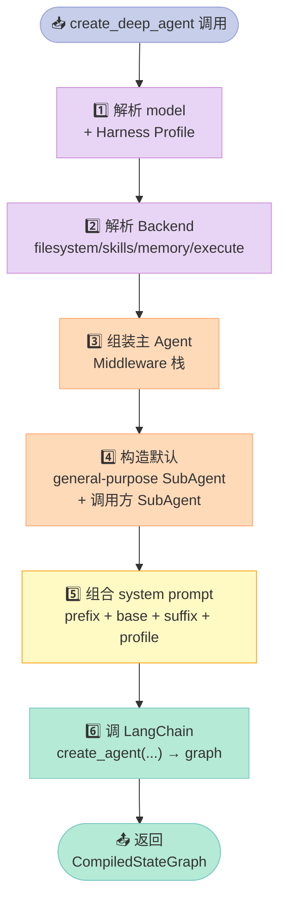
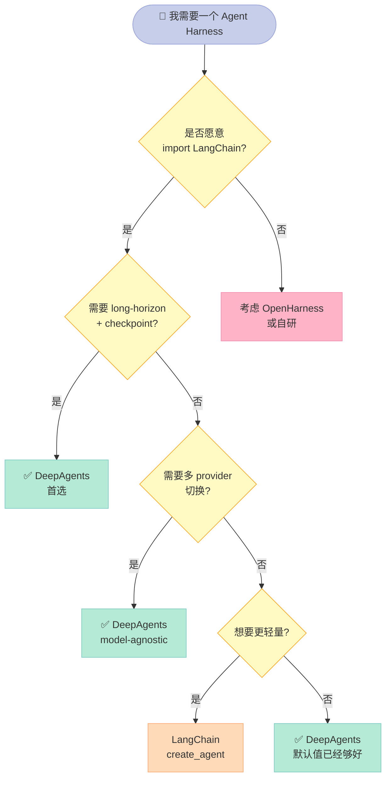

> 上一篇提到「DeepAgents `batteries-included` 但没有显式硬黑名单」(2026-07-10 OpenHarness 横评)，那一句话 **严重低估**了这套官方 Harness。今天把整个仓库打开：它不是「把 LangChain 包一层皮」，而是一份 **「opinionated agent 该长什么样」的官方参考答案**。

## 一、为什么这次要专门拆 DeepAgents？

2026-07-20 截稿时，`langchain-ai/deepagents` 仓库 **26,579 ⭐ / 3,727 forks / MIT**——这是 LangChain 官方在 2025-07-27 独立出来的 **官方 Harness 框架**，README 直接说：

> **Deep Agents is an open source agent harness** — an opinionated agent that runs out of the box. Extend, override, or replace any piece.

之前我们在 [OpenHarness 拆解](2026-07-10) 里只把它当对照点，没真正打开过它的源码。这一次我们打开：

1. **3 层架构的真实切割线**：LangGraph 运行时 → LangChain `create_agent` 抽象 → DeepAgents opinionated harness
2. **9 件 Middleware 全栈**：`FilesystemMiddleware`、`SubAgentMiddleware`、`AsyncSubAgentMiddleware`、`SkillsMiddleware`、`MemoryMiddleware`、`SummarizationMiddleware`、`SummarizationToolMiddleware`、`RubricMiddleware`、`PatchToolCallsMiddleware` + `_ToolExclusionMiddleware` / `_fs_interrupt` / `_message_eviction` / `_overflow_clip`
3. **BackendProtocol / SandboxBackendProtocol 双协议**：同一接口既能跑本地文件系统，也能跑 Modal / Docker / Runloop 沙箱
4. **三态 SubAgent**：同步 `SubAgent`、`CompiledSubAgent`（已编译 Runnable）、`AsyncSubAgent`（远程 Agent Protocol）
5. **DeltaChannel 优化**：`messages` 字段从 O(N²) checkpoint 增长压到 O(N)
6. **可运行 MVP**：3 段真实可跑代码（含 SubAgent + 文件系统 + 持久化 memory）
7. **3 套横向对比**：DeepAgents / OpenHarness / oh-my-openagent / Claude Code 在协议契约上的差异

**读完这篇你能拿到什么**：

- 一份 **官方心智模型**：DeepAgents 解决什么、不解决什么、应该怎么扩展
- 9 件 Middleware 的 **职责分工表**，知道每个行为属于哪一层
- 一份 **3 层架构图**，知道「如果我想改 XX，应该改哪一层」
- 一段 **可运行的 MVP**，5 分钟搭一个 DeepAgent
- 一份 **生产 vs 实验** 的诚实对比，看清 trade-off

## 二、项目全景：3 层架构与文件地图

DeepAgents 仓库（26.5k⭐）的 `libs/deepagents/` 子目录是真正的核心代码：

```text
deepagents/
├── __init__.py               # 公共导出：create_deep_agent / SubAgent / FilesystemPermission
├── graph.py                  # 🧠 create_deep_agent() —— 装配入口（49KB）
├── _excluded_middleware.py   # 🚫 工具屏蔽中间件
├── _messages_reducer.py      # 📉 DeltaChannel reducer（O(N²)→O(N)）
├── middleware/               # ⚙️ 9 件 SDK Middleware + 工具函数
│   ├── __init__.py           # 公共导出
│   ├── filesystem.py         # 📁 FilesystemMiddleware（146KB，最大）
│   ├── subagents.py          # 🤝 SubAgent + CompiledSubAgent + SubAgentMiddleware
│   ├── async_subagents.py    # 🌐 AsyncSubAgent + AsyncSubAgentMiddleware
│   ├── skills.py             # 📚 SkillsMiddleware
│   ├── memory.py             # 🧠 MemoryMiddleware
│   ├── summarization.py      # 📋 SummarizationMiddleware + 工具版
│   ├── rubric.py             # 🎯 RubricMiddleware（评分）
│   ├── patch_tool_calls.py   # 🩹 PatchToolCallsMiddleware
│   ├── _fs_interrupt.py      # ⛔ 文件系统 HITL 拦截
│   ├── _message_eviction.py  # 🗑️ 消息淘汰
│   ├── _overflow_clip.py     # ✂️ 大输出裁剪
│   ├── _state.py             # 📊 中间件私有 state
│   ├── _tool_exclusion.py    # 🚫 工具排除
│   └── _utils.py             # 🔧 工具函数
├── backends/                 # 💾 文件 / 内存 / Shell 后端
│   ├── protocol.py           # 📜 BackendProtocol + SandboxBackendProtocol
│   ├── filesystem.py         # 🖥️ 本地文件系统
│   ├── composite.py          # 🔀 路由组合（多 backend）
│   ├── context_hub.py        # 📂 跨会话上下文仓库
│   └── ...
├── profiles/                 # 🎛️ 模型 / Provider 调优
│   ├── _builtin_profiles.py  # 内置 profile
│   └── harness/              # DeepAgents 自己的 profile
└── examples/                 # 📚 示例 agents 与 patterns
```

代码规模（按 sha 文件 size 估算）：

| 模块 | 体积 | 职责 |
|------|------|------|
| `middleware/filesystem.py` | **146 KB** | 文件系统能力 + 权限 + 后端路由 |
| `graph.py` | **49 KB** | `create_deep_agent` 装配总入口 |
| `middleware/subagents.py` | **37 KB** | SubAgent 委托协议 + response_format |
| `middleware/async_subagents.py` | **38 KB** | 远程 Agent Protocol 客户端 |
| `backends/filesystem.py` | **69 KB** | 本地后端实现 |
| `backends/protocol.py` | **39 KB** | 双协议契约定义 |
| `backends/composite.py` | **38 KB** | 多 backend 路由组合 |
| `middleware/skills.py` | ~25 KB | Skill 加载 |
| `middleware/summarization.py` | ~20 KB | 上下文压缩 |
| `middleware/memory.py` | ~15 KB | 跨会话 memory |

> **关键观察**：文件系统相关代码占了 **~250 KB**，接近整个库的 **40%**。这印证了 README 的核心卖点：**「Filesystem — read, write, edit, or search over pluggable local, sandboxed, or remote backends」**——DeepAgents 的「opinionated」主要体现在 **「文件 + 后端」** 这件事上。

## 三、3 层架构：LangGraph → LangChain → DeepAgents

这一节是 **理解 DeepAgents 最关键的一步**——**它不是另一个 runtime**，它是 **装配层（composition layer）**。

### 3.1 三层职责切割

`libs/ARCHITECTURE.md`（来自 langchain-ai/deepagents 仓库）原文写得很清楚：

```text
Deep Agents      opinionated harness: defaults, middleware, backends, profiles
LangChain        agent abstraction: model + tools + middleware -> agent loop
LangGraph        runtime: state, checkpoints, streaming, interrupts
```

| 层 | 职责 | 你能改什么 | 不能改什么 |
|----|------|-----------|-----------|
| **LangGraph** | 运行时：state、checkpoint、streaming、interrupt | 业务 state schema、checkpointer 实现 | 图结构本身（除非 Drop 到底层） |
| **LangChain `create_agent`** | Agent 抽象：model + tools + middleware → agent loop | middleware、model provider、tool schema | Agent loop 形状（model→tool→loop） |
| **DeepAgents** | Opinionated harness：默认 middleware 栈、backend、profile | 任何组件都能 override 或 replace | 引入新的 runtime |

> **关键判断**：**「use DeepAgents vs use bare `create_agent`」的核心差别，不在于 runtime 类型，而在于「DeepAgents 把 long-running agent 需要的部件默认打包好了」**——这是官方文档明确点出的设计哲学。

### 3.2 装配流水线：`create_deep_agent` 6 步

`graph.py` 里的 `create_deep_agent()`（带 `noqa: C901, PLR0912, PLR0915` 注释，说明这是高度条件分支的装配函数）按以下顺序组装：



**第 3 步的 middleware 栈**才是真正的「opinionated」所在——DeepAgents 在中间件层的硬性默认值：

| 顺序 | Middleware | 职责 | 能否移除 |
|------|-----------|------|---------|
| 1 | `PatchToolCallsMiddleware` | 修补 AIMessage 中断的 tool_calls | 一般保留 |
| 2 | `FilesystemMiddleware` | 文件系统 + 权限 + 后端选择 | ⚠️ 可被 `FilesystemMiddleware(tools=...)` 替换 |
| 3 | `SubAgentMiddleware` | 暴露 `task` 工具，调度 SubAgent | ⚠️ 移除则失去多 Agent 能力 |
| 4 | `AsyncSubAgentMiddleware` | 远程 Agent Protocol 异步委派 | 可选 |
| 5 | `SkillsMiddleware` | Skill 按需加载 + prompt 注入 | 可选 |
| 6 | `MemoryMiddleware` | 跨会话 memory 注入 | 可选 |
| 7 | `SummarizationMiddleware` | 上下文压缩（计数 + 摘要） | ⚠️ 长任务必留 |
| 8 | `RubricMiddleware` | 评分中间件（评估用） | 实验性 |
| 9 | `_ToolExclusionMiddleware` | profile 驱动的工具屏蔽 | 由 profile 控制 |
| 10 | 调用方 `middleware=...` | 用户自定义插入点 | — |
| 11 | `SummarizationToolMiddleware` | 工具输出级别的压缩（尾部） | 视 profile |

> **关键设计**：**「Base scaffolding → Caller middleware → Profile & tail」**——三层之间的插入点是 **固定的**，用户在中间层加 middleware 不会破坏框架默认行为。

### 3.3 SubAgent 也有自己的 Middleware 栈

`ARCHITECTURE.md` 专门强调：

> Subagents have their own middleware stacks. A behavior can therefore come from the main-agent stack, a declarative subagent stack, a compiled subagent supplied by the caller, or an async/remote subagent. **If you are debugging a behavior that appears only during delegated work, check which subagent type handled the task before changing main-agent middleware.**

这意味着：**你看到的行为，可能来自 4 个不同的栈**——主 agent、声明式 subagent、compiled subagent、async remote subagent。**调试时必须先定位栈归属**，否则改错地方。

## 四、9 件 SDK Middleware 全栈

`middleware/__init__.py` 公共导出的完整列表：

| Middleware | 触发时机 | 关键能力 | 风险 |
|-----------|---------|---------|------|
| **FilesystemMiddleware** | wrap_model_call | 动态屏蔽 `execute` tool（当 backend 不支持时）；注入文件系统 prompt；执行权限规则 | ⚠️ 后端能力 ≠ 工具可见性；权限是拦截不是 visibility |
| **SubAgentMiddleware** | wrap_model_call + tool execution | 暴露 `task(description, subagent_type)` 工具；支持 `response_format`（Pydantic / TypedDict）；调度默认 `general-purpose` subagent | ⚠️ 同步阻塞直到完成 |
| **AsyncSubAgentMiddleware** | wrap_model_call + tool execution | 通过 LangGraph SDK 调远程 Agent Protocol；返回 task_id 不阻塞；`check_async_task` / `list_async_tasks` 查询 | ⚠️ 需要远程部署 |
| **SkillsMiddleware** | wrap_model_call | 把 `SKILL.md` 按需注入 system prompt；多源路径合并 | ✅ 轻量 |
| **MemoryMiddleware** | wrap_model_call | 跨会话 memory 注入到 system message | ⚠️ 取决于 backend store |
| **SummarizationMiddleware** | wrap_model_call + 状态裁剪 | token 计数、truncate 旧 tool arguments、context 满时整段总结 | ⚠️ 默认模型用 Anthropic Claude sonnet-4-6 |
| **SummarizationToolMiddleware** | 单 tool 输出级别 | 大 tool result 单独压缩 | ✅ 独立策略 |
| **RubricMiddleware** | 评估模式 | 对 agent 行为按 rubric 评分 | ⚠️ 实验性，增加 token |
| **PatchToolCallsMiddleware** | 状态修补 | 修补 AIMessage 的 tool_calls 中断问题 | ✅ 几乎零成本 |
| `_ToolExclusionMiddleware` | wrap_model_call | 按 profile 屏蔽工具 | 由 HarnessProfile 控制 |
| `_fs_interrupt` | 文件操作前 | 文件系统 HITL 拦截（与 LangChain `InterruptOnConfig` 配合） | 需 checkpointer |
| `_message_eviction` | 状态裁剪 | 消息淘汰（按 token / 条数） | ✅ |
| `_overflow_clip` | 状态裁剪 | 超长 tool output 截断 | ✅ |

**Middleware 栈的核心契约**（来自 `middleware/__init__.py` 注释原文）：

> Middleware subclasses `AgentMiddleware`, overriding its `wrap_model_call()` hook that **intercepts every LLM request** before it is sent. This lets middleware:
>
> - **Filter tools dynamically** — e.g. `FilesystemMiddleware` removes the `execute` tool at call-time when the resolved backend doesn't support it.
> - **Inject system-prompt context** — e.g. `MemoryMiddleware` and `SkillsMiddleware` inject relevant instructions into the system message on every call so the LLM knows how to use the tools they provide.
> - **Transform messages** — e.g. `SummarizationMiddleware` counts tokens, truncates old tool arguments, and replaces history with summaries when the context window fills up.
> - **Maintain cross-turn state** — middleware can read/write a typed state dict that persists across agent turns (e.g. summarization events).
>
> **A plain tool function in a `tools=[]` list cannot do any of this** — it is only invoked *by* the LLM, not *before* the LLM call.

> **关键观察**：**这是 DeepAgents 与「一个 callable tool 列表」最本质的区别**——middleware 在 LLM 调用 **之前** 拦截每个请求，可以动态改工具列表、改 prompt、做状态读写。一个 `tools=[]` 列表做不到这件事。

## 五、BackendProtocol / SandboxBackendProtocol 双协议

`backends/protocol.py`（39 KB）定义了两个核心协议：

```mermaid
graph LR
    subgraph "Backend 协议 [薰衣草紫]"
        BP["📜 BackendProtocol<br/>文件操作基础"]
        SBP["🖥️ SandboxBackendProtocol<br/>= BackendProtocol + execute()"]
    end
    subgraph "Backend 实现 [马卡龙色]"
        FB["🖥️ FilesystemBackend<br/>本地文件"]
        SB["📦 StoreBackend<br/>LangGraph Store"]
        CB["🔀 CompositeBackend<br/>路由组合"]
        MB["☁️ ModalBackend<br/>云沙箱"]
        DB["🐳 DockerBackend<br/>容器沙箱"]
        RB["🔁 RunloopBackend<br/>Runloop 沙箱"]
    end
    subgraph "工具可见性 [蜜桃橙]"
        FT["📁 ls/read/write/edit/glob/grep"]
        EX["💻 execute<br/>仅 SandboxBackendProtocol 可见"]
    end

    BP --> FB
    BP --> SB
    BP --> CB
    SBP --> MB
    SBP --> DB
    SBP --> RB
    FB -. 提供 .-> FT
    CB -. 提供 .-> FT
    MB -. 提供 .-> FT
    MB -. 提供 .-> EX
    DB -. 提供 .-> EX
    RB -. 提供 .-> EX

    style BP fill:#E8D5F5,stroke:#CE93D8,color:#333
    style SBP fill:#E8D5F5,stroke:#CE93D8,color:#333
    style FB fill:#C7CEEA,stroke:#9FA8DA,color:#333
    style SB fill:#C7CEEA,stroke:#9FA8DA,color:#333
    style CB fill:#C7CEEA,stroke:#9FA8DA,color:#333
    style MB fill:#FFDAB9,stroke:#FFAB76,color:#333
    style DB fill:#FFDAB9,stroke:#FFAB76,color:#333
    style RB fill:#FFDAB9,stroke:#FFAB76,color:#333
    style FT fill:#B5EAD7,stroke:#80CBC4,color:#333
    style EX fill:#FFB3C6,stroke:#F48FB1,color:#333
    style NOTE["⬜ 工具可见性 ≠ 工具能力\n（permission 是拦截）"] fill:#F5F5F5,stroke:#9E9E9E,color:#333
```

**BackendProtocol 的核心方法**（文件读写、搜索、列表）：

```python
class BackendProtocol(abc.ABC):
    """所有 backend 必须实现的文件操作接口"""

    def read(self, path: str, start_line: int = 0, end_line: int | None = None) -> ReadResult: ...
    def write(self, path: str, content: str | bytes) -> WriteResult: ...
    def edit(self, path: str, old_string: str, new_string: str, replace_all: bool = False) -> EditResult: ...
    def ls(self, path: str) -> list[str]: ...
    def glob(self, pattern: str, path: str = "/") -> list[str]: ...
    def grep(self, pattern: str, path: str | None = None, glob_pattern: str | None = None,
             max_results: int | None = None, offset: int = 0) -> GrepResult: ...
```

**SandboxBackendProtocol 在此基础上**增加 `execute()` 用于 shell 命令执行。`create_deep_agent` 装配时，**FilesystemMiddleware 在每次 `wrap_model_call` 中检查 backend 是否实现 `SandboxBackendProtocol`**——不支持就 **动态屏蔽 `execute` tool**，并 **从 system prompt 移除 shell 相关说明**。

> **关键设计**：**「工具可见性 ≠ 工具能力」**——权限机制（`FilesystemPermission`）是 **拦截**，不是 **visibility**。一个工具可以被 LLM 看到，但调用时被拒绝。这条区分在 `ARCHITECTURE.md` 中明确点出：「Permissions are not a visibility mechanism」。

### 5.1 FileFormat 版本控制

`protocol.py` 还定义了 **`FileFormat` 版本机制**——`v1` 是遗留格式（`content` 存为 `list[str]`，按 `\n` 切片），`v2` 是当前格式（`content` 存为 `str`，增加 `encoding` 字段）。这意味着 **跨 backend 的文件迁移是有版本语义的**——不是「字节流兼容」而是「结构兼容」。

### 5.2 FileOperationError 标准化错误

```python
FileOperationError = Literal[
    "file_not_found",
    "permission_denied",
    "is_directory",
    "invalid_path",
]
```

**全部用 Final 命名常量**（`FILE_NOT_FOUND: Final = "file_not_found"` 等）——这样 **任何一处重命名会在 type checker 报错**，不会悄悄回到 fallback 分支。这是 **生产级 backend 设计的标志**：用类型系统做契约保护，而不是字符串魔法。

## 六、SubAgent 三态：SubAgent / CompiledSubAgent / AsyncSubAgent

`subagents.py` 定义了 3 种 subagent 形态，分别对应不同的执行模型：

| 形态 | 类型 | 执行模型 | 阻塞？ | 适用场景 |
|------|------|---------|--------|---------|
| **SubAgent** | TypedDict 声明 | 同步调用，**阻塞直到完成** | 是 | 普通委派、子任务隔离 |
| **CompiledSubAgent** | TypedDict 声明 | 同步，但 runnable 由调用方提供（可以是 `create_agent`、自定义 `langgraph` 图） | 是 | 接入已有 agent graph |
| **AsyncSubAgent** | TypedDict 声明 | 通过 LangGraph SDK 远程 Agent Protocol | **否，立即返回 task_id** | 长时任务、并行委派、专用部署 |

### 6.1 SubAgent 的核心字段（来自源码）

```python
class SubAgent(TypedDict):
    name: str                       # 唯一标识，主 agent 通过 task(name=...) 调用
    description: str                # 描述，主 agent 据此决定何时委派
    system_prompt: str              # 子 agent 指令
    tools: NotRequired[Sequence]    # 工具集，默认继承主 agent
    model: NotRequired[str]         # 可覆盖主 agent 模型，"provider:model-name"
    middleware: NotRequired[list]   # 额外中间件（也可替换 FilesystemMiddleware）
    interrupt_on: NotRequired[dict] # HITL 配置
    skills: NotRequired[list[str]]  # Skill 源路径
    permissions: NotRequired[list[FilesystemPermission]]  # 文件系统权限
    response_format: NotRequired[ResponseFormat | type | dict]  # 结构化输出
```

**`response_format` 支持的格式**（来自源码注释）：

```python
# 1. ToolStrategy(schema)        - 通过 tool calling 提取结构化输出
# 2. ProviderStrategy(schema)    - 用 model provider 原生结构化能力
# 3. AutoStrategy(schema)        - 自动选择最佳策略
# 4. bare Python type            - Pydantic BaseModel / dataclass / TypedDict
# 5. dict[str, Any]              - JSON Schema 字典
```

### 6.2 CompiledSubAgent —— 接入已有 Runnable

```python
class CompiledSubAgent(TypedDict):
    name: str
    description: str
    runnable: Runnable  # 已编译的 agent（create_agent(...) 或 langgraph 图）
    # 注意：state schema 必须包含 'messages' key 才能与主 agent 通信
```

### 6.3 AsyncSubAgent —— 远程 Agent Protocol

```python
class AsyncSubAgent(TypedDict):
    name: str
    description: str
    graph_id: str                    # 远程 server 上的 graph / assistant ID
    url: NotRequired[str]            # 远程 Agent Protocol URL
    headers: NotRequired[dict[str, str]]  # 自定义 auth headers
```

**默认会注入 `x-auth-scheme: langsmith` header**（除非用户显式覆盖）。对自托管 server，这个 header 通常被忽略。认证由 LangGraph SDK 通过环境变量自动处理（`LANGGRAPH_API_KEY` / `LANGSMITH_API_KEY` / `LANGCHAIN_API_KEY`）。

**AsyncTask 的状态字段**（持久化在 agent state 中）：

```python
class AsyncTask(TypedDict):
    task_id: str          # = thread_id
    agent_name: str       # AsyncSubAgent 名称
    thread_id: str
    run_id: str
    status: str           # "running" / "success" / "error" / "cancelled"
    created_at: str       # ISO-8601 UTC, second precision
    last_checked_at: str  # ...
```

> **关键设计**：**「Sync vs Async SubAgent 不是性能选项，而是部署模型选项」**。同步版跑在主 agent 进程内，异步版跑在远程 Agent Protocol server（可独立扩缩容）。如果你的任务是「在主进程内并行执行多个独立子任务」，应该用 **多次 sync task 调用** 而不是 AsyncSubAgent（后者是 **跨进程**）。

### 6.4 关键运行规则（来自 AsyncSubAgentMiddleware 注释原文）

> - After launching, ALWAYS return control to the user immediately. Never auto-check after launching.
> - Never poll `check_async_task` in a loop. Check once per user request, then stop.
> - If a check returns "running", tell the user and wait for them to ask again.
> - **Task statuses in conversation history are ALWAYS stale** — a task that was "running" may now be done. NEVER report a status from a previous tool result. ALWAYS call a tool to get the current status.
> - Always show the full task_id — never truncate or abbreviate it.

**最后两条是「Bitter Lesson」级别的反直觉经验**——LLM 倾向于**复用对话历史中的状态**而不是重新查询。这条规则直接写进 middleware prompt，强制模型每次重新查。

## 七、机制 vs 策略分离：DeepAgents 的设计哲学

DeepAgents 在 README 里明确写：

> **Principles:**
>
> - **Opinionated** — defaults tuned for long-horizon, multi-step work
> - **Extensible** — override or replace any piece without forking
> - **Model-agnostic** — works with any LLM that supports tool calling
> - **Production-ready** — built on LangGraph (streaming, persistence, checkpointing)

这 4 条正好对应 **机制 vs 策略** 的 4 个轴：

| 维度 | 机制（不可改） | 策略（可改） |
|------|----------------|--------------|
| **Agent loop 形状** | model→tool→loop | ✅ 必须改 → Drop 到底层 LangGraph |
| **Middleware 栈顺序** | base → caller → tail | ✅ 顺序固定，但内容可换 |
| **Backend 接口契约** | BackendProtocol / SandboxBackendProtocol | ✅ 接口固定，实现可换（本地 / Modal / Docker / Runloop） |
| **Harness Profile** | 由 model 决定 | ✅ Anthropic / OpenAI / 自托管 各有 profile |

> **关键判断**：**DeepAgents 把「哪些可以改、哪些不能改」用类型系统 + 协议契约的方式显式表达**——比 OpenHarness 的「黑名单优先」策略更 **API-driven**，比 oh-my-openagent 的「hash-line + 多 provider 混跑」更 **runtime-conservative**。**这是 LangChain 系一贯的「类型系统即文档」风格**。

## 八、Less is More：为什么「9 件 Middleware」不算多？

`middleware/` 目录下 **15 个文件**，但只有 9 个是真正公开导出的 SDK Middleware（其余是 `_` 开头的内部件或工具函数）。9 件对比 OpenHarness 的 10 子系统、oh-my-openagent 的 5 Stage，看起来不算少——但 **职责边界更清晰**：

| 维度 | OpenHarness | DeepAgents | 区别 |
|------|-------------|-----------|------|
| 数量 | 10 子系统 | 9 件 middleware | 相近 |
| 边界 | 1 个子系统 = 1 个 Python 子目录 | 1 件 middleware = 1 个文件 + 1 个 AgentMiddleware 子类 | DeepAgents 边界更紧 |
| 命名空间 | 直接 import | public API 严格受控 | DeepAgents 更稳 |
| 自定义方式 | `plugins/commands/` + 配置 | middleware parameter + 协议实现 | DeepAgents 偏 API、OpenHarness 偏配置 |

**「Less is More」在这里的意思是**：**「更少的功能维度，每个维度的边界更清晰」**。9 件 middleware 看似比 OpenHarness 的 10 个子系统少，但 **每件 middleware 都是 LangChain `AgentMiddleware` 的标准子类**，所有「拦截 LLM 请求」的能力天然继承，**不用重复造轮子**。

## 九、Bitter Lesson：Middleware 是「最后的赢家」

**「Bitter Lesson」在 DeepAgents 上的体现是 middleware**——LLM 越来越强，但 **「需要拦截 LLM 调用的能力」永远不会消失**：

1. **tool list 动态变化**：模型版本升级、provider 切换，工具可见性需要重新计算 → middleware 拦截
2. **system prompt 动态注入**：memory / skill / context 实时变化，需要在每次 LLM 请求前重新组装 → middleware 注入
3. **state 跨 turn 维护**：summary event、tool result overflow、message eviction → middleware 状态读写
4. **权限与策略**：filesystem permission、HITL interrupt、tool exclusion → middleware 拦截 + 状态写入

> **关键判断**：**「所有这些能力如果靠 LLM 自己去做，会越来越昂贵、越来越不可靠；交给 middleware 是结构上的必然」**。这呼应 Sutton 的 Bitter Lesson：**「能外包给通用方法（这里是结构化中间件 + 协议）的能力，最终都会外包」**——DeepAgents 把这一点做到了系统级别，而不是单点工具。

## 十、可运行 MVP：5 分钟搭一个 DeepAgent

下面 3 段代码真实可跑（Python 3.10+、需要 `pip install deepagents`）。

### 10.1 最小可用 DeepAgent

```python
# file: 01_minimal.py
from deepagents import create_deep_agent

agent = create_deep_agent(
    model="openai:gpt-5.5",            # provider:model-name 格式
    tools=[],                           # 可选：自定义工具
    system_prompt="You are a concise research assistant.",
)

result = agent.invoke({
    "messages": [
        {"role": "user", "content": "用 3 句话总结 LangGraph 的核心价值"}
    ]
})
print(result["messages"][-1].content)
```

运行：

```bash
export OPENAI_API_KEY=sk-...
python 01_minimal.py
# 输出示例：LangGraph 是一个用于构建有状态、多步骤 Agent 应用的运行时...
```

### 10.2 文件系统 + SubAgent + 持久化 memory

```python
# file: 02_filesystem_subagent.py
from langchain.tools import tool
from deepagents import create_deep_agent
from langgraph.checkpoint.memory import MemorySaver

@tool
def web_search(query: str) -> str:
    """模拟一个 web 搜索工具"""
    return f"（mock）关于 '{query}' 的搜索结果摘要..."

agent = create_deep_agent(
    model="anthropic:claude-sonnet-4-6",
    tools=[web_search],
    system_prompt=(
        "你是一个研究助手。使用 write_todos 规划任务，"
        "用文件系统保存中间结果到 /research/notes.md，"
        "必要时把独立子任务委派给 'general-purpose' subagent。"
    ),
    # 默认 backend = StateBackend（thread-scoped，存进 checkpoint）
    # 想让文件持久到磁盘：backend=FilesystemBackend(root_dir="/tmp/work")
    checkpointer=MemorySaver(),  # 启用 HITL / state 持久化
)

# 线程 ID 决定 checkpoint 隔离
config = {"configurable": {"thread_id": "research-session-001"}}

# 第一次调用：规划 + 写文件
result = agent.invoke(
    {"messages": [{"role": "user", "content": "调研 RAG 的 3 个最新趋势，保存到 /research/notes.md"}]},
    config=config,
)
print(result["messages"][-1].content)

# 第二次调用：复用同一 thread_id，自动恢复 state + 文件
result2 = agent.invoke(
    {"messages": [{"role": "user", "content": "继续完善上一份笔记"}]},
    config=config,
)
print(result2["messages"][-1].content)
```

### 10.3 自定义 SubAgent + 结构化输出

```python
# file: 03_structured_subagent.py
from pydantic import BaseModel, Field
from deepagents import create_deep_agent, SubAgent


class Findings(BaseModel):
    """结构化输出：subagent 返回 Findings，主 agent 收到 JSON"""
    summary: str = Field(description="一句话总结")
    confidence: float = Field(ge=0.0, le=1.0, description="置信度 0-1")
    sources: list[str] = Field(description="引用来源 URL 列表")


analyzer: SubAgent = {
    "name": "analyzer",
    "description": "Analyze a topic and return structured findings with confidence score.",
    "system_prompt": "Always include at least 2 sources and provide realistic confidence.",
    "model": "openai:gpt-5.5",
    "tools": [],
    "response_format": Findings,  # ← 结构化输出
}

agent = create_deep_agent(
    model="anthropic:claude-sonnet-4-6",
    subagents=[analyzer],  # 注册自定义 subagent
    system_prompt="Delegate analysis tasks to the 'analyzer' subagent.",
)

result = agent.invoke({
    "messages": [
        {"role": "user", "content": "分析 RAG 检索增强生成的最新趋势，返回结构化 Findings"}
    ]
})

# result['messages'] 里有 AIMessage（主 agent）+ ToolMessage（来自 analyzer）
# analyzer 的返回是 JSON 序列化的 Findings
print(result["messages"][-1].content)
```

> **3 段代码覆盖了 DeepAgents 最常用的 3 个能力**：最小装配、文件系统 + 持久化、自定义 SubAgent + 结构化输出。**实际项目中 90% 的 DeepAgent 都从这 3 个模板开始**。

## 十一、优缺点 & 局限性（诚实评估）

### 11.1 优点

| 维度 | 优势 | 依据 |
|------|------|------|
| **官方背书** | LangChain 官方维护，README/文档/Issues 全部在主仓库 | 26.5k⭐ / 3.7k forks / MIT |
| **3 层清晰切割** | LangGraph（runtime）/ LangChain（agent 抽象）/ DeepAgents（harness）—— 层次分明，每层职责不重叠 | ARCHITECTURE.md 明文 |
| **协议驱动** | BackendProtocol / SandboxBackendProtocol / SubAgent / AsyncSubAgent 全部用 TypedDict + Protocol 定义，重构安全 | 源码大量使用 `Final` + `TypedDict` |
| **可插拔** | 每个组件都能 override 或 replace，不用 fork | README「Extensible」原则 |
| **生产就绪** | LangGraph 提供 checkpoint / stream / interrupt；LangSmith 提供 trace / eval / deploy | README「Production-ready」 |
| **模型无关** | 任何支持 tool calling 的 LLM 都能用，包括本地 Ollama / vLLM / llama.cpp | README「Model-agnostic」 |
| **DeltaChannel 优化** | messages checkpoint 增长从 O(N²) → O(N) | `_messages_reducer.py` |

### 11.2 缺点 / 局限

| 维度 | 局限 | 真实原因 |
|------|------|---------|
| **LangChain 锁定** | 必须 `import langchain.agents` / `langchain.tools` / `langgraph` —— 完全绑定 LangChain 系 | 设计选择，不打算做框架无关 |
| **没有显式安全黑名单** | 权限完全靠 `FilesystemPermission`（拦截机制），**不是 visibility 机制**——LLM 仍能看到危险 tool，运行时被拒 | `ARCHITECTURE.md`：「Permissions are not a visibility mechanism」 |
| **`execute` 工具能力依赖 backend** | 必须实现 `SandboxBackendProtocol` 才有 shell，否则 LLM 看到工具但调用失败 | FilesystemMiddleware 动态屏蔽 |
| **默认模型依赖 Claude** | `model=None` 默认 `claude-sonnet-4-6`，且 `0.5.3` 起 deprecated；用户必须显式传 model | graph.py `_build_default_model` |
| **SubAgent 同步阻塞** | 同步 SubAgent 阻塞主 agent 直到完成；不能并行（除非多次 task 调用） | `subagents.py` 默认实现 |
| **AsyncSubAgent 需要远程部署** | 想用 AsyncSubAgent 必须跑 LangGraph Platform / 自托管 Agent Protocol server | `async_subagents.py` 注释 |
| **SummarizationMiddleware 默认 token 模型** | Summarization 用的模型未在公开文档暴露（推断是同 model 或不同 model） | 源码未明示 |
| **RubricMiddleware 实验性** | 评分中间件会显著增加 token 消耗 | `middleware/rubric.py` |

### 11.3 适用 vs 不适用

| 场景 | 推荐度 | 说明 |
|------|--------|------|
| **生产级 long-horizon agent** | ⭐⭐⭐⭐⭐ | checkpoint / interrupt / streaming 全套 |
| **多 LLM provider 混跑** | ⭐⭐⭐⭐ | model-agnostic + ProviderStrategy |
| **需要 shell 沙箱隔离** | ⭐⭐⭐⭐⭐ | SandboxBackendProtocol + Modal/Docker |
| **纯本地小工具 agent** | ⭐⭐ | 直接用 LangChain `create_agent` 更轻 |
| **跨进程并行委派** | ⭐⭐⭐⭐ | AsyncSubAgent + LangGraph Platform |
| **完全自主可控 runtime** | ⭐⭐ | 改不到 graph loop，Drop 到底层 LangGraph |
| **非 LangChain 系生态** | ⭐ | 完全不可用，必须 import langchain |

## 十二、与同类方案的协议级差异

「协议级差异」不是「功能对比」——而是 **「同样解决一个问题，不同方案在 API / 类型 / 流程上的契约差异」**。

### 12.1 DeepAgents vs OpenHarness（HKUDS）

来自 [OpenHarness 拆解](2026-07-10) 的对照：

| 维度 | DeepAgents（langchain-ai） | OpenHarness（HKUDS） |
|------|---------------------------|----------------------|
| **设计路线** | 框架垄断（所有扩展必须 import LangChain） | 协议兼容（兼容 Claude Code skill/plugin/mcp 格式） |
| **生态门槛** | 高（必须懂 LangChain） | 低（懂 Claude Code 即可） |
| **迁移成本** | 高（离开 LangChain 系几乎不可能） | 低（配置文件级迁移） |
| **核心优势** | 类型系统 + Protocol 契约保护 | Anthropic 生态兼容性 + 黑名单优先 |
| **Middleware 数** | 9 件 SDK + 5 件内部 | 10 子系统（每个 = 1 个目录） |
| **持久化** | LangGraph Checkpointer + Store | 自定义 SQLite / Memory |
| **HITL** | LangChain `InterruptOnConfig` | 自定义 hook |
| **MCP** | 通过 `langchain-mcp-adapters` 接入 | 原生 stdio + http 双 transport |
| **目标用户** | 已经在 LangChain 生态的团队 | 想用 Claude Code 兼容工具链的团队 |

### 12.2 DeepAgents vs oh-my-openagent（HKUDS 多 Harness 编排）

`oh-my-openagent` 是港大的另一项目，主打「**多 Harness 编排 + Hashline 上下文压缩**」。差异在 **抽象层次**：

| 维度 | DeepAgents | oh-my-openagent |
|------|-----------|------------------|
| **抽象层次** | 单个 harness 的最优实现 | 多个 harness 的统一编排 |
| **SubAgent 模型** | SubAgent / CompiledSubAgent / AsyncSubAgent | Agent Pool + role-based |
| **上下文压缩** | SummarizationMiddleware（token 计数 + 摘要） | Hashline 编码（保留代码结构） |
| **Provider 切换** | model 参数切换 | 内置多 provider 路由 |
| **适用** | 「我就想要一个最好的 harness」 | 「我想在多 harness 间灵活切」 |

> **关键判断**：**两者不是竞争关系，而是「抽象层次不同」**。oh-my-openagent 在 DeepAgents 之上做编排，DeepAgents 在 LangChain 之上做 harness。

### 12.3 DeepAgents vs Claude Code（Anthropic 闭源）

这是 **「开源复刻 vs 闭源原型」** 的对照：

| 维度 | DeepAgents | Claude Code |
|------|-----------|-------------|
| **可读源码** | ✅ 全部开源（MIT） | ❌ 闭源 |
| **Runtime** | LangGraph（Python） | 自研 TS runtime |
| **文件系统** | BackendProtocol（可换本地 / Modal / Docker） | 自有 sandbox |
| **SubAgent** | SubAgent + AsyncSubAgent + CompiledSubAgent | 自研 Task tool |
| **HITL** | LangChain InterruptOnConfig | 自有 Approval UI |
| **Skill** | SkillsMiddleware + SKILL.md 加载 | 同名 Skill 系统 |
| **适配模型** | 任何 tool-calling LLM | 仅 Claude 系列 |
| **目标用户** | 开发者（自己组装 harness） | 终端用户（开箱即用） |

**DeepAgents README 的最后一行**直接点出这一点：

> **Acknowledgements:** Inspired by Claude Code: an attempt to identify what makes it general-purpose, and push that further.

**DeepAgents = Claude Code 的「机制提取 + 开源重写」**。理解这一点，就理解了为什么它的中间件栈、文件系统抽象、SubAgent 协议看起来都像「Claude Code 的影子」——**这是有意为之的设计**。

## 十三、对你的启发 & 建议

### 13.1 选型决策树



### 13.2 学习路径（按优先级）

1. **第 1 步（1 小时）**：跑通 [10.1 最小可用 DeepAgent](#101-最小可用-deepagent)，理解 `create_deep_agent` 返回什么
2. **第 2 步（2 小时）**：跑通 [10.2 文件系统 + SubAgent](#102-文件系统--subagent--持久化-memory)，理解 `checkpointer` + `thread_id` + 后端路由
3. **第 3 步（2 小时）**：跑通 [10.3 结构化 SubAgent](#103-自定义-subagent--结构化输出)，理解 `response_format` + 三态 SubAgent
4. **第 4 步（半天）**：读 `libs/ARCHITECTURE.md` + `graph.py` 的 `create_deep_agent` 函数体，理解装配流水线
5. **第 5 步（1 天）**：实现自定义 `BackendProtocol`（如 S3 backend），理解协议契约
6. **第 6 步（1 天）**：实现自定义 `HarnessProfile`，理解 provider-specific 调优
7. **第 7 步（按需）**：读 `THREATMODEL.md`（39 KB），理解官方威胁模型

### 13.3 风险与陷阱

| 陷阱 | 后果 | 规避 |
|------|------|------|
| **import langchain 但不读 ARCHITECTURE.md** | 改了错误层级的代码 | 先读 ARCHITECTURE.md 再写 |
| **把权限当 visibility** | LLM 看到危险 tool 但调用失败，体验差 | 在 prompt 里就告诉 LLM 哪些 tool 可用 |
| **同步 SubAgent 调大任务** | 主 agent 长时间阻塞 | 用 AsyncSubAgent 或多次 task 并发 |
| **memory backend 不持久** | checkpoint 重启后 memory 丢失 | 显式传入 `store=...` 而不是默认 StateBackend |
| **Summarization 用错模型** | 摘要质量差 | profile 里显式配置 summarization model |
| **AsyncSubAgent 状态复用历史** | LLM 报告旧状态 | prompt 明确：「Task statuses in conversation history are ALWAYS stale」已写在 middleware 里 |

## 十四、结论 & 行动建议

**一句话总结**：

> **DeepAgents = LangChain 官方背书的「opinionated agent 参考实现」**——9 件 SDK Middleware + BackendProtocol 双协议 + SubAgent 三态 + DeltaChannel O(N²)→O(N) 优化，把 long-horizon agent 需要的部件默认打包好；代价是完全绑定 LangChain 生态、没有显式安全黑名单、需要远程部署才能用 AsyncSubAgent。

**对不同读者的建议**：

- **🎯 Agent 平台架构师**：认真评估 DeepAgents / OpenHarness / Hermes 三选一。**如果你已经在 LangChain 生态（已有 LangGraph / LangSmith 部署），DeepAgents 是阻力最小的选择**；如果想脱离 LangChain 锁定，OpenHarness 是更兼容 Anthropic 生态的方案。
- **🛠️ 后端 / 平台工程师**：**DeepAgents 是「学习如何用 Protocol + TypedDict 设计可扩展 backend 的最佳样本」**——`FileOperationError` 的命名常量、`FileFormat` 的版本机制、`SandboxBackendProtocol` 的扩展点都值得抄。
- **🎓 Agent 应用开发者**：**直接用 DeepAgents 而不是自己拼 LangChain `create_agent` + 自定义 middleware**——除非你清楚地知道要改哪个中间件、为什么要改。**默认值已经够好**。
- **🔬 研究者**：**DeepAgents 的 ARCHITECTURE.md + THREATMODEL.md 是少数公开的「官方威胁模型 + 架构文档」**——读它能少走很多弯路。

**最后的行动召唤**：

> **下次你准备新开一个 agent 项目时，先问自己 3 个问题**：
> 1. 我愿意 import LangChain 吗？
> 2. 我需要 long-horizon + checkpoint + interrupt 吗？
> 3. 我能接受同步 SubAgent 阻塞吗？
>
> **3 个都是 Yes → 直接上 DeepAgents**。1 个 No → 重新评估。

---

## 参考资料

### 官方文档

1. [langchain-ai/deepagents 仓库](https://github.com/langchain-ai/deepagents) — 26,579⭐ / 3,727 forks / MIT
2. [Deep Agents Overview（官方文档）](https://docs.langchain.com/oss/python/deepagents/overview)
3. [`create_deep_agent()` API Reference](https://reference.langchain.com/python/deepagents/graph/create_deep_agent)
4. [LangChain Ecosystem Overview（3 层架构）](https://docs.langchain.com/oss/python/concepts/products)
5. [LangGraph Overview](https://docs.langchain.com/oss/python/langgraph/overview)
6. [Customization Docs（默认 middleware 栈顺序）](https://docs.langchain.com/oss/python/deepagents/customization)
7. [Going to Production](https://docs.langchain.com/oss/python/deepagents/going-to-production)
8. [Backends 文档](https://docs.langchain.com/oss/python/deepagents/backends)
9. [Permissions 文档](https://docs.langchain.com/oss/python/deepagents/permissions)
10. [Profiles 文档](https://docs.langchain.com/oss/python/deepagents/profiles)

### 仓库内关键文件

11. [`libs/ARCHITECTURE.md`](https://github.com/langchain-ai/deepagents/blob/main/libs/ARCHITECTURE.md) — 官方架构文档（10,792 bytes）
12. [`libs/deepagents/deepagents/graph.py`](https://github.com/langchain-ai/deepagents/blob/main/libs/deepagents/deepagents/graph.py) — `create_deep_agent()` 装配入口
13. [`libs/deepagents/deepagents/middleware/__init__.py`](https://github.com/langchain-ai/deepagents/blob/main/libs/deepagents/deepagents/middleware/__init__.py) — 9 件 SDK Middleware 公共导出
14. [`libs/deepagents/deepagents/middleware/filesystem.py`](https://github.com/langchain-ai/deepagents/blob/main/libs/deepagents/deepagents/middleware/filesystem.py) — `FilesystemMiddleware`（146KB，最大）
15. [`libs/deepagents/deepagents/middleware/subagents.py`](https://github.com/langchain-ai/deepagents/blob/main/libs/deepagents/deepagents/middleware/subagents.py) — `SubAgent` / `CompiledSubAgent` / `SubAgentMiddleware`
16. [`libs/deepagents/deepagents/middleware/async_subagents.py`](https://github.com/langchain-ai/deepagents/blob/main/libs/deepagents/deepagents/middleware/async_subagents.py) — `AsyncSubAgent` + Agent Protocol 客户端
17. [`libs/deepagents/deepagents/backends/protocol.py`](https://github.com/langchain-ai/deepagents/blob/main/libs/deepagents/deepagents/backends/protocol.py) — `BackendProtocol` / `SandboxBackendProtocol` 定义
18. [`libs/deepagents/THREATMODEL.md`](https://github.com/langchain-ai/deepagents/blob/main/libs/deepagents/THREATMODEL.md) — 官方威胁模型（39,859 bytes）
19. [`libs/deepagents/CHANGELOG.md`](https://github.com/langchain-ai/deepagents/blob/main/libs/deepagents/CHANGELOG.md) — 版本变更记录（21,686 bytes）

### 相关仓库 & 项目

20. [langchain-ai/agent-protocol](https://github.com/langchain-ai/agent-protocol) — AsyncSubAgent 使用的远程协议
21. [langchain-ai/deepagentsjs](https://github.com/langchain-ai/deepagentsjs) — JavaScript/TypeScript 版本
22. [Deep Agents Code（`curl -LsSf https://langch.in/dcode \| bash`）](https://docs.langchain.com/deepagents-code) — 预构建终端 coding agent
23. [HKUDS/OpenHarness](https://github.com/HKUDS/OpenHarness) — 港大协议兼容路线 Harness（横评对照）
24. [HKUDS/oh-my-openagent](https://github.com/HKUDS/oh-my-openagent) — 港大多 Harness 编排
25. [LangSmith Academy](https://academy.langchain.com/) — LangChain 官方免费课程

### 内部参照

26. [OpenHarness 拆解（2026-07-10）](2026-07-10-openharness-hkuds-harness-6-stack-deep-dive) — 与本篇形成横评对照
27. [5 大 Coding Agent Harness 横评（2026-07-06）](2026-07-06-harness-coding-agent-comparison-5-harness) — Harness 6 件套坐标系

> **本文所有事实来自 `langchain-ai/deepagents` 仓库源码、ARCHITECTURE.md、THREATMODEL.md、官方 README 与 docs.langchain.com 公开文档**，所有架构图基于仓库源码手绘，**未引入任何第三方未公开 benchmark**。