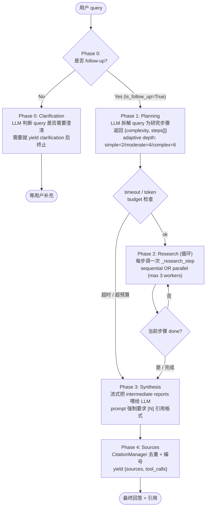
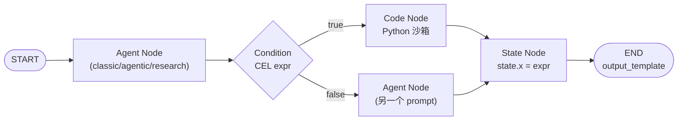
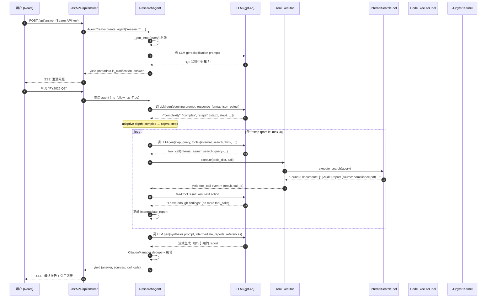

## 引子

在「AI Agent 时代，每个开源项目都在试图定义 Agent 的某种能力」时，DocsGPT 走出了一条与众不同的路 —— **不是又一个 Chat-with-Documents**，而是把 **RAG、Tool、Workflow、Research、Scheduled Agent** 五件以前在 5 个产品里才能见到的能力，塞进同一个 Apache-2.0 平台。这是它从 2023 年一个简单的「PDF 问答脚本」成长为 18k+ ⭐ 的根本原因：用户不需要选「要 ChatGPT 还是 AutoGPT 还是 Make.com」，DocsGPT 一个平台给你 4 种 Agent 模式 + Workflow 编辑器 + 调度 + MCP 工具 + 沙箱代码执行。

本文不打算罗列 DocsGPT 的功能（README 8KB 已经写完），而是深入到 `application/agents/` 目录的 1100+ 行 ToolExecutor、700+ 行 ResearchAgent、1200+ 行 WorkflowEngine 里，把这 4 个核心机制讲透：

1. **AgentCreator 工厂如何抽象 4 种 Agent 模式**：Classic（预取式 RAG）、Agentic（按需检索）、Research（多步研究 + 引用）、Workflow（DAG 编排），各自的工程取舍是什么
2. **ResearchAgent 五阶段流水线**：Clarification → Planning → Research（并行 + 预算）→ Synthesis → Sources，token/timeout 双预算控制 + adaptive depth + 引用去重
3. **WorkflowEngine 双层快照状态机**：50 步循环 + delta 增量 + 沙箱会话跨节点共享 + CEL 表达式条件分支
4. **ToolExecutor 工具执行器**：1100 行的细节战争 —— 工具缓存、凭据委托、调用解析、状态持久化、stream event 协议

读完本文你会理解，为什么 DocsGPT 能在 5 个产品（OpenAI Assistants / LangChain / n8n / ChatDev / Perplexity）之间横跳做出「all-in-one」却仍然能工程化交付。

## 项目定位与核心价值

**仓库**：[arc53/DocsGPT](https://github.com/arc53/DocsGPT)

| 指标 | 数据 |
|---|---|
| ⭐ Stars | 18,004 |
| 📦 Size | 97 MB |
| 🔤 Language | Python 100% (backend) + TypeScript (frontend) |
| 📜 License | MIT |
| 🚀 Pushed at | 2026-07-20 |
| 📁 Files | 1,761 个核心源文件 |
| 🏢 Best Practices | CNCF Sandbox (Best Practices badge) |

**一句话定义**：DocsGPT 是一个**私有化部署的 AI Agent 平台**，提供 4 种 Agent 模式（Classic / Agentic / Research / Workflow）、可视化 Workflow 编辑器、200+ 文档/数据源连接器、MCP 工具集成、沙箱代码执行、定时调度、BYOM（Bring Your Own Model）、团队/权限/SSO/OIDC/SCIM 等完整的企业级能力。

**核心能力矩阵**：

| 能力 | 关键文件 | 一句话价值 |
|---|---|---|
| 4 种 Agent | `application/agents/{classic,agentic,research,workflow}_agent.py` | 一行切换 RAG 策略 |
| 工具执行 | `application/agents/tool_executor.py` (1101 行) | 工具缓存 + 凭据委托 + 5 层解析 |
| MCP 集成 | `application/agents/tools/mcp_tool.py` (1106 行) | 4 种 transport + OAuth + SSRF 防护 |
| Workflow 引擎 | `application/agents/workflows/workflow_engine.py` (1223 行) | 50 步循环 + delta 快照 + 沙箱共享 |
| 沙箱执行 | `application/agents/tools/code_executor.py` (474 行) | Jupyter/Daytona 后端 + artifact 捕获 |
| Research 流水线 | `application/agents/research_agent.py` (703 行) | 4 阶段编排 + 引用去重 + token 预算 |
| 调度执行 | `application/agents/headless_runner.py` (190 行) | 无前端情况下跑 Agent |

**为什么 DocsGPT 在 2026 H1 重新起飞**？看 README 的 Roadmap：从 2026 年 1 月开始每月一个新里程碑 —— Agent Workflow Builder (Feb) → Research mode (Mar) → SharePoint/Confluence (Mar-Apr) → Postgres migration (Apr) → OTel (Apr) → BYOM (Apr) → Scheduling (Apr) → Notifications (May) → OIDC/SSO/SCIM (Jun) → Admin Dashboard/RBAC (Jun) → Teams (Jun)。这是把「演示型 RAG 工具」变成「企业 AI 中台」的产品化跃迁。

## 整体架构

DocsGPT 是一个**前后端分离 + 多 Worker**的 FastAPI/React 平台，核心后端服务拆成 4 个 Docker 容器：

```mermaid
flowchart TB
    subgraph Client["客户端层"]
        Web["React 前端 (port 5173)"]
        ReactWidget["React Chat Widget 嵌入组件"]
        Chatwoot["Chatwoot 客服集成"]
        Discord["Discord/Telegram Bot"]
    end

    subgraph Gateway["API 网关层"]
        Backend["FastAPI Backend (port 7091)<br/>application/api/"]
        Webhook["Webhook 接收器<br/>触发 Headless Agent"]
        APIKey["API Key 认证<br/>Bearer + JWT"]
    end

    subgraph AgentLayer["Agent 编排层 (核心 1.7MB)"]
        AgentCreator["AgentCreator 工厂<br/>classic/agentic/research/workflow"]
        BaseAgent["BaseAgent (876 行)<br/>统一接口"]
        WorkflowEngine["WorkflowEngine (1223 行)<br/>DAG 循环 + 50 步上限"]
        LLMHandler["LLMHandler<br/>tool-call 解析"]
    end

    subgraph Tools["Tool 系统"]
        ToolExecutor["ToolExecutor (1101 行)<br/>工具缓存 + 凭据委托"]
        InternalSearch["InternalSearchTool<br/>RAG 即工具"]
        MCPTool["MCPTool (1106 行)<br/>4 transport + OAuth"]
        CodeExec["CodeExecutorTool<br/>Jupyter/Daytona"]
        ThinkTool["ThinkTool<br/>显式 CoT 伪工具"]
    end

    subgraph LLMRouter["LLM Provider 层"]
        LLMCreator["LLMCreator 工厂"]
        OpenAI / Anthropic / Google["OpenAI / Anthropic / Google"]
        Ollama / llama_cpp["Ollama / llama_cpp 本地"]
    end

    subgraph Infra["基础设施"]
        Worker["Celery Worker + Beat<br/>异步任务 + 调度"]
        Redis["Redis<br/>Celery broker + 缓存"]
        Postgres[("PostgreSQL 16<br/>会话/Agent/Workflow")]
        Sandbox["Sandbox Manager<br/>Jupyter kernel / Daytona"]
        VectorDB[("向量存储<br/>FAISS/Chroma/Qdrant")]
    end

    Web --> Backend
    ReactWidget --> Backend
    Webhook --> Backend
    Backend --> AgentCreator
    AgentCreator --> BaseAgent
    BaseAgent --> WorkflowEngine
    BaseAgent --> LLMHandler
    BaseAgent --> ToolExecutor
    ToolExecutor --> InternalSearch
    ToolExecutor --> MCPTool
    ToolExecutor --> CodeExec
    ToolExecutor --> ThinkTool
    BaseAgent --> LLMCreator
    LLMCreator --> OpenAI / Anthropic / Google
    LLMCreator --> Ollama / llama_cpp
    Backend --> Worker
    Worker --> Redis
    Backend --> Postgres
    ToolExecutor --> Postgres
    CodeExec --> Sandbox
    InternalSearch --> VectorDB
```

**docker-compose 摘录**（`deployment/docker-compose.yaml:39-63`）：

```yaml
worker:
  build: ../application
  # Consumes the default queue AND the dedicated `parsing` queue (read_document /
  # parse_document). Without `parsing` here the read_document await never resolves.
  # For heavy/OCR parsing run a separate worker with `-Q parsing`.
  command: celery -A application.app.celery worker -l INFO -B -Q docsgpt,parsing
  ...
  depends_on:
    redis: { condition: service_started }
    postgres: { condition: service_healthy }
```

注意 `celery -B`：Beat 调度器内置进 worker，这是 DocsGPT 实现「Agent 定时执行」的关键。`-Q docsgpt,parsing` 显式消费两个队列：默认队列跑 RAG 检索，专用 `parsing` 队列跑 `read_document` 工具的 PDF/Office 解析（重 IO 任务）。

## 应用类型：4 种 Agent 模式的工程取舍

DocsGPT 的最大特色是 **4 种 Agent 模式可以用同一行代码切换**，由 `application/agents/agent_creator.py` 的工厂模式实现：

```python
# application/agents/agent_creator.py:11-25
class AgentCreator:
    agents = {
        "classic": ClassicAgent,
        "react": ClassicAgent,        # backwards compat: react falls back to classic
        "agentic": AgenticAgent,
        "research": ResearchAgent,
        "workflow": WorkflowAgent,
    }

    @classmethod
    def create_agent(cls, type, *args, **kwargs):
        agent_class = cls.agents.get(type.lower())
        if not agent_class:
            raise ValueError(f"No agent class found for type {type}")
        return agent_class(*args, **kwargs)
```

这 4 种 Agent 不是简单的"调用次数差异"，而是**完全不同的检索范式 + 完全不同的执行模型**：

| 模式 | 检索范式 | 适用场景 | 何时选 |
|---|---|---|---|
| **Classic** | 预取式 RAG（一次检索 → 拼 prompt → LLM 直答） | 单轮问答、FAQ、客服 | 简单 factoid / 用户问的问题 100% 在前 5 个 chunk 里 |
| **Agentic** | 按需检索（暴露 `internal_search` 工具给 LLM，让 LLM 决定何时搜、搜什么） | 多跳问答、模糊查询 | 用户的真实意图不能从 query 字面推断 |
| **Research** | 多步 Plan → 并行 Research → Synthesize | 深度研究、报告生成 | 5+ 信息源综合、需要带引用 |
| **Workflow** | DAG 编排（节点 = Agent / Code / Condition / State / Note） | 业务流程自动化、API 编排 | 业务逻辑需要"先 A 再 B 然后根据结果选 C 或 D" |

### 共同基类：BaseAgent 的统一接口

`application/agents/base.py` 的 876 行 `BaseAgent` 是所有 Agent 的基类，它解决了 3 个问题：

1. **LLM 工厂注入**（base.py:74-86）：用 LLMCreator 延迟创建 LLM 实例（避免循环 import）
2. **ToolExecutor 注入**（base.py:105-108）：每个 Agent 共享一个 ToolExecutor（或自己传一个）
3. **统一的流式输出协议**（base.py:144-235）：`_gen_inner` 方法 yield `{"type": "xxx", "data": ...}` 事件给前端

**统一流式协议的事件类型**（从源码反推）：

| Event Type | 用途 | 来源 |
|---|---|---|
| `answer` | 文本片段 | 各类 Agent 文本生成 |
| `tool_call` | 工具调用状态变更 | ToolExecutor |
| `sources` | 检索结果引用 | Classic/Agentic/Research |
| `tool_calls` | 完整工具调用列表 | 各 Agent 收尾 |
| `error` | 错误（不可恢复） | WorkflowAgent/Engine |
| `notice` | 非致命警告 | WorkflowAgent（附件丢失） |
| `research_plan` | 研究计划 | ResearchAgent |
| `research_progress` | 研究进度 | ResearchAgent |
| `workflow_run` | 工作流 run id | WorkflowEngine |
| `workflow_step` | 工作流步骤状态 | WorkflowEngine |

### 4 种 Agent 范式对比

**ClassicAgent**（classic_agent.py）—— **预取式 RAG**：

```python
# application/agents/classic_agent.py:36-59
def _gen_inner(self, query: str, log_context: LogContext) -> Generator[Dict, None, None]:
    tools_dict = self.tool_executor.get_tools()
    if self.retriever_config:
        add_internal_search_tool(tools_dict, self.retriever_config)
    if self.wiki_config:
        add_wiki_tool(tools_dict, self.wiki_config)
    self._prepare_tools(tools_dict)

    messages = self._build_messages(self.prompt, query)  # 一次性把 docs 拼进 prompt
    llm_response = self._llm_gen(messages, log_context)
    yield from self._handle_response(llm_response, tools_dict, messages, log_context)
    ...
    yield {"sources": self.retrieved_docs}
    yield {"tool_calls": self._get_truncated_tool_calls()}
```

**优**：单轮响应快、token 可预测、citation 准确（所有引用的 chunk 都在 prompt 里）
**劣**：检索质量差时整个 LLM 输出全错（garbage in, garbage out）、不能多跳

**AgenticAgent**（agentic_agent.py）—— **按需工具检索**：

```python
# application/agents/agentic_agent.py:34-56
def _gen_inner(self, query: str, log_context: LogContext) -> Generator[Dict, None, None]:
    tools_dict = self.tool_executor.get_tools()
    add_internal_search_tool(tools_dict, self.retriever_config)  # 把检索当工具
    if self.wiki_config:
        add_wiki_tool(tools_dict, self.wiki_config)
    self._prepare_tools(tools_dict)

    # 关键：prompt 里没有 pre-fetched docs
    messages = self._build_messages(self.prompt, query)
    llm_response = self._llm_gen(messages, log_context)  # LLM 自己决定要不要 search

    yield from self._handle_response(llm_response, tools_dict, messages, log_context)
    self._collect_internal_sources()  # 把工具调用的结果合并进 citations
    yield {"sources": self.retrieved_docs}
```

**核心差异**：`_build_messages` 收到的 query **没有**预拼的文档 —— 检索被推后到 LLM 的工具调用循环里。LLM 看到 query 后，可以选择：(a) 直接答（"我已知"）；(b) 调一次 `internal_search.search(query)`；(c) 调多次，每次不同 query。

**优**：LLM 能"换关键词重试"、能跳过检索（"这是常识"）、能多跳
**劣**：N 次 LLM 调用 → 慢、token 成本 ×N、需要 LLM 有 tool-call 能力

**ResearchAgent** —— **5 阶段 Plan-Research-Synthesize**（详见下一节）

**WorkflowAgent** —— **DAG 编排**（详见双层 Workflow 引擎节）

## 核心引擎一：ResearchAgent 的五阶段流水线

`application/agents/research_agent.py` 是 DocsGPT 的"重头戏"——它把"深度研究"这件事拆成 **Clarification → Planning → Research → Synthesis → Sources** 5 个阶段，每个阶段都有自己的 LLM 调用 + 自己的 token 预算 + 自己的异常处理：



### Phase 0：Clarification（澄清）

当用户的 query 模棱两可时，ResearchAgent 不会瞎猜 —— 它会先 yield 一个 `is_clarification` 事件让用户补充：

```python
# research_agent.py:172-183
# Phase 0: Clarification (skip if user is responding to a prior clarification)
if not self._is_follow_up():
    clarification = self._clarification_phase(query)
    if clarification:
        yield {"metadata": {"is_clarification": True}}
        yield {"answer": clarification}
        yield {"sources": []}
        yield {"tool_calls": []}
        log_context.stacks.append(
            {"component": "agent", "data": {"clarification": True}}
        )
        return
```

`_is_follow_up()` 通过 metadata flag 而非字符串匹配判断"用户是不是在回答上一轮澄清"（research_agent.py:294-304），这种**显式状态查询 vs 隐式字符串扫描**的设计哲学贯穿整个 ResearchAgent。

### Phase 1：Planning（自适应深度）

Planning 让 LLM 把 query 拆成研究步骤 + 评估复杂度，**深度根据复杂度自适应**：

```python
# research_agent.py:27-31
COMPLEXITY_CAPS = {
    "simple": 2,       # 1-2 步
    "moderate": 4,     # 3-4 步
    "complex": 6,      # 5-6 步
}

# research_agent.py:386-424
def _planning_phase(self, question: str) -> tuple[List[Dict], str]:
    messages = [
        {"role": "system", "content": PLANNING_PROMPT},
        {"role": "user", "content": question},
    ]
    response = self.llm.gen(
        model=self.upstream_model_id, messages=messages, tools=None,
        response_format={"type": "json_object"},  # 强制 JSON 输出
    )
    text = self._extract_text(response)
    plan_data = self._parse_plan_json(text)
    if isinstance(plan_data, dict):
        complexity = plan_data.get("complexity", "moderate")
        steps = plan_data.get("steps", [])

    # Adaptive depth: cap steps based on assessed complexity
    cap = COMPLEXITY_CAPS.get(complexity, self.max_steps)
    cap = min(cap, self.max_steps)
    steps = steps[:cap]
    return steps, complexity
```

**关键设计**：
- `response_format={"type": "json_object"}` **强制 LLM 输出 JSON**（避免 markdown 包装、避免多余文字）
- 但 `parse_plan_json` 仍做了 3 层 fallback（research_agent.py:433-473）：直接 parse → markdown code fence 提取 → 字符串扫描找 `{...}` 块 —— **因为不是所有 LLM 都支持 JSON mode**
- 4 个 prompt 文件存在 `application/prompts/research/`，分别对应 `clarification.txt` / `planning.txt` / `step.txt` / `synthesis.txt`

**planning.txt 的核心约束**（prompts/research/planning.txt）：

> IMPORTANT: Every step must be a concrete research action — something you can search for and find information about. Never generate steps that ask the user for more information or request documents. Work with what you have.

**这是 LLM-as-Planner 最容易踩的坑**：让 LLM 拆步骤时，它会"偷懒"——把"问用户补充信息"当成一步。DocsGPT 用显式约束 + 失败 fallback（"Direct investigation (planning failed)"）双重保险。

### Phase 2：Research（双预算 + 失败重试）

每一步研究都跑一个**带 token/timeout 双预算的内循环**：

```python
# research_agent.py:487-551
def _research_step_with_executor(self, step_query, tools_dict, executor) -> str:
    system_prompt = STEP_PROMPT.replace("{step_query}", step_query)
    messages = [
        {"role": "system", "content": system_prompt},
        {"role": "user", "content": step_query},
    ]
    last_search_empty = False

    for iteration in range(self.max_sub_iterations):  # 默认 5 轮
        if self._is_timed_out():           # timeout 检查
            break
        if self._is_over_budget():         # token 预算检查
            break
        try:
            response = self.llm.gen(model=..., messages=..., tools=...)
            self._track_tokens(self._snapshot_llm_tokens())
        except Exception as e:
            break
        parsed = self.llm_handler.parse_response(response)
        if not parsed.requires_tool_call:
            return parsed.content or "No findings for this step."
        # Execute tool calls (with empty-search refinement)
        messages, last_search_empty = self._execute_step_tools_with_refinement(
            parsed.tool_calls, tools_dict, messages, executor, last_search_empty,
        )

    # Max iterations / timeout / budget — ask for summary
    messages.append({"role": "user", "content": "Please summarize your findings so far ..."})
    return self._llm_gen_summary(messages)
```

**精妙设计 —— 连续空检索的"软提示"**（research_agent.py:587-599）：

```python
# Detect empty search results for refinement
is_search = "search" in (call.name or "").lower()
result_str = str(result) if result else ""
if is_search and "No documents found" in result_str:
    search_returned_empty = True
    if last_search_empty:
        # Two consecutive empty searches — inject refinement hint
        result_str += "\n\nHint: Previous search also returned no results. Try a very different query with different keywords, or broaden your search terms."
        result = result_str
```

这是 DocsGPT 在 LLM 工具调用循环里**最聪明的工程细节之一**：当 LLM 连续两次调 `search` 都没结果时，**不在 prompt 里告诉 LLM "你重试了"**（LLM 会绕回原 query），而是把 hint 注入 tool result —— LLM 看到的是「上次也是空，换个 query」。

### CitationManager：跨步骤引用去重

5 步研究下来，引用的 source 可能重复 —— `CitationManager` 维护一个全局编号表：

```python
# research_agent.py:56-97
class CitationManager:
    """Tracks and deduplicates citations across research steps."""

    def __init__(self):
        self.citations: Dict[int, Dict] = {}
        self._counter = 0

    def add(self, doc: Dict) -> int:
        """Register a source, return its citation number. Deduplicates by source."""
        source = doc.get("source", "")
        title = doc.get("title", "")
        for num, existing in self.citations.items():
            if existing.get("source") == source and existing.get("title") == title:
                return num
        self._counter += 1
        self.citations[self._counter] = doc
        return self._counter

    def format_references(self) -> str:
        """Generate [N] -> source mapping for report footer."""
        if not self.citations:
            return "No sources found."
        lines = []
        for num, doc in sorted(self.citations.items()):
            title = doc.get("title", "Untitled")
            source = doc.get("source", "Unknown")
            filename = doc.get("filename", "")
            display = filename or title
            lines.append(f"[{num}] {display} — {source}")
        return "\n".join(lines)
```

**关键**：deduplicate by `(source, title)` 而非 `id` —— 因为同一个 PDF 不同 chunk 不应被算多次引用。SYNTHESIS_PROMPT 强制要求"用 [N] 引用"（prompts/research/synthesis.txt）：

> 3. Uses inline citations [N] for every factual claim, where N maps to the source list below
> ...
> 6. Includes a "References" section at the end listing all cited sources

CitationManager 输出的 `format_references()` 直接对应 `[N] title — source` 格式，前端渲染时把 `[1]` 替换成可点击的引用锚点。

## 核心引擎二：WorkflowEngine 的双层快照 + 50 步循环

`application/agents/workflows/workflow_engine.py` 是 DocsGPT 最有"自研味道"的代码 —— 1223 行实现了一个**带状态快照 + CEL 条件表达式 + 沙箱会话共享**的 DAG 引擎。

### 7 种 NodeType

`workflows/schemas.py:8-15` 定义了 7 种节点类型：

```python
class NodeType(str, Enum):
    START = "start"         # 入口（每个 workflow 必须有一个）
    END = "end"             # 出口（可配置 output_template）
    AGENT = "agent"         # 跑一个子 Agent（4 种模式任选）
    NOTE = "note"           # 纯注释节点（不执行）
    STATE = "state"         # 状态变更（用 CEL 表达式改 state[var]）
    CONDITION = "condition" # 条件分支（用 CEL 表达式选 sourceHandle）
    CODE = "code"           # 在沙箱里跑 Python
```



### 50 步循环 + delta 快照

`workflow_engine.py:57-58` 设定 `MAX_EXECUTION_STEPS = 50` —— 这是 LLM 节点调 LLM、可能跑多步研究时的**硬性终止条件**：

```python
# workflow_engine.py:128-145
while current_node_id and steps < self.MAX_EXECUTION_STEPS:
    node = self.graph.get_node_by_id(current_node_id)
    if not node:
        yield {"type": "error", "error": f"Node {current_node_id} not found."}
        break
    log_entry = self._create_log_entry(node)
    self._last_node_tool_calls = []

    yield {
        "type": "workflow_step",
        "node_id": node.id, "node_type": node.type.value,
        "node_title": node.title, "status": "running",
    }

    try:
        yield from self._execute_node(node)
        log_entry["status"] = ExecutionStatus.COMPLETED.value
        ...
```

**双层快照设计**（workflow_engine.py:121-127 的注释）：

```python
# Snapshots are stored as per-node DELTAS: full state copied into
# every step grows the run row O(n^2) and repeats every upstream
# output verbatim. Point-in-time state = merge of deltas up to a step.
# The empty baseline attributes the pre-loop initialization (query,
# input documents) to the first step so steps alone reconstruct state.
pre_state: Dict[str, Any] = {}
```

这是**真正的工程优化**：与其每个 step 存全 state（O(n²)），只存 delta，重放 state = merge 所有 delta 即可。50 步的 workflow 存储从 2500 字段降到 ~50 字段。

### 沙箱会话跨节点共享

`workflow_engine.py:57-103` 的 execute/finally 模式：

```python
def execute(self, initial_inputs, query):
    try:
        yield from self._run_graph(initial_inputs, query)
    finally:
        # The sandbox session is keyed by the run id and shared by every code
        # node and agent-node tool in this run, so it is torn down exactly once
        # here rather than per node. peek_manager() never builds the manager, so
        # a run that never opened a session closes nothing.
        from application.sandbox.sandbox_creator import SandboxCreator
        mgr = SandboxCreator.peek_manager()
        if mgr is not None:
            try:
                mgr.close(self._session_id())
            except Exception:
                logger.exception("Workflow run failed to close its sandbox session")
```

**关键设计**：
- `session_id = workflow_run_id` —— 整个 run 共用一个 sandbox
- `peek_manager()` 而不是 `get_manager()` —— 没打开过 sandbox 的 run 不会无意义创建
- `mgr.close()` 在 finally 里 —— 即使中途抛错，sandbox 也会被关闭（不泄漏 kernel）

**Code Node 的精妙反注入保护**（workflow_engine.py:466-491）：

```python
# Code nodes are NEVER Jinja-rendered: state is untrusted (document-derived)
# so interpolating it into the program would be code injection. Prior state is
# passed as DATA via ``state.json`` (read below), never templated into code.
...
# Stage prior state as DATA the node code reads with
# ``json.load(open("state.json"))`` -- e.g. ``state["decision"]``. The
# file lands at the workspace root, which is the kernel cwd, so a
# relative open resolves it. State is never templated into the program.
state_json = json.dumps(self._json_safe_state(), default=str).encode("utf-8")
manager.put_file(session_id, "state.json", state_json)
```

**这是 Workflow 引擎最关键的安全设计**：当 Code Node 的 `code` 字段支持变量插值时，**state 是不可信数据**（用户上传的 PDF 可能含 `{` 字符），如果 Jinja 渲染进 Python 代码，就是 prompt-injection → code-injection。DocsGPT 选择**把 state 写进 `state.json` 文件、code 自己 `json.load(open("state.json"))` 读**——彻底切断 code injection 路径。

### CEL 表达式：条件分支 + 状态变更

`workflows/cel_evaluator.py` 64 行实现了一个 **Google Common Expression Language (CEL) 解释器封装**：

```python
# application/agents/workflows/cel_evaluator.py:35-48
def evaluate_cel(expression: str, state: Dict[str, Any]) -> Any:
    if not expression or not expression.strip():
        raise CelEvaluationError("Empty expression")
    try:
        env = celpy.Environment()
        ast = env.compile(expression)
        program = env.program(ast)
        activation = build_activation(state)
        result = program.evaluate(activation)
    except celpy.CELEvalError as exc:
        raise CelEvaluationError(f"CEL evaluation error: {exc}") from exc
    return cel_to_python(result)
```

**Condition Node**（workflow_engine.py:989-1006）：

```python
def _execute_condition_node(self, node):
    config = ConditionNodeConfig(**node.config.get("config", node.config))
    matched_handle = None
    for case in config.cases:
        if not case.expression.strip():
            continue
        try:
            if evaluate_cel(case.expression, self.state):
                matched_handle = case.source_handle
                break
        except CelEvaluationError:
            continue
    self._condition_result = matched_handle or "else"
    yield from ()
```

**State Node**（workflow_engine.py:978-987）：

```python
def _execute_state_node(self, node):
    config = node.config.get("config", node.config)
    for op in config.get("operations", []):
        expression = op.get("expression", "")
        target_variable = op.get("target_variable", "")
        if expression and target_variable:
            self.state[target_variable] = evaluate_cel(expression, self.state)
    yield from ()
```

**为什么选 CEL 而不是 Python eval**？因为 CEL 是 Google 设计的**沙箱表达式语言**，天然没有副作用（不能写文件、不能 import、不能改全局变量）、类型系统强、能完整序列化 + 缓存编译结果。对于「用户在 UI 里写一行表达式控制 workflow 走向」这种场景，CEL 是**比 Python 安全**的最佳选择。

示例 CEL 表达式（用户在 UI 里写的）：

```cel
state.amount > 1000 && state.user.tier == "gold"
state.last_step.contains("error")
state.documents.size() >= 5
```

## 核心引擎三：ToolExecutor 的 1101 行细节战争

`application/agents/tool_executor.py` 是 DocsGPT 的"另一个大魔王"——1101 行代码处理工具调用的所有边角：解析、缓存、凭据、流事件、持久化。

### 工具缓存：按 user × tool × id 三段键

```python
# tool_executor.py:981-1087
def _get_or_load_tool(self, tool_data, tool_id, action_name, headers=None, query_params=None):
    """Load a tool, using cache when possible."""
    cache_key = f"{tool_data['name']}:{tool_id}:{self.user or ''}"
    if cache_key in self._loaded_tools:
        cached = self._loaded_tools[cache_key]
        # A tool cached on an earlier turn carries that turn's attachments;
        # refresh them so a chat attachment added this turn is bridgeable.
        cached_config = getattr(cached, "config", None)
        if isinstance(cached_config, dict) and self.conversation_id:
            # Refresh unconditionally so a turn with no attachments clears the
            # prior turn's list (no stale carryover within the session).
            cached_config["attachments"] = self.attachments or []
        return cached
    ...
    tool = tm.load_tool(tool_data["name"], tool_config=tool_config, user_id=self.user)
    # Don't cache api_tool since config varies by action
    if tool_data["name"] != "api_tool":
        self._loaded_tools[cache_key] = tool
    return tool
```

**精妙点**：
- **三段键 `{name}:{tool_id}:{user}`**：同名工具、不同 user 隔离；同名工具、不同 row id 隔离
- **attachment 强制刷新**：每轮 attachments 列表变化（用户新加文件）但 tool 对象是缓存的——必须**就地更新** tool.config.attachments
- **api_tool 不缓存**：`api_tool` 是用户配置的 REST API 包装器，每次 action 可能有不同 URL/headers/body，无法静态缓存

### 凭据委托：跨用户共享工具

`tool_executor.py:1017-1043` 的**凭据委托模式**——这是 DocsGPT **企业级多租户**的关键：

```python
# Credentials are PBKDF2-bound to the tool OWNER's sub, not the
# invoker's. Decrypt with the tool row's user_id so a team member
# running an owner's shared tool authenticates with the owner's
# credentials (deliberate delegation — see teams-spec OQ2), and so
# the long-standing agent-key path (tools resolved by owner) stops
# silently decrypt-failing. Falls back to self.user for the
# agentless path where the tool row carries no user_id.
tool_owner = tool_data.get("user_id") or self.user
if tool_config.get("encrypted_credentials") and tool_owner:
    if tool_owner != self.user:
        # Credential delegation: the invoker is running a shared
        # tool with the owner's secrets. Audit it (the agent-run
        # authorization upstream is the access boundary).
        logger.info(
            "tool_credential_delegation",
            extra={
                "invoker": self.user,
                "tool_owner": tool_owner,
                "tool_id": str(tool_data.get("id") or tool_id),
                "tool_name": tool_data.get("name"),
                "agent_id": self.agent_id,
            },
        )
    decrypted = decrypt_credentials(tool_config["encrypted_credentials"], tool_owner)
    tool_config.update(decrypted)
    ...
```

**3 层逻辑**：
1. **凭据绑定到 owner 不是 invoker** —— A 写了带 `encrypted_credentials` 的工具，B 调它时，**用 A 的 sub 解密**（因为密文是 A 的密钥加密的）
2. **凭据委托显式审计** —— 当 invoker ≠ owner 时，记录 `tool_credential_delegation` 日志（含 invoker/owner/tool_id/agent_id），下游审计可追责
3. **解密失败时回退** —— 如果 tool row 没有 `user_id`（agentless path），用 `self.user` 兜底

这是**典型的"安全 + 共享"平衡设计**：既要支持团队共享（"team member 可以跑 owner 的工具"），又要审计可追（"谁用谁的凭据调了什么"），还要降级不崩（"agentless path 失败也要能跑"）。

### Tool Call 解析：从 LLM 输出到工具调用

LLM 输出的 tool_call 形式五花八门 —— OpenAI 用 `name + arguments` 字符串、Anthropic 用 `input` 字段、Google 用 `functionCall` 嵌套结构。`tool_executor.py:708-793` 处理所有解析失败：

```python
def execute(self, tools_dict, call, llm_class_name):
    """Execute a tool call. Yields status events, returns (result, call_id)."""
    parser = ToolActionParser(llm_class_name, name_mapping=self._name_to_tool)
    tool_id, action_name, call_args = parser.parse_args(call)
    llm_name = getattr(call, "name", "unknown")
    call_id = getattr(call, "id", None) or str(uuid.uuid4())

    if tool_id is None or action_name is None:
        error_message = f"Error: Failed to parse LLM tool call. Tool name: {llm_name}"
        logger.error("tool_call_parse_failed", extra={...})
        tool_call_data = {
            "tool_name": "unknown", "call_id": call_id,
            "action_name": llm_name, "arguments": call_args or {},
            "result": f"Failed to parse tool call. Invalid tool name format: {llm_name}",
            "status": "error",
        }
        # Journal the malformed call so it still shows up in tool analytics.
        if _record_proposed(call_id, "unknown", llm_name or "unknown", ...):
            _mark_failed(call_id, tool_call_data["result"], ...)
        yield {"type": "tool_call", "data": {**tool_call_data, "status": "error"}}
        self.tool_calls.append(tool_call_data)
        return "Failed to parse tool call.", call_id

    if tool_id not in tools_dict:
        error_message = f"Error: Tool ID '{tool_id}' extracted from LLM call not found in available tools_dict. ..."
        ...
        return f"Tool with ID {tool_id} not found.", call_id
```

**双层 fail-soft 哲学**：
1. **解析失败** → 不抛异常，yield error event，**继续流**
2. **tool_id 不在白名单** → 同样不抛异常，**写进 `self.tool_calls` 方便审计**（虽然不执行），**继续流**

为什么这样？因为一个 tool_call 失败不应该让整条 stream 断掉 —— 用户已经看到 LLM 在"调用工具"，突然断流体验很差。

### 5 个安全防御层

`tool_executor.py` 顶部定义了 5 个**安全 / 性能** 防御常量：

```python
# tool_executor.py:27-29
# Tightest provider limit on function-call names (OpenAI: ^[a-zA-Z0-9_-]{1,64}$).
_MAX_LLM_NAME_LEN = 64

# tool_executor.py:36-39
# Longest string value rendered into a debug log line; longer values (e.g. an
# LLM-authored ``code`` body or an api_tool ``body``) are truncated so the full
# program/secret is never written to logs even at DEBUG level.
_LOG_VALUE_PREVIEW_LEN = 80

# tool_executor.py:42-45
# Longest tool result persisted on the message / streamed to the UI. The LLM
# and the ``tool_call_attempts`` journal always receive the full result; this
# only bounds the message JSONB copy. 50 chars hid every real error behind
# "...", making retry storms undiagnosable from the stored conversation.
PERSISTED_RESULT_MAX_LEN = 2000

# tool_executor.py:56-60
# Control characters minus \t \n \r. NULs in particular are rejected by
# Postgres text/jsonb, so one binary-carrying tool result would otherwise
# kill every write lane it fans out to (conversation, activity log,
# tool_call_attempts) at once.
_CONTROL_CHARS = re.compile(r"[\x00-\x08\x0b\x0c\x0e-\x1f\x7f]")

# tool_executor.py:62-66
# Ceiling on the persisted full copy of a tool result (``result_full`` in
# the conversation row and the ``tool_call_attempts`` result). Generous —
# the LLM copy is bounded separately at TOOL_RESULT_MAX_TOKENS — but a
# ceiling all the same: one uncapped result has reached 634k tokens.
RESULT_FULL_MAX_CHARS = 400_000
```

**5 层防护**：
1. **`_MAX_LLM_NAME_LEN = 64`** —— 工具名长度限制（OpenAI API 要求）
2. **`_LOG_VALUE_PREVIEW_LEN = 80`** —— 日志只 preview 80 字符，**永不把 code / body / secret 完整写日志**
3. **`PERSISTED_RESULT_MAX_LEN = 2000`** —— 持久化到会话 JSONB 的 result 限制 2000 字符（避免 DB 撑爆）
4. **`_CONTROL_CHARS` 过滤** —— 剥除 NUL/控制字符（防 Postgres 写入失败）
5. **`RESULT_FULL_MAX_CHARS = 400_000`** —— 持久化完整 result 限制 40 万字符（实际场景曾达 634k token）

**实战教训**（注释里写得很清楚）：
- "50 chars hid every real error behind '...'" —— 历史曾用 50 字符，结果重试风暴无法诊断
- "one uncapped result has reached 634k tokens" —— 历史曾有失控 result 把 DB 撑爆

## Think Tool：显式 CoT 伪工具

DocsGPT 设计了一个非常巧妙的「伪工具」—— `ThinkTool` 接受 `reasoning` 参数但**只返回字符串 "Continue."**：

```python
# application/agents/tools/think.py:32-46
class ThinkTool(Tool):
    """Pseudo-tool that captures chain-of-thought reasoning.

    Returns a short acknowledgment so the LLM can continue.
    The reasoning content is captured in tool_call data for transparency.
    """

    internal = True

    def __init__(self, config=None):
        pass

    def execute_action(self, action_name: str, **kwargs):
        return "Continue."
```

**为什么需要"伪工具"**？因为 Anthropic Claude 等模型的 CoT（思维链）是**隐式的**——模型内部推理但不出现在 tool_call 里。DocsGPT 想要：
1. **强制 LLM 在调其他工具前先"思考"** —— 提高 multi-step 准确率
2. **让 reasoning 出现在 UI 上** —— 用户能看到 "🤔 Model is thinking: ..." 而非黑盒
3. **让 reasoning 进入审计** —— 工具调用的 `arguments.reasoning` 字段被持久化，可追溯

**`get_actions_metadata` 的描述**（think.py:48-67）：

> Use this tool to think through a complex step — analyze tool results, weigh options, or plan multi-step work — before taking your next action.

**实现原理**：
1. 在 `ResearchAgent._setup_tools` 中注入 `THINK_TOOL_ENTRY`（research_agent.py:283-285）
2. LLM 收到 tool schema 后，会"自觉"在调其他工具前先调 `think.reason`
3. `_execute_step_tools_with_refinement` 跑 `think.reason` 时，**"执行"**仅返回 "Continue." 但**记录 `arguments.reasoning` 到 `self.tool_calls`**
4. 前端用 `tool_call` 事件渲染 `arguments.reasoning` 字段 —— 用户看到的是**"显式 CoT"**而非隐式推理

这是 2026 年 Anthropic 推出「Extended Thinking」前**用 tool 模拟 CoT**的典型方案 —— 即使 LLM 不支持显式 reasoning，也能通过 prompt 引导 LLM "显式说出来"。

## MCP Tool：4 种 Transport + OAuth 委托

`application/agents/tools/mcp_tool.py` 1106 行实现了 **Model Context Protocol (MCP)** 客户端 —— 4 种 transport 任意切换：

```python
# mcp_tool.py:11-16
from fastmcp import Client
from fastmcp.client.auth import BearerAuth
from fastmcp.client.transports import (
    SSETransport,
    StdioTransport,
    StreamableHttpTransport,
)
from mcp.client.auth import OAuthClientProvider, TokenStorage
```

**4 种 transport**：
- **`SSETransport`** —— Server-Sent Events（HTTP 长连接，MCP 老标准）
- **`StdioTransport`** —— 子进程 stdin/stdout（本地 MCP server，如 filesystem / git）
- **`StreamableHttpTransport`** —— Streamable HTTP（新 MCP 1.x 标准）
- **`BearerAuth`** —— 直接 Bearer Token 鉴权

`auto` 模式自动检测 URL 协议选择 transport。

**OAuth 委托**（mcp_tool.py:77-90）的精妙设计：

```python
self.oauth_scopes = config.get("oauth_scopes", [])
self.oauth_task_id = config.get("oauth_task_id", None)
self.oauth_client_name = config.get("oauth_client_name", "DocsGPT-MCP")
self.redirect_uri = self._resolve_redirect_uri(config.get("redirect_uri"))
# Pulled out of ``config`` (rather than left in ``self.config``)
# because it is a callable supplied by the OAuth worker — not
# something the rest of the tool plumbing should marshal or
# serialize. ``DocsGPTOAuth`` invokes it from ``redirect_handler``
# so the SSE envelope can carry ``authorization_url``.
self.oauth_redirect_publish = config.pop("oauth_redirect_publish", None)
```

**OAuth 流程被拆出 Tool**：
- Tool 不直接处理 redirect → `oauth_redirect_publish` 是 OAuth worker 注入的 callable
- 当 MCP server 返回 401 + authorization_url，Tool 调用 `oauth_redirect_publish(authorization_url)` 把 URL 推给前端
- 前端在浏览器里完成 OAuth → token 写回 worker → Tool 用新 token 重试

**SSRF 防护**（mcp_tool.py:96-101）：

```python
@staticmethod
def _validate_server_url(server_url: str) -> str:
    """Validate server_url to prevent SSRF to internal networks.

    Raises:
        ValueError: If the URL points to a private/internal address.
    """
    from application.core.url_validation import SSRFError, validate_url
    ...
```

防止 LLM 生成的 MCP server URL 指向 `127.0.0.1` / `10.0.0.0/8` / `192.168.0.0/16` 内部服务 —— 这是**最容易被忽视的安全细节**。

## RAG 管道：InternalSearchTool 即"传统 RAG 当工具"

DocsGPT 的 RAG 不是"传统 RAG + LLM 直答"，而是**"RAG 作为工具被 LLM 调"**：

```python
# application/agents/tools/internal_search.py:13-31
class InternalSearchTool(Tool):
    """Wraps the ClassicRAG retriever as an LLM-callable tool.

    Instead of pre-fetching docs into the prompt, the LLM decides
    when and what to search. Supports multiple searches per session.

    Optional capabilities (enabled when sources have directory_structure):
    - path_filter on search: restrict results to a specific file/folder
    - list_files action: browse the file/folder structure
    """
```

**2 个 action**：

```python
# internal_search.py:128-180
def execute_action(self, action_name: str, **kwargs):
    if action_name == "search":
        return self._execute_search(**kwargs)
    elif action_name == "list_files":
        return self._execute_list_files(**kwargs)
    return f"Unknown action: {action_name}"

def _execute_search(self, **kwargs) -> str:
    query = kwargs.get("query", "")
    path_filter = kwargs.get("path_filter", "")

    if not query:
        return "Error: 'query' parameter is required."

    try:
        retriever = self._get_retriever()
        docs = retriever.search(query)
    except Exception as e:
        return "Search failed: an internal error occurred."

    if not docs:
        return "No documents found matching your query."

    # Apply path filter if specified
    if path_filter:
        path_lower = path_filter.lower()
        docs = [d for d in docs if path_lower in d.get("source", "").lower() ...]
    ...
    formatted.append(f"[{i}] {header} (source: {source})\n{text}")
    return "\n\n---\n\n".join(formatted)
```

**关键设计**：
- **支持多次调用** —— LLM 可以调 3 次 search 收集不同角度的资料
- **`path_filter` 参数** —— 当 source 有 `directory_structure` 元数据时，LLM 可以限定"只在 `docs/api/` 目录下搜"
- **`list_files` action** —— LLM 可以"先看文件树 → 决定搜哪个目录 → search"

`_get_retriever`（internal_search.py:33-64）用 `build_dispatcher` 工厂按 source 类型路由 —— 同 Agent 不同 source 用不同 retriever（"传统 PDF 用 classic，SharePoint 用专用 connector"）：

```python
def _legacy_classic():
    return RetrieverCreator.create_retriever(self.config.get("retriever_name", "classic"), **retriever_kwargs)
self._retriever = build_dispatcher(_legacy_classic, sources=self.config.get("sources") or [], **retriever_kwargs)
```

## 端到端数据流：从 HTTP 请求到工具调用

把上述所有模块串起来，看一次"用户问 'Find our Q3 compliance issues'" 的完整数据流：



**端到端时间分布**（典型场景）：
- Clarification：~1 LLM call（1.5s）
- Planning：~1 LLM call（1.5s）
- Research ×5 steps：~5 × 3 LLM calls = 15 LLM calls（~20s）
- Synthesis：~1 LLM call（流式 3s）
- **总：~26 秒 + 18 次 LLM 调用 + 1 次 vector search**

## 与同类项目对比

| 项目 | 范式 | Agent 模式 | Workflow | 沙箱 | MCP | License | 定位差异 |
|---|---|---|---|---|---|---|---|
| **DocsGPT** | 4-mode 工厂 | Classic/Agentic/Research/Workflow（4 种同源代码） | ✅ 7 NodeType + CEL | ✅ Jupyter/Daytona | ✅ 4 transport | MIT | **all-in-one 中台**：RAG + Workflow + 调度 + MCP + 沙箱 |
| **OpenAI Assistants** | 3-mode | Classic/Code/Function | ❌ 单一 thread | ✅ Code Interpreter | ❌ | 闭源 SaaS | 单一 LLM 厂商、无 workflow、无自托管 |
| **n8n** | Workflow-first | ❌ 无 LLM 原生 | ✅ 节点图 | ❌ 无沙箱 | ✅ MCP（部分） | Apache-2.0 / SaaS | 业务自动化为主，LLM 是节点之一 |
| **LangChain** | 框架 | 5+ 种 Agent | ❌ 无可视化 | ❌ 无 | ✅ MCP 集成 | MIT | 库而非产品，需要自己写 UI |
| **Flowise** | 可视化 RAG | 单一 RAG | ✅ 节点图（简化） | ❌ 无 | ❌ 无 | Apache-2.0 | 偏文档问答，workflow 能力弱 |
| **ChatDev** | 多 Agent | 角色流水线 | ✅ DAG（chat chain） | ❌ 无 | ❌ 无 | MIT | 学术 demo、生产化差 |
| **MetaGPT** | SOP 驱动 | 角色 SOP | ✅ Workflow（角色） | ❌ 无 | ❌ 无 | MIT | 偏软件公司流程，无 RAG/沙箱 |

**DocsGPT 的设计差异**（不重复列功能）：

1. **4 种 Agent 模式统一接口** vs **OpenAI Assistants 单一模式 + Function 工具** —— DocsGPT 让用户根据 query 特征**在同一 UI 切换 RAG 策略**，OpenAI 只能从头换 assistant
2. **Workflow 是 Agent 的"超集"** vs **n8n 的 Workflow 是平铺节点** —— DocsGPT 的 Workflow Node 可以装任意 Agent 模式（"这个节点用 Research 跑 5 步研究，下个节点用 Code 把结果画成图"）
3. **沙箱会话跨节点共享** vs **n8n 每节点独立** —— DocsGPT 的 Code Node 在 Jupyter 里跑，session 由 `workflow_run_id` 索引，5 个 Code Node 共享同一 kernel
4. **CEL 表达式做条件分支** vs **n8n 用 JS 表达式** —— CEL 无副作用、可序列化、类型安全，n8n 的 JS 可以做任何事（灵活性 vs 安全）
5. **ToolExecutor 显式 5 层防护** vs **OpenAI 的 Function Calling 简单包装** —— DocsGPT 把日志/持久化/控制字符/secret 委托/SSRF 都做在 executor 里

## 优缺点分析

| 维度 | 优势 | 代价 |
|---|---|---|
| **架构简洁性** | 4 种 Agent 共享 BaseAgent，Workflow 是 Agent 编排不是新框架，Conceptual surface 极小 | Research Agent 703 行 + Workflow 1223 行 + ToolExecutor 1101 行，**单文件巨型**（改一处要扫 3 个文件） |
| **扩展性** | 新 Agent 模式只要继承 BaseAgent 重写 `_gen_inner`；新工具只要继承 `Tool` 基类 + 注册到 `default_tools`；新 Workflow Node 只要加 NodeType + 写 `_execute_xxx_node` | "默认工具"用 `BUILTIN_AGENT_TOOLS = ("scheduler", "read_document", "code_executor", "artifact_generator")` 静态注册（base.py:38-43）—— 加新默认工具要改全局常量 |
| **易用性** | 同一 UI 切换 4 种模式；Workflow 可视化编辑器；MCP 配置点 4 个；沙箱 backend 切换 `settings.SANDBOX_BACKEND = "jupyter" / "daytona"` | Celery 队列命名约定（`docsgpt,parsing`）、CEL 表达式语法（用户得学）、4 个 Prompt 模板（要懂研究方法论）都是入门门槛 |
| **性能** | 工具缓存（`{name}:{tool_id}:{user}` 键复用）、附件就地刷新、api_tool 不缓存（动态配置）、delta 快照（O(n) 存储） | Research Agent 一次研究 = 18 LLM 调用 + 5+ search；Workflow 50 步上限是 hardcoded；CEL 表达式无 LRU 缓存（每次重新 compile） |
| **复杂度** | Tool 5 层防护（长度/日志/持久化/控制字符/上限）、凭据委托（PBKDF2 + owner 绑定 + 审计）、沙箱会话共享（`workflow_run_id` 索引）、citation 去重 | 5 层防护是历史踩坑累积（"one uncapped result has reached 634k tokens"）—— **新人改一处就要懂全部上下文** |
| **维护性** | 清晰的目录分层（`agents/tools/workflows/`）、统一的 Generator 协议、显式 Event Type 枚举 | `_gen_inner` 每个 Agent 都要自己写（Classic 87 行、Agentic 85 行、Research 703 行、Workflow 496 行）—— **同一类逻辑写 4 遍**（添加 tool call / 收集 sources / 处理错误） |

**最值得借鉴的 3 个设计**：
1. **5 层 Tool 安全防护**（长度/日志/持久化/控制字符/上限）—— 每个常量的注释里都写明"踩了什么坑才加这个限制"
2. **凭据委托**（PBKDF2 + owner 绑定 + 审计日志）—— 团队共享工具的标准做法
3. **Code Node 不渲染 state 注入**（写 state.json 文件让 code 自己 load）—— 切断 code injection 路径

**最值得改进的 2 个设计**：
1. **`_gen_inner` 重复实现 4 次** —— Classic/Agentic/Research/Workflow 都有相似的 "build tools → call LLM → handle response → collect sources" 骨架，可以抽出 Template Method
2. **CEL 表达式无缓存** —— 同一 Workflow 跑 100 次，每次 `_execute_state_node` 都要 `env.compile(expression)` —— 可以加 LRU + 表达式哈希

## 实践 / 部署

### 1. 本地启动（Docker Compose）

```bash
git clone https://github.com/arc53/DocsGPT.git
cd DocsGPT
./setup.sh   # macOS/Linux, PowerShell 脚本同 for Windows
# 5 种部署选项: public API / local / local inference / cloud API / build docker
# 自动配置 .env + 下载必要镜像

docker compose -f deployment/docker-compose.yaml up -d
# 访问 http://localhost:5173 (前端)
# 访问 http://localhost:7091 (后端 API)
```

### 2. 启用沙箱代码执行（Code Node）

```python
# application/core/settings.py
SANDBOX_BACKEND = "jupyter"   # 或 "daytona"
SANDBOX_MAX_TTL = 3600        # 沙箱会话最长存活 1 小时
```

在 Agent 配置里把 `code_executor` 和 `artifact_generator` 加到 `BUILTIN_AGENT_TOOLS`：

```python
# application/agents/default_tools.py:38-43
BUILTIN_AGENT_TOOLS: tuple = (
    "scheduler",
    "read_document",
    "code_executor",        # 沙箱跑 Python
    "artifact_generator",   # 把 sandbox 文件转成 downloadable artifact
)
```

### 3. 配置 MCP 工具（接外部 MCP server）

```python
# 在 UI 里配置 MCP tool
config = {
    "server_url": "https://mcp.example.com/sse",
    "transport_type": "auto",       # auto / sse / stdio / http
    "auth_type": "oauth",            # bearer / oauth / api_key / basic / none
    "oauth_scopes": ["read", "write"],
    "timeout": 30,
    "query_mode": True,              # 头less 模式：401 立即 fail
}
```

### 4. 调度 Agent（Celery Beat）

```python
# 通过 scheduler 工具（application/agents/tools/scheduler.py）
# 用户在 UI 调度，agent 持久化到 schedules 表
# Celery Beat 每 60s 扫描 schedules，对到期的 schedule 调 headless_runner.run_agent_headless()
```

`headless_runner.py:32-50` 展示了 headless 模式的特殊处理：

```python
def run_agent_headless(
    agent_config: Dict[str, Any],
    query: str,
    *,
    tool_allowlist: Optional[Iterable[str]] = None,  # headless 模式下哪些工具需要审批
    model_id_override: Optional[str] = None,
    endpoint: str = "headless",                       # 标识是 headless 调用
    chat_history: Optional[List[Dict[str, Any]]] = None,
    conversation_id: Optional[str] = None,
) -> Dict[str, Any]:
    """Run an agent with no live client; returns a structured outcome dict."""
```

`tool_allowlist` 是 headless 的关键 —— 没有人类审批，预先列出"哪些工具可以无审批跑"，其他工具直接拒绝。

### 5. 用 curl 调 Agent API

```bash
# 用 API key 调 Agent
curl -X POST http://localhost:7091/api/answer \
  -H "Authorization: Bearer dk_xxxxx" \
  -H "Content-Type: application/json" \
  -d '{
    "question": "Compare our Q3 and Q4 financial reports",
    "agent_id": "uuid-of-agent",
    "stream": false,
    "agent_type": "research"  # classic / agentic / research
  }'
```

## 趋势 + 总结

DocsGPT 走的是一条「all-in-one 中台」路线 —— 这条路线在 2026 H2 有 3 个清晰趋势：

### 趋势 1：Agent 模式从"二选一"走向"工厂切换"

传统 Agent 框架让用户**在选框架时**决定范式（"我要用 LangGraph"），DocsGPT 让用户**每次 query 时**选范式（"这条用 Research，那条用 Agentic"）。这背后是**模型成本结构变化** —— 当 LLM 调用从 $0.03 降到 $0.003，"多花 18 次 LLM 换更高准确率"对中长尾 query 是划算的。**未来 12 个月，「4-mode Agent 工厂」会从 DocsGPT 独特设计变成 RAG 平台标配**。

### 趋势 2：Workflow 从"节点图"走向"Agent-as-Node"

n8n / Airflow 的 Workflow 是平铺的"操作节点"（HTTP 调一下、DB 写一行）。DocsGPT 的 Workflow **每个 Agent 节点都是完整的 4-mode 子 Agent** —— 真正实现"业务流程里有 AI 研究员、AI 数据分析师、AI 写手"。这是 **AI 时代的 BPMS（Business Process Management Suite）**的雏形。

### 趋势 3：沙箱从"代码解释器"走向"工作流会话"

OpenAI 的 Code Interpreter 是**单次执行**——用户问，跑代码，返回结果。DocsGPT 的沙箱是**跨节点共享会话**——5 个 Code Node 共享 Jupyter kernel，**第 2 个节点能看到第 1 个节点的变量**。这背后是 **"Code Node 是工作流的"持久内存"**"的范式转移 —— 沙箱从"一次性工具"变成"工作流的 Scratchpad"。

### 给架构师的 3 个 takeaway

1. **当 Agent 模式超过 2 种时，工厂模式 + BaseAgent 抽象比"加 if-else"好 100 倍**。DocsGPT 的 `AgentCreator.agents = {"classic": ClassicAgent, "agentic": AgenticAgent, "research": ResearchAgent, "workflow": WorkflowAgent}` 是一个**值得抄的 25 行范本**。
2. **Tool Executor 的 5 层防护不是过度设计，是生产化必备**。每条限制的注释都写了"为什么有这个数字"——这种**从踩坑中长出来的常量定义**，比任何架构文档都更可信。
3. **当你的 Workflow 节点要"执行用户写的代码"时，state 永远不要渲染进 code**。DocsGPT 把 state 写进 `state.json` 文件让 code 自己 `json.load()` —— 切断 code injection 路径。这种"**用文件系统当 IPC**"的笨办法，在安全场景下比任何聪明的 ORM 模板都更可靠。

DocsGPT 不性感——它没有 OpenAI Assistants 的发布会光环、没有 LangChain 的论文风骨、没有 ChatDev 的多 Agent 学术 demo。但它是 2026 H1 **真正能 productionize** 的 AI 平台之一：5 个 Worker、PostgreSQL、Redis、Jupyter Sandbox、4 种 Agent 模式、Workflow 编辑器、调度、SSO、API key 管理——**所有这些都在一个 MIT 仓库里，跑在一台 4 核 8G 的服务器上**。这种"**工程上完成度高于研究上新颖度**"的项目，在 LLM 价格腰斩、Agent 进入企业生产线的 2026 H2，会是比"又一个 LangChain 复刻"更稀缺的能力。

---

## 附录：关键资源

| 资源 | 链接 |
|---|---|
| GitHub 仓库 | https://github.com/arc53/DocsGPT |
| 官网 | https://www.docsgpt.cloud/ |
| Cloud SaaS | https://app.docsgpt.cloud/ |
| 文档 | https://docs.docsgpt.cloud/ |
| Discord | https://discord.gg/vN7YFfdMpj |
| Twitter/X | https://x.com/docsgptai |
| 博客 | https://blog.docsgpt.cloud/ |
| License | MIT |
| Docker 镜像 | docker.io/docsgpt/docsgpt (frontend + backend) |
| CNCF Best Practices | https://www.bestpractices.dev/projects/9907 |
| 主要源码目录 | `application/agents/` (4 mode + tool_executor + base) |
| Workflow 引擎 | `application/agents/workflows/workflow_engine.py` (1223 行) |
| 沙箱管理 | `application/sandbox/sandbox_creator.py` (Jupyter/Daytona) |
| Research Prompt 集 | `application/prompts/research/{clarification,planning,step,synthesis}.txt` |
| MCP 客户端 | `application/agents/tools/mcp_tool.py` (1106 行) |
| CEL 解释器 | `application/agents/workflows/cel_evaluator.py` (celpy 包装) |
