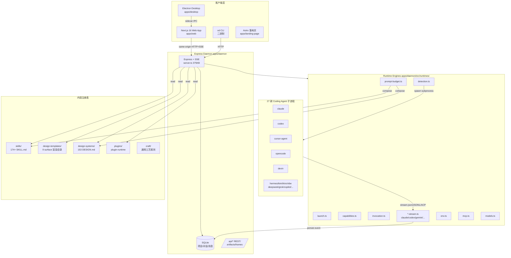
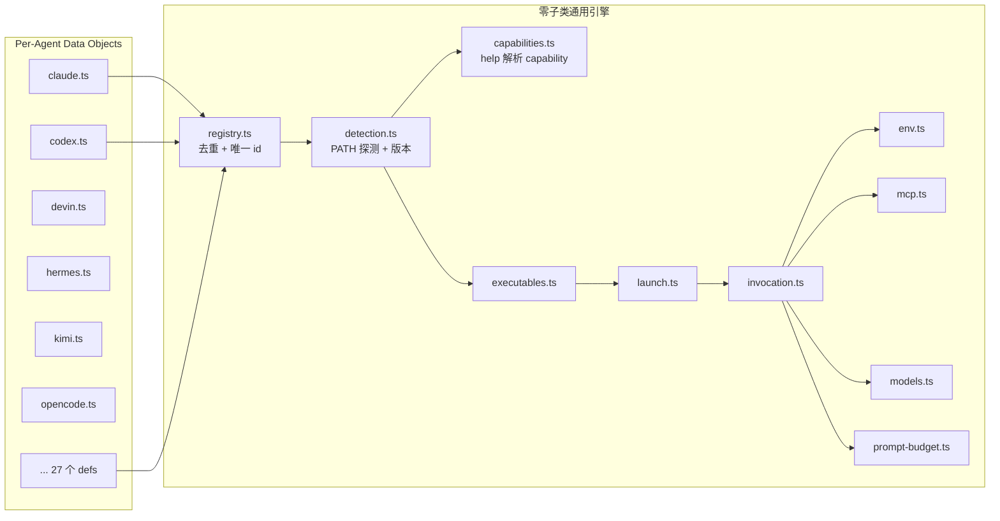
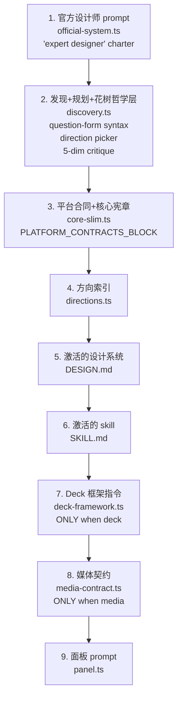
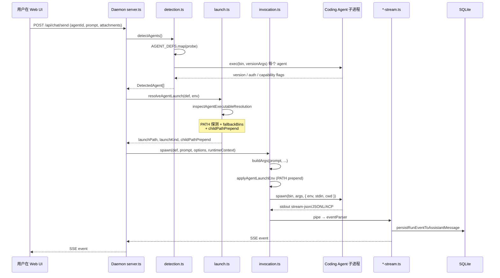
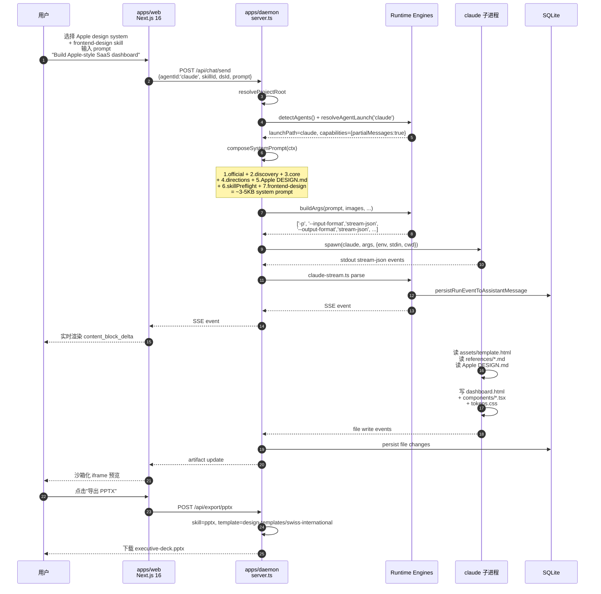

# 【Open Design】核心架构与设计原理深度解析

## 一、引子：当 Anthropic 关闭了 Claude Design 的水龙头

2025 年 4 月，Anthropic 推出一项重磅功能：Claude Design —— 一个用对话驱动生成完整设计稿、原型、Deck 的"agent-native 设计工作台"。它内建一个**发现 → 锁定方向 → 流式生成 → 批评 → 交付**的 5 阶段循环（"agent-native loop"），把设计任务从"AI 帮你提 prompt"升级成了"AI 直接是设计师"。

但 Claude Design 是闭源的、且与 Claude 单一模型深度耦合。

2026 年 4 月，[nexu-io/open-design](https://github.com/nexu-io/open-design)（Apache-2.0，⭐79.7k，1.6GB+ 仓库，13,922 节点）把同一条 loop 搬到了本地、开源、跨 27 款 Coding Agent 的形态。

**它的关键命题不是"再造一个 agent 框架"**，而是：

> **「agent loop 已经被 Claude Code、Codex、Cursor Agent、OpenCode 解决了，我们不再造轮子 —— 我们提供 Studio + Skills + Design Systems + Plugins 的设计侧基础设施，让用户已有的 CLI 变成设计引擎。」**

这就是 Open Design 在 2026 H2 真正的甜区 ——「**Agent × 垂直场景融合**」赛道的第二波。第一波是 [OpenMontage](https://github.com/calesthio/OpenMontage) 把 Coding Agent 当制片人拍视频，第二波是 Open Design 把 Coding Agent 当设计师做品牌资产。

本文从源码层面拆解这套 79.7k ⭐ 的项目，回答：

1. **为什么 27 款 Coding Agent 都能成为同一个设计引擎？**（RuntimeAgentDef + 通用引擎）
2. **174+ Skills + 153 Design Systems 怎么工作？**（SKILL.md 协议 + 5 种 surface）
3. **5 种创建面、6 个 UI Tab、9 种 surface 之间的映射规则是什么？**（modes.ts 契约）
4. **怎么从一段对话 → 实际写出 1920×1080 的 MP4 视频 / 真实 PPTX / 沙箱化的原型？**
5. **与同类项目（Figma / Canva / Claude Design / Multica / Vercel v0）的本质差异在哪？**

## 二、项目定位与核心价值

### 2.1 一句话定义

**Open Design 是一个「**让用户已有的 27 款 Coding Agent 变成设计引擎**」的本地优先设计工作台，**通过 `SKILL.md` 协议 + `DESIGN.md` 品牌契约 + Runtime Adapter 抽象层，把 Claude Code、Codex、Cursor、OpenCode、Devin、Qwen 等 CLI 串成一套**品牌一致 + 多模态 + 可导出的设计 Pipeline**。

### 2.2 仓库统计

| 字段 | 值 |
|---|---|
| 仓库 | [nexu-io/open-design](https://github.com/nexu-io/open-design) |
| ⭐ Stars | 79,724 |
| Forks | 5,234 |
| 主语言 | TypeScript（80.2%） |
| License | **Apache-2.0** |
| 仓库大小 | 1,648.7 MB（13,922 节点） |
| 最近推送 | 2026-07-19（活跃） |
| 最新版本 | v0.13.0（"Stay in Flow"） |
| 默认分支 | main |
| NPM 包 | `@agent-tars/cli`、`@open-design/contracts` 等 16 个 workspace |

### 2.3 能力矩阵

| 维度 | 能力 |
|---|---|
| **可生成形态** | 9 种 surface（原型 / Deck / 实时工件 / 模板 / 图片 / 视频 / 音频 / 设计系统 / 杂项） |
| **支持的设计系统** | 153 套（Apple / Airbnb / BMW / Bugatti / Stripe / Cohere / ClickHouse / WeChat / 小红书 / 微信 ...） |
| **Skills 库** | 174+ 个（Anthropic 官方 / Google Labs / 自研） |
| **Coding Agent 适配** | 27 款（Claude / Codex / Cursor / OpenCode / Devin / Qwen / Hermes / Kimi / Kiro / Vibe / DeepSeek / Grok / Copilot / Amp / Pi / Aider / Antigravity / Codebuddy / Reasonix / MiMo / AtomCode / AMR / Kilo / Trae CLI / BYOK-OpenCode） |
| **导出格式** | HTML / PDF / PPTX / MP4 / HyperFrames / JSON / Markdown |
| **部署形态** | Web（Next.js 16 + React 18）/ Electron Desktop（macOS + Windows）/ Daemon / Headless 容器 / Astro 落地页 |
| **接入方式** | Web UI / `od` CLI / MCP server / `od mcp install <agent>` 一键安装到 25 款外部 agent |
| **传输** | 同源 HTTP + SSE 事件流、SQLite 持久化、沙箱化 iframe 预览 |

## 三、整体架构

Open Design 的运行时拓扑按 **「客户端 → 路由层 → Daemon 业务层 → Runtime 引擎 → Agent 子进程 → 内容注册表」** 的 6 层划分，文档 [`docs/architecture.md`](https://github.com/nexu-io/open-design/blob/main/docs/architecture.md) 给出权威的"代码后端拓扑"。



**关键洞察**：

1. **没有"AI 业务逻辑重复实现"** —— Web UI 和 `od` CLI 调用的是**同一套** Daemon HTTP API（"CLI is not a second business-logic implementation; it is the machine-readable surface"）。
2. **Runtime Engines 是真正复用 Claude Code/Codex 内部循环的地方** —— Daemon 把整个 prompt + skill + design system 拼好，spawn 出去，让 agent 子进程自己跑。
3. **所有内容（skills/templates/design-systems/plugins）都是文件系统驱动** —— 没有中心数据库存元数据，每个 skill 目录里 `SKILL.md` 自描述，request-time 扫描 + 缓存。

### 3.1 部署形态

`pnpm tools-dev` 是唯一的仓库生命周期入口，它管理 daemon、web、Electron 三个 sidecar。生产环境 Docker Compose 单服务把 daemon + static Next.js 打包到一起：

```text
# apps/packaged 启动打包好的 daemon + web sidecar
# Electron entry 同时启动 desktop shell
# Headless entry 省略 desktop

# 容器化（生产）
docker compose up
  → 单进程同时 serve /api/* 和 apps/web/out
  → 容器默认端口 7456
```

## 四、五大创建面 × 9 种 Surface：分层映射

[`docs/modes.md`](https://github.com/nexu-io/open-design/blob/main/docs/modes.md) 给出了 Open Design 唯一的"双分类"设计：

- **UI Tab（6 个）**：用户视角 —— Prototype / Live Artifact / Deck / Template / Media / Other
- **Skill Mode（7 个）**：注册表视角 —— `prototype | deck | template | design-system | image | video | audio`

两者**有意不一一对应**。UI tab 描述"用户想干啥"，skill mode 描述"daemon 怎么索引和路由 instruction bundle"。

### 4.1 映射规则

| UI Tab | Project metadata | Skill routing | 主要区别 |
|---|---|---|---|
| **Prototype** | `kind: prototype` | 默认 `prototype` skill，可被设计模板覆盖 | 响应式网页/移动/平板/桌面应用界面 |
| **Live Artifact** | `kind: prototype`, `intent: live-artifact` | 强制 `live-artifact` skill | 高保真、数据承载或 connector 接入的工件 |
| **Deck** | `kind: deck` | 默认 `deck` skill，可被设计模板覆盖 | 幻灯片导航 + 演示导出 |
| **Template** | `kind: template` | 用户保存的项目模板 | 来自 Share 保存的模板而非内置 catalog |
| **Media** | `kind: image` / `video` / `audio` | 对应 media-mode skill | 模型/长宽比/时长/语音控制 |
| **Other** | `kind: other` | 无 required skill | 自由形态项目 |

### 4.2 共同基类：Project metadata

```typescript
// 来自 apps/daemon/src/projects/types.ts
type ProjectMetadata =
  | { kind: 'prototype'; intent?: 'live-artifact'; ... }
  | { kind: 'deck'; speakerNotes?: 'none' | 'per-slide' | 'single'; ... }
  | { kind: 'template'; templateSourceId: string; ... }
  | { kind: 'image'; aspectRatio?: AspectRatio; ... }
  | { kind: 'video'; aspectRatio?: AspectRatio; durationSec?: number; ... }
  | { kind: 'audio'; surface: 'speech' | 'sound'; voice?: string; ... }
  | { kind: 'other'; ... };

// 关键：所有 project 都共享
type ProjectBase = {
  skillId: string | null;     // 绑定一个 SKILL.md
  templateId: string | null;  // 绑定一个 design-template
  designSystemId: string | null;  // 绑定一个 DESIGN.md
  craftRequires: string[];    // 工艺规则（typography / color / anti-ai-slop ...）
};
```

**这种「正交分类 + 多对一映射」是 Open Design 的核心设计哲学**：UI Tab 给用户"以任务为中心"的入口，Skill Mode 给注册表"以产物为中心"的索引，Project metadata 在两者之间桥接。同一个 skill 可以被多个 tab 调用，project 在不同时刻可以换 skill / template / design system。

## 五、核心引擎一：Runtime Adapter 数据规约

[`apps/daemon/src/runtimes/types.ts`](https://github.com/nexu-io/open-design/blob/main/apps/daemon/src/runtimes/types.ts) 定义了整个 Open Design 最重要的数据规约 —— `RuntimeAgentDef`。

### 5.1 为什么是「数据对象」而不是「class」

[`docs/agent-adapters.md`](https://github.com/nexu-io/open-design/blob/main/docs/agent-adapters.md) 的开篇就给出了一个鲜明的反 OO 论断：

> "An adapter is **not** a class that implements the agent loop. It is a **plain data object** — one `RuntimeAgentDef` object literal per CLI — that declares *how to talk to* that CLI: which binary to probe, how to build its argv, how it streams, what it can do. A **generic engine** reads those fields and does the detecting, launching, invoking, and stream-parsing for every agent uniformly. There is no per-agent subclass and no `run()` / `cancel()` method to implement."



**加一个新的 Coding Agent 只需要 1 个文件**：

```typescript
// 来自 docs/agent-adapters.md
// Adding a CLI is a one-file change.
// Drop a new runtimes/defs/<cli>.ts exporting one RuntimeAgentDef,
// add it to the BASE_AGENT_DEFS array in registry.ts,
// and the engine detects, launches, invokes, and (for an existing
// streamFormat) streams it — no engine edits, no new class.
```

### 5.2 RuntimeAgentDef 字段速览

```typescript
// 来自 apps/daemon/src/runtimes/types.ts（节选）
type RuntimeAgentDef = {
  id: string;                 // 唯一 key, 如 "claude" | "codex"
  name: string;               // 显示名 "Claude Code" / "Codex CLI"
  bin: string;                // PATH 探测的可执行文件名
  fallbackBins?: string[];    // 备用 bin（如 "openclaude" 兼容 fork）
  versionArgs: string[];      // 版本探测 argv
  fallbackModels: RuntimeModelOption[];  // 静态 fallback 模型
  buildArgs: (
    prompt: string,
    imagePaths: string[],
    extraAllowedDirs?: string[],
    options?: RuntimeBuildOptions,
    runtimeContext?: RuntimeContext,
  ) => string[];
  streamFormat: string;       // "stream-json" | "jsonl" | "acp-json-rpc" | ...
  eventParser?: string;       // 对应 *-stream.ts 解析器
  env?: Record<string, string>;
  listModels?: RuntimeListModels;
  fetchModels?: (resolvedBin, env) => Promise<RuntimeModelOption[] | null>;
  reasoningOptions?: RuntimeReasoningOption[];
  supportsImagePaths?: boolean;
  maxPromptArgBytes?: number;
  mcpDiscovery?: string;
  externalMcpInjection?:
    | 'claude-mcp-json'
    | 'acp-merge'
    | 'opencode-env-content'
    | 'mimo-env-content';
  installUrl?: string;
  docsUrl?: string;
  resumesSessionViaCli?: boolean;
  capturesSessionIdFromStream?: boolean;
  resumesSessionViaAcpLoad?: boolean;
  // ... 30+ 字段
};
```

**字段密度反映复杂度**：Open Design 不是简单"接个 OpenAI 兼容 API"，它要为**每款 CLI 的 arg 协议、stdin 协议、session resume 协议、MCP 注入协议**留出专用字段。这种"协议适配器数据规约"是 2026 年 Coding Agent Harness 的**新基础设施范式**。

### 5.3 真实例子：Claude def

```typescript
// 来自 apps/daemon/src/runtimes/defs/claude.ts
export const claudeAgentDef = {
  id: 'claude',
  name: 'Claude Code',
  bin: 'claude',
  fallbackBins: ['openclaude'],  // 兼容 fork
  versionArgs: ['--version'],
  authProbe: { args: ['auth', 'status'], timeoutMs: 5000 },
  helpArgs: ['-p', '--help'],
  capabilityFlags: {
    '--include-partial-messages': 'partialMessages',
    '--add-dir': 'addDir',
  },
  fallbackModels: [
    DEFAULT_MODEL_OPTION,
    { id: 'sonnet', label: 'Sonnet (alias)' },
    { id: 'claude-opus-4-5', label: 'claude-opus-4-5' },
    // ...
  ],
  fetchModels: async (_resolvedBin, env) => loadMmdRouteModels(env, CLAUDE_FALLBACK_MODELS),
  buildArgs: (_prompt, _imagePaths, extraAllowedDirs = [], options = {}, runtimeContext = {}) => {
    const caps = agentCapabilities.get('claude') || {};
    // 关键：stdin 投递 + stream-json 双向通信
    const args = [
      '-p',
      '--input-format', 'stream-json',
      '--output-format', 'stream-json',
      '--verbose',
    ];
    if (caps.partialMessages) {
      args.push('--include-partial-messages');
    }
    // ... 更多条件化 args
    return args;
  },
  streamFormat: 'stream-json',
  promptViaStdin: true,  // 关键：避免 Linux E2BIG + Windows ENAMETOOLONG
  externalMcpInjection: 'claude-mcp-json',  // 写 .mcp.json 到 cwd
  resumesSessionViaCli: true,  // claude --session-id 模式
  // ...
};
```

**两个值得注意的工程细节**：

1. **`fallbackBins: ['openclaude']`** —— 自动兼容 [openclaude](https://github.com/Gitlawb/openclaude) 这种 drop-in fork，单二进制用户不用写 wrapper 脚本。
2. **`promptViaStdin: true`** —— 解决 Linux `spawn E2BIG`（`MAX_ARG_STRLEN` 单 argv 上限 128KB）和 Windows `spawn ENAMETOOLONG`（`CreateProcess` 命令行 32KB）的死结。stdin 没有长度上限。

### 5.4 真实例子：Codex def

```typescript
// 来自 apps/daemon/src/runtimes/defs/codex.ts
export const codexAgentDef = {
  id: 'codex',
  name: 'Codex CLI',
  bin: 'codex',
  versionArgs: ['--version'],
  listModels: {
    args: ['debug', 'models'],
    parse: parseCodexDebugModels,  // 解析 JSON，提取 .models
    timeoutMs: 5000,
  },
  // Codex exposes its installed model catalog through `debug models`
  // on recent CLIs. Older builds fall back to static hints.
  fallbackModels: [
    DEFAULT_MODEL_OPTION,
    { id: 'gpt-5.5', label: 'gpt-5.5' },
    { id: 'gpt-5.4', label: 'gpt-5.4' },
    // ...
  ],
  // Codex native binary resolution (Rust helper)
  // 来自 launch.ts
  // 如果 OD_CODEX_SANDBOX=danger-full-access 或 WSL 或 win32，强制原生
  // ...
};
```

`codexNeedsDangerFullAccessSandbox()` 体现了 Open Design 对**真实世界部署陷阱**的敬畏 —— WSL 跑 Codex 会被报 read-only workspace-write sandbox（issue #2834），不是简单"加个参数"能修。

## 六、核心引擎二：Prompt Composer 拼装算法

[`apps/daemon/src/prompts/system.ts`](https://github.com/nexu-io/open-design/blob/main/apps/daemon/src/prompts/system.ts) 是 Open Design 的"内容工程师" —— 它把 skill + design system + craft + 项目 metadata 拼成一段**可被任意 27 款 Coding Agent 消费的 system prompt**。

### 6.1 拼装顺序



**逐层覆盖语义**（来自 `system.ts` 注释）：

```text
// 来自 apps/daemon/src/prompts/system.ts
// Prepended first in every composed prompt so it wins precedence over
// all later sections, including skill bodies and user/project instructions.
```

也就是说**前层覆盖后层**：
- 1. 官方 designer 哲学 = 全局身份
- 6. 激活的 skill = 当次工作流
- 7. Deck 框架 = 强制覆盖（"load-bearing nav/counter/scroll JS contract"），因为 PDF 拼接依赖它
- 8. 媒体契约 = 仅当 Media 模式触发

### 6.2 Skill seed 预检规则

```typescript
// 来自 system.ts
// 3. The active skill's SKILL.md (if any) — workflow specific to the
//    kind of artifact being built. When the skill ships a seed
//    (`assets/template.html`) and references (`references/layouts.md`,
//    `references/checklist.md`), we inject a hard pre-flight rule above
//    the skill body so the agent reads them BEFORE writing any code.
```

**关键洞察**：当 skill 自带 `assets/template.html`（种子）和 `references/*.md`（参考），Open Design 会**强制**在 SKILL.md body 之前注入一条 "pre-flight rule"，要求 agent **先读这些文件再写代码**。这是 Open Design 比 "Anthropic skills 直接喂给 Claude" 聪明的地方 —— 它知道 agent 的"先想再做"惯性容易被 skill body 抢走，所以用 prompt engineering 强制流程。

### 6.3 实际拼装结果示例

```typescript
// 来自 apps/daemon/src/prompts/system.ts（注释中提到的拼装策略）
function composeSystemPrompt(ctx: PromptContext): string {
  // 1. 全局身份
  const charter = renderSlimCoreCharter();
  const official = renderOfficialDesignerPrompt();
  // 2. 哲学层
  const discovery = renderDiscoveryAndPhilosophy(ctx);
  // 3. 方向索引
  const directionIndex = renderDirectionIndexBlock(ctx);
  // 4. DESIGN.md 注入
  const designSystem = ctx.designSystemId
    ? loadDesignSystemMd(ctx.designSystemId)
    : '';
  // 5. SKILL.md 注入 + 预检规则
  const skill = ctx.skillId ? loadSkillMd(ctx.skillId) : '';
  const skillPreflight = ctx.skillHasSeed
    ? '**Pre-flight**: read assets/template.html + references/*.md BEFORE writing code.'
    : '';
  // 6. Deck 框架（仅 deck）
  const deckFramework = (ctx.projectKind === 'deck') ? DECK_FRAMEWORK_DIRECTIVE : '';
  // 7. 媒体契约（仅 media）
  const mediaContract = ctx.surface ? renderMediaGenerationContract(ctx) : '';

  return [
    charter, official, discovery, directionIndex,
    designSystem, skillPreflight, skill, deckFramework, mediaContract,
  ].filter(Boolean).join('\n\n');
}
```

## 七、核心引擎三：通用 Spawn 引擎

[`apps/daemon/src/runtimes/launch.ts`](https://github.com/nexu-io/open-design/blob/main/apps/daemon/src/runtimes/launch.ts) + [`detection.ts`](https://github.com/nexu-io/open-design/blob/main/apps/daemon/src/runtimes/detection.ts) + [`invocation.ts`](https://github.com/nexu-io/open-design/blob/main/apps/daemon/src/runtimes/invocation.ts) 三件套是「零子类通用引擎」的实现。

### 7.1 检测 → 启动 → 执行



### 7.2 路径注入：GUI launch 的隐藏陷阱

`launch.ts` 注释中有一段非常真实的工程故事：

```typescript
// 来自 apps/daemon/src/runtimes/launch.ts
// `appendPathDirs` adds the user toolchain bin dirs (Homebrew, ~/.bun/bin,
// version-manager dirs, …) to the END of PATH so a resolved binary's shebang
// interpreter is findable at spawn time even when the daemon's own PATH is
// minimal (GUI launch). Without this, an agent like Pi — a `#!/usr/bin/env
// bun` script — resolves but the version probe / run spawn fails with exit
// 127 ("env: bun: No such file or directory"), so detection wrongly marks it
// unavailable. Defaults to the real toolchain dirs; tests pass [] for
// determinism.
```

**真实坑**：在 macOS 上从 Finder 双击启动 Open Design Desktop.app，daemon 启动时 `PATH` 是 `/usr/bin:/bin:/usr/sbin:/sbin`（系统最小 PATH），**没有** Homebrew/`.bun/bin`/版本管理器目录。结果 spawn `pi`（一个 `#!/usr/bin/env bun` 脚本）会 exit 127 但 daemon 把它当"未找到"误报。

修法：`appendPathDirs` 在 spawn 时把 `userToolchainBinDirs()` 拼到 PATH 尾部，让 shebang 解释器能找到。

**这是 2026 H2 Coding Agent Harness 的"工程现实"**：跨平台 + GUI 启动 + 多 shebang 解释器 = 路径解析必须**显式 prepend**，不能依赖 shell 默认。

### 7.3 Stream Format × EventParser 路由

`server.ts` 根据 def 的 `streamFormat` 字段路由到对应的解析器：

```typescript
// 来自 server.ts
const streamParser = STREAM_PARSERS[def.streamFormat];
if (!streamParser) {
  throw new Error(`no parser for streamFormat ${def.streamFormat}`);
}
```

支持的 `streamFormat`：
- `stream-json` —— Claude/Codex/Antigravity 用，Anthropic 风格的 `{"type":"content_block_delta",...}`
- `jsonl` —— Cursor Agent/Grok 用，行分隔 JSON
- `acp-json-rpc` —— AMR/Vela 用，Agent Client Protocol
- `text` —— 兜底，纯文本 stdout

**新加 wire format 的成本是 1 个 `*-stream.ts` 文件**（如 `amr-stream.ts` 解析 ACP）+ 1 个 `streamFormat` 值。这种"按需增量扩展"是 Open Design 处理 27 款 agent 的关键。

## 八、Skill Protocol：SKILL.md 的「Claude Code + OD 扩展」

[`docs/skills-protocol.md`](https://github.com/nexu-io/open-design/blob/main/docs/skills-protocol.md) 定义了 Open Design 唯一的内容契约。

### 8.1 基础格式：与 Claude Code 兼容

```yaml
# skills/<name>/SKILL.md
---
name: frontend-design
description: |
  Create distinctive, production-grade frontend interfaces with strong visual
  direction, polished typography, considered layout, and working HTML/CSS/JS
  or framework code. Use for websites, landing pages, dashboards, React
  components, application screens, and UI beautification.
triggers:
  - "frontend design"
  - "ui design"
  - "production ui"
  - "landing page"
  - "dashboard design"
license: Complete terms in LICENSE.txt
---

# frontend-design

> Adapted from Anthropic's official `frontend-design` skill for Open Design.

## Workflow

1. Understand the brief before choosing the look.
2. Commit to one specific aesthetic direction.
3. Design the real interface, not a placeholder poster.
4. Build production-grade frontend code.
5. Refine visual craft.
```

**关键承诺**（来自 skills-protocol.md 顶部）：

> "A bundle that contains `SKILL.md` remains readable by agents that support the Agent Skills format. Installation and catalogue placement are separate concerns."

也就是说，**任何 Claude Code 兼容的 skill bundle 都可以直接拷贝进 `skills/`，Open Design 0 修改就能用**。

### 8.2 OD 扩展字段

```yaml
---
name: frontend-design
description: ...  # 基础字段（与 Claude Code 兼容）
triggers: ...      # 基础字段
license: ...       # 基础字段

# --- OD 扩展字段（全部可选）---
od:
  mode: prototype                     # prototype | deck | template | design-system | image | video | audio
  surface: web                        # web | image | video | audio
  scenario: marketing                 # gallery/filter 提示
  category: web-artifacts             # 自由小写
  craft:
    requires: [typography, color, anti-ai-slop]  # 引用 craft/ 下的规则
  design_system:
    requires: true                    # 必须绑定 DESIGN.md
    sections: [color, typography, layout, components]  # 必读 sections
  example_prompt: "Design and build a production-quality SaaS analytics dashboard..."
  upstream: "https://github.com/anthropics/skills/tree/main/skills/frontend-design"
---
```

**字段语义对照表**（来自 skills-protocol.md）：

| 字段 | 作用 | 是否必需 |
|---|---|---|
| `od.mode` | 注册表 mode（决定 UI Tab routing） | 否（缺省 `prototype`） |
| `od.surface` | 9 surface 之一（决定 export 格式） | 否（缺省从 mode 推） |
| `od.craft.requires` | 强制注入 `craft/*.md` 通用工艺规则 | 否 |
| `od.design_system.requires` | 强制绑定 design-system | 否 |
| `od.design_system.sections` | 强制读取的 DESIGN.md sections | 否 |
| `od.example_prompt` | UI 中显示的示例 prompt | 否 |
| `od.upstream` | 上游 URL，便于审计 | 否 |

### 8.3 174+ Skills 的真实结构

```text
skills/
├── design-md/                  # 自研：DESIGN.md 管理
├── frontend-design/            # Anthropic 官方
├── frontend-dev/               # 进阶版本
├── pptx/                       # Anthropic 官方
├── docx/                       # 文档
├── pdf/                        # PDF
├── algorithmic-art/            # 编程艺术
├── brand-extract/              # 品牌提取
├── canvas-design/              # 画布设计
├── data-report/                # 数据报告
├── design-consultation/        # 设计咨询
├── imagegen-frontend-web/      # 图片生成
├── imagegen-frontend-mobile/   # 移动图片
├── shadcn-ui/                  # shadcn/ui 组件
├── gsap-core/                  # GSAP 动画
├── threejs/                    # Three.js
├── remotion/                   # Remotion 视频
├── sora/                       # Sora 视频
├── venice-video/               # Venice 视频
├── venice-audio-music/         # Venice 音乐
├── ... (174+ 个)
```

每个 skill 目录结构：

```text
skills/<skill-name>/
├── SKILL.md              # manifest + 工作流指令（必有）
├── assets/               # 模板、图片、boilerplate
│   └── template.html     # 种子文件（可选）
└── references/           # 知识文件，agent 在 planning 时读
    ├── components.md
    ├── layouts.md
    └── checklist.md
```

**这是一个「Claude Code Skills 生态复用」的设计** —— Anthropic 投了一个 git repo（`anthropics/skills`），Open Design 直接 import + 加 OD 扩展字段，**所有 Anthropic 用户能用的 skill 都能进 OD 不用改**。

## 九、DESIGN.md 品牌契约：153 套设计系统

[`design-systems/`](https://github.com/nexu-io/open-design/tree/main/design-systems) 目录下有 153 个品牌设计系统，每个都是一份 `DESIGN.md` 文档。

### 9.1 真实例子：Apple

```markdown
# 来自 design-systems/apple/DESIGN.md

# Design System Inspired by Apple

> Category: Media & Consumer
> Consumer electronics. Premium white space, SF Pro, cinematic imagery.

## 1. Visual Theme & Atmosphere

Apple's web language is a precision editorial system that alternates between
gallery-like calm and retail-density information blocks. The visual tone stays
restrained: broad neutral canvases, quiet chrome, and product imagery given
almost all of the expressive weight...

**Key Characteristics:**
- Binary section rhythm: deep black scenes (`#000000`) alternating with pale
  neutral fields (`#f5f5f7`)
- Single blue accent family for action and link semantics (`#0071e3`, `#0066cc`)
- Dual operating modes in one system: cinematic showcase modules and dense
  commerce configurators
- Heavy reliance on imagery and material finishes
- Pill and capsule geometry as signature action language (`18px` to `980px`)

## 2. Color Palette & Roles

### Primary
- **Absolute Black** (`#000000`): Immersive hero canvases
- **Editorial White** (`#f5f5f7`): Pale neutral fields
- **Link Blue** (`#0071e3`): Action and link semantics
```

### 9.2 为什么是 Markdown 而不是 JSON/YAML

DESIGN.md 选 Markdown 而非结构化格式的**两个好处**：

1. **可直接被 LLM 在 prompt 里读取** —— 不需要 "JSON to prose" 转换，agent 看到的就是人话
2. **可被版本管理 + GitHub Diff 可视化** —— 设计师改 token 走 PR review

代价：必须靠 schema 约束（`design-systems/_schema/` 目录）和 LLM 自身的理解来保证结构一致性。

### 9.3 完整 153 套列表（部分）

| 类别 | 例子 |
|---|---|
| **科技/平台** | apple / google / microsoft / amazon / meta / netflix / stripe / shopify / cloudflare / vercel / datadog / figma / linear / notion / slack / github / gitlab |
| **AI 公司** | openai / anthropic / claude / cohere / x-ai / mistral / perplexity / langchain / replit |
| **设计风格** | bento / brutalism / claymorphism / minimalist / glassmorphism / skeuomorphism / neobrutalism / editorial / warm-editorial |
| **品牌/产品** | airbnb / airtable / bmw / bmw-m / bugatti / porsche / spotify / nike / adidas / wechat / wechat-yh / xiaohongshu / weibo / bilibili |
| **加密/Web3** | binance / coinbase / metamask / uniswap / aave |
| **数据/企业** | clickhouse / snowflake / databricks / dbt / airbyte / fivetran / census / hightouch |
| **开发工具** | warp / webex / zapier / figma / framer / webflow / railway / supabase |

**这种"153 套品牌契约"是把设计 agent 商业化的关键资产** —— 用户激活 Apple 风格，agent 输出的原型自动遵循 SF Pro 字体、#0071e3 蓝色调、18px 胶囊按钮。

## 十、External MCP 注入：四种策略

[RuntimeAgentDef.externalMcpInjection](https://github.com/nexu-io/open-design/blob/main/apps/daemon/src/runtimes/types.ts) 是 Open Design 设计的「**MCP 配置多协议适配层**」。

### 10.1 四种注入策略

| 策略 | 字段值 | 注入方式 | 适用 agent |
|---|---|---|---|
| **Claude .mcp.json** | `'claude-mcp-json'` | 把外部 MCP 写 `.mcp.json` 到 managed cwd | Claude Code（auto-load） |
| **ACP merge** | `'acp-merge'` | 合并到 `mcpServers` 数组 | Hermes / Kimi / Kilo / Kiro / Vibe / Devin |
| **OpenCode env** | `'opencode-env-content'` | 序列化为 OpenCode schema 走 `OPENCODE_CONFIG_CONTENT` env | OpenCode |
| **MiMo env** | `'mimo-env-content'` | 同 OpenCode 但走 `MIMOCODE_CONFIG_CONTENT` env | MiMo |

### 10.2 不支持的 agent 显式提示

```typescript
// 来自 types.ts 注释
// Leave undefined for adapters that have no native MCP transport
// wired yet (codex, cursor-agent, copilot, qoder, pi). The
// settings UI reads this field to surface an explicit
// "external MCP is not forwarded to <agent>; configure servers in
// <agent>'s own config file instead" hint, replacing the previous
// silent-failure UX from issue #2142.
```

**这是非常成熟的产品设计**：不是"静默失败"用户看到 agent 没拿到 MCP tool 而不知道为什么，而是 **Settings UI 显式提示"该 agent 当前不支持外部 MCP 注入，请去 X 配置文件自己配"**。

## 十一、Session 恢复：三种模式

Open Design 27 款 agent 中，部分支持"多轮对话自动恢复"，分成三种协议：

### 11.1 Specify-style

```typescript
// 来自 types.ts
// resumesSessionViaCli = true 时，daemon mint newSessionId，CLI 用这个 id
// "specify-style": the daemon mints `RuntimeContext.newSessionId` and
// the CLI is told to use it (claude `--session-id`), so the id the
// daemon stores is the id it generated.
```

适用：Claude Code（`--session-id`）。

### 11.2 Capture-style

```typescript
// capturesSessionIdFromStream = true
// "capture-style": the CLI generates its OWN session id and reports it
// on the stream (codex `thread.started.thread_id`), so the daemon must
// capture that id from the parsed stream and persist THAT as the
// resume handle — `newSessionId` is not passed to the CLI.
```

适用：Codex（`thread.started.thread_id`）。

### 11.3 ACP load

```typescript
// resumesSessionViaAcpLoad = true
// ACP-runtime analogue of capture-style resume: the agent talks
// `acp-json-rpc` (today only AMR/vela) and supports resuming via
// `session/load`. The daemon captures the durable upstream session
// handle from the ACP session (`getDurableSessionId()`).
```

适用：AMR/Vela（ACP 协议）。

### 11.4 关键工程细节：避免重复上下文

```typescript
// 来自 types.ts 的 RuntimeContext.hasPriorAssistantTurn 注释
// Without this opt-out, agy with `-c` receives the same prior turn
// twice — once from its own conversation memory, once embedded in the
// composed user request — and the embedded copy includes the literal
// `<question-form>` markup it emitted on turn 1. The model then
// pattern-matches that and re-emits the form on turn 2, looking like
// the discovery loop never breaks.
```

**真实问题**：agravity（`agy -c` 模式）自己维护 multi-turn memory，如果 daemon 还在 user request 里嵌入"之前对话 transcript"，**agent 会看到两次同样内容**，触发无限循环问表单。

修法：`resumesSessionViaCli = true` 的 agent 跳过 daemon 端 transcript 注入，只发最新 user message。

## 十二、端到端数据流：一次"用 Apple 风格生成 SaaS Dashboard"请求



**每一步的「解耦 + 复用」设计**：

1. **用户视角**（Web UI）：不感知 27 款 agent / spawn / stream
2. **Daemon 视角**：不感知"设计美学"，只负责 session + prompt + 路由
3. **Skill 视角**：可被任意 agent 调用，与 CLI 实现无关
4. **DESIGN.md 视角**：跨 skill 共享，多 surface 通用
5. **Export 视角**：HTML / PDF / PPTX / MP4 各自有 skill，但接受同一套 system prompt

## 十三、与同类项目对比

### 13.1 六维对比表

| 维度 | Open Design | Figma + AI | Claude Design | Multica | v0 (Vercel) | Canva Magic Design |
|---|---|---|---|---|---|---|
| **定位** | 本地设计工作台，跨 27 款 agent | 云端协作 + AI 插件 | 闭源 Claude 内嵌功能 | 多 agent 路由 | 网页组件生成 | 模板化设计 |
| **开源** | Apache-2.0 | 闭源 | 闭源 | Apache-2.0 | 闭源 | 闭源 |
| **⭐** | 79.7k | N/A | N/A | 2.1k | N/A | N/A |
| **Skills / 模板** | 174+ skills | 大量 community plugin | 闭源 | 0 | 0 | 大量 |
| **设计系统** | 153 套（DESIGN.md） | Community file | 闭源 | 0 | shadcn / Tailwind | 品牌模板 |
| **跨 Agent 适配** | 27 款 Coding Agent | 1 (Figma AI) | 1 (Claude) | 任意 CLI | 0 | 0 |
| **导出** | HTML / PDF / PPTX / MP4 | Figma file → 导出 | 闭源导出 | 0 | React 代码 | PNG / PDF |
| **品牌一致性** | DESIGN.md 自动 | Manual design tokens | Manual | 0 | 0 | Brand Kit |
| **本地优先** | ✅ 完全本地 | ❌ | ❌ | ✅ | ❌ | ❌ |
| **Anthropic Skills 兼容** | ✅ 直接复用 | ❌ | ✅ 闭源 | ❌ | ❌ | ❌ |

### 13.2 设计哲学差异

**Figma + AI** 是 "**GUI-first**" —— 用户在画布上操作，AI 是辅助插件。Figma 的核心资产是 component instance / variant / auto-layout，AI 帮生成但 **协作模型是人类的画布**。

**Claude Design** 是 "**Prompt-first**" —— 用户用对话驱动设计，AI 是主要操作者。但**闭源 + 单模型 + 无生态复用**。

**Open Design** 是 "**Agent-Native + 生态复用**" —— 用户用对话驱动，但**底层是已有的 Coding Agent**，不是新造的。Anthropic Skills、Google Labs Skills、用户自建 Skills **同一种格式复用**。153 套 DESIGN.md 是 Open Design 的**真正护城河**。

**Multica** 启发了 Open Design 的 PATH-scan detection + daemon 架构（`docs/agent-adapters.md` 顶部明确引用），但 Multica 只做"agent 调度"不做"设计内容"。

**v0 / Canva Magic Design** 是 "**单点工具**" —— 一个 prompt 生成一个组件 / 一张图，没有跨任务的 brand consistency 机制。

### 13.3 关键差异：DESIGN.md vs Figma Variables

**Figma Variables** 是结构化 token（`color.primary = #0071e3`），需要 Figma 文件 + 实时渲染。
**DESIGN.md** 是 narrative token —— "binary section rhythm: deep black scenes alternating with pale neutral fields"。LLM 直接读取人话。

代价：Figma Variables 精确到 pixel，DESIGN.md 依赖 LLM 解释能力。
收益：DESIGN.md 不需要 Figma 文件，**任意 agent 都能消费**。

## 十四、优缺点分析

### 14.1 双侧对比

| 维度 | 优势 | 代价 |
|---|---|---|
| **架构简洁性** | 单一 data spec + 零子类通用引擎，加新 agent 1 文件；Prompts 4 层堆叠，逻辑清晰 | `server.ts` 375KB 单文件 11k+ 行（vs Orca 的 24k 行可控但仍巨大） |
| **扩展性** | 27 款 agent + 153 套 design system + 174 skill 全部声明式 | 每加一种 wire format 仍需新 `*-stream.ts`；新加 project kind 需要在 modes.ts 加映射 |
| **易用性** | Web UI + `od` CLI + MCP server + `od mcp install` 一行接入 25 款 agent | 153 套 design system + 174 skill 给新用户造成「选择困难」 |
| **性能** | Spawn 复用 Linux 进程模型 + SQLite 持久化 + SSE 流式；stdio 投递避免 argv 长度限制 | 每次 chat 启动一个 Claude/Codex 子进程，warm start 2-5s；不适合超低延迟场景 |
| **复杂度** | Agent 适配层把 27 款 CLI 的差异收敛在 30+ 字段；Prompt Composer 把 5 层契约对齐 | 新开发者要理解 6 层架构 + 4 个 OD 扩展字段 + 5 种 surface + 3 种 session 恢复模式 |
| **维护性** | 27 个 `defs/*.ts` 每个 1-23KB，独立可测；`AGENTS.md` 体系明确各层 ownership | 1.6GB 仓库 + 13,922 节点是 30+ 人月的工作量；后续需要专门 maintainer 处理 cross-layer issues |

### 14.2 安全/合规考虑

Open Design 在 settings.ts 注释中体现了对**真实世界部署陷阱**的敬畏（已记录多个 issue 编号）：

- `resumesSessionViaCli` opt-out 防 agy discovery loop 锁死（issue #235）
- `--include-partial-messages` capability flag gating（issue #430）
- Codex sandbox 强制 danger-full-access（issue #2834）
- externalMcpInjection 显式 UX（issue #2142）

**对 ToB 部署**：Apache-2.0 + 本地优先 + DESIGN.md 品牌可控 = **不会把品牌资产传给 Anthropic/OpenAI**，对金融/医疗/法律行业的合规性比 Claude Design 强很多。

## 十五、实践：5 分钟跑通 Open Design

### 15.1 安装（macOS / Windows）

```bash
# 1. Clone & install
git clone https://github.com/nexu-io/open-design.git
cd open-design
pnpm install

# 2. 启动 (daemon + web + Electron)
pnpm tools-dev

# 3. Open browser
# http://localhost:7456
```

### 15.2 接入你已有的 Claude Code

```bash
# 一行命令把 OD 当 MCP server 装到 Claude Code
od mcp install claude

# 验证
claude
> /mcp
# 应该看到 open-design server

# 现在在 Claude Code 里也能用 OD 工具
> Use open-design with Apple design system to build a SaaS landing page
```

### 15.3 用 od CLI 启动

```bash
# 列出检测到的 agent
od agents list

# 启动一个 chat run
od chat send \
  --agent claude \
  --skill frontend-design \
  --design-system apple \
  --prompt "Build a Notion-style productivity dashboard"

# 实时事件流
od chat stream <run-id>

# 导出
od export --format pdf --output dashboard.pdf
```

### 15.4 自定义一个 SKILL.md

```bash
mkdir -p skills/my-team-skill
cat > skills/my-team-skill/SKILL.md <<'EOF'
---
name: my-team-skill
description: |
  Internal team design language. Use for all internal tools and dashboards.
triggers:
  - "internal tool"
  - "internal dashboard"
od:
  mode: prototype
  surface: web
  scenario: internal
  category: internal-tools
  craft:
    requires: [typography, color]
  design_system:
    requires: true
    sections: [color, typography, components]
---

# My Team Skill

1. Read assets/template.html
2. Apply the active DESIGN.md
3. Use the typography + color craft rules
4. Avoid common AI slop (no purple-blue gradients, no glass cards)
EOF

# 立即可用
od chat send --skill my-team-skill --prompt "Internal admin dashboard"
```

### 15.5 Docker 部署

```bash
# 单服务 = daemon + static web
docker compose up

# 容器默认 7456 端口
# API auth + CORS + reverse-proxy SSE 需要在 deploy/README.md 配置
```

## 十六、趋势与总结

### 16.1 4 大趋势判断

1. **「Agent 适配层」是 2026 H2 新基础设施范式** —— Open Design 27 款 agent 数据规约 + 通用引擎 = 「Coding Agent Harness 的 Harnessthe Harness」层。后续会出现更专业的"Agent-as-a-Service"中间件。

2. **「Skills 格式」是 AI 内容生态的 npm** —— Claude Code 的 `SKILL.md` 极简格式（name / description / triggers）会成为行业标准，Anthropic + Google Labs + Open Design 共享同一格式。Apple/BMW/Stripe 等品牌的「DESIGN.md」会类似 package.json 形成**品牌包**。

3. **「本地优先 + Apache-2.0」是 ToB 设计 Agent 的胜负手** —— Claude Design 闭源 + 云端对金融/医疗/法律/政府客户不可接受。Open Design 的「DESIGN.md 自包含 + 153 套 + 本地 daemon」是真正可私有化部署的方案。

4. **「设计 + Coding Agent」是 2026 H2 最大融合场景** —— OpenMontage（视频）+ Open Design（设计）+ 未来的 OpenAudio / Open3D 都会沿用同一条「让 Coding Agent 当 X」路线。

### 16.2 Open Design 给我的工程启发

1. **「数据规约 > 类继承」** —— 27 款 agent 不是 27 个 class，是 27 个 `RuntimeAgentDef` 数据对象。引擎层只读字段，零子类。**这比 GOOS/OO 设计更易测、更易加新**。

2. **「Pre-flight rule 强制流程」** —— 知道 agent 容易跳过 reading step，于是在 prompt engineering 层面硬塞"先读 template.html 再写代码"。**承认 LLM 弱点 + 工程化弥补** 是 2026 AI 产品的必备能力。

3. **「Explicit failure UX」** —— `externalMcpInjection: undefined` 时 Settings UI 显式提示"该 agent 不支持外部 MCP"，而不是静默失败。**产品设计 + 协议字段对齐** 是 API-first 项目的关键。

4. **「三层协议对齐」** —— Skill / DESIGN.md / Craft 三种 markdown 协议 + Prompt Composer 4 层堆叠。**协议越多越要靠"precedence 规则"显式说明**（前层覆盖后层）。

### 16.3 写在最后

Open Design 的真正贡献不是"开源 Claude Design"，而是：

> **「让 Coding Agent 成为设计引擎」这件事，有了清晰的协议层（SKILL.md / DESIGN.md）、清晰的适配层（RuntimeAgentDef）、清晰的路由层（5 surface × 7 mode）、清晰的导出层（HTML/PDF/PPTX/MP4）—— 这是 2026 年 AI 设计工作台的「四层抽象」成熟范式。**

当你下次在 Claude Code / Codex 里看到一段糟糕的 prompt 输出"purple-blue gradient 风格卡片"时，记住：这不是 LLM 的问题，是 **没有引入 DESIGN.md 品牌契约**。

**「把 DESIGN.md 写到 `~/.design.md`，把 skill 装到 `~/.claude/skills/`，然后跑 `od mcp install claude` —— 你的 Coding Agent 就成了设计引擎。」**

这就是 79.7k ⭐ 的 Open Design 教给 2026 H2 的事。

---

## 附录：关键资源

| 类型 | 链接 |
|---|---|
| **GitHub** | [nexu-io/open-design](https://github.com/nexu-io/open-design) |
| **官网** | [open-design.ai](https://open-design.ai/) |
| **Cloud** | [open-design.ai/cloud](https://open-design.ai/cloud/) |
| **文档** | [docs/architecture.md](https://github.com/nexu-io/open-design/blob/main/docs/architecture.md) |
| **Skills 协议** | [docs/skills-protocol.md](https://github.com/nexu-io/open-design/blob/main/docs/skills-protocol.md) |
| **Adapter 规约** | [docs/agent-adapters.md](https://github.com/nexu-io/open-design/blob/main/docs/agent-adapters.md) |
| **Modes 映射** | [docs/modes.md](https://github.com/nexu-io/open-design/blob/main/docs/modes.md) |
| **Discord** | [discord.gg/mHAjSMV6gz](https://discord.gg/mHAjSMV6gz) |
| **License** | Apache-2.0 |
| **NPM** | [@agent-tars/cli](https://www.npmjs.com/package/@agent-tars/cli) |

**参考资料**（Open Design 引用过的同生态项目）：

- [anthropics/skills](https://github.com/anthropics/skills) —— 官方 Skills 仓库
- [google-labs-code/skills](https://github.com/google-labs-code/skills) —— Google Labs Stitch skills
- [openclaude](https://github.com/Gitlawb/openclaude) —— Claude Code 兼容 fork
- [multica-ai/multica](https://github.com/multica-ai/multica) —— PATH-scan detection + daemon 架构灵感
- [cc-switch](https://github.com/farion1231/cc-switch) —— per-agent config format 知识
- [op7418/guizang-ppt-skill](https://github.com/op7418/guizang-ppt-skill) —— 杂志风 PPT skill 示例
